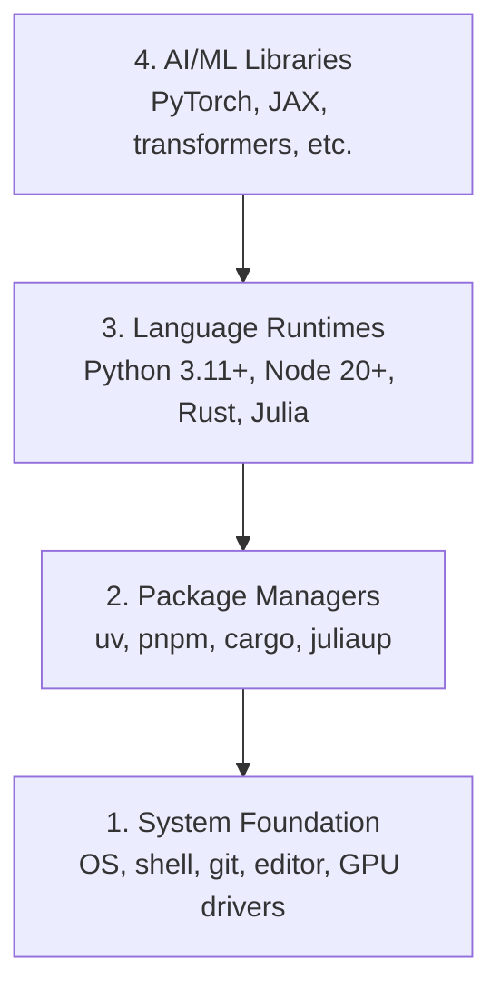

# تطوير البيئة تطوير البيئة بناء

> أدواتك تشكل تفكيرك، قم بتنظيمها مرة واحدة، قم بتنظيمها بشكل صحيح.

> **【中文解读】**أدائك تشكل فكرتك مرة واحدة، فان العمل دائما. هذا الفصل هو نقطة البدء في الدورة بأكملها: سوف تقوم ببناء مجموعة كاملة من البيئة التطوير المهنية الذكرية.

**Type:** Build | **类型:** 构建
**Languages:** Python, Node.js, Rust | **语言:** Python, Node.js, Rust
**Prerequisites:** None | **前置知识:** 无
**Time:** ~45 minutes | **时间:** ~45 分钟

## أهداف التعلم

- قم بتعيين Python 3.11+، Node.js 20+، و Rust من الصفر
  中文翻译: از零搭建 Python 3.11+、Node.js 20+ 和 Rust 工具链
- تكوين بيئات افتراضية ومديري الحزم للمبنيات المتكملة
  中文翻译:配置虚拟环境和包管理器, ضمان بناء قابلة للتأثير
- التحقق من وصول GPU مع CUDA / MPS وإجراء عملية اختبار التنسور
  中文翻译:验证 GPU(CUDA/MPS) هل可用,运行测试张量运算
- فهم كومة أربع طبقات: النظام، الحزم، أوقات تشغيل، مكتبات الذكاء الاصطناعي
  中文翻译:理解四层技术:系统层、包管理器层、语言运行时层、AI库层

## المشكلة

أنت على وشك تعلم هندسة الذكاء الاصطناعي عبر 500 دروس تستخدم بايثون، الكتابة النمطية، الخرق، وجوليا. إذا تم تدمير بيئتك، كل دروس واحد يصبح معركة ضد الأدوات بدلا من التعلم.

> ستمر عبر 500 درس أكثر من تعلم إصلاح الذكاء الاصطناعي، وتطوير، يتعلق بـ Python ‬TypeScript ‬Rust و Julia‬‬‬‬‬‬‬‬‬‬‬‬‬‬‬‬‬‬‬‬‬‬‬‬‬‬‬‬‬‬‬‬‬‬‬‬‬‬‬‬‬‬‬‬‬‬‬‬‬‬‬‬‬‬‬‬‬‬‬‬‬‬‬‬‬‬‬‬‬‬‬‬‬‬‬‬‬‬‬‬‬‬‬‬‬‬‬‬‬‬‬‬‬‬‬‬‬‬‬‬‬‬‬‬‬‬‬‬‬‬‬‬‬‬‬‬‬‬‬‬‬‬‬‬‬‬‬‬‬‬‬‬‬‬‬‬‬‬‬‬‬‬‬‬‬‬‬‬‬‬‬‬‬‬‬‬‬‬‬‬‬‬‬‬‬‬‬‬‬‬‬‬‬‬‬‬‬‬‬‬‬‬‬‬‬‬‬‬‬‬‬‬‬‬‬‬‬‬‬‬‬‬‬‬‬‬‬‬‬‬‬‬‬‬‬‬‬‬‬‬‬‬‬‬‬‬‬‬‬‬‬‬‬‬‬‬‬‬‬‬‬‬‬‬‬‬‬‬‬‬‬‬‬‬‬‬‬‬‬‬‬‬‬‬‬‬‬‬‬‬‬‬‬‬‬‬‬‬‬‬‬‬‬‬‬‬‬‬‬‬‬‬‬‬‬‬‬‬‬‬‬‬‬‬‬‬‬‬‬‬‬‬‬‬‬‬‬‬‬‬‬‬‬‬‬‬‬‬‬‬‬‬‬‬‬‬‬‬‬‬‬‬‬‬‬‬‬‬‬‬‬‬‬‬‬‬‬‬‬‬‬‬‬‬‬‬‬‬‬‬‬‬‬‬‬‬‬‬‬‬‬‬‬‬‬‬‬‬‬‬‬‬‬‬‬‬‬‬‬‬‬‬‬‬‬‬‬‬‬‬‬‬‬‬‬‬‬‬‬‬‬‬‬‬‬‬‬‬‬‬‬‬‬‬‬‬‬‬‬‬‬‬‬‬‬‬‬‬‬‬‬‬‬‬‬‬‬‬‬‬‬‬‬‬‬‬‬‬‬‬

معظم الناس يخطون إعداد البيئة ثم يقضون ساعات في تحليل أخطاء الاستيراد، نزاعات الإصدارات، ووقودات CUDA المفقودة. سنقوم بهذا مرة واحدة، بشكل صحيح.

> أغلب الناس يخطون البيئة المُبنية.. ثم يضعون ساعات قليلة في التجربة على إدخال الصدمات والخطاءات..

> **【中文解读】**
> مشكلة البيئة هي السبب الأساسي لخطأ الاستيراد، والخطأ الإصداري، والخطأ الأساسي لخطأ الإصدار، والخطأ الأساسي لخطأ الإصدار، والخطأ الأساسي لخطأ الإصدار، والخطأ الأساسي لخطأ الإصدار، والخطأ الأساسي لخطأ الإصدار، والخطأ الأساسي لخطاء الإصدار، والخطاء الأساسي لخطاء الإصدار، والخطاء الأساسي لخطاء الإصدار، والخطاءات.

## المفهوم الأساسي

بيئة هندسة الذكاء الاصطناعي لديها أربع طبقات:

> البيئة المهنية الذكية لديها أربع مستويات:



نضع من أسفل إلى أعلى كل طبقة تعتمد على الطبقة التي تحتها

> نحن نضع كل طبقة تحتها

> **【中文解读】**
> بيئة المهندسية الذكاء الاصطناعي هي أربع مستويات من الكيمبيتات: أدناه هي النظام التشغيلي والقوة، والعلى هي المدير الحزمي، والعلى هو اللغة التي تعمل، والعلى المستوى هو PyTorch ‧ المحولات وغيرها من المختلفات الذكاء الاصطناعية ‧ التثبيت ‧ التثبيت ‧ التثبيت ‧ التثبيت ‧ التثبيت ‧ التثبيت ‧ التثبيت ‧ التثبيت ‧ التثبيت ‧ التثبيت ‧ التثبيت ‧ التثبيت ‧ التثبيت ‧ التثبيت ‧ التثبيت ‧ التثبيت ‧ التثبيت ‧ التثبيت ‧ التثبيت ‧ التثبيت ‧ التثبيت ‧ التثبيت ‧ التثبيت ‧

> **【拓展：为什么需要 uv 而不是 pip？】**
> ففي المشاريع الفعلية لذكاء الاصطناعي، يمكنك الحفاظ على العديد من المشاريع في الوقت نفسه على الاعتماد على ذلك، مثل واحد باستخدام PyTorch 2.1، والآخر باستخدام 2.4), فيمكنك جعل الانفصال البيئي بسيط جدا.
```figure
s0-env-stack
```

## بناءه بيد بناءه

> **【中文解读】**تليها الخطوات على "من القاع إلى القمة" بالترتيب تثبيت أدوات أربع طوابق ── كل خطوة يمكن نقلها مباشرة وتلصقها إلى المحطة التنفيذ── إذا كنت تستخدم ويندوز، نوصي باستخدام WSL2 ((نظام ويندوز الفرعي للينكس) للحصول على لينكس 环境──

### الخطوة الأولى: أساس النظام.

تحقق من نظامك ووضع الأساسيات

> 检查你的系统并安装基础工具──

```bash
# macOS
xcode-select --install
brew install git curl wget

# Ubuntu/Debian
sudo apt update && sudo apt install -y build-essential git curl wget

# Windows (use WSL2)
wsl --install -d Ubuntu-24.04
```

### الخطوة الثانية: Python مع uv.

نحن نستخدم`uv` هو 10-100x أسرع من البوابة ويعالج البيئات الافتراضية تلقائيا.

> نحن نستخدم`uv`إنه أسرع من 10-100 مرة من البايب، ويمكن أن تسيطر تلقائيا على البيئة الافتراضية‬

> **【拓展：Python 版本选择】**推 Python 3.12( مستقر وتحسين الأداء)。3.11+ قد يكون، ولكن لتجنب 3.13( الجزء من AI 库 قد لا يكون معدل)。`python install`سوف نستعمل النسخة Python  إصدار، لم تعد بحاجة إلى pyenv.

```bash
curl -LsSf https://astral.sh/uv/install.sh | sh

uv python install 3.12

uv venv
source .venv/bin/activate  # or .venv\Scripts\activate on Windows

uv pip install numpy matplotlib jupyter
```

التحقق من:

> 验证安装:

```python
import sys
print(f"Python {sys.version}")

import numpy as np
print(f"NumPy {np.__version__}")
a = np.array([1, 2, 3])
print(f"Vector: {a}, dot product with itself: {np.dot(a, a)}")
```

### الخطوة الثالثة: Node.js مع pnpm

> **【中文解读】**Node.js هو نوع من النسخة النسخة التشغيل البيئة.

للدرسات TypScript (وكلاء، خادمات MCP، تطبيقات الويب).

> تستخدم على نوع النص  درجة ((وكيل  MCP  الخادم  ويب  تطبيق) 

```bash
curl -fsSL https://fnm.vercel.app/install | bash
fnm install 22
fnm use 22

npm install -g pnpm

node -e "console.log('Node', process.version)"
```

**macOS / Apple Silicon (M1/M2/M3/M4):**إذا توقف التركيب عن`Error: Cannot install under Rosetta 2 in ARM default prefix (/opt/homebrew)`، محطةك تعمل تحت " روزيتا 2 "`arch`بصمات`i386`(هومبريو) هو بناء أليف أرم64، قم بتثبيت (أرم64) القسري، قم بتسجيله في قذفك، ثم قم بإعادة تشغيل الأوامر أعلاه من (أرم64).`fnm install 22`:

> **苹果芯片 Mac 用户注意**: إذا安装器报错 `Error: Cannot install under Rosetta 2 in ARM default prefix (/opt/homebrew)`، أوضح أن محركك يعمل في روزيتا 2`arch`输出 `i386`), بينما Homebrew هو أصل أسلحة64  إصدار.`fnm install 22`开始重跑 上的命令:

```bash
arch -arm64 brew install fnm
echo 'eval "$(fnm env --use-on-cd)"' >> ~/.zshrc
source ~/.zshrc
```

### الخطوة الرابعة: الخرق

للدروس الحرجة للأداء (الاضافة، الأنظمة).

> تستخدم دروس حساسة للأداء (التفكير في التأهيل والبرمجة النظامية)

> **【中文解读】**يستخدم Rust في هذا الدورة جزء حساس للأداء، مثل التفكير في تحسين ((مرحلة 12) و النظام الذاتي ((مرحلة 15-17))).

```bash
curl --proto '=https' --tlsv1.2 -sSf https://sh.rustup.rs | sh

rustc --version
cargo --version
```

### الخطوة 5: جوليا (اختياري)

لدروس الرياضيات الثقيلة حيث يضيء جوليا.

> يستخدمها في دروس رياضيات كثيفة

```bash
curl -fsSL https://install.julialang.org | sh

julia -e 'println("Julia ", VERSION)'
```

### الخطوة 6: إعداد GPU (إذا كان لديك واحد)

**NVIDIA (Linux / Windows):**

> **【中文解读】**NVIDIA 显卡先用 `nvidia-smi`确认驱动正常,再安装 CUDA 版 PyTorch;果芯片 Mac 没有 CUDA 属正常现象直接装默认版 PyTorch(内置 MPS/Metal 后端) 即可,不要传 `--index-url .../cuXXX`(هذه العجلات تدعم فقط لينكس ويندوز، تم إصلاحها)

```bash
nvidia-smi

# Install PyTorch with CUDA
uv pip install torch torchvision torchaudio --index-url https://download.pytorch.org/whl/cu124
```

**macOS / Apple Silicon (M1/M2/M3/M4):**لا يوجد أي "كودا" على "ماك" متوقعة، لا فشل.**not**مرر`--index-url .../cuXXX`(هذه العجلات هي لينكس ويندوز فقط، لذلك فشل التثبيت). قم بتثبيت البناء العادي، الذي يتضمن MPS (المعدل) GPU الخلفي من آبل:

> **macOS / 苹果芯片（M1/M2/M3/M4）**: ماك 上 بدون CUDA هذا هو التوقعات، ليس故障‬‬‬‬‬‬‬‬‬‬‬‬‬‬‬‬‬‬‬‬‬‬‬‬‬‬‬‬‬‬‬‬‬‬‬‬‬‬‬‬‬‬‬‬‬‬‬‬‬‬‬‬‬‬‬‬‬‬‬‬‬‬‬‬‬‬‬‬‬‬‬‬‬‬‬‬‬‬‬‬‬‬‬‬‬‬‬‬‬‬‬‬‬‬‬‬‬‬‬‬‬‬‬‬‬‬‬‬‬‬‬‬‬‬‬‬‬‬‬‬‬‬‬‬‬‬‬‬‬‬‬‬‬‬‬‬‬‬‬‬‬‬‬‬‬‬‬‬‬‬‬‬‬‬‬‬‬‬‬‬‬‬‬‬‬‬‬‬‬‬‬‬‬‬‬‬‬‬‬‬‬‬‬‬‬‬‬‬‬‬‬‬‬‬‬‬‬‬‬‬‬‬‬‬‬‬‬‬‬‬‬‬‬‬‬‬‬‬‬‬‬‬‬‬‬‬‬‬‬‬‬‬‬‬‬‬‬‬‬‬‬‬‬‬‬‬‬‬‬‬‬‬‬‬‬‬‬‬‬‬‬‬‬‬‬‬‬‬‬‬‬‬‬‬‬‬‬‬‬‬‬‬‬‬‬‬‬‬‬‬‬‬‬‬‬‬‬‬‬‬‬‬‬‬‬‬‬‬‬‬‬‬‬‬‬‬‬‬‬‬‬‬‬‬‬‬‬‬‬‬‬‬‬‬‬‬‬‬‬‬‬‬‬‬‬‬‬‬‬‬‬‬‬‬‬‬‬‬‬‬‬‬‬‬‬‬‬‬‬‬‬‬‬‬‬‬‬‬‬‬‬‬‬‬‬‬‬‬‬‬‬‬‬‬‬‬‬‬‬‬‬‬‬‬‬‬‬‬‬‬‬‬‬‬‬‬‬‬‬‬‬‬‬‬‬‬‬‬‬‬‬‬‬‬‬‬‬‬‬‬‬‬‬‬‬‬‬‬‬‬‬‬‬‬‬‬‬‬‬‬‬‬‬‬‬‬‬‬‬‬‬‬‬‬‬‬‬‬‬‬‬‬‬‬‬‬‬‬‬‬‬‬‬`--index-url .../cuXXX`(تلك العجلات الحصرية لينكس/وينودز،传传传了安装会失败)

```bash
uv pip install torch torchvision torchaudio
```

التحقق (يعمل على أي منصة):

> 验证(任意平台通用):

```python
import torch
print(f"CUDA available: {torch.cuda.is_available()}")           # False on macOS — expected
print(f"MPS available:  {torch.backends.mps.is_available()}")   # True on Apple Silicon
if torch.cuda.is_available():
    print(f"GPU: {torch.cuda.get_device_name(0)}")
```

لا يوجد نظام معين للكمبيوترات (GPU) ؟ لا مشكلة. معظم الدروس تعمل على جهاز معين للكمبيوترات (CPU).

> 没有GPU?没关系── معظم الدورات يمكن أن تعمل على CPU── دروس كبيرة من التدريب يمكن استخدامها مع Google Colab أو GPU云端──

> **【拓展：GPU vs CPU 性能对比】**訓練 GPT-2 small(117M 参数):CPU 约 7 天,单块 RTX 3090 约 3 小时,A100 约 40 分钟──推理阶段差距略小但仍然显著──本课程大部分课程可以用CPU 跑,只有阶段10(从零训练LLM)等少数课程建议使用GPU──

> **【拓展：GPU 在 AI 中的作用】**
> GPU(معدل الرسومات) لانه لا غياب في الذكاء الاصطناعي، لأنه يمكن أن تقوم في نفس الوقت بآلاف الملايين من الحسابات البسيطة(并行计算) ―― تدريب محول 模型 على CPU قد يستغرق عدة أسابيع، على GPU على GPU فقط تستغرق عدة ساعات.

### الخطوة السابعة: تأكد من الطريق الذي تريد أن تبدأ به

إشغال كل أمر في هذا الدروس من جذور مخزن، المجلد الذي
يحتوي على`README.md`و`phases/`قبل الرحلة يُفحص فقط ما تحتاج إليه
يبدأ الطريق المحدد. يفرض أدوات لاحقة بشكل افتراضي حتى يرى المتعلم الجديد
رد واضح بدلاً من جدار من التحذيرات

> كل أوامر هذا المرحلة موجودة في قائمة المخزن`README.md`和 `phases/`المخططات المستخدمة فقط هي الوسائل التي يستخدمها المبتدئون لمشاهدة النتيجة الواضحة بدلاً من تحذير كامل.

ابدأ سلسلة المبتدئين الكاملة:

> 启动完整的初学者序列:

```bash
python3 phases/00-setup-and-tooling/01-dev-environment/code/verify.py --route beginner
```

أو تحقق فقط من الطريق الذي تريده:

> أو فقط تحقق من طريقك لتعلم:

```bash
python3 phases/00-setup-and-tooling/01-dev-environment/code/verify.py --route ml-foundations
python3 phases/00-setup-and-tooling/01-dev-environment/code/verify.py --route llm-engineering
python3 phases/00-setup-and-tooling/01-dev-environment/code/verify.py --route agents
python3 phases/00-setup-and-tooling/01-dev-environment/code/verify.py --route mcp
python3 phases/00-setup-and-tooling/01-dev-environment/code/verify.py --route agent-skills
python3 phases/00-setup-and-tooling/01-dev-environment/code/verify.py --route certification
```

إضافة`--show-later`عندما تريد نفس التحقيق قبل الرحلة للتفتيش الأدوات الاختيارية
و الاعتماد المستخدمة في الدروس اللاحقة.
الطريق المختار.

> 想让预检同时检查后课程将使用可选工具和依赖时,加上 `--show-later` أدوات لاحقية من غياب لن تعيقك أبداً في طريقك الراهن

كل عملية فاشلة مطلوبة تتضمن المسار المكتشف أو خطأ الاستيراد
القيادة التصحيحية الدقيقة. مهارات العميل وطرق الشهادة أيضاً
التحقق من المضيف اليدوي لأن نص Python لا يمكن أن يثبت أن المضيف AI
اكتشفت مهارة أو أن المهارات التي اخترتها قابلة للكتابة

> كل عملية فاشلة من المطلوبات التفتيشية سوف تكون معلقة مع طريق التفتيش أو إدخال خطأ، فضلا عن أمر تحديث محدد.

عندما يمر المبتدئ قبل الرحلة، فإنه يطبخ الدروس الأولى الدراسة:

> عندما يمر المبتدئين، فإن الكتاب سوف يطبق أول دراسة قابلة للتطبيق:

```text
Ready to start Beginner course.
Next: python3 phases/01-math-foundations/01-linear-algebra-intuition/code/vectors.py
```

> **【中文解读】**预检脚本是"按路线最小环境" فلسفية落地: مبتدئ فقط بحاجة إلى Python 和 Git,ml-foundations 再加 NumPy,agents/mcp 路线连 Node 都可以先不装用到再装`python3`换成 `python`-إلى ماذا؟

## استخدمها باستخدام القائمة

> **【中文解读】**يخبرك جدول أسفل كل لغة في أي مراحل تستخدمها. الغاز هو القوة الرئيسية المطلقة. مرحلة 1-12، النمط المستخدم للعميل وسلسلة الأدوات. مرحلة 13-17، الروست تستخدم لمشهد عالية الأداء. جوليا تستخدم للحساب الرياضي.

بيئتك جاهزة لبدء المسار الذي تحققت منه
عندما يطلب الدروس منهم بدلاً من حظر دروسك الأولى على الإطلاق
هنا ما ستستخدمه في جميع أنحاء المناهج الدراسية:

> يمكن أن تبدأ دراستك في التحقق من بيئةك. أدوات أخرى، وذلك حتى تستخدم الدورة، لا تدع كل التكنولوجيا تعيق دراستك الأولى.

| Language | Used In | Package Manager |
|----------|---------|-----------------|
| Python | Phases 1-12 (ML, DL, NLP, Vision, Audio, LLMs) | uv |
| TypeScript | Phases 13-17 (Tools, Agents, Swarms, Infra) | pnpm |
| Rust | Phases 12, 15-17 (Performance-critical systems) | cargo |
| Julia | Phase 1 (Math foundations) | Pkg |

| 语言 | 用在哪些阶段 | 包管理器 |
|------|------------|---------|
| Python | 阶段 1-12（ML、DL、NLP、视觉、音频、LLM） | uv |
| TypeScript | 阶段 13-17（工具、Agent、集群、基础设施） | pnpm |
| Rust | 阶段 12, 15-17（高性能系统） | cargo |
| Julia | 阶段 1（数学基础） | Pkg |

## أرسلها .

> **【拓展：环境检查 Prompt】** `outputs/prompt-env-check.md`هو عرض يمكن أن يُعطى مباشرةً لمساعد الذكاء الاصطناعي، فليساعدك على تشخيص مشاكل بيئية. في العمل العملي، هذا النوع من "مطار التحقق الذاتي البيئي" مفيد جداً. تحتاج فقط إلى إرسال تقرير خاطئ إليه، فإنه يتحمل القدرة على تحديد المشاكل.

هذا الدروس ينتج نص التحقق يمكن لأي شخص تشغيله للتحقق من إعداداتهم.

> هذا المنتج هو كتاب إثبات، يمكن لأي شخص أن يستخدمها للتحقق من إعداد بيئي الخاص به.

انظر`outputs/prompt-env-check.md`لمستشارات تساعد مساعدات الذكاء الاصطناعي على تشخيص مشاكل البيئة

> 参见 `outputs/prompt-env-check.md`، والتي تتضمن مساعدة AI مساعد تشخيص البيئة المشكلة السريعة.

## تمارين التدريب

1. إشغال النص التحقق وإصلاح أي أخطاء
   运行验证脚本并修复所有失败的检查项
2. قم بإنشاء بيئة افتراضية Python لهذا الدورة و قم بتثبيت PyTorch
   لأجل هذا البرنامج إنشاء Python  الظروف الافتراضية ووضع PyTorch
3. اكتب "مرحباً للعالم" بكلّ الألغات الأربعة و إشغلي كلّها
   "بإستخدام أربعة لغات" "كتابة "مرحبا للعالم"
