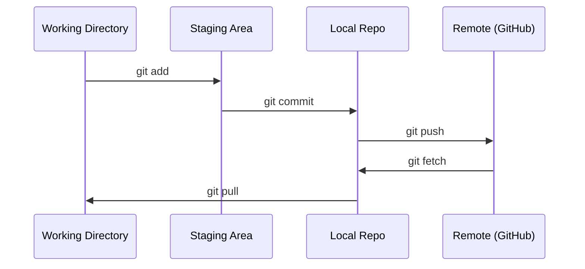

# التعاون و التعاون

> التحكم في الإصدار ليس اختيارياً كل تجربة، كل نموذج، كل درس تقوم بناؤه هنا يتم تتبعه
> التحكم في الإصدار ليس ممكناً.. كل تجربة لديك.. كل نموذج.. كل حصة من الدروس سوف تتبع

**Type:** Learn | **类型:** 学习
**Languages:** -- | **语言:** 无
**Prerequisites:** Phase 0, Lesson 01 | **前置知识:** Phase 0, 第 01 课
**Time:** ~30 minutes | **时间:** ~30 分钟

## أهداف التعلم

- قم بتهيئة هوية git واستخدام سير العمل اليومي لإضافة، إلتزام، ودفع
  中文翻译: تكوين Git 身份信息, إتقان إضافة     push 的日常工作流
- إنشاء ودمج فروع للتجارب المعزولة دون كسر الرأس
  ترجمة باللغة الصينية: إنشاء و المشاركة في التفريق، تحقيق تجربة الانفصال دون تدمير التفريق الرئيسي
- اكتب`.gitignore`لا تستثني نقاط التفتيش النموذجية والملفات الثنائية الكبيرة
  中文翻译:编写 `.gitignore`文件,排除模型检查点和大文件
- التنقل في تاريخ الإجراءات مع `git log`لفهم تطور المشروع
  中文翻译:用 `git log`浏览提交历史,了解项目演进过程

> **【中文解读】**
> غيت هو أداة تحكم الإصدار، لمتابعة كل تعديل للرمز. في مشروعات الذكاء الاصطناعي، سوف تقوم في التجربة باستمرار بتعديل عناصر النموذج والرمز، غيت تسمح لك بالعودة إلى أي حالة من قبل.

> **【拓展：Git 在 AI 工程中的角色】**التطوير المعرفي المعماري والقليدي للبرمجيات مختلفة كل تجربة 超参数调整、数据集变更) كلها "إصدار" مع Git 追踪实验 يعني: نتائج التدريب تغيرت، يمكنك `git diff`أجد ما تغيره، نموذج نشر المشاكل، يمكن`git revert`回滚──大模型团队 (مثلاً Hugging Face) التعاونية تتم بناءها بالكامل على Git.

## المشكلة

أنت على وشك كتابة مئات ملفات رمزية عبر 20 مرحلة بدون التحكم في النسخة ستفقد العمل وتكسر الأشياء التي لا تستطيع إعادة إصلاحها،

> سوف تكتب مئات الملفات المشفرة خلال 20 مرحلة. بدون إصدار تحكم، سوف تفقد نتائج العمل.

غيت هي الأداة. غيت هوب هو حيث يعيش البرمجة. هذا الدروس يغطي ما تحتاجه لهذا الدورة ولا شيء آخر.

> غيت هو أداة، غيت هوب هو مكان إدارة الكود.

> **【中文解读】**
> ستكتب مئات الملفات المشفرة، بدون أي إصدارات تحت السيطرة = 随时可能失去工作成果、无法回归、无法协作──Git 解决这个问题──

## المفهوم الأساسي



ثلاثة أشياء يجب أن نتذكرها:
1. إدخار في كثير من الأحيان (`git commit`)
2. اضغط على جهاز التحكم عن بعد (`git push`)
3. فرع التجارب (`git checkout -b experiment`)

> يجب أن نتذكر ثلاثة أشياء:
> 1. 经常保存(`git commit`)
> 2. 推送到远程(`git push`)
> 3. 用分支做实验(`git checkout -b experiment`)

> **【中文解读】**
> Git's核心流程:工作目录 → 暂存区(git add)→ 本地仓库(git commit)→ 远程仓库(git push) ・・・记住三件事:经常提交、推送到远程、用分支做实验──

> **【拓展：分支策略与 AI 实验】**AI  المشاريع تقديم "في تجربة واحدة分支" استراتيجية:`experiment/lr-0.001`.`experiment/add-dropout`等── هكذا كل تجربة من الكود تغيرت كل ما تم فصلها، تجربة فشل مباشرة حذف分支، نجاح إذا تم التجمع.`v1.0-baseline`),方便部署时精确指定代码版本──

## بناء ذلك تحرك لتحقيق
```figure
s0-commit-dag
```

## بناءها

### الخطوة 1: إعداد git

> 第1步: إعداد Git

```bash
git config --global user.name "Your Name"
git config --global user.email "you@example.com"
```

### الخطوة الثانية: سير العمل اليومي

```bash
git status                              # 查看哪些文件有改动
git add file.py                         # 把改动加入暂存区
git commit -m "Add perceptron implementation"  # 提交到本地仓库
git push origin main                    # 推送到 GitHub 远程仓库
```

### الخطوة الثالثة: التفريق للتجارب باستخدام التفريق في التجارب

```bash
git checkout -b experiment/new-optimizer  # 创建并切换到新分支

# ... make changes, commit ...  # 在新分支上修改和提交，不影响主分支

git checkout main                         # 切回主分支
git merge experiment/new-optimizer        # 把实验分支的改动合并到主分支
```

### الخطوة الرابعة: العمل مع هذا الدورة الإستعمارية الخطوة الرابعة: استخدام مخزن الدورة

> **【拓展：Fork vs Clone】**إذا كنت تريد حفظ تقدم التعلم الخاص بك دون التأثير على المستودع الأصلي، استخدم`fork`(على GitHub 上操作) بدلا من النسخة المنسخة مباشرة. بعد ذلك لديك نسخة كاملة من نفسك، يمكن تقديمها بحرية.

لا يمكنك دفع إلى إعادة التطبيق في نفس الدورة  فقط الحافظين لديهم إمكانية الوصول إلى الكتابة. فوكه على GitHub أولا (حافظة الزر، أعلى اليمين) لذلك `origin`النصوص الخاصة بك:

```bash
git clone https://github.com/YOUR-USERNAME/ai-engineering-from-scratch.git
cd ai-engineering-from-scratch

git checkout -b my-progress
# work through lessons, commit your code
git push origin my-progress
```

## استخدمها باستخدام القائمة

> **【拓展：.gitignore 在 AI 项目中至关重要】**AI  المشاريع ستخلق الكثير من الملفات التي لا يجب تقديمها`.pt`.`.safetensors`                                                                                                                                                                                                                                                              `__pycache__`.`.venv`. . . . . . . . . . . . . . . . . . . . . . . . . . . . . . . . . . . . . . . . . . . . . . . . . . . . . . . . . . . . . . . . . . . . . . . . . . . . . . . . . . . . . . . . . . . . . . . . . . . . . . . . . . . . . . . . . . . . . . . . . . . . . . . . . . . . . . . . . . . . . . . . . . . . . . . . . . . . . . . . . . . . . . . . . . . . . . . . . . . . . . . . . . . . . . . . . . . . . . . . . . . . . . . . . . . . . . . . . . . . . . . . . . . . . . . . . . . . . . . . . . . . . . . . . . . . . . . . . . . . . . . . . . . . . . . . . . . . . . . . . . . . . . . . . . . . . . . . . . . . . . . . . . . . . . . . . . . . . . . . . . . . . . . . . . . . . . . . . . . . . . . . . . . . . . . . . . . . . . . . . . . . . . . . . . . . . . . . . . . . . . . . . . . . . . . . . . . . . . . . . . . . . . . . . . . . . . . . . . . . . . . . . . . . . . . . . . . . . . . . . . . . . . . . . . . . . . . . . . . . . . . . . . . . . . . . . . . . . . . . . . . . . . . . . . . . . . . . . . . . . . . . . . . . . .`.gitignore`能防止你意外把10GB من الملفات النموذجية إلى GitHub──推使用 `gitignore.io`生成 Python/ML 项目的模板。

لهذا المسار، تحتاج بالضبط إلى هذه الأوامر:

> في هذه الدورة تحتاج فقط إلى هذه الأوامر:

| Command | When |
|---------|------|
| `git clone` | Get the course repo |
| `git add` + `git commit` | Save your work |
| `git push` | Back it up to GitHub |
| `git checkout -b` | Try something without breaking main |
| `git log --oneline` | See what you've done |

| 命令 | 什么时候用 |
|------|-----------|
| `git clone` | 下载课程仓库 |
| `git add` + `git commit` | 保存你的工作 |
| `git push` | 备份到 GitHub |
| `git checkout -b` | 安全地尝试新想法 |
| `git log --oneline` | 查看你做了什么 |

هذا كل شيء، لا تحتاج إلى إعادة التأثير أو إعادة التأهيل أو وحدات فرعية لهذا الدورة

> على هذه. هذا الدراسة لا تحتاج إلى قاعدة إعادة التدريب أو اختيار الكرز أو وحدات فرعية.

## تمارين التدريب

1. قم بتكرار هذا الإستعمال، وإنشاء فرع يدعى`my-progress`, إصنع ملفاً , إلتزامها , إدفعها
   克隆仓库,创建 `my-progress`分支,新建文件,提交并推送
1. إزداد هذا الإستعراض، قم بتخصيص الشوكة، وإنشاء فرع يدعى`my-progress`, إصنع ملفاً , إلتزامها , إدفعها
2. إخلق`.gitignore`التي تستبعد ملفات النموذجية لمواقع التفتيش (`.pt`،`.pth`،`.safetensors`)
    إقامة `.gitignore`文件,排除模型检查点文件
3. انظر تاريخ التزامات هذا الإنتقال مع`git log --oneline`وقرأ كيف تم إضافة الدروس
   استخدام`git log --oneline`انظر إلى تقديم التاريخ، معرفة كيفية بناء البرنامج خطوة بخطوة

## شروط رئيسية

> **【中文解读】**التزام ((مقدم) = 项目快照,شروع (分支) = 独立开发线,Merge (分支) = وضع (分支) 改动合回来,Remote (远程) = مستودع (副本) 

| Term | What people say | What it actually means |
|------|----------------|----------------------|
| Commit | "Saving" | A snapshot of your entire project at a point in time |
| Branch | "A copy" | A pointer to a commit that moves forward as you work |
| Merge | "Combining code" | Taking changes from one branch and applying them to another |
| Remote | "The cloud" | A copy of your repo hosted somewhere else (GitHub, GitLab) |

| 术语 | 俗称 | 实际含义 |
|------|------|---------|
| Commit | "保存" | 项目在某一时刻的完整快照 |
| Branch | "副本" | 指向某个提交的可移动指针，随工作向前推进 |
| Merge | "合并代码" | 将一个分支的改动应用到另一个分支 |
| Remote | "云端" | 托管在其他地方的仓库副本（如 GitHub、GitLab） |
