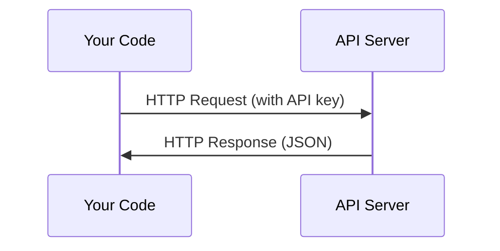

# إدارة المفاتيح و الإدارة

> كل API تعمل بنفس الطريقة: إرسال طلب، الحصول على رد. التفاصيل تتغير، النمط لا.
> جميع أجهزة إصدار الإصدارات الإلكترونية تعمل بنفس الطريقة: إرسال طلبات، الحصول على ردود فعل.

**Type:** Build | **类型:** 构建
**Languages:** Python, TypeScript | **语言:** Python, TypeScript
**Prerequisites:** Phase 0, Lesson 01 | **前置知识:** Phase 0, 第 01 课
**Time:** ~30 minutes | **时间:** ~30 分钟

## أهداف التعلم

- تخزين مفاتيح API بأمان باستخدام متغيرات البيئة و `.env`الملفات
  中文翻译: استخدام البيئة`.env`文件安全存储API 密钥
- إجراء مكالمة API LLM باستخدام كل من SDK Python Anthropic و HTTP خام
  中文翻译: استخدام أندروپي Python SDK 和原始 HTTP 两种方式调用 LLM API
- مقارنة أشكال طلب/رد HTTP القائمة على SDK والحمية للتحليل
  الصفحة الرئيسية/صفحة الرئيسية/صفحة الرئيسية/صفحة الرئيسية/صفحة الرئيسية/صفحة الرئيسية/صفحة الرئيسية/صفحة الرئيسية/صفحة الرئيسية/صفحة الرئيسية/صفحة الرئيسية/صفحة الرئيسية/صفحة الرئيسية/صفحة الرئيسية/صفحة الرئيسية/صفحة الرئيسية/صفحة الرئيسية/صفحة الرئيسية/صفحة الرئيسية/صفحة الرئيسية/صفحة الرئيسية/صفحة الرئيسية/صفحة الرئيسية/صفحة الرئيسية/صفحة الرئيسية/صفحة الرئيسية/صفحة الرئيسية/صفحة الرئيسية/صفحة الرئيسية/صفحة الرئيسية/صفحة الرئيسية/صفحة الرئيسية/صفحة الرئيسية/صفحة الرئيسية/صفحة الرئيسية/صفحة الرئيسية/صفحة الرئيسية/صفحة الرئيسية/صفحة الرئيسية/صفحة الرئيسية/صفحة الرئيسية/صفحة الرئيسية/صفحة الرئيسية/صفحة الرئيسية/صفحة الرئيسية/صفحة الرئيسية/صفحة الرئيسية/صفحة الرئيسية/صفحة الرئيسية/صفحة الرئيسية/صفحة الرئيسية/صفحة الرئيسية/صفحة الرئيسية/صفحة الرئيسية/صفحة الرئيسية/صفرد/صفة الرئيسية/صفة/صفة/صفة/صفة/صفة/صفة/صفة/صفة/صفة/صفة/صفة/صفة/صفة/صفة/صفة/صفة/صفة/صفة/صفة/صفة/صفة/صفة/صفة/صفة/صفة/صفة/صفة/صفة/صفة/صفة/صفة/صفة/صفة/صفة/صفة/صفة/صفة/صفة/صفة/صفة/صفة/صفة/صفة/صفة/صفة/صفة/صفة/صفة/صفة/صفة/صفة/صفة/صفة/صفة/صفة/صفة/صفة/
- تحديد وتعامل الأخطاء الشائعة في إطار إطار الإعدادات الإلكترونية بما في ذلك الحدود المحددة للتصديق والحدود المتعلقة بالمعدلات
  الصينية ترجمة:识别并处理常见API 错误,包括认证和限流问题

> **【中文解读】**
> جميع أساليب عمل API هي نفسها: إرسال طلبات، الحصول على ردود فعل.

## المشكلة

بدءا من المرحلة 11، ستدعون APIs LLM (Anthropic، OpenAI، Google). في المرحلة 13-16 ستقوم ببناء وكلاء يستخدمون هذه APIs في حلقات. تحتاج إلى معرفة كيفية عمل مفاتيح API، وكيفية تخزينها بأمان، وكيفية إجراء أول مكالمة API.

> من المرحلة 11  ابتداء، سوف تستخدم API LLM ((أنثروبيك 、OpenAI、Google)  في المرحلة 13-16، سوف تقوم ببناء دورة لتطبيق هذه API  تحتاج إلى معرفة كيفية عمل API 密钥  كيفية تخزين الآمن، وكيفية إنجاز أول API  استخدام‬‬‬‬‬‬‬‬‬‬‬‬‬‬‬‬‬‬‬‬‬‬‬‬‬‬‬‬‬‬‬‬‬‬‬‬‬‬‬‬‬‬‬‬‬‬‬‬‬‬‬‬‬‬‬‬‬‬‬‬‬‬‬‬‬‬‬‬‬‬‬‬‬‬‬‬‬‬‬‬‬‬‬‬‬‬‬‬‬‬‬‬‬‬‬‬‬‬‬‬‬‬‬‬‬‬‬‬‬‬‬‬‬‬‬‬‬‬‬‬‬‬‬‬‬‬‬‬‬‬‬‬‬‬‬‬‬‬‬‬‬‬‬‬‬‬‬‬‬‬‬‬‬‬‬‬‬‬‬‬‬‬‬‬‬‬‬‬‬‬‬‬‬‬‬‬‬‬‬‬‬‬‬‬‬‬‬‬‬‬‬‬‬‬‬‬‬‬‬‬‬‬‬‬‬‬‬‬‬‬‬‬‬‬‬‬‬‬‬‬‬‬‬‬‬‬‬‬‬‬‬‬‬‬‬‬‬‬‬‬‬‬‬‬‬‬‬‬‬‬‬‬‬‬‬‬‬‬‬‬‬‬‬‬‬‬‬‬‬‬‬‬‬‬‬‬‬‬‬‬‬‬‬‬‬‬‬‬‬‬‬‬‬‬‬‬‬‬‬‬‬‬‬‬‬‬‬‬‬‬‬‬‬‬‬‬‬‬‬‬‬‬‬‬‬‬‬‬‬‬‬‬‬‬‬‬‬‬‬‬‬‬‬‬‬‬‬‬‬‬‬‬‬‬‬‬‬‬‬‬‬‬‬‬‬‬‬‬‬‬‬‬‬‬‬‬‬‬‬‬‬‬‬‬‬‬‬‬‬‬‬‬‬‬‬‬‬‬‬‬‬‬‬‬‬‬‬‬‬‬‬‬‬‬‬‬‬‬‬‬‬‬‬‬‬‬‬‬‬

> **【中文解读】**
> من المرحلة 11  ابتداء، سوف تستخدم API LLM؛ المرحلة 13-16 会构建循环调用 API的代理── تحتاج أولاً إلى معرفة كيفية إدارة المفاتيح و طريقة الاستخدام الأساسية──

## المفهوم الأساسي



كل مكالمة من خلال إطار الإتصال:
1. نقطة نهاية (URL)
2. مفتاح API (تصديق)
3. هيئة الطلب (ما تريد)
4. جسم الاستجابة (ما تحصل عليه)

> كل إطار إدارة المعالجة يتضمن أربع عناصر:
> 1. 端点(URL)
> 2. API 密钥(身份认证)
> 3. رجاءً
> 4. 响应体(عودة إلى ماذا)

> **【中文解读】**
> كل مرة تطبيق API يحتوي على أربع عناصر:端点 URL、API 密钥(身份认证)、请求体(你想要什么)、响应体(返回什么)。 فهم هذا النموذج بعد ذلك، جميع API AI هي نفسها。

> **【拓展：API 在 AI Agent 中的角色】**
> الدورة الأساسية للعميل الذكاء الاصطناعي هي: تشكيل المفاوضات → استخدام API LLM → 解析响应 → 执行动作 → إعادة تشكيل API.
```figure
s0-secret-inject
```

## بناءها

## بناء ذلك تحرك لتحقيق

> **【拓展：API 密钥安全的铁律】**绝不把API key 硬编码在代码里──一旦 تم إدخالها إلى GitHub، سوف يكتشف التزحزح في غضون بضع ثوان ومستخدم مفتاحك `.env`文件 + `python-dotenv`أو نظام التشغيل تغيرات بيئة

### الخطوة الأولى: تخزين مفاتيح API بأمان

لا تضع أبداً مفاتيح API في الرمز. استخدم متغيرات البيئة.

> لا تكتب أبداً مفتاح API في الكود.

```bash
export ANTHROPIC_API_KEY="sk-ant-..."  # 设置环境变量（密钥永远不要写在代码里！）
export OPENAI_API_KEY="sk-..."
```

أو استخدم`.env`الملف (إضافة إلى `.gitignore`):

> أو استخدام `.env`文件(ذكر إضافة إلى `.gitignore`):

```
ANTHROPIC_API_KEY=sk-ant-...  # .env 文件（确保加入 .gitignore）
OPENAI_API_KEY=sk-...
```

### الخطوة الثانية: أول مكالمة API (بايتون)

```python
import os

import anthropic

client = anthropic.Anthropic()  # 自动从环境变量读取密钥

MODEL = os.environ.get("LLM_MODEL", "claude-sonnet-5")

response = client.messages.create(
    model="claude-sonnet-4-20250514",  # 指定模型
    max_tokens=256,  # 最大输出长度
    messages=[{"role": "user", "content": "What is a neural network in one sentence?"}]  # 用户消息
    model=MODEL,
    max_tokens=256,
    messages=[{"role": "user", "content": "What is a neural network in one sentence?"}]
)

print(response.content[0].text)  # 打印模型回复
```

### الخطوة الثالثة: أول اتصال مع API (TypeScript)

> **【拓展：Token 计费机制】**إيه بي الـ LLM 按token计费: كلود سونيت 约 $3/百万输入 token、$15/ مليون输出代币── واحد انجليزي单词约1.3 个代币,一个中文字约2-3 个代币──`max_tokens=256`يعني أن نموذج أكبر عدد إصدار 256 رمزة ((حوالي 200 كلمة إنجليزية)`max_tokens`هو وسيلة رئيسية لإنقاذ التكلفة
`LLM_MODEL`يختار معرف النموذج الأنفروبي ، والإعداد الافتراضي هو اسم Sonnet غير المحدد. يتابع مزودي آخرون (OpenAI ، Google ، وغيرهم) نفس نمط مفتاح بالإضافة إلى معرف النموذج ، ولكن لكل منهما SDK وندوبايت الخاص به ، وخطة طلب / رد.

### الخطوة الثالثة: الدعوة الأولى لل API (TypeScript)

```typescript
import Anthropic from "@anthropic-ai/sdk";

const client = new Anthropic();

const MODEL = process.env.LLM_MODEL ?? "claude-sonnet-5";

const response = await client.messages.create({
  model: MODEL,
  max_tokens: 256,
  messages: [{ role: "user", content: "What is a neural network in one sentence?" }],
});

console.log(response.content[0].text);
```

### الخطوة الرابعة: HTTP خام (لا SDK)

```python
import os
import urllib.request
import json

url = "https://api.anthropic.com/v1/messages"  # API 端点
headers = {
    "Content-Type": "application/json",  # 请求格式为 JSON
    "x-api-key": os.environ["ANTHROPIC_API_KEY"],  # 从环境变量读取密钥
    "anthropic-version": "2023-06-01",  # API 版本号
}
body = json.dumps({
    "model": "claude-sonnet-4-20250514",  # 模型名称
    "max_tokens": 256,  # 最大输出 token 数
    "model": os.environ.get("LLM_MODEL", "claude-sonnet-5"),
    "max_tokens": 256,
    "messages": [{"role": "user", "content": "What is a neural network in one sentence?"}],
}).encode()

req = urllib.request.Request(url, data=body, headers=headers, method="POST")  # 构造 POST 请求
with urllib.request.urlopen(req) as resp:
    result = json.loads(resp.read())  # 解析 JSON 响应
    print(result["content"][0]["text"])  # 提取并打印回复文本
```

هذا ما تفعله SDK تحت الغطاء. فهم المكالمة HTTP الخام يساعد عند إصلاح البيانات.

> هذا ما يفعله SDK على الصعيد الأساسي. فهم HTTP الأصلي يساعد على التجربة.

> **【中文解读】**
> SDK 只是对 HTTP请求的封装──理解原始 HTTP调用可以帮助你调试API问题、处理错误、甚至在 SDK 不支持的语言中调用API──

## استخدمها باستخدام القائمة

> **【中文解读】**现在不需要注册所有API──Phase 4-10 用 Hugging Face(免费),Phase 11-16 需要 Anthropic 或 OpenAI──等课程用到时再注册即可──

لهذا الطبق:

> 本课程中:

| API | When you need it | Free tier |
|-----|-----------------|-----------|
| Anthropic (Claude) | Phases 11-16 (agents, tools) | $5 credit on signup |
| OpenAI | Phase 11 (comparison) | $5 credit on signup |
| Hugging Face | Phases 4-10 (models, datasets) | Free |

| API | 何时需要 | 免费额度 |
|-----|---------|---------|
| Anthropic (Claude) | 阶段 11-16（Agent、工具） | 注册送 $5 额度 |
| OpenAI | 阶段 11（对比实验） | 注册送 $5 额度 |
| Hugging Face | 阶段 4-10（模型、数据集） | 免费 |

لا تحتاج إليهم جميعاً الآن، قم بتعيينهم عندما يتطلب ذلك الدروس

> لا تحتاج الآن لتسجيل جميع API.

## أرسلها .

> **【拓展：429 限流处理】**调用 LLM API 时最常见的错误是 429 Rate Limit──处理方式:指数退避重试(等 1s → 2s → 4s → 8s)──Anthropic SDK 内置自动重试,但理解原理很重要在实际代理系统中,你可能需要自己实现限制流逻辑来控制成本和避免被封闭──

هذا الدرس ينتج عن:
- `outputs/prompt-api-troubleshooter.md`- تشخيص أخطاء API الشائعة

> 本课产出:
> - `outputs/prompt-api-troubleshooter.md`- 诊断常见 API 错误的提示

## تمارين التدريب

1. احصل على مفتاح API الأنثروبيك وجعل أول مكالمة API
   الحصول على API الأنثروبية 密钥,完成 your first API 调用
2. جرب النسخة الخامة HTTP ومقارنة تنسيق الاستجابة إلى النسخة SDK
   尝试原始 HTTP 方式调用 , مقابل صيغة الرد على SDK 方式
3. استخدم عمدا مفتاح API خاطئ وقراءة رسالة الخطأ
   بسبب استخدام خطأ API 密钥, قراءة معلومات خاطئة

## شروط رئيسية

| Term | What people say | What it actually means |
|------|----------------|----------------------|
| API key | "Password for the API" | A unique string that identifies your account and authorizes requests |
| Rate limit | "They're throttling me" | Maximum requests per minute/hour to prevent abuse and ensure fair usage |
| Token | "A word" (in API context) | A billing unit: input and output tokens are counted and charged separately |
| Streaming | "Real-time responses" | Getting the response word by word instead of waiting for the full response |

| 术语 | 俗称 | 实际含义 |
|------|------|---------|
| API key | "API 密码" | 标识你账户并授权请求的唯一字符串 |
| Rate limit | "被限流了" | 每分钟/小时的请求上限，防止滥用 |
| Token | "词"（API 语境） | 计费单位：输入和输出 token 分别计费 |
| Streaming | "实时响应" | 逐词返回响应，而非等待完整响应 |
