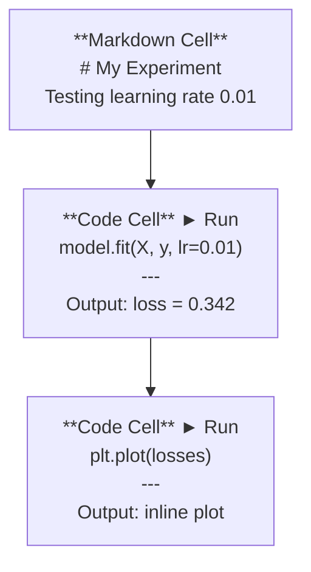
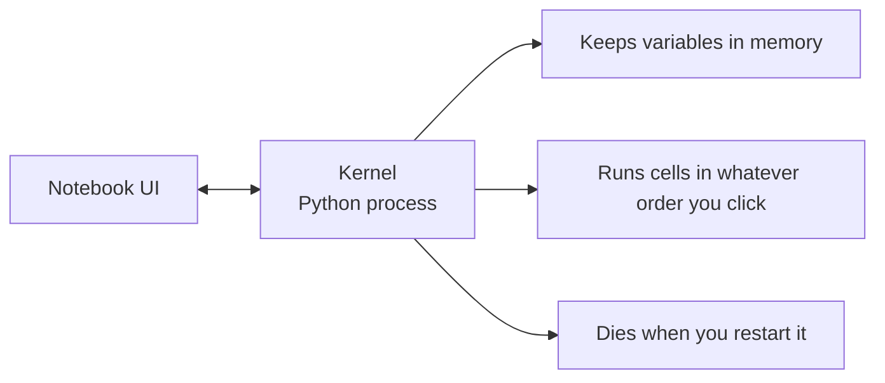

# كتيبات جوبيتر جوبيتر 笔记本

> أجهزة المكتب الملاحظة هي مقعد المختبر لمهندسة الذكاء الاصطناعي. أنت تقوم بتصميم أول نموذج هنا، ثم نقلب ما يعمل إلى الإنتاج.
> 笔记本 工程的实验工作台――أنت هنا تقوم بالتجربة الأصلية، ثم تضع الجزء الفعال في الإنتاج―

**Type:** Build | **类型:** 构建
**Languages:** Python | **语言:** Python
**Prerequisites:** Phase 0, Lesson 01 | **前置知识:** Phase 0, 第 01 课
**Time:** ~30 minutes | **时间:** ~30 分钟

## أهداف التعلم

- تثبيت وإطلاق JupyterLab، Jupyter Notebook، أو VS Code مع تمديد Jupyter
  中文翻译:安装并启动 JupyterLab、Jupyter Notebook 或带 Jupyter 扩展的 VS Code
- استخدم الأوامر السحرية (`%timeit`،`%%time`،`%matplotlib inline`) لتقييم الموازنة وتصور الخطوط الداخلية
  中文翻译: استخدام魔术命令`%timeit`.`%%time`.`%matplotlib inline`) إجراء اختبار الأساسية والإثبات
- تمييز بين متى تستخدم المكتبات الملاحظة مقابل النصوص وتطبيق سير العمل "استكشاف في المكتبات الملاحظة، شحن في النصوص"
  中文翻译:区分何时用笔记本何时用脚本,实践行"笔记本中探索、脚本中部署"的工作流
- تحديد وتجنب فخ المكتبات المكتوبة الشائعة: التنفيذ خارج النظام، الحالة الخفية، وتسربات الذاكرة
  中文翻译:识别并避免笔记本常见陷:乱序执行、隐藏状态和内存泄漏

> **【中文解读】**
> يوبيتر المذكرة هو "مختبر العمل" المهندس الذكاء الاصطناعي. يمكنك فيها تدريجياً تشغيل الكود.`.py`脚本中部署。

## المشكلة

كل ورقة الذكاء الاصطناعي، والدروسات، والمسابقات كاجل تستخدم كابينة ملاحظة جوبيتر. يسمحون لك بتشغيل الكود في قطع، ورؤية الخروقات في خط، ومزيج الكود مع التفسيرات، وتكرار بسرعة. إذا حاولت تعلم الذكاء الاصطناعي دون كابينة ملاحظة، كنت تفعل واجبات رياضية دون رسالة خدش.

> 几乎所有 AI 论文、教程和 Kaggle 比赛都使用 Jupyter Notebook──它让你分段运行代码、内嵌查看输出、混合代码和文字说明、快速代──如果没有笔记本学 AI,就像没有草稿纸做数学作业──

لكن المكتبات لديها فخ حقيقية الناس يستخدمونها لكل شيء بما في ذلك الأشياء التي هم فظيعون فيها معرفة متى تستخدم المكتبة ومتى تستخدم السيناريو سوف تنقذك من إصلاح الكوابيس في وقت لاحق

> لكن هناك أيضاً عواقب حقيقية في استخدام الكمبيوتر، بما في ذلك ما لا ينجح فيه، ويعرفون متى يستخدمون الكمبيوتر، وماذا يستخدمون الكمبيوتر، ويمكن أن يمنعك من التجربة في الأيام الأخيرة.

> **【中文解读】**
> المذكرة هي أداة قياسية في مجال الذكاء الاصطناعي، ويعمل عليها جميع المقالات والمقالات تقريباً. ولكن لديها أيضاً عواقب: التنفيذ غير المفروض، الحالة المخفية، وتسريب الذاكرة.

## المفهوم الأساسي

دفتر ملاحظات هو قائمة من الخلايا. كل خلية هي إما رمز أو نص.

> 笔记本由一系列"单元格"组成, كل单元格要么是代码,要么是文本.



النواة هي عملية بيثون تعمل في الخلفية. عندما تقوم بتشغيل خلية، فإنها ترسل الرمز إلى النواة، التي تنفذها وتعيد النتيجة. جميع الخلايا تشارك نفس النواة، لذلك تبقى المتغيرات بين الخلايا.

> الكرنيل هو عملية بيثون تعمل في الخلفية. عندما تقوم بتشغيل كرة واحدة، يتم إرسال الكود إلى الكرنيل لتنفيذها، والنتيجة تعود مرة أخرى.



هذا الجزء "أياً كان الطلب الذي تنقر عليه" هو كل من القوة العظمى والمسدس.

> "تطبيق أي ترتيب على كل ما تراه" هذا الجزء هو إضافة إلى القدرة على الإطلاق،
```figure
s0-cell-order
```

## بناءها

> **【中文解读】**
> المذكرة من قبل العديد من "单元格" (الخلية) ، كل单元格 يمكن أن يكون كود أو ماركdown. جميع الوحدات格 تشارك نفس النواة.

## بناءه بيد بناءه

> **【拓展：Jupyter 在 AI 行业中的地位】**几乎所有 AI 论文附带的可复现代码都是 Jupyter Notebook 格式──Kaggle 比赛方案、Hugging Face示例、PyTorch 教程都使用它──Google Colab 本质上就是云端的Jupyter,预装了PyTorch/TensorFlow,并免费提供GPU──本课程有大量的`.ipynb`التدريب

### الخطوة الأولى: اختر واجهتك

ثلاثة خيارات، شكل واحد:

> ثلاثى أشكال المعلومات، نفس النموذج:

| Interface | Install | Best for |
|-----------|---------|----------|
| JupyterLab | `pip install jupyterlab` then `jupyter lab` | Full IDE experience, multiple tabs, file browser, terminal |
| Jupyter Notebook | `pip install notebook` then `jupyter notebook` | Simple, lightweight, one notebook at a time |
| VS Code | Install "Jupyter" extension | Already in your editor, git integration, debugging |

| 界面 | 安装方式 | 最适合 |
|------|---------|--------|
| JupyterLab | `pip install jupyterlab` 后运行 `jupyter lab` | 完整 IDE 体验、多标签、文件浏览器 |
| Jupyter Notebook | `pip install notebook` 后运行 `jupyter notebook` | 简洁轻量、一次一个笔记本 |
| VS Code | 安装 "Jupyter" 扩展 | 集成在编辑器中、Git 整合、可调试 |

كل ثلاثة يقرأون و يكتبون نفس الشيء`.ipynb`الملفات. اختر ما تشاء. جوبيتر لاب هو الأكثر شيوعا في العمل الذكاء الاصطناعي.

> ثلاث واجهات تكتب نفسها`.ipynb`文件格式──选你喜欢的即可──JupyterLab 在 AI 工作中最常见──

```bash
pip install jupyterlab
jupyter lab
```

### الخطوة الثانية: اختصارات المفاتيح التي تهم

تعملين في وضعين.`Escape`لنظام الأوامر (الشرط الأزرق على اليسار) ، `Enter`لنظام التحرير (المقرب الأخضر).

> أنت تعمل في أشكال مختلفة`Escape`进入命令模式(左侧蓝色条),按 `Enter`进入编辑模式(绿色条) 』

**Command mode (most used):**

> **命令模式（最常用的）：**

| Key | Action |
|-----|--------|
| `Shift+Enter` | Run cell, move to next |
| `A` | Insert cell above |
| `B` | Insert cell below |
| `DD` | Delete cell |
| `M` | Convert to markdown |
| `Y` | Convert to code |
| `Z` | Undo cell operation |
| `Ctrl+Shift+H` | Show all shortcuts |

**Edit mode:**

> **编辑模式：**

| Key | Action |
|-----|--------|
| `Tab` | Autocomplete |
| `Shift+Tab` | Show function signature |
| `Ctrl+/` | Toggle comment |

`Shift+Enter`هو واحد ستستخدمها ألف مرة في اليوم، تعلمها أولاً.

> `Shift+Enter`نعم، ستستخدمين هذا المفتاح بسرعة ألف مرة كل يوم

### الخطوة الثالثة: أنواع الخلايا

**Code cells**تشغيل Python وتظهر الخروج:

> **代码单元格**运行 Python 并显示输出:

```python
import numpy as np
data = np.random.randn(1000)
data.mean(), data.std()
```

الناتج: `(0.0032, 0.9987)`

**Markdown cells**إرسال النص المنسق. استخدمهم لتوثيق ما تفعلونه ولماذا. يدعم العناوين، الكثافة، الصفحة المقطعية، رياضيات لاتيكس (`$E = mc^2$`الجداول والصور

> **Markdown 单元格**染格式化文本──استعملها لتسجيل ما الذي تفعله ولماذا── دعم العنوان、粗体、斜体、LaTeX 数学公式(`$E = mc^2$`)、表格和图片──

### الخطوة الرابعة: أوامر سحرية

هذه ليست بيثون، إنها أوامر خاصة بـ (جوبيتر) تبدأ بـ`%`(سحر الخط) أو `%%`(سحر الخلايا).

> هذه ليست بيثون`%`(行魔术) أو `%%`(单元格魔术) افتتاح جوبيتر 专用命令。

**Time your code:**

> **计时你的代码：**

```python
%timeit np.random.randn(10000)  # 多次运行取平均，适合微基准测试
```

الناتج: `45.2 us +/- 1.3 us per loop`

```python
%%time  # 单次运行，测量总耗时，适合训练耗时测试
model.fit(X_train, y_train, epochs=10)
```

الناتج: `Wall time: 2.34 s`

`%timeit`يُشغّل الرمز عدة مرات ومتوسطات. `%%time`أستخدمها مرة واحدة`%timeit`لـ "ميكروبنش مارك"`%%time`لرحلات التدريب

> `%timeit`العديد من عمليات الحصول على متوسط القيمة`%%time`فقط نفعل مرة واحدة`%timeit`, تدريب تستغرق الوقت`%%time`.

**Enable inline plots:**

> **启用内嵌图表：**

```python
%matplotlib inline  # 让图表直接显示在笔记本中
```

كلّ شخص`plt.plot()`أو`plt.show()`الآن يُسجل مباشرةً في دفتر الملاحظات

> بعد كل واحد`plt.plot()`أو`plt.show()`مدينة مباشرة في كتابك

**Install packages without leaving the notebook:**

> **不离开笔记本就能安装包：**

```python
!pip install scikit-learn  # ! 前缀可以在笔记本中执行 shell 命令
```

- نعم`!`المُضاف يُشغّل أيّ أمر قذيفة.

> `!`يمكن أن تنفيذ أي أمر قذيفة

**Check environment variables:**

> **检查环境变量：**

```python
%env CUDA_VISIBLE_DEVICES  # 查看环境变量
```

### الخطوة 5: عرض الناتج الغني في الخط.

> **【拓展：Notebook 是最佳 AI 实验记录工具】**المخطط وضع التعليمات، النتائج، الرسومات، والصيغة المجمعة في مستند واحد، شكلت كاملة" التجارب السجلات". في دراسة الذكاء الاصطناعي، وهذا يعني أن شخص آخر يمكن أن يرد مباشرة تجربتك.

أجهزة الملاحظات تظهر تلقائيًا آخر تعبير في الخلية، ولكن يمكنك التحكم بها:

> ستظهر الكتب تلقائياً في الوحدة الأخيرة ولكن يمكنك التحكم بها:

```python
import pandas as pd

df = pd.DataFrame({
    "model": ["Linear", "Random Forest", "Neural Net"],
    "accuracy": [0.72, 0.89, 0.94],
    "training_time": [0.1, 2.3, 45.6]
})
df
```

هذا يعطي جدول HTML مقسوم، وليس مخزن نص. نفس الشيء مع السطحات:

> هذا يُصنع شكل HTML مُصمم بدلاً من إصدار النص.

```python
import matplotlib.pyplot as plt

plt.figure(figsize=(8, 4))
plt.plot([1, 2, 3, 4], [1, 4, 2, 3])
plt.title("Inline Plot")
plt.show()
```

يظهر المسار مباشرة تحت الخلية. هذا هو السبب في أن المكتبات تهيمن على عمل الذكاء الاصطناعي. يمكنك رؤية البيانات، المسار، والرقم معا.

> الرسم البياني يظهر مباشرة في التركيبة التالية. هذا هو السبب في أن اللوحة تهيمن على العمل في الذكاء الاصطناعي.

للصور:

> للوحة:

```python
from IPython.display import Image, display
display(Image(filename="architecture.png"))
```

### الخطوة السادسة: جوجل كولاب.

كولاب هو حاسوب يوبيتر مجاني في السحابة. يمنحك GPU، مكتبات مثبتة مسبقا، وتكامل Google Drive. لا توجد إعدادات مطلوبة.

> كولاب هو نظام التشغيل المجانى على شبكة الإنترنت. يوفر GPU و Google Drive.

1. إذهب إلى[colab.research.google.com](https://colab.research.google.com)
2. قم بتحميل أي `.ipynb`الملف من هذه الدورة
3. وقت تشغيل > تغيير نوع وقت تشغيل > GPU T4 (بجانب)

اختلافات في الـ Colab عن الـ Jupyter المحلي:

> فرق Colab عن Jupyter الأصلي:

- لا تستمر الملفات بين الجلسات (إلا في القيادة أو التنزيل)
  中文翻译:文件不会在会话间持久保存(需要保存到驱动或下载)
- المثبتة مسبقاً: نومبي، باندا، ماتبلوتليب، مشعل، تنسروفلو، سلكارن
  中文翻译:预装了 نُمبي、بانداس、ماتبلوتليب、تورش、تينسروفلو、سكليرن
- `from google.colab import files`لتحميل/تنزيل الملفات
  中文翻译:`from google.colab import files`تستخدم على الصور
- `from google.colab import drive; drive.mount('/content/drive')`للتخزين المستمر
  中文翻译:`from google.colab import drive; drive.mount('/content/drive')`تستخدم في التخزين الدائم
- وقت الإجراءات بعد 90 دقيقة من عدم النشاط (مستوى مجاني)
  中文翻译:空 90 分钟后会话超时(免费版)

## استخدمها باستخدام القائمة

### المكتبات الملاحظة مقابل النص: متى تستخدم أي ‬ ‬ ‬ ‬ ‬ ‬ ‬ ‬ ‬ ‬ ‬ ‬ ‬ ‬ ‬ ‬ ‬ ‬ ‬ ‬

| Use notebooks for | Use scripts for |
|-------------------|-----------------|
| Exploring a dataset | Training pipelines |
| Prototyping a model | Reusable utilities |
| Visualizing results | Anything with `if __name__` |
| Explaining your work | Code that runs on a schedule |
| Quick experiments | Production code |
| Course exercises | Packages and libraries |

| 用 Notebook | 用脚本 |
|-----------|-------|
| 探索数据集 | 训练管线 |
| 原型开发模型 | 可复用的工具函数 |
| 可视化结果 | 带 `if __name__` 的正式代码 |
| 解释你的工作 | 定时运行的代码 |
| 快速实验 | 生产环境代码 |
| 课程练习 | 包和库 |

القاعدة:**explore in notebooks, ship in scripts**. . .

> 黄金法则:**在笔记本中探索，在脚本中部署**.

> **【中文解读】**
> 黄金法则:**在 Notebook 中探索，在脚本中部署**❖ أولاً في المذكرة 里 تجربة فكرة، التحقق يمكن القيام بعد ذلك`.py`الملفات

سير عمل شائع في الذكاء الاصطناعي:
1. استكشاف البيانات في دفتر الملاحظات
2. النموذج الأول في دفتر الملاحظات
3. بمجرد أن يعمل، نقلها إلى `.py`الملفات
4. استيراد تلك`.py`الملفات إلى المذكرة لمزيد من التجارب

> النظام العامل المعتاد:
> 1. في دفتر اليد
> 2. في كتابك
> 3. بعد تأكيد الصلاحية، سيتم نقل الكود إلى`.py`文件
> 4. - لا .`.py`文件导入笔记本 إجراء المزيد من التجارب

### فخّات مشتركة

> **【拓展：Notebook 反模式】**ثلاثة أشهر المذكرات النموذج: 1) 乱序执行你跳 into run cell,别人从头跑就挂了; 2) 隐藏状态你删除某个细胞,但它创建的变量还在内存中; 3) 内存泄漏加载4GB 数据集、训练模型、再加载另一个,内存不断增长──解法:定期`Kernel > Restart & Run All`أو بعد التدريب`del model; gc.collect()`释放内存‬

**Out-of-order execution.**تقوم بتشغيل الخلية 5، ثم الخلية 2، ثم الخلية 7. يعمل المذكرة على جهازك ولكن تتعطل عندما يقوم شخص ما بتشغيلها من أعلى إلى أسفل.

> **乱序执行。**أنت تشغيل الأول 5 个单元格, ثم تشغيل الثاني, ثم 7 个.

**Hidden state.**تقوم بحذف خلية ولكن المتغير الذي أنشأه لا يزال في الذاكرة. يبدو دفتر الملاحظات نظيفاً لكنه يعتمد على خلية شبح.

> **隐藏状态。**أنت قمت بإزالة واحد، ولكن التغيرات التي تخلقها موجودة في الـ内存.

**Memory leaks.**تحميل مجموعة بيانات 4 جيجابايت، تدريب نموذج، تحميل مجموعة بيانات أخرى. لا شيء يتم تحريره.`del variable_name`و`gc.collect()`أو إعادة تشغيل النواة

> **内存泄漏。**تحميل 4GB من المجموعة البيانية ‬موديل التدريب‬‬إعادة تحميل مجموعة البيانات الأخرى، لا يتم إطلاق ذاكرة متزايدة‬‬‬‬‬‬‬‬‬‬‬‬‬‬‬‬‬‬‬‬‬‬‬‬‬‬‬‬‬‬‬‬‬‬‬‬‬‬‬‬‬‬‬‬‬‬‬‬‬‬‬‬‬‬‬‬‬‬‬‬‬‬‬‬‬‬‬‬‬‬‬‬‬‬‬‬‬‬‬‬‬‬‬‬‬‬‬‬‬‬‬‬‬‬‬‬‬‬‬‬‬‬‬‬‬‬‬‬‬‬‬‬‬‬‬‬‬‬‬‬‬‬‬‬‬‬‬‬‬‬‬‬‬‬‬‬‬‬‬‬‬‬‬‬‬‬‬‬‬‬‬‬‬‬‬‬‬‬‬‬‬‬‬‬‬‬‬‬‬‬‬‬‬‬‬‬‬‬‬‬‬‬‬‬‬‬‬‬‬‬‬‬‬‬‬‬‬‬‬‬‬‬‬‬‬‬‬‬‬‬‬‬‬‬‬‬‬‬‬‬‬‬‬‬‬‬‬‬‬‬‬‬‬‬‬‬‬‬‬‬‬‬‬‬‬‬‬‬‬‬‬‬‬‬‬‬‬‬‬‬‬‬‬‬‬‬‬‬‬‬‬‬‬‬‬‬‬‬‬‬‬‬‬‬‬‬‬‬‬‬‬‬‬‬‬‬‬‬‬‬‬‬‬‬‬‬‬‬‬‬‬‬‬‬‬‬‬‬‬‬‬‬‬‬‬‬‬‬‬‬‬‬‬‬‬‬‬‬‬‬‬‬‬‬‬‬‬‬‬‬‬‬‬‬‬‬‬‬‬‬‬‬‬‬‬‬‬‬‬‬‬‬‬‬‬‬‬‬‬‬‬‬‬‬‬‬‬‬‬‬‬‬‬‬‬‬‬‬‬‬‬‬‬‬‬‬‬‬‬‬‬‬‬‬‬‬‬‬‬‬‬‬‬‬‬‬‬‬‬‬‬‬‬‬‬‬‬‬‬‬‬‬‬‬‬‬‬‬‬‬‬‬‬‬‬‬‬‬‬‬‬‬‬‬‬‬‬`del variable_name`和 `gc.collect()`أو إعادة تشغيل النواة

## أرسلها .

> **【拓展：从 Notebook 到生产代码】**حقيقة الذكاء الاصطناعي  التجهيز: دفتر ملاحظات  تجربة → 验证想法 → 将代码重构为 `.py`模块 → 编写测试 → 部署。 المذكرة هي "خطوط المخطط"، ليست "المنتجات النهائية"。养成习惯: بعد الانتهاء من تجربة، تحويل الكود الأساسي إلى `.py`في الملفات، المذكرة فقط تحتفظ بتدوين وتبصرها

هذا الدرس ينتج عن:
- `outputs/prompt-notebook-helper.md`لإعداد إصدارات إصدارات الملاحظات

> 本课产出:
> - `outputs/prompt-notebook-helper.md`تستخدم لتجربة

## تمارين التدريب

1. افتح JupyterLab، و إخلق دفتر ملاحظات، واستخدم `%timeit`مقارنة فهم القائمة مقابل النمبي لإنشاء صف من 100،000 عدد عشوائي
   افتح "جوبيتر لاب" ، قم بإنشاء دفتر أدوات، استخدم`%timeit`مقارنة مع تعريف القائمة والرقم
2. قم بإنشاء دفتر ملاحظات مع كل من خلايى التسجيل والكود التي تحميل CSV، وعرض إطار بيانات، وتخطيط الرسم البياني. ثم تشغيل الكرنيل > إعادة تشغيل وتشغيل كل للتحقق من أنها تعمل من أعلى إلى أسفل
   创建包含Markdown 和代码单元格的笔记本,加载CSV、显示DataFrame、绘图,然后"重启并全部运行"验证顺序正确
3. خذ الرمز من`code/notebook_tips.py`، ضعه في دفتر ملاحظات كولاب ، و تشغيله مع جهاز GPU مجاني
   ستعمل`code/notebook_tips.py`                                                                                                                                                                                                                                                              

## شروط رئيسية

| Term | What people say | What it actually means |
|------|----------------|----------------------|
| Kernel | "The thing running my code" | A separate Python process that executes cells and keeps variables in memory |
| Cell | "A code block" | An independently runnable unit in a notebook, either code or markdown |
| Magic command | "Jupyter tricks" | Special commands prefixed with `%` or `%%` that control the notebook environment |
| `.ipynb` | "Notebook file" | A JSON file containing cells, outputs, and metadata. Stands for IPython Notebook |

| 术语 | 俗称 | 实际含义 |
|------|------|---------|
| Kernel | "运行代码的那个东西" | 独立的 Python 进程，执行单元格并维护变量状态 |
| Cell | "代码块" | 笔记本中可独立运行的单元，可以是代码或 Markdown |
| Magic command | "Jupyter 魔法" | 以 `%` 或 `%%` 开头的特殊命令，控制笔记本环境 |
| `.ipynb` | "笔记本文件" | 包含单元格、输出和元数据的 JSON 文件 |

## المزيد من القراءة

- [JupyterLab Docs](https://jupyterlab.readthedocs.io/)لجميع مجموعة الميزات
  中文翻译:جوبيتر لاب 完整功能文档
- [Google Colab FAQ](https://research.google.com/colaboratory/faq.html)لحدات وخصائص خاصة بالكولاب
  中文翻译:Google Colab 常见问题与限制说明
- [28 Jupyter Notebook Tips](https://www.dataquest.io/blog/jupyter-notebook-tips-tricks-shortcuts/)لقطع مختصر لمستخدم الطاقة
  中文翻译:28 个 جوبيتر المذكرة 高级技巧
