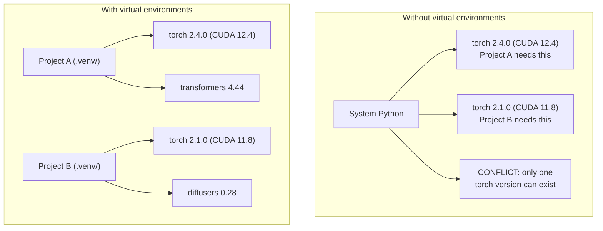

# بيئة بيثون بيثون بيئة الإدارة

> الجحيم الإعتماد حقيقي، البيئات الافتراضية هي العلاج
> يعتمد على الجحيم هو وجود حقيقي.

**Type:** Build | **类型:** 构建
**Languages:** Shell | **语言:** Shell
**Prerequisites:** Phase 0, Lesson 01 | **前置知识:** Phase 0, 第 01 课
**Time:** ~30 minutes | **时间:** ~30 分钟

## أهداف التعلم

- إعداد بيئات افتراضية معزولة باستخدام `uv`،`venv`أو`conda`
  中文翻译: استخدام `uv`.`venv`أو`conda`创建隔离的虚拟环境
- اكتب`pyproject.toml`مع مجموعات الاعتماد الاختيارية و توليد ملفات القفل من أجل قابلية التكرار
  中文翻译:编写带可选依赖组的 `pyproject.toml`, توليد ملف قفل  ضمان قابلية التأثير
- التشخيص وإصلاح الحيل الشائعة: التثبيتات العالمية، اختلاط المواد المزروعة والكود، عدم مطابقة إصدارات CUDA
  中文翻译:诊断并修复常见问题:全局安装、pip/conda 混用、CUDA 版本不匹配
- تنفيذ استراتيجية بيئية على مراحل للمشاريع التي تتعارض مع الاعتمادات
  ترجمة باللغة الصينية: استراتيجية بيئية تقسيمها على مراحل لتنفيذ مشروعات تعتمد على الصراع

> **【中文解读】**
> Python  المشروع يعتمد على الصراع هو أحد أكثر المشاكل شيوعا في تطوير الذكاء الاصطناعي. هذا المشروع يحتاج إلى PyTorch 2.4، ذلك المشروع يحتاج إلى 2.1 التثبيت على الصعيد العالمي يمكن أن يكون هناك نسخة واحدة فقط.

## المشكلة

تقوم بتثبيت PyTorch 2.4 لمشروع التنسيق الدقيق. الأسبوع المقبل، مشروع آخر يحتاج PyTorch 2.1 لأن بناء CUDA له محصوم. تقوم بتحديث عالمي، ويتوقف المشروع الأول. تخفض الترتيب، ويتوقف الثاني.

> لقد قمت بتثبيت PyTorch 2.4 على مشروع صغير.

هذا هو الجحيم الاعتماد. يحدث باستمرار في العمل الذكاء الاصطناعي / ML لأن:

> هذا ما يحدث في عمل الذكاء الاصطناعي، لأن:

- (بيتورش) ، (جاكس) ، و (تنسور فلو) كل واحد يُرسل خطة (كودا) الخاصة به
  中文翻译:PyTorch、JAX 和 TensorFlow كل من وحدة CUDA 绑定
- المكتبات النموذجية تعطي إصدارات إطار محددة
  中文翻译:模型库锁定特定框架版本
- عالمية`pip install`يكتب ما كان هناك من قبل
  中文翻译:全局 `pip install`会覆盖之前安装的任何版本
- إن إعدادات CUDA 11.8 لا تعمل مع برامج تشغيل CUDA 12.x (و العكس)
  中文翻译:CUDA 11.8 构建在CUDA 12.x 驱动上不工作(反之亦然)

الحل: كل مشروع يحصل على بيئة معزولة مع حزمة خاصة به.

> الحل: كل مشروع له بيئة منفصلة ومستقلة

> **【中文解读】**
> "تعتمدة في الجحيم" في AI  المشاريع بشكل خاص، لأن PyTorch/JAX/TensorFlow مختلفة مع CUDA  مقيدة، الإصدارات بين بعضها البعض غير متوافقة.

## المفهوم الأساسي

> **【中文解读】**يظهر الرسم التالي الفرق بين بيئة افتراضية وبدون بيئة افتراضية: عندما لا يوجد بيئة افتراضية، يمكن للنظام Python فقط تثبيت نسخة واحدة من PyTorch، والتي تتعارض بين المشاريع؛



## بناء ذلك تحرك لتحقيق

> **【拓展：uv vs pip vs conda — 该选哪个？】**(1) **uv**(推):الثقة 写的比 pip 快 10-100 倍,自动管理虚拟环境,一行命令搞定 `uv venv && uv pip install`‬ ‬ ‬ ‬**venv**:بايتون داخل، لا حاجة لتثبيت، ولكن السرعة بطيئة ويكون وظيفة قليلة.**conda**: تناسب الحاجة غير بايثون يعتمد على المشهد، ولكن البيئة حجم ضخم.
```figure
s0-env-isolation
```

## بناءها

### الخيار 1: uv venv (توصيبه)

`uv`هو أسرع مدير حزم Python (10-100 مرة أسرع من pip). إنه يتعامل مع البيئات الافتراضية ، وإصدارات Python ، وقرار الاعتماد في أداة واحدة.

> `uv`هو أسرع Python 包管理器 ((比 pip 快 10-100 倍) ⋅ انها في أداة واحدة للتعامل مع البيئة الافتراضية、Python 版本和依赖解析‬

```bash
curl -LsSf https://astral.sh/uv/install.sh | sh

uv python install 3.12

cd your-project
uv venv
source .venv/bin/activate
```

إعداد الحزم:

> انزلا:

```bash
uv pip install torch numpy
```

إعداد مشروع مع `pyproject.toml`في خطوة واحدة:

>                                                                                                                                                                                                                                                                                                                                                                                                                                                                                                                              `pyproject.toml`من المشاريع:

```bash
uv init my-ai-project
cd my-ai-project
uv add torch numpy matplotlib
```

### الخيار 2: venv (المبني) 选项2:venv(Python 内置)

> **【中文解读】**venv هو Python نفسها أداة بيئة افتراضية، لا تحتاج إلى تركيب إضافي. ولكن مقارنة ب uv، فإنه لن يدير تلقائياً Python  إصدار، ولا سوف تولد قفل الملف.

إذا لم تستطع تثبيتها`uv`، سفن (بايتون) مع`venv`:

> إذا لم تستطع التثبيت`uv`، (بايتون)`venv`:

```bash
python3 -m venv .venv
source .venv/bin/activate  # Linux/macOS
.venv\Scripts\activate     # Windows

pip install torch numpy
```

أبطأ من`uv`، ولكنه يعمل في كل مكان يتم تثبيته

> بي بي`uv`لكنّه ببطء، لكنّه في أيّ مكانٍ يُمكنكَ أن تستخدم فيهما Python

### الخيار الثالث: الكوندا (عندما تحتاجها)

تقوم "كوندا" بإدارة الاعتمادات غير البايتونية مثل مجموعات أدوات "CUDA" و "cuDNN" و "C" المكتبات. استخدمه عندما:

> كوندا 管理非 Python يعتمد على، مثل CUDA 工具包、cuDNN 和 C 库── في الحالات التالية:

- تحتاج إلى نسخة محددة من مجموعة أدوات CUDA دون تثبيتها على مستوى النظام
  中文翻译:需要特定 CUDA 工具包版本,但不希望全局安装
- أنت على مجموعة مشتركة حيث لا يمكنك تثبيت حزم النظام
  中文翻译: في مجموعة مشاركة, لا يمكن تركيب نظام包
- تعليمات تثبيت المكتبة تقول "استخدم الكوندا"
  中文翻译:库的安装说明写着"استخدام الشقة"

```bash
# Install miniconda (not the full Anaconda)
curl -LsSf https://repo.anaconda.com/miniconda/Miniconda3-latest-Linux-x86_64.sh -o miniconda.sh
bash miniconda.sh -b

conda create -n myproject python=3.12
conda activate myproject

conda install pytorch torchvision torchaudio pytorch-cuda=12.4 -c pytorch -c nvidia
```

قاعدة واحدة: إذا كنت تستخدم conda لبيئة، استخدم conda لجميع الحزم في تلك البيئة.`pip install`في حالة تعرض لخطر الإصابة تسبب صراعات الاعتماد التي تكون مؤلمة للتحليل

> 1- قاعدة: إذا كنت تستخدم الحي المنزلي  إدارة البيئة، فاستخدم الحي المنزلي  إدارة البيئة الممتلكة.`pip install`سوف يؤدي إلى صعوبة في تطبيق النزاعات المتعلقة بالاعتماد على النفس.

### لهذا الدورة: استراتيجية في كل مرحلة

يمكنك إنشاء بيئة واحدة لدورة كاملة لا تفعل. المراحل المختلفة تحتاج إلى اعتمادات مختلفة (أحياناً متناقضة)

> يمكنك إنشاء بيئة كاملة للدورة. لا تفعل ذلك.

الاستراتيجية:

> 策略:

```
ai-engineering-from-scratch/
├── .venv/                    <-- shared lightweight env for phases 0-3
├── phases/
│   ├── 04-neural-networks/
│   │   └── .venv/            <-- PyTorch env
│   ├── 05-cnns/
│   │   └── .venv/            <-- same PyTorch env (symlink or shared)
│   ├── 08-transformers/
│   │   └── .venv/            <-- might need different transformer versions
│   └── 11-llm-apis/
│       └── .venv/            <-- API SDKs, no torch needed
```

النص في`code/env_setup.sh`يخلق بيئة أساسية لهذا الدورة.

> `code/env_setup.sh`وخلق الكتب الإعدادية للبيئة الأساسية لهذا البرنامج.

## "بايبروجيت. توميل أساسيات "بايبروجيت. توميل أساس

> **【拓展：pyproject.toml 是现代 Python 项目的标准配置】**لقد استبدل التقليد`setup.py`和 `requirements.txt` تعريف الملف المشاريع. DATA、 اعتماداً٬ تطوير الأدوات التخصيص.`[train]`) و التأثير`[serve]`), تجنب تركيبات غير ضرورية في بيئة الإنتاج

كل مشروع بايثون يجب أن يكون له`pyproject.toml`إنه يُستبدل`setup.py`،`setup.cfg`و`requirements.txt`في ملف واحد

> كل مشروع Python يجب أن يكون له`pyproject.toml`لقد استبدلتها بملف`setup.py`.`setup.cfg`和 `requirements.txt`.

```toml
[project]
name = "ai-engineering-from-scratch"
version = "0.1.0"
requires-python = ">=3.11"
dependencies = [
    "numpy>=1.26",
    "matplotlib>=3.8",
    "jupyter>=1.0",
    "scikit-learn>=1.4",
]

[project.optional-dependencies]
torch = ["torch>=2.3", "torchvision>=0.18"]
llm = ["anthropic>=0.39", "openai>=1.50"]
```

ثم قم بتثبيت:

> ثمّ إضافة:

```bash
uv pip install -e ".[torch]"    # base + PyTorch
uv pip install -e ".[llm]"     # base + LLM SDKs
uv pip install -e ".[torch,llm]" # everything
```

## أوراق القفل

يقوم ملف قفل بتحديد كل إعتماد (بما في ذلك الإصدارات المتغيرة) إلى نسخة دقيقة. وهذا يضمن قابلية التكرار: أي شخص يثبت من ملف القفل يحصل على نفس الحزم بالضبط.

> سيتم حجز كل ملف مقفل على النسخة المحددة. وهذا يضمن قابلية الارتجاع: أي شخص من ملف القفل يُثبت بإمكانه الحصول على نفس الحزمة تماما.

```bash
# uv generates uv.lock automatically when using uv add
uv add numpy

# pip-tools approach
uv pip compile pyproject.toml -o requirements.lock
uv pip install -r requirements.lock
```

إرسال ملف القفل الخاص بك إلى git عندما يقوم شخص ما بتنسيق repo، يقومون بتثبيت من الملف القفل ويحصلون على نسخ متطابقة.

> عندما يقوم أحد بإستثمار الملفات، فإنهم يستخدمونها ويقومون بتثبيتها ويحصلون على نفس النسخة تماما.

## الأخطاء الشائعة

> **【中文解读】**Python 环境管理中最常见的 5 个错误:(1) 全局安装(用 `pip install`غير موجودة في بيئة افتراضية) ؛ 2) 混用 pip 和 conda; 3) 忘記激活虚拟环境; 4) 把 `.venv`目录提交到 git;(5) CUDA 版本不匹配──以下逐个讲解和修复方法──

### 1. التثبيت على مستوى العالم

```bash
pip install torch  # BAD: installs to system Python

source .venv/bin/activate
pip install torch  # GOOD: installs to virtual environment
```

تحقق من مكان حزمك

> 检查你的包装在哪里:

```bash
which python       # should show .venv/bin/python, not /usr/bin/python
which pip           # should show .venv/bin/pip
```

### 2. خليط البيب و الكوندا

```bash
conda create -n myenv python=3.12
conda activate myenv
conda install pytorch -c pytorch
pip install some-other-package   # BAD: can break conda's dependency tracking
conda install some-other-package # GOOD: let conda manage everything
```

إذا كان عليك استخدام pip داخل conda (بعض الحزم هي فقط حزمة) ، قم بتثبيت جميع حزمة conda أولاً، ثم حزمة pip تستمر.

> إذا كان يجب استخدام بعض الحمولات فقط في الحجرة، أولاً، قم بتثبيت كل الحجرة، وأخيراً، قم بتثبيت الحجرة.

### 3. نسيان تفعيل

```bash
python train.py           # uses system Python, missing packages
source .venv/bin/activate
python train.py           # uses project Python, packages found
```

يجب أن يظهر طلب القبو اسم البيئة:

> 提示符 يجب أن تظهر اسم البيئة:

```
(.venv) $ python train.py
```

### 4. التزام . ونف إلى git

```bash
echo ".venv/" >> .gitignore
```

البيئات الافتراضية هي 200 ميغابايت إلى 2 جيجابايت. إنها محلية، ليست محمولة بين الآلات.`pyproject.toml`وبدلاً من ذلك، قفل الملف

> البيئة الافتراضية لديها 200 ميغابايت إلى 2 جيجابايت.`pyproject.toml`وملف القفل

### 5. نسخة كودا غير مطابقة

> **【拓展：CUDA 版本地狱】**بيتورش كل إصدار مقيد لـ CUDA  إصدار محدد  مثل بيتورش 2.4 → CUDA 12.4)  إصدار خطأ سوف يظهر " لا يصل إلى GPU " أو خطأ في عملية غريبة  حل: أولا `nvidia-smi`确认驱动版本,再去 [pytorch.org](https://pytorch.org)查对应的安装命令──用 `uv pip install torch --index-url URL`指定 CUDA 版本──

```bash
nvidia-smi                # shows driver CUDA version (e.g., 12.4)
python -c "import torch; print(torch.version.cuda)"  # shows PyTorch CUDA version

# These must be compatible.
# PyTorch CUDA version must be <= driver CUDA version.
```

## استخدمها باستخدام القائمة

> **【中文解读】**استراتيجية التوصية لهذا البرنامج: كل مرحلة  خلق بيئة افتراضية مثل`.venv-phase04`), حتى يتمكن من تجنب الصراعات المتعلقة بالمراحل المختلفة.

قم بتشغيل النص الإعدادي لإنشاء بيئة الدورة:

> 运行安装脚本创建课程环境:

```bash
bash phases/00-setup-and-tooling/06-python-environments/code/env_setup.sh
```

هذا يخلق`.venv`في الجذر الاحتياطي مع الاعتمادات الأساسية مثبتة ومحققة.

> هذا سيؤدي إلى إنشاء واحدة في المجموعة`.venv`,并安装和验证核心依赖――

## تمارين التدريب

1. أركض`env_setup.sh`و التحقق من أن جميع الفحصات تمت
   运行环境安装脚本,确认所有检查通过
2. إنشاء بيئة افتراضية ثانية، وتثبيت نسخة مختلفة من numpy في ذلك، وتأكيد البيئتين منفصلة
   إنشاء بيئة افتراضية ثانية، وتثبيت نسخة مختلفة من NumPy، تحديد الحيطانين منفصلين
3. اكتب`pyproject.toml`لمشروع يحتاج كل من PyTorch و SDK Anthropic
   وذلك في الوقت نفسه يحتاجون إلى كتابة مشروعات PyTorch و SDK Anthropic`pyproject.toml`
4. قم بتثبيت حزمة عمداً عالمياً (بدون تفعيل venv) ، لاحظ أين تذهب، ثم إزالتها
   فيتمّ تركيب حزمة في المكتب كله، ثمّ تنزيلها

## شروط رئيسية

| Term | What people say | What it actually means |
|------|----------------|----------------------|
| Virtual environment | "A venv" | An isolated directory containing a Python interpreter and packages, separate from the system Python |
| Lockfile | "Pinned dependencies" | A file listing every package and its exact version, guaranteeing identical installs across machines |
| pyproject.toml | "The new setup.py" | The standard Python project configuration file, replacing setup.py/setup.cfg/requirements.txt |
| Transitive dependency | "A dependency of a dependency" | Package B depends on C; if you install A which depends on B, C is a transitive dependency of A |
| CUDA mismatch | "My GPU isn't working" | PyTorch was compiled for a different CUDA version than what your GPU driver supports |

| 术语 | 俗称 | 实际含义 |
|------|------|---------|
| Virtual environment | "venv" | 包含独立 Python 解释器和包的隔离目录 |
| Lockfile | "锁定依赖" | 记录每个包精确版本的文件，确保跨机器安装一致 |
| pyproject.toml | "新版 setup.py" | Python 项目标准配置文件，替代 setup.py 和 requirements.txt |
| Transitive dependency | "依赖的依赖" | A 依赖 B，B 依赖 C，C 就是 A 的传递依赖 |
| CUDA mismatch | "GPU 不工作" | PyTorch 编译时的 CUDA 版本与 GPU 驱动不匹配 |
