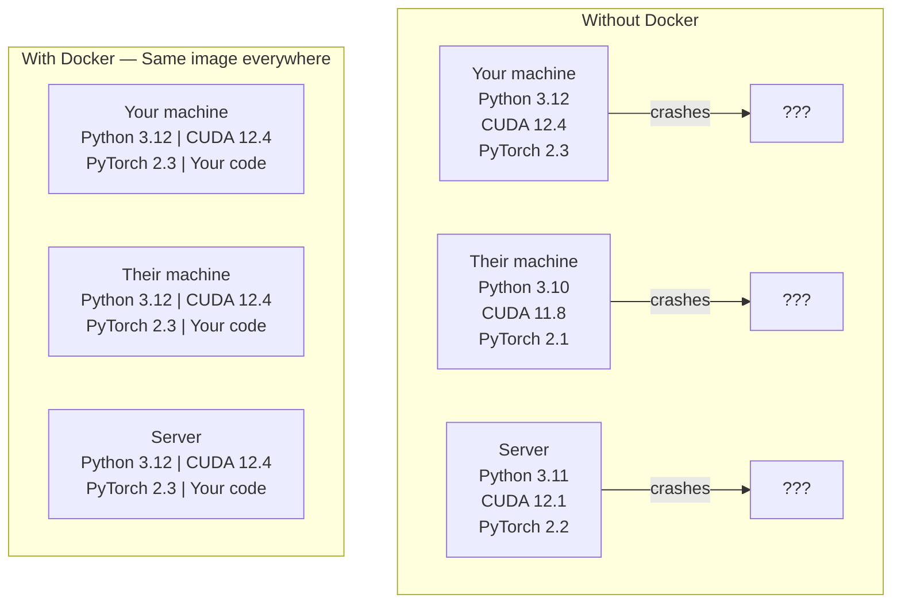

# دوكر للذكاء الاصطناعي

> الحاويات تجعل "العمل على آلتي" شيء من الماضي.
> حاوية جعل " على آلة بلدي يمكن أن تعمل " يصبح تاريخها

**Type:** Build | **类型:** 构建
**Languages:** Docker | **语言:** Docker
**Prerequisites:** Phase 0, Lessons 01 and 03 | **前置知识:** Phase 0, 第 01 课和第 03 课
**Time:** ~60 minutes | **时间:** ~60 分钟

## أهداف التعلم

- قم ببناء صورة Docker معتمدة على GPU مع مكتبات CUDA و PyTorch و AI من ملف Docker
  中文翻译: من Dockerfile 构建支持GPU 的 Docker 镜像,包含CUDA、PyTorch 和 AI 库
- قم بتصميم المجلدات المضيفة كحجم لمواصلة النماذج ومجموعات البيانات والرموز عبر إعادة بناء الحاويات
  中文翻译:挂载宿主目录为卷,在容器重建后保持模型、数据集和代码持久化
- قم بتشغيل مجموعة أدوات NVIDIA Container لتعرض GPUs داخل الحاويات
  中文翻译: إعداد NVIDIA حاوية أدوات، في الحاوية
- قم بتنظيم تطبيقات الذكاء الاصطناعي متعددة الخدمات (خادم المعلومات + قاعدة بيانات المتجهات) باستخدام Docker Compose
  中文翻译: استخدام Docker Composer 编排多服务 AI 应用(推理服务器 + 向量数据库)

> **【中文解读】**
> وضع دوكر المكونات، وقت التشغيل، المكتبات، وأدوات النظام في "حاوية" واحدة، وضمان أن نتائج التشغيل على أي جهاز متوافقة.

## المشكلة

لقد تدربت نموذج على جهاز الكمبيوتر المحمول الخاص بك مع PyTorch 2.3، CUDA 12.4، و Python 3.12. زميلك لديه PyTorch 2.1، CUDA 11.8، و Python 3.10.

> أنت على الكمبيوتر المحمول باستخدام PyTorch 2.3、CUDA 12.4 و Python 3.12  تدريب نموذج واحد.

مشاريع الذكاء الاصطناعي هي كوابيس الاعتماد. مجموعة نموذجية تشمل Python، PyTorch، مدفعي CUDA، cuDNN، مكتبات على مستوى النظام C، والحزم المتخصصة مثل flash-attn التي تحتاج إلى إصدارات محفزة دقيقة. Docker يحزم كل هذا في صورة واحدة التي تعمل بشكل متطابق في كل مكان.

> المشاريع الذكاء الاصطناعي تعتمد على الإدارة  أحلامها‬ التقنية النموذجية‬ تشمل Python‬ PyTorch‬ CUDA  محركات‬ cuDN‬ نظام درجة C 库، وكذلك الحاجة إلى إصدارات محددة للمؤلف خاصة مثل flash-attn‬ Docker وضع كل هذه المشاريع في صورة واحدة يمكن أن تعمل بشكل متوافق في أي مكان‬‬‬‬‬‬‬‬‬‬‬‬‬‬‬‬‬‬‬‬‬‬‬‬‬‬‬‬‬‬‬‬‬‬‬‬‬‬‬‬‬‬‬‬‬‬‬‬‬‬‬‬‬‬‬‬‬‬‬‬‬‬‬‬‬‬‬‬‬‬‬‬‬‬‬‬‬‬‬‬‬‬‬‬‬‬‬‬‬‬‬‬‬‬‬‬‬‬‬‬‬‬‬‬‬‬‬‬‬‬‬‬‬‬‬‬‬‬‬‬‬‬‬‬‬‬‬‬‬‬‬‬‬‬‬‬‬‬‬‬‬‬‬‬‬‬‬‬‬‬‬‬‬‬‬‬‬‬‬‬‬‬‬‬‬‬‬‬‬‬‬‬‬‬‬‬‬‬‬‬‬‬‬‬‬‬‬‬‬‬‬‬‬‬‬‬‬‬‬‬‬‬‬‬‬‬‬‬‬‬‬‬‬‬‬‬‬‬‬‬‬‬‬‬‬‬‬‬‬‬‬‬‬‬‬‬‬‬‬‬‬‬‬‬‬‬‬‬‬‬‬‬‬‬‬‬‬‬‬‬‬‬‬‬‬‬‬‬‬‬‬‬‬‬‬‬‬‬‬‬‬‬‬‬‬‬‬‬‬‬‬‬‬‬‬‬‬‬‬‬‬‬‬‬‬‬‬‬‬‬‬‬‬‬‬‬‬‬‬‬‬‬‬‬‬‬‬‬‬‬‬‬‬‬‬‬‬‬‬‬‬‬‬‬‬‬‬‬‬‬‬‬‬‬‬‬‬‬‬‬‬‬‬‬‬‬‬‬‬‬‬‬‬‬‬‬‬‬‬‬‬‬‬‬‬‬‬‬‬‬‬‬‬‬‬‬‬‬‬‬‬‬‬‬‬‬‬‬

> **【中文解读】**
> المشاريع الذكية هي واحدة من أكثر أنواع المشاريع التي تحتاج إلى Docker.

## المفهوم الأساسي

> **【拓展：Docker 在 AI 中的三大用途】**(1) **环境一致性**: نموذج جيد تم تدريبه على جهاز الكمبيوتر الخاص به ، لن يتم نشرها على الخادم بسبب إصدارات المكتبة مختلفة ؛**GPU 隔离**:多人共享一台GPU 服务器,每个人一个容器互不干扰;(3) **一键部署**:`docker run`一条命令启动完整的AI 服务(模型 + API + 前端),无需手动配置──TGI、vLLM等推理框架都提供Docker 镜像──

يلف Docker كودك ومرحلة تشغيله ومكتباتك وأدوات النظام في وحدة معزولة تسمى حاوية. فكر في ذلك كمحرك افتراضي خفيف الوزن، إلا أنه يشارك في جوهر نظام التشغيل المضيف بدلاً من تشغيل نفسه، لذلك يبدأ في ثواني بدلاً من دقائق.

> يُمكن تصورها كجهاز افتراضي خفيف، على الرغم من أنها تشارك النواة الداخلية لنظام تشغيل المضيف بدلاً من تشغيل النواة الداخلية الخاصة بها، لذا فإن التشغيل يستغرق بضع ثوانٍ بدلاً من بضع دقائق.



### لماذا تحتاج مشروعات الذكاء الاصطناعي إلى Docker أكثر من معظمها لماذا تحتاج مشروعات الذكاء الاصطناعي بشكل خاص إلى Docker

> **【中文解读】**تعتمد AI  المشاريع على سلسلة خاصة: Python → PyTorch → CUDA → cuDNN → 系统级 C 库。 أي طبقة من الإصدارات غير المتطابقة سوف تؤدي إلى انهيار التدريب أو نتائج التفكير غير متطابقة。

1. **GPU drivers are fragile.**لا يعمل رمز CUDA 12.4 على CUDA 11.8. يُعزل Docker مجموعة أدوات CUDA داخل الحاوية أثناء مشاركة مدير GPU المضيف من خلال مجموعة أدوات حاوية NVIDIA.

> 1. **GPU 驱动很脆弱。**لا يمكن تشغيل كود CUDA 12.4 في CUDA 11.8 上运行──Docker 通过 NVIDIA Container Toolkit 在容器内隔离 CUDA 工具包,同时共享宿主 GPU 驱动──

2. **Model weights are large.**نموذج معايير 7B هو 14 جيجابايت في fp16. لا تريد إعادة تنزيلها في كل مرة تقوم فيها بإعادة بناء. يسمح لك أحجام Docker بتثبيت دليل النماذج من المضيف.

> 2. **模型权重很大。**7B 参数的模型在fp16 下有14GB──你不想每次重建容器都重新下载──Docker卷让你从主机上载模型目录──

3. **Multi-service architectures are common.**تطبيق الذكاء الاصطناعي الحقيقي ليس مجرد نص بيثون. إنه خادم استنتاج، قاعدة بيانات متجهة لـ RAG، ربما محطة على شبكة الإنترنت. Docker Compose ينسق كل هذا بأمر واحد.

> 3. **多服务架构很常见。**التطبيقات الحقيقية لـ AI ليست مجرد كتاب Python. إنها تحتوي على خادم التفكير.

### المفردات الرئيسية

| Term | What it means |
|------|---------------|
| Image | A read-only template. Your recipe. Built from a Dockerfile. |
| Container | A running instance of an image. Your kitchen. |
| Dockerfile | Instructions to build an image. Layer by layer. |
| Volume | Persistent storage that survives container restarts. |
| docker-compose | A tool for defining multi-container applications in YAML. |

| 术语 | 含义 |
|------|------|
| Image（镜像） | 只读模板，相当于菜谱。由 Dockerfile 构建。 |
| Container（容器） | 镜像的运行实例，相当于厨房。 |
| Dockerfile | 构建镜像的指令文件，逐层定义。 |
| Volume（卷） | 持久化存储，容器重启后数据不丢失。 |
| docker-compose | 用 YAML 定义多容器应用的编排工具。 |

### أنماط حاويات شائعة في AI

> **【拓展：AI 部署的标准模式】**أشهر طريقة تخزينات الذكاء الاصطناعي:**训练容器**挂载数据集目录,训练完输出模型权重;(2) **推理容器**加载模型权重,提供 REST API;(3) **Jupyter 容器**预装所有库的笔记本 环境──Hugging Face、NVIDIA NGC  قدمت الكثير من الصور الأساسية للذكاء الاصطناعي المُبنيّة.

```
Dev Container
  Full toolkit. Editor support. Jupyter. Debugging tools.
  Used during development and experimentation.

Training Container
  Minimal. Just the training script and dependencies.
  Runs on GPU clusters. No editor, no Jupyter.

Inference Container
  Optimized for serving. Small image. Fast cold start.
  Runs behind a load balancer in production.
```

## بناء ذلك تحرك لتحقيق
```figure
s0-image-layers
```

## بناءها

### الخطوة الأولى: تثبيت Docker

```bash
# macOS
brew install --cask docker
open /Applications/Docker.app

# Ubuntu
curl -fsSL https://get.docker.com | sh
sudo usermod -aG docker $USER
# Log out and back in for group change to take effect
```

التحقق من:

> 验证安装:

```bash
docker --version
docker run hello-world
```

### الخطوة 2: قم بتثبيت مجموعة أدوات حاويات NVIDIA (لينكس مع GPU NVIDIA)

يسمح هذا للحاويات Docker بالوصول إلى GPU الخاص بك. يمكن لمستخدمي macOS و Windows (WSL2) تخطي هذا؛ Docker Desktop يتعامل مع GPU عبر مختلفة على تلك المنصات.

> هذا يسمح لوحة دوكر بالوصول إلى جيبو الخاص بك. MacOS و Windows (WSL2) يمكن للمستخدمين تجاوز هذه الخطوة.

```bash
distribution=$(. /etc/os-release;echo $ID$VERSION_ID)
curl -fsSL https://nvidia.github.io/libnvidia-container/gpgkey | sudo gpg --dearmor -o /usr/share/keyrings/nvidia-container-toolkit-keyring.gpg
curl -s -L https://nvidia.github.io/libnvidia-container/$distribution/libnvidia-container.list | \
    sed 's#deb https://#deb [signed-by=/usr/share/keyrings/nvidia-container-toolkit-keyring.gpg] https://#g' | \
    sudo tee /etc/apt/sources.list.d/nvidia-container-toolkit.list

sudo apt-get update
sudo apt-get install -y nvidia-container-toolkit
sudo nvidia-ctk runtime configure --runtime=docker
sudo systemctl restart docker
```

اختبار وصول GPU داخل الحاوية:

> 测试容器内的 GPU 访问:

```bash
docker run --rm --gpus all nvidia/cuda:12.4.1-base-ubuntu22.04 nvidia-smi
```

إذا رأيت معلومات المصفوفات، فإن مجموعة الأدوات تعمل.

> إذا كنت تستطيع رؤية معلومات الجيبو، فوضح أن المعدات تعمل بشكل طبيعي.

### الخطوة الثالثة: فهم الصور الأساسية الخطوة الثالثة: فهم الصور الأساسية

> **【中文解读】**基础镜像是 Dockerfile 的起点──AI 项目推使用NVIDIA 官方的CUDA 镜像(`nvidia/cuda:12.4.0-devel-ubuntu22.04`) أو بيتورش 官方镜像(`pytorch/pytorch:2.4.0-cuda12.4`), لقد تم تحديدها في CUDA 运行时和深度学习库.

اختيار الصورة الأساسية الصحيحة يوفر ساعات من التحليل

> 选择正确的基础镜像能节省几个小时的调试时间──

```
nvidia/cuda:12.4.1-devel-ubuntu22.04
  Full CUDA toolkit. Compilers included.
  Use for: building packages that need nvcc (flash-attn, bitsandbytes)
  Size: ~4 GB

nvidia/cuda:12.4.1-runtime-ubuntu22.04
  CUDA runtime only. No compilers.
  Use for: running pre-built code
  Size: ~1.5 GB

pytorch/pytorch:2.6.0-cuda12.4-cudnn9-runtime
  PyTorch pre-installed on top of CUDA.
  Use for: skipping the PyTorch install step
  Size: ~6 GB

python:3.12-slim
  No CUDA. CPU only.
  Use for: inference on CPU, lightweight tools
  Size: ~150 MB
```

### الخطوة الرابعة: كتابة ملف Docker للتطوير الذكاء الاصطناعي

هنا هو الملف الدوكر في`code/Dockerfile`تمشي من خلالها

> هذا هو`code/Dockerfile`في وسط الملفات الدوكر.

```dockerfile
FROM nvidia/cuda:12.4.1-devel-ubuntu22.04

ENV DEBIAN_FRONTEND=noninteractive
ENV PYTHONUNBUFFERED=1

RUN apt-get update && apt-get install -y --no-install-recommends \
    software-properties-common \
    git \
    curl \
    build-essential \
    && add-apt-repository -y ppa:deadsnakes/ppa \
    && apt-get update && apt-get install -y --no-install-recommends \
    python3.12 \
    python3.12-venv \
    python3.12-dev \
    && rm -rf /var/lib/apt/lists/*

RUN update-alternatives --install /usr/bin/python python /usr/bin/python3.12 1

RUN curl -sSL https://raw.githubusercontent.com/pypa/get-pip/3b73145063be545b649ad9ca83ea8da5fc915a4f/public/get-pip.py -o /tmp/get-pip.py \
    && echo "a341e1a43e38001c551a1508a73ff23636a11970b61d901d9a1cad2a18f57055  /tmp/get-pip.py" | sha256sum -c - \
    && python /tmp/get-pip.py \
    && rm /tmp/get-pip.py \
    && update-alternatives --install /usr/bin/pip pip /usr/local/bin/pip3.12 1

RUN python -m pip install --no-cache-dir --upgrade pip setuptools wheel

RUN python -m pip install --no-cache-dir \
    torch==2.6.0+cu124 \
    torchvision==0.21.0+cu124 \
    torchaudio==2.6.0+cu124 \
    --index-url https://download.pytorch.org/whl/cu124

RUN python -m pip install --no-cache-dir \
    numpy \
    pandas \
    scikit-learn \
    matplotlib \
    jupyter \
    transformers \
    datasets \
    accelerate \
    safetensors

WORKDIR /workspace

VOLUME ["/workspace", "/models"]

EXPOSE 8888

CMD ["python"]
```

بناءه:

> 构建镜像:

```bash
docker build -t ai-dev -f phases/00-setup-and-tooling/07-docker-for-ai/code/Dockerfile .
```

يستغرق هذا بعض الوقت في المرة الأولى (تحميل صورة أساسية CUDA + PyTorch). تستخدم المكونات اللاحقة طبقات مخزن.

> 首次构建需要一些时间(下载 CUDA 基础镜像 + PyTorch) ⋅后续构建会使用缓存的层──

إشغله

> 运行容器:

```bash
docker run --rm -it --gpus all \
    -v $(pwd):/workspace \
    -v ~/models:/models \
    ai-dev python -c "import torch; print(f'PyTorch {torch.__version__}, CUDA: {torch.cuda.is_available()}')"
```

أطلقوا " جوبيتر " داخل الحاوية:

> في حاوية:

```bash
docker run --rm -it --gpus all \
    -v $(pwd):/workspace \
    -v ~/models:/models \
    -p 8888:8888 \
    ai-dev jupyter notebook --ip=0.0.0.0 --port=8888 --no-browser --allow-root
```

### الخطوة 5: مقاعد حجم للبيانات والنماذج

إنّ محطات الحجم مهمة للعمل الذكيّ. بدونها، ستختفي تحميلات النموذج البالغ عددها 14 جيجا غيترا عندما يتوقف الحاوية.

> 卷挂载对 AI 工作至关重要――没有它们,你下载的14GB 模型在容器停止时就会消失――

```bash
# Mount your code
-v $(pwd):/workspace

# Mount a shared models directory
-v ~/models:/models

# Mount datasets
-v ~/datasets:/data
```

داخل نص التدريب الخاص بك، الحمل من المسار المثبت:

> في كتاب التدريب، من طريق التحميل

```python
from transformers import AutoModel

model = AutoModel.from_pretrained("/models/llama-7b")
```

النموذج يعيش على نظام الملفات المضيفة اعيد بناء الحاوية بقدر ما تريد دون إعادة التنزيل

> 模型存储在主管文件系统中──你可以随意重建容器,无需重新下载──

### الخطوة 6: Docker Compose للتطبيقات الذكاء الاصطناعي متعددة الخدمات

تطبيق RAG الحقيقي يحتاج إلى خادم استنتاج وقاعدة بيانات متجهة. Docker Compose يعمل على كل منهما بأمر واحد.

> تطبيقات RAG الحقيقية تحتاج إلى إضافة الخادم إلى قاعدة بيانات السموم.

انظر`code/docker-compose.yml`:

```yaml
services:
  ai-dev:
    build:
      context: .
      dockerfile: Dockerfile
    deploy:
      resources:
        reservations:
          devices:
            - driver: nvidia
              count: all
              capabilities: [gpu]
    volumes:
      - ../../../:/workspace
      - ~/models:/models
      - ~/datasets:/data
    ports:
      - "8888:8888"
    stdin_open: true
    tty: true
    command: jupyter notebook --ip=0.0.0.0 --port=8888 --no-browser --allow-root

  qdrant:
    image: qdrant/qdrant:v1.12.5
    ports:
      - "6333:6333"
      - "6334:6334"
    volumes:
      - qdrant_data:/qdrant/storage

volumes:
  qdrant_data:
```

ابدأ كل شيء

> 启动所有服务:

```bash
cd phases/00-setup-and-tooling/07-docker-for-ai/code
docker compose up -d
```

الآن حاوية تطوير الذكاء الاصطناعي الخاصة بك يمكن الوصول إلى قاعدة بيانات المتجهات في `http://qdrant:6333`أيدوليكر كومبوز يخلق شبكة مشتركة تلقائياً

> الآن يمكن تطوير حاويات الذكاء الاصطناعي من خلال خدمة`http://qdrant:6333`访问向量数据库──Docker Compose 自动创建共享网络──

اختبر الاتصال من داخل حاوية الذكاء الاصطناعي:

> من AI 容器内部测试连接:

```python
from qdrant_client import QdrantClient

client = QdrantClient(host="qdrant", port=6333)
print(client.get_collections())
```

توقف كل شيء

> 停止所有服务:

```bash
docker compose down
```

إضافة`-v`أيضاً حذف حجم qdrant:

> 加 `-v`مع حذف 卷:

```bash
docker compose down -v
```

### الخطوة 7: أوامر Docker المفيدة لعمل الذكاء الاصطناعي

> 第7步: إصدار إصدار إصدار إصدار إصدار إصدار إصدار إصدار إصدار إصدار إصدار إصدار إصدار إصدار إصدار إصدار إصدار إصدار إصدار إصدار إصدار إصدار إصدار إصدار إصدار إصدار إصدار إصدار إصدار إصدار إصدار إصدار إصدار إصدار إصدار إصدار إصدار إصدار إصدار إصدار إصدار إصدار إصدار إصدار إصدار إصدار إصدار إصدار إصدار إصدار إصدار إصدار إصدار إصدار إصدار إصدار إصدار إصدار إصدار إصدار إصدار إصدار إصدار إصدار إصدار إصدار إصدار إصدار إصدار إصدار إصدار إصدار إصدار إصدار إصدار إصدار إصدار إصدار إصدار إصدار إصدار إصدار إصدار إصدار إصدار إصدار إصدار إصدار إصدار إصدار إصدار إصدار إصدار إصدار إصدار إصدار إصدار إصدار إصدار إصدار إصدار إصدار إصدار إصدار إصدار إصدار إصدار إصدار إصدار إصدار إصدار إصدار إصدار إصدار إصدار إصدار إصدار إصدار إصدار إصدار إصدار إصدار إصدار إصدار إصدار إصدار إصدار إصدار إصدار إصدار إصدار إصدار إصدار إصدار إصدار إصدار إصدار إصدار إصدار إصدار إصدار إصدار إصدار إصدار إصدار إصدار إصدار إصدار إصدار إصدار إصدار إصدار إ إ إ إ إصاد إصاد إ إ إ إ إ إ إ إ إ إصاد إ إ إ إ إ إ إ إ إ إ إ إ إ إ إ إ إ إ إ إ إ إ إ إ إ إ إ إ

```bash
# List running containers
docker ps

# List all images and their sizes
docker images

# Remove unused images (reclaim disk space)
docker system prune -a

# Check GPU usage inside a running container
docker exec -it <container_id> nvidia-smi

# Copy a file from container to host
docker cp <container_id>:/workspace/results.csv ./results.csv

# View container logs
docker logs -f <container_id>
```

## استخدمها باستخدام القائمة

> **【拓展：Docker vs Conda 选择指南】**简单项目用Conda/uv 即可;需要部署或多人协作时使用Docker。 قانون التجربة: إذا قلت "على机器能跑", تشرح أنك يجب استخدامDocker 已──.

لديك الآن بيئة تطوير الذكاء الاصطناعي قابلة للتكرار.

> لديك الآن بيئة تطوير الذكاء الاصطناعي قابلة للتطبيق

- استخدام`docker compose up`لبدء البيانات البيانية البيانية و البيانات البيانية
  中文翻译: استخدام `docker compose up`في نفس الوقت بدء تطوير البيانات البيئية والحجم
- قم بتجميع كودك ونماذجك وبياناتك كجزء من الكتلة حتى لا يضيع أي شيء بين إعادة البناء
  الصفحة الرئيسية: إعادة الإصدار
- عندما يتطلب درساً حزمة Python جديدة، أضفها إلى ملف Docker و أعد بناءها
  中文翻译: عندما تحتاج الدورة إلى Python 包时, إضافة إلى Dockerfile و إعادة بناء
- شارك ملفك مع زملائك في الفريق، يحصلون على نفس البيئة بالضبط
  ترجمة باللغة الصينية: مع زملاء الفريق المشترك Dockerfile, they get exactly the same environment

### لا يوجد معالجة معالجة؟

إزالة`--gpus all`لا يزال الحاوية تعمل للدرس القائم على المعالجة المركزية. يكتشف PyTorch غياب CUDA ويعود إلى المعالجة المركزية تلقائيا.

> 移除 `--gpus all`标志和 NVIDIA نشر 配置块──容器 لا يزال يمكن استخدامها على أساس دروس CPU──PyTorch 会自动检测 CUDA 不存在并回归CPU──

## تمارين التدريب

1. قم بإنشاء الملف الدوكر وتشغيل`python -c "import torch; print(torch.__version__)"`داخل الحاوية
   构建 Docker 镜像,在容器内运行 PyTorch 验证
2. إبدأ بثقة المكونات المكونة من المرفق وتحقق من إمكانية الوصول إلى Qdrant من حاوية الذكاء الاصطناعي في `http://qdrant:6333/collections`
   启动 docker-compose ,验证 Qdrant 向量数据库可访问
3. إضافة`flask`إلى ملف دوكر، إعادة بناء، وإدارة خادم API بسيط على ميناء 5000. خريطة البورط مع `-p 5000:5000`
   في ملف دوكر إضافة عبوة، إعادة بناء المشاهد، تنفيذ API  الخادم
4. قياس حجم الصورة مع `docker images`حاولي تغيير الصورة الأساسية من`devel`إلى`runtime`و مقارنة الأحجام
   قياس حجم الصورة، مقارنة مع التطور و الوقت التشغيلي  اختلاف حجم الصورة

## شروط رئيسية

| Term | What people say | What it actually means |
|------|----------------|----------------------|
| Container | "Lightweight VM" | An isolated process using the host kernel, with its own filesystem and network |
| Image layer | "Cached step" | Each Dockerfile instruction creates a layer. Unchanged layers are cached, so rebuilds are fast. |
| NVIDIA Container Toolkit | "GPU in Docker" | A runtime hook that exposes host GPUs to containers via `--gpus` flag |
| Volume mount | "Shared folder" | A directory on the host mapped into the container. Changes persist after the container stops. |
| Base image | "Starting point" | The `FROM` image your Dockerfile builds on top of. Determines what is pre-installed. |

| 术语 | 俗称 | 实际含义 |
|------|------|---------|
| Container | "轻量虚拟机" | 使用宿主内核的隔离进程，拥有独立文件系统和网络 |
| Image layer | "缓存层" | 每条 Dockerfile 指令创建一层，未修改的层会被缓存 |
| NVIDIA Container Toolkit | "Docker 中的 GPU" | 通过 `--gpus` 标志将宿主 GPU 暴露给容器的运行时钩子 |
| Volume mount | "共享文件夹" | 宿主目录映射到容器内，容器停止后数据保留 |
| Base image | "起点" | Dockerfile 的 FROM 镜像，决定了预装内容 |
