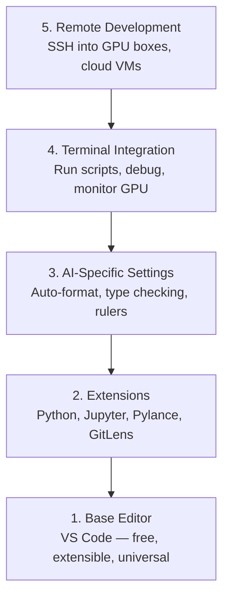

# إعداد المحرر إعداد المحرر إعداد

> محررك هو مساعدك في الطيران، قم بتهيئها مرة واحدة حتى لا تخرج من طريقك وتبدأ في سحب وزنها
> المُحرّر هو مساعدك. قم بتصميمها مرة واحدة، فلن يعدّ الأمر عائقًا، بل يعمل بشكل حقيقي.

**Type:** Build | **类型:** 构建
**Languages:** -- | **语言:** 无
**Prerequisites:** Phase 0, Lesson 01 | **前置知识:** Phase 0, 第 01 课
**Time:** ~20 minutes | **时间:** ~20 分钟

## أهداف التعلم

- قم بتثبيت VS Code مع التوسعات الأساسية لـ Python و Jupyter و linting و SSH عن بعد
  中文翻译:安装 VS Code 及 Python、Jupyter、代码检查和远程 SSH等必备扩展
- إعداد تنسيق على حفظ، وتحقق من النوع، وتحريك خروج المكتبة للجوارات العملية الذكية
  中文翻译:配置保存时格式化、类型检查和笔记本 输出滚动等 AI 工作流设置
- قم بتعيين SSH عن بعد لتحرير وتحليل الكود على أجهزة GPU عن بعد كما لو كانت محلية
  中文翻译: إعداد SSH عن بعد, مثل 编辑本地文件一样 编辑和调试远程GPU 机器上的代码
- تقييم بدائل المحرر (Cursor و Windsurf و Neovim) وتبادلاتها لعمل الذكاء الاصطناعي
  中文翻译:评估编辑器替代方案 ((Cursor、Windsurf、Neovim) و فوائدها في عمل الذكاء الاصطناعي

> **【中文解读】**
> 编辑器是你写代码的主力工具──本章帮你配置 VS Code 用于 AI 开发:Python 支持、Jupyter 集成、远程SSH 连接GPU 服务器──配置一次,受益整个课程──

## المشكلة

سوف تقضي آلاف الساعات داخل المحرر بكتابة Python، وتشغيل المكتبات الملاحظة، وتحليل خيوط التدريب، وتضمين SSH في مربعات GPU. محرر غير مُهيِّن يُحول كل جلسة إلى اصطدام: لا تكميل تلقائي، لا تلميحات النص، لا أخطاء داخل الخط، وصيغة يدوية، وتدفق عمل محطّي غير مسموح.

> سوف تقضي آلاف الساعات في المحرر في كتابة Python ‬ تنفيذ Notebook ‬ تدوير دورة التدريب ‬ SSH    اتصال GPU  الخادم‬‬‬ إعداد غير صحيح سوف يجعل كل محرر تصفير يصبح معاناة: لا تدوير تلقائي‬‬ لا نوع من النصيحات‬ لا إشارات الخطأ ‬ الجهاز التنسيق‬‬

الإعداد الصحيح يستغرق 20 دقيقة، وتقفز من ذلك يكلفك 20 دقيقة كل يوم.

> التشغيل الصحيح يستغرق 20 دقيقة فقط.

> **【中文解读】**
> تحديد المحرر يستغرق 20 دقيقة فقط، ولكن عدم تحديد المحرر سيجعلك تضيع أكثر من 20 دقيقة في اليوم.

## المفهوم الأساسي

إنشاء محرر هندسي الذكاء الاصطناعي يحتاج إلى خمسة أشياء:

> المُعدّل المُعدّل لـ AI يحتاج إلى تكوين خمس طبقات:



> **【中文解读】**
> تحديد المواقع: المعدل الإلكتروني للتطوير هو المعدل الأساسي للتطوير.
```figure
s0-lsp-roundtrip
```

## بناءها

## بناء ذلك تحرك لتحقيق

> **【拓展：VS Code 为什么是 AI 开发的首选编辑器】**كود VS في تطوير AI: 1) 免费且轻量; 2) جوبيتر لوح المذكرة 原生支持; 3) SSH عن بعد 直接连接 GPU 服务器编辑代码; 4) Python/Jupyter/Python Debugger 扩展生态完善;

### الخطوة الأولى: قم بتثبيت رمز VS

VS Code هو المحرر الموصى به. إنه مجاني، يعمل على كل نظام تشغيل، ويحتوي على دعم لمكتبات جوبيتر من الدرجة الأولى، ويتغطي النظام البيئي التوسيعي كل ما تحتاجه للعمل الذكاء الاصطناعي.

> VS Code هو محرر التوصية.

قم بتنزيلها من [code.visualstudio.com](https://code.visualstudio.com/). . .

> من[code.visualstudio.com](https://code.visualstudio.com/)-إنه من السهل

التحقق من المحطة:

> في نهاية الاختبار:

```bash
code --version
```

إذا`code`لا يوجد على macOS، افتح VS Code، اضغط `Cmd+Shift+P`، وتدخل "أوامر القبو"، و اختر "ثمّن "رمز" في PATH".

> إذا ماكوس 上找不到 `code`أمر،打开 VS رمز،按 `Cmd+Shift+P`,输入 "Shell Command",选择 "تثبيت "مخطط" في PATH"。

### الخطوة الثانية: قم بتثبيت التوسيعات الأساسية

> **【中文解读】**AI 开发必备的 VS Code 扩展:Python(调试+Lint)  jupiter(在编辑器运行笔记本) Pylance(智能补全和类型检查) ✓GitLens(查看代码历史)  التثبيت بعد التثبيت في الإعدادات "保存时格式化", من هنا لا حاجة إلى ترتيب المخططات بيد。

افتح المحطة المتكاملة في رمز VS (`` Ctrl+`على كل منصة) ووضع التوسعات التي تهم العمل في الذكاء الاصطناعي:

> 打开 VS Code 的集成终端(`Ctrl+`` `أو `` Cmd+```) ، تنص على AI 工作所需的关键扩展:

```bash
code --install-extension ms-python.python
code --install-extension ms-python.vscode-pylance
code --install-extension ms-toolsai.jupyter
code --install-extension eamodio.gitlens
code --install-extension ms-vscode-remote.remote-ssh
code --install-extension ms-python.debugpy
code --install-extension ms-python.black-formatter
code --install-extension charliermarsh.ruff
```

ما يفعله كل واحد:

> كل تأثير على التوسع:

| Extension | Why |
|-----------|-----|
| Python | Language support, virtual env detection, run/debug |
| Pylance | Fast type checking, autocomplete, import resolution |
| Jupyter | Run notebooks inside VS Code, variable explorer |
| GitLens | See who changed what, inline git blame |
| Remote SSH | Open a folder on a remote GPU box as if it were local |
| Debugpy | Step-through debugging for Python |
| Black Formatter | Auto-format on save, consistent style |
| Ruff | Fast linting, catches common mistakes |

الملف`code/.vscode/extensions.json`في هذه الدروس تحتوي على قائمة التوصيات الكاملة. عند فتح مجلد المشروع، سيطلب منك VS Code تثبيتها.

> 本课中 `code/.vscode/extensions.json`تحتوي على قائمة كاملة من الموصى بها. عندما تفتح ملف المشروع.

### الخطوة الثالثة: إعداد الإعدادات

نسخ الإعدادات من `code/.vscode/settings.json`في هذه الدروس، أو تطبيقها يدويا من خلال `Settings > Open Settings (JSON)`. . .

> من درجة`code/.vscode/settings.json`复制设置، أو من خلال `Settings > Open Settings (JSON)`التطبيق المباشر

الإعدادات الرئيسية لعمل الذكاء الاصطناعي:

> تعديل المفاتيح

```jsonc
{
    "python.analysis.typeCheckingMode": "basic",
    "editor.formatOnSave": true,
    "editor.rulers": [88, 120],
    "notebook.output.scrolling": true,
    "files.autoSave": "afterDelay"
}
```

لماذا هذه الأمور مهمة:

> لماذا هذه الإعدادات مهمة:

- **Type checking on basic**: يلتقط أنواع الحجج الخطأ قبل تشغيلها. يوفّر وقت التحويض على عدم مطابقة شكل الجهاز التنسوري ومعايير API الخطأ.
  中文翻译:**基础类型检查**: في التشغيل قبل القبض على نوع العنصر الخطأ.
- **Format on save**لا تفكر أبداً في تنسيقها مرة أخرى، السوداء يتعاملون معها
  中文翻译:**保存时格式化**: لا حاجة إلى النظر في التشكيل.
- **Rulers at 88 and 120**: غلف أسود في 88، علامة 120 تظهر عندما تصبح السلاسل الوثائقية والعبارات طويلة جدا.
  中文翻译:**88 和 120 标尺**: الأسود في 88 处换行──120 标尺显示文档字符串和注释是否过长──
- **Notebook output scrolling**: حلقات التدريب طباعة الآلاف من الخطوط. دون التداول، لوحة الخروج تنفجر.
  中文翻译:**Notebook 输出滚动**: تدريب دورة طباعة آلاف الصفحات.
- **Auto-save**ستنسى حفظ. سكرات التدريب الخاصة بك سوف تشغيل رمز قديم. حفظ تلقائي يمنع ذلك.
  中文翻译:**自动保存**:You will forget to save── تدريب الكود سوف تعمل على ماضى الوقت── حفظ تلقائي لمنع هذه الحالة──

### الخطوة الرابعة: دمج المحطة

المحطة المتكاملة لـ VS Code هي حيث تقوم بتشغيل نصوص التدريب ومراقبة GPU وإدارة البيئات.

> محطة التكامل في VS Code هي مكان تدريبك على التشغيل

أضعها بشكل صحيح

> إعدادات:

```jsonc
{
    "terminal.integrated.defaultProfile.osx": "zsh",
    "terminal.integrated.defaultProfile.linux": "bash",
    "terminal.integrated.fontSize": 13,
    "terminal.integrated.scrollback": 10000
}
```

المختصرات المفيدة:

> 常用快捷键:

| Action | macOS | Linux/Windows |
|--------|-------|---------------|
| Toggle terminal | `` Ctrl+` `` | `` Ctrl+` `` |
| New terminal | `` Ctrl+Shift+` `` | `` Ctrl+Shift+` `` |
| Split terminal | `Cmd+\` | `Ctrl+Shift+5` |

محطات منفصلة مفيدة: واحدة لتشغيل النص الخاص بك، واحدة لمراقبة GPU مع `nvidia-smi -l 1`أو`watch -n 1 nvidia-smi`. . .

> 分屏终端很有用: واحد يعمل على النص، واحد يستخدم `nvidia-smi -l 1`أو`watch -n 1 nvidia-smi`مراقبة الجيبو

### الخطوة 5: تطوير عن بعد (SSH إلى صناديق GPU) ٠ 第5步:远程开发(SSH 连接 GPU 服务器)

> **【拓展：Remote SSH 是 AI 开发的杀手级功能】**لا يوجد لدى معظم الناس جبي أوغرافيكا محلية، تحتاج إلى جبي أوغرافيكا محلية إلى نظام التدريب على الخادم.

هذا هو أهم امتداد للعمل الذكاء الاصطناعي. سوف تقوم بتدريب على آلات بعيدة (أجهزة VM السحابية، خادم المختبرات، لامبدا، Vast.ai). SSH عن بعد يسمح لك بفتح نظام الملفات عن بعد، وتحرير الملفات، وتشغيل المحطات، وتحريف كل شيء كما لو كان محليا.

> هذا هو أهم توسيع في العمل الذكاء الاصطناعي. سوف تتدرب على أجهزة بعيدة المدى.

الإعداد:

> 设置步骤:

1. قم بتثبيت امتداد SSH عن بعد (أجريت في الخطوة 2).
2. اضغط`Ctrl+Shift+P`(أو `Cmd+Shift+P`), النموذج "Remote-SSH: Connect to Host".
3. أدخل`user@your-gpu-box-ip`. . .
4. VS Code يثبت مكون الخادم على الآلة البعيدة تلقائياً.

> 1. 安装 ريموت SSH 扩展(已在步骤 2 完成)
> 2. 按 `Ctrl+Shift+P`(أو `Cmd+Shift+P`),输入 "الجهاز النووي: الاتصال بالضابط"
> 3. 输入 `user@your-gpu-box-ip`.
> 4. VS Code تلقائيًا على جهاز بعيد يُثبت مكونات الخادمها

للوصول بدون كلمة مرور، قم بتعيين مفاتيح SSH:

> لتحقيق الوصول بدون كلمة مرور، إعداد SSH 密钥:

```bash
ssh-keygen -t ed25519 -C "your-email@example.com"
ssh-copy-id user@your-gpu-box-ip
```

إضافة المضيف إلى `~/.ssh/config`لسهولة:

> من أجل السهل أن يبدأ، سوف يضيف المدير`~/.ssh/config`:

```
Host gpu-box
    HostName 203.0.113.50
    User ubuntu
    IdentityFile ~/.ssh/id_ed25519
    ForwardAgent yes
```

الآن`Remote-SSH: Connect to Host > gpu-box`يتصل فوراً

> الآن`Remote-SSH: Connect to Host > gpu-box`حتى يمكن أن تكون على اتصال

## البدائل البديلة

> **【拓展：AI 增强编辑器对比】**Cursor(بناء على VS Code،内置 AI 编程助手,$20/月) و Windsurf(Codeium 出品,免费层可用) هي ميزاتهم الأساسية في 2024-2026 سنوات الارتفاع في إصدارات AI الأصلية: باستخدام لغة طبيعية وصف الاحتياجات، إصدارات إصطناعي الذاتية.

### الملازم

[cursor.com](https://cursor.com)هو فوك VS Code مع إنشاء رمز AI مدمج. يستخدم نفس النظام البيئي التوسع وصيغة الإعدادات. إذا كنت تستخدم Cursor، كل شيء في هذه الدروس لا يزال ينطبق. استيراد نفس `settings.json`و`extensions.json`. . .

> [cursor.com](https://cursor.com)هو إضافة إصدار إصدار إصدار إصدار إصدار إصدار إصدار إصدار إصدار إصدار إصدار إصدار إصدار إصدار إصدار إصدار إصدار إصدار إصدار إصدار إصدار إصدار إصدار إصدار إصدار إصدار إصدار إصدار إصدار إصدار إصدار إصدار إصدار إصدار إصدار إصدار إصدار إصدار إصدار إصدار إصدار إصدار إصدار إصدار إصدار إصدار إصدار إصدار إصدار إصدار إصدار إصدار إصدار إصدار إصدار إصدار إصدار إصدار إصدار إصدار إصدار إصدار إصدار إصدار إصدار إصدار إصدار إصدار إصدار إصدار إصدار إصدار إصدار إصدار إصدار إصدار إصدار إصدار إصدار إصدار إصدار إصدار إصدار إصدار إصدار إصدار إصدار إصدار إصدار إصدار إصدار إصدار إصدار إصدار إصدار إصدار إصدار إصدار إصدار إصدار إصدار إصدار إصدار إصدار إصدار إصدار إصدار إصدار إصدار إصدار إصدار إصدار إصدار إصدار إصدار إصدار إصدار إصدار إصدار إصدار إصدار إصدار إصدار إصدار إصدار إصدار إصدار إصدار إصدار إصدار إصدار إصدار إصدار إصدار إصدار إصدار إصدار إصدار إصدار إصدار إصدار إصدار إصدار إصدار إصدار إصدار إصدار إصدار إص إصدار إصدار إصاد إصاد إصاد إصاد إصاد إصاد إصاد إصاد إصاد إصاد إصاد إ إ إ إ إ إصاد إ إ إ إصاد إ إ إ إ إ إ إ`settings.json`和 `extensions.json`-إلى ماذا؟

### السفر الرياحي

[windsurf.com](https://windsurf.com)نفس القصة: نفس التوسعات، نفس شكل الإعدادات، نفس دعم SSH عن بعد.

> [windsurf.com](https://windsurf.com)هو آخر AI  الأولوية VS Code 分支── نفسها: نفس التوسع٬ نفس النموذج الإعداد٬ نفس الدعم SSH عن بعد──

### فيم/نيوفيم

إذا كنت تستخدم Vim أو Neovim بالفعل وتكون منتجة في ذلك، ابق هناك. الحد الأدنى من الإعدادات للعمل في AI Python:

> إذا كنت قد استخدمت Vim أو Neovim و إنفعالية لا خاطئة، استمر في استخدامها.

- **pyright**أو**pylsp**للتحقق من النوع (بإستخدام المكنسة المعدنية أو التركيب اليدوي)
  中文翻译:**pyright**أو**pylsp**تستخدم لفترة الاختبار (من خلال الميسون أو التثبيت اليدوي)
- **nvim-lspconfig**للتكامل مع خادم اللغة
  中文翻译:**nvim-lspconfig**استخدام لغوي الخادمات
- **jupyter-vim**أو**molten-nvim**لتنفيذ مثل دفتر الملاحظات
  中文翻译:**jupyter-vim**أو**molten-nvim**يستخدم على غرار المذكرة
- **telescope.nvim**للبحث عن الملف/الرمز
  中文翻译:**telescope.nvim**باستخدام الملفات / رمز البحث
- **none-ls.nvim**مع الأسود والقافل للتصميم/التصوير
  中文翻译:**none-ls.nvim**配合 الأسود و الرف استخدام لتشكيل / لنت

إذا لم تستخدم Vim بالفعل، لا تبدأ الآن. منحنى التعلم سوف يتنافس مع تعلم هندسة الذكاء الاصطناعي. استخدم VS Code.

> إذا كنت لم تستخدم Vim بعد، لا تبدأ الآن.

## استخدمها باستخدام القائمة

> **【中文解读】**推配置:VS Code + Python + Jupyter + Remote SSH── إذا كنت تستخدم GPU  الخادم ، فإن Remote SSH هو ضروري──调试训练循环时,Jupyter 扩展让你在编辑器内直接查看张量形和损曲线──

مع هذا الإعداد، سير عملك اليومي يبدو مثل:

> مع هذا التخصيص، عملك اليومي يسير على النحو التالي:

1. افتح مجلد المشروع في VS Code (أو قم بالاتصال عبر Remote SSH إلى مربع GPU).
   中文翻译: 在 VS Code 中打开项目文件(或通过远程SSH 连接到GPU 服务器) 』
2. اكتب Python في المحرر مع الكمال التلقائي، وتلميحات النقرة، وأخطاء داخل الخط.
   中文翻译: في المحرر إعداد Python، التمتع بتكملات تلقائية، نوع الملاحظات ومتصدرات الخطأ الملاحظات.
3. أطلق أدوات الملاحظات من "جوبيتر" متوافقة مع إضافة "جوبيتر".
   中文翻译: استخدام جوبيتر 扩展内嵌运行 دفتر ملاحظات。
4. استخدم المحطة المتكاملة لخطوط التدريب`uv pip install`و مراقبة GPU
   中文翻译: استخدام集成终端运行训练脚本、`uv pip install`و GPU  مراقبة
5. مراجعة التغييرات مع GitLens قبل التزام.
   中文翻译:提交前用 GitLens 检查变更。

## تمارين التدريب

1. قم بتثبيت رمز VS وجميع التوسعات المدرجة في الخطوة 2
   تنصيب VS رمز و الخطوة 2
2. نسخة `settings.json`من هذا الدروس إلى إعدادات VS Code
   سأقوم بدراسة`settings.json`复制到你的 VS Code 配置中
3. افتح ملف Python وتحقق من أن Pylance يظهر إشارات النمط والتنسيقات الأسود على حفظ
   打开一个Python文件,验证Pylance 显示类型提示、黑 保存时自动格式化
4. إذا كان لديك إمكانية الوصول إلى جهاز بعيد، قم بتعيين نظام SSH عن بعد وفتح مجلد عليه
   إذا كان هناك جهاز بعيد، إعداد جهاز SSH عن بعد وفتح الملفات بعيدة

## شروط رئيسية

| Term | What people say | What it actually means |
|------|----------------|----------------------|
| LSP | "Autocomplete engine" | Language Server Protocol: a standard for editors to get type info, completions, and diagnostics from a language-specific server |
| Pylance | "The Python plugin" | Microsoft's Python language server using Pyright for type checking and IntelliSense |
| Remote SSH | "Working on the server" | VS Code extension that runs a lightweight server on a remote machine and streams the UI to your local editor |
| Format on save | "Auto-prettier" | The editor runs a formatter (Black, Ruff) every time you save, so code style is always consistent |

| 术语 | 俗称 | 实际含义 |
|------|------|---------|
| LSP | "自动补全引擎" | 语言服务器协议：编辑器获取类型信息、补全和诊断的标准 |
| Pylance | "Python 插件" | 微软的 Python 语言服务器，提供类型检查和智能提示 |
| Remote SSH | "在服务器上开发" | VS Code 在远程机器上运行轻量服务器，将 UI 传输到本地编辑器 |
| Format on save | "保存时自动格式化" | 每次保存时自动运行格式化工具，保持代码风格一致 |
