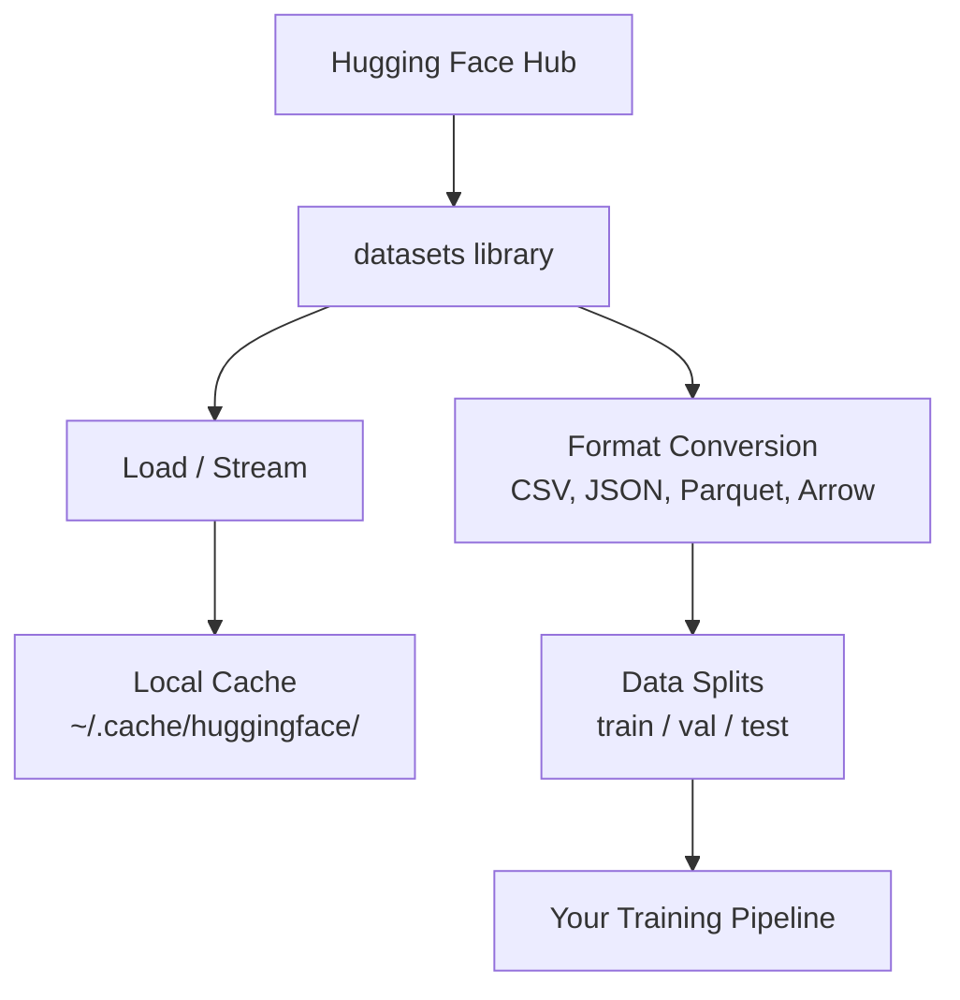

# إدارة البيانات إدارة البيانات

> البيانات هي الوقود، كيفية إدارةها تعتمد على سرعة السير
> البيانات هي الوقود. الطريقة التي تديرها تعتبر أنك تستطيع أن تسير بسرعة.

**Type:** Build | **类型:** 构建
**Language:**" بايثون "**语言:**بايثون
**Prerequisites:** Phase 0, Lesson 01 | **前置知识:** Phase 0, 第 01 课
**Time:** ~45 minutes | **时间:** ~45 分钟

## أهداف التعلم

- تحميل، تدفق، وتخزين المجموعات البيانية باستخدام وجه العناق `datasets`المكتبة
  中文翻译: استخدام معنى العناق`datasets`库加载、流式处理和缓存数据集
- تحويل بين تنسيقات CSV ، JSON ، Parquet ، و Arrow و شرح تعديلاتها
  中文翻译: تحويل بين CSV、JSON、Parquet 和 Arrow 格式,并解释各自优点
- إنشاء ثنائيات قابلة للتكرار/تحقق/اختبار مع بذور عشوائية ثابتة
  中文翻译: باستخدام ثابت随机种子创建可复现的训练/验证/测试集拆分
- إدارة ملفات النموذج الكبيرة ومجموعة البيانات باستخدام `.gitignore`، Git LFS، أو DVC
  中文翻译: استخدام `.gitignore`、Git LFS أو DVC 管理大型模型和数据文件

> **【中文解读】**
> البيانات هي وقود الذكاء الاصطناعي.`datasets`库加载、缓存、转换和拆分数据集──掌握数据管理是开始机器学习实验的前提──

## المشكلة

كل مشروع ذكاء اصطناعي يبدأ بالبيانات. تحتاج إلى العثور على مجموعات بيانات، تنزيلها، وتحويلها بين أشكال، وتقسيمها للتدريب والتقييم، وتصميمها حتى تكون التجارب قابلة للتكرار. القيام بذلك يدويا في كل مرة بطيئة ومعرضة للخطأ. تحتاج إلى سير عمل متكرر.

> كل مشروع AI يبدأ من البيانات. تحتاج إلى العثور على مجموعة بيانات، تنقل، تحويل شكل، تقسيمها إلى مجموعات تدريبية وتقييمية، وإجراء إدارة الإصدارات لضمان إمكانية إعادة التجربة. كل عملية يدوية بطيئة وسهلة للخطاء. تحتاج إلى تدفق عمل قابل للرد.

> **【中文解读】**
> كل مشروع AI يبدأ من البيانات. تحتاج إلى تنزيل مجموعة بيانات. تحتاج إلى تحويل شكل. تحتاج إلى تقسيم مجموعة تدريبات/تأهيل/اختبار.

> **【拓展：Hugging Face 在 AI 生态中的地位】**
> "تقبيل الوجه" هو "جيت هوب" في مجال الذكاء الاصطناعي، حيث قام بتسجيل مئات الآلاف من مجموعات البيانات وموديلات التدريبات المسبقة.`datasets`المكتب هو أداة قياسية لتحميل ومعالجة البيانات، مثل باندا، ولكن متخصصة في إصلاح الذكاء الاصطناعي، ودعم التحميل المتدفق على مجموعة بيانات كبيرة.

## المفهوم الأساسي



الوجه المُعنى`datasets`المكتبة هي الطريقة القياسية لحمل البيانات لعمل الذكاء الاصطناعي. إنها تتعامل مع تنزيل، التخزين الآلي، تحويل النموذج، وتدفق خارج الصندوق.

> العناق في الوجه`datasets`المكتب هو طريقة قياسية لتحميل البيانات من خلال الذكاء الاصطناعي.

> **【中文解读】**
> العناق في الوجه`datasets`هو معيار حقيقية تحميل البيانات من AI. يتعامل مع تحميلات التخزينات وتحويلات النموذجية وتحميلات التخزينات.

> **【拓展：数据格式对训练速度的影响】**
> في العمل الواقعي للذكاء الاصطناعي، يؤثر شكل البيانات مباشرة على كفاءة التدريب.

## بناء ذلك تحرك لتحقيق
```figure
s0-data-pipeline
```

## بناءها

### الخطوة 1: قم بتثبيت مكتبة مجموعات البيانات

```bash
pip install datasets huggingface_hub  # 安装 Hugging Face 数据集库和模型仓库工具
```

### الخطوة الثانية: تحميل مجموعة بيانات

```python
from datasets import load_dataset

dataset = load_dataset("imdb")  # 加载 IMDB 电影评论数据集（首次下载，之后从缓存读取）
dataset = load_dataset("stanfordnlp/imdb")
print(dataset)
print(dataset["train"][0])  # 查看训练集第一条样本
```

هذا ينزل مجموعة بيانات مراجعة الأفلام من IMDB. بعد التنزيل الأول، فإنه يحمل من التخزين الآلي في `~/.cache/huggingface/datasets/`. . .

> هذا سوف ينزل على IMDB 电影评论数据集──首次下载后,后续从 `~/.cache/huggingface/datasets/`‬ ‫الخزنة في الحملة‬

### الخطوة 3: تدفق مجموعات بيانات كبيرة

بعض مجموعات البيانات كبيرة جداً للاستيعاب على القرص. تحملها التدفق صف بعد صف دون تنزيل الكامل.

> بعض المجموعات البيانية كبيرة جدا لا يمكن تحميلها بالكامل إلى القرص الصوتي.

```python
dataset = load_dataset("wikimedia/wikipedia", "20220301.en", split="train", streaming=True)  # 流式加载：不下载完整数据集

for i, example in enumerate(dataset):
    print(example["title"])  # 逐条处理，内存占用恒定
    if i >= 4:
        break
```

التدفق يمنحك`IterableDataset`تقوم بمعالجة الصفوف عندما تصل. استهلاك الذاكرة يبقى ثابتًا بغض النظر عن حجم مجموعة البيانات.

> 流式加载 回复 `IterableDataset` تتعامل مع البيانات التي تصل إليها.

> **【拓展：流式加载在大模型训练中的应用】**
> التحميل المتسلسل هو التقنية الرئيسية لموديل التدريب على اللغة الكبرى.`streaming=True`الجهاز يسمح لك باستخدام نفس الطريقة لمعالجة مجموعات البيانات الكبيرة، حتى لو كان هناك 8 جيجابايت من النتوب المحفوظ في الاحتفاظ به يمكن أيضاً لمعالجة البيانات من الدرجة التابعة لـ TB.

### الخطوة الرابعة: تنسيقات مجموعة البيانات

- نعم`datasets`المكتبة تستخدم Apache Arrow تحت الغطاء. يمكنك تحويل إلى تنسيقات أخرى اعتمادا على ما يحتاجه خط الأنابيب الخاص بك.

> `datasets`库底层使用Apache Arrow──你可以根据管线需要转换为其他格式──

```python
dataset = load_dataset("stanfordnlp/imdb", split="train")

dataset.to_csv("imdb_train.csv")  # 导出为 CSV 格式（通用但体积大）
dataset.to_json("imdb_train.json")  # 导出为 JSON 格式（适合 API 交换）
dataset.to_parquet("imdb_train.parquet")  # 导出为 Parquet 格式（压缩率高、读取快）
```

مقارنة النموذج:

> 格式对比:

| Format | Size | Read Speed | Best For |
|--------|------|-----------|----------|
| CSV | Large | Slow | Human readability, spreadsheets |
| JSON | Large | Slow | APIs, nested data |
| Parquet | Small | Fast | Analytics, columnar queries |
| Arrow | Small | Fastest | In-memory processing (what `datasets` uses internally) |

| 格式 | 体积 | 读取速度 | 最适合 |
|------|------|---------|--------|
| CSV | 大 | 慢 | 人类阅读、电子表格 |
| JSON | 大 | 慢 | API、嵌套数据 |
| Parquet | 小 | 快 | 分析查询、列式存储 |
| Arrow | 小 | 最快 | 内存中处理（datasets 库内部使用） |

للعمل الذكية، Parquet هو أفضل تنسيق التخزين. السهم هو ما تعمل مع في الذاكرة. CSV و JSON هي للتبادل.

> بالنسبة للعمل الذكاء الاصطناعي، فإن Parquet هو أفضل شكل تخزين.

### الخطوة 5: تقسيم البيانات

> **【中文解读】**
> إن تفريق البيانات هو المبدأ الأساسي للتعلم الآلي. التدريب المستخدم في التعلم، والتحقق المستخدم في التدوين، والتحقق المستخدم في التقييم النهائي.

كل مشروع من مشروعات التكنولوجيا المسلحة يحتاج إلى ثلاثة تقسيمات:

> كل مشروع يحتوي على ثلاثة قسمات:

- **Train**: يتعلم النموذج من هذا (عادةً 80%)
  中文翻译:**训练集**:模型从这里学习(عادة 80٪
- **Validation**: تتحقق من التقدم أثناء التدريب (عادةً 10%)
  中文翻译:**验证集**: درجة فحص التدريب عادة 10%)
- **Test**: التقييم النهائي بعد الانتهاء من التدريب (عادة 10%)
  中文翻译:**测试集**: التقييم النهائي بعد الانتهاء من التدريب

بعض مجموعات البيانات تأتي قبل الانقسام عندما لا تفعل، تقسيمها بنفسك:

> بعض المجموعات المعلوماتية تمت تفرزها بشكل جيد.

```python
dataset = load_dataset("stanfordnlp/imdb", split="train")

split = dataset.train_test_split(test_size=0.2, seed=42)  # 80% 训练+验证，20% 测试
train_val = split["train"].train_test_split(test_size=0.125, seed=42)  # 从 80% 中取 12.5% 作为验证集

train_ds = train_val["train"]  # 最终：70% 训练集
val_ds = train_val["test"]  # 最终：10% 验证集
test_ds = split["test"]  # 最终：20% 测试集

print(f"Train: {len(train_ds)}, Val: {len(val_ds)}, Test: {len(test_ds)}")
```

دائماً أضع بذرة لتحقيق قابلية التكاثر نفس البذرة تنتج نفس الانقسام في كل مرة

> يجب أن يضعوا الزراعة لضمان إعادة التأثير.

### الخطوة 6: النماذج التنزيل والخزينة

النماذج هي ملفات كبيرة.`huggingface_hub`المكتبة تتعامل مع تحميل وتخزين.

> الموديل هو الملف الكبير`huggingface_hub`库负责下载和缓存──

```python
from huggingface_hub import hf_hub_download, snapshot_download

model_path = hf_hub_download(  # 下载单个文件
    repo_id="sentence-transformers/all-MiniLM-L6-v2",
    filename="config.json"
)
print(f"Cached at: {model_path}")

model_dir = snapshot_download("sentence-transformers/all-MiniLM-L6-v2")  # 下载整个模型仓库
print(f"Full model at: {model_dir}")
```

> **【拓展：模型缓存机制】**
> آلية الحفاظ على الوضع في " العناق " ذكية جداً`~/.cache/huggingface/hub/`، بعد الحمل مباشرة قراءة الاحتفاظ المحلي.

النماذج متخزنة إلى `~/.cache/huggingface/hub/`بمجرد تنزيلها، يتم تحميلها على الفور على الركضات التالية.

> 模型缓存到 `~/.cache/huggingface/hub/`                                                                                                                                                                                                                                                              

### الخطوة 7: التعامل مع الملفات الكبيرة

> **【中文解读】**
> AI 模型文件动数 GB(GPT-2 约500MB,Llama-2-70B 约140GB),不能用普通 git 管理──三种方案各有适用场景:`.gitignore`最简单(忽略大文件),Git LFS 适合团队共享模型权重,DVC 适合需要严格复现的实验──

الوزن النموذجي ومجموعات بيانات كبيرة يجب ألا تذهب إلى git. ثلاثة خيارات:

> 模型权重和大型数据集不应放入 git──三种选择:

**Option A: .gitignore (simplest)**

> **选项 A：.gitignore（最简单）**

```
*.bin
*.safetensors
*.pt
*.onnx
data/*.parquet
data/*.csv
models/
```

**Option B: Git LFS (track large files in git)**

> **选项 B：Git LFS（在 git 中追踪大文件）**

```bash
git lfs install
git lfs track "*.bin"
git lfs track "*.safetensors"
git add .gitattributes
```

يقوم Git LFS بتخزين المؤشرات في repo الخاص بك والملفات الفعلية على خادم منفصل. يقدم لك GitHub 1 جيجابايت مجانا.

> Git LFS في مخزن مخزن في مؤشر التخزين، الملفات المتحفظة في الواقع على خادم منفصل. GitHub  يوفر 1 جيجابايت  مجانا المساحة.

**Option C: DVC (data version control)**

> **选项 C：DVC（数据版本控制）**

```bash
pip install dvc
dvc init
dvc add data/training_set.parquet
git add data/training_set.parquet.dvc data/.gitignore
git commit -m "Track training data with DVC"
```

إنّ DVC يخلق صغار`.dvc`المعلومات نفسها تعيش في S3، GCS، أو آخر خلفية تخزين عن بعد.

> د.ف.سي. 创建小的 `.dvc`文件指向你的数据── البيانات نفسها مخزنة في S3、GCS أو آخر مخزن بعيد.

> **【拓展：工业级数据版本管理】**
> في Google و Meta وغيرها من المصانع الكبيرة، إدارة إصدارات البيانات أكثر تعقيداً من إدارة إصدارات الكود. يمكن أن تتضمن تجربة نظامية توصية عشرات المجموعات البيانية ب مليارات العينات.

| Approach | Complexity | Best For |
|----------|-----------|----------|
| .gitignore | Low | Personal projects, downloaded data you can re-fetch |
| Git LFS | Medium | Teams sharing model weights via git |
| DVC | High | Reproducible experiments, large datasets, teams |

| 方案 | 复杂度 | 最适合 |
|------|--------|--------|
| .gitignore | 低 | 个人项目、可重新下载的数据 |
| Git LFS | 中 | 通过 git 共享模型权重的团队 |
| DVC | 高 | 需要严格复现的实验、大数据集、团队协作 |

لهذا المسار`.gitignore`استخدم DVC عندما تحتاج إلى إعادة إنتاج التجارب الدقيقة عبر الآلات

> 本课程用 `.gitignore`يكفي. عندما تحتاج إلى عبر الآلة

### الخطوة الثامنة: أنماط التخزين

> **【中文解读】**
> حيث يتسنى تخزين البيانات في 10 جيجابايت، ويتم التكامل مع مخزن الحفاظ على البيانات بشكل مباشر، ويتم تنفيذ إدارة إصدارات البيانات.

**Local storage**يعمل على مجموعات البيانات تحت 10 جيجابايت. HF cache يعالج هذا تلقائيا.

> **本地存储** تطبق على حوالي 10 جيجابايت أسفل مجموعة البيانات.

**Cloud storage**هو لأي شيء أكبر أو مشترك بين الآلات:

> **云存储**استخدام مجموعة بيانات أكبر أو الحاجة إلى مشاركة عبر الآلة:

```python
import os

local_path = os.path.expanduser("~/.cache/huggingface/datasets/")

# s3_path = "s3://my-bucket/datasets/"
# gcs_path = "gs://my-bucket/datasets/"
```

يدمج DVC مع S3 و GCS مباشرة:

> DVC 直接与 S3 和 GCS 集成:

```bash
dvc remote add -d myremote s3://my-bucket/dvc-store
dvc push
```

لهذا الدورة، التخزين المحلي كافية. يصبح التخزين السحابي ذو أهمية عندما تقوم بتحسين على حالات GPU عن بعد.

> في هذه الدورة، الحفظ المحلي يكفي. عندما تكون في حالة من الجهازات المعالجة البيئية البعيدة عن بعد، تحتاج إلى الحفظ الكبير.

## مجموعات بيانات تستخدم في هذه الدورة

| Dataset | Lessons | Size | What It Teaches |
|---------|---------|------|----------------|
| IMDB | Tokenization, classification | 84 MB | Text classification basics |
| WikiText | Language modeling | 181 MB | Next-token prediction |
| SQuAD | QA systems | 35 MB | Question answering, spans |
| Common Crawl (subset) | Embeddings | Varies | Large-scale text processing |
| MNIST | Vision basics | 21 MB | Image classification fundamentals |
| COCO (subset) | Multimodal | Varies | Image-text pairs |

| 数据集 | 涉及课程 | 体积 | 教你什么 |
|--------|---------|------|---------|
| IMDB | 分词、分类 | 84 MB | 文本分类基础 |
| WikiText | 语言建模 | 181 MB | 下一个 token 预测 |
| SQuAD | 问答系统 | 35 MB | 问答与区间选择 |
| Common Crawl（子集） | 嵌入 | 不定 | 大规模文本处理 |
| MNIST | 视觉基础 | 21 MB | 图像分类入门 |
| COCO（子集） | 多模态 | 不定 | 图像-文本对 |

لا تحتاج إلى تنزيل كل هذه الأن. كل درس يحدد ما يحتاجه.

> لا تحتاج الآن لتنقل كل هذه المجموعات البيانية. كل فصل سوف يوضح ما يحتاجه.

## استخدمها في إطار التنفيذ

> **【中文解读】**
> 实践环节:运行 `data_utils.py`验证所有数据管理功能正常工作── هذا الكتاب سوف يقوم بتنزيل مجموعة صغيرة من البيانات ‬‬‬‬‬‬‬‬‬‬‬‬‬‬‬‬‬‬‬‬‬‬‬‬‬‬‬‬‬‬‬‬‬‬‬‬‬‬‬‬‬‬‬‬‬‬‬‬‬‬‬‬‬‬‬‬‬‬‬‬‬‬‬‬‬‬‬‬‬‬‬‬‬‬‬‬‬‬‬‬‬‬‬‬‬‬‬‬‬‬‬‬‬‬‬‬‬‬‬‬‬‬‬‬‬‬‬‬‬‬‬‬‬‬‬‬‬‬‬‬‬‬‬‬‬‬‬‬‬‬‬‬‬‬‬‬‬‬‬‬‬‬‬‬‬‬‬‬‬‬‬‬‬‬‬‬‬‬‬‬‬‬‬‬‬‬‬‬‬‬‬‬‬‬‬‬‬‬‬‬‬‬‬‬‬‬‬‬‬‬‬‬‬‬‬‬‬‬‬‬‬‬‬‬‬‬‬‬‬‬‬‬‬‬‬‬‬‬‬‬‬‬‬‬‬‬‬‬‬‬‬‬‬‬‬‬‬‬‬‬‬‬‬‬‬‬‬‬‬‬‬‬‬‬‬‬‬‬‬‬‬‬‬‬‬‬‬‬‬‬‬‬‬‬‬‬‬‬‬‬‬‬‬‬‬‬‬‬‬‬‬‬‬‬‬‬‬‬‬‬‬‬‬‬‬‬‬‬‬‬‬‬‬‬‬‬‬‬‬‬‬‬‬‬‬‬‬‬‬‬‬‬‬‬‬‬‬‬‬‬‬‬‬‬‬‬‬‬‬‬‬‬‬‬‬‬‬‬‬‬‬‬‬‬‬‬‬‬‬‬‬‬‬‬‬‬‬‬‬‬‬‬‬‬‬‬‬‬‬‬‬‬‬‬‬‬‬‬‬‬‬‬‬‬‬‬‬‬‬‬‬‬‬‬‬‬‬‬‬‬‬‬‬‬‬‬‬‬‬‬‬‬‬‬‬‬‬‬‬‬‬‬‬‬‬‬‬‬‬‬‬‬‬‬‬‬‬‬‬‬‬‬‬‬‬‬‬‬‬‬‬‬‬‬‬‬‬‬‬‬‬‬‬‬‬‬

إشغال النص المفيد للتحقق من أن كل شيء يعمل:

> 运行工具脚本验证一切正常:

```bash
python code/data_utils.py
```

هذا ينقل مجموعة بيانات صغيرة، ويحولها، ويقسمها، ويقوم بطبع ملخص.

> سوف تحميل مجموعة صغيرة من البيانات ‬ تحويل النموذج ‬ التقسيم ‬ وتطبيق المقتطف‬

## أرسلها .

هذا الدرس ينتج عن:
- `code/data_utils.py`- إمكانية إعادة استخدام البيانات وتخزينها
- `outputs/prompt-data-helper.md`- السرعة للعثور على مجموعة البيانات المناسبة لمهمة

> 本课产出:
> - `code/data_utils.py`- أداة تحميل البيانات والخزنة القابلة للاستعادة
> - `outputs/prompt-data-helper.md`- يستخدم للبحث عن مناسبة المجموعة البيانية

## تمارين التدريب

1. إحملها`glue`مجموعة بيانات مع `mrpc`إعداد وتفتيش الخمسة الأمثلة الأولى
   - إضافة`glue``mrpc`配置,查看前 5 条数据
2. -أشغل`c4`مجموعة بيانات و احتساب عدد الأمثلة التي يمكنك معالجتها في 10 ثوان
   流式加载 `c4`مجموعة بيانات، إحصائيات 10 ثانية
3. تحويل مجموعة البيانات إلى Parquet ومقارنة حجم الملف إلى CSV
   تحويل المجموعة البيانية إلى شكل باركيت، مقارنة بحجم الملفات CSV
4. إعداد 70/15/15 قطعة/قيمة/اختبار مع بذرة ثابتة وتحقق من الأحجام
   استخدام ثابتة حسب النباتات إنشاء 70/15/15

## شروط رئيسية

| Term | What people say | What it actually means |
|------|----------------|----------------------|
| Dataset split | "Training data" | A named subset (train/val/test) used at different stages of the ML lifecycle |
| Streaming | "Load it lazily" | Processing data row by row from a remote source without downloading the full dataset |
| Parquet | "Compressed CSV" | A columnar file format optimized for analytical queries and storage efficiency |
| Arrow | "Fast dataframe" | An in-memory columnar format used internally by the datasets library for zero-copy reads |
| Git LFS | "Git for big files" | An extension that stores large files outside the git repo while keeping pointers in version control |
| DVC | "Git for data" | A version control system for datasets and models that integrates with cloud storage |
| Cache | "Already downloaded" | A local copy of previously fetched data, stored at ~/.cache/huggingface/ by default |

| 术语 | 俗称 | 实际含义 |
|------|------|---------|
| Dataset split | "训练数据" | 数据集的命名子集（训练/验证/测试），用于 ML 生命周期的不同阶段 |
| Streaming | "懒加载" | 逐行处理远程数据，不下载完整数据集 |
| Parquet | "压缩 CSV" | 为分析查询和存储效率优化的列式文件格式 |
| Arrow | "快速数据帧" | datasets 库内部使用的内存列式格式，支持零拷贝读取 |
| Git LFS | "大文件 Git" | 将大文件存储在 git 仓库之外的扩展 |
| DVC | "数据版控" | 数据集和模型的版本控制系统，集成云存储 |
| Cache | "已下载" | 默认存储在 ~/.cache/huggingface/ 的本地缓存 |
