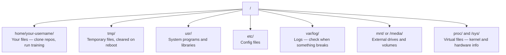

# لينكس للذكاء الاصطناعي  لينكس الأساس 

> معظم الذكاء الاصطناعي يعمل على لينكس يجب ان تعرف ما يكفي لكي لا تكون عالقاً
> معظم الذكاء الاصطناعي يعمل على لينكس عليك أن تتعلم ما يكفي من المعرفة، ليس فقط في الحركة

**Type:** Learn | **类型:** 学习
**Languages:** -- | **语言:** 无
**Prerequisites:** Phase 0, Lesson 01 | **前置知识:** Phase 0, 第 01 课
**Time:** ~30 minutes | **时间:** ~30 分钟

## أهداف التعلم

- التنقل في نظام الملفات لينكس وإجراء عمليات الملفات الأساسية من خط الأوامر
  中文翻译: in Linux 文件系统中导航, من أمر行执行基本文件操作
- إدارة الإذنات الملفية مع `chmod`و`chown`لحل أخطاء "منح السماح"
  中文翻译: استخدام `chmod`和 `chown`管理文件权限,解决"الاجازة رفض" خطأ
- قم بتثبيت حزم النظام مع `apt`ووضع صندوق جديد لـ (GPU) للعمل الذكي
  中文翻译: استخدام `apt`تنصيب نظام، لـ GPU جديد  خادم تكوين الذكاء الاصطناعي  العمل البيئة
- تحديد الاختلافات بين macOS و Linux التي عادة ما تعثّر على المطورين الذين يعملون على أجهزة بعيدة
  中文翻译:识别从macOS 转换到Linux 时常见的踩坑点

> **【中文解读】**
> معظم تدريبات الذكاء الاصطناعي تعمل على خادم لينكس. عندما تقوم بتشغيل SSH إلى نظام التشغيل الجيوبي السحابي، فإنك فقط تتمتع بموجب الموقع النهائي.

## المشكلة

تطوير على macOS أو Windows. ولكن في اللحظة التي تقوم بها في صندوق GPU السحابية، أو تستأجر مثالاً للامبدا، أو تقوم بتشغيل جهاز EC2، أنت تهبط في أوبونتو. المحطة هي واجهتك الوحيدة لا يوجد "فيندر" ولا "إكسبلورر" ولا "GUI". إذا لم تتمكن من التنقل في نظام الملفات، وتثبيت الحزم، وإدارة العمليات من خط الأوامر، فأنت عالق في دفع ساعات عمل الجيبو المتداولة أثناء بحثك في جوجل "كيفية فك زيب ملف في لينكس".

> أنت في macOS أو Windows على تطويرها. ولكن بمجرد أن تقوم SSH إلى خادم GPU السحابي ‬استئجار Lambda ‬ مثال أو تشغيل EC2 ‬ آلة، أنت دخلت Ubuntu‬ المحطة هي واجهتك الوحيدة‬‬ بدون Finder‬ بدون Explorer‬ بدون GUI‬‬‬ إذا لم تتمكن من التنفيذ من نظام الملفات التوجيهية‬ التثبيت والإدارة، يمكنك فقط في عملية دفع GPU ‬

هذا دليل للبقاء. يغطى بالضبط ما تحتاج إليه لتشغيل جهاز لينكس عن بعد للعمل على الذكاء الاصطناعي. لا شيء آخر.

> هذا هو دليل على البقاء. إنه يغطى فقط المعرفة اللازمة للقيام بعمل الذكاء الاصطناعي على أجهزة لينكس بعيدة المدى.

> **【中文解读】**
> أنت عادة ما تستخدم ماكوس أو ويندوز لتطوير، ولكن خدمة SSH إلى الجيوبي السحابية دخلت إلى لينكس العالم.

## نظام الملفات ترتيب نظام الملفات

لينكس يُنظم كل شيء تحت جذور واحدة`/`لا يوجد`C:\`أو`/Volumes`المجلات التي ستلمسها فعلاً:

> لينكس سوف تنظم كل المحتوى في دليل واحد`/`لا يوجد`C:\`أو`/Volumes`你实际会接触的目录:

> **【中文解读】**
> نظام لينكس هو بنية واحدة على شكل شجرة، والكتابة الجذرية هي`/`.`/home/用户名/`(简写 `~`) هو دفتر عملك، كل عمليات تقريباً يتم هنا`/tmp/`存临时文件,重启后清空──`/var/log/`存日志,出问题时必查──`/mnt/`‬‬‬‬‬‬‬‬‬‬‬‬‬‬‬‬‬‬‬‬‬‬‬‬‬‬‬‬‬‬‬‬‬‬‬‬‬‬‬‬‬‬‬‬‬‬‬‬‬‬‬‬‬‬‬‬‬‬‬‬‬‬‬‬‬‬‬‬‬‬‬‬‬‬‬‬‬‬‬‬‬‬‬‬‬‬‬‬‬‬‬‬‬‬‬‬‬‬‬‬‬‬‬‬‬‬‬‬‬‬‬‬‬‬‬‬‬‬‬‬‬‬‬‬‬‬‬‬‬‬‬‬‬‬‬‬‬‬‬‬‬‬‬‬‬‬‬‬‬‬‬‬‬‬‬‬‬‬‬‬‬‬‬‬‬‬‬‬‬‬‬‬‬‬‬‬‬‬‬‬‬‬‬‬‬‬‬‬‬‬‬‬‬‬‬‬‬‬‬‬‬‬‬‬‬‬‬‬‬‬‬‬‬‬‬‬‬‬‬‬‬‬‬‬‬‬‬‬‬‬‬‬‬‬‬‬‬‬‬‬‬‬‬‬‬‬‬‬‬‬‬‬‬‬‬‬‬‬‬‬‬‬‬‬‬‬‬‬‬‬‬‬‬‬‬‬‬‬‬‬‬‬‬‬‬‬‬‬‬‬‬‬‬‬‬‬‬‬‬‬‬‬‬‬‬‬‬‬‬‬‬‬‬‬‬‬‬‬‬‬‬‬‬‬‬‬‬‬‬‬‬‬‬‬‬‬‬‬‬‬‬‬‬‬‬‬‬‬‬‬‬‬‬‬‬‬‬‬‬‬‬‬‬‬‬‬‬‬‬‬‬‬‬‬‬‬‬‬‬‬‬‬‬‬‬‬‬‬‬‬‬‬‬‬‬‬‬‬‬‬‬‬‬‬‬‬‬‬‬‬‬‬‬‬‬‬‬‬‬‬‬‬‬‬‬‬‬‬‬‬‬‬‬‬‬‬‬‬‬‬‬‬‬‬‬‬‬‬‬‬‬‬‬‬‬‬‬‬‬‬‬‬‬‬‬‬‬‬‬‬‬‬‬‬‬‬‬‬‬‬‬‬‬‬‬‬‬‬‬‬‬‬‬‬‬‬‬‬‬‬‬‬‬‬‬‬‬‬‬



دليل منزلك هو`~`أو`/home/your-username`كل ما تفعله تقريباً يحدث هنا

> المقالة الرئيسية هي`~`أو`/home/your-username`تقريبا كل العمليات هنا

## الأوامر الأساسية الأوامر العادية

هذه هي الأوامر الخمسة عشر التي تغطي 95٪ من ما ستفعله على مربع GPU عن بعد.

> هذه الـ 15 أمر تغطي 95٪ من عملياتك على خادمات الجيبو المُبعدة

> **【中文解读】**
> تحتاج فقط إلى إتقان حوالي 15 أمرًا لتتمكن من إنجاز 95٪ من العمل على خادم لينكس بعيدًا. تُقسم هذه الأوامر إلى أربعة فئات:导航: pwd、ls、cd) 、 عملية الملفات: cp、mv、rm、mkdir) 、查看文件: cat、head、tail、grep) وبحث: ‬find、grep 杂r (‬‬‬‬‬‬‬‬‬‬‬‬‬‬‬‬‬‬‬‬‬‬‬‬‬‬‬‬‬‬‬‬‬‬‬‬‬‬‬‬‬‬‬‬‬‬‬‬‬‬‬‬‬‬‬‬‬‬‬‬‬‬‬‬‬‬‬‬‬‬‬‬‬‬‬‬‬‬‬‬‬‬‬‬‬‬‬‬‬‬‬‬‬‬‬‬‬‬‬‬‬‬‬‬‬‬‬‬‬‬‬‬‬‬‬‬‬‬‬‬‬‬‬‬‬‬‬‬‬‬‬‬‬‬‬‬‬‬‬‬‬‬‬‬‬‬‬‬‬‬‬‬‬‬‬‬‬‬‬‬‬‬‬‬‬‬‬‬‬‬‬‬‬‬‬‬‬‬‬‬‬‬‬‬‬‬‬‬‬‬‬‬‬‬‬‬‬‬‬‬‬‬‬‬‬‬‬‬‬‬‬‬‬‬‬‬‬‬‬‬‬‬‬‬‬‬‬‬‬‬‬‬‬‬‬‬‬‬‬‬‬‬‬‬‬‬‬‬‬‬‬‬‬‬‬‬‬‬‬‬‬‬‬‬‬‬‬‬‬‬‬‬‬‬‬‬‬‬‬‬‬‬‬‬‬‬‬‬‬‬‬‬‬‬‬‬‬‬‬‬‬‬‬‬‬‬‬‬‬‬‬‬‬‬‬‬‬‬‬‬‬‬‬‬‬‬‬‬‬‬‬‬‬‬‬‬‬‬‬‬‬‬‬‬‬‬‬‬‬‬‬‬‬‬‬‬‬‬‬‬‬‬‬‬‬‬‬‬‬‬‬‬‬‬‬‬‬‬‬‬‬‬‬‬‬‬‬‬‬‬‬‬‬‬‬‬‬‬‬‬‬‬‬‬‬

### تتحرك حولها

```bash
pwd                         # Where am I?  当前在哪个目录？
ls                          # What's here?  列出当前目录内容
ls -la                      # What's here, including hidden files with details?  详细列出所有文件（含隐藏文件）
cd /path/to/dir             # Go there  切换到指定目录
cd ~                        # Go home  回到主目录
cd ..                       # Go up one level  返回上一级目录
```

### الملفات والإداريات

```bash
mkdir my-project            # Create a directory  创建目录
mkdir -p a/b/c              # Create nested directories in one shot  递归创建多级目录

cp file.txt backup.txt      # Copy a file  复制文件
cp -r src/ src-backup/      # Copy a directory (recursive)  递归复制目录

mv old.txt new.txt          # Rename a file  重命名文件
mv file.txt /tmp/           # Move a file  移动文件

rm file.txt                 # Delete a file (no trash, it's gone)  删除文件（无法恢复！）
rm -rf my-dir/              # Delete a directory and everything inside  递归删除目录（危险操作！）
```

`rm -rf`لا يوجد إعادة التأجيل، تحقق من المسار قبل الضربة على الدخول

> `rm -rf`إزالة دائمة. لا إزالة.

### قراءة الملفات

```bash
cat file.txt                # Print entire file  打印整个文件内容
head -20 file.txt           # First 20 lines  查看前 20 行
tail -20 file.txt           # Last 20 lines  查看后 20 行
tail -f log.txt             # Follow a log file in real time (Ctrl+C to stop)  实时跟踪日志文件
less file.txt               # Scroll through a file (q to quit)  分页浏览文件
```

### البحث البحث والبحث

```bash
grep "error" training.log           # Find lines containing "error"  搜索包含 "error" 的行
grep -r "learning_rate" .           # Search all files in current directory  递归搜索所有文件
grep -i "cuda" config.yaml          # Case-insensitive search  不区分大小写搜索

find . -name "*.py"                 # Find all Python files under current dir  查找所有 Python 文件
find . -name "*.ckpt" -size +1G     # Find checkpoint files larger than 1GB  查找大于 1GB 的检查点文件
```

## الإذنات الحقوق المستندية

كل ملف في لينكس لديه مالك وفرص الإذن سوف تجد هذا عندما لا تنفذ النصوص أو لا يمكنك الكتابة إلى دليل

> كل ملف في لينكس لديه مكان للمالك والحكم. عندما لا يمكن تنفيذ الكتابة أو عدم إمكانية كتابةها في السجل، فإنك تواجه هذه المشكلة.

> **【中文解读】**
> لينكس 权限分为三组:文件所有者(مالك) 、同组用户(group) 、其他用户(其他) ⋅每组有读(r) 、写(w) 、执行(x) 三种权限。`chmod +x`让脚本可执行،`chmod 644`تعيين الملفات للمالك يمكن قراءتها، والآخرين فقط قراءتها.`chmod`أو`sudo`حل

```bash
ls -l train.py
# -rwxr-xr-- 1 user group 2048 Mar 19 10:00 train.py
#  ^^^             owner permissions: read, write, execute
#     ^^^          group permissions: read, execute
#        ^^        everyone else: read only
```

الإصلاحات المشتركة:

> 常见修复方法:

```bash
chmod +x train.sh           # Make a script executable  让脚本可执行
chmod 755 deploy.sh         # Owner: full, others: read+execute  所有者全部权限，其他人可读可执行
chmod 644 config.yaml       # Owner: read+write, others: read only  所有者可读写，其他人只读

chown user:group file.txt   # Change who owns a file (needs sudo)  修改文件所有者（需要 sudo）
```

عندما يقول شيء "الاجازة رفضت" انها دائما تقريبا مشكلة الإذن. `chmod +x`أو`sudo`سوف تصحح معظم الحالات

> عندما تظهر "الذات السماح رفض" ، تقريبا دائما مشكلة الحكم.`chmod +x`أو`sudo`能解决 معظم الحالات

## إدارة الحزمة

استخدامات Ubuntu`apt`هكذا تقوم بتثبيت البرمجيات على مستوى النظام

> Ubuntu 使用 `apt`هذا هو طريقة تنصيب نظام درجة البرمجيات‬

```bash
sudo apt update             # Refresh the package list (always do this first)  更新软件包列表（首先执行）
sudo apt install -y htop    # Install a package (-y skips confirmation)  安装软件包（-y 跳过确认）
sudo apt install -y build-essential  # C compiler, make, etc. Needed by many Python packages  C 编译器和构建工具
sudo apt install -y tmux    # Terminal multiplexer (keep sessions alive after disconnect)  终端复用器

apt list --installed        # What's installed?  查看已安装的软件包
sudo apt remove htop        # Uninstall  卸载软件包
```

> **【中文解读】**
> `apt`هو إدارة الحزمة في أوبونتو.`apt update`刷新列表──`build-essential`提供 C 编译器,很多 Python 包(如numpy、torch) تحتاجها لتقوم بتجميعها`tmux`هو أداة ضرورية للحفاظ على المحادثة عن بعد غير المقطوعة.

> **【拓展：新 GPU 服务器的初始化清单】**
> بعد الحصول على جهاز خدمة GPU جديد، عادة ما تحتاج إلى تنفيذ:`apt update && apt install -y build-essential git curl wget tmux htop unzip python3-venv` ثم تثبيت NVIDIA 驱动和 CUDA Toolkit، وإعادة تثبيت conda/uv──AWS EC2 Deep Learning AMI 已预装大部分工具, ولكن الحالات في Lambda Labs 和 Vast.ai تحتاج عادة إلى عملية تشغيل يدوية‬‬‬‬‬‬‬‬‬‬‬‬‬‬‬‬‬‬‬‬‬‬‬‬‬‬‬‬‬‬‬‬‬‬‬‬‬‬‬‬‬‬‬‬‬‬‬‬‬‬‬‬‬‬‬‬‬‬‬‬‬‬‬‬‬‬‬‬‬‬‬‬‬‬‬‬‬‬‬‬‬‬‬‬‬‬‬‬‬‬‬‬‬‬‬‬‬‬‬‬‬‬‬‬‬‬‬‬‬‬‬‬‬‬‬‬‬‬‬‬‬‬‬‬‬‬‬‬‬‬‬‬‬‬‬‬‬‬‬‬‬‬‬‬‬‬‬‬‬‬‬‬‬‬‬‬‬‬‬‬‬‬‬‬‬‬‬‬‬‬‬‬‬‬‬‬‬‬‬‬‬‬‬‬‬‬‬‬‬‬‬‬‬‬‬‬‬‬‬‬‬‬‬‬‬‬‬‬‬‬‬‬‬‬‬‬‬‬‬‬‬‬‬‬‬‬‬‬‬‬‬‬‬‬‬‬‬‬‬‬‬‬‬‬‬‬‬‬‬‬‬‬‬‬‬‬‬‬‬‬‬‬‬‬‬‬‬‬‬‬‬‬‬‬‬‬‬‬‬‬‬‬‬‬‬‬‬‬‬‬‬‬‬‬‬‬‬‬‬‬‬‬‬‬‬‬‬‬‬‬‬‬‬‬‬‬‬‬‬‬‬‬‬‬‬‬‬‬‬‬‬‬‬‬‬‬‬‬‬‬‬‬‬‬‬‬‬‬‬‬‬‬‬‬‬‬‬‬‬‬‬‬‬‬‬‬‬‬‬‬‬‬‬‬‬‬‬‬‬‬‬‬‬‬‬‬‬‬‬‬‬‬‬‬‬‬‬‬‬‬‬‬‬‬‬‬‬‬‬‬‬‬‬‬‬‬‬‬‬‬‬‬‬‬‬‬‬‬‬‬‬‬‬‬‬‬‬‬‬‬‬‬‬

الحزم المشتركة التي ستثبّتها على صندوق جديد لـ (GPU):

> عادةً يتم تثبيت حزمة على خادم GPU الجديد:

```bash
sudo apt update && sudo apt install -y \
    build-essential \
    git \
    curl \
    wget \
    tmux \
    htop \
    unzip \
    python3-venv
```

## المستخدمين و sudo

عادة ما تكون مستخدمًا منتظمًا. بعض العمليات تحتاج إلى وصول الجذر (الإدارة).

> أنت عادة مع المستخدم العادي تسجيل الدخول.

```bash
whoami                      # What user am I?  查看当前用户名
sudo command                # Run a single command as root  以 root 权限执行命令
sudo su                     # Become root (exit to go back, use sparingly)  切换为 root 用户（谨慎使用）
```

> **【中文解读】**
> لينكس لديها مستوى صارم للصلاحيات. يمكن للمستخدم العادي فقط تشغيل الملفات الخاصة به.`sudo`(superuser do) ―― أفضل ممارسة هي فقط في الوقت الضروري استخدام `sudo`لا تستمر في التشغيل على أساس طويل حتى لا يتم حذف الملفات المخطئة

في حالات مجرى GPU السحاب، أنت عادة المستخدم الوحيد ولديك بالفعل إمكانية الوصول إلى sudo. لا تشغيل كل شيء كجذر. استخدم sudo فقط عندما يكون هناك حاجة.

> في مثالات الجيبو في السحابة، عادة ما تكون المستخدم الوحيد ويكون لديه السلطة على sudo. لا تستخدم sudo فقط عندما تحتاج.

## عمليات و نظم إدارة العمليات

عندما يتوقف تدريبك أو تحتاج للتحقق من ما يجري

> عندما تتدرب أو تحتاج إلى فحص عملية تشغيل:

```bash
htop                        # Interactive process viewer (q to quit)  交互式进程查看器
ps aux | grep python        # Find running Python processes  查找 Python 进程
kill 12345                  # Gracefully stop process with PID 12345  优雅终止进程
kill -9 12345               # Force kill (use when graceful doesn't work)  强制终止进程
nvidia-smi                  # GPU processes and memory usage  查看 GPU 进程和显存
```

> **【中文解读】**
> عندما تدربت في الحياة، استخدم`htop`انظروا إلى أي عملية تستغرق الموارد، تستغرق`kill`نهاية عملية الخروج عن السيطرة`kill -9`إنه أمر محظور فقط`kill`无效时使用──`nvidia-smi`هو أمر أساسي لإدارة عمليات الجيبو، يمكن أن ترى أي عمليات تستخدم الجيبو

نظام (د) يدير الخدمات (الشيطانيات الخلفية). ستستخدمها إذا قمت بتشغيل خوادم الاستخدام:

> نظام إدارة الخدمة (التي تُستخدمها في عمليات التشغيل)

```bash
sudo systemctl start nginx          # Start a service  启动服务
sudo systemctl stop nginx           # Stop it  停止服务
sudo systemctl restart nginx        # Restart it  重启服务
sudo systemctl status nginx         # Check if it's running  查看服务状态
sudo systemctl enable nginx         # Start automatically on boot  设置开机自启
```

## مساحة القرص

علبات GPU غالباً ما تكون محدودة مساحة القرص. النماذج ومجموعات البيانات تملأها بسرعة.

> مساحة القرص الصفري لخدمة الجيبو عادة ما تكون محدودة.

```bash
df -h                       # Disk usage for all mounted drives  查看所有磁盘使用情况
df -h /home                 # Disk usage for /home specifically  查看 /home 分区使用情况

du -sh *                    # Size of each item in current directory  查看当前目录各项大小
du -sh ~/.cache             # Size of your cache (pip, huggingface models land here)  缓存目录大小
du -sh /data/checkpoints/   # Check how big your checkpoints are  检查检查点文件大小

# Find the biggest space hogs  找出最大的空间占用
du -h --max-depth=1 / 2>/dev/null | sort -hr | head -20
```

> **【中文解读】**
> 磁盘空间 of GPU 服务器 磁盘空间 of often not sufficient. 磁盘空间 of GPU 服务器 磁盘空间 of often not sufficient. 磁盘空间 of GPU 服务器 磁盘空间 of GPU 服务器 often not sufficient. 磁盘空间 of GPU 服务器 磁盘空间 of GPU 服务器 often not sufficient. 磁盘空间 of GPU 服务器 磁盘空间 of GPU 服务器 often not sufficient. 磁盘空间 of GPU 磁盘 space of GPU 磁盘 space often not sufficient. 磁盘 space of GPU 磁盘 space of GPU 磁盘 space of GPU 磁盘 space of GPU 磁盘 space of GPU 磁盘 of GPU 磁盘 of GPU 磁盘 of GPU 磁盘 of GPU 磁盘 of GPU 磁盘 of GPU 磁盘 of GPU 磁盘 of GPU 磁盘 of GPU 磁盘 of GPU 磁盘 of GPU 磁 磁 磁 磁 磁 磁 磁 磁 磁 磁 磁 磁 磁 磁 磁 磁 磁 磁 磁 磁 磁 磁 磁 磁 磁 磁 磁 磁 磁 磁 磁 磁 磁 磁 磁 磁 磁 磁 磁 磁 磁 磁 磁 磁 磁 磁 磁 磁 磁 磁 磁 磁 磁 磁 磁 磁 磁 磁 磁 磁 磁 磁 磁 磁 磁 磁 磁 磁 磁 磁 磁 磁 磁 磁 磁 磁 磁 磁 磁 磁 磁 磁 磁 磁 磁 磁 磁 磁 磁 磁 磁 磁 磁 磁 磁 磁 磁 磁 磁 磁 磁 磁 磁 磁 磁 磁 磁 磁 磁 磁 磁 磁 磁 磁 磁 磁 磁 磁 磁 磁 磁 磁 磁 磁 磁 磁 磁 磁 磁 磁 磁 磁 磁 磁 磁 磁 磁 磁 磁 磁 磁 磁 磁 磁 磁 磁 磁 磁 磁 磁 磁 `df -h`查看整体磁盘使用,用 `du -sh *`找到具体哪个目录占用空间最多──定期清理 `~/.cache/huggingface/`و الملفات القديمة

الجهاز المشترك لإنقاذ المساحة:

> 常见的空间清理方法:

```bash
# Clear pip cache  清理 pip 缓存
pip cache purge

# Clear apt cache  清理 apt 缓存
sudo apt clean

# Remove old checkpoints you don't need  删除不需要的旧检查点
rm -rf checkpoints/epoch_01/ checkpoints/epoch_02/
```

## شبكات التشغيل

سوف تنزيل النماذج ونقل الملفات و تضغط على APIs من خط الأوامر.

> سوف تقوم بتنزيل النماذج وملفات النقل و تدوين API

```bash
# Download files  下载文件
wget https://example.com/model.bin                   # Download a file  下载文件
curl -O https://example.com/data.tar.gz              # Same thing with curl  用 curl 下载
curl -s https://api.example.com/health | python3 -m json.tool  # Hit an API, pretty-print JSON  调用 API 并格式化输出

# Transfer files between machines  在机器间传输文件
scp model.bin user@remote:/data/                     # Copy file to remote machine  复制文件到远程机器
scp user@remote:/data/results.csv .                  # Copy file from remote to local  从远程复制到本地
scp -r user@remote:/data/checkpoints/ ./local-dir/   # Copy directory  复制整个目录

# Sync directories (faster than scp for large transfers, resumes on failure)  同步目录（比 scp 快，支持断点续传）
rsync -avz --progress ./data/ user@remote:/data/
rsync -avz --progress user@remote:/results/ ./results/
```

> **【中文解读】**
> إنّ الوصول إلى النظام هو أداة يومية للمهندس الذكي.`wget`和 `curl`تحميل النماذج والمعطيات`scp`في محلي و بعيد الجهاز بين نسخ الملفات`rsync`هو أول اختيار لنقل البيانات الكبيرة. إنه يُحافظ على التغييرات التي يتم تنفيذها فقط، ويدعم النقطة المتواصلة، أكثر من النقطة المتواصلة.

> **【拓展：rsync 在 AI 工作流中的关键作用】**
> عندما كنت في AWS p4d مثال ((32.77/小时) على التدريب على الانتهاء من ماجستير في إدارة الأعمال ، تحتاج إلى نقل 50GB من نقطة الاختبار إلى الوطن.

استخدام`rsync`- لقد انتهت`scp`لا شيء كبير، إنه يُحمل فقط الإتصال المتقطع

>  بالنسبة إلى الملفات الكبيرة , الاستخدام الأولوي `rsync`و لا`scp`                                                                                                                                                                                                                                                              

## أبقَ الجلسات حية

عندما تضعها في صندوق بعيد، إغلاق الكمبيوتر المحمول يقتل تدريبك.

> عندما تصل إلى الخادم البعيد، اغلق الحاسوب.

```bash
tmux new -s train           # Start a new session named "train"  创建名为 "train" 的新会话
# ... start your training, then:
# Ctrl+B, then D            # Detach (training keeps running)  分离会话（训练继续运行）

tmux ls                     # List sessions  列出所有会话
tmux attach -t train        # Reattach to session  重新连接到会话

# Inside tmux:  tmux 内操作：
# Ctrl+B, then %            # Split pane vertically  垂直分割面板
# Ctrl+B, then "            # Split pane horizontally  水平分割面板
# Ctrl+B, then arrow keys   # Switch between panes  切换面板
```

> **【中文解读】**
> tmux هو جهاز حماية التدريبات البيئية على الجيبو المُنحى.`Ctrl+B, D`تفصل، التدريب في المستوى التالي`tmux attach`重新连接──长时间训练任务必须用tmux──

دائماً أدير وظائف تدريب طويلة داخل المتحرك

> 长时间训练任务务必在tmux 中运行――务必如此――

> **【拓展：Linux 在 AI 基础设施中的统治地位】**
> أكثر من 99% من تدريبات الذكاء الاصطناعي العالمية تعمل على لينكس. AWS، GCP، Azure، GPU، جميع الأمثلة على لينكس.

## WSL2 للمستخدمين Windows

> **【中文解读】**
> WSL2 جعله مستخدم Windows يحصل على Linux  بيئة حقيقية, لا حاجة إلى نظامين.`/mnt/c/Users/用户名/`访问── هي أفضل طريقة لمستخدمي ويندوز لتعلم لينكس و AI 开发──

إذا كنت على ويندوز، WSL2 يعطيك بيئة لينكس حقيقية دون إعادة تشغيل مزدوجة.

> إذا كنت تستخدم ويندوز، وWSL2  بدون حاجة إلى نظامين  فسوف يمنحك بيئة لينكس الحقيقية ‬‬‬‬‬‬‬‬‬‬‬‬‬‬‬‬‬‬‬‬‬‬‬‬‬‬‬‬‬‬‬‬‬‬‬‬‬‬‬‬‬‬‬‬‬‬‬‬‬‬‬‬‬‬‬‬‬‬‬‬‬‬‬‬‬‬‬‬‬‬‬‬‬‬‬‬‬‬‬‬‬‬‬‬‬‬‬‬‬‬‬‬‬‬‬‬‬‬‬‬‬‬‬‬‬‬‬‬‬‬‬‬‬‬‬‬‬‬‬‬‬‬‬‬‬‬‬‬‬‬‬‬‬‬‬‬‬‬‬‬‬‬‬‬‬‬‬‬‬‬‬‬‬‬‬‬‬‬‬‬‬‬‬‬‬‬‬‬‬‬‬‬‬‬‬‬‬‬‬‬‬‬‬‬‬‬‬‬‬‬‬‬‬‬‬‬‬‬‬‬‬‬‬‬‬‬‬‬‬‬‬‬‬‬‬‬‬‬‬‬‬‬‬‬‬‬‬‬‬‬‬‬‬‬‬‬‬‬‬‬‬‬‬‬‬‬‬‬‬‬‬‬‬‬‬‬‬‬‬‬‬‬‬‬‬‬‬‬‬‬‬‬‬‬‬‬‬‬‬‬‬‬‬‬‬‬‬‬‬‬‬‬‬‬‬‬‬‬‬‬‬‬‬‬‬‬‬‬‬‬‬‬‬‬‬‬‬‬‬‬‬‬‬‬‬‬‬‬‬‬‬‬‬‬‬‬‬‬‬‬‬‬‬‬‬‬‬‬‬‬‬‬‬‬‬‬‬‬‬‬‬‬‬‬‬‬‬‬‬‬‬‬‬‬‬‬‬‬‬‬‬‬‬‬‬‬‬‬‬‬‬‬‬‬‬‬‬‬‬‬‬‬‬‬‬‬‬‬‬‬‬‬‬‬‬‬‬‬‬‬‬‬‬‬‬‬‬‬‬‬‬‬‬‬‬‬‬‬‬‬‬‬‬‬‬‬‬‬‬‬‬‬‬‬‬‬‬‬‬‬‬‬‬‬‬‬‬‬‬‬‬‬‬‬‬‬‬‬‬

```bash
# In PowerShell (admin)
wsl --install -d Ubuntu-24.04

# After restart, open Ubuntu from Start menu
sudo apt update && sudo apt upgrade -y
```

وسل2 تشغيل نواة لينكس حقيقية كل شيء في هذه الدروس يعمل بداخلها. ملفات ويندوز الخاصة بك في`/mnt/c/Users/YourName/`من داخل WSL.

> WSL2 运行真正的Linux内核──本课件所有内容都可在其中使用──Windows 文件在 WSL内通过 `/mnt/c/Users/YourName/`访问

يعمل GPU pasthrough مع برامج تشغيل NVIDIA مثبتة على جانب Windows. قم بتثبيت برامج تشغيل Windows NVIDIA (وليس لينكس) ، وسوف تكون CUDA متاحة داخل WSL2.

> GPU مباشرة من خلال Windows 侧安装的NVIDIA 驱动工作──安装 Windows 版 NVIDIA 驱动(不是 Linux 版),CUDA 就能在 WSL2 内使用──

> **【拓展：WSL2 GPU 支持的实际表现】**
> يعمل الجيروفونات الجرافية مباشرة من WSL2 على نحو قريب من النظام الأساسي لينكس، وPyTorch و TensorFlow قادرة على استخدام CUDA بشكل طبيعي.`nvidia-smi`يمكن رؤية GPU Windows.`/mnt/c/`) من WSL2 النظام المستندات الأصلية بطيئة 3-5 倍.`~/`حالياً، تحصل على أفضل أداء

## حصلت على: macOS إلى لينكس

أشياء ستعثر عليك إذا كنت قادما من macOS:

> إذا كنت قد انتقلت من نظام التشغيل (ماكوس) ، هذه الأشياء ستجعلك تتحرك:

| macOS | Linux | Notes |
|-------|-------|-------|
| `brew install` | `sudo apt install` | Different package names sometimes. `brew install htop` vs `sudo apt install htop` works the same, but `brew install readline` vs `sudo apt install libreadline-dev` does not. |
| `open file.txt` | `xdg-open file.txt` | But you won't have a GUI on a remote box. Use `cat` or `less`. |
| `pbcopy` / `pbpaste` | Not available | Pipe to/from clipboard doesn't exist over SSH. |
| `~/.zshrc` | `~/.bashrc` | macOS defaults to zsh. Most Linux servers use bash. |
| `/opt/homebrew/` | `/usr/bin/`, `/usr/local/bin/` | Binaries live in different places. |
| `sed -i '' 's/a/b/' file` | `sed -i 's/a/b/' file` | macOS sed needs an empty string after `-i`. Linux does not. |
| Case-insensitive filesystem | Case-sensitive filesystem | `Model.py` and `model.py` are two different files on Linux. |
| Line endings `\n` | Line endings `\n` | Same. But Windows uses `\r\n`, which breaks bash scripts. Run `dos2unix` to fix. |

| macOS | Linux | 注意事项 |
|------|------|---------|
| `brew install` | `sudo apt install` | 包名有时不同，如 readline vs libreadline-dev |
| `open file.txt` | `xdg-open file.txt` | 远程服务器无 GUI，用 `cat` 或 `less` |
| `pbcopy` / `pbpaste` | 不可用 | SSH 下无法操作剪贴板 |
| `~/.zshrc` | `~/.bashrc` | macOS 默认 zsh，Linux 服务器多用 bash |
| `/opt/homebrew/` | `/usr/bin/`, `/usr/local/bin/` | 可执行文件路径不同 |
| `sed -i '' 's/a/b/' file` | `sed -i 's/a/b/' file` | macOS sed 的 `-i` 后需要空字符串 |
| 大小写不敏感 | 大小写敏感 | `Model.py` 和 `model.py` 是两个不同文件 |
| 换行符 `\n` | 换行符 `\n` | 相同，但 Windows 的 `\r\n` 会破坏 bash 脚本 |

## بطاقة مرجع سريعة

```
Navigation:     pwd, ls, cd, find
Files:          cp, mv, rm, mkdir, cat, head, tail, less
Search:         grep, find
Permissions:    chmod, chown, sudo
Packages:       apt update, apt install
Processes:      htop, ps, kill, nvidia-smi
Services:       systemctl start/stop/restart/status
Disk:           df -h, du -sh
Network:        curl, wget, scp, rsync
Sessions:       tmux new/attach/detach
```

## تمارين التدريب
```figure
s0-process-fork
```

## التمارين

1. SSH إلى أي جهاز لينكس (أو فتح WSL2) والتنقل إلى دليل منزلك. إنشاء مجلد مشروع، وإنشاء ثلاثة ملفات فارغة داخلها مع `touch`، ثم قم بإدراجهم مع`ls -la`. . .
   SSH إلى Linux 机器,创建项目文件和空文件,用 `ls -la`列出
2. إثباط`htop`مع apt، تشغيله، وتحديد أي عملية تستخدم أكثر الذاكرة.
   استخدم معدل تثبيت htop، ومعرفة أكثر عمليات تستغرق في الذاكرة
3. أبدأ جلسة التمكس، أبدأ`sleep 300`داخلها، انفصل، قائمة جلسات، وإعادة ربط.
   创建 tmux 会话,运行睡眠 命令,分离后重新连接
4. استخدام`df -h`للتحقق من مساحة القرص المتاحة ، ثم استخدم `du -sh ~/.cache/*`لإيجاد ما يأخذ مساحة في مخزنك
    تحقق من مساحة القرص الصوتي، ومعرفة محتويات احتلال أكبر مساحة في الاحتفاظ
5. نقل ملف من جهازك المحلي إلى جهاز بعيد عن بعد باستخدام `scp`، ثم قم بنفس النقل مع`rsync`و مقارنة الخبرة.
   استخدام scp و rsync 分別傳输文件,對比兩種方式
