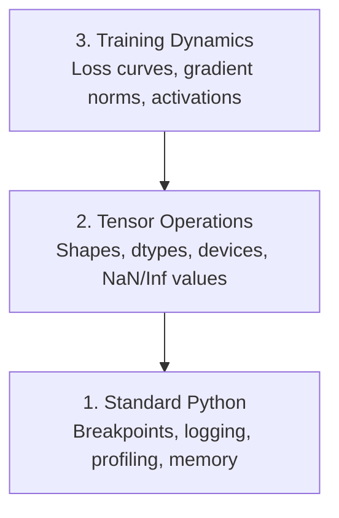

# إزالة الأخطاء وتحليل الملفات الشخصية

> أسوأ حشرات الذكاء الاصطناعي لا تتحطم، إنها تتدرب بصمت على القمامة وتبلغ عن منحنى خسارة جميل.
> أسوأ حوادث الذكاء الاصطناعي لن تدفع البرنامج للخطر.

**Type:** Build | **类型:** 构建
**Language:**" بايثون "**语言:**بايثون
**Prerequisites:** Lesson 1 (Dev Environment), basic PyTorch familiarity | **前置知识:** 第 1 课（开发环境），基本 PyTorch 知识
**Time:** ~60 minutes | **时间:** ~60 分钟

## أهداف التعلم

- استخدم مشروط `breakpoint()`و`debug_print`لتحقق من أشكال الانسدادات، وأنواعها، وقيم NaN في منتصف التدريب
  中文翻译: استخدام条件 `breakpoint()`和 `debug_print`خلال عملية التدريب فحص شكل الكمية والنوع البيانات والقيمة الناتجة عن النمو
- حلقات التدريب المهنية مع `cProfile`،`line_profiler`و`tracemalloc`للعثور على ضغوط الزجاجة
  中文翻译: استخدام `cProfile`.`line_profiler`和 `tracemalloc`تحليل دورة التدريب، العثور على بطاقة الأداء
- اكتشاف الأخطاء المشتركة في الذكاء الاصطناعي: عدم مطابقة الشكل ، وفقدان NaN ، تسرب البيانات ، وتنسورات الجهاز الخطأ
  中文翻译:检测常见 AI bug:形状不匹配、NaN فقدان、 Data leakage和设备错误
- قم بتعيين TensorBoard لتصور منحنى الخسارة، وخطوط الوزن، وتوزيعات التراجع
  中文翻译: إعداد TensorBoard 可视化损失 曲线、权重直方图和梯度分布

> **【中文解读】**
> كود AI 代码的 bug 和普通代码不同: فإنه لن ينهار إخطاءات، ولكن بشكل صامت باستخدام خطأ البيانات تدريب على نموذج لا فائدة له.

> **【拓展：AI 调试为什么特别难？】**
> عادة ما يكون هناك خطأ واضح في تطوير الويب التقليدي 🏻 ولكن خطأ الذكاء الاصطناعي هو "التغلب الصامت" تمارس النموذج على بيانات خاطئة 8 ساعات، الخسارة تبدو طبيعية، ولكن في النهاية التنبؤ كله هو القمامة🏻 السبب الشائع: الصيغة الصغرى غير المتطابقة🏻

## المشكلة

ينفشل رمز الذكاء الاصطناعي بشكل مختلف عن الرمز العادي. ينهار تطبيق الويب مع تعقب كومة. يمر حلقة تدريب خاطئة لمدة 8 ساعات، يحرق 200 دولار في وقت GPU، وينتج نموذج يتوقع متوسط كل مدخل.`.detach()`أو اللبنانات التي تسرب في الميزات

> طريقة فشل كود AI مختلفة عن الكود العادي. تطبيقات الويب سوف تتحطم وتعطى الكثير من التتبع. دورة تدريبية خاطئة للتصميم تعمل لمدة 8 ساعات. تحرق 200 دولار من وقت GPU ، ثم تنتج نموذجًا متوقعًا لكل الإدخال المتوسط.`.detach()`أو التسمية تتفشّل في الميزات

تحتاج إلى أدوات التحكم التي تلتقط هذه الفشل الصامت قبل أن تضيع وقتك والحساب.

> تحتاج إلى أن تكون قادرة على التقاط أدوات التدريب قبل أن تُفشل هذه الصمتة وتضييع الوقت والحسابات.

> **【中文解读】**
> حيث يقع "التغلب الصامت": لا يذكر الكود خطأ، ولكن نتائج التدريب خاطئة تماما.`.detach()`تسبب تسريبات التجاويزات التجاويزات المختلطة هذه الحشرات لا تسبب غير عادية، ولكن ستسمح للنموذج بإصدار القمامة

## المفهوم الأساسي

التحليل الذكري يعمل على ثلاثة مستويات:

> الاختبار في ثلاث مراحل:



معظم الناس يقفزون مباشرة إلى المستوى 3 (يبحثون في TensorBoard) لكن 80% من حشرات الذكاء الاصطناعي تعيش في المستويات 1 و 2.

> والغالبية العظمى من الناس يرتفع مباشرة إلى الطبقة الثالثة، ولكن 80% من حوادث الفحش الذكاء الاصطناعي موجودة في الطبقة الأولى والثانية.

> **【中文解读】**
> تعزيز AI 调试分为三个层次:第一层是标准 Python 调试(断点、日志、内存分析);第二层是张量操作检查(形状、数据类型、设备、NaN 值);第三层是训练动态观察(损失曲线、梯度分布、激活值)  大多数人直接看 TensorBoard,但80% من الأخطاء في الواقع موجودة في المرتين السابقين على البحث عنها

## بناء ذلك تحرك لتحقيق
```figure
s0-flame-hot
```

## بناءها

### الجزء الأول: إصلاح الخطأ في الطباعة (نعم، يعمل)

يتم رفض إزالة الخطأ في الطباعة. لا ينبغي أن يكون كذلك. بالنسبة للرمز التنسوري، فإن بيان الطباعة المستهدف يفوق الدخول من خلال جهاز إزالة الخطأ لأنك تحتاج إلى رؤية الأشكال والأنواع ومناطقي القيمة في وقت واحد.

> 打印调试常被轻视──但不应如此──对于张量代码, 语句打印有针对性的 语句比逐步调试更有效,因为你需要同时看到形状、数据类型和值范围──

```python
def debug_print(name, tensor):
    print(f"{name}: shape={tensor.shape}, dtype={tensor.dtype}, "
          f"device={tensor.device}, "  # 张量在 CPU 还是 GPU 上？
          f"min={tensor.min().item():.4f}, max={tensor.max().item():.4f}, "
          f"mean={tensor.mean().item():.4f}, "
          f"has_nan={tensor.isnan().any().item()}")  # 检测是否有 NaN 值
```

اتصل بهذا بعد كل عملية مشبوهة عندما يكتشف الحشاشة إزالة بصماتها بسيطة

> في كل عملية مشبوهة بعد استخدامها.

### الجزء الثاني: جهاز إزالة الخطأ في Python (pdb و breakpoint)

إنّ جهاز إزالة الحذاء المدمج يُقلل من تقديره لعمله الذكاء الاصطناعي`breakpoint()`في حلقة التدريب الخاصة بك وتفتيش الجهاز التنسوري بشكل تفاعلي.

> تم تقليل قيمة المعدلات الداخلية في عمل الذكاء الاصطناعي.`breakpoint()`, يمكن أن تتواصل معكم

> **【中文解读】**
> `breakpoint()`هو أفضل طريقة لقطع الشروط. في دورة التدريب، وضع شروط التأثير. مثل التغير المفاجئ أو ظهور الناتج.`p`أمر تفتيش 张量形状、值范围和梯度──

```python
def training_step(model, batch, criterion, optimizer):
    inputs, labels = batch
    outputs = model(inputs)
    loss = criterion(outputs, labels)

    if loss.item() > 100 or torch.isnan(loss):  # loss 异常大或为 NaN 时触发断点
        breakpoint()  # 进入交互式调试器

    loss.backward()
    optimizer.step()
```

عندما يضعك جهاز التحليل في القيادة مفيدة:

> 调试器激活后 , دائما استخدام أوامر:

- `p outputs.shape`للتحقق من الأشكال
  中文翻译:`p outputs.shape`检查形状
- `p loss.item()`لتحديد قيمة الخسارة
  中文翻译:`p loss.item()`查看 خسارة  قيمة
- `p torch.isnan(outputs).sum()`لعدة الناتج
  中文翻译:`p torch.isnan(outputs).sum()`统计 NaN 个数
- `p model.fc1.weight.grad`للتحقق من التراجع
  中文翻译:`p model.fc1.weight.grad`检查梯度
- `c`أن تستمر`q`التخلي عن العمل
  中文翻译:`c`continu،`q`退出

هذا إصلاح مشروط، تتوقف فقط عندما يبدو أن شيء ما خاطئ، بالنسبة لدورة تدريبية 10,000 خطوة، هذا يهم

> هذا هو الشروط التجريبية. أنت فقط تتوقف عندما تظهر غير عادية.

### الجزء الثالث: تسجيلات Python

استبدل بيانات الطباعة بتسجيل عندما يتجاوز إصلاحك التحقق السريع.

> عندما تُجري المُحَاكمة خارج نطاق المُحَاكمة السريعة، استخدم 语句

```python
import logging

logging.basicConfig(
    level=logging.INFO,
    format="%(asctime)s [%(levelname)s] %(message)s",  # 带时间戳和级别的格式
    handlers=[
        logging.FileHandler("training.log"),  # 输出到文件
        logging.StreamHandler()  # 同时输出到终端
    ]
)
logger = logging.getLogger(__name__)

logger.info("Starting training: lr=%.4f, batch_size=%d", lr, batch_size)
logger.warning("Loss spike detected: %.4f at step %d", loss.item(), step)  # 警告级别
logger.error("NaN loss at step %d, stopping", step)  # 错误级别
```

> **【中文解读】**
> 日志比印 强大得多:自动加时间、分级别(INFO/WARNING/ERROR) 、同时写入文件和终端──凌晨3点训练崩时,你需要日志文件而不是已滚动终端输出──

تسجيل الدخول يعطيك علامات الزمنية ومستويات الدرجة الحادة وتخرج الملفات عندما تفشل عملية التدريب في الساعة الثالثة صباحاً، تريد ملف سجل الدخول، وليس الناتج المحمول الذي يزول خارج الشاشة.

> عندما تفشل التدريب في الساعة الثالثة صباحاً، تحتاج إلى ملفات المجلد، وليس المخرجات النهائية التي تم إزالتها من الشاشة.

### الجزء الرابع: أجزاء إشارات التوقيت

معرفة أين يذهب الوقت هي الخطوة الأولى نحو التكيف.

> معرفة الوقت المضيّ في مكان ما هي الخطوة الأولى للتحسين

```python
import time

class Timer:
    def __init__(self, name=""):
        self.name = name

    def __enter__(self):
        self.start = time.perf_counter()  # 高精度计时器
        return self

    def __exit__(self, *args):
        elapsed = time.perf_counter() - self.start
        print(f"[{self.name}] {elapsed:.4f}s")  # 打印耗时

with Timer("data loading"):  # 计时数据加载
    batch = next(dataloader_iter)

with Timer("forward pass"):  # 计时前向传播
    outputs = model(batch)

with Timer("backward pass"):  # 计时反向传播
    loss.backward()
```

النتيجة الشائعة: تحميل البيانات يستغرق 60٪ من وقت التدريب.`num_workers > 0`في جهاز تحميل البيانات الخاص بك، وليس معالجة المعالجة المعالجة أسرع.

> 常见发现: تحميل البيانات يشكل 60٪ من وقت التدريب. الحل هو إعداد DataLoader.`num_workers > 0`بدلاً من شراء GPU أسرع

> **【中文解读】**
> الخطوة الأولى لتحسين الأداء هي إيجاد الزجاجة`Timer`类 بايثون 上下文管理器精确计时每步.  الأكثر شيوعاً هو أن تحميل البيانات يمثل 60% من وقت التدريب.  الحل لم يشتر جيبيو أكثر تكلفة، بل هو إعداد DataLoader `num_workers > 0`.

> **【拓展：数据加载瓶颈是 AI 训练的头号性能杀手】**
> في الصناعة، فإن معدل استخدام البيانات البيئية أقل من 80٪ هو السبب الرئيسي لتحميل البيانات بطيء جدا، وبين البيانات البيئية البيئية وغيرها.`num_workers`(عادةً设为 4-8)`pin_memory=True`加速 CPU-GPU 传输、使用 `prefetch_factor`预取数据──تطبيقات التطبيقات الخاصة بـ Google                                                                                                                                                                                                                                                       

### الجزء 5: cProfile و line_profiiler

عندما تحتاج إلى أكثر من توقيت يدوي:

> عندما لا يُمكنك استخدام الوقت:

```bash
python -m cProfile -s cumtime train.py  # 按累计时间排序的性能分析
```

هذا يظهر كل مكالمة وظيفة مرتبة حسب الوقت التراكمي.

> هذا سيظهر حسب الترتيب الزمني المجموع لكل وظيفة تطبيقها.

```bash
pip install line_profiler
```

```python
@profile  # line_profiler 装饰器，逐行统计耗时
def train_step(model, data, target):
    output = model(data)
    loss = F.cross_entropy(output, target)
    loss.backward()
    return loss

# Run with: kernprof -l -v train.py  运行逐行性能分析
```

### الجزء السادس: تحليل الذاكرة

> **【中文解读】**
> تحليل الذاكرة بين CPU و GPU`tracemalloc`找到分配最多内存的代码行,GPU使用 `torch.cuda.memory_summary()`查看显存使用──OOM(Out of Memory) هو أحد أخطاء تدريب الذكاء الاصطناعي الأكثر شيوعا

#### ذاكرة المعالجة المركزية مع tracemalloc

```python
import tracemalloc

tracemalloc.start()  # 开始跟踪内存分配

# your code here
model = build_model()
data = load_dataset()

snapshot = tracemalloc.take_snapshot()  # 拍摄内存快照
top_stats = snapshot.statistics("lineno")  # 按代码行统计内存
for stat in top_stats[:10]:
    print(stat)
```

#### ذاكرة CPU مع ذاكرة_ملفات

```bash
pip install memory_profiler
```

```python
from memory_profiler import profile

@profile  # 逐行分析内存使用
def load_data():
    raw = read_csv("data.csv")       # watch memory jump here  观察内存跳变
    processed = preprocess(raw)       # and here  数据预处理也会增加内存
    return processed
```

اجري مع`python -m memory_profiler your_script.py`لمشاهدة استخدام الذاكرة خطًا بعد خط.

> 运行 `python -m memory_profiler your_script.py`查看逐行内存使用──

#### ذاكرة GPU مع PyTorch

```python
import torch

if torch.cuda.is_available():
    print(torch.cuda.memory_summary())  # GPU 显存完整报告

    print(f"Allocated: {torch.cuda.memory_allocated() / 1e9:.2f} GB")  # 已分配的显存
    print(f"Cached: {torch.cuda.memory_reserved() / 1e9:.2f} GB")  # 缓存的显存
```

عندما تضغط على OOM (من خارج الذاكرة):

> عندما تواجهين قلة الذاكرة

1. تقليل حجم اللحظة (أول شيء يحاولون فعله دائماً)
   中文翻译: تخفيض حجم اللحظة ((首先尝试,永远如此)
2. استخدام`torch.cuda.empty_cache()`لتحرير الذاكرة المتخزنة
   中文翻译: استخدام `torch.cuda.empty_cache()`释放缓存内存
3. استخدام`del tensor`يليها `torch.cuda.empty_cache()`للقطاع الوسطى الكبير
   中文翻译:对大型中间变量使用 `del tensor`加 `torch.cuda.empty_cache()`
4. استخدام دقة مختلطة (`torch.cuda.amp`) لتقليل استهلاك الذاكرة إلى النصف
   中文翻译: استخدام混合精度`torch.cuda.amp`) خفض النصف من استخدام الـ
5. استخدم التفتيش المتحرك للنماذج العميقة جدا
   中文翻译:对很深的模型使用梯度检查点

### الجزء السابع: حشرات الذكاء الاصطناعي الشائعة وكيفية القبض عليها

> **【中文解读】**
> هذا هو الجزء الأكثر عملية من هذا الفصل. أربعة أخطاء الذكاء الاصطناعي الأكثر شيوعا: الشكل غير متطابقة.

#### عدم مطابقة الشكل

الحشرة الأكثر شيوعاً، الجهاز لديه شكل`[batch, features]`عندما يتوقع النموذج`[batch, channels, height, width]`. . .

> أشهر حشرات`[batch, features]`لكن النموذج يتوقع`[batch, channels, height, width]`.

```python
def check_shapes(model, sample_input):
    print(f"Input: {sample_input.shape}")  # 打印输入形状
    hooks = []

    def make_hook(name):
        def hook(module, inp, out):
            in_shape = inp[0].shape if isinstance(inp, tuple) else inp.shape
            out_shape = out.shape if hasattr(out, "shape") else type(out)
            print(f"  {name}: {in_shape} -> {out_shape}")  # 打印每层的输入输出形状
        return hook

    for name, module in model.named_modules():
        hooks.append(module.register_forward_hook(make_hook(name)))  # 注册钩子函数

    with torch.no_grad():  # 不计算梯度，仅检查形状
        model(sample_input)

    for h in hooks:
        h.remove()  # 清理钩子
```

إستخدم هذه مرة واحدة مع مجموعة عينات، إنها ترسم كل تحول شكل في نموذجك

> باستخدام مجموعة نموذجية 运行一次──它会映射模型中的每一个形状变化──

#### خسارة

فقدان النفط النووي يعني انفجار شيء

> خسارة "ن" تعني أن شيئاً ما انفجر

> **【拓展：NaN 在大模型训练中的灾难性影响】**
> في تدريب LLM ، NaN بمجرد ظهورها في التدريب ، سوف تنتشر من خلال الانتشار المضاد إلى جميع العناصر ، مما يؤدي إلى عدم استرداد النموذج بأكمله.

- معدل التعلم مرتفع جدا
  中文翻译: شرح تعلم مرتفع جدا
- التقسيم بفارق في الخسارة الجمركية
  中文翻译: خسرة تعريف نفسها 中除以零
- سجل صفر أو رقم سلبي
  中文翻译:对零或负数取对数
- التدفقات المتفجرة في RNNs
  中文翻译:RNN 中的梯度爆炸

```python
def detect_nan(model, loss, step):
    if torch.isnan(loss):  # 检测 loss 是否为 NaN
        print(f"NaN loss at step {step}")
        for name, param in model.named_parameters():
            if param.grad is not None:
                if torch.isnan(param.grad).any():  # 检测梯度中的 NaN
                    print(f"  NaN gradient in {name}")
                if torch.isinf(param.grad).any():  # 检测梯度中的 Inf
                    print(f"  Inf gradient in {name}")
        return True
    return False
```

#### تسرب البيانات

نموذجك يحصل على دقة 99٪ على مجموعة الاختبار يبدو رائعاً إنه حشيش

> نموذجك على مجموعة الاختبارات يحصل على نسبة 99٪ من الادقة.

```python
def check_data_leakage(train_set, test_set, id_column="id"):
    train_ids = set(train_set[id_column].tolist())  # 训练集 ID 集合
    test_ids = set(test_set[id_column].tolist())  # 测试集 ID 集合
    overlap = train_ids & test_ids  # 取交集
    if overlap:
        print(f"DATA LEAKAGE: {len(overlap)} samples in both train and test")  # 发现重叠！
        return True
    return False
```

أيضا تحقق من تسرب زمني: باستخدام البيانات المستقبلية للتنبؤ بالماضي. فرز حسب العلامة الزمنية قبل الانقسام.

> أيضاً يجب أن تحقق التسريبات الزمنية: باستخدام بيانات المستقبل التوقعات الماضي.

#### آلة خاطئة

الجهازات المضغوطة على أجهزة مختلفة (CPU vs GPU) تسبب أخطاء في وقت تشغيل. ولكن في بعض الأحيان يبقى الجهاز المضغوط صامتًا على CPU بينما كل شيء آخر على GPU، وتعمل التدريب ببطء.

> يسبب حجم الصفر على جهاز مختلف ((CPU vs GPU) خطأ في التشغيل. ولكن في بعض الأحيان يظل حجم الصفر على CPU، بينما يبقى الآخر على GPU، التدريب يتباطأ فقط.

```python
def check_devices(model, *tensors):
    model_device = next(model.parameters()).device  # 获取模型所在设备
    print(f"Model device: {model_device}")
    for i, t in enumerate(tensors):
        if t.device != model_device:  # 检查张量和模型是否在同一设备
            print(f"  WARNING: tensor {i} on {t.device}, model on {model_device}")
```

### الجزء الثامن: أساسيات لوحة التنسور

تينسوربورد يظهر لك ما يحدث داخل التدريب مع مرور الوقت.

> تينسوربورد  عرض التغيرات التي تحدث داخل عملية التدريب

```bash
pip install tensorboard  # 安装 TensorBoard
```

```python
from torch.utils.tensorboard import SummaryWriter

writer = SummaryWriter("runs/experiment_1")  # 创建日志写入器

for step in range(num_steps):
    loss = train_step(model, batch)

    writer.add_scalar("loss/train", loss.item(), step)  # 记录训练 loss
    writer.add_scalar("lr", optimizer.param_groups[0]["lr"], step)  # 记录学习率

    if step % 100 == 0:
        for name, param in model.named_parameters():
            writer.add_histogram(f"weights/{name}", param, step)  # 记录权重分布
            if param.grad is not None:
                writer.add_histogram(f"grads/{name}", param.grad, step)  # 记录梯度分布

writer.close()
```

أطلقها

> أنشغلي TensorBoard:

```bash
tensorboard --logdir=runs  # 启动 TensorBoard 可视化服务
```

ما الذي يجب البحث عنه:

> 观察要点:

- **Loss not decreasing**: معدل التعلم منخفض جداً أو مشكلة معماري النموذج
  中文翻译:**Loss 不降**: معدلات التعلم منخفضة جداً، أو نموذج بنية مع مشكلة
- **Loss oscillating wildly**: معدل التعلم مرتفع جدا
  中文翻译:**Loss 剧烈震荡**: معدل التعلم مرتفع جدا
- **Loss goes to NaN**: عدم الاستقرار الرقمي (انظر القسم NaN أعلاه)
  中文翻译:**Loss 变 NaN**: عدد القيمة غير مستقرة ((参见上方 NaN 部分)
- **Train loss decreasing, val loss increasing**: التكيف الزائد
  中文翻译:**训练 loss 降但验证 loss 升**: فوق
- **Weight histograms collapsing to zero**: تراجعات تختفي
  中文翻译:**权重直方图趋零**: تدفّر
- **Gradient histograms exploding**: تحتاج إلى قطع التراجع
  中文翻译:**梯度直方图爆炸**: تحتاج إلى تراكم

> **【中文解读】**
> TensorBoard هو أداة قياسية للتدريب المرئية.

> **【拓展：Weights & Biases 与 TensorBoard 的对比】**
> TensorBoard هو أداة تدريبية قابلة للتبصر من جوجل مفتوح المصدر ، مناسبة للأفراد والفريق الصغير. الوزن والتحيز (W&B) هي أداة تجارية ، تزيد من التجارب مقابل النسب ، تعاون الفريق ، بحث العناصر الفائقة وغيرها من المهام. في OpenAI ، Anthropic وغيرها من الشركات ، W&B هي منصة متابعة التجربة القياسية.

### الجزء 9: إصلاح رمز VS

للتحليل التفاعلي، قم بتشغيل رمز VS باستخدام `launch.json`:

> 对于交互式调试,用 `launch.json`配置 VS رمز:

```json
{
    "version": "0.2.0",
    "configurations": [
        {
            "name": "Debug Training",
            "type": "debugpy",
            "request": "launch",
            "program": "${file}",  // 调试当前打开的文件
            "console": "integratedTerminal",  // 使用集成终端
            "justMyCode": false  // 允许调试第三方库代码
        }
    ]
}
```

حدد نقاط الانقطاع عن طريق النقر على القنابل. استخدم نافذة المتغيرات لفحص خصائص التنسور. إضافة إضافة إضافة إضافة إضافة إضافة إضافة إضافة إضافة إضافة إضافة إضافة إضافة إضافة إضافة إضافة إضافة إضافة إضافة إضافة إضافة إضافة إضافة إضافة إضافة إضافة إضافة إضافة إضافة إضافة إضافة إضافة إضافة إضافة إضافة إضافة إضافة إضافة إضافة إضافة إضافة إضافة إضافة إضافة إضافة إضافة إضافة إضافة إضافة إضافة إضافة إضافة إضافة إضافة إضافة إضافة إضافة إضافة إضافة إضافة إضافة إضافة إضافة إضافة إضافة إضافة إضافة إضافة إضافة إضافة إضافة إضافة إضافة إضافة إضافة إضافة إضافة إضافة إضافة إضافة إضافة إضافة إضافة إضافة إضافة إضافة إضافة إضافة إضافة إضافة إضافة إضافة إضافة إضافة إضافة إضافة إضافة إضافة إضافة إضافة إضافة إضافة إضافة إضافة إضافة إضافة إضافة إضافة إضافة إضافة إضافة إضافة إضافة إضافة إضافة إضافة إضافة إضافة إضافة إضافة إضافة إضافة إضافة إضافة إضافة إضافة إضافة إضافة إضافة إضافة إضافة إضافة إضافة إضافة إضافة إضافة إضافة إضافة إضافة إضافة إضافة إضافة إضافة إضافة إضافة إضافة إضافة إضافة إضافة إضافة إضافة إضافة إضافة إضافة إضافة إضافة إضافة إضافة إضافة إض

> 点击行号左侧设置断点──使用变量板检查张量属性──调试控制台让你在执行过程中运行任意Python表达式──

مفيد للدخول من خلال خطوط التشغيل المسبق للمعلومات حيث تريد أن ترى كل تحول.

> تطبق على خط التجربة التدريجية للقنوات التجهيزية، انظر نتائج كل تغيير

## استخدمها في إطار التنفيذ

> **【中文解读】**
> 實践中的调试工作流分五步: تدريب قبل استخدام `check_shapes`验证维度;前 10 步用 `debug_print`检查张量值; تدريب中使用TensorBoard 监控; 出问题时使用 `breakpoint()`交互调试;性能瓶 باستخدام جهاز التوقيت ومحلل الذاكرة تحديد الموقع.

هنا هو سير العمل التحريف الذي يلتقط معظم الأخطاء الذكية الذكية:

> فيما يلي:

1. **Before training**أخرج`check_shapes`مع مجموعة عينات. التحقق من أن أبعاد المدخل والخروج تتطابق مع التوقعات.
   中文翻译:**训练前**:用样本批 运行 `check_shapes`, التحقق من أن حجم الدخول والخروج يوافق على المتوقع.
2. **First 10 steps**استخدام:`debug_print`تأكد من عدم وجود أي شيء هو NaN والقيم في نطاق معقول.
   中文翻译:**前 10 步**: على الخسارة والخروج والاستخدام المتعدد`debug_print`، يُؤكد عدم وجود NaN 且值 فى نطاق معقول
3. **During training**: فقدان السجلات، معدل التعلم، ومعايير التراجع. استخدم TensorBoard للتصور.
   中文翻译:**训练中**: تسجيل الخسارة ̇ معدل التعلم ̇ درجة فانومب
4. **When something breaks**: إسقط `breakpoint()`في نقطة الفشل، فحص التنسورات بشكل تفاعلي
   中文翻译:**出问题时**: في故障点放入 `breakpoint()`,交互式检查张量──
5. **For performance**وقت تحميل البيانات مقابل التسلل للأمام مقابل الخلفية. ذاكرة الملف الشخصي إذا كنت قريبة من OOM.
   中文翻译:**性能优化**:分分计时数据加载、前向传播和反向传播── إذا اقتربت من OOM، إجراء تحليل الالتهام

## أرسلها .

تشغيل نص مجموعة أدوات التحليل:

> 运行调试工具脚本:

```bash
python phases/00-setup-and-tooling/12-debugging-and-profiling/code/debug_tools.py
```

انظر`outputs/prompt-debug-ai-code.md`للاستعلام الذي يساعد على تشخيص الأخطاء الخاصة بالذكاء الاصطناعي.

> 参见 `outputs/prompt-debug-ai-code.md`، والتي تتضمن المساعدة في تشخيص الذكاء الاصطناعي المحدد البوغ

## تمارين التدريب

1. أركض`debug_tools.py`ويقرأ من خلال إصدار كل قسم. تعديل النموذج الوهمي لتقديم NaN (تلميح: تقسيم صفر في الممر الأمامي) ومشاهدة الكاشف يلتقطها.
   运行调试工具脚本,修改模型引入 NaN,观察检测器如何捕获它
2. تحليل حلقة تدريب مع `cProfile`و تحديد أبطأ وظيفة.
   استخدام cProfile  تحليل دورة التدريب، ومعرفة أبطأ وظيفة
3. استخدام`tracemalloc`لمعرفة الخط في خط أنابيب تحميل البيانات الخاص بك يخصص أكثر الذاكرة.
   باستخدام رقم التتبع ، أجد أي خط من خطوط التحميل تم توزيع أكبر عدد من الذاكرة
4. قم بتعيين TensorBoard لتمارين تدريبية بسيطة وتحديد ما إذا كان النموذج يزداد من الملاءمة.
   وضع TensorBoard  مراقبة عملية تدريب، تقرير ما إذا كان نموذج أكثر من مناسبة
5. استخدام`breakpoint()`داخل حلقة تدريب. تمارس فحص أشكال الجهاز، وأقوال التراجع من طلب إزالة العيوب.
   في دورة التدريب استخدام نقطة وقف ((), التدريب التحقق张量形状、设备和梯度值
