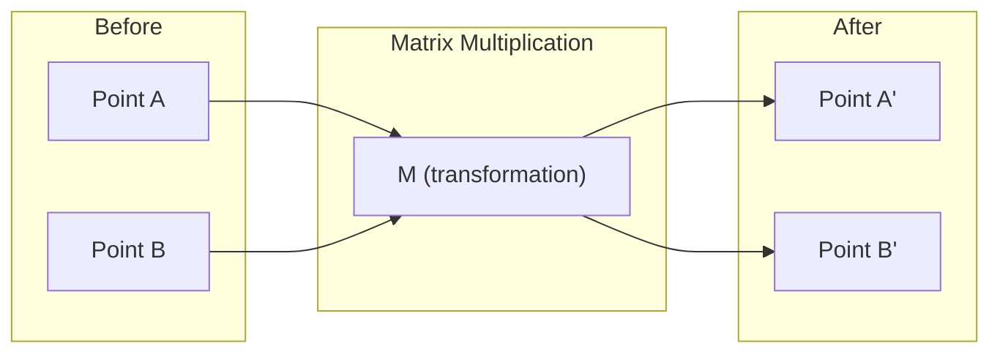
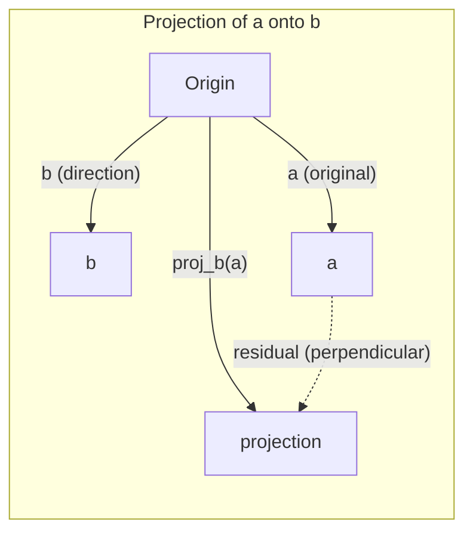

# الهندسة الخريطة
# 线性代数直觉

> كل نموذج من الذكاء الاصطناعي هو مجرد رياضيات المصفوفة ترتدي قبعة فاخرة.
> كل نموذج من الذكاء الاصطناعي هو في الأساس مجرد محور يرتدي ملابس خارجية رائعة

**Type:** Learn | **类型:** 学习 | **Languages:** Python, Julia | **语言:** Python, Julia | **Prerequisites:** Phase 0 | **前置知识:** Phase 0 | **Time:** ~60 minutes | **时间:** ~60 分钟

## أهداف التعلم

- تنفيذ عمليات المتجهة والصفائح (اضافة، نسبة نقطة، مضاعفة المصفوفة) من الصفر في Python
  من صفر تحقيق الحجم والمدرجة للعمل ((加法、点积、矩阵乘法)
- شرح بشكل هندسي ما يفعله منتج النقاط والتنبيه وعملية غرام-شميد
  من وجهة نظر هندسية تفسير النقاط √ الإلقاء √ عملية غرام-شميد
- تحديد الاستقلال الخطي، والرتبة، والقاعدة لمجموعة من المتجهات باستخدام تخفيض الصف
  استخدام المعلومات المعلوماتية
- ربط مفاهيم الجبر الخطى لتطبيقات الذكاء الاصطناعي الخاصة بهم: التوابل، درجات الاهتمام، و LoRA
  **将线性代数概念与 AI 应用对接：词嵌入、注意力分数、LoRA 微调**

## المشكلة لماذا يجب أن تتعلم هذا

افتح أي ورقة ML. في الصفحة الأولى، سترى المتجهات، والصفوف، ومنتجات النقاط، والتحولات. بدون بديهية الجبر الخطوي، هذه مجرد رموز. مع ذلك، يمكنك أن ترى ما تقوم بشبكة عصبية في الواقع -- تحريك النقاط حول الفضاء.

لا تحتاجين أن تكوني عالمة رياضيات عليك أن ترى ما تعنيه هذه العمليات هندسياً ثم ترميها بنفسك

> **【中文解读】**翻开任何一篇机器学习论文,第一页就会出现向量、矩阵、点积、变化──没有线性代数直觉,这些只是符号──有直觉,你就能"看穿"神经网络在做什么在空间中的移动点位置──你不需要成为数学家,只需要理解这些操作的几何含义,然后自己写代码实现──

## المفهوم الأساسي

### المتجهون هم النقاط (والاتجاهات)

المتجه هو مجرد قائمة بالأرقام. لكن تلك الأرقام تعني شيئاً -- إنها إحداثيات في الفضاء.

**2D vector [3, 2]:**

| x | y | Point |
|---|---|-------|
| 3 | 2 | The vector points from origin (0,0) to (3, 2) on the plane |

المتجه لديه الحجم مربع ((3^2 + 2^2) = مربع ((13) ويرجع إلى الأعلى و إلى اليمين.

في الذكاء الاصطناعي، يمثل المتجهون كل شيء:
- كلمة → متجه من 768 رقم (معناها" في إضافة الفضاء)
- صورة → متجه من ملايين قيم البيكسل
- مستخدم → متجه تفضيلات

> **【中文解读】**إلى حد كبير هو مجموعة من الأرقام، تمثل العنوان في الفضاء.`[3, 2]`عن طريق تعريف الشريحة من النقطة الأصلية (0,0) إندرو (3,2) ، طول = √(32+22) = √13。
>
> **【拓展：向量在 AI 中的化身】**
> - **词嵌入 (Word Embedding)**كل كلمة تصبح 768 维向量── "الملك" و"الملکہ" ′′ ′′ ′′ ′′ ′′ ′′ ′′ ′′ ′′ ′′ ′′ ′′ ′′ ′′ ′′ ′′ ′′ ′′ ′′ ′′ ′′ ′′ ′′ ′′ ′′ ′′ ′′ ′′ ′′ ′′ ′′ ′′ ′′ ′′ ′′ ′′ ′′ ′′ ′′ ′′ ′′ ′′ ′′ ′′ ′′ ′′ ′′ ′′ ′′ ′′ ′′ ′′ ′′ ′′ ′′ ′′ ′′ ′′ ′′ ′′ ′′ ′′ ′′ ′′ ′′ ′′ ′′ ′′ ′′ ′′ ′′ ′′ ′′ ′′ ′′ ′′ ′′ ′′ ′′ ′′ ′′ ′′ ′′ ′′ ′′ ′′ ′′ ′′ ′′ ′′ ′′ ′′ ′′ ′′ ′′ ′′ ′′ ′′ ′′ ′′ ′′ ′′ ′′ ′′ ′′ ′′ ′′ ′′ ′′ ′′ ′′ ′′ ′′ ′′ ′′ ′′ ′′ ′′ ′′ ′′ ′′ ′′ ′′ ′′ ′′ ′′ ′′ ′′ ′′ ′′ ′′ ′′ ′′ ′′ ′′ ′′ ′′ ′′ ′′ ′′ ′′ ′′ ′′ ′′ ′′ ′′ ′′ ′′ ′′ ′′ ′′ ′′ ′′ ′′ ′′ ′′ ′′ ′′ ′′ ′′ ′′ ′′ ′′ ′′ ′′ ′′ ′′ ′′ ′′ ′′ ′′ ′′ ′′ ′′ ′′ ′′ ′′ ′′ ′′ ′′ ′′ ′′ ′′ ′′ ′′ ′′ ′′ ′′ ′′ ′′ ′′ ′′ ′′ ′′ ′′ ′′ ′′ ′′ ′′ ′′ ′′ ′′ ′′ ′′ ′′ ′′ ′′ ′′ ′′ ′′ ′′ ′′ ′′ ′′ ′′ ′′ ′′ ′′ ′′ ′′ ′′ ′′ ′′ ′′ ′′ ′′ ′′ ′′ ′′ ′′ ′′ ′′ ′′ ′′ ′′ ′′ ′′ ′′ ′′ ′′ ′′ ′′ ′′ ′′ 
> - **图片特征**: 1张 224×224 صور ملونة = 150,528 个数字的向量──CNN في الأساس هي في ضغط تدريجي هذا الجهاز──
> - **用户画像**: نظام التوصية وضع تصفيحك في محيط المفضلة، ثم العثور على أكثر محيط المنتجات مماثلة

### المصفوفات هي التحولات

المصفوفة تحول متجه واحد إلى متجه آخر يمكن أن تدور أو تتحكم أو تمتد أو تتحرك



في الذكاء الاصطناعي، المصفوفات هي النموذج:
- أوزان الشبكة العصبية → المصفوفات التي تحول المدخل إلى الخروج
- نقاط الاهتمام → المصفوفات التي تقرر ما الذي يجب التركيز عليه
- التوابل → المصفوفات التي ترسم الكلمات إلى المتجهات

> **【中文解读】**الموجة هي "قاعدة تغيير": إدخال قطر واحد، إصدار قطر آخر.
>
> **【拓展：神经网络就是矩阵乘法的嵌套】**
> طبقة من شبكة العصبية = `output = W × input + bias`
> - (و هو الجهاز المثالي)
> - المدخل هو输入向量(上层的输出)
> - شبكة ثلاثية المستويات هي ثلاثة مرات
> - GPT-3 لديه 1750 مليار عنصر، في الأساس هو بضع مئات من المصفوفات الضخمة
> - **训练**= باستخدام التسلسل الهبوطي يصلح عدد هذه المواصفات

### نقطة قياسات المنتج التشابه

ضرب النقاط من متجهين يخبرك كم هم متشابهين

```
a · b = a₁×b₁ + a₂×b₂ + ... + aₙ×bₙ

Same direction:      a · b > 0  (similar)
Perpendicular:       a · b = 0  (unrelated)
Opposite direction:  a · b < 0  (dissimilar)
```

هذا حرفيا كيف تعمل محركات البحث وأنظمة التوصيات و RAG -- إيجاد المتجهات مع منتجات النقاط العالية.

> **【中文解读】**نقط积 = 对应分量相乘后求和──结果 > 0 方向相似,= 0 垂直无关,< 0 方向相反──
>
> **【拓展：点积是 AI 最核心的数学操作】**
> 1. **Transformer Attention**:`Attention(Q,K,V) = softmax(Q·K^T / √d)·V`
>    - Q(المسألة) و K(كيوت) من النقاط = "يجب أن اهتم أكثر بهذه الكلمة"
>    - هذا هو الجهاز الأساسي لجميع النماذج الكبرى
> 2. **RAG 检索**: تحويل مشكلة المستخدم إلى حجم، وكل الملفات إلى حجم، والبحث عن الملفات الأكثر صلة
> 3. **推荐系统**: المستخدم تحديداً · 商品特征向量 = 推分数
> 4. **余弦相似度**= 归一化后的点积,`cos(a,b) = a·b / (|a|×|b|)`,值域 [-1, 1]
>    比"欧氏距离"更好: فقط انظر الاتجاه لا انظر طول، "喜欢" و"非常喜欢"语义相似

### الإستقلال الخطى لا علاقة له بالجنس

المتجهات مستقلة خطيا إذا لم يتم كتابة أي متجه في المجموعة كجمع من الآخرين. إذا كان v1، v2، v3 مستقلين، فهي تتفوق على مساحة 3D. إذا كان واحد هو مزيج من الآخرين، فإنها تتفوق فقط على طائرة.

لماذا يهم الذكاء الاصطناعي: يجب أن يكون لدى ماتريكيز الميزات عمود مستقلين خطيا. إذا كانت الميزاتتان مترابطة تمامًا (تعتمدة خطياً) ، لا يمكن للنموذج تمييز آثارها. هذا يسبب التعددية الخطية في التراجع - تصبح ماتريكيز الوزن غير مستقرة ، وتتسبب التغيرات الصغيرة في المدخلات في تذبذبات الخروج البرية.

**Concrete example:**

```
v1 = [1, 0, 0]
v2 = [0, 1, 0]
v3 = [2, 1, 0]   # v3 = 2*v1 + v2
```

v1 و v2 مستقلة - ولا هي مضاعفة مستوى أو مزيج من الآخر. ولكن v3 = 2 * v1 + v2 ، لذلك {v1، v2، v3} هو مجموعة متعلقة. جميع هذه المتجهات الثلاثة تقع في خط xy. مهما كنت تجمعها، لا يمكنك الوصول إلى [0, 0, 1]. لديك ثلاثة متجهات ولكن فقط بقياسين من الحرية.

في مجموعة بيانات: إذا كان feature_3 = 2*feature_1 + feature_2, إضافة feature_3 يعطي النموذج صفر معلومات جديدة. أسوأ من ذلك، فإنه يجعل المعادلات الطبيعية فردية - لا يوجد حل فريد للوزن.

> **【中文解读】**مجموعة من النقاط "线性无关" = 没有任何一个能被其他向量出──
>
> مثال:`[1,0,0]`،`[0,1,0]`،`[0,0,1]`相互独立 ✓
>     `[1,0,0]`،`[0,1,0]`،`[2,1,0]`(الثالث = 2×الثالث + الثالث)
>
> **【拓展：多重共线性问题】**
> في البيانات المالية شائعة جدا: على سبيل المثال "المنزل حسب الدولار" و"المنزل حسب الرومان" هي مرتبطة تماماً،
> مع ذلك، فإن إدخال النموذج يؤدي إلى عدم استقرار الوزن، والنموذج أكثر من المعدل.

### أساس و رتبة

القاعدة هي مجموعة صغيرة من المتجهات المستقلة خطيا التي تغطي المساحة بأكملها. عدد المتجهات القاعدة هو بعد المساحة.

الأساس القياسي للفضاء الثلاثي الأبعاد هو {[1,0,0], [0,1,0], [0,0,1]}. ولكن أي ثلاثة متجهات مستقلة في 3D تشكل أساسًا صالحًا. اختيار الأساس هو اختيار نظام التنسيق.

صف المصفوفة = عدد الأعمدة المستقلة خطيا = عدد الصفوف المستقلة خطيا. إذا كان صف < min(صفوف، صفوف) ، فإن المصفوفة هي ناقصة الصف. وهذا يعني:
- النظام لديه العديد من الحلول (أو لا)
- المعلومات تضيع في التحول
- لا يمكن عكس المصفوفة

| Situation | Rank | What it means for ML |
|-----------|------|---------------------|
| Full rank (rank = min(m, n)) | Maximum possible | Unique least-squares solution exists. Model is well-conditioned. |
| Rank deficient (rank < min(m, n)) | Below maximum | Features are redundant. Infinitely many weight solutions. Regularization needed. |
| Rank 1 | 1 | Every column is a scaled copy of one vector. All data lies on a line. |
| Near rank-deficient (small singular values) | Numerically low | Matrix is ill-conditioned. Tiny input noise causes large output changes. Use SVD truncation or ridge regression. |

> **【中文解读】**
> - **基 (Basis)**: وصف واحد من الفضاء المطلوب من أدنى حجم ⋅ 3D 空间的标准基是 [1,0,0], [0,1,0], [0,0,1]──
> - **秩 (Rank)**:矩阵中真正独立的列数 (或行数)
>
> # الحالة # # تعني # # لا تغير #
> -لا، لا، لا، لا، لا، لا، لا، لا، لا، لا، لا، لا، لا، لا، لا، لا، لا، لا، لا، لا، لا، لا، لا، لا، لا، لا، لا، لا، لا، لا، لا، لا، لا، لا، لا، لا، لا، لا، لا، لا، لا، لا، لا، لا، لا، لا، لا، لا، لا، لا، لا، لا، لا، لا، لا، لا، لا، لا، لا، لا، لا، لا، لا، لا، لا، لا، لا، لا، لا، لا، لا، لا، لا، لا، لا، لا، لا، لا، لا، لا، لا، لا، لا، لا، لا، لا، لا، لا، لا، لا، لا، لا، لا، لا، لا، لا، لا، لا، لا، لا، لا، لا، لا، لا، لا، لا، لا، لا، لا، لا، لا، لا، لا، لا، لا، لا، لا، لا، لا، لا، لا، لا، لا، لا، لا، لا، لا، لا، لا، لا، لا، لا، لا، لا، لا، لا، لا، لا، لا، لا، لا، لا، لا، لا، لا، لا، لا، لا، لا، لا، لا، لا، لا، لا، لا، لا، لا، لا، لا، لا، لا، لا، لا، لا، لا، لا، لا، لا، لا، لا، لا، لا، لا، لا، لا، لا، لا، لا، لا، لا، لا، لا، لا، لا، لا، لا، لا، لا، لا، لا، لا، لا، لا، لا، لا، لا، لا، لا، لا، لا، لا، لا، لا، لا، لا، لا، لا، لا، لا، لا، لا، لا، لا، لا، لا، لا، لا، لا، لا، لا، لا، لا، لا، لا، لا، لا، لا، لا، لا، لا، لا، لا، لا، لا، لا، لا، لا، لا، لا، لا، لا، لا، لا، لا، لا، لا، لا، لا، لا، لا، لا، لا، لا، لا، لا
> ‬ ‬ ‬ ‬ ‬ ‬ ‬ ‬ ‬ ‬ ‬ ‬ ‬ ‬ ‬ ‬ ‬ ‬ ‬ ‬ ‬ ‬ ‬ ‬ ‬ ‬ ‬ ‬ ‬ ‬ ‬ ‬ ‬ ‬ ‬ ‬ ‬ ‬ ‬ ‬ ‬ ‬ ‬ ‬ ‬ ‬ ‬ ‬ ‬ ‬ ‬ ‬ ‬ ‬ ‬ ‬ ‬ ‬ ‬ ‬ ‬ ‬ ‬ ‬ ‬ ‬ ‬ ‬ ‬ ‬ ‬ ‬ ‬ ‬ ‬ ‬ ‬ ‬ ‬ ‬ ‬ ‬ ‬ ‬ ‬ ‬ ‬ ‬ ‬ ‬ ‬ ‬ ‬ ‬ ‬ ‬ ‬ ‬ ‬ ‬ ‬ ‬ ‬ ‬ ‬ ‬ ‬ ‬ ‬ ‬ ‬ ‬ ‬ ‬ ‬ ‬ ‬ ‬ ‬ ‬ ‬ ‬ ‬ ‬ ‬ ‬ ‬ ‬ ‬ ‬ ‬ ‬ ‬ ‬ ‬ ‬ ‬ ‬ ‬ ‬ ‬ ‬ ‬ ‬ ‬ ‬ ‬ ‬ ‬ ‬ ‬ ‬ ‬ ‬ ‬ ‬ ‬ ‬ ‬ ‬ ‬ ‬ ‬ ‬ ‬ ‬ ‬ ‬ ‬ ‬ ‬ ‬ ‬ ‬ ‬ ‬ ‬ ‬ ‬ ‬ ‬ ‬ ‬ ‬ ‬ ‬ ‬ ‬ ‬ ‬ ‬ ‬ ‬ ‬ ‬ ‬ ‬ ‬ ‬ ‬ ‬ ‬ ‬ ‬ ‬ ‬ ‬ ‬ ‬ ‬ ‬ ‬ ‬ ‬ ‬ ‬ ‬ ‬ ‬ ‬ ‬ ‬ ‬ ‬ ‬ ‬ ‬ ‬ ‬ ‬ ‬ ‬ ‬ ‬ ‬ ‬ ‬ ‬ ‬ ‬ ‬ ‬ ‬ ‬ ‬ ‬ ‬ ‬ ‬ ‬ ‬ ‬ ‬ ‬ ‬
> # منخفضة الدرجة # هناك الكثير # # لا نهاية لها #
> ‬ ‫المرجع التالي ‬ ‫البيانات تقريباً متوافقة ‬ ‫كل المعلومات في اتجاه واحد ‬
>
> **【拓展：LoRA —— 秩在 AI 中最惊艳的应用】**
> لورا ((تكييف منخفض الرتبة)
> - المجموعة الوزن الأولية W هو 4096×4096 ((16000000参数)
> - 微调时,权重更新 ΔW 实际上是"低排"的(التغيرات الحقيقية تحدث فقط في عدد قليل من الاتجاهات)
> - لورا وضع ΔW مقسمة إلى اثنين من المصفوفات الصغيرة A(4096 × 16) و B(16 × 4096)
> - 参数 من 16000000 → 130,000، تقليل **99%**لكن النتائج لا تقل
> - هذا هو مثال على مفهوم "رجاء" يتغير مباشرة

### التقاطع التقاطع

متجهات التخطيط**a**على المتجه **b**يعطي مكون **a**في اتجاه**b**:

```
proj_b(a) = (a dot b / b dot b) * b
```

البقية (a - proj_b(a)) هي عمودية ل b. هذا التفكك المُستقيم هو أساس التثبيت الأدنى من المربعات.

التنبيه في كل مكان في ML:
- التراجع الخطى يقلل من المسافة من الملاحظات إلى مساحة العمود -- الحل هو التنبؤ
- تقوم مركز التحكم في الأداء بتقديم البيانات على اتجاهات أقصى اختلاف
- الاهتمام في المحولات يحسب توقعات الأسئلة على المفاتيح



**Example:**a = [3, 4]، b = [1, 0]

proj_b(a) = (3*1 + 4*0) / (1*1 + 0*0) * [1, 0] = 3 * [1, 0] = [3, 0]

يضع التنبيه عنصر y. هذا هو تقليل الأبعاد في أبسط شكله - يرمي الاتجاهات التي لا تهتم بها.

> **【中文解读】**الصورة = "الظلال" في اتجاه ما
> `a=[3,4]`投影到x 轴 `[1,0]`上 = `[3,0]`، هو إلقاء الميزان القليل بعيدا
> 残差 = 原向量 - 投影 = `[0,4]`, مع الإشارة الاتجاه عمودي
>
> **【拓展：投影与降维的关系】**
> 投影是最简单的"降维"扔掉不关心的方向──PCA(التركيز الرئيسي تحليل)
> لا يرمي الاتجاه الثابت، بل يجد تلقائيا "أكبر" الاتجاهات التي يرمي فيها المعلومات.
> إن وضع 1000 维 بيانات إلى 50 维، يحافظ على 95% من المعلومات فوقها، وهذا هو الخصائص المميزة للضغط.

### عملية جريما-شميدت جريما-شميدت هي التحول

تحويل أي مجموعة من المتجهات المستقلة إلى قاعدة أوثونورمالية. يعني أوثونورمالية كل متجه له طول 1 وكل زوج عمودي.

الخوارزمية:
1. خذ الجهاز الجهاز الأول، وتطبيقه
2. خذ المتجه الثاني، وقل من إلقاءه على الأول، وتطبيع
3. خذ المتجه الثالث، وقل من إلقائه على جميع المتجهات السابقة، وتطبيع
4. تكرار المتجهات المتبقية

```
Input:  v1, v2, v3, ... (linearly independent)

u1 = v1 / |v1|

w2 = v2 - (v2 dot u1) * u1
u2 = w2 / |w2|

w3 = v3 - (v3 dot u1) * u1 - (v3 dot u2) * u2
u3 = w3 / |w3|

Output: u1, u2, u3, ... (orthonormal basis)
```

هكذا يعمل تدمير QR داخلياً. Q هو الأساس العادي، R يلتقط معايير التنبيه. يستخدم تدمير QR في:
- حل الأنظمة الخطية (أكثر استقرارًا من القضاء على غوس)
- الحساب القيم الخاصة (الخوارزمية QR)
- تراجع أقل مربعات (الوسيلة العددية القياسية)

> **【中文解读】**أن تحويل أي مجموعة من النقاط إلى "المقارنة + طول = 1"
>
> 直觉: كل محور جديد يُخفض أولاً في "الجزء الثقيل" الموجود على الاتجاه الموجود، يحتفظ فقط بالاتجاه الجديد، ويعود إلى التجميع.
> مثل بناء الجدار كل قطعة تختار اتجاه جديد تماماً، لا يتساوى مع التعبئة السابقة
>
> **【拓展：为什么"正交"这么重要？】**
> إن كان هناك "موازنة" بين الكميات الأساسية (((الخطأ في الموازنة) ، فإن الفجوة في الحساب ستزداد بشكل مستمر
> QR 分解(شكل الموجة من غرام-شميدت) هي أساسية في حساب القيمة العددية:
> - المستخدمة في القيادة التالية هي القيادة التفصيلية
> - خصائص قيمة حساب الـ QR 代算法
> - الحل القياسي للعدد الثاني

## بناء ذلك تحرك لتحقيق
```figure
eigen-directions
```

## بناءها

### الخطوة الأولى: المتجهات من الصفر (بايتون)

```python
class Vector:
    def __init__(self, components):
        self.components = list(components)
        self.dim = len(self.components)

    def __add__(self, other):
        return Vector([a + b for a, b in zip(self.components, other.components)])

    def __sub__(self, other):
        return Vector([a - b for a, b in zip(self.components, other.components)])

    def dot(self, other):
        # 点积：对应分量相乘后求和。AI 中最核心的相似度度量。
        return sum(a * b for a, b in zip(self.components, other.components))

    def magnitude(self):
        return sum(x**2 for x in self.components) ** 0.5

    def normalize(self):
        # 归一化：缩放到长度1。归一化后点积=余弦相似度。
        mag = self.magnitude()
        return Vector([x / mag for x in self.components])

    def cosine_similarity(self, other):
        # 余弦相似度：只看方向不看长度，值域[-1,1]
        return self.dot(other) / (self.magnitude() * other.magnitude())

    def __repr__(self):
        return f"Vector({self.components})"


a = Vector([1, 2, 3])
b = Vector([4, 5, 6])

print(f"a + b = {a + b}")
print(f"a · b = {a.dot(b)}")
print(f"|a| = {a.magnitude():.4f}")
print(f"cosine similarity = {a.cosine_similarity(b):.4f}")
```

### الخطوة الثانية: المصفوفات من الصفر (بايثون)

```python
class Matrix:
    def __init__(self, rows):
        self.rows = [list(row) for row in rows]
        self.shape = (len(self.rows), len(self.rows[0]))

    def __matmul__(self, other):
        # 矩阵乘法 = 神经网络一层的前向传播
        if isinstance(other, Vector):
            return Vector([
                sum(self.rows[i][j] * other.components[j] for j in range(self.shape[1]))
                for i in range(self.shape[0])
            ])
        rows = []
        for i in range(self.shape[0]):
            row = []
            for j in range(other.shape[1]):
                row.append(sum(
                    self.rows[i][k] * other.rows[k][j]
                    for k in range(self.shape[1])
                ))
            rows.append(row)
        return Matrix(rows)

    def transpose(self):
        return Matrix([
            [self.rows[j][i] for j in range(self.shape[0])]
            for i in range(self.shape[1])
        ])

    def __repr__(self):
        return f"Matrix({self.rows})"


rotation_90 = Matrix([[0, -1], [1, 0]])
point = Vector([3, 1])

rotated = rotation_90 @ point
print(f"Original: {point}")
print(f"Rotated 90°: {rotated}")
```

### الخطوة الثالثة: لماذا هذا مهم بالنسبة لـ AI؟ الخطوة الثالثة: ما علاقة هذا بالذكاء الاصطناعي؟

```python
import random

random.seed(42)
weights = Matrix([[random.gauss(0, 0.1) for _ in range(3)] for _ in range(2)])
input_vector = Vector([1.0, 0.5, -0.3])

output = weights @ input_vector
print(f"Input (3D): {input_vector}")
print(f"Output (2D): {output}")
print("This is what a neural network layer does -- matrix multiplication.")
# 矩阵乘法：3维输入 → 2维输出。这就是神经网络一层的全部计算。
# 一个真正的网络就是把很多这样的层串起来，每层都有一个权重矩阵。
```

### الخطوة الرابعة: نسخة جوليا

```julia
a = [1.0, 2.0, 3.0]
b = [4.0, 5.0, 6.0]

println("a + b = ", a + b)
println("a · b = ", a ⋅ b)       # Julia supports unicode operators
println("|a| = ", √(a ⋅ a))
println("cosine = ", (a ⋅ b) / (√(a ⋅ a) * √(b ⋅ b)))

# Matrix-vector multiplication
W = [0.1 -0.2 0.3; 0.4 0.5 -0.1]
x = [1.0, 0.5, -0.3]
println("Wx = ", W * x)
println("This is a neural network layer.")
```

### الخطوة 5: الاستقلال الخطي والتنبيه من الصفر (بايثون)

```python
def is_linearly_independent(vectors):
    # 高斯消元法：把向量排成矩阵，化简，看秩是否等于向量个数
    n = len(vectors)
    dim = len(vectors[0].components)
    mat = Matrix([v.components[:] for v in vectors])
    rows = [row[:] for row in mat.rows]
    rank = 0
    for col in range(dim):
        pivot = None
        for row in range(rank, len(rows)):
            if abs(rows[row][col]) > 1e-10:
                pivot = row
                break
        if pivot is None:
            continue
        rows[rank], rows[pivot] = rows[pivot], rows[rank]
        scale = rows[rank][col]
        rows[rank] = [x / scale for x in rows[rank]]
        for row in range(len(rows)):
            if row != rank and abs(rows[row][col]) > 1e-10:
                factor = rows[row][col]
                rows[row] = [rows[row][j] - factor * rows[rank][j] for j in range(dim)]
        rank += 1
    return rank == n


def project(a, b):
    # 投影：a 在 b 方向上的"影子"
    scalar = a.dot(b) / b.dot(b)
    return Vector([scalar * x for x in b.components])


def gram_schmidt(vectors):
    # 正交化：每个向量减去在已有方向上的投影，只保留新方向
    orthonormal = []
    for v in vectors:
        w = v
        for u in orthonormal:
            proj = project(w, u)
            w = w - proj
        if w.magnitude() < 1e-10:
            continue
        orthonormal.append(w.normalize())
    return orthonormal


v1 = Vector([1, 0, 0])
v2 = Vector([1, 1, 0])
v3 = Vector([1, 1, 1])
basis = gram_schmidt([v1, v2, v3])
for i, u in enumerate(basis):
    print(f"u{i+1} = {u}")
    print(f"  |u{i+1}| = {u.magnitude():.6f}")

print(f"u1 · u2 = {basis[0].dot(basis[1]):.6f}")
print(f"u1 · u3 = {basis[0].dot(basis[2]):.6f}")
print(f"u2 · u3 = {basis[1].dot(basis[2]):.6f}")
```

## استخدمها باستخدام الإطار لتحقيق الطريقة التي ستستخدمها في الحرب الحقيقية)

الآن نفس الشيء مع NumPy -- ما سوف تستخدم في الواقع في الممارسة:
الآن باستخدام NumPy القيام بـ العمل الحقيقي الذي تستخدميه هو:

```python
import numpy as np

a = np.array([1, 2, 3], dtype=float)
b = np.array([4, 5, 6], dtype=float)

print(f"a + b = {a + b}")
print(f"a · b = {np.dot(a, b)}")
print(f"|a| = {np.linalg.norm(a):.4f}")
print(f"cosine = {np.dot(a, b) / (np.linalg.norm(a) * np.linalg.norm(b)):.4f}")

W = np.random.randn(2, 3) * 0.1
x = np.array([1.0, 0.5, -0.3])
print(f"Wx = {W @ x}")
```

### الرتبة، التنبؤ، و QR مع NumPy 秩、投影 و QR 分解

```python
import numpy as np

A = np.array([[1, 2], [2, 4]])
print(f"Rank: {np.linalg.matrix_rank(A)}")  # 秩=1，第2行是第1行的2倍

a = np.array([3, 4])
b = np.array([1, 0])
proj = (np.dot(a, b) / np.dot(b, b)) * b
print(f"Projection of {a} onto {b}: {proj}")

Q, R = np.linalg.qr(np.random.randn(3, 3))  # QR 分解 = Gram-Schmidt 的矩阵形式
print(f"Q is orthogonal: {np.allclose(Q @ Q.T, np.eye(3))}")  # Q 正交
print(f"R is upper triangular: {np.allclose(R, np.triu(R))}")  # R 上三角
```

### بيتورش -- الجهازات العصبية هي المتجهات مع التشغيل الذاتي

```python
import torch

x = torch.randn(3, requires_grad=True)  # 3维向量，开启自动求导
y = torch.tensor([1.0, 0.0, 0.0])

similarity = torch.dot(x, y)  # 点积
similarity.backward()          # 自动求导！

print(f"x = {x.data}")
print(f"y = {y.data}")
print(f"dot product = {similarity.item():.4f}")
print(f"d(dot)/dx = {x.grad}")  # 梯度 = y 本身，因为 d(x·y)/dx = y
```

> **【拓展：自动求导的魔法】**
> بيتورش `backward()`تلقائيًا الحسابات من درجة d ((x·y) / dx = y。
> التدريب على شبكة النظام
> 1. 前向传播(矩阵乘法串联)
> 2. 计算损失(标量)
> 3. 反向传播`backward()`(تحرك طلب كل درجة الوزن)
> 4. 更新权重(梯度下降)
> 第2-3 خطوة تعتمد تماما على "التوجيه الذاتي"، والبنيات الرياضية للتوجيه الذاتي هي قانون الدرجة التالية.

إن تراجع منتج النقطة فيما يتعلق بـ x هو فقط y. قام PyTorch بحساب هذا تلقائيًا. كل عملية في شبكة عصبية بنيت من عمليات مثل هذه -- مضاعفات المصفوفة، منتجات النقطة، التنبؤات -- وتتبع التراجعات تلقائيًا من خلال كل منها.

لقد قمت ببناء ما يفعله (نمبي) في سطر واحد الآن تعرف ما يحدث تحت القبو
أنت فقط تحقق من الصفر شيء واحد من الرمز القيام به. الآن أنت تعرف ما حدث في الأسفل.

## أرسلها .

هذا الدرس ينتج عن:
- `outputs/prompt-linear-algebra-tutor.md`-- طلب لمساعدات الذكاء الاصطناعي لتعليم الجبر الخطوي من خلال الحدس الهندسي

## العلاقات مفهوم

كل شيء في هذا الدروس يرتبط بأجزاء معينة من الذكاء الاصطناعي الحديث:
هذا المفهوم يتوافق بشكل مباشر مع بعض المكونات من الذكاء الاصطناعي الحديث:

| Concept 概念 | Where it shows up 在 AI 中的位置 |
|---------|------------------|
| Dot product 点积 | Attention scores in transformers, cosine similarity in RAG / Transformer 的注意力分数、RAG 的余弦相似度 |
| Matrix multiply 矩阵乘法 | Every neural network layer, every linear transformation / 神经网络的每一层 |
| Linear independence 线性无关 | Feature selection, avoiding multicollinearity / 特征选择、避免多重共线性 |
| Rank 秩 | Determining if a system is solvable, LoRA (low-rank adaptation) / 方程可解性判断、LoRA 微调 |
| Projection 投影 | Linear regression (projecting onto column space), PCA / 线性回归、PCA 降维 |
| Gram-Schmidt / QR | Numerical solvers, eigenvalue computation / 数值求解器、特征值计算 |
| Orthonormal basis 正交基 | Stable numerical computation, whitening transforms / 数值稳定计算、白化变换 |

(لورا) تستحق ذكر خاص إنه يحدد النماذج اللغوية الكبيرة عن طريق تفكيك تحديثات الوزن إلى ماتريص منخفضة الدرجة. بدلاً من تحديث ماتريكس الوزن 4096x4096 (16M ملامح) ، تقوم لورا بتحديث ماتريكس من حجم 4096x16 و 16x4096 (131K ملامح). القيود 16 المرتبة يعني لورا يفترض أن تحديث الوزن يعيش في 16 بعد الفضاء الفرعي من كامل 4096 بعد الفضاء. هذا الجبر الخطى يقوم بعمل حقيقي

> **【中文解读】LoRA 特别值得一提。**لقد تم تحليل عملية تحليل النموذج الكبير إلى عمليات المرتبة المنخفضة.
> أصلًا يجب تحديث 4096 × 4096 من الموجات الوزنية
> لورا فقط تحديث 4096 × 16 و 16 × 4096  اثنين من المصفوفات الصغيرة
> "رجيو=16" يعني: الحق في تحديث الحدث يحدث فقط في 16 اتجاهات، وليس كاملة 4096维空间.
> هذا هو التطبيق الأكثر تكلفة للعوامل السريعة في الذكاء الاصطناعي

## تمارين التدريب

1. تنفيذ`Vector.angle_between(other)`الذي يعيد الزاوية في درجات بين متجهين
   **实现计算两向量夹角的方法（返回角度）**
2. قم بإنشاء صفة مقياسية ثنائية الأبعاد تضاعف إحداثيات x وتضاعف إحداثيات y ثلاث مرات ثم قم بتطبيقها على المتجه [1, 1]
   **创建一个 2D 缩放矩阵（x坐标翻倍，y坐标三倍），应用到向量 [1, 1]**
3. وبالنظر إلى 5 متجهات عشوائية تشبه الكلمات (البعرض 50) ، العثور على اثنين من أكثر التشابه باستخدام تشابه كوزين
   **给定5个随机50维"词向量"，用余弦相似度找最相似的2个**
4. التحقق من أن خروج غرام-شميت هو حقا أوثونورمال: تحقق من أن كل زوج لديه نقطة الناتج 0 وكل متجه له حجم 1
   **验证 Gram-Schmidt 输出确实正交：任意两个点积=0，每个长度=1**
5. قم بإنشاء ماتريك 3x3 مع رتبة 2. التحقق باستخدام `rank()`ثم شرح أي كائن هندسي تتجاوز الأعمدة.
   **构造一个秩为2的3×3矩阵，验证秩，解释它的列向量张成什么几何体（答案：一个平面）**
6. ارضوا الناقل [١، ٢، ٣] إلى [١، ١، ١] ما الذي يمثل النتيجة الهندسية؟
   **把 [1,2,3] 投影到 [1,1,1] 上，几何含义是什么？（答案：在对角线方向上的分量）**

## شروط الرئيسية

| Term 英文 | What people say 常见误解 | What it actually means 准确含义 |
|------|----------------|----------------------|
| Vector 向量 | "An arrow 一根箭头" | A list of numbers representing a point or direction in n-dimensional space / n维空间中的点或方向 |
| Matrix 矩阵 | "A table of numbers 一堆数字" | A transformation that maps vectors from one space to another / 把向量从一个空间映射到另一个空间的变换 |
| Dot product 点积 | "Multiply and sum 乘完加起来" | A measure of how aligned two vectors are -- the core of similarity search / 衡量对齐程度——相似度搜索的核心 |
| Embedding 嵌入 | "Some AI magic AI魔法" | A vector that represents the meaning of something (word, image, user) / 表示事物"意义"的向量 |
| Linear independence 线性无关 | "They don't overlap 不重叠" | No vector in the set can be written as a combination of the others / 没有向量能用其他向量凑出来 |
| Rank 秩 | "How many dimensions 几个维度" | The number of linearly independent columns (or rows) in a matrix / 独立列（行）的数量 |
| Projection 投影 | "The shadow 影子" | The component of one vector in the direction of another / 一个向量在另一个方向上的分量 |
| Basis 基 | "The coordinate axes 坐标轴" | A minimal set of independent vectors that span the space / 张成整个空间的最少独立向量 |
| Orthonormal 正交归一 | "Perpendicular unit vectors 垂直单位向量" | Vectors that are mutually perpendicular and each have length 1 / 互相垂直且长度各为1 |
