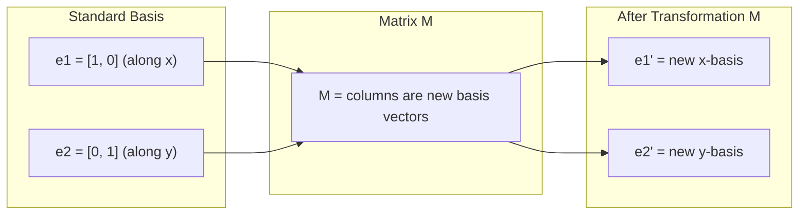
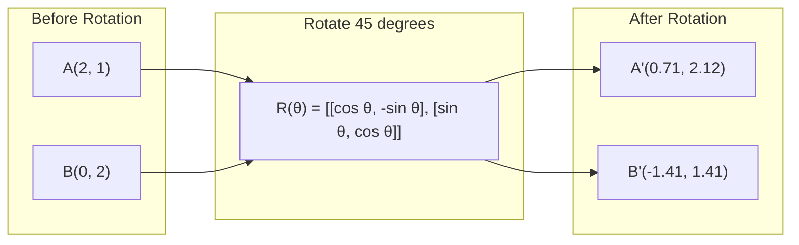
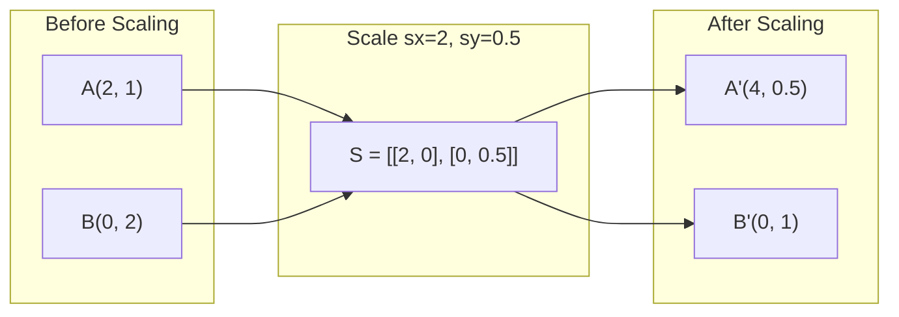
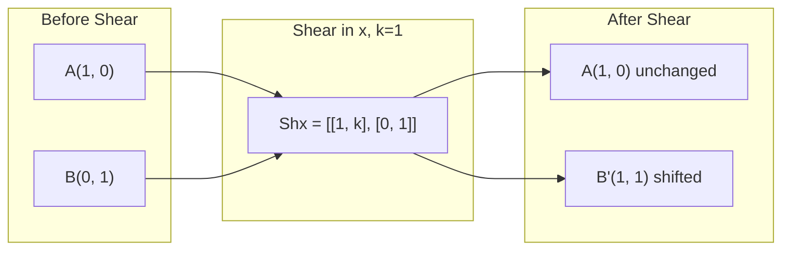
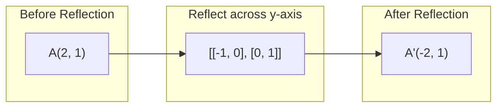
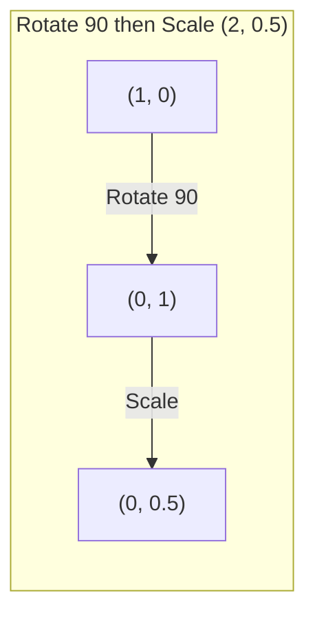
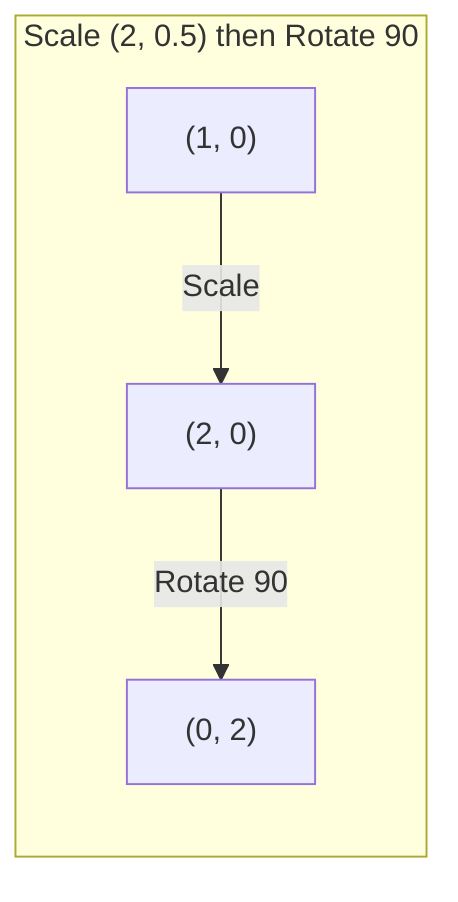

# تغيرات المصفوفة

> المصفوفة هي آلة تقوم بإعادة تشكيل الفضاء تعلم ما تفعله لكل نقطة، وستفهم التحول بأكمله

> الموجة هي آلة "المساحة الاصطناعية" فهمها على كل نقطة، فهم التغيير بأكمله

**Type:** Build | **类型:** 动手
**Languages:** Python, Julia | **语言:** Python, Julia
**Prerequisites:** Phase 1, Lessons 01-02 (Linear Algebra Intuition, Vectors & Matrices Operations) | **前置知识:** Phase 1, Lessons 01-02（线性代数直觉、向量与矩阵运算）
**Time:** ~75 minutes | **时间:** ~75 分钟

## أهداف التعلم

- بناء المصفوفات الدورانية والتنمية والقص والعكس وتطبيقها على النقاط 2D و 3D
   تشكيل المدار  التوسع  التقطيع  المصفوفات المضادة للرد و تطبيقها على النقاط الثنائية الأبعاد والثلاثية الأبعاد
- قم بتكوين تحويلات متعددة عن طريق مضاعفة المصفوفة وتحقق من أن النظام مهم
  通过矩阵乘法组合多个变化, 验证顺序的重要性
- احسب القيم الخاصة والمتجهات الخاصة للمصفوفات 2x2 من المعادلة المميزة
  من المعادلة المميزة الحساب 2x2  المصفوفة والقيمة المميزة
- شرح لماذا تقرر القيم الخاصة اتجاهات PCA، استقرار RNN، وسلوك التجميع الطيفي
  解释特征值为何决定PCA 方向、RNN 稳定性和谱聚类行为

> **【中文解读】**
> الموجة هي التغيرات في الفضاء حولها، وتضخمها، وتقطعها، وتحولها. بعد فهم معنى الموجة الجغرافية، أصبحت هذه المفاهيم مباشرة.

> **【拓展：特征值/特征向量在 AI 中的位置】**
> - **PCA（主成分分析）**: 找到数据方差矩阵的特征向量,就是数据方差最大的方向──
> - **RNN 稳定性**: إذا كان قيمة الخصائص الموجة الوزن الحتمية أكبر من 1 ، فإن مؤشر التدفق يزداد ؛
> - **谱聚类**: باستخدام طرق الوصول إلى الموجات المميزة لتحقيق التجميد، أكثر تكييفاً مع البيانات غير الكرة من K-Means.

## المشكلة المشكلة المشكلة

> **【中文解读】**يقول PCA "بحث عن طابع الموجة في الموجة المشتركة" ، يقول نموذج الاستقرار "تحقق من قيمة الموجة أقل من 1" ، ويقول بيانات الضخمة "تدوير الموجة" كل هذا يحتاج إلى فهم الموجة لتغيرات الهواء المتعلق بالمساحة.

## المفهوم الأساسي

> **【拓展：Transformer 中的矩阵变换】**كل توجه في محول الصورة هو في عمل الموجة التغير: Q=W_q·x، K=W_k·x، V=W_v·x، من بينها W_q/W_k/W_v هو عملية التعلم للتغيير الموجة.

### التحولات كالمصفوفات

كل تحول خطي في 2D يمكن كتابته كصفائح 2x2 . المصفوفة تخبرك بالضبط أين ينتهي المتجهات الأساسية [1, 0] و [0, 1]. كل شيء آخر يتبع.

> كل حركة تغير في الفضاء يمكن أن تكتب في 2x2 矩阵──矩阵 تخبرك 基向量 [1, 0] 和 [0, 1] 变到了哪里, بقية كل شيء من هذا يقرر──

> 矩阵的列就是变换后的基向量──如果矩阵第一列是 [2, 0],说明 e1=[1,0] 被映射到 [2,0](沿 x 轴拉伸 2 倍)──



### التناوب

تدور ثنائي الأبعاد عن طريق الزاوية تثا تبقي المسافات والزوايا سليمة.

> 2- الحفاظ على المسافة والزاوية غير متغيرة، وسوف تتحرك كل نقطة على طول دائرة المكعب.

> 旋转矩阵 R(θ) = [[cosθ, -sinθ], [sinθ, cosθ]]。θ 为正表示逆时针旋转。R^T = R^(-1),转置即逆旋转。



في 3D، تدور حول محور. كل محور لديه ماتريسك التناوب الخاص به:

> في ثلاث ابعاد الفضاء، أنت حول محور واحد تدور. كل محور لديه محور نفسه.

```
Rz(theta) = | cos  -sin  0 |     Rotate around z-axis
            | sin   cos  0 |     (x-y plane spins, z stays)
            |  0     0   1 |

Rx(theta) = | 1   0     0    |   Rotate around x-axis
            | 0  cos  -sin   |   (y-z plane spins, x stays)
            | 0  sin   cos   |

Ry(theta) = |  cos  0  sin |     Rotate around y-axis
            |   0   1   0  |     (x-z plane spins, y stays)
            | -sin  0  cos |
```

### التوسع

تمدد أو تضغط على طول كل محور بشكل مستقل.

> التمضي قدما على طول كل محور مستقلة

> 缩放矩阵 S = [[sx, 0], [0, sy]]──sx、sy يمكن أن تختلف。 إذا كان某个为负,等价于沿该轴反射──



### القص

يلتحى الشفرة المحور الواحد بينما يبقى المحور الآخر ثابتًا.

> قطع محور واحد متواضع والحفاظ على محور آخر ثابتة، سوف تتحول العرض إلى مربع مربع

> 剪切保持面积不变(行列式=1) ・・・ فكر في 克牌向一边推:底牌不动,顶牌平移──



المصفوفات المقطوعة:
- `Shx = [[1, k], [0, 1]]`تحويلات x من k * y
- `Shy = [[1, 0], [k, 1]]`تحويلات y من k * x

> 剪切矩阵:`Shx`على طول y 偏移 x(x 新 = x + k*y) ،`Shy`على طول x 偏移 y(y 新 = y + k*x) 』

### التفكير

العكس يعكس نقاط عبر محور أو خط.

> ردّة النظر ستجعل نقطة حول بعض العواص أو خطوط

> ردّة تغيير الاتجاهات (~~~~) ولكن الحفاظ على المسافة.



المصفوفات التأثيرية:
- انعكس عبر محور y: `[[-1, 0], [0, 1]]`
- انعكس عبر محور x: `[[1, 0], [0, -1]]`

> عن و 轴反射 `[[-1, 0], [0, 1]]`, حول إكسكسكس`[[1, 0], [0, -1]]`.

### التكوين: تحولات السلاسل

تطبيق التحول A ثم B هو نفس ضرب ماتريسكهم: `result = B @ A @ point`النظام مهم، ثم تدور المقياس يعطي نتائج مختلفة عن المقياس ثم تدور.

> قبل التغيير A بعد التغيير B يساوي ضربها من المصفوفة:`result = B @ A @ point`◊ التسلسل مهم جداالدورة الأولى والدورة الثانية تختلف عن نتائج الدوران الأول والدورة الثانية والدورة الثانية

> هذا هو السبب في أن النظام التسلسلي في PyTorch  بشكل صارم حسب الترتيب تطبيق الطراز، و الموجات ضرب الترتيب في التنقل التسلسلي في التنقل التلقائي



المكون: `S @ R = [[0, -2], [0.5, 0]]`

> 先旋转 90° 再缩放 (2, 0.5): من (1,0) → 旋转后 (0,1) → 缩放后 (0, 0.5) ――组合矩阵 S @ R = [[0, -2]، [0.5, 0]]。



المكون: `R @ S = [[0, -0.5], [2, 0]]`

> 先缩放 (2, 0.5) 再旋转 90°:从 (1,0) → 缩放后 (2, 0) → 旋转后 (0, 2) ――组合矩阵 R @ S = [[0, -0.5], [2, 0]],与上完全不同──

نتائج مختلفة مضاعفة المصفوفة ليست محولة

> 结果不同──矩阵乘法不满足交换律这就是为什么变压器注意力中 Q、K、V 的相乘顺序至关重要──

### القيم الخاصة والمتجهات الخاصة

معظم المتجهات تغير الاتجاه عندما تضربها المصفوفة. المتجهات الخاصة خاصة: المصفوفة فقط يقياسها، لا يدورها أبدا. عامل التقياس هو القيمة الخاصة.

> معظم الطاقة تتغير بعد تغييرها في الاتجاه.

> 几何直觉: الخصائص الماسورة هي التغير في "الجهة غير المتغيرة" الاتجاه.

```
A @ v = lambda * v

v is the eigenvector (direction that survives)
lambda is the eigenvalue (how much it stretches)

Example: A = | 2  1 |
             | 1  2 |

Eigenvector [1, 1] with eigenvalue 3:
  A @ [1,1] = [3, 3] = 3 * [1, 1]     (same direction, scaled by 3)

Eigenvector [1, -1] with eigenvalue 1:
  A @ [1,-1] = [1, -1] = 1 * [1, -1]  (same direction, unchanged)
```

المصفوفة تمدد الفضاء بـ 3x على طول [1, 1] وتبقى [1, -1] دون تغيير. كل اتجاه آخر هو مزيج من هذين الاثنين.

> على طول [1, 1] الاتجاه يرتفع 3 倍، الحفاظ على [1, -1] الاتجاه لا يتغير. جميع الاتجاهات الأخرى هي مجموعة من هذين الاتجاهين.

### التكوين الخاص

إذا كانت المصفوفة لديها n متجهات خاصة مستقلة خطيا، يمكن تفكيكها:

> إذا كان للمحيط ن 个线性 无关特征向量، فإنه يمكن أن ينقسم إلى A = V D V−1──

> معنى هندسي لتفكيك الخصائص: تغيير الاختراق بشكل عشوائي لتحويل إلى محور مركز لقطاع الخصائص  محور التكثيف  حلقة العودة  ثلاث مراحل.

```
A = V @ D @ V^(-1)

V = matrix whose columns are eigenvectors
D = diagonal matrix of eigenvalues
V^(-1) = inverse of V

This says: rotate into eigenvector coordinates, scale along each axis, rotate back.
```

> هذا يعني: تدور إلى صفات محركات الحجم، على طول كل محور يختصر، وتدور مرة أخرى.

### لماذا قيمها الخاصة مهمة

**PCA.**المتجهات الخاصة للمصفوفة التغيرات هي المكونات الرئيسية. القيم الخاصة تخبرك كم التباين كل مكون يلتقط. فرز حسب القيمة الخاصة، والحفاظ على الجزء العلوي k، ولديك خفض الأبعاد.

> **PCA（主成分分析）。**协方差矩阵的特征向量就是主成分,特征值告诉你每个主成分捕获了多少方差.

**Stability.**في الشبكات المتكررة والأنظمة الديناميكية، تسبب القيم الخاصة ذات الحجم > 1 انفجار المخرجات. الحجم < 1 يسبب اختفاءها. هذه هي مشكلة التهاب/انفجار التدفق الموضح في جملة واحدة.

> **稳定性。**في شبكة الدورة والنظام الحركي، تعتبر قيمة الصفحة الحتمية > 1 تسبب في انفجار الناتج،< 1 تسبب في اختفاءها.

**Spectral methods.**تستخدم شبكات العصبية الرسمية القيم الخاصة بالمصفوفة المجاورة. تستخدم التجميع الطيفي القيم الخاصة باللابلاسي. الكائنات الخاصة تكشف عن هيكل الرسم البياني.

> **谱方法。**图神经网络使用邻近矩阵的特征值,谱聚类使用拉普拉斯矩阵的特征值;;特征向量揭示图的结构;;

### العامل القياسي كعامل تحديد حجم

ويقول لك معدل ماتريكس التحويل كم يقدر مساحة (2D) أو حجم (3D).

> 变换矩阵的行列式告诉你它缩小面积(2D) أو体积(3D) 程度──

> det=0 هو "كوارث" الموجات تفرض المجال على ضغط إلى مستوى منخفض (((مثل 2D → 1D 线) ، معلومات ضائعة، الموجات لا يمكن العكسها.

```
det = 1:   area preserved (rotation)
det = 2:   area doubled
det = 0:   space crushed to lower dimension (singular)
det = -1:  area preserved but orientation flipped (reflection)

| det(Rotation) | = 1        (always)
| det(Scale sx, sy) | = sx * sy
| det(Shear) | = 1           (area preserved)
| det(Reflection) | = -1     (orientation flipped)
```

> 行列式含义:det=1 保面积(旋转);det=2 面积翻倍;det=0 空间崩缩到低维(奇异,矩阵不可逆);det=-1 保面积但翻转方向(反射) ・・・

## بناء ذلك تحرك لتحقيق
```figure
matrix-transform
```

## بناءها

### الخطوة 1: المصفوفات التحولية من الصفر (بيتون)

> 第1步: من الصفر لتحقيق التغيير

> من التنفيذ من صفر لتحويل التكثيف والقطع والانعكاس الموجة. كل التغييرات هي 2x2 الموجة.

```python
import math

def rotation_2d(theta):
    c, s = math.cos(theta), math.sin(theta)
    return [[c, -s], [s, c]]

def scaling_2d(sx, sy):
    return [[sx, 0], [0, sy]]

def shearing_2d(kx, ky):
    return [[1, kx], [ky, 1]]

def reflection_x():
    return [[1, 0], [0, -1]]

def reflection_y():
    return [[-1, 0], [0, 1]]

def mat_vec_mul(matrix, vector):
    return [
        sum(matrix[i][j] * vector[j] for j in range(len(vector)))
        for i in range(len(matrix))
    ]

def mat_mul(a, b):
    rows_a, cols_b = len(a), len(b[0])
    cols_a = len(a[0])
    return [
        [sum(a[i][k] * b[k][j] for k in range(cols_a)) for j in range(cols_b)]
        for i in range(rows_a)
    ]

point = [1.0, 0.0]
angle = math.pi / 4

rotated = mat_vec_mul(rotation_2d(angle), point)
print(f"Rotate (1,0) by 45 deg: ({rotated[0]:.4f}, {rotated[1]:.4f})")

scaled = mat_vec_mul(scaling_2d(2, 3), [1.0, 1.0])
print(f"Scale (1,1) by (2,3): ({scaled[0]:.1f}, {scaled[1]:.1f})")

sheared = mat_vec_mul(shearing_2d(1, 0), [1.0, 1.0])
print(f"Shear (1,1) kx=1: ({sheared[0]:.1f}, {sheared[1]:.1f})")

reflected = mat_vec_mul(reflection_y(), [2.0, 1.0])
print(f"Reflect (2,1) across y: ({reflected[0]:.1f}, {reflected[1]:.1f})")
```

### الخطوة الثانية: تشكيل التحوّلات

> 第2步: تغييرات الجمع

> 验证矩阵乘法不可交换:先旋转90° 再缩放 (2,0.5) و先缩放再旋转得到完全不同的结果──这解释了为什么 PyTorch nn.

```python
R = rotation_2d(math.pi / 2)
S = scaling_2d(2, 0.5)

rotate_then_scale = mat_mul(S, R)
scale_then_rotate = mat_mul(R, S)

point = [1.0, 0.0]
result1 = mat_vec_mul(rotate_then_scale, point)
result2 = mat_vec_mul(scale_then_rotate, point)

print(f"Rotate 90 then scale: ({result1[0]:.2f}, {result1[1]:.2f})")
print(f"Scale then rotate 90: ({result2[0]:.2f}, {result2[1]:.2f})")
print(f"Same? {result1 == result2}")
```

> 验证:先旋转后缩放,结果与先缩放后旋转不同. هذا هو矩阵乘法不可交换律B@A ≠ A@B.

### الخطوة الثالثة: القيم الخاصة من الصفر (2x2)

> 第3步: من صفر حساب خصائص القيمة

> 2x2 矩阵的特征值通过解二次方程 λ2 - trace·λ + det = 0 得到,其中 trace=a+d,det=ad-bc。特征向量通过 (A - λI) v = 0 求解。

لـ 2 × 2 المصفوفة`[[a, b], [c, d]]`، القيم الخاصة تحل المعادلة المميزة: `lambda^2 - (a+d)*lambda + (ad - bc) = 0`. . .

> على 2x2 矩阵 `[[a, b], [c, d]]`,特征值满足特征方程 λ2 - (a+d)λ + (ad-bc) = 0──其中 (a+d) 是迹( rast),(ad-bc) 是行列式──

```python
def eigenvalues_2x2(matrix):
    a, b = matrix[0]
    c, d = matrix[1]
    trace = a + d
    det = a * d - b * c
    discriminant = trace ** 2 - 4 * det
    if discriminant < 0:
        real = trace / 2
        imag = (-discriminant) ** 0.5 / 2
        return (complex(real, imag), complex(real, -imag))
    sqrt_disc = discriminant ** 0.5
    return ((trace + sqrt_disc) / 2, (trace - sqrt_disc) / 2)

def eigenvector_2x2(matrix, eigenvalue):
    a, b = matrix[0]
    c, d = matrix[1]
    if abs(b) > 1e-10:
        v = [b, eigenvalue - a]
    elif abs(c) > 1e-10:
        v = [eigenvalue - d, c]
    else:
        if abs(a - eigenvalue) < 1e-10:
            v = [1, 0]
        else:
            v = [0, 1]
    mag = (v[0] ** 2 + v[1] ** 2) ** 0.5
    return [v[0] / mag, v[1] / mag]

A = [[2, 1], [1, 2]]
vals = eigenvalues_2x2(A)
print(f"Matrix: {A}")
print(f"Eigenvalues: {vals[0]:.4f}, {vals[1]:.4f}")

for val in vals:
    vec = eigenvector_2x2(A, val)
    result = mat_vec_mul(A, vec)
    scaled = [val * vec[0], val * vec[1]]
    print(f"  lambda={val:.1f}, v={[round(x,4) for x in vec]}")
    print(f"    A@v = {[round(x,4) for x in result]}")
    print(f"    l*v = {[round(x,4) for x in scaled]}")
```

> 验证 A=[[2,1]،1,2]] 的特征值是 3 和 1,对应特征向量 [1,1]/√2 和 [1,-1]/√2。验证 A@v = λ×v 成立。

### الخطوة 4: العامل القياسي كعامل تحديد حجم

> 第4步:行列式 كعنصر ضخم

```python
def det_2x2(matrix):
    return matrix[0][0] * matrix[1][1] - matrix[0][1] * matrix[1][0]

print(f"det(rotation 45) = {det_2x2(rotation_2d(math.pi/4)):.4f}")
print(f"det(scale 2,3)   = {det_2x2(scaling_2d(2, 3)):.1f}")
print(f"det(shear kx=1)  = {det_2x2(shearing_2d(1, 0)):.1f}")
print(f"det(reflect y)   = {det_2x2(reflection_y()):.1f}")

singular = [[1, 2], [2, 4]]
print(f"det(singular)     = {det_2x2(singular):.1f}")
print("Singular: columns are proportional, space collapses to a line.")
```

> مثال: 奇异矩阵:[1, 2], [2, 4]] 的行列式为 0,因为两行成比例──空间被压缩到一条线,变换不可逆──

## استخدمها في إطار التنفيذ

يقوم NumPy بمعالجة كل هذا مع روتينات محسنة.

> يستخدمون عمليات إصلاحية لتحقيق كل هذه العمليات

> عدد`np.linalg.eig`和 `np.linalg.det`底层调用 LAPACK(C/Fortran 写的线性代数库),比手写 Python 快 100-1000 倍──

```python
import numpy as np

theta = np.pi / 4
R = np.array([[np.cos(theta), -np.sin(theta)],
              [np.sin(theta),  np.cos(theta)]])

point = np.array([1.0, 0.0])
print(f"Rotate (1,0) by 45 deg: {R @ point}")

S = np.diag([2.0, 3.0])
composed = S @ R
print(f"Scale(2,3) after Rotate(45): {composed @ point}")

A = np.array([[2, 1], [1, 2]], dtype=float)
eigenvalues, eigenvectors = np.linalg.eig(A)
print(f"\nEigenvalues: {eigenvalues}")
print(f"Eigenvectors (columns):\n{eigenvectors}")

for i in range(len(eigenvalues)):
    v = eigenvectors[:, i]
    lam = eigenvalues[i]
    print(f"  A @ v{i} = {A @ v}, lambda * v{i} = {lam * v}")

print(f"\ndet(R) = {np.linalg.det(R):.4f}")
print(f"det(S) = {np.linalg.det(S):.1f}")

B = np.array([[3, 1], [0, 2]], dtype=float)
vals, vecs = np.linalg.eig(B)
D = np.diag(vals)
V = vecs
reconstructed = V @ D @ np.linalg.inv(V)
print(f"\nEigendecomposition A = V @ D @ V^-1:")
print(f"Original:\n{B}")
print(f"Reconstructed:\n{reconstructed}")
```

> خصائص التفكيك: A = V @ D @ V−1 应能完美重建原矩阵。 هذا يثبت أن أي矩阵 قابلة للتحديد يمكن تفكيكها إلى "دوارة → 缩放 → 旋转回来" 三步。

### الدوران ثلاثي الأبعاد مع NumPy

```python
def rotation_3d_z(theta):
    c, s = np.cos(theta), np.sin(theta)
    return np.array([[c, -s, 0], [s, c, 0], [0, 0, 1]])

def rotation_3d_x(theta):
    c, s = np.cos(theta), np.sin(theta)
    return np.array([[1, 0, 0], [0, c, -s], [0, s, c]])

point_3d = np.array([1.0, 0.0, 0.0])
rotated_z = rotation_3d_z(np.pi / 2) @ point_3d
rotated_x = rotation_3d_x(np.pi / 2) @ point_3d

print(f"\n3D point: {point_3d}")
print(f"Rotate 90 around z: {np.round(rotated_z, 4)}")
print(f"Rotate 90 around x: {np.round(rotated_x, 4)}")
```

> عدد عمليات تحقيق الموجات المتحركة ثلاثية الأبعاد: حول محورها و حولها كل محور لها 3x3 محور مستقلة.

## أرسلها .

يبنى هذا الدروس الأساس الهندسية لتحليل وزن الشبكة العصبية (Phase 2) والحسابات. يعد رمز القيمة الخاصة / الجهاز التنفيذي المبن هنا نفس الخوارزمية التي تشجع تقليل الأبعاد ، والتكسيم الطيفي ، وتحليل الاستقرار في أنظمة ML الإنتاجية.

> هذا الدروس يبنأ PCA ((مرحلة 2) والبنية الجيغرافية لتحليل الوزن في شبكة العصبية. يستخدم نفس الخوارزمية في هذا الدراسة قيمة/خصائص حركة الشكل والترميز في نظام ML.

> 本课产出: من 0实现的变换矩阵库 +特征值/特征向量求解器──代码 يمكن استخدامها مباشرة لفهم PCA、谱聚类、GNN 谱方法等高级主题──

## تمارين التدريب

1. تطبيق الدوران، وتحديد النطاق، والقص على مربع وحدة (الزوايا في [0,0، [1,0، [1,1]، [0,1]). طبع الزوايا المحوّلة لكل منها. تحقق من أن الدوران يحافظ على المسافات بين الزوايا.
   على الوحدة الصفحة الرابعة ((角在 [0,0]、[1,0]、[1,1]、[0,1]) تطبيق الدوران والتوسع والتقاطع。 طبع كل حركة بعد الدوران.

2. ابحث عن القيم الخاصة للمصفوفة [4, 2] ، [1, 3]] يدوياً باستخدام المعادلة الخصائصية. ثم تحقق باستخدام وظيفة الصفر الخاصة بك ومع NumPy.
   手工用特征方程求矩阵 [[4, 2], [1, 3]] من قيمة الخصائص، ثم باستخدام من صفر تحقيق من وظيفة ومعدل 验证。

3. قم بإنشاء تركيبة من ثلاثة تحويلات (تحول 30 درجة، وتحقيق مقياس [1.5، 0.8، وتقطع مع kx=0.3) وتطبيقها على 8 نقاط مرتبة في دائرة. طبع قبل وبعد الإحداثيات. احسب معين المصفوفة المكونة وتحقق من أنها تساوي نسبة معينة من المعينات الفردية.
   组合三个变换(旋转30°、缩放 [1.5, 0.8]、剪切 kx=0.3), تطبيق إلى 8 نقاط على الدائرة。 طباعة قبل بعد坐标。 حساب مجموعة الموجات 行列式,验证它等于各自行列式的乘积。

## شروط الرئيسية

| Term | What people say | What it actually means |
|------|----------------|----------------------|
| Rotation matrix | "Spins things" | An orthogonal matrix that moves points along circular arcs while preserving distances and angles. Determinant is always 1. |
| Scaling matrix | "Makes things bigger" | A diagonal matrix that stretches or compresses independently along each axis. Determinant is the product of scale factors. |
| Shearing matrix | "Slants things" | A matrix that shifts one coordinate proportionally to another, turning rectangles into parallelograms. Determinant is 1. |
| Reflection | "Mirrors things" | A matrix that flips space across an axis or plane. Determinant is -1. |
| Composition | "Do two things" | Multiplying transformation matrices to chain operations. Order matters: B @ A means apply A first, then B. |
| Eigenvector | "Special direction" | A direction that the matrix only scales, never rotates. The transformation's fingerprint. |
| Eigenvalue | "How much it stretches" | The scalar factor by which the matrix scales its eigenvector. Can be negative (flip) or complex (rotation). |
| Eigendecomposition | "Break the matrix apart" | Writing a matrix as V @ D @ V^(-1), separating it into its fundamental scaling directions and magnitudes. |
| Determinant | "A single number from a matrix" | The factor by which the transformation scales area (2D) or volume (3D). Zero means the transformation is irreversible. |
| Characteristic equation | "Where eigenvalues come from" | det(A - lambda * I) = 0. The polynomial whose roots are the eigenvalues. |

> 术语速查:مصفوفة الدوران(دوار矩阵,正交,行列式=1) √ ماتrix Scaling(توسع矩阵,对角) √ Shearing(剪切,矩形→平行四边形) √ Reflection(反射,行列式=-1) √ Composition(组合,B@A 表示先 A 后 B) √ Eigenvector(特征向量,只缩放不值旋转的方向) √ Eigenvalue(特征,缩放倍数,可为负负或复数) √ Eigendecomposition √ 特征分解 A=VDV−1) √ √ √ √ √ √ √ √ √ √ √ √ √ √ √ √ √ √ √ √ √ √ √ √ √ √ √ √ √ √ √ √ √ √ √ √ √ √ √ √ √ √ √ √ √ √ √ √ √ √ √ √ √ √ √ √ √ √ √ √ √ √ √ √ √ √ √ √ √ √ √ √ √ √ √ √ √ √ √ √ √ √ √ √ √ √ √ √ √ √ √ √ √ √ √ √ √ √ √ √ √ √ √ √ √ √ √ √ √ √ √ √ √ √ √ √ √ √ √ √ √ √ √ √ √ √ √ √ √ √ √ √ √ √ √ √ √ √ √ √ √ √ √ √ √ √ √ √ √ √ √ √ √ √ √ √ √ √ √ √ √ √ √ √ √ √ √ √ √ √ √ √ √ √ √ √ √

## المزيد من القراءة

- [3Blue1Brown: Linear Transformations](https://www.3blue1brown.com/lessons/linear-transformations)-- البصرية للشكل الذي يعيد تشكيل المصفوفات الفضاء
- [3Blue1Brown: Eigenvectors and Eigenvalues](https://www.3blue1brown.com/lessons/eigenvalues)-- أفضل تفسير بصري لما تعنيه المتجهات ذاتية بشكل هندسي
- [MIT 18.06 Lecture 21: Eigenvalues and Eigenvectors](https://ocw.mit.edu/courses/18-06-linear-algebra-spring-2010/)-علاج كلاسيكي (غيلبرت سترانغ)
