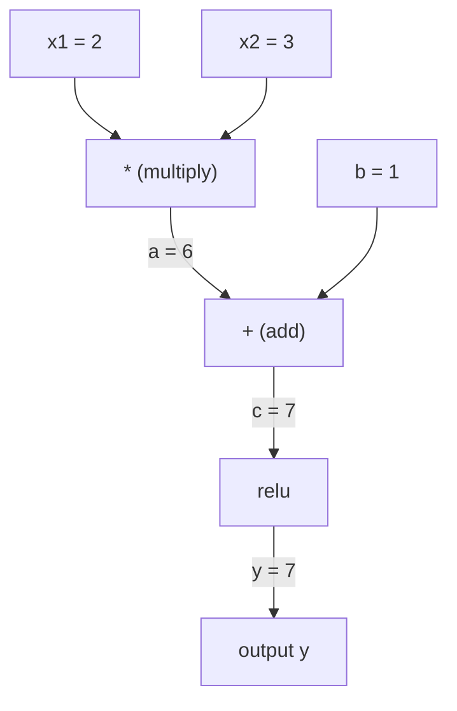
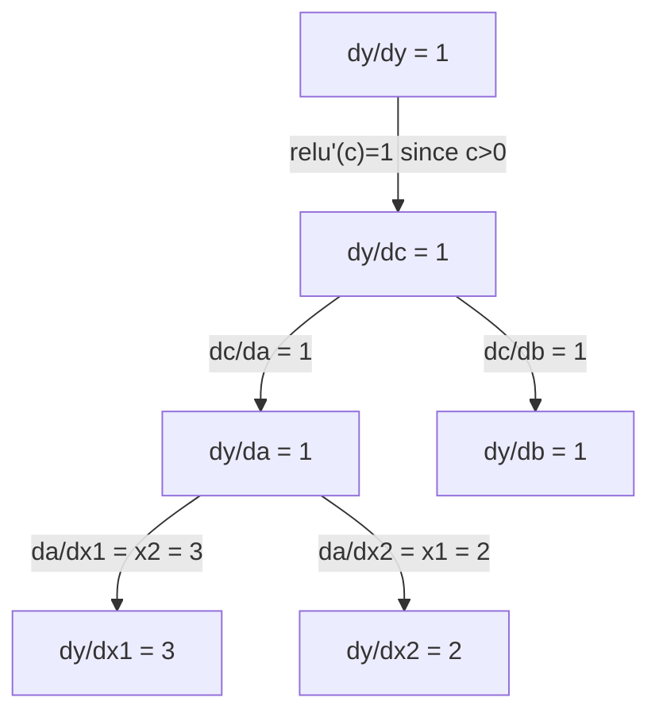

# قاعدة السلسلة والتفريق الآلي

> قاعدة السلسلة هي المحرك وراء كل شبكة عصبية تتعلم.

**Type:** Build | **类型:** 动手
**Language:**" بايثون "**语言:**بايثون
**Prerequisites:** Phase 1, Lesson 04 (Derivatives & Gradients) | **前置知识:** Phase 1, Lesson 04（导数与梯度）
**Time:** ~90 minutes | **时间:** ~90 分钟

## أهداف التعلم

- بناء محرك أوتوغريد أدنى (فئة القيمة) الذي يسجل العمليات ويحسب التراجع عن طريق التشغيل الذاتي في وضع العكس
  构建最小化自行级 引擎(值 类),记录运算并通过反向模式自动微分计算梯度
- تنفيذ خطوات للأمام والخلفية عبر الرسم البياني للحساب باستخدام الترتيب التوبولوجي
  باستخدام التخطيط لتحقيق التوسع والانتشار في المخطط الحسابي
- بناء وتدريب جهاز الرؤية متعددة الطبقات على XOR باستخدام محرك Autograd فقط من الصفر
  فقط باستخدام محركات التأثير الذاتي من الصفر
- التحقق من صحة التغيير الذاتي باستخدام التحقق من التراجع ضد الاختلافات النهائية الرقمية
  استخدام عدد القيمة المحدودة للتحقق من التدقيق ، التحقق من صحة التداول الذاتي

> **【中文解读】**
> 链式法则是"导数怎么算的函数套函数"──神经网络就是几百个函数嵌套在一起:矩阵乘法→加偏置→激活函数→再矩阵乘法→Softmax→交叉──链式法则让你从最后层开始,层次往返计算每个参数的梯度这是反向传播──

> **【拓展：链式法则 → 反向传播 → PyTorch autograd】**
> قانون السلسلة هو الاصطلاح المضاد للنشر (الاعلان الخلفي)`autograd`、تنسور فلو `GradientTape`تم استخدام النمط العكسي للتنفيذ التلقائي للتنفيذ التلقائي للتتبع التلقائي للخطوط الحسابية، ثم باستخدام قاعدة سلسلة الحساب التقييمات.

## المشكلة المشكلة المشكلة

يمكنك حساب مشتقات الوظائف البسيطة. ولكن شبكة عصبية ليست وظيفة بسيطة. إنها مئات الوظائف المكونة معا: مضاعفة المصفوفة، إضافة التحيز، تطبيق التفعيل، مضاعفة المصفوفة مرة أخرى، softmax، خسارة الانتروبية المتقاطعة. الخروج هو وظيفة من وظيفة من وظيفة من وظيفة.

> يمكنك حساب عدد الموجات من وظيفة بسيطة. ولكن شبكة العصب ليست وظيفة بسيطة. إنها مجموعة من مئات الوظائف: الموجة ضربة، إضافة الوضع، تنشيط الوظائف، إعادة الموجة ضربة، Softmax،交叉损失.

لتدريب الشبكة، تحتاج إلى تراجع الخسارة فيما يتعلق بكل وزن واحد. القيام بذلك يدويا مستحيل لملايين المعلمات. القيام بذلك عددا (الاختلافات المحدودة) بطيئة جدا.

> لتدريب شبكة، تحتاج إلى خسارة لكل درجة من الوزن.

قاعدة السلسلة تعطيك الرياضيات. التفريق الآلي يعطيك الخوارزمية. معاً يسمح لك بتحساب التراجع الدقيق من خلال تركيبات تعسفية من الوظائف في الوقت النسبي لمرور واحد للأمام.

> قانون السلسلة يعطي الرياضيات، ويعطي التفاصيل تلقائيًا الخوارزمية.

هكذا تعمل PyTorch و TensorFlow و JAX ستقوم ببناء نسخة صغيرة من الصفر

> هذا هو طريقة عمل PyTorch、TensorFlow و JAX. سوف تقوم من الصفر ببناء نسخة صغيرة.

> **【中文解读】**神经网络 = 函数的函数的函数──链式法则让你逐层解解复合函数的导数:dL/dw = dL/d_out × d_out/d_hidden × d_hidden/d_w──自动求导把这个过程自动化PyTorch的`backward()`صف من الكودات لتحديد درجة الملايين من العناصر

## المفهوم الأساسي

> **【拓展：自动求导是深度学习的引擎】**بيتورش `loss.backward()`استخدام النمط التلقائي للاتجاه المنعكس: من الخروج إلى الوراء، في كل طبقة تطبيق سلسلة القواعد.`backward()`في الواقع، لا يمكن حساب كل العناصر من التدريج.

### قاعدة السلسلة

إذا`y = f(g(x))`، مشتقة من `y`فيما يتعلق بـ`x`هو:

> إذا`y = f(g(x))`,y إلى x من المعلمات هي:

```
dy/dx = dy/dg * dg/dx = f'(g(x)) * g'(x)
```

ضرب المشتقات على طول السلسلة كل وصلة تساهم بمشتقاتها المحلية

> 沿链路乘导数── كل خطوة تساهم في تحديد المواقع

مثال:`y = sin(x^2)`

```
g(x) = x^2       g'(x) = 2x
f(g) = sin(g)     f'(g) = cos(g)

dy/dx = cos(x^2) * 2x
```

> نموذج:y = sin(x2);; داخل المستوى g(x) = x2 的导数是2x,外层 f(g) = sin(g) 的导数是 cos(g),链式相乘:dy/dx = cos(x2) × 2x。

بالنسبة للمكونات العميقة، تمتد السلسلة:

```
y = f(g(h(x)))

dy/dx = f'(g(h(x))) * g'(h(x)) * h'(x)
```

> 更深的复合:y = f(g(h(x)) ،导数为 f'(g(h(x))) × g'(h(x)) × h'(x),每多一层就多乘一项。

كل طبقة في شبكة عصبية هي ربطة واحدة في هذه السلسلة.

> كل طبقة من شبكة العصبية هي جزء من هذه السلسلة

### الرسومات الحسابية

الرسم البياني الحاسوبي يجعل قاعدة السلسلة مرئية كل عملية تصبح عقدة. البيانات تتدفق إلى الأمام عبر الرسم البياني. تدفق الدرجات إلى الوراء.

> 計算圖讓鎖式法则可視化── كل عملية تتحول إلى عقدة، والبيانات تتدفق إلى الأمام، والدرجة تتدفق إلى الخلف──

> 计算图是 PyTorch autograd:节点是运算,前向时存储中值,反向时计算局部梯度──

**Forward pass (compute values):**



**Backward pass (compute gradients):**



يطبق التسلسل للخلف في كل عقدة، وتتكاثر التدرج من الخروج إلى المدخلات.

> في كل نقطة تطبيق قانون سلسلة، سوف تدرج من الناتج إلى الناتج.

### الوضع الأمامي مقابل الوضع العكسي

هناك طريقتان لتطبيق قاعدة السلسلة من خلال الرسم البياني.

> 通过计算图应用链式法则有两种方式──

**Forward mode**يبدأ في المدخلات ويضغط على المشتقات إلى الأمام.`dx/dx = 1`ويتكاثر خلال كل عملية، جيد عندما يكون لديك عدد قليل من المدخلات و الكثير من المخرجات

> **前向模式**من الإدخال إلى الأمام`dx/dx = 1`و من خلال كل عملية تنتشر.

```
Forward mode: seed dx/dx = 1, propagate forward

  x = 2       (dx/dx = 1)
  a = x^2     (da/dx = 2x = 4)
  y = sin(a)  (dy/dx = cos(a) * da/dx = cos(4) * 4 = -2.615)
```

**Reverse mode**يبدأ في الخروج ويرفع التراجع إلى الوراء.`dy/dy = 1`و ينتشر من خلال كل عملية بالعكس. جيد عندما يكون لديك الكثير من المدخلات و عدد قليل من المخرجات.

> **反向模式**من الخروج إلى الخروج إلى الخلف..`dy/dy = 1`و العكس من خلال كل عملية. عندما يدخل الكثير, وتخرج أقل عندما يطبق.

```
Reverse mode: seed dy/dy = 1, propagate backward

  y = sin(a)  (dy/dy = 1)
  a = x^2     (dy/da = cos(a) = cos(4) = -0.654)
  x = 2       (dy/dx = dy/da * da/dx = -0.654 * 4 = -2.615)
```

شبكات الأعصاب لديها ملايين المدخلات (الوزن) ومخرج واحد (الخسارة). يحسب وضع العكس جميع التدفقات في مرور واحد للخلف. لهذا السبب يستخدم التنشر العكسي وضع العكس.

> شبكة العصبية لديها مليون إدخال و ضغط و خسرة.

| Mode | Seed | Direction | Best when |
|------|------|-----------|-----------|
| Forward | `dx_i/dx_i = 1` | Input to output | Few inputs, many outputs |
| Reverse | `dy/dy = 1` | Output to input | Many inputs, few outputs (neural nets) |

> 两种模式对比:前向模式种子 dx/dx = 1,输入到输出,适合少输入多输出;反向模式种子 dy/dy = 1,输出到输入,适合多输入少输出(神经网络)

### أرقام مزدوجة لنظام التقدم

يمكن تنفيذ وضع الأمام بشكل أروع مع أرقام مزدوجة.`a + b*epsilon`أين`epsilon^2 = 0`. . .

> يمكن أن يتم التنفيذ بشكل جيد مع نمط عدد من الأجزاء.`a + b*ε`، من بينهم`ε² = 0`.

```
Dual number: (value, derivative)

(2, 1) means: value is 2, derivative w.r.t. x is 1

Arithmetic rules:
  (a, a') + (b, b') = (a+b, a'+b')
  (a, a') * (b, b') = (a*b, a'*b + a*b')
  sin(a, a')         = (sin(a), cos(a)*a')
```

> للقطعة: ((القدر، 导数) 』 قواعد الحساب:加法对应分量相加;乘法用积的求导法则;sin 用链式法则。把输入的导数种子设为1,导数会自动通过每个运算传播。

زرع متغير المدخل مع مشتق 1. ينتشر المشتق تلقائيا خلال كل عملية.

> وضع عدد المحركات المتغيرات المدخلة على 1، والحسابات المتحركة سوف تنتشر تلقائياً من خلال كل عملية.

### بناء محرك أوتوجراد

محركات الـ " أوتوغراد " تحتاج إلى ثلاثة أشياء:

1. **Value wrapping.**لف كل رقم في جسم يحتفظ بقيمةه و تراجعها
2. **Graph recording.**كل عملية تسجل مدخلاتها و وظيفة التراجع المحلية.
3. **Backward pass.**تصفية الترتيبات التوبولوجية الرسم البياني، ثم المشي بها العكس، تطبيق قاعدة السلسلة في كل عقدة.

> محركات التطوير تتطلب ثلاثة أشياء:**数值包装**: وضع كل رقم في حزمة كشخص من قيمة الاحتفاظ والدرجة.**图记录**: كل عملية تسجل دخلها و وظيفة التدوية المحلية.**反向传播**: تتو排序图,反向遍历并每个节点应用链式法则──

هذا بالضبط ما هو PyTorch`autograd`نعم، نعم`torch.Tensor`الصف يحتوي على قيم، يسجل العمليات عندما `requires_grad=True`، ويحسب التراجع عندما تدعو`.backward()`. . .

> هذا هو (بيتورش)`autograd`ما يجب القيام به`torch.Tensor`包装数值,当 `requires_grad=True`时记录操作,调用 `.backward()`时计算梯度‬

### كيف تعمل الـ "بيتورش أوتوجراد" تحت الغطاء

عندما تكتب رمز PyTorch:

```python
x = torch.tensor(2.0, requires_grad=True)
y = x ** 2 + 3 * x + 1
y.backward()
print(x.grad)  # 7.0 = 2*x + 3 = 2*2 + 3
```

> عندما تكتب PyTorch 代码时:x 设 require_grad=True،运算自动记录,调用倒退() 后 x.grad 自动算出梯度 7.0。

(بيتورش) داخلياً:

1. يخلق`Tensor`العقدة`x`مع`requires_grad=True`
2. كل عملية (`**`،`*`،`+`) يخلق عقدة جديدة ويستسجل وظيفة الخلفية
3. `y.backward()`يُفيد التشغيل الذاتي في وضع العكس عبر الرسم البياني المسجل
4. كل عقدة`grad_fn`يحسب التراجع المحلي ويمرره إلى العقدة الأم
5. تتراكم الدرجات في`.grad`الصفات عن طريق الإضافة (ليس البداية)

> بيتورش 内部:1) 为 x 创建紧节点;2) 每个运算(**、*、+)创建新节点并记录反向函数;3) y.backward() 触发反向自动微分;4) 触发反向自动微分;4) 节点的 grad_fn 计算局部梯度并传给父节点;5) 梯度通过加法累积到 .grad 属性(不是替代) 

الرسم البياني ديناميكي (محدد من خلال تشغيل). يتم بناء الرسم البياني الجديد على كل مرور إلى الأمام. لهذا السبب يدعم PyTorch تدفق التحكم (إذا / وإلا ، حلقات) داخل النماذج.

> 计算图是动态的(定义-by-run) ⋅每次前向传播都构建新图──这是Pytorch 支持模型内部控制流的原因──

## بناء ذلك تحرك لتحقيق
```figure
chain-rule
```

## بناءها

### الخطوة الأولى: فئة القيمة

```python
class Value:
    def __init__(self, data, children=(), op=''):
        self.data = data
        self.grad = 0.0
        self._backward = lambda: None
        self._prev = set(children)
        self._op = op

    def __repr__(self):
        return f"Value(data={self.data:.4f}, grad={self.grad:.4f})"
```

> القيمة 类是 autograd 核心数据结构──每值 存储数值、梯度、反向函数闭包和子节点指针──

كلّ شخص`Value`تخزين بياناتها الرقمية، وتحديدها (في البداية صفر) ، وظيفة تراجعية، وتشير إلى العقدة الطفولة التي أنتجتها.

> كل واحد`Value`存储数值、梯度(初始为零)、反向函数和产生它的子节点指针──

### الخطوة الثانية: العمليات الحسابية مع تعقب التراجع

```python
    def __add__(self, other):
        other = other if isinstance(other, Value) else Value(other)
        out = Value(self.data + other.data, (self, other), '+')
        def _backward():
            self.grad += out.grad
            other.grad += out.grad
        out._backward = _backward
        return out

    def __mul__(self, other):
        other = other if isinstance(other, Value) else Value(other)
        out = Value(self.data * other.data, (self, other), '*')
        def _backward():
            self.grad += other.data * out.grad
            other.grad += self.data * out.grad
        out._backward = _backward
        return out

    def relu(self):
        out = Value(max(0, self.data), (self,), 'relu')
        def _backward():
            self.grad += (1.0 if out.data > 0 else 0.0) * out.grad
        out._backward = _backward
        return out
```

كل عملية تخلق إغلاق يعرف كيفية حساب التدرج المحلي وتضاعف بالتحدر فوق التدرج (`out.grad`)`+=`يتعامل مع الحالة التي تستخدم فيها قيمة في عمليات متعددة.

> كل عملية تخلق حلقة، تعرف كيف تحسب التدرج المحلي ومضاعفة التدرج المرتفع.`+=`处理一个值被多个操作使用情况 (): 处理一个值被多个操作使用情况 (): 处理一个值被多个操作使用情况)

> 关键设计:加法的反向是1(梯度直接传给两个输入),乘法的反向是另一个操作数(链式法则:d(a*b)/da = b)。

### الخطوة الثالثة: المرور للخلف

```python
    def backward(self):
        topo = []
        visited = set()
        def build_topo(v):
            if v not in visited:
                visited.add(v)
                for child in v._prev:
                    build_topo(child)
                topo.append(v)
        build_topo(self)

        self.grad = 1.0
        for v in reversed(topo):
            v._backward()
```

التنظيم التوبولوجي يضمن حساب تراجع كل عقدة بشكل كامل قبل أن ينتشر إلى أطفالها. تراجع البذور هو 1.0 (dy / dy = 1).

> التخطيط التالي يضمن أن درجة كل نقطة يتم حسابها بالكامل قبل أن تنتشر إلى نقطة الولادة.

> الخوارزمية: أولاً مع إعادة بناء كل نقطة ظهرت بعد كل اعتماداً) ، ثم مع إعادة بناء كل نقطة مع تعديل

### الخطوة الرابعة: المزيد من العمليات لمحرك كامل

فصفة القيمة الأساسية تتعامل مع الجمع والضاعفة والتحرك. محرك أوتوجراد الحقيقي يحتاج إلى المزيد. إليك العمليات التي تحتاجها لبناء شبكات عصبية:

> 基础 类 类 类 支持加加、乘、relu。 محرك تحديد الحركة يحتاج إلى المزيد من العمليات:

```python
    def __neg__(self):
        return self * -1

    def __sub__(self, other):
        return self + (-other)

    def __radd__(self, other):
        return self + other

    def __rmul__(self, other):
        return self * other

    def __rsub__(self, other):
        return other + (-self)

    def __pow__(self, n):
        out = Value(self.data ** n, (self,), f'**{n}')
        def _backward():
            self.grad += n * (self.data ** (n - 1)) * out.grad
        out._backward = _backward
        return out

    def __truediv__(self, other):
        return self * (other ** -1) if isinstance(other, Value) else self * (Value(other) ** -1)

    def exp(self):
        import math
        e = math.exp(self.data)
        out = Value(e, (self,), 'exp')
        def _backward():
            self.grad += e * out.grad
        out._backward = _backward
        return out

    def log(self):
        import math
        out = Value(math.log(self.data), (self,), 'log')
        def _backward():
            self.grad += (1.0 / self.data) * out.grad
        out._backward = _backward
        return out

    def tanh(self):
        import math
        t = math.tanh(self.data)
        out = Value(t, (self,), 'tanh')
        def _backward():
            self.grad += (1 - t ** 2) * out.grad
        out._backward = _backward
        return out
```

**Why each operation matters:**

| Operation | Backward rule | Used in |
|-----------|--------------|---------|
| `__sub__` | Reuses add + neg | Loss computation (pred - target) |
| `__pow__` | n * x^(n-1) | Polynomial activations, MSE (error^2) |
| `__truediv__` | Reuses mul + pow(-1) | Normalization, learning rate scaling |
| `exp` | exp(x) * upstream | Softmax, log-likelihood |
| `log` | (1/x) * upstream | Cross-entropy loss, log probabilities |
| `tanh` | (1 - tanh^2) * upstream | Classic activation function |

> قواعد مختلفة للعمليات: تخفيف المستخدمة + إرتفاضة + إرتفاضة;  استخدام n*x^(n-1);

الجزء الذكي:`__sub__`و`__truediv__`يتم تعريفها من حيث العمليات الحالية. فإنها تحصل على تراجعات صحيحة مجانا لأن قاعدة السلسلة تتكون من خلال العمليات الأساسية إضافة / مول / بو.

> 巧妙之处:`__sub__`和 `__truediv__`通過已有操作定义, لذلك التدرجة 通過链式法则自动正确

### الخطوة 5: ميني MLP من الصفر

مع فئة القيم الكاملة، يمكنك بناء شبكة عصبية لا توارش، لا NumPy، فقط القيم وقاعدة السلسلة.

> مع نوع كامل من القيمة، يمكنك بناء شبكة العصبية. لا حاجة إلى بيتورش. لا حاجة إلى NumPy. فقط باستخدام القيمة وقانون الحلقة.

```python
import random

class Neuron:
    def __init__(self, n_inputs):
        self.w = [Value(random.uniform(-1, 1)) for _ in range(n_inputs)]
        self.b = Value(0.0)

    def __call__(self, x):
        act = sum((wi * xi for wi, xi in zip(self.w, x)), self.b)
        return act.tanh()

    def parameters(self):
        return self.w + [self.b]

class Layer:
    def __init__(self, n_inputs, n_outputs):
        self.neurons = [Neuron(n_inputs) for _ in range(n_outputs)]

    def __call__(self, x):
        return [n(x) for n in self.neurons]

    def parameters(self):
        return [p for n in self.neurons for p in n.parameters()]

class MLP:
    def __init__(self, sizes):
        self.layers = [Layer(sizes[i], sizes[i+1]) for i in range(len(sizes)-1)]

    def __call__(self, x):
        for layer in self.layers:
            x = layer(x)
        return x[0] if len(x) == 1 else x

    def parameters(self):
        return [p for layer in self.layers for p in layer.parameters()]
```

أ`Neuron`الحسابات`tanh(w1*x1 + w2*x2 + ... + b)`.`Layer`هو قائمة بالخلايا العصبية.`MLP`كل وزن هو`Value`، لذا اتصل`loss.backward()`يُنشر التدرج إلى كل مُعيار

> واحد`Neuron`计算 `tanh(w1*x1 + w2*x2 + ... + b)`‬ ‬ ‬`Layer`هو من المفترض أن يكون هناك`MLP`كلّ شخص لديه ثقيلة`Value`, لذلك ت调用`loss.backward()`سوف ننتشر إلى كل عنصر

**Training on XOR:**

> **在 XOR 上训练**:XOR هي مشكلة غير خليوية يمكن تحديدها، لا يمكن حلّها من قبل آلة الشعور الواحدة، يجب أن تستخدم على الأقل طبقة واحدة مخفية.

```python
random.seed(42)
model = MLP([2, 4, 1])  # 2 inputs, 4 hidden neurons, 1 output

xs = [[0, 0], [0, 1], [1, 0], [1, 1]]
ys = [-1, 1, 1, -1]  # XOR pattern (using -1/1 for tanh)

for step in range(100):
    preds = [model(x) for x in xs]
    loss = sum((p - y) ** 2 for p, y in zip(preds, ys))

    for p in model.parameters():
        p.grad = 0.0
    loss.backward()

    lr = 0.05
    for p in model.parameters():
        p.data -= lr * p.grad

    if step % 20 == 0:
        print(f"step {step:3d}  loss = {loss.data:.4f}")

print("\nPredictions after training:")
for x, y in zip(xs, ys):
    print(f"  input={x}  target={y:2d}  pred={model(x).data:6.3f}")
```

هذا هو micrograd. حلقة تدريب كاملة للشبكات العصبية في Python النقي مع التمييز الآلي. كل إطار للتعلم العميق التجاري يفعل الشيء نفسه على نطاق واسع.

> هذا هو الجهاز الصحي. يتم تنفيذ دورة تدريب كاملة للشبكات العصبية و التفاصيل الآلية باستخدام Python.

> دورة التدريب 5 步:1) 前向预测;2) 计算损失(MSE);3) 清零所有参数梯度;4) 反向传播;5) 沿梯度负方向更新参数──这是 PyTorch 训练循环的核心──

### الخطوة 6: التحقق من التدريج

كيف تعرف أن التشخيص الذاتي صحيح؟ قارنه بالمشتقات الرقمية. هذا هو التحقق من التراجع.

> كيف تعرف أن تحديدك صحيح؟

```python
def gradient_check(build_expr, x_val, h=1e-7):
    x = Value(x_val)
    y = build_expr(x)
    y.backward()
    autodiff_grad = x.grad

    y_plus = build_expr(Value(x_val + h)).data
    y_minus = build_expr(Value(x_val - h)).data
    numerical_grad = (y_plus - y_minus) / (2 * h)

    diff = abs(autodiff_grad - numerical_grad)
    return autodiff_grad, numerical_grad, diff
```

اختبرها على تعبير معقد:

```python
def expr(x):
    return (x ** 3 + x * 2 + 1).tanh()

ad, num, diff = gradient_check(expr, 0.5)
print(f"Autodiff:  {ad:.8f}")
print(f"Numerical: {num:.8f}")
print(f"Difference: {diff:.2e}")
# Difference should be < 1e-5
```

> 测试复杂表达式:(x3 + 2x + 1) من تنح في x=0.5 处的梯度──自动变化 和数值导数的差异应 < 1e-5,验证反向传播实现正确──

التحقق من التدرج ضروري عند تنفيذ عمليات جديدة. إذا كان لديك مرور خلفي لديه خطأ، فإن التحقق الرقمي يلتقطه. كل تنفيذ دراسة عميقة خطيرة يقوم بتحقق من التدرج أثناء التطوير.

> التفتيش التدريجي ضروري عند تنفيذ العمليات الجديدة. إذا كان هناك خطأ في التنقل المضاد، يمكن العثور على التفتيش العددي.

**When to use gradient checking:**

| Situation | Do gradient check? |
|-----------|-------------------|
| Adding a new operation to your autograd | Yes, always |
| Debugging a training loop that won't converge | Yes, check gradients first |
| Production training | No, too slow (2x forward passes per parameter) |
| Unit tests for autograd code | Yes, automate it |

> 何时使用梯度检查:给自动化 加新操作(永远要);调试不收的训练循环(先查梯度);生产训练(不要,太慢);自动化 单元测试(自动化)

### الخطوة 7: التحقق من حساب يدوي

```python
x1 = Value(2.0)
x2 = Value(3.0)
a = x1 * x2          # a = 6.0
b = a + Value(1.0)    # b = 7.0
y = b.relu()          # y = 7.0

y.backward()

print(f"y = {y.data}")          # 7.0
print(f"dy/dx1 = {x1.grad}")   # 3.0 (= x2)
print(f"dy/dx2 = {x2.grad}")   # 2.0 (= x1)
```

> 手动验证:y = relu(x1*x2 + 1), لأن x1*x2 + 1 = 7 > 0,relu 是恒等映射──dy/dx1 = x2 = 3,dy/dx2 = x1 = 2──引擎计算结果完全匹配──

التحقق اليدوي: `y = relu(x1*x2 + 1)`منذ`x1*x2 + 1 = 7 > 0`"ريلو" هو الهوية
`dy/dx1 = x2 = 3`. .`dy/dx2 = x1 = 2`المحرك يطابق

## استخدمها في إطار التنفيذ

### التحقق من PyTorch

> مع PyTorch مقابل تجربة: مع مشعل 重写同样表达式,对比梯度结果──

```python
import torch

x1 = torch.tensor(2.0, requires_grad=True)
x2 = torch.tensor(3.0, requires_grad=True)
a = x1 * x2
b = a + 1.0
y = torch.relu(b)
y.backward()

print(f"PyTorch dy/dx1 = {x1.grad.item()}")  # 3.0
print(f"PyTorch dy/dx2 = {x2.grad.item()}")  # 2.0
```

نفس التراجعات، محركك يحسب نفس النتيجة مثل PyTorch لأن الرياضيات هي نفسها: التشغيل الذاتي في وضع العكس عبر قاعدة السلسلة.

> نفس الدرجة. محركك و PyTorch حساب نفس النتيجة، لأن الرياضيات هي نفسها: من خلال قواعد سلسلة النظام العكسية التوجه التلقائي.

## أرسلها .

هذا الدرس ينتج عن:
- `outputs/skill-autodiff.md`-- مهارة لبناء وتحليل الاصلاحيات
- `code/autodiff.py`-- محرك بسيط من نوعه يمكنك تمديد

> 本课产出:构建和调试自动级 系统的技能文档 +可扩展的最小自动级 引擎代码──

فئة القيمة التي تم بناؤها هنا هي الأساس لدورة تدريب شبكة الأعصاب في المرحلة 3.

> فالمجموعة المكونة من القيمة هي أساس دورة تدريب شبكة العصبية المرحلة الثالثة.

### تعبير أكثر تعقيداً

```python
a = Value(2.0)
b = Value(-3.0)
c = Value(10.0)
f = (a * b + c).relu()  # relu(2*(-3) + 10) = relu(4) = 4

f.backward()
print(f"df/da = {a.grad}")  # -3.0 (= b)
print(f"df/db = {b.grad}")  #  2.0 (= a)
print(f"df/dc = {c.grad}")  #  1.0
```

> 更复杂的表达式:relu(a*b + c) 在 a=2, b=-3, c=10 处,结果是relu(4) = 4。df/da = b = -3,df/db = a = 2,df/dc = 1。

## تمارين التدريب

1. إضافة`__pow__`إلى فئة القيمة حتى تتمكن من الحساب`x ** n`تأكد من ذلك`d/dx(x^3)`في`x=2`متساوية`12.0`. . .
   给 类添加值 `__pow__`، دعك تستطيع الحساب`x ** n` التحقق`d/dx(x^3)`في`x=2`في مثل`12.0`.

2. إضافة`tanh`كعمل تنشيط. تحقق من ذلك`tanh'(0) = 1`و`tanh'(2) = 0.0707`(تقريب)
   إضافة`tanh`激活函数──验证 `tanh'(0) = 1`،`tanh'(2) ≈ 0.0707`.

3. بناء الرسم البياني الحسابي لنورون واحد:`y = relu(w1*x1 + w2*x2 + b)`قم بحساب كلّ الخمسة من التدرج وتحقق من "بيتورش".
   لأحد العصبات تشكيل حسابات:`y = relu(w1*x1 + w2*x2 + b)` حساب所有五个梯度并与 PyTorch 验证──

4. تنفيذ التشغيل الذاتي في وضع التقدم باستخدام أرقام مزدوجة.`Dual`و التحقق من أنه يعطي نفس المشتقات مثل محركك في وضع العكس.
   استخدام عدد الحالات لتحقيق النمط التوجه الاول`Dual`类并验证 أنه يعطي نفس الموجة مع محرك الوضع المعاكس الخاص بك

## شروط الرئيسية

| Term | What people say | What it actually means |
|------|----------------|----------------------|
| Chain rule | "Multiply the derivatives" | The derivative of composed functions equals the product of each function's local derivative, evaluated at the right point |
| Computational graph | "The network diagram" | A directed acyclic graph where nodes are operations and edges carry values (forward) or gradients (backward) |
| Forward mode | "Push derivatives forward" | Autodiff that propagates derivatives from inputs to outputs. One pass per input variable. |
| Reverse mode | "Backpropagation" | Autodiff that propagates gradients from outputs to inputs. One pass per output variable. |
| Autograd | "Automatic gradients" | A system that records operations on values, builds a graph, and computes exact gradients via the chain rule |
| Dual numbers | "Value plus derivative" | Numbers of the form a + b*epsilon (epsilon^2 = 0) that carry derivative information through arithmetic |
| Topological sort | "Dependency order" | Ordering graph nodes so every node comes after all its dependencies. Required for correct gradient propagation. |
| Gradient accumulation | "Add, don't replace" | When a value feeds into multiple operations, its gradient is the sum of all incoming gradient contributions |
| Dynamic graph | "Define by run" | A computation graph rebuilt on every forward pass, allowing Python control flow inside models (PyTorch style) |
| Gradient checking | "Numerical verification" | Comparing autodiff gradients against numerical finite-difference gradients to verify correctness. Essential for debugging. |
| MLP | "Multi-layer perceptron" | A neural network with one or more hidden layers of neurons. Each neuron computes a weighted sum plus bias, then applies an activation function. |
| Neuron | "Weighted sum + activation" | The basic unit: output = activation(w1*x1 + w2*x2 + ... + b). The weights and bias are learnable parameters. |

> 术语速查:قاعدة السلسلة 术语速查: قاعدة السلسلة 术语速查: قاعدة السلسلة 术语速查: قاعدة السلسلة 术语速查: قاعدة السلسلة 术语速查: قاعدة السلسلة 术语速查: قاعدة السلسلة 术语速查: قاعدة السلسلة 术语速查: قاعدة السلسلة 术语速查: قاعدة السلسلة 术语速查: قاعدة السلسلة 术语速查: قاعدة السلسلة 术语速查: قاعدة السلسلة 术语速查: قاعدة السلسلة 术语速查: قاعدة السلسلة 术语速查: قاعدة السلسلة 术语速查: قاعدة السلسلة 术语速查: قاعدة السلسلة 术语速查: قاعدة السلسلة 术语速查: قاعدة السلسلة 术语速查: قاعدة السلسلة 术语速查: قاعدة السلسلة 术语速查: قاعدة السلسلة 术语速查: 术语速查: 术语速查: 术语速查: 术语速查: 术语速查: 术语速查: 术语速查: 术语速查: 术语速查: 术语速查: 术语速查: 术语速查: 术语速查: 术语速查: 术语速查: 术语速查: 术语: 术语: 术语: 术语: 术语: 术语速查: 术语: 术语: 术语: 术语: 术语: 术语: 术语: 术语: 术语: 术语: 术语: 术语: 术语: 术语: 术语: 术语: 术语: 术语: 术语: 术语: 术语: 术语: 术语: 术语: 术语: 术语: 术

## المزيد من القراءة

- [3Blue1Brown: Backpropagation calculus](https://www.youtube.com/watch?v=tIeHLnjs5U8)-- تفسير بصري لقاعدة السلسلة في الشبكات العصبية
- [PyTorch Autograd mechanics](https://pytorch.org/docs/stable/notes/autograd.html)-- كيف يعمل النظام الحقيقي
- [Baydin et al., Automatic Differentiation in Machine Learning: a Survey](https://arxiv.org/abs/1502.05767)-- إشارة شاملة
