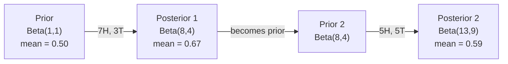

# نظرية بايز

> الاحتمال يتعلق بما تتوقعه، نظرية بايز يتعلق بما تتعلمينه
> الاحتمال يعتمد على توقعاتك.

**Type:** Build | **类型:** 动手
**Language:**" بايثون "**语言:**بايثون
**Prerequisites:** Phase 1, Lesson 06 (Probability Fundamentals) | **前置知识:** Phase 1, Lesson 06（概率基础）
**Time:** ~75 minutes | **时间:** ~75 分钟

## أهداف التعلم

- تطبيق نظرية بايز لحساب الاحتمالات اللاحقة من السابقات والاحتمالات والدليل
- بناء تصنيف نصي بييز البديل من الصفر مع تسطيح لابلاس وحسابات الموقع السجل
- مقارنة تقدير MLE و MAP و شرح كيف أن MAP تتوافق مع تنظيم L2
- تنفيذ التحديثات البايسية المتسلسلة باستخدام مسبقات التوافق بين البينوميات بيتا للاختبار A / B

> **【中文解读】**
> الفكرة الأساسية للنظرية بليزية: باستخدام دليل جديد يجدد عقيدتك. احتمالات التقدم ({\displaystyle \bear {bear} }{\bear}{\bear}{\bear}{\bear}{\bear}{\bear}{\bear}{\bear}{\bear}{\bear}{\bear}{\bear}{\bear}{\bear}{\bear}{\bear}{\bear}{\bear}{\bear}{\bear}{\bear}{\bear}{\bear}{\bear}{\bear}{\bear}{\bear}{\bear}{\bear}{\bear}{\bear}{\bear}{\bear}{\bear}{\bear}{\bear}{\bear}{\bear}{\bear}{\bear}{\bear}{\bear}{\bear}{\bear}{\bear}{\bear}{\bear}{\bear}{\bear}}{\bear}

> **【拓展：贝叶斯在 AI 中的位置】**
> - **朴素贝叶斯分类器**: 垃圾邮件                                                                                                                                                                                                                                                                                                                                                                                                                                                                                                                        `GaussianNB`-أجل`MultinomialNB`.
> - **贝叶斯优化**: 用于超参数调优(如 Optuna),比网格搜索高效得多。
> - **MAP 与正则化**: أقصى تقدير لاحق (MAP) = L2 = L2 = L2 = L2 = L2 = L2 = L2 = L2 = L2 = L2 = L2 = L2 = L2 = L2 = L2 = L2 = L2 = L2 = L2 = L2 = L2 = L2 = L2 = L2 = L2 = L2 = L2 = L2 = L2 = L2 = L2 = L2 = L2 = L2 = L2 = L2 = L2 = L2 = L2 = L2 = L2 = L2 = L2 = L2 = L2 = L2 = L2 = L2 = L2 = L2 = L2 = L2 = L2 = L2 = L2 = L2 = L2 = L2 = L2 = L2 = L2 = L2 = L2 = L2 = L2 = L2 = L2 = L2 = L2 = L2 = L2 = L2 = L2 = L2 = L2 = L2 = L2 = L2 = L2 = L2 = L2 = L2 = L2 = L2 = L2 = L2 = L2 = L2 = L2 = L2 = L2 = L2 = L2 = L2 = L2 = L2 = L2 = L2 = L2 = L2 = L2 = L2 = L2 = L2 = L2 = L2 = L2 = L2 = L2 = L2 = L2 = L2 = L2 = L2 = L2 = L2 = L2 = L2 = L2 = L2 = L2 = L2 = L2 = L2 = L2 = L2 = L2 = L2 = L2 = L2 = L2 = L2 = L2 = L2 = L2 = L2 = L2 = L2 = L2 = L2 = L2 = L2 = L2 = L2 = L2 = L2 = L2 = L2 = L2 = L2 = L2 = L2 = L2 = L2 = L2 = L2 = L2 = L2 = L2 = L2 = L2 = L2 = L2 = L2 = L2 = L2

## المشكلة المشكلة المشكلة

> **【中文解读】**معدل تحديد الاختبار الطبي 99٪، ما هو احتمال الإصابة بالمرض الحقيقي؟ يقول الهدوء 99٪، ولكن مع حساب بيليس قد يكون فقط 50٪ لأن الاعتبار الأول "الاحتمالات التجريبية" ((عدد الإصابة منخفض جدا)

## المفهوم الأساسي

> **【拓展：贝叶斯思维是 AI 的核心范式】** بيليس القرار `P(假设|证据) = P(证据|假设) × P(假设) / P(证据)`في أي مكان: ((1) **朴素贝叶斯分类器**:垃圾邮件过的经典方法;(2) **贝叶斯优化**:调超参数的高效方法(比网格搜索快 10 倍);(3) **MAP = L2 正则化**: أكبر التقديرات اللاحقة تساوي قيمة إضافة L2  наказаن ، من منظور بيليس يفسر لماذا يمكن أن يكون القانون المناسب ؛**贝叶斯神经网络**:输出不确定性估计,知道"我不知道"──

معظم الناس يقولون 99٪. الإجابة الحقيقية تعتمد على مدى نادرة المرض. إذا كان 1 من كل 10،000 شخص لديه، النتيجة الإيجابية تعطيك فقط حوالي 1% فرصة المرض. النتيجة الإيجابية الأخرى 99٪ هي إنذارات كاذبة من الناس الصحيين.

> يقول غالبية الناس 99%── الجواب الحقيقي يعتمد على عدد المرضات النادرة. إذا مرض واحد من كل عشرة أشخاص، فإن النتيجة الإيجابية تعطيك احتمال المرض بنسبة 1% فقط.

هذا ليس سؤال خدعة. إنه نظرية بايز. كل مرشح للفريد الإلكتروني، كل تشخيص طبي، كل نموذج تعلم الآلة الذي يقدر عدم اليقين يستخدم هذا التفكير بالضبط. تبدأ بالاعتقاد. ترى الأدلة. تحديث.

> هذا ليس تحويل سريع في العقل. هذا هو نظرية بيلز. كل تصفية بريد فضائي. كل تشخيص طبي. كل نموذج من أشكال عدم اليقين يستخدم نفس التفكير: من الإيمان، انظر الأدلة، إعادة الإيمان.

إذا قمت ببناء أنظمة ML دون فهم هذا، سوف تفسر الخروجات النموذجية بشكل خاطئ، وتحدد حدود سيئة، وتشحن توقعات ثقة مفرطة.

> إذا لم تفهم هذا الأمر حول بناء نظام ML، سوف تكون مخطئ في تقرير النموذج المخرج، وضع قيمة خاطئة، إصدار توقعات ذات ثقة مفرطة.

## المفهوم الأساسي

### من احتمال المشترك إلى بايز

تعرف من الدروس 06 بالفعل أن الاحتمال المشروط هو:

> لقد تعلمت في الدورة الستة احتمالات:

```
P(A|B) = P(A and B) / P(B)
```

و بالتناظر:

```
P(B|A) = P(A and B) / P(A)
```

كل من المصطلحات تشارك نفس العداد: P ((A و B). ضعها متساوية وإعادة ترتيبها:

>  اثنين من المواد المشتركة في التعبير: P(A و B)。 سوف تكون متشابهة ومجددة:

```
P(A and B) = P(A|B) * P(B) = P(B|A) * P(A)

Therefore:

P(A|B) = P(B|A) * P(A) / P(B)
```

هذه هي نظرية (بايز) أربعة كميات معادلة واحدة

> هذا هو نظرية بيلز:

### الأجزاء الأربعة

| Part | Name | What it means |
|------|------|---------------|
| P(A\|B) | Posterior / 后验 | Your updated belief about A after seeing evidence B / 看到证据 B 后对 A 的更新信念 |
| P(B\|A) | Likelihood / 似然 | How probable the evidence B is if A is true / 如果 A 为真，证据 B 出现的概率 |
| P(A) | Prior / 先验 | Your belief about A before seeing any evidence / 看到任何证据前对 A 的信念 |
| P(B) | Evidence / 证据 | Total probability of seeing B under all possibilities / 在所有可能情况下看到 B 的总概率 |

المفهوم الدليل P ((B) يعمل كمنع للطبيعية. يمكنك توسيعه باستخدام قانون الاحتمال الكلي:

> 证据项 P(B) 作为归一化因子──可以用全概率公式展开:

```
P(B) = P(B|A) * P(A) + P(B|not A) * P(not A)
```

### مثال على الاختبار الطبي

يصاب مرض واحد من بين 10 آلاف شخص. الاختبار دقيق بنسبة 99٪ (يقوم بتصيد 99٪ من المرضى، ويقدم نتائج إيجابية كاذبة في 1٪ من الوقت).

> تمكن من اكتشاف 99% من المرضى، معدل الإيجابية الخاطئة 1٪.

```
P(sick)          = 0.0001     (prior: disease is rare)
P(positive|sick) = 0.99       (likelihood: test catches it)
P(positive|healthy) = 0.01    (false positive rate)

P(positive) = P(positive|sick) * P(sick) + P(positive|healthy) * P(healthy)
            = 0.99 * 0.0001 + 0.01 * 0.9999
            = 0.000099 + 0.009999
            = 0.010098

P(sick|positive) = P(positive|sick) * P(sick) / P(positive)
                 = 0.99 * 0.0001 / 0.010098
                 = 0.0098
                 = 0.98%
```

أقل من 1٪، عندما تكون حالة نادرة، حتى الاختبارات الدقيقة تنتج في الغالب نتائج إيجابية كاذبة. لهذا السبب يطلب الأطباء اختبارات تأكيد.

> لا يصل إلى 1%، والاحتمالات الأولية هي الرئيسية، عندما تكون المرض نادرة، حتى معالجة دقيقة تؤدي بشكل رئيسي إلى إيجابية مزيفة.

### مثال على مرشحات البريد الإلكتروني

تتلقى رسالة بريد إلكتروني تحتوي على كلمة "لوتري" هل هي رسالة غير مرسلة؟

> هل وصلت رسالة تتضمن "اللوتاريا" ..

```
P(spam)                = 0.3      (30% of email is spam)
P("lottery"|spam)      = 0.05     (5% of spam emails contain "lottery")
P("lottery"|not spam)  = 0.001    (0.1% of legitimate emails contain "lottery")

P("lottery") = 0.05 * 0.3 + 0.001 * 0.7
             = 0.015 + 0.0007
             = 0.0157

P(spam|"lottery") = 0.05 * 0.3 / 0.0157
                  = 0.955
                  = 95.5%
```

كلمة واحدة تحول احتمال من 30% إلى 95.5% مرشح بريد غير مرغوب فيه حقيقي يطبق بايز على مئات الكلمات في وقت واحد.

> كلمة واحدة سوف تتراوح من 30% 推到95.5% 

### البغاء بايز: افتراض الاستقلال

يمتد بييز البسيط هذا إلى العديد من الميزات عن طريق افتراض أن جميع الميزات مستقلة مشروطًا نظراً للطبقة:

> سوف يمتد هذا إلى العديد من الخصائص، افترض أن جميع الخصائص مستقلة عن بعضها البعض في ظل ظروف فئة معينة:

```
P(class | feature_1, feature_2, ..., feature_n)
  = P(class) * P(feature_1|class) * P(feature_2|class) * ... * P(feature_n|class)
    / P(feature_1, feature_2, ..., feature_n)
```

الجزء "ساف" هو افتراض الاستقلال. في النص، لا تكون حالات الكلمات مستقلة ("جديدة" و "يورك" مرتبطة). ولكن هذا الافتراض يعمل بشكل مفاجئ في الممارسة العملية لأن المصنف يحتاج فقط إلى تصنيف الفئات، وليس إنتاج احتمالات مقياسية.

> جزء "بسيط" هو افتراض استقلالية. في الكتاب، ظهور الكلمات ليس مستقلًا.

بما أن المُعادل هو نفسه لجميع الفصول، يمكنك تخطي ذلك وتقارن العدّيات:

> لأن分母 لكل الفئات هي نفسها، يمكن أن تتجاوزها، فقط مقارنة الجزيئات:

```
score(class) = P(class) * product of P(feature_i | class)
```

اختر الصف الذي يحصل على أعلى درجة

> 选择得分最高的类──

### تقدير الحد الأقصى للاحتمالات (MLE)

كيف تحصل على P "ميزة "من "مجموعة" من بيانات التدريب؟

> كيفية الحصول على P  صفة من خلال درجة التدريب

```
P("free"|spam) = (number of spam emails containing "free") / (total spam emails)
```

هذا هو MLE: اختيار قيم المعايير التي تجعل البيانات الملاحظة أكثر احتمالية. أنت تعظيم وظيفة الاحتمال، والتي بالنسبة للعد التفريقية تقلل إلى التردد النسبي.

> هذا هو MLE ((أكبر تقدير التشابه): اختيار لجعلها تعادلات بيانات الملاحظة الأكثر احتمالاً تظهر.

المشكلة: إذا لم تظهر كلمة في البريد الإلكتروني أثناء التدريب، فإن MLE يعطي احتمال صفر. كلمة واحدة غير مرئية تقتل المنتج بأكمله.

> 问题: إذا لم يظهر كلمة في البريد المزعج خلال التدريب، فإن MLE 给它概率零────────────────────────────────────────────────────────────────────────────────────────────────────────────────────────────────────────────────────────────────────────────────────────────────────────────────────────────────────────────────────────────────────────────────────────────────────────────────────────────────────────────────────────────────────────────────────────────────────────────────────────────────────────────────────────────────────────────────────────────────────────────────────────────────────────────────────────────────────────────────────────────────────────────────────────────────────────────────────────────────────────────────────────────────────────────────────────────────────────────────────────────────────────────────────────────────────────────────────────────────────────────────────────────────────────────────────────────────────────────────────────────────────────────────────────────────────────────────────────────────────

```
P(word|class) = (count(word, class) + 1) / (total_words_in_class + vocabulary_size)
```

إضافة 1 لكل عدد يضمن عدم وجود احتمال هو أبدا صفر.

> إعطاء كل عدد إضافة 1 تأكد من احتمالات لن تكون أبداً صفر

### الحد الأقصى a posteriori (MAP)

يسأل MLE: ما هي المعايير التي تُعزز P ((معلومات المعايير)) ؟

> MLE 问: ما هو العيار الذي يجعل P                                                                                                                                                                                                                                                         

يطرح MAP: ما هي المعايير التي تُعزز P(معايير في البيانات) ؟

> السؤال: ما هي المعايير التي تسمح لـ (P) ؟

من خلال نظرية بايز:

> وفقاً لـ (باييس)

```
P(parameters|data) proportional to P(data|parameters) * P(parameters)
```

يضيف MAP سابقة على المعلمات نفسها. إذا كنت تعتقد أن المعلمات يجب أن تكون صغيرة، فإنك ترميز ذلك كقبلة تعاقب القيم الكبيرة. هذا هو نفسه من تنظيم L2 في ML. عقوبة "الجزء" في تراجع الخضروة هو حرفيا قبل غوسية على الوزن.

> إذا كنت تعتقد أن العنصر يجب أن يكون أصغر، فاستخدم العقوبة الكبيرة في العرض. هذا يساوي تماما مع L2 في ML.

| Estimation | Optimizes | ML equivalent |
|------------|-----------|---------------|
| MLE | P(data\|params) | Unregularized training / 无正则化训练 |
| MAP | P(data\|params) * P(params) | L2 / L1 regularization / L2/L1 正则化 |

### البايسية مقابل المتردد: الفرق العملي

يُعتبر علماء التكرار المعايير غير معروفة، ويقولون: "إذا كررت هذه التجربة عدة مرات، ماذا سيحدث؟"

> 频率学派将参数视为固定的未知量――他们问:" إذا كررت هذه التجربة مرات عديدة ، فماذا سيحدث؟"

يُعتبر البايزيون المعايير تقسيمًا. يسألون: "نظراً لما لاحظت، ما الذي أؤمن به عن المعايير؟"

> يطرحون على المعلمين أن العنصرات هي مُوزعة. يسألون: "وفقاً لما لاحظته، ما هي ثقتي في العنصرات؟"

بالنسبة لبناء أنظمة ML، الفرق العملي:

> بالنسبة لبناء نظام ML، الفرق الحقيقي هو:

| Aspect | Frequentist | Bayesian |
|--------|-------------|----------|
| Output | Point estimate / 点估计 | Distribution over values / 值的分布 |
| Uncertainty | Confidence intervals (about procedure) / 置信区间（关于过程） | Credible intervals (about parameter) / 可信区间（关于参数） |
| Small data | Can overfit / 可能过拟合 | Prior acts as regularization / 先验充当正则化 |
| Computation | Usually faster / 通常更快 | Often requires sampling (MCMC) / 通常需要采样（MCMC） |

معظم أساليب الإنتاج المعدنية هي المتكررة (SGD، تقديرات النقاط). أساليب بايزيونية تظهر عندما تحتاج إلى عدم اليقين المعدل (قرارات طبية، نظم أساسية للسلامة) أو عندما تكون البيانات نادرة (تعلم القليل من اللقطات، بدء البرد).

> غالبية الإنتاج ML هو التكرار المقرر في المدرسة (SGD、 نقطة التقدير)  عندما تحتاج إلى تحديد عدم اليقينة (<<<<<<<<<<<<<<<<<<<<<<<<<<<<<<<<<<<<<<<<<<<<<<<<<<<<<<<<<<<<<<<<<<<<<<<<<<<<<<<<<<<<<<<<<<<<<<<<<<<<<<<<<<<<<<<<<<<<<<<<<<<<<<<<<<<<<<<<<<<<<<<<<<<<<<<<<<<<<<<<<<<<<<<<<<<<<<<<<<<<<<<<<<<<<<<<<<<<<<<<<<<<<<<<<<<<<<<<<<<<<<<<<<<<<<<<<<<<<<<<<<<<<<<<<<<<<<<<<<<<<<<<<<<<<<<<<<<<<<<<<<<<<<<<<<<<<<<<<<<<<<<<<<<<<<<<<<<<<<<<<<<<<<<<<<<<<<<<<<<<<<<<<<<<<<<<<<<<<<<<<<<<<<<<<<<<<<<<<<<<<<<<<<<<<<<<<<<<<<<<<<<<<<<<<<<<<<<<<<<<<<<<<<<<<<<<<<<<<<<<<<<<<<<<<<<<<<<<<<<<<<<<<<<<<<<<

### لماذا تفكير بايسي مهم لـ ML

العلاقة أعمق من التشابه

> هذا النوع من الاتصال أكثر عمقاً:

**Priors are regularization.**السابق غوسي على الوزن هو L2 التنظيم. سابق لابلاس هو L1. كلما أضفت مصطلح التنظيم، أنت تقوم بإعداد بيان بايسي حول أي قيم المعلمات تتوقع.

> **先验就是正则化。**الاختبار العالي على الوزن هو L2 التأريخ، والتحقيق العالي هو L1. كل مرة تضيف فيها التأريخ، فإنك تقوم بإعداد بيان بيليس حول قيمة المتوقع للعلامات.

**Posteriors are uncertainty.**لا يخبرك احتمال واحد متوقع عن مدى ثقة النموذج في تلك التقديرات. تقديم أساليب بايسيون لك توزيع: "أعتقد أن P(سبام) هو بين 0.8 و 0.95. "

> **后验就是不确定性。**单个预测概率不能告诉你模型对这个估算有多少信心――贝叶斯方法给你一个分布:"我认为P(垃圾邮件) 在0.8 到0.95 之间――"

**Bayes updates are online learning.**ما بعد اليوم يصبح ما قبل غداً عندما يرى نموذجك بيانات جديدة، يقوم بتحديث معتقداته تدريجياً بدلاً من إعادة التدريب من الصفر.

> **贝叶斯更新就是在线学习。**تصبح تجربة اليوم هي تجربة الغد عندما يرى النموذج بيانات جديدة، فإنه يزيد من الإيمان الجديد بدلاً من التدريب من جديد.

**Model comparison is Bayesian.**معايير المعلومات البايزية (BIC) ، والاحتمال الحدودي، وعوامل بايز جميعها تستخدم التفكير البايزية للاختيار بين النماذج دون إعادة التكيف.

> **模型比较是贝叶斯的。**                                                                                                                                                                                                                                                              

## بناء ذلك تحرك لتحقيق
```figure
bayes-update
```

## بناءها

### الخطوة 1: وظيفة نظرية بايز

```python
def bayes(prior, likelihood, false_positive_rate):
    evidence = likelihood * prior + false_positive_rate * (1 - prior)
    posterior = likelihood * prior / evidence
    return posterior

result = bayes(prior=0.0001, likelihood=0.99, false_positive_rate=0.01)
print(f"P(sick|positive) = {result:.4f}")
```

### الخطوة الثانية: تصنيف "بايز" البديل

```python
import math
from collections import defaultdict

class NaiveBayes:
    def __init__(self, smoothing=1.0):
        self.smoothing = smoothing
        self.class_counts = defaultdict(int)
        self.word_counts = defaultdict(lambda: defaultdict(int))
        self.class_word_totals = defaultdict(int)
        self.vocab = set()

    def train(self, documents, labels):
        for doc, label in zip(documents, labels):
            self.class_counts[label] += 1
            words = doc.lower().split()
            for word in words:
                self.word_counts[label][word] += 1
                self.class_word_totals[label] += 1
                self.vocab.add(word)

    def predict(self, document):
        words = document.lower().split()
        total_docs = sum(self.class_counts.values())
        vocab_size = len(self.vocab)
        best_class = None
        best_score = float("-inf")
        for cls in self.class_counts:
            score = math.log(self.class_counts[cls] / total_docs)
            for word in words:
                count = self.word_counts[cls].get(word, 0)
                total = self.class_word_totals[cls]
                score += math.log((count + self.smoothing) / (total + self.smoothing * vocab_size))
            if score > best_score:
                best_score = score
                best_class = cls
        return best_class
```

احتمالات السجل تمنع التدفقات. مضاعفة العديد من الاحتمالات الصغيرة تنتج أرقام صغيرة جداً للوصول إلى نقطة عائمة. جمع احتمالات السجل مستقرة عدداً وموازية رياضية.

> على احتمالية العدد منع الانخفاض. العديد من احتمالات صغيرة مضاعفة تكوين عدد صغير جدا بالنسبة إلى عدد النقاط. على احتمالية العدد الحصول على قيمة ثابتة ومساوية رياضية.

### الخطوة الثالثة: تدريب على بيانات البريد الإلكتروني

```python
train_docs = [
    "win free money now",
    "free lottery ticket winner",
    "claim your prize today free",
    "urgent offer free cash",
    "congratulations you won free",
    "meeting tomorrow at noon",
    "project update attached",
    "can we schedule a call",
    "quarterly report review",
    "lunch on thursday sounds good",
    "team standup notes attached",
    "please review the pull request",
]

train_labels = [
    "spam", "spam", "spam", "spam", "spam",
    "ham", "ham", "ham", "ham", "ham", "ham", "ham",
]

classifier = NaiveBayes()
classifier.train(train_docs, train_labels)

test_messages = [
    "free money waiting for you",
    "meeting rescheduled to friday",
    "you won a free prize",
    "please review the attached report",
]

for msg in test_messages:
    print(f"  '{msg}' -> {classifier.predict(msg)}")
```

### الخطوة الرابعة: تحقق من الاحتمالات المتعلقة

```python
def show_top_words(classifier, cls, n=5):
    vocab_size = len(classifier.vocab)
    total = classifier.class_word_totals[cls]
    probs = {}
    for word in classifier.vocab:
        count = classifier.word_counts[cls].get(word, 0)
        probs[word] = (count + classifier.smoothing) / (total + classifier.smoothing * vocab_size)
    sorted_words = sorted(probs.items(), key=lambda x: x[1], reverse=True)
    for word, prob in sorted_words[:n]:
        print(f"    {word}: {prob:.4f}")

print("\nTop spam words:")
show_top_words(classifier, "spam")
print("\nTop ham words:")
show_top_words(classifier, "ham")
```

## استخدمها في إطار التنفيذ

سفن سكيت-تعلم جاهزة للإنتاج تنفيذات بييز الباهية:

> سيكيت-تعلم  قدمت عملية عملية إنتاج بسيطة:

```python
from sklearn.feature_extraction.text import CountVectorizer
from sklearn.naive_bayes import MultinomialNB
from sklearn.metrics import classification_report

vectorizer = CountVectorizer()
X_train = vectorizer.fit_transform(train_docs)
clf = MultinomialNB()
clf.fit(X_train, train_labels)

X_test = vectorizer.transform(test_messages)
predictions = clf.predict(X_test)
for msg, pred in zip(test_messages, predictions):
    print(f"  '{msg}' -> {pred}")
```

نفس الخوارزمية. CountVectorizer يدير التوجيه وبناء المفردات. MultinomialNB يدير السلسة والاحتمالات السجلة داخليا. نسخة من الصفر تفعل الشيء نفسه في 40 سطر.

> نفس الخوارزمية。CountVectorizer 处理分词和词汇构建,MultinomialNB 内部处理平滑和对数概率──你的从零版本用40 行做同样的事──

## أرسلها .

فمجموعة NaiveBayes التي تم بناؤها هنا تظهر خط الأنابيب الكامل: التكنولوجيا، وتقدير الاحتمالات مع تسطيح Laplace، وتنبؤ الفضاء السجل.`code/bayes.py`تعمل من نهاية إلى نهاية بدون أي اعتمادات خارج مكتبة Python القياسية.

> ويعرض هذا النوع من النوافذ المُبنية في هذا النوع من النوعين عملية كاملة:`code/bayes.py`وسط كود من نهاية إلى آخر، لا حاجة إلى Python 標準庫 خارج الاعتماد

### الاولى المتزوجة

عندما تنتمي الاولى والخلفية إلى نفس عائلة التوزيعات، يسمى الاولى "مُتوافق". وهذا يجعل تحديث البايزيانية نظيفة الجبرياً -- تحصل على شكل مغلق خلفي دون تكامل عددي.

> عندما ينتمي الأولويات والخلفية إلى نفس النطاق، يُطلق على الأولويات باسم "مشتركة". وهذا يجعل تحديث الباييس بسيط جداً على العدد.

| Likelihood | Conjugate Prior | Posterior | Example |
|-----------|----------------|-----------|---------|
| Bernoulli | Beta(a, b) | Beta(a + successes, b + failures) | Coin flip bias estimation / 抛硬币偏差估计 |
| Normal (known variance) | Normal(mu_0, sigma_0) | Normal(weighted mean, smaller variance) | Sensor calibration / 传感器校准 |
| Poisson | Gamma(a, b) | Gamma(a + sum of counts, b + n) | Modeling arrival rates / 建模到达率 |
| Multinomial | Dirichlet(alpha) | Dirichlet(alpha + counts) | Topic modeling, language models / 主题建模，语言模型 |

لماذا هذا مهم: بدون سابقات متجانسة، تحتاج إلى عينات مونت كارلو أو استنتاج التغيرات لتقريب الظهر. مع سابقات متجانسة، يمكنك فقط تحديث اثنين من الأرقام.

> لماذا هذا مهم: لا توجد تجربة مشتركة، تحتاج إلى استنتاج أو اقتراحات متغيرة لتقريب تجربة مشتركة، تحتاج فقط إلى تحديث رقمين.

توزيع بيتا هو الأكثر شيوعاً قبل المرتبطة في الممارسة العملية. بيتا ((أ، ب) يمثل معتقدك حول مبرمير احتمال. المتوسط هو a/(a+b). كلما كان أكبر a+b، كلما كان التوزيع أكثر تركيزاً (ثقة).

> بيتا 分布是实践中最常用的共先验──بيتا، ب) يعبر عن اعتقادك بحد ذاته في احتمالية العوامل── متوسط القيمة هو a/(a+b)──a+b 越大,分布越集中(越自信)──

الحالات الخاصة من قبل البيتا:
- بيتا 1 = موحدة. ليس لديك رأي حول المعيار.
  中文翻译:均分布,你对参数没有任何看法──
- بيتا ((10, 10) = ذروته عند 0.5 أنت تعتقد بقوة أن المعلم قريب من 0.5
  中文翻译: في 0.5 处尖峰,你强烈认为参数接近0.5 
- بيتا ((1، 10) = منحرف نحو 0 تعتقد أن المعيار صغير.
  中文翻译: منحرف إلى 0، تعتقد أن العدد صغير جدا.

قاعدة التحديث بسيطة جداً:

> 更新规则极其简单:

```
Prior:     Beta(a, b)
Data:      s successes, f failures
Posterior: Beta(a + s, b + f)
```

لا يوجد تكاملات، لا تجميع عينات، مجرد إضافة

> لا حاجة إلى النسخة، لا حاجة إلى الاختبار، فقط بحاجة إلى إضافة.

### تحديث بايزي متسلسل

استنتاج بايزيان هو بطبيعة الحال تسلسلي. ما بعد اليوم يصبح ما قبل غدا. هكذا تتعلم الأنظمة الحقيقية بشكل تدريجي دون إعادة معالجة جميع البيانات التاريخية.

> يعتقد بيليس أن النظام الطبيعي هو المتسلسل. التجربة الراهنة تصبح التجربة الغد.

مثال ملموس: تقدير ما إذا كان العملة عادلة.

> مثال محدد: تقدير ما إذا كان واحد العملة عادلة.

**Day 1: No data yet.**
تبدأ بـ (بيتا) 1، 1 -- مسبقاً موحداً. ليس لديك رأي.
- متوسط سابق: 0.5
- الـ (prior) مسطح على طول [0, 1]

> **第 1 天：还没有数据。**من Beta(1, 1) 开始均先验,你没有预设观点──

**Day 2: Observe 7 heads, 3 tails.**
الخلفي = بيتا ((1 + 7 ، 1 + 3) = بيتا ((8, 4)
- متوسط الخلفي: 8/12 = 0.667
- الأدلة تشير إلى أن العملة محايدة نحو الرؤوس

> **第 2 天：观察到 7 次正面，3 次反面。**后验 = بيتا ((8, 4) ، متوسط قيمة 0.667,证据暗示硬币偏向正面──

**Day 3: Observe 5 more heads, 5 more tails.**
استخدموا مؤخرة البارحة كأسبقية اليوم
الخلفي = بيتا ((8 + 5 ، 4 + 5) = بيتا ((13, 9)
- متوسط الخلفي: 13/22 = 0.591
- البيانات الجديدة المتوازنة سحبت التقدير إلى الوراء نحو 0.5

> **第 3 天：又观察 5 次正面，5 次反面。**باستخدام تجربة أمس ك تجربة اليوم.



ترتيب الملاحظات لا يهم. تحديث بيتا ((1,1) مع كل 12 رأسًا و 8 ذيلًا في وقت واحد يعطي بيتا ((13, 9) - نفس النتيجة. التحديث التسلسلي وتحديث اللحوم متساوية رياضياً. ولكن التحديث التسلسلي يسمح لك بإجراء قرارات في كل خطوة دون تخزين البيانات الخام.

> 观测序无关紧要──Beta(1,1) 一次性用全部12次正面和8次反面更新得到Beta(13, 9) 同样结果──序贯更新和批量更新在数学上等价──但序贯更新让你可以在每步做决策而无需存储原始数据──

هذا هو أساس التعلم عبر الإنترنت في أنظمة ML الإنتاج. تستخدم تسمسون العينات للصيادين، وأنظمة التوصية المتزايدة، وكاشفات الانحرافات المتدفقة جميعها هذا النمط.

> هذا هو أساس التعلم على الإنترنت في إنتاج نظام ML.

### الاتصال بإختبار A/B

اختبار A/B هو استنتاج بايزيان في التظاهر.

> A/B 测试就是 افتراضات بيليس

الإعداد: تقوم بتجربة لونين زرين: الفارق A (الأزرق) والفارق B (الأخضر). تريد أن تعرف أي من هذه الفارقين يحصل على مزيد من النقرات.

> 设置:你在测试两种按颜色──变体 A(蓝色) 和变体 B(绿色)──你想知道哪个获得更多点击──

اختبار بييزيان A/B:

> بيبياس A/B 测试步骤:

1. **Prior.**ابدأ بـ (بيتا) 1، 1 لكلتا الطرق، لا تفضيل سابق
2. **Data.**الفارق A: 50 نقرة من 1000 عرض. الفارق B: 65 نقرة من 1000 عرض.
3. **Posteriors.**
   - ج: بيتا ((1 + 50 ، 1 + 950) = بيتا ((51 ، 951) ، المتوسط = 0.051
   - ب: بيتا ((1 + 65، 1 + 935) = بيتا ((66, 936). المتوسط = 0.066
4. **Decision.**الحساب P ((B > A) -- احتمال أن معدل تحويل الحقيقي B هو أعلى من A.

الحساب P ((B > A) تحليليًا صعب. لكن مونت كارلو يجعله طفيفًا:

> 解析计算 P(B > A) 很难. ولكن مون特卡洛 جعل هذا أصبح سهلاً وسهلاً:

```
1. Draw 100,000 samples from Beta(51, 951)  -> samples_A
2. Draw 100,000 samples from Beta(66, 936)  -> samples_B
3. P(B > A) = fraction of samples where B > A
```

إذا كان P(B > A) > 0.95, فأنت ترسل النوع B. إذا كان بين 0.05 و 0.95, فأنت تستمر في جمع البيانات. إذا كان P(B > A) < 0.05, فأنت ترسل النوع A.

> إذا P(B > A) > 0.95, إصدار المتغيرات B。 إذا بين 0.05 و 0.95 ‬، مواصلة جمع البيانات‬‬‬‬‬‬‬‬‬‬‬‬‬‬‬‬‬‬‬‬‬‬‬‬‬‬‬‬‬‬‬‬‬‬‬‬‬‬‬‬‬‬‬‬‬‬‬‬‬‬‬‬‬‬‬‬‬‬‬‬‬‬‬‬‬‬‬‬‬‬‬‬‬‬‬‬‬‬‬‬‬‬‬‬‬‬‬‬‬‬‬‬‬‬‬‬‬‬‬‬‬‬‬‬‬‬‬‬‬‬‬‬‬‬‬‬‬‬‬‬‬‬‬‬‬‬‬‬‬‬‬‬‬‬‬‬‬‬‬‬‬‬‬‬‬‬‬‬‬‬‬‬‬‬‬‬‬‬‬‬‬‬‬‬‬‬‬‬‬‬‬‬‬‬‬‬‬‬‬‬‬‬‬‬‬‬‬‬‬‬‬‬‬‬‬‬‬‬‬‬‬‬‬‬‬‬‬‬‬‬‬‬‬‬‬‬‬‬‬‬‬‬‬‬‬‬‬‬‬‬‬‬‬‬‬‬‬‬‬‬‬‬‬‬‬‬‬‬‬‬‬‬‬‬‬‬‬‬‬‬‬‬‬‬‬‬‬‬‬‬‬‬‬‬‬‬‬‬‬‬‬‬‬‬‬‬‬‬‬‬‬‬‬‬‬‬‬‬‬‬‬‬‬‬‬‬‬‬‬‬‬‬‬‬‬‬‬‬‬‬‬‬‬‬‬‬‬‬‬‬‬‬‬‬‬‬‬‬‬‬‬‬‬‬‬‬‬‬‬‬‬‬‬‬‬‬‬‬‬‬‬‬‬‬‬‬‬‬‬‬‬‬‬‬‬‬‬‬‬‬‬‬‬‬‬‬‬‬‬‬‬‬‬‬‬‬‬‬‬‬‬‬‬‬‬‬‬‬‬‬‬‬‬‬‬‬‬‬‬‬‬‬‬‬‬‬‬‬‬‬‬‬‬‬‬‬‬‬‬‬‬‬‬‬‬‬‬‬‬‬‬‬‬‬‬‬‬‬‬‬‬‬‬‬‬‬‬‬‬‬‬‬‬‬

المزايا على اختبار A/B المتكرر:
- تحصل على بيان احتمال مباشر: "هناك فرصة 97% B هو أفضل"
  ترجمة باللغة الصينية: تحصل على احتمال مباشر: "B أفضل احتمال هو 97%"
- لا يوجد أي إرتباط مع قيمة (ب) لا يوجد "فشل في رفض الفرضية الصفرية"
  中文翻译:没有 p 值的混,没有"未能拒绝零假设"的含糊措辞──
- يمكنك التحقق من النتائج في أي وقت دون زيادة معدلات الإيجابية الكاذبة (لا يوجد "مشكلة في البحث")
  ترجمة: يمكنك مشاهدة النتائج في أي وقت دون زيادة في معدلات الإيجابية الخاطئة
- يمكنك دمج المعرفة السابقة (على سبيل المثال، تشير التجارب السابقة إلى معدلات التحويل عادة ما تكون 3-8%)
  ترجمة باللغة الصينية: يمكنك دمج المعرفة السابقة. على سبيل المثال، فإن الاختبارات السابقة تظهر معدل التحويل عادة ما يكون في 3-8٪.

| Aspect | Frequentist A/B | Bayesian A/B |
|--------|----------------|--------------|
| Output | p-value / p 值 | P(B > A) |
| Interpretation | "How surprising is this data if A=B?" / "如果 A=B，数据有多令人惊讶？" | "How likely is B better than A?" / "B 比 A 好的可能性有多大？" |
| Early stopping | Inflates false positives / 会增加假阳性 | Safe at any point (given a well-chosen prior and correctly specified model) / 随时安全（假设先验选择合理且模型正确） |
| Prior knowledge | Not used / 不使用 | Encoded as Beta prior / 编码为 Beta 先验 |
| Decision rule | p < 0.05 | P(B > A) > threshold / P(B > A) > 阈值 |

## تمارين التدريب

1. **Multiple tests.**اختبار المريض إيجابي مرتين على اختبارات مستقلة (كلتا 99٪ دقة، انتشار المرض 1 في 10,000). ما هو P(مرض) بعد كلتا الاختبارات؟ استخدم ما بعد الاختبار الأول كما قبل للثاني.

2. **Smoothing impact.**قم بتشغيل تصنيف البريد الإلكتروني مع قيم التسهيل من 0.01، 0.1، 1.0، و 10.0. كيف تتغير احتمالات الكلمة العليا؟ ماذا يحدث مع التسهيل = 0 وكلمة تظهر فقط في الخنزير؟

3. **Add features.**تمديد فئة NaiveBayes لاستخدام طول الرسالة (قصير/طويل) أيضًا كميزة إلى جانب عدد الكلمات. تقدير P(short dizerspam) و P(short dizerham) من بيانات التدريب ووضعها في درجة التنبؤ.

4. **MAP by hand.**بالنظر إلى البيانات الملاحظة (7 رؤوس في 10 رمضات عملة) ، احسب تقدير MAP للتحيز باستخدام قبل Beta(2,2). قارنه بتقدير MLE (7/10).

## شروط الرئيسية

| Term | What people say | What it actually means |
|------|----------------|----------------------|
| Prior | "My initial guess" / "我的初始猜测" | P(hypothesis) before observing evidence. In ML: the regularization term. / 观测证据前的 P(hypothesis)。在 ML 中：正则化项。 |
| Likelihood | "How well the data fits" / "数据拟合得好不好" | P(evidence\|hypothesis). How probable the observed data is under a specific hypothesis. / 在特定假设下观测数据的概率。 |
| Posterior | "My updated belief" / "我的更新信念" | P(hypothesis\|evidence). The prior multiplied by the likelihood, then normalized. / 先验乘以似然再归一化。 |
| Evidence | "The normalizing constant" / "归一化常数" | P(data) across all hypotheses. Ensures the posterior sums to 1. / 所有假设下 P(data) 的总和，确保后验求和为 1。 |
| Naive Bayes | "That simple text classifier" / "那个简单的文本分类器" | A classifier that assumes features are independent given the class. Works well despite the false assumption. / 假设特征在给定类别下独立的分类器，尽管假设不成立但效果很好。 |
| Laplace smoothing | "Add-one smoothing" / "加一平滑" | Adding a small count to every feature to prevent zero probabilities from unseen data. / 给每个特征加一个小计数以防止未见数据的零概率。 |
| MLE | "Just use the frequencies" / "直接用频率" | Choose parameters that maximize P(data\|parameters). No prior. Can overfit with small data. / 选择使 P(data\|parameters) 最大的参数。无先验，小数据可能过拟合。 |
| MAP | "MLE with a prior" / "带先验的 MLE" | Choose parameters that maximize P(data\|parameters) * P(parameters). Equivalent to regularized MLE. / 选择使 P(data\|parameters) * P(parameters) 最大的参数，等价于正则化 MLE。 |
| Log-probability | "Work in log space" / "在对数空间计算" | Using log(P) instead of P to avoid floating-point underflow when multiplying many small numbers. / 用 log(P) 代替 P，避免许多小数相乘时的浮点下溢。 |
| False positive | "A wrong alarm" / "错误警报" | The test says positive, but the true state is negative. Drives the base rate fallacy. / 检测为阳性但实际为阴性，是基本比率谬误的根源。 |

## المزيد من القراءة

- [3Blue1Brown: Bayes' theorem](https://www.youtube.com/watch?v=HZGCoVF3YvM)- شرح بصري مع مثال الاختبار الطبي
- [Stanford CS229: Generative Learning Algorithms](https://cs229.stanford.edu/notes2022fall/cs229-notes2.pdf)- البيانات البديلة وارتباطها مع النماذج التمييزية
- [Think Bayes](https://greenteapress.com/wp/think-bayes/)- كتاب مجاني، إحصاءات بييزية مع رمز بيثون
- [scikit-learn Naive Bayes](https://scikit-learn.org/stable/modules/naive_bayes.html)- تنفيذات الإنتاج ومتى تستخدم كل فارقة
