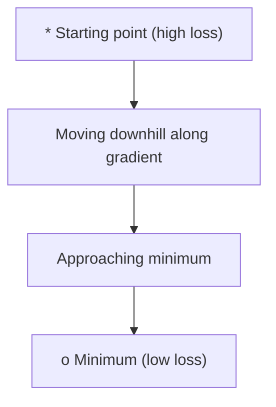
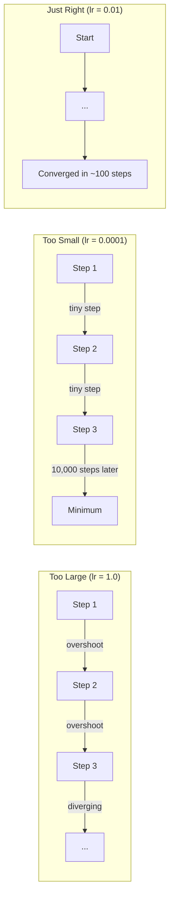
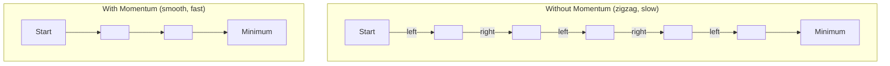
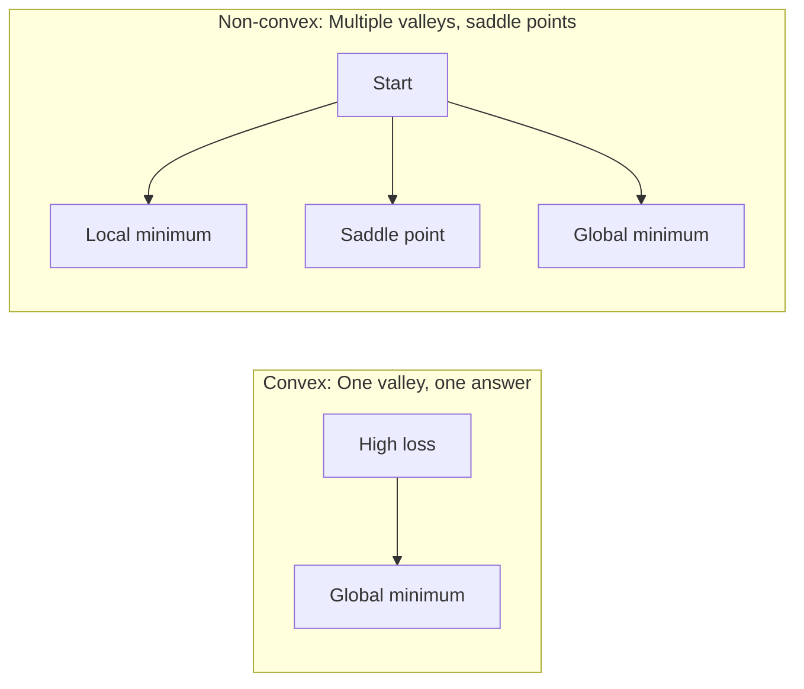
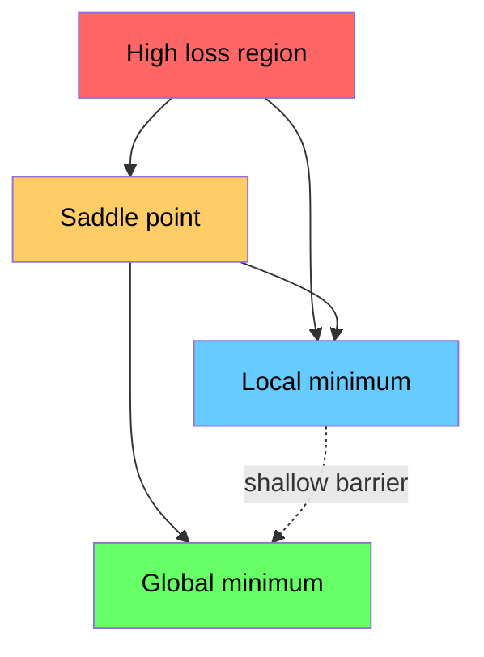

# التحسين

> تدريب شبكة عصبية لا شيء أكثر من العثور على قاع الوادي.
> التدريب العصبي لا يتطلب سوى إيجاد نقطة أدنى في الوادي

**Type:** Build | **类型:** 动手
**Language:**" بايثون "**语言:**بايثون
**Prerequisites:** Phase 1, Lessons 04-05 (Derivatives, Gradients) | **前置知识:** Phase 1, Lessons 04-05 (Derivatives, Gradients)
**Time:** ~75 minutes | **时间:** ~75 分钟

## أهداف التعلم

- تنفيذ انخفاض نطاق الفانيليا، SGD مع الزخم، وأدم من الصفر
  من صفر تحقيق التدابير الأصلية انخفاض 带动量的 SGD 和 آدم 优化器
- مقارنة التقارب المثالي على وظيفة روزينبروك وشرح لماذا آدم يتكيف مع معدلات التعلم لكل وزن
  في وظيفة روزنبروك مقارنة تحسينات الكفاءة، شرح لماذا آدم للجميع الوزن تعديل التعلم
- تمييز المناظر الطبيعية المتعقبة عن المناظر الطبيعية غير المتعقبة للخسائر وتوضيح دور نقاط القمر في الأبعاد العالية
  区分凸与非凸损曲面,解释高维空间中点的作用
- إعداد جدولات معدل التعلم (تدهور الخطوات، تغيير الجهاز، التدفئة) لتحقيق استقرار التدريب
  配置学习率调度(步衰减、余弦退火、预热) لضمان استقرار التدريب

> **【中文解读】**
> 訓練神經网络就是"بحث عن أدنى نقطة في وادي山"── وظيفة الخسارة تخبرك بوجود الكثير من الأخطاء في الوقت الحالي، تدرجة تخبرك بأي اتجاه يمكن أن يجعل الخسائر أصغر، المحفزات تحدد كيف تسير.

> **【拓展：优化器在 AI 中的位置】**
> - **SGD**: أساسي تحسينات، جميع تحسينات "أبوة"
> - **Adam**: أشهر تحسينات حاليا، معدل التعلم الذاتي + 动量، أصبح تقريباً اختيارًا متضمنًا.
> - **学习率调度**: التدريب الأول مع التدريب الكبير والسرع القريب من الأفضل، والآخر مع التدريب الصغير والتحديد.

## المشكلة المشكلة المشكلة

لديك وظيفة الخسارة، إنها تخبرك كم هو النموذج الخطأ لديك تراجعات، إنها تخبرك بأي اتجاه يزيد الخسارة سوءاً، الآن تحتاج إلى استراتيجية للمشي أسفل التل.

> لديك وظيفة خسارة، فإنها تخبرك أن النموذج مختلف جدا. لديك تراجعة، فإنها تخبرك في أي اتجاه يجعل الخسارة أكبر.

النهج البديل بسيط: تحرك على خلاف التراجع. قم بتقييم الخطوة بأعداد تسمى معدل التعلم أكرر هذا هو انخفاض التسلسل، ويعمل. لكن "الأعمال" لديها تحذيرات معدل التعلم كبير جداً و أنت تتجاوز الوادي بالكامل، تقفز بين الجدران. صغير جداً و تتجول نحو الإجابة عبر آلاف الخطوات غير الضرورية اضرب نقطة السرير وتوقف عن التحرك حتى لو لم تجد الحد الأدنى

> الطريقة البسيطة بسيطة جدا: على طول التسلسل إلى الاتجاه المعاكس تحرك، والمرحلة طويلة من خلال معدل التعلم يسيطر علىها.

كل محسن في التعلم العميق هو إجابة على نفس السؤال: كيف تصل إلى قاع الوادي بشكل أسرع وأكثر موثوقية؟

> كل محفز في التعلم العميق يجيب على نفس السؤال: كيف يمكن أن تصل إلى القاع بشكل أسرع أو أكثر موثوقية؟

> **【中文解读】**أنت لديك خسارة وظيفة ((( أخبرك أن هناك الكثير من الخطأ) ودرجة ((( أخبرك في أي اتجاه يمكن أن يجعل الفشل أصغر)  الآن تحتاج إلى استراتيجية "الذهاب إلى أدنى نقطة في وادي"‬‬‬‬‬‬‬‬‬‬‬‬‬‬‬‬‬‬‬‬‬‬‬‬‬‬‬‬‬‬‬‬‬‬‬‬‬‬‬‬‬‬‬‬‬‬‬‬‬‬‬‬‬‬‬‬‬‬‬‬‬‬‬‬‬‬‬‬‬‬‬‬‬‬‬‬‬‬‬‬‬‬‬‬‬‬‬‬‬‬‬‬‬‬‬‬‬‬‬‬‬‬‬‬‬‬‬‬‬‬‬‬‬‬‬‬‬‬‬‬‬‬‬‬‬‬‬‬‬‬‬‬‬‬‬‬‬‬‬‬‬‬‬‬‬‬‬‬‬‬‬‬‬‬‬‬‬‬‬‬‬‬‬‬‬‬‬‬‬‬‬‬‬‬‬‬‬‬‬‬‬‬‬‬‬‬‬‬‬‬‬‬‬‬‬‬‬‬‬‬‬‬‬‬‬‬‬‬‬‬‬‬‬‬‬‬‬‬‬‬‬‬‬‬‬‬‬‬‬‬‬‬‬‬‬‬‬‬‬‬‬‬‬‬‬‬‬‬‬‬‬‬‬‬‬‬‬‬‬‬‬‬‬‬‬‬‬‬‬‬‬‬‬‬‬‬‬‬‬‬‬‬‬‬‬‬‬‬‬‬‬‬‬‬‬‬‬‬‬‬‬‬‬‬‬‬‬‬‬‬‬‬‬‬‬‬‬‬‬‬‬‬‬‬‬‬‬‬‬‬‬‬‬‬‬‬‬‬‬‬‬‬‬‬‬‬‬‬‬‬‬‬‬‬‬‬‬‬‬‬‬‬‬‬‬‬‬‬‬‬‬‬‬‬‬‬‬‬‬‬‬‬‬‬‬‬‬‬‬‬‬‬‬‬‬‬‬‬‬‬‬‬‬‬‬‬‬‬‬‬‬‬‬‬‬‬‬‬‬‬‬‬‬‬‬‬‬‬‬‬‬‬‬‬‬‬‬‬‬‬‬‬‬‬‬‬‬‬‬‬‬‬‬

## المفهوم الأساسي

### ما هو التكيف معناه

التكامل هو العثور على قيم المدخلات التي تقلل (أو تزيد) من وظيفة. في التعلم الآلي، فإن الوظيفة هي الخسارة. المدخلات هي وزن النموذج. التدريب هو التكامل.

> 优化就是找到使函数最小化 (或最大化) 的输入值──在机器学习中,函数是损失函数,输入是模型权重──训练就是优化──

```
minimize L(w) where:
  L = loss function
  w = model weights (could be millions of parameters)
```

> **【拓展：优化是机器学习的引擎】**عملية التدريب هي: باستخدام وظيفة خسارة 1.8 مليار عنصر، من خلال آدم 优化器代调整参数، حتى التنبؤ تزداد دقة.`w = w - lr * gradient`.

### التراجع التدريجي (فانيلا) 梯度下降(صورة أولى)

أسهل محفزات. حساب تراجع الخسارة فيما يتعلق بكل وزن. تحريك كل وزن في الاتجاه المعاكس لتراجعها. مقياس الخطوة من خلال معدل التعلم.

> أسهل أدوات تحسينات: الحسابات: فقدان لكل وزن على درجة، تحرك في الاتجاه المعاكس، تدريجية من خلال تحكم معدل التعلم.

```
w = w - lr * gradient
```

هذا هو الخوارزمية بأكملها خط واحد

> هذا هو الخوارزمية الكاملة

> **【中文解读】**梯度下降: حساب الخسارة لكل درجة من الوزن، على طول الاتجاه المعاكس للخطوة، خطوة طويلة من خلال معدل التعلم التحكم.`w = w - lr * gradient`، خطوة كاملة في طريقها.



### معدل التعلم: أهم المعيار المضاد

معدل التعلم يحدد حجم الخطوة ويقرر كل شيء حول التقارب

> تعلم السيطرة على المعدل، قرر الحصول على كل شيء.



لا توجد صيغة لمعدل التعلم الصحيح. يمكنك العثور عليه من خلال التجربة. نقاط البداية المشتركة: 0.001 لـ آدم، 0.01 لـ SGD مع الزخم.

> 没有公式能告诉你正确的学习率──你只能通过实验找到──常见起点:

> **【拓展：学习率选择的实践指南】**تعدد تعدد التعلم هو أسوأ معايير التعلم. قانون التجربة: من 0.001 开始((القدر المُحدد لـ آدم) ، مشاهدة التدريب على التدريب على التدريب على التدريب على التدريب على التدريب على التدريب على التدريب على التدريب على التدريب على التدريب على التدريب على التدريب على التدريب على التدريب على التدريب على التدريب على التدريب على التدريب على التدريب على التدريب على التدريب على التدريب على التدريب على التدريب على التدريب على التدريب على التدريب على التدريب على التدريب على التدريب على التدريب على التدريب على التدريب على التدريب على التدريب على التدريب على التدريب على التدريب على التدريب على التدريب على التدريب على التدريب على التدريب على التدريب على التدريب على التدريب على التدريب على التدريب على التدريب على التدريب على التدريب على التدريب على التدريب على التدريب على التدريب على التدريب على التدريب على التدريب على التدريب على التدريب على التدريب على التدريب على التدريب على التدريب على التدريب على التدريب على التدريب على التدريب على التدريب على التدريب على التدريب على التدريب على التدريب على التدريب على التدريب على التدريب على التدريب على التدريب على التدريب على التدريب على التدريب على التدريب على التدريب على التدريب على التدريب على التدريب على التدريب على التدريب على التدريب على التدريب على التدريب على التدريب على التدريب على التدريب على التدريب على التدريب على التدريب على التدريب على التدريب على التدريب على التدريب على التدريب على التدريب على التدريب على التدريب على التدريب على التدريب على التدبية على التدريب على التدب على التدب على التدب على التدب على التدب على التدب على التدب

### المجموعة المشتركة مقابل المجموعة الصغيرة

يحتسب تراجع تراجع فانيلا تراجع على مجموعة البيانات بأكملها قبل اتخاذ خطوة واحدة. هذا يسمى تراجع تراجع دفعة. إنه مستقيم ولكن بطيء.

> تدخل التسلسل الأولية قبل الخطوة التالية باستخدام جميع بيانات تدخل الحسابات.

تحسب التراجع المتحرك (SGD) التراجع على عينة عشوائية واحدة وتخطى على الفور. إنه ضجيج ولكن سريع.

> 随机梯度下降 (SGD) في نموذج واحد随机 على حساب التعدد بعد تحديث فورها.

إنخفاض تراجع المرافق في الحزمة الصغيرة يفرق الفرق. احسب التراجع على حزمة صغيرة (32, 64, 128, 256 عينات) ، ثم خطوة. هذا ما يستخدمه الجميع في الواقع.

> الحسابات على التعدد بعد تحديثها. هذا هو في الواقع الطريقة الأكثر شيوعاً.

| Variant | Batch size | Gradient quality | Speed per step | Noise |
|---------|-----------|-----------------|---------------|-------|
| Batch GD / 全批量 | Entire dataset | Exact / 精确 | Slow / 慢 | None / 无 |
| SGD / 随机 | 1 sample | Very noisy / 噪声大 | Fast / 快 | High / 高 |
| Mini-batch / 小批量 | 32-256 | Good estimate / 好的估计 | Balanced / 均衡 | Moderate / 中等 |

الضجيج في المجموعة الصغيرة و المجموعة ليست حشرة.

> لا يوجد ضجيج في الجملة SGD و 小، فهو يساعد على الهروب من الحد الأدنى من القيمة المحلية في الطبقة المنخفضة و点.

> **【中文解读】**ثلاثى درجات طريقة الحساب: ((1) مجموع الجملة باستخدام كل البيانات حساب واحد درجة،准但慢;(2) 随机 SGD باستخدام 条数据计算梯度,快但噪声大;(3) 微批量折中方案, باستخدام 32/64/256 条数据── واقعية AI 训练中几乎都用小批量,批量大小是另一个关键超参数──

### الزخم: الكرة تتدفق أسفل التلال

ينظر نزول تراجع نسبة الفانيلا فقط إلى تراجع الحالي. إذا كان تراجع الزيغزاج (شائع في الوادي الضيقة) ، فإن التقدم بطيء. يصلح الزخم هذا عن طريق تراكم تراجع الماضي في معنى السرعة.

> إن كان التسلسلات قد ظهرت بشكل متواضع في الوادي الضيق، فإن التقدم بطيء.

```
v = beta * v + gradient
w = w - lr * v
```

التشابه: كرة تتدحرج أسفل التلال. لا تتوقف وتبدأ مرة أخرى في كل ضربة. إنها تبني السرعة في اتجاهات متسقة وتخفف التذبذب.

> 类比: الكرة من المنحدر تتدحرج. لا تتوقف في كل مكان.



`beta`(عادة 0.9) يسيطر على كمية التاريخ التي يجب حفظها. بيتا أعلى يعني المزيد من الزخم، مسارات أكثر سلاسة، ولكن استجابة أبطأ لتغيرات الاتجاه.

> `beta`(عادة 0.9) التحكم في الحفاظ على الكثير من التاريخ. بيتا أعلى يعني المزيد من الحركة.

> **【拓展：动量在深度学习中的效果】**动量法让优化"记住" قبل الاتجاه، مثل كرة رول أسفل جبال坡 مثل积累动能──好处:(1) 加速通过平坦区域;(2) 抑制震荡(在狭谷中来回弹问题)。PyTorch 中`torch.optim.SGD(lr=0.1, momentum=0.9)`يمينوم = 0.9 هي تكوين دائم

### آدم: معدلات التعلم التكيفية آدم: معدلات التعلم التكيفية

الوزن المختلف يحتاج إلى معدلات مختلفة للتعلم. الوزن الذي نادرا ما يحصل على تراجعات كبيرة يجب أن يتخذ خطوات أكبر عندما يفعل أخيرا. الوزن الذي يحصل على تراجعات ضخمة باستمرار يجب أن يتخذ خطوات أصغر.

> الوزن المختلف يحتاج إلى معدلات مختلفة للتعلم.

آدم (تقدير اللحظة التكيفية) يتتبع شيئين لكل وزن:
  آدم ((تقديرات التكيف الذاتي) لكل حق

1. اللحظة الأولى (م): المتوسط الجاري للمحافظات (مثل الزخم)
   一阶矩 (m): 梯度的移动平均(类似动量)
2. اللحظة الثانية (v): المتوسط الجاري للمراحل المربعة (حجم المراحل)
   ثانوية (v): درجة مربعة من متوسط الحركة

```
m = beta1 * m + (1 - beta1) * gradient
v = beta2 * v + (1 - beta2) * gradient^2

m_hat = m / (1 - beta1^t)    bias correction
v_hat = v / (1 - beta2^t)    bias correction

w = w - lr * m_hat / (sqrt(v_hat) + epsilon)
```

التقسيم من قبل`sqrt(v_hat)`والوزن ذو تراجعات كبيرة يتم تقسيمه بأعداد كبيرة (خطوة فعالة صغيرة). والوزن ذو تراجعات صغيرة يتم تقسيمه بأعداد صغيرة (خطوة فعالة كبيرة). كل وزن يحصل على معدل تعلمه التكيفي الخاص به.

> إضافة إلى`sqrt(v_hat)`هو المفتاح في رؤية. كل شخص يحصل على معدل التعلم نفسه.

المعلمات المضادة المتبنية: `lr=0.001, beta1=0.9, beta2=0.999, epsilon=1e-8`هذه الإعدادات القابلة للتشغيل تعمل بشكل جيد معظم المشاكل

> 默认超参数:`lr=0.001, beta1=0.9, beta2=0.999, epsilon=1e-8` هذه القيم المفروضة على معظم المشاكل فعالة

> **【中文解读】**آدم = الزخم + معدل التعلم الذاتي. يُستخدم للكلّة العناصر للحفاظ على "السرعة" المستقلة، وفقاً للتسجيل التاريخي، تُعدّل الذاتية التسجيل.`torch.optim.Adam(lr=0.001)`تقريباً هو اختيار متوقع

### جدول أعمال معدل التعلم

معدل التعلم الثابت هو تنازل. في بداية التدريب، تريد خطوات كبيرة لتقدم سريعًا. في وقت متأخر من التدريب، تريد خطوات صغيرة لتحسين الحد الأدنى.

> معدل التعلم الثابت هو المخطط المُعدل.‬‬‬‬‬‬‬‬‬‬‬‬‬‬‬‬‬‬‬‬‬‬‬‬‬‬‬‬‬‬‬‬‬‬‬‬‬‬‬‬‬‬‬‬‬‬‬‬‬‬‬‬‬‬‬‬‬‬‬‬‬‬‬‬‬‬‬‬‬‬‬‬‬‬‬‬‬‬‬‬‬‬‬‬‬‬‬‬‬‬‬‬‬‬‬‬‬‬‬‬‬‬‬‬‬‬‬‬‬‬‬‬‬‬‬‬‬‬‬‬‬‬‬‬‬‬‬‬‬‬‬‬‬‬‬‬‬‬‬‬‬‬‬‬‬‬‬‬‬‬‬‬‬‬‬‬‬‬‬‬‬‬‬‬‬‬‬‬‬‬‬‬‬‬‬‬‬‬‬‬‬‬‬‬‬‬‬‬‬‬‬‬‬‬‬‬‬‬‬‬‬‬‬‬‬‬‬‬‬‬‬‬‬‬‬‬‬‬‬‬‬‬‬‬‬‬‬‬‬‬‬‬‬‬‬‬‬‬‬‬‬‬‬‬‬‬‬‬‬‬‬‬‬‬‬‬‬‬‬‬‬‬‬‬‬‬‬‬‬‬‬‬‬‬‬‬‬‬‬‬‬‬‬‬‬‬‬‬‬‬‬‬‬‬‬‬‬‬‬‬‬‬‬‬‬‬‬‬‬‬‬‬‬‬‬‬‬‬‬‬‬‬‬‬‬‬‬‬‬‬‬‬‬‬‬‬‬‬‬‬‬‬‬‬‬‬‬‬‬‬‬‬‬‬‬‬‬‬‬‬‬‬‬‬‬‬‬‬‬‬‬‬‬‬‬‬‬‬‬‬‬‬‬‬‬‬‬‬‬‬‬‬‬‬‬‬‬‬‬‬‬‬‬‬‬‬‬‬‬‬‬‬‬‬‬‬‬‬‬‬‬‬‬‬‬‬‬‬‬‬‬‬‬‬‬‬‬‬‬‬‬‬‬‬‬‬‬‬‬‬‬‬‬‬‬‬‬‬‬‬‬‬‬‬‬‬‬‬‬‬‬‬‬‬‬‬‬‬‬‬‬‬‬‬‬‬‬‬‬‬‬‬

الجدول المشترك:
  常见调度方式:

| Schedule / 调度方式 | Formula / 公式 | Use case / 使用场景 |
|----------|---------|----------|
| Step decay / 步衰减 | lr = lr * factor every N epochs | Simple, manual control / 简单手动控制 |
| Exponential decay / 指数衰减 | lr = lr_0 * decay^t | Smooth reduction / 平滑递减 |
| Cosine annealing / 余弦退火 | lr = lr_min + 0.5 * (lr_max - lr_min) * (1 + cos(pi * t / T)) | Transformers, modern training / Transformer、现代训练 |
| Warmup + decay / 预热+衰减 | Linear ramp up, then decay | Large models, prevents early instability / 大模型，防止早期不稳定 |

### المتحركة ضد غير المتحركة

وظيفة متواصلة لديها الحد الأدنى. التراجع التدريجي دائما يجد ذلك.`f(x) = x^2`هو مخروط.

> 凸函数 فقط واحد الحد الأدنى من القيمة،梯度下降总能找到──像 `f(x) = x^2`مثل هذه المادية الثانية هي كومبية.

وظائف فقدان الشبكة العصبية غير متواصلة. لديها العديد من الحد الأدنى المحليين ، نقاط القيادة ، والمناطق السطحية.

> وظيفة فقدان شبكة العصبية غير واضحة، هناك العديد من القيم الحد الأدنى في المنطقة.



في الممارسة العملية، فإن الحد الأدنى المحلي في الشبكات العصبية العالية الابعاد نادرا ما تكون مشكلة. معظم الحد الأدنى المحلي لديه قيم الخسارة القريبة من الحد الأدنى العالمي. نقاط السادل (مستقلة في بعض الاتجاهات، منحنية في غيرها) هي العقبة الحقيقية. الدفع والضوضاء من المجموعات الصغيرة تساعد على تفاديهم.

> في الممارسة العملية، الحد الأدنى من القيمة المحلية في شبكة العصبية العالية هو مشكلة قليلة.

> **【拓展：神经网络的损失曲面为什么是非凸的】**線性回归的损失函数是凸的(只有最低点,一定能找到),但神经网络的损失曲面有无数局部最低点和点. في 100،000维参数空间,点(بعض الأبعاد ترتفع某些维度下降的点) 更多比局部最低点.

### فقدان التصوير المشهري

الخسارة هي وظيفة لجميع الوزن. بالنسبة لنموذج مع مليون وزن، فإن المشهد الخسارة يعيش في الفضاء 1000،001 بعد. نحن نتصور ذلك عن طريق اختيار اتجاهين عشوائية في الفضاء الوزن وتخطيط الخسارة على طول تلك الاتجاهات، مما ينتج سطح 2D.

> الخسارة هي وظيفة الوزن المملوكة. بالنسبة لموديل 100 مليون وزن، فإن خسارة المزج موجودة في 1,000،001 维空间.



يُعظم الحد الأدنى الحاد بشكل سيء. يُعظم الحد الأدنى السطح بشكل جيد. هذا أحد الأسباب التي تسبب فيها أن SGD مع الزخم غالباً ما يتفوق على Adam على دقة الاختبار النهائي: ضجيجها يمنع الاستقرار في الحد الأدنى الحاد.

>                                                                                                                                                                                                                                                               
```figure
gradient-descent
```

## بناءها

## بناء ذلك تحرك لتحقيق

### الخطوة 1: حدد وظيفة اختبار

وظيفة روزنبروك هي مقياس تحسين كلاسيكي. يقع الحد الأدنى عند (1, 1) داخل وادي منحني ضيق يسهل العثور عليه ولكن من الصعب اتباعه.

> وظيفة روزنبروك هي أساس التحسين الكلاسيكي. تقع أدنى قيمتها في (1, 1) ، وهي في وادي صعب التبع.

```
f(x, y) = (1 - x)^2 + 100 * (y - x^2)^2
```

```python
def rosenbrock(params):
    x, y = params
    return (1 - x) ** 2 + 100 * (y - x ** 2) ** 2

def rosenbrock_gradient(params):
    x, y = params
    df_dx = -2 * (1 - x) + 200 * (y - x ** 2) * (-2 * x)
    df_dy = 200 * (y - x ** 2)
    return [df_dx, df_dy]
```

### الخطوة الثانية: انخفاض درجة الفانيليا

```python
class GradientDescent:
    def __init__(self, lr=0.001):
        self.lr = lr

    def step(self, params, grads):
        return [p - self.lr * g for p, g in zip(params, grads)]
```

### الخطوة الثالثة: الجدول المتحرك مع الزخم

```python
class SGDMomentum:
    def __init__(self, lr=0.001, momentum=0.9):
        self.lr = lr
        self.momentum = momentum
        self.velocity = None

    def step(self, params, grads):
        if self.velocity is None:
            self.velocity = [0.0] * len(params)
        self.velocity = [
            self.momentum * v + g
            for v, g in zip(self.velocity, grads)
        ]
        return [p - self.lr * v for p, v in zip(params, self.velocity)]
```

### الخطوة الرابعة: آدم

```python
class Adam:
    def __init__(self, lr=0.001, beta1=0.9, beta2=0.999, epsilon=1e-8):
        self.lr = lr
        self.beta1 = beta1
        self.beta2 = beta2
        self.epsilon = epsilon
        self.m = None
        self.v = None
        self.t = 0

    def step(self, params, grads):
        if self.m is None:
            self.m = [0.0] * len(params)
            self.v = [0.0] * len(params)

        self.t += 1

        self.m = [
            self.beta1 * m + (1 - self.beta1) * g
            for m, g in zip(self.m, grads)
        ]
        self.v = [
            self.beta2 * v + (1 - self.beta2) * g ** 2
            for v, g in zip(self.v, grads)
        ]

        m_hat = [m / (1 - self.beta1 ** self.t) for m in self.m]
        v_hat = [v / (1 - self.beta2 ** self.t) for v in self.v]

        return [
            p - self.lr * mh / (vh ** 0.5 + self.epsilon)
            for p, mh, vh in zip(params, m_hat, v_hat)
        ]
```

### الخطوة 5: تشغيل وتقارن

```python
def optimize(optimizer, func, grad_func, start, steps=5000):
    params = list(start)
    history = [params[:]]
    for _ in range(steps):
        grads = grad_func(params)
        params = optimizer.step(params, grads)
        history.append(params[:])
    return history

start = [-1.0, 1.0]

gd_history = optimize(GradientDescent(lr=0.0005), rosenbrock, rosenbrock_gradient, start)
sgd_history = optimize(SGDMomentum(lr=0.0001, momentum=0.9), rosenbrock, rosenbrock_gradient, start)
adam_history = optimize(Adam(lr=0.01), rosenbrock, rosenbrock_gradient, start)

for name, history in [("GD", gd_history), ("SGD+M", sgd_history), ("Adam", adam_history)]:
    final = history[-1]
    loss = rosenbrock(final)
    print(f"{name:6s} -> x={final[0]:.6f}, y={final[1]:.6f}, loss={loss:.8f}")
```

الناتج المتوقع: آدم يتقارب أسرع. SGD مع الزخم يتبع مسارًا أكثر سلاسة. GD الفانيليا تقدم ببطء على طول الوادي الضيق.

> 预期输出:أدم 收最快,SGD مع الزخم 路径更平滑,原始 GD 在狭谷中进展缓慢──

## استخدمها في إطار التنفيذ

في الممارسة العملية، استخدموا محفزات PyTorch أو JAX. أنها تتعامل مع مجموعات المعلمات، وتدهور الوزن، وتقطيع التراجع، وتسارع GPU.

> في الممارسة العملية، استخدام PyTorch أو JAX المعدلات التحسينات.

> **【中文解读】**معايير استخدام PyTorch 中优化器:`optimizer = torch.optim.Adam(model.parameters(), lr=0.001)`ثم في دورة التدريب`optimizer.zero_grad()``loss.backward()``optimizer.step()` هذا الترميز هو الحلقة الأساسية للتدريب على التعلم العميق‬

```python
import torch

model = torch.nn.Linear(784, 10)

sgd = torch.optim.SGD(model.parameters(), lr=0.01, momentum=0.9)
adam = torch.optim.Adam(model.parameters(), lr=0.001)
adamw = torch.optim.AdamW(model.parameters(), lr=0.001, weight_decay=0.01)

scheduler = torch.optim.lr_scheduler.CosineAnnealingLR(adam, T_max=100)
```

قواعد الإبهام:
  经验法则:

- تبدأ مع آدم (lr=0.001) يعمل معظم المشاكل دون ضبط.
  من آدم (lr=0.001) 开始,无需调参即可解决大多数问题──
- الانتقال إلى SGD مع الزخم (lr=0.01, الزخم=0.9) عندما تحتاج إلى أفضل دقة نهائية ويمكنك تحمل المزيد من التنسيق.
  عندما تحتاج إلى أفضل دقة نهائية وتستطيع تحمل المزيد من التغييرات، التحول إلى SGD مع الزخم.
- استخدم AdamW (أدم مع تفكيك الوزن منفصل) للمتحولات.
  المتحول 模型 استخدام آدم (أدم)
- استخدموا دائما جدول معدل التعلم لتربية تستمر لأكثر من عدة فترات.
  التدريب على مدى عدة حقول 时始终使用学习率调度。
- إذا كان التدريب غير مستقرا، خفض معدل التعلم. إذا كان التدريب بطيء جدا، زيادة.
  التدريب غير المستقر عند انخفاض معدل التعلم ، التدريب بطيء جدا عند زيادة معدل التعلم الجامعي.

## أرسلها .

هذه الدروس تنتج طلباً لانتخاب المُحسن. انظر `outputs/prompt-optimizer-guide.md`. . .

> هذا الدروسات المنتجة عن اختيار مناسبة تحسينات`outputs/prompt-optimizer-guide.md`.

فصول المحسنة التي بنيت هنا تظهر مرة أخرى في المرحلة 3 عندما نعمل على شبكة عصبية من الصفر.

> ستظهر نوع المحفزات المُبنية هنا مرة أخرى في المرحلة 3 من شبكة التدريب العصبي الصفر.

## تمارين التدريب

1. **Learning rate sweep.**قم بتشغيل انخفاض تراجع نسبة الفانيلا على وظيفة روزنبروك مع معدلات التعلم [0.0001, 0.0005, 0.001, 0.005, 0.01]. رسم أو طباعة الخسارة النهائية بعد 5000 خطوة لكل منها. احصل على أكبر معدل التعلم الذي لا يزال يتقارب.
   **学习率扫描。**معدل التعلم المختلف [0.0001, 0.0005, 0.001, 0.005, 0.01] على وظيفة روزنبروك 运行原始梯度下降──打印每学习率 5000 步后的最终损失──找到仍能收的最大学习率──

2. **Momentum comparison.**قم بتشغيل SGD مع قيم الزخم [0.0، 0.5، 0.9، 0.99] على وظيفة روزنبروك. تتبع الخسارة في كل خطوة. أي قيمة الزخم تتقارب أسرع؟ أي تخطي؟
   **动量比较。**باستخدام قيمة مختلفة [0.0, 0.5, 0.9, 0.99] في عمل روزنبروك  على SGD ‬ ‬ ‬ ‬ ‬ ‬ ‬ ‬ ‬ ‬ ‬ ‬ ‬ ‬ ‬ ‬ ‬ ‬ ‬ ‬ ‬ ‬ ‬ ‬ ‬ ‬ ‬ ‬ ‬ ‬ ‬ ‬ ‬ ‬ ‬ ‬ ‬ ‬ ‬ ‬ ‬ ‬ ‬ ‬ ‬ ‬ ‬ ‬ ‬ ‬ ‬ ‬ ‬ ‬ ‬ ‬ ‬ ‬ ‬ ‬ ‬ ‬ ‬ ‬ ‬ ‬ ‬ ‬ ‬ ‬ ‬ ‬ ‬ ‬ ‬ ‬ ‬ ‬ ‬ ‬ ‬ ‬ ‬ ‬ ‬ ‬ ‬ ‬ ‬ ‬ ‬ ‬ ‬ ‬ ‬ ‬ ‬ ‬ ‬ ‬ ‬ ‬ ‬ ‬ ‬ ‬ ‬ ‬ ‬ ‬ ‬ ‬ ‬ ‬ ‬ ‬ ‬ ‬ ‬ ‬ ‬ ‬ ‬ ‬ ‬ ‬ ‬ ‬ ‬ ‬ ‬ ‬ ‬ ‬ ‬ ‬ ‬ ‬ ‬ ‬ ‬ ‬ ‬ ‬ ‬ ‬ ‬ ‬ ‬ ‬ ‬ ‬ ‬ ‬ ‬ ‬ ‬ ‬ ‬ ‬ ‬ ‬ ‬ ‬ ‬ ‬ ‬ ‬ ‬ ‬ ‬ ‬ ‬ ‬ ‬ ‬ ‬ ‬ ‬ ‬ ‬ ‬ ‬ ‬ ‬ ‬ ‬ ‬ ‬ ‬ ‬ ‬ ‬ ‬ ‬ ‬ ‬ ‬ ‬ ‬ ‬ ‬ ‬ ‬ ‬ ‬ ‬ ‬ ‬ ‬ ‬ ‬ ‬ ‬ ‬ ‬ ‬ ‬ ‬ ‬ ‬ ‬ ‬ ‬ ‬ ‬ ‬ ‬ ‬ ‬ ‬ ‬ ‬ ‬ ‬ ‬ ‬ ‬ ‬ ‬ ‬ ‬

3. **Saddle point escape.**تحديد الوظيفة `f(x, y) = x^2 - y^2`(نقطة السرير في الأصل). تبدأ من (0.01, 0.01). مقارن كيف يتصرف الفانيليا GD، SGD مع الزخم، و آدم. أي يفر من نقطة السرير؟
   **鞍点逃逸。**定义函数 `f(x, y) = x^2 - y^2`(أصل النقاط هناك نقاط) ―― من (0.01, 0.01) 开始── مقارنة GD、SGD الأصل مع الزخم 和 آدم's behavior── أي يمكن أن يفرّ من  نقاط؟

4. **Implement learning rate decay.**إضافة جدول للتحلل المتعرض للفئة GradientDescent: `lr = lr_0 * 0.999^step`مقارنة التقارب مع ودون التدهور على وظيفة روزنبروك.
   **实现学习率衰减。**في درجة التراجع 类中添加指数衰减调度:`lr = lr_0 * 0.999^step` تقارنة حالة الإستحواذ على وظيفة روزنبروك 

## شروط الرئيسية

| Term / 术语 | What people say | What it actually means / 实际含义 |
|------|----------------|----------------------|
| Gradient descent / 梯度下降 | "Go downhill" | Update weights by subtracting the gradient scaled by the learning rate. The most basic optimizer. / 用学习率缩放梯度后从权重中减去，更新权重。最基础的优化器。 |
| Learning rate / 学习率 | "Step size" | A scalar that controls how far each update moves the weights. Too large causes divergence. Too small wastes compute. / 控制每次更新移动多远的标量。太大导致发散，太小浪费算力。 |
| Momentum / 动量 | "Keep rolling" | Accumulate past gradients into a velocity vector. Dampens oscillations and accelerates movement through consistent directions. / 将历史梯度累积到速度向量中。抑制震荡，在一致方向上加速。 |
| SGD / 随机梯度下降 | "Random sampling" | Stochastic gradient descent. Compute gradient on a random subset instead of the full dataset. Almost always means mini-batch SGD in practice. / 随机梯度下降。在随机子集上计算梯度。实践中几乎都指小批量 SGD。 |
| Mini-batch / 小批量 | "A chunk of data" | A small subset of training data (32-256 samples) used to estimate the gradient. Balances speed and gradient accuracy. / 训练数据的小子集（32-256 个样本），用于估计梯度。平衡速度和梯度精度。 |
| Adam / Adam 优化器 | "The default optimizer" | Adaptive Moment Estimation. Tracks per-weight running averages of gradients and squared gradients to give each weight its own learning rate. / 自适应矩估计。跟踪每个权重的梯度和平方梯度的移动平均，为每个权重提供独立的学习率。 |
| Bias correction / 偏差校正 | "Fix the cold start" | Adam's first and second moments are initialized to zero. Bias correction divides by (1 - beta^t) to compensate during early steps. / Adam 的一阶和二阶矩初始化为零。偏差校正除以 (1 - beta^t) 来补偿早期步骤。 |
| Learning rate schedule / 学习率调度 | "Change lr over time" | A function that adjusts the learning rate during training. Large steps early, small steps late. / 训练过程中调整学习率的函数。早期大步，后期小步。 |
| Convex function / 凸函数 | "One valley" | A function where any local minimum is the global minimum. Gradient descent always finds it. Neural network losses are not convex. / 任何局部最小值都是全局最小值的函数。梯度下降总能找到。神经网络损失不是凸的。 |
| Saddle point / 鞍点 | "Flat but not a minimum" | A point where the gradient is zero but it is a minimum in some directions and a maximum in others. Common in high dimensions. / 梯度为零但在某些方向是最小值、某些方向是最大值的点。在高维中常见。 |
| Loss landscape / 损失曲面 | "The terrain" | The loss function plotted over weight space. Visualized by slicing along two random directions. / 在权重空间上绘制的损失函数。通过沿两个随机方向切片来可视化。 |
| Convergence / 收敛 | "Getting there" | The optimizer has reached a point where further steps do not meaningfully reduce the loss. / 优化器已到达一个点，进一步步进不会显著降低损失。 |

## المزيد من القراءة

- [Sebastian Ruder: An overview of gradient descent optimization algorithms](https://ruder.io/optimizing-gradient-descent/)- مسح شامل لجميع المحفسين الرئيسيين
  梯度下降优化算法综述,全面覆盖所有主要优化器
- [Why Momentum Really Works (Distill)](https://distill.pub/2017/momentum/)- التصور التفاعلي لديناميكيات الزخم
  لماذا يتفاعل الحد الأساسي، وتتفاعل الحد الأساسي
- [Adam: A Method for Stochastic Optimization (Kingma & Ba, 2014)](https://arxiv.org/abs/1412.6980)- ورقة آدم الأصلية، قابلة للقراءة وقصيرة
  آدم 原始论文,可读且简短
- [Visualizing the Loss Landscape of Neural Nets (Li et al., 2018)](https://arxiv.org/abs/1712.09913)- الورقة التي أظهرت الحد الأدنى الحاد مقابل المستقيم
  عرض مقالات منقذة و أقل قيمة
