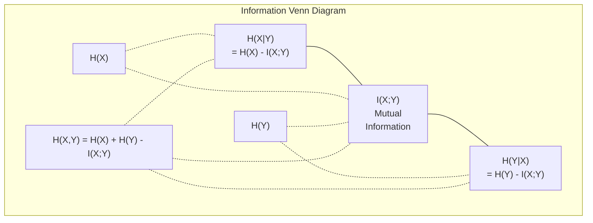

# نظرية المعلومات

> نظرية المعلومات تقيس المفاجأة وظائف الخسارة بنيت عليها
> 信息论衡惊喜程度── فقدان وظيفة بناء عليها──

**Type:** Learn | **类型:** 学习
**Language:**" بايثون "**语言:**بايثون
**Prerequisites:** Phase 1, Lesson 06 (Probability) | **前置知识:** Phase 1, Lesson 06 (Probability)
**Time:** ~60 minutes | **时间:** ~60 分钟

## أهداف التعلم

- احسب الانتروبيا، الانتروبيا المتقاطعة، والانتروبيا الكلورولوجية الانحراف من الصفر و اشرح علاقتهم
  من صفر حساب 、交叉  و KL 散度، تفسير العلاقة بينها
- استنتاج لماذا تقليل الخسارة المتقاطعة من الانتروبيا يعادل زيادة احتمالات التسجيل
  推导为什么最小化交叉损失等于最大化对数相似之价
- الحساب المعلومات المتبادلة بين الميزات والهدف لتصنيف أهمية الميزات
   الحسابية الخصائص والهدف بين المعلومات المتبادلة لتصنيف الخصائص الأهمية
- شرح التعقيد على أنه حجم المفردات الفعالة الذي يختار نموذج اللغة من بينها
  解释困惑度作为语言模型选择的有效词汇量

> **【中文解读】**
> 信息论衡量"惊喜程度"越不可能发生事件,包含信息量越大──交叉损失函数、KL 散度、困惑度(困惑度)

> **【拓展：信息论在 AI 中的位置】**
> - **交叉熵损失**: جميع قسم النماذج و نموذج اللغة`CrossEntropyLoss`(‬)
> - **KL 散度**: واحد من وظائف فقدان VAE 、علم蒸的核心、RLHF 中奖励模型的训练目标──
> - **困惑度(Perplexity)**: 语言模型的评价标准,越低越好,表示模型对下一个词的预测越确定──

## المشكلة المشكلة المشكلة

> **【中文解读】**أنت في التدريب على النموذج`CrossEntropyLoss()`في مقالات النموذج اللغوي، نرى "الغموض" في VAE、蒸、RLHF، والتي تواجه KL 散度── هذه ليست مفاهيم مستقلة هي مفاهيم مصدر معين للنظرية المعلوماتية، مجرد تغيير مختلفة القبعات── فهم نظرية المعلومات، على أن نرى خلال هذه المفاهيم الصلة الحقيقية──

## المفهوم الأساسي

> **【拓展：Shannon 与信息论的诞生】**1948 كلود شانون نشر النظرية الرياضية للاتصالات، طرحت إطارًا يستخدم فيه بث مقياس كمية المعلومات. بعد 80 عامًا، أصبح هذا الإطار حجرًا أساسيًا لذكاء الاصطناعي:交叉 هو وظيفة فقدان جميع الفئات والنموذج اللغوي ، KL 散度 هو نموذج إنتاج ((VAE、 نموذج انتشار) ، هدف تدريب المعلومات المتبادلة هو أداة اختيار الخصائص.

### محتوى المعلومات (مفاجأة) 信息量(惊喜度)

عندما يحدث شيء غير محتمل، يحمل المزيد من المعلومات رأس العملة الهبوط؟ ليس مفاجئاً. ربح في اليانصيب؟ مفاجئاً جداً.

> عندما يحدث شيء غير محتمل، فإنه يحمل المزيد من المعلومات.

محتوى المعلومات في حدث مع احتمال p هو:
  概率为 p 的事件的信息量为:

```
I(x) = -log(p(x))
```

استخدام القاعدة الثانية يمنحك البط، استخدام القاعدة الطبيعية يمنحك الناتس، نفس الفكرة، وحدات مختلفة.
  استخدام 2 لأساسية النسب تحصل على بيتات) ، استخدام الطبيعية النسب تحصل على نيسات)

```
Event              Probability    Surprise (bits)
Fair coin heads    0.5            1.0
Rolling a 6        0.167          2.58
1-in-1000 event    0.001          9.97
Certain event      1.0            0.0
```

بعض الأحداث لا تحمل معلومات مطلقة كنت تعرف أنها ستحدث
> الحوادث الحادثية تحمل معلومات لا تُعرفها

### الإنتروبي (متوسط المفاجأة)

الانتروبيا هي المفاجأة المتوقعة على جميع النتائج المحتملة للتوزيع.
> 是 توقع الدهشة من جميع النتائج المحتملة في التوزيع.

```
H(P) = -sum( p(x) * log(p(x)) )  for all x
```

العملة العادلة لديها أقصى قدر من الإنتروبيّة لمتغير ثنائيّ: 1 بت. العملة المتحيزة (99% من الرأس) لديها انتروبيّة منخفضة: 0.08 بت. أنت تعرف ما سيحدث بالفعل، لذلك كلّ إصطفاء لا يخبرك تقريباً بشيء.
> العملة العادلة مقابل الثانية تبدل لديها أقصى : 1 比特──偏置硬币(99% 正面)  很低: 0.08 比特──你已经知道会发生什么,所以每次抛货币几乎没有提供新信息──

```
Fair coin:    H = -(0.5 * log2(0.5) + 0.5 * log2(0.5)) = 1.0 bit
Biased coin:  H = -(0.99 * log2(0.99) + 0.01 * log2(0.01)) = 0.08 bits
```

إنتروبيا تقيس عدم اليقين غير القابل للتقليل في التوزيع لا يمكنك الضغط تحت ذلك
>  عدم اليقين في تقسيم التوزيعات لا يمكن تقليصه.

### التقاطع-الإنتروبي (العمل الخسارة التي تستخدمها كل يوم)

القياس المتقاطع للاندروبي يقيس متوسط المفاجأة عندما تستخدم التوزيع Q لتشفير الأحداث التي تأتي في الواقع من التوزيع P.
> 交叉 قياس استخدام التوزيع Q 编码 فعليا لتأليف نفسه P من الأحداث متوسط الدهشة.

```
H(P, Q) = -sum( p(x) * log(q(x)) )  for all x
```

P هو التوزيع الحقيقي (الملفات). Q هو التنبؤات الخاصة بنموذجك. إذا تطابق Q P بشكل مثالي، فإن الإنتروبي المتقاطع يساوي الإنتروبي. أي عدم مطابق يزيد من ذلك.
> P هو التوزيع الحقيقي، Q هو توقعات النموذج. إذا كان Q يتناسب تماما مع P، فإن交叉 يساوي── أي عدم تناغم سوف يجعلها أكبر.

في التصنيف، P هو متجه واحد حار (الفئة الحقيقية لديها احتمال 1، كل شيء آخر 0). هذا يسهل التقاطع إلى:
> في分类中,P هو واحد حار 向量(真实类概率为 1,其余为 0)

```
H(P, Q) = -log(q(true_class))
```

هذه هي الصيغة الكاملة للخسارة المتقاطعة للإنتروبيا للتصنيف.
> هذا هو الفئة كاملة التقاطع  خسارة فورمولا

### ك.ل. التباين (المرحلة بين التوزيعات)

يُقيّم اختلاف KL كم من المفاجأة الإضافية تحصل عليها من استخدام Q بدلاً من P.
> ك.ل 散度衡使用 Q 代替 P 时多出的惊喜度──

```
D_KL(P || Q) = sum( p(x) * log(p(x) / q(x)) )  for all x
             = H(P, Q) - H(P)
```

إن الانتروبيا المتقاطعة هي الانتروبيا بالإضافة إلى الانتشار KL. بما أن الانتروبيا من التوزيع الحقيقي ثابتة أثناء التدريب، فإن تقليل الانتروبيا المتقاطعة هو نفس تقليل الانتشار KL. أنت تدفع توزيع نموذجك نحو التوزيع الحقيقي.
> 交叉 =  + KL 散度──由于 التوزيع الحقيقي في عملية التدريب  هو عدد عادي، تحدّد交叉等于 تحدّد KL 散度──你在把模型分布推向真分布──

الاختلاف KL ليس متناغم: D_KL(P  Q) != D_KL(Q  P).
> KL 散度不对称:D_KL P_  Q) != DKL  Q                                                                                                                                                                                                                                                 

### معلومات متبادلة

المعلومات المتبادلة تقيس ما الذي يخبرك به معرفة متغير واحد عن الآخر.
> 互信息衡知道变量 后能告诉你关于另一个变量多少信息──

```
I(X; Y) = H(X) - H(X|Y)
        = H(X) + H(Y) - H(X, Y)
```

إذا كانت X و Y مستقلة، فإن المعلومات المتبادلة هي صفر. معرفة واحدة لا تخبرك بأي شيء عن الأخرى. إذا كانت متقاربة تمامًا، فإن المعلومات المتبادلة تساوي إطار أي من المتغيرات.
> إذا كان X و Y مستقلة، المعلومات المتبادلة هي صفر. تعرف واحد لا يمكن أن تخبرك عن أي معلومات عن الآخر. إذا كان مرتبطا تماما، المعلومات المتبادلة تساوي أي متغير.

في اختيار الميزات، تعني المعلومات المتبادلة العالية بين الميزة والهدف أن الميزة مفيدة.
> في اختيار الصفات، تعني المعلومات المرتفعة بين الصفات والهدف أن الصفات مفيدة.

### الإنتروبي المشروط

H(Y في X) يقيس كم من عدم اليقين يبقى حول Y بعد مشاهدة X.
> H  Y  X                                                                                                                                                                                                                                                            

```
H(Y|X) = H(X,Y) - H(X)
```

هناك شيئان متطرفان
  两个极端:

- إذا كان X يحدد تماما Y، ثم H(Y X) = 0. معرفة X يزيل كل عدم اليقين حول Y. المثال: X = درجة حرارة في سيلسييوس، Y = درجة حرارة في فارينهايت.
  إذا قرر X تماما Y، فإن H  Y  X) = 0──علم X  eliminated حول Y كل عدم اليقين‬‬‬‬‬‬‬‬‬‬‬‬‬‬‬‬‬‬‬‬‬‬‬‬‬‬‬‬‬‬‬‬‬‬‬‬‬‬‬‬‬‬‬‬‬‬‬‬‬‬‬‬‬‬‬‬‬‬‬‬‬‬‬‬‬‬‬‬‬‬‬‬‬‬‬‬‬‬‬‬‬‬‬‬‬‬‬‬‬‬‬‬‬‬‬‬‬‬‬‬‬‬‬‬‬‬‬‬‬‬‬‬‬‬‬‬‬‬‬‬‬‬‬‬‬‬‬‬‬‬‬‬‬‬‬‬‬‬‬‬‬‬‬‬‬‬‬‬‬‬‬‬‬‬‬‬‬‬‬‬‬‬‬‬‬‬‬‬‬‬‬‬‬‬‬‬‬‬‬‬‬‬‬‬‬‬‬‬‬‬‬‬‬‬‬‬‬‬‬‬‬‬‬‬‬‬‬‬‬‬‬‬‬‬‬‬‬‬‬‬‬‬‬‬‬‬‬‬‬‬‬‬‬‬‬‬‬‬‬‬‬‬‬‬‬‬‬‬‬‬‬‬‬‬‬‬‬‬‬‬‬‬‬‬‬‬‬‬‬‬‬‬‬‬‬‬‬‬‬‬‬‬‬‬‬‬‬‬‬‬‬‬‬‬‬‬‬‬‬‬‬‬‬‬‬‬‬‬‬‬‬‬‬‬‬‬‬‬‬‬‬‬‬‬‬‬‬‬‬‬‬‬‬‬‬‬‬‬‬‬‬‬‬‬‬‬‬‬‬‬‬‬‬‬‬‬‬‬‬‬‬‬‬‬‬‬‬‬‬‬‬‬‬‬‬‬‬‬‬‬‬‬‬‬‬‬‬‬‬‬‬‬‬‬‬‬‬‬‬‬‬‬‬‬‬‬‬‬‬‬‬‬‬‬‬‬‬‬‬‬‬‬‬‬‬‬‬‬‬‬‬‬‬‬‬‬‬‬‬‬‬‬‬‬‬‬‬‬‬‬‬‬‬‬‬‬‬‬‬‬‬‬‬‬‬‬‬‬‬‬‬‬‬‬‬‬‬‬
- إذا لم يخبرك X أي شيء عن Y، فإن H(YX من دون) = H(Y). معرفة X لا تقلل من عدم اليقين على الإطلاق.
  إذا كان X على Y  ليس هناك أي معلومات، فإن H  Y X) = H  Y)  تعرف X 完全不减少不确定性‬‬

إنتروبيا مشروطة هي دائما غير سلبية ولا تتجاوز H(Y):
> 条件始终非负且不超过 H(Y):

```
0 <= H(Y|X) <= H(Y)
```

في التعلم الآلي، تظهر الإنتروبي المشروط في أشجار القرار. في كل انقسام، يختار الخوارزمي ميزة X التي تقلل من H(Y) - وهي ميزة تبتعد عن أكثر عدم اليقين حول علامة Y.
> في التعلم الآلي، تظهر الظروف في شجرة القرارات. في كل فترة من الانقسامات، يختار الخوارزمية أن تكون H  Y في X) أصغر خصائص X = أهم خصائص يمكن إزالة العلامة Y غير المحددة.

### الإنتروبي المشترك

H ((X,Y) هي الانتروبيا من التوزيع المشترك ل X و Y معا.
> H(X,Y) هو X 和 Y 联合分布的──

```
H(X,Y) = -sum sum p(x,y) * log(p(x,y))   for all x, y
```

الخصائص الرئيسية:
  关键性质:

```
H(X,Y) <= H(X) + H(Y)
```

إن المساواة تنطبق عندما تكون X و Y مستقلين. إذا شاركوا المعلومات، فإن الانتروبيا المشتركة أقل من مجموع الانتروبيات الفردية. إنتروبيا "المفقودة" هي بالضبط المعلومات المتبادلة.
> عندما يتم تشكيل X و Y 独立时等号. إذا كانت تشارك المعلومات، فإن المشتركة تكون أقل من حدة الاختفاء.



العلاقات:
  关系式:

- H(X,Y) = H(X) + H(Y أن يكون X) = H(Y) + H(X أن يكون
- (X;Y) = H(X) - H(IX
- H(X,Y) = H(X) + H(Y) - I(X;Y)

### المعلومات المتبادلة (غوص عميق) 互信息(深入理解)

المعلومات المتبادلة I(X;Y) تعدد كمية معرفة متغير واحد تقلل من عدم اليقين حول الآخر.
> 互信息 I(X;Y) 量化知道 بعد تغير واحد على تغير آخر عدم اليقينات الكميات المقللة.

```
I(X;Y) = H(X) - H(X|Y)
       = H(Y) - H(Y|X)
       = H(X) + H(Y) - H(X,Y)
       = sum sum p(x,y) * log(p(x,y) / (p(x) * p(y)))
```

الخصائص:
  جنسية:

- I ((X;Y) >= 0 دائماً. لا تفقد المعلومات من خلال ملاحظة شيء.
  إيه إيه إيه إيه إيه إيه إيه إيه إيه إيه إيه إيه إيه إيه إيه إيه إيه إيه إيه إيه إيه إيه إيه إيه إيه إيه إيه إيه إيه إيه إيه إيه إيه إيه إيه إيه إيه إيه إيه إيه إيه إيه إيه إيه إيه إيه إيه إيه إيه إيه إيه إيه إيه إيه إيه إيه إيه إيه إيه إيه إيه إيه إيه إيه إيه إيه إيه إيه إيه إيه إيه إيه إيه إيه إيه إيه إيه إيه إيه إيه إيه إيه إيه إيه إيه إيه إيه إيه إيه إيه إيه إيه إيه إيه إيه إيه إيه إيه إيه إيه إيه إيه إيه إيه إيه إيه إيه إيه إيه إيه إيه إيه إيه إيه إيه إيه إيه إيه إيه إيه إيه إيه إيه إيه إيه إيه إيه إيه إيه إيه إيه إيه إيه إيه إيه إيه إيه إيه إيه إيه إيه إيه إيه إيه إيه إيه إيه إيه إيه إيه إيه إيه إيه إيه إيه إيه إيه إيه إيه إيه إيه إيه إيه إيه إيه إ إيه إيه إيه إيه إيه إ إ إ إ إ إ إ إ إ إ إ إيه إ إ إ إ إ إ إ إ إيه إ إ إ إ إ إيه إيه إ إ إ إ إ إ إ إ إ إ إيه إ إ إ إ إ إ إ إ إ إ إ إ إ إ إ إ إ إ إ إ إ إ إ إ إ إ إ إ إ إ إ إ إ إ إ إ إ إ إ إ إ إ إ إ إ إ إ إ إ إ إ إ إ إ إ إ إ إ إ إ إ إ إ إ إ إ إ إ إ إ إ إ إ إ إ إ إ إ إ إ إ إ إ إ إ إ إ إ إ إ إ إ إ إ إ إ إ إ إ إ إ إ إ إ إ إ إ إ إ إ إ إ إ إ إ إ إ إ إ إ إ إ إ إ إ
- I(X;Y) = 0 إذا و فقط إذا X و Y مستقلين.
  I(X;Y) = 0 当且仅当 X 和 Y 独立。
- I(X;Y) = I(Y;X) هو متماثل، على عكس الانحراف KL.
  I(X;Y) = I(Y;X)。 هو على حد سواء، مختلفة عن KL 散度。
- I  X) = H  X) المتغير يشارك كل معلوماته مع نفسه.
  I(X;X) = H(X)。变量与自我共享所有信息──

**Mutual information for feature selection.**في ML، تريد ميزات تكون موثوقة حول الهدف. المعلومات المتبادلة تعطيك طريقة مبدئية لتصنيف الميزات:
> **互信息用于特征选择。**في التعلم الآلي، تحتاج إلى صفات معينة من المعلومات على الهدف.

1. لكل ميزة X_i، احسب I(X_i؛ Y) حيث Y هو المتغير المستهدف.
   لكل خصائص X_i، حساب I(X_i؛ Y) ، من بينها Y هو الغرض المتغير.
2. صفوف الدرجة حسب درجة MI
   حسب الميزات المحددة
3. أبقوا أجزاء الـ "ك" العليا
   حافظ على الخصائص

هذا يعمل على أي علاقة بين الميزة والهدف -- خطية أو غير خطية أو متوحدة أو لا. التواصل يلتقط العلاقات الخطية فقط.
> هذا ينطبق على أي علاقة بين الصفة والهدف الlinear الlinear الغيرlinear المتوافقة أو غير المتوافقة الصلة يمكن أن تلتقط العلاقات الlinear فقط، والانترنت يمكن أن تلتقط كل شيء

| Method / 方法 | Detects / 检测 | Computational cost / 计算成本 | Handles categorical? / 处理类别型？ |
|--------|---------|-------------------|---------------------|
| Pearson correlation / 皮尔逊相关 | Linear relationships / 线性关系 | O(n) | No / 否 |
| Spearman correlation / 斯皮尔曼相关 | Monotonic relationships / 单调关系 | O(n log n) | No / 否 |
| Mutual information / 互信息 | Any statistical dependency / 任何统计依赖 | O(n log n) with binning | Yes / 是 |

### علامة التسريع والإنتروبي المتقاطع

التصنيف القياسي يستخدم أهداف صعبة: [0, 0, 1, 0]. يصبح الفئة الحقيقية احتمالية 1, كل شيء آخر يحصل على 0.
> 标准分类使用硬目标:[0, 0, 1, 0]──真实类概率为 1,其余为 0──标签平滑将其替换为软目标:

```
soft_target = (1 - epsilon) * hard_target + epsilon / num_classes
```

مع الـ (إيبسلون) = 0.1 و 4 فئات:
  عندما الـ (epsilon) = 0.1 且有 4 个类别时:

- الهدف الصعب: [0، 0، 1، 0]
- الهدف الناعم: [0.025, 0.025, 0.925, 0.025]

من منظور نظرية المعلومات، يزيد تسهيل اللقب من الانتروبيا لتوزيع الهدف. الهدف الصلب واحد حار لديه الانتروبيا 0 - لا يوجد عدم اليقين. الهدف الناعم لديه الانتروبيا الإيجابية.
> من وجهة نظر علم المعلومات، زيادة التسوية في التوزيع الهدف ──硬 one-hot 目标的为 0没有不确定性──软目标有正──

لماذا يساعد هذا:
  لماذا هذا يساعد:

- يمنع النموذج من قيادة الوصول إلى القيم المتطرفة (ستحتاج إلى علامات لا نهاية لها لتطابق الهدف الواحد في حالة التشويق المتقاطع)
  防止模型将 logits 推到极端值
- يعمل كتحديد: النموذج لا يمكن أن يكون واثقًا بنسبة 100٪
  كـأصـل: المـدـل لا يـستطيع أن يـتـأكـد بنسبة 100٪
- تحسين التصفية: الاحتمالات المتوقعة تعكس بشكل أفضل عدم اليقين الحقيقي
  تحسين المهارات: احتمالات التوقعات أفضل
- يقلل من الفجوة بين التدريب والسلوك الاستنتاجي
   تقليل الفجوة بين التدريب والإدراك

الخسارة المتقاطعة للاندروبي مع تسهيل العلامات تصبح:
> 带标签平滑的交叉损失为:

```
L = (1 - epsilon) * CE(hard_target, prediction) + epsilon * H_uniform(prediction)
```

المفهوم الثاني يعاقب التنبؤات التي هي بعيدة عن الموحدة -- التنظيم المباشر على الثقة.
> والعقوبة الثانية هي التنبؤات المتوسطة والمتوسطة للتقرير المباشر للثقة.

### لماذا التقاطع هو الخسارة التصنيفية لماذا التقاطع هو خسارة معيارية

ثلاثة وجهات نظر، نفس الاستنتاج.
> ثلاثى وجهات نظر، مع الاستنتاج

**Information theory view.**القياس المتقاطع للاندروبي يقيّم كم البيت الذي تُهدر به باستخدام توزيع النموذج بدلاً من التوزيع الحقيقي.
> **信息论视角。**交叉 قياس استخدام النموذج لتوزيع بدلا من التوزيع الحقيقي ضيعت الكثير من البيتات.

**Maximum likelihood view.**بالنسبة لنموذجات التدريب N مع فئات صحيحة y_i:
> **最大似然视角。**对于 N 个训练样本,真实类别为 y_i:

```
Likelihood     = product( q(y_i) )
Log-likelihood = sum( log(q(y_i)) )
Negative log-likelihood = -sum( log(q(y_i)) )
```

هذه الخط الأخير هو فقدان الانتروبيا المتقاطعة. تقليل الانتروبيا المتقاطعة = زيادة احتمالات بيانات التدريب تحت نموذجك.
> آخر خط هو التداول  الخسارة  الحد الأدنى من التداول  = زيادة التدريب 

**Gradient view.**تراجع الانتروبيا المتقاطعة فيما يتعلق باللوجيتس بسيط (توقعت - صحيحة). نظيفة ومستقرة وسريعة في الحساب. لهذا السبب يزدوج بشكل مثالي مع softmax.
> **梯度视角。**交叉对logits的梯度就是 (توقعات - صحيحة) 简洁、稳定、计算快速──这就是为什么它与软max 完美搭配──

### بيتس بمقابل ناتس

الفرق الوحيد هو قاعدة السجل
> الفرق الوحيد هو العدد الأدنى للعدد

```
log base 2   -> bits      (information theory tradition / 信息论传统)
log base e   -> nats      (machine learning convention / 机器学习惯例)
log base 10  -> hartleys  (rarely used / 很少使用)
```

1 نات = 1/ln(2) بيت = 1.4427 بيت. PyTorch و TensorFlow تستخدم السجل الطبيعي (ناتس) حسب الاختيار.
> 1 نات = 1/ln(2) بيت = 1.4427 بيتس。PyTorch 和 TensorFlow 默认使用自然对数(ناتس)。

### الارتباك

الارتباك هو معدل التقاطع بين النواحي، وهو ما يخبرك عن عدد الفعال من الخيارات المحتملة على قدم المساواة
> المشكلة هي مؤشر التقاطع. يخبرك النموذج في عدد الاحتمالات التي تختارها.

```
Perplexity = 2^H(P,Q)   (if using bits / 使用 bits 时)
Perplexity = e^H(P,Q)   (if using nats / 使用 nats 时)
```

نموذج اللغة مع تعقيد 50 هو، في المتوسط، كما الخلط كما لو كان عليه اختيار بشكل متساوٍ من 50 رمزا ممكنة التالية. أقل هو أفضل.
> تعتبر تعصب 50 لغة، في المتوسط مثل تعصب في 50 كلمة ممكنة.

حققت GPT-2 تعقيدًا يبلغ 30 على المعايير المشتركة. النماذج الحديثة في الأرقام الواحدة للمناطق الممثلة بشكل جيد.
> في المرحلة المعتادة، بلغ النموذج الحديث في مجال الاختصاصات الاختصاصية عددًا من المواد.

## بناء ذلك تحرك لتحقيق
```figure
entropy-kl
```

## بناءها

### الخطوة الأولى: محتوى المعلومات والإنتروبية

```python
import math

def information_content(p, base=2):
    if p <= 0 or p > 1:
        return float('inf') if p <= 0 else 0.0
    return -math.log(p) / math.log(base)

def entropy(probs, base=2):
    return sum(
        p * information_content(p, base)
        for p in probs if p > 0
    )

fair_coin = [0.5, 0.5]
biased_coin = [0.99, 0.01]
fair_die = [1/6] * 6

print(f"Fair coin entropy:   {entropy(fair_coin):.4f} bits")
print(f"Biased coin entropy: {entropy(biased_coin):.4f} bits")
print(f"Fair die entropy:    {entropy(fair_die):.4f} bits")
```

### الخطوة الثانية: التقاطع بين الكترونية والتنسيق بين الكترونية الكترونية

```python
def cross_entropy(p, q, base=2):
    total = 0.0
    for pi, qi in zip(p, q):
        if pi > 0:
            if qi <= 0:
                return float('inf')
            total += pi * (-math.log(qi) / math.log(base))
    return total

def kl_divergence(p, q, base=2):
    return cross_entropy(p, q, base) - entropy(p, base)

true_dist = [0.7, 0.2, 0.1]
good_model = [0.6, 0.25, 0.15]
bad_model = [0.1, 0.1, 0.8]

print(f"Entropy of true dist:     {entropy(true_dist):.4f} bits")
print(f"CE (good model):          {cross_entropy(true_dist, good_model):.4f} bits")
print(f"CE (bad model):           {cross_entropy(true_dist, bad_model):.4f} bits")
print(f"KL divergence (good):     {kl_divergence(true_dist, good_model):.4f} bits")
print(f"KL divergence (bad):      {kl_divergence(true_dist, bad_model):.4f} bits")
```

### الخطوة الثالثة: التقاطع كخسارة تصنيفية

```python
def softmax(logits):
    max_logit = max(logits)
    exps = [math.exp(z - max_logit) for z in logits]
    total = sum(exps)
    return [e / total for e in exps]

def cross_entropy_loss(true_class, logits):
    probs = softmax(logits)
    return -math.log(probs[true_class])

logits = [2.0, 1.0, 0.1]
true_class = 0

probs = softmax(logits)
loss = cross_entropy_loss(true_class, logits)

print(f"Logits:      {logits}")
print(f"Softmax:     {[f'{p:.4f}' for p in probs]}")
print(f"True class:  {true_class}")
print(f"Loss:        {loss:.4f} nats")
print(f"Perplexity:  {math.exp(loss):.2f}")
```

### الخطوة الرابعة: التقاطع الكتروني يساوي احتمالات السجل السلبية

```python
import random

random.seed(42)

n_samples = 1000
n_classes = 3
true_labels = [random.randint(0, n_classes - 1) for _ in range(n_samples)]
model_logits = [[random.gauss(0, 1) for _ in range(n_classes)] for _ in range(n_samples)]

ce_loss = sum(
    cross_entropy_loss(label, logits)
    for label, logits in zip(true_labels, model_logits)
) / n_samples

nll = -sum(
    math.log(softmax(logits)[label])
    for label, logits in zip(true_labels, model_logits)
) / n_samples

print(f"Cross-entropy loss:      {ce_loss:.6f}")
print(f"Negative log-likelihood: {nll:.6f}")
print(f"Difference:              {abs(ce_loss - nll):.2e}")
```

### الخطوة 5: المعلومات المتبادلة

```python
def mutual_information(joint_probs, base=2):
    rows = len(joint_probs)
    cols = len(joint_probs[0])

    margin_x = [sum(joint_probs[i][j] for j in range(cols)) for i in range(rows)]
    margin_y = [sum(joint_probs[i][j] for i in range(rows)) for j in range(cols)]

    mi = 0.0
    for i in range(rows):
        for j in range(cols):
            pxy = joint_probs[i][j]
            if pxy > 0:
                mi += pxy * math.log(pxy / (margin_x[i] * margin_y[j])) / math.log(base)
    return mi

independent = [[0.25, 0.25], [0.25, 0.25]]
dependent = [[0.45, 0.05], [0.05, 0.45]]

print(f"MI (independent): {mutual_information(independent):.4f} bits")
print(f"MI (dependent):   {mutual_information(dependent):.4f} bits")
```

## استخدمها في إطار التنفيذ

نفس المفاهيم باستخدام NumPy، الطريقة التي ستستخدمها في الممارسة العملية:
> استخدام NumPy 实现 نفس المفهوم، هذا هو الطريقة التي تستخدمها في الممارسة:

```python
import numpy as np

def np_entropy(p):
    p = np.asarray(p, dtype=float)
    mask = p > 0
    result = np.zeros_like(p)
    result[mask] = p[mask] * np.log(p[mask])
    return -result.sum()

def np_cross_entropy(p, q):
    p, q = np.asarray(p, dtype=float), np.asarray(q, dtype=float)
    mask = p > 0
    return -(p[mask] * np.log(q[mask])).sum()

def np_kl_divergence(p, q):
    return np_cross_entropy(p, q) - np_entropy(p)

true = np.array([0.7, 0.2, 0.1])
pred = np.array([0.6, 0.25, 0.15])
print(f"Entropy:    {np_entropy(true):.4f} nats")
print(f"Cross-ent:  {np_cross_entropy(true, pred):.4f} nats")
print(f"KL div:     {np_kl_divergence(true, pred):.4f} nats")
```

ماذا بنيت من الصفر ؟`torch.nn.CrossEntropyLoss()`الآن تعرف لماذا تخسر خلال التدريب: التوزيع المتوقع لنموذجك يقترب من التوزيع الحقيقي، مقاس في نات من المعلومات المهدرة.
> لقد بنيت من الصفر`torch.nn.CrossEntropyLoss()` الأشياء الداخلية تفعل. الآن تعرف لماذا تخسير التدريب سوف تنخفض: نموذجك التنبؤ التوزيع يقترب من التوزيع الحقيقي، باستخدام عدد من الخصائص المعلومات المهدرة لقياسها.

## تمارين التدريب

1. قم بحساب الانتروبية من الأبجدية الإنجليزية على افتراض توزيع متساوي (26 حرفا) ثم تقدرها باستخدام ترددات الحروف الفعلية. أي منها أعلى ولماذا؟
   假设均分布计算英文字母表 ((26 个字母) ──然后使用实际字母频率估计──哪个更高?为什么?

2. النموذج يخرج علامات [5.0، 2.0، 0.5] لعينة ذات الفئة الحقيقية 1. حساب الخسارة المتقاطعة للاندروبي يدويا، ثم التحقق من مع `cross_entropy_loss`أي منطقة ستعطى صفر الخسارة؟
   模型对真实类别为 1的样本输出逻辑 [5.0, 2.0, 0.5]──手算交叉损失,然后用你的函数验证──什么逻辑会给出零损失?

3. أظهر أن الاختلاف KL ليس متماثلًا. اختر توزيعين P و Q وحسب D_K_K  Q) و DL  Q  P). شرح لماذا تختلفان.
   证明 KL 散度不对称──选择两个分布 P 和 Q,计算 D_KL(P 含 Q) 和 D_KL(Q 含 P)──解释为什么它们不同──

4. قم ببناء وظيفة تحسب الارتباك لسلسلة من التنبؤات الرمزية. مع إعطاء قائمة من (true_token_index، predicted_logits) أزواج، أعيد الارتباك لسلسلة.
   构建一个计算代币 预测序列困惑度的函数──给定 (索引代币真实,预测 logits) 对列表,返回序列的困惑度──

## شروط الرئيسية

| Term / 术语 | What people say | What it actually means / 实际含义 |
|------|----------------|----------------------|
| Information content / 信息量 | "Surprise" | The number of bits (or nats) needed to encode an event: -log(p) / 编码事件所需的比特数（或奈特数）：-log(p) |
| Entropy / 熵 | "Randomness" | The average surprise across all outcomes of a distribution. Measures irreducible uncertainty. / 分布中所有结果的平均惊喜度。衡量不可约减的不确定性。 |
| Cross-entropy / 交叉熵 | "The loss function" | Average surprise when using model distribution Q to encode events from true distribution P. / 使用模型分布 Q 编码来自真实分布 P 的事件时的平均惊喜度。 |
| KL divergence / KL 散度 | "Distance between distributions" | Extra bits wasted by using Q instead of P. Equals cross-entropy minus entropy. Not symmetric. / 使用 Q 代替 P 浪费的额外比特。等于交叉熵减熵。不对称。 |
| Mutual information / 互信息 | "How related are X and Y" | Reduction in uncertainty about X from knowing Y. Zero means independent. / 知道 Y 后关于 X 不确定性的减少。零意味着独立。 |
| Softmax | "Turn logits into probabilities" | Exponentiate and normalize. Maps any real-valued vector to a valid probability distribution. / 指数化并归一化。将任意实值向量映射为有效概率分布。 |
| Perplexity / 困惑度 | "How confused the model is" | Exponential of cross-entropy. The effective vocabulary size the model is choosing from at each step. / 交叉熵的指数。模型每一步选择时的有效词汇量。 |
| Bits / 比特 | "Shannon's unit" | Information measured with log base 2. One bit resolves one fair coin flip. / 用以 2 为底的对数衡量的信息。一比特解决一次公平抛硬币。 |
| Nats / 奈特 | "ML's unit" | Information measured with natural log. Used by PyTorch and TensorFlow by default. / 用自然对数衡量的信息。PyTorch 和 TensorFlow 默认使用。 |
| Negative log-likelihood / 负对数似然 | "NLL loss" | Identical to cross-entropy loss for one-hot labels. Minimizing it maximizes the probability of correct predictions. / 对 one-hot 标签等价于交叉熵损失。最小化它等于最大化正确预测的概率。 |

## المزيد من القراءة

- [Shannon 1948: A Mathematical Theory of Communication](https://people.math.harvard.edu/~ctm/home/text/others/shannon/entropy/entropy.pdf)- الورقة الأصلية، لا تزال قابلة للقراءة
  المقالة الأولى، حتى الآن لا يزال يمكن قراءته
- [Visual Information Theory (Chris Olah)](https://colah.github.io/posts/2015-09-Visual-Information/)- أفضل تفسير بصري للانتروبيا واختلاف KL
   و KL 散度 أفضل تفسير مرئي
- [PyTorch CrossEntropyLoss docs](https://pytorch.org/docs/stable/generated/torch.nn.CrossEntropyLoss.html)- كيف ينفذ الإطار ما قمت ببناءه للتو
  الإطار كيفية تحقيق المحتوى الذي قمت ببناءه
