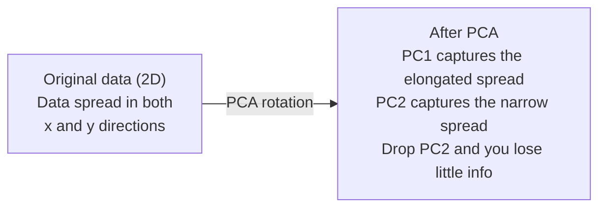

# خفض الأبعاد

> البيانات الابعاد العالي لديها بنية يمكنك العثور عليها بالنظر من الزاوية الصحيحة
> البيانات عالية الجودة. تحتاج إلى إيجاد الزاوية الصحيحة للمشاهدة.

**Type:** Build | **类型:** 动手
**Language:**" بايثون "**语言:**بايثون
**Prerequisites:** Phase 1, Lessons 01 (Linear Algebra Intuition), 02 (Vectors, Matrices & Operations), 03 (Eigenvalues & Eigenvectors), 06 (Probability & Distributions) | **前置知识:** Phase 1, Lessons 01-03, 06
**Time:** ~90 minutes | **时间:** ~90 分钟

## أهداف التعلم

- تنفيذ PCA من الصفر: بيانات المركز، حساب ماتريكس التباين، المكونات الخاصة، والمشروع
  من التنفيذ من الصفر PCA: مركزية البيانات √ حسابات المربع المتناسب √ خصائص التقسيم √ استبداد
- استخدام نسبة التباين الموضحة و طريقة الكوع لتحديد عدد المكونات الرئيسية
  استخدام تفسير الاختلافات والإكمالات قاعدة اختيار عدد المكونات الرئيسية
- مقارنة PCA، t-SNE، و UMAP لتحديد الأرقام MNIST في 2D وتفسير تعادلاتها
  مقارنة PCA ̊t-SNE و UMAP في MNIST كتابة الرقم 2D في التركيز
- تطبيق PCA النواة مع kernel RBF لفرق هيكلات البيانات غير الخطية التي لا يمكن أن تتعامل مع PCA القياسية
  طبقة مع RBF النووي PCA تفصل عن المعيار PCA  غير المحليات البيانات لا يمكن معالجتها

> **【中文解读】**
> 784 维手写数字数据无法可视化. 降维就是 العثور على "أفضل زاوية" من البيانات الإضافية، مع الحفاظ على أكبر قدر ممكن من المعلومات باستخدام أقل من الامتداد.

> **【拓展：降维在 AI 中的位置】**
> - **PCA**: sklearn 的 `PCA`، والخطوات المعيارية لمعالجة البيانات، كما أن فهم أفضل ممارسات لتفكيك قيمة الميزات.
> - **t-SNE/UMAP**: أدوات قياسية لتحقيق البيانات الثنائية الأبعاد، تقريبا كل إدخال في المقالة يستخدمها.
> - **推荐系统**: 协同过本质上就是 على المستخدم-المواد الموجات القيام بالنزول، والاكتشاف الاسباب الضحية.

## المشكلة المشكلة المشكلة

> **【中文解读】**784 维的手写数字数据(28×28 像素) لا يمكن رؤيتها ، ولا يمكن فهمها مباشرة. ولكن معظمها غير مبرر.

ربما تكون قيم البيكسل من الأرقام المكتوبة يدوياً، ربما تكون مستويات التعبير الجيني، ربما تكون إشارات سلوك المستخدم، لا يمكنك تصور 784 بعد، لا يمكنك رسمها، لا يمكنك حتى التفكير فيها.
> ربما هو قيمة الصورة الرقمية المكتوبة يدويا، ربما هو مستوى التعبير الجيني، ربما هو إشارة سلوك المستخدم.

لكن معظم هذه الميزات 784 هي ضئيلة. المعلومات الفعلية تعيش على سطح أصغر بكثير. لا تحتاج "7" مكتوبة يدوياً إلى 784 أرقام مستقلة لوصفها. تحتاج إلى عدد قليل: زاوية السحب، وطول العصا المتقاطعة، كم ينحني. الباقي هو الضجيج.
> ولكن معظم هذه الـ 784 هي مفرغة. المعلومات المفيدة الحقيقية موجودة على سطح أصغر. لا تحتاج "7" مكتوبة يدوياً إلى 784 رقم مستقل لتوصيفها، تحتاج فقط إلى عدة: زاوية الرسم، طول الخط، منحدرات، والباقي هو الضجيج.

تقليل الأبعاد يجد تلك السطح الأصغر يأخذ بياناتك البعد 784 ويضغط عليها إلى أبعاد 2، 10 أو 50 مع الحفاظ على الهيكل الذي يهم
> 降维找到那个更小的面──它将784 维数据压缩到2、10 或 50 维,同时保留有意义的结构──

## المفهوم الأساسي

> **【拓展：PCA 与 LoRA 的数学联系】**PCA 找到数据中方差最大的方向 (主要成分) ، وهو نفس الفكرة الأساسية لـ LoRA 微调: الوزن يجدد معلومات فعالة عن ΔW على عدد قليل من الاتجاهات. PCA باستخدام الخصائص القيمة لتفريق العنصر الأساسي، LoRA باستخدام المنظمة المنخفضة A·B 近似这些方向.

### لعنة الأبعاد

الفضاء العالي الأبعاد غير بديهي ثلاثة أشياء تتحطم مع نمو الأبعاد
> ارتفاع الفضاء يعكس الوضوح. مع نمو الدرجة، تظهر ثلاثة أشياء.

**Distance becomes meaningless.**في الأبعاد العالية، تبدأ المسافة بين نقطتين عشوائية إلى نفس القيمة. إذا كانت كل نقطة نفس المسافة تقريباً من كل نقطة أخرى، فإن البحث عن أقرب جيران يتوقف عن العمل.
> **距离变得无意义。**في الارتفاع، فإن المسافة بين أي نقطتين عشوائية تقترب من نفس القيمة. إذا كان كل نقطة إلى جميع النقاط الأخرى على مسافة نفسها تقريبًا، فإن البحث القريب يفشل.

```
Dimension    Avg distance ratio (max/min between random points)
2            ~5.0
10           ~1.8
100          ~1.2
1000         ~1.02
```

**Volume concentrates in corners.**إنّه من المفترض أن يكون هناك كوب واحد في أبعاد d لديه زوايا 2^d. في 100 أبعاد، يكون كلّ الحجم تقريباً في الزوايا، بعيداً عن المركز.
> **体积集中在角落。**في 100 维, تقريبا كل الكمبيوت في الزاوية, بعيدا عن المركز.

**You need exponentially more data.**للحفاظ على نفس كثافة العينات في الفضاء، الانتقال من 2D إلى 20D يعني أنك بحاجة إلى 10^18 مرات أكثر من البيانات. أنت لا تملك أبدا ما يكفي. تقليل الأبعاد يعيد كثافة البيانات إلى شيء يمكن العمل عليه.
> **需要指数级更多的数据。**من 2D إلى 20D، للحفاظ على نفس كثافة العينات، تحتاج إلى 10^18 倍 من البيانات.

### أجد الاتجاهات المهمة

تحليل المكون الرئيسي يجد المحور الذي تتغير فيه بياناتك أكثر. يدور نظام التنسيق الخاص بك بحيث يتقاط المحور الأول أكبر اختلاف، والثاني أكبر اختلاف، وهكذا.
> تحليل المكونات الرئيسية (PCA) 找到数据变化最大的轴──它旋转坐标系,使第一个轴捕获最大方差,第二个捕获次大方差,依类推──

الخوارزمية:
  算法步骤:

```
1. Center the data        (subtract the mean from each feature) / 数据中心化
2. Compute covariance     (how features move together) / 计算协方差
3. Eigendecomposition     (find the principal directions) / 特征值分解
4. Sort by eigenvalue     (biggest variance first) / 按特征值排序
5. Project               (keep top k eigenvectors, drop the rest) / 投影
```

لماذا التكوين الخاص؟ المصفوفة التجاويزية متساوية وجزئية شبه محددة. المتجهات الخاصة بها هي اتجاهات متقاطعة في مساحة الميزات. القيم الخاصة تخبرك كم التباين كل اتجاه يلتقط. المتجهات الخاصة التي لديها أكبر نقاط القيمة الخاصة على طول اتجاه أقصى التباين.
> لماذا تستخدم قيمة التفريق؟ معادلة التفريق هي معادلة للصواب نصف قطعي.



- **Before PCA:**سحاب البيانات متوزع على شكل شفر على محور x و y
  **PCA 前：**اعداد و شمار cloud في الاتجاهات المتقاطعة عبر x و y 轴
- **After PCA:**يتم تحويل نظام التنسيق بحيث يتوافق PC1 مع اتجاه أقصى اختلاف (توسع التنشر) و PC2 مع اتجاه الحد الأدنى للتنشر (توسع الضيق)
  **PCA 后：**坐标系旋转,PC1 على أكبر اتجاه,PC2 على أدنى اتجاه
- **Dimensionality reduction:**إلقاء PC2 يرمز البيانات على PC1 ، فقدان معلومات قليلة جدا
  **降维：** ضائع PC2 سوف تنشر البيانات إلى PC1 فوق، فقدان القليل من المعلومات

### نسبة التباين الموضحة

كل مكون رئيسي يحتوي على جزء من مجموع التباين.
> كل مكون رئيسي جزء من مجموع الاختلافات

```
Component    Eigenvalue    Explained ratio    Cumulative
PC1          4.73          0.473              0.473
PC2          2.51          0.251              0.724
PC3          1.12          0.112              0.836
PC4          0.89          0.089              0.925
...
```

عندما يصل التباين المتراكم الذي تم شرحه إلى 0.95, تعرف أن العديد من المكونات تسجل 95% من المعلومات. كل شيء بعد ذلك هو في الغالب الضوضاء.
> عندما يصل الاختلافات التفسيرية الإجمالية إلى 0.95, هذه المكونات تلتقط 95% من المعلومات.

### اختيار عدد المكونات 选择成分数

ثلاثة استراتيجيات:
  ثلاث استراتيجيات:

1. **Threshold.**احتفظ بما يكفي من المكونات لتفسير 90-95% من التباين.
   **阈值法。**الحفاظ على مكونات كافية لتفسير 90-95% من الاختلافات
2. **Elbow method.**-أوضح الخطة التباين لكل عنصر، ابحث عن انقطاع حاد
   **肘部法则。**رسم كل عنصر لتفسير مختلفة، بحث عن نقطة هبوط سريعة.
3. **Downstream performance.**استخدموا الـ PCA كـ معالجة مسبقة، قموا بتسحيب الـ k وقاس دقة النموذج، أفضل الـ k هو حيثما تكون مستوى الدقة.
   **下游性能。**سوف تقوم بتحليل المعدات المعدنية على الجهاز المعدني.

### الحفاظ على الحيّات

تم تصميم تـ-SNE لتصور البيانات الارتفاعية إلى 2D (أو 3D) مع الحفاظ على نقاط قريبة من بعضها البعض.
> ت-SNE 专为可视化设计──它将高维数据映射到2D(或3D),同时保留哪些点彼此接近──

الحسبان: في الفضاء الأصلي، حساب توزيع الاحتمال على أزواج من النقاط بناء على مسافاتها. النقاط القريبة تحصل على احتمال عال. النقاط البعيدة تحصل على احتمال منخفض. ثم العثور على ترتيب 2D حيث ينطبق نفس توزيع الاحتمال. النقاط التي كانت جيران في 784 بعد تبقى جيران في 2D.
> 直觉: في الفضاء الأصلي، على أساس التوزيع على احتمالية بين النقاط المحاسبة على المسافة.

الخصائص الرئيسية لـ t-SNE:
  الخصائص الرئيسية لـ t-SNE:

- غير خطي، يمكنه أن يفتح مجموعة معقدة لا يمكن لـ (بي سي ايه) أن يفعل
  غيرlinear. . . . . . . . . . . . . . . . . . . . . . . . . . . . . . . . . . . . . . . . . . . . . . . . . . . . . . . . . . . . . . . . . . . . . . . . . . . . . . . . . . . . . . . . . . . . . . . . . . . . . . . . . . . . . . . . . . . . . . . . . . . . . . . . . . . . . . . . . . . . . . . . . . . . . . . . . . . . . . . . . . . . . . . . . . . . . . . . . . . . . . . . . . . . . . . . . . . . . . . . . . . . . . . . . . . . . . . . . . . . . . . . . . . . . . . . . . . . . . . . . . . . . . . . . . . . . . . . . . . . . . . . . . . . . . . . . . . . . . . . . . . . . . . . . . . . . . . . . . . . . . . . . . . . . . . . . . . . . . . . . . . . . . . . . . . . . . . . . . . . . . . . . . . . . . . . . . . . . . . . . . . . . . . . . . . . . . . . . . . . . . . . . . . . . . . . . . . . . . . . . . . . . . . . . . . . . . . . . . . . . . . . . . . . . . . . . . . . . . . . . . . . . . . . . . . . . . . . . . . . . . . . . . . . . . . . . . . . . . . . . . . . . . . . . . . . . . . . . . . . . . . . . . .
- مستقيم، أداء مختلف ينتج ترتيب مختلف
  随机性──不同运行产生不同布局──
- تعين ملامح الارتباك كم عدد الجيران الذين يجب النظر إليهم (المدى النموذجي: 5-50).
  الارتباكات 参数控制考虑多少邻居(典型范围:5-50)
- المسافات بين المجموعات في الخروج ليست ذات معنى. فقط المجموعات نفسها هي ذات معنى.
  المسافة بين الناتج والتمثيل لا معنى لها
- بطيئة على مجموعات بيانات كبيرة.
  الكبيرة على المعلومات.

### أوتومب: أسرع، أفضل هيكل عالمي

يعمل التقرب والتحديد المتعدد الموحد (UMAP) على غرار t-SNE ولكن مع مزيتين:
> يُشبه UMAP و t-SNE، ولكن لديه ميزتين:

- أسرع، يستخدم الرسومات القريبة من الجيران بدلاً من الحسابات على كل المسافات المتزدوجة
  أكثر سريعاً. استخدام القريبة القريبة الرسم البياني بدلاً من الحسابات المرتبطة بالبعيدة.
- بنية عالمية أفضل: المواقع النسبية للمجموعات في الإنتاج تميل إلى أن تكون أكثر أهمية من في t-SNE.
  أفضل هيكل شامل.

يقوم UMAP ببناء رسم بياني معزز في الفضاء العالي الأبعاد (التمثيل الترفيهي الغامض) ثم يجد ترتيبًا منخفض الأبعاد يحافظ على هذا الرسم البياني قدر الإمكان.
> تمتلك المخططات المختلفة في المخططات المختلفة.

المعلمات الرئيسية:
  关键参数:

- `n_neighbors`: كم عدد الجيران يحددون الهيكل المحلي (مثل الارتباك)
  `n_neighbors`: كم عدد الجيران يحددون البنية الإجتماعية
- `min_dist`: كيف تتجمع النقاط بشكل ضيق في الخروج. القيم المنخفضة تخلق مجموعات أكثر كثافة.
  `min_dist`: الناتج من النقاط الوسطى كثافة ‬‬‬‬‬‬‬‬‬‬‬‬‬‬‬‬‬‬‬‬‬‬‬‬‬‬‬‬‬‬‬‬‬‬‬‬‬‬‬‬‬‬‬‬‬‬‬‬‬‬‬‬‬‬‬‬‬‬‬‬‬‬‬‬‬‬‬‬‬‬‬‬‬‬‬‬‬‬‬‬‬‬‬‬‬‬‬‬‬‬‬‬‬‬‬‬‬‬‬‬‬‬‬‬‬‬‬‬‬‬‬‬‬‬‬‬‬‬‬‬‬‬‬‬‬‬‬‬‬‬‬‬‬‬‬‬‬‬‬‬‬‬‬‬‬‬‬‬‬‬‬‬‬‬‬‬‬‬‬‬‬‬‬‬‬‬‬‬‬‬‬‬‬‬‬‬‬‬‬‬‬‬‬‬‬‬‬‬‬‬‬‬‬‬‬‬‬‬‬‬‬‬‬‬‬‬‬‬‬‬‬‬‬‬‬‬‬‬‬‬‬‬‬‬‬‬‬‬‬‬‬‬‬‬‬‬‬‬‬‬‬‬‬‬‬‬‬‬‬‬‬‬‬‬‬‬‬‬‬‬‬‬‬‬‬‬‬‬‬‬‬‬‬‬‬‬‬‬‬‬‬‬‬‬‬‬‬‬‬‬‬‬‬‬‬‬‬‬‬‬‬‬‬‬‬‬‬‬‬‬‬‬‬‬‬‬‬‬‬‬‬‬‬‬‬‬‬‬‬‬‬‬‬‬‬‬‬‬‬‬‬‬‬‬‬‬‬‬‬‬‬‬‬‬‬‬‬‬‬‬‬‬‬‬‬‬‬‬‬‬‬‬‬‬‬‬‬‬‬‬‬‬‬‬‬‬‬‬‬‬‬‬‬‬‬‬‬‬‬‬‬‬‬‬‬‬‬‬‬‬‬‬‬‬‬‬‬‬‬‬‬‬‬‬‬‬‬‬‬‬‬‬‬‬‬‬‬‬‬‬‬‬‬‬‬‬‬‬‬‬‬‬‬‬‬‬‬‬‬‬‬‬‬‬‬‬‬‬‬‬‬‬‬‬‬‬‬‬‬‬‬‬‬‬‬‬‬‬‬‬‬‬‬‬‬‬

### متى تستخدم أي طريقة؟

| Method / 方法 | Use case / 使用场景 | Preserves / 保留 | Speed / 速度 |
|--------|----------|-----------|-------|
| PCA | Preprocessing before training / 训练前预处理 | Global variance / 全局方差 | Fast (exact), works on millions of samples / 快速（精确），支持百万级样本 |
| PCA | Quick exploratory visualization / 快速探索性可视化 | Linear structure / 线性结构 | Fast / 快 |
| t-SNE | Publication-quality 2D plots / 发表级 2D 图 | Local neighborhoods / 局部邻域 | Slow (< 10k samples ideal) / 慢（<1万样本最佳） |
| UMAP | 2D visualization at scale / 大规模 2D 可视化 | Local + some global structure / 局部+部分全局结构 | Medium (handles millions) / 中等（支持百万级） |
| PCA | Feature reduction for models / 模型特征降维 | Variance-ranked features / 方差排序特征 | Fast / 快 |
| t-SNE / UMAP | Understanding cluster structure / 理解聚类结构 | Cluster separation / 聚类分离 | Medium to slow / 中等到慢 |

قاعدة عامة: استخدام PCA للتعليم المسبق و ضغط البيانات. استخدام t-SNE أو UMAP عندما تحتاج إلى تصور الهيكل في 2D.
>  تجربة قانون:PCA تستخدم للتحكم في البيانات والمعالجة المسبقة.

### الكهرباء النووية

يجد نظام المواصفات المعتاد (PCA) الفضاءات الفرعية الخطية. يدور نظام التنسيقات الخاص بك ويضع المحاور. ولكن ماذا لو كانت البيانات على مجموعة غير خطية؟ حلقة في 2D لا يمكن فصلها بأي خط. لا يساعد PCA المعتاد.
> 标准PCA 找线性子空间── ولكن إذا كان البيانات تقع على شكل غير线性 

يطبق PCA في الكرّة PCA في مساحة ميزات عالية الأبعاد التي تُحثّر من خلال وظيفة الكرّة، دون حساب مُباشر للمساويات في تلك المساحة. هذه هي خدعة الكرّة -- نفس الفكرة وراء SVMs.
> تطبيق PCA النووي في الفضاء المتحرك للعمل النووي في الفضاء المرتفع، لا يحسب بوضوح المناسبات في الفضاء.

الخوارزمية:
  算法步骤:

1. احسب ماتريكيس النواة K حيث K_ij = k(x_i, x_j)
   计算核矩阵 K، من بينها K_ij = k(x_i، x_j)
2. مركز ماتريكيز النواة في مساحة الميزات
   في المسمار الفضائي المركزي
3. Eigendecompose المصفوفة المركزية النواة
   لتخصيص القيمة المفروضة للموجة النووية المركزية
4. العوامل الخاصة العليا (مقياسها بال1 / مربع ((قيمة خاصة)) هي التنبؤات
   顶部特征向量(缩放 1/sqrt(特征值)) يعني للقوالة

وظائف النواة المشتركة:
  常见核函数:

| Kernel / 核函数 | Formula / 公式 | Good for / 适用于 |
|--------|---------|----------|
| RBF (Gaussian) | exp(-gamma * \|\|x - y\|\|^2) | Most nonlinear data, smooth manifolds / 大多数非线性数据，光滑流形 |
| Polynomial / 多项式 | (x . y + c)^d | Polynomial relationships / 多项式关系 |
| Sigmoid | tanh(alpha * x . y + c) | Neural network-like mappings / 类神经网络映射 |

متى تستخدم PCA النووية مقابل PCA القياسية:
  核 PCA vs 标准 PCA 的使用场景:

| Criterion / 标准 | Standard PCA / 标准 PCA | Kernel PCA / 核 PCA |
|-----------|-------------|------------|
| Data structure / 数据结构 | Linear subspace / 线性子空间 | Nonlinear manifold / 非线性流形 |
| Speed / 速度 | O(min(n^2 d, d^2 n)) | O(n^2 d + n^3) |
| Interpretability / 可解释性 | Components are linear combinations of features / 成分是特征的线性组合 | Components lack direct feature interpretation / 成分缺乏直接特征解释 |
| Scalability / 可扩展性 | Works on millions of samples / 支持百万级样本 | Kernel matrix is n x n, memory-limited / 核矩阵为 n x n，受内存限制 |
| Reconstruction / 重建 | Direct inverse transform / 直接逆变换 | Requires pre-image approximation / 需要预图像近似 |

المثال الكلاسيكي: الدوائر المركزة في 2D. حلقين من النقاط، واحد داخل الآخر. PCA القياسية تنشر كليهما على نفس الخط -- غير مفيد للتصنيف. الكرني PCA مع كرني RBF يرسم الدائرة الداخلية والدائرة الخارجية إلى مناطق مختلفة، مما يجعلها قابلة للفصل بشكل خطي.
> مثال كلاسيكي: 2D مع حلقة قلبية. نقطة حلقة في حلقة أخرى. PCA المعيارية سوف تنظر إلى نفس الخط على نفس الخط على نفس النطاق على عدم استخدامها.

### خطأ إعادة الإعمار

كم هو جيد تقليل الأبعاد الخاص بك؟ ضغطت 784 أبعاد إلى 50 ماذا فقدت؟
> كيف ستقلل من 784 إلى 50؟ ماذا ستفقد؟

قياس خطأ إعادة الإعمار:
  测量重建误差:

1. بيانات المشروع إلى أبعاد k: X_reduced = X @ W_k
   إضافة البيانات إلى k 维
2. إعادة الإعمار: X_hat = X_reduced @ W_k^T
   重建
3. الحساب MSE: متوسط (((X - X_hat) ^2)
   计算 MSE

بالنسبة لـ PCA، فإن خطأ إعادة الإعمار له علاقة نظيفة بالاختلاف الموضح:
> بالنسبة لـ PCA، هناك علاقة بسيطة بين خطأ إعادة البناء والفسرة:

```
Reconstruction error = sum of eigenvalues NOT included
Total variance = sum of ALL eigenvalues
Fraction lost = (sum of dropped eigenvalues) / (sum of all eigenvalues)
```

نسبة التباين الموضحة لكل مكون هي:
> كل مكون يفسر بشكل مختلف:

```
explained_ratio_k = eigenvalue_k / sum(all eigenvalues)
```

تخطيط التباين التراكمي الموضح ضد عدد المكونات يعطيك منحنى "المقدمة".
> رسم التفسيرات المجموعية العلاقة بين الفرق والعدد من المكونات تحصل على "العباء" منحنى.

- الملتحى يتسطح (تناقص العائدات) / 曲线变平(收益递减)
- يتجاوز التباين التراكمي عتبة (عادة 0.90 أو 0.95) / 累积方差超值
- أداء المهام التدريجي إلى أسفل / أسفل أداء المهام التدريجي

خطأ إعادة الإعمار مفيد أكثر من اختيار k. يمكنك استخدامه للكشف عن الطرفين: العينات التي لديها خطأ إعادة الإعمار مرتفع هي غير متساوية لا تناسب الفضاء الفرعي المكتشف. هذه هي أساس الكشف عن الطرفين القائم على PCA في أنظمة الإنتاج.
> يمكن استخدام اختبارات الغير عادية: نموذج اختبارات الغير عادية هو غير متوافق مع قيمة الغير عادية للمستوى التعلمي.

## بناء ذلك تحرك لتحقيق
```figure
pca-axes
```

## بناءها

> **【中文解读】**التالي هو التنفيذ الكامل لـ PCA من الصفر: Data Centrifying → 协方差矩阵 → خصائص التفريق → 投影── ثم في بيانات MNIST على مقارنة مع نتائج PCA、t-SNE、UMAP.

### الخطوة الأولى: PCA من الصفر. الخطوة الأولى: من الصفر لتحقيق PCA.

```python
import numpy as np

class PCA:
    def __init__(self, n_components):
        self.n_components = n_components
        self.components = None
        self.mean = None
        self.eigenvalues = None
        self.explained_variance_ratio_ = None

    def fit(self, X):
        self.mean = np.mean(X, axis=0)
        X_centered = X - self.mean

        cov_matrix = np.cov(X_centered, rowvar=False)

        eigenvalues, eigenvectors = np.linalg.eigh(cov_matrix)

        sorted_idx = np.argsort(eigenvalues)[::-1]
        eigenvalues = eigenvalues[sorted_idx]
        eigenvectors = eigenvectors[:, sorted_idx]

        self.components = eigenvectors[:, :self.n_components].T
        self.eigenvalues = eigenvalues[:self.n_components]
        total_var = np.sum(eigenvalues)
        self.explained_variance_ratio_ = self.eigenvalues / total_var

        return self

    def transform(self, X):
        X_centered = X - self.mean
        return X_centered @ self.components.T

    def fit_transform(self, X):
        self.fit(X)
        return self.transform(X)
```

### الخطوة الثانية: اختبار على البيانات الاصطناعية

```python
np.random.seed(42)
n_samples = 500

t = np.random.uniform(0, 2 * np.pi, n_samples)
x1 = 3 * np.cos(t) + np.random.normal(0, 0.2, n_samples)
x2 = 3 * np.sin(t) + np.random.normal(0, 0.2, n_samples)
x3 = 0.5 * x1 + 0.3 * x2 + np.random.normal(0, 0.1, n_samples)

X_synthetic = np.column_stack([x1, x2, x3])

pca = PCA(n_components=2)
X_reduced = pca.fit_transform(X_synthetic)

print(f"Original shape: {X_synthetic.shape}")
print(f"Reduced shape:  {X_reduced.shape}")
print(f"Explained variance ratios: {pca.explained_variance_ratio_}")
print(f"Total variance captured: {sum(pca.explained_variance_ratio_):.4f}")
```

### الخطوة الثالثة: أرقام منست في 2D

```python
from sklearn.datasets import fetch_openml

mnist = fetch_openml("mnist_784", version=1, as_frame=False, parser="auto")
X_mnist = mnist.data[:5000].astype(float)
y_mnist = mnist.target[:5000].astype(int)

pca_mnist = PCA(n_components=50)
X_pca50 = pca_mnist.fit_transform(X_mnist)
print(f"50 components capture {sum(pca_mnist.explained_variance_ratio_):.2%} of variance")

pca_2d = PCA(n_components=2)
X_pca2d = pca_2d.fit_transform(X_mnist)
print(f"2 components capture {sum(pca_2d.explained_variance_ratio_):.2%} of variance")
```

### الخطوة الرابعة: مقارنة مع الكتلة الرابعة: مقارنة مع الكتلة الرابعة

```python
from sklearn.decomposition import PCA as SklearnPCA
from sklearn.manifold import TSNE

sklearn_pca = SklearnPCA(n_components=2)
X_sklearn_pca = sklearn_pca.fit_transform(X_mnist)

print(f"\nOur PCA explained variance:     {pca_2d.explained_variance_ratio_}")
print(f"Sklearn PCA explained variance: {sklearn_pca.explained_variance_ratio_}")

diff = np.abs(np.abs(X_pca2d) - np.abs(X_sklearn_pca))
print(f"Max absolute difference: {diff.max():.10f}")

tsne = TSNE(n_components=2, perplexity=30, random_state=42)
X_tsne = tsne.fit_transform(X_mnist)
print(f"\nt-SNE output shape: {X_tsne.shape}")
```

### الخطوة 5: مقارنة UMAP الخطوة 5: مقارنة UMAP

```python
try:
    from umap import UMAP

    reducer = UMAP(n_components=2, n_neighbors=15, min_dist=0.1, random_state=42)
    X_umap = reducer.fit_transform(X_mnist)
    print(f"UMAP output shape: {X_umap.shape}")
except ImportError:
    print("Install umap-learn: pip install umap-learn")
```

## استخدمها في إطار التنفيذ

> **【拓展：t-SNE vs UMAP 选哪个？】**t-SNE: طريقة كلاسيكية، للحفاظ على علاقات قريبة، لتطبيق تجميع البيانات في البيانات.

المواد المعدنية المعدنية المعدنية كمعالجة مسبقة قبل تصنيف:
> إعداد PCA كـمعدل للتعامل المسبق:

```python
from sklearn.decomposition import PCA as SklearnPCA
from sklearn.linear_model import LogisticRegression
from sklearn.model_selection import train_test_split
from sklearn.metrics import accuracy_score

X_train, X_test, y_train, y_test = train_test_split(
    X_mnist, y_mnist, test_size=0.2, random_state=42
)

results = {}
for k in [10, 30, 50, 100, 200]:
    pca_k = SklearnPCA(n_components=k)
    X_tr = pca_k.fit_transform(X_train)
    X_te = pca_k.transform(X_test)

    clf = LogisticRegression(max_iter=1000, random_state=42)
    clf.fit(X_tr, y_train)
    acc = accuracy_score(y_test, clf.predict(X_te))
    var_captured = sum(pca_k.explained_variance_ratio_)
    results[k] = (acc, var_captured)
    print(f"k={k:>3d}  accuracy={acc:.4f}  variance={var_captured:.4f}")
```

أداء مرتفعات قبل 784 بعد.
> إن أداءها أقل بكثير من 784 و بعد ذلك يصل إلى منصة الأداء.

## أرسلها .

هذا الدرس ينتج عن:
> 本课程产出:

- `outputs/skill-dimensionality-reduction.md`- مهارة اختيار تقنية تقليل الأبعاد المناسبة لمهمة معينة
  وثيقة مهارات لتحديد المهام المحددة

## تمارين التدريب

1. تعديل فئة PCA لدعم `inverse_transform`إعادة إصلاح أرقام MNIST من 10، 50، و 200 عنصر. طبع خطأ إعادة الإصلاح (المتوسط الفرق مربع من الأصلي) لكل منها.
   修改 PCA 类以支持 `inverse_transform`△ باستخدام 10、50 和 200 个成分重建 MNIST 数字──打印每一个重建错误──

2. قم بتشغيل t-SNE على نفس مجموعة فرعية MNIST مع قيم الارتباك من 5، 30 و 100. وصف كيف تتغير الخروج. لماذا يؤثر الارتباك على ضيق الكلاستر؟
   استخدام الارتباك 值 5、30 和 100 في نفس MNIST 子集上运行 t-SNE。 وصف التغيرات المخرجة。 لماذا الارتباك  يؤثر على كثافة المجموعة؟

3. خذ مجموعة بيانات ذات 50 ميزة حيث 5 فقط من المعلومات (إنشاء واحدة مع `sklearn.datasets.make_classification`تطبيق PCA وتحقق من ما إذا كان منحنى التباين الموضح يحدد بشكل صحيح أن البيانات هي فعلياً خمسة أبعاد.
   خذ واحدة لديها 50 صفة ولكن فقط 5 مجموعات بيانات مفيدة. تطبيق PCA، تحقق ما إذا كان الموجة التفسير صحيحة التعرف على البيانات في الواقع هو 5

## شروط الرئيسية

| Term / 术语 | What people say | What it actually means / 实际含义 |
|------|----------------|----------------------|
| Curse of dimensionality / 维度灾难 | "Too many features" | Distances, volumes, and data density all behave counterintuitively as dimensions grow. Models need exponentially more data to compensate. / 随维度增长，距离、体积和数据密度都反直觉。模型需要指数级更多数据来补偿。 |
| PCA / 主成分分析 | "Reduce dimensions" | Rotate your coordinate system so the axes align with the directions of maximum variance, then drop the low-variance axes. / 旋转坐标系使轴对齐最大方差方向，然后丢弃低方差轴。 |
| Principal component / 主成分 | "An important direction" | An eigenvector of the covariance matrix. The direction in feature space along which the data varies most. / 协方差矩阵的特征向量。特征空间中数据变化最大的方向。 |
| Explained variance ratio / 解释方差比 | "How much info this component has" | The fraction of total variance captured by one principal component. Sum the top k ratios to see how much k components preserve. / 一个主成分捕获的总方差比例。累加前 k 个比率看 k 个成分保留了多少。 |
| Covariance matrix / 协方差矩阵 | "How features correlate" | A symmetric matrix where entry (i,j) measures how feature i and feature j move together. Diagonal entries are individual variances. / 对称矩阵，第 (i,j) 项衡量特征 i 和 j 如何共同变化。对角项是各自方差。 |
| t-SNE | "That cluster plot" | A nonlinear method that maps high-dimensional data to 2D by preserving pairwise neighborhood probabilities. Good for visualization, not for preprocessing. / 非线性方法，通过保留成对邻域概率将高维数据映射到 2D。适合可视化，不适合预处理。 |
| UMAP | "Faster t-SNE" | A nonlinear method based on topological data analysis. Preserves both local and some global structure. Scales better than t-SNE. / 基于拓扑数据分析的非线性方法。保留局部和部分全局结构。扩展性优于 t-SNE。 |
| Perplexity / 困惑度 | "A t-SNE knob" | Controls the effective number of neighbors each point considers. Low perplexity focuses on very local structure. High perplexity captures broader patterns. / 控制每个点考虑的有效邻居数。低困惑度关注局部结构，高困惑度捕获更广模式。 |
| Manifold / 流形 | "The surface the data lives on" | A lower-dimensional surface embedded in a higher-dimensional space. A sheet of paper crumpled in 3D is a 2D manifold. / 嵌入高维空间的低维曲面。揉成团的纸是 2D 流形。 |

## المزيد من القراءة

- [A Tutorial on Principal Component Analysis](https://arxiv.org/abs/1404.1100)(شلينز) - استنتاج واضح للـ (PCA) من الصفر
  PCA 清晰推导
- [How to Use t-SNE Effectively](https://distill.pub/2016/misread-tsne/)(واتينبرغ وغيره) - دليل تفاعلي لخدع T-SNE واختيارات المعلمات
  t-SNE استخدام هدى,交互式展示参数选择和陷
- [UMAP documentation](https://umap-learn.readthedocs.io/)- النظرية والإرشادات العملية من مؤلفي UMAP
  UMAP 理论与实践指南
