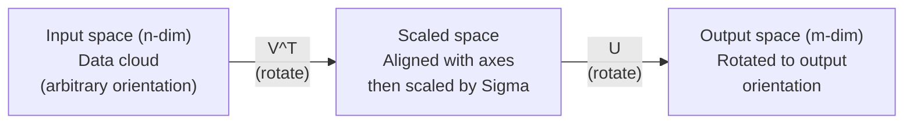
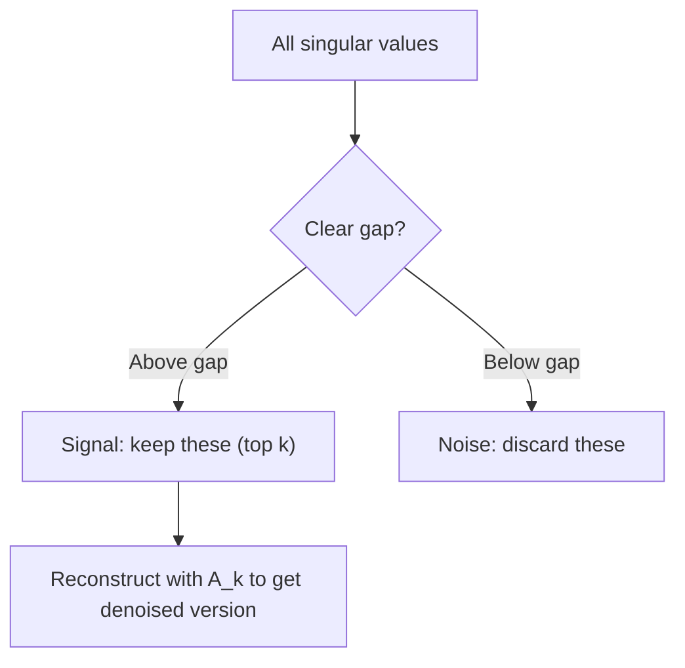

# التفكك القيمية الفريدة

> (إس.دي.إس) هو سكين الجبر السويسري لكل ماتريك واحدة كل عالم بيانات يحتاج إلى واحدة
> SVD هو "سيفي الجنوبي" للعدد السريع. كل محور لديه واحد. كل عالم بيانات يحتاج إلى واحد.

**Type:** Build | **类型:** 动手
**Languages:** Python, Julia | **语言:** Python, Julia
**Prerequisites:** Phase 1, Lessons 01 (Linear Algebra Intuition), 02 (Vectors & Matrices Operations), 03 (Matrix Transformations) | **前置知识:** Phase 1, Lessons 01-03
**Time:** ~120 minutes | **时间:** ~120 分钟

## أهداف التعلم

- تنفيذ SVD عبر تكرار الطاقة وتفسير المعنى الهندسي ل U، Sigma، و V^T
                                                                                                                                                                                                                                                                
- تطبيق SVD المقطوعة لضغط الصورة وقياس نسبة الضغط مقابل خطأ إعادة الإعمار
  التطبيقات التقاط SVD  إجراء ضغط الصورة، قياس ضغط مقارنة بخطاء إعادة البناء
- احسب مستوى "مور-بنروز" من خلال "SVD" لحل أنظمة أقل مربعات
                                                                                                                                                                                                                                                                                                                                                                                                                                                                                                                               
- ربط SVD إلى PCA، وأنظمة التوصيات (عوامل متخفية) ، والتحليل النيمي المتخفية في NLP
  توصيل SVD مع PCA、推系统(隐因子) و NLP

> **【中文解读】**
> SVD هي العدد السريع "معدل جيش سويسري" أي矩阵都能分解成 U * Sigma * V^T。 قطع SVD يمكن ضغط الصورة، المستخدم- فيلم评分矩阵 SVD يمكن العثور على القلوب (((推系统的核心) ،文档-词频矩阵 SVD يمكن العثور على الموضوع (((LSA)。

> **【拓展：SVD 在 AI 中的位置】**
> - **推荐系统**: نيكتفليكس  المسابقة النجاحية هي المستخدم-المنتجات تقييم المجموعة SVD 分解──
> - **图像压缩**: قطع SVD فقط الحفاظ على أكبر عدد من القيم الغريبة، على استخدام القليل جدا من البيانات القريبة من صورة الأصلية.
> - **LSA (潜在语义分析)**: أقدم طريقة نموذج الموضوع في النمط النووي، على درجة الحجم المستخدمة في مجال المعلومات والموارد الطبيعية.

## المشكلة المشكلة المشكلة

> **【中文解读】**لديك 1000 × 2000 من المصفوفات (((ربما يكون المصفوف- فيلم تقييمات 文档-词频表、图像像素)  خصائص القيمة المفروضة فقط تطبق على المصفوفات، SVD 则对任意形状、任意排列的矩阵都有效──

ربما تكون هذه تصنيفات فيلم المستخدم. ربما هي جدول ترددات في المستند. ربما تكون قيم البيكسل لصور. تحتاج إلى ضغطها، وتخفيدها، وإيجاد هيكل مخفي فيها، أو حل نظام أقل مربعات معها. التكوين الخاص يعمل فقط على المصفوفات المربعة. حتى إذا كان ذلك، فإنه يتطلب من المصفوف أن يكون مجموعة كاملة من المتجهات الخاصة المستقلة خطيا.
> ربما هو مستخدم-فيلم تصنيف، ربما هو وثائق-كلمات المعدل، ربما هو صورة الصورة. تحتاج إلى ضغطها، والضجيج، والاكتشاف من الهيكل المخفي، أو استخدامها لتحليل الحد الأدنى من الثانية.

يعمل SVD على أي مصفوفة. أي شكل. أي رتبة. لا توجد شروط. إنه يفكك المصفوفة إلى ثلاثة عوامل تكشف عن هندسة ما تفعله المصفوفة إلى الفضاء. إنه الأكثر عامة وأكثر فائدة في جميع الجبر الخطى.
> SVD  تطبق على أي矩阵 ‬‬‬‬‬‬‬‬‬‬‬‬‬‬‬‬‬‬‬‬‬‬‬‬‬‬‬‬‬‬‬‬‬‬‬‬‬‬‬‬‬‬‬‬‬‬‬‬‬‬‬‬‬‬‬‬‬‬‬‬‬‬‬‬‬‬‬‬‬‬‬‬‬‬‬‬‬‬‬‬‬‬‬‬‬‬‬‬‬‬‬‬‬‬‬‬‬‬‬‬‬‬‬‬‬‬‬‬‬‬‬‬‬‬‬‬‬‬‬‬‬‬‬‬‬‬‬‬‬‬‬‬‬‬‬‬‬‬‬‬‬‬‬‬‬‬‬‬‬‬‬‬‬‬‬‬‬‬‬‬‬‬‬‬‬‬‬‬‬‬‬‬‬‬‬‬‬‬‬‬‬‬‬‬‬‬‬‬‬‬‬‬‬‬‬‬‬‬‬‬‬‬‬‬‬‬‬‬‬‬‬‬‬‬‬‬‬‬‬‬‬‬‬‬‬‬‬‬‬‬‬‬‬‬‬‬‬‬‬‬‬‬‬‬‬‬‬‬‬‬‬‬‬‬‬‬‬‬‬‬‬‬‬‬‬‬‬‬‬‬‬‬‬‬‬‬‬‬‬‬‬‬‬‬‬‬‬‬‬‬‬‬‬‬‬‬‬‬‬‬‬‬‬‬‬‬‬‬‬‬‬‬‬‬‬‬‬‬‬‬‬‬‬‬‬‬‬‬‬‬‬‬‬‬‬‬‬‬‬‬‬‬‬‬‬‬‬‬‬‬‬‬‬‬‬‬‬‬‬‬‬‬‬‬‬‬‬‬‬‬‬‬‬‬‬‬‬‬‬‬‬‬‬‬‬‬‬‬‬‬‬‬‬‬‬‬‬‬‬‬‬‬‬‬‬‬‬‬‬‬‬‬‬‬‬‬‬‬‬‬‬‬‬‬‬‬‬‬‬‬‬‬‬‬‬‬‬‬‬‬‬‬‬‬‬‬‬‬‬‬‬‬‬‬‬‬‬‬‬‬‬‬‬‬‬‬‬‬‬‬‬‬‬‬‬‬‬‬‬‬‬‬‬‬‬‬‬‬‬‬‬‬‬‬‬‬‬‬‬

## المفهوم الأساسي

> **【拓展：SVD 是 LoRA 的数学根基】**فرضية مركزية لـ LoRA 微调的核心假设:权重更新矩阵 ΔW 是低排序的──SVD 告诉我们, أي矩阵 يمكن تقسيمها إلى U·Σ·V^T, منها Σ 中的奇异值按大小排列──LoRA فقط تحافظ على أقصى k 个奇异值对应的分量(即 级-k 近似),参数从 mn 减少到 k  m + n)──这是 SVD من النظرية إلى التطبيق مباشرة تحويل──

### ما يفعله الـ SVD هندسيًا

كل ماتريكس، بغض النظر عن الشكل، تقوم بعمليات ثلاث في التسلسل: تدور، وتحجم، وتدور.
> كل محور، بغض النظر عن شكله، يقوم بتنظيم ثلاثة عمليات: تحويل، تكميل، تدوير.

```
A = U * Sigma * V^T

      m x n     m x m    m x n    n x n
     (any)    (rotate)  (scale)  (rotate)
```

في أي ماتريكس A، فإن SVD يعدلها إلى:
> 给定任意矩阵 A,SVD 将其分解为:

- V^T يدور المتجهات في مساحة المدخل (n-dimensional)
  في المجال المضمن
- مقياسات سيغما على طول كل محور (ممتد أو مضغوطات)
  إشارة على طول كل محور يختصر
- U يدور النتيجة في مساحة الخروج (m-dimensional)
  سوف تحولت النتيجة إلى المجال الخارجي



فكري به بهذه الطريقة. تسلم SVD ماتريكس. فإنه يقول لك: "تأخذ هذه المصفوفة كرة من المدخلات، أولا تدورها ب V^T، ثم تمددها إلى التخميس من خلال Sigma، ثم تدور التخميس من خلال U". القيم الفردية هي أطوال محور التخميس.
> تخيل: أنت تُعطي الموجة إلى SVD، فإنها تخبرك:" هذه الموجة تتلقى مجموعة من مدخلات الكرة، أولاً تدور بـ V^T، ثم تدور ثانيةً بـ Sigma 拉伸成球، ثم تدور ثانيةً بـ U 旋球──"القدر الغريب هو طول كل محور الكرة──"

### التفكك الكامل

بالنسبة لمصفوفة A ذات الشكل m x n:

```
A = U * Sigma * V^T

where:
  U     is m x m, orthogonal (U^T U = I)
  Sigma is m x n, diagonal (singular values on the diagonal)
  V     is n x n, orthogonal (V^T V = I)

The singular values sigma_1 >= sigma_2 >= ... >= sigma_r > 0
where r = rank(A)
```

يطلق على أعمدة U متجهات مفردة اليسارية. يطلق على أعمدة V متجهات مفردة يمينية. يطلق على إدخالات خطافية Sigma قيم مفردة. وهي دائمًا غير سلبية وتقوم بتنظيمها بشكل تقليدي في ترتيب ينخفض.
> يُدعى صف U باسم سيدة غريبة، و صف V باسم سيدة غريبة، و عناصر خط سيغما باسم خُطّة غريبة.

### المتجهات الفردية اليسرى، القيم الفردية، المتجهات الفردية اليمنى

كل مكون من SVD له معنى هندسي متميز.
> لكل جزء من SVD معنى هندسي مميز.

**Right singular vectors (columns of V):**هذه تشكل أساسًا أوثنورمالًا لمرحلة المدخل (R^n). وهي الاتجاهات في مساحة المدخل التي تقوم المصفوفة بتخطيطها إلى الاتجاهات المثبتة في مساحة الخروج. فكر في هذه الجهازات كنظام التنسيق الطبيعي للمجال.
> **右奇异向量（V 的列）：**构成输入空间 (R^n) 的正交基──它们是输入空间中的矩阵映射到输出空间正交方向的方向──

**Singular values (diagonal of Sigma):**هذه هي عوامل التوسع. القيمة الفردية الثانية تخبرك كم تمتد المصفوفة المتجهات على طول المتجهة الفردية الثانية اليمنى. القيمة الفردية من الصفر تعني أن المصفوفة تحطم هذا الاتجاه بالكامل.
> **奇异值（Sigma 的对角线）：**缩放因子──第 I 个奇异值告诉你矩阵沿第 I 个右奇异向量方向拉伸多少──奇异值为零 يعني الم矩阵完全压了该方向──

**Left singular vectors (columns of U):**هذه تشكل أساسًا عاديًا للفضاء الخارجي (R^m). المتجه الفردي الأيسر هو الاتجاه في الفضاء الخارجي حيث يقع المتجه الفردي الأيمن الأيادي (بعد التوسع).
> **左奇异向量（U 的列）：**构成输出空间 (R^m) 的正交基──第 i 个左奇异向量是第 i个右奇异向量(缩放后)落在输出空间中的方向──

العلاقة بينهما:
> العلاقات بينها:

```
A * v_i = sigma_i * u_i

The matrix A takes the i-th right singular vector v_i,
scales it by sigma_i, and maps it to the i-th left singular vector u_i.
```

هذا يعطيك صورة من التنسيقات إلى التنسيقات لما تفعله أي ماتريكس
> هذا يقدم لك صورة لكل محور

### شكل منتج خارجي

يمكن كتابة SVD كجمع من المصفوفات الدرجة-1:
> يمكن أن يكتب SVD إلى ترتيب-1 矩阵之和:

```
A = sigma_1 * u_1 * v_1^T + sigma_2 * u_2 * v_2^T + ... + sigma_r * u_r * v_r^T

Each term sigma_i * u_i * v_i^T is a rank-1 matrix (an outer product).
The full matrix is the sum of r such matrices, where r is the rank.
```

هذا النموذج هو أساس التقريب منخفض الرتب. كل عبارة يضيف طبقة واحدة من الهيكل. العبارة الأولى تسجل نمط واحد أهم. الثانية تسجل الأهم التالي. وهكذا. تقسيم هذا المبلغ يمنحك أفضل تقريب ممكن في أي صف معين.
> هذا النوع هو أساس التقارير المنخفضة. كل إضافة طبقة من الهيكل. الأول هو التقاط الأسلوب الأكثر أهمية، والثاني هو التقاط الأسلوب الأكثر أهمية.

```
Rank-1 approx:    A_1 = sigma_1 * u_1 * v_1^T
                  (captures the dominant pattern)

Rank-2 approx:    A_2 = sigma_1 * u_1 * v_1^T + sigma_2 * u_2 * v_2^T
                  (captures the two most important patterns)

Rank-k approx:    A_k = sum of top k terms
                  (optimal by the Eckart-Young theorem)
```

### العلاقة مع التكوين الخاص مع العلاقة مع التكوين

SVD و Eigendecomposition مرتبطة بعمق. القيم والمتجهات الفردية ل A تأتي مباشرة من القيم والمتجهات الخاصة A^T A و A^T.
> SVD و خصائص القيمة تفكيك عميقة مرتبطا.

```
A^T A = V * Sigma^T * U^T * U * Sigma * V^T
      = V * Sigma^T * Sigma * V^T
      = V * D * V^T

where D = Sigma^T * Sigma is a diagonal matrix with sigma_i^2 on the diagonal.

So:
- The right singular vectors (V) are eigenvectors of A^T A
- The singular values squared (sigma_i^2) are eigenvalues of A^T A

Similarly:
A A^T = U * Sigma * V^T * V * Sigma^T * U^T
      = U * Sigma * Sigma^T * U^T

So:
- The left singular vectors (U) are eigenvectors of A A^T
- The eigenvalues of A A^T are also sigma_i^2
```

هذا الاتصال يخبرك بثلاث أشياء:
> هذا الاتصال يخبرك ثلاث أشياء:

1. القيم الفردية هي دائما حقيقية وغير سلبية (إنها جذور مربعة من القيم الخاصة للمصفوفة شبه محددة إيجابية).
   奇异值始终为实数且非负――
2. يمكنك حساب SVD عن طريق التكوين الخاص من A^T A، ولكن هذا يربع رقم الحالة وفقد الدقة الرقمية.
   يمكن من خلال A^T A من خصائص القيمة لتفريق حساب SVD، ولكن هذا سوف يكون مربع شروط العدد، فقدان عدد القيمة دقة.
3. عندما يكون A مربعًا ويمثل إيجابيًا شبه محددًا ، فإن SVD و Eigendecomposition هما نفس الشيء.
   عندما A هو يمثل وبالمعنى الصحيح والساري، SVD و خصائص القيمة التفريق هي شيء واحد.

### التقارير المنخفضة المرتبة

يذكر نظرية إيكارت-يونغ-ميرسكي أن أفضل تقارب من صفوف k إلى A (في كل من قاعدة فروبينيوس والطيفية) يتم الحصول عليه عن طريق الحفاظ على القيم الفردية العليا فقط ومتجهاتها المقابلة:
> إيكارت-يوغ-ميرسكي 定理指出,A 的最佳秩-k 近似(在 فروبنيوس 和谱范数下) من خلال الحفاظ فقط على قبل k 个奇异值及其对应向量获得:

```
A_k = U_k * Sigma_k * V_k^T

where:
  U_k     is m x k  (first k columns of U)
  Sigma_k is k x k  (top-left k x k block of Sigma)
  V_k     is n x k  (first k columns of V)

Approximation error = sigma_{k+1}  (in spectral norm)
                    = sqrt(sigma_{k+1}^2 + ... + sigma_r^2)  (in Frobenius norm)
```

هذا ليس مجرد تقريب "جيد". إنه من المحتمل أن يكون أفضل تقريب ممكن لدرجة k. لا توجد ماتريكس أخرى من الدرجة k أقرب إلى A.
> هذا ليس مجرد "مثل جيد" . إنه أفضل مقارنة يمكن التثبت بها . لا يوجد أي مقارنة أخرى أقرب إلى A

| Component | Relative magnitude | Kept in rank-3 approx? / 保留在秩-3 近似中？ |
|-----------|-------------------|------------------------|
| sigma_1 | Largest / 最大 | Yes / 是 |
| sigma_2 | Large / 大 | Yes / 是 |
| sigma_3 | Medium-large / 中大 | Yes / 是 |
| sigma_4 | Medium / 中 | No (error) / 否（误差） |
| sigma_5 | Medium-small / 中小 | No (error) / 否（误差） |
| sigma_6 | Small / 小 | No (error) / 否（误差） |
| sigma_7 | Very small / 很小 | No (error) / 否（误差） |
| sigma_8 | Tiny / 极小 | No (error) / 否（误差） |

الحفاظ على أعلى 3: A_3 يلتقط أكبر ثلاثة قيم فردية. الخطأ = القيم المتبقية (sigma_4 إلى sigma_8).

إذا كانت القيم الفردية تتحلل بسرعة، فإن k الصغير يستولى على معظم المصفوفة. إذا كانت تتحلل ببطء، فإن المصفوفة لا تملك بنية منخفضة الرتب.
> إذا كان التناقصات بطيئة، فإن الموجات لا توجد بنية منخفضة.

### ضغط الصورة مع SVD

صورة على نطاق الرمادي هي ماتريكية من كثافة البيكسل. صورة 800 × 600 لديها 480,000 قيم. SVD يسمح لك تقريرها مع أقل بكثير.
> الصورة ذات الدرجة الحمراء هي صورة ذات الدرجة الحمراء. الصورة ذات الدرجة الحمراء 800 × 600 لديها 480,000 قيمة. يمكن استخدام SVD أقل بكثير من هذا القيمة للتقريب.

```
Original image: 800 x 600 = 480,000 values

SVD with rank k:
  U_k:      800 x k values
  Sigma_k:  k values
  V_k:      600 x k values
  Total:    k * (800 + 600 + 1) = k * 1401 values

  k=10:   14,010 values   (2.9% of original)
  k=50:   70,050 values  (14.6% of original)
  k=100: 140,100 values  (29.2% of original)

  The compression ratio improves as k gets smaller,
  but visual quality degrades.
```

المعلومات الرئيسية: الصور الطبيعية لها قيم فردية تتدهور بسرعة. الأقوال الفردية الأولى تتقاط الهيكل الواسع (الشكالات والتحركات). والآخرين يلتقطون التفاصيل الدقيقة والضوضاء. تقصير في المرتبة 50 غالبا ما ينتج صورة تبدو متطابقة تقريبًا مع الأصلية مع استخدام 85٪ أقل من التخزين.
> 关键洞见: الاختلافات الغريبة في الصورة الطبيعية تتراجع بسرعة. الاختلافات الغريبة الأولى تمكن من الوصول إلى الهيكل الكبير (شكل أو تقدم) ، والتحديدات والضوضاء في الاحتفاظ بعد ذلك.

### "إس.دي.إس" للاستشارات

جائزة نتفليكس جعلت هذا مشهوداً. لديك ماتريكس تصنيف المستخدمين للأفلام حيث تفتقر معظم الإدخالات.
> نتفليكس 竞赛使之出名──你有一个大部分条目缺失的用户-电影评分矩阵──

```
             Movie1  Movie2  Movie3  Movie4  Movie5
  User1      [  5      ?       3       ?       1  ]
  User2      [  ?      4       ?       2       ?  ]
  User3      [  3      ?       5       ?       ?  ]
  User4      [  ?      ?       ?       4       3  ]

  ? = unknown rating
```

الفكرة: هذه المصفوفة المصفوفة لديها رتبة منخفضة. لا يمتلك المستخدمون ذوق مستقل تماما. هناك عدد قليل من العوامل الخفية (العمل مقابل الدراما، القديم مقابل الجديد، الدماغ مقابل الدموية) التي تفسر معظم الاختيارات.
> 核心思想:评分矩阵是低排的──用户的品味并非完全独立──存在少数隐因子──动作vs文艺、老片vs新片) 可以解释大部分偏好──

يزرق SVD على ماتريك التصنيفات (المملئة) إلى:
> على (((ملء بعد) المقياسات المرتبة

- U: ملفات تعريف المستخدم في الفضاء المتخفي
- إيجاما: أهمية كل عامل متخفي / أهمية كل عنصر
- V^T: ملفات الفيلم في الفضاء الخفي

تصنيف المستخدم المتوقع لفيلم هو نسبة نقطة من ملف الشخصية المستخدم مع ملف الشخصية الفيلم (موزنًا بقيم فردية). يملأ التقريب المنخفض المرتبة الإدخالات المفقودة.
> المستخدم على الفيلم تقديرات تصنيفها هي نقطة جمع صور المستخدم و صور الفيلم.

### SVD في NLP: تحليل لغوي متخفي

تحليل اللاتنت المفصل (LSA) ، والذي يسمى أيضاً مؤشر اللاتنت المفصل (LSI) ، يطبق SVD على ماتريكس الوثيقة المحددة.
> 潜在语义分析 (LSA) سوف SVD 应用于词文档矩阵。

```
             Doc1   Doc2   Doc3   Doc4
  "cat"      [  3      0      1      0  ]
  "dog"      [  2      0      0      1  ]
  "fish"     [  0      4      1      0  ]
  "pet"      [  1      1      1      1  ]
  "ocean"    [  0      3      0      0  ]

After SVD with rank k=2:

  Each document becomes a point in 2D "concept space."
  Each term becomes a point in the same 2D space.
  Documents about similar topics cluster together.
  Terms with similar meanings cluster together.
```

كانت LSA واحدة من أوائل الطرق الناجحة لاستيعاب التشابه الدلالي من النص الخام. تعمل لأنه تميل إلى ظهور مصطلحات متجانسة في وثائق مماثلة، لذلك تقوم SVD بتجميعها في نفس الأبعاد الخفية. يمكن اعتبار تضمين الكلمات الحديثة (Word2Vec، GloVe) نذراً لهذه الفكرة.
> LSA هي واحدة من أوائل الطرق الناجحة للاستيعاب إلى التشابهات الفكرية من المستندات الأصلية. وهي فعالة لأن المفردات نفسها غالبا ما تظهر في المستندات المماثلة. سوف يضعها في نفس الجهد.

### SVD للحد من الضوضاء SVD يستخدم للحد من الضوضاء

البيانات الضوضاء لديها إشارة مركزة في أعلى القيم الفردية والضوضاء تنتشر على جميع القيم الفردية.
> الاصوات في بيانات الضوضاء الإشارات تركز على القيمة الغريبة في أعلى، والضوضاء المنتشرة في جميع القيم الغريبة في وسطها.



يستخدم هذا في معالجة الإشارات والقياس العلمي وتنظيف البيانات. في أي وقت يكون لديك ماتريكس فاسدة من ضجيج إضافي، فإن SVD المقطوع هو وسيلة مبدئية لفرق الإشارة عن الضجيج.
> هذا يستخدم في معالجة الإشارات، والقياس العلمي وتنظيف البيانات. طالما أن لديك المصفوفة التي تلوث الضوضاء المضافة، فإن قطع SVD هو طريقة مبدئية لفرق الإشارات عن الضوضاء.

### الاختلافات الخفيفة عبر SVD

يُعمّل "مور-بنروز" الجهاز السودوي A+ عكس المصفوفة إلى المصفوفات غير المربعية والوحيدة. يجعلها SVD محاسبة بسيطة.
> مور-بينروز 伪逆 A+ 将矩阵求逆推广到非方阵和奇异矩阵──SVD 使计算变得简单──

```
If A = U * Sigma * V^T, then:

A+ = V * Sigma+ * U^T

where Sigma+ is formed by:
  1. Transpose Sigma (swap rows and columns)
  2. Replace each non-zero diagonal entry sigma_i with 1/sigma_i
  3. Leave zeros as zeros
```

يحلّ المُضاد السودويّ مشاكل أقلّ المربعات. إذا لم يكن لدى Ax = b حلّ دقيق (نظامٍ مُعَدّدٍ) ، فإنّ x = A+ b هو حلّ أقلّ المربعات (يُقلّل من أنّها تعتبر أقلّ المربعات).
> 伪逆求解最小二乘解问题──如果 Ax = b 没有精确解(超定系统),则 x = A+ b 是最小二乘解──

### فوائد الاستقرار الرقمي

الحساب الخاص بتكوين A^T A مربع القيم الفردية (قيمات A^T A الخاصة هي sigma_i^2). هذا مربع عدد الحالة، وتعزيز الأخطاء العددية.
> 计算 A^T A 的特征值分解会平方奇异值,平方条件数,放大数值差差──

الخوارزميات الحديثة SVD (Golub-Kahan بيدiagonalization) تعمل مباشرة على A، أبدا تشكيل A^T A. هذا هو السبب في أنك يجب دائما تفضيل `np.linalg.svd(A)`- لقد انتهت`np.linalg.eig(A.T @ A)`. . .
> 现代 SVD 算法 مباشرة على A 操作, لا تشكل A^T A.`np.linalg.svd(A)`و لا`np.linalg.eig(A.T @ A)`.

### اتصال مع PCA و اتصال مع PCA

(بي سي ايه) هو (سڤيد) على البيانات المركزة، هذه ليست مقارنة، إنها حرفيا نفس الحسابات.
> PCA هي SVD للبيانات المركزية.

```
Given data matrix X (n_samples x n_features), centered (mean subtracted):

Covariance matrix: C = (1/(n-1)) * X^T X

PCA finds eigenvectors of C. But:

  X = U * Sigma * V^T    (SVD of X)

  X^T X = V * Sigma^2 * V^T

  C = (1/(n-1)) * V * Sigma^2 * V^T

So the principal components are exactly the right singular vectors V.
The explained variance for each component is sigma_i^2 / (n-1).

In sklearn, PCA is implemented using SVD, not eigendecomposition.
It is faster and more numerically stable.
```

هذا يعني أن كل ما تعلمته عن تقليل الأبعاد في الدروس 10 هو SVD تحت الغطاء. PCA هو التطبيق الأكثر شيوعا من SVD في التعلم الآلي.
> هذا يعني أنك في الدروس 10 تعلمت أن أساسية تخفيض المحتوى هي SVD.

## بناء ذلك تحرك لتحقيق
```figure
svd-rank-reconstruction
```

## بناءها

### الخطوة الأولى: SVD من الصفر باستخدام التكرار الطاقة

الفكرة: للعثور على أكبر قيمة فردية ومجهراتها، استخدم التكرار القوى على A^T A (أو A^T). ثم تخفيف المصفوفة وتكرر للقيمة الفردية التالية.
> فكرت: باستخدام代在A^T A 上找最大奇异值及其向量, ثم تقمع矩阵,重复找下一个奇异值──

```python
import numpy as np

def power_iteration(M, num_iters=100):
    n = M.shape[1]
    v = np.random.randn(n)
    v = v / np.linalg.norm(v)

    for _ in range(num_iters):
        Mv = M @ v
        v = Mv / np.linalg.norm(Mv)

    eigenvalue = v @ M @ v
    return eigenvalue, v

def svd_from_scratch(A, k=None):
    m, n = A.shape
    if k is None:
        k = min(m, n)

    sigmas = []
    us = []
    vs = []

    A_residual = A.copy().astype(float)

    for _ in range(k):
        AtA = A_residual.T @ A_residual
        eigenvalue, v = power_iteration(AtA, num_iters=200)

        if eigenvalue < 1e-10:
            break

        sigma = np.sqrt(eigenvalue)
        u = A_residual @ v / sigma

        sigmas.append(sigma)
        us.append(u)
        vs.append(v)

        A_residual = A_residual - sigma * np.outer(u, v)

    U = np.column_stack(us) if us else np.empty((m, 0))
    S = np.array(sigmas)
    V = np.column_stack(vs) if vs else np.empty((n, 0))

    return U, S, V
```

### الخطوة الثانية: اختبار ومقارنة مع NumPy.

```python
np.random.seed(42)
A = np.random.randn(5, 4)

U_ours, S_ours, V_ours = svd_from_scratch(A)
U_np, S_np, Vt_np = np.linalg.svd(A, full_matrices=False)

print("Our singular values:", np.round(S_ours, 4))
print("NumPy singular values:", np.round(S_np, 4))

A_reconstructed = U_ours @ np.diag(S_ours) @ V_ours.T
print(f"Reconstruction error: {np.linalg.norm(A - A_reconstructed):.8f}")
```

### الخطوة 3: عرض ضغط الصورة

```python
def compress_image_svd(image_matrix, k):
    U, S, Vt = np.linalg.svd(image_matrix, full_matrices=False)
    compressed = U[:, :k] @ np.diag(S[:k]) @ Vt[:k, :]
    return compressed

image = np.random.seed(42)
rows, cols = 200, 300
image = np.random.randn(rows, cols)

for k in [1, 5, 10, 20, 50]:
    compressed = compress_image_svd(image, k)
    error = np.linalg.norm(image - compressed) / np.linalg.norm(image)
    original_size = rows * cols
    compressed_size = k * (rows + cols + 1)
    ratio = compressed_size / original_size
    print(f"k={k:>3d}  error={error:.4f}  storage={ratio:.1%}")
```

### الخطوة الرابعة: تخفيض الضوضاء الخطوة الرابعة: تخفيض الضوضاء

```python
np.random.seed(42)
clean = np.outer(np.sin(np.linspace(0, 4*np.pi, 100)),
                 np.cos(np.linspace(0, 2*np.pi, 80)))
noise = 0.3 * np.random.randn(100, 80)
noisy = clean + noise

U, S, Vt = np.linalg.svd(noisy, full_matrices=False)
denoised = U[:, :5] @ np.diag(S[:5]) @ Vt[:5, :]

print(f"Noisy error:    {np.linalg.norm(noisy - clean):.4f}")
print(f"Denoised error: {np.linalg.norm(denoised - clean):.4f}")
print(f"Improvement:    {(1 - np.linalg.norm(denoised - clean) / np.linalg.norm(noisy - clean)):.1%}")
```

### الخطوة الخامسة: الاختلاف الخاطئ الخطوة الخامسة: الاختلاف الخاطئ

```python
A = np.array([[1, 1], [2, 1], [3, 1]], dtype=float)
b = np.array([3, 5, 6], dtype=float)

U, S, Vt = np.linalg.svd(A, full_matrices=False)
S_inv = np.diag(1.0 / S)
A_pinv = Vt.T @ S_inv @ U.T

x_svd = A_pinv @ b
x_lstsq = np.linalg.lstsq(A, b, rcond=None)[0]
x_pinv = np.linalg.pinv(A) @ b

print(f"SVD pseudoinverse solution:  {x_svd}")
print(f"np.linalg.lstsq solution:   {x_lstsq}")
print(f"np.linalg.pinv solution:    {x_pinv}")
```

## استخدمها في إطار التنفيذ

الظهور الكامل يعمل في `code/svd.py`. إشغيله لترى SVD تطبيق على ضغط الصورة، وأنظمة التوصيات، التحليل الامتناع، وتقليل الضوضاء.
> 完整可运行的演示在 `code/svd.py`النظام التطبيقي: النظام التطبيقي: النظام التطبيقي: النظام التطبيقي: النظام التطبيقي: النظام التطبيقي: النظام التطبيقي: النظام التطبيقي: النظام التطبيقي: النظام التطبيقي: النظام التطبيقي: النظام التطبيقي: النظام التطبيقي: النظام التطبيقي: النظام التطبيقي: النظام التطبيقي: النظام التطبيقي: النظام التطبيقي: النظام التطبيقي: النظام التطبيقي: النظام التطبيقي: النظام التطبيقي: النظام التطبيقي: النظام التطبيقي: النظام التطبيقي: النظام التطبيقي: النظام التطبيقي: النظام التطبيقي: النظام التطبيقي: النظام التطبيقي: النظام التطبيقي: النظام التطبيقي: النظام التطبيقي: النظام التطبيقي: النظام التطبيقي: النظام التطبيقي: النظام التطبيقي: النظام التطبيقي: النظام التطبيقي: النظام التطبيقي:

```bash
python svd.py
```

نسخة جوليا في`code/svd.jl`يظهر نفس المفاهيم باستخدام الوطني جوليا `svd()`وظيفة و`LinearAlgebra`الحزمة
> `code/svd.jl`中的 جوليا 版本使用 جوليا 原生 `svd()`函数和 `LinearAlgebra`包演示相同概念──

```bash
julia svd.jl
```

## أرسلها .

هذا الدرس ينتج عن:
> 本课程产出:

- `outputs/skill-svd.md`- مهارة لمعرفة متى وكيفية تطبيق SVD في المشاريع الحقيقية
  وثيقة مهارات SVD حول كيفية استخدامها في المشاريع الحقيقية

## تمارين التدريب

1. قم بتنفيذ SVD الكامل من الصفر دون استخدام التكرار القوي. بدلاً من ذلك ، احسب التكوين الخاص A^T A للحصول على V والقيم الفردية ، ثم احسب U = A V Sigma^{-1}. قارن دقة العددية مع إصدار التكرار القوي الخاص بك ومع NumPy.
   غير استخدام代从零实现完整SVD──改为计算A^T A 的特征值分解来获得V 和奇异值,然后计算U = A V Sigma^{-1}──比较数值精度──

2. تحميل صورة حقيقية على نطاق الرمادي (أو تحويل واحدة إلى نطاق الرمادي). ضغطها على الصفوف 1، 5، 10، 25، 50، 100. لكل صف، احسب نسبة الضغط والخطأ النسبي. العثور على الصف الذي يصبح الصورة مقبولة بصريا.
   加载一张真灰度图像──用秩 1、5、10、25、50、100 压缩──计算每个秩的压缩比和相对误差──找到图像视觉可接受的排列──

3. قم ببناء نظام توصيات صغير. قم بإنشاء ماتريكية تصنيفات فيلم مستخدم 10 × 8 مع بعض الإدخالات المعروفة. املأ الإدخالات المفقودة باستخدام وسائل الصف. احسب SVD واستعادة تقارب الدرجة 3. استخدم المصفوفة المعدة لإتنبؤ بالتصنيفات المفقودة.
   构建一个小型推系统──创建 10x8 用户-电影评分矩阵──使用行平均值填充缺失条目──计算SVD 并重建排-3 近似──使用重建矩阵预测缺失评分──

4. قم بإنشاء ماتريكية 100 × 50 من المستندات المختلفة مع 3 مواضيع اصطناعية. لكل موضوع 5 مصطلحات مرتبطة. أضف الضوضاء. تطبيق SVD وتحقق من أن القيم الثلاثة الأولى من الفردية أكبر بكثير من البقية. مشروع المستندات في الفضاء الخاطئ 3D وتحقق من أن المستندات من نفس مجموعة الموضوع معا.
   创建一个有3个合成主题的100x50 文档词矩阵──每个主题有5个关联词──加噪──应用SVD 验证前3个奇异值远大于其余的──

5. قم بتوليد صفة منخفضة صفة نظيفة (مرتبة 3 ، حجم 50x40) وإضافة ضجيج غوسيان في مستويات مختلفة (سيغما = 0.1 ، 0.5 ، 1.0 ، 2.0). للعثور على صفة تخفيض مثالية لكل مستوى ضجيج عن طريق مسح k من 1 إلى 40 وقياس خطأ إعادة الإعمار ضد المصفاة النظيفة.
   生成干净的排列-3 矩阵(50x40),加不同级别的高高噪音──对每个噪音级别,通过扫描 k 找到最好的截断排列──

## شروط الرئيسية

| Term / 术语 | What people say | What it actually means / 实际含义 |
|------|----------------|----------------------|
| SVD / 奇异值分解 | "Factor any matrix" | Decompose A into U Sigma V^T where U and V are orthogonal and Sigma is diagonal with non-negative entries. Works for any matrix of any shape. / 将 A 分解为 U Sigma V^T，U 和 V 正交，Sigma 对角非负。适用于任何形状的矩阵。 |
| Singular value / 奇异值 | "How important this component is" | The i-th diagonal entry of Sigma. Measures how much the matrix stretches along the i-th principal direction. / Sigma 的第 i 个对角线元素。衡量矩阵沿第 i 主方向的拉伸程度。 |
| Left singular vector / 左奇异向量 | "Output direction" | A column of U. The direction in output space that the i-th right singular vector maps to. / U 的列。第 i 个右奇异向量映射到的输出空间方向。 |
| Right singular vector / 右奇异向量 | "Input direction" | A column of V. The direction in input space that the matrix maps to the i-th left singular vector. / V 的列。矩阵映射到第 i 个左奇异向量的输入空间方向。 |
| Truncated SVD / 截断 SVD | "Low-rank approximation" | Keep only the top k singular values and their vectors. Produces the provably best rank-k approximation (Eckart-Young theorem). / 只保留前 k 个奇异值及其向量。产生可证明的最佳秩-k 近似。 |
| Rank / 秩 | "True dimensionality" | The number of non-zero singular values. Tells you how many independent directions the matrix actually uses. / 非零奇异值的数量。告诉你矩阵实际使用多少独立方向。 |
| Pseudoinverse / 伪逆 | "Generalized inverse" | V Sigma+ U^T. Inverts non-zero singular values, leaves zeros as zeros. Solves least-squares for non-square or singular matrices. / V Sigma+ U^T。反转非零奇异值，零保持不变。 |
| Condition number / 条件数 | "How sensitive to errors" | sigma_max / sigma_min. A large condition number means small input changes cause large output changes. / sigma_max / sigma_min。条件数大意味着小的输入变化引起大的输出变化。 |
| Latent factor / 隐因子 | "Hidden variable" | A dimension in the low-rank space discovered by SVD. In recommendations, a genre preference. In NLP, a topic. / SVD 发现的低秩空间中的维度。推荐中是类型偏好，NLP 中是主题。 |
| Frobenius norm / Frobenius 范数 | "Total matrix size" | Square root of the sum of squared entries. Equals sqrt of sum of squared singular values. / 所有元素平方和的平方根。等于奇异值平方和的平方根。 |
| Eckart-Young theorem / Eckart-Young 定理 | "SVD gives the best compression" | For any target rank k, the truncated SVD minimizes the approximation error over all possible rank-k matrices. / 对任意目标秩 k，截断 SVD 在所有可能的秩-k 矩阵中最小化近似误差。 |
| Power iteration / 幂迭代 | "Find the biggest eigenvector" | Repeatedly multiply a random vector by the matrix and normalize. Converges to the largest eigenvector. / 反复将随机向量乘以矩阵并归一化。收敛到最大特征向量。 |

## المزيد من القراءة

- [Gilbert Strang: Linear Algebra and Its Applications, Chapter 7](https://math.mit.edu/~gs/linearalgebra/)- علاج الدماغ المريض بالتهابات المزمنة
  التنفيذ والتطبيق الكامل لـ SVD
- [3Blue1Brown: But what is the SVD?](https://www.youtube.com/watch?v=vSczTbgc8Rc)- الحس البدني الهندسي لـ SVD
  كيفية الوصول إلى الموقع
- [We Recommend a Singular Value Decomposition](https://www.ams.org/publicoutreach/feature-column/fcarc-svd)- نظرة عامة متاحة من الجمعية الأمريكية للرياضيات
  من AMS SVD دخول المعلومات
- [Netflix Prize and Matrix Factorization](https://sifter.org/~simon/journal/20061211.html)- المقال الأصلي من سايمون فانك على موقع SVD للحصول على توصيات
  سيمون فانك  حول SVD 推的原始博客
- [Latent Semantic Analysis](https://en.wikipedia.org/wiki/Latent_semantic_analysis)- التطبيق الأصلي لـ NLP لـ SVD
  التطبيقات الأصلية في SVD في NLP
- [Numerical Linear Algebra by Trefethen and Bau](https://people.maths.ox.ac.uk/trefethen/text.html)- المعيار الذهبي لفهم خوارزميات SVD
  فهم المعايير الذهبية لـ SVD 算法
