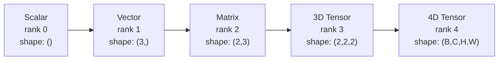
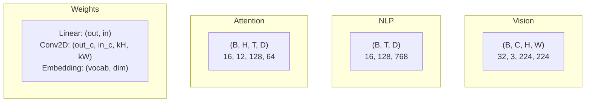
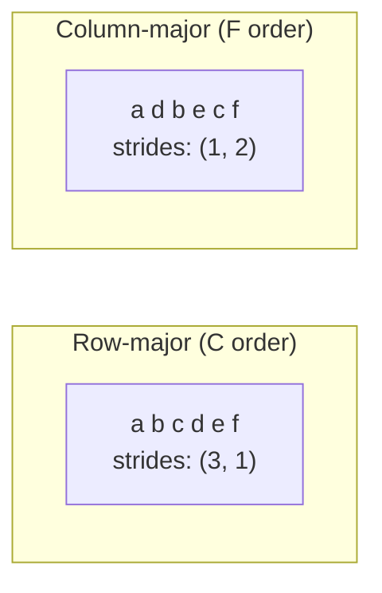
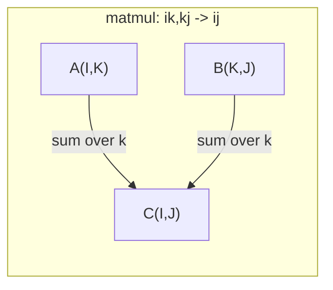

# عمليات التنسور

> الجهاز هو اللغة المشتركة بين البيانات والتعلم العميق كل صورة، كل جملة، كل تراجع يتدفق من خلالها
> 张量是数据和深度学习的通用语言. كل صورة، كل جملة، كل درجة تتدفق عبر 张量.

**Type:** Build | **类型:** 动手
**Language:**" بايثون "**语言:**بايثون
**Prerequisites:** Phase 1, Lessons 01 (Linear Algebra Intuition), 02 (Vectors, Matrices & Operations) | **前置知识:** Phase 1, Lessons 01-02
**Time:** ~90 minutes | **时间:** ~90 分钟

## أهداف التعلم

- تنفيذ فئة التنسور مع تشكيل، خطوات، إعادة تشكيل، نقل، وعمليات العنصر الحكيمة من الصفر
  من التحقق من الصفرة ذات الشكل 步长 重塑 转置 转置 张量类
- تطبيق قواعد البث للعمل على ضغطات مختلفة الأشكال دون نسخ البيانات
  应用广播规则 لا حاجة إلى نسخ البيانات على حجم الحجم المختلفة
- اكتب تعبيرات الجملة لمنتجات النقاط، وتضاعفات المصفوفة، والمنتجات الخارجية، والعمليات المكتسبة
   كتابة الجملة تعبير التطبيقات النقطة √ الموجة ضربة √ خارجية √ والكميات العمليات
- تتبع أشكال الجهاز الدقيق من خلال كل خطوة من الاهتمام متعدد الرؤوس
  تتبع الكثير من الاهتمام في كل خطوة

> **【中文解读】**
> 张量是数据和深度学习的通用语言──向量是张量,矩阵是二维张量,RGB 图像是三维张量──本章从零实现张量类,理解形状、步长、广播和 einsum──Transformer 多头注意力中 Q/K/V 都是四维张量,理解张量形状是调试的关键──

## المشكلة المشكلة المشكلة

> **【中文解读】**لقد بنيت محولًا، و عملت بعد ذلك`RuntimeError: shapes cannot be multiplied (32x768 and 512x768)` الشكل  الخطأ هو الأكثر شيوعا في التعلم العميق  المحول لديه عدة عشرات من إعادة تشكيل / نقل / نشر  العمليات مرتبطة ، خطأ واحد على الصف الوطني  الصف هو الترويج للقطر والمدرج ، فهم الصف هو العمل الأساسي للشبكة العصبية 

## المفهوم الأساسي

> **【拓展：张量 shape 是 AI 工程师的日常】**调试神经网络 90% من الوقت في التعامل شكلها 问题──关键工具:`print(tensor.shape)`查看形状،`.reshape()`ثقيلة`.transpose()`转置،`.unsqueeze()`زيادة الدرجة:`torch.einsum('bhd,bhd->bh', q, k)`) مع أينشتاين 求和约定一行搞定复杂张量运算,是变压器 实现的利器──

### ما هو الـ (تنسور) ؟

الجهاز هو مجموعة متعددة الأبعاد من الأرقام مع نوع بيانات متساوية. عدد الأبعاد هو **rank**(أو **order**كل بعد هو**axis**- المُؤمنون**shape**هو طوبيل يصف الحجم على طول كل محور.
> 张量是具有统一数据类型的多维数组――维度数是**秩**(أو**阶**), كل درجة واحدة**轴**،**形状**يدرج كل محور من مجموعات الـ



مجموع العناصر = المنتج من جميع الأحجام. شكل `(2, 3, 4)`يحتفظ`2 * 3 * 4 = 24`العناصر
> 总元素数 = 所有维度大小的乘积──形状 `(2, 3, 4)`包含 `2 * 3 * 4 = 24`العناصر

### شكلات التنسور في التعلم العميق

أنواع البيانات المختلفة خريطة إلى أشكال تنسور محددة حسب الاتفاقية.
> مختلف أنواع البيانات يتم رسمها حسب النظام إلى شكل حجم محدد.



يستخدم PyTorch NCHW (القنوات الأولى). تثنيات TensorFlow إلى NHWC (القنوات الأخيرة). تكوينات غير مطابقة تسبب تباطؤات أو أخطاء صامتة.
> استخدام PyTorch NCHW(通道在前),TensorFlow 默认 NHWC(通道在后) ・・・布局不匹配会导致隐性减速或错误──

### كيف يعمل وضع الذاكرة

صف 2D في الذاكرة هو تسلسل 1D من البايت. **Strides**أخبرك كم عنصر يجب أن تخطي لتحرك خطوة واحدة على طول كل محور
> عدد الـ2D في الـ2D في الـ1D**步长**أخبرك كم من العناصر التي يجب أن تتجاوزها في كل خطوة تتحرك



لا يتحرك الترانسبوس البيانات، بل يتبادل الخطوات، مما يجعل الجهاز الجهاز الجهاز الجهاز الجهاز الجهاز الجهاز الجهاز الجهاز الجهاز الجهاز الجهاز الجهاز الجهاز الجهاز الجهاز الجهاز الجهاز الجهاز الجهاز الجهاز الجهاز الجهاز الجهاز الجهاز الجهاز الجهاز الجهاز الجهاز الجهاز الجهاز الجهاز الجهاز الجهاز الجهاز الجهاز الجهاز الجهاز الجهاز الجهاز الجهاز الجهاز الجهاز الجهاز الجهاز الجهاز الجهاز الجهاز الجهاز الجهاز الجهاز الجهاز الجهاز الجهاز الجهاز الجهاز الجهاز الجهاز الجهاز الجهاز الجهاز الجهاز الجهاز**non-contiguous**-- عناصر صف لم تعد متجاورة في الذاكرة.
> 转置不移动数据──它交换步长,使张量**不连续** عناصر الخط لم تعد متقاربة في الذاكرة

### قواعد الإذاعة

يسمح لك البث بتشغيل مضغوطات مختلفة الأشكال دون نسخ البيانات. تحسّن الأشكال من اليمين. يُوافق الأبعاد عندما تكون متساوية أو تكون واحدة هي 1.
> 广播让你对形的不同张量操作而无需复制数据──从右对齐形――两个维度相等或其中一个为1 时兼容──较小的维度在左侧填充1──

```
Tensor A:     (8, 1, 6, 1)
Tensor B:        (7, 1, 5)
Padded B:     (1, 7, 1, 5)
Result:       (8, 7, 6, 5)
```

### إنسم: العملية العالمية للضغط

ويتم جمع محورات الإدخال ولكن لا يتم جمع المحورات في الخروج. يتم الاحتفاظ بالمحورات في كليهما.
> أينشتاين 求和用字母标记每个轴──在输入但不在输出中的轴被求和──在两个轴都有的轴保留──



النماذج الرئيسية: `i,i->`(قطعة المنتج / 点积) ،`i,j->ij`(المنتج الخارجي / 外积) ،`ii->`(تعقب / 迹) ،`ij->ji`(تحول / 转置)`bij,bjk->bik`(بث الممل / 批量矩阵乘法) ،`bhtd,bhsd->bhts`(درجات الاهتمام / توجهات)

## بناء ذلك تحرك لتحقيق
```figure
tensor-broadcast
```

## بناءها

الرمز يعيش في`code/tensors.py`كل خطوة تشير إلى التنفيذ هناك.
> 代码在 `code/tensors.py`كل خطوة تستشهد بالتحقيقات التي تمت

### الخطوة الأولى: تخزين التنفس والخطوات

تخزين الجهاز السريع قائمة مسطحة من الأرقام بالإضافة إلى بيانات الأشكال. تدخلات تخبر منطق المؤشر كيفية رسم خريطة مؤشرات متعددة الأبعاد إلى مواقع مسطحة.
> 张量存储一个平的数字列表加上形状元数据──步长告诉索引逻辑如何将多维索引映射到平位置──

```python
class Tensor:
    def __init__(self, data, shape=None):
        if isinstance(data, (list, tuple)):
            self._data, self._shape = self._flatten_nested(data)
        elif isinstance(data, np.ndarray):
            self._data = data.flatten().tolist()
            self._shape = tuple(data.shape)
        else:
            self._data = [data]
            self._shape = ()

        if shape is not None:
            total = reduce(lambda a, b: a * b, shape, 1)
            if total != len(self._data):
                raise ValueError(
                    f"Cannot reshape {len(self._data)} elements into shape {shape}"
                )
            self._shape = tuple(shape)

        self._strides = self._compute_strides(self._shape)

    @staticmethod
    def _compute_strides(shape):
        if len(shape) == 0:
            return ()
        strides = [1] * len(shape)
        for i in range(len(shape) - 2, -1, -1):
            strides[i] = strides[i + 1] * shape[i + 1]
        return tuple(strides)
```

للشكل`(3, 4)`، تقدمات هي`(4, 1)`-- تخطي 4 عناصر لتقدم صف واحد، تخطي عنصر واحد لتقدم عمود واحد.
> على الوضع`(3, 4)`,步长为 `(4, 1)` قبل دخول صف قفز 4 عناصر, قبل دخول صف قفز 1 عنصر

### الخطوة الثانية: إعادة تشكيل، ضغط، فك الضغط. الخطوة الثانية: إعادة تشكيل، ضغط، توسيع الدرجة.

يغير الشكل دون تغيير ترتيب العناصر. يجب أن يبقى العدد الإجمالي من العناصر نفسه. استخدام `-1`لبعضه واحد لتحديد حجمها
> إعادة التغيير في الصورة دون تغيير ترتيب العناصر.`-1`تلقائيًا يُحدّدُ أنّه كبيرٌ

```python
t = Tensor(list(range(12)), shape=(2, 6))
r = t.reshape((3, 4))
r = t.reshape((-1, 3))
```

سحب يزيل المحورات من الحجم 1 . إدراج unsqueez واحد. غير الضغط أمر حاسم للتسجيل -- متجه التحيز`(D,)`إضافة إلى اللحظة`(B, T, D)`تحتاج إلى عدم الضغط على`(1, 1, D)`. . .
> ضغط 移除大小为 1 的轴,Unsease 插入一个──Unsease 偏向向量 `(D,)`إضافة إلى المجموعة`(B, T, D)`عليّ أن أخرجها`(1, 1, D)`.

```python
t = Tensor(list(range(6)), shape=(1, 3, 1, 2))
s = t.squeeze()
v = Tensor([1, 2, 3])
u = v.unsqueeze(0)
```

### الخطوة الثالثة: نقل وتحويل

نقل تبادل محورين، إعادة ترتيب المحورين، هكذا تحول بين NCHW و NHWC
> نقل 交换两个轴──Permute 重排所有轴──هذا هو طريقة تحويل بين NCHW و NHWC ‬‬‬‬‬‬‬‬‬‬‬‬‬‬‬‬‬‬‬‬‬‬‬‬‬‬‬‬‬‬‬‬‬‬‬‬‬‬‬‬‬‬‬‬‬‬‬‬‬‬‬‬‬‬‬‬‬‬‬‬‬‬‬‬‬‬‬‬‬‬‬‬‬‬‬‬‬‬‬‬‬‬‬‬‬‬‬‬‬‬‬‬‬‬‬‬‬‬‬‬‬‬‬‬‬‬‬‬‬‬‬‬‬‬‬‬‬‬‬‬‬‬‬‬‬‬‬‬‬‬‬‬‬‬‬‬‬‬‬‬‬‬‬‬‬‬‬‬‬‬‬‬‬‬‬‬‬‬‬‬‬‬‬‬‬‬‬‬‬‬‬‬‬‬‬‬‬‬‬‬‬‬‬‬‬‬‬‬‬‬‬‬‬‬‬‬‬‬‬‬‬‬‬‬‬‬‬‬‬‬‬‬‬‬‬‬‬‬‬‬‬‬‬‬‬‬‬‬‬‬‬‬‬‬‬‬‬‬‬‬‬‬‬‬‬‬‬‬‬‬‬‬‬‬‬‬‬‬‬‬‬‬‬‬‬‬‬‬‬‬‬‬‬‬‬‬‬‬‬‬‬‬‬‬‬‬‬‬‬‬‬‬‬‬‬‬‬‬‬‬‬‬‬‬‬‬‬‬‬‬‬‬‬‬‬‬‬‬‬‬‬‬‬‬‬‬‬‬‬‬‬‬‬‬‬‬‬‬‬‬‬‬‬‬‬‬‬‬‬‬‬‬‬‬‬‬‬‬‬‬‬‬‬‬‬‬‬‬‬‬‬‬‬‬‬‬‬‬‬‬‬‬‬‬‬‬‬‬‬‬‬‬‬‬‬‬‬‬‬‬‬‬‬‬‬‬‬‬‬‬‬‬‬‬‬‬‬‬‬‬‬‬‬‬‬‬‬‬‬‬‬‬‬‬‬‬‬‬‬‬‬‬‬‬‬‬‬‬‬‬‬‬‬‬‬‬‬‬‬‬‬‬‬‬‬‬‬‬‬‬‬‬‬‬‬‬‬‬‬‬‬‬

```python
mat = Tensor(list(range(6)), shape=(2, 3))
tr = mat.transpose(0, 1)

t4d = Tensor(list(range(24)), shape=(1, 2, 3, 4))
perm = t4d.permute((0, 2, 3, 1))
```

بعد نقل أو تحويل، يكون الجهاز غير متواصل في الذاكرة.`view`الفشل في الجهاز غير المتواصل -- استخدام `reshape`أو اتصل`.contiguous()`أولاً
> 转置或排列后,张量在内存中不连续──PyTorch 中 `view`في عدم استمرار الصوت سوف يفشل استخدام`reshape`أو أولاً`.contiguous()`.

### الخطوة الرابعة: عمليات الحكمة في العناصر والخفضات

عمليات معرفت العنصر (إضافة، مضاعفة، خصم) تطبق بشكل مستقل على كل عنصر وتحافظ على الشكل. التخفيضات (الجمل، المتوسط، أقصى) تنهار محور واحد أو أكثر.
> 逐元素操作(加、乘、减) الاستقلالية تُستخدم لكل عنصر并保持形状──归约(sum、mean、max) طي أحوالي أو أكثر

```python
a = Tensor([[1, 2], [3, 4]])
b = Tensor([[10, 20], [30, 40]])
c = a + b
d = a * 2
s = a.sum(axis=0)
```

متوسط التجميع العالمي في CNN: `(B, C, H, W).mean(axis=[2, 3])`تنتج`(B, C)`. المتوسط المتبع في التجميع في النمط النووي: `(B, T, D).mean(axis=1)`تنتج`(B, D)`. . .
> متوسط المعلومات في CNN:`(B, C, H, W).mean(axis=[2, 3])` تكوين `(B, C)` متوسط قيمة المحركات في نطاق النظام:`(B, T, D).mean(axis=1)` تكوين `(B, D)`.

### الخطوة 5: الإذاعة مع NumPy .

- نعم`demo_broadcasting_numpy()`وظيفة في `tensors.py`يظهر أنماط الأساس.
> `tensors.py`وسط`demo_broadcasting_numpy()`函数 عرض النمط الأساسي

```python
activations = np.random.randn(4, 3)
bias = np.array([0.1, 0.2, 0.3])
result = activations + bias

images = np.random.randn(2, 3, 4, 4)
scale = np.array([0.5, 1.0, 1.5]).reshape(1, 3, 1, 1)
result = images * scale

a = np.array([1, 2, 3]).reshape(-1, 1)
b = np.array([10, 20, 30, 40]).reshape(1, -1)
outer = a * b
```

المسافة المتزاوجة عبر البث: إعادة تشكيل `(M, 2)`إلى`(M, 1, 2)`و`(N, 2)`إلى`(1, N, 2)`, سحب , مربع , جمع على طول المحور الأخير , تأخذ الجذر التربيعي. النتيجة: `(M, N)`. . .
> 通过广播计算成对距离:将 `(M, 2)`重塑为`(M, 1, 2)`،`(N, 2)`重塑为`(1, N, 2)`,相减、平方、沿最后轴求和、取平方根── نتائج:`(M, N)`.

### الخطوة السادسة: عمليات الإنسوم

- نعم`demo_einsum()`و`demo_einsum_gallery()`المهام تمر عبر كل نمط مشترك
> `demo_einsum()`和 `demo_einsum_gallery()`函数演示了每种常见模式──

```python
a = np.array([1.0, 2.0, 3.0])
b = np.array([4.0, 5.0, 6.0])
dot = np.einsum("i,i->", a, b)

A = np.array([[1, 2], [3, 4], [5, 6]], dtype=float)
B = np.array([[7, 8, 9], [10, 11, 12]], dtype=float)
matmul = np.einsum("ik,kj->ij", A, B)

batch_A = np.random.randn(4, 3, 5)
batch_B = np.random.randn(4, 5, 2)
batch_mm = np.einsum("bij,bjk->bik", batch_A, batch_B)
```

تكلفة الحساب من الانقباض هو ناتج من جميع حجم المؤشر (المحتفظ بها والجمع).`bij,bjk->bik`مع B=32، I=128، J=64, K=128: `32 * 128 * 64 * 128 = 33,554,432`مضاعفات
> تكلفة الحساب المختصرة هي ضرب كل المؤشرات

### الخطوة السابعة: تطبيق آلية الاهتمام عبر الانسوم

- نعم`demo_attention_einsum()`يطبق هذا الممثل الاهتمام متعدد الرؤوس من نهايتها إلى النهاية.
> `demo_attention_einsum()`函数端到端实现多头注意力──

```python
B, H, T, D = 2, 4, 8, 16
E = H * D

X = np.random.randn(B, T, E)
W_q = np.random.randn(E, E) * 0.02

Q = np.einsum("bte,ek->btk", X, W_q)
Q = Q.reshape(B, T, H, D).transpose(0, 2, 1, 3)

scores = np.einsum("bhtd,bhsd->bhts", Q, K) / np.sqrt(D)
weights = softmax(scores, axis=-1)
attn_output = np.einsum("bhts,bhsd->bhtd", weights, V)

concat = attn_output.transpose(0, 2, 1, 3).reshape(B, T, E)
output = np.einsum("bte,ek->btk", concat, W_o)
```

كل خطوة عملية تنسرية: التنشر (ماتمل عبر einsum) ، وتقسيم الرأس (تغيير الشكل + نقل) ، ونقاط الاهتمام (مجموعة ماتمل عبر einsum) ، المجموعة الموزعة (مجموعة ماتمل عبر einsum) ، دمج الرأس (تغيير الشكل + إعادة تشكيل) ، وتقديم الإخراج (ماتمل عبر einsum).
> كل خطوة هي عملية 张量操作:投影(einsum 矩阵乘法) 头分裂(reform + transpose) 、注意力分数(einsum 批量矩阵乘法) 、加权求和、头合并(transpose + reform) 、输出投影──

## استخدمها في إطار التنفيذ

### "الخدش" ضد "النمبي"

| Operation / 操作 | Scratch (Tensor class) | NumPy |
|---|---|---|
| Create / 创建 | `Tensor([[1,2],[3,4]])` | `np.array([[1,2],[3,4]])` |
| Reshape / 重塑 | `t.reshape((3,4))` | `a.reshape(3,4)` |
| Transpose / 转置 | `t.transpose(0,1)` | `a.T` or `a.transpose(0,1)` |
| Squeeze / 压缩 | `t.squeeze(0)` | `np.squeeze(a, 0)` |
| Sum / 求和 | `t.sum(axis=0)` | `a.sum(axis=0)` |
| Einsum | N/A | `np.einsum("ij,jk->ik", a, b)` |

### " سكراتش " مقابل " بيتورش "

```python
import torch

t = torch.tensor([[1, 2, 3], [4, 5, 6]], dtype=torch.float32)
t.shape
t.stride()
t.is_contiguous()

t.reshape(3, 2)
t.unsqueeze(0)
t.transpose(0, 1)
t.transpose(0, 1).contiguous()

torch.einsum("ik,kj->ij", A, B)
```

يضيف PyTorch autograd، دعم GPU، وبرامج BLAS المثلى. تكون أشكال الشكل متشابهة. إذا فهمت نسخة الخدش، تصبح أخطاء شكل PyTorch قابلة للقراءة.
> PyTorch  زيادة التفاصيل التلقائية GPU  دعم وتحسين BLAS 内核──形状语义完全相同── فهم نسخة الكتابة اليدوية بعد ذلك، صار صيغة PyTorch خطأ قابل للقراءة──

### كل طبقة من الشبكات العصبية كعملية تنسرية

| Operation / 操作 | Tensor Form / 张量形式 | Einsum |
|---|---|---|
| Linear layer / 线性层 | `Y = X @ W.T + b` | `"bd,od->bo"` + bias |
| Attention QKV | `Q = X @ W_q` | `"btd,dh->bth"` |
| Attention scores / 注意力分数 | `Q @ K.T / sqrt(d)` | `"bhtd,bhsd->bhts"` |
| Attention output / 注意力输出 | `softmax(scores) @ V` | `"bhts,bhsd->bhtd"` |
| Batch norm / 批归一化 | `(X - mu) / sigma * gamma` | element-wise + broadcast |
| Softmax | `exp(x) / sum(exp(x))` | element-wise + reduction |

## أرسلها .

هذا الدروس يخرج اثنين من الاستخدامات المتكررة:
> هذا المرحلة تخرج من اثنين من النصائح المستخدمة:

1. **`outputs/prompt-tensor-shapes.md`**-- طلب منهجي لإلغاء إصلاحات عدم مطابقة شكل الجهاز
   جزء من النظامية张量形状不匹配调试提示词──

2. **`outputs/prompt-tensor-debugger.md`**-- خطوة خطوة تحذير تطلبك إلصاق في أي مساعد الذكاء الاصطناعي عندما خطأ الشكل يمنعك.
   إصبع في أي مساعد في الصورة

## تمارين التدريب

1. **Easy -- Reshape round-trip.**خذ ضغط الشكل`(2, 3, 4)`. أعيد تشكيله`(6, 4)`، ثم إلى`(24,)`ثم عودوا إلى`(2, 3, 4)`يتم الحفاظ على ترتيب عناصر التحقق في كل خطوة من خلال طباعة البيانات المسطحة.
   **简单 -- 重塑往返。**取形状 `(2, 3, 4)`张量,重塑为 `(6, 4)`, مرة أخرى`(24,)`, أعود مرة أخرى`(2, 3, 4)` تثبيت عناصر تسلسل أبقى غير متغيرة

2. **Medium -- Implement broadcasting.**تمديد `Tensor`الفصل مع `broadcast_to(shape)`طريقة توسيع أبعاد الحجم 1 لتطابق شكل الهدف. ثم تعديل `_elementwise_op`للتبث التلقائي قبل التشغيل. اختبار مع الأشكال `(3, 1)`و`(1, 4)`إنتاج`(3, 4)`. . .
   **中等 -- 实现广播。**في`Tensor`类中添加 `broadcast_to(shape)`方法──修改 `_elementwise_op`自动广播──测试 `(3, 1)`和 `(1, 4)` تكوين `(3, 4)`.

3. **Hard -- Build einsum from scratch.**تنفيذ قاعدة`einsum(subscripts, *tensors)`وظيفة تتعامل مع: نقطة المنتج (`i,i->`(), مضاعفة المصفوفة (`ij,jk->ik`المنتج الخارجي (`i,j->ij`() وترانسبوس (`ij->ji`) تحليل سلسلة المخططات الفرعية، وتحديد المؤشرات المقلدة، والحلقة على جميع مجموعات المؤشرات. مقارنة نتائجك مع `np.einsum`. . .
   **困难 -- 从零构建 einsum。**实现基本的 `einsum`函数处理点积、矩阵乘法、外积和转置──解析下标字符串,识别缩索引,遍历所有索引组合──

4. **Hard -- Attention shape tracker.**اكتب وظيفة تأخذ `batch_size`،`seq_len`،`embed_dim`و`num_heads`كما المدخلات والطباعة الشكل الدقيق في كل خطوة من الرأس متعددة الاهتمام.
   **困难 -- 注意力形状追踪器。**编写函数,输入 `batch_size`.`seq_len`.`embed_dim`和 `num_heads`, طبع الكثير من الاهتمام على كل خطوة

## شروط الرئيسية

| Term / 术语 | What people say | What it actually means / 实际含义 |
|---|---|---|
| Tensor / 张量 | "A matrix but more dimensions" | A multi-dimensional array with uniform type and defined shape, strides, and operations / 具有统一类型和定义的形状、步长、操作的多维数组 |
| Rank / 秩 | "The number of dimensions" | The number of axes. A matrix has rank 2, not rank equal to its matrix rank / 轴的数量。矩阵的秩为 2 |
| Shape / 形状 | "The size of the tensor" | A tuple listing the size along each axis. `(2, 3)` means 2 rows, 3 columns / 列出各轴大小的元组 |
| Stride / 步长 | "How memory is laid out" | The number of elements to skip to advance one position along each axis / 沿每个轴前进一个位置要跳过的元素数 |
| Broadcasting / 广播 | "It just works when shapes differ" | A strict set of rules: align from right, dimensions must be equal or one must be 1 / 严格规则：从右对齐，维度必须相等或一个为 1 |
| Contiguous / 连续 | "The tensor is normal" | Elements stored sequentially in memory with no gaps / 元素在内存中顺序存储无间隙 |
| Einsum | "A fancy way to write matmul" | A general notation that expresses any tensor contraction, outer product, trace, or transpose in one line / 通用表示法，一行表达任何张量收缩、外积、迹或转置 |
| View / 视图 | "Same as reshape" | A tensor sharing the same memory buffer but with different shape/stride metadata. Fails on non-contiguous data / 共享内存缓冲区但形状/步长元数据不同的张量 |
| Contraction / 收缩 | "Summing over an index" | The general operation where a shared index between tensors is multiplied and summed / 共享索引被乘和求和的通用操作 |
| NCHW / NHWC | "PyTorch vs TensorFlow format" | Memory layout conventions for image tensors / 图像张量的内存布局约定 |

## المزيد من القراءة

- [NumPy Broadcasting](https://numpy.org/doc/stable/user/basics.broadcasting.html)-- القواعد القنونية مع أمثلة مرئية
  النظام الإجتماعي والمعيارات
- [PyTorch Tensor Views](https://pytorch.org/docs/stable/tensor_view.html)-- عندما تعمل المشاهدات وعندما تُنسخ
  بيتورش 视图何时工作何时复制
- [einops](https://github.com/arogozhnikov/einops)-- مكتبة تجعل إعادة تشكيل الجهاز القراءة و الآمنة
  让张量重塑可读且安全的库
- [The Illustrated Transformer](https://jalammar.github.io/illustrated-transformer/)-- تظهر أشكال الجهاز التنسوري تتدفق عبر الاهتمام
  صورة الحجم المتدفق في الاهتمام
- [Einstein Summation in NumPy](https://numpy.org/doc/stable/reference/generated/numpy.einsum.html)-- وثائق كاملة مع أمثلة
  عدد المعلومات  كامل الملفات ومثلة
