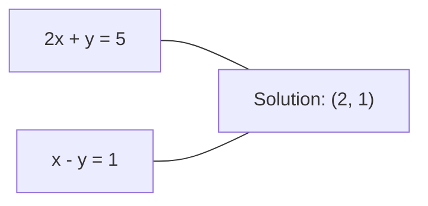
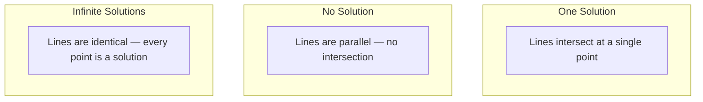

# أنظمة خطية

> حل Ax = b هو أقدم مشكلة في الرياضيات التي لا تزال تشغيل شبكة عصبية.
> 解 Ax=b هي أقدم مشكلة في الرياضيات، حتى الآن لا تزال تعمل على شبكة العصب الخاصة بك.

**Type:** Build | **类型:** 动手
**Language:**" بايثون "**语言:**بايثون
**Prerequisites:** Phase 1, Lessons 01 (Linear Algebra Intuition), 02 (Vectors & Matrices), 03 (Matrix Transformations) | **前置知识:** Phase 1, 第 01 课（线性代数直觉）、第 02 课（向量与矩阵）、第 03 课（矩阵变换）
**Time:** ~120 minutes | **时间:** ~120 分钟

## أهداف التعلم

- حل Ax = b باستخدام القضاء على غوسيان مع تحويل جزئي واستبدال الخلف
  استخدام带部分主元选取(Partial Pivoting) من高斯消元法和回代法求解 Ax = b
- المصفوفات العوامل مع LU، QR، وتفكيكات تشولسكي وتشرح متى كل مناسب
  استخدام LU、QR 和 Cholesky 分解(Decomposition) تحلل الموجات،并 تفسير كل طريقة من المواقف الملائمة
- استنباط المعادلات الطبيعية لأقل مربعات وربطها إلى التراجع الخطوي والخريج
  推导最小二乘法正规方程(معادلات طبيعية) ،并将其与线性归归和归归联系起来
- تشخيص الأنظمة السيئة باستخدام رقم الحالة وتطبيق التنظيم لتحقيق استقرارها
  استخدام شروط عدد ((شروط رقم) تشخيص الصحة,并应用正则化(تعيين) جعل استقرار


> **【中文解读】**
> 解 Ax=b هو أقدم مشكلة في الرياضيات.                                                                                                                                                                                                                                                        

## المشكلة المشكلة المشكلة

كل مرة تدرب فيها رجعة خطية، تحل نظام خطي. كل مرة تقوم فيها بحساب أقل مربعات، تحل نظام خطي. كل مرة تقوم فيها طبقة شبكة عصبية بحسابات`y = Wx + b`عندما تضيفون التنظيم، تقومون بتعديل النظام. عندما تستخدمون عمليات غوسيان، تقومون بتعديل ماتريكس. عندما تقومون بتعديل ماتريكس التغيرات على مسافة مهالانوبي، تحلون نظام خطي.

> كل مرة تدرب فيها للعودة إلى الجهاز، أنت في نظام حل للجهاز.`y = Wx + b`، فإنه في جانب من نظام تقييم الخطوطية. عندما تضيف القانونية، أنت تعديل النظام. عندما تستخدم عملية القوس (غوسيان) ، أنت تقوم بتفريق الموجة.

تظهر المعادلة Ax = b في كل مكان. A هي مصفوفة من المعاملات المعروفة. b هو متجه من المخرجات المعروفة. x هو متجه من المجهولات التي تريد العثور عليها. في التراجع الخطي، A هو متجه البيانات الخاص بك، b هو متجه الهدف الخاص بك، و x هو متجه الوزن. ينخفض النموذج بأكمله إلى: العثور على x بحيث يكون Ax أقرب إلى b قدر الإمكان.

> 方程 Ax = b 无处不在──A هو محور عدد معروف، b هو محور خروج معروف، x هو محور المطلوب غير معروف.

هذه الدروس تبني كل طريقة رئيسية لحل هذه المعادلة من الصفر. ستفهم لماذا بعض الطرق سريعة والبعض الثابتة، لماذا تعمل بعضها فقط لنظم مربعة والبعض الآخر يتعامل مع أكثر من حد، ولماذا عدد الحالة في المصفوفة تحدد ما إذا كان إجابتك تعني أي شيء على الإطلاق.

> سوف تفهم لماذا بعض الطرق سريعة وبعض مستقرة، لماذا بعضها ينطبق فقط على نظام المصفوفات وبعضها يمكن أن يعالج نظام فوق المقرر، وكذلك لماذا عدد الظروف المصفوفة يحدد ما إذا كان إجابتك ذات معنى.

## المفهوم الأساسي

> **【中文解读】**
> تعريف الجيومياتية للـ Ax=b: كل خط من المعادلات يحدد على سبيل المثال على سبيل المثال على سبيل المثال على سبيل المثال على سبيل المثال على سبيل المثال على سبيل المثال على سبيل المثال على سبيل المثال على سبيل المثال على سبيل المثال على سبيل المثال على سبيل المثال على سبيل المثال على سبيل المثال على سبيل المثال على سبيل المثال على سبيل المثال على سبيل المثال على سبيل المثال على سبيل المثال على سبيل المثال على سبيل المثال على سبيل المثال على سبيل المثال على سبيل المثال على سبيل المثال على سبيل المثال على سبيل المثال على سبيل المثال على سبيل المثال على سبيل المثال على سبيل المثال على سبيل المثال على سبيل المثال على سبيل المثال على سبيل المثال.

> **【拓展：线性系统在推荐系统中的规模】**
> في مسابقة جائزة Netflix ، كانت مشكلة تحليل المصفوفات تتعلق بـ 480,000 مستخدم و 17,770 فيلم.

### ما يعني Ax = b جغرافيا

نظام المعادلات الخطية له تفسير هندسي. كل معادلة تعريف خطة خارقة. الحل هو النقطة (أو مجموعة من النقاط) حيث تتقاطع جميع خطات خارقة.

> 线性方程组有几何解释── كل方程定义一个超平面(Hyperplane)──解是所有超平面的交点(或交点集)──

```
2x + y = 5          Two lines in 2D.
x - y  = 1          They intersect at x=2, y=1.
```



ثلاثة أشياء يمكن أن تحدث:



في شكل المصفوفة، "حل واحد" يعني أن A قابلة للتحويل. "لا حل" يعني أن النظام غير متسق. "حلول لا نهاية لها" يعني أن A لديه مساحة صفرية. تقع معظم مشاكل ML في فئة "لا حل دقيق" لأن لديك معادلات (نقاط بيانات) أكثر من المعروفات (فوارمات). هذا هو المكان الذي يأتي فيه أقل مربعات.

> استخدام矩阵语言说, "一个解" يعني A 可逆――"无解" يعني نظام不一致――"无穷多解" يعني A 有零空间(零空间)。 معظم مشاكل ML 属于"无精确解"类别,因为方程数(数据点) 多于未知数(参数)。这是最小二乘法的武之地──

### صورة العمود مقابل صورة الصف

هناك طريقتان للقراءة Ax = b.

> 阅读 Ax = b هناك طريقتان

**Row picture.**كل صف من A يحدد معادلة واحدة. كل معادلة هي طائرة فائقة. الحل هو حيث تقاطع كل منهم.

> **行视角。**كل خط من تعريف مربع. كل مربع هو فوق مسطح.

**Column picture.**كل عمود من A هو متجه. والسؤال يصبح: أي مزيج خطي من أعمدة A ينتج b؟

> **列视角。**كل صف من A هو حجم. هل يمكن أن ينتج b؟

```
A = | 2  1 |    b = | 5 |
    | 1 -1 |        | 1 |

Row picture: solve 2x + y = 5 and x - y = 1 simultaneously.

Column picture: find x1, x2 such that:
  x1 * [2, 1] + x2 * [1, -1] = [5, 1]
  2 * [2, 1] + 1 * [1, -1] = [4+1, 2-1] = [5, 1]   check.
```

إن كانت الصورة العمودية أكثر أساسية. إذا كان b يقع في مساحة العمودية من A، فإن النظام لديه حل. إذا لم يكن b، فإنك تجد أقرب نقطة في مساحة العمود. تلك النقطة القريبة هي حل أقل مربعات.

> 列视角更根本──如果 b في A 列空间(Column Space) ، النظام لديه حل──如果 b ليس في 列空间، ستجد النقطة القريبة في 列空间──那个最近的点就是最小二乘解──

### القضاء على غوسيان

تحويل القضاء على غوسيان Ax = b إلى نظام مثلث أعلى Ux = c الذي تحل به عن طريق استبدال الخلف.

> 高斯消元法将 Ax = b 转化为上三角系统 Ux = c,然后通过回代法求解──这是最直接的方法──

الخوارزمية:

```
1. For each column k (the pivot column):
   a. Find the largest entry in column k at or below row k (partial pivoting).
   b. Swap that row with row k.
   c. For each row i below k:
      - Compute multiplier m = A[i][k] / A[k][k]
      - Subtract m times row k from row i.
2. Back substitute: solve from the last equation upward.
```

مثال:

```
Original:
| 2  1  1 | 8 |       R2 = R2 - (2)R1     | 2  1   1 |  8 |
| 4  3  3 |20 |  -->  R3 = R3 - (1)R1 --> | 0  1   1 |  4 |
| 2  3  1 |12 |                            | 0  2   0 |  4 |

                       R3 = R3 - (2)R2     | 2  1   1 |  8 |
                                       --> | 0  1   1 |  4 |
                                           | 0  0  -2 | -4 |

Back substitute:
  -2 * x3 = -4    -->  x3 = 2
  x2 + 2  = 4     -->  x2 = 2
  2*x1 + 2 + 2 = 8 --> x1 = 2
```

تكلفة القضاء على غوسيان عملية O ((n^3) . بالنسبة لنظام 1000x1000 ، هذا حوالي مليار عملية نقطة عائمة. سريعة ، ولكن يمكنك القيام بذلك بشكل أفضل إذا كنت بحاجة إلى حل العديد من الأنظمة بنفس A.

> كمية حسابات القانون العالي هي O(n^3)。 بالنسبة لنظام 1000x1000، تحتاج إلى حوالي مائة مليار مرة للعمل على النقطة.

> **【中文解读】**
> فكره قانون القوة التصرف بسيط جدا: من خلال الخط التغيير على الموجة إلى صيغة العربة الثلاثة (بالإنجليزية: rotation) ، ثم من الخط الأخير تبدأ "العودة" للحصول على حل.

### التحول الجزئي: لماذا يهم

بدون محور، يمكن أن تفشل القضاء على غوسيان أو ينتج قمامة. إذا كان عنصر محور هو صفر، تقوم بتقسيمها عن طريق صفر. إذا كان صغيرًا، تقوم بتعزيز أخطاء التدريب.

> 没有主元选取,高斯消元法可能失败或产生垃圾结果──如果主元为零,你会分为零──如果主元很小,你会放大到差距──

```
Bad pivot:                       With partial pivoting:
| 0.001  1 | 1.001 |            Swap rows first:
| 1      1 | 2     |            | 1      1 | 2     |
                                 | 0.001  1 | 1.001 |
m = 1/0.001 = 1000              m = 0.001/1 = 0.001
R2 = R2 - 1000*R1               R2 = R2 - 0.001*R1
| 0.001  1     | 1.001   |      | 1      1     | 2     |
| 0     -999   | -999.0  |      | 0      0.999 | 0.999 |

x2 = 1.000 (correct)            x2 = 1.000 (correct)
x1 = (1.001 - 1)/0.001          x1 = (2 - 1)/1 = 1.000 (correct)
   = 0.001/0.001 = 1.000        Stable because the multiplier is small.
```

في حسابات النقاط العائمة بدقة محدودة، يمكن أن تفقد النسخة غير المتحركة أرقام كبيرة. يختار المحور الجزئي دائمًا أكبر محور متاح لتقليل تضخيم الخطأ.

> في عملية تحديد النقاط المحدودة، يمكن أن تفقد النسخة المحددة من النقاط المحددة عددًا فعالًا.

### تدهور LU

عوامل تفكيك LU A إلى ماتريكس مثلثية أدناه L وماتريكس مثلثية أعلى U: A = LU. تقوم ماتريكس L بتخزين المضاعفات من القضاء على غوس. هي نتيجة القضاء.

> LU 分解将 A 分解为一个下三角矩阵 L 和一个上三角矩阵 U:A = LU。L 矩阵存储高斯消元中的乘数──U 矩阵是消元的结果──

```
A = L @ U

| 2  1  1 |   | 1  0  0 |   | 2  1   1 |
| 4  3  3 | = | 2  1  0 | @ | 0  1   1 |
| 2  3  1 |   | 1  2  1 |   | 0  0  -2 |
```

لماذا عامل بدلا من مجرد القضاء؟ لأنه بمجرد أن يكون لديك L و U، حل Ax = b لأي b الجديد يكلف فقط O ((n^2):

> لماذا يتم تحليلها بدلاً من التخلص مباشرة؟ لأنه بمجرد أن يكون لدينا L و U، فإن أي B جديد يطلب حل Ax = b فقط O ((n^2):

```
Ax = b
LUx = b
Let y = Ux:
  Ly = b    (forward substitution, O(n^2))
  Ux = y    (back substitution, O(n^2))
```

يتم دفع تكلفة O ((n^3) مرة واحدة خلال التصوير. كل حل لاحقا هو O ((n^2). إذا كنت بحاجة إلى حل 1000 نظام مع نفس A ولكن متجهات b مختلفة، يو يو يوفر عامل 1000/3 في إجمالي العمل.

> تكلفة O  3) في التفكيك فقط دفع مرة واحدة.

مع التحويل الجزئي، تحصل على PA = LU حيث P هي ماتريكس محول تسجل تبادل الصف.

> استخدام الجزء الرئيسي من المنتخب، تحصل على PA = LU، من بينها P هو سجل الصرف الصرف الصرف الصرف الصرف الصرف الصرف الصرف الصرف الصرف الصرف الصرف الصرف الصرف الصرف الصرف الصرف الصرف الصرف الصرف الصرف الصرف الصرف الصرف الصرف الصرف الصرف الصرف الصرف الصرف الصرف الصرف الصرف الصرف الصرف الصرف الصرف الصرف الصرف الصرف الصرف الصرف الصرف الصرف الصرف الصرف الصرف الصرف الصرف الصرف الصرف الصرف الصرف الصرف الصرف الصرف الصرف الصرف الصرف الصرف الصرف الصرف الصرف الصرف الصرف الصرف الصرف الصرف الصرف الصرف الصرف الصرف الصرف الصرف الصرف الصرف الصرف الصرف الصرف الصرف الصرف الصرف الصرف الصرف الصرف الصرف الصرف الصرف الصرف الصرف الصرف الصرف الصرف الصرف الصرف الصرف الصرف الصرف الصرف الصرف الصرف الصرف الصرف الصرف الصف الصف الصف الصف الصفحة

> **【拓展：LU 分解在大规模科学计算中的角色】**
> في التحليل المحدود، عادة ما تكون الموجات الصلبة في المنهج الهيكلي من الملايين من الموجات المرتبة.

### تدمير QR

عوامل تفكيك QR A إلى المصفوفة Q المظلمة و المصفوفة الثلاثية العليا R: A = QR.

> QR 分解将 A 分解为一个正交矩阵(矩阵直角) Q 和一个上三角矩阵 R:A = QR。

المصفوفة المُتَقَرَّبَة لها خاصية Q^T Q = I. عموداتها متجهاتٍ عاديّة.

> 正交矩阵具有性质 Q^T Q = I. 列是标准正交向量──乘以 Q 保持长度和角度不变──

```
A = Q @ R

Q has orthonormal columns: Q^T Q = I
R is upper triangular

To solve Ax = b:
  QRx = b
  Rx = Q^T b    (just multiply by Q^T, no inversion needed)
  Back substitute to get x.
```

إن QR أكثر استقرارًا عدديًا من LU لحل مشاكل أقل مربعات. يقوم عملية غرام-شميدت ببناء Q عمودًا بعمدة:

> في طلب حل الحد الأدنى من المشكلة الثانية وقت العدد على قيمة LU أكثر استقرارها.

```
Given columns a1, a2, ... of A:

q1 = a1 / ||a1||

q2 = a2 - (a2 . q1) * q1        (subtract projection onto q1)
q2 = q2 / ||q2||                (normalize)

q3 = a3 - (a3 . q1) * q1 - (a3 . q2) * q2
q3 = q3 / ||q3||

R[i][j] = qi . aj    for i <= j
```

كل خطوة تُزيل المكون على طول جميع المتجهات القياسية السابقة، ما يترك سوى الاتجاه العكسي الجديد.

> كل خطوة تم تحريرها على طول كل القيادة السابقة إلى الاتجاهات، فقط ترك الاتجاهات الصالحة الجديدة.

### تدمير تشوليسكي

عندما يكون A متماثل (A = A^T) و محتملاً إيجابياً (كل القيم الخاصة إيجابية) ، يمكنك أن تضعها في عداد A = L L^T حيث L هو مثلث أدناه. هذا هو تدمير تشولسكي.

> عندما A هو对称的(A = A^T)且正确(جميع الصفات القيمة为正), يمكنك تحديدها إلى A = L L^T, من بينها L هو                                                                                                                                                                                                                                          

```
A = L @ L^T

| 4  2 |   | 2  0 |   | 2  1 |
| 2  5 | = | 1  2 | @ | 0  2 |

L[i][i] = sqrt(A[i][i] - sum(L[i][k]^2 for k < i))
L[i][j] = (A[i][j] - sum(L[i][k]*L[j][k] for k < j)) / L[j][j]    for i > j
```

تشوليسكي أسرع مرتين من LU ويتطلب نصف التخزين.

> تشوليسكي أكثر من LU 快两倍، تحتاج فقط إلى نصف مساحة التخزين.

- المصفوفات المتغيرة هي شبه محددة إيجابية متماثلة (محددة إيجابية مع التنظيم).
  协方差矩阵是对称半正定 加正则化后正定)
- ماتريكس النواة في عمليات غوس هو متماثل إيجابي محدد.
  الموجة النووية في عملية القوة هي معادلة صحيحة.
- الحد الأدنى من المكونات الملتوية هي الحد الأدنى من المكونات الملتوية المحددة.
  الموجة الهيسية للعملات المثبتة في القيمة الحد الأدنى هي المعروفة بصورة صحيحة.
- A^T A هو دائماً شبه محدد إيجابي متماثل.
  A^T A 总是对称半正确的──

في عمليات غوسيان، تقوم بتحديد معاملة النواة K مع تشوليسكي، ثم تحل K ألفا = y للحصول على المتوسط التنبؤي. يعطي لك عامل تشوليسكي أيضًا مقياس الحساب للاحتمال الحدودي: log det(K) = 2 * جمع(log(diag(L))).

> في عملية الارتفاع، تستخدم تشوليسكي لتفريق الموجة النووية K، ثم تبحث عن حل K ألفا = y  تحصل على متوسط القيمة المتوقعة.

> **【中文解读】**
> تشوليسكي 分解 هو LU 分解的"特殊优惠版"适用于称正定矩阵,但速度是 LU 的两倍. والخبر السار هو أن ML في كل مكان على سبيل المثال على称正定矩阵:协方差矩阵、核矩阵、X^T X、Hessian 矩阵。GPTQ وغيرها من الطرق المستخدمة في تقييم النموذج أيضاً لتحل المواد الهسسيانية。

### أقل مربعات: عندما لا يكون لدى Ax = b حل دقيق

إذا كان A m x n مع m > n (أكثر معادلات من غير المعروفة) ، فإن النظام مبالغ فيه. لا يوجد حل دقيق. بدلاً من ذلك، تقليل الخطأ التربيعي:

> إذا كان A هو m x n 且 m > n (عدد الكواكب أكثر من عدد غير معروف) ، النظام هو متكامل جداً ((متكامل جداً)

```
minimize ||Ax - b||^2

This is the sum of squared residuals:
  sum((A[i,:] @ x - b[i])^2 for i in range(m))
```

الحد الأدنى يرضى المعادلات الطبيعية:

```
A^T A x = A^T b
```

المشتق: توسع نسبة Ax - b يكونون في نسبة 2 = (Ax - b) ^T (Ax - b) = x^T A^T A x - 2 x^T A^T b + b^T b. خذ التراجع فيما يتعلق ب x، ووضعها إلى الصفر: 2 A^T A x - 2 A^T b = 0.

> 推导:展开A 求梯度并设为零:2 A 求梯度并设为零:2 A 求梯度

```
Original system (overdetermined, 4 equations, 2 unknowns):
| 1  1 |         | 3 |
| 1  2 | x     = | 5 |       No exact x satisfies all 4 equations.
| 1  3 |         | 6 |
| 1  4 |         | 8 |

Normal equations:
A^T A = | 4  10 |    A^T b = | 22 |
        | 10 30 |            | 63 |

Solve: x = [1.5, 1.7]

This is linear regression. x[0] is the intercept, x[1] is the slope.
```

### المعادلات الطبيعية = التراجع الخطى

العلاقة دقيقة. في التراجع الخطي، فإن ماتريسك البيانات X لديه صف واحد لكل عينة وعمدة واحدة لكل ميزة. متجهك الهدف y لديه مدخل واحد لكل عينة. متجه الوزن w يرضي:

> هذا الاتصال هو دقيقة. في العودة على الإنترنت، المصفوفة البيانية X كل صف من نموذج.

```
X^T X w = X^T y
w = (X^T X)^(-1) X^T y
```

هذا هو الحل المكتوب للعودة الخطية. كل مكالمة إلى`sklearn.linear_model.LinearRegression.fit()`يحسب هذا (أو ما يعادله عبر QR أو SVD).

> هذا هو حل للعودة إلى الهواء`sklearn.linear_model.LinearRegression.fit()`مدون في حساب هذا (أو عبر QR أو SVD)

إضافة مصطلح التنظيم lambda * I إلى المصفوفة وتحصل على رجعة التخميس:

> في المواصفات إضافة إضافية إضافية إضافية lambda * I get                                                                                                                                                                                                                                                   

```
(X^T X + lambda * I) w = X^T y
w = (X^T X + lambda * I)^(-1) X^T y
```

يجعلها المصفوفة أفضل حالة (من السهل أن تتحول بدقة) ويمنع التكيف الزائد عن طريق تقليص الوزن نحو الصفر. المصفوفة X^T X + lambda * I هي دائمًا محتملاً إيجابياً متماثلاً عندما تكون lambda > 0, لذلك يمكنك استخدام تشولسكي لحلها.

> 正则化使矩阵条件数更好(更容易精确求逆)并通过将重量收缩到零来防止过拟合──当兰布达 > 0 时,矩阵 X^T X + 兰布达 * I 总是对称正确,所以可以用乔尔斯基 求解──

> **【拓展：条件数与深度学习训练稳定性】**
> تصل الصفحة الثانية إلى: "تصفيق" (تصفيق) (تصفيق) (تصفيق) (تصفيق) (تصفيق) (تصفيق) (تصفيق) (تصفيق) (تصفيق) (تصفيق) (تصفيق) (تصفيق) (تصفيق) (تصفيق) (تصفيق) (تصفيق) (تصفيق) (تصفيق) (تصفيق) (تصفيق) (تصفيق) (تصفيق) (تصفيق) (تصفيق) (تصفيق) (تصفيق) (تصفيق) (تصفيق) (تصفيق) (تصفيق) (تصفيق) (تصفيق) (تصفيق) (تصفيق) (تصفيق) (تصفيق) (تصفيق) (تصفيق) (تصفيق) (تصفيق) (تصفيق) (تصفيق) (تصفيق) (تصفيق) (تصفيق) (تصفيق) (تصفيق) (تصفيق) (تصفيق) (تصفيق) (تصفيق) (تصفيق) (تصفيق) (تصفيق) (تصفيق) (تصفيق) (تصفيق) (تصفيق) (تصفيق) (تصفيق) (تصفيق) (ت) (تصفيق) (تصفيق) (ت) (تصفيق) (ت) (ت) (ت) (ت) (ت) (ت) (ت) (ت) (ت) (ت) (ت) (ت) (ت) (ت) (ت) (ت) (ت) (ت) (ت) (ت) (ت) (ت) (ت) (ت) (ت) (ت) (ت) (ت) (ت) (ت) (ت) (ت) (ت) (ت) (ت) (ت) (ت) (ت) (ت) (ت) (ت) (ت) (ت) (ت) (ت) (ت) (ت) (ت) (ت) (ت) (ت) (ت) (ت) (ت) (ت) (ت) (ت

### الاختلاف السوداني (مور-بينروز)

يُعمّل الجهاز السودوي الجهاز A+ عكس المصفوفة إلى المصفوفات غير المربعية والوحيدة. بالنسبة لأي صفوف المصفوفة A:

> 伪逆(Pseudoinverse) A+ 将矩阵求逆推广到非方阵和奇异矩阵。 بالنسبة لأي矩阵 A:

```
x = A+ b

where A+ = V Sigma+ U^T    (computed via SVD)
```

يتم تشكيل Sigma+ عن طريق أخذ المتبادل لكل قيمة فردية غير صفر ونقل النتيجة. إذا A = U Sigma V^T، ثم A + = V Sigma+ U^T.

> إيجما+ من كل غير零奇异值取倒数并转置得到──如果 A = U إيجما V^T، ثم A+ = V إيجما+ U^T──

```
A = U Sigma V^T        (SVD)

Sigma = | 5  0 |       Sigma+ = | 1/5  0  0 |
        | 0  2 |                | 0  1/2  0 |
        | 0  0 |

A+ = V Sigma+ U^T
```

يقدم النظام الاختلافية الحل الحد الأدنى للقاعدة الأدنى من المربعات إذا كان النظام:
- حل واحد: A + b يعطيه.
  حل: A+ b 给出该解――
- لا حلا: A + b يعطي الحل بأقل مربعات.
  无解: A+ b 给出最小二乘解──
- الحلول المجهولة: A + b يعطي واحد مع أصغر عدد من الحلول.
  无穷多解: A+ b 给出最小范数的那个──

(نومبي)`np.linalg.lstsq`و`np.linalg.pinv`كلاهما يستخدم جهاز SVD داخلياً

> عدد`np.linalg.lstsq`和 `np.linalg.pinv`内部都使用 SVD。

### رقم الحالة

يُقيّد رقم الحالة مدى حساسية الحل للتغيرات الصغيرة في المدخل. بالنسبة للمصفوفة A، فإن رقم الحالة هو:

> 条件数(شروط عدد) قياس الحل على حساسية التغيرات الصغيرة للدخول.

```
kappa(A) = ||A|| * ||A^(-1)|| = sigma_max / sigma_min
```

حيث sigma_max و sigma_min هي أكبر وأصغر قيم فردية.

```
Well-conditioned (kappa ~ 1):        Ill-conditioned (kappa ~ 10^15):
Small change in b -->                Small change in b -->
small change in x                    huge change in x

| 2  0 |   kappa = 2/1 = 2          | 1   1          |   kappa ~ 10^15
| 0  1 |   safe to solve            | 1   1+10^(-15) |   solution is garbage
```

قواعد الإبهام:
- kappa < 100: آمن، الحل دقيق.
  السلامة، والحل هو دقيقة.
- كابا ~ 10^k: تخسر حوالي k أرقام من الدقة من نقطة العدول العائمة.
  ستفقدين ما يقرب من دقة الموقع
- كابا ~ 10^16 (لـ float64): الحل لا معنى له. المصفوفة هي بشكل فعال فردية.
  解无意义──矩阵 في الواقع غريبة

في ML ، يحدث سوء التشريط عندما تكون الميزات شبه متقاطعة. تحسن التنظيم (إضافة lambda * I) عدد الحالة من sigma_max / sigma_min إلى (sigma_max + lambda) / (sigma_min + lambda).

> في المادة الثانية من المادة الثانية من المادة الثانية من المادة الثانية من المادة الثانية من المادة الثانية من المادة الثانية من المادة الثانية من المادة الثانية من المادة الثانية من المادة الثانية من المادة الثانية من المادة الثانية من المادة الثانية من المادة الثانية من المادة الثانية من المادة الثانية من المادة الثانية من المادة الثانية من المادة الثانية من المادة الثانية من المادة الثانية من المادة الثانية من المادة الثانية من المادة الثانية من المادة الثانية من المادة الثانية من المادة الثانية من المادة الثانية من المادة الثانية من المادة الثانية من المادة الثانية من المادة الثانية من المادة الثانية من المادة الثانية من المادة الثانية من المادة الثانية من المادة الثانية من المادة الثانية من المادة الثانية من المادة الثانية من المادة الثانية من المادة الثانية من المادة الثانية من المادة الثانية من المادة الثانية من المادة الثانية من المادة الثانية من المادة الثانية من المادة الثانية من المادة الثانية من المادة من المادة الثانية من المادة من المادة الثانية من المادة من المادة الثانية من المادة من المادة من المادة من المادة من المادة الثانية من المادة من المادة من المادة منة من المادة من المادة منة من المادة منة من المادة الثانية من المادة منة منة من المادة منة منة من المادة منة منة منة منة منة منة منة منة منة منة منة منة منة منة منة منة منة منة منة منة منة منة منة منة منة منة منة منة منة منة.

### الأساليب المتكررة: تراجع المتكامل

بالنسبة للأنظمة النادرة الكبيرة جداً (ملايين من المجهولات) ، فإن الطرق المباشرة مثل LU أو Cholesky مكلفة جداً. تقترب الطرق المتكررة من الحل من خلال تحسين التخمين على العديد من التكرارات.

> للنظام النادر جداً كبير جداً ((ملايين عدد غير معروف) ، لو أو تشولسكي وغيرها من الطرق المباشرة مكلفة جداً.

تحل التراجع المشترك (CG) Ax = b عندما يكون A محتملاً إيجابياً متماثلًا. يجد الحل الدقيق في أقصى عدد من التكرارات (في الحساب الدقيق) ، ولكن عادةً ما يتقارب أسرع بكثير إذا تم تجميع قيم خاصة A.

> 共梯度法(Conjugate Gradient, CG) في A هو對称正定时求解 Ax = b。 انها الأكثر n 次代就能找到精确解((精确算术), ولكن إذا جمعت قيمة خصائص A معاً، عادةً ما تكون أكثر سرعة.

```
Algorithm sketch:
  x0 = initial guess (often zero)
  r0 = b - A x0           (residual)
  p0 = r0                 (search direction)

  For k = 0, 1, 2, ...:
    alpha = (rk . rk) / (pk . A pk)
    x_{k+1} = xk + alpha * pk
    r_{k+1} = rk - alpha * A pk
    beta = (r_{k+1} . r_{k+1}) / (rk . rk)
    p_{k+1} = r_{k+1} + beta * pk
    if ||r_{k+1}|| < tolerance: stop
```

تستخدم CG في:
- التحسين على نطاق واسع (طريقة نيوتون-سي جي)
  (ماكسيكولوجيا)
- حل التخفيفات في PDE
   تحليل التفريق
- أساليب النواة حيث تكون ماتريكس النواة كبيرة جداً للاستفادة من العامل
  النووي المُحدّد جداً غير قابل للتفكّك
- التشريط المسبق لحلولات التكرار الأخرى
  其他代求解器的预处理

معدل التقارب يعتمد على عدد الحالات. الأنظمة المعتمدة بشكل أفضل تتقارب بشكل أسرع، وهذا سبب آخر يساعد على التنظيم.

> سرعة الإستقبال تعتمد على عدد الظروف‬‬‬‬‬‬‬‬‬‬‬‬‬‬‬‬‬‬‬‬‬‬‬‬‬‬‬‬‬‬‬‬‬‬‬‬‬‬‬‬‬‬‬‬‬‬‬‬‬‬‬‬‬‬‬‬‬‬‬‬‬‬‬‬‬‬‬‬‬‬‬‬‬‬‬‬‬‬‬‬‬‬‬‬‬‬‬‬‬‬‬‬‬‬‬‬‬‬‬‬‬‬‬‬‬‬‬‬‬‬‬‬‬‬‬‬‬‬‬‬‬‬‬‬‬‬‬‬‬‬‬‬‬‬‬‬‬‬‬‬‬‬‬‬‬‬‬‬‬‬‬‬‬‬‬‬‬‬‬‬‬‬‬‬‬‬‬‬‬‬‬‬‬‬‬‬‬‬‬‬‬‬‬‬‬‬‬‬‬‬‬‬‬‬‬‬‬‬‬‬‬‬‬‬‬‬‬‬‬‬‬‬‬‬‬‬‬‬‬‬‬‬‬‬‬‬‬‬‬‬‬‬‬‬‬‬‬‬‬‬‬‬‬‬‬‬‬‬‬‬‬‬‬‬‬‬‬‬‬‬‬‬‬‬‬‬‬‬‬‬‬‬‬‬‬‬‬‬‬‬‬‬‬‬‬‬‬‬‬‬‬‬‬‬‬‬‬‬‬‬‬‬‬‬‬‬‬‬‬‬‬‬‬‬‬‬‬‬‬‬‬‬‬‬‬‬‬‬‬‬‬‬‬‬‬‬‬‬‬‬‬‬‬‬‬‬‬‬‬‬‬‬‬‬‬‬‬‬‬‬‬‬‬‬‬‬‬‬‬‬‬‬‬‬‬‬‬‬‬‬‬‬‬‬‬‬‬‬‬‬‬‬‬‬‬‬‬‬‬‬‬‬‬‬‬‬‬‬‬‬‬‬‬‬‬‬‬‬‬‬‬‬‬‬‬‬‬‬‬‬‬‬‬‬‬‬‬‬‬‬‬‬‬‬‬‬‬‬‬‬‬‬‬‬‬‬‬‬‬‬‬‬‬‬‬‬‬‬‬‬‬‬‬‬‬‬‬‬‬‬‬‬‬‬‬‬‬‬‬‬‬‬‬‬‬

> **【中文解读】**
> 共梯度法是大规模稀疏系统的救星──它不需要存储整个矩阵 (O  n ^ 2) 内存),只需要矩阵-向量乘法 (O  n z) 时间)──在图神经网络的消息传递中,邻近矩阵-特征矩阵乘法本质就是稀疏矩阵运算──条件数越小的系统收收收越快,这也是正则化的另一个好处──

### الصورة الكاملة: أي طريقة عندما

| Method | Requirements | Cost | Use case |
|--------|-------------|------|----------|
| Gaussian elimination | Square, nonsingular A | O(n^3) | One-off solve of a square system |
| LU decomposition | Square, nonsingular A | O(n^3) factor + O(n^2) solve | Multiple solves with the same A |
| QR decomposition | Any A (m >= n) | O(mn^2) | Least squares, numerically stable |
| Cholesky | Symmetric positive definite A | O(n^3/3) | Covariance matrices, Gaussian processes, ridge regression |
| Normal equations | Overdetermined (m > n) | O(mn^2 + n^3) | Linear regression (small n) |
| SVD / pseudoinverse | Any A | O(mn^2) | Rank-deficient systems, minimum-norm solutions |
| Conjugate gradient | Symmetric positive definite, sparse A | O(n * k * nnz) | Large sparse systems, k = iterations |

### اتصال مع ML

كل طريقة في هذا الدروس تظهر في الإنتاج ML:

> كل طريقة في هذا الدراسة تظهر في إنتاج ML:

**Linear regression.**يحل حل الشكل المغلق المعادلات الطبيعية X^T X w = X^T y. يتم ذلك عن طريق تشولسكي (إذا كان n صغيرًا) أو QR (إذا كان الاستقرار الرقمي مهمًا) أو SVD (إذا كانت المصفوفة قد تكون ناقصة الدرجة).

> **线性回归。**解析解求解正规方程 X^T X w = X^T y。通过 Cholesky(n 较小时) أو QR(需要数值稳定性时) أو SVD(矩阵可能不满秩时)完成。

**Ridge regression.**يضيف lambda * I إلى X^T X. النظام المنظم (X^T X + lambda * I) w = X^T y يمكن حله دائمًا عبر تشولسكي لأن X^T X + lambda * I هو محتملاً إيجابياً متماثلاً ل lambda > 0.

> **岭回归。**في X^T X 上加 lambda * I。正则化系统 (X^T X + lambda * I) w = X^T y 总是可以通过Cholesky 求解,因为当 lambda > 0 时 X^T X + lambda * I 是对称正确的──

**Gaussian processes.**المتوسط التنبؤي يتطلب حل K ألفا = y حيث K هو المصفوفة النواة. تشوليسكي عاملة K هو النهج القياسي. تستخدم الحد الأقصى من الاحتمالات التنفيذية التنفيذية det(K) = 2 جمع(log(diag(L))).

> **高斯过程。**预测 متوسط القيمة تحتاج إلى طلب الحل K ألفا = y، من بينها K هو النووي矩阵。Cholesky 分解 K هو الطريقة القياسية。对数边际似然使用 log det(K) = 2 sum(log(diag(L)))。

**Neural network initialization.**يستخدم التشغيل الأورتوغونال تدمير QR لإنشاء ماتريصات الوزن التي تكون عموداتها أورتوغونرمالية. هذا يمنع انهيار الإشارة في الشبكات العميقة.

> **神经网络初始化。**تم إطلاقها باستخدام QR لتفريق إنشاء المواصفات المعتمدة للثقل المحدد.

**Preconditioning.**تستخدم المحفزات الكبيرة الكبيرة تشولسكي غير كاملة أو LU غير كاملة كشرطات مسبقة لحلات التراجع المتكاملة.

> **预处理。**استخدام الكمبيوترات الكبيرة لا بالكامل تشولسكي أو لا بالكامل لو كشرط التحكم في التسجيلات المشتركة للمحاولة المشتركة.

**Feature engineering.**عدد الحالة من X^T X يخبرك إذا كانت صفاتك متقاطعة. إذا كان kappa كبير، انقطاع صفات أو إضافة التنظيم.

> **特征工程。**عدد الشروط X^T X يخبرك إذا كانت الخصائص متوافقة. إذا كانت الكابا كبيرة جدا، قم بإزالة الخصائص أو إضافة القانونية.

## بناء ذلك تحرك لتحقيق
```figure
linear-system-conditioning
```

## بناءها

### الخطوة الأولى: القضاء على غوسيان مع التحويل الجزئي

```python
import numpy as np

def gaussian_elimination(A, b):
    n = len(b)
    Ab = np.hstack([A.astype(float), b.reshape(-1, 1).astype(float)])

    for k in range(n):
        max_row = k + np.argmax(np.abs(Ab[k:, k]))  # 部分主元选取：找列中绝对值最大的行
        Ab[[k, max_row]] = Ab[[max_row, k]]           # 交换行使最大元素到主元位置

        if abs(Ab[k, k]) < 1e-12:                     # 检查主元是否接近零（矩阵奇异）
            raise ValueError(f"Matrix is singular or nearly singular at pivot {k}")

        for i in range(k + 1, n):
            m = Ab[i, k] / Ab[k, k]                   # 计算消元乘数
            Ab[i, k:] -= m * Ab[k, k:]                # 消元：将第 k 列第 i 行以下变为零

    x = np.zeros(n)
    for i in range(n - 1, -1, -1):
        x[i] = (Ab[i, -1] - Ab[i, i+1:n] @ x[i+1:n]) / Ab[i, i]  # 回代求解

    return x
```

### الخطوة الثانية: تدهور LU

```python
def lu_decompose(A):
    n = A.shape[0]
    L = np.eye(n)
    U = A.astype(float).copy()
    P = np.eye(n)

    for k in range(n):
        max_row = k + np.argmax(np.abs(U[k:, k]))
        if max_row != k:
            U[[k, max_row]] = U[[max_row, k]]
            P[[k, max_row]] = P[[max_row, k]]
            if k > 0:
                L[[k, max_row], :k] = L[[max_row, k], :k]

        for i in range(k + 1, n):
            L[i, k] = U[i, k] / U[k, k]
            U[i, k:] -= L[i, k] * U[k, k:]

    return P, L, U

def lu_solve(P, L, U, b):
    n = len(b)
    Pb = P @ b.astype(float)

    y = np.zeros(n)
    for i in range(n):
        y[i] = Pb[i] - L[i, :i] @ y[:i]

    x = np.zeros(n)
    for i in range(n - 1, -1, -1):
        x[i] = (y[i] - U[i, i+1:] @ x[i+1:]) / U[i, i]

    return x
```

### الخطوة الثالثة: تدمير تشوليسكي

```python
def cholesky(A):
    n = A.shape[0]
    L = np.zeros_like(A, dtype=float)

    for i in range(n):
        for j in range(i + 1):
            s = A[i, j] - L[i, :j] @ L[j, :j]       # 减去已计算部分的贡献
            if i == j:
                if s <= 0:                             # 对角线元素必须为正（正定条件）
                    raise ValueError("Matrix is not positive definite")
                L[i, j] = np.sqrt(s)                  # 对角线元素 = sqrt(剩余值)
            else:
                L[i, j] = s / L[j, j]                 # 非对角线元素除以对应对角线值

    return L
```

### الخطوة الرابعة: أقل مربعات من خلال المعادلات الطبيعية

```python
def least_squares_normal(A, b):
    AtA = A.T @ A
    Atb = A.T @ b
    return gaussian_elimination(AtA, Atb)

def ridge_regression(A, b, lam):
    n = A.shape[1]
    AtA = A.T @ A + lam * np.eye(n)
    Atb = A.T @ b
    L = cholesky(AtA)
    y = np.zeros(n)
    for i in range(n):
        y[i] = (Atb[i] - L[i, :i] @ y[:i]) / L[i, i]
    x = np.zeros(n)
    for i in range(n - 1, -1, -1):
        x[i] = (y[i] - L.T[i, i+1:] @ x[i+1:]) / L.T[i, i]
    return x
```

### الخطوة 5: رقم الحالة

```python
def condition_number(A):
    U, S, Vt = np.linalg.svd(A)
    return S[0] / S[-1]
```

## استخدمها في إطار التنفيذ

وضع الأجزاء معاً للعودة الخطية والعودة للجزر على البيانات الحقيقية:

> لجمع هذه الأجزاء معا، على أساس البيانات الحقيقية للعودة والعودة:

```python
np.random.seed(42)
X_raw = np.random.randn(100, 3)
w_true = np.array([2.0, -1.0, 0.5])
y = X_raw @ w_true + np.random.randn(100) * 0.1

X = np.column_stack([np.ones(100), X_raw])

w_ols = least_squares_normal(X, y)
print(f"OLS weights (ours):    {w_ols}")

w_np = np.linalg.lstsq(X, y, rcond=None)[0]
print(f"OLS weights (numpy):   {w_np}")
print(f"Max difference: {np.max(np.abs(w_ols - w_np)):.2e}")

w_ridge = ridge_regression(X, y, lam=1.0)
print(f"Ridge weights (ours):  {w_ridge}")

from sklearn.linear_model import Ridge
ridge_sk = Ridge(alpha=1.0, fit_intercept=False)
ridge_sk.fit(X, y)
print(f"Ridge weights (sklearn): {ridge_sk.coef_}")
```

## أرسلها .

هذا الدرس ينتج عن:
- `code/linear_systems.py`تحتوي على تنفيذات من الصفر من القضاء على غوس، وتفكيك LU، وتفكيك Cholesky، أقل مربعات، وانخفاض التسلسل
  包含高斯消元法、LU 分解、Cholesky 分解、最小二乘法和归归的从零实现
- إثبات عمل بأن المعادلات الطبيعية والإرجاع السلكي للكلارن ينتج نفس الوزن
  رسمية والسلوكيات التخفيضات الخطية

## تمارين التدريب

1. حل النظام`[[1,2,3],[4,5,6],[7,8,10]] x = [6, 15, 27]`باستخدام القضاء على غوسيان، محلل LU الخاص بك، و`np.linalg.solve`تأكد من أن كل ثلاثة يقدمون نفس الإجابة ضمن التسامح مع نقطة العائمة

2. قم بتوليد 50x5 المصفوفة عشوائية X والهدف y = X @ w_true + ضجيج. حل ل w باستخدام المعادلات العادية، QR (via `np.linalg.qr`) ، SVD (بـ)`np.linalg.svd`() و`np.linalg.lstsq`. مقارنة جميع الحلول الأربعة. قياس عدد الحالة من X^T X و شرح كيف يؤثر على الطريقة التي تثق بها.

3. قم بإنشاء مصفوفة شبه فردية عن طريق جعل عمودين متطابقين تقريبًا (على سبيل المثال، العمود 2 = عمود 1 + 1e-10 * ضجيج). احسب رقم حالتها. حل Ax = b مع ودون تنظيم (اضافة 0.01 * I). مقارن الحلول والبقايا. شرح لماذا يساعد التنظيم.

4. تنفيذ خوارزمية التراجع المشترك لمصفوفة محددة إيجابية عشوائية 100 × 100. احتساب عدد التكرارات التي يتطلبها التقارب إلى التسامح 1e-8. مقارنة مع أقصى نظري ل n التكرارات.

5. وقت حلولك Cholesky مقابل حلولك LU مقابل`np.linalg.solve`على المصفوفات المحددة الإيجابية التوافقية من الحجم 10، 50، 200، 500، رسم النتائج. التحقق من تشوليسكي هو أسرع حوالي 2x من LU.

## شروط الرئيسية

| Term | What people say | What it actually means |
|------|----------------|----------------------|
| Linear system | "Solve for x" | A set of linear equations Ax = b. Finding x means finding the input that produces output b under transformation A. |
| Gaussian elimination | "Row reduce" | Systematically zero out entries below the diagonal using row operations, producing an upper triangular system solvable by back substitution. O(n^3). |
| Partial pivoting | "Swap rows for stability" | Before eliminating in column k, swap the row with the largest absolute value in that column to the pivot position. Prevents division by small numbers. |
| LU decomposition | "Factor into triangles" | Write A = LU where L is lower triangular (stores multipliers) and U is upper triangular (the eliminated matrix). Amortizes the O(n^3) cost over multiple solves. |
| QR decomposition | "Orthogonal factorization" | Write A = QR where Q has orthonormal columns and R is upper triangular. More stable than LU for least squares. |
| Cholesky decomposition | "Square root of a matrix" | For symmetric positive definite A, write A = LL^T. Half the cost of LU. Used for covariance matrices, kernel matrices, and ridge regression. |
| Least squares | "Best fit when exact is impossible" | Minimize the sum of squared residuals ||Ax - b||^2 when the system is overdetermined (more equations than unknowns). |
| Normal equations | "The calculus shortcut" | A^T A x = A^T b. Setting the gradient of ||Ax - b||^2 to zero. This IS the closed-form solution to linear regression. |
| Pseudoinverse | "Inversion for non-square matrices" | A+ = V Sigma+ U^T via SVD. Gives the minimum-norm least-squares solution for any matrix, square or rectangular, singular or not. |
| Condition number | "How trustworthy is this answer" | kappa = sigma_max / sigma_min. Measures sensitivity to input perturbations. Lose about log10(kappa) digits of precision. |
| Ridge regression | "Regularized least squares" | Solve (X^T X + lambda I) w = X^T y. Adding lambda I improves conditioning and shrinks weights toward zero. Prevents overfitting. |
| Conjugate gradient | "Iterative Ax=b for big matrices" | An iterative solver for symmetric positive definite systems. Converges in at most n steps. Practical for large sparse systems where factorization is too expensive. |
| Overdetermined system | "More data than parameters" | m > n in an m-by-n system. No exact solution exists. Least squares finds the best approximation. This is every regression problem. |
| Back substitution | "Solve from the bottom up" | Given an upper triangular system, solve the last equation first, then substitute backward. O(n^2). |
| Forward substitution | "Solve from the top down" | Given a lower triangular system, solve the first equation first, then substitute forward. O(n^2). Used in the L step of LU solves. |

## المزيد من القراءة

- [MIT 18.06: Linear Algebra](https://ocw.mit.edu/courses/18-06-linear-algebra-spring-2010/)(غيلبرت سترانغ) -- الدورة النهائية على الأنظمة الخطية وتعاملات المصفوفة
- [Numerical Linear Algebra](https://people.maths.ox.ac.uk/trefethen/text.html)(تريفثن و باو) -- المرجع القياسي لفهم الاستقرار الرقمي، والتشريط، ولماذا الفشل الخوارزميات
- [Matrix Computations](https://www.cs.cornell.edu/cv/GolubVanLoan4/golubandvanloan.htm)(جولب و فان لون) -- المرجع المعارفية لكل خوارزمية المصفوفة
- [3Blue1Brown: Inverse Matrices](https://www.3blue1brown.com/lessons/inverse-matrices)-- البصرية للشيء الذي يحل Ax = b يعني هندسيًا
