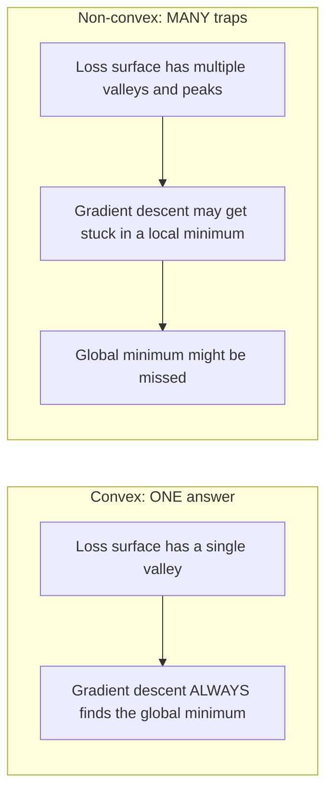
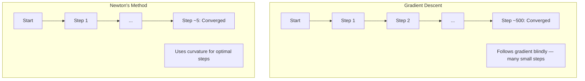
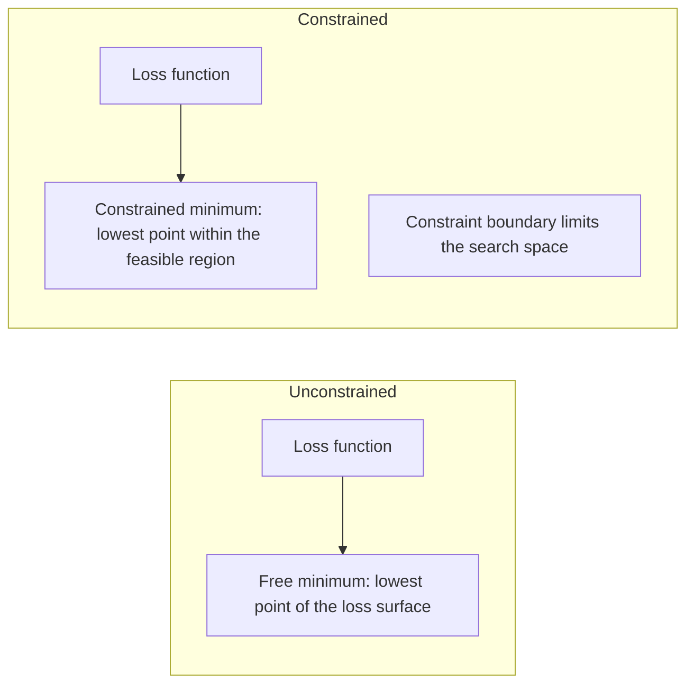
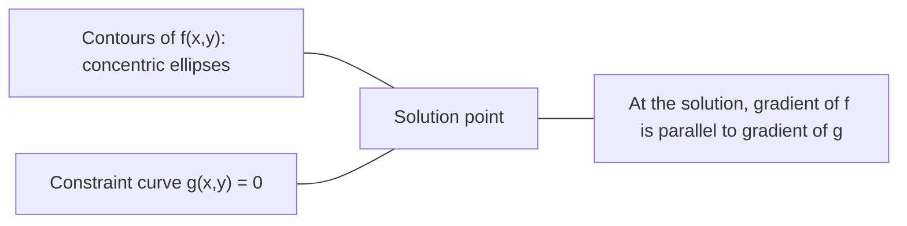

# التكيف المتحقق

> المشاكل الملتوية لديها وادي واحد شبكات عصبية لديها ملايين معرفة الفرق مهم
> المشكلة الكبيرة هي فقط أسفل واحدة.

**Type:** Build | **类型:** 动手
**Language:**" بايثون "**语言:**بايثون
**Prerequisites:** Phase 1, Lessons 04 (Calculus for ML), 08 (Optimization) | **前置知识:** Phase 1, 第 04 课（微积分）、第 08 课（优化）
**Time:** ~90 minutes | **时间:** ~90 分钟

## أهداف التعلم

- اختبار ما إذا كانت الوظيفة متواصلة باستخدام التعريف والمشتق الثاني والمعايير الهسسي
  استخدام تعريف 、二阶导数和 هيسيان 判据测试函数是否为凸函数
- قم بتطبيق طريقة نيوتن ومقارنة التقارب التربيعي له مع تراجع التراجع
  实现牛顿法 (طرق نيوتون)并比较其二次收与梯度下降
- حل مشاكل التحسين المحدود باستخدام مضاعفات لاجرنج وتفسير ظروف KKT
  استخدام لاغلانج يوم乘子(المتضاعفات الكبيرة) طلب حل约束优化问题,解释KKT 条件
- شرح لماذا لا تكون المناظر الطبيعية للخسائر في الشبكات العصبية متواصلة ومع ذلك فإن SGD لا تزال تجد حلول جيدة
  تفسير لماذا فقدان شبكة العصبية غير واضح، ولكن SGD لا يزال يمكن العثور على حل جيد


> **【中文解读】**
> 凸函数只有山谷一个 (全局最优) ، والعودة ال线性 هي من凸的所以一定有全局最优的.

## المشكلة المشكلة المشكلة

درس 08 علمك انخفاض التدفق والزخم، و آدم. هؤلاء المتحفسين يسيرون أسفل على أي سطح. لكنهم يأتون مع عدم وجود ضمانات. انخفاض التدفق على المناظر الطبيعية غير الملتوية قد يقع في الحد الأدنى المحلي السيئ، أو يعلق على نقطة السعد، أو يتذبذب إلى الأبد. استخدمتها على أي حال لأن الشبكات العصبية غير متدفقة وليس هناك بديل.

> 第8 课教你梯度下降、动量和亚当──这些优化器可以在任何表面上下坡──但它们没有保证──在非凸表面上,梯度下降可能陷入差的局部最小值──卡在点 (卡在点) 或永远振荡──你还是使用它,因为神经网络不凸,没有替代方案──

ولكن العديد من المشاكل في التعلم الآلي متواضعة. التراجع الخطوي، التراجع اللوجستي، SVMs، LASSO، التراجع الصخري. بالنسبة لهؤلاء، هناك شيء أقوى: التحسين مع ضمانات رياضية. مشكلة متواضعة لديها وادي واحد بالضبط. أي خوارزمية تسير أسفل التلال سوف تصل إلى الحد الأدنى العالمي. لا حاجة لإعادة التشغيل. لا جدولات معدل التعلم. لا صلاة.

> ولكن العديد من المشاكل في تعلم الآلة هي كثرة.  العودة اللاسيكية  العودة المنطقية  SVM  LASSO  العودة  للعودة.

فهم التخفيف يفعله ثلاثة أشياء. أولاً، فإنه يخبرك عندما تكون مشكلتك سهلة (تخفيف) مقابل صعبة (غير متخفيف). ثانياً، فإنه يمنحك أدوات أسرع مثل طريقة نيوتن للمشاكل المتخففة. ثالثاً، فإنه يفسّر المفاهيم التي تظهر في جميع أنحاء ML: التنظيم كقيض، الثنائيّة في SVMs، ولماذا التعلم العميق يعمل على الرغم من انتهاك كل خصائص لطيفة تعطي لك التخفيف.

> فهم الكمبيوتر له ثلاثة أدوار. أولاً، فإنه يخبرك المشكلة متى تكون سهلة (مثل الكمبيوتر) أو صعبة (مثل غير الكمبيوتر).

## المفهوم الأساسي

> **【中文解读】**
> تشكل وظيفة الكم مثل وعاء واحد فقط نقطة أدنى ((أفضل المجموعة بأكملها)  العودة اللاسلكية  العودة المنطقية  العودة العودة السلكية  وظيفة الخسارة في SVM هي الكم، لذلك التدريب يجب أن يحصل على أفضل المجموعة  شبكة العصبية غير الكم، مثل سلسلة الجبال، ولكن SGD في الممارسة لا تزال يمكن العثور على حل جيد  فهم الكم تعزيز هو فهم "ما هو الوقت الذي يمكن فيه التركيز" 

> **【拓展：凸优化在工业中的实际规模】**
> استخدام نظام ترتيب الإعلانات في جوجل على نطاق واسع للمعلومات والتحديدات، معالجة مليارات الطلبات يوميًا. يتم استخدامها على نطاق واسع في مجال تحليل المعلومات والتحليلات. يمكن أن يُحاول في غضون دقائق قليلة حل مشكلة التخطيط الحقيقي لملايين المتغيرات.

### مجموعات متواصلة

مجموعة S متواصلة إذا كان لكل نقطتين في S، فإن قطاع الخط بينها يقع أيضاً بالكامل في S.

> إذا كان مجموع S بين أي نقطتين بينهما يقع تماماً في S 内، فإن S هو凸集(مجموعة متواصلة)。

| Convex sets | Not convex |
|---|---|
| **Rectangle**: any two points inside can be connected by a line segment that stays inside | **Star/crescent shape**: a line between two interior points can pass outside the set |
| **Triangle**: same property holds for all interior points | **Donut/annulus**: the hole means some line segments leave the set |
| The line segment between any two points stays within the set | The line segment between some pairs of points exits the set |

الاختبار الرسمي: بالنسبة لأي نقاط x و y في S وأي t في [0, 1] ، فإن نقطة tx + (1-t) y هي أيضا في S.

> 形式化测试: بالنسبة ل S وسط أي نقطة x、y 和 [0, 1] وسط أي t, نقطة tx + (1-t) y أيضا في S وسط。

أمثلة على مجموعات متواصلة:
- خط، طائرة، كل R^n
  1 条直线 ∙ 1 平面 ∙ ∙ ∙ ∙ ∙ ∙
- كرة (حلقة، كرة، هائبرسفيرة)
  واحد كرة ((حلقة 球面、超球面)
- نصف مساحة: {x: a^T x <= b}
  半空间: {x: a^T x <= b}
- التقاطع لأي عدد من مجموعات الملتوية
  أي عدد من الكمبيوترات

أمثلة على مجموعات غير متواصلة:
- كعك (أنولوس)
  环面(圆环)
- اتحاد دوائر منفصلة
  两个不相交交的并集
- أي مجموعة مع "دنت" أو "ثقب"
  أي مجموعة من "الغموض" أو "الغموض"

### وظائف متواصلة

وظيفة f متواصلة إذا كانت مجالها مجموعة متواصلة وبالنسبة لأي نقطتين x و y في مجالها وكل t في [0, 1]:

> إذا كان المجال المحدد للعمل f هو المجموعة المحددة، وبالنسبة لمقاطع المجال المحددة المختلفة x、y 和 [0, 1] من أي t:

```
f(tx + (1-t)y) <= t*f(x) + (1-t)*f(y)
```

جغرافيا: القطاع الخطوي بين أي نقطتين على الرسم البياني يقع فوق أو على الرسم البياني.

> 几何上: على الرسم على أي نقطتين بين القطاعين يقع على أعلى الرسم أو على الرسم.

| Property | Convex function | Non-convex function |
|---|---|---|
| **Line segment test** | The line between any two points on the graph lies **above or on** the curve | The line between some points on the graph dips **below** the curve |
| **Shape** | Single bowl/valley curving upward | Multiple peaks and valleys with mixed curvature |
| **Local minima** | Every local minimum is the global minimum | Multiple local minima may exist at different heights |

الوظائف الملتوية المشتركة:
- f(x) = x^2 (المقارنة)
  抛物线
- f(x) = ‬‬‬‬‬‬‬‬‬‬‬‬‬‬‬‬‬‬‬‬‬‬‬‬‬‬‬‬‬‬‬‬‬‬‬‬‬‬‬‬‬‬‬‬‬‬‬‬‬‬‬‬‬‬‬‬‬‬‬‬‬‬‬‬‬‬‬‬‬‬‬‬‬‬‬‬‬‬‬‬‬‬‬‬‬‬‬‬‬‬‬‬‬‬‬‬‬‬‬‬‬‬‬‬‬‬‬‬‬‬‬‬‬‬‬‬‬‬‬‬‬‬‬‬‬‬‬‬‬‬‬‬‬‬‬‬‬‬‬‬‬‬‬‬‬‬‬‬‬‬‬‬‬‬‬‬‬‬‬‬‬‬‬‬‬‬‬‬‬‬‬‬‬‬‬‬‬‬‬‬‬‬‬‬‬‬‬‬‬‬‬‬‬‬‬‬‬‬‬‬‬‬‬‬‬‬‬‬‬‬‬‬‬‬‬‬‬‬‬‬‬‬‬‬‬‬‬‬‬‬‬‬‬‬‬‬‬‬‬‬‬‬‬‬‬‬‬‬‬‬‬‬‬‬‬‬‬‬‬‬‬‬‬‬‬‬‬‬‬‬‬‬‬‬‬‬‬‬‬‬‬‬‬‬‬‬‬‬‬‬‬‬‬‬‬‬‬‬‬‬‬‬‬‬‬‬‬‬‬‬‬‬‬‬‬‬‬‬‬‬‬‬‬‬‬‬‬‬‬‬‬‬‬‬‬‬‬‬‬‬‬‬‬‬‬‬‬‬‬‬‬‬‬‬‬‬‬‬‬‬‬‬‬‬‬‬‬‬‬‬‬‬‬‬‬‬‬‬‬‬‬‬‬‬‬‬‬‬‬‬‬‬‬‬‬‬‬‬‬‬‬‬‬‬‬‬‬‬‬‬‬‬‬‬‬‬‬‬‬‬‬‬‬‬‬‬‬‬‬‬‬‬‬‬‬‬‬‬‬‬‬‬‬‬‬‬‬‬‬‬‬‬‬‬‬‬‬‬‬‬‬‬‬‬‬‬‬‬‬‬‬‬‬‬‬‬‬‬‬‬‬‬‬‬‬‬‬‬‬‬‬‬‬‬‬‬‬‬‬‬‬‬‬‬
   الحد الأقصى
- f(x) = e^x (معدل)
  فانكس
- f(x) = max(0, x) (ReLU، على الرغم من قطعة خطية)
  (رلو)
- f(x) = -log(x) لـ x > 0 (سجل سلبي)
  负对数
- أي وظيفة خطية f ((x) = a^T x + b (كلاً متواصلة ومعقبة)
  أي عمل خطي ((既是凸的也是的)

### اختبار التخثر

ثلاثة اختبارات عملية، من أسهل إلى أكثر صرامة.

> ثلاث أشكال من الاختبارات العملية، من أبسط إلى أكثر صرامة.

**Test 1: Second derivative test (1D).**إذا f'(x) >= 0 لجميع x، ثم f هو متواصل.

> **测试 1：二阶导数测试（一维）。**إذا كان لكل x هناك f'(x) >= 0، ف ف هو كامب

- f(x) = x^2: f'(x) = 2 >= 0. مخروط.
- f(x) = x^3: f''(x) = 6x. سلبي ل x < 0. ليس متواضع.
- f(x) = e^x: f'(x) = e^x > 0. مخطط.

**Test 2: Hessian test (multivariate).**إذا كانت المصفوفة الهسسي H(x) نصف محددة إيجابية لجميع x ، فهي مخففة. المصفوفة الهسسي هي المصفوفة الثانية من المشتقات الجزئية.

> **测试 2：Hessian 测试（多变量）。**إذا كان هيسيان 矩阵 H(x) لكل x كانت نصف صحيحة، ف f هو كامب.

**Test 3: Definition test.**تحقق من عدم المساواة f(tx + (1-t) y) <= t*f(x) + (1-t) *f(y) مباشرة. مفيد للعملات التي يصعب حساب المشتقات.

> **测试 3：定义测试。**直接检查不等式 f(tx + (1-t) y) <= t*f(x) + (1-t) *f(y)。适用于导数难以计算的函数。

### لماذا الارتباط مهم

النظريه المركزية لتحسين الملتوي:

**For a convex function, every local minimum is a global minimum.**

> **对于凸函数，每个局部最小值都是全局最小值。**

هذا يعني أن هبوط التسلسل لا يمكن أن يقع في حجز. أي مسار هبوط يُؤدي إلى نفس الإجابة. يتم ضمان التقارب إلى الحل الأمثل.

> هذا يعني أن التسلسل السلبي لن يُعثر عليه. أي طريق سلبي يذهب إلى نفس الإجابة.

> **【中文解读】**
> هذا هو النظرية الأساسية للتحسين الكم: الحد الأدنى من كل مكان من وظيفة الكم هو الحد الأدنى من كل مكان. وهذا يعني أن تراجع التدرج لن يكون أبدا في "غير" المحلية الحد الأدنى.



النتائج:
- لا حاجة لإعادة تشغيل عشوائي
  لا تحتاج إلى إعادة تشغيل
- لا حاجة إلى جدول أعمال معقدة
  لا تحتاج إلى تعقيدات معقدة
- إثباتات التقارب ممكنة (تعتمد المعدل على خصائص الوظيفة)
  يمكن أن يثبت استحواذ ((سرعة تعتمد على نوعية الوظيفة)
- الحل فريد (حتى المناطق المستقرة)
  解是唯一的(منطقة مسطحة باستثناء)

### المواصلات المواصلة مقابل غير المواصلة في ML

| Problem | Convex? | Why |
|---------|---------|-----|
| Linear regression (MSE) | Yes | Loss is quadratic in weights |
| Logistic regression | Yes | Log-loss is convex in weights |
| SVM (hinge loss) | Yes | Maximum of linear functions |
| LASSO (L1 regression) | Yes | Sum of convex functions is convex |
| Ridge regression (L2) | Yes | Quadratic + quadratic = convex |
| Neural network (any loss) | No | Nonlinear activations create non-convex landscape |
| k-means clustering | No | Discrete assignment step |
| Matrix factorization | No | Product of unknowns |

النماذج الخطية مع الخسائر الملتوية هي الملتوية. في اللحظة التي تضيف فيها طبقات مخفية مع تنشيطات غير خطية، تتوقف الملتوية.

> النموذج الحقيقي الذي يُصاب بخسارة الكم هو الكمبيوتر. بمجرد إضافة الطبقة الخفية التي يتم تنشيطها غير الحقيقى، يتم كسر الكمبيوتر.

### المصفوفة الهيسي

H H H من وظيفة f: R^n -> R هي المصفوفة n x n من المشتقات الجزئية الثانية.

> 函数 f: R^n -> R of Hessian 矩阵 H هو n x n من المرتبة الثانية من المرتبة الثانية من المرتبة الثانية من المرتبة الثانية من المرتبة الثانية من المرتبة الثانية من المرتبة الثانية من المرتبة الثانية من المرتبة الثانية من المرتبة الثانية من المرتبة الثانية من المرتبة الثانية من المرتبة الثانية من المرتبة الثانية من المرتبة الثانية من المرتبة الثانية من المرتبة الثانية من المرتبة الثانية من المرتبة الثانية من المرتبة الثانية من المرتبة الثانية من المرتبة الثانية من المرتبة الثانية من المرتبة الثانية من المرتبة الثانية من المرتبة الثانية من المرتبة الثانية من المرتبة الثانية من المرتبة الثانية من المرتبة الثانية من المرتبة الثانية.

```
H[i][j] = d^2 f / (dx_i dx_j)
```

بالنسبة f ((x, y) = x^2 + 3xy + y^2:

```
df/dx = 2x + 3y       d^2f/dx^2 = 2      d^2f/dxdy = 3
df/dy = 3x + 2y       d^2f/dydx = 3      d^2f/dy^2 = 2

H = [ 2  3 ]
    [ 3  2 ]
```

"الهيسي" يخبرك عن التوتر:
- قيمة خاصة كلها إيجابية: تعمل المادية نحو الأعلى في كل اتجاه (ملتوية في تلك النقطة)
  خصائص قيمة كاملة: وظيفة في كل اتجاه
- القيم الخاصة كلها سلبية: منحنى إلى أسفل في كل اتجاه (مؤثرة، أقصى محلية)
  خصائص قيمة كاملة للخسارة: كل اتجاه都向下曲(的,局部最大值)
- علامات مختلطة: نقطة السرير (تلتوي في بعض الاتجاهات، وتتوي في بعضها)
  混合符号:点 ((بعض الاتجاهات إلى الأعلى曲, الأخرى إلى أسفل)
- القيمة الفردية الصفرة: مسطحة في هذا الاتجاه (تدهور)
  零特征值:该方向平坦(退化)

بالنسبة للخسّة، يجب أن يكون الهيسيّان شبه محدّدًا إيجابيًا (جميع القيم الخاصة >= 0) في كل مكان، وليس فقط في نقطة واحدة.

> بالنسبة للقطاع، يجب أن تكون جميع الصفات في أي مكان نصف صائبة، وليس فقط في نقطة واحدة.

### طريقة نيوتن

يستخدم طريقة نيوتن معلومات من النظام الثاني (الهيسيان). يتناسب مع تقريب مربع في النقطة الحالية ويقفز مباشرة إلى الحد الأدنى من ذلك التربيعي.

> 梯度下降使用一阶段信息(梯度) ―― 牛顿法使用二阶段信息(Hessian) ・・・ انها في النقطة الحالية تناسب مقربة ثانية ، ثم قفز مباشرة إلى الحد الأدنى من هذه الوظيفة الثانية。

```
Update rule:
  x_new = x - H^(-1) * gradient

Compare to gradient descent:
  x_new = x - lr * gradient
```

طريقة نيوتن تحل محل معدل التعلم المتعدد بالهسيان المعاكس. هذا يعدل تلقائيًا حجم الخطوة والاتجاه بناءً على التوتر المحلي.

> 牛顿法用逆赫سي 替代标标量学习率──这根据局部曲率自动调整步长和方向──

> **【拓展：牛顿法在现代 ML 中的实际使用】**
> على الرغم من أن قانون نيوتن غير ممثل في التعلم العميق ، إلا أنه لا يزال في المعلم الكلاسيكي.



المزايا:
- التقارب التربيعي بالقرب من الحد الأدنى (مربع الخطأ في كل خطوة)
  في الحد الأدنى من القيمة القريبة الثانية收(في كل خطوة خطأ مربع درجة تقلص)
- لا معدل تعلم للتنسيق
  无需调节学习率
- متغير النطاق (يعمل بغض النظر عن كيفية تعريف المشكلة)
  尺度不变 ((مهما كان المشكلة في الحد الأدنى))

الإعاقة:
- الحسابات الهسسي تكلفة O  n^2) الذاكرة و O  n^3) للعكس
  计算 Hessian 需要 O(n^2) 内存和 O(n^3) 求逆
- بالنسبة لشبكة عصبية ذات 1 مليون وزن، وهذا هو 10^12 إدخالات و 10^18 عمليات
  بالنسبة لـ 100،000 وزن شبكة عصبية، فهو 10^12 عنصر و 10^18 مرة
- غير مميز للتعلم العميق
  غير مناسب للتعلم العميق

### التحسين المحدود

التحسين غير المقيد: تقليل f ((x) على جميع x.
التحسين المحدود: تقليل f ((x) مع مراعاة القيود.

> 无约束优化: 在所有 x 上最小化 f(x)。约束优化: 在约束条件下最小化 f(x)。

المشكلة الحقيقية لها قيود تريد تقليل التكلفة ولكن ميزانيتك محدودة تريد تقليل الأخطاء ولكن تعقييد النموذج محدود

> المشكلة الحقيقية لها حدود. أنت تريد تقليل التكلفة ولكن الميزانية محدودة. أنت تريد تقليل الأخطاء ولكن تعقييد النموذج له حدود.



### مضاعفات اللجرنج

طريقة مضاعفات لاغرانج تحويل مشكلة مقيدة إلى مشكلة غير مقيدة.

> 拉格朗日乘子法将约束问题转化为无约束问题.

المشكلة: تقليل f ((x) مع حكم g ((x) = 0.

الحل: إدخال متغير جديد (لامبدا مضاعف لاغرانج) وحل مشكلة غير مقيدة:

```
L(x, lambda) = f(x) + lambda * g(x)
```

في الحل، تراجع L هو صفر:

```
dL/dx = df/dx + lambda * dg/dx = 0
dL/dlambda = g(x) = 0
```

الحد الأدنى المحدود، يجب أن يكون تراجع f متوازياً مع تراجع g. إذا لم تكن متوازية، يمكنك التحرك على طول سطح القيود وتقليل f أكثر.

> 几何直觉: في الحد الأدنى من القيمة في الحزم، يجب أن تكون درجة f متساوية مع درجة g في الحزم.



مثال: تقليل f ((x,y) = x^2 + y^2 مع عرض x + y = 1.

```
L = x^2 + y^2 + lambda(x + y - 1)

dL/dx = 2x + lambda = 0  =>  x = -lambda/2
dL/dy = 2y + lambda = 0  =>  y = -lambda/2
dL/dlambda = x + y - 1 = 0

From first two: x = y
Substituting: 2x = 1, so x = y = 0.5, lambda = -1
```

أقرب نقطة على الخط x + y = 1 إلى الأصل هي (0.5، 0.5).

> الخط المباشر x + y = 1 上离原点最近的点是 (0.5, 0.5)。

### شروط الـ KKT

ظروف كاروش-كوهن-توكر تمتد مضاعفات لاجرنج إلى قيود عدم المساواة.

> كيكت 条件(كاروش-كوهن-توكر شروط) سوف لاغلانغ日乘子推广到不等式约束──

المشكلة: تقليل f  x) تحت ضوء g  i  x) <= 0 بالنسبة i = 1 ، ..., m.

ظروف KKT (التي تكون ضرورية لتحقيق التكمل الأمثل):

```
1. Stationarity:    df/dx + sum(lambda_i * dg_i/dx) = 0
2. Primal feasibility:  g_i(x) <= 0  for all i
3. Dual feasibility:    lambda_i >= 0  for all i
4. Complementary slackness:  lambda_i * g_i(x) = 0  for all i
```

التباطل التكميلي هو المفهوم الرئيسي: إما أن القيود نشطة (g_i = 0 ، يجلس الحل على الحدود) أو أن المضاعف هو صفر (لا يهم القيود). القيود التي لا تؤثر على الحل لديها lambda = 0.

> 互补松性(Complementary Slackness)                                                                                                                                                                                                                                                        

ظروف KKT هي مركزية لـ SVM. المتجهات الداعمة هي نقاط البيانات التي يكون فيها القيود نشطًا (lambda > 0). جميع نقاط البيانات الأخرى لها lambda = 0 ولا تؤثر على حدود القرار.

> كيكت 条件是 SVM 支持向量 支持向量 支持向量 支持向量 支持向量 支持向量 支持向量 支持向量 支持向量 支持向量 支持向量 支持向量 支持向量 支持向量 支持向量 支持向量 支持向量 支持向量 支持向量 支持向量 支持向量 支持向量 支持向量 支持向量 支持向量 支持向量 支持向量 支持向量 支持向量 支持向量 支持向量 支持向量 支持向量 支持向量 支持向量 支持向量 支持向量 支持向量 支持向量 支持向量 支持向量 支持向量 支持向量 支持向量 支持向量 支持向量 支持向量 支持向量 支持向量 支持向量 支持向量 支持向量 支持向量 支持向量 支持向量 支持向量 支持 支持向量 支持 支持向量 支持 支持向量 支持 支持 支持 支持 支持 支持 支持 支持 支持 支持 支持 支持 支持 支持 支持 支持 支持 支持 支持 支持 支持 支持 支持 支持 支持 支持 支持 支持 支持 支持 支持 支持 支持 支持 支持 支持 支持 支持 支持 支持 支持 支持 支持 支持 支持 支持 支持 支持 支持 支持 支持 支持 支持 支持 支持 支持 支持 支持 支持 支持 支持 支持 支持 支持 支持 支持 支持 支持 支持 支持 支持 支持 支持 支持 支持 支持 支持 支持 支持 支持 支持 支持 支持 支持 支持 支持 支持 支持 支持 支持 支持 支持 支持 支持 支持 支持 支持 支持 支持 支持 支持 支持 支持 支持 支持 支持 支持 支持 支持 支持 支持 支持 支持 支持 支持 支持 支持 支持 支持 支持 支持 支持 支持 支持 支持 支持 支持 支持 支持 支持

> **【中文解读】**
> ككت 条件是拉格朗日乘子的推广版,处理不等式约束──互补松性 هي أكثر رؤى精妙ة: بالنسبة لكل حزمة، إما أنها "فعالة" 刚好触碰边界) ، أو أنها لا تؤثر على الحل 乘子为零)──

### التنظيم كتحسين محدود

إن تنظيم L1 و L2 ليسوا خدوش تعسفية بل مشاكل تحسين محدودة في التظاهر.

> L1 و L2 الإصلاح ليسوا مهارات متعلقة.

**L2 regularization (Ridge):**

```
minimize  Loss(w)  subject to  ||w||^2 <= t

Equivalent unconstrained form:
minimize  Loss(w) + lambda * ||w||^2
```

القيود في الاضطرابات <= t يحدد كرة (حلقة في 2D، كرة 3D). الحل هو حيث تلمس خطوط الخسارة هذه الكرة أولا.

> 约束 约束 约束 约束 约束 约束 约束 约束 约束 约束 约束 约束 约束 约束 约束 约束 约束 约束 约束 约束 约束 约束 约束 约束 约束 约束 约束 约束 约束 约束 约束 约束 约束 约束 约束 约束 约束 约束 约束 约束 约束 约束 约束 约束 约束 约束 约束 约束 约束 约束 约束 约束 约束 约束 约束 约束 约束 约束 约束 约束 约束 约 约 约 约 约 约 约 约 约 约 约 约 约 约 约 约 约 约 约 约 约 约 约 约 约 约 约 约 约 约 约 约 约 约 约 约 约 约 约 约 约 约 约 约 约 约 约 约 约 约 约 约 约 约 约 约 约 约 约 约 约 约 约 约 约 约 约 约 约 约 约 约 约 约 约                                                                                                                                                                                 

**L1 regularization (LASSO):**

```
minimize  Loss(w)  subject to  ||w||_1 <= t

Equivalent unconstrained form:
minimize  Loss(w) + lambda * ||w||_1
```

القيود التي لا يمكن أن تكون لها <= t تعريف الماس (مربع مدرج في 2D).

> 约束 束 束 束 束 束 束 束 束 束 束 束 束 束 束 束 束 束 束 束 束 束 束 束 束 束 束 束 束 束 束 束  束 束 束 束 束 束 束 束 束 束 束 束 束 束 束 束 束 束 束 束 束 束 束 束 束 束 束 束 束 束 束 束 束 束 束 束 束 束 束 束 束 束 束 束 束 束 束 束 束 束 束 束 束 束 束 束 束 束 束 束 束 束 束 束 束 束 束 束 束 束 束 束 束 束 束 束 束 束 束 束 束 束 束 束 束 束 束 束 束 束 束 束 束 束 束 束 束 束 束 束 束 束 束 束 束 束                                                                                                                                                                                                                                        

| Property | L2 constraint (circle) | L1 constraint (diamond) |
|---|---|---|
| **Constraint shape** | Circle (sphere in higher dims) | Diamond (rotated square in 2D) |
| **Where loss contour touches** | Smooth boundary — any point on the circle | Corner — aligned with an axis |
| **Solution behavior** | Weights are small but nonzero | Some weights are exactly zero (sparse) |
| **Result** | Weight shrinkage | Feature selection |

هذا يفسر لماذا تنتج L1 نماذج نادرة (اختيار الميزات) بينما L2 تقلص فقط من الوزن. الماس لديه زوايا متسلطة مع المحاور. من المرجح أن تلمس خطوط الخسارة زاوية ، مما يضع وزن واحد أو أكثر بالضبط إلى الصفر.

> هذا يفسر لماذا L1  تتمثل في نموذج نادرة (معيارات اختيار) بينما L2 فقط تقلص الوزن.

> **【拓展：L1 正则化与 L2 正则化的几何直觉】**
> L1 束的形状是形(在2D 中是旋转的正方形),L2 束的形状是圆形.束的角恰好落在坐标轴上,所以等高线更容易碰到角这意味着某些权重被精确设置为零 (特征选择) ........................................................................................................................................................................................................................

### الثنائي

كل مشكلة تحسين مقيد (الأولي) لديها مشكلة رفيقة (المتزامن). بالنسبة للمشاكل المتواصلة، فإن الأولي والمتزامن لديهم نفس القيمة المثلى. هذه ثنائية قوية.

> كل مشكلة تحسين القيود (الأولى) لديها مشكلة معتمدة (الأولى)

وظيفة لاجرنجية مزدوجة:

```
Primal: minimize f(x) subject to g(x) <= 0
Lagrangian: L(x, lambda) = f(x) + lambda * g(x)
Dual function: d(lambda) = min_x L(x, lambda)
Dual problem: maximize d(lambda) subject to lambda >= 0
```

لماذا الثنائيات مهمة:
- المشكلة المزدوجة أسهل في بعض الأحيان لحلها من المشكلة الأساسية
  في بعض الأحيان يكون من السهل حل المشاكل المزدوجة أكثر من المشكلة الأصلية
- يتم حل SVM في شكلها المزدوج ، حيث تعتمد المشكلة على منتجات النقاط بين نقاط البيانات (تمكين خدعة النواة)
  في حال تتمكن من حل المشاكل بشكل متكرر، فإن المشكلة تعتمد فقط على نقاط البيانات بين النقاط، بحيث يمكن استخدام التقنيات النووية)
- يقدم المزدوج حدوداً أدناه على المثالي الأولي، مفيدًا للتحقق من جودة الحل
  على بعض أصل أفضل قيمة توفير الحدود السفلية، لتحقيق جودة حل

بالنسبة لـ (SVM) على وجه التحديد:

```
Primal: find w, b that maximize the margin 2/||w|| subject to
        y_i(w^T x_i + b) >= 1 for all i

Dual:   maximize sum(alpha_i) - 0.5 * sum_ij(alpha_i * alpha_j * y_i * y_j * x_i^T x_j)
        subject to alpha_i >= 0 and sum(alpha_i * y_i) = 0

The dual only involves dot products x_i^T x_j.
Replace x_i^T x_j with K(x_i, x_j) to get the kernel trick.
```

### لماذا يتحسن التعلم العميق على الرغم من عدم التواصل

وظائف فقدان الشبكة العصبية غير متواصلة بشكل كبير. من خلال كل قياس كلاسيكي، يجب أن تفشل تحسينها. ومع ذلك، فإن هبوط التراجع الاستوتيكي يجد حلول جيدة بشكل موثوق. العديد من العوامل تفسر هذا.

> وظيفة فقدان شبكة العصبية غير متكاملة. وفقا للنظرية الكلاسيكية، يجب أن تفشل في تحسينها. ولكن مع تراجع التدرج، وجدت حلًا موثوقًا.

**Most local minima are good enough.**في المساحات العالية الأبعاد، النقاط الحرجة العشوائية (حيث يكون التراجع صفر) هي نقاط القيادة بشكل ساحق، وليس الحد الأدنى المحلي. القليل من الحد الأدنى المحلي الموجودة تميل إلى أن يكون لها قيم الخسارة القريبة من الحد الأدنى العالمي. فمن غير المرجح للغاية أن تكون عالقة في الحد الأدنى المحلي الفظيع عندما يكون مساحة المعلمات مليوني أبعاد.

> **大多数局部最小值都足够好。**في الفضاء العالي، فإن النقاط الحد الأدنى (بالإنجليزية: Ascendance Critical Point) هي النقاط الأكبر، وليس القيمة الحد الأدنى المحلية.

**Saddle points, not local minima, are the real obstacle.**في وظيفة مع n معايير، نقطة السرير لديها مزيج من اتجاهات التوتر الإيجابية والسلبية. بالنسبة لمكانة حرجة عشوائية في أبعاد عالية، فإن احتمال أن تكون جميع القيم الخاصة n إيجابية (الأقل من المحلي) هو حوالي 2 ^ - n. تقريبا جميع النقاط الحرجة هي نقاط السرير. ضجيج SGD يساعد على تفاديهم.

> **鞍点而非局部最小值才是真正的障碍。**في وظائف معظمها، تكون النقاط ذات اتجاهات من التوتر الصائب السلبي. بالنسبة للنقاط الحادية في الارتفاع، فإن احتمال وجود جميع النقاط الحادية في الارتفاع هو 2^(-n) تقريبًا.

**Overparameterization smooths the landscape.**شبكات ذات ملامح أكثر من أمثلة التدريب لديها أسطح الخسارة أكثر سلاسة، والمزيد من الاتصال. شبكات أوسع لديها أدنى الحد الأدنى المحلي السيئ. هذا غير بديهي ولكن ثابت تجريبيا.

> **过参数化（Overparameterization）使损失面更平滑。**参数多于训练样本网络具有更平滑,更连接的损失面. 较宽的网络具有更少的坏局部最小值.

**Loss landscape structure:**

| Property | Low-dimensional space | High-dimensional space |
|---|---|---|
| **Landscape** | Many isolated peaks and valleys | Smoothly connected valleys |
| **Minima** | Many isolated local minima | Few bad local minima; most are near-optimal |
| **Navigation** | Hard to find global minimum | Many paths lead to good solutions |
| **Critical points** | Mix of local minima and saddle points | Overwhelmingly saddle points, not local minima |

**Stochastic noise acts as implicit regularization.**تضيف SGD الارتباطات الصغيرة الضجيج الذي يمنع الاستقرار في الحد الأدنى الحاد. الحد الأدنى الحاد يزيد من التكيف؛ الحد الأدنى السطح يعملي. التحيز الضجيج تحسين نحو المناطق السطحية لمشهد الخسائر.

> **随机噪声充当隐式正则化。**المجموعة الصغيرة SGD 添加的噪音防止陷入尖的极小值──尖极小值过适应;平坦极小值泛化好──噪声使优化偏向损失面的平坦区域──

> **【中文解读】**
> يبدو نجاح التعلم العميق مخالفًا لنظرية تحسين الكم: يجب أن تكون وظائف غير الكم صعبة التحسين ، ولكن SGD تعمل بشكل جيد. هناك ثلاثة أسباب: أولاً ، في الفضاء العالي ، تكون جميع النقاط الحددية تقريبًا نقطة الحد الأدنى وليس القيمة المحلية ؛ ثانياً ، فإن التفاصيل العالية تجعل الخسارة المضادة أكثر سلاسة ؛ وثالثًا ، فإن ضجيج SGD يشكل تحديدًا خفيًا ، ويساعد على الهروب من القيمة الحد الأدنى ، ويعثر على حل أفضل من التفاصيل العالية.

### أساليب النظام الثاني في الممارسة العملية

طريقة نيوتن النقية غير عملية للنماذج الكبيرة. العديد من التقارير تجعل المعلومات من الدرجة الثانية قابلة للاستخدام.

> لا يستخدم قانون نيوتون المباشر للنموذج الكبير.

**L-BFGS (Limited-memory BFGS):**تقترب من الهسسيان العكسي باستخدام آخر m اختلافات تراجيع. يتطلب O(mn) الذاكرة بدلا من O(n^2). يعمل بشكل جيد للمشاكل التي تصل إلى ~ 10,000 ملامح. يستخدم في ML الكلاسيكية (التراجع اللوجستي ، CRFs) ولكن ليس التعلم العميق.

> **L-BFGS：**استخدام الحديثة m 个梯度差近似逆赫西亚语──需要 O(mn) 内存而不是 O(n^2)──适用于最多大约 10,000 个参数问题──用于经典ML(逻辑归归、CRF) 但不用于深度学习──

**Natural gradient:**يستخدم مصفوفة معلومات فيشر (الهيسيان المتوقع من احتمالات التسجيل) بدلاً من المصفوفة المعتادة. هذا يعطي حساب لجيومétrي توزيعات الاحتمالات. K-FAC (Kronecker-Factored Approximate Curvature) يقترب من مصفوفة فيشر كمنتج كروينكر ، مما يجعلها عملية للشبكات العصبية.

> **自然梯度（Natural Gradient）：**استخدام فيشر 信息矩阵(对数似然的期望Hessian) بديل المعيار هessian。 هذا يأخذ بعين الاعتبار الاحتمالات التوزيعية الهندسة‬‬‬‬‬‬‬‬‬‬‬‬‬‬‬‬‬‬‬‬‬‬‬‬‬‬‬‬‬‬‬‬‬‬‬‬‬‬‬‬‬‬‬‬‬‬‬‬‬‬‬‬‬‬‬‬‬‬‬‬‬‬‬‬‬‬‬‬‬‬‬‬‬‬‬‬‬‬‬‬‬‬‬‬‬‬‬‬‬‬‬‬‬‬‬‬‬‬‬‬‬‬‬‬‬‬‬‬‬‬‬‬‬‬‬‬‬‬‬‬‬‬‬‬‬‬‬‬‬‬‬‬‬‬‬‬‬‬‬‬‬‬‬‬‬‬‬‬‬‬‬‬‬‬‬‬‬‬‬‬‬‬‬‬‬‬‬‬‬‬‬‬‬‬‬‬‬‬‬‬‬‬‬‬‬‬‬‬‬‬‬‬‬‬‬‬‬‬‬‬‬‬‬‬‬‬‬‬‬‬‬‬‬‬‬‬‬‬‬‬‬‬‬‬‬‬‬‬‬‬‬‬‬‬‬‬‬‬‬‬‬‬‬‬‬‬‬‬‬‬‬‬‬‬‬‬‬‬‬‬‬‬‬‬‬‬‬‬‬‬‬‬‬‬‬‬‬‬‬‬‬‬‬‬‬‬‬‬‬‬‬‬‬‬‬‬‬‬‬‬‬‬‬‬‬‬‬‬‬‬‬‬‬‬‬‬‬‬‬‬‬‬‬‬‬‬‬‬‬‬‬‬‬‬‬‬‬‬‬‬‬‬‬‬‬‬‬‬‬‬‬‬‬‬‬‬‬‬‬‬‬‬‬‬‬‬‬‬‬‬‬‬‬‬‬‬‬‬‬‬‬‬‬‬‬‬‬‬‬‬‬‬‬‬‬‬‬‬‬‬‬‬‬‬‬‬‬‬‬‬‬‬‬‬‬‬‬‬‬‬‬‬‬‬‬‬‬‬‬‬‬‬‬‬‬‬‬‬‬‬‬‬‬‬‬‬‬‬‬‬‬‬‬‬‬‬‬‬‬‬‬‬‬‬

**Hessian-free optimization:**يستخدم التراجع المشترك لحل Hx = g دون أن تشكل H. يتطلب فقط منتجات المتجهة الهسسي، والتي يمكن تحديدها في وقت O ((n) عن طريق التمييز الآلي.

> **无 Hessian 优化：**استخدام 梯度求解 Hx = g 而无需形成 H──只需要 Hessian-向量乘积,可通过自动微分在 O(n) 时间内计算──

**Diagonal approximations:**اللحظة الثانية لآدم هي تقارب متقطع مع متقطع هيسيان. يمتد AdaHessian هذا باستخدام عناصر متقطع هيسيان الفعلية عبر مقياس هاتشينسون.

> **对角近似：**المرحلة الثانية من آدم هي هيسيان على الزاوية على الزاوية لتقريب الزاوية على خطوطها.

| Method | Memory | Per-step cost | When to use |
|--------|--------|--------------|-------------|
| Gradient descent | O(n) | O(n) | Baseline, large models |
| Newton's method | O(n^2) | O(n^3) | Small convex problems |
| L-BFGS | O(mn) | O(mn) | Medium convex problems |
| Adam | O(n) | O(n) | Deep learning default |
| K-FAC | O(n) | O(n) per layer | Research, large-batch training |

## بناء ذلك تحرك لتحقيق
```figure
convex-vs-nonconvex
```

## بناءها

### الخطوة الأولى: فحص التوتر

بناء وظيفة التي تختبر التخفيف تجريبيا عن طريق أخذ عينات من نقاط وتحقق من التعريف.

> 构建一个函数,通过采样点并检查定义来经验性地测试凸性。

```python
import random
import math

def check_convexity(f, dim, bounds=(-5, 5), samples=1000):
    violations = 0
    for _ in range(samples):
        x = [random.uniform(*bounds) for _ in range(dim)]  # 随机采样点 x
        y = [random.uniform(*bounds) for _ in range(dim)]  # 随机采样点 y
        t = random.uniform(0, 1)                            # 随机混合系数
        mid = [t * xi + (1 - t) * yi for xi, yi in zip(x, y)]  # 凸组合 tx + (1-t)y
        lhs = f(mid)                                        # f(凸组合)
        rhs = t * f(x) + (1 - t) * f(y)                    # tf(x) + (1-t)f(y)
        if lhs > rhs + 1e-10:                               # 违反凸性不等式
            violations += 1
    return violations == 0, violations
```

### الخطوة الثانية: طريقة نيوتن للثانية

قم بتطبيق طريقة نيوتن باستخدام هسيان صريح. قارن سرعة التقارب مع انخفاض التراجع.

> استخدام واضحة هيسينية لتحقيق قانون نيوتون.

```python
def newtons_method(f, grad_f, hessian_f, x0, steps=50, tol=1e-12):
    x = list(x0)
    history = [x[:]]
    for _ in range(steps):
        g = grad_f(x)
        H = hessian_f(x)
        det = H[0][0] * H[1][1] - H[0][1] * H[1][0]
        if abs(det) < 1e-15:
            break
        H_inv = [
            [H[1][1] / det, -H[0][1] / det],
            [-H[1][0] / det, H[0][0] / det],
        ]
        dx = [
            H_inv[0][0] * g[0] + H_inv[0][1] * g[1],
            H_inv[1][0] * g[0] + H_inv[1][1] * g[1],
        ]
        x = [x[0] - dx[0], x[1] - dx[1]]
        history.append(x[:])
        if sum(gi ** 2 for gi in g) < tol:
            break
    return history
```

### الخطوة الثالثة: محلل مضاعف اللجرنج

حل التحسين المحدود باستخدام انخفاض التدرج على لغرانجي.

> استخدام تراجعة على وظيفة لاغلانغ دن أسفل

```python
def lagrange_solve(f_grad, g_val, g_grad, x0, lr=0.01,
                   lr_lambda=0.01, steps=5000):
    x = list(x0)
    lam = 0.0
    history = []
    for _ in range(steps):
        fg = f_grad(x)
        gv = g_val(x)
        gg = g_grad(x)
        x = [
            xi - lr * (fgi + lam * ggi)
            for xi, fgi, ggi in zip(x, fg, gg)
        ]
        lam = lam + lr_lambda * gv
        history.append((x[:], lam, gv))
    return history
```

### الخطوة الرابعة: مقارنة النظام الأول والنظام الثاني

أستخدم طريقة نيوتن على نفس المرتبة، و أعد الخطوات إلى التقارب

```python
def quadratic(x):
    return 5 * x[0] ** 2 + x[1] ** 2

def quadratic_grad(x):
    return [10 * x[0], 2 * x[1]]

def quadratic_hessian(x):
    return [[10, 0], [0, 2]]
```

طريقة نيوتن سوف تتحرك في خطوة واحدة (إنها دقيقة بالنسبة إلى التربيعية). سيقوم التنزل التدريجي بمئات الخطوات لأن القيم الخاصة لـ Hessian تختلف بمعدل 5 ، مما يخلق واديًا مُطولًا.

> 牛顿法 سوف تستقبل في 1 خطوة (للموظف الثاني هو دقيقة)  تدفئة انخفاض تحتاج إلى مئات الخطوات، لأن اختلاف قيمة الخصائص في هيسيان 5 مرات، شكلت وادي صغيرة طويلة 

## استخدمها في إطار التنفيذ

تحليل التخثر ينطبق مباشرة عند اختيار نماذج وموصلات ML.

> تحليل المكالمات المستخدمة في اختيار نموذجات ومواد تحليلات المكالمات المستخدمة مباشرة

بالنسبة للمشاكل المتعثرة (التراجع اللوجستي، SVMs، LASSO):
- استخدام حلول مخصصة (liblinear، CVXPY، scipy.optimize.minimize مع طريقة='L-BFGS-B')
  استخدام محركات البحث الخاصة
- توقع حل عالمي فريد
  期望唯一全局解
- أساليب النظام الثاني عملية و سريعة
  2 مرحلة طريقة عملية وسرعة

بالنسبة للمشاكل غير الملتوية (شبكات عصبية):
- استخدام أساليب النظام الأول (SGD، آدم)
  استخدام طريقة
- اقبل أن الحل يعتمد على البداية والتصوير عشوائي
  الاعتراف بالانطلاق والانقطاع
- استخدام المقاييس المفرطة، الضوضاء، وخطوط جدول معدل التعلم كتنظيم ضمني
  استخدام المعايير، الضوضاء وتحديد معدل التعلم كإحداثية
- لا تضيعوا الوقت في البحث عن الحد الأدنى العالمي. الحد الأدنى المحلي الجيد يكفي.
  لا تضيعي الوقت في البحث عن الحد الأدنى للقسم الكامل.

```python
from scipy.optimize import minimize

result = minimize(
    fun=lambda w: sum((y - X @ w) ** 2) + 0.1 * sum(w ** 2),
    x0=np.zeros(d),
    method='L-BFGS-B',
    jac=lambda w: -2 * X.T @ (y - X @ w) + 0.2 * w,
)
```

بالنسبة لـ SVM، يسمح لك الصيغة المزدوجة باستخدام خدعة النواة:

> بالنسبة لـ SVM، بالنسبة لـ "شكل" يمكنك استخدام "ممارسة النووية"

```python
from sklearn.svm import SVC

svm = SVC(kernel='rbf', C=1.0)
svm.fit(X_train, y_train)
print(f"Support vectors: {svm.n_support_}")
```

## تمارين التدريب

1. **Convexity gallery.**اختبر هذه الوظائف من أجل التخفيف باستخدام المحقق: f(x) = x^4, f(x) = sin(x), f(x,y) = x^2 + y^2, f(x,y) = x*y, f(x) = max(x, 0). شرح لماذا كل نتيجة منطقية.

2. **Newton vs gradient descent race.**قم بتشغيل كلا الطرق على f ((x,y) = 50*x^2 + y^2 من نقطة البداية (10, 10). كم عدد الخطوات التي تحتاجها كل واحدة لتحقيق الخسارة < 1e-10؟ ماذا يحدث للنحو التنحدر عندما يزداد عدد الحالة (النسبة من أكبر إلى أصغر قيمة خاصة هيسيان) ؟

3. **Lagrange multiplier geometry.**الحد الأدنى من f ((x,y) = (x-3)^2 + (y-3)^2 تخضع لـ x + 2y = 4. التحقق من الحل عن طريق التحقق من أن تراجع f متوازيا مع تراجع g في الحل.

4. **Regularization constraint.**تنفيذ تحسين مقيد L1: تقليل (x-3)^2 + (y-2)^2 موضوعًا لـ ‬x ‬ ‬ ‬ ‬ ‬ ‬ ‬ ‬ ‬ ‬ ‬ ‬ ‬ ‬ ‬ ‬ ‬ ‬ ‬ ‬ ‬ ‬ ‬ ‬ ‬ ‬ ‬ ‬ ‬ ‬ ‬ ‬ ‬ ‬ ‬ ‬ ‬ ‬ ‬ ‬ ‬ ‬ ‬ ‬ ‬ ‬ ‬ ‬ ‬ ‬ ‬ ‬ ‬ ‬ ‬ ‬ ‬ ‬ ‬ ‬ ‬ ‬ ‬ ‬ ‬ ‬ ‬ ‬ ‬ ‬ ‬ ‬ ‬ ‬ ‬ ‬ ‬ ‬ ‬ ‬ ‬ ‬ ‬ ‬ ‬ ‬ ‬ ‬ ‬ ‬ ‬ ‬ ‬ ‬ ‬ ‬ ‬ ‬ ‬ ‬ ‬ ‬ ‬ ‬ ‬ ‬ ‬ ‬ ‬ ‬ ‬ ‬ ‬ ‬ ‬ ‬ ‬ ‬ ‬ ‬ ‬ ‬ ‬ ‬ ‬ ‬ ‬ ‬ ‬ ‬ ‬ ‬ ‬ ‬ ‬ ‬ ‬ ‬ ‬ ‬ ‬ ‬ ‬ ‬ ‬ ‬ ‬ ‬ ‬ ‬ ‬ ‬ ‬ ‬ ‬ ‬ ‬ ‬ ‬ ‬ ‬ ‬ ‬ ‬ ‬ ‬ ‬ ‬ ‬ ‬ ‬ ‬ ‬ ‬ ‬ ‬ ‬ ‬ ‬ ‬ ‬ ‬ ‬ ‬ ‬ ‬ ‬ ‬ ‬ ‬ ‬ ‬ ‬ ‬ ‬ ‬ ‬ ‬ ‬ ‬ ‬ ‬ ‬ ‬ ‬ ‬ ‬ ‬ ‬ ‬ ‬ ‬ ‬ ‬ ‬ ‬ ‬ ‬ ‬ ‬ ‬ ‬ ‬ ‬ ‬ ‬ ‬ ‬ ‬ ‬ ‬ ‬ ‬ ‬ ‬ ‬ ‬ ‬ ‬ 

5. **Hessian eigenvalue analysis.**احسب Hessian من وظيفة روزنبروك في (1,1) و (-1,1). احسب القيم الخاصة في كلا النقاط. ماذا تخبرك القيم الخاصة عن التوتر في الحد الأدنى مقابل بعيدا عنه؟

## شروط الرئيسية

| Term | What it means |
|------|---------------|
| Convex set | A set where the line segment between any two points in the set stays inside the set |
| Convex function | A function where the line between any two points on its graph lies above or on the graph. Equivalently, Hessian is positive semidefinite everywhere |
| Local minimum | A point lower than all nearby points. For convex functions, every local minimum is the global minimum |
| Global minimum | The lowest point of a function over its entire domain |
| Hessian matrix | The matrix of all second partial derivatives. Encodes curvature information |
| Positive semidefinite | A matrix whose eigenvalues are all non-negative. The multidimensional analogue of "second derivative >= 0" |
| Condition number | Ratio of largest to smallest eigenvalue of the Hessian. High condition number means elongated valleys and slow gradient descent |
| Newton's method | Second-order optimizer that uses the inverse Hessian to determine step direction and size. Quadratic convergence near the minimum |
| Lagrange multiplier | A variable introduced to convert a constrained optimization problem into an unconstrained one |
| KKT conditions | Necessary conditions for optimality with inequality constraints. Generalize Lagrange multipliers |
| Complementary slackness | At the solution, either a constraint is active or its multiplier is zero. Never both nonzero |
| Duality | Every constrained problem has a companion dual problem. For convex problems, both have the same optimal value |
| Strong duality | Primal and dual optimal values are equal. Holds for convex problems satisfying Slater's condition |
| L-BFGS | Approximate second-order method that stores the last m gradient differences instead of the full Hessian |
| Saddle point | A point where the gradient is zero but it is a minimum in some directions and a maximum in others |
| Overparameterization | Using more parameters than training examples. Smooths the loss landscape and reduces bad local minima |

## المزيد من القراءة

- [Boyd & Vandenberghe: Convex Optimization](https://web.stanford.edu/~boyd/cvxbook/)- الكتب المدرسية القياسية، متوفرة مجانًا على الإنترنت
- [Bottou, Curtis, Nocedal: Optimization Methods for Large-Scale Machine Learning (2018)](https://arxiv.org/abs/1606.04838)- الجسور نظرية التحسين الملتوية وممارسة التعلم العميق
- [Choromanska et al.: The Loss Surfaces of Multilayer Networks (2015)](https://arxiv.org/abs/1412.0233)- لماذا لا تكون المناظر الطبيعية الشبكة العصبية الملتوية سيئة كما تبدو
- [Nocedal & Wright: Numerical Optimization](https://link.springer.com/book/10.1007/978-0-387-40065-5)- إشارة شاملة لنهج نيوتن، L-BFGS، وتحسين القيود
