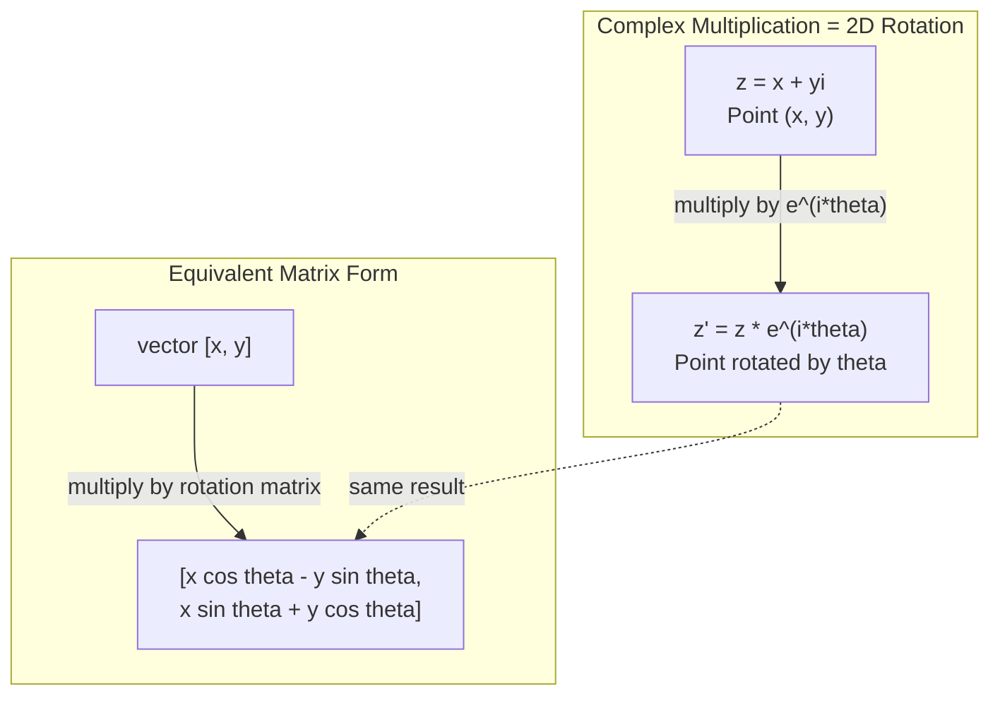
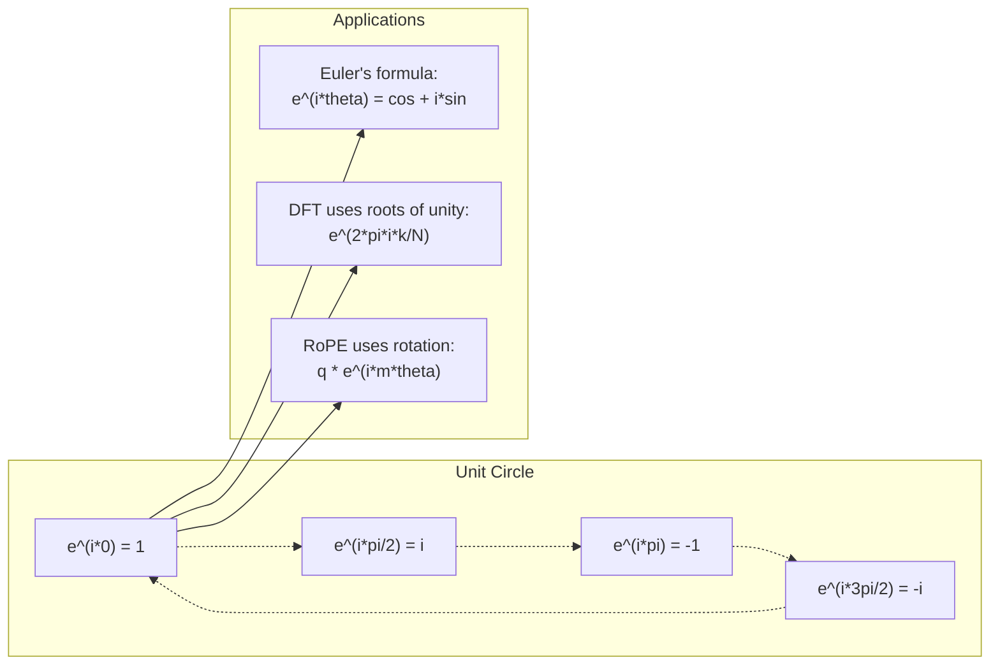

# أرقام معقدة لـ AI

> الجذر التربيعي من -1 ليس خيالي. إنه مفتاح التناوبات، والترددات، ونصف معالجة الإشارات.
> الجذر التربيعي للـ -1 ليس "الفائض" . إنه مفتاح مجال التدوير والتكثيف ونصف معالجة الإشارات.

**Type:** Learn | **类型:** 学习
**Language:**" بايثون "**语言:**بايثون
**Prerequisites:** Phase 1, Lessons 01-04 (linear algebra, calculus) | **前置知识:** Phase 1, 第 01-04 课（线性代数、微积分）
**Time:** ~60 minutes | **时间:** ~60 分钟

## أهداف التعلم

- أداء الحسابات المعقدة (اضافة، مضاعفة، تقسيم، مضافية) في كل من الشكل المستطيل والقطبي
  执行复数运算(加、乘、除、共), بما في ذلك رسم الحرف المباشر ووضع الحرف المباشر
- تطبيق صيغة أولر لتحويل بين المعارض المعقدة والظروف الثلاثية
  应用欧拉公式在复指数和三角函数之间转换
- تنفيذ تحويل فوريه المميز باستخدام جذور معقدة من الوحدة
  استخدام الوحدة للقيام بالتغييرات
- شرح كيفية الدوران المعقدة التي تتمثل في رمزات المواقع الصناعية في المتحولات
   شرح عدد الدوران كيفية تشكيل روبي و محول 正弦位置编码的基础


> **【中文解读】**
> 虚数 i هو مفتاح الدوران والتكثيف.                                                                                                                                                                                                                                                        

## المشكلة المشكلة المشكلة

فتحت ورقة حول تحويلات فوريير وهناك`i`في كل مكان. تنظر إلى ترانسفورمات التشفير الموضعي وترى`sin`و`cos`في ترددات مختلفة -- الأجزاء الحقيقية والخيالية من المكثفات المعقدة.

> افتتح مقال حول التغييرات التي حدثت في العالم`i`✿ أنت ترى محول  موقع                                                                                                                                                                                                                                                                                                                                                                                                                                                                                                                      `sin`和 `cos`هي جزء حقيقي و جزء حقيقي من المعدلات الكمية.

يبدو الأرقام المعقدة مجردة. يبدو أن نظام الأرقام المبني على الجذر التربيعي من -1 يبدو مثل خدعة رياضية. لكنه ليس خدعة. إنه اللغة الطبيعية للدورات والتذبذب. في كل مرة تدور فيها شيء أو تتأرجح أو تتذبذب، الأرقام المعقدة هي الأداة الصحيحة.

> يبدو عدد الـ2 مجردة. يعتمد على الجذر التربيعي من -1 يشبه اللعبة الرياضية. لكنه ليس اللعبة. إنه لغة طبيعية للدوار والزنجان.

بدون فهم الأرقام المعقدة، لا يمكنك فهم تحويل فوريه المختلف. لا يمكنك فهم FFT. لا يمكنك فهم كيفية عمل RoPE (إدراج الموقف المتحرك) في نماذج اللغة الحديثة. لا يمكنك فهم لماذا تشفيرات الموقف السينوسيدال في ورقة المحول الأصلية تستخدم تردداتها.

> غير مفهومة، أنت لا تستطيع فهم الانفصال 里叶变换(DFT) ―― لا تستطيع فهم FFT── لا تستطيع فهم RoPE(旋转位置编码)

هذه الدروس تبني الرياضيات المعقدة من الصفر، وتربطها بالهندسة، وتريك بالضبط أين تظهر الأرقام المعقدة في التعلم الآلي.

> هذا الدروس من الصفر تشكيل عدد النظم، وتربطها مع الجيوهوم، ويدل على تحديد مكانة عدد النظم التي تظهر في التعلم الآلي.

## المفهوم الأساسي

> **【中文解读】**
> النظرية الأساسية للعدد: هو ليس "虚" ، إنه عملية دوران 90 درجة.

> **【拓展：复数在 AI 中的实际应用规模】**
> مجموعة LLaMA من OpenAI GPT-4、Meta LLaMA 系列都使用RoPE(Rotary Position Embedding),本质上是复数旋转。 لكل توجه على الموقع编码执行复数乘法。 بالنسبة لـ LLaMA-2-70B(80 个注意力头,序列长度 4096),每步推理执行数百万次复数旋转──音频 AI 领域(如 OpenAI Whisper) يعتمد على FFT(快速里叶变),所有计算都完成在复数域──

### ما هو الرقم المعقد؟

عدد معقد يحتوي على جزءين: جزء حقيقي و جزء خيالي.

> 复数有两部分:实部(الجزء الحقيقي) و虚部(الجزء الخيالي)

```
z = a + bi

where:
  a is the real part
  b is the imaginary part
  i is the imaginary unit, defined by i^2 = -1
```

هذا هو الأمر. تمد خط الأعداد إلى مستوى. الأرقام الحقيقية تقع على محور واحد. الأرقام الخيالية تقع على الآخر. كل عدد معقد هو نقطة في هذا المستوى.

> هذا هو الحال. أنت تضع العدد على محور يمتد إلى مسطح واحد. العدد الحقيقي على محور واحد. العدد الفعلي على محور آخر. كل عدد عقد هو نقطة على هذه المسطح.

### الحساب المعقد

**Addition.**أضف الأجزاء الحقيقية معاً، أضف الأجزاء الخيالية معاً.

> **加法。**实部相加,虚部相加.

```
(a + bi) + (c + di) = (a + c) + (b + d)i

Example: (3 + 2i) + (1 + 4i) = 4 + 6i
```

**Multiplication.**استخدم قانون التوزيع وتذكر أن i^2 = -1.

> **乘法。**استخدام قانون التوزيع، تذكر ان i^2 = -1

```
(a + bi)(c + di) = ac + adi + bci + bdi^2
                 = ac + adi + bci - bd
                 = (ac - bd) + (ad + bc)i

Example: (3 + 2i)(1 + 4i) = 3 + 12i + 2i + 8i^2
                            = 3 + 14i - 8
                            = -5 + 14i
```

**Conjugate.**أعدّ علامة الجزء الخيالي

> **共轭（Conjugate）。**翻转虚部的符号──

```
conjugate of (a + bi) = a - bi
```

إن نسبة عدد معقد ومجموعه هو دائمًا حقيقي:

> عدد و عدد المشترك هو عدد حقيقي:

```
(a + bi)(a - bi) = a^2 + b^2
```

**Division.**مضاعفة العداد والسماسرة بموجب المكونات من السماسرة.

> **除法。**分子和分母同时乘以分母的共──

```
(a + bi) / (c + di) = (a + bi)(c - di) / (c^2 + d^2)
```

هذا يزيل الجزء الخيالي من المُعنى، مما يعطي رقمًا معقدًا نظيفًا.

> هذا يزيل الجزء الخاطئ في المجموعة، والحصول على عدد نظيف من العدد.

### الطائرة المعقدة

الطائرة المعقدة ترسم كل رقم معقد إلى نقطة ثنائية الأبعاد. المحور الأفقي هو المحور الحقيقي، والمحور الرأسي هو المحور الخيالي.

> 复平面将每复数映射为2D点──水平轴是实轴,垂直轴是虚轴──

```
z = 3 + 2i  corresponds to the point (3, 2)
z = -1 + 0i corresponds to the point (-1, 0) on the real axis
z = 0 + 4i  corresponds to the point (0, 4) on the imaginary axis
```

عدد معقد هو في نفس الوقت نقطة و متجه من الأصل. هذا التفسير المزدوج هو ما يجعل الأرقام المعقدة مفيدة للجيومétrie.

> 复数同时是一个 نقطة و من النقطة الأصلية الناشئة للقطر. هذا التفسير المزدوج يجعل عدد العدد مفيد جدا في الهندسة.

### شكل قطبي

يمكن وصف أي نقطة في المسطح عن طريق مسافةها من المنشأ و زاويته من المحور الحقيقي الإيجابي.

> يمكن وصف أي نقطة في المسطح باستخدام مسافة نقطة الأصل إلى نقطة الأصل و زاوية المحور الحقيقي.

```
z = r * (cos(theta) + i*sin(theta))

where:
  r = |z| = sqrt(a^2 + b^2)     (magnitude, or modulus)
  theta = atan2(b, a)             (phase, or argument)
```

الشكل المستقيم (a + bi) جيد للجمع. الشكل القطبي (r، theta) جيد للضرب.

> 直角坐标形式 (a + bi) 适合加法。极坐标形式 (r, theta) 适合乘法。

**Multiplication in polar form.**ضرب الكبيرة، أضف الزوايا.

> **极坐标形式的乘法。**模相乘,角相加♪

```
z1 = r1 * e^(i*theta1)
z2 = r2 * e^(i*theta2)

z1 * z2 = (r1 * r2) * e^(i*(theta1 + theta2))
```

هذا هو السبب في أن الأرقام المعقدة مثالية للدورات. مضاعفة عدد معقد مع الحجم 1 هو دوران نقي.

> هذا هو السبب في أن عدد المعدلات مناسب تماما للدوار.

### صيغة أولر

الجسر بين المكثفين المعقدين والتغنومترية:

> الجسر بين 复指数 و三角函数:

```
e^(i*theta) = cos(theta) + i*sin(theta)
```

هذه هي أهم صيغة في هذه الدروس عندما يكون ثيتا = بي:

> هذه هي أهم الصيغة في هذا الصف:

```
e^(i*pi) = cos(pi) + i*sin(pi) = -1 + 0i = -1

Therefore: e^(i*pi) + 1 = 0
```

خمسة ثابتات أساسية (e، i، pi، 1, 0) مرتبطة في معادلة واحدة.

> خمسة أساسيات عادية ((e、i、pi、1、0)统一在一个方程中。

### لماذا صيغة أويلر مهمة ل ML

صيغة (أولر) تقول ذلك`e^(i*theta)`تتبع دائرة الوحدة كما يتغير ثيتا. عند ثيتا = 0 ، أنت في (1, 0). عند ثيتا = بي / 2 ، أنت في (0, 1). عند ثيتا = بي ، أنت في (-1, 0). عند ثيتا = 3 * بي / 2 ، أنت في (0, -1).

> 欧拉公式说 `e^(i*theta)`随 变化描绘单位圆──theta = 0 时在 (1, 0)──theta = pi/2 时在 (0, 1)──theta = pi 时在 (-1, 0)──theta = 3*pi/2 时在 (0, -1)──完整旋转是 theta = 2*pi。

هذا يعني أن المُعَدّيات المعقدة هي دورانات، والدورات موجودة في كل مكان في معالجة الإشارات و ML.

> هذا يعني أن المعدل الثاني هو التدوير.

> **【中文解读】**
> 欧拉公式 e^(i*theta) = cos(theta) + i*sin(theta) هي أهم公式 فى هذا الصف. . . . . . . . . . . . . . . . . . . . . . . . . . . . . . . . . . . . . . . . . . . . . . . . . . . . . . . . . . . . . . . . . . . . . . . . . . . . . . . . . . . . . . . . . . . . . . . . . . . . . . . . . . . . . . . . . . . . . . . . . . . . . . . . . . . . . . . . . . . . . . . . . . . . . . . . . . . . . . . . . . . . . . . . . . . . . . . . . . . . . . . . . . . . . . . . . . . . . . . . . . . . . . . . . . . . . . . . . . . . . . . . . . . . . . . . . . . . . . . . . . . . . . . . . . . . . . . . . . . . . . . . . . . . . . . . . . . . . . . . . . . . . . . . . . . . . . . . . . . . . . . . . . . . . . . . . . . . . . . . . . . . . . . . . . . . . . . . . . . . . . . . . . . . . . . . . . . . . . . . . . . . . . . . . . . . . . . . . . . . . . . . . . . . . . . . . . . . . . . . . . . . . . . . . . . . . . . . . . . . . . . . . . . . . . . . . . . . . . . . . . . . . . . . . . . . . . . . . . . . . . . . . . . . . . . . . . . .

### اتصال مع الدوران الثنائي الأبعاد

مضاعفة الرقم المعقد (x + yi) ب e^(i*theta) تدور النقطة (x, y) عن طريق زاوية theta حول المنشأ.

> 将复数 (x + yi) 乘以 e^(i*theta) 将点 (x, y) 绕原点旋转角度 theta。

```
Rotation via complex multiplication:
  (x + yi) * (cos(theta) + i*sin(theta))
  = (x*cos(theta) - y*sin(theta)) + (x*sin(theta) + y*cos(theta))i

Rotation via matrix multiplication:
  [cos(theta)  -sin(theta)] [x]   [x*cos(theta) - y*sin(theta)]
  [sin(theta)   cos(theta)] [y] = [x*sin(theta) + y*cos(theta)]
```

يُنتجون نتائج متطابقة. المضاعفة المعقدة هي الدوران في 2D. المصفوفة الدورانية هي مجرد مضاعفة معقدة مكتوبة في علامة المصفوفة.

> تُنتج نفس النتيجة تماماً.



### الفازورات والإشارات المتناوبة

المجموعة المعقدة المضادة e^(i*omega*t) هي نقطة تدور حول دائرة الوحدة عند تردد الزاوية omega. مع زيادة t، تتبع النقطة الدائرة.

> 复指数 e^(i*omega*t) هو نقطة في حلقة حول الوحدة تدور في حلقة.

الجزء الحقيقي من هذه النقطة الدورية هو cos(omega*t) الجزء الخيالي هو sin(omega*t) إشارة السينوسوديل هو ظل عدد معقد الدوران.

> هذا الجانب الحقيقي من نقطة التحول هو cos(ومغا*t)。虚部 هو sin(ومغا*t)。

```
e^(i*omega*t) = cos(omega*t) + i*sin(omega*t)

Real part:      cos(omega*t)    -- a cosine wave
Imaginary part: sin(omega*t)    -- a sine wave
```

هذه هي تمثيل الفازور. بدلاً من تتبع موجة سينوسية متذبذبة، تتبع سهمًا يتناوب بسلاسة. تحولات المراحل تصبح تعويضات الزاوية. تغيرات الضمنية تصبح تغيرات الكبيرة. إضافة الإشارات تصبح إضافة متجهة.

> هذا هو حجم الصور (فازور) يعبر عن عدم ملاحظة الموجات الصناعية التي تتجه إلى الارتفاع، بل عن ملاحظة السهم المُسطرة التي تتدحور فيها.

### جذور الوحدة

الجذور N- من الوحدة هي N نقاط على مسافة متساوية على دائرة الوحدة:

> N 次单位根(أصول الوحدة) هي نقطة N 个分布

```
w_k = e^(2*pi*i*k/N)    for k = 0, 1, 2, ..., N-1
```

بالنسبة لـ N = 4، الجذور هي: 1، i، -1، -i (نقاط البوصلة الأربعة).
بالنسبة لـ N = 8 تحصل على نقاط البوصلة الأربعة بالإضافة إلى الأربعة شوارع.

جذور الوحدة هي أساس تحويل فوريه المميز. يقوم DFT بتفكيك الإشارة إلى مكونات عند هذه الترددات N المتساوية المساحة.

> وحدة الجذر هي أساس التغيرات في التفرق.

> **【中文解读】**
> الجذر من الجهاز هو N 个等间距分布在单位圆上的点. تميزان من نوعيتهم المذهلة: 1) كل نموذج من الجهاز هو 1 ؛ 2) كل شيء يضاف إلى الجهاز هو 0.

### اتصال مع DFT

تحويل فوريه المفصل للإشارة x[0] ، x[1], ..., x[N-1] هو:

> 信号 x[0], x[1], ..., x[N-1] 的离散里叶变换为:

```
X[k] = sum_{n=0}^{N-1} x[n] * e^(-2*pi*i*k*n/N)
```

كل X[k] يقيس مدى ارتباط الإشارة مع الجذر k-th من الوحدة -- سينوسيد معقد في تردد k. DFT يكسّر الإشارة إلى N الفازورات المدوّرة ويقول لك حجم ومرحلة كل منها.

> كل إكس [ك] قياس إشارة مع علاقة  تردد  ك ك ك ك ك ك ك ك ك ك ك ك ك ك ك ك ك ك ك ك ك ك ك ك ك ك ك ك ك ك ك ك ك ك ك ك ك ك ك ك ك ك ك ك ك ك ك ك ك ك ك ك ك ك ك ك ك ك ك ك ك ك ك ك ك ك ك ك ك ك ك ك ك ك ك ك ك ك ك ك ك ك ك ك ك ك ك ك ك ك ك ك ك ك ك ك ك ك ك ك ك ك ك ك ك ك ك ك ك ك ك ك ك ك ك ك ك ك ك ك ك ك ك ك ك ك ك ك ك ك ك ك ك ك ك ك ك ك ك ك ك ك ك ك ك ك ك ك ك ك ك ك ك ك ك ك ك ك ك ك ك ك ك ك ك ك ك ك ك ك ك ك ك ك ك ك ك ك ك ك ك ك ك ك ك ك ك ك ك ك ك ك ك ك ك ك ك ك ك ك ك ك ك ك ك ك ك ك ك ك ك ك ك ك ك ك ك ك ك ك ك ك ك ك ك ك ك ك ك ك ك ك ك ك ك ك ك ك ك ك ك ك ك ك ك ك ك ك ك ك ك ك ك ك ك ك ك ك ك ك ك ك ك ك ك ك ك ك ك ك ك ك ك ك ك ك ك ك ك ك ك ك ك ك ك ك ك ك ك ك ك ك ك ك ك ك ك ك ك ك ك ك ك ك ك ك ك ك ك ك ك ك ك ك ك ك ك ك ك ك ك ك ك ك ك ك ك ك ك ك ك ك ك ك ك ك ك ك ك ك ك ك ك ك ك ك ك ك ك ك ك ك ك ك ك ك ك ك ك ك ك ك ك ك ك ك ك ك ك ك ك ك ك ك ك ك ك ك ك ك ك ك ك ك ك ك ك ك ك ك ك ك ك ك ك ك ك ك ك ك ك ك ك ك ك ك ك ك ك ك ك ك ك ك ك ك ك ك ك ك ك ك ك ك ك ك ك ك ك ك ك ك ك ك ك ك ك ك ك ك ك ك ك ك ك ك ك ك ك ك ك ك ك ك ك ك ك ك ك ك ك ك ك ك ك ك ك ك ك ك ك ك ك ك ك ك ك ك ك ك ك ك ك ك ك ك ك ك ك ك

### لماذا أنا لست خيالي

كلمة "خيالية" هي حادث تاريخي. استخدمها ديكارتس بشكل مرفوض. ولكن i ليس أكثر خيالا من عددات سلبية كانت عندما رفض الناس لأول مرة. الأرقام السلبية تجيب "ما الذي يمكنك خصم 5 من 3 للحصول؟" الوحدة الخيالية تجيب "ما الذي يمكنك التربيع للحصول على -1؟"

> "الف" هذا القول هو مصادفة تاريخية. تستخدمها ديسكارت إلى قاعدة منخفضة. ولكنني لم أقارن العدد السلبي الذي تم رفضه في البداية.

أكثر فائدة: i هو عامل دوران 90 درجة. ضرب عدد حقيقي ب i مرة واحدة، تدور 90 درجة إلى المحور الخيالية. ضرب ب i مرة أخرى (i^2) ، تدور 90 درجة أخرى -- الآن أنت تُشير في الاتجاه الحقيقي السلبي. هذا هو السبب i^2 = -1.

> فهم أكثر فائدة: i هو حساب تحويل 90 درجة. سوف تكرر العدد الحقيقي مرة واحدة، تكرر 90 درجة إلى虚轴── مرة أخرى تكرر i(i^2), تكرر مرة أخرى 90 درجة الآن في الاتجاه السلبي الحقيقي── هذا هو السبب i^2 = -1── هذا ليس غامض── انها نصف تحول من تشكيل اثنين من أرباعي واحد.

هذا هو السبب في أن الأرقام المعقدة موجودة في كل مكان في الهندسة. أي شيء يتناور -- موجات كهرومغناطيسية، وحالات كمية، تذبذبات الإشارة، تشفير المواقع -- يتم وصفها بطبيعة الحال بأرقام معقدة.

> هذا هو السبب في وجود عدد عديدة في المهندسة. أي شيء يتحرك: الطائرات الكهرومغناطيسية، الحالة الكمية، التذبذب الإشاراتي، وضعية التسجيل.

### المعقدة المعروضات مقابل وظائف التغنومترية

قبل صيغة أولر، كتب المهندسون الإشارات بأنها A*cos(omega*t + phi) -- amplitude A، فريدة أوميغا، مرحلة phi. هذا يعمل ولكن يجعل الحساب مؤلمًا. إضافة اثنين من الكوزينات مع مراحل مختلفة تتطلب هويات تثريغونومترية.

> قبل أن يبدأ الصيغة، سوف يكتب المهندس إشارة إلى A*cos(omega*t + phi) 幅ة A、 تردد omega、相位 phi。 هذا ممكن ولكن جعل الحساب مؤلمة。相加两个 مراحل مختلفة من السينورات تحتاج إلى ثلاثه حجم等式。

مع المكثفات المعقدة، نفس الإشارة هي A * e ^ ((i * * * * omega * t + phi)). إضافة إشارات اثنتين هي مجرد إضافة اثنين من الأرقام المعقدة. ضرب (تجديد) هو مجرد ضرب الكبرى وإضافة الزوايا. تحولات المرحلة تصبح إضافة الزاوية. تحولات التردد تصبح مضاعفة بواسطة الفازورات.

> استخدام 复指数,同样信号是 A*e^(i*(omega*t + phi))。两个信号相加就是两个复数相加――相乘(调制)就是模相乘、角相加──相位偏移变成角加法──频率偏移变成乘相量──

انتقلت مجال معالجة الإشارات بأكمله إلى علامة تعريضية معقدة لأن الرياضيات أكثر نظافة. "الإشارة الحقيقية" هي دائمًا الجزء الحقيقي من التمثيل المعقد. يتم حمل الجزء الخيالي معًا كحاسبة ، مما يجعل جميع الجبر يعمل بشكل طبيعي.

> الجهة بأكملها للتعامل مع الإشارات تحول إلى إشارة العدد، لأن الرياضيات أكثر بساطة‬‬‬‬‬‬‬‬‬‬‬‬‬‬‬‬‬‬‬‬‬‬‬‬‬‬‬‬‬‬‬‬‬‬‬‬‬‬‬‬‬‬‬‬‬‬‬‬‬‬‬‬‬‬‬‬‬‬‬‬‬‬‬‬‬‬‬‬‬‬‬‬‬‬‬‬‬‬‬‬‬‬‬‬‬‬‬‬‬‬‬‬‬‬‬‬‬‬‬‬‬‬‬‬‬‬‬‬‬‬‬‬‬‬‬‬‬‬‬‬‬‬‬‬‬‬‬‬‬‬‬‬‬‬‬‬‬‬‬‬‬‬‬‬‬‬‬‬‬‬‬‬‬‬‬‬‬‬‬‬‬‬‬‬‬‬‬‬‬‬‬‬‬‬‬‬‬‬‬‬‬‬‬‬‬‬‬‬‬‬‬‬‬‬‬‬‬‬‬‬‬‬‬‬‬‬‬‬‬‬‬‬‬‬‬‬‬‬‬‬‬‬‬‬‬‬‬‬‬‬‬‬‬‬‬‬‬‬‬‬‬‬‬‬‬‬‬‬‬‬‬‬‬‬‬‬‬‬‬‬‬‬‬‬‬‬‬‬‬‬‬‬‬‬‬‬‬‬‬‬‬‬‬‬‬‬‬‬‬‬‬‬‬‬‬‬‬‬‬‬‬‬‬‬‬‬‬‬‬‬‬‬‬‬‬‬‬‬‬‬‬‬‬‬‬‬‬‬‬‬‬‬‬‬‬‬‬‬‬‬‬‬‬‬‬‬‬‬‬‬‬‬‬‬‬‬‬‬‬‬‬‬‬‬‬‬‬‬‬‬‬‬‬‬‬‬‬‬‬‬‬‬‬‬‬‬‬‬‬‬‬‬‬‬‬‬‬‬‬‬‬‬‬‬‬‬‬‬‬‬‬‬‬‬‬‬‬‬‬‬‬‬‬‬‬‬‬‬‬‬‬‬‬‬‬‬‬‬‬‬‬‬‬‬‬‬‬‬‬‬‬‬‬‬‬‬‬‬‬‬‬‬‬‬‬‬‬‬‬‬‬‬‬‬‬‬‬‬‬‬

> **【拓展：复数在量子计算中的角色】**
> أساس الحساب الكميالوضع الكمي هو عدد عدد المتردد‬‬‬‬‬‬‬‬‬‬‬‬‬‬‬‬‬‬‬‬‬‬‬‬‬‬‬‬‬‬‬‬‬‬‬‬‬‬‬‬‬‬‬‬‬‬‬‬‬‬‬‬‬‬‬‬‬‬‬‬‬‬‬‬‬‬‬‬‬‬‬‬‬‬‬‬‬‬‬‬‬‬‬‬‬‬‬‬‬‬‬‬‬‬‬‬‬‬‬‬‬‬‬‬‬‬‬‬‬‬‬‬‬‬‬‬‬‬‬‬‬‬‬‬‬‬‬‬‬‬‬‬‬‬‬‬‬‬‬‬‬‬‬‬‬‬‬‬‬‬‬‬‬‬‬‬‬‬‬‬‬‬‬‬‬‬‬‬‬‬‬‬‬‬‬‬‬‬‬‬‬‬‬‬‬‬‬‬‬‬‬‬‬‬‬‬‬‬‬‬‬‬‬‬‬‬‬‬‬‬‬‬‬‬‬‬‬‬‬‬‬‬‬‬‬‬‬‬‬‬‬‬‬‬‬‬‬‬‬‬‬‬‬‬‬‬‬‬‬‬‬‬‬‬‬‬‬‬‬‬‬‬‬‬‬‬‬‬‬‬‬‬‬‬‬‬‬‬‬‬‬‬‬‬‬‬‬‬‬‬‬‬‬‬‬‬‬‬‬‬‬‬‬‬‬‬‬‬‬‬‬‬‬‬‬‬‬‬‬‬‬‬‬‬‬‬‬‬‬‬‬‬‬‬‬‬‬‬‬‬‬‬‬‬‬‬‬‬‬‬‬‬‬‬‬‬‬‬‬‬‬‬‬‬‬‬‬‬‬‬‬‬‬‬‬‬‬‬‬‬‬‬‬‬‬‬‬‬‬‬‬‬‬‬‬‬‬‬‬‬‬‬‬‬‬‬‬‬‬‬‬‬‬‬‬‬‬‬‬‬‬‬‬‬‬‬‬‬‬‬‬‬‬‬‬‬‬‬‬‬‬‬‬‬‬‬‬‬‬‬‬‬‬‬‬‬‬‬‬‬‬‬‬‬‬‬‬‬‬‬‬‬‬‬‬‬‬‬‬‬‬‬‬‬‬‬‬‬‬‬‬‬

### اتصال مع المحولات

**Sinusoidal positional encodings**(ورقة "تنسفورمير" الأصلية):

```
PE(pos, 2i) = sin(pos / 10000^(2i/d))
PE(pos, 2i+1) = cos(pos / 10000^(2i/d))
```

أزواج الخطيئة والجسم هي الأجزاء الحقيقية والخيالية من المضادات المعقدة في ترددات مختلفة. كل تردد يوفر "قرار" مختلف لموقف التشفير. تتغير ترددات منخفضة ببطء (موقف قاسي). تتغير ترددات عالية بسرعة (موقف جيد). معاً يعطي كل موقف بصمة أصابع تردد فريدة.

> ويعتبر هذا التردد من المعدل المختلف، ويعتبر من المعدل المختلف، ويعتبر من المعدل المختلف، ويعتبر من المعدل المختلف، ويعتبر من المعدل المختلف، ويعتبر من المعدل المختلف، ويعتبر من المعدل المختلف، ويعتبر من المعدل المختلف، ويعتبر من المعدل المختلف، ويعتبر من المعدل المختلف، ويعتبر من المعدل المختلف، ويعتبر من المعدل المختلف، ويعتبر من المعدل المختلف، ويعتبر من المعدل المختلف، ويعتبر من المعدل المختلف، ويعتبر من المعدل المختلف، ويعتبر من المعدل المختلف، ويعتبر من المعدل المختلف، ويعتبر من المعدل المختلف.

**RoPE (Rotary Position Embedding)**يزيد هذا الأمر. يضاعف صراحة المتجهات السائدة والكليدية بواسطة ماتريسيات دوران معقدة. يصبح الموقف النسبي بين رموزين زاوية دوران. يتم حساب الاهتمام باستخدام هذه المتجهات المدوجة ، مما يجعل النموذج حساسًا للموقف النسبي من خلال مضاعفة معقدة.

> **RoPE（旋转位置编码）**علاوة على ذلك، فإنه من الواضح أن البحث و المفتاح إلى المتوسط ضرب المصفوفة المتحركة المتعددة.

> **【拓展：RoPE 在 LLaMA 和 GPT-NeoX 中的实现】**
> سوف تقوم RoPE باستعراض 和 مفتاح الاتجاه حسب الامتداد إلى عدد المشاهد ، ثم تضاعف عنصر الدوران المتغير مع الموقع. بالنسبة للامتداد d = 4096 ، طول الجدول L = 4096 ، فإن RoPE يقوم بتنفيذ L^2/2 مرات الارتباط في كل زوج (q ، k) . بالمقارنة مع رمز الموقع المطلق ، فإن ميزة RoPE هي أن تكون زاوية الدوران المتعلقة بالموقع تعتمد فقط على اختلاف الموقع ، وهذا يدعم بشكل طبيعي "التشويش" التدريب عند رؤية 2048 طول ، يمكن التفكير في الوقت التوسع إلى سلسلة أطول.

| Operation | Algebraic Form | Geometric Meaning |
|-----------|---------------|-------------------|
| Addition | (a+c) + (b+d)i | Vector addition in the plane |
| Multiplication | (ac-bd) + (ad+bc)i | Rotate and scale |
| Conjugate | a - bi | Reflect over real axis |
| Magnitude | sqrt(a^2 + b^2) | Distance from origin |
| Phase | atan2(b, a) | Angle from positive real axis |
| Division | multiply by conjugate | Reverse rotation and rescale |
| Power | r^n * e^(i*n*theta) | Rotate n times, scale by r^n |



## بناء ذلك تحرك لتحقيق
```figure
roots-of-unity
```

## بناءها

### الخطوة الأولى: فئة معقدة

بناء فئة أرقام معقدة تدعم الحساب والحجم والمرحلة والتحويل بين الأشكال المستقيمة والقطبي.

>  بناء فئة متعددة، دعم التحويل بين الحسابات والحسابات                                                                                                                                                                                                                                                     

```python
import math

class Complex:
    def __init__(self, real, imag=0.0):
        self.real = real
        self.imag = imag

    def __add__(self, other):
        return Complex(self.real + other.real, self.imag + other.imag)

    def __mul__(self, other):
        r = self.real * other.real - self.imag * other.imag  # 实部：(ac - bd)
        i = self.real * other.imag + self.imag * other.real  # 虚部：(ad + bc)
        return Complex(r, i)

    def __truediv__(self, other):
        denom = other.real ** 2 + other.imag ** 2            # 分母：c^2 + d^2
        r = (self.real * other.real + self.imag * other.imag) / denom  # 乘以共轭后的实部
        i = (self.imag * other.real - self.real * other.imag) / denom  # 乘以共轭后的虚部
        return Complex(r, i)

    def magnitude(self):
        return math.sqrt(self.real ** 2 + self.imag ** 2)

    def phase(self):
        return math.atan2(self.imag, self.real)

    def conjugate(self):
        return Complex(self.real, -self.imag)
```

### الخطوة الثانية: التحويل القطبي وصيغة أولر

```python
def to_polar(z):
    return z.magnitude(), z.phase()

def from_polar(r, theta):
    return Complex(r * math.cos(theta), r * math.sin(theta))

def euler(theta):
    return Complex(math.cos(theta), math.sin(theta))
```

التحقق من: `euler(theta).magnitude()`يجب أن يكون دائما 1.0. `euler(0)`يجب أن يعطي (1, 0). `euler(pi)`يجب أن يعطي (-1, 0).

> 验证:`euler(theta).magnitude()`يجب أن تكون في نهاية المطاف 1.0`euler(0)`应给出 (1, 0)`euler(pi)`应给出 (-1, 0)

### الخطوة الثالثة: التناوب

تدورة نقطة (x, y) من زاوية theta هو مضاعفة معقدة واحدة:

> 将点 (x, y) 旋转角度 theta فقط تحتاج مرة واحدة

```python
point = Complex(3, 4)
rotated = point * euler(math.pi / 4)
```

الحجم يبقى نفسه فقط الزاوية تتغير

> 模保持不变──只有 زاوية تغير──

### الخطوة الرابعة: DFT من الرياضيات المعقدة

```python
def dft(signal):
    N = len(signal)                               # 信号长度
    result = []
    for k in range(N):
        total = Complex(0, 0)
        for n in range(N):
            angle = -2 * math.pi * k * n / N      # 第 k 个单位根的角度
            total = total + Complex(signal[n], 0) * euler(angle)  # 累加：信号与旋转相量的相关
        result.append(total)
    return result
```

هذا هو O(N^2) DFT. كل خروج X[k] هو جمع عينات الإشارة مضاعفة بجذور الوحدة.

> هذا هو DFT من O(N^2) ⋅ كل إصدار X[k] ⋅ إشارة نموذج ضربة وحدة الجذر

### الخطوة 5: DFT العكسية

يقوم DFT العكسي بإعادة تشكيل الإشارة الأصلية من طيفها. التغييرات الوحيدة من DFT الأمامية: قم بتعديل الإشارة في المُعبر وتقسمها ب N.

> التفريق الوحيد بين DFT من التردد المميزة إعادة بناء الإشارة الأصلية.

```python
def idft(spectrum):
    N = len(spectrum)
    result = []
    for n in range(N):
        total = Complex(0, 0)
        for k in range(N):
            angle = 2 * math.pi * k * n / N
            total = total + spectrum[k] * euler(angle)
        result.append(Complex(total.real / N, total.imag / N))
    return result
```

هذا يعطيك إعادة بناء مثالية. تطبيق DFT، ثم IDFT، وتحصل على إشارة الأصلية إلى دقة الآلة. لا يوجد معلومات ضائعة.

> هذا يعطيك إعادة بناء كامل. تطبيق DFT، إعادة تطبيق IDFT، يمكنك مع دقة الآلة استعادة الإشارة الأصلية.

### الخطوة السادسة: جذور الوحدة

```python
def roots_of_unity(N):
    return [euler(2 * math.pi * k / N) for k in range(N)]
```

التحقق من اثنين من الخصائص:
- كل جذور لها حجم بالضبط 1.
  كل جذور لها نموذج مناسب
- مجموع جميع الجذور N هو صفر (إنها تُلغي بالتناظر).
  所有 N 个根之和为零(对称性导致相消)

هذه الخصائص هي ما يجعل DFT قابلة للتحويل. جذور الوحدة تشكل أساساً متقاطعًا للمجال المتردد.

> هذه الصفات تجعل DFT قابل للعكس.

## استخدمها في إطار التنفيذ

بايثون لديه دعم متكامل للأرقام المعقدة.`j`يمثل الوحدة الخيالية

> Python 内置复数支持──字面量 `j`أظهرت عدد الوحدات

```python
z = 3 + 2j
w = 1 + 4j

print(z + w)
print(z * w)
print(abs(z))

import cmath
print(cmath.phase(z))
print(cmath.exp(1j * cmath.pi))
```

بالنسبة للمصفوفات، يتعامل numpy بالأرقام المعقدة بشكل طبيعي:

> 对于数组,numpy 原生处理复数:

```python
import numpy as np

z = np.array([1+2j, 3+4j, 5+6j])
print(np.abs(z))
print(np.angle(z))
print(np.conj(z))
print(np.real(z))
print(np.imag(z))

signal = np.sin(2 * np.pi * 5 * np.linspace(0, 1, 128))
spectrum = np.fft.fft(signal)
freqs = np.fft.fftfreq(128, d=1/128)
```

## أرسلها .

أركض`code/complex_numbers.py`لإنتاج`outputs/skill-complex-arithmetic.md`. . .

> 运行 `code/complex_numbers.py`生成 `outputs/skill-complex-arithmetic.md`(复数运算技能文档)

## تمارين التدريب

1. **Complex arithmetic by hand.**احسب (2 + 3i) * (4 - i) والتحقق من خلال الرمز. ثم احسب (5 + 2i) / (1 - 3i). رسم كلا النتائج على المستوى المعقد وتحقق من أن الضربة تدور وتحقيق النطاق الأول.

2. **Rotation sequence.**ابدأ من النقطة (1, 0). مضاعفة ب e^(i*pi/6) اثني عشر مرة. تحقق من أنك تعود إلى (1, 0) بعد 12 مضاعفة. طبع الإحداثيات في كل خطوة وتأكد أنها تتبع 12 غون عادية.

3. **DFT of a known signal.**قم بإنشاء إشارة هي مجموع من الخطأ ((2 * بيكس * 3 * ت) و 0.5 * بيكس * 2 * بيكس * 7 * ت) المسائل في 32 نقطة. قم بتشغيل DFT الخاص بك. تحقق من أن الطيف الكبير له ذروات في ترددات 3 و 7, مع ذروة في 7 تكون نصف ارتفاع الذروة في 3.

4. **Roots of unity visualization.**احسب الجذر الثامن من الوحدة. تحقق من أن الجملة إلى الصفر. تحقق من أن مضاعفة أي جذور بالجذر البدائي e^(2 * pi * i / 8) يعطي الجذر التالي.

5. **Rotation matrix equivalence.**لـ 10 زوايا عشوائية و 10 نقاط عشوائية، تحقق من أن مضاعفة معقدة تعطى نفس النتيجة مثل مضاعفة المصفوفة المتجهة مع المصفوفة الدورانية 2x2. طبع أقصى فرق عددي.

## شروط الرئيسية

| Term | What it means |
|------|---------------|
| Complex number | A number a + bi where a is the real part, b is the imaginary part, and i^2 = -1 |
| Imaginary unit | The number i, defined by i^2 = -1. Not imaginary in the philosophical sense -- it is a rotation operator |
| Complex plane | The 2D plane where the x-axis is real and the y-axis is imaginary. Also called the Argand plane |
| Magnitude (modulus) | The distance from the origin: sqrt(a^2 + b^2). Written as \|z\| |
| Phase (argument) | The angle from the positive real axis: atan2(b, a). Written as arg(z) |
| Conjugate | The mirror image across the real axis: conjugate of a + bi is a - bi |
| Polar form | Expressing z as r * e^(i*theta) instead of a + bi. Makes multiplication easy |
| Euler's formula | e^(i*theta) = cos(theta) + i*sin(theta). Connects exponentials to trigonometry |
| Phasor | A rotating complex number e^(i*omega*t) representing a sinusoidal signal |
| Roots of unity | The N complex numbers e^(2*pi*i*k/N) for k = 0 to N-1. N equally spaced points on the unit circle |
| DFT | Discrete Fourier Transform. Decomposes a signal into complex sinusoidal components using roots of unity |
| RoPE | Rotary Position Embedding. Uses complex multiplication to encode relative position in transformer attention |

> 术语速查:عدد معقد(复数 a+bi)、وحدة تخيلية(虚数单位 i,旋转算子)、طائرة معقدة(复平面)、الكمبيرة/الجسمة(模 √(a2+b2))、المرحلة/الرداد(相位 atan2(b,a))、الاجمع(共 a-bi)、الشكل القطبي(极坐标 r·e^(iθ、)) 欧拉公式 e^(iθ) =θ+i·sinθ)、فازور(旋转相量)、أصول الوحدة N 个均分单位圆的点)、DFT散离里叶变换)、Rocosmode转转位置编码,L((LaPE 模型等使用)

## المزيد من القراءة

- [Visual Introduction to Euler's Formula](https://betterexplained.com/articles/intuitive-understanding-of-eulers-formula/)- يُبني الحس البدني الهندسي دون علامات ثقيلة
- [Su et al.: RoFormer (2021)](https://arxiv.org/abs/2104.09864)- الورقة التي تعرضت إدخال الموقف الدواري باستخدام الدوران المعقد
- [Vaswani et al.: Attention Is All You Need (2017)](https://arxiv.org/abs/1706.03762)- ورقة "ترانسفارمر" الأصلية مع تشفيرات موقفية سينوسيدالية
- [3Blue1Brown: Euler's formula with introductory group theory](https://www.youtube.com/watch?v=mvmuCPvRoWQ)- تفسير بصري لسبب e^(i*pi) = -1
- [Needham: Visual Complex Analysis](https://global.oup.com/academic/product/visual-complex-analysis-9780198534464)- أفضل معالجة بصرية للأرقام المعقدة، مليئة بالبصيرة الهندسية
- [Strang: Introduction to Linear Algebra, Ch. 10](https://math.mit.edu/~gs/linearalgebra/)- الأرقام المعقدة في سياق الجبر الخطوي والقيم الخاصة
