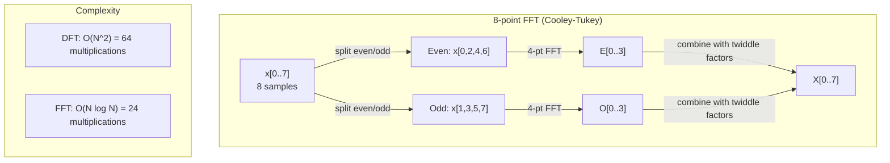
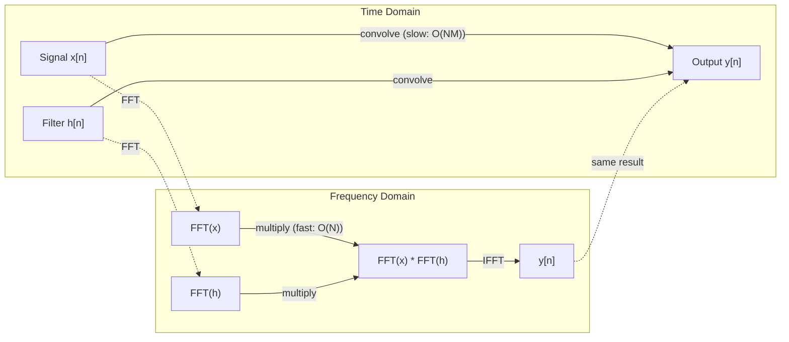

# تحويل فوريه

> كل إشارة هي مجموع موجات الصين، تحويل فوريير يخبرك عن أي موجات
> كل إشارة هي تعدد الموجات الصناعية.

**Type:** Build | **类型:** 动手
**Language:**" بايثون "**语言:**بايثون
**Prerequisites:** Phase 1, Lessons 01-04, 19 (complex numbers) | **前置知识:** Phase 1, 第 01-04 课、第 19 课（复数）
**Time:** ~90 minutes | **时间:** ~90 分钟

## أهداف التعلم

- تنفيذ DFT من الصفر وتحقق منه ضد O(N سجل N) Cooley-Tukey FFT
  من التحقق من DFT و ليس مع O(N log N) من كولي-توكي FFT 验证
- تفسير معايير التردد: استخراج الطول والمرحلة ومتعدد الطاقة من الإشارة
  解释频率系数: from signal中提取幅度、相位和功率谱(الطيف الطاقة)
- تطبيق نظرية التخزين لتنفيذ التخزين عبر مضاعفة FFT
  应用卷积定理 通过 FFT 乘法执行卷积
- ربط تدمير تردد فوريير إلى ترنسفورمات التشفير الموضعي وطبقات التخزين CNN
  里叶频率分解 مع محول  موقع 编码 و CNN 卷积层


> **【中文解读】**
> يمكن تقسيم أي إشارة إلى الصنود الصوتية، والتي تعتمد على FFT.

## المشكلة المشكلة المشكلة

تسجيل الصوت هو سلسلة من قياسات الضغط على مر الزمن. سعر الأسهم هو سلسلة من القيم على مدى أيام. صورة هي شبكة من كثافة البيكسل على الفضاء. كل هذه هي بيانات في مجال الزمن (أو مجال الفضاء). ترى القيم تتغير على بعض المؤشر.

> 音频录制是随时间变化的压力测量序列──股价是随天数变化的值序列──图像是空间上的像素强度的网格──这些都是时域中的数据──你看到的是某索引上的变化的值──

ولكن العديد من الأنماط غير مرئية في مجال الزمن. هل هذه الإشارة الصوتية هي نغمة نقية أو صفات؟ هل سعر الأسهم هذا له دورة أسبوعية؟ هل هذه الصورة لديها نسيج متكرر؟ هذه الأسئلة تتعلق بمحتويات التردد، ويمتلك مجال الزمن ذلك.

> ولكن العديد من الأنماط غير مرئية في المجال الزمني. هل هذه الإشارة الصوتية هي صوتية أم صناعية؟ هل يوجد دورة دورية في سعر السهم؟ هل هذه الصورة لها صيغة مرارية؟

تحويل فوريه تحويل البيانات من مجال الوقت إلى مجال الترددات. يأخذ إشارة ويفسدها في موجات السينوس من ترددات مختلفة. كل موجة السينوس لديها amplitude (كم قوية هي) ومرحلة (من حيث تبدأ). تحويل فوريه يخبرك كليهما.

> 里叶变换将数据从时域转换到频域──它接收一个信号并将其分解成不同频率的正弦波──每正弦波有幅度(有多强) 和相位(从哪里开始)──里叶变换告诉你两者──

هذا مهم بالنسبة لـ ML لأن التفكير في مجال التردد يظهر في كل مكان. تقوم الشبكات العصبية المتحركة بإجراء التحويل، وهو مضاعفة في مجال التردد. تُستخدم مُشفّرات المُحوّل المُوضّع التفكّر المتردد لتمثيل المُوضّع. نماذج الصوت (تعرف الكلام، توليد الموسيقى) تعمل على الطيفيات -- تمثيلات تردد للصوت. نماذج سلسلة الزمن تبحث عن أنماط دورية. فهم تحويل فوريير يعطيك المفردات للعمل مع كل هذه.

> هذا مهم بالنسبة لـ ML ، لأن المجال الفكر غير موجود. 卷积神经网络执行卷积, هذا في المجال الفردوي هو乘法. Transformer 位置编码使用频率分解表示位置.

## المفهوم الأساسي

> **【中文解读】**
> 里叶变换的核心思想: أي إشارة يمكن أن تنقسم إلى ترددات مختلفة من الصدد وال波之和.DFT وضع إشارة المجال الزمني إلى فئة المجال الفاصل كل فئة تخبرك "هذا التردد لديه كم من الطاقة"── هذا مثل 镜把白光分解成彩虹:

> **【拓展：FFT 的计算影响力】**
> يُعرف FFT باعتباره أحد أهم خوارزميات القيمة العددية في العشرينات. اكتشف غاوس في عام 1805 استراتيجية التنظيم، ولكن في مقال كولي-توكي عام 1965 نجح في تطبيق FFT على نطاق واسع. اليوم، يتم استخدام كل 4G / LTE 通话、每张 JPEG 照片、 كل MP3 歌曲都经过 FFT 处理.

### تعريف DFT

في ظل عينات N x[0] ، x[1], ..., x[N-1] ، ينتج تحويل فوريه المميز معايير تردد N X[0] ، X[1], ..., X[N-1]:

> 给定 N 个样本 x[0], x[1], ..., x[N-1],离散里叶变换产生 N 个频率系数 X[0], X[1], ..., X[N-1]:

```
X[k] = sum_{n=0}^{N-1} x[n] * e^(-2*pi*i*k*n/N)

for k = 0, 1, ..., N-1
```

كل X[k] هو عدد معقد. حجمها \ \ \ \ \ \ \ \ \ \ \ \ \ \ \ \ \ \ \ \ \ \ \ \ \ \ \ \ \ \ \ \ \ \ \ \ \ \ \ \ \ \ \ \ \ \ \ \ \ \ \ \ \ \ \ \ \ \ \ \ \ \ \ \ \ \ \ \ \ \ \ \ \ \ \ \ \ \ \ \ \ \ \ \ \ \ \ \ \ \ \ \ \ \ \ \ \ \ \ \ \ \ \ \ \ \ \ \ \ \ \ \ \ \ \ \ \ \ \ \ \ \ \ \ \ \ \ \ \ \ \ \ \ \ \ \ \ \ \ \ \ \ \ \ \ \ \ \ \ \ \ \ \ \ \ \ \ \ \ \ \ \ \ \ \ \ \ \ \ \ \ \ \ \ \ \ \ \ \ \ \ \ \ \ \ \ \ \ \ \ \ \ \ \ \ \ \ \ \ \ \ \ \ \ \ \ \ \ \ \ \ \ \ \ \ \ \ \ \ \ \ \ \ \ \ \ \ \ \ \ \ \ \ \ \ \ \ \ \ \ \ \ \ \ \ \ \ \ \ \ \ \ \ \ \ \ \ \ \ \ \ \ \ \ \ \ \ \ \ \ \ \ \ \ \ \ \ \ \ \ \ \ \ \ \ \ \ \ \ \ \ \ \ \ \ \ \ \ \ \ \ \ \ \ \ \ \ \ \ \ \ \ \ \ \ \ \ \ \ \ \ \ \ \ \ \ \ \ \ \ \ \ \ \ \ \ \ \ \ \ \ \ \ \ \ \ \ \ \ \ \ \ \ \ \ \ \ \ \ \ \ \ \ \ \ \ \ \ \ \ \ \ \ \ \ \ \ \ \ \ \ \ \ \ \ \ \ \ \ \ \ \ \ \ \ \ \ \ \ \ \ \ \ \ \ \ \ \ \ \ \ \ \ \ \ \ \ \ \ \ \ \ \ \ \ \ \ \ \ \ \ \ \ \ \ \ \ \ \ \ \ \ \ \ \ \ \ \ \ \ \ \ \ \ \ \ \ \ \ \ \ \ \ \ \ \ \ \ \ \ \ \ \ \ \ \ \ \ \ \ \ \ \ \ \ \ \ \ \ \ \ \ \ \ \ \ \ \

> كل X[k] هو عدد复数‬ ‫其模‬ ‫X[k] ‬ ‬ ‬ ‬ ‬ ‬ ‬ ‬ ‬ ‬ ‬ ‬ ‬ ‬ ‬ ‬ ‬ ‬ ‬ ‬ ‬ ‬ ‬ ‬ ‬ ‬ ‬ ‬ ‬ ‬ ‬ ‬ ‬ ‬ ‬ ‬ ‬ ‬ ‬ ‬ ‬ ‬ ‬ ‬ ‬ ‬ ‬ ‬ ‬ ‬ ‬ ‬ ‬ ‬ ‬ ‬ ‬ ‬ ‬ ‬ ‬ ‬ ‬ ‬ ‬ ‬ ‬ ‬ ‬ ‬ ‬ ‬ ‬ ‬ ‬ ‬ ‬ ‬ ‬ ‬ ‬ ‬ ‬ ‬ ‬ ‬ ‬ ‬ ‬ ‬ ‬ ‬ ‬ ‬ ‬ ‬ ‬ ‬ ‬ ‬ ‬ ‬ ‬ ‬ ‬ ‬ ‬ ‬ ‬ ‬ ‬ ‬ ‬ ‬ ‬ ‬ ‬ ‬ ‬ ‬ ‬ ‬ ‬ ‬ ‬ ‬ ‬ ‬ ‬ ‬ ‬ ‬ ‬ ‬ ‬ ‬ ‬ ‬ ‬ ‬ ‬ ‬ ‬ ‬ ‬ ‬ ‬ ‬ ‬ ‬ ‬ ‬ ‬ ‬ ‬ ‬ ‬ ‬ ‬ ‬ ‬ ‬ ‬ ‬ ‬ ‬ ‬ ‬ ‬ ‬ ‬ ‬ ‬ ‬ ‬ ‬ ‬ ‬ ‬ ‬ ‬ ‬ ‬ ‬ ‬ ‬ ‬ ‬ ‬ ‬ ‬ ‬ ‬ ‬ ‬ ‬ ‬ ‬ ‬ ‬ ‬ ‬ ‬ ‬ ‬ ‬ ‬ ‬ ‬ ‬ ‬ ‬ ‬ ‬ ‬ ‬ ‬ ‬ ‬ ‬ ‬ ‬ ‬ ‬ ‬ ‬ ‬ ‬ ‬ ‬ ‬ ‬ ‬ ‬ ‬ ‬ ‬ ‬ ‬ ‬ ‬ ‬ ‬ ‬ ‬ 

المعلومات الرئيسية:`e^(-2*pi*i*k*n/N)`هو فازور متناوب في تردد k. يقوم DFT بحساب التواصل بين الإشارة وكل من ترددات N المتساوية المساحة. إذا كان الإشارة تحتوي على طاقة في تردد k ، فإن التواصل كبير. وإذا لم يكن ، فإنه قريب من الصفر.

> 关键洞察:`e^(-2*pi*i*k*n/N)`هو التواصل بين كل إشارة في N 个等间距频率.

### ما تعنيه كل معدل

**X[0]: the DC component.**هذا هو مجموع جميع العينات -- متناسبة مع المتوسط. وهو يمثل استمرار (الصفر التردد) التداخل من الإشارة.

> **X[0]：直流分量（DC Component）。**هذا هو مجموع جميع النماذج و مع متوسط القيمة إلى النسبة الصحيحة

```
X[0] = sum_{n=0}^{N-1} x[n] * e^0 = sum of all samples
```

**X[k] for 1 <= k <= N/2: positive frequencies.**يمثل X[k] دورات التردد k لكل عينات N. تعني k أعلى تردد أعلى (التذبذب أسرع).

> **X[k]（1 <= k <= N/2）：正频率。**X[k] 代表每 N 个样本中 k 个周期的频率──k 越大频率越高(振荡越快)──

**X[N/2]: the Nyquist frequency.**أعلى تردد يمكنك أن تمثله مع عينات N. فوق هذا، تحصل على الاسم الألي -- ترددات عالية تتمثل في أقل.

> **X[N/2]：Nyquist 频率。**استخدام ن 个样本能表示的最高频率──超过此频率会产生混叠

**X[k] for N/2 < k < N: negative frequencies.**بالنسبة للإشارات ذات القيمة الحقيقية، X[N-k] = conj(X[k] . الترددات السلبية هي صور مرآة للاتجاهات الإيجابية. لهذا السبب تكون المعلومات المفيدة في معايير N/2 + 1 الأولى.

> **X[k]（N/2 < k < N）：负频率。**بالنسبة للقيمة الحقيقية للإشارة، X[N-k] = conj(X[k])。التردد السلبي هو صورة للردد الصواب。 هذا هو السبب في المعلومات المفيدة في السابق N/2 + 1 个系数。

### الـ DFT العكس

يقوم DFT العكسي بإعادة تشكيل الإشارة الأصلية من معايير ترددها:

```
x[n] = (1/N) * sum_{k=0}^{N-1} X[k] * e^(2*pi*i*k*n/N)

for n = 0, 1, ..., N-1
```

الفرق الوحيد عن DFT الأمامي: علامة في المضرب إيجابية (ليس سلبية) ، وهناك عامل طبيعة 1/N.

> الفرق الوحيد بين DFT والصواب: علامة المؤشر تكون صواب غير سلبية ، ويكون لها عنصر إعادة التأثير 1/N.

DFT العكسية هي إعادة بناء مثالية. لا تفقد أي معلومات. يمكنك الذهاب من نطاق الوقت إلى نطاق التردد والعودة دون أي خطأ. DFT هو تغيير الأساس -- يعيد التعبير عن نفس المعلومات في نظام إحداثيات مختلفة.

> على العكس من DFT هو إعادة بناء كامل. لا توجد معلومات ضائعة. يمكنك العودة من المجال الزمني إلى المجال المتردد مرة أخرى، دون أي خطأ.

### الـ (ف.إف.تي): جعل الأمر سريعاً

DFT كما هو محدد أعلاه هو O(N^2): لكل من معايير الخروج N، يمكنك جمع على عينات المدخل N. بالنسبة N = 1 مليون، وهذا هو 10^12 العمليات.

> المحدد أعلاه DFT هو O(N^2): بالنسبة لكل واحد من N 个输出系数, أنت بالنسبة N 个输入样本求和和. بالنسبة N = 100,000,that's 10^12 次运算.

تحسب تحويل فوريه السريع نفس النتيجة في O  N log N. بالنسبة إلى N = 1 مليون، وهذا حوالي 20 مليون عملية بدلاً من تريليون. هذا هو ما يجعل تحليل التردد عمليًا.

> 快速里叶变换(FFT) باستخدام O(N log N) 计算相同的结果──对于N = 100،000,大约是20000000次运算而不是1000000000次──这就是使频率分析变得可行的原因──

> **【中文解读】**
> كمية حساب DFT هي O(N^2) ، ولكن FFT 通过分治策略把它降到O(N log N) ◦ بالنسبة إلى N=1000000 إشارة ، DFT 需要万次运算 ، FFT 需要大约20000000次加速50,000!秘是把信号按奇偶下标分成两半,递归计算后再使用"旋转因子"合并──这要求信号长度是2的──

يعمل خوارزمية كولي-توكي (أكثر FFT شيوعًا) عن طريق القسم والغزو:

> كولي-توكي 算法 (((أسوأ استخدامات FFT) من خلال分治 (((قسم والغزو)工作:

1. تقسيم الإشارة إلى عينات متصفحة مساوية وممتصفحة غير مساوية.
   سوف تقسيم الإشارة إلى مؤشر عدد متكرر ومعينة مؤشر عدد غريب.
2. احسب DFT لكل نصف بشكل متكرر.
   递归计算每一半的DFT──
3. قم بتجميع اثنين من DFTs نصف الحجم باستخدام "عاملات الدوما" e^(-2*pi*i*k/N).
   استخدام "旋转因子" ((Twiddle Factor) e^(-2*pi*i*k/N) 合并两个半尺寸的DFT。

```
X[k] = E[k] + e^(-2*pi*i*k/N) * O[k]          for k = 0, ..., N/2 - 1
X[k + N/2] = E[k] - e^(-2*pi*i*k/N) * O[k]    for k = 0, ..., N/2 - 1

where E = DFT of even-indexed samples
      O = DFT of odd-indexed samples
```

التناظر يعني أن كل مستوى من التكرار يعمل O(N) ، وهناك مستويات log2(N. إجمالي: O(N log N).

> 对称性 يعني عمل كل طبقة يعود إلى عمل O  N) ،共有 log2 N) 层──总计:O  N log N)。



يتطلب FFT أن يكون طول الإشارة قوة 2. في الممارسة العملية ، يتم إضافة الإشارات إلى الصفر إلى قوة 2.

### تحليل الطيف

- نعم**power spectrum**هو X [k]^2 -- الكبيرة المربعة لكل معدل تردد.

- نعم**phase spectrum**هو الزاوية ((X[k]) -- تعويض مرحلة لكل تردد. بالنسبة لمعظم مهام التحليل، تهتمين بمتصفح الطاقة وتجاهلون المرحلة.

```
Power at frequency k:  P[k] = |X[k]|^2 = X[k].real^2 + X[k].imag^2
Phase at frequency k:  phi[k] = atan2(X[k].imag, X[k].real)
```

### تحديد التردد

يعتمد قرار تردد DFT على عدد العينات N ومعدل أخذ العينات fs.

```
Frequency of bin k:      f_k = k * fs / N
Frequency resolution:    delta_f = fs / N
Maximum frequency:       f_max = fs / 2  (Nyquist)
```

لتحديد ترددات قريبة من بعضها البعض، تحتاج إلى المزيد من العينات. لالتقاط ترددات عالية، تحتاج إلى معدل أعلى من أخذ العينات.

### نظرية التخزين

هذه واحدة من أهم النتائج في معالجة الإشارات و ذات صلة مباشرة مع قنوات سي إن إن

> هذه واحدة من أهم النتائج في معالجة الإشارات، ذات صلة مباشرة مع CNN.

**Convolution in the time domain equals pointwise multiplication in the frequency domain.**

> **时域中的卷积等于频域中的逐点相乘。**

```
x * h = IFFT(FFT(x) . FFT(h))

where * is convolution and . is element-wise multiplication
```

لماذا هذا مهم:

- التخطي المباشر لـ إشارات طول N و M يأخذ عمليات O(N*M).
  两个长度为 N 和 M 的信号直接卷积需要 O(N*M) 次运算。
- التخزين القائم على FFT يأخذ O(N log N): تحويل كل منهما، وتضاعف، وتحويل مرة أخرى.
  基于 FFT的卷积需要 O(N log N):变换两个信号、相乘、逆变换。
- بالنسبة للجوهرات الكبيرة، فإن تحويل FFT أسرع بشكل كبير.
  بالنسبة للـ "جولات" الكبيرة،
- هذا بالضبط ما يحدث في الطبقات الملتوية مع مجالات استقبلية كبيرة.
  هذا ما يحدث في مجال التجمعات ذات التأثيرات الكبيرة

> **【拓展：卷积定理在 CNN 中的实际应用】**
> 標準 3x3 卷积直接计算比 FFT 快, ولكن عند الشعور野变大时 FFT 优势显现──ConvNeXt 和 Global Convolution 网络在 7x7 أو أكبر卷积中使用 FFT 加速──FNet (Lee-Thorp et al., 2021) 更大胆地使用 FFT 替代变压器的自注意, 达到 92% 的 BERT精度, 在 GLUE基准上, 但训练速度快 7 倍──频域复制的杂度是 O(N) 而时域卷积是 O(N^2)。

ملاحظة: يقوم DFT بحساب التخزين الدائري (تتتلف الإشارة حولها). بالنسبة للتخزين الخطي (لا توجد تغطية) ، قم بتحديد كل من الإشارات إلى طول N + M - 1 قبل الحساب.

> انتباه:DFT  حساب هو حلقة卷积(信号会环绕) ・・・ بالنسبة للحلقة线性卷积(无环绕) ، في الحساب السابق سوف تكون اثنين من الإشارات ملحقة صفر إلى طول N + M - 1 ・・・



### النوافذ

يفترض DFT أن الإشارة دورية - يعامل عينات N كفترة واحدة من إشارة تكرارية لا نهاية لها. إذا لم تبدأ الإشارة وتنتهي في نفس القيمة، فإنه يخلق عدم استمرارية في الحدود، والتي تظهر كمحتوى عالية التردد وهمية. وهذا يسمى تسرب الطيف.

> DFT 假设信号是周期的它将N个样本视为无限重复信号的一个周期――如果信号不存在相同的值处开始和结束,边界处会产生不连续性,表现为虚假的高频内容――这被称为频谱泄漏(光谱泄漏)。

يقلل التسرب من النافذة عن طريق تقليل الإشارة إلى الصفر في كلا الطرفين قبل حساب DFT.

> 窗函数(Windowswing) من خلال حساب DFT  قبل أن تكون الإشارة على النصفين تدريجياً يقلل إلى الصفر لتقليل التسريب.

النوافذ المشتركة:

| Window | Shape | Main lobe width | Side lobe level | Use case |
|--------|-------|----------------|-----------------|----------|
| Rectangular | Flat (no window) | Narrowest | Highest (-13 dB) | When signal is exactly periodic in N samples |
| Hann | Raised cosine | Moderate | Low (-31 dB) | General purpose spectral analysis |
| Hamming | Modified cosine | Moderate | Lower (-42 dB) | Audio processing, speech analysis |
| Blackman | Triple cosine | Wide | Very low (-58 dB) | When side lobe suppression is critical |

```
Hann window:    w[n] = 0.5 * (1 - cos(2*pi*n / (N-1)))
Hamming window: w[n] = 0.54 - 0.46 * cos(2*pi*n / (N-1))
```

تطبيق النافذة عن طريق مضاعفةها حسب العناصر مع الإشارة التي تسبق DFT: `X = DFT(x * w)`. . .

### خصائص DFT

| Property | Time Domain | Frequency Domain |
|----------|-------------|-----------------|
| Linearity | a*x + b*y | a*X + b*Y |
| Time shift | x[n - k] | X[f] * e^(-2*pi*i*f*k/N) |
| Frequency shift | x[n] * e^(2*pi*i*f0*n/N) | X[f - f0] |
| Convolution | x * h | X * H (pointwise) |
| Multiplication | x * h (pointwise) | X * H (circular convolution, scaled by 1/N) |
| Parseval's theorem | sum \|x[n]\|^2 | (1/N) * sum \|X[k]\|^2 |
| Conjugate symmetry (real input) | x[n] real | X[k] = conj(X[N-k]) |

نظرية بارسيفال تقول أن الطاقة الكلية هي نفسها في كلا المجالين

> تُوضح النظرية البارسيفالية أن الطاقة الإجمالية في المجالين هي نفسها.

### اتصال بتشفيرات المواقع

المصدر الأصلي يستخدم تشفيرات موقف سينوسيدال:

```
PE(pos, 2i)   = sin(pos / 10000^(2i/d_model))
PE(pos, 2i+1) = cos(pos / 10000^(2i/d_model))
```

كل زوج من الأبعاد (2i، 2i+1) يتذبذب عند تردد مختلف. يتم توزيع الترددات بشكل هندسي من عالية (أبعاد 0.1) إلى منخفضة (أبعاد أخيرة). وهذا يعطي كل موقع نمطًا فريدًا عبر جميع فئات التردد - مما يشبه كيفية تحديد معايير فوريري بشكل فريد إشارة.

> كل درجة مقترحة (2i، 2i+1) باستخدام تردد مختلف تتذبذب. تردد من ارتفاع الدرجة 0.1) إلى انخفاض الدرجة الأخيرة) يعرض على فجوة مختلفة.

الخصائص الرئيسية التي يقدمها:

- **Uniqueness:**لا توجد موقفين لديهم نفس التشفير
  **唯一性：**لا يوجد مكانين لديهم نفس الرمز
- **Bounded values:**الخطيئة والصوص دائما في [-1, 1].
  **有界值：**و معنى ذلك
- **Relative position:**يمكن تعبير تشفير الموقف p + k كعمل خطي للتشفير في الموقف p. يمكن أن يتعلم النموذج التركيز على المواقع النسبية.
  **相对位置：**位置 p+k 编码可以表示为位置 p 编码的线性函数──模型可以学习关注相对位置──

### اتصال مع قنوات سي إن إن

طبقة التخزين تطبق مرشحًا تعلمًا (كور) على المدخل عن طريق نقله عبر الإشارة أو الصورة.

> 卷积层通过在信号或图像上滑学习的波器 (波器) 卷积核) يستخدم في الدخول.

من خلال نظرية التخزين، هذا يعادل:
1. FFT المدخل
   FFT 输入
2. FFT النجم
   FFT 卷积核
3. مضاعفة في مجال التردد
   في المجال المتعدد
4. إذا كان النتيجة
   IFFT  نتائج

تستخدم تنفيذات CNN القياسية التناغم المباشر (أسرع بالنسبة للنواة الصغيرة 3x3). ولكن بالنسبة للنواة الكبيرة أو التناغم العالمي ، فإن النهج القائم على FFT أسرع بكثير. بعض الهندسة المعمارية (مثل FNet) تحل محل الاهتمام بالكامل مع FFT ، وتحقيق دقة تنافسية مع O(N log N) بدلاً من تعقيد O(N^2).

> 标准 CNN 实现使用直接卷积(小的3x3卷积核更快)  ولكن بالنسبة للكبيرة卷积核或全局卷积, تستند إلى FFT أكثر سرعة كبيرة. بعض البنى (مثل FNet) تستخدم بالكامل FFT 替代 الاهتمام, لتصل إلى دقة تنافسية باستخدام O(N log N) بدلا من O(N^2)

### البرامج المتطرفة و تحويل فوريه القصير

يقدم لك FFT واحد محتوى تردد الإشارة بأكملها ، ولكن لا يخبرك بأي شيء عن متى تحدث هذه الترددات. يمكن أن يكون لدى إشارة (إشارة تزداد ترددها مع مرور الوقت) وخط (جميع الترددات الموجودة في نفس الوقت) نفس الطيف الكبير.

>  FFT  أعطيك محتوى تردد الإشارة بأكملها ، ولكن لا يخبرك هذه الترددات في أي وقت تظهر.‬‬‬‬‬‬‬‬‬‬‬‬‬‬‬‬‬‬‬‬‬‬‬‬‬‬‬‬‬‬‬‬‬‬‬‬‬‬‬‬‬‬‬‬‬‬‬‬‬‬‬‬‬‬‬‬‬‬‬‬‬‬‬‬‬‬‬‬‬‬‬‬‬‬‬‬‬‬‬‬‬‬‬‬‬‬‬‬‬‬‬‬‬‬‬‬‬‬‬‬‬‬‬‬‬‬‬‬‬‬‬‬‬‬‬‬‬‬‬‬‬‬‬‬‬‬‬‬‬‬‬‬‬‬‬‬‬‬‬‬‬‬‬‬‬‬‬‬‬‬‬‬‬‬‬‬‬‬‬‬‬‬‬‬‬‬‬‬‬‬‬‬‬‬‬‬‬‬‬‬‬‬‬‬‬‬‬‬‬‬‬‬‬‬‬‬‬‬‬‬‬‬‬‬‬‬‬‬‬‬‬‬‬‬‬‬‬‬‬‬‬‬‬‬‬‬‬‬‬‬‬‬‬‬‬‬‬‬‬‬‬‬‬‬‬‬‬‬‬‬‬‬‬‬‬‬‬‬‬‬‬‬‬‬‬‬‬‬‬‬‬‬‬‬‬‬‬‬‬‬‬‬‬‬‬‬‬‬‬‬‬‬‬‬‬‬‬‬‬‬‬‬‬‬‬‬‬‬‬‬‬‬‬‬‬‬‬‬‬‬‬‬‬‬‬‬‬‬‬‬‬‬‬‬‬‬‬‬‬‬‬‬‬‬‬‬‬‬‬‬‬‬‬‬‬‬‬‬‬‬‬‬‬‬‬‬‬‬‬‬‬‬‬‬‬‬‬‬‬‬‬‬‬‬‬‬‬‬‬‬‬‬‬‬‬‬‬‬‬‬‬‬‬‬‬‬‬‬‬‬‬‬‬‬‬‬‬‬‬‬‬‬‬‬‬‬‬‬‬‬‬‬‬‬‬‬‬‬‬‬‬‬‬‬‬‬‬‬‬‬‬‬‬‬‬‬‬‬‬‬‬‬‬‬‬‬‬‬‬‬‬‬‬‬‬‬‬

تحل تحويل فوريه القصير من الوقت (STFT) هذا الأمر عن طريق حساب FFTs على نوافذ تتداخل من الإشارة. النتيجة هي طيفية: تمثيل ثنائي الأبعاد مع الوقت على محور واحد والتياتر على الآخر. يظهر كثافة كل نقطة الطاقة في تلك التردد في ذلك الوقت.

> 短时里叶变换(STFT) من خلال حساب FFT على نافذة التكثيف في الإشارة لحل هذه المشكلة. النتيجة هي رسم التردد: صورة 2D للدرجة الأولى من الوقت على محور واحد، وتعريف تردد على محور آخر.

```
STFT procedure:
1. Choose a window size (e.g., 1024 samples)
2. Choose a hop size (e.g., 256 samples -- 75% overlap)
3. For each window position:
   a. Extract the windowed segment
   b. Apply a Hann/Hamming window
   c. Compute FFT
   d. Store the magnitude spectrum as one column of the spectrogram
```

تعد التصويرات الطيفية هي التمثيل القياسي للمدخلات للنموذجات الصوتية ML. تعمل نماذج التعرف على الكلام (Whisper، DeepSpeech) على التصويرات الطيفية - التصويرات الطيفية ذات الترددات المخطوطة إلى مقياس الميل، والتي تطابق بشكل أفضل تصور الصوت البشري.

> 频谱图是音频ML 模型的标准输入表示──语音识别模型──语音识别模型──语音识别模型──语音识别模型──语音识别模型──语音识别模型──语音识别模型──语音识别模型──语音识别模型──语音识别模型──语音识别模型──语音识别模型──语音识别模型──语音识别模型──语音识别模型──语音识别模型──语音识别模型──语音识别模型──语音识别模型──语音识别模型──语音识别模型──语音识别模型──语音识别模型──语音识别模型──语音识别模型──语音识别模型──语音识别模型──语音识别模型──语音识别模型──语音识别模型──语音识别模型──语音识别模型──语音识别模型──语音识别模型──语音识别模型──语音识别模型──语音识别模型──语音识别模型──语音识别模型──语音识别模型模型──语音识别模型模型──语音识别模型模型──语音识别模型模型──语音识别模型模型模型──语音识别模型语音识别模型──语音识别模型──语音识别模型语音识别模型──语音识别模型语音频频频频频频频频频频频频频频频频频频频频频频频频频频频频频频频频频频频频频频频频频频频频频频频频频频频频频频频频频频频频频频频频频频频频频频频频频频频频频频频频频频频频频频频频频频频频频频频频频频频频频频频频频频频频频频频频频频频频频频频频频频频频频频频频频频频频频频频频频频频频频频频频频频频频频频频频频频频频频频频频频频频频频频频频频频频频频频频频频频频频频频频频频频频频频

> **【中文解读】**
> فقط FFT فقط يمكن أن ترى مكونات تردد الإشارة بأكملها، ولكن لا تعرف كل تردد في "ما الوقت" يظهر.‬短时里叶变化‬‬‬‬‬‬‬‬‬‬‬‬‬‬‬‬‬‬‬‬‬‬‬‬‬‬‬‬‬‬‬‬‬‬‬‬‬‬‬‬‬‬‬‬‬‬‬‬‬‬‬‬‬‬‬‬‬‬‬‬‬‬‬‬‬‬‬‬‬‬‬‬‬‬‬‬‬‬‬‬‬‬‬‬‬‬‬‬‬‬‬‬‬‬‬‬‬‬‬‬‬‬‬‬‬‬‬‬‬‬‬‬‬‬‬‬‬‬‬‬‬‬‬‬‬‬‬‬‬‬‬‬‬‬‬‬‬‬‬‬‬‬‬‬‬‬‬‬‬‬‬‬‬‬‬‬‬‬‬‬‬‬‬‬‬‬‬‬‬‬‬‬‬‬‬‬‬‬‬‬‬‬‬‬‬‬‬‬‬‬‬‬‬‬‬‬‬‬‬‬‬‬‬‬‬‬‬‬‬‬‬‬‬‬‬‬‬‬‬‬‬‬‬‬‬‬‬‬‬‬‬‬‬‬‬‬‬‬‬‬‬‬‬‬‬‬‬‬‬‬‬‬‬‬‬‬‬‬‬‬‬‬‬‬‬‬‬‬‬‬‬‬‬‬‬‬‬‬‬‬‬‬‬‬‬‬‬‬‬‬‬‬‬‬‬‬‬‬‬‬‬‬‬‬‬‬‬‬‬‬‬‬‬‬‬‬‬‬‬‬‬‬‬‬‬‬‬‬‬‬‬‬‬‬‬‬‬‬‬‬‬‬‬‬‬‬‬‬‬‬‬‬‬‬‬‬‬‬‬‬‬‬‬‬‬‬‬‬‬‬‬‬‬‬‬‬‬‬‬‬‬‬‬‬‬‬‬‬‬‬‬‬‬‬‬‬‬‬‬‬‬‬‬‬‬‬‬‬‬‬‬‬‬‬‬‬‬‬‬‬‬‬‬‬‬‬‬‬‬‬‬‬‬‬‬‬‬‬‬‬‬‬‬‬‬‬‬‬‬‬‬‬‬‬‬‬‬‬‬‬‬‬‬‬‬

### التعبير

إذا كانت الإشارة تحتوي على ترددات فوق fs/2 (تردد نيكوست) ، فإن العينات عند سرعة fs ستخلق نسخة مستعارة. يبدو إشارة 90 Hz التي يتم أخذها في 100 Hz متطابقة مع إشارة 10 Hz. لا توجد طريقة للتمييز بينها من العينات وحدها.

> إذا كانت الإشارة تحتوي على تردد أعلى من fs/2 (تردد Nyquist) ، فإنّ السرعة التي تُنتج بها fs 采样 تكون متداخلة.

```
Example:
  True signal: 90 Hz sine wave
  Sampling rate: 100 Hz
  Apparent frequency: 100 - 90 = 10 Hz

  The samples from the 90 Hz signal at 100 Hz sampling rate
  are identical to the samples from a 10 Hz signal.
  No amount of math can recover the original 90 Hz.
```

هذا هو السبب في أن محولات التناظر إلى الرقميات تشمل مرشحات مكافحة التناظر التي تزيل ترددات فوق Nyquist قبل أخذ العينات. في ML، يظهر التناظر عند أخذ العينات إلى أسفل خرائط ميزات دون تصفية المنخفضة المناسبة - بعض الهندسة المعمارية تعالج هذا مع طبقات تجمع مكافحة التناظر.

> هذا هو السبب في أن محولات الطرازات تحتوي على مضادة للتداخل، في حالة التحويل من قبل الاختبار، في المادة المختلفة، عندما لا توجد خصائص مناسبة للطاقة المختلفة، تظهر بعض المباني من خلال طبقة مضادة للتداخل لتسوية هذه المشكلة.

### عدم زيادة الحلّة من خلال إصلاح الصفر

تصور خاطئ شائع: إعادة إعادة إعادة إعادة إعادة إعادة إعادة إعادة إعادة إعادة إعادة إعادة إعادة إعادة إعادة إعادة إعادة إعادة إعادة إعادة إعادة إعادة إعادة إعادة إعادة إعادة إعادة إعادة إعادة إعادة إعادة إعادة إعادة إعادة إعادة إعادة إعادة إعادة إعادة إعادة إعادة إعادة إعادة إعادة إعادة إعادة إعادة إعادة إعادة إعادة إعادة إعادة إعادة إعادة إعادة إعادة إعادة إعادة إعادة إعادة إعادة إعادة إعادة إعادة إعادة إعادة إعادة إعادة إعادة إعادة إعادة إعادة إعادة إعادة إعادة إعادة إعادة إعادة إعادة إعادة إعادة إعادة إعادة إعادة إعادة إعادة إعادة إعادة إعادة إعادة إعادة إعادة إعادة إعادة إعادة إعادة إعادة إعادة إعادة إعادة إعادة إعادة إعادة إعادة إعادة إعادة إعادة إعادة إعادة إعادة إعادة إعادة إعادة إعادة إعادة إعادة إعادة إعادة إعادة إعادة إعادة إعادة إعادة إعادة إعادة إعادة إعادة إعادة إعادة إعادة إعادة إعادة إعادة إعادة إعادة إعادة إعادة إعادة إعادة إعادة إعادة إعادة إعادة إعادة إعادة إعادة إعادة إعادة إعادة إعادة إعادة إعادة إعادة إعادة إعادة إعادة إعادة إعادة إعادة إعادة إعادة إعادة إعادة إعادة إعادة إعادة إعادة إعادة إعادة إعادة إعادة إعادة إعادة إعادة إعادة إعادة إعادة إعادة إعادة إعادة إعادة إعادة إعادة إعادة إعادة إعادة إعادة إعادة إعادة إعادة إعادة إعادة إعادة إعادة إعادة إعادة إعادة إعادة إعادة إعادة إعادة إعادة إعادة إعادة إعادة إعادة إعادة إعادة إعادة إعادة إعادة إعادة إعادة إعادة إعادة إعادة إعادة إعادة إعادة إعادة إعادة إعادة إعادة إعادة إ إ إ إ إعادة إ إ إ إعادة إعادة إ إ إ إ إعادة إعادة إ إ إ إ إعادة إعادة إ إ إعادة إعادة إ إ إ إ إ إ إ إ إ إ إ إعادة إعادة إ إ إ إ إ إ

> 常见误解: قبل FFT 补零可以提高频率分辨率──实际上不能──补零在现有频率bin 之间插值,给你更平滑的频谱外观──但它不能揭露原始样本中不存在的频率细节──

يعتمد قرار التردد الحقيقي فقط على وقت الملاحظة T = N / fs. لحل ترددات منفصلة عن delta_f ، تحتاج إلى T = 1 / delta_f ثانية على الأقل من البيانات. لا يوجد مقدار من التدفق الصفر يغير هذا الحد الأساسي.

> إنّ التّفرّق الحقيقيّ للدرجة المتكرّرة يعتمد فقط على وقت المراقبة T = N / fs، ولكنّه لا يمكن تغيير هذا القيّد الأساسيّ،

> **【拓展：频谱图在语音 AI 中的标准地位】**
> OpenAI Whisper 模型将音频转换为 log-Mel 频谱图后输入编码器──Mel 刻度模拟人耳对频率的感知(低频区分更细)──Whisper 使用 80 个Mel 波器组、25ms 窗口、10ms 步长──一段 30 秒的音频产生约3000 x 80 频谱图阵──Google WaveNet、Meta 的EnCodec 也都以频谱图或频域表示中特征──

## بناء ذلك تحرك لتحقيق
```figure
fourier-synthesis
```

## بناءها

### الخطوة الأولى: DFT من الصفر

DFT O ((N^2) يتبع مباشرة من التعريف.

```python
import math

class Complex:
    ...

def dft(x):
    N = len(x)
    result = []
    for k in range(N):
        total = Complex(0, 0)
        for n in range(N):
            angle = -2 * math.pi * k * n / N
            w = Complex(math.cos(angle), math.sin(angle))
            xn = x[n] if isinstance(x[n], Complex) else Complex(x[n])
            total = total + xn * w
        result.append(total)
    return result
```

### الخطوة الثانية: DFT العكسية

نفس الهيكل، المعبر الإيجابي، تقسيم بـ N.

```python
def idft(X):
    N = len(X)
    result = []
    for n in range(N):
        total = Complex(0, 0)
        for k in range(N):
            angle = 2 * math.pi * k * n / N
            w = Complex(math.cos(angle), math.sin(angle))
            total = total + X[k] * w
        result.append(Complex(total.real / N, total.imag / N))
    return result
```

### الخطوة الثالثة: FFT (كولي-توكي)

المعدل السريع يتطلب قوة من 2 طول. تقسيم إلى متكافئة ومتكافئة، الجمع مع عوامل التويدل.

```python
def fft(x):
    N = len(x)
    if N <= 1:                                      # 基础情况：长度 1 的 DFT 就是自身
        return [x[0] if isinstance(x[0], Complex) else Complex(x[0])]
    if N % 2 != 0:                                  # 非偶数长度，回退到普通 DFT
        return dft(x)

    even = fft([x[i] for i in range(0, N, 2)])     # 递归：偶数下标子序列
    odd = fft([x[i] for i in range(1, N, 2)])      # 递归：奇数下标子序列

    result = [Complex(0)] * N
    for k in range(N // 2):
        angle = -2 * math.pi * k / N                # 旋转因子角度
        twiddle = Complex(math.cos(angle), math.sin(angle))  # 旋转因子 e^(-2piik/N)
        t = twiddle * odd[k]                        # 蝶形运算：旋转后的奇数部分
        result[k] = even[k] + t                    # 前半：E[k] + twiddle * O[k]
        result[k + N // 2] = even[k] - t           # 后半：E[k] - twiddle * O[k]
    return result
```

### الخطوة الرابعة: مساعدي تحليل الطيف

```python
def power_spectrum(X):
    return [xk.real ** 2 + xk.imag ** 2 for xk in X]

def convolve_fft(x, h):
    N = len(x) + len(h) - 1                         # 线性卷积的输出长度
    padded_N = 1
    while padded_N < N:
        padded_N *= 2                                # 补零到 2 的幂次

    x_padded = x + [0.0] * (padded_N - len(x))      # 补零避免循环卷积混叠
    h_padded = h + [0.0] * (padded_N - len(h))

    X = fft(x_padded)                               # 信号 FFT
    H = fft(h_padded)                               # 滤波器 FFT

    Y = [xk * hk for xk, hk in zip(X, H)]          # 频域逐点相乘（卷积定理）

    y = idft(Y)                                     # 逆 FFT 回到时域
    return [y[n].real for n in range(N)]
```

## استخدمها في إطار التنفيذ

للعمل الحقيقي، استخدم Numpy's FFT الذي يدعم من قبل المكتبات C المثلى للغاية.

```python
import numpy as np

signal = np.sin(2 * np.pi * 5 * np.arange(256) / 256)
spectrum = np.fft.fft(signal)
freqs = np.fft.fftfreq(256, d=1/256)

power = np.abs(spectrum) ** 2

positive_freqs = freqs[:len(freqs)//2]
positive_power = power[:len(power)//2]
```

لتحليل النوافذ والتحليلات الطيفية الأكثر تقدما:

```python
from scipy.signal import windows, stft

window = windows.hann(256)
windowed = signal * window
spectrum = np.fft.fft(windowed)
```

للفصل:

```python
from scipy.signal import fftconvolve

result = fftconvolve(signal, kernel, mode='full')
```

للطيفيات:

```python
from scipy.signal import stft

frequencies, times, Zxx = stft(signal, fs=sample_rate, nperseg=256)
spectrogram = np.abs(Zxx) ** 2
```

المصفوفة المعدنية لها شكل (n_frequencies, n_time_frames). كل عمود هو الطيف الطاقة في نافذة زمنية واحدة. هذا ما تستخدمها نماذج ML الصوتية كمدخول.

> 频谱图矩阵形状是 (n_frequencies, n_time_frames) ⋅ كل صف هو نطاق الكهرباء من نافذة الوقت ⋅ هذا هو صوت الصوت ML 模型 ⋅

## أرسلها .

أركض`code/fourier.py`لإنتاج`outputs/prompt-spectral-analyzer.md`. . .

> 运行 `code/fourier.py`生成 `outputs/prompt-spectral-analyzer.md`(توقيت تحليلات الكلمات)

## تمارين التدريب

1. **Pure tone identification.**قم بإنشاء إشارة بموجة سينوسية واحدة في تردد مجهول (بين 1 و 50 هرتز) ، وخذ عينات عند 128 هرتز لمدة ثانية واحدة. استخدم DFT الخاص بك لتحديد التردد. تحقق من مطابقة الإجابة. الآن أضف ضجيج غوسيان مع انحراف معيار 0.5 واكرر. كيف يؤثر الضجيج على الطيف؟

2. **FFT vs DFT verification.**توليد إشارة عشوائية بطول 64. حساب كل من DFT (O(N^2)) و FFT. التحقق من أن جميع المعاملات تتطابق مع داخل 1e-10. الوقت يعمل على الإشارات بطول 256 ، 512 ، 1024, و 2048. رسم نسبة DFT وقت إلى FFT وقت.

3. **Convolution theorem proof by example.**قم بإنشاء إشارة x = [1, 2, 3, 4, 0, 0, 0, 0] والتحذير h = [1, 1, 1, 0, 0, 0, 0, 0]. احسب تحوُّلها الدائري مباشرةً (حلقة حلقة). ثم احسبها عن طريق FFT (تحول، مضاعفة، تحويل عكسية). تحقق من مطابقة النتائج. الآن قم بتحوُّل خطيّة عن طريق إضافة الصفر بشكل مناسب.

4. **Windowing effects.**قم بإنشاء إشارة هي مجموع موجات الصناعية الثنائية عند 10 هرتز و 12 هرتز (قريبة جداً). قم بعمل عينات عند 128 هرتز لمدة ثانية واحدة. احسب طيف الطاقة دون نافذة، نافذة هان، ونفذة هامينغ. أي نافذة تجعل من الأسهل تمييز النقبتين؟ لماذا؟

5. **Positional encoding analysis.**توليد التشفيرات الموضعية السينوسوايدالية d_model = 128 و max_pos = 512. لكل زوج من المواقع (p1, p2), حساب نسبة نقطة من التشفيرات الخاصة بهم. أظهر أن نسبة نقطة تعتمد فقط على p1 - p2 ، وليس على المواقع المطلقة. ماذا يحدث لمجموعة نقطة مع زيادة المسافة؟

## شروط الرئيسية

| Term | What it means |
|------|---------------|
| DFT (Discrete Fourier Transform) | Converts N time-domain samples into N frequency-domain coefficients. Each coefficient is the correlation with a complex sinusoid at that frequency |
| FFT (Fast Fourier Transform) | An O(N log N) algorithm to compute the DFT. The Cooley-Tukey algorithm splits even/odd indices recursively |
| Inverse DFT | Reconstructs the time-domain signal from frequency coefficients. Same formula as DFT with flipped exponent sign and 1/N scaling |
| Frequency bin | Each index k in the DFT output represents frequency k*fs/N Hz. The "bin" is the discrete frequency slot |
| DC component | X[0], the zero-frequency coefficient. Proportional to the signal mean |
| Nyquist frequency | fs/2, the maximum frequency representable at sampling rate fs. Frequencies above this alias |
| Power spectrum | \|X[k]\|^2, the squared magnitude of each frequency coefficient. Shows energy distribution across frequencies |
| Phase spectrum | angle(X[k]), the phase offset of each frequency component. Often ignored in analysis |
| Spectral leakage | Spurious frequency content caused by treating a non-periodic signal as periodic. Reduced by windowing |
| Window function | A tapering function (Hann, Hamming, Blackman) applied before DFT to reduce spectral leakage |
| Twiddle factor | The complex exponential e^(-2*pi*i*k/N) used to combine sub-DFTs in the FFT butterfly computation |
| Convolution theorem | Convolution in time domain equals pointwise multiplication in frequency domain. Fundamental to signal processing and CNNs |
| Circular convolution | Convolution where the signal wraps around. This is what the DFT naturally computes |
| Linear convolution | Standard convolution without wraparound. Achieved by zero-padding before DFT |
| Parseval's theorem | Total energy is preserved through the Fourier transform. sum \|x[n]\|^2 = (1/N) sum \|X[k]\|^2 |
| Aliasing | When frequencies above Nyquist appear as lower frequencies due to insufficient sampling rate |

> 术语速查:DFT(离散里叶变换)、FFT(快速里叶变换 O(N log N))、逆 DFT(逆 DFT)、تردد بن 频率槽)、DC مكون(直流分量 X[0])、Nyquist تردد(奈奎斯特频率 fs/2)、طيف الطاقة(طيف الكهرباء谱X[k]2)、طيف الطيف 位置谱)、تفشيل الطيفي 频谱泄漏)、فرنسيات وظيفة النافذة ️️️️️️️️️️️️️️️️️️️️️️️️️️️️️️️️️️️️️️️️️️️️️️️️️️️️️️️️️️️️️️️️️️️️️️️️️️️️️️️️️️️️️️️️️️️️️️️️️️️️️️️️️️️️️️️️️️️️️️️️️️️️️️️️️️️️️️️️️️️️️️️️️️️️️️️️️️️️️️️️️️️️️️️️️️️️️️️️️️️️️️️️️️️️

## المزيد من القراءة

- [Cooley & Tukey: An Algorithm for the Machine Calculation of Complex Fourier Series (1965)](https://www.ams.org/journals/mcom/1965-19-090/S0025-5718-1965-0178586-1/)- ورقة FFT الأصلية التي غيرت الحوسبة
- [3Blue1Brown: But what is the Fourier Transform?](https://www.youtube.com/watch?v=spUNpyF58BY)- أفضل تعريف بصري لتحولات فوريير
- [Lee-Thorp et al.: FNet: Mixing Tokens with Fourier Transforms (2021)](https://arxiv.org/abs/2105.03824)- يبدل الاهتمام الذاتي بـ FFT في المحولات
- [Smith: The Scientist and Engineer's Guide to Digital Signal Processing](http://www.dspguide.com/)- كتاب دراسي مجاني على الإنترنت يغطى التحليل المعمق للفوتوغرافية والنوافذ والطيفيات
- [Vaswani et al.: Attention Is All You Need (2017)](https://arxiv.org/abs/1706.03762)- تشفيرات المواقع السينوسيدالية المستمدة من تدهور تردد فوريير
- [Radford et al.: Whisper (2022)](https://arxiv.org/abs/2212.04356)- التعرف على الكلام باستخدام طيفيات الميل كتمثيل مدخل
