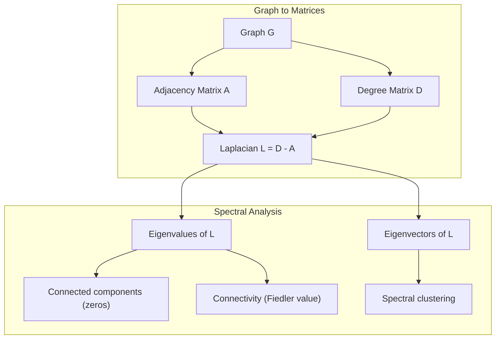
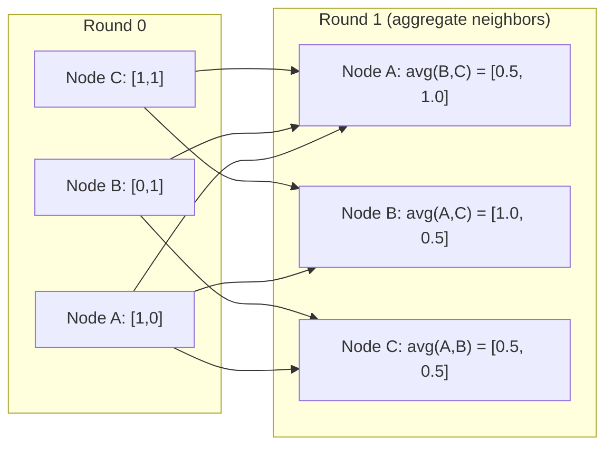

# نظرية الرسومات للتعلم الآلي 图论与机器学习

> الرسوم البيانية هي بنية البيانات للعلاقات. إذا كانت البيانات لديك اتصالات، فأنت بحاجة إلى نظرية الرسوم البيانية.
> 图是关系的数据结构── إذا كانت البيانات الخاصة بك متصلة، تحتاج إلى صور.

**Type:** Build | **类型:** 动手
**Language:**" بايثون "**语言:**بايثون
**Prerequisites:** Phase 1, Lessons 01-03 (linear algebra, matrices) | **前置知识:** Phase 1, 第 01-03 课（线性代数、矩阵）
**Time:** ~90 minutes | **时间:** ~90 分钟

## أهداف التعلم

- بناء فئة الرسم البياني مع تمثيلات المصفوفات / القائمة المجاورة وتنفيذ عبورات BFS و DFS
   بناء مع الموجات المجاورة/تعريفات المخططات، تنفيذ BFS و DFS 
- احسب الرسم البياني لابلاسي واستخدام قيمه الخاصة للكشف عن المكونات المتصلة والعقدة
  计算图拉普拉斯矩阵(Graph Laplacian) و يستخدم خصائصها
- تنفيذ جولة واحدة من رسالة نمط GNN تمر كمراتب متراكم المجاورة المعتاد
  实现一轮 GNN 风格的消息传递归归归归归归归归邻矩阵乘法
- تطبيق التجميع الطيفي للفصل الرسمي باستخدام متجه Fiedler
  应用谱聚类(Spectral Clustering) استخدام Fiedler 向量划分图


> **【中文解读】**
> شبكة اجتماعية هيكل جزئي خطوط المعرفة هي صور . . . . . . . . . .. ... ..................................................................................................................................................................................................................................

## المشكلة المشكلة المشكلة

الشبكات الاجتماعية والجزيئات قواعد المعرفة وشبكات الاقتباسات وخرائط الطرق كلها هي الرسوم البيانية. تعامل المعلومات التقليدية مع البيانات كجدول مسطحة. كل سطر مستقل. كل صفة هي عمود. ولكن عندما تكون هيكل العلاقات مهمة، تفشل الجداول.

> 社交网络、分子、知识库、引文网络、道路图都是图(图)  التقليدية ML 将数据视为平表格──每行独立──每列是一个特征──但当连接结构很重要时,表格就失效了──

فكر في شبكة اجتماعية. تريد التنبؤ بال منتج الذي سيشتريه المستخدم. تاريخ شراءهم مهم. ولكن تاريخ شراء أصدقائهم مهم أكثر. الاتصالات تحمل الإشارة.

> 考虑社交网络――你想预测用户会买什么产品――他们的购买历史很重要――但他们朋友的购买历史更重要――连接带信号――

أو فكر في جزيء. تريد أن تتوقع ما إذا كان يربط بروتين. الذرات مهمة، ولكن ما يهم حقا هو كيفية ربط الذرات مع بعضها البعض. الهيكل هو البيانات.

> أو فكر في الجزيئات. أنت تفكر في التنبؤ ما إذا كان يرتبط بالبروتينات. الذرات مهمة جداً، ولكن المهم حقاً هو كيف يرتبط الذرات بينها.

شبكات العصبية الرسمية (GNNs) هي المنطقة الأكثر نمواً في التعلم العميق. وهي تعمل على اكتشاف المخدرات والتوصية الاجتماعية وكشف الاحتيال والنظرية الرسمية المعرفة. كل GNN تبني على نفس الأساس: نظرية الرسم البياني الأساسية.

> 图神经网络 (GNN) هي المجال الذي يزداد بسرعة في دراسة العميقة.

تحتاج إلى أربعة أشياء:
1. طريقة لتمثيل الرسوم البيانية كالمصفوفات (لذلك يمكنك مضاعفةها)
   سوف نضع طريقة للمحاكاة (يمكننا القيام بذلك)
2. خوارزميات عبورية لاستكشاف هيكل الرسم البياني
   探索图结构的遍历算法
3. اللابلاسي -- المصفوفة الوحيدة الأكثر أهمية في نظرية الرسوم البياني الطيفية
   الموجات الأكثر أهمية في نظرية اللابراس
4. نقل الرسائل -- العملية التي تجعل GNNs تعمل
   消息传递使 GNN 工作的操作

## المفهوم الأساسي

> **【中文解读】**
> 图是关系的数据结构──社交网络中的人是节点、关注是边;分子中原子是节点、化学键是边;知识图谱中实体是节点、关系是边;;图神经网络 (GNN) 图神经网络的核心操作消息传递本质上是邻属矩阵乘法──谱聚类用图拉普拉斯矩阵的特征向量聚类──

> **【拓展：图神经网络在药物发现中的突破】**
> يستخدم DeepMind AlphaFold2 (2020) رسم شبكة النخاع التنبؤ بالبروتينات 3D                                                                                                                                                                                                                                                                                                                                                                                                                                                                                                    

### الرسوم البيانية: العقد والحواف

يتكون الرسم البياني G = (V، E) من الروافع (العقد) V والحواف E. كل حافة تربط عقدين.

> 图 G = (V, E) 由顶点(节点) V 和边 E 组成──每条边连接两个节点──

**Directed vs undirected.**في الرسم البياني غير الموجّه، يعني الحافة (u، v) أن u يصل إلى v و v يصل إلى u. في الرسم البياني الموجّه، يعني الحافة (u، v) أن u تشير إلى v، ولكن ليس بالضرورة العكس.

> **有向与无向。**في الصورة غير المتجهة،边 (u, v) يعني u 连接 v 且 v 连接 u──在有向图中,边 (u, v) يعني u 指向 v,但反向不一定成立──

**Weighted vs unweighted.**في الرسم البياني غير الموزن، الحواف إما موجودة أو لا موجودة. في الرسم البياني الموزن، لكل حافة وزن عددي -- مسافة، تكلفة، قوة.

> **加权与无权。**في الصورة بدون حقوق، الحدود تصل إلى وجود أو عدم وجودها. في الصورة المضافة، كل جانب لديه قيمة عددية تصل إلى وزن المسافة، التكلفة، القوة.

| Graph type | Example |
|-----------|---------|
| Undirected, unweighted | Facebook friendship network |
| Directed, unweighted | Twitter follow network |
| Undirected, weighted | Road map (distances) |
| Directed, weighted | Web page links (PageRank scores) |

### المصفوفة المجاورة

المصفوفة المجاورة A هي تمثيل الأساس. بالنسبة لرسم البياني مع n عقد:

> المصفوفة المجاورة (مصفوفة المجاورة) A هو النقطة الأساسية

```
A[i][j] = 1    if there is an edge from node i to node j
A[i][j] = 0    otherwise
```

بالنسبة للجرافات غير الموجزة، A هو متماثل: A[i][j] = A[j][i]. بالنسبة للجرافات الموزعة، A[i][j] = وزن الحافة (i، j).

> 对于无向图,A 是对称的:A[i][j] = A[j][i]。对加权图,A[i][j] = 边 (i, j) 的权重──

**Example -- a triangle:**

```
Nodes: 0, 1, 2
Edges: (0,1), (1,2), (0,2)

A = [[0, 1, 1],
     [1, 0, 1],
     [1, 1, 0]]
```

المصفوفة المجاورة هي المدخلات لكل GNN. عمليات المصفوفة على A تتوافق مع عمليات على الرسم البياني.

> الموجات المجاورة هي كل مدخل من GNN.

> **【中文解读】**
> الموجات المجاورة هي الرسمي من "المعنى الرقمي"。 A[i][j]=1 يعبر عن النقطة i و j 之间有边缘。 المعجزة في الموجات المجاورة: عنصر A^2 A^2[i][j]恰好 يساوي عدد الطرق من i إلى j 长度为 2。 رسائل GNN هي في جوهرها A 乘以特征 الموجات كل نقطة تجمع المعلومات المجاورة。

### درجة

درجة العقد هو عدد الحواف المتصلة بها. بالنسبة للجرافات الموجزة ، لديك درجة (الحواف الدخول) والدرجة الخارجة (الحواف الخروج).

> 节点的度(درجة) هي متصلة إلى حافةها.

المصفوفة D هي متناحية:

> 度矩阵 ((دغري المصفوفة) D هو对角矩阵:

```
D[i][i] = degree of node i
D[i][j] = 0    for i != j
```

على سبيل المثال مثل مثلث: D = diag(2,2,2) لأن كل عقدة ترتبط بأخرى اثنين.

درجة تخبرك عن أهمية العقدة. درجة عالية = عقدة العقدة. توزيع درجة الشبكة يكشف عن بنيته. تتبع الشبكات الاجتماعية قوانين الطاقة (قليل من العقدة، العديد من عقدة الورق). الرسوم البيانية العشوائية لديها درجات موزعة بويسون.

> 库告诉你节点重要性──高度 = 枢纽节点──网络的度分布揭示其结构──社交网络遵循律──少数枢纽,大量叶节点)──随机图的度服从泊松分布──

### الـ BFS و الـ DFS

الخوارزميات الرئيسية لتحويل الرسوم البياني.

> هناك نوعان من الحسابات الأساسية

**Breadth-First Search (BFS):**استكشف جميع الجيران أولاً، ثم جيران الجيران.

> **广度优先搜索（BFS）：**أولاً أبحث عن جميع الجيران ثم جيران الجيران

```
BFS from node 0:
  Visit 0
  Queue: [1, 2]        (neighbors of 0)
  Visit 1
  Queue: [2, 3]        (add neighbors of 1)
  Visit 2
  Queue: [3]           (neighbors of 2 already visited)
  Visit 3
  Queue: []            (done)
```

يجد BFS أقصر المسارات في الرسوم البيانية غير الموزعة. المسافة من البداية إلى أي عقدة تساوي مستوى BFS الذي يتم اكتشاف العقدة الأولى. لهذا السبب يستخدم BFS لمسافات العد الهوب في الشبكات الاجتماعية.

> BFS يجد أقصر طريق في الرسم المتحكم. مسافة من نقطة البدء إلى أي عقد تساوي مستوى BFS عندما تم اكتشاف العقد لأول مرة.

**Depth-First Search (DFS):**إذهب بعمق قدر الإمكان قبل التراجع. تستخدم كومة (LIFO) أو التكرار.

> **深度优先搜索（DFS）：**尽可能深入再回溯──使用(后进先出) أو递归──

```
DFS from node 0:
  Visit 0
  Stack: [1, 2]        (neighbors of 0)
  Visit 2               (pop from stack)
  Stack: [1, 3]         (add neighbors of 2)
  Visit 3               (pop from stack)
  Stack: [1]
  Visit 1               (pop from stack)
  Stack: []             (done)
```

DFS مفيد لل:
- العثور على المكونات المتصلة (تشغيل DFS من العقد غير المرصدة)
  寻找连通分量(从未访问节点运行 DFS)
- كشف الدورة (الجوارب الخلفية في شجرة DFS)
  环检测(DFS 树中的后向边)
- التصفية الترتيبية (تسلسل الانتهاء من DFS العكس)
  拓排序(DFS 完成顺序的逆序)

| Algorithm | Data structure | Finds | Use case |
|-----------|---------------|-------|----------|
| BFS | Queue | Shortest paths | Social network distance, knowledge graph traversal |
| DFS | Stack | Components, cycles | Connectivity, topological sort |

### الرسم البياني لابلاسي

L = D - A. أهم ماتريكس في نظرية الرسومات الطيفية.

> L = D - A。 أهم الميكران في نظرية النتائج

بالنسبة للثلث:

```
D = [[2, 0, 0],    A = [[0, 1, 1],    L = [[2, -1, -1],
     [0, 2, 0],         [1, 0, 1],         [-1, 2, -1],
     [0, 0, 2]]         [1, 1, 0]]         [-1, -1,  2]]
```

اللابلاسي لديه خصائص ملحوظة:

> الموجة لابراس لها طبيعة استثنائية:

1. **L is positive semi-definite.**جميع القيم الخاصة هي >= 0.

> 1. **L 是半正定的。**جميع خصائص القيمة >= 0

2. **The number of zero eigenvalues equals the number of connected components.**الرسم البياني المتصل لديه قيمة خاصة واحدة صفر. الرسم البياني مع 3 مكونات منفصلة لديه ثلاثة قيم خاصة صفر.

> 2. **零特征值的个数等于连通分量的个数。**连通图恰好有一个零特征值.

3. **The smallest non-zero eigenvalue (Fiedler value) measures connectivity.**قيمة فيدر كبيرة تعني أن الرسم البياني متصلة بشكل جيد. قيمة فيدر صغيرة تعني أن الرسم البياني لديه نقطة ضعيفة -- عقدة زجاجة.

> 3. **最小非零特征值（Fiedler 值）衡量连通性。**قيمة الفيدلر 大 يعني أن تكون متصلة بشكل جيد.

4. **The eigenvector of the Fiedler value (Fiedler vector) reveals the best split.**العقد مع القيم الإيجابية تذهب في مجموعة واحدة، العقد مع القيم السلبية تذهب في الأخرى. هذا هو التجميع الطيفي.

> 4. **Fiedler 值对应的特征向量（Fiedler 向量）揭示最佳划分。**العقود من القيمة الصحيحة إلى مجموعة أخرى، والقيم السلبية إلى مجموعة أخرى.

> **【中文解读】**
> 图拉普拉斯 L = D - A هو أهم矩阵 في نظرية رسم السجلات. لها أربعة خصائص رئيسية: 1) نصف صحيح ؛ 2) 零特征值个数 = 连通分量个数; 3) 最小非零特征值 (((Fiedler 值) قياس连通性越大越紧密;(4) عدد الصواب النيجي في حجم Fiedler سيتم تقسيم الصورة تلقائيًا إلى اثنين.



### الخصائص المتطرفة

وتكشف القيم الخاصة للمصفوفة المجاورة واللابلاسي عن الخصائص الهيكلية دون أي عبور.

> لا حاجة إلى التعبير عن قيمة المصفوفة للمصفوفة المجاورة والمركزات اللابراسية لتكشف الهيكل النطاقي.

**Spectral clustering**يعمل على هذا النحو:
1. احسب اللابلاسي L
   计算拉普拉斯矩阵 L
2. العثور على أصغر متجهات خاصة من L (تغطي الأول، وهو واحد لكل الرسوم البيانية المتصلة)
   找到 L's k 个最小特征向量(跳过第一,连通图中它是全1向量)
3. استخدم هذه المتجهات الخاصة كنسائق جديدة لكل عقد
   استخدام هذه الخصائص كمركز جديد لكل نقطة
4. إشغال المتوسطات k على تلك الإحداثيات
   في هذه المراكز تعمل ك-معنى

لماذا يعمل هذا؟ يرمز المتجهات الخاصة ل L "أسرع" الوظائف على الرسم البياني. العقدات التي ترتبط بشكل جيد تحصل على قيم متجهات ذاتية مماثلة. العقدات المنفصلة عن طريق عنق الزجاجة تحصل على قيم مختلفة. المتجهات ذاتية بشكل طبيعي تفصل المجموعات.

> لماذا فعال؟ L من خصائص قطر ترميز على الصورة "أسبط" وظيفة. العقدة جيدة التواصل الحصول على قيمة قطر ذات خصائص مشابهة.

**Random walk connection.**يرتبط اللابلاسي المعادلة بالمشيات العشوائية على الرسم البياني. التوزيع الثابت للمشي العشوائي متناسب مع درجة العقدة. يعتمد وقت الاختلاط (كم سرعة التقارب في المشي) على الفجوة الطيفية.

> **随机游走联系。**归结拉普拉斯与图上的随机游走有关──随机游走的平稳分布与节点度成正比──混合时间收速度) 取决于谱间隙光谱差距──

### إرسال الرسالة

العملية الأساسية للشبكات العصبية الرسمية. كل عقد يجمع الرسائل من جيرانه، ويمجملها، ويحديث حالته الخاصة.

> 图神经网络的核心操作── كل قطاع من الجيران جمع المعلومات، وجمعها، وتحديث حالة نفسها──

```
h_v^(k+1) = UPDATE(h_v^(k), AGGREGATE({h_u^(k) : u in neighbors(v)}))
```

في أبسط شكل، جمع = متوسط، وتحديث = تحويل خطي + تفعيل:

```
h_v^(k+1) = sigma(W * mean({h_u^(k) : u in neighbors(v)}))
```

هذا هو مضاعفة المصفوفة في التنكر. إذا كان H هو المصفوفة من جميع ميزات العقدة و A هو المصفوفة المجاورة:

```
H^(k+1) = sigma(A_norm * H^(k) * W)
```

حيث A_norm هي المصفوفة المجاورة المعيارية (كل سطر يصل إلى 1).

تسمح جولة واحدة من إرسال الرسائل لكل عقدة "بإبصار" جيرانها المباشرين. جولتين تسمح لها برؤية جير جير جير جيرانها. جولات K تعطى كل عقدة معلومات من حي K-hop.

> **【拓展：消息传递与 GNN 架构演进】**
> GCN (Kipf & Welling, 2017) هي أسهل رسائل إخباري GNN: كل طبقة تقوم بموجبها بتحقيق التوطين مع مجاورة ضربة + 线性变换.



### المفاهيم وتطبيقات ML

| Concept | ML Application |
|---------|---------------|
| Adjacency matrix | GNN input representation |
| Graph Laplacian | Spectral clustering, community detection |
| BFS/DFS | Knowledge graph traversal, path finding |
| Degree distribution | Node importance, feature engineering |
| Message passing | GNN layers (GCN, GAT, GraphSAGE) |
| Eigenvalues of L | Community detection, graph partitioning |
| Spectral clustering | Unsupervised node grouping |
| PageRank | Node importance, web search |

> 概念与 ML 应用对照:邻接矩阵(GNN 输入表示) 图拉普拉斯(谱聚类、社区检测) 、BFS/DFS(知识图谱遍历、路径查找) 度分布(节点重要性、特征工程) 、消息传递(GNN 层 GCN/GAT/GraphSAGE) 、L 的特征值(社区检测聚图、划分) 、谱类(无监督节点分组) 、PageRank 节点重要性、Web 搜索) ⋅

## بناء ذلك تحرك لتحقيق
```figure
graph-degree-distribution
```

## بناءها

### الخطوة الأولى: صف الرسم البياني من الصفر

```python
class Graph:
    def __init__(self, n_nodes, directed=False):
        self.n = n_nodes
        self.directed = directed
        self.adj = {i: {} for i in range(n_nodes)}

    def add_edge(self, u, v, weight=1.0):
        self.adj[u][v] = weight
        if not self.directed:
            self.adj[v][u] = weight

    def neighbors(self, node):
        return list(self.adj[node].keys())

    def degree(self, node):
        return len(self.adj[node])

    def adjacency_matrix(self):
        import numpy as np
        A = np.zeros((self.n, self.n))
        for u in range(self.n):
            for v, w in self.adj[u].items():
                A[u][v] = w
        return A

    def degree_matrix(self):
        import numpy as np
        D = np.zeros((self.n, self.n))
        for i in range(self.n):
            D[i][i] = self.degree(i)
        return D

    def laplacian(self):
        return self.degree_matrix() - self.adjacency_matrix()
```

قائمة الحيطة (`self.adj`تُستخدم تحويل المصفوفة المجاورة numpy لأن جميع العمليات الطيفية تحتاج إليها.

> 邻接表`self.adj`(高效存储邻居──邻近矩阵转换使用numpy,因为所有谱操作都需要它──

### الخطوة الثانية: BFS و DFS

```python
from collections import deque

def bfs(graph, start):
    visited = set()
    order = []
    distances = {}
    queue = deque([(start, 0)])                     # BFS 用队列：先进先出
    visited.add(start)
    while queue:
        node, dist = queue.popleft()                # 取出队列头部的节点
        order.append(node)
        distances[node] = dist                      # 距离 = BFS 层级（最短路径）
        for neighbor in graph.neighbors(node):
            if neighbor not in visited:
                visited.add(neighbor)
                queue.append((neighbor, dist + 1))  # 邻居距离 +1
    return order, distances


def dfs(graph, start):
    visited = set()
    order = []
    stack = [start]
    while stack:
        node = stack.pop()
        if node in visited:
            continue
        visited.add(node)
        order.append(node)
        for neighbor in reversed(graph.neighbors(node)):
            if neighbor not in visited:
                stack.append(neighbor)
    return order
```

يستخدم BFS ديك (صف المزدوج) ل O(1) popleft. DFS يستخدم قائمة كمركز. كلتا الزيارات كل عقدة مرة بالضبط - O(V + E) وقت.

> BFS 用 deque(双端队列)实现 O(1) popleft;DFS 用 list 当──两者都恰好访问每个节点一次时间复杂度 O(V+E)。

### الخطوة الثالثة: المكونات المتصلة والقيم الخاصة لبلاتسي

```python
def connected_components(graph):
    visited = set()
    components = []
    for node in range(graph.n):
        if node not in visited:
            order, _ = bfs(graph, node)
            visited.update(order)
            components.append(order)
    return components


def laplacian_eigenvalues(graph):
    import numpy as np
    L = graph.laplacian()
    eigenvalues = np.linalg.eigvalsh(L)
    return eigenvalues
```

`eigvalsh`هو للمصفوفات التناظرية -- اللابلاسي هو متناظري دائما للخطوط غير الموجزة. يعيد القيم الخاصة في الترتيب الصاعد. احتساب الصفر للعثور على عدد المكونات المتصلة.

> `eigvalsh`تستخدم لتصفية المصفوفة  لا تتجه الرسمة 拉普拉斯矩阵总是对称的──它返回升起特征值──数零特征值即可连接分量个数──

### الخطوة الرابعة: التجميع المتطويع

```python
def spectral_clustering(graph, k=2):
    import numpy as np
    L = graph.laplacian()                           # 计算图拉普拉斯矩阵 L = D - A
    eigenvalues, eigenvectors = np.linalg.eigh(L)   # 特征分解（对称矩阵用 eigh）
    features = eigenvectors[:, 1:k+1]               # 取第 2 到 k+1 个特征向量（跳过第一个全 1 向量）

    labels = np.zeros(graph.n, dtype=int)
    for i in range(graph.n):
        if features[i, 0] >= 0:                     # Fiedler 向量 >= 0 → 簇 A
            labels[i] = 0
        else:                                       # Fiedler 向量 < 0 → 簇 B
            labels[i] = 1
    return labels
```

بالنسبة k=2 ، فإن علامة متجه Fiedler تقسم الرسم البياني إلى مجموعتين. بالنسبة k>2 ، يمكنك تشغيل k- المتوسط على الممرات الخاصة الأولى k (باستثناء المتجهات الخاصة البسيطة للجميع).

> k=2 时,Fiedler 向量的符号把图分成两──k>2 时,在前 k 个特征向量上跑 k-means(跳过平凡的全 1特征向量) ⋅

### الخطوة 5: إرسال الرسالة

```python
def message_passing(graph, features, weight_matrix):
    import numpy as np
    A = graph.adjacency_matrix()
    row_sums = A.sum(axis=1, keepdims=True)
    row_sums[row_sums == 0] = 1
    A_norm = A / row_sums
    aggregated = A_norm @ features
    output = aggregated @ weight_matrix
    return output
```

هذه جولة واحدة من إرسال رسالة GNN. هي الميزات الجديدة لكل عقدة المتوسط الموزن لميزات جيرانها، والتي تحولت بواسطة المصفوفة الوزن. قم بتجميع جولات متعددة لنشر المعلومات بشكل أكبر.

> هذا هو دور من إرسال رسائل GNN. كل نقطة لها صفات جديدة = متوسط الوزن المرتفع لصفات الجوار × الموجة الوزن المرتفعة.

## استخدمها في إطار التنفيذ

مع networkx و numpy، نفس العمليات هي خط واحد:

> مع شبكة x و numpy، نفس العملية هي كود:

```python
import networkx as nx
import numpy as np

G = nx.karate_club_graph()

A = nx.adjacency_matrix(G).toarray()
L = nx.laplacian_matrix(G).toarray()

eigenvalues = np.linalg.eigvalsh(L.astype(float))
print(f"Smallest eigenvalues: {eigenvalues[:5]}")
print(f"Connected components: {nx.number_connected_components(G)}")

communities = nx.community.greedy_modularity_communities(G)
print(f"Communities found: {len(communities)}")

pr = nx.pagerank(G)
top_nodes = sorted(pr.items(), key=lambda x: x[1], reverse=True)[:5]
print(f"Top 5 PageRank nodes: {top_nodes}")
```

networkx يُعامل الرسوم البيانية من أي حجم مع خلفيات C المثلى. استخدمها في الإنتاج. استخدم تنفيذك من الصفر لفهم ما تفعله.

> شبكةx باستخدام التحسينات C 后端 معالجة أي صورة صغيرة.

### تحليل الطيف النمبي

```python
import numpy as np

A = np.array([
    [0, 1, 1, 0, 0],
    [1, 0, 1, 0, 0],
    [1, 1, 0, 1, 0],
    [0, 0, 1, 0, 1],
    [0, 0, 0, 1, 0]
])

D = np.diag(A.sum(axis=1))
L = D - A

eigenvalues, eigenvectors = np.linalg.eigh(L)
print(f"Eigenvalues: {np.round(eigenvalues, 4)}")
print(f"Fiedler value: {eigenvalues[1]:.4f}")
print(f"Fiedler vector: {np.round(eigenvectors[:, 1], 4)}")

fiedler = eigenvectors[:, 1]
group_a = np.where(fiedler >= 0)[0]
group_b = np.where(fiedler < 0)[0]
print(f"Cluster A: {group_a}")
print(f"Cluster B: {group_b}")
```

وكتور فيدر يقوم بالرفع الثقيل. إدخالات إيجابية في مجموعة واحدة، سلبية في الأخرى. لا حاجة إلى تحسين متكرر - مجرد واحد التكوين الخاص.

## أرسلها .

هذا الدرس ينتج عن:
- `outputs/skill-graph-analysis.md`-- مرجع مهارات تحليل البيانات المهيكلة على الرسم البياني

## العلاقات مفهوم

| Concept | Where it shows up |
|---------|------------------|
| Adjacency matrix | GCN, GAT, GraphSAGE input |
| Laplacian | Spectral clustering, ChebNet filters |
| BFS | Knowledge graph traversal, shortest path queries |
| Message passing | Every GNN layer, neural message passing |
| Spectral gap | Graph connectivity, mixing time of random walks |
| Degree distribution | Power-law networks, node feature engineering |
| Connected components | Preprocessing, handling disconnected graphs |
| PageRank | Node importance ranking, attention initialization |

تستحق GNNs ذكرًا خاصًا. عملية تحويل الرسم البياني في GCN (Kipf & Welling ، 2017) تستخدم المصفوفة المجاورة مع إضافة حلقات ذاتية ، A_hat = A + I:

```text
H^(l+1) = sigma(D_hat^(-1/2) * A_hat * D_hat^(-1/2) * H^(l) * W^(l))
```

حيث A_hat = A + I (الجاذبية بالإضافة إلى الحلقات الذاتية) و D_hat هي المصفوفة الدرجة من A_hat. تتأكد الحلقات الذاتية أن كل عقدة تضم خصائصها الخاصة أثناء التجميع. هذه هي بالضبط الرسالة التي تمر مع التطبيع التناظر. D_hat^(-1/2) * A_hat * D_hat^(-1/2) هي المصفوفة المجاورة المعيارية. يظهر اللابلاسي لأن هذا التطبيع مرتبط بـ L_sym = I - D^(-1/2) * A * D^(-1/2). فهم اللابلاكية يعني فهم سبب عمل المواد المضادة

> GNN 值得特别说明。GCN(Kipf & Welling, 2017) 图卷积用加了自环的邻属矩阵 A_hat = A + I:H^(l+1) = σ(D_hat^(-1/2) A_hat D_hat^(-1/2) H^(l) W^(l))。自环让每个节点聚合时包含自身特征──这就是对称归结的消息传递──理解拉普拉斯阵阵 =理解GCN 为何有效──

## تمارين التدريب

1. **Implement PageRank from scratch.**تبدأ من درجات متساوية. في كل خطوة: درجة ((v) = (1-د) / n + d * جمع ((درجة ((u) / خارج_درجة ((u))) لجميع u التي تشير إلى v. استخدم d = 0.85. اجري حتى التقارب (تغيير < 1e-6). اختبار على الرسم البياني على شبكة صغيرة.

2. **Find communities using spectral clustering.**قم بإنشاء الرسم البياني مع مجموعة منفصلة بوضوح (على سبيل المثال ، اثنين من المجموعات المتصلة بحافة واحدة). قم بتشغيل التجميع الطيفي والتحقق من أنه يجد التقسيم الصحيح. ماذا يحدث عندما تضيف المزيد من حواف الحجم المتقاطعة؟

3. **Implement Dijkstra's algorithm**للمسارات الأقصر في الرسوم البيانية الموزعة. مقارنة النتائج مع BFS على نفس الرسوم البيانية ذات الوزن المتساوي.

4. **Build a 2-layer message passing network.**تطبيق الرسالة المرور مرتين مع مختلف المصفوفات الوزن. أظهر أنه بعد جولتين، كل عقدة لديها معلومات من حي 2 جولة.

5. **Analyze a real-world graph.**استخدم الرسم البياني لـ Karate Club (34 عقدة و 78 حافة). قم بتحساب توزيع درجة، وقيم خاصة لابلاكية، والتمزيق الطيفي. مقارنة نتيجة التجميع الطيفي بتقسيم الحقيقة الأرضية المعروفة.

## شروط الرئيسية

| Term | What people say | What it actually means |
|------|----------------|----------------------|
| Graph | "Nodes and edges" | A mathematical structure G=(V,E) encoding pairwise relationships |
| Adjacency matrix | "The connection table" | An n x n matrix where A[i][j] = 1 if nodes i and j are connected |
| Degree | "How connected a node is" | The number of edges touching a node |
| Laplacian | "D minus A" | L = D - A, the matrix whose eigenvalues reveal graph structure |
| Fiedler value | "The algebraic connectivity" | The smallest non-zero eigenvalue of L, measuring how well-connected the graph is |
| BFS | "Level-by-level search" | Traversal that visits all neighbors before going deeper, finds shortest paths |
| DFS | "Go deep first" | Traversal that follows one path to its end before backtracking |
| Message passing | "Nodes talk to neighbors" | Each node aggregates information from its neighbors, the core of GNNs |
| Spectral clustering | "Cluster by eigenvectors" | Partition a graph using eigenvectors of its Laplacian |
| Connected component | "A separate piece" | A maximal subgraph where every node can reach every other node |

> 术语速查:Graph(图 G=(V,E))、الصفوف المجاورة المصفوفة A[i][j]=1 表示 i、j 连接)、 درجة(درجة،节点连接的边数)、لابلاسيون(拉普拉斯 L=D-A)、Fiedler value(最小非零特征值,代数连通性)、BFS(广度优先,按层遍历)、DFS深度(优先,走到底再回溯)、رسائل تمرير(消息传递,GNN 核心)、قطاع الانتشار المتضارب مع 拉普拉斯特征向量聚类)、كونتيك متصلة(连通量)、

## المزيد من القراءة

- **Kipf & Welling (2017)**-- "التصنيف شبه المشرف مع شبكات تحويل الرسومات". الورقة التي أطلقت GNNs الحديثة.
- **Spielman (2012)**-- "نظرية الرسومات الضوئية" ملاحظات محاضرة. مقدمة نهائية إلى لابلاسيين، الفجوات الضوئية، وتقسيم الرسومات.
- **Hamilton (2020)**-- "تعلم التمثيل الرسمي". كتاب يغطي GNN من الأساسيات إلى التطبيقات.
- **Bronstein et al. (2021)**-- "التعلم العميق الجغريفي: الشبكات والجماعات والرسوم البيانية والجيوديسيكا والمقاييس". ورقة الإطار الموحدة.
- **Veličković et al. (2018)**-- "شبكات الرقابة الرسمية". يمتد الرسالة التي تمر عبر آليات الاهتمام.
