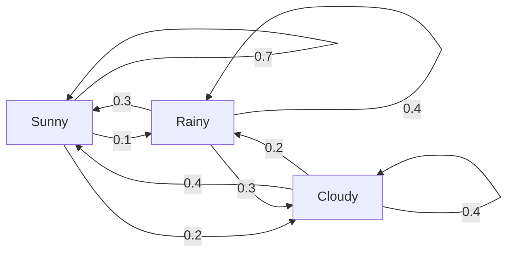
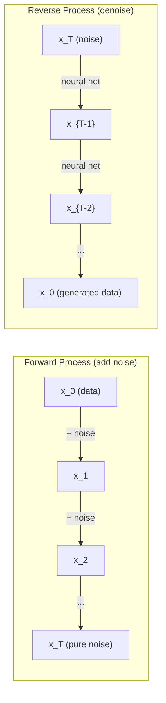

# العمليات المثقفة

> العشوائية مع الهيكل، والرياضيات وراء المشي العشوائي، سلسلة ماركوف، ونماذج التوزيع.
> هناك تطورات هيكلية.

**Type:** Learn | **类型:** 学习
**Language:**" بايثون "**语言:**بايثون
**Prerequisites:** Phase 1, Lessons 06-07 (probability, Bayes) | **前置知识:** Phase 1, 第 06-07 课（概率、贝叶斯）
**Time:** ~75 minutes | **时间:** ~75 分钟

## أهداف التعلم

- محاكاة المشي عشوائي 1D و 2D والتحقق من مقياس الترحيل
  模拟一维和二维随机游走,验证位移的 √n 缩放规则
- بناء محاكاة سلسلة ماركوف وحساب توزيعها الثابت عن طريق التكوين الخاص
  构建马尔可夫链模拟器,通过特征分解计算平稳分布
- تنفيذ ديناميكيات ميتروبوليس-هاستينغز MCMC و لانجفين للاستعراض من توزيعات المستهدفة
  实现 ميتروبوليس-هاستينغز MCMC 和 لانجفين 动力学, من الهدف التوزيع
- ربط عملية التوزيع الأمامي إلى حركة براونية وشرح كيفية توليد البيانات من خلال العملية العكسية
  التواصل مع عملية التوسع الاولى والحركة الاولى، شرح كيفية إنتاج البيانات


> **【中文解读】**
> 随机过程是有结构的随机性──马尔可夫链(الوضع الحالي يعتمد فقط على الخطوة الأولى) هو أساس PageRank──العملية السابقة للنموذج التوسع هي الحركة البراونغ 加噪声),العملية العكسية هي إضافة الضوضاء إلى الإنتاج──MCMC هي أساسية لتحقيق الإحصاءات البيئية──

## المشكلة المشكلة المشكلة

العديد من أنظمة الذكاء الاصطناعي تتضمن عشوائية تتطور مع مرور الوقت، وليس عشوائية ثابتة -- عشوائية مهيكلة، تسلسلية حيث تعتمد كل خطوة على ما حدث من قبل.

> العديد من أنظمة الذكاء الاصطناعي تتعلق بالشكل التطوري مع مرور الوقت. ليس مجرد حالة ثابتة، ولكن هناك حالة ترتيبية مهيكلة. كل خطوة تعتمد على ما حدث من قبل.

النماذج اللغوية تولد رموز واحدة في كل مرة. كل رموز تعتمد على السياق السابق. النموذج يخرج توزيع الاحتمالات، ومعينة من ذلك، والتحرك على. وهذا هو عملية استوكاستية.

> 语言模型逐个生成代币――每个代币取决于之前的上下文――模型输出一个概率分布,从中采样,然后继续――这是随机过程――

تضيف نماذج التنبع الضوضاء إلى صورة خطوة بخطوة حتى تصبح ثابتة خالصة. ثم يعكسون العملية ، ويقومون بتخفيض خطوة بخطوة حتى تظهر صورة جديدة. العملية الأمامية هي سلسلة ماركوف. العملية العكسية هي سلسلة ماركوف تعلمت تتراجع.

> نموذج التوسع تدريجياً نحو الصورة إضافة الضجيج، حتى يصبح صريحاً.

وكلاء التعلم التعزيزية يقومون بعمل في بيئة. كل عمل يؤدي إلى حالة جديدة مع بعض الاحتمالات. العميل يتبع سياسة عشوائية في عالم عشوائي. كل شيء هو عملية قرار ماركوف.

> 强化学习智能体在环境中执行动作──每动作以一定概率导致新状态──智能体在随机世界中遵循随机策略──整个系统是马尔可夫决策过程──MDP)──

أخذ العينات من MCMC -- العمود الفقري للإستنتاج البايسي -- يبن سلسلة ماركوف التي توزعها الثابت هو الجزء الخلفي الذي تريد أن تأخذ العينات منه.

> المكروسوفتية المختلفة من الـ MCMC                                                                                                                                                                                                                                                        

كل هذه البنائى على أربع أفكار أساسية:
1. المشي عشوائية -- أبسط عملية استوكاستية
2. سلسلة ماركوف -- الاختيار المُهيّن مع ماتريكس انتقالية
3. ديناميكية لانجفين -- انخفاض التدرج مع الضوضاء
4. "ميتروبوليس-هستنغز" -- أخذ عينات من أي توزيع

> جميع هذه المعلومات مبنية على أربعة مفاهيم أساسية: (1) السفر بسهولة، (2) سلسلة ماركوف بتركيبات تطورية، (3) تراجع درجة الضوضاء، (4) استعراضات من التوزيعات المختلفة.

## المفهوم الأساسي

### المشي العشوائي

البدء من الموقف 0، في كل خطوة، ضعي عملة عادلة. الرؤوس: تحرك يمينا (+1) والذيل: تحرك يسارا (-1).

> من موقع 0 开始── كل خطوة抛一枚公平硬币──正面:向右 (+1)──反面:向左 (-1)──

بعد n خطوات، موقفك هو مجموع n قيم عشوائية +/-1. الموقع المتوقع هو 0 (المشي غير متحيز). ولكن المسافة المتوقعة من المنشأ ينمو ك مربع ((n).

> بعد n 步后, موقعك هو n 个随机 ±1 值的求和──期望位置为 0(游走无偏), ولكن المسافة من النقطة الأصلية من المنتظر المسافة حسب √n 增长──

هذا غير بديهي. المشي عادلا - لا تجرف في أي اتجاه. ولكن مع مرور الوقت، يتجول أبعد وأكثر من حيث بدأ. الانحراف القياسي بعد n خطوات هو مربع ((n).

> هذا مع النقاط ضد الهواء. السفر هو عادل.

```
Step 0:  Position = 0
Step 1:  Position = +1 or -1
Step 2:  Position = +2, 0, or -2
...
Step 100: Expected distance from origin ~ 10 (sqrt(100))
Step 10000: Expected distance from origin ~ 100 (sqrt(10000))
```

**In 2D**يتنقل المشي للأعلى أو إلى الأسفل أو إلى اليسار أو إلى اليمين بنفس الاحتمال. نفس المقياس مربع ((n) ينطبق على المسافة من المنشأ. يتتبع المسار نمطًا يشبه الكسور.

> **二维情况下**, يذهب إلى و مثل احتمال ارتفاع ∞ ∞ ∞ ∞ ∞ ∞ ∞ ∞ ∞ ∞ ∞ ∞ ∞ ∞ ∞ ∞ ∞ ∞ ∞ ∞ ∞ ∞ ∞ ∞ ∞ ∞ ∞ ∞ ∞ ∞ ∞ ∞ ∞ ∞ ∞ ∞ ∞ ∞ ∞ ∞ ∞ ∞ ∞ ∞ ∞ ∞ ∞ ∞ ∞ ∞ ∞ ∞ ∞ ∞ ∞ ∞ ∞ ∞ ∞ ∞ ∞ ∞ ∞ ∞ ∞ ∞ ∞ ∞ ∞ ∞ ∞ ∞ ∞ ∞ ∞ ∞ ∞ ∞ ∞ ∞ ∞ ∞ ∞ ∞ ∞ ∞ ∞ ∞ ∞ ∞ ∞ ∞ ∞ ∞ ∞ ∞ ∞ ∞ ∞ ∞ ∞ ∞ ∞ ∞ ∞ ∞ ∞ ∞ ∞ ∞ ∞ ∞ ∞ ∞ ∞ ∞ ∞ ∞ ∞ ∞ ∞ ∞ ∞ ∞ ∞ ∞ ∞ ∞ ∞ ∞ ∞ ∞ ∞ ∞ ∞ ∞ ∞ ∞ ∞ ∞ ∞ ∞ ∞ ∞ ∞ ∞ ∞ ∞ ∞ ∞ ∞ ∞ ∞ ∞ ∞ ∞ ∞ ∞ ∞ ∞ ∞ ∞ ∞ ∞ ∞ ∞ ∞ ∞ ∞ ∞ ∞ ∞ ∞ ∞ ∞ ∞ ∞ ∞ ∞ ∞ ∞ ∞ ∞ ∞ ∞ ∞ ∞ ∞ ∞ ∞ ∞ ∞ ∞ ∞ ∞ ∞ ∞ ∞ ∞ ∞ ∞ ∞ ∞ ∞ ∞ ∞ ∞ ∞ ∞ ∞ ∞ ∞ ∞ ∞ ∞ ∞ ∞ ∞ ∞ ∞ ∞ ∞ ∞ ∞ ∞ ∞ ∞ ∞ ∞ ∞ ∞ ∞ ∞ ∞ ∞ ∞ ∞ ∞ ∞ ∞ ∞ ∞ ∞ ∞ ∞ ∞ ∞ ∞ ∞ ∞ 

**Why sqrt(n)?**كل خطوة هي +1 أو -1 مع احتمال متساو. بعد n خطوات، الموقف S_n = X_1 + X_2 + ... + X_n حيث كل X_i هو +/-1. تغير كل خطوة هو 1, والخطوات مستقلة، لذلك Var(S_n) = n. الانحراف القياسي = sqrt(n. بواسطة نظرية الحد المركزي، S_n / sqrt(n) يتقارب إلى توزيع طبيعي قياسي.

> **为什么是 √n？**كل خطوة تفرق على 1 خطوة و تفرق على الدرجة المستقلة، لذلك Var(S_n) = n، معيار差 = √n。由中心极限定理,S_n/√n 收到标准正态分布。

هذا مقياس مربع ((n) يظهر في كل مكان في ML. مقياس SGD الضجيج على أنها 1/sqrt(حجم البطاقة. إدراج مقياس الأبعاد على أنها sqrt(d). الجذر التربيعي هو توقيع إضافات عشوائية مستقلة.

> √n 缩放在 ML 中无处不在──SGD 噪音按1/√(批量_size) 缩放,嵌入维度按√d 缩放──平方根是独立随机叠加的标志──

**Connection to Brownian motion.**خذ مشاة عشوائية بحجم الخطوة 1/sqrt(n) و n خطوات لكل وحدة من الوقت. مع وصول n إلى اللانهاية، يتقارب المشي إلى حركة براونية B(t) - عملية متواصلة في الوقت حيث يتم توزيع B(t) عادة مع متوسط 0 والفرق t.

> **与布朗运动的联系。**取步长 1/√n、每单位时间 n 步的随机游走──当 n → ∞ 时,游走收到布朗运动 B(t) 一个连续时间过程,B(t) ~ N(0, t) ・・・

حركة براون هي الأساس الرياضي للتشويق. إنها تمثّل الارتجاج العشوائي للجسيمات في السائل، وتقلبات أسعار الأسهم، و -الأهم من ذلك- عملية الضوضاء في نماذج التشويق.

> حركة براون هي الأساس الرياضي لنموذج التوسع. إنها تصف حركة حركة الجسيمات في الجسم، وتغير أسعار الأسهم، وكذلك عملية الضجيج في نموذج التوسع.

**Gambler's ruin.**المشي عشوائي يبدأ من وضع k، مع حاجز امتصاص في 0 و N. ما هي احتمالات الوصول إلى N قبل 0؟ للمشي العادل: P(وصول N) = k/N. هذا بسيط ورائح بشكل مفاجئ. يرتبط بنظرية المارتينغال - المشي العادي العادل هو المارتينغال (القدر المستقبلي المتوقع = القيمة الحالية).

> **赌徒破产问题。**من موقع k خرج، في 0 和 N في وجود استيعاب الحدود. إلى N (( وليس 0) الاحتمال هو كم؟

### سلاسل ماركوف

سلسلة ماركوف هي نظام ينتقل بين الحالات وفقاً للاحتمالات الثابتة. الملكية الرئيسية: الحالة التالية تعتمد فقط على الحالة الحالية ، وليس على التاريخ.

> سلسلة ماركوف هي نظام يتحرك بين الحالات على أساس احتمال ثابت.

```
P(X_{t+1} = j | X_t = i, X_{t-1} = ...) = P(X_{t+1} = j | X_t = i)
```

هذا هو خاصية ماركوف. وهذا يعني أنه يمكنك وصف الديناميكيا بأكملها مع المصفوفة الانتقالية P:

> هذا هو طبيعة ماركوف. يعني أنه يمكنك استخدام المدير المتحرك P لوصف الحركة بأكملها.

```
P[i][j] = probability of going from state i to state j
```

كل صف من P يصل إلى 1 (يجب أن تذهب إلى مكان ما).

> في كل خط و في كل خط يجب أن تذهب إلى مكان ما

**Example -- Weather:**

> **示例——天气：**

```
States: Sunny (0), Rainy (1), Cloudy (2)

P = [[0.7, 0.1, 0.2],    (if sunny: 70% sunny, 10% rainy, 20% cloudy)
     [0.3, 0.4, 0.3],    (if rainy: 30% sunny, 40% rainy, 30% cloudy)
     [0.4, 0.2, 0.4]]    (if cloudy: 40% sunny, 20% rainy, 40% cloudy)
```

تبدأ في أي حالة. بعد العديد من الانتقالات، تقسيم الحالات يتقارب إلى التوزيع الثابت pi، حيث pi * P = pi. هذا هو المتجه الخليوي الخاص بـ P مع القيمة الخليوية 1.

> من حالة من أي شكل، بعد انتقال كاف، تتوفر حالة من تكوين تكوينات إلى تكوينات ثابتة π، لتلبية π·P = π── هي قيمة خاصة P للقطاع اليسرى من 1 ⋅

بالنسبة لسلسلة الطقس، قد يكون التوزيع الثابت [0.53، 0.18, 0.29] -- على المدى الطويل، هو مشمس 53% من الوقت بغض النظر عن الحالة البداية.
بالنسبة لسلسلة الطقس، توزيعها ثابت هو [0.55, 0.18, 0.27] -- على المدى الطويل، هو مشمس 55% من الوقت بغض النظر عن الحالة البداية.

> بالنسبة لسلسلة الطقس، يمكن أن يكون التوزيع المستقر [0.53، 0.18، 0.29] على المدى الطويل على نظر 53% من الوقت المفقود، لا علاقة له بالحالة الناشئة.



**Computing the stationary distribution.**هناك طريقتان:

1. **Power method**: ضرب أي توزيع أولي ب P مراراً وتكراراً. بعد تكرارات كافية، يتقارب.
2. **Eigenvalue method**: العثور على الجهاز المباشر اليسرى لـ P مع القيمة المباشرة 1. هذا هو الجهاز المباشر لـ P^T مع القيمة المباشرة 1.

> **计算平稳分布。**两种方法:1. **幂法**:反复用任意初始分布乘P,足足多次后收──2. **特征值法**: طلب P من قيمة الصفات الأيسر للنقطة الأيسر 1 ((أي P^T من قيمة الصفات الأيمن للنقطة الأيمن 1))

كل منهج يتطلب أن تلبي سلسلة ظروف التقارب.

> 两种方法都要求链满足收条件――

**Convergence conditions.**تتقارب سلسلة ماركوف إلى توزيع ثابت فريد إذا كانت:
- **Irreducible**: كل دولة يمكن الوصول إليها من كل دولة أخرى
- **Aperiodic**: لا تتدفق السلسلة مع فترة ثابتة

> **收敛条件。**السلسلة الواسعة الوحيدة التي تحتاج إلى تلبية:**不可约**(كل حالة قادرة على الوصول من حالة أخرى) ؛**非周期**(السلسلة لن تكون في دورة دورية ثابتة)

معظم السلاسل التي تواجهها في ML تلبي كلا الشرطين

> معظم السلاسل التي تواجهها في مجال التدريبات الإلكترونية تلبي هذه الشرطين

**Absorbing states.**حالة استيعاب إذا كنت مرة واحدة تدخلها، لا تترك أبدا (P[i][i] = 1). استيعاب سلسلة ماركوف نموذج العمليات مع الحالات النهائية -- لعبة التي تنتهي، العميل الذي يزعج، تسلسل رمزية التي تضرب رمز نهاية النص.

> **吸收状态。**مرة واحدة دخول في حالة لا تغادر أبدا ((P[i][i]=1) ~~ استيعاب ماركوف سلسلة بناء نموذج مع نهاية حالة عملية انتهاء اللعبة、流失的客户、命中结束代币序列──

**Mixing time.**كم خطوة حتى تكون السلسلة "قريبة" من التوزيع الثابت؟ بصورة رسمية، عدد الخطوات حتى تتراجع المسافة الإجمالية للتباين من الثبات إلى أقل من عتبة ما. الاختلاط السريع = عدد قليل من الخطوات المطلوبة. الفجوة الطيفية لـ P (1 ناقص الثاني أكبر قيمة خاصة) تحكم وقت الاختلاط. الفجوة الأكبر = الاختلاط السريع.

> **混合时间。**链"接近"平稳分布需要多少步骤? على النحو، هو مع平稳分布总变差距降低到值以下的步数──快混合 = 步数少──谱间隙(1 -第二大特征值) 控制混合时间:间隙越大,混合越快──

### الاتصال مع نماذج اللغة

إن توليد الرمز في نموذج لغة هو عملية ماركوف تقريبًا. بالنظر إلى السياق الحالي، يقوم النموذج بتوزيع على الرمز التالي. تتحكم درجة الحرارة في الحد:

> 语言模型的代币 生成近似是一个马尔可夫过程──给定当前上下文,模型输出下一个代币的概率分布──温度 控制分布的尖度:

```
P(token_i) = exp(logit_i / temperature) / sum(exp(logit_j / temperature))
```

- درجة الحرارة = 1.0: توزيع قياسي
- درجة الحرارة < 1.0: أكثر حدة (أكثر تحديدية)
- درجة الحرارة > 1.0: مسطحة (أكثر عشوائية)
- درجة الحرارة -> 0: argmax (طموح)

> درجة الحرارة = 1.0 标准分布;<1.0 更尖(更确定性);>1.0 更平坦(更随机);→0 退化为 argmax(贪心解码)

يختصر أخذ العينات من أعلى (k) إلى رموز ذات الاحتمال الأكبر. يختصر أخذ العينات من أعلى (p) إلى أصغر مجموعة من رموز تتجاوز احتمالها التراكمي p. كلتا الحالتين تعدل احتمالات انتقال ماركوف.

> أعلى ك 采样 الاحتفاظ على احتمالية أعلى ك 个 رمز ؛ أعلى p  核采样) الاحتفاظ على احتمالية التراكم على حدة أكبر من p 最小 token 集合──都修改了马尔可夫转移概率──

### الحركة البروونية

الحد المتواصل في الوقت للمشي عشوائي. الموقف B(t) لديه ثلاث خصائص:
1. B(0) = 0
2. B(t) - B(s) يتم توزيعها عادة مع متوسط 0 و t - s المتباين (ل t > s)
3. الزيادات على فترات غير متداخلة مستقلة

> 布朗运动是随机游走的连续时间极限──B(t) 有三条性质:B(0)=0;B(t) -B(s) ~ N(0, t-s); غير重叠区间上的增量独立──

حركة براونية مستمرة ولكن لا يمكن التمييز فيها في أي مكان - إنها تتحرك في كل مقياس. المسار لديه بعد كسر 2 في المستوى.

> 布朗运动连续但处处不可导它在每尺度都动──路径在平面上的分形维数为2──

في محاكاة منفصلة، تقترب من حركة براونية من خلال:

```
B(t + dt) = B(t) + sqrt(dt) * z,    where z ~ N(0, 1)
```

إن مقياس sqrt ((dt) مهم. يأتي من نظرية الحد المركزي المطبقة على المشيات العشوائية.

> 离散仿真中用 B(t+dt) = B(t) + √dt × z 近似布朗运动(z ~ N(0,1))

### ديناميكيات لانجفين

يجد التنزل التدريجي الحد الأدنى من وظيفة. ديناميكا لانجفين يجد توزيع الاحتمالات متناسبة مع exp(-U(x) / T) ، حيث U هو وظيفة الطاقة و T هو درجة الحرارة.

> 梯度下降找函数最小值──Langevin 动力学找概率分布  exp(-U(x) /T), منها U هي وظيفة الطاقة,T هي درجة الحرارة──

```
x_{t+1} = x_t - dt * gradient(U(x_t)) + sqrt(2 * T * dt) * z_t
```

قوى اثنتان تعمل على الجسيمة:
1. **Gradient force**(-dt * تراجع ((U)): يدفع نحو طاقة منخفضة (مثل تراجع تراجع)
2. **Random force**(sqrt(2*T*dt) * z): يدفع في اتجاهات عشوائية (التنقيب)

> 两种力作用在粒子上:1. **梯度力**推向低能量(类似梯度下降);2. **随机力**推向随机方向(探索)

عند درجة حرارة T = 0 ، هذا هو انخفاض تراجع خالص. عند درجة حرارة عالية ، فإنه تقريباً مشي عشوائيًا. عند درجة حرارة مناسبة ، تقوم الجسيم باستكشاف المشهد الطياري ويقضي المزيد من الوقت في مناطق منخفضة الطاقة.

> 温度 T=0 时是纯梯度下降──高温时近似随机游走──合适的温度下, الجسيمات تستكشف المشهد الطاقة وتتوقف في منطقة الطاقة المنخفضة لفترة أطول──

**Connection to diffusion models.**عملية التقدم في نموذج التوزيع هي:

```
x_t = sqrt(alpha_t) * x_{t-1} + sqrt(1 - alpha_t) * noise
```

هذه سلسلة ماركوف التي تضمّن البيانات ببطء مع الضجيج بعد خطوات كافية، x_T هو ضجيج غوسيان خالص.

> 扩散模型的前向过程:x_t = √α_t × x_{t-1} + √(1-α_t) × ضجيجها── هي سلسلة تدريجية متضمنة الضجيج، بما فيه الكفاية بعد خطوات x_T 变为纯高的噪声──

العملية العكسية -- من الضجيج إلى البيانات -- هي سلسلة ماركوف أيضاً، لكن احتمالات انتقالها يتم تعلمها من قبل شبكة عصبية. تتعلم الشبكة التنبؤ بالضجيج الذي تم إضافة كل خطوة، ثم تقوم بإسقاطه.

> عملية العكسية من الضجيج إلى البيانات هي أيضاً سلسلة ماركوف، ولكن احتمالات الانتقال من خلال تعلم النظام.



### MCMC: سلسلة ماركوف مونتي كارلو

في بعض الأحيان تحتاج إلى أخذ عينة من التوزيع p ((x) التي يمكنك تقييمها (حتى ثابت) ولكن لا يمكن أن تأخذ عينة من مباشرة.

> في بعض الأحيان تحتاج إلى من الممكن الحساب (لكن عدم وجودها في العدود العادية) ولكن لا يمكن أن تأخذ مباشرة مثل التوزيع p (x) في الاختبار.

**Metropolis-Hastings**يُبني سلسلة ماركوف التي يبلغ توزيعها الثابت p(x):

1. ابدأ من موقع ما x
2. اقترح موقف جديد x' من تقسيم الاقتراح Q(x'
3. نسبة قبول الحساب: a(x') * Q(x من الممكن أن يكون) / (p(x) * Q(x من الممكن أن يكون))
4. اقبل x' مع احتمالات min ((1، a) وإلا تبقى في x.
5. أكرر

> **Metropolis-Hastings**构建一个平稳分布为 p(x) 的马尔可夫链:1) 从某点 x 出发;2) 从提议分布 Q(x'就是x) 提出新位置 x';3) 计算接受率 a = p(x') Q(x 经过x') /((x) Q(x'经过x));4) 以概率 min(1,a) 接受,否则停留;5) 重复.

إذا كان Q متماثلًا على سبيل المثال ، Q(x' (يخ) = Q(x (يخ) = N(x ، sigma^2)) ، فإن النسبة تبسيط إلى a = p(x') / p(x. تحتاج فقط إلى نسبة الاحتمالات - استمرار التطبيع إلغاء.

> إذا كان Q بالنسبة للمسابقة (كالقوس) ، فإن معدل قبول يُبسيط إلى a = p(x') / p(x)  فقط يحتاج احتمالية تقليص العدد العادي للتحويل إلى التحويل تُزيل تلقائياً، وهذا هو السبب المثالي لـ MCMC بالنسبة لـ Bayesian تجربة.

من المضمون أن السلسلة تتحرك إلى p ((x) في ظروف خفيفة. ولكن التحرك يمكن أن يكون بطيئًا إذا كان الاقتراح صغيرًا جدًا (مشي عشوائي) أو كبيرًا جدًا (رفض مرتفع).

> في ظروف الحرارة والحرارة، فإن التسجيل قد يكون بطيء جداً، أو يكون مرتفع جداً.

**Why it works.**يضمن نسبة القبول التوازن التفصيلي: احتمال وجود في x والانتقال إلى x' يساوي احتمال وجود في x' والانتقال إلى x. التوازن التفصيلي يعني أن p(x) هو التوزيع الثابت للسلسلة. لذلك بعد خطوات كافية، تأتي العينات من p(x.

> **为什么有效**: معدل قبول ضمان التوازن التوازن التوازن التوازن التوازن التوازن التوازن التوازن التوازن التوازن التوازن التوازن التوازن التوازن التوازن التوازن التوازن التوازن التوازن التوازن التوازن التوازن التوازن التوازن التوازن التوازن التوازن التوازن التوازن التوازن التوازن التوازن التوازن التوازن التوازن التوازن التوازن التوازن التوازن التوازن التوازن التوازن التوازن التوازن التوازن التوازن التوازن التوازن التوازن التوازن التوازن التوازن التوازن التوازن التوازن التوازن التوازن التوازن التوازن التوازن التوازن التوازن التوازن التوازن التوازن التوازن التوازن التوازن التوازن التوازن التوازن التوازن التوازن التوازن التوازن التوازن التوازن التوازن التوازن التوازن التوازن التوازن التوازن التوازن التوازن التوازن التوازن التوازن التوازن التوازن التوازن التوازن التوازن التوازن التوازن التوازن التوازن التوازن التوازن التوازن التوازن التوازن التوازن التوازن التوازن التوازن التوازن التوازن التوازن التوازن التوازن التوازن التوازن التوازن التوازن التوازن التوازن التوازن التوازن التوازن التوازن التوازن التوازن التوازن التوازن التوازن التوازن التوازن التوازن التوازن التوازن التوازن التوازن التوازن التوازن التوازن التوازن التوازن التوازن التوازن التوازن التوازن التوازن التوازن التوازن التوازن التوازن التوازن التوازن التوازن التوازن التوازن التوازن التوازن التنفيذيبين التن التن التن التن التن التن التن التن التن التن التن التن التن التن التن التن التن التن التن التن التن التن التن التن التن التن التن التن التن التن التن التن التن التن التن التن التن التن التن التن التن التن التن التن التن التن التن التن التن التن التن التن التن التن التن التن التن التن التن التن التن التن التن التن التن التن التن التن التن التن التن التن التن التن التن التن التن التن التن التن التن التن التن التن التن التن التن التن التن التن التن التن التن وت وت وت وت وت

**Practical considerations:**
- **Burn-in**: يرمي أول عينات N. تحتاج السلسلة إلى وقت للوصول إلى التوزيع الثابت من نقطة البداية.
- **Thinning**: احتفظ بكل عينة ك- ثمة لتقليل التنسيق الذاتي.
- **Multiple chains**: تشغيل سلسلة متعددة من نقاط بداية مختلفة. إذا تجتمع إلى نفس التوزيع، لديك دليل على التقارب.
- **Acceptance rate**: بالنسبة لمقترحات غوس في d الأبعاد، فإن معدل قبول المثالي هو حوالي 23% (روبرتس وروسنتال، 2001) ؛ ارتفاع كبير يعني أن السلسلة بالكاد تتحرك. انخفاض كبير يعني أنها ترفض كل شيء.

> 实战要点:**Burn-in**丢弃前 N 个样本(链需要时间到达平稳分布);**Thinning**كل كـ 个样本取一个(降低自相关);**Multiple chains**من مختلف النقاط تشغيل سلسلة متعددة**Acceptance rate**أعلى معدل قبول للمقترحات في 23٪

### العمليات الاستوكاستية في الذكاء الاصطناعي

| Process | AI Application |
|---------|---------------|
| Random walk | Exploration in RL, Node2Vec embeddings |
| Markov chain | Text generation, MCMC sampling |
| Brownian motion | Diffusion models (forward process) |
| Langevin dynamics | Score-based generative models, SGLD |
| Markov decision process | Reinforcement learning |
| Metropolis-Hastings | Bayesian inference, posterior sampling |

> 随机过程在 AI 中的应用:随机游走:RL 探索、Node2Vec 嵌入) 、马尔可夫链 、文本生成、MCMC) 、布朗运动 、扩散模型前向) 、Langevin 动力学 、Score-based 模型、SGLD) 、马尔可夫决策过程 、强化学习) 、Metropolis-Hastings ٬贝叶斯推理、后验采样) 、

## بناء ذلك تحرك لتحقيق
```figure
random-walk-diffusion
```

## بناءها

### الخطوة الأولى: محاكاة المشي عشوائية

> 第1步:随机游走模拟器──1D باستخدام累加和,2D باستخدام أربعة اتجاهات(上下左右)

```python
import numpy as np

def random_walk_1d(n_steps, seed=None):
    rng = np.random.RandomState(seed)
    steps = rng.choice([-1, 1], size=n_steps)
    positions = np.concatenate([[0], np.cumsum(steps)])
    return positions


def random_walk_2d(n_steps, seed=None):
    rng = np.random.RandomState(seed)
    directions = rng.choice(4, size=n_steps)
    dx = np.zeros(n_steps)
    dy = np.zeros(n_steps)
    dx[directions == 0] = 1   # right
    dx[directions == 1] = -1  # left
    dy[directions == 2] = 1   # up
    dy[directions == 3] = -1  # down
    x = np.concatenate([[0], np.cumsum(dx)])
    y = np.concatenate([[0], np.cumsum(dy)])
    return x, y
```

يحتفظ المشي 1D بمجموعات تجميعية. كل خطوة هي +1 أو -1. بعد n خطوات، يكون الموقف هو المجموع. ينمو التباين خطيا مع n، لذلك ينمو الانحراف القياسي ك مربع ((n).

> 1 ويمكنه أن يزداد الارتفاعات في التخزين.

### الخطوة الثانية: سلسلة ماركوف

> 第2步:马尔可夫链――步骤() 按转移概率选下一状态;模拟() 跑多步生成轨迹;站式_分布() 用特征分解求平稳分布──

```python
class MarkovChain:
    def __init__(self, transition_matrix, state_names=None):
        self.P = np.array(transition_matrix, dtype=float)
        self.n_states = len(self.P)
        self.state_names = state_names or [str(i) for i in range(self.n_states)]

    def step(self, current_state, rng=None):
        if rng is None:
            rng = np.random.RandomState()
        probs = self.P[current_state]
        return rng.choice(self.n_states, p=probs)

    def simulate(self, start_state, n_steps, seed=None):
        rng = np.random.RandomState(seed)
        states = [start_state]
        current = start_state
        for _ in range(n_steps):
            current = self.step(current, rng)
            states.append(current)
        return states

    def stationary_distribution(self):
        eigenvalues, eigenvectors = np.linalg.eig(self.P.T)
        idx = np.argmin(np.abs(eigenvalues - 1.0))
        stationary = np.real(eigenvectors[:, idx])
        stationary = stationary / stationary.sum()
        return np.abs(stationary)
```

التوزيع الثابت هو المتجه الخليوي لـ P مع القيمة الخليوية 1. نجده عن طريق حساب المتجه الخليوي لـ P^T (تحويل المتجه الخليوي إلى متجه الخليوي الأيمن).

> التوزيع المُستقر هو قيمة خصائص P إلى 1 من قطاع الصفات اليسرى.

### الخطوة الثالثة: ديناميكيات لانجفين

> 第3步: لنجفين 动力学──梯度下降 + 高斯噪声 = 探索能量景观并采样──

```python
def langevin_dynamics(grad_U, x0, dt, temperature, n_steps, seed=None):
    rng = np.random.RandomState(seed)
    x = np.array(x0, dtype=float)
    trajectory = [x.copy()]
    for _ in range(n_steps):
        noise = rng.randn(*x.shape)
        x = x - dt * grad_U(x) + np.sqrt(2 * temperature * dt) * noise
        trajectory.append(x.copy())
    return np.array(trajectory)
```

يضغط التدرج x نحو طاقة منخفضة. الضجيج يمنعه من التعلق. عند التوازن، توزيع العينات متناسبة مع exp ((-U ((x) / درجة حرارة).

> 梯度把 x 推向低能量区, noise prevent into the local best 优──平衡时样本分布  exp(-U(x) /温度) 

### الخطوة الرابعة: "ميتروبوليس"

> 第4步:متروبوليس-هستنغز MCMC.

```python
def metropolis_hastings(target_log_prob, proposal_std, x0, n_samples, seed=None):
    rng = np.random.RandomState(seed)
    x = np.array(x0, dtype=float)
    samples = [x.copy()]
    accepted = 0
    for _ in range(n_samples - 1):
        x_proposed = x + rng.randn(*x.shape) * proposal_std
        log_ratio = target_log_prob(x_proposed) - target_log_prob(x)
        if np.log(rng.rand()) < log_ratio:
            x = x_proposed
            accepted += 1
        samples.append(x.copy())
    acceptance_rate = accepted / (n_samples - 1)
    return np.array(samples), acceptance_rate
```

يقدم الخوارزمية نقطة جديدة ، ويختبر ما إذا كانت لديها احتمال أكبر (أو تقبل مع احتمال متناسب مع النسبة) ، ويكرر. يجب أن يكون معدل القبول حوالي 23-50٪ للتلاعب الجيد.

> 算法流程:提议新点 → 检查概率是否更高(或按比例接受)→ 重复──良好混合的接受率应在23-50% 之间──

## استخدمها في إطار التنفيذ

في الممارسة العملية، تستخدم المكتبات القائمة لهذه الخوارزميات ولكن فهم الميكانيكا مهم في التحليل والتحديد.

> في الواقع، تستخدم قاعدة بيانات متقدمة لتحقيق هذه الخوارزميات. ولكن فهم الآلية هو مهم جدا.

```python
import numpy as np

rng = np.random.RandomState(42)
walk = np.cumsum(rng.choice([-1, 1], size=10000))
print(f"Final position: {walk[-1]}")
print(f"Expected distance: {np.sqrt(10000):.1f}")
print(f"Actual distance: {abs(walk[-1])}")
```

> عدد عمليات تحقيق المرحلة المباشرة: 1 صف كود توليد 10000 خطوة ± 1 随机游走,验证实际距离与理论值 √10000 = 100 接近──

### النمبي للمصفوفات الانتقالية

```python
import numpy as np

P = np.array([[0.7, 0.1, 0.2],
              [0.3, 0.4, 0.3],
              [0.4, 0.2, 0.4]])

distribution = np.array([1.0, 0.0, 0.0])
for _ in range(100):
    distribution = distribution @ P

print(f"Stationary distribution: {np.round(distribution, 4)}")
```

> عدد المجموعات 处理转移矩阵: من [1,0,0] 出发,反复左乘 P 100 مرات,自动收到平稳分布──这就是 PageRank 等算法的核心──

مضاعفة التوزيع الأولي ب P مراراً وتكراراً. بعد تكرارات كافية، يتقارب إلى التوزيع الثابت بغض النظر عن المكان الذي بدأت فيه. هذه هي طريقة الطاقة للعثور على المتجه المسيطر اليساري.

> عكس النشر الأولية بـ P.                                                                                                                                                                                                                                                          

### الروابط إلى الإطار الحقيقي

- **PyTorch diffusion:**- نعم`DDPMScheduler`في العناق الوجه`diffusers`يطبق سلسلة ماركوف الأمامية والعكسية
- **NumPyro / PyMC:**استخدام MCMC (مُعينة NUTS، التي تحسن على Metropolis-Hastings) للإستنتاج البايسي
- **Gymnasium (RL):**وظيفة خطوة البيئة تعريف عملية قرار ماركوف

> مع ريال فريميرك                                                                                                                                                                                                                                                                                                                                                                                                                                                                                                                       `diffusers`DDPMS المخطط لتحقيق النموذج المنتشر إلى الأمام / إلى الأمام من سلسلة ماركوف؛ NumPyro / PyMC باستخدام NUTS 采样器 (منحرف النسخة المتطورة من Metropolis-Hastings) لقيام بتقرير بيلس؛ وظيفة خطوة من المدارس تحدد عملية اتخاذ القرار ماركوف.

### التحقق من التقارب في سلسلة ماركوف

```python
import numpy as np

P = np.array([[0.9, 0.1], [0.3, 0.7]])

eigenvalues = np.linalg.eigvals(P)
spectral_gap = 1 - sorted(np.abs(eigenvalues))[-2]
print(f"Eigenvalues: {eigenvalues}")
print(f"Spectral gap: {spectral_gap:.4f}")
print(f"Approximate mixing time: {1/spectral_gap:.1f} steps")
```

الفجوة الطيفية تخبرك كم السلسلة تنسى حالتها الأولية بسرعة. فجوة 0.2 تعني حوالي 5 خطوات للتخليط. فجوة 0.01 تعني حوالي 100 خطوة. تحقق دائما من هذا قبل تشغيل محاكاة طويلة -- حساب مخلوطة سلسلة نفايات ببطء.

> 谱隙告诉你链多快忘初始状态――0.2 间隙大约需要5步混合;0.01 大约需要100步――运行长仿真前总要检查这个慢混合的链浪费算力――

## أرسلها .

هذا الدرس ينتج عن:
- `outputs/prompt-stochastic-process-advisor.md`-- عرض يساعد على تحديد إطار العملية الاستوكاستية المطبقة على مشكلة معينة

> 本课产出:帮助识别给定问题适用哪种随机过程框架的提示词──

## العلاقات مفهوم

| Concept | Where it shows up |
|---------|------------------|
| Random walk | Node2Vec graph embeddings, exploration in RL |
| Markov chain | Token generation in LLMs, MCMC sampling |
| Brownian motion | Forward diffusion process in DDPM, SDE-based models |
| Langevin dynamics | Score-based generative models, stochastic gradient Langevin dynamics (SGLD) |
| Stationary distribution | MCMC convergence target, PageRank |
| Metropolis-Hastings | Bayesian posterior sampling, simulated annealing |
| Temperature | LLM sampling, Boltzmann exploration in RL, simulated annealing |
| Mixing time | Convergence speed of MCMC, spectral gap analysis |
| Absorbing state | End-of-sequence token, terminal states in RL |
| Detailed balance | Correctness guarantee for MCMC samplers |

> 概念关联:随机游走(Node2Vec、RL 探索)、马尔可夫链(LLM رمز 生成、MCMC)、布朗运动) (DDPM 前向过程)、Langevin 动力学(تأسس النتيجة 模型、SGLD)、平稳分布(MCMC 收目标、PageRank)、متروبوليس-هاستنجز(贝叶斯后验、模拟退火)、温度 ‬م 采样、بoltzmann 探索)、 وقت الاختلاط(MCMC 收速度)、 امتصاص الحالة(序列结束、RL 终止状态)、详细平衡证券(MCMC 采样器的正确性保证) ‬

تستحق نماذج الانتشار اهتمامًا خاصًا. تعرّف DDPM (Ho et al., 2020) سلسلة ماركوف الأمامية:

```
q(x_t | x_{t-1}) = N(x_t; sqrt(1-beta_t) * x_{t-1}, beta_t * I)
```

حيث beta_t هو جدول ضجيج. بعد خطوات T، x_T حوالي N(0, I). يتم تعريف العملية العكسية بواسطة شبكة عصبية تتوقع الضجيج:

```
p_theta(x_{t-1} | x_t) = N(x_{t-1}; mu_theta(x_t, t), sigma_t^2 * I)
```

كل خطوة من التوليد هي خطوة في سلسلة ماركوف تعلم. فهم سلسلة ماركوف يعني فهم كيف ولماذا نموذج التوزيع تولد البيانات.

SGLD (حركة Langevin المتحركة من حيث التدريج المتحرك) تجمع بين انخفاض التدريج المحدد مع ضجيج Langevin. بدلاً من حساب التراجع الكامل، تستخدم تقديرًا استوكاستيكيًا وتضيف ضجيجًا مقياسيًا. مع تراجع معدل التعلم، فإن SGLD تنتقل من التحسين إلى أخذ العينات -- تحصل على عينات بايزية خلفية تقريبا مجانا. هذه واحدة من أبسط الطرق للحصول على تقديرات عدم اليقين من شبكة عصبية.

المفهوم الرئيسي عبر كل هذه العلاقات: العمليات الاستوكاسية ليست أدوات نظرية فقط. إنها آليات الحساب داخل أنظمة الذكاء الاصطناعي الحديثة. عندما تقوم بتحديد درجة حرارة ماجستير في العلوم، أنت تقوم بتعديل سلسلة ماركوف. عندما تدرب نموذج التوزيع، تتعلمين كيفية عكس عملية مثل حركة براون. عندما تقوم بإجراء استنتاج بايسي، تقوم ببناء سلسلة تتقارب إلى الخلفية.

> 穿越所有这些联系的核心洞见:随机过程不仅仅是理论工具,它们是现代 AI 系统内部的计算机械. 调整LLM的温度时,你在调整马尔可夫链; 训练扩散模型时,你在学习反转布朗运动过程;运行贝叶斯推理时,你在构建收收到后验链.

## تمارين التدريب

1. **Simulate 1000 random walks of 10000 steps.**رسم توزيع المواقع النهائية. التحقق من أنه تقريبا غوسيان مع متوسط 0 والانحراف القياسي sqrt(10000) = 100.

2. **Build a text generator using a Markov chain.**تدريب على مجموعة صغيرة: لكل كلمة، عد الانتقالات إلى الكلمة التالية. بناء ماتريكية الانتقال. توليد جمل جديدة عن طريق أخذ عينات من السلسلة.

3. **Implement simulated annealing**استخدام متروبوليس-هستينغز. تبدأ عند درجة حرارة عالية (تقبل كل شيء تقريبا) وتبرد تدريجيا (تقبل تحسينات فقط). استخدمها للعثور على الحد الأدنى من وظيفة مع العديد من الحد الأدنى المحلية.

4. **Compare Langevin dynamics at different temperatures.**عينة من إمكانات البئر المزدوجة U(x) = (x^2 - 1)^2. عند درجة حرارة منخفضة، تجمع العينات في بئر واحد. عند درجة حرارة عالية، تنتشر على كليهما. حدد درجة الحرارة الحرجة حيث تتلاشى السلسلة بين البئر.

5. **Implement the forward diffusion process.**ابدأ بإشارة 1D (مثل موجة الصدري). أضف الضجيج تدريجياً على مدى 100 خطوة مع جدول ضجيج خطي. أظهر كيف تتدهور الإشارة إلى ضجيج نقي. ثم قم بتنفيذ مؤشر بسيط يعكس العملية (حتى واحد ساذج يخص فقط الضجيج المقدر).

## شروط الرئيسية

| Term | What people say | What it actually means |
|------|----------------|----------------------|
| Random walk | "Coin-flip movement" | A process where position changes by random increments at each step |
| Markov property | "Memoryless" | The future depends only on the present state, not on the history |
| Transition matrix | "The probability table" | P[i][j] = probability of moving from state i to state j |
| Stationary distribution | "The long-run average" | The distribution pi where pi*P = pi -- the chain's equilibrium |
| Brownian motion | "Random jiggling" | The continuous-time limit of a random walk, B(t) ~ N(0, t) |
| Langevin dynamics | "Gradient descent with noise" | Update rule that combines deterministic gradient and random perturbation |
| MCMC | "Walking toward the target" | Constructing a Markov chain whose stationary distribution is the one you want |
| Metropolis-Hastings | "Propose and accept/reject" | MCMC algorithm that uses acceptance ratios to ensure convergence |
| Temperature | "The randomness knob" | Parameter controlling the tradeoff between exploration and exploitation |
| Diffusion process | "Noise in, noise out" | Forward: gradually add noise. Reverse: gradually remove it. Generates data. |

> 术语速查:المرحمة(随机游走)、ملاك ماركوف(无记忆性)、المصفوفة الانتقالية(转移矩阵 P[i][j])、توزيع ثابت(平稳分布 π·P=π)、حركة براونية(布朗运动 B(t) ~N(0,t))、ديناميكا لانجفين(带噪声的梯度下降)、MCMC(构建平稳分布为目标分布的马尔可夫链)、متروبوليس-هاستينغز(提议-接受/拒绝MC 算法)、温度探索/利用平衡参数)、Diffusion process(前加噪、反向去产生噪音数据) 

## المزيد من القراءة

- **Ho, Jain, Abbeel (2020)**-- "إرفض نماذج احتمالية التوزيع". ورقة DDPM التي أطلقت ثورة نموذج التوزيع. مشتق واضح من سلسلة ماركوف الأمامية والعكسية.
- **Song & Ermon (2019)**-- "المؤثرات التجاريّة عن طريق تقدير درجات توزيع البيانات". النهج القائم على النتيجة باستخدام ديناميكيات لنجفين للاستعراض.
- **Roberts & Rosenthal (2004)**-- "سلسلة ماركوف العامة في الفضاء والخوارزميات MCMC". النظرية وراء متى و لماذا يعمل MCMC.
- **Norris (1997)**-- "سلسلة ماركوف" -- كتاب دراسي قياسي يغطي التقارب، التوزيعات الثابتة، وأوقات الضربة
- **Welling & Teh (2011)**-- "التعلم البايسي عن طريق ديناميكة لانجفين المتحركة". يجمع بين SGD و ديناميكة لانجفين
