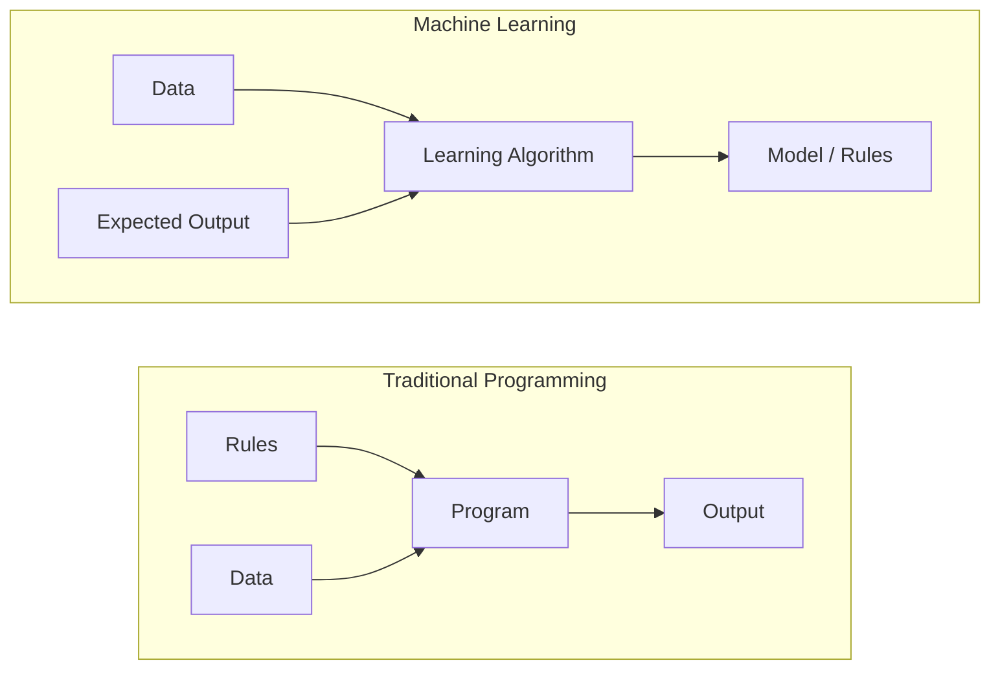
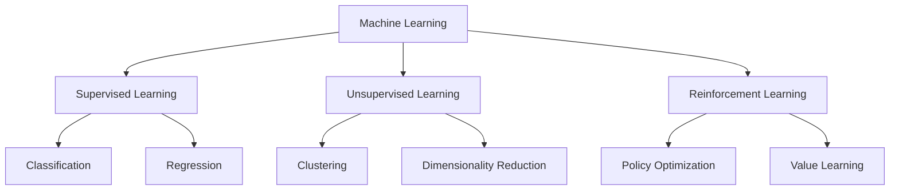
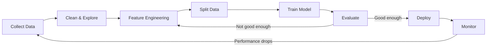
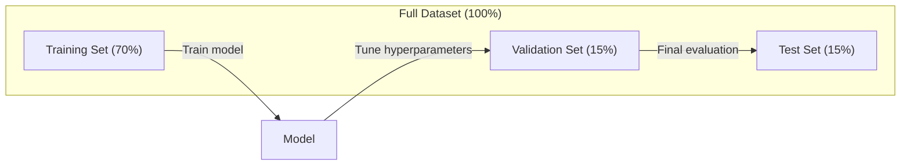
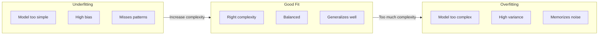
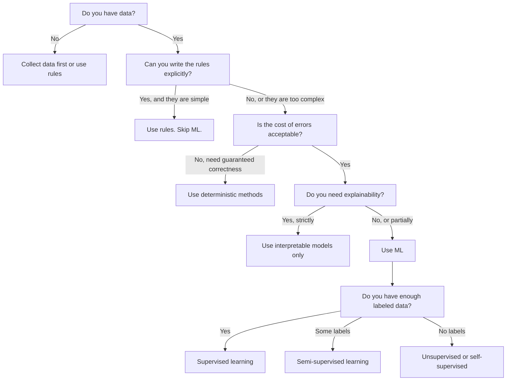

# ما هو التعلم الآلي
# ما هو التعلم الآلي


> تعلم الآلة هو تعليم الكمبيوتر للعثور على أنماط في البيانات بدلا من كتابة القواعد يدويا.

> تعلم الآلة هو تعليم الكمبيوتر من قواعد العثور على البيانات ، وليس عن طريق قواعد الكتابة الاصطناعية.

**Type:** Learn | **类型：** 学习
**Languages:** Python
**Prerequisites:** Phase 1 (Math Foundations) | **前置知识：** Phase 1（数学基础）
**Time:** ~45 minutes | **时间：** 约 45 分钟

## أهداف التعلم

- شرح الفرق بين التعلم المراقب والغير المراقب والتعلم المُعزز وتحديد النوع الذي ينطبق على مشكلة معينة
  解释监督学习、无监督学习和强化学习之间的区别,并判断给给定问题适用哪种类型
- تنفيذ أقرب تصنيف مركزي من الصفر وتقييمها ضد خط أساسي عشوائي
  من التحقق من الصفر، تقييم مقارنة مع المرتبط
- تمييز بين مهام التصنيف والعودة واختيار وظيفة الخسارة المناسبة لكل منها
  区分分类和归归任务, للكل من المهام اختيار وظيفة الخسارة المناسبة
- تقييم ما إذا كانت مشكلة تجارية معينة مناسبة لمعالجة المعلومات أو تحل بشكل أفضل باستخدام قواعد تحديدية
  قيام مشكلة عمل مناسبة لتحل المشكلة أو استخدام قواعد تحديد أفضل


> **【中文解读】**
> 机器学习是让计算机自动学习规律从数据中,而不是靠人工编写规则──监督学习(有标签)、无监督学习(无标签)、强化学习(奖励信号) 是三大范式──对应 sklearn 中各类估计者──

> **【拓展：机器学习范式的产业应用】**
> GPT-4 استخدام الذاتي مراقبة تعلم(预测下一个代币) في حوالي 130000000000代币 上训练;BERT استخدام掩码语言建模在维基百科 + BookCorpus 上预训练;AlphaGo استخدام强化学习通过自我对对超越人类围棋冠军。

## المشكلة المشكلة المشكلة

تريد بناء مرشح للشحوم. النهج التقليدي: الجلوس و كتابة مئات القواعد. "إذا كان البريد الإلكتروني يحتوي على "مال مجاني"، ضع علامة على أنها شحوم. إذا كان لديها أكثر من 3 علامات صرخة، ضع علامة على أنها شحوم. " أنت تقضي أسابيع في كتابة القواعد. ثم يقوم المتسللون بتغيير صياغته. قواعدك تنتهك. أنت تكتب المزيد من القواعد. الدورة لا تنتهي أبدا.

> ستريد بناء مُصفّح بريد فضائي. الطريقة التقليدية هي الجلوس والكتابة من مئات القواعد. إذا كان البريد يحتوي على "مال مجاني"، فلتسمى بريد فضائي. إذا كان أكثر من ثلاثة أشجار، فلتسمى بريد فضائي.

تعلم الآلة يغير هذا. بدلاً من كتابة القواعد، تعطى الكمبيوتر الآلاف من الرسائل الإلكترونية المسموحة ("رغوة" أو "ليس رغوة") وتدعها تفكر في القواعد بنفسه. الكمبيوتر يجد أنماط لم تكن قد فكرت بها. عندما يغير الرغوة التكتيكات، تقوم بتدريب جديد على البيانات بدلاً من إعادة كتابة الرمز.

> تعكس التعلم الآلي هذا النمط. لا تقوم بتدوين قواعد، بل تعطى الكمبيوتر آلاف البريد المُعَلَّم، فدعها تكتشف قواعد. الكمبيوتر يكتشف أنَّك لم تتوقّع أبداً. عندما يغير المرسل البريد المُزخرف استراتيجيته، عليك فقط إعادة التدريب على البيانات الجديدة، وليس إعادة كتابة الكود.

هذا التحول من "قواعد البرمجة" إلى "التعلم من البيانات" هو جوهر التعلم الآلي. كل محرك توصيات، ومساعد صوتي، وسيارة ذاتية القيادة، ونموذج اللغة يعمل بهذه الطريقة.

> تحول من قواعد البرمجة إلى التعلم من البيانات هو جوهر التعلم الآلي. كل محرك توصية ومساعد صوت ومحركات ذاتية القيادة وموديل لغوي يعمل على هذا النحو.

> **【中文解读】**
> التخطيط التقليدي هو "قواعد كتابة الإنسان، تنفيذ الآلة"؛ تعلم الآلة هو "قواعد إعطاء البيانات، تحديد الآلة نفسها". على سبيل المثال، فالتصفية البريد المزعج: الطرق التقليدية تتطلب الحفاظ على مئات القواعد، بينما الطرق التدريبية تحتاج فقط إلى تقديم الكثير من المشاركات البريدة، وتعلم النموذج بشكل تلقائي أن يتعرف على النموذج.

> **【拓展：垃圾邮件过滤的演进】**
> تصفية رسائل زبائح في Gmail يومياً حوالي 3 مليارات رسالة، معدل تحديد أكثر من 99.9%.

## المفهوم الأساسي

### التعلم من البيانات وليس من القواعد

البرمجة التقليدية والتعلم الآلي يحل المشاكل في اتجاهات معارضة.

> تغييرات في التعلم التقليدي والإعدادات



البرمجة التقليدية: أنت تكتب القواعد. البرنامج يطبقها على البيانات لإنتاج الخروج.

> 传统编程:你编写规则──程序将规则应用于数据产生输出──

تعلم الآلة: توفر البيانات والمخرجات المتوقعة. ال خوارزمية تكتشف القواعد.

> 机器学习:你提供数据和期望输出――算法自动发现规则──

"النموذج" الذي يأتي من التدريب هو القواعد، ويشكّل بأرقام (وزن، ملامح). فإنه يُعمّل من الأمثلة التي رأىها لتحقيق التنبؤات على البيانات التي لم يسبق له أن رأى.

> النموذج الذي يتم تدريبه هو القاعدة نفسها، في شكل رقمية، والتي يمكن أن تكون مُتعددة، من خلال النموذج الذي تم رؤيتها، لتقدير البيانات الجديدة التي لم تتم رؤيتها من قبل.

> **【中文解读】**
> التفريق الحقيقي بين التخطيط التقليدي ومع التعلم الآلي: التخطيط التقليدي يدخل "القواعد+ البيانات" يُصبح "المخرج" ؛ التعلم الآلي يدخل "البيانات+ توقعات الإنتاج" يُصبح "الموديل" (القواعد) "..

### الأنواع الثلاثة من التعلم الآلي



**Supervised Learning**: لديك زوجات المدخلات والمخرجات. يتعلم النموذج رسم الخواص إلى الخواص.
- "هنا 10 آلاف صورة تحمل علامة القط أو الكلب، تعلم كيف تفصل بينها".
- "هنا ميزات المنزل وأسعارها، تعلم التنبؤ بالأسعار".

> **监督学习**لديك مدخل-خروج لل...
> - "هناك 10 آلاف صورة لقط أو كلب تميزها"
> - "هنا يوجد خصائص ومسعار المنازل.

**Unsupervised Learning**لديك مدخلات فقط لا تسميات النموذج يجد هيكلًا بنفسه
- "هنا 10 آلاف تاريخ مشتريات العملاء، إبحث عن مجموعات طبيعية"
- "هنا 1000 نقطة بيانات بعدية، خفض إلى 2 أبعاد مع الحفاظ على الهيكل".

> **无监督学习**: أنت فقط إدخال، لا يوجد علامة.
> - "هناك 10 آلاف زبون هنا يبحثون عن النتائج الطبيعية"
> - "هنا هناك 1000 نقطة بيانات في الاحتفاظ بالهيكل في نفس الوقت إلى 2 طولات"

**Reinforcement Learning**: يقوم العميل بعمل في بيئة ويتلقى مكافآت أو عقوبات. يتعلم استراتيجية (سياسة) لتعظيم الكمية الكاملة من المكافأة.
- "لعب هذه اللعبة، +1 للفوز، -1 للفقدان، اكتشف استراتيجية".
- "تحكم في ذراع الروبوت هذا +1 لالتقاط الكائن، -0.01 لكل ثانية مضيعة".

> **强化学习**: الذكاء يتصرف في البيئة ويحصل على مكافأة أو عقاب.
> - "لعب هذه اللعبة، فاز +1، خسرت -1، وجدت نفسك استراتيجية"".
> - "تحكم هذه الذراع الآلية . . . . . . . . . . . . . . . . . . . . . . . . . . . . . . . . . . . . . . . . . . . . . . . . . . . . . . . . . . . . . . . . . . . . . . . . . . . . . . . . . . . . . . . . . . . . . . . . . . . . . . . . . . . . . . . . . . . . . . . . . . . . . . . . . . . . . . . . . . . . . . . . . . . . . . . . . . . . . . . . . . . . . . . . . . . . . . . . . . . . . . . . . . . . . . . . . . . . . . . . . . . . . . . . . . . . . . . . . . . . . . . . . . . . . . . . . . . . . . . . . . . . . . . . . . . . . . . . . . . . . . . . . . . . . . . . . . . . . . . . . . . . . . . . . . . . . . . . . . . . . . . . . . . . . . . . . . . . . . . . . . . . . . . . . . . . . . . . . . . . . . . . . . . . . . . . . . . . . . . . . . . . . . . . . . . . . . . . . . . . . . . . . . . . . . . . . . . . . . . . . . . . . . . . . . . . . . . . . . . . . . . . . . . . . . . . . . . . . . . . . . . . . . . . . . . . . . . . . . . . . . . . . . . . . . . . . . . . . . . . . . . . . . . . . . . . . . . . . . . . . .

معظم ما ستبني في الممارسة يستخدم التعلم المشرف عليه. التعلم غير المشرف عليه شائع للتعليم المسبق والاستكشاف. تعزيز التعلم قوى AI اللعبة، الروبوتات، و RLHF لنماذج اللغة.

> في الممارسة العملية، تستخدم معظم النظم التي تقوم ببناءها للتعلم المراقب.

> **【拓展：三种范式在真实系统中的分工】**
> نيتفليكس 推系统同时使用三种范式:协同过(无监督聚类用户群体) 监督学习(预测用户对电影的评分 1-5 星) 强化学习(A/B 测试选择最优推策略)  تيسلا Autopilot 使用监督学习(目标检测) + 强化学习(路径规划)  تدريب انتشار مستقر يتعلق بالتحكم الذاتي(图像文本对学习 CLIP) + 监督微调......

### ما وراء الثلاثة الكبرى

الفئات الثلاث أعلاه نظيفة، ولكن العالم الحقيقي ML غالبا ما يغمض الخطوط.

> هذه الفئات الثلاثة واضحة جداً، ولكن العالم الحقيقي يضيء هذه الحدود.

**Semi-supervised learning**يستخدم مجموعة صغيرة من البيانات المعلقة ومجموعة كبيرة من البيانات غير المعلقة. قد يكون لديك 100 صورة طبية معلقة و100000 صورة غير معلقة.

> **半监督学习**باستخدام عدد قليل من بيانات العلامات والكثير من البيانات غير المعلامة. يمكنك الحصول على 100 صورة طبية معلامة و100000 صورة غير معلامة.

- **Label propagation:**قم ببناء رسم بياني يربط نقاط البيانات المماثلة. تمتد العلامات من العقد المسموحة إلى الجيران غير المسموحين من خلال الرسم البياني.
  **标签传播：**بناء اتصال مشابه للنقاط البيانية. الرسم من النقطة المعلقة عبر الرسم إلى النقطة المجاورة غير المعلقة.
- **Pseudo-labeling:**تدريب نموذج على البيانات المعلقة، استخدمه للتنبؤ باللوائح للبيانات غير المعلقة، ثم إعادة تدريب على كل شيء.
  **伪标签：**في نموذج التدريب على البيانات المعلقة، باستخدامها التنبؤ بالتعليمات غير المعلقة، ثم إعادة التدريب على جميع البيانات.
- **Consistency regularization:**يجب أن يعطي النموذج نفس التنبؤ للمدخول ونسخة متضايقة قليلاً من تلك المدخلات. هذا يعمل حتى دون علامات.
  **一致性正则化：**يجب أن يقدم النموذج نفس التنبؤ على الإدخال والإصدارات الخفيفة.

**Self-supervised learning**يخلق الإشراف من البيانات نفسها. لا حاجة إلى علامات بشرية على الإطلاق. النموذج يخلق مهمة التنبؤ الخاصة به من بنية البيانات.

> **自监督学习**من البيانات نفسها إنشاء إشارات مراقبة. تماما لا حاجة إلى علامات اصطناعية. النموذج من بنية البيانات إنشاء مهام التنبؤ الخاصة بك.

- **Masked language modeling (BERT):**إخفاء 15٪ من الكلمات في الجملة، تدريب النموذج على التنبؤ بالكلمات المفقودة. "التسميات" تأتي من النص الأصلي.
  **掩码语言建模（BERT）：**遮盖句中 15% 的词,训练模型预测被遮盖的词――"标签"来自原始文本──
- **Contrastive learning (SimCLR):**خذ صورة، وإنشأ نسختين متزايدة، ومرح النموذج بتعرفها على أنها جاءت من نفس الصورة بينما تميزها عن نسخة متزايدة من الصور الأخرى.
  **对比学习（SimCLR）：**取一张图像,创建两个增强版本──训练模型识别它们来自同一张图像,同时与其他图像的增强版本区分──
- **Next-token prediction (GPT):**توقع الكلمة التالية مع كل الكلمات السابقة. كل وثيقة نصية تصبح مثال تدريب.
  **下一 token 预测（GPT）：**给定前面所有词,预测下一个词―― كل المقالة تصبح تمرين نموذج――

> **【拓展：自监督学习如何驱动大模型革命】**
> إشارة التدريب: برت تغطي 15٪ من الكلمات لتوقعات النموذج، جي بي تي  توقع التوقعات القادمة، سيم سي إل آر  من خلال بيانات تعزيز التعلم التجريبي ‬‬‬‬‬‬‬‬‬‬‬‬‬‬‬‬‬‬‬‬‬‬‬‬‬‬‬‬‬‬‬‬‬‬‬‬‬‬‬‬‬‬‬‬‬‬‬‬‬‬‬‬‬‬‬‬‬‬‬‬‬‬‬‬‬‬‬‬‬‬‬‬‬‬‬‬‬‬‬‬‬‬‬‬‬‬‬‬‬‬‬‬‬‬‬‬‬‬‬‬‬‬‬‬‬‬‬‬‬‬‬‬‬‬‬‬‬‬‬‬‬‬‬‬‬‬‬‬‬‬‬‬‬‬‬‬‬‬‬‬‬‬‬‬‬‬‬‬‬‬‬‬‬‬‬‬‬‬‬‬‬‬‬‬‬‬‬‬‬‬‬‬‬‬‬‬‬‬‬‬‬‬‬‬‬‬‬‬‬‬‬‬‬‬‬‬‬‬‬‬‬‬‬‬‬‬‬‬‬‬‬‬‬‬‬‬‬‬‬‬‬‬‬‬‬‬‬‬‬‬‬‬‬‬‬‬‬‬‬‬‬‬‬‬‬‬‬‬‬‬‬‬‬‬‬‬‬‬‬‬‬‬‬‬‬‬‬‬‬‬‬‬‬‬‬‬‬‬‬‬‬‬‬‬‬‬‬‬‬‬‬‬‬‬‬‬‬‬‬‬‬‬‬‬‬‬‬‬‬‬‬‬‬‬‬‬‬‬‬‬‬‬‬‬‬‬‬‬‬‬‬‬‬‬‬‬‬‬‬‬‬‬‬‬‬‬‬‬‬‬‬‬‬‬‬‬‬‬‬‬‬‬‬‬‬‬‬‬‬‬‬‬‬‬‬‬‬‬‬‬‬‬‬‬‬‬‬‬‬‬‬‬‬‬‬‬‬‬‬‬‬‬‬‬‬‬‬‬‬‬‬‬‬‬‬‬‬‬‬‬‬‬‬‬‬‬‬‬‬‬‬‬‬‬‬‬‬‬‬‬‬‬‬‬‬‬‬‬‬‬‬‬‬‬‬

هذه ليست فئات منفصلة عن الثلاثة الكبرى. إنها استراتيجيات تجمع بين الأفكار المراقبة وغير المراقبة. يتم إشراف التعلم الذاتي تقنياً (النموذج يتوقع شيئاً) ، ولكن يتم إنشاء اللقبات تلقائيًا ، وليس من قبل البشر.

> إنها ليست من الفئات الجديدة المفصلة عن الفئات الثلاثة الكبرى. إنها استراتيجيات من بين الرقابة والفكر غير الرقابي.

### التصنيف مقابل الرجوع

هذه هي المهام الرئيسية الثانية للتعلم المشرف عليه.

> هذه مهمتين رئيسيتين للتدريب

| Aspect | Classification | Regression |
|--------|---------------|------------|
| Output | Discrete categories | Continuous numbers |
| Example | "Is this email spam?" | "What will the house price be?" |
| Output space | {cat, dog, bird} | Any real number |
| Loss function | Cross-entropy, accuracy | Mean squared error, MAE |
| Decision | Boundaries between classes | A curve that fits the data |

| 方面 | 分类 | 回归 |
|------|------|------|
| 输出 | 离散类别 | 连续数值 |
| 示例 | "这封邮件是垃圾邮件吗？" | "房价会是多少？" |
| 输出空间 | {猫, 狗, 鸟} | 任意实数 |
| 损失函数 | 交叉熵、准确率 | 均方误差、MAE |
| 决策方式 | 类别之间的边界 | 拟合数据的曲线 |

الجوابات المرتبطة بالصنف هي: "أي فئة؟" والرجوع يرد: "كم؟"

>  分类回答" 哪个类别?" 回归回答"多少?"

بعض المشاكل يمكن أن تكون في إطار أي من الطرق. التنبؤ إذا كان السهم يرتفع أو ينخفض هو التصنيف. التنبؤ بسعر دقيق هو التراجع.

> بعض المشاكل يمكن أن تكون على طريقتين.

> **【中文解读】**
> التقسيم والعودة هي المهام الأساسية الثنائية للتدريب على المراقبة. التقسيم التنبؤي للتقسيم التنفيذي. التقسيم التنفيذي للتسجيلات التنفيذية. التقسيم التنفيذية للتسجيلات التنفيذية. التقسيم التنفيذية للتسجيلات التنفيذية. التقسيم التنفيذية للتسجيلات التنفيذية. التقسيم التنفيذية للتسجيل التنفيذية. التقسيم والتسجيل هو المهام الأساسية للتسجيل. التقسيم التنفيذي للتسجيل التنفيذي للتسجيلات التنفيذية. التسجيل التنفيذي للتسجيل التنفيذي للتسجيلات التنفيذية. التسجيل التنفيذي للتسجيلات التنفيذية. التسجيل التسجيل التنفيذي للتسجيل التنفيذي.

### سير عمل ML

كل مشروع للتعلم الآلي يتبع نفس الخط الأنابيب، بغض النظر عن الخوارزمية.

> كل مشروع تعلم الآلة يتبع نفس العملية، بغض النظر عن أي خوارزمية تستخدم.



**Collect Data**جمع البيانات الخامة، فأكثر البيانات أفضل دائماً تقريباً، لكن الجودة هي أكثر أهمية من الكمية.

> **收集数据**: الحصول على البيانات الأصلية.

**Clean & Explore**: التعامل مع القيم المفقودة، وإزالة المكررات، وتصور التوزيعات، وتحديد الانحرافات. هذه الخطوة غالبا ما تستغرق 60-80% من إجمالي وقت المشروع.

> **清洗与探索**: معالجة القيمة المفقودة، إزالة المشاريع المُجددة، توزيع الملاحظة، اكتشاف المُختلفات، وهذا الخطوة عادة ما يمثل 60-80% من إجمالي وقت المشروع.

**Feature Engineering**تحويل البيانات الخام إلى ميزات يمكن أن تستخدمها النموذج. تحويل التواريخ إلى أيام الأسبوع. تطبيع العمود العددي. تشفير المتغيرات الفئوية. الميزات الجيدة مهمة أكثر من الخوارزميات المهنية.

> **特征工程**: سوف تحويل البيانات الأصلية إلى خصائص قابلة للنموذج. سوف تحويل تاريخها إلى أسابيع.

**Split Data**: تقسيمها إلى مجموعات تدريبية وتصديق وتختبارات. يقوم النموذج بتدريب على بيانات التدريب، ويقوم بتحديد المعايير المفرطة على بيانات التحقق، ويقوم تقرير الأداء النهائي على بيانات التجارب.

> **划分数据**: تم تقسيمها إلى مجموعة تدريبات, مجموعات اختبار, ومجموعات اختبار.

**Train Model**: إرسال بيانات التدريب إلى خوارزمية. يقوم خوارزمية بتعديل المعلمات الداخلية لتقليل وظيفة الخسارة.

> **训练模型**: سوف تدرب البيانات إدخال الخوارزمية.

**Evaluate**: قياس الأداء على بيانات التحقق من التحقق من التحقق من التحقق من التحقق من التحقق من التحقق من التحقق من التحقق من التحقق من التحقق من التحقق من التحقق من التحقق من التحقق من التحقق من التحقق من التحقق من التحقق من التحقق من التحقق من التحقق من التحقق من التحقق من التحقق من التحقق من التحقق من التحقق من التحقق من التحقق من التحقق من التحقق من التحقق من التحقق من التحقق من التحقق من التحقق من التحقق من التحقق من التحقق من التحقق من التحقق من التحقق من التحقق من التحقق من التحقق من التحقق من التحقق من التحقق من التحقق من التحقق من التحقق من التحقق من التحقق من التحقق من التحققق من التحققق من التحققق من التحققق من التحقققق من التحقققق من التحقققق من التحقققق من التحقققق من التحقققق.

> **评估**: في تجربة/اختبار البيانات قياس الأداء. إذا كان الأداء غير مقبول، عودة إلى محاولة مختلفة خصائص ‒ الخوارزميات أو العوامل.

**Deploy**: وضع النموذج في الإنتاج حيث يقوم بتنبؤات على بيانات جديدة.

> **部署**: سيتم إدخال النموذج في بيئة الإنتاج، وتوقعات البيانات الجديدة.

**Monitor**: تتبع الأداء مع مرور الوقت. تغير توزيع البيانات (تحرك البيانات) ، وتدهور النماذج. عندما تنخفض الأداء، إعادة التدريب.

> **监控**: مع الوقت تتبع الأداء.

### التدريب والتحقق من الوصول إلى الاختبار

هذا هو المفهوم الأهم الذي يخطئ به المبتدئين. يجب عليك تقييم نموذجك على بيانات لم يرها أثناء التدريب. وإلا كنت تقيس التذاكر، وليس التعلم.

> هذا هو المفهوم الأكثر أهمية للابتدائيين في ارتكاب الأخطاء. يجب عليك تقييم النموذج على البيانات التي لم ترىها من قبل خلال التدريب. وإلا فإنك تقيس قدرة الذاكرة وليس القدرة على التعلم.



| Split | Purpose | When used | Typical size |
|-------|---------|-----------|-------------|
| Training | Model learns from this data | During training | 60-80% |
| Validation | Tune hyperparameters, compare models | After each training run | 10-20% |
| Test | Final unbiased performance estimate | Once, at the very end | 10-20% |

| 划分 | 用途 | 使用时机 | 典型比例 |
|------|------|---------|---------|
| 训练集 | 模型从中学习 | 训练期间 | 60-80% |
| 验证集 | 调节超参数，比较模型 | 每次训练后 | 10-20% |
| 测试集 | 最终无偏性能估计 | 最后仅使用一次 | 10-20% |

مجموعة الاختبارات مقدسة. تنظر إليها مرة واحدة بالضبط. إذا كنت تستمر في تعديل نموذجك بناء على أداء الاختبار، كنت تدرب على نحو فعال على مجموعة الاختبارات وأرقامك المبلغ عنها لا معنى لها.

> 测试集是神圣的──你只能看它一次──如果你 تستمر في التدريب على مجموعة الاختبارات وفقًا لنموذج تعديل أداء الاختبارات، فإن أرقام تقريرك لا معنى لها──

> **【中文解读】**
> إن تقسيم البيانات هو أحد أسهل الأخطاء في ML. يتم استخدام مجموعة التدريبات لتعلم العناصر، وتركيبات التحققات لتتبع العناصر الفائقة والنموذج المختار، وتركيبات التحققات لا تستخدم إلا للتقييم النهائي. إذا تم تعديلها بشكل متكرر في مجموعة التحققات، فإن تقييم أداء النموذج يختفي تماما.

بالنسبة لمجموعات بيانات صغيرة، استخدم التحقق من التحقق من التحقق من التحقق من التحقق من التحقق من التحقق من التحقق من التحقق من التحقق من التحقق من التحقق من التحقق من التحقق من التحقق من التحقق من التحقق من التحقق من التحقق من التحقق من التحقق من التحقق من التحقق من التحقق من التحقق من التحقق من التحقق من التحقق من التحقق من التحقق من التحقق من التحقق من التحقق من التحقق من التحقق من التحقق من التحقق من التحقق من التحقق من التحقق من التحقق من التحقق من التحقق من التحقق من التحقق من التحقق من التحقق من التحقق من التحقق من التحقق من التحقق من التحقق من التحقق من التحقق من التحقق من التحقق من التحقق من التحقق من التحقق من التحقق من التحقق.

> بالنسبة لمجموعة صغيرة من البيانات، استخدام تجربة التداول: سوف تقسيم البيانات إلى حصة k، في التدريب في حصة k-1، في بقية تجربة على، وتدوير وتحقيق المتوسط.

### التكيف المفرط مقابل التكيف السهل



**Underfitting**: النموذج بسيط جداً لا يمكن التقاط الأنماط في البيانات. خط مستقيم يحاول أن يتناسب مع علاقة منحنية. خطأ تدريب كبير. خطأ اختبار كبير.

> **欠拟合**النموذج بسيط جدا، لا يمكن أن تتمكن من التقاط النموذج في البيانات.

**Overfitting**: النموذج معقد جداً ويتذكر بيانات التدريب، بما في ذلك ضجيجها. منحنى متحرك يمر عبر كل نقطة تدريب ولكن يفشل في البيانات الجديدة. خطأ التدريب منخفض. خطأ الاختبار مرتفع.

> **过拟合**: النموذج معقد جدا، تذكر الضجيج في بيانات التدريب.

**Good fit**: يتم تصوير النموذج أنماط حقيقية دون حفظ الضوضاء. خطأ التدريب وخطأ الاختبار منخفضة نسبيا.

> **良好拟合**: نموذج يلتقط النموذج الحقيقي دون حفظ الضجيج.

> **【中文解读】**
> 欠拟合 = 模型很简单,连训练数据中的规律都没有学到;过拟合 = 模型太复杂,把训练数据中的噪音都记得,遇到新数据就"露"──模型很好在训练集和测试集中表现得很好.

علامات الإصلاح الزائد:
- دقة التدريب أعلى بكثير من دقة التحقق
   تدريبات عالية جداً عن التحقق
- النموذج يعمل بشكل جيد على بيانات التدريب ولكن بشكل سيء على بيانات جديدة
  النموذج أداء جيد في بيانات التدريب ولكن أداء سيء في بيانات جديدة
- إضافة المزيد من بيانات التدريب تحسن الأداء (النموذج كان يتذكر وليس يتعلم)
  زيادة التدريبات والبيانات يمكن أن تحسين الأداء

> علامات:

أجهزة إصلاحية:
- الحصول على المزيد من البيانات التدريبية
   الحصول على المزيد من التدريبات
- تقليل تعقيد النموذج (أقل معايير، بنية أبسط)
  降低模型复杂性 ((更少参数、更简单的架构)
- التنظيم (إضافة عقوبة على الأوزان الكبيرة)
  (صورة: (صورة: (صورة:
- الإقلاع عن العمل (تخفيض العصبية بشكل عشوائي أثناء التدريب)
  (توقف) (تدريب)
- التوقف المبكر (توقف التدريب عندما يبدأ خطأ التحقق من التحقق من التحقق من التحقق من التحقق من التحقق من التحقق من التحقق من التحقق من التحقق من التحقق من التحقق من التحقق من التحقق من التحقق من التحقق من التحقق من التحقق من التحقق من التحقق من التحقق من التحقق من التحقق من التحقق من التحقق من التحقق من التحقق من التحقق من التحقق من التحقق من التحقق من التحقق من التحقق من التحقق من التحقق من التحقق من التحقق من التحقق من التحقق من التحقق من التحقق من التحقق من التحقق من التحقق من التحقق من التحقق من التحقق من التحقق من التحقق من التحقق من التحقق من التحقق من التحقق من التحقق من التحقق من التحقق من التحقق من التحقق من التحقق من التحقق من التحقق من التحقق من التحقق من التحقق من التحقق من التحقق من التحقق من التحقق من التحقق من التحقق من التحقق من التحقق من التحقق من التحقق من التحقق من التحقق من التحقق من التحقق من التحقق من التحقق من التحقق من التحقق من التحقق من التحقق من التحقق من التحقق من التحقق من التحقق من التحقق من التحقق من التحقق من التحقق من التحقق من التحقق من التحقق من التحقق من التحقق من التحق.
  صباح توقف ((إذا بدأ خطأ التحقق يرتفع عند توقف التدريب)

> 过拟合的修复方法:

أجهزة للاستعداد:
- استخدم نموذج أكثر تعقيداً
  استخدام أكثر تعقيدا نموذج
- إضافة مزيد من الميزات
  添加更多特征
- تقليل التنظيم
                                                                                                                                                                                                                                                                                                                                                                                                                                                                                                                               
- القطار أطول
  训练更长时间

> 欠拟合的修复方法:

### التجارة بين التنوعات المتحيزة

هذا هو الإطار الرياضي وراء الإفراط في التكيف والإفراط في التكيف.

> هذا هو الإطار الرياضي الخلفي للمكافحة والفشل

**Bias**: خطأ من افتراضات خاطئة في النموذج. نموذج خطي لديه تحيز كبير عندما تكون العلاقة الحقيقية غير خطية. التحيز العالي يؤدي إلى عدم الالتزام.

> **偏差**: من النموذج خطأ افتراضات خطأ. عندما تكون العلاقة الحقيقية غير خطية، فإن النموذج الخطية له مُتباينات عالية.

**Variance**: خطأ من الحساسية إلى التقلبات الصغيرة في بيانات التدريب. نموذج ذو اختلاف كبير يعطي توقعات مختلفة جدا عند تدريب على مجموعات فرعية مختلفة من البيانات. يؤدي التباين العالي إلى الإفراط في التكيف.

> **方差**: من التدريب البيانات التغيرات الحساسة للصغر. النموذج التفاوتات العالية في التدريب على مجموعة مختلفة من البيانات.

| Model complexity | Bias | Variance | Result |
|-----------------|------|----------|--------|
| Too low (linear model for curved data) | High | Low | Underfitting |
| Just right | Medium | Medium | Good generalization |
| Too high (degree-20 polynomial for 10 points) | Low | High | Overfitting |

| 模型复杂度 | 偏差 | 方差 | 结果 |
|-----------|------|------|------|
| 太低（用线性模型拟合弯曲数据） | 高 | 低 | 欠拟合 |
| 恰好 | 中 | 中 | 良好泛化 |
| 太高（10 个点用 20 次多项式） | 低 | 高 | 过拟合 |

الخطأ الكلي = التحيز^2 + التباين + الضجيج غير القابل للتقليل

> 总误差 = 偏差^2 + 方差 + 无约噪声

لا يمكنك تقليل الضجيج غير القابل للحد من الضجيج (إنه عشوائية في البيانات نفسها). تريد العثور على نقطة حلوة حيث يتم تقليل التباين^2 + التباين.

> لا يمكنك تقليل الضجيج غير المتناظرة، إنها مجرد حالة من البيانات نفسها.

### لا يوجد نظرية الغداء المجانية

لا يوجد خوارزمية واحدة تعمل بشكل أفضل لكل مشكلة. خوارزمية تعمل بشكل جيد على فئة واحدة من المشاكل سوف تؤدي بشكل سيء على أخرى. هذا هو السبب في أن علماء البيانات يحاولون خوارزميات متعددة ومقارنة النتائج.

> لا يوجد خوارزمية واحدة يمكن أن تعمل بشكل أفضل على جميع المشاكل.

> **【拓展：没有免费午餐定理的实践意义】**
> هذا النظرية تخبرنا: كاغل  منافسة الاحزاب تقريبا لا تستخدم فقط خوارزمية، ولكن باستخدام طريقة متكاملة ((XGBoost + LightGBM + شبكة العصبية) دمج العديد من النماذج. في المشاريع العملية، عادة ما تستخدم العديد من الخوارزميات للقيام بالخطوط الأساسية مقابل النماذج المنطقية والعودة، والغابة، والسVM، والXGBoost) ، وإعادة اختيار أفضل أدوات التنظيم العميق.

في الممارسة العملية، يعتمد الاختيار على:
- كم عدد البيانات التي لديك
  لديك كم من البيانات
- كم عدد الميزات
  هناك العديد من الخصائص
- سواء كانت العلاقة خطية أو غير خطية
  العلاقة هي حيوية أم غير حيوية
- إذا كنت بحاجة إلى تفسير
  نعم أو لا تحتاج إلى تفسير
- كم من الحوسبة يمكنك تحمل
  يمكنك تحمل تكلفة الحساب

> في الممارسة العملية، تختار:

### متى لا تستخدم تعلم الآلة

إنّه أداة قوية، لكنّها ليست دائماً الأداة المناسبة. قبل أن تصل إلى نموذج، اسأل نفسك إن كنتِ في حاجة إليه فعلاً.

> إن اللغة الإنجليزية قوية جداً، ولكن ليست دائماً أداة صحيحة. قبل استخدام النموذج، اسأل نفسك أولاً ما إذا كنت حقاً بحاجة إليها.

**Do not use ML when:**

> **以下情况不要使用 ML：**

- **Rules are simple and well-defined.**حسابات الضرائب، خوارزميات التصنيف، تحويلات الوحدات، إذا كنت تستطيع كتابة المنطق في بضعة بيانات إن، نموذج يضيف التعقيد دون فائدة.
  **规则简单且明确。**税费计算、排序算法、单位转换── إذا كنت تستطيع استخدام عدة إذا 语句写完逻辑، فإن النموذج سيزيد فقط من التعقيد دون أي فائدة──
- **You have no data or very little data.**المعلمين يحتاجون إلى أمثلة للتعلم من خلالها، مع 10 نقاط بيانات، لا يمكنك تدريب أي شيء ذي معنى. جمع البيانات أولاً.
  **没有数据或数据极少。**ML 需要学习从样本中――只有 10 نقاط بيانات، لا يمكنك تدريب أي شيء ذي معنى―― أولاً جمع البيانات――
- **The cost of being wrong is catastrophic and you need guaranteed correctness.**حساب الجرعة الطبية، التحكم في مفاعل نووي، التحقق المشفر. نماذج ML احتمالية. فإنها سوف تكون خاطئة في بعض الأحيان. إذا كان "أحيانا خاطئة" غير مقبولة، استخدم أساليب تحديد.
  **错误的代价是灾难性的且需要保证正确性。**計算劑量, 核反应堆控制,密码学验证. ML 模型是概率性的,它们有时会出错.
- **A lookup table or heuristic solves the problem.**إذا كان العد الأدنى أو الجدول البسيط يغطي 99٪ من الحالات، فإن إضافة ML يزيد من تكلفة الصيانة دون تحسين كبير.
  **查找表或启发式规则就能解决问题。**إذا كان القيمة أو المعدل البسيط يمكن أن تغطي 99٪ من الحالة، فإن المعدات المضافة سوف تزيد فقط من تكاليف الصيانة دون أي تحسينات جوهرية.
- **You cannot explain the decision and explainability is required.**تتطلب الصناعات المنظمة (الاقتراض، التأمين، العدالة الجنائية) أحياناً أن تكون كل قرار قابل للتفسير بالكامل. بعض نماذج ML يمكن تفسيرها (التراجع السري، أشجار القرار الصغيرة). معظمها لا يمكن تفسيرها.
  **无法解释决策但需要可解释性。**في بعض الأحيان يتطلب كل قرار يمكن تفسيره بالكامل. بعض النماذج التجارية يمكن تفسيرها.
- **The problem changes faster than you can retrain.**إذا كانت القواعد تتغير كل يوم وتستغرق إعادة التدريب أسبوعاً، فإن النموذج دائمًا قديم.
  **问题变化的速度快于重训练速度。**إذا كانت القواعد تتغير كل يوم وتتطلب التدريبات مرة أخرى أسبوع، فإن النموذج دائمًا متجاوز الزمن.

استخدم هذا الرسم البياني للقرار:

> استخدام:



## بناء ذلك تحرك لتحقيق
```figure
f3-learning-boundary
```

## بناءها

الرمز في`code/ml_intro.py`يطبق أقرب تصنيف مركزي من الصفر، أبسط خوارزمية ML ممكنة. يظهر الفكرة الأساسية: تعلم من البيانات، ثم التنبؤ على البيانات الجديدة.

> `code/ml_intro.py`يظهر الرمز النووي: التعلم من البيانات، ثم التنبؤ بالبيانات الجديدة.

> **【中文解读】**
> 最近质心分类器是最简单的ML算法:训练时计算每个类的中心点(平均值),预测时将新样本分配到最近的中心──虽然简单,但它完整地展示了ML的核心流程:fit(从数据学习)→预测(对新数据预测)→评估(与基线对比)──这个三步模式从逻辑归归到变压器的所有算法都是一样的──

### الخطوة الأولى: أقرب مركزية من الصفر

يقوم أقرب مصنف مركزي بحساب مركز (متوسط) كل فئة في بيانات التدريب. للتنبؤ ، يعين كل نقطة جديدة إلى الفئة التي يكون مركزها أقرب.

> حاليّة الجودة التقسيمات الحسابية تدريب البيانات من كل فئة من مركزها  متوسط القيمة 

```python
class NearestCentroid:
    def fit(self, X, y):
        self.classes = np.unique(y)  # 获取所有唯一类别标签
        self.centroids = np.array([
            X[y == c].mean(axis=0) for c in self.classes  # 计算每个类别的质心（均值向量）
        ])

    def predict(self, X):
        distances = np.array([
            np.sqrt(((X - c) ** 2).sum(axis=1))  # 计算每个样本到各质心的欧氏距离
            for c in self.centroids
        ])
        return self.classes[distances.argmin(axis=0)]  # 返回距离最近的质心对应的类别
```

هذا هو الخوارزمية بأكملها. فيت يحسب وسائل اثنين. التنبؤ يحسب المسافات. لا تراجع تراجع، لا تكرار، لا حواجز فائقة.

> هذا هو الخوارزمية بأكملها.

### الخطوة الثانية: تدريب على البيانات الاصطناعية

نحن نخلق مجموعة بيانات تصنيف 2D مع فئتين تتداخل قليلا. مصنف المركزية رسم حدود القرار الخطية بين مراكز الفئة.

> نحن نخلق مجموعة بيانات 2D من نوعين متداخلين على حد سواء.

```python
rng = np.random.RandomState(42)  # 设置随机种子以保证可复现
X_class0 = rng.randn(100, 2) + np.array([1.0, 1.0])  # 类别 0 的数据：中心在 (1,1) 附近
X_class1 = rng.randn(100, 2) + np.array([-1.0, -1.0])  # 类别 1 的数据：中心在 (-1,-1) 附近
X = np.vstack([X_class0, X_class1])  # 合并所有特征数据
y = np.array([0] * 100 + [1] * 100)  # 创建对应的标签数组
```

### الخطوة الثالثة: مقارنة مع الخطوط الأساسية

يجب مقارنة كل نموذج ML مع خط أساسي بسيط. هنا، يتوقع خط أساسي فئة عشوائية. إذا لم يتغلب نموذج ML الخاص بك على التخمين عشوائي، فشيئا خاطئ.

> كل نموذج ML يجب أن يتم مقارنته مع خط بسيط. إذا كان نموذج ML الخاص بك متصل مع خطط التخمين ، فمن المحتمل أن تكون هناك مشكلة.

```python
baseline_preds = rng.choice([0, 1], size=len(y_test))  # 随机猜测作为基线
baseline_acc = np.mean(baseline_preds == y_test)  # 计算基线准确率
```

يجب أن يكون مصنف المركزية أكثر من 90٪ دقة على مجموعة البيانات النظيفة.

> يجب أن يصل إلى نسبة تحديد 90%+ على هذا المجموعة البيانية المتنوعة.

### لماذا هذا مهم

أقرب تصنيف مركزي بسيط بشكل بسيط. ليس لديه أي مفاصيل فائقة، ولا تكرار، ولا نزول تراجع. ومع ذلك فإنه يلتقط نمط ML الأساسي:

> 最近质心分类器极其简单──它没有超参数,没有代,没有梯度下降──但它捕捉了ML的基本模式:

1. **Learn**تمثيل من بيانات التدريب (المركز المركزي)
   **学习**訓練数据的表示(质心)
2. **Predict**على البيانات الجديدة باستخدام هذه التمثيل (أقرب مسافة)
   استخدامها لإعلان بيانات جديدة**预测**(مُقربة)
3. **Evaluate**مقابل خط أساسي (التخمين العشوائي)
   مع基线(随机猜测) إجراء**评估**

كل خوارزمية ML، من الرجوع اللوجستي إلى المحولات، تتبع نفس النمط ثلاثي الخطوات. يصبح التمثيل أكثر تعقيدًا، ولكن سير العمل يبقى نفسه.

> من المنطق إلى المحول ، يتبع كل خوارزمية ML نفس النمط الثلاثي.

### الخطوة الرابعة: ما لا يمكن أن يفعله مركز المجموعات

يفترض أقرب مصنف مركزي أن كل فئة تشكل بقعة واحدة. يرسم حدود القرار الخطية. يفشل عندما:

> حالياً، يفترض أن كل فئة تشكل مجموعة واحدة من الكتل.

- الفئات لديها مجموعة متعددة (على سبيل المثال، يمكن كتابة رقم "1" بطرق مختلفة)
  类别有多个 (على سبيل المثال، الرقم "1" يمكن أن يكون هناك العديد من الأنواع من الكتابة)
- الحدود القرارية غير خطية (على سبيل المثال ، تغلف فئة واحدة حول أخرى)
  الحدود القرارية غير الخطية (على سبيل المثال ، فئة حول فئة أخرى)
- الميزات لها مقياس مختلف جدا (تهيمن المسافة على ميزة أكبر مقياس)
  الاختلاف في الخصائص الكبيرة (من المسافة التي تسيطر على الخصائص الكبيرة)

هذه القيود تحفز كل خوارزمية أخرى سوف تتعلم. قريب K يدير العديد من المجموعات. شجرة القرار تتعامل مع الحدود غير الخطية. تحل مقياس الميزات مشكلة النطاق. كل درس يبني على قيود السابقة.

> هذه القيود دفع كل الخوارزميات الأخرى التي سوف تتعلمها.

## استخدمها في إطار التنفيذ

يقدم sklearn `NearestCentroid`ومدفّعات البيانات الاصطناعية:

> التجارة  المقدمة `NearestCentroid`ومدّر بيانات مركزي:

```python
from sklearn.neighbors import NearestCentroid
from sklearn.datasets import make_classification
from sklearn.model_selection import train_test_split

# 生成 500 个样本、2 个特征的合成分类数据集
X, y = make_classification(
    n_samples=500, n_features=2, n_redundant=0,
    n_clusters_per_class=1, random_state=42
)
# 按 70/30 比例划分训练集和测试集
X_train, X_test, y_train, y_test = train_test_split(X, y, test_size=0.3)

# 创建最近质心分类器并训练
clf = NearestCentroid()
clf.fit(X_train, y_train)
# 在测试集上评估准确率
print(f"Accuracy: {clf.score(X_test, y_test):.3f}")
```

## أرسلها .

هذا الدرس يُنتج`outputs/prompt-ml-problem-framer.md`-- إرسال استشارة تحويل مشاكل الأعمال الغامضة إلى مهام تحديد المعلومات أعطيه وصف للمشكلة ("نريد تقليل التزايد" أو "تنبؤ بالطلب للربع القادم") ويحدد نوع التعلم ويحدد هدف التنبؤ ويعد ميزات المرشحين ويحدد مقياس النجاح ويحدد خطة أساسية ويعرض على مشاكل مثل تسرب البيانات أو عدم توازن الفئة. استخدمها في بداية أي مشروع من مشروع ML لتجنب بناء الشيء الخطأ.

> 本课产出 `outputs/prompt-ml-problem-framer.md` تحويل مشكلة عمل مغمورة إلى نصيحة لمهمة ML محددة. أعطيها وصف مشكلة (("نريد تقليل ضياع العملاء" أو "توقعات الحاجة للفترة القادمة") ، فإنها تتعرف على نوع التعلم ، وتحدد أهداف التوقعات ، وتحديد الخصائص المرشحة ، واختيار مؤشرات النجاح ، وإنشاء قاعدة، وتعريف تسريبات البيانات أو توازن الفئات وغيرها من الفوضى.

## شروط الرئيسية

| Term | What people say | What it actually means |
|------|----------------|----------------------|
| Model | "The AI" | A mathematical function with learnable parameters that maps inputs to outputs |
| Training | "Teaching the AI" | Running an optimization algorithm to adjust model parameters so predictions match known outputs |
| Feature | "An input column" | A measurable property of the data that the model uses to make predictions |
| Label | "The answer" | The known output for a training example, used to compute the error signal |
| Hyperparameter | "A setting you tweak" | A parameter set before training that controls the learning process (learning rate, number of layers) |
| Loss function | "How wrong the model is" | A function that measures the gap between predicted and actual outputs, which training tries to minimize |
| Overfitting | "It memorized the test" | The model learned training-specific noise instead of general patterns, so it fails on new data |
| Underfitting | "It didn't learn anything" | The model is too simple to capture the real patterns in the data |
| Generalization | "It works on new data" | The model's ability to make accurate predictions on data it was not trained on |
| Cross-validation | "Testing on different chunks" | Repeatedly splitting data into train/test folds and averaging results, giving a more robust performance estimate |
| Regularization | "Keeping weights small" | Adding a penalty term to the loss function that discourages overly complex models |
| Data drift | "The world changed" | The statistical distribution of incoming data shifts over time, debegrading model performance |

| 术语 | 俗称 | 实际含义 |
|------|------|---------|
| Model / 模型 | "AI" | 一个具有可学习参数的数学函数，将输入映射到输出 |
| Training / 训练 | "教 AI" | 运行优化算法调整模型参数，使预测匹配已知输出 |
| Feature / 特征 | "输入列" | 数据中模型用于做预测的可测量属性 |
| Label / 标签 | "答案" | 训练样本的已知输出，用于计算误差信号 |
| Hyperparameter / 超参数 | "你调的设置" | 训练前设置的参数，控制学习过程（学习率、层数） |
| Loss function / 损失函数 | "模型有多错" | 衡量预测与实际输出差距的函数，训练试图最小化它 |
| Overfitting / 过拟合 | "它记住了测试集" | 模型学习了训练数据的噪声而非通用模式，在新数据上失效 |
| Underfitting / 欠拟合 | "它什么都没学到" | 模型太简单，无法捕捉数据中的真实模式 |
| Generalization / 泛化 | "在新数据上有效" | 模型对未训练数据做出准确预测的能力 |
| Cross-validation / 交叉验证 | "在不同块上测试" | 反复将数据划分为训练/测试折并平均结果，给出更稳健的性能估计 |
| Regularization / 正则化 | "保持权重小" | 在损失函数中添加惩罚项，阻止过于复杂的模型 |
| Data drift / 数据漂移 | "世界变了" | 输入数据的统计分布随时间变化，导致模型性能下降 |

## تمارين التدريب

1. خذ أي مجموعة بيانات (مثل Iris، Titanic) وقسمها 70/15/15 إلى قطار/تأكييد/اختبار. شرح لماذا لا يجب ضبط المعايير العالية على مجموعة الاختبار.
   1. 取任意数据集(如 Iris、Titanic) 』按 70/15/15 划分为训练/验证/测试集──解释为什么不应在测试集上调节超参数──
2. أذكر ثلاثة مشاكل حقيقية. لكل منها، حدد ما إذا كانت تصنيف، تراجع، أو تجمع، وما إذا كانت تحت الإشراف أو بدون إشراف.
   2. 列出三个现实世界问题―― لكل سؤال، تحكم على أنه من الاختلافات، أو العودة أو التجمع، أو من الاضطرابات أو عدم الاضطرابات.
3. النموذج يحصل على دقة 99٪ على بيانات التدريب ولكن 60٪ على بيانات الاختبار. تشخيص المشكلة وإدراج ثلاثة أشياء كنت تحاول إصلاحها.
   3. تم الحصول على نموذج واحد على نسبة 99٪ من الدقة على بيانات التدريب ، ولكن في بيانات الاختبار فقط 60٪.

## المزيد من القراءة

- [An Introduction to Statistical Learning](https://www.statlearning.com/)- كتاب دراسي مجاني يضم جميع أساليب ML الكلاسيكية مع أمثلة عملية
  [An Introduction to Statistical Learning](https://www.statlearning.com/)- 免费教材, باستخدام مثالات فعلية تشمل جميع طرق التعلم الكلاسيكية
- [Google's Machine Learning Crash Course](https://developers.google.com/machine-learning/crash-course)- مقدمة بصرية مخففة لمفاهيم ML
  [Google's Machine Learning Crash Course](https://developers.google.com/machine-learning/crash-course)- 简明的 ML 概念可视化介绍
- [Scikit-learn User Guide](https://scikit-learn.org/stable/user_guide.html)- المرجح العملي لتنفيذ ML في Python
  [Scikit-learn User Guide](https://scikit-learn.org/stable/user_guide.html)- Python 实现 ML
