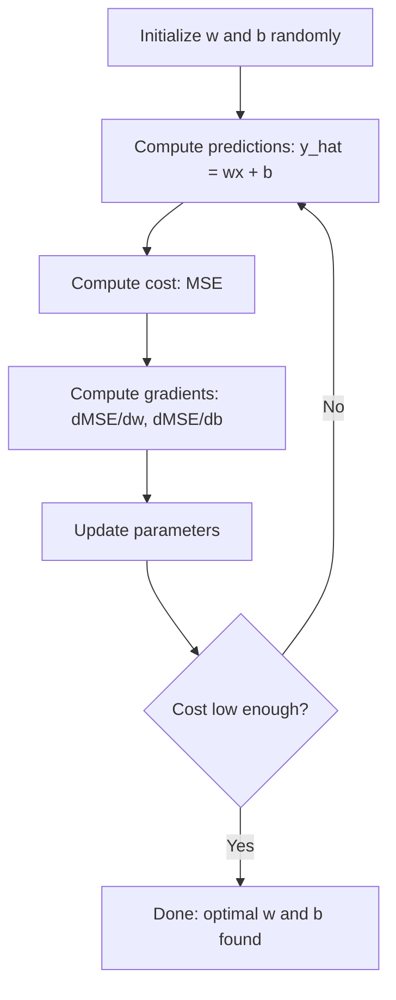

# الرجوع الخطى
# 线性回归


> الرجعة الخطية ترسم أفضل خط مستقيم عبر بياناتك. إنها "عالم مرحبا" للتعلم الآلي.

> 线性回归穿越你的数据画出最佳直线──它是机器学习的" مرحباً بالعالم"──

**Type:** Build | **类型：** 构建
**Languages:** Python
**Prerequisites:** Phase 1 (Linear Algebra, Calculus, Optimization), Phase 2 Lesson 1 | **前置知识：** Phase 1（线性代数、微积分、优化），Phase 2 第 1 课
**Time:** ~90 minutes | **时间：** 约 90 分钟

## أهداف التعلم

- استنتاج قواعد تحديث تراجع التراجع للمعدل للخطأ التربيعي المتوسط وتنفيذ التراجع الخطي من الصفر
  推导平均方差的梯度下降更新规则并从零实现线性回归
- مقارنة انخفاض التراجعية والمعادلة الطبيعية من حيث تعقيد الحوسبة ومتى تستخدم كل
  مقارنة تراجع التدرج والعقيدات الحسابية من المعادلة القانونية، والحكم متى استخدامها الخاصة
- بناء نموذج عكس خطي متعدد مع قياس الميزات وتفسير الوزن المتعلم
  构建带特征标准化多线性归归模型并解释学习到的权重
- شرح كيفية عودة الرصيف (تطبيق L2) منع المكاسب الزائدة عن طريق عقوبة الوزن الكبير
  كيفية إعادة التأثير


> **【中文解读】**
> العودة العصبية هي أسهل نموذج توقعات  باستخدام 条直线(أو超平面) الملائمة للبيانات.

> **【拓展：线性回归在真实 AI 系统中的角色】**
> على الرغم من "التعلم العميق" أكثر اهتماما، إلا أن العودة إلى الخطية لا تزال واحدة من أكثر النماذج المستخدمة في الصناعة. تستخدم جوجل بشكل كبير في تحليل اختبار A / B لتقييم الآثار الجوهرية للتقدير؛ تستخدم Uber استخدام العودة إلى الخطية لتقييم الطلب. في مجال المالية، فاما-فرنسية ثلاث عناصر النموذج هو العودة إلى الخطية متعددة الأطراف. في كاجل 竞赛، العودة إلى الخطية عادة كحد أساسي، وتحقيق سريع تأثيرات المهارات.

## المشكلة المشكلة المشكلة

لديك بيانات: حجم المنزل وأسعار بيعه. تريد التنبؤ بسعر المنزل الجديد بالنظر إلى حجمها. يمكنك أن تلقي نظرة عليه على مساحة التشتت، ولكن تحتاج إلى صيغة. تحتاج إلى خط يتناسب مع البيانات بشكل أفضل حتى تتمكن من توصيل أي حجم وتحصل على توقعات السعر.

> لديك بيانات: مساحة المنزل ومقارنة أسعار البيع. يمكنك التوقيع على مساحة المنزل الجديد. يمكنك التوقيع على الرسم البياني على النقطة المنتشرة. ولكنك تحتاج إلى عبارة. تحتاج إلى خط مناسب أفضل.

التراجع الخطوي يعطيك هذا الخط. والأهم من ذلك، فإنه يقدم حلقة تدريب ML بأكملها: تحديد نموذج، تحديد وظيفة التكلفة، تحسين المعايير. كل خوارزمية ML تتبع نفس النمط. إتقانها هنا مع أبسط الحالة، وسوف تتعرف عليها في كل مكان.

> 线性归归为你提供那条线――更重要的是، أنها قدمت دورة تدريب ML 整体: تحديد النموذج 定义价格函数 优化参数―― كل خوارزمية ML 遵循相同模式―― في أسهل الحالات هذه، يمكنك التعرف عليها في أي مكان.

هذا ليس فقط لمشاكل بسيطة. يتم استخدام الرجوع السري في أنظمة الإنتاج للتنبؤ بالطلب، وتحليل اختبار A / B، والنمذجة المالية، وكخط أساس لكل مهمة الرجوع.

> هذا ليس فقط للاستخدام في السؤال البسيط. العودة السريعة في النظام الإنتاجية تستخدم في توقعات الطلب.

> **【中文解读】**
> العودة السريعة ليست مجرد معرفة دخول، بل هي اختصار لدورة تدريب التعلم الآلي بأكملها: تعريف النموذج → تعريف وظيفة الخسارة → تعزيز العاملات.

## المفهوم الأساسي

### النموذج

التراجع الخطى يفترض علاقة خطية بين المدخل (x) والخروج (y):

> هناك علاقة بين الإدخال (x) والإخراج (y):

```
y = wx + b
```

- `w`(وزن/التحيل): كم يتغير y عندما يزيد x ب 1
  `w`(权重/斜率):x 增加 1 时 y 变化多少
- `b`(التحيز/القطع): قيمة y عندما x = 0
  `b`(偏置/截距): عندما x = 0 时 y 的值

بالنسبة للمدخلات المتعددة (الميزات) ، يمتد هذا إلى:

> 对于多个输入(特征),扩展为:

```
y = w1*x1 + w2*x2 + ... + wn*xn + b
```

أو في شكل متجه:`y = w^T * x + b`

> أو باستخدام النمو`y = w^T * x + b`

الهدف: العثور على قيم w و b التي تجعل y المتوقعة أقرب إلى y الفعلي قدر الإمكان في جميع أمثلة التدريب.

> 目標: العثور على قيمة w 和 b، لجعل جميع التدريبات نموذج في التنبؤات y 尽可能接近实际 y ⋅

> **【中文解读】**
> 线性归归的模型非常直观:`y = wx + b`,w هو التوجه ,权重 ,b هو التقاط`y = w1*x1 + w2*x2 + ... + wn*xn + b`، أي باستخدام بيانات متطابقة فوق السطح. هدف التدريب هو العثور على أفضل w و b، مما يجعل الفجوة بين القيمة التوقعات والقيمة الحقيقية أقل.

### وظيفة التكلفة (خطأ المتوسط التربيعي)

كيف تقيس " أقرب ما يمكن "؟ تحتاج إلى رقم واحد يحتوي على مدى خطأ التنبؤات الخاصة بك. الخيار الأكثر شيوعا هو الخطأ المتوسط التربيعي (MSE):

> كيف تقيس "قدر ممكن القريب"؟ تحتاج إلى واحد قادر على التقاط حجم الخطأ التنبؤي.

```
MSE = (1/n) * sum((y_predicted - y_actual)^2)
```

لماذا مربع؟ سببين. أولاً، فإنه يعاقب الأخطاء الكبيرة أكثر من الأخطاء الصغيرة (خطأ من 10 هو 100x أسوأ من خطأ من 1، وليس 10x). ثانياً، فإن وظيفة مربع متسقة ويمكن التمييز في كل مكان، مما يجعل التحسين سهلاً.

> لماذا تستخدم مربع؟ أسباب. أولاً، فإنه يعاقب على الخطأ الكبير أكثر من الخطأ الصغير.

تخلق وظيفة التكلفة سطحا. بالنسبة لوزن واحد w والتحيز b ، تبدو سطح MSE مثل وعاء (موازة متواصلة). الجزء السفلي من وعاء حيث يتم تقليل MSE. التدريب يعني العثور على هذا الجزء السفلي.

> 代价函数创建一个曲面──对于单个权重 w 和偏置 b,MSE 曲面看起来像一个碗凸抛物面──碗的底部是MSE 最小的地方──训练就是找到那个底部──

### التراجع المتدريج

التسلل المتدريج يجد قاع الصحن عن طريق اتخاذ خطوات أسفل التلال.

> 梯度下降 通过向下走步来找到碗底部──



وتخبرك المرافق بشيءين: أي اتجاه تحرك كل ملامح، ومدى التحرك.

> التسلسل يخبرك بشيءين: كل عنصر يجب أن يتحرك في أي اتجاه، وكيف يتحرك.

بالنسبة لـ MSE مع y_hat = wx + b:

> 对于 MSE 且 y_hat = wx + b:

```
dMSE/dw = (2/n) * sum((y_hat - y) * x)
dMSE/db = (2/n) * sum(y_hat - y)
```

قاعدة التحديث:

> 更新规则:

```
w = w - learning_rate * dMSE/dw
b = b - learning_rate * dMSE/db
```

معدل التعلم يحدد حجم الخطوة. كبير جداً: تتجاوز الحد الأدنى وتتباين. صغير جداً: يستغرق التدريب إلى الأبد. قيم البداية النموذجية: 0.01، 0.001، أو 0.0001.

>  معدل التعلم التحكم                                                                                                                                                                                                                                                                                                                              

> **【中文解读】**
> 梯度下降 هو الحلول التمهيدي الأساسي للتعلم الآلي. إن حسها بسيط جداً: وقف على جبل، وتقدم خطوة إلى أبعد من سبيل التنحدر، وتكرارها حتى تصل إلى قاع البحر.

> **【拓展：梯度下降在现代 AI 中的演进】**
> تدريب GPT-4 باستخدام AdamW  تحسينات  آدم +  وزن انخفاض) ، وهو متغيرات عالية تراجعة التراجع.

### المعادلة الطبيعية (حل الشكل المغلق)

بالنسبة للعودة الخطية على وجه التحديد، هناك صيغة مباشرة توفر الوزن الأمثل دون أي تكرار:

> وخاصة في مجال العودة إلى الجنس، هناك صيغة مباشرة لا تحتاج إلى أن تكون قادرة على إعطاء الوزن المفضل:

```
w = (X^T * X)^(-1) * X^T * y
```

هذا يعكس المصفوفة لحل w في خطوة واحدة. يعمل بشكل مثالي لمجموعات بيانات صغيرة. بالنسبة لمجموعات بيانات كبيرة (ملايين الصفوف أو آلاف الميزات) ، يفضل تراجع التراجعية لأن عكس المصفوفة هو O(n^3) في عدد الميزات.

> هذا من خلال الموجة المطلوبة للخلف خطوة للحصول على حل w. انها فعالة جدا بالنسبة لمجموعة صغيرة من البيانات. بالنسبة لمجموعة كبيرة من البيانات ((ملايين صفوف أو آلاف خصائص) ، تراجعة انخفاض أفضل، لأن الموجة المطلوبة للخلف على عدد من العلامات هي O ((n^3) من.

> **【拓展：正规方程 vs 梯度下降的选择】**
> تعقيداً زمنياً من المعادلة العادية هو O(n^3)(n هو عدد الصفات) ، عندما تتجاوز الصفات العادية عشرات الآلاف من الوقت في الحساب.

### عكس خطي متعدد

مع العديد من الميزات، يصبح النموذج:

> هناك العديد من الخصائص، النموذج يتغير:

```
y = w1*x1 + w2*x2 + ... + wn*xn + b
```

كل شيء يعمل بنفس الطريقة: MSE هو وظيفة التكلفة، تنزيل التراجع تحديث جميع الأوزان في وقت واحد. الفرق الوحيد هو أنك تصل إلى طائرة فائقة بدلا من خط.

> كل المبادئ هي نفسها:MSE هي وظيفة التكلفة، التدفق ينخفض في نفس الوقت يجدد كل الوزن. الفرق الوحيد هو أنك تتناسب مع سطح خارجي وليس خط مستقيم.

إن كان أحد الميزات يتراوح من 0 إلى 1 وآخر يتراوح من 0 إلى 1,000,000، فسيكون انخفاض التراجع صعباً لأن سطح التكلفة يصبح أطول. قم بتعيين الميزات (استقل المتوسط، تقسيمها بالانحراف المعياري) قبل التدريب.

> إن كان نطاق أحد الخصائص هو 0 إلى 1 ، فإن التراجع في التسلسل يصبح صعباً ، لأن التسعير يتطول.

> **【中文解读】**
> في العودة إلى الخدمات متعددة الأطراف ، فإن التخفيض من الخصائص أمر مهم. إذا كان الاختلاف في درجة الخصائص كبيرًا مثل المساحة 500-3000 مقابل عدد الغرف المظلمة 1-5 ، فإن خفض التخفيضات في التخفيضات من الدرجة سوف يزداد بشكل كبير ، مما يؤدي إلى تباطؤ الاستلام أو حتى عدم القدرة على الاستلام.

### عودة متعددة النسب

ماذا لو كانت العلاقة ليست خطية؟ يمكنك استخدام التراجع الخطي من خلال إنشاء ميزات متعددة النسب:

> إذا كانت العلاقة ليست خطية، فيمكنك الاستمرار في استخدام العلاقات الخطية من خلال إنشاء العديد من الصفات:

```
y = w1*x + w2*x^2 + w3*x^3 + b
```

هذا ما زال رجعة "خطية" لأن النموذج خطي في الوزن (w1، w2، w3). أنت فقط تستخدم ميزات غير خطية من x.

> هذا لا يزال "خطي" العودة، لأن النموذج في الوزن (w1، w2، w3) فوق هو خطي.

يمكن أن تتناسب تعدد الحدود العالية الدرجة مع منحنى أكثر تعقيداً ولكن هناك خطر من الإفراط. تعدد الحدود العليا الدرجة 10 سوف تمر عبر كل نقطة في مجموعة بيانات 10 نقاط ولكن تتوقع بشكل سيء على البيانات الجديدة.

> يمكن أن يتناسب مع حركة أكثر تعقيدا ولكن هناك مخاطر لتكون أكثر تعقيدا.

### النتيجة R- مربع

يخبرك MSE كم كنت مخطئاً، ولكن العدد يعتمد على مقياس y. R-^2 (R^2) يعطي مقياساً مستقلاً عن المقياس:

> يخبرك MSE كم خطأ، ولكن هذا الرقم يعتمد على درجة الحجم y. R- مربع (R^2) يقدم مقياس غير مرتبط بالدرجة الحجم:

```
R^2 = 1 - (sum of squared residuals) / (sum of squared deviations from mean)
    = 1 - SS_res / SS_tot
```

- R^2 = 1.0: توقعات مثالية
  R^2 = 1.0:完美预测
- R^2 = 0.0: النموذج ليس أفضل من توقع المتوسط في كل مرة
  R^2 = 0.0:模型不比每次预测平均值好
- R^2 < 0.0: النموذج أسوأ من توقع المتوسط
  R^2 < 0.0:模型比预测平均值还差

### المشاهدة المسبقة للترتيب (رجج ريج)

عندما يكون لديك العديد من الميزات، يمكن أن يضاف النموذج من خلال تعيين أوزان كبيرة.

> عندما يكون لديك العديد من الميزات، يمكن أن يكون نموذج من خلال إعطاء الوزن الكبير إلى المعدات.

```
Cost = MSE + lambda * sum(w_i^2)
```

تعني المادة المعدنية أن المعدل المعدني يُعَدّ لعدد من المعدلات المعدنية، ويتمّ التطبيق على المعدلات المعدنية، ويتمّ التطبيق على المعدلات المعدنية، ويتمّ التطبيق على المعدلات المعدنية، ويتمّ التطبيق على المعدلات المعدنية، ويتمّ التطبيق على المعدلات المعدنية، ويتمّ استخدام المعدلات المعدنية، ويتمّ استخدام المعدلات المعدنية، ويتمّ استخدام المعدلات المعدنية، ويتمّ استخدام المعدلات المعدنية، ويتمّ استخدام المعدلات المعدنية، ويتمّ استخدامها في المعدلات المعدنية، ويتمّ استخدامها في المعدلات المعدنية، ويتمّ استخدامها في المعدات المعدنية، ويتمّ استخدامها في المعدات المعدنية، ويتمّل المعدّة المعدنية، ويتمّل المعدات المعدنية، ويتمّل المعدات المعدنية، والمتة، والمتقدمة المعدنية، والمتة، والمتقدمة، والمتمية، والمتقدمة، والمتمثالية، والمتقدمة.

> 惩罚项阻止权重过大──超参数 lambda 控制权衡:lambda 越大意味着权重越小、正则化越强── هذا سيتم مناقشته بشكل عميق في الدورة التالية── الآن فقط يجب أن نعرف وجودها وفعلها──

> **【中文解读】**
> ريج 回归(L2 正则化) من خلال إضافة الوزن في وظيفة الخسارة ويعقوبات لوقاية التغلب.

## بناء ذلك تحرك لتحقيق
```figure
linear-regression-fit
```

## بناءها

### الخطوة 1: توليد بيانات العينات

```python
import random
import math

random.seed(42)  # 设置随机种子以确保结果可复现

TRUE_W = 3.0  # 真实斜率（权重）
TRUE_B = 7.0  # 真实截距（偏置）
N_SAMPLES = 100  # 样本数量

X = [random.uniform(0, 10) for _ in range(N_SAMPLES)]  # 生成 0-10 之间的随机特征值
y = [TRUE_W * x + TRUE_B + random.gauss(0, 2.0) for x in X]  # 真实关系 + 高斯噪声

print(f"Generated {N_SAMPLES} samples")
print(f"True relationship: y = {TRUE_W}x + {TRUE_B} (+ noise)")
print(f"First 5 points: {[(round(X[i], 2), round(y[i], 2)) for i in range(5)]}")
```

### الخطوة الثانية: تراجع خطي من الصفر مع انخفاض التراجعية

```python
class LinearRegression:
    def __init__(self, learning_rate=0.01):
        self.w = 0.0  # 权重初始化为 0
        self.b = 0.0  # 偏置初始化为 0
        self.lr = learning_rate  # 学习率控制梯度下降步长
        self.cost_history = []  # 记录每轮的损失值

    def predict(self, X):
        return [self.w * x + self.b for x in X]  # y_hat = wx + b

    def compute_cost(self, X, y):
        predictions = self.predict(X)
        n = len(y)
        # 计算 MSE：均方误差
        cost = sum((pred - actual) ** 2 for pred, actual in zip(predictions, y)) / n
        return cost

    def compute_gradients(self, X, y):
        predictions = self.predict(X)
        n = len(y)
        # 对 w 的偏导数
        dw = (2 / n) * sum((pred - actual) * x for pred, actual, x in zip(predictions, y, X))
        # 对 b 的偏导数
        db = (2 / n) * sum(pred - actual for pred, actual in zip(predictions, y))
        return dw, db

    def fit(self, X, y, epochs=1000, print_every=200):
        for epoch in range(epochs):
            dw, db = self.compute_gradients(X, y)  # 计算梯度
            self.w -= self.lr * dw  # 沿梯度反方向更新权重
            self.b -= self.lr * db  # 沿梯度反方向更新偏置
            cost = self.compute_cost(X, y)
            self.cost_history.append(cost)
            if epoch % print_every == 0:
                print(f"  Epoch {epoch:4d} | Cost: {cost:.4f} | w: {self.w:.4f} | b: {self.b:.4f}")
        return self

    def r_squared(self, X, y):
        predictions = self.predict(X)
        y_mean = sum(y) / len(y)
        ss_res = sum((actual - pred) ** 2 for actual, pred in zip(y, predictions))  # 残差平方和
        ss_tot = sum((actual - y_mean) ** 2 for actual in y)  # 总变差
        return 1 - (ss_res / ss_tot)  # R² = 1 - SS_res/SS_tot


print("=== Training Linear Regression (Gradient Descent) ===")
model = LinearRegression(learning_rate=0.005)
model.fit(X, y, epochs=1000, print_every=200)
print(f"\nLearned: y = {model.w:.4f}x + {model.b:.4f}")
print(f"True:    y = {TRUE_W}x + {TRUE_B}")
print(f"R-squared: {model.r_squared(X, y):.4f}")
```

### الخطوة الثالثة: المعادلة الطبيعية (حل في شكل مغلق)

```python
class LinearRegressionNormal:
    def __init__(self):
        self.w = 0.0  # 斜率
        self.b = 0.0  # 截距

    def fit(self, X, y):
        n = len(X)
        x_mean = sum(X) / n  # 计算 x 的均值
        y_mean = sum(y) / n  # 计算 y 的均值
        # 协方差 / 方差 = 最优斜率
        numerator = sum((X[i] - x_mean) * (y[i] - y_mean) for i in range(n))
        denominator = sum((X[i] - x_mean) ** 2 for i in range(n))
        self.w = numerator / denominator
        # 截距 = y 均值 - 斜率 * x 均值
        self.b = y_mean - self.w * x_mean
        return self

    def predict(self, X):
        return [self.w * x + self.b for x in X]

    def r_squared(self, X, y):
        predictions = self.predict(X)
        y_mean = sum(y) / len(y)
        ss_res = sum((actual - pred) ** 2 for actual, pred in zip(y, predictions))
        ss_tot = sum((actual - y_mean) ** 2 for actual in y)
        return 1 - (ss_res / ss_tot)


print("\n=== Normal Equation (Closed-Form) ===")
model_normal = LinearRegressionNormal()
model_normal.fit(X, y)
print(f"Learned: y = {model_normal.w:.4f}x + {model_normal.b:.4f}")
print(f"R-squared: {model_normal.r_squared(X, y):.4f}")
```

### الخطوة الرابعة: رجعة خطية متعددة

```python
class MultipleLinearRegression:
    def __init__(self, n_features, learning_rate=0.01):
        self.weights = [0.0] * n_features
        self.bias = 0.0
        self.lr = learning_rate
        self.cost_history = []

    def predict_single(self, x):
        return sum(w * xi for w, xi in zip(self.weights, x)) + self.bias

    def predict(self, X):
        return [self.predict_single(x) for x in X]

    def compute_cost(self, X, y):
        predictions = self.predict(X)
        n = len(y)
        return sum((pred - actual) ** 2 for pred, actual in zip(predictions, y)) / n

    def fit(self, X, y, epochs=1000, print_every=200):
        n = len(y)
        n_features = len(X[0])
        for epoch in range(epochs):
            predictions = self.predict(X)
            errors = [pred - actual for pred, actual in zip(predictions, y)]
            for j in range(n_features):
                grad = (2 / n) * sum(errors[i] * X[i][j] for i in range(n))
                self.weights[j] -= self.lr * grad
            grad_b = (2 / n) * sum(errors)
            self.bias -= self.lr * grad_b
            cost = self.compute_cost(X, y)
            self.cost_history.append(cost)
            if epoch % print_every == 0:
                print(f"  Epoch {epoch:4d} | Cost: {cost:.4f}")
        return self

    def r_squared(self, X, y):
        predictions = self.predict(X)
        y_mean = sum(y) / len(y)
        ss_res = sum((actual - pred) ** 2 for actual, pred in zip(y, predictions))
        ss_tot = sum((actual - y_mean) ** 2 for actual in y)
        return 1 - (ss_res / ss_tot)


random.seed(42)
N = 100
X_multi = []
y_multi = []
for _ in range(N):
    size = random.uniform(500, 3000)
    bedrooms = random.randint(1, 5)
    age = random.uniform(0, 50)
    price = 50 * size + 10000 * bedrooms - 1000 * age + 50000 + random.gauss(0, 20000)
    X_multi.append([size, bedrooms, age])
    y_multi.append(price)


def standardize(X):
    n_features = len(X[0])
    means = [sum(X[i][j] for i in range(len(X))) / len(X) for j in range(n_features)]
    stds = []
    for j in range(n_features):
        variance = sum((X[i][j] - means[j]) ** 2 for i in range(len(X))) / len(X)
        stds.append(variance ** 0.5)
    X_scaled = []
    for i in range(len(X)):
        row = [(X[i][j] - means[j]) / stds[j] if stds[j] > 0 else 0 for j in range(n_features)]
        X_scaled.append(row)
    return X_scaled, means, stds


y_mean_val = sum(y_multi) / len(y_multi)
y_std_val = (sum((yi - y_mean_val) ** 2 for yi in y_multi) / len(y_multi)) ** 0.5
y_scaled = [(yi - y_mean_val) / y_std_val for yi in y_multi]

X_scaled, x_means, x_stds = standardize(X_multi)

print("\n=== Multiple Linear Regression (3 features) ===")
print("Features: house size, bedrooms, age")
multi_model = MultipleLinearRegression(n_features=3, learning_rate=0.01)
multi_model.fit(X_scaled, y_scaled, epochs=1000, print_every=200)

print(f"\nWeights (standardized): {[round(w, 4) for w in multi_model.weights]}")
print(f"Bias (standardized): {multi_model.bias:.4f}")
print(f"R-squared: {multi_model.r_squared(X_scaled, y_scaled):.4f}")
```

### الخطوة 5: رجعة الكتلة

```python
class PolynomialRegression:
    def __init__(self, degree, learning_rate=0.01):
        self.degree = degree
        self.weights = [0.0] * degree
        self.bias = 0.0
        self.lr = learning_rate

    def make_features(self, X):
        return [[x ** (d + 1) for d in range(self.degree)] for x in X]

    def predict(self, X):
        features = self.make_features(X)
        return [sum(w * f for w, f in zip(self.weights, row)) + self.bias for row in features]

    def fit(self, X, y, epochs=1000, print_every=200):
        features = self.make_features(X)
        n = len(y)
        for epoch in range(epochs):
            predictions = [sum(w * f for w, f in zip(self.weights, row)) + self.bias for row in features]
            errors = [pred - actual for pred, actual in zip(predictions, y)]
            for j in range(self.degree):
                grad = (2 / n) * sum(errors[i] * features[i][j] for i in range(n))
                self.weights[j] -= self.lr * grad
            grad_b = (2 / n) * sum(errors)
            self.bias -= self.lr * grad_b
            if epoch % print_every == 0:
                cost = sum(e ** 2 for e in errors) / n
                print(f"  Epoch {epoch:4d} | Cost: {cost:.6f}")
        return self

    def r_squared(self, X, y):
        predictions = self.predict(X)
        y_mean = sum(y) / len(y)
        ss_res = sum((actual - pred) ** 2 for actual, pred in zip(y, predictions))
        ss_tot = sum((actual - y_mean) ** 2 for actual in y)
        return 1 - (ss_res / ss_tot)


random.seed(42)
X_poly = [x / 10.0 for x in range(0, 50)]
y_poly = [0.5 * x ** 2 - 2 * x + 3 + random.gauss(0, 1.0) for x in X_poly]

x_max = max(abs(x) for x in X_poly)
X_poly_norm = [x / x_max for x in X_poly]
y_poly_mean = sum(y_poly) / len(y_poly)
y_poly_std = (sum((yi - y_poly_mean) ** 2 for yi in y_poly) / len(y_poly)) ** 0.5
y_poly_norm = [(yi - y_poly_mean) / y_poly_std for yi in y_poly]

print("\n=== Polynomial Regression (degree 2 vs degree 5) ===")
print("True relationship: y = 0.5x^2 - 2x + 3")

print("\nDegree 2:")
poly2 = PolynomialRegression(degree=2, learning_rate=0.1)
poly2.fit(X_poly_norm, y_poly_norm, epochs=2000, print_every=500)
print(f"  R-squared: {poly2.r_squared(X_poly_norm, y_poly_norm):.4f}")

print("\nDegree 5:")
poly5 = PolynomialRegression(degree=5, learning_rate=0.1)
poly5.fit(X_poly_norm, y_poly_norm, epochs=2000, print_every=500)
print(f"  R-squared: {poly5.r_squared(X_poly_norm, y_poly_norm):.4f}")

print("\nDegree 2 fits the true curve well. Degree 5 fits training data slightly better")
print("but risks overfitting on new data.")
```

### الخطوة 6: تراجع التسلسل (تطبيق L2)

```python
class RidgeRegression:
    def __init__(self, n_features, learning_rate=0.01, alpha=1.0):
        self.weights = [0.0] * n_features
        self.bias = 0.0
        self.lr = learning_rate
        self.alpha = alpha

    def predict_single(self, x):
        return sum(w * xi for w, xi in zip(self.weights, x)) + self.bias

    def predict(self, X):
        return [self.predict_single(x) for x in X]

    def fit(self, X, y, epochs=1000, print_every=200):
        n = len(y)
        n_features = len(X[0])
        for epoch in range(epochs):
            predictions = self.predict(X)
            errors = [pred - actual for pred, actual in zip(predictions, y)]
            mse = sum(e ** 2 for e in errors) / n
            reg_term = self.alpha * sum(w ** 2 for w in self.weights)
            cost = mse + reg_term
            for j in range(n_features):
                grad = (2 / n) * sum(errors[i] * X[i][j] for i in range(n))
                grad += 2 * self.alpha * self.weights[j]
                self.weights[j] -= self.lr * grad
            grad_b = (2 / n) * sum(errors)
            self.bias -= self.lr * grad_b
            if epoch % print_every == 0:
                print(f"  Epoch {epoch:4d} | Cost: {cost:.4f} | L2 penalty: {reg_term:.4f}")
        return self


print("\n=== Ridge Regression (L2 Regularization) ===")
print("Same data as multiple regression, with alpha=0.1")
ridge = RidgeRegression(n_features=3, learning_rate=0.01, alpha=0.1)
ridge.fit(X_scaled, y_scaled, epochs=1000, print_every=200)
print(f"\nRidge weights: {[round(w, 4) for w in ridge.weights]}")
print(f"Plain weights: {[round(w, 4) for w in multi_model.weights]}")
print("Ridge weights are smaller (shrunk toward zero) due to the L2 penalty.")
```

## استخدمها في إطار التنفيذ

الآن نفس الشيء مع scikit-تعلم، وهو ما سوف تستخدم في الواقع في الإنتاج.

> الآن مع القليل من التعلم  لتحقيق نفس المهام، وهذا هو أداة تستخدم في الإنتاج الواقعية.

```python
from sklearn.linear_model import LinearRegression as SklearnLR
from sklearn.linear_model import Ridge
from sklearn.preprocessing import PolynomialFeatures, StandardScaler
from sklearn.model_selection import train_test_split
from sklearn.metrics import mean_squared_error, r2_score
import numpy as np

# 生成与从零实现相同的数据
np.random.seed(42)
X_sk = np.random.uniform(0, 10, (100, 1))
y_sk = 3.0 * X_sk.squeeze() + 7.0 + np.random.normal(0, 2.0, 100)

# 划分训练集和测试集（80/20）
X_train, X_test, y_train, y_test = train_test_split(X_sk, y_sk, test_size=0.2, random_state=42)

# 线性回归
lr = SklearnLR()
lr.fit(X_train, y_train)
y_pred = lr.predict(X_test)

print("=== Scikit-learn Linear Regression ===")
print(f"Coefficient (w): {lr.coef_[0]:.4f}")
print(f"Intercept (b): {lr.intercept_:.4f}")
print(f"R-squared (test): {r2_score(y_test, y_pred):.4f}")
print(f"MSE (test): {mean_squared_error(y_test, y_pred):.4f}")

# 多项式回归（degree=2）
poly = PolynomialFeatures(degree=2, include_bias=False)
X_poly_sk = poly.fit_transform(X_train)  # 生成 x, x² 特征
X_poly_test = poly.transform(X_test)

lr_poly = SklearnLR()
lr_poly.fit(X_poly_sk, y_train)
print(f"\nPolynomial degree 2 R-squared: {r2_score(y_test, lr_poly.predict(X_poly_test)):.4f}")

# 标准化后使用 Ridge 回归
scaler = StandardScaler()
X_train_scaled = scaler.fit_transform(X_train)  # 在训练集上拟合并转换
X_test_scaled = scaler.transform(X_test)  # 在测试集上只转换

ridge = Ridge(alpha=1.0)  # alpha 即正则化强度 lambda
ridge.fit(X_train_scaled, y_train)
print(f"Ridge R-squared: {r2_score(y_test, ridge.predict(X_test_scaled)):.4f}")
print(f"Ridge coefficient: {ridge.coef_[0]:.4f}")
```

تنفيذك من الصفر وتعلمك من الصفر يقدم نفس النتائج. الفرق: يتعامل مع حالات الحافة، والاستقرار الرقمي، وتحسين الأداء. استخدم المكتبة للإنتاج. استخدم إصدار من الصفر لفهم ما يحدث.

> التفريق بين التعلم الصغرى والتحقيق الصغرى يصل إلى نفس النتيجة. التفريق بين التعلم الصغرى والتحقيق الصغرى.

## أرسلها .

هذا الدرس ينتج عن:
- `outputs/skill-regression.md`- مهارة اختيار النهج المناسب للعودة بناء على المشكلة

> 本课产出:
> - `outputs/skill-regression.md`- مهارة اختيار طريقة العودة الصحيحة

## تمارين التدريب

1. قم بتنفيذ انخفاض تراجع المكونات، وانخفاض تراجع المكونات (SGD) ، وانخفاض تراجع المكونات الصغيرة. مقارنة سرعة التقارب على نفس مجموعة البيانات. أي من المكونات تتقارب أسرع؟ أي من المكونات لديه منحنى التكلفة السلسة؟
   1. 实现批量梯度下降,随机梯度下降 (SGD) 和小批量梯度下降.                                                                                                                                                                                                                                                 
2. توليد البيانات من وظيفة مكعبة (y = ax^3 + bx^2 + cx + d + ضجيج). تعدد الكلمات الملائمة من درجة 1 ، 3 و 10. مقارنة التدريب R^2 والاختبار R^2.
   2. من ثلاث مرات وظيفة (y = ax^3 + bx^2 + cx + d + ضجيج) 生成数据──拟合 1、3 和 10 مرات多项式──比较训练 R^2 和测试 R^2──几次多项式时过拟合变得明显吗?
3. تنفيذ تراجع لاسو (تعديل L1: جريمة ألفا *( على أنواع = i يخرج)). قم بتدريب بيانات السكن متعددة الميزات. مقارنة أي أوزان تذهب إلى الصفر مقابل الرصيف. لماذا تنتج L1 حلول نادرة بينما لا تنتج L2؟
   3. 实现 Lasso 回归(L1 正则化: عقوبة * ألفا *((إضافة = إضافة))

## شروط الرئيسية

| Term | What people say | What it actually means |
|------|----------------|----------------------|
| Linear regression | "Draw a line through data" | Find weight w and bias b that minimize the sum of squared differences between wx+b and actual y values |
| Cost function | "How bad the model is" | A function that maps model parameters to a single number measuring prediction error, which optimization minimizes |
| Mean squared error | "Average of squared errors" | (1/n) * sum of (predicted - actual)^2, penalizing large errors disproportionately |
| Gradient descent | "Walk downhill" | Iteratively adjust parameters in the direction that reduces the cost function, using partial derivatives |
| Learning rate | "Step size" | A scalar that controls how much parameters change per gradient descent step |
| Normal equation | "Solve it directly" | The closed-form solution w = (X^T X)^-1 X^T y that gives optimal weights without iteration |
| R-squared | "How good the fit is" | The fraction of variance in y explained by the model, ranging from negative infinity to 1.0 |
| Feature scaling | "Make features comparable" | Transforming features to similar ranges (e.g., zero mean, unit variance) so gradient descent converges faster |
| Regularization | "Penalize complexity" | Adding a term to the cost function that shrinks weights, preventing overfitting |
| Ridge regression | "L2 regularization" | Linear regression with a penalty of lambda * sum(w_i^2) added to MSE |
| Polynomial regression | "Fitting curves with linear math" | Linear regression on polynomial features (x, x^2, x^3, ...), still linear in the weights |
| Overfitting | "Memorizing training data" | Using a model so complex that it fits noise in training data and fails on new data |

## المزيد من القراءة

- [An Introduction to Statistical Learning (ISLR)](https://www.statlearning.com/)-- PDF مجاني، الفصول 3 و 6 تغطي التراجع الخطوي والتنظيم مع أمثلة R عملية
  [An Introduction to Statistical Learning (ISLR)](https://www.statlearning.com/)-- 免费教材, 第3章和第6章用实际R示例涵盖线性回归和正规化
- [The Elements of Statistical Learning (ESL)](https://hastie.su.domains/ElemStatLearn/)-- PDF مجاني، المرافقة الأكثر رياضية ل ISLR مع معالجة أعمق للخضار واللاسسو
  [The Elements of Statistical Learning (ESL)](https://hastie.su.domains/ElemStatLearn/)-- 免费教材,ISLR 的数学版,对 ridge 和 lasso 有更深入的处理
- [Stanford CS229 Lecture Notes on Linear Regression](https://cs229.stanford.edu/main_notes.pdf)-- ملاحظات أندرو نغ استنباط المعادلة الطبيعية و نزول التراجع من المبادئ الأولى
  [Stanford CS229 Lecture Notes on Linear Regression](https://cs229.stanford.edu/main_notes.pdf)-- مذكرات أندرو نغ من المبدأ الأول من التوصيل القانونية
- [scikit-learn LinearRegression documentation](https://scikit-learn.org/stable/modules/linear_model.html)-- إشارة عملية لـ LinearRegression و Ridge و Lasso و ElasticNet مع أمثلة رمزية
  [scikit-learn LinearRegression documentation](https://scikit-learn.org/stable/modules/linear_model.html)-- خطيةالانسحاب ✓ ريدج ✓ لاسو و ElasticNet
