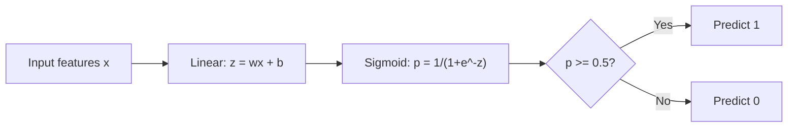
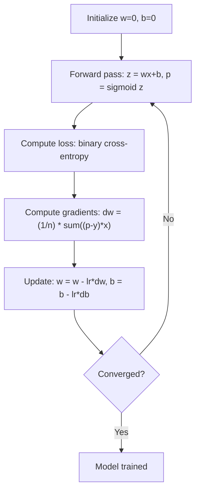

# التراجع اللوجستي
# 逻辑回归


> التراجع اللوجستي يلتوي خط مستقيم إلى منحنى S للإجابة على الأسئلة نعم أو لا مع احتمالات.

> 逻辑回归将直线成 S 形曲线,用概率回答是非问题──

**Type:** Build | **类型：** 构建
**Languages:** Python
**Prerequisites:** Phase 2 Lesson 1-2 (What Is ML, Linear Regression) | **前置知识：** Phase 2 第 1-2 课（什么是机器学习、线性回归）
**Time:** ~90 minutes | **时间：** 约 90 分钟

## أهداف التعلم

- تنفيذ التراجع اللوجستي من الصفر باستخدام وظيفة sigmoid وخسارة الانتروبيا المتقاطعة الثنائية
  من التحقق من العودة المنطقية، التحكم في وظيفة Sigmoid و الثاني تبادل  خسارة
- الحساب وتفسير الدقة، والذكرى، والنقطة F1، ومصفوفة الارتباك للتصنيف الثنائي
  計算并解释精确率 (دقة) 召回率 (تذكير)  F1 分数和混矩阵
- شرح لماذا تفشل MSE في التصنيف ولماذا تنتج التشريعات الثنائية المتقاطعة سطح تكلفة متواصل
   شرح لماذا الفجوة المتوسطة (MSE) غير مناسبة لتحديد المهام، وكذلك لماذا الثنائيات交叉能产生凸的代价曲面
- بناء نموذج تراجع softmax للتصنيف متعدد الفئات وتقييم تعادلات ضبط العدالة
  构建Softmax 回归模型进行多类,并评估值调优的权衡


> **【中文解读】**
> العودة المنطقية هي نوع ثاني من الهياكل الأساسية باستخدام وظيفة Sigmoid  سوف تكون خطية وتخرج خريطة إلى [0,1] من احتمالاتها── على الرغم من أنها تسمى العودة، ولكنها هي نوع من الجهازات──التعلم في منطقة العودة.

> **【拓展：逻辑回归在工业界的广泛应用】**
> فيسبوك في وقت مبكر من الإعلانات النتائج التوقعات النظام يعتمد على العودة المنطقية (((معالجة GBMT خصائص工程);جوجل  تحديد العودة المنطقية  التوقعات أيضا طويلة الأجل استخدام العودة المنطقية (((التي تم تحديثها لاحقا لتعلم عميق) في مجال الطب، العودة المنطقية تستخدم للتوقعات المرضات风险 (((مثل مرض القلب والسكري)) ، والفائدة في احتمالات الإنتاج يمكن تفسيرها مباشرة.

## المشكلة المشكلة المشكلة

تريد التنبؤ ما إذا كان الورم خبيثًا أو خبيثًا نظراً لقياسه. تحاول التراجع الخطي. يخرج أرقام مثل 0.3 أو 1.7 أو -0.5. ماذا يعني ذلك؟ هل 1.7 "خبيثًا للغاية"؟ هل -0.5 "خبيثًا للغاية"؟ التراجع الخطي يخرج أرقام غير محدودة. تحتاج التصنيف إلى احتمالات محدودة بين 0 و 1 ، وقرار واضح: نعم أو لا.

> هل تريد أن تتوقع أنه من الخبيث أو من الخبيث. حاول استخدام العودة السلكية. فإنه يخرج 0.3 أو 1.7 أو -0.5 مثل هذا الرقم. ماذا يعني هذه الأرقام؟ 1.7 هو "خبيث جدا"؟ -0.5 هو "خبيث جدا".

تحل الرجعة اللوجستية هذا الأمر. تأخذ نفس الجمع الخطي (wx + b) وتمررها من خلال وظيفة sigmoid، والتي تضرب أي عدد في النطاق (0, 1). الخروج هو احتمال. تحدد عتبة (عادة 0.5) وتخذ قرارًا.

> 逻辑归归解决了这个问题──它取同样线性组合 (wx + b),通过Sigmoid 函数将任意数字压缩到 (0, 1) 范围内──输出是一个概率──你设定一个值(通常 0.5) 做出决策──

هذه هي واحدة من أكثر خوارزميات استخداماً على نطاق واسع في الممارسة العملية. على الرغم من اسمه، فإن الرجوع اللوجستي هو خوارزمية تصنيف، وليس خوارزمية الرجوع. يأتي الاسم من الوظيفة اللوجستية (السيغمويد) التي تستخدمها.

> هذا هو واحد من أكثر الخوارزميات استخداما في الممارسة. على الرغم من أن هناك "عودة" في الاسم، فإن العودة المنطقية هي خيارات خيارات، وليس عودة الخوارزميات.

> **【中文解读】**
> لا يمكن استخدام العودة السريعة مباشرة إلى الفئة: إنتاجها هو عدد حقيقي لا حدود له ((-∞ إلى +∞) ، بينما الفئة تحتاج إلى احتمال 0-1  ‬‬‬‬‬‬‬‬‬‬‬‬‬‬‬‬‬‬‬‬‬‬‬‬‬‬‬‬‬‬‬‬‬‬‬‬‬‬‬‬‬‬‬‬‬‬‬‬‬‬‬‬‬‬‬‬‬‬‬‬‬‬‬‬‬‬‬‬‬‬‬‬‬‬‬‬‬‬‬‬‬‬‬‬‬‬‬‬‬‬‬‬‬‬‬‬‬‬‬‬‬‬‬‬‬‬‬‬‬‬‬‬‬‬‬‬‬‬‬‬‬‬‬‬‬‬‬‬‬‬‬‬‬‬‬‬‬‬‬‬‬‬‬‬‬‬‬‬‬‬‬‬‬‬‬‬‬‬‬‬‬‬‬‬‬‬‬‬‬‬‬‬‬‬‬‬‬‬‬‬‬‬‬‬‬‬‬‬‬‬‬‬‬‬‬‬‬‬‬‬‬‬‬‬‬‬‬‬‬‬‬‬‬‬‬‬‬‬‬‬‬‬‬‬‬‬‬‬‬‬‬‬‬‬‬‬‬‬‬‬‬‬‬‬‬‬‬‬‬‬‬‬‬‬‬‬‬‬‬‬‬‬‬‬‬‬‬‬‬‬‬‬‬‬‬‬‬‬‬‬‬‬‬‬‬‬‬‬‬‬‬‬‬‬‬‬‬‬‬‬‬‬‬‬‬‬‬‬‬‬‬‬‬‬‬‬‬‬‬‬‬‬‬‬‬‬‬‬‬‬‬‬‬‬‬‬‬‬‬‬‬‬‬‬‬‬‬‬‬‬‬‬‬‬‬‬‬‬‬‬‬‬‬‬‬‬‬‬‬‬‬‬‬‬‬‬‬‬‬‬‬‬‬‬‬‬‬‬‬‬‬‬‬‬‬‬‬‬‬‬‬‬‬‬‬‬‬‬‬‬‬‬‬‬‬‬‬‬‬‬‬‬‬‬‬‬‬‬‬‬‬‬‬‬‬‬‬‬‬‬‬‬‬‬‬‬‬‬‬‬‬‬‬‬‬‬‬‬‬‬‬‬‬‬‬‬‬‬‬‬

## المفهوم الأساسي

### لماذا لا يتم تصنيف الرجوع الخطوي

تخيل التنبؤ بالمرحلة المطلوبة (1/0) بناءً على ساعات الدراسة. التراجع الخطري يتناسب مع خط عبر البيانات:

> 想象根据学习时间预测通过/不通过(1/0) ――线性回归拟合一根直线穿过数据:

```
hours:  1   2   3   4   5   6   7   8   9   10
actual: 0   0   0   0   1   1   1   1   1   1
```

يمكن أن ينتج التكيف الخطري توقعات مثل -0.2 في الساعة 1 و 1.3 في الساعة 10. هذه القيم ليست احتمالات. إنها تقل عن 0 و فوق 1. أسوأ من ذلك، فإن خيار واحد (شخص ما درس 50 ساعة) سيسحب الخط بأكمله، ويتغير التوقعات للجميع.

> يمكن أن يصل إلى -0.2 في 1 ساعة، و يصل إلى 1.3 في 10 ساعات. هذه القيم ليست احتمالية. إنها أقل من 0 أو أكثر من 1.

التصنيف يحتاج إلى وظيفة:
- قيم الخروج بين 0 و 1 (احتمالات)
  输出 0 إلى 1                                                                                                                                                                                                                                                                                                                                                                                                                                                                                                                        
- يخلق انتقال حاد (حدود القرار)
  创建急剧过渡(决策边界)
- لا يتم تشويهها بواسطة المتفاصيل بعيدة عن الحدود
  غير المتعثرة عن الحدود

>  分类 تحتاج إلى وظيفة، انها:

### وظيفة سيغمويد

وظيفة sigmoid تفعل بالضبط هذا:

> فعل Sigmoid فعل فعل فعل فعل هذا

```
sigmoid(z) = 1 / (1 + e^(-z))
```

الخصائص:
- عندما يكون z كبير و إيجابي، sigmoid ((z) يقترب من 1
  عندما z هو العدد الصحيح، السجماوي
- عندما z كبير و سلبي، sigmoid ((z) يقترب من 0
  عندما z هو العدد الاحتمالي، السجماويات ((z)  التوجه إلى 0
- عندما z = 0، sigmoid(z) = 0.5
  عندما z = 0 时,sigmoid(z) = 0.5
- الخروج دائما ما يكون بين 0 و 1
  输出始终在0 和 1 之间
- الوظيفة سلسة ويمكن التمييز في كل مكان
  函数处处平滑可微

المشتق لها شكل مريح: sigmoid'(z) = sigmoid(z) * (1 - sigmoid(z)). وهذا يجعل حساب التراجع فعالا.

> 导数有一个便捷的形式:sigmoid'(z) = sigmoid(z) * (1 - sigmoid(z))

### التراجع اللوجستي = النموذج الخطوي + Sigmoid

يقوم النموذج بحساب z = wx + b (مثل التراجع الخطوي) ، ثم يطبق sigmoid:

> 模型计算 z = wx + b(与线性归归相同) ، ثم تطبيق Sigmoid:



إنخراج p يتم تفسيره على أنه P ((y=1)) x) ، احتمال أن المدخل ينتمي إلى الفئة 1. الحدود القرارية حيث wx + b = 0, مما يجعل إنخراج sigmoid بالضبط 0.5.

> 输出 p يتم تفسيرها ب p  y = 1  x) ، أي احتمالات النفاذ 1 

### الخسارة المتقاطعة الثنائية

لا يمكنك استخدام MSE للتراجع اللوجستي. يخلق MSE مع sigmoid سطحًا غير متواصلًا للتكلفة مع العديد من الحد الأدنى المحلي. بدلاً من ذلك ، استخدم التشابه الثنائي (خسارة السجل):

> لا يمكنك استخدام MSE.MSE  مع Sigmoid 会创建一个非凸的代价曲面,存在许多局部最小值.

```
Loss = -(1/n) * sum(y * log(p) + (1-y) * log(1-p))
```

لماذا هذا يعمل:
- عندما ي=1 و p قريب من 1: log(1) = 0، لذلك الخسارة قريبة من 0 (صحيحة، منخفضة التكلفة)
  عندما y = 1 و p 接近 1 时:log(1) = 0 ، خسارة تقارب 0(正确,低代价)
- عندما ي=1 و p قريب من 0: log(0) يقترب من اللانهاية السلبية، لذلك الخسارة هائلة (خطأ، تكلفة عالية)
  عندما y=1 و p 接近 0 时:log(0) 趋向负无穷,损失极大(错误,高代价)
- عندما y=0 و p قريب من 0: log(1) = 0, لذلك الخسارة قريبة من 0 (صحيحة، منخفضة التكلفة)
  عندما y = 0 و p 接近 0 时:log(1) = 0 ، خسارة تقارب 0(正确,低代价)
- عندما ي=0 و p قريب من 1: log(0) يقترب من اللانهاية السلبية، لذلك الخسارة هائلة (خطأ، تكلفة عالية)
  عندما y=0 且 p 接近 1 时:log(0) 趋向负无穷,损失极大(错误,高代价)

هذه الوظيفة الخسارة متناحلة للعودة اللوجستية، وتضمن الحد الأدنى العالمي الوحيد.

> هذه المادية الخسارة للعودة المنطقية هي وظيفة كيم، وضمان وجود الحد الأدنى للجميع الوحيد.

> **【中文解读】**
> لماذا لا يمكن استخدام MSE؟ لأن MSE + Sigmoid 会产生 غير كعبية الخسارة وظيفة منحنى، هناك العديد من القيم المحلية الحد الأدنى، التدفق المنخفض يمكن أن يكون مكثوفا.

> **【拓展：交叉熵损失在深度学习中的核心地位】**
> 交叉损失 لا تستخدم فقط للعودة المنطقية، بل هي وظيفة خسرة تعريفية لجميع شبكات النبضات العصبية.

### انخفاض تدريجي للعودة اللوجستية

إن تراجعات الإنتروبي الثنائي مع sigmoid لها شكل نظيف:

> ثاني ثنائيات ثنائيات ثنائيات ثنائيات ثنائيات ثنائيات ثنائيات ثنائيات ثنائيات ثنائيات ثنائيات ثنائيات ثنائيات ثنائيات ثنائيات ثنائيات ثنائيات ثنائيات ثنائيات ثنائيات ثنائيات ثنائيات ثنائيات ثنائيات ثنائيات ثنائيات ثنائيات ثنائيات ثنائيات ثنائيات ثنائيات ثنائيات ثنائيات ثنائيات ثنائيات ثنائيات ثنائيات ثنائيات ثنائيات ثنائيات ثنائيات ثنائيات ثنائيات ثنائيات ثنائيات ثنائيات ثنائيات ثنائيات ثنائيات ثنائيات ثنائيات ثنائيات ثنائيات ثنائيات ثنائيات ثنائيات ثنائيات ثنائيات ثنائيات ثنائيات ثنائيات ثنائيات ثنية

```
dL/dw = (1/n) * sum((p - y) * x)
dL/db = (1/n) * sum(p - y)
```

هذه تبدو متطابقة مع تراجع خطي. الفرق هو أن p = sigmoid ((wx + b) بدلا من p = wx + b. يقدم sigmoid عدم الخطية، ولكن قاعدة تحديث التراجع تظل نفسها.

> هذه تبدو تماما نفس التعدد للعودة إلى السلكية. التفريق في p = sigmoid(wx + b) وليس p = wx + b.

> **【中文解读】**
> معدل العودة المنطقية تشبه العودة الرائعة:`dL/dw = (1/n) * sum((p-y)*x)`◊ الفرق الوحيد هو p = sigmoid(wx+b) وليس p = wx+b。 هذا لأن مجموعة Sigmoid 和交叉 في الرياضيات "刚好" قد نفذت المعقدات، مما يجعل صيغة التعدد بسيطة جدا ً.



### حدود القرار

بالنسبة لدخل ثنائي الأبعاد (ميزانين) ، الحد القراري هو الخط الذي يلي:

> بالنسبة إلى 2D 输入(2 خصائص) ، الحدود القرارية هي:

```
w1*x1 + w2*x2 + b = 0
```

يتم تصنيف النقاط على جانب واحد على أنها 1 ، والنقاط على الجانب الآخر على أنها 0. تنتج رجعة اللوجستية حدود القرار الخطية دائمًا. إذا كنت بحاجة إلى حدود منحنية ، إما إضافة ميزات متعددة النقاط أو استخدام نموذج غير خطي.

> يتم تصنيف النقاط من جانب واحد إلى 1، والمنطقة الأخرى يتم تصنيفها إلى 0، والعودة المنطقية دائماً تخلق حدود القرارات الخطية. إذا كان هناك حاجة إلى حدود المزدوجة، عليك إضافة العديد من الخصائص، أو استخدام نموذج غير الخطية.

### التصنيف المتعدد الفئات مع Softmax

التراجع اللوجستي الثنائي يتعامل مع فئتين. بالنسبة إلى فئتين k، استخدم وظيفة softmax:

> ثانوية المعاملة المرجعية العودة إلى المرتبات الثانية.

```
softmax(z_i) = e^(z_i) / sum(e^(z_j) for all j)
```

كل فئة لديها متجه وزنها الخاص. يقوم النموذج بحساب درجة z_i لكل فئة، ثم تحويل softmax النتائج إلى احتمالات التي تضم إلى 1.

> كل فئة لها وزنها الخاص. النموذج يحسب لكل فئة عدد z_i، ثم سوف سوفماكس تحويل العدد إلى احتمالية مجموع و 1.

تصبح وظيفة الخسارة كجزء من التشكلات المتقاطعة:

> 损失函数变为分类交叉:

```
Loss = -(1/n) * sum(sum(y_k * log(p_k)))
```

حيث y_k هو 1 للصف الحقيقي و 0 لجميع الآخرين (الترميز واحد الحار).

> من بينها y_k إلى الفئة الحقيقية = 1, الآخر = 0

### مقاييس التقييم

الدقة وحدها ليست كافية. بالنسبة لمجموعة بيانات ذات 95% سلبية و 5% إيجابية، فإن النموذج الذي يتوقع سلبيا دائما يحصل على دقة 95% ولكن لا فائدة منها.

> لم يكن هناك ما يكفي من الدقة على المعدل فقط. بالنسبة لمجموعة بيانات من النسب السلبية بنسبة 95%، والتي تصل إلى النسبة السلبية بنسبة 5%، فإن نموذج من النسب السلبية المتوقعة دائما يحصل على نسبة دقة بنسبة 95%، ولكن لا فائدة منها.

**Confusion Matrix**:

> **混淆矩阵**:

| | Predicted Positive | Predicted Negative |
|---|---|---|
| Actually Positive | True Positive (TP) | False Negative (FN) |
| Actually Negative | False Positive (FP) | True Negative (TN) |

| | 预测为正 | 预测为负 |
|---|---|---|
| 实际为正 | 真正例 (TP) | 假负例 (FN) |
| 实际为负 | 假正例 (FP) | 真负例 (TN) |

**Precision**: من بين كل الإيجابيات المتوقعة، كم منها هي إيجابية فعلاً؟
```
Precision = TP / (TP + FP)
```

> **精确率**: بين كل النماذج التي تم توقعها صحيحة، كم من النماذج التي تم توقعاتها صحيحة؟

**Recall**من بين كل الإيجابيات الفعلية، كم من هذه التي أمسكناها؟
```
Recall = TP / (TP + FN)
```

> **召回率**(إحساسية): من بين كل النماذج الحقيقية، كم وجدنا؟

**F1 Score**: متوسط منسجم للدقة والإستدعاء. يوازن كلا المقاييسين.
```
F1 = 2 * (Precision * Recall) / (Precision + Recall)
```

> **F1 分数**: معدل تحديد المعدل ومعدل استدعاء المعدل والمتوسط.

متى تحديد الأولويات:
- **Precision**: عندما تكون الإيجابيات الكاذبة مكلفة (مصفحات الرسائل غير المرغوب فيها، لا تريد حظر البريد الإلكتروني الشرعي)
  **精确率**: عندما يقلقون عن النظام (إذا يقلقون عن النظام)
- **Recall**: عندما تكون نتائج السلبية الكاذبة مكلفة (التمكن من فحص السرطان، لا تريد أن تفوت الورم)
  **召回率**: عندما تكون المرضى يصابون بالسرطان (إذا كنت لا تريد أن تفقد الورم)
- **F1**: عندما تحتاج إلى مقياس متوازن واحد
  **F1**عندما تحتاج إلى مؤشر واحد للتوازن

> التركيز على المؤشر:

> **【中文解读】**
> في حالة عدم توازن الفئة ((مثلاً فحص الاحتيال 0.1٪ فقط) ، فإن التنبؤ الكامل للخطر يتمتع بنسبة 99.9٪ من التنبؤ ولكن لا قيمة لها.

> **【拓展：评估指标在真实系统中的选择】**
> تصنيف صفحة القمامة في Google  تحليل صفحة القمامة الأولوية تحديد المعدل ؛ 宁可放过一些垃圾页,也不能误判正常页为垃圾; 医学图像 AI 像谷歌健康的乳腺癌检查) الأولوية استدعاء المعدل 宁可多一些假阳性让医生复核,也不能漏掉真正的瘤); 自動驾驶的行人检查规则要求精度和召回率很高,F1是更合适的综合指标.
```figure
logistic-sigmoid
```

## بناءها

### الخطوة 1: وظيفة Sigmoid وتوليد البيانات

```python
import random
import math

def sigmoid(z):
    z = max(-500, min(500, z))  # 裁剪防止数值溢出
    return 1.0 / (1.0 + math.exp(-z))  # Sigmoid 函数：将任意实数映射到 (0,1)


random.seed(42)
N = 200
X = []
y = []

# 生成类别 0 的数据：中心在 (2,2)
for _ in range(N // 2):
    X.append([random.gauss(2, 1), random.gauss(2, 1)])
    y.append(0)

# 生成类别 1 的数据：中心在 (5,5)
for _ in range(N // 2):
    X.append([random.gauss(5, 1), random.gauss(5, 1)])
    y.append(1)

combined = list(zip(X, y))
random.shuffle(combined)
X, y = zip(*combined)
X = list(X)
y = list(y)

print(f"Generated {N} samples (2 classes, 2 features)")
print(f"Class 0 center: (2, 2), Class 1 center: (5, 5)")
print(f"First 5 samples:")
for i in range(5):
    print(f"  Features: [{X[i][0]:.2f}, {X[i][1]:.2f}], Label: {y[i]}")
```

### الخطوة الثانية: تراجع اللوجستية من الصفر

```python
class LogisticRegression:
    def __init__(self, n_features, learning_rate=0.01):
        self.weights = [0.0] * n_features  # 权重初始化为 0
        self.bias = 0.0  # 偏置初始化为 0
        self.lr = learning_rate  # 学习率
        self.loss_history = []  # 记录训练损失

    def predict_proba(self, x):
        z = sum(w * xi for w, xi in zip(self.weights, x)) + self.bias  # 线性组合 z = wx + b
        return sigmoid(z)  # 通过 Sigmoid 得到概率

    def predict(self, x, threshold=0.5):
        return 1 if self.predict_proba(x) >= threshold else 0  # 概率 >= 阈值则预测为 1

    def compute_loss(self, X, y):
        n = len(y)
        total = 0.0
        for i in range(n):
            p = self.predict_proba(X[i])
            p = max(1e-15, min(1 - 1e-15, p))  # 裁剪防止 log(0)
            # 二元交叉熵损失
            total += y[i] * math.log(p) + (1 - y[i]) * math.log(1 - p)
        return -total / n  # 取负号得到正值损失

    def fit(self, X, y, epochs=1000, print_every=200):
        n = len(y)
        n_features = len(X[0])
        for epoch in range(epochs):
            dw = [0.0] * n_features
            db = 0.0
            for i in range(n):
                p = self.predict_proba(X[i])
                error = p - y[i]  # 预测概率 - 真实标签
                for j in range(n_features):
                    dw[j] += error * X[i][j]  # 累积权重梯度
                db += error  # 累积偏置梯度
            # 梯度下降更新参数
            for j in range(n_features):
                self.weights[j] -= self.lr * (dw[j] / n)
            self.bias -= self.lr * (db / n)
            loss = self.compute_loss(X, y)
            self.loss_history.append(loss)
            if epoch % print_every == 0:
                print(f"  Epoch {epoch:4d} | Loss: {loss:.4f} | w: [{self.weights[0]:.3f}, {self.weights[1]:.3f}] | b: {self.bias:.3f}")
        return self

    def accuracy(self, X, y):
        correct = sum(1 for i in range(len(y)) if self.predict(X[i]) == y[i])
        return correct / len(y)


split = int(0.8 * N)
X_train, X_test = X[:split], X[split:]
y_train, y_test = y[:split], y[split:]

print("\n=== Training Logistic Regression ===")
model = LogisticRegression(n_features=2, learning_rate=0.1)
model.fit(X_train, y_train, epochs=1000, print_every=200)

print(f"\nTrain accuracy: {model.accuracy(X_train, y_train):.4f}")
print(f"Test accuracy:  {model.accuracy(X_test, y_test):.4f}")
print(f"Weights: [{model.weights[0]:.4f}, {model.weights[1]:.4f}]")
print(f"Bias: {model.bias:.4f}")
```

### الخطوة الثالثة: المصفوفات والمقاييس الخلطية من الصفر

```python
class ClassificationMetrics:
    def __init__(self, y_true, y_pred):
        # 统计混淆矩阵四个值
        self.tp = sum(1 for t, p in zip(y_true, y_pred) if t == 1 and p == 1)  # 真正例
        self.tn = sum(1 for t, p in zip(y_true, y_pred) if t == 0 and p == 0)  # 真负例
        self.fp = sum(1 for t, p in zip(y_true, y_pred) if t == 0 and p == 1)  # 假正例
        self.fn = sum(1 for t, p in zip(y_true, y_pred) if t == 1 and p == 0)  # 假负例

    def accuracy(self):
        total = self.tp + self.tn + self.fp + self.fn
        return (self.tp + self.tn) / total if total > 0 else 0

    def precision(self):
        denom = self.tp + self.fp
        return self.tp / denom if denom > 0 else 0

    def recall(self):
        denom = self.tp + self.fn
        return self.tp / denom if denom > 0 else 0

    def f1(self):
        p = self.precision()
        r = self.recall()
        return 2 * p * r / (p + r) if (p + r) > 0 else 0

    def print_confusion_matrix(self):
        print(f"\n  Confusion Matrix:")
        print(f"                  Predicted")
        print(f"                  Pos   Neg")
        print(f"  Actual Pos     {self.tp:4d}  {self.fn:4d}")
        print(f"  Actual Neg     {self.fp:4d}  {self.tn:4d}")

    def print_report(self):
        self.print_confusion_matrix()
        print(f"\n  Accuracy:  {self.accuracy():.4f}")
        print(f"  Precision: {self.precision():.4f}")
        print(f"  Recall:    {self.recall():.4f}")
        print(f"  F1 Score:  {self.f1():.4f}")


y_pred_test = [model.predict(x) for x in X_test]
print("\n=== Classification Report (Test Set) ===")
metrics = ClassificationMetrics(y_test, y_pred_test)
metrics.print_report()
```

### الخطوة الرابعة: تحليل حدود القرار

```python
print("\n=== Decision Boundary ===")
w1, w2 = model.weights
b = model.bias
print(f"Decision boundary: {w1:.4f}*x1 + {w2:.4f}*x2 + {b:.4f} = 0")
if abs(w2) > 1e-10:
    print(f"Solved for x2:     x2 = {-w1/w2:.4f}*x1 + {-b/w2:.4f}")

print("\nSample predictions near the boundary:")
test_points = [
    [3.0, 3.0],
    [3.5, 3.5],
    [4.0, 4.0],
    [2.5, 2.5],
    [5.0, 5.0],
]
for point in test_points:
    prob = model.predict_proba(point)
    pred = model.predict(point)
    print(f"  [{point[0]}, {point[1]}] -> prob={prob:.4f}, class={pred}")
```

### الخطوة 5: فئة متعددة مع softmax

```python
class SoftmaxRegression:
    def __init__(self, n_features, n_classes, learning_rate=0.01):
        self.n_features = n_features
        self.n_classes = n_classes
        self.lr = learning_rate
        self.weights = [[0.0] * n_features for _ in range(n_classes)]
        self.biases = [0.0] * n_classes

    def softmax(self, scores):
        max_score = max(scores)
        exp_scores = [math.exp(s - max_score) for s in scores]
        total = sum(exp_scores)
        return [e / total for e in exp_scores]

    def predict_proba(self, x):
        scores = [
            sum(self.weights[k][j] * x[j] for j in range(self.n_features)) + self.biases[k]
            for k in range(self.n_classes)
        ]
        return self.softmax(scores)

    def predict(self, x):
        probs = self.predict_proba(x)
        return probs.index(max(probs))

    def fit(self, X, y, epochs=1000, print_every=200):
        n = len(y)
        for epoch in range(epochs):
            grad_w = [[0.0] * self.n_features for _ in range(self.n_classes)]
            grad_b = [0.0] * self.n_classes
            total_loss = 0.0
            for i in range(n):
                probs = self.predict_proba(X[i])
                for k in range(self.n_classes):
                    target = 1.0 if y[i] == k else 0.0
                    error = probs[k] - target
                    for j in range(self.n_features):
                        grad_w[k][j] += error * X[i][j]
                    grad_b[k] += error
                true_prob = max(probs[y[i]], 1e-15)
                total_loss -= math.log(true_prob)
            for k in range(self.n_classes):
                for j in range(self.n_features):
                    self.weights[k][j] -= self.lr * (grad_w[k][j] / n)
                self.biases[k] -= self.lr * (grad_b[k] / n)
            if epoch % print_every == 0:
                print(f"  Epoch {epoch:4d} | Loss: {total_loss / n:.4f}")
        return self

    def accuracy(self, X, y):
        correct = sum(1 for i in range(len(y)) if self.predict(X[i]) == y[i])
        return correct / len(y)


random.seed(42)
X_3class = []
y_3class = []

centers = [(1, 1), (5, 1), (3, 5)]
for label, (cx, cy) in enumerate(centers):
    for _ in range(50):
        X_3class.append([random.gauss(cx, 0.8), random.gauss(cy, 0.8)])
        y_3class.append(label)

combined = list(zip(X_3class, y_3class))
random.shuffle(combined)
X_3class, y_3class = zip(*combined)
X_3class = list(X_3class)
y_3class = list(y_3class)

split_3 = int(0.8 * len(X_3class))
X_train_3 = X_3class[:split_3]
y_train_3 = y_3class[:split_3]
X_test_3 = X_3class[split_3:]
y_test_3 = y_3class[split_3:]

print("\n=== Multi-class Softmax Regression (3 classes) ===")
softmax_model = SoftmaxRegression(n_features=2, n_classes=3, learning_rate=0.1)
softmax_model.fit(X_train_3, y_train_3, epochs=1000, print_every=200)
print(f"\nTrain accuracy: {softmax_model.accuracy(X_train_3, y_train_3):.4f}")
print(f"Test accuracy:  {softmax_model.accuracy(X_test_3, y_test_3):.4f}")

print("\nSample predictions:")
for i in range(5):
    probs = softmax_model.predict_proba(X_test_3[i])
    pred = softmax_model.predict(X_test_3[i])
    print(f"  True: {y_test_3[i]}, Predicted: {pred}, Probs: [{', '.join(f'{p:.3f}' for p in probs)}]")
```

### الخطوة 6: ضبط العدوان

```python
print("\n=== Threshold Tuning ===")
print("Default threshold: 0.5. Adjusting the threshold trades precision for recall.\n")

thresholds = [0.3, 0.4, 0.5, 0.6, 0.7]
print(f"{'Threshold':>10} {'Accuracy':>10} {'Precision':>10} {'Recall':>10} {'F1':>10}")
print("-" * 52)

for t in thresholds:
    y_pred_t = [1 if model.predict_proba(x) >= t else 0 for x in X_test]
    m = ClassificationMetrics(y_test, y_pred_t)
    print(f"{t:>10.1f} {m.accuracy():>10.4f} {m.precision():>10.4f} {m.recall():>10.4f} {m.f1():>10.4f}")
```

## استخدمها في إطار التنفيذ

الآن نفس الشيء مع التعلم القصص.

> الآن باستخدام القليل من التعلم

```python
from sklearn.linear_model import LogisticRegression as SklearnLR
from sklearn.metrics import accuracy_score, precision_score, recall_score, f1_score
from sklearn.metrics import confusion_matrix, classification_report
from sklearn.model_selection import train_test_split
from sklearn.preprocessing import StandardScaler
import numpy as np

np.random.seed(42)
X_0 = np.random.randn(100, 2) + [2, 2]
X_1 = np.random.randn(100, 2) + [5, 5]
X_sk = np.vstack([X_0, X_1])
y_sk = np.array([0] * 100 + [1] * 100)

X_tr, X_te, y_tr, y_te = train_test_split(X_sk, y_sk, test_size=0.2, random_state=42)

scaler = StandardScaler()
X_tr_sc = scaler.fit_transform(X_tr)
X_te_sc = scaler.transform(X_te)

lr = SklearnLR()
lr.fit(X_tr_sc, y_tr)
y_pred = lr.predict(X_te_sc)

print("=== Scikit-learn Logistic Regression ===")
print(f"Accuracy:  {accuracy_score(y_te, y_pred):.4f}")
print(f"Precision: {precision_score(y_te, y_pred):.4f}")
print(f"Recall:    {recall_score(y_te, y_pred):.4f}")
print(f"F1:        {f1_score(y_te, y_pred):.4f}")
print(f"\nConfusion Matrix:\n{confusion_matrix(y_te, y_pred)}")
print(f"\nClassification Report:\n{classification_report(y_te, y_pred)}")
```

إن تنفيذك من الصفر ينتج نفس حدود القرار والمقاييس. يضيف Scikit-learn خيارات حل (liblinear، lbfgs، saga) ، والتنظيم الآلي، والاستراتيجيات متعددة الفئات (واحد مقابل آخر، متعددة النسخ) ، وتحسينات الاستقرار الرقمي.

> • من الصفر تحقيق تكوين نفس الحدود والمعايير القرارية. • القليل من التعلم. • إضافة خيارات البحث عن حلول. • كتابة الخطوط. • إضافة الوسائل. • تحسين القواعد. • تحسين الاستراتيجية. • تحسين الاستقرار. • تحسين الاستقرار. • تحسين الاستقرار. • تحسين الاستقرار. • تحسين الاستقرار. • تحسين الاستقرار. • تحسين الاستقرار. • تحسين الاستقرار. • تحسين الاستقرار. • تحسين الاستقرار. • تحسين الاستقرار. • تحسينات الاستقرار. • تحسينات الاستقرار. • تحسينات الاستقرار. • تحسينات الاستقرار. • تحسينات. • تحسينات. • تحسينات. • تحسينات. • تحسينات. • تحسينات. • تحسينات. • تحسينات. • تحسينات. • تحسينات. • تحسينات. • تحسينات. • تحسينات. • تحسينات. • تحسينات. • تحسينات. • تحسينات. • تحسينات. • تحسينات. • تحسينات. • تحسينات. • تحسينات. • تحسينات.

## أرسلها .

هذا الدرس ينتج عن:
- `code/logistic_regression.py`- تراجع اللوجستية من الصفر مع المقاييس

> 本课产出:
> - `code/logistic_regression.py`- العودة المنطقية والتقييم من الصفر

## تمارين التدريب

1. إنشاء مجموعة بيانات غير قابلة للفصل بشكل خطي (على سبيل المثال ، دوائر مركزة). قم بتدريب التراجع اللوجستي ومراقبة فشله. ثم أضف ميزات متعددة النقاط (x1^2, x2^2, x1*x2) وتدريب مرة أخرى. أظهر أن الدقة تتحسن.
   1. تكوين واحد**非**线性可分的数据集 (例如: 两同心圆)  تدريب المنطق للعودة وملاحظة فشلها  ثم إضافة العديد من التأثيرات  x1^2, x2^2, x1*x2) إعادة التدريب  عرض ارتفاع معدلات الادقة 
2. تنفيذ ماتريكسي الارتباك متعدد الفئات لنموذج 3 فئة softmax. الحساب الدقة لكل فئة والذكاء. أي فئة هي أصعب تصنيفها؟
   2. 3 类软max 模型实现多类混矩阵――计算每个类的精确率和召回率――哪个类是最难分类的?
3. قم ببناء منحنى ROC من الصفر. لـ 100 قيمة عتبة من 0 إلى 1 ، احسب معدل الإيجابية الحقيقية ومعدل الإيجابية الخاطئة. احسب AUC (المنطقة تحت المنحنى) باستخدام قاعدة التراسبيزويدية.
   3. من صفر بناء ROC 曲线── لـ 100 值 بين 0 إلى 1 , حساب الحالة الحقيقية والحالة المزيفة 率── باستخدام قانون التساوي الحساب AUC(曲线下面积)──

## شروط الرئيسية

| Term | What people say | What it actually means |
|------|----------------|----------------------|
| Logistic regression | "Regression for classification" | A linear model followed by a sigmoid function that outputs class probabilities |
| Sigmoid function | "The S-curve" | The function 1/(1+e^(-z)) that maps any real number to the range (0, 1) |
| Binary cross-entropy | "Log loss" | The loss function -[y*log(p) + (1-y)*log(1-p)] that penalizes confident wrong predictions severely |
| Decision boundary | "The dividing line" | The surface where the model's output probability equals 0.5, separating predicted classes |
| Softmax | "Multi-class sigmoid" | A function that converts a vector of scores into probabilities that sum to 1 |
| Precision | "How many selected are relevant" | TP / (TP + FP), the fraction of positive predictions that are actually positive |
| Recall | "How many relevant are selected" | TP / (TP + FN), the fraction of actual positives that the model correctly identifies |
| F1 score | "Balanced accuracy" | The harmonic mean of precision and recall: 2*P*R / (P+R) |
| Confusion matrix | "The error breakdown" | A table showing TP, TN, FP, FN counts for each class pair |
| Threshold | "The cutoff" | The probability value above which the model predicts class 1 (default 0.5, tunable) |
| One-hot encoding | "Binary columns for categories" | Representing class k as a vector of zeros with a 1 at position k |
| Categorical cross-entropy | "Multi-class log loss" | The extension of binary cross-entropy to k classes using one-hot encoded labels |
