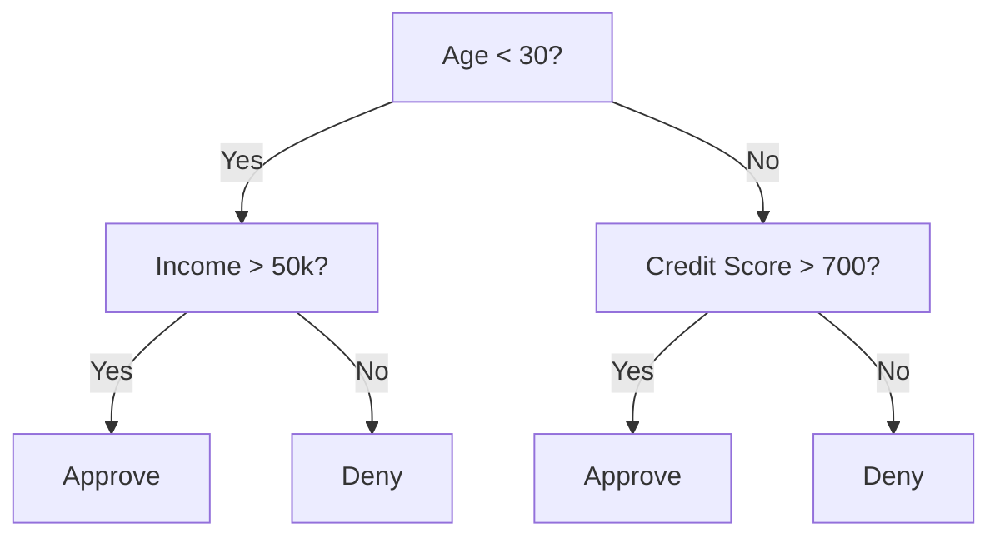
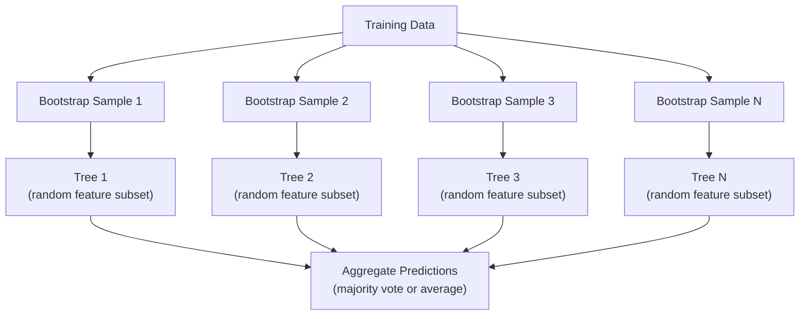

# الأشجار التي تتخذ قرارات والغابات العشوائية
#  decidedir trees و随机森林


> شجرة القرار مجرد مخطط تدفق ولكن غابة منها هي واحدة من أقوى الأدوات في ML

> شجرة القرار هي رسم سير، ولكن قطعة من الغابة التي تتكون منها هي واحدة من أقوى الأدوات في التعلم الآلي.

**Type:** Build | **类型：** 构建
**Language:**" بايثون "**语言：**بايثون
**Prerequisites:** Phase 1 (Lessons 09 Information Theory, 06 Probability) | **前置知识：** Phase 1（第 9 课信息论、第 6 课概率论）
**Time:** ~90 minutes | **时间：** 约 90 分钟

## أهداف التعلم

- تنفيذ حسابات عدم نجس جيني والانتروبيا والاكتساب المعلومات للعثور على تقسيمات شجرة القرار المثلى
   تحقيق جيني غير نقية  و معلومات زيادة حساب، العثور على أفضل قرارات
- بناء تصنيف شجرة القرار من الصفر مع التحكمات المسبقة للقطعة (عمق أقصى، عينات أقل)
  من الصورة التكوين مع وجود التحكم في القصص المسبقة
- بناء غابة عشوائية باستخدام عينة التشغيل والتمييز المميز، وشرح لماذا يقلل من التباين
  استخدام Bootstrap 采样和特征随机化构建随机森林,并解释为什么它可以减少方差
- مقارنة أهمية ميزة MDI مع أهمية المحوّل وتحديد متى يكون MDI متحيزاً
  مقارنة أهمية خصائص المعلومات والبيانات، ومشكلة التفاوت في تحديد المعلومات والبيانات


> **【中文解读】**
> 决策树通过 if-else 规则分割数据,随机森林是多个决策树的投票组合――sklearn 中最常用的模型之一――金融风控、医疗诊断中随机森林是基线模型――

> **【拓展：树模型在 Kaggle 和工业界的主导地位】**
> في المنافسة البيانات المهيكلة في كاغل، حوالي 70% من الحلول الفائزة تستخدم التدابير التدريبية لتحسين الأشجار. في مجال المالية، تقييم الائتمان. في مجال الفيكو، النسبة المتنوعة للاستخدام على نطاق واسع. في النظام المصرفي ضد الاحتيال، تستخدم الأدغال العشوائية كخط أساسي. في التشخيص الطبي، تستخدم الأدغال العشوائية للتنبؤ بالخطرات المضافة.

## المشكلة المشكلة المشكلة

لديك بيانات جدولية. الصفوف هي عينات، والعمود هي ميزات، وهناك عمود هدف تريد التنبؤ به. يمكنك رمي شبكة عصبية إليه. ولكن بالنسبة للبيانات الجدولية، النماذج القائمة على الأشجار القرارية، والغابات العشوائية، والشجيرات المرتفعة على التنحدرات، تتفوق باستمرار على التعلم العميق. تهيمن مسابقات كاغل على البيانات المهيكلة على XGBoost و LightGBM، وليس المحولات.

> لديك بيانات المظهر. يمثل نموذج، ويرجع إلى خصائص، هناك أيضاً هدف تريد توقعاته. يمكنك استخدام شبكة العصبية لمعالجة ذلك. ولكن بالنسبة لبيانات المظهر، فإن النموذج، والشجرة، والشجرة، والشجرة، والشجرة، والشجرة، والشجرة، والشجرة، والشجرة، والشجرة، والشجرة، والشجرة، والشجرة، والشجرة، والشجرة، والشجرة، والشجرة، والشجرة، والشجرة، والشجرة، والشجرة، والشجرة، والشجرة، والشجرة، والشجرة، والشجرة، والشجرة، والشجرة، والشجرة، والشجرة، والشجرة، والشجرة، والشجرة، والشجرة، والشجرة، والشجرة، والشجرة، والشجرة، والشجرة، والشجرة، والشجرة، والشجرة، والشجرة، والشجرة، والشجرة، والشجرة، والشجرة، والشجرة، والشجرة، والشجرة، والشجماعة، والشجماعة، والشجماعة، والشجماعة، والشجماعة، والشجماعة، والشجماعة، والشجماعة، والشجماعة، والشجماعة، والشجماعة، والشجماعة، والشدة، والشدة، والشدة، والشدة، والشدة، والشدة، والشدة، والشدة، والشدة، والشدة، والشدة، والشدة، والشدة، والشدة، والشدة، والشدة، والشدة، والشدة، والشدة، والشدة، والشدة، والشدة، والشدة، والشدة، والشدة، والشدة، والشدة، والشدة، والشدة، والشدة، والشدة، والشدة، والشدة، والشدة:

لماذا؟ تقوم الأشجار بمعالجة أنواع مزيجة من الميزات (الرقمية والفئوية) دون معالجة مسبقة. تتعامل مع العلاقات غير الخطية دون هندسة الميزات. فهي قابلة للتفسير: يمكنك النظر إلى الشجرة ورؤية بالضبط سبب قيامك بالتنبؤ. والغابات العشوائية، التي تتوسط العديد من الأشجار، مقاومة للغاية للتغلب على مجموعات بيانات ذات حجم معتدل.

> لماذا؟ نموذج الأشجار لا تحتاج إلى معالجة مسبقة في القدرة على معالجة الخصائص المختلطة من النوعات ((قيمة والفئات)  لا تحتاج إلى معالجة الخصائص المختلطة في القدرة على معالجة العلاقات غير السلكية  يمكن تفسيرها: يمكنك مشاهدة الأشجار ومعرفة بالضبط لماذا يتم إجراء توقعات  بينما يمر الغابات عادة من خلال العديد من الأشجار، لديها مقاومة قوية للغاية للمكافحة المزيفة لمجموعات بيانات من الحجم المتوسط 

هذه الدروس تبني شجرة القرار من الصفر باستخدام التقسيم التكراري، ثم تبني غابة عشوائية فوقها. ستقوم بتنفيذ الرياضيات وراء المعايير المقسمة (الأنقراطية الجيني، والإنتروبي، والكسب المعلومات) وتفهم لماذا يصبح مجموعة من المتعلمين الضعفاء قوية.

> هذا المرحلة من استخدام الصفر إلى التقسيم التراجعية بناء شجرة القرارات ، ثم بناء على ذلك كـ "غابة" . سوف تحقق المعايير الرياضية الخلفية للتقسيم.

> **【中文解读】**
> 对于表格型数据 (行是样本,列是特征),树模型通常优于深度学习. 原因:树模型原生支持混合类型特征.

## المفهوم الأساسي

### ما الذي تفعله شجرة القرار

شجرة القرار تقسم مساحة الميزات إلى مناطق مستطيلة عن طريق طرح سلسلة من الأسئلة نعم / لا.

> 决策树通过一系列非问题将特征空间分为矩形区域──



كل عقدة داخلية تختبر ميزة ضد عتبة. كل عقدة ورقة تقوم بتنبؤ. لتصنيف نقطة بيانات جديدة، تبدأ من الجذر وتتبع الفروع حتى تصل إلى ورقة.

> كل عقدة داخلية ستقوم بمقارنة صفة مع قيمة. كل عقدة صفحة تقوم بتنبؤ. يجب أن تُنصف نقطة بيانات جديدة، من العقدة الجذرية تبدأ على طول العقدة حتى تصل إلى العقدة صفحة صفحة صفحة صفحة صفحة صفحة صفحة صفحة صفحة صفحة صفحة صفحة صفحة صفحة صفحة صفحة صفحة صفحة صفحة صفحة صفحة صفحة صفحة صفحة صفحة صفحة صفحة صفحة صفحة صفحة صفحة صفحة صفحة صفحة صفحة صفحة صفحة صفحة صفحة صفحة صفحة صفحة صفحة صفحة صفحة صفحة صفحة صفحة صفحة صفحة صفحة صفحة صفحة صفحة صفحة صفحة صفحة صفحة صفحة صفحة صفحة صفحة صفحة صفحة صفحة صفحة صفحة صفحة صفحة صفحة صفحة صفحة صفحة صفحة صفحة صفحة صفحة صفحة صفحة صفحة صفحة صفحة صفحة صفحة صفحة صفحة صفحة صفحة صفحة صفحة صفحة صفحة صفحة صفحة صفحة صفحة صفحة صفحة صفحة صفحة صفحة صفحة صفحة صفحة صفحة صفحة صفحة صفحة صفحة صفحة صفحة صفحة صفحة صفحة صفحة صفحة صفحة صفحة صفحة صفحة صفحة صفحة صفحة صفحة صفحة صفحة صفحة صفحة صفحة صفحة صفحة صفحة صفحة صفحة صفحة صفحة صفحة صفحة صفحة صفحة صفحة صفحة صفحة صفحة صفحة صفحة صفحة صفحة صفحة صفحة صفحة صفحة صفحة صفحة صفحة صفحة صفحة صفحة صفحة صفحة صفحة صفحة صفحة صفحة صفحة صفحة صفحة صفحة صفحة صفحة صفحة صفحة صفحة صفحة صفحة صفحة صفحة صفحة صفحة صفحة صف صف صف صف صف صف صف صف صف صف صف صف صف صف صف صف صف صف صف صف صف صف صف صف صف صف صف صف صف صف صف صف صف صف صف صف صف صف صف صف صف صف صف صف صف صف صف صف صف صف صف صف صف صف صف صف صف صف صف صف صف صف صف صف صف صف صف صف صف صف صف صف صف صف صف صف صف صف صف صف صف صف صف صف صف صف صف صف

يتم بناء الشجرة من أعلى إلى أسفل عن طريق اختيار، في كل عقد، ميزة وعدول أفضل فصل البيانات. يتم تعريف "أفضل" بواسطة معيار تقسيم.

> 树自顶向下构建,在每个节点选择最能分离数据的特征和值――"最好"由分离标准定义――

### معايير التقسيم: قياس النقدية

في كل عقدة، لدينا مجموعة من العينات. نريد تقسيمها بحيث تكون العقدة الطفولة الناتجة "طاهرة" قدر الإمكان، وهذا يعني أن كل طفل يحتوي على فئة واحدة في الغالب.

> في كل نقطة، لدينا مجموعة من النماذج. نريد تقسيمها لجعلها "مطهرة" قدر الإمكان.

**Gini impurity**يُقيّم احتمال أن يتم تصنيف عينة مختارة عشوائياً بشكل خاطئ إذا تم وضعها على علامة وفقا لتوزيع الفئات في تلك العقدة.

> **Gini 不纯度**قياس نموذج من اختيار عشوائي إذا تم وضع علامة على توزيع الفئات في هذا النقطة ، فإن احتمالات التقسيم الخاطئ هي:

```
Gini(S) = 1 - sum(p_k^2)

where p_k is the proportion of class k in set S.
```

بالنسبة لعقدة نقية (كل فئة واحدة) ، Gini = 0. بالنسبة لقسيم ثنائي مع فئات 50/50، Gini = 0.5. أقل أفضل.

> بالنسبة للقطعة النظيفة، والتي تعتبر نوعاً ما، والتي تعتبر نوعاً ما من النقاط الثنائية، والتي تعتبر نوعاً ما من النقاط الثنائية، والتي تعتبر نوعاً ما من النقاط الثنائية.

```
Example: 6 cats, 4 dogs

Gini = 1 - (0.6^2 + 0.4^2) = 1 - (0.36 + 0.16) = 0.48
```

**Entropy**يُقيّم محتوى المعلومات (الاضطراب) في العقدة.

> **熵**衡量节点中的信息内容(混乱度) ―― في المرحلة 1 第 9 课中已讨论──

```
Entropy(S) = -sum(p_k * log2(p_k))
```

بالنسبة لعقدة نقية، إنتروبيا = 0. بالنسبة لـ 50/50 تقسيم ثنائي، إنتروبيا = 1.0.

> بالنسبة للقطعة النقيّة، = 0── بالنسبة للقسيم الثاني 50/50، = 1.0──越低越好──

```
Example: 6 cats, 4 dogs

Entropy = -(0.6 * log2(0.6) + 0.4 * log2(0.4))
        = -(0.6 * -0.737 + 0.4 * -1.322)
        = 0.442 + 0.529
        = 0.971 bits
```

**Information gain**هو انخفاض النسب (الاندروبي أو جيني) بعد الانقسام.

> **信息增益**هو انخفاض في التقسيم بعد عدم نقاهة

```
IG(S, feature, threshold) = Impurity(S) - weighted_avg(Impurity(S_left), Impurity(S_right))

where the weights are the proportions of samples in each child.
```

الخوارزمية الفطرية في كل عقدة: جرب كل ميزة و كل عتبة ممكنة. اختر زوج (الميزة، العتبة) الذي يزيد من مكاسب المعلومات.

> خريطة كل نقطة: حاول كل خصائص و كل قيمة ممكنة.

> **【中文解读】**
>  =  =  مقياس عدم اليقين في علم المعلومات : معلومات زيادة = : عدم اليقينة - : عدم اليقينة - : عدم اليقينة - : عدم اليقينة - : عدم اليقينة - : عدم اليقينة - : عدم اليقينة - : عدم اليقينة - : عدم اليقينة - : عدم اليقينة - : عدم اليقينة - : عدم اليقينة - : عدم اليقينة - : عدم اليقينة - : عدم اليقينة - : عدم اليقينة - : عدم اليقين - : عدم اليقين - : عدم اليقين - : عدم اليقين - عدم اليقين - : عدم اليقين - عدم اليقين - عدم اليقين - عدم اليقين - عدم اليقين - عدم اليقين - عدم اليقين - عدم اليقين - عدم اليقين - عدم اليقين - عدم اليقين - عدم اليقين - عدم اليقين - عدم اليقين - عدم اليقين - عدم اليقين - عدم اليقين - عدم اليقين - عدم اليقين - عدم اليقين - عدم اليقين - عدم اليقين - عدم اليقين - عدم اليقين - عدم اليقين - اليقين - اليقين - اليقين - اليقين - اليقين - اليقين - اليقين - الين - الين - الين - الين - الين - الين - الين - الين - الين - الين - الين - الين - الين - الين - الين - الين - الين - الين - الين - الين - الين - الين - الين - الين - الين - الين - الين - الين - الين - الين - الين - الين - الين - الين - الين - الين - الين - الين - الين - الين - الين - الين - الين - الين - الين - الين - الين - الين - الين - ال

### كيف يعمل الانقسام

بالنسبة لمجموعة بيانات ذات n صفات ومعينة m في العقدة الحالية:

> بالنسبة لـ                                                                                                                                                                                                                                                              

1. لكل صفة j (j = 1 إلى n):
    بالنسبة لكل خصائص j ((j = 1 إلى n):
   - قم بتصنيف العينات حسب الميزة j
      حسب الخصائص j على ترتيب النموذج
   - جرب كل نقطة منتصف بين القيم المتتالية المختلفة كعرض
     尝试 لكل نقطة في الوسط على قيمة مختلفة
   - حساب مكاسب المعلومات لكل عتبة
     计算每值的信息增益
2. اختر الميزة والعدول التي تحصل على أكبر قدر من المعلومات
   选择信息增益 أعلى خصائص و值
3. تقسيم البيانات إلى اليسار (الميزة <= عتبة) واليمين (الميزة > عتبة)
   将数据分为左(特征 <= 值) و右(特征 > 值)
4. التكرار على كل طفل
   لكل نقطة تسليم

هذا النهج الطموح لا يضمن شجرة مثالية عالمياً. إيجاد شجرة مثالية هو أمر صعب غير معقول. ولكن التقسيم الطموح يعمل بشكل جيد في الممارسة العملية.

> هذا النوع من الطرق لا يضمن أفضل الأشجار على الإطلاق.

### ظروف التوقف

بدون اي ظروف توقف، تنمو الشجرة حتى تكون كل ورقة نظيفة (عينة واحدة لكل ورقة). وهذا يتذكر بيانات التدريب بشكل مثالي ويجمل بشكل رهيب.

> لا يوجد شرط لوقف النمو، ستستمر الشجرة حتى كل نقطة صفاء

**Pre-pruning**يوقف الشجرة قبل أن تنمو بالكامل:
- أعمق أقصى: توقف الانقسام عندما تصل الشجرة إلى عمق محدد
  أقصى عمق: عندما تصل الأشجار إلى عمق محدد توقف الانفصال
- الحد الأدنى من العينات لكل ورقة: توقف إذا كان العقدة تحتوي على أقل من k عينات
  كل عدد قليل من النماذج: إذا كان النقطة أقل من ك 个样本 فإنه يتوقف
- الحد الأدنى من اكتساب المعلومات: توقف إذا كانت أفضل تقسيم تحسن النقش أقل من عتبة
  أحدث معلومات زيادة: إذا كان أفضل تحسن الانقسام غير نقي أقل من  قيمة فإنه يتوقف
- الحد الأقصى لعدد العقدة: الحد من إجمالي عدد الأوراق
  أعلى عدد من نقاط: الحد من نقاط

**Post-pruning**يُنمو الشجرة الكاملة ثم يُقَصّها
- تعقيد التكلفة (الذي يستخدمه المعلمون): يضيف عقوبة متناسبة مع عدد الأوراق.
  代价复杂度剪枝(scikit-learn 使用): إضافة مع قطاع الارض عدد العقوبات في مقارنة مع العقوبات.
- خفض الحصص الخطأ: إزالة شجرة فرعية إذا لم يزيد خطأ التحقق من التحقق
  减差剪枝: إذا لم يزيد خطأ التحقق، فانزع شجرة

إنّ التقطيع المسبق أبسط وأسرع. غالباً ما ينتج التقطيع بعد ذلك أشجار أفضل لأنه لا يوقف التقطيع قبل فترة مبكرة قد يؤدي إلى تقطيعات مفيدة أخرى.

> 预剪枝更简单更快―― 后剪枝通常产生更好的树, لأنه لن يتوقف مبكرا قد يؤدي إلى مفيد بعد الانقسام العقدة.

### شجرة القرار للعودة

بالنسبة للعودة، فإن التنبؤ بالورقة هو متوسط القيم المستهدفة في تلك الورقة. يتغير معايير الانقسام أيضًا:

> بالنسبة للعودة، فإن توقعات نقطة الوصول هي متوسط قيمة الغرض في هذه الصفحة.

**Variance reduction**يُستبدل اكتساب المعلومات:

> **方差减少**بدلًا من المعلومات

```
VR(S, feature, threshold) = Var(S) - weighted_avg(Var(S_left), Var(S_right))
```

اختر الانقسام الذي يقلل من التباين أكثر. الشجرة تقسم مساحة المدخل إلى مناطق، وتتوقع ثابتة (المتوسط) في كل منطقة.

> 选择方差减少最多的分裂──树将输入空间划分为区域,在每个区域预测一个常数(平均值)。

### الغابات العشوائية: قوة المجموعات

شجرة قرار واحدة هي اختلاف كبير. التغييرات الصغيرة في البيانات يمكن أن تنتج أشجار مختلفة تماما. الغابات العشوائية تحل هذا عن طريق متوسط العديد من الأشجار.

> تمثل شجرة قرار واحدة مع اختلافات عالية. تغيرات صغيرة في البيانات تخلق شجرة مختلفة تماما.



مصادر عشوائية تجعل الأشجار متنوعة:

> اثنين من المصادر العشوائية تسبب تنوع الأشجار:

**Bagging (bootstrap aggregating):**يتم تدريب كل شجرة على عينة منقطعة التشغيل ، عينة عشوائية مع استبدال من بيانات التدريب. يظهر حوالي 63٪ من العينات الأصلية في كل قطعة التشغيل (البقية هي عينة خارج الحقيبة التي يمكن استخدامها للتحقق من المصادقة).

> **Bagging（Bootstrap 聚合）**: كل شجرة تمارس على نموذج Bootstrap ، أي أن هناك إعادة التقاط النموذج المتلقّى من بيانات التدريب. حوالي 63% من النموذج الأصلي يظهر في كل bootstrap.

**Feature randomization:**في كل تقسيم، يتم النظر في مجموعة فرعية عشوائية فقط من الميزات. للتصنيف، فإن المعياري هو sqrt(n_features). للعودة، n_features/3. هذا يمنع جميع الأشجار من تقسيم على نفس الميزة المهيمنة.

> **特征随机化**: في كل فصل، فقط النظر في صفات كل مجموعة.

المفهوم الرئيسي: متوسط العديد من الأشجار غير المرتبطة يقلل من التباين دون زيادة التحيز. كل شجرة فردية قد تكون متوسطة. الجمع قوية.

> النظرية الأساسية: يمكن أن تقلل متوسط عدد الأشجار المتصلة بالفرق دون زيادة الفرق.

> **【中文解读】**
> التركيز على التركيز على التركيز على التركيز على التركيز على التركيز على التركيز على التركيز على التركيز على التركيز على التركيز على التركيز على التركيز على التركيز على التركيز على التركيز على التركيز على التركيز على التركيز على التركيز على التركيز على التركيز على التركيز على التركيز على التركيز على التركيز على التركيز على التركيز على التركيز على التركيز على التركيز على التركيز على التركيز على التركيز على التركيز على التركيز على التركيز على التركيز على التركيز على التركيز على التركيز على التركيز على التركيز على التركيز على التركيز على التركيز على التركيز على التركيز على التركيز على التركيز على التركيز على التركيز على التركيز على التركيز على التركيز على التركيز على التركيز على التركيز على التركيز على التركيز على التركيز على التركيز على التركيز على التركيز على التركيز على التركيز على التركيز على التركيز على التركيز على التركيز على التركيز على التركيز على التركيز على التركيز على التركيز على الجهة على الجهة على الجهة على الجهة.

> **【拓展：随机森林 vs 梯度提升树】**
> 随机森林是并行训练(各树独立),适合快速原型开发,几乎不需要调调参;;梯度提升树(XGBoost/LightGBM/CatBoost) 随行训练(每棵树纠正前一棵的错误),精度通常更高但更容易过适应──在 Kaggle 竞赛中,XGBoost ظهر في حوالي 60% من الحصول على الجائزة──实际项目中常用策略:先用随机森林做基线,再用XGBoost 追求极致性能──

### أهمية الميزات

الغابات العشوائية توفر بطبيعة الحال نقاط أهمية الميزات. الطريقة الأكثر شيوعا:

> 随机森林天然提供特征重要性分数──最常见的方法:

**Mean Decrease in Impurity (MDI):**لكل ميزة، قم بتجميع الحد الإجمالي من النقش عبر جميع الأشجار وجميع العقد حيث يتم استخدام هذه الميزة.

> **平均不纯度减少（MDI）**: لكل سمة، في جميع استخدامات هذه الخصائص، كميات كاملة من الارتفاعات والخسائر على العقدة والخسائر.

```
importance(feature_j) = sum over all nodes where feature_j is used:
    (n_samples_at_node / n_total_samples) * impurity_decrease
```

هذا سريع (حسب أثناء التدريب) ولكن متحيز نحو ميزات عالية الكاردينالية والصفات مع العديد من نقاط الانقسام المحتملة.

> هذا سريع جداً ولكن هناك العديد من الخصائص المحتملة للنقاط المزيفة

**Permutation importance**هو البديل: مزيج قيم ميزة واحدة وقياس مدى انخفاض دقة النموذج. أكثر موثوقية ولكن أبطأ.

> **置换重要性**هو بديل:打乱一个特征的值,测量模型准确率下降多少──更可靠但更慢──

> **【拓展：特征重要性的陷阱】**
> أهمية خصائص MDI لديها اثنين من الاختلافات المعروفة: 1) خصائص القاعدة العالية مثل ID المستخدم) سوف تكون ذات أهمية عالية ، لأن هناك المزيد من نقاط التقسيم يمكن اختيارها ؛ 2) أهمية تقسيم بين الصفات المتصلة ، مما يجعل كل شيء يبدو أقل أهمية.

### عندما تضرب الأشجار شبكات عصبية

الأشجار والغابات تهيمن على الشبكات العصبية على بيانات الجدول.

> 树和森林在表格数据上优于神经网络──原因如下:

| Factor | Trees | Neural networks |
|--------|-------|----------------|
| Mixed types (numeric + categorical) | Native support | Need encoding |
| Small datasets (< 10k rows) | Work well | Overfit |
| Feature interactions | Found by splitting | Need architecture design |
| Interpretability | Full transparency | Black box |
| Training time | Minutes | Hours |
| Hyperparameter sensitivity | Low | High |

| 因素 | 树模型 | 神经网络 |
|------|-------|---------|
| 混合类型（数值 + 类别） | 原生支持 | 需要编码 |
| 小数据集（< 1 万行） | 表现良好 | 容易过拟合 |
| 特征交互 | 通过分裂自动发现 | 需要架构设计 |
| 可解释性 | 完全透明 | 黑盒 |
| 训练时间 | 分钟级 | 小时级 |
| 超参数敏感度 | 低 | 高 |

تنتصر الشبكات العصبية عندما يكون للبيانات هيكل مساحي أو متسلسل (الصور والنص والصوت). بالنسبة إلى الجداول المستوية للميزات ، فإن الأشجار هي الافتراض.

> عندما يكون للبيانات مساحة أو تسلسلات (الصورة، النص، الصوت) ، فإن شبكة العصبية أكثر فوزا على الجهاز.

## بناء ذلك تحرك لتحقيق
```figure
decision-tree-depth
```

## بناءها

### الخطوة الأولى: نقية جيني و الانتروبيا

بناء كلا المعايير المقسمتة من الصفر والتحقق من أنها توافق على أي من المقسمتين جيدة.

> من الصورة التكوينية المعايير التقسيمية، التحقق من أنها تتفق على أي من التقسيمات جيدة.

```python
import math

def gini_impurity(labels):
    n = len(labels)
    if n == 0:
        return 0.0
    counts = {}
    for label in labels:
        counts[label] = counts.get(label, 0) + 1  # 统计每个类别的出现次数
    # Gini = 1 - sum(p_k^2)，衡量节点的不纯度
    return 1.0 - sum((c / n) ** 2 for c in counts.values())

def entropy(labels):
    n = len(labels)
    if n == 0:
        return 0.0
    counts = {}
    for label in labels:
        counts[label] = counts.get(label, 0) + 1
    # Entropy = -sum(p_k * log2(p_k))，信息论中的不确定性度量
    return -sum(
        (c / n) * math.log2(c / n) for c in counts.values() if c > 0
    )
```

### الخطوة الثانية: إبحث عن أفضل تقسيم

جرب كل ميزة و كل عتبة، أعد تلك التي تملك أكبر قدر من المعلومات

> 尝试每特征和每值──回复信息增益最高的──

```python
def information_gain(parent_labels, left_labels, right_labels, criterion="gini"):
    measure = gini_impurity if criterion == "gini" else entropy  # 选择不纯度度量
    n = len(parent_labels)
    n_left = len(left_labels)
    n_right = len(right_labels)
    if n_left == 0 or n_right == 0:
        return 0.0  # 空节点无法产生信息增益
    parent_impurity = measure(parent_labels)  # 父节点不纯度
    # 子节点加权不纯度
    child_impurity = (
        (n_left / n) * measure(left_labels) +
        (n_right / n) * measure(right_labels)
    )
    # 信息增益 = 父节点不纯度 - 子节点加权不纯度
    return parent_impurity - child_impurity
```

### الخطوة الثالثة: بناء صف DecisionTree

التقسيم المتكرر، التنبؤ، وتتبع أهمية الميزات. `_build`هو قلب الشجرة: يتوقف عندما تكون العقدة نقية أو تصل إلى حد ما قبل القص ، وإلا فإنه يأخذ أفضل الانقسام ويعود إلى كلا الأطفال.

> التقسيم التالي التنبؤ والمعايير

```python
import random

class DecisionTree:
    def __init__(self, max_depth=None, min_samples_split=2,
                 min_samples_leaf=1, criterion="gini",
                 max_features=None):
        self.max_depth = max_depth
        self.min_samples_split = min_samples_split
        self.min_samples_leaf = min_samples_leaf
        self.criterion = criterion
        self.max_features = max_features
        self.tree = None
        self.feature_importances_ = None

    def fit(self, X, y):
        self.n_features = len(X[0])
        self.feature_importances_ = [0.0] * self.n_features
        self.n_samples = len(X)
        self.tree = self._build(X, y, depth=0)
        total = sum(self.feature_importances_)
        if total > 0:
            self.feature_importances_ = [
                fi / total for fi in self.feature_importances_
            ]

    def predict(self, X):
        return [self._predict_one(x, self.tree) for x in X]

    def _build(self, X, y, depth):
        if len(set(y)) == 1:
            return {"leaf": True, "value": y[0]}

        if self.max_depth is not None and depth >= self.max_depth:
            return self._make_leaf(y)

        if len(y) < self.min_samples_split:
            return self._make_leaf(y)

        best_feature, best_threshold, best_gain = self._best_split(X, y)

        if best_feature is None or best_gain <= 0:
            return self._make_leaf(y)

        left_X, left_y, right_X, right_y = self._split_data(
            X, y, best_feature, best_threshold
        )

        if len(left_y) < self.min_samples_leaf or len(right_y) < self.min_samples_leaf:
            return self._make_leaf(y)

        weight = len(y) / self.n_samples
        self.feature_importances_[best_feature] += weight * best_gain

        return {
            "leaf": False,
            "feature": best_feature,
            "threshold": best_threshold,
            "left": self._build(left_X, left_y, depth + 1),
            "right": self._build(right_X, right_y, depth + 1),
        }

    def _make_leaf(self, y):
        counts = {}
        for label in y:
            counts[label] = counts.get(label, 0) + 1
        return {"leaf": True, "value": max(counts, key=counts.get)}

    def _best_split(self, X, y):
        best_feature = None
        best_threshold = None
        best_gain = -1.0

        if self.max_features == "sqrt":
            k = max(1, int(math.sqrt(self.n_features)))
            feature_indices = random.sample(range(self.n_features), k)
        elif isinstance(self.max_features, int):
            if self.max_features < 1:
                raise ValueError("max_features must be at least 1 when given as an integer")
            k = min(self.max_features, self.n_features)
            feature_indices = random.sample(range(self.n_features), k)
        else:
            feature_indices = list(range(self.n_features))

        for feature_idx in feature_indices:
            values = sorted(set(X[i][feature_idx] for i in range(len(X))))
            if len(values) <= 1:
                continue

            for i in range(len(values) - 1):
                threshold = (values[i] + values[i + 1]) / 2.0
                left_y = [y[j] for j in range(len(X)) if X[j][feature_idx] <= threshold]
                right_y = [y[j] for j in range(len(X)) if X[j][feature_idx] > threshold]

                if len(left_y) < self.min_samples_leaf or len(right_y) < self.min_samples_leaf:
                    continue

                gain = information_gain(y, left_y, right_y, self.criterion)
                if gain > best_gain:
                    best_gain = gain
                    best_feature = feature_idx
                    best_threshold = threshold

        return best_feature, best_threshold, best_gain

    def _split_data(self, X, y, feature, threshold):
        left_X, left_y, right_X, right_y = [], [], [], []
        for i in range(len(X)):
            if X[i][feature] <= threshold:
                left_X.append(X[i])
                left_y.append(y[i])
            else:
                right_X.append(X[i])
                right_y.append(y[i])
        return left_X, left_y, right_X, right_y

    def _predict_one(self, x, node):
        if node["leaf"]:
            return node["value"]
        if x[node["feature"]] <= node["threshold"]:
            return self._predict_one(x, node["left"])
        return self._predict_one(x, node["right"])
```

### الخطوة الرابعة: بناء صف الغابات العشوائية

أخذ العينات من القفز، وتشغيل الميزات عشوائية، والصوت الأغلبي.

> التميزات والإصدارات

```python
class RandomForest:
    def __init__(self, n_trees=100, max_depth=None,
                 min_samples_split=2, max_features="sqrt",
                 criterion="gini"):
        self.n_trees = n_trees
        self.max_depth = max_depth
        self.min_samples_split = min_samples_split
        self.max_features = max_features
        self.criterion = criterion
        self.trees = []

    def fit(self, X, y):
        n = len(X)
        for _ in range(self.n_trees):
            indices = [random.randint(0, n - 1) for _ in range(n)]
            X_boot = [X[i] for i in indices]
            y_boot = [y[i] for i in indices]
            tree = DecisionTree(
                max_depth=self.max_depth,
                min_samples_split=self.min_samples_split,
                max_features=self.max_features,
                criterion=self.criterion,
            )
            tree.fit(X_boot, y_boot)
            self.trees.append(tree)

    def predict(self, X):
        all_preds = [tree.predict(X) for tree in self.trees]
        predictions = []
        for i in range(len(X)):
            votes = {}
            for preds in all_preds:
                v = preds[i]
                votes[v] = votes.get(v, 0) + 1
            predictions.append(max(votes, key=votes.get))
        return predictions
```

انظر`code/trees.py`لتنفيذ كامل مع جميع أساليب المساعدة.

> 完整实现(含所有辅助方法)见 `code/trees.py`.

## استخدمها في إطار التنفيذ

> **【中文解读】**
> في الواقع، يجب الاهتمام: عدد الأشجار) عادة ما يكون 100-500 على ما يكفي، والغابة في الوقت الحالي لا تكون أكثر من اللازمة لأن الأشجار كثيرة جدا؛ أقصى قدر من الميزات  التحكم في عدد الخصائص التي يتم النظر فيها في كل فصل، وفقًا للصيغة √n هو تجربة أفضل قيمة.

مع التعلم القصير، تدريب الغابة العشوائية هو ثلاثة خطوط:

> استخدام القليل من التعلم، التدريب随机森林只需三行代码:

```python
from sklearn.ensemble import RandomForestClassifier
from sklearn.datasets import load_iris
from sklearn.model_selection import train_test_split

X, y = load_iris(return_X_y=True)  # 加载鸢尾花数据集
X_train, X_test, y_train, y_test = train_test_split(X, y, random_state=42)  # 划分训练/测试集

rf = RandomForestClassifier(n_estimators=100, random_state=42)  # 100 棵树的随机森林
rf.fit(X_train, y_train)  # 训练
print(f"Accuracy: {rf.score(X_test, y_test):.4f}")  # 评估准确率
print(f"Feature importances: {rf.feature_importances_}")
```

في الممارسة العملية، تكون الأشجار المرتفعة بالدرجات (XGBoost، LightGBM، CatBoost) غالبًا أقوى من الغابات العشوائية لأنها تُبني الأشجار بشكل متسلسل، مع تصحيح كل شجرة أخطاء الأخطاء السابقة. ولكن الغابات العشوائية أصعب إعدادها بشكل خاطئ ولا تتطلب تقريبًا أي ضبط للفيروسات.

> في الممارسة العملية، تدرجة ترقية الأشجار ((XGBoost、LightGBM、CatBoost) عادة ما تكون أقوى من الغابات السريعة، لأنّها تتمّ بتنظيم بناء الأشجار، وتصحيح كل شجرة خطأً في السابق.

## أرسلها .

هذا الدرس يُنتج`outputs/prompt-tree-interpreter.md`-- عرض مفيد يفسر تقسيم الأشجار القرارية لأصحاب المصلحة في الأعمال. إطعامها بتركيب شجرة مدربة (عمق، ميزات، عتبة تقسيم، دقة) وترجم النموذج إلى قواعد بسيطة اللغة، وتصفيات أهمية الميزات، والعلامات المبالغة أو التسريب، وتوصي بالخطوات التالية. استخدمها في أي وقت تحتاج إلى شرح نموذج قائم على الشجرة لشخص لا يقرأ الرمز.

> 本课产出 `outputs/prompt-tree-interpreter.md` أحد الأطراف المتعلقة بالشركة تفسير فكرة التقسيم في الأشجار القرارية.                                                                                                                                                                                                                                                   

> **【中文解读】**
> أحد أكبر المزايا في نموذج الشجرة هو التفسير يمكن أن ترى بوضوح كل طريق اتخاذ القرارات. هذا المنتج هو نموذج سريع ، سيتم تدريب بنية الشجرة القرارية بشكل جيد.

## تمارين التدريب

1. قم بتدريب شجرة قرار واحدة على مجموعة بيانات ثنائية الأبعاد مع 3 فئات. قم بتتبع الانقسام يدوياً ورسوم حدود القرار المستطيل. قم بتقارن الحدود عند max_depth=2 مقابل max_depth=10.
   1. في 3 类 2D 数据集上训练单棵决策树――手动追踪分裂并绘制矩形决策边界――比较 max_depth=2 和 max_depth=10 的边界――

2. قم بتنفيذ تقسيم التباينات للشجرة التراجعية. تولد y = sin(x) + ضجيج لمدة 200 نقطة وتتناسب مع شجرة التراجعة الخاصة بك. رسم التنبؤات المستمرة للشجرة على الطرف ضد المنحنى الحقيقي.
   2. 实现归归树的方差减少分裂──为200个点生成 y = sin((x) + noise,拟合归归树──绘制树的分段常数预测与真实曲线──

3. بناء غابة عشوائية مع 1، 5، 10، 50 و 200 شجرة. قم بتدريب دقة التدريب واختبار دقة مقابل عدد الأشجار. لاحظ أن دقة اختبار مرتفعات ولكن لا تقل (الغابات مقاومة الإفراط في التكيف).
   3. تم تغيير معدل التدريب على التدريب على التدريب على التدريب على التدريب على التدريب على التدريب على التدريب على التدريب على التدريب على التدريب على التدريب على التدريب على التدريب على التدريب على التدريب على التدريب على التدريب على التدريب على التدريب على التدريب على التدريب على التدريب على التدريب على التدريب على التدريب على التدريب على التدريب على التدريب على التدريب على التدريب على التدريب على التدريب على التدريب على التدريب على التدريب على التدريب على التدريب على التدريب على التدريب على التدريب على التدريب على التدريب على التدريب على التدريب على التدريب على التدريب على التدريب على التدريب على التدريب على التدريب على التدريب على التدريب على التدريب على التدريب على التدريب على التدريب على التدريب على التدريب على التدريب على التدريب على التدريب على التدريب على التدريب على التدريب على التدريب على التدريب على التدريب على التدريب على التدريب على التدريب على التدريب على التدريب على التدريب على التدريب على التدريب على التدريب على التدريب على التدريب على التدريب على التدريب على التدريب على التدريب على التدريب على التدريب على التدريب على التدريب على التدريب على التدريب على التدريب على التدريب على التدريب على التدريب على التدريب على التدريب على التدريب على التدريب على التدريب على التدريب على التدقيق في التدريب على التدقيق في التدريب على التدقيق في التدقيق في التدقيق في التدقيق في التدقيق في التدقيق في التدقيق في

4. مقارنة قراءة جيني مقابل الانتروبيا كمعايير مقسمة على 5 مجموعات بيانات مختلفة. قياس الدقة وعمق الشجرة. في معظم الحالات، فإنها تنتج نتائج متطابقة تقريبا. شرح السبب.
   4. في 5 مجموعات بيانية مختلفة مقارنة جيني غير نقية و كمعايير تقسيم.

5. قم بتنفيذ أهمية المحول. مقارنةها مع أهمية MDI على مجموعة بيانات حيث يتمثل أحد الميزات في ضجيج عشوائية ولكنها ذات صلابة عالية. MDI سوف تصنف ميزة الضجيج عالية. أهمية المحول لن تفعل.
   5. تطبيقات المعلومات التي تتضمن ضجيجًا متزايدًا ولكن ذات خصائص عالية الأرقام، تُقارن مع أهمية المعلومات التي تُستخدم في مجال المعلومات.

## شروط الرئيسية

| Term | What people say | What it actually means |
|------|----------------|----------------------|
| Decision tree | "A flowchart for predictions" | A model that partitions feature space into rectangular regions by learning a sequence of if/else splits |
| Gini impurity | "How mixed the node is" | Probability of misclassifying a random sample at a node. 0 = pure, 0.5 = maximum impurity for binary |
| Entropy | "The disorder in a node" | Information content at a node. 0 = pure, 1.0 = maximum uncertainty for binary. From information theory |
| Information gain | "How good a split is" | Reduction in impurity after a split. The greedy criterion for choosing splits |
| Pre-pruning | "Stop the tree early" | Stopping tree growth early by setting max depth, min samples, or min gain thresholds |
| Post-pruning | "Trim the tree after" | Growing the full tree, then removing subtrees that do not improve validation performance |
| Bagging | "Train on random subsets" | Bootstrap aggregating. Train each model on a different random sample with replacement |
| Random forest | "A bunch of trees" | Ensemble of decision trees, each trained on a bootstrap sample with random feature subsets at each split |
| Feature importance (MDI) | "Which features matter" | Total impurity decrease contributed by each feature, summed across all trees and nodes |
| Permutation importance | "Shuffle and check" | Accuracy drop when a feature's values are randomly shuffled. More reliable than MDI for noisy features |
| Variance reduction | "The regression version of info gain" | The regression tree analogue of information gain. Picks the split that reduces target variance the most |
| Bootstrap sample | "Random sample with repeats" | A random sample drawn with replacement from the original dataset. Same size, but with duplicates |

## المزيد من القراءة

- [Breiman: Random Forests (2001)](https://link.springer.com/article/10.1023/A:1010933404324)- الورق الغابات الأصلي عشوائي
  [Breiman: Random Forests (2001)](https://link.springer.com/article/10.1023/A:1010933404324)- 随机森林原始论文
- [Grinsztajn et al.: Why do tree-based models still outperform deep learning on tabular data? (2022)](https://arxiv.org/abs/2207.08815)- مقارنة صارمة بين الأشجار مقابل الشبكات العصبية في المهام الجدولية
  [Grinsztajn et al.: Why do tree-based models still outperform deep learning on tabular data? (2022)](https://arxiv.org/abs/2207.08815)- مقارنة صارمة بين النموذج الشجري والشبكة العصبية في بيانات المظهر
- [scikit-learn Decision Trees documentation](https://scikit-learn.org/stable/modules/tree.html)- دليل عملي مع أدوات التصور
  [scikit-learn 决策树文档](https://scikit-learn.org/stable/modules/tree.html)-                                                                                                                                                                                                                                                                                                                                                                                                                                                                                                                             
- [XGBoost: A Scalable Tree Boosting System (Chen & Guestrin, 2016)](https://arxiv.org/abs/1603.02754)- ورقة تعزيز التراجع التي تهيمن على كاغل
  [XGBoost: A Scalable Tree Boosting System (Chen & Guestrin, 2016)](https://arxiv.org/abs/1603.02754)- 统治 Kaggle 的梯度提升论文
