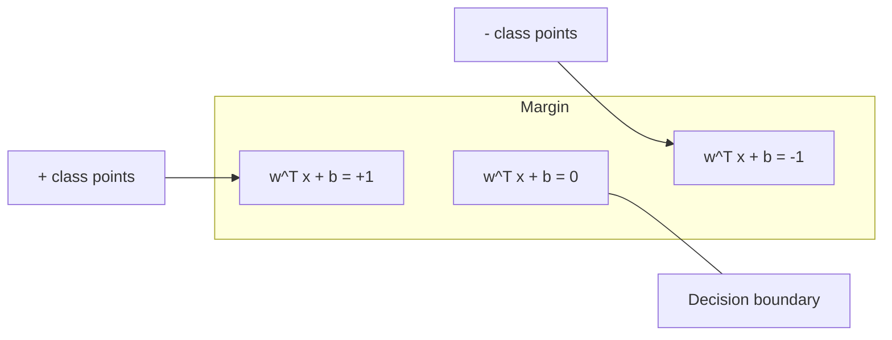
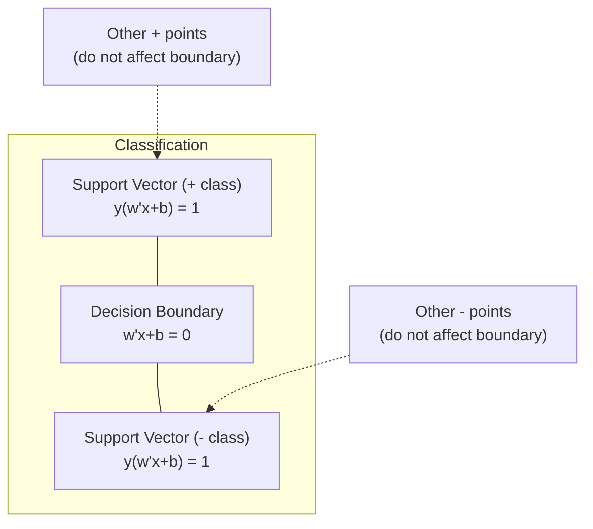
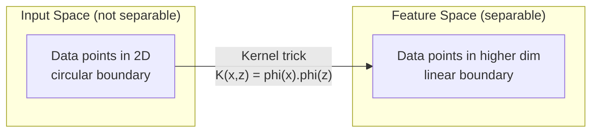

# آلات الدعم المتجهة
# 支持向量机 (SVM)


> إبحث عن أوسع شارع بين فئتين، هذه هي الفكرة

> أجد أوسع شوارع بين فئتين هذا كل الفكر

**Type:** Build | **类型：** 构建
**Language:**" بايثون "**语言：**بايثون
**Prerequisites:** Phase 1 (Lessons 08 Optimization, 14 Norms and Distances, 18 Convex Optimization) | **前置知识：** Phase 1（第 8 课优化、第 14 课范数与距离、第 18 课凸优化）
**Time:** ~90 minutes | **时间：** 约 90 分钟

## أهداف التعلم

- تنفيذ SVM خطي من الصفر باستخدام فقدان المزج وتراجع التراجع على الصيغة الأساسية
  في الصيغة الأصلية استخدام الخسارة المشتركة والحد من التراجع من الصفر لتحقيق السلطة السريعة
- شرح مبدأ الحد الأقصى للخفض وتحديد متجهات الدعم من نموذج مدرب
  解释最大间隔原理,并从训练好的模型中识别支持向量
- مقارنة الأجزاء الخطية والكثرية والRBF وشرح كيفية تجنب خدعة الأجزاء الخريطة المبرمة
  مقارنة النووي الحيوي والنووي المتعدد النواحي والنووي RBF، شرح كيفية تجنب التكنولوجيا النووية التخطيطات الكبيرة
- تقييم التنازل الذي يتم التحكم فيه بمعيار C بين عرض الحافة وأخطاء التصنيف
  قيام C                                                                                                                                                                                                                                                                                                                                                                                                                                                                                                                          


> **【中文解读】**
> السويد: إيجاد أقصى فاصل من فصائل الحدود. المهارات النووية: جعل السويد في الفضاء العالي معالجة المشاكل غير السلكية.

> **【拓展：SVM 在深度学习时代仍然重要的场景】**
> في مجموعة بيانات صغيرة ((مئات إلى آلاف النماذج) ، لا يزال أفضل من التعلم المتعمق. في مجال البريد البشري المبكر، تستخدم جوجل SVM الخطية (LIBLINEAR) ، لأن خصائص TF-IDF عالية الدرجة ولكن النموذج نادر ، فإن ميزة SVM عالية الدرجة هي مناسبة للعمل. في علم البيولوغرافيا (التحليل على التقسيم البروتيني والإظهار الجيني) ، لا يزال SVM هو الالجيومات الرئيسية.

## المشكلة المشكلة المشكلة

لديك فئتين من نقاط البيانات و تحتاج إلى رسم خط (أو طائرة فائقة) يفصلها. يمكن أن تعمل خطوط لا نهاية لها. أي واحد يجب أن تختار؟

> لديك نوعان من النقاط البيانية، تحتاج إلى رسم خطة (أو سطح فوق) لتفصل بينها.

الحد الأكبر. الحد هو المسافة بين حدود القرار والأقرب نقاط البيانات على كل جانب. الحد الأوسع يعني أن المصنف أكثر ثقة وتعميم أفضل للبيانات غير المرئية.

> 间隔最大那条──间隔是决策界限到每一侧近数据点的距离──更宽的间隔意味着分类器更有信心,对未见数据的泛化能力更好──

هذه الحدس تؤدي إلى آلات الدعم المتجهة، واحدة من أكثر خوارزميات أروعة رياضيا في ML. كانت SVM طريقة التصنيف المهيمنة قبل التعلم العميق وتظل أفضل خيار لمجموعات بيانات صغيرة، والبيانات عالية الأبعاد، والمشاكل التي تحتاج إلى نموذج مبدئي ومفهوم جيد مع ضمانات نظرية.

> هذا الإحساس أدى إلى تأييد واحد من أفضل خوارزميات المادة المتعددة في الرياضيات الوسطى. قبل التعلم العميق، كانت SVM طريقة فئة رئيسية، حتى الآن لا تزال هي مجموعة صغيرة من البيانات والبيانات العالية والتي تحتاج إلى تأكيد النظرية.

تتصل SVM مباشرةً بالمرحلة الأولى: التكيف متواصل (المرحلة 18) ، ويتم قياس الحافة مع المعايير (المرحلة 14) ، وتستغل خدعة النواة منتجات النقاط للتعامل مع الحدود غير الخطية دون الحساب في الفضاء العالي الأبعاد.

> المرحلة الأولى من التنمية النووية والتنمية النووية والتي تتمثل في المرحلة الأولى من التنمية النووية والتي تتمثل في المرحلة الأولى من التنمية النووية والتي تتمثل في المرحلة الأولى من التنمية النووية والتي تتمثل في المرحلة الأولى من التنمية النووية والتي تتمثل في المرحلة الأولى من التنمية النووية والتي تتمثل في المرحلة الأولى من التنمية النووية والتي تتمثل في المرحلة الأولى من التنمية النووية والتي تتمثل في المرحلة الأولى من التنمية النووية والتي تتمثل في المرحلة الأولى من التنمية النووية والتي تمثل في المرحلة الثانية عشر من التنمية النووية والتي تمثل في المرحلة الثانية من التنمية النووية والتي تمثل في المرحلة الثانية من التنمية.

> **【中文解读】**
> الفكرة الأساسية لـ SVM: في بين عدد لا يحصى من المواد التي يمكن فصلها بين نوعين من البيانات ، فإن اختيار من نقطة البيانات القريبة الأكبر تبعاً للمبدأ.

## المفهوم الأساسي

### تصنيف الحد الأقصى للخفض

نظراً للبيانات القابلة للفصل بشكل خطي مع علامات y_i في {-1, +1} و متجهات ميزة x_i، نريد طائرة خارقة w^T x + b = 0 التي تفصل الفئات.

> 给定标签 y_i 为 {-1, +1} 线性可分数据和特征向量 x_i,我们需要一个超平面 w^T x + b = 0 来分离类别──

المسافة من نقطة x_i إلى المخطط العابر هي:

> نقطة x_i إلى superplane المسافة هي:

```
distance = |w^T x_i + b| / ||w||
```

بالنسبة لمكان مصنف بشكل صحيح: y_i * (w^T x_i + b) > 0. الحافة هي ضعف المسافة من المخطط العابر إلى أقرب نقطة على كل جانب.

> بالنسبة للنقطة الصعبة: y_i * (w^T x_i + b) > 0──间隔是超平面到两侧近点距离的两倍──



مشكلة التحسين:

> 优化问题:

```
maximize    2 / ||w||     (the margin width)
subject to  y_i * (w^T x_i + b) >= 1  for all i
```

على نحو مماثل (تحقيق الحد الأدنى من المعدلات من المعدلات من المعدلات من المعدلات من المعدلات من المعدلات من المعدلات من المعدلات من المعدلات من المعدلات من المعدلات من المعدلات من المعدلات من المعدلات من المعدلات من المعدلات من المعدات من المعدات من المعدات من المعدات من المعدات من المعدات من المعدات من المعدات من المعدات من المعدات من المعدات من المعدات من المعدات من المعدات من المعدات من المعدات من المعدات من المعدات من المعدات من المعدات من المعدات من المعدات من المعدات من المعدات من المعدات من المعدات من المعدات من المعدات من المعدات من المعدات من المعدات من المعدات من المعدات من المعدات من المعدات من المعدات من المعدات من المعدات من المعدات من المعدات من المعدات من المعدات من المعدات من المعدات من المعدات من المعدات من المعدات:

> 等地(حد أدنى من الأسعار المفروضة على التأثيرات:

```
minimize    (1/2) ||w||^2
subject to  y_i * (w^T x_i + b) >= 1  for all i
```

هذا هو برنامج مربع متواصل. لديه حل عالمي فريد. نقاط البيانات التي تقع بالضبط على حدود الحافة (حيث y_i * (w^T x_i + b) = 1) هي متجهات الدعم. هي النقاط الوحيدة التي تحدد حدود القرار. تحريك أو إزالة أي نقطة غير متجهة الدعم، والحدود لا تتغير.

> هذا هو مشكلة التخطيط المميز. لديها حل كامل ووحيد. في الواقع يقع نقطة البيانات على الحدود الفاصلة. (w^T x_i + b) = 1) هي نقطة الدعم.

### متجهات الدعم: القليل الحرج



معظم نقاط التدريب لا علاقة لها بالضرورة. فقط متجهات الدعم هي المهمة. لهذا السبب تكون المواد السويدية فعالة في الذاكرة في وقت التنبؤ: تحتاج فقط إلى تخزين متجهات الدعم، وليس مجموعة التدريب بأكملها.

> معظم نقاط التدريب هي غير متعلقة. تعمل فقط محركات دعم. وهذا هو السبب في أن SVM في التوقعات تكون فعالة في الاحتفاظ بالخزانة: تحتاج فقط إلى تخزين محركات دعم، وليس مجموعة التدريب بأكملها.

عدد متجهات الدعم يعطي أيضا حدود على خطأ التعميم. أقل متجهات الدعم بالنسبة إلى حجم مجموعة البيانات يعني التعميم الأفضل.

>  عدد المياه الداعمة أيضاً يعطي الحدود العليا للفارق العام. بالمقارنة مع حجم المجموعة البيانية، فإن كمية المياه الداعمة أقل تعني أن المياه العامة أفضل.

### الحافة الناعمة: التعامل مع الضجيج مع المعلم C

البيانات الحقيقية نادرًا ما تكون قابلة للفصل الكامل. قد تكون بعض النقاط على الجانب الخطأ من الحدود، أو داخل الحافة. يسمح صياغة الحافة الناعمة بالانتهاكات عن طريق إدخال متغيرات الهدوء.

> البيانات الحقيقية قليلة تماما يمكن تحديدها. بعض النقاط قد تكون على جانب الخطأ في الحدود، أو في فترة الفاصل.

```
minimize    (1/2) ||w||^2 + C * sum(xi_i)
subject to  y_i * (w^T x_i + b) >= 1 - xi_i
            xi_i >= 0  for all i
```

متغير التخفيف xi_i يقيس كمية نقطة i تنتهك الهامش.

> 松变量 xi_i 衡量点 i 违反间隔的程度──C 控制权衡:

| C value | Behavior |
|---------|----------|
| Large C | Penalizes violations heavily. Narrow margin, fewer misclassifications. Overfits |
| Small C | Allows more violations. Wide margin, more misclassifications. Underfits |

| C 值 | 行为 |
|------|------|
| 大 C | 严重惩罚违规。窄间隔，较少误分类。易过拟合 |
| 小 C | 允许更多违规。宽间隔，较多误分类。易欠拟合 |

C هو قوة التنظيم، عكس. C الكبير = تقليص التنظيم. C الصغيرة = تقليص أكثر.

> C هو الصورة العكسية من قوة الصورة.

### فقدان المضغوطات: وظيفة فقدان SVM

يمكن إعادة كتابة SVM الحد الهائل كتحسين غير مقيد:

> 软间隔 SVM يمكن إعادة كتابة لتحسين بلا قيود:

```
minimize    (1/2) ||w||^2 + C * sum(max(0, 1 - y_i * (w^T x_i + b)))
```

المصطلح max(0, 1 - y_i * f(x_i)) هو خسارة الحلزون. هو صفر عندما يتم تصنيف النقطة بشكل صحيح وخارج الحافة. هو خطي عندما تكون النقطة داخل الحافة أو غير مصنفة.

> 项 max(0, 1 - y_i * f(x_i)) هو معركة الصفحة خسارة.

```
Hinge loss for a single point:

loss
  |
  | \
  |  \
  |   \
  |    \
  |     \_______________
  |
  +-----|-----|-------->  y * f(x)
       0     1

Zero loss when y*f(x) >= 1 (correctly classified, outside margin).
Linear penalty when y*f(x) < 1.
```

مقارنة مع الخسارة اللوجستية (التراجع اللوجستية):

> مقارنة مع الخسارة المنطقية للعودة:

```
Hinge:     max(0, 1 - y*f(x))          Hard cutoff at margin
Logistic:  log(1 + exp(-y*f(x)))        Smooth, never exactly zero
```

إن خسرة الحنجة تنتج حلول نادرة (فقط متجهات الدعم لها مساهمة غير صفر). يستخدم الخسارة اللوجستية جميع نقاط البيانات. وهذا يجعل SVM أكثر كفاءة في الذاكرة في وقت التنبؤ.

> 合页损失产生稀疏解(只有支持向量有非零贡献) ―― فقدان المنطق استخدام جميع نقاط البيانات── مما يجعل SVM في التوقعات أكثر توفيرًا للنخاعات──

### تدريب جهاز SVM خطي مع انخفاض تراجع

يمكنك تدريب SVM خطي باستخدام انخفاض التراجع على الخسارة المزج زائد L2 التنظيم، دون حل QP المحدود:

> يمكنك استخدام التدريب على التدريب على التدريب على التدريب على التدريب على التدريب على التدريب على التدريب على التدريب على التدريب على التدريب على التدريب على التدريب على التدريب على التدريب على التدريب على التدريب على التدريب على التدريب على التدريب على التدريب على التدريب على التدريب على التدريب على التدريب على التدريب على التدريب على التدريب على التدريب على التدريب على التدريب على التدريب على التدريب على التدريب على التدريب على التدريب على التدريب على التدريب على التدريب على التدريب على التدريب على التدريب على التدريب على التدريب على التدريب على التدريب على التدريب على التدريب على التدريب على التدريب على التدريب على التدريب على التدريب على التدريب على التدريب على التدريب على التدريب على التدريب على التدريب على التدريب على التدريب على التدريب على التدريب على التدريب على التدريب على التدريب على التدريب على التدريب على التدريب على التدريب على التدريب على التدريب على التدريب على التدريب على التدريب على التدريب على التدريب على التدريب على التدريب على

```
L(w, b) = (lambda/2) * ||w||^2 + (1/n) * sum(max(0, 1 - y_i * (w^T x_i + b)))

Gradient with respect to w:
  If y_i * (w^T x_i + b) >= 1:  dL/dw = lambda * w
  If y_i * (w^T x_i + b) < 1:   dL/dw = lambda * w - y_i * x_i

Gradient with respect to b:
  If y_i * (w^T x_i + b) >= 1:  dL/db = 0
  If y_i * (w^T x_i + b) < 1:   dL/db = -y_i
```

يُطلق على هذا الصيغة الأساسية. يُجري في O(n * d) لكل عصر، حيث n هو عدد العينات و d هو عدد الميزات. بالنسبة للبيانات الكبيرة والنادرة والمتعددة العالية (تصنيف النص) ، هذا سريع.

> يُطلق عليه النموذج الأولي. وقت النقل في كل جولة هو O (n * d) ، من بينها n هو عدد النموذج، d هو عدد الصفات.

> **【中文解读】**
> 合页损失(Hinge Loss) هو وظيفة الخسارة الأساسية لـ SVM: عندما يتم تحديد النموذج بشكل صحيح ويكون خارج الفجوة عند الخسارة 0.

### الصيغة المزدوجة و خدعة النواة

ثنائي اللجرنجية لمشكلة SVM (من الدروس الأولى 18 ، شروط KKT) هي:

> لاغ朗日对偶 (من المرحلة 1 第 18 课 KKT 条件)

```
maximize    sum(alpha_i) - (1/2) * sum_ij(alpha_i * alpha_j * y_i * y_j * (x_i . x_j))
subject to  0 <= alpha_i <= C
            sum(alpha_i * y_i) = 0
```

يتضمن الثنائي فقط منتجات النقاط x_i . x_j بين نقاط البيانات. هذه هي المعلومات الرئيسية. استبدل كل منتج نقطة بمهمة النواة K(x_i, x_j) ويمكن لـ SVM تعلم الحدود غير الخطية دون حساب التحويل صراحة.

> على شكل متكرر يتعلق فقط بقطعات بين نقاط البيانات x_i . x_j。 هذا هو الأثر الرئيسي. سيتم استبدال كل نقطة بفعل جوهري K(x_i ، x_j) ، SVM على أن تتعلم الحدود غير الخطية دون حاجة إلى تغييرات حسابية واضحة.

```
Linear kernel:      K(x, z) = x . z
Polynomial kernel:  K(x, z) = (x . z + c)^d
RBF (Gaussian):     K(x, z) = exp(-gamma * ||x - z||^2)
```

يقوم النواة RBF بتخريط البيانات إلى مساحة غير محدودة. النقاط التي تقترب من مساحة المدخل لها قيمة النواة بالقرب من 1. النقاط التي تبعد عن بعضها لديها قيمة النواة بالقرب من 0.

> RBF 核将数据映射到无限维空间――输入空间相近的点核值接近1――远离的点核值接近0――它能学习任何光滑的决策边界――



خدعة النواة يحسب الناتج النقطي في الفضاء العالي الأبعاد دون الذهاب إلى هناك. بالنسبة للنواة متعددة النقاط من درجة d في أبعاد D، فإن مساحة الميزة الصريحة لها أبعاد O(D^d. ولكن يتم حساب K(x، z) في وقت O(D).

> المهارات النووية في الفضاء العالي لا تحتاج إلى النقاط الحسابية في الفضاء العالي.

> **【中文解读】**
> المهارات النووية هي SVM أفضل مساهمة رياضية. في الصيغة الم偶لة تتعلق فقط بقطعات البيانات بين نقاط x_i · x_j، وتبديلها إلى وظيفة نووية K(x_i، x_j) 即可在高维(甚至无限维) الفضاء تعلم الحدود غير الحيوية، وبدون الحاجة إلى حساب واضح 核映射高维映射;; RBF 核将数据映射到无限维空间,能学习任意光滑的决策边缘;;

> **【拓展：核技巧的思想在现代 AI 中的延续】**
> الفكر الأساسي للتكنولوجيا النووية "المثاليات في المجال العالي غير المخططة بشكل واضح" في نظام الانتباه في Transformer.

### (SVR)

يُصنع النقل الانسحابي للدعم أنبوبًا من عرض إيبسيلون حول البيانات. النقاط داخل الأنبوب لها خسارة صفرية. النقاط خارج الأنبوب تعاقب خطيًا.

> 支持向量回归在数据周围拟合一个宽度为一的管道──管道内的点损失为零──管道外的点被线性惩罚──

```
minimize    (1/2) ||w||^2 + C * sum(xi_i + xi_i*)
subject to  y_i - (w^T x_i + b) <= epsilon + xi_i
            (w^T x_i + b) - y_i <= epsilon + xi_i*
            xi_i, xi_i* >= 0
```

يحدد معايير إيبسيلون عرض الأنابيب. الأنابيب الأوسع = أقل متجهات دعم = تناسب أكثر سلاسة. الأنابيب الأصغر = متجهات دعم أكثر = تناسب أكثر ضيقة.

> الـepsilon 参数控制管道宽度──更宽管道 = 更少的支持向量 = 更平滑的拟合──更窄管道 = 更多的支持向量 = 更紧密的拟合──

### لماذا خسر المعلمون السريعون للتعلم العميق (ومتى ما زالوا يفوزون)

سيطرت المعلمات السريعة على التعلم الذكي من أواخر التسعينات حتى أوائل عامي 2010. فالتعلم العميق تجاوزهم لعدة أسباب:

> في 20 سيوخ 90 من العصور حتى أوائل عام 2010، استهدفت ML.

| Factor | SVMs | Deep learning |
|--------|------|---------------|
| Feature engineering | Requires it | Learns features |
| Scalability | O(n^2) to O(n^3) for kernel | O(n) per epoch with SGD |
| Image/text/audio | Needs handcrafted features | Learns from raw data |
| Large datasets (>100k) | Slow | Scales well |
| GPU acceleration | Limited benefit | Massive speedup |

| 因素 | SVM | 深度学习 |
|------|-----|---------|
| 特征工程 | 需要手动 | 自动学习 |
| 可扩展性 | 核方法 O(n^2) 到 O(n^3) | SGD 每轮 O(n) |
| 图像/文本/音频 | 需要手工特征 | 从原始数据学习 |
| 大数据集（>10 万） | 较慢 | 扩展性好 |
| GPU 加速 | 有限收益 | 大幅提速 |

لا يزال الـ "سيفم" يفوزون في هذه الحالات:
- مجموعات بيانات صغيرة (مئات إلى آلاف العينات)
   小数据集 ((مئات إلى آلاف النماذج)
- بيانات نادرة عالية الأبعاد (نص مع ميزات TF-IDF)
  高维稀疏数据(文本的TF-IDF特征)
- عندما تحتاج إلى ضمانات رياضية (حدود الهامش)
  需要数学保证时(间隔边界)
- عندما يكون وقت التدريب الحد الأدنى (السي.إس.إم الخطية سريعة جدا)
   تدريب الوقت يجب أن يكون أقصر 
- التصنيف الثنائي مع هيكل هامش واضح
  具有清晰间隔结构的二分类
- الكشف عن التشوهات (معدل التحكم في المعدات الفنية من فئة واحدة)
  异常检测(单类 SVM)

> في حالات لا تزال النصر:

## بناء ذلك تحرك لتحقيق
```figure
svm-margin
```

## بناءها

### الخطوة الأولى: فقدان الدرع والتحرّك

أساس، حساب خسارة المزج للكبيرة و تراجعتها

> 基础── حساب مجموعة من البيانات ودرجة فقدانها.

```python
def hinge_loss(X, y, w, b):
    n = len(X)
    total_loss = 0.0
    for i in range(n):
        margin = y[i] * (dot(w, X[i]) + b)  # 计算样本到决策边界的函数间隔
        total_loss += max(0.0, 1.0 - margin)  # 合页损失：间隔 < 1 时才有惩罚
    return total_loss / n  # 返回平均损失
```

### الخطوة الثانية: SVM الخطية عبر انخفاض التدفق

تدريب من خلال تقليل خسارة المزج المعتاد لا حاجة لحل QP.

> 通過 تقليل الاصطلاحيات                                                                                                                                                                                                                                                           

```python
class LinearSVM:
    def __init__(self, lr=0.001, lambda_param=0.01, n_epochs=1000):
        self.lr = lr  # 学习率
        self.lambda_param = lambda_param  # 正则化参数（对应 1/C）
        self.n_epochs = n_epochs
        self.w = None  # 权重向量
        self.b = 0.0  # 偏置

    def fit(self, X, y):
        n_features = len(X[0])
        self.w = [0.0] * n_features
        self.b = 0.0

        for epoch in range(self.n_epochs):
            for i in range(len(X)):
                margin = y[i] * (dot(self.w, X[i]) + self.b)  # 函数间隔
                if margin >= 1:
                    # 样本在间隔之外，只需正则化梯度
                    self.w = [wj - self.lr * self.lambda_param * wj
                              for wj in self.w]
                else:
                    # 样本在间隔内或被误分类，需要额外的损失梯度
                    self.w = [wj - self.lr * (self.lambda_param * wj - y[i] * X[i][j])
                              for j, wj in enumerate(self.w)]
                    self.b -= self.lr * (-y[i])

    def predict(self, X):
        return [1 if dot(self.w, x) + self.b >= 0 else -1 for x in X]  # 根据符号预测类别
```

### الخطوة الثالثة: وظائف النواة

تنفيذ الأجزاء الخطية والكثرية و RBF.

> 实现线性核、多项式核和RBF核──

```python
def linear_kernel(x, z):
    return dot(x, z)  # 线性核：直接点积

def polynomial_kernel(x, z, degree=3, c=1.0):
    return (dot(x, z) + c) ** degree  # 多项式核：(x·z + c)^d

def rbf_kernel(x, z, gamma=0.5):
    diff = [xi - zi for xi, zi in zip(x, z)]  # 计算差向量
    return math.exp(-gamma * dot(diff, diff))  # RBF 核：exp(-γ||x-z||²)
```

### الخطوة الرابعة: تحديد الحافة والمتجهات الداعمة

بعد التدريب، حدد نقاط المتجهات الداعمة وحسب عرض الحافة.

> بعد التدريب، حدد أي نقاط هي دعم حجم وتحساب الفاصل الواسع.

```python
def find_support_vectors(X, y, w, b, tol=1e-3):
    support_vectors = []
    for i in range(len(X)):
        margin = y[i] * (dot(w, X[i]) + b)
        if abs(margin - 1.0) < tol:
            support_vectors.append(i)
    return support_vectors
```

انظر`code/svm.py`للتنفيذ الكامل مع جميع الادعاءات.

> 完整实现(含所有演示)见 `code/svm.py`.

## استخدمها في إطار التنفيذ

> **【中文解读】**
> استخدام SVM في sklearn 中 关键点:(1) 必须先标准化特征SVM对特征尺度敏感,因为间隔依赖于它;(2) 小数据集用 SVC(支持核函数),大数据集用 LinearSVC(使用原始形式,O(n) 每轮);(3) gamma 控制 RBF 核范围,太大→过拟合,太小→欠拟合.

مع التعلم المُسلّق:

> استخدام المعلم:

```python
from sklearn.svm import SVC, LinearSVC, SVR
from sklearn.preprocessing import StandardScaler
from sklearn.pipeline import Pipeline

# 标准化 + SVM 的标准管线
clf = Pipeline([
    ("scaler", StandardScaler()),  # 标准化是 SVM 的必选项
    ("svm", SVC(kernel="rbf", C=1.0, gamma="scale")),  # RBF 核 SVM
])
clf.fit(X_train, y_train)
print(f"Accuracy: {clf.score(X_test, y_test):.4f}")
print(f"Support vectors: {clf['svm'].n_support_}")
```

المهم: دائماً قم بتحديد ميزاتك قبل تدريب المعلم السريع. السريع السريع هو حساس لجميع الميزات لأن الحافة تعتمد على الميزات غير المتوسطة، وتشوه الهندسة.

> مهم: تدريب SVM                                                                                                                                                                                                                                                            

لمجموعات بيانات كبيرة، استخدم `LinearSVC`(الصيغة الأولية، O ((n) لكل عصر) بدلاً من `SVC`(صيغة مزدوجة، O(n^2) إلى O(n^3)):

> 对于大数据集,使用 `LinearSVC`(原始形式,每轮 O(n)) بدلا من `SVC`(بالصورة المحتملة، O(n^2) إلى O(n^3)):

```python
from sklearn.svm import LinearSVC

clf = Pipeline([
    ("scaler", StandardScaler()),
    ("svm", LinearSVC(C=1.0, max_iter=10000)),
])
```

## تمارين التدريب

1. إنشاء مجموعة بيانات قابلة للفصل خطي 2D. قم بتدريب LinearSVM الخاص بك وتحديد متجهات الدعم. تحقق من أن متجهات الدعم هي النقاط القريبة من حدود القرار.
   1. أنشأ مجموعة بيانات 2D 线性可分的数据集──训练你的线性SVM 并识别支持向量──验证支持向量是离决策边界的最近点──

2. يختلف C من 0.001 إلى 1000 على مجموعة بيانات ضوضاء. رسم الحد القرار لكل قيمة C. لاحظ الانتقال من الهامش واسع (غير مناسب) إلى الهامش الضيق (تجاوز).
   2. في مجموعة بيانات ضوضاء، سيتم تحويل C من 0.001 إلى 1000 ⋅ لكل C  قيمة رسم الحدود القرارية ⋅ مراقبة من الحدود الواسعة ⋅ غير الملائمة ⋅ إلى الحدود الضيقة ⋅ الملائمة ⋅ المتحولات ⋅

3. قم بإنشاء مجموعة بيانات تكون حدود الفئة دائرية (ليس خطية). أظهر أن SVM خطية تفشل. احسب ماتريكس النواة RBF و أظهر أن الفصول تصبح قابلة للفصل في مساحة الميزات التي يسببها النواة.
   3. 创建一个类别边界为圆形(非线形) 的数据集――展示线性 SVM 失败――计算 RBF 核矩阵,展示在核诱导的特征空间中类别变得可分――

4. مقارنة خسارة الخزينة مقابل خسارة اللوجستية على نفس مجموعة البيانات. قم بتدريب SVM خطي والانسحاب اللوجستي. احسب عدد نقاط التدريب التي تساهم في حدود القرار لكل نموذج (متنقلات الدعم مقابل جميع النقاط).
   4. في نفس المجموعة من البيانات مقارنة مع الخسارة والخسارة المنطقية.

5. قم بتنفيذ SVR (خسارة غير حساسة لـ epsilon). قم بتصويرها إلى y = sin(x) + ضجيج. رسم أنبوب epsilon حول التنبؤات وبرز متجهات الدعم (النقاط خارج الأنبوب).
   5. 实现 SVR(epsilon 不敏感损失) ――拟合 y = sin(x) + noise──绘制预测周围的epsilon 管道并标记支持向量(管道外的点)。

## شروط الرئيسية

| Term | What it actually means |
|------|----------------------|
| Support vectors | The training points closest to the decision boundary. The only points that determine the hyperplane |
| Margin | The distance between the decision boundary and the nearest support vectors. SVMs maximize this |
| Hinge loss | max(0, 1 - y*f(x)). Zero when correctly classified and outside the margin. Linear penalty otherwise |
| C parameter | Trade-off between margin width and classification errors. Large C = narrow margin, small C = wide margin |
| Soft margin | SVM formulation that allows margin violations via slack variables. Handles non-separable data |
| Kernel trick | Computing dot products in a high-dimensional feature space without explicitly mapping to that space |
| Linear kernel | K(x, z) = x . z. Equivalent to standard dot product. For linearly separable data |
| RBF kernel | K(x, z) = exp(-gamma * \|\|x-z\|\|^2). Maps to infinite dimensions. Learns any smooth boundary |
| Polynomial kernel | K(x, z) = (x . z + c)^d. Maps to a feature space of polynomial combinations |
| Dual formulation | Reformulation of the SVM problem that depends only on dot products between data points. Enables kernels |
| SVR | Support Vector Regression. Fits an epsilon-tube around the data. Points inside the tube have zero loss |
| Slack variables | xi_i: measures how much a point violates the margin. Zero for correctly classified points outside margin |
| Maximum margin | The principle of choosing the hyperplane that maximizes the distance to the nearest points of each class |

## المزيد من القراءة

- [Vapnik: The Nature of Statistical Learning Theory (1995)](https://link.springer.com/book/10.1007/978-1-4757-3264-1)- النص الأساسي حول الوسائط السريعة والتعلم الإحصائي
  [Vapnik: The Nature of Statistical Learning Theory (1995)](https://link.springer.com/book/10.1007/978-1-4757-3264-1)- كتابات أسس نظرية SVM و الإحصاء
- [Cortes & Vapnik: Support-vector networks (1995)](https://link.springer.com/article/10.1007/BF00994018)- ورقة SVM الأصلية
  [Cortes & Vapnik: Support-vector networks (1995)](https://link.springer.com/article/10.1007/BF00994018)- SVM 原始论文
- [Platt: Sequential Minimal Optimization (1998)](https://www.microsoft.com/en-us/research/publication/sequential-minimal-optimization-a-fast-algorithm-for-training-support-vector-machines/)- خوارزمية SMO التي جعلت تدريب SVM عملية
  [Platt: Sequential Minimal Optimization (1998)](https://www.microsoft.com/en-us/research/publication/sequential-minimal-optimization-a-fast-algorithm-for-training-support-vector-machines/)- جعل تدريب SVM أصبح عملي SMO الخوارزمية
- [scikit-learn SVM documentation](https://scikit-learn.org/stable/modules/svm.html)- دليل عملي مع تفاصيل التنفيذ
  [scikit-learn SVM 文档](https://scikit-learn.org/stable/modules/svm.html)- 实用指南及实现细节
- [LIBSVM: A Library for Support Vector Machines](https://www.csie.ntu.edu.tw/~cjlin/libsvm/)- مكتبة C ++ وراء معظم تنفيذات SVM
  [LIBSVM](https://www.csie.ntu.edu.tw/~cjlin/libsvm/)- معظم SVM  تنفيذ خلفية C ++ 库
