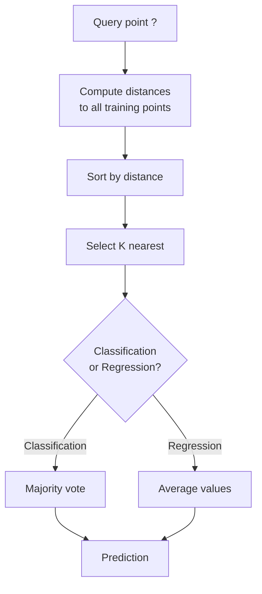
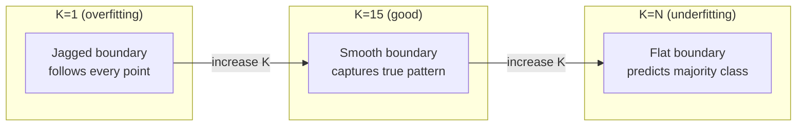
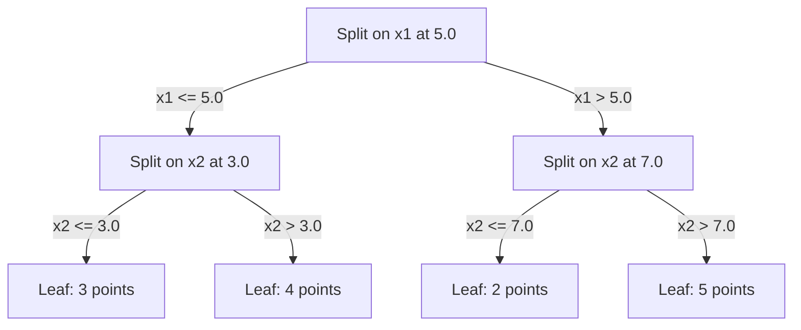

# K - أقرب جيران و مسافة
# K قريبة عن بعد


> تخزين كل شيء، توقع من خلال النظر إلى جيرانك أبسط خوارزمية تعمل فعلاً

> تخزين كل شيء. توقعات. انظر إلى الجيران.

**Type:** Build | **类型：** 构建
**Language:**" بايثون "**语言：**بايثون
**Prerequisites:** Phase 1 (Lesson 14 Norms and Distances) | **前置知识：** Phase 1（第 14 课范数与距离）
**Time:** ~90 minutes | **时间：** 约 90 分钟

## أهداف التعلم

- تنفيذ تصنيف KNN والانسحاب من الصفر مع K قابلة للتكوين والتصويت الموزن عن المسافة
  من الصفر يمكن تحديد K                                                                                                                                                                                                                                                                                                                                                                                                                                                                                                                       
- مقارنة مقاييس المسافة L1، L2، cosine، و Minkowski واختيار واحدة مناسبة لنوع البيانات المحددة
  مقارنة L1、L2、الخطوط والحوافز والمقاييس المسافة على أساس القيادة، لتحديد النوع المحدد من البيانات
- شرح لعنة الابعاد وتوضيح سبب تدهور KNN في المساحات الابعادية العالية
   شرح القدر الكارثة، عرض لماذا KNN في ارتفاع القدر الفضائي انخفاض في الأداء
- بناء شجرة كيه دي لفعالية البحث القريب أقرب وجراحه عندما يتفوق على القوة الخام
  构建 KD 树进行高效 近邻搜索,分析它何时优于暴力搜索


> **【中文解读】**
> الفكر الأساسي في KNN هو أن تكون قريبة من الجيران الأقربين، وتتوقع أن تكون في فئة ما.

> **【拓展：KNN 思想在现代 AI 中的广泛应用】**
> RAG(检索增强生成) 本质就是 KNN:将用户问题编码为向量,在向量数据库中搜索 K 个最相似的文档片段,再将它们提供给 LLM 生成回答──Spotify 音乐推使用近似近邻的近邻的近邻的近邻的近邻的近邻的近邻的近邻的近邻的近邻的近邻的近邻的近邻的近邻的近邻的近邻的近邻的近邻的近邻的近邻的近邻的近邻的近邻的近邻的近邻的近邻的近邻的近邻的近邻的近邻的近邻的近邻的近邻的近邻的近邻的近邻的近邻的近邻的近邻的近邻的近邻的近邻的近邻的近邻的近邻的近邻的近邻的近邻的近邻的近邻的近邻的近邻的近邻的近邻的近邻的近邻的近邻的近邻的近邻的近邻的近邻的近邻的近邻的近邻的近的近邻的近.

## المشكلة المشكلة المشكلة

لديك مجموعة بيانات. نقطة بيانات جديدة تصل. تحتاج إلى تصنيفها أو التنبؤ بقيمةها. بدلاً من تعلم المعايير من البيانات (مثل التراجع الخطي أو SVM) ، يمكنك فقط العثور على نقاط التدريب K القريبة من النقطة الجديدة ودعهم يصوتون.

> لديك مجموعة بيانات جديدة. نقطة بيانات جديدة قد وصلت. تحتاج إلى تقسيمها أو توقع قيمتها. لست بحاجة إلى تعلم العناصر من البيانات مثل العودة السريعة أو SVM ، ولكن العثور على نقطة تدريب K القريبة من النقطة الجديدة ، دعهم يصوتون.

هذه أقرب جيران K. لا يوجد مرحلة تدريب. لا توجد معايير للتعلم. لا توجد وظيفة خسارة لتقليلها. تخزن مجموعة التدريب بأكملها وتحسب المسافات في وقت التنبؤ.

> هذا هو K القريبة. لا يوجد مرحلة تدريبية. لا حاجة إلى العناصر التعلمية. لا حاجة إلى الحد الأدنى من وظيفة الخسارة.

يبدو الأمر بسيطًا جدًا للعمل. ولكن KNN تنافس بشكل مفاجئ في العديد من المشاكل، خاصة مع مجموعات بيانات صغيرة ومتوسطة، وفهمها يكشف عميقًا عن مفاهيم أساسية: اختيار مقياس المسافة (الربط مع الدروس الثانية عشر من المرحلة) ، لعنة الابعاد، والفرق بين التعلم الباكس والسعاده.

> يبدو بسيطًا جدًا ، ولكن KNN تظهر بشكل غريب في العديد من القضايا ، خاصة بالنسبة لمجموعة صغيرة من البيانات.

تظهر KNN أيضًا في كل مكان في الذكاء الاصطناعي الحديث ، تحت أسماء مختلفة. تقوم قواعد بيانات المتجهات KNN بالبحث عن التوابل. يجد الجيل المُزيد من الاسترداد (RAG) أقرب قطع وثيقة K. تكتشف أنظمة التوصية مستخدمين أو عناصر مشابهة. ال خوارزمية هي نفسها. يختلف النطاق وبنية البيانات.

> KNN في الذكاء الاصطناعي الحديث لا يوجد، مجرد اسم مختلف.

> **【中文解读】**
> KNN هو "惰学习" بدون عملية تدريب، التنبؤ في الوقت الحالي لحساب المسافة.

## المفهوم الأساسي

### كيف تعمل KNN

نظراً لمجموعة بيانات من النقاط المعلقة ونقطة استفسار جديدة:

> أعطينا مجموعة بيانات مع علامة ومكالمة استفسار جديدة:

1. حساب المسافة من الاستفسار إلى كل نقطة في مجموعة البيانات
    حساب المسافة بين نقطة استفسار إلى مركز البيانات
2. تصفية حسب المسافة
    حسب المسافة
3. خذ أقرب نقاط K
   取 K 个最近的点
4. للتصنيف: صوت الأغلبية بين الجيران K
   分类任务: ك 个邻居中多数投票
5. بالنسبة للعودة: متوسط (أو متوسط وزني) قيم الجيران K
   归归任务: K 个邻居值的平均(或加权平均)



هذا هو الخوارزمية بأكملها لا توجد تكييفات لا نزول تراجع لا توجد حقول

> هذا هو الخوارزمية بأكملها. لا يوجد أي تطبيقات. لا يوجد أي تطورات.

### اختيار K

K هو المعيار المفرط الوحيد. إنه يسيطر على التداول بين التأثيرات:

> K هو الاختلافات الفائقة الوحيدة.

| K | Behavior |
|---|----------|
| K = 1 | Decision boundary follows every point. Zero training error. High variance. Overfits |
| Small K (3-5) | Sensitive to local structure. Can capture complex boundaries |
| Large K | Smoother boundaries. More robust to noise. May underfit |
| K = N | Predicts the majority class for every point. Maximum bias |

| K | 行为 |
|---|------|
| K = 1 | 决策边界跟随每个点。训练误差为零。高方差。过拟合 |
| 小 K (3-5) | 对局部结构敏感。能捕捉复杂边界 |
| 大 K | 更平滑的边界。对噪声更鲁棒。可能欠拟合 |
| K = N | 每个点都预测多数类。最大偏差 |

نقطة بداية شائعة هي K = sqrt(N) لمجموعة بيانات من N نقاط. استخدم K غير مقارنة للتصنيف الثنائي لتجنب العلاقات.

> القيمة الابتدائية المستخدمة هي K = مربع ((N) ((N 为数据集大小) ・・・二分类使用奇数 K 以避免平票。



### مقاييس المسافة

وظيفة المسافة تعريف ما يعني "قريب" المقاييس المختلفة تنتج جيران مختلفة، توقعات مختلفة.

> 距离函数定义了"近"的含义──不同度产生不同的邻居,不同的预测──

**L2 (Euclidean)**هو الافتراض. المسافة على الخط المستقيم.

> **L2（欧氏距离）**هو اختيار متوقع.

```
d(a, b) = sqrt(sum((a_i - b_i)^2))
```

حساسة للميزات، دائماً تقييم الميزات قبل استخدام L2 مع KNN.

> حساسة للمقاييس المميزة. استخدام L2 في KNN

**L1 (Manhattan)**يجمع الاختلافات المطلقة. أكثر قوة إلى المتفاصيل من L2 لأنه لا يربع الاختلافات.

> **L1（曼哈顿距离）**بالنسبة إلى التباين الحتمي طلب و ∙ ∙ ∙ ∙ ∙ ∙ ∙ ∙ ∙ ∙ ∙ ∙ ∙ ∙ ∙ ∙ ∙ ∙ ∙ ∙ ∙ ∙ ∙ ∙ ∙ ∙ ∙ ∙ ∙ ∙ ∙ ∙ ∙ ∙ ∙ ∙ ∙ ∙ ∙ ∙ ∙ ∙ ∙ ∙ ∙ ∙ ∙ ∙ ∙ ∙ ∙ ∙ ∙ ∙ ∙ ∙ ∙ ∙ ∙ ∙ ∙ ∙ ∙ ∙ ∙ ∙ ∙ ∙ ∙ ∙ ∙ ∙ ∙ ∙ ∙ ∙ ∙ ∙ ∙ ∙ ∙ ∙ ∙ ∙ ∙ ∙ ∙ ∙ ∙ ∙ ∙ ∙ ∙ ∙ ∙ ∙ ∙ ∙ ∙ ∙ ∙ ∙ ∙ ∙ ∙ ∙ ∙ ∙ ∙ ∙ ∙ ∙ ∙ ∙ ∙ ∙ ∙ ∙ ∙ ∙ ∙ ∙ ∙ ∙ ∙ ∙ ∙ ∙ ∙ ∙ ∙ ∙ ∙ ∙    ∙ ∙       ∙       ∙     ∙ ∙             ∙                                                                                                                                                                                           

```
d(a, b) = sum(|a_i - b_i|)
```

**Cosine distance**يُقيّم الزاوية بين المتجهات، دون تجاهل الحجم.

> **余弦距离** قياس الزاوية بين النقاط،                                                                                                                                                                                                                                                          

```
d(a, b) = 1 - (a . b) / (||a|| * ||b||)
```

**Minkowski**يُعمّل L1 و L2 مع المعلم p.

> **闵可夫斯基距离**استخدام العناصر p 推广了 L1 و L2

```
d(a, b) = (sum(|a_i - b_i|^p))^(1/p)

p=1: Manhattan
p=2: Euclidean
p->inf: Chebyshev (max absolute difference)
```

أي مقياس تستخدم يعتمد على البيانات:

> 选择哪种度量取决于数据:

| Data type | Best metric | Why |
|-----------|------------|-----|
| Numeric features, similar scale | L2 (Euclidean) | Default, works for spatial data |
| Numeric features, outliers | L1 (Manhattan) | Robust, does not amplify large differences |
| Text embeddings | Cosine | Magnitude is noise, direction is meaning |
| High-dimensional sparse | Cosine or L1 | L2 suffers from curse of dimensionality |
| Mixed types | Custom distance | Combine metrics per feature type |

| 数据类型 | 最佳度量 | 原因 |
|---------|--------|------|
| 数值特征，量级相近 | L2（欧氏） | 默认选择，适合空间数据 |
| 数值特征，有异常值 | L1（曼哈顿） | 鲁棒，不放大大的差异 |
| 文本嵌入 | 余弦 | 大小是噪声，方向是含义 |
| 高维稀疏 | 余弦或 L1 | L2 受维度灾难影响 |
| 混合类型 | 自定义距离 | 按特征类型组合度量 |

### KNN الموزن

يمنح KNN القياسية وزنًا متساوٍ لجميع الجيران K. لكن جيرًا في المسافة 0.1 يجب أن يكون أكثر من واحد في المسافة 5.0.

> المعيار KNN يعطي جميع الجيران اليمنى نفس الوزن. لكن مسافة 0.1 من الجيران يجب أن تكون أهم من مسافة 5.0.

**Distance-weighted KNN**يزن كل جيرانه عكسًا بالبعيد:

> **距离加权 KNN**按距离的倒数加权每邻居:

```
weight_i = 1 / (distance_i + epsilon)

For classification: weighted vote
For regression:     weighted average = sum(w_i * y_i) / sum(w_i)
```

يمنع الـ (إيبسيلون) من الانقسام بالصفر عندما تتطابق نقطة الاستفسار مع نقطة التدريب بالضبط.

> الوقاية من نقاط الاستفسار التدريبات المتكاملة

إن KNN الموزن أقل حساسية لخيار K لأن الجيران البعيدين يساهمون قليلاً جداً بغض النظر.

> زيادة القدر من القدر من القدر من القدر من القدر من القدر من القدر من القدر من القدر من القدر من القدر من القدر من القدر من القدر من القدر من القدر من القدر من القدر من القدر من القدر من القدر من القدر من القدر من القدر من القدر من القدر من القدر من القدر من القدر من القدر من القدر من القدر من القدر من القدر من القدر من القدر من القدر من القدر من القدر من القدر من القدر من القدر من القدر من القدر من القدر من القدر من القدر من القدر من القدر من القدر من القدر من القدر من القدر من القدر من القدر من القدر من القدر من القدر من القدر من القدر من القدر من القدر من القدر من القدر من القدر من القدر من القدر من القدر من القدر من القدر من القدر من القدر من القدر من القدر من القدر من القدر من القدر من القدر من القدر من القدر من القدر من القدر من القدر من القدر من القدر من القدر من القدر من القدر من القدر من القدر من القدر من القدر من القدر من القدر من القدر من القدر من القدر من القدر من القدر من القدر من القدر من القدر من القدر من القدر من القدر من القدر من القدر من القدر من القدر من القدر من القدر من القدر من القدر من القدر من القدر من القدر من القدر من القدر من القدر من القدر من القدر من القدر من القدر من القدر من القدر من القدر من القدر من القدر من القدر من القدر من القدر من القدر من القدر من القدر من القدر من القدر من القدر من القدر من القدر من القدر من القدر من القدر من القدر.

### لعنة الأبعاد

أداء KNN يتدهور في أبعاد عالية. هذه ليست قلق غامض. إنها حقيقة رياضية.

> إن أداء KNN في ارتفاع الدرجة المتوسط قد تدهور.

**Problem 1: distances converge.**مع زيادة الأبعاد، يصل نسبة المسافة القصوى إلى المسافة الأدنى إلى 1. تصبح جميع النقاط "بعد" من السؤال على قدم المساواة.

> **问题 1：距离趋同。**مع زيادة الدرجة، فإن المسافة القصوى والقليل من المسافة تقترب من 1 . كل النقاط تتغير إلى نقاط الاستفسار.

```
In d dimensions, for random uniform points:

d=2:    max_dist / min_dist = varies widely
d=100:  max_dist / min_dist ~ 1.01
d=1000: max_dist / min_dist ~ 1.001

When all distances are nearly equal, "nearest" is meaningless.
```

**Problem 2: volume explodes.**لالتقاط الجيران K داخل جزء ثابت من البيانات، تحتاج إلى توسيع نصف قطر البحث لتغطية جزء أكبر بكثير من المساحة المميزة. "الجوار" في الأبعاد العالية يشمل معظم المساحة.

> **问题 2：体积爆炸。**للاستيعاب في نسبة ثابتة من البيانات من K 个邻居, تحتاج إلى توسيع نصف البحث إلى نسبة أكبر من المساحة التي تغطي خصائصها.

**Problem 3: corners dominate.**في وحدة كوب هائبر في d الأبعاد، تركز معظم الحجم بالقرب من الزوايا، وليس الوسط. الكرة المشاركة في الكوب تحتوي على جزء متلاشى من الحجم مع نمو d.

> **问题 3：角落主导。**في d 维单位超立方体، تركز معظم الساحة على الركن، وليس المركز. مع نمو d , يتجه نسبة الساحة التي تحتوي على الكرة داخل المربع إلى صفر.

النتيجة العملية: تعمل KNN بشكل جيد حتى حوالي 20-50 ميزة. وبالإضافة إلى ذلك ، تحتاج إلى تقليل الأبعاد (PCA ، UMAP ، t-SNE) قبل تطبيق KNN ، أو تحتاج إلى استخدام هيكلات البحث القائمة على الأشجار التي تستغل الأبعاد السفلية الداخلية للبيانات.

> النتائج الحقيقية:KNN في حوالي 20-50 个特征以下效果良好── تجاوز هذا المدى، تحتاج إلى تنفيذ تخفيضات في تطبيق KNN قبل PCA、UMAP、t-SNE) ، أو استخدام البيانات داخل بنية بحث الأشجار من الدرجة المنخفضة──

### شجرة كيه دي: بحث سريع عن أقرب جيران

يقوم KNN بقوة قاسية بحساب المسافة من الاستفسار إلى كل نقطة تدريب. وهذا هو O(n * d) لكل استفسار. بالنسبة لمجموعات بيانات كبيرة، هذا بطيء جدا.

> 暴力 KNN  حساب نقاط البحث إلى كل نقطة تدريبة بُعدها                                                                                                                                                                                                                                                     

تقوم شجرة KD بتقسيم الفضاء بشكل متكرر على طول محور الميزات. في كل مستوى، تقسم على طول بعد واحد عند القيمة المتوسطة.

> كد 树沿特征轴递归划分空间── كل طبقة على طول طول واحد در وسط القيمة处分离──



للعثور على أقرب جيران، عبر الشجرة إلى الورقة التي تحتوي على السؤال، ثم تراجع وتحقق من الشقق المجاورة فقط إذا كان يمكن أن تحتوي على نقاط أقرب.

> للعثور على الجوار القريب، عبر الأشجار إلى نقاط الشجر التي تحتوي على نقاط الاستفسار، ثم العودة إلى الوراء ويمكن أن تحتوي فقط على نقاط أكثر قريبا في المنطقة المجاورة.

متوسط وقت البحث: O(log n) للأبعاد المنخفضة. ولكن شجرة KD تتدهور إلى O(n) في الأبعاد العالية (d > 20) لأن التراجع يزيل فروع أقل وأقل.

> 低维平均查询时间:O(log n) ・・・ ولكن KD 树在高维(d > 20) 时退化为O(n) ،因为回溯消除的分支越来越少──

### أشجار الكرة: أفضل للأبعاد المتوسطة

تقوم أشجار الكرة بتقسيم البيانات إلى كواكب متضخمة بدلاً من صناديق مرتبطة بالمحور. تحدد كل عقد كرة (الوسط + نصف قطر) تحتوي على جميع النقاط في تلك الشجرة الفرعية.

> ستقوم الشجرة بتقسيم البيانات إلى مربعات فوق الكرة في الحلبة وليس مربعات على المحور.

المزايا على الأشجار الكهربائية:
- تعمل بشكل أفضل في الأبعاد المتوسطة (حتى ~50)
  في الوسط الوسط ((أعلى حوالي 50)
- الجهاز غير المتحبط بالمحور
  能处理 غير محور على بنية
- الحدود الضيقة تعني أن المزيد من الفروع يتم قصها أثناء البحث
  أكثر حوائطا يعني البحث عند قطع الأغصان أكثر

كل من شجرة كيه دي وشجرة الكرة هي خوارزميات دقيقة. للبحث على نطاق واسع حقا (ملايين النقاط ، مئات الأبعاد) ، تستخدم بدلاً من ذلك تقريبي أقرب الأساليب الجارية (HNSW ، IVF ، كمية المنتج). يتم تغطيتها في المرحلة 1 الدروس 14.

> كد 树和球树都是精确算法──对于真正的大规模搜索 (((百万点、数百维),使用近似近邻方法 (((HNSW、IVF、乘积量化)──这些在第一阶段 第14课中讨论──

### التعلم الباكس مقابل التعلم السعيد

كين إن هو متعلم كسيل: لا يعمل في وقت التدريب وكل العمل في وقت التنبؤ. معظم الخوارزميات الأخرى (التراجع الخطي، SVMs، الشبكات العصبية) متعلمون حريصين: يقومون بحسابات ثقيلة في وقت التدريب لبناء نموذج صغير، ثم التنبؤات سريعة.

> ك.ن.ن. هو آلة تعلم لاجدية: عندما تدرب لا تقوم بأي عمل، كل العمل يتم في وقت التنبؤ.

| Aspect | Lazy (KNN) | Eager (SVM, neural net) |
|--------|------------|------------------------|
| Training time | O(1) just store data | O(n * epochs) |
| Prediction time | O(n * d) per query | O(d) or O(parameters) |
| Memory at prediction | Store entire training set | Store model parameters only |
| Adapts to new data | Add points instantly | Retrain the model |
| Decision boundary | Implicit, computed on the fly | Explicit, fixed after training |

| 方面 | 懒惰学习 (KNN) | 积极学习 (SVM, 神经网络) |
|------|---------------|------------------------|
| 训练时间 | O(1) 仅存储数据 | O(n * epochs) |
| 预测时间 | 每次查询 O(n * d) | O(d) 或 O(参数) |
| 预测时内存 | 存储整个训练集 | 仅存储模型参数 |
| 适应新数据 | 即时添加点 | 重新训练模型 |
| 决策边界 | 隐式，即时计算 | 显式，训练后固定 |

التعلم الباكس هو المثالي عندما:
- مجموعة البيانات تتغير بشكل متكرر (إضافة/إزالة النقاط دون إعادة التدريب)
  اعداد و شمار集频繁变化 ((لا حاجة إلى تدريب ثقيل即可添加/删除点)
- تحتاجين إلى توقعات لعدد قليل جدا من الأسئلة
  فقط تحتاج إلى إجراء توقعات مع قليل من الاستفسارات
- تريدون صفر وقت تدريب
   بحاجة إلى التدريب
- مجموعة البيانات صغيرة بما فيه الكفاية لبحث القوة القاسية سريعة
  اعداد و شمار مجموعة كافى صغير, تشدد بحث بسرعة

> 惰学习 في الحالات التالية أفضل مثال:

### KNN للعودة

بدلاً من التصويت بأغلبية، يعد KNN للعودة متوسطات القيم المستهدفة للجيران K.

> KNN 回归不使用多数投票,而是对 K 个邻居的目标值取平均──

```
prediction = (1/K) * sum(y_i for i in K nearest neighbors)

Or with distance weighting:
prediction = sum(w_i * y_i) / sum(w_i)
where w_i = 1 / distance_i
```

إن رجعة KNN تنتج توقعات ثابتة قطعة (أو سلمة قطعة مع الوزن). لا يمكن استخراجها خارج نطاق بيانات التدريب. إذا كان جميع أهداف التدريب بين 0 و100، لن تتوقع KNN 200 أبدا.

> لا يمكن أن يتم إبعاد KNN إلى النسبة المعتادة للعدد المعتاد (( أو إضافة القدر) من التنبؤات.

> **【中文解读】**
> كين إن رجعت إلى استخدام K 个近邻的目标值取平均(或距离加权平均) كمقيمة التنبؤ.

> **【拓展：大规模最近邻搜索——从 KNN 到 FAISS】**
> عندما نمت حجم البيانات من آلاف إلى مليارات الساعات ، تم استخدام KNN 搜索太慢.

## بناء ذلك تحرك لتحقيق
```figure
knn-smoothness
```

## بناءها

### الخطوة 1: وظائف المسافة

قم بتنفيذ مسافات L1، L2، كوزين، و Minkowski. هذه ترتبط مباشرة إلى المرحلة 1 الدروس 14.

> 实现 L1、L2、余弦和可夫斯基距离──这些直接连接到阶段 1 第14 课──

```python
import math

def l2_distance(a, b):
    return math.sqrt(sum((ai - bi) ** 2 for ai, bi in zip(a, b)))  # 欧氏距离（L2 范数）

def l1_distance(a, b):
    return sum(abs(ai - bi) for ai, bi in zip(a, b))  # 曼哈顿距离（L1 范数）

def cosine_distance(a, b):
    dot_val = sum(ai * bi for ai, bi in zip(a, b))  # 点积
    norm_a = math.sqrt(sum(ai ** 2 for ai in a))  # 向量 a 的模
    norm_b = math.sqrt(sum(bi ** 2 for bi in b))  # 向量 b 的模
    if norm_a == 0 or norm_b == 0:
        return 1.0
    return 1.0 - dot_val / (norm_a * norm_b)  # 余弦距离 = 1 - 余弦相似度

def minkowski_distance(a, b, p=2):
    if p == float('inf'):
        return max(abs(ai - bi) for ai, bi in zip(a, b))  # p=∞ 时为切比雪夫距离
    return sum(abs(ai - bi) ** p for ai, bi in zip(a, b)) ** (1 / p)  # 闵可夫斯基距离
```

### الخطوة الثانية: تصنيف KNN ومرجع

قم ببناء KNN الكامل مع K قابلة للتكوين، ومقياس المسافة، وميزان المسافة الاختياري.

> تشكيل KNN كاملة، دعم التنظيم K ∆ المسافة القياسية والمسافة المختارة

```python
class KNN:
    def __init__(self, k=5, distance_fn=l2_distance, weighted=False,
                 task="classification"):
        self.k = k
        self.distance_fn = distance_fn
        self.weighted = weighted
        self.task = task
        self.X_train = None
        self.y_train = None

    def fit(self, X, y):
        self.X_train = X
        self.y_train = y

    def predict(self, X):
        return [self._predict_one(x) for x in X]
```

### الخطوة الثالثة: شجرة كيه دي للبحث الفعال

بناء شجرة كيه دي من الصفر التي تقسم بشكل متكرر على وسط كل بعد.

> من صفر بناء كد شجرة، على طول كل طول من القيمة الوسطى تقسيمها.

```python
class KDTree:
    def __init__(self, X, indices=None, depth=0):
        # Recursively partition the data
        self.axis = depth % len(X[0])
        # Split on median of the current axis
        ...

    def query(self, point, k=1):
        # Traverse to leaf, then backtrack
        ...
```

انظر`code/knn.py`لتنفيذ كامل مع جميع أساليب المساعدة والإثباتات.

> 完整实现 含所有辅助方法和演示 见`code/knn.py`.

### الخطوة الرابعة: تحسين الميزات

يتطلب KNN تحديد حجم الميزات لأن المسافات حساسة لجمعات الميزات. سوف تهيمن ميزة تتراوح بين 0 و 1000 على ميزة تتراوح بين 0 و 1.

> يُريد KNN تضييق الخصائص، لأن المسافة إلى الخصائص الحساسة على درجة الخصائص.

```python
def standardize(X):
    n = len(X)
    d = len(X[0])
    means = [sum(X[i][j] for i in range(n)) / n for j in range(d)]
    stds = [
        max(1e-10, (sum((X[i][j] - means[j]) ** 2 for i in range(n)) / n) ** 0.5)
        for j in range(d)
    ]
    return [[((X[i][j] - means[j]) / stds[j]) for j in range(d)] for i in range(n)], means, stds
```

## استخدمها في إطار التنفيذ

مع التعلم المُسلّق:

> استخدام المعلم:

```python
from sklearn.neighbors import KNeighborsClassifier
from sklearn.preprocessing import StandardScaler
from sklearn.pipeline import Pipeline

clf = Pipeline([
    ("scaler", StandardScaler()),
    ("knn", KNeighborsClassifier(n_neighbors=5, metric="euclidean")),
])
clf.fit(X_train, y_train)
print(f"Accuracy: {clf.score(X_test, y_test):.4f}")
```

يستخدم Scikit-learn تلقائيًا أشجار KD أو أشجار الكرة عندما يكون مجموعة البيانات كبيرة بما فيه الكفاية والبعمية منخفضة بما فيه الكفاية. بالنسبة للبيانات العالية الأبعاد ، فإنه يعود إلى القوة الخامة. يمكنك التحكم في هذا باستخدام `algorithm`المعلم

> تعلّم قليلاً في مجموعة البيانات الكبيرة بما فيه الكفاية والقيام بها منخفضًا بما فيه الكفاية عندما تستخدم KD 树或球树.`algorithm`参数控制。

للبحث على نطاق واسع عن أقرب جيران (ملايين المتجهات) ، استخدم FAISS أو Annoy أو قاعدة بيانات متجهات:

> 对于大规模近邻搜索 ((百万向量) ، استخدام FAISS、Annoy أو向量数据库:

```python
import faiss

index = faiss.IndexFlatL2(dimension)
index.add(embeddings)
distances, indices = index.search(query_vectors, k=5)
```

> **【拓展：从 KNN 到向量数据库——AI 基础设施的演进】**
> فكره KNN هو جوهر بنية التحتية الحديثة للذكاء الاصطناعي. راج (بحث زيادة إنتاج) باستخدام KNN في البيانات المتقدمة للبحث عن المستندات ذات الصلة. نظام توصية باستخدام القريبة القريبة (ANN) في العدد الملياري من الشروط للعثور على سلع مماثلة. بحث الصورة باستخدام CLIP Embedding + FAISS لتحقيق عملية بحث عبر الطراز.

## تمارين التدريب

1. تنفيذ تصنيف KNN على مجموعة بيانات 2D ذات 3 فئات. رسم الحدود القرارية ل K=1, K=5, K=15, و K=N. لاحظ الانتقال من الإعدادات المفرطة إلى الإعدادات السيئة.
   1. في 3 类 2D اعداد و شمار على تحقيق KNN 分类── رسم K=1、K=5、K=15 و K=N الحدود القرارية٬ مشاهدة من المفروض إلى غير المفروض للتحولات٬

2. توليد 1000 نقطة عشوائية في 2، 5، 10، 50، 100، و 500 بعد. لكل بعد، حساب نسبة من أقصى مسافة زوجية إلى أدنى بعد زوجية. رسم النسبة مقابل بعد لتصور لعنة بعد.
   2. في 2、5、10、50、100 و500 维中各生成 1000 随机点── لكل طول، الحساب أقصى عدد من المسافة إلى أدنى عدد من المسافة إلى النسبات── رسم الرسمة العلاقة بين النسبات والبعالم، وتحديد المدى المبين‬‬‬‬‬‬‬‬‬‬‬‬‬‬‬‬‬‬‬‬‬‬‬‬‬‬‬‬‬‬‬‬‬‬‬‬‬‬‬‬‬‬‬‬‬‬‬‬‬‬‬‬‬‬‬‬‬‬‬‬‬‬‬‬‬‬‬‬‬‬‬‬‬‬‬‬‬‬‬‬‬‬‬‬‬‬‬‬‬‬‬‬‬‬‬‬‬‬‬‬‬‬‬‬‬‬‬‬‬‬‬‬‬‬‬‬‬‬‬‬‬‬‬‬‬‬‬‬‬‬‬‬‬‬‬‬‬‬‬‬‬‬‬‬‬‬‬‬‬‬‬‬‬‬‬‬‬‬‬‬‬‬‬‬‬‬‬‬‬‬‬‬‬‬‬‬‬‬‬‬‬‬‬‬‬‬‬‬‬‬‬‬‬‬‬‬‬‬‬‬‬‬‬‬‬‬‬‬‬‬‬‬‬‬‬‬‬‬‬‬‬‬‬‬‬‬‬‬‬‬‬‬‬‬‬‬‬‬‬‬‬‬‬‬‬‬‬‬‬‬‬‬‬‬‬‬‬‬‬‬‬‬‬‬‬‬‬‬‬‬‬‬‬‬‬‬‬‬‬‬‬‬‬‬‬‬‬‬‬‬‬‬‬‬‬‬‬‬‬‬‬‬‬‬‬‬‬‬‬‬‬‬‬‬‬‬‬‬‬‬‬‬‬‬‬‬‬‬‬‬‬‬‬‬‬‬‬‬‬‬‬‬‬‬‬‬‬‬‬‬‬‬‬‬‬‬‬‬‬‬‬‬‬‬‬‬‬‬‬‬‬‬‬‬‬‬‬‬‬‬‬‬‬‬‬‬‬‬‬‬‬‬‬‬‬‬‬‬‬‬‬‬‬‬‬‬‬‬‬‬‬‬‬‬‬‬‬‬‬‬‬‬‬‬‬‬‬‬‬‬‬‬‬‬‬‬‬‬‬‬‬

3. مقارنة L1، L2، والمسافة الكوسينية لـ KNN على مشكلة تصنيف النص (استخدم متجهات TF-IDF). أي مقياس يعطي أفضل دقة؟ لماذا يميل الكوسين إلى الفوز للنص؟
   3. في درسانى分类问题 ((استخدم TF-IDF 向量) على مقارنة L1、L2 和余弦距离── أي مقياس هو أعلى؟ لماذا يكون余弦 على درسانى أفضل عادة؟

4. تنفيذ شجرة كيه دي وقياس وقت الاستفسار مقابل القوة الخام لمجموعات البيانات من 1k، 10k، و 100k نقاط في 2D، 10D، و 50D. في أي بعد توقف شجرة كيه دي عن أن تكون أسرع من القوة الخام؟
   4. 实现 KD 树, قياس 1k、10k 和 100k نقطة في 2D、10D 和 50D معدل وقت البحث عن العنف.

5. قم ببناء مقياس KNN الموزن لـ y = sin(x) + الضجيج. قارنه مع KNN غير الموزن لـ K = 3, 10, 30.
   5. 为 y = sin(x) + ضجيج 构建加权 KNN 回归器──在 K=3、10、30 时与未加权 KNN 比较──展示加权产生更光滑预测,特别在大 K 时──

## شروط الرئيسية

| Term | What it actually means |
|------|----------------------|
| K-nearest neighbors | Non-parametric algorithm that predicts by finding the K closest training points to a query |
| Lazy learning | No computation at training time. All work happens at prediction time. KNN is the canonical example |
| Eager learning | Heavy computation at training time to build a compact model. Most ML algorithms are eager |
| Curse of dimensionality | In high dimensions, distances converge and neighborhoods expand to cover most of the space, making KNN ineffective |
| KD-tree | Binary tree that recursively partitions space along feature axes. O(log n) queries in low dimensions |
| Ball tree | Tree of nested hyperspheres. Works better than KD-trees in moderate dimensions (up to ~50) |
| Weighted KNN | Neighbors weighted inversely by distance. Closer neighbors have more influence on the prediction |
| Feature scaling | Normalizing features to comparable ranges. Required for distance-based methods like KNN |
| Majority vote | Classification by counting which class is most common among K neighbors |
| Brute force search | Computing distance to every training point. O(n*d) per query. Exact but slow for large n |
| Approximate nearest neighbor | Algorithms (HNSW, LSH, IVF) that find approximately nearest points much faster than exact search |
| Voronoi diagram | The partition of space where each region contains all points closer to one training point than any other. K=1 KNN produces Voronoi boundaries |

## المزيد من القراءة

- [Cover & Hart: Nearest Neighbor Pattern Classification (1967)](https://ieeexplore.ieee.org/document/1053964)- ورقة KNN الأساسية التي تثبت أن لديها معدل خطأ على الأكثر ضعف معدل بايز المثالي
  [Cover & Hart: Nearest Neighbor Pattern Classification (1967)](https://ieeexplore.ieee.org/document/1053964)- إثبات KNN  ارتفاع معدلات الأخطاء في بيلياس
- [Friedman, Bentley, Finkel: An Algorithm for Finding Best Matches in Logarithmic Expected Time (1977)](https://dl.acm.org/doi/10.1145/355744.355745)- الورق الأصلي من قاعدة كيه دي
  [Friedman, Bentley, Finkel: An Algorithm for Finding Best Matches in Logarithmic Expected Time (1977)](https://dl.acm.org/doi/10.1145/355744.355745)- KD 树原始论文
- [Beyer et al.: When Is "Nearest Neighbor" Meaningful? (1999)](https://link.springer.com/chapter/10.1007/3-540-49257-7_15)- تحليل رسمي لعنة الابعاد للجيران الأقرب
  [Beyer et al.: When Is "Nearest Neighbor" Meaningful? (1999)](https://link.springer.com/chapter/10.1007/3-540-49257-7_15)- تحليل رسمي حديث للكوارث
- [scikit-learn Nearest Neighbors documentation](https://scikit-learn.org/stable/modules/neighbors.html)- دليل عملي مع اختيار الخوارزميات
  [scikit-learn 最近邻文档](https://scikit-learn.org/stable/modules/neighbors.html)- 实用指南及算法选择
- [FAISS: A Library for Efficient Similarity Search](https://github.com/facebookresearch/faiss)- مكتبة "ميتا" للبحث عن القريب القريب على نطاق مليار
  [FAISS](https://github.com/facebookresearch/faiss)- الميتا من المليارات من الصف القريبة قريبا من الموقع البحثي
