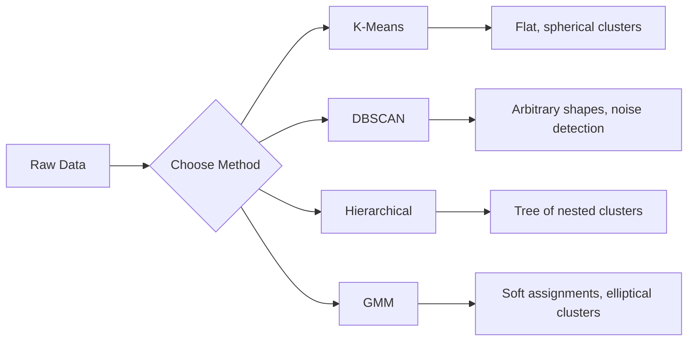

# التعلم بدون إشراف
# 无监督学习


> لا تسميات ولا معلم، الخوارزمية تجد الهيكل بمفردها

> لا يوجد علامات، لا يوجد معلم.

**Type:** Build | **类型：** 构建
**Languages:** Python
**Prerequisites:** Phase 1 (Norms & Distances, Probability & Distributions), Phase 2 Lessons 1-6 | **前置知识：** Phase 1（范数与距离、概率与分布），Phase 2 第 1-6 课
**Time:** ~90 minutes | **时间：** 约 90 分钟

## أهداف التعلم

- تنفيذ نماذج K-Means و DBSCAN و Gaussian Mix Model من الصفر ومقارنة سلوك التجميع
  من التحقق من صفر K-Means、DBSCAN 和高斯混合模型 (GMM) ، مقارنة تصرفاتهم المجموعة
- تقييم جودة الكلاستر باستخدام درجة الحكيمة و طريقة الكوع لتحديد K المثالي
  استخدام العدد والإقدام لتقييم الجمعية الجودة، اختيار أفضل K
- شرح متى تتفوق DBSCAN على K-Means وتحديد الخوارزمية التي تتعامل مع المجموعات غير الكونية والمتفاصيل
   شرح DBSCAN 何時優越 K-معنى، تحديد أي نوع من الخوارزميات يمكن أن يعالج غير كرة  والقيمة غير العادية
- بناء خط أنابيب اكتشاف التشوهات باستخدام طرق التجميع لمقاطع العلامة التي تختلف عن الأنماط الطبيعية
  استخدام طريقة التجميع لبناء خطوط اختبار غير عادية، وتسجيل نقطة من النموذج الطبيعي


> **【中文解读】**
> 无监督学习没有标签, هدف هو العثور على البيانات في البنية. K-Means هي الأكثر كلاسيكية من حوارزميات التجميع. DBSCAN 能发现任意形的──sklearn 中 KMeans/DBSCAN──客户分群、异常检测是典型应用──

> **【拓展：无监督学习在真实 AI 系统中的价值】**
> استخدام خوارزمية جمع الفئات في Google Photos سوف تكون مماثلة لـ "مجموعة الصور" ([[الوجوه الشخصية]], الموقع]], المشهد) ؛ وظيفة "التعرف" في Spotify باستخدام جمع الفئات المستخدمة بعد التوصية؛ فحص غير المعتاد في مجال الأمن على شبكة الإنترنت باستخدام DBSCAN/Isolation Forest 发现异常流量── في حالة عدم وجود علامة أو علامة للحصول على تكلفة عالية للغاية، فإن تعلم دون رقابة هو الخيار الوحيد──

## المشكلة المشكلة المشكلة

كل درس من دروس ML حتى الآن افترضت بيانات مع علامات: "هنا مدخل، وهنا الخروج الصحيح". في العالم الحقيقي، العلامات مكلفة. مستشفى لديه ملايين سجلات المرضى ولكن لم يضع أحد علامة يدوية على كل واحد من هذه المرضات موقع التجارة الإلكترونية يحتوي على ملايين جلسات المستخدمين ولكن لا أحد لديه علامات يدوية على قطاعات العملاء. فريق الأمن لديه سجلات الشبكة لكن لم يلاحظ أحد كل شذوذ

>  كل درجة سابقة كانت فرضية أن يكون هناك بيانات معينة:"هذه إدخال، هذا صحيح إدخال"."" في العالم الحقيقي، يكون التسجيل مكلفا.‬‬‬‬‬‬‬‬‬‬‬‬‬‬‬‬‬‬‬‬‬‬‬‬‬‬‬‬‬‬‬‬‬‬‬‬‬‬‬‬‬‬‬‬‬‬‬‬‬‬‬‬‬‬‬‬‬‬‬‬‬‬‬‬‬‬‬‬‬‬‬‬‬‬‬‬‬‬‬‬‬‬‬‬‬‬‬‬‬‬‬‬‬‬‬‬‬‬‬‬‬‬‬‬‬‬‬‬‬‬‬‬‬‬‬‬‬‬‬‬‬‬‬‬‬‬‬‬‬‬‬‬‬‬‬‬‬‬‬‬‬‬‬‬‬‬‬‬‬‬‬‬‬‬‬‬‬‬‬‬‬‬‬‬‬‬‬‬‬‬‬‬‬‬‬‬‬‬‬‬‬‬‬‬‬‬‬‬‬‬‬‬‬‬‬‬‬‬‬‬‬‬‬‬‬‬‬‬‬‬‬‬‬‬‬‬‬‬‬‬‬‬‬‬‬‬‬‬‬‬‬‬‬‬‬‬‬‬‬‬‬‬‬‬‬‬‬‬‬‬‬‬‬‬‬‬‬‬‬‬‬‬‬‬‬‬‬‬‬‬‬‬‬‬‬‬‬‬‬‬‬‬‬‬‬‬‬‬‬‬‬‬‬‬‬‬‬‬‬‬‬‬‬‬‬‬‬‬‬‬‬‬‬‬‬‬‬‬‬‬‬‬‬‬‬‬‬‬‬‬‬‬‬‬‬‬‬‬‬‬‬‬‬‬‬‬‬‬‬‬‬‬‬‬‬‬‬‬‬‬‬‬‬‬‬‬‬‬‬‬‬‬‬‬‬‬‬‬‬‬‬‬‬‬‬‬‬‬‬‬‬‬‬‬‬‬‬‬‬‬‬‬‬‬‬‬‬‬‬‬‬‬‬‬‬‬‬‬‬‬‬‬‬‬‬‬‬‬‬‬‬‬‬‬‬‬‬‬‬‬‬‬‬‬‬‬‬‬‬‬‬‬‬‬‬‬‬‬‬‬‬‬‬‬‬‬‬

يجد التعلم غير المشرف نمطًا دون أن يُخبر به ما يبحث عنه. يجمع نقاط البيانات المماثلة، ويكتشف الهياكل الخفية، ويظهر الخلل. إذا كان التعلم المشرف يتعلم من كتاب دراسي يحتوي على مفتاح الإجابة، فإن التعلم غير المشرف يحدق في البيانات الخام حتى تظهر الأنماط نفسها.

> 无监督学习在没有被告知寻找什么的情况下发现模式――它将相似的数据点分组,发现隐藏结构,揭露异常――如果监督学习是从有答案的教科书学习,无监督学习就是着原始数据直到模式自我显现――

المشكلة: بدون علامات، لا يمكنك قياس "الصواب" أو "الخاطئ" مباشرة. تحتاج إلى أدوات مختلفة لتقييم ما إذا كانت الهيكل الذي وجدته خوارزميتك له معنى.

> المشكلة الرئيسية: لا يوجد علامة، لا يمكنك قياس "على" أو "خطأ" مباشرة. تحتاج إلى أدوات مختلفة لتقييم ما إذا كان هيكل الجهاز المكتشف له معنى.

> **【中文解读】**
> التحدي الأساسي للتعلم دون رقابة هو التقييم: لا يوجد علامة لا يمكن قياسها مباشرة على الخطأ. تحتاج إلى استخدام مقياسات الجدول والقانون الإقدام.

## المفهوم الأساسي

### التجميع: تجميع الأشياء المماثلة معاً

يخصص التجميع كل نقطة بيانات إلى مجموعة (مجموعة) بحيث تكون النقاط داخل نفس المجموعة أكثر تشابهًا ببعضها البعض من النقاط في مجموعات أخرى. السؤال دائمًا هو: ما الذي يعنيه "مثل" ؟

> 聚类将每个数据点分配到一个组),使同一组内的点比其他组的点更相似.



### ك-معنى: حصان العمل

K-Means تقسم البيانات إلى مجموعات K بالضبط. لكل مجموعة مركز (مركز كتلها) ، وتنتمي كل نقطة إلى أقرب مركز.

> K- يعني أن تقسيم البيانات بشكل محدد إلى K 个── كل واحد لديه质心(其质心) ، كل نقطة تنتمي إلى الجودة القريبة.

خوارزمية لويد:

> لويد 算法:

1. اختر نقاط عشوائية ك المركزية الأولية
   随机选择 K 个点作为初始质心
2. تعيين كل نقطة بيانات إلى أقرب مركز
   تمنح كل نقطة بيانات للقاعدة الأخيرة
3. اعيد حساب كل مركز كمتوسط النقاط المخصصة لها
   重新计算每质心为其分配点的平均值
4. كرر الخطوات 2-3 حتى تتوقف المهام عن التغيير
   重复步骤 2-3 حتى توقف التوزيع عن التغيير

تقوم الوظيفة الموضوعية (الدرجة السلبية) بقياس المسافة المربعة الإجمالية من كل نقطة إلى مركزها المخصص. يقلل K-Means هذا، لكنه يجد الحد الأدنى المحلي فقط. يمكن أن تؤدي التبنيات المختلفة إلى نتائج مختلفة.

> 目標函数 (慣性) قياس كل نقطة إلى مسافة مربعة من نوعيتها الموزعة. K- يعني أقصى تقليل لها، ولكن فقط العثور على الحد الأدنى من القيمة المحلية.

### اختيار K

طرق قياسية:

> 两种标准方法:

**Elbow method:**أبحث عن "الكمب" حيث يوقف إضافة المزيد من المجموعات من تقليل الهبط بشكل كبير.

> **肘部法则：**على K = 1، 2، 3، ..., n 运行 K-Means── رسم惯性 مقابل K 的图── البحث عن "عبور" زيادة المزيد لم يعد يقلل بشكل ملحوظ من الموقع العادي

**Silhouette score:**للكل نقطة، قياس مدى تشابهها بمجموعة (أ) الخاصة بها مقابل أقرب مجموعة أخرى (ب). معدل الصورة هو (ب - أ) / أقصى عدد (أ) ، ب) ، يتراوح من -1 (مجموعة خاطئة) إلى +1 (مجموعة جيدة). متوسط على جميع النقاط للحصول على درجة عالمية.

> **轮廓系数：**للكل نقطة، قياسها على شباهة (أ) مقارنة بالآخرين المقربين (ب)  العدد الجاري هو (ب - أ) / أقصى (أ) ، ب) ، تتراوح من -1  خطأ ) إلى +1  جمع جيد)  لجميع النقاط تأخذ متوسط الحصول على الجانب الكامل 

### DBSCAN: التجميع القائم على الكثافة

يفترض K-Means أنّ المجموعات كُنْتَ كُرُوعية ويطلب منك اختيار K مقدماً. DBSCAN لا يفترض أيّاً من هذه المجموعات. يجد المجموعات كمناطق كثيفة منفصلة عن المنطقة النادرة.

> K-معنى افتراض  هو كرة شكل وتحتاج إلى الانتخابات المسبقة K―DBSCAN لا تفعل هذه الافتراضات―إنه سوف يُكتشف  كمناطق كثيفة من المنطقة المنفصلة نادرة―

ملامح:
- **eps**: نصف قطر الحي
  **eps**: نصف قطر
- **min_samples**: الحد الأدنى من النقاط اللازمة لتشكيل منطقة كثيفة
  **min_samples**: أقل عدد من النقاط المطلوبة لتشكيل منطقة كثيفة

ثلاثة أنواع من النقاط:
- **Core point**: يحتوي على على الأقل على نقطة min_samples ضمن مسافة eps
  **核心点**: في البحرين                                                                                                                                                                                                                                                                                                                                                                                                                                                                                                                         
- **Border point**: داخل نقاط النقطة الأساسية ولكن ليس نفسها نقطة الأساسية
  **边界点**: في النقطة الأساسية من النقطة الأساسية
- **Noise point**لا يوجد أساس ولا حدود، هذه هي مستويات خارجية.
  **噪声点**:既非核心也非边界──这些是异常值──

يربط DBSCAN النقاط الأساسية التي تقع ضمن نقاط eps من بعضها البعض إلى نفس الكلاستر. نقاط الحدود تنضم إلى الكلاستر من نقطة أساسية قريبة. نقاط الضوضاء لا تنتمي إلى أي مجموعة.

> DBSCAN سوف يصل بعضها البعض إلى نفس النقطة المحيطة في نطاق eps ‬‬‬‬‬‬‬‬‬‬‬‬‬‬‬‬‬‬‬‬‬‬‬‬‬‬‬‬‬‬‬‬‬‬‬‬‬‬‬‬‬‬‬‬‬‬‬‬‬‬‬‬‬‬‬‬‬‬‬‬‬‬‬‬‬‬‬‬‬‬‬‬‬‬‬‬‬‬‬‬‬‬‬‬‬‬‬‬‬‬‬‬‬‬‬‬‬‬‬‬‬‬‬‬‬‬‬‬‬‬‬‬‬‬‬‬‬‬‬‬‬‬‬‬‬‬‬‬‬‬‬‬‬‬‬‬‬‬‬‬‬‬‬‬‬‬‬‬‬‬‬‬‬‬‬‬‬‬‬‬‬‬‬‬‬‬‬‬‬‬‬‬‬‬‬‬‬‬‬‬‬‬‬‬‬‬‬‬‬‬‬‬‬‬‬‬‬‬‬‬‬‬‬‬‬‬‬‬‬‬‬‬‬‬‬‬‬‬‬‬‬‬‬‬‬‬‬‬‬‬‬‬‬‬‬‬‬‬‬‬‬‬‬‬‬‬‬‬‬‬‬‬‬‬‬‬‬‬‬‬‬‬‬‬‬‬‬‬‬‬‬‬‬‬‬‬‬‬‬‬‬‬‬‬‬‬‬‬‬‬‬‬‬‬‬‬‬‬‬‬‬‬‬‬‬‬‬‬‬‬‬‬‬‬‬‬‬‬‬‬‬‬‬‬‬‬‬‬‬‬‬‬‬‬‬‬‬‬‬‬‬‬‬‬‬‬‬‬‬‬‬‬‬‬‬‬‬‬‬‬‬‬‬‬‬‬‬‬‬‬‬‬‬‬‬‬‬‬‬‬‬‬‬‬‬‬‬‬‬‬‬‬‬‬‬‬‬‬‬‬‬‬‬‬‬‬‬‬‬‬‬‬‬‬‬‬‬‬‬‬‬‬‬‬‬‬‬‬‬‬‬‬‬‬‬‬‬‬‬‬‬‬‬‬‬‬‬‬‬‬‬‬‬‬‬‬‬‬‬‬‬‬‬‬‬‬‬‬‬‬‬‬‬‬‬‬‬‬‬‬‬‬‬‬‬

القوى: يجد مجموعات من أي شكل، ويقرر تلقائيا عدد المجموعات، ويحدد المتفاصيل. الضعف: الصراعات مع مجموعات من كثافة مختلفة.

> 优势:发现任意形状的,自动确定数量,识别异常值.

### التجميع الهرمي

يُبني شجرة (ديندروغرام) من المجموعات المتعظمة.

> 构建嵌套的树树状图)

التجميع (من الأسفل إلى الأعلى):

> 聚合式 ((自底上):

1. ابدأ كل نقطة كعنقود خاص بها
   كل شيء هو الخاص بك
2. إدمج المجموعتين القريبتين
   合并两个最近的
3. كرر حتى يبقى مجموعة واحدة فقط
   重复 حتى يبقى واحد فقط
4. قطع اللوحة في المستوى المطلوب للحصول على مجموعة K
   في المستوى المطلوب قطع الشجرة

يمكن قياس "القربة" بين المجموعات على النحو التالي:
- **Single linkage**: الحد الأدنى من المسافة بين أي نقطتين في المجموعتين
  **单链接**: أقل مسافة بين نقطتين
- **Complete linkage**: المسافة القصوى بين نقطتين
  **全链接**: أقصى مسافة بين أي نقطتين
- **Average linkage**: متوسط المسافة بين كل الأزواج
  **平均链接**: متوسط المسافة بين كل نقطة
- **Ward's method**: الاندماج الذي يسبب أصغر زيادة في إجمالي التباين داخل الكلاستر
  **Ward 方法**: يؤدي إلى زيادة 内总方差最小的合并

### نماذج الخليط الغوسية (GMM)

يعطي K-Means تفويضات صعبة: كل نقطة تنتمي إلى مجموعة واحدة بالضبط. يعطي GMM تفويضات ناعمة: لكل نقطة احتمال أن تنتمي إلى كل مجموعة.

> K-معنى عطاء التوزيع القاسي: كل نقطة تنتمي إلى واحدة ∙ GMM عطاء التوزيع السهل: كل نقطة لها احتمالات تنتمي إلى كل ∙

يفترض GMM أن البيانات تم إنشاؤها من مزيج من توزيعات K غوسية ، لكل منها متوسطها وتباينها. يتناوب خوارزمية التوقعات والإكمال (EM) بين:

> المفترضات المعلومات من K 个高斯分布的混合生成, كل لديه متوسط قيمة و التوازنات الخاصة.

- **E-step**: حساب احتمال أن كل نقطة تنتمي إلى كل غوسيان
  **E 步**: حساب كل نقطة تنتمي إلى احتمالية كل توزيع
- **M-step**: تحديث المتوسط، التغيرات، والوزن المختلط لكل غوسيان لتحقيق أقصى احتمال من البيانات
  **M 步**تحديث متوسط قيمة كل توزيع كوس، والمعادلات والوزن المختلط لتحقيق أقصى قدر من المعلومات

يمكن لـ GMM أن يطرح نماذج على مجموعات البنفسجية (ليس مجرد كرة مثل K-Means) ويعالج بشكل طبيعي مجموعات متداخلة.

> غم (GMM) 能建模圆(不只是 K-Means 的球形),自然处理重叠──

### متى تستخدم أي

| Method | Best for | Avoid when |
|--------|----------|------------|
| K-Means | Large datasets, spherical clusters, known K | Irregular shapes, outliers present |
| DBSCAN | Unknown K, arbitrary shapes, outlier detection | Varying densities, very high dimensions |
| Hierarchical | Small datasets, need dendrogram, unknown K | Large datasets (O(n^2) memory) |
| GMM | Overlapping clusters, soft assignments needed | Very large datasets, too many dimensions |

| 方法 | 最适合 | 避免使用 |
|------|--------|---------|
| K-Means | 大数据集，球形簇，已知 K | 不规则形状，有异常值 |
| DBSCAN | 未知 K，任意形状，异常检测 | 密度不均匀，极高维度 |
| 层次聚类 | 小数据集，需要树状图，未知 K | 大数据集（O(n^2) 内存） |
| GMM | 重叠簇，需要软分配 | 非常大的数据集，维度太高 |

### اكتشاف التشوهات مع تجميع

التجميع يدعم بطبيعة الحال اكتشاف الانحرافات:
- **K-Means**: النقاط بعيدة عن أي مركزية هي تشوهات
  **K-Means**من أي نوع من الجودة كل شيء بعيد عن القيمة غير العادية
- **DBSCAN**: نقاط الضوضاء هي تشوهات من حيث التعريف
  **DBSCAN**: الضجيج حسب تعريفها هو غير طبيعي
- **GMM**: نقاط مع احتمال منخفض تحت جميع غوسيانز هي تشابهات
  **GMM**في جميع المنتجات المنتشرة ، تكون احتمالاتها منخفضة جداً

> 聚类天然支持异常检测:

## بناء ذلك تحرك لتحقيق

> **【中文解读】**
> من التنفيذ إلى الصفر K-Means、DBSCAN 和高斯混合模型──K-Means 的三步代:随机初始化中心 → 分配每个点到最近中心 → 重新计算中心──重复直到收──DBSCAN من منطقة عالية كثافة بدأت في التوسع, تلقائي معالجة نقاط الضوضاء──
```figure
kmeans-step
```

## بناءها

### الخطوة الأولى: K- يعني من الصفر

```python
import math
import random


def euclidean_distance(a, b):
    return math.sqrt(sum((ai - bi) ** 2 for ai, bi in zip(a, b)))


def kmeans(data, k, max_iterations=100, seed=42):
    random.seed(seed)
    n_features = len(data[0])

    centroids = random.sample(data, k)

    for iteration in range(max_iterations):
        clusters = [[] for _ in range(k)]
        assignments = []

        for point in data:
            distances = [euclidean_distance(point, c) for c in centroids]
            nearest = distances.index(min(distances))
            clusters[nearest].append(point)
            assignments.append(nearest)

        new_centroids = []
        for cluster in clusters:
            if len(cluster) == 0:
                new_centroids.append(random.choice(data))
                continue
            centroid = [
                sum(point[j] for point in cluster) / len(cluster)
                for j in range(n_features)
            ]
            new_centroids.append(centroid)

        if all(
            euclidean_distance(old, new) < 1e-6
            for old, new in zip(centroids, new_centroids)
        ):
            print(f"  Converged at iteration {iteration + 1}")
            break

        centroids = new_centroids

    return assignments, centroids
```

### الخطوة الثانية: طريقة الكوع والحساب في الصورة

```python
def compute_inertia(data, assignments, centroids):
    total = 0.0
    for point, cluster_id in zip(data, assignments):
        total += euclidean_distance(point, centroids[cluster_id]) ** 2
    return total


def silhouette_score(data, assignments):
    n = len(data)
    if n < 2:
        return 0.0

    clusters = {}
    for i, c in enumerate(assignments):
        clusters.setdefault(c, []).append(i)

    if len(clusters) < 2:
        return 0.0

    scores = []
    for i in range(n):
        own_cluster = assignments[i]
        own_members = [j for j in clusters[own_cluster] if j != i]

        if len(own_members) == 0:
            scores.append(0.0)
            continue

        a = sum(euclidean_distance(data[i], data[j]) for j in own_members) / len(own_members)

        b = float("inf")
        for cluster_id, members in clusters.items():
            if cluster_id == own_cluster:
                continue
            avg_dist = sum(euclidean_distance(data[i], data[j]) for j in members) / len(members)
            b = min(b, avg_dist)

        if max(a, b) == 0:
            scores.append(0.0)
        else:
            scores.append((b - a) / max(a, b))

    return sum(scores) / len(scores)


def find_best_k(data, max_k=10):
    print("Elbow method:")
    inertias = []
    for k in range(1, max_k + 1):
        assignments, centroids = kmeans(data, k)
        inertia = compute_inertia(data, assignments, centroids)
        inertias.append(inertia)
        print(f"  K={k}: inertia={inertia:.2f}")

    print("\nSilhouette scores:")
    for k in range(2, max_k + 1):
        assignments, centroids = kmeans(data, k)
        score = silhouette_score(data, assignments)
        print(f"  K={k}: silhouette={score:.4f}")

    return inertias
```

### الخطوة الثالثة: DBSCAN من الصفر

```python
def dbscan(data, eps, min_samples):
    n = len(data)
    labels = [-1] * n
    cluster_id = 0

    def region_query(point_idx):
        neighbors = []
        for i in range(n):
            if euclidean_distance(data[point_idx], data[i]) <= eps:
                neighbors.append(i)
        return neighbors

    visited = [False] * n

    for i in range(n):
        if visited[i]:
            continue
        visited[i] = True

        neighbors = region_query(i)

        if len(neighbors) < min_samples:
            labels[i] = -1
            continue

        labels[i] = cluster_id
        seed_set = list(neighbors)
        seed_set.remove(i)

        j = 0
        while j < len(seed_set):
            q = seed_set[j]

            if not visited[q]:
                visited[q] = True
                q_neighbors = region_query(q)
                if len(q_neighbors) >= min_samples:
                    for nb in q_neighbors:
                        if nb not in seed_set:
                            seed_set.append(nb)

            if labels[q] == -1:
                labels[q] = cluster_id

            j += 1

        cluster_id += 1

    return labels
```

### الخطوة الرابعة: نموذج الخليط الغوسي (الخوارزمية EM)

```python
def gmm(data, k, max_iterations=100, seed=42):
    random.seed(seed)
    n = len(data)
    d = len(data[0])

    indices = random.sample(range(n), k)
    means = [list(data[i]) for i in indices]
    variances = [1.0] * k
    weights = [1.0 / k] * k

    def gaussian_pdf(x, mean, variance):
        d = len(x)
        coeff = 1.0 / ((2 * math.pi * variance) ** (d / 2))
        exponent = -sum((xi - mi) ** 2 for xi, mi in zip(x, mean)) / (2 * variance)
        return coeff * math.exp(max(exponent, -500))

    for iteration in range(max_iterations):
        responsibilities = []
        for i in range(n):
            probs = []
            for j in range(k):
                probs.append(weights[j] * gaussian_pdf(data[i], means[j], variances[j]))
            total = sum(probs)
            if total == 0:
                total = 1e-300
            responsibilities.append([p / total for p in probs])

        old_means = [list(m) for m in means]

        for j in range(k):
            r_sum = sum(responsibilities[i][j] for i in range(n))
            if r_sum < 1e-10:
                continue

            weights[j] = r_sum / n

            for dim in range(d):
                means[j][dim] = sum(
                    responsibilities[i][j] * data[i][dim] for i in range(n)
                ) / r_sum

            variances[j] = sum(
                responsibilities[i][j]
                * sum((data[i][dim] - means[j][dim]) ** 2 for dim in range(d))
                for i in range(n)
            ) / (r_sum * d)
            variances[j] = max(variances[j], 1e-6)

        shift = sum(
            euclidean_distance(old_means[j], means[j]) for j in range(k)
        )
        if shift < 1e-6:
            print(f"  GMM converged at iteration {iteration + 1}")
            break

    assignments = []
    for i in range(n):
        assignments.append(responsibilities[i].index(max(responsibilities[i])))

    return assignments, means, weights, responsibilities
```

### الخطوة 5: توليد بيانات الاختبار وتشغيل كل شيء

```python
def make_blobs(centers, n_per_cluster=50, spread=0.5, seed=42):
    random.seed(seed)
    data = []
    true_labels = []
    for label, (cx, cy) in enumerate(centers):
        for _ in range(n_per_cluster):
            x = cx + random.gauss(0, spread)
            y = cy + random.gauss(0, spread)
            data.append([x, y])
            true_labels.append(label)
    return data, true_labels


def make_moons(n_samples=200, noise=0.1, seed=42):
    random.seed(seed)
    data = []
    labels = []
    n_half = n_samples // 2
    for i in range(n_half):
        angle = math.pi * i / n_half
        x = math.cos(angle) + random.gauss(0, noise)
        y = math.sin(angle) + random.gauss(0, noise)
        data.append([x, y])
        labels.append(0)
    for i in range(n_half):
        angle = math.pi * i / n_half
        x = 1 - math.cos(angle) + random.gauss(0, noise)
        y = 1 - math.sin(angle) - 0.5 + random.gauss(0, noise)
        data.append([x, y])
        labels.append(1)
    return data, labels


if __name__ == "__main__":
    centers = [[2, 2], [8, 3], [5, 8]]
    data, true_labels = make_blobs(centers, n_per_cluster=50, spread=0.8)

    print("=== K-Means on 3 blobs ===")
    assignments, centroids = kmeans(data, k=3)
    print(f"  Centroids: {[[round(c, 2) for c in cent] for cent in centroids]}")
    sil = silhouette_score(data, assignments)
    print(f"  Silhouette score: {sil:.4f}")

    print("\n=== Elbow Method ===")
    find_best_k(data, max_k=6)

    print("\n=== DBSCAN on 3 blobs ===")
    db_labels = dbscan(data, eps=1.5, min_samples=5)
    n_clusters = len(set(db_labels) - {-1})
    n_noise = db_labels.count(-1)
    print(f"  Found {n_clusters} clusters, {n_noise} noise points")

    print("\n=== GMM on 3 blobs ===")
    gmm_assignments, gmm_means, gmm_weights, _ = gmm(data, k=3)
    print(f"  Means: {[[round(m, 2) for m in mean] for mean in gmm_means]}")
    print(f"  Weights: {[round(w, 3) for w in gmm_weights]}")
    gmm_sil = silhouette_score(data, gmm_assignments)
    print(f"  Silhouette score: {gmm_sil:.4f}")

    print("\n=== DBSCAN on moons (non-spherical clusters) ===")
    moon_data, moon_labels = make_moons(n_samples=200, noise=0.1)
    moon_db = dbscan(moon_data, eps=0.3, min_samples=5)
    n_moon_clusters = len(set(moon_db) - {-1})
    n_moon_noise = moon_db.count(-1)
    print(f"  Found {n_moon_clusters} clusters, {n_moon_noise} noise points")

    print("\n=== K-Means on moons (will fail to separate) ===")
    moon_km, moon_centroids = kmeans(moon_data, k=2)
    moon_sil = silhouette_score(moon_data, moon_km)
    print(f"  Silhouette score: {moon_sil:.4f}")
    print("  K-Means splits moons poorly because they are not spherical")

    print("\n=== Anomaly detection with DBSCAN ===")
    anomaly_data = list(data)
    anomaly_data.append([20.0, 20.0])
    anomaly_data.append([-5.0, -5.0])
    anomaly_data.append([15.0, 0.0])
    anomaly_labels = dbscan(anomaly_data, eps=1.5, min_samples=5)
    anomalies = [
        anomaly_data[i]
        for i in range(len(anomaly_labels))
        if anomaly_labels[i] == -1
    ]
    print(f"  Detected {len(anomalies)} anomalies")
    for a in anomalies[-3:]:
        print(f"    Point {[round(v, 2) for v in a]}")
```

## استخدمها في إطار التنفيذ

مع Scikit-تعلم، نفس الخوارزميات هي خط واحد:

> باستخدام القليل من التعلم، نفس الخوارزمية تحتاج فقط إلى صف من الكود:

```python
from sklearn.cluster import KMeans, DBSCAN, AgglomerativeClustering
from sklearn.mixture import GaussianMixture
from sklearn.metrics import silhouette_score as sklearn_silhouette

km = KMeans(n_clusters=3, random_state=42).fit(data)  # K-Means 聚类（默认 K-Means++ 初始化）
db = DBSCAN(eps=1.5, min_samples=5).fit(data)  # DBSCAN 密度聚类（eps 为邻域半径）
agg = AgglomerativeClustering(n_clusters=3).fit(data)  # 层次聚类
gmm_model = GaussianMixture(n_components=3, random_state=42).fit(data)  # 高斯混合模型（EM 算法）
```

تظهر لك الإصدارات من الصفر بالضبط ما تقوم به هذه المكتبات بالحساب. K-Means يتكرر بين تعيين وإعادة الحساب. DBSCAN ينمو مجموعات من بذور كثيفة. GMM يتناوب بين التوقعات والإكمال. إصدارات المكتبة تضيف الاستقرار الرقمي، والابتدائية الذكية (K-Means ++) ، وتسارع GPU، ولكن المنطق الأساسي هو نفسه.

> من النسخة الصفرة إلى إظهار لك هذه المكتبات إلى نهاية الحسابات. K-Means في التوزيع والحساب الثقيل بين代. DBSCAN من النباتات المكثفة التوسع. GMM في التبادل بين التوقعات والتحقيق.

## أرسلها .

هذه الدروس تنتج تنفيذات عمل من K-Means، DBSCAN، و GMM من الصفر. يمكن إعادة استخدام رمز التجميع كأساس لأساليب أكثر تقدما غير مرئية.

> هذا النوع من الكود يمكن استخدامها كإساسي أساس لأساليب أكثر تقدماً من غير الرقابة.

> **【拓展：聚类在用户分群和推荐系统中的应用】**
> ستوبايتي ستقوم بتجميع المستخدمين إلى "مجموعات التذوق" لتقديم الموسيقى المستخدمون في كل مجموعة لديهم عادات استماع مماثلة. تستخدم أيربنب لتجميع المجموعات لتعزيز ترتيب البحث. تستخدم أمازون لتجميع النموذج الشراء لتقديم المنتجات.

> **【中文解读】**
> 无监督学习的评估比监督学习更困难──轮系数衡量内密度 vs 间分离度,范围 [-1, 1],越高越好──肘部法则寻找 WCSS(内平方和) 随着K 增加的"拐点"──GMM 使用EM 算法(期望最大化) 交换更新分配和参数,比K-Means 更灵活(圆而不是形球) ولكن أبطأ──

## تمارين التدريب

1. تنفيذ K-Means ++ التبني: بدلاً من اختيار مركزيات عشوائية ، اختر الأول عشوائيًا وكل مركزية لاحقة مع احتمال متناسب بمسافرتها إلى مربع من أقرب مركزية موجودة. مقارن سرعة التقارب مع التبني عشوائيًا.
   1. 实现 K-Means++ ابتدوية: ليس اختيار الجودة العشوائية، بل اختيار الجودة الأولى، ثم كل نوعية لاحقة لتقارن مع الاختيار المرجح من المسافة المربعة التي كانت ذات الجودة الأخيرة.
2. إضافة مجموعة التجمعات الهرمية إلى الرمز. تنفيذ ربط وارد وتحقيق ديندروغرام (كقائمة مستوى من الاندماج). قطعها في مستويات مختلفة ومقارنة نتائج K-Means.
   2. إلى كود إضافة مستويات التجمع التجمع.
3. بناء خط أنابيب بسيطة للكشف عن الفجوة: تشغيل DBSCAN و GMM على نفس البيانات، نقاط العلامة التي تتفق كل منهج على أنها خارجية (الضوضاء في DBSCAN، احتمال منخفض في GMM). قياس التداخل ومناقشة عندما تختلف الطرق.
   3. بناء خطة اختبار غير عادية بسيطة: تعمل على نفس البيانات DBSCAN و GMM، علامة طريقتين يعتبران نقطة من القيمة غير عادية الضوضاء في DBSCAN、 نقطة احتمالية منخفضة في GMM) 

## شروط الرئيسية

| Term | What people say | What it actually means |
|------|----------------|----------------------|
| Clustering | "Grouping similar things" | Partitioning data into subsets where within-group similarity exceeds between-group similarity, measured by a specific distance metric |
| Centroid | "The center of a cluster" | The mean of all points assigned to a cluster; used by K-Means as the cluster representative |
| Inertia | "How tight the clusters are" | Sum of squared distances from each point to its assigned centroid; lower is tighter |
| Silhouette score | "How well-separated clusters are" | For each point, (b - a) / max(a, b) where a is mean intra-cluster distance and b is mean nearest-cluster distance |
| Core point | "A point in a dense region" | A point with at least min_samples neighbors within eps distance, in DBSCAN |
| EM algorithm | "Soft K-Means" | Expectation-Maximization: iteratively compute membership probabilities (E-step) and update distribution parameters (M-step) |
| Dendrogram | "A tree of clusters" | A tree diagram showing the order and distance at which clusters were merged in hierarchical clustering |
| Anomaly | "An outlier" | A data point that does not conform to the expected pattern, identified as noise by DBSCAN or low-probability by GMM |

## المزيد من القراءة

- [Stanford CS229 - Unsupervised Learning](https://cs229.stanford.edu/notes2022fall/main_notes.pdf)- ملاحظات محاضرة أندرو نغ حول التجميع والإم
  [Stanford CS229 - 无监督学习](https://cs229.stanford.edu/notes2022fall/main_notes.pdf)- اندرو Ng's聚类和EM 讲义
- [scikit-learn Clustering Guide](https://scikit-learn.org/stable/modules/clustering.html)- مقارنة عملية لجميع خوارزميات التجميع مع أمثلة مرئية
  [scikit-learn 聚类指南](https://scikit-learn.org/stable/modules/clustering.html)- مقارنة عملية و نموذج مرئي لخوارزمية التجميع
- [DBSCAN original paper (Ester et al., 1996)](https://www.aaai.org/Papers/KDD/1996/KDD96-037.pdf)- الورق الذي أدخل التجميع القائم على الكثافة
  [DBSCAN 原始论文 (Ester et al., 1996)](https://www.aaai.org/Papers/KDD/1996/KDD96-037.pdf)- إدخال مقالات مبنية على كثافة
