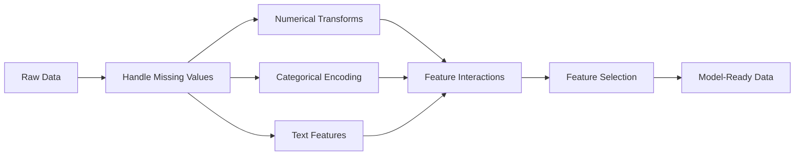

# الميزة الهندسة والانتخاب
# خصائص المشاريع والانتخابات


> ميزة جيدة تساوي ألف نقطة بيانات

> صفة جيدة على 1000 نقطة

**Type:** Build | **类型：** 构建
**Languages:** Python
**Prerequisites:** Phase 1 (Statistics for ML, Linear Algebra), Phase 2 Lessons 1-7 | **前置知识：** Phase 1（统计学、线性代数），Phase 2 第 1-7 课
**Time:** ~90 minutes | **时间：** 约 90 分钟

## أهداف التعلم

- تنفيذ التحويلات الرقمية (التوحيد، وتحويل الحد الأدنى للحد الأقصى، وتحويل السجلات، والبناء) وتوضيح متى يكون كل منها مناسبًا
  实现数值变换(标准化、Min-Max 缩放、对数变换、分箱) ومفساح المشهد الملائم للاستخدام الخاص بهم
- بناء تشفير واحد، والعلامة، والهدف للميزات الفئوية وتحديد خطر تسرب البيانات في تشفير الهدف
  إنشاء رمزات منفصلة ‬ ‬ ‬ ‬ ‬ ‬ ‬ ‬ ‬ ‬ ‬ ‬ ‬ ‬ ‬ ‬ ‬ ‬ ‬ ‬ ‬ ‬ ‬ ‬ ‬ ‬ ‬ ‬ ‬ ‬ ‬ ‬ ‬ ‬ ‬ ‬ ‬ ‬ ‬ ‬ ‬ ‬ ‬ ‬ ‬ ‬ ‬ ‬ ‬ ‬ ‬ ‬ ‬ ‬ ‬ ‬ ‬ ‬ ‬ ‬ ‬ ‬ ‬ ‬ ‬ ‬ ‬ ‬ ‬ ‬ ‬ ‬ ‬ ‬ ‬ ‬ ‬ ‬ ‬ ‬ ‬ ‬ ‬ ‬ ‬ ‬ ‬ ‬ ‬ ‬ ‬ ‬ ‬ ‬ ‬ ‬ ‬ ‬ ‬ ‬ ‬ ‬ ‬ ‬ ‬ ‬ ‬ ‬ ‬ ‬ ‬ ‬ ‬ ‬ ‬ ‬ ‬ ‬ ‬ ‬ ‬ ‬ ‬ ‬ ‬ ‬ ‬ ‬ ‬ ‬ ‬ ‬ ‬ ‬ ‬ ‬ ‬ ‬ ‬ ‬ ‬ ‬ ‬ ‬ ‬ ‬ ‬ ‬ ‬ ‬ ‬ ‬ ‬ ‬ ‬ ‬ ‬ ‬ ‬ ‬ ‬ ‬ ‬ ‬ ‬ ‬ ‬ ‬ ‬ ‬ ‬ ‬ ‬ ‬ ‬ ‬ ‬ ‬ ‬ ‬ ‬ ‬ ‬ ‬ ‬ ‬ ‬ ‬ ‬ ‬ ‬ ‬ ‬ ‬ ‬ ‬ ‬ ‬ ‬ ‬ ‬ ‬ ‬ ‬ ‬ ‬ ‬ ‬ ‬ ‬ ‬ ‬ ‬ ‬ ‬ ‬ ‬ ‬ ‬ ‬ ‬ ‬ ‬ ‬ ‬ ‬ ‬ ‬ ‬ ‬ ‬ ‬ ‬ ‬ ‬ ‬ ‬ ‬ ‬ ‬ ‬ ‬ ‬ ‬ ‬ ‬ ‬ ‬ ‬ ‬ ‬
- بناء متجه TF-IDF من الصفر وشرح لماذا يتفوق على العد من الكلمات الخامة لتصنيف النص
  من التكوين TF-IDF إلى الكمترات، شرح لماذا هو أفضل من الكلمات الأصلية
- تطبيق اختيار ميزات بناء على الفيلتر (عدول التغيرات، والارتباط، والمعلومات المتبادلة) للحد من الامتعداد
  التطبيقات القائمة على الاختيار من الخصائص


> **【中文解读】**
> الميزات المهنية هي تحويل البيانات الأصلية إلى نموذج يمكن فهمها. هذه هي الخطوة الأكثر استهلاكية في ML. المعايير والترميز والمعايير والمعايير المتعددة هي مهارات عادة استخدامها.

> **【拓展：特征工程 vs 深度学习的自动特征学习】**
> الميزة الأساسية للتعلم العميق هي ميزة التعلم الذاتي ((CNN خودڪار提取图像特征、Transformer خودڪار提取文本特征)) ، ولكن لا يزال مهمًا في مجال المعلومات المستخدمة في الميزات المكتوبة.

## المشكلة المشكلة المشكلة

لديك مجموعة بيانات، تختار خوارزمية، تدربها، النتائج متوسطة، تحاول خوارزمية أكثر خيالية، لا تزال متوسطة، تقضي أسبوعاً في ضبط المعايير العالية، تحسن هامشي.

> لديك مجموعة بيانات. انت اخترت خوارزمية. تدربها. النتيجة هي:平平. انت حاولت خوارزمية أكثر فوهة.

ثم يقوم شخص ما بتحويل البيانات الخام إلى ميزات أفضل وتحقيق رجعة لوجستية بسيطة تفوق مجموعتك المنسقة المزودة بالترقية.

> ثم قام شخص ما بتحويل البيانات الأصلية إلى ميزة أفضل، وعودة منطقية بسيطة هزمت درجة تحسين التجميع.

يحدث هذا باستمرار. في ML الكلاسيكية، تمثيل البيانات هو أكثر أهمية من اختيار الخوارزمية. نموذج سعر المنزل مع "قطاع مربع" و "عدد الغرف النومية" سوف تفوق نموذج مع "الادرس كسلسلة خامة" بغض النظر عن مدى تعقيد المتعلم. الخوارزمية يمكن أن تعمل فقط مع ما تعطيه.

> يحدث هذا في كثير من الأحيان. في المعلم الكلاسيكي، فإن تعبير البيانات هو أكثر أهمية من اختيار الخوارزمية. نموذج الأسعار مع "الجزء" و"عدد الغرف" سوف يفوز مع نموذج "الترتيبات الأصلية" ، بغض النظر عن تعقيدات الجهاز التعلمي.

هندسة الميزات هي عملية تحويل البيانات الخام إلى تمثيلات تجعل الأنماط أسهل للعثور على النماذج. اختيار الميزات هو عملية رمي الميزات التي تضيف الضوضاء دون إضافة إشارة. معاً ، هي أعلى نشاط لفتة في ML الكلاسيكية.

> إنشاء خصائص هو عملية تحويل البيانات الأصلية إلى أنماط أكثر سهولة للاكتشاف من قبل النموذج.

> **【中文解读】**
> "تحدد البيانات والخصائص أعلى حدود ML ، والنموذج والخوارزمية مجرد اقتراب من هذا العلوي. "الخصائص الجيدة يمكن أن تجعل النموذج البسيط يهزم النموذج المعقد.

## المفهوم الأساسي

### خط الأنابيب المميز



### الخصائص العددية

الأرقام الخام نادراً ما تكون جاهزة للنموذج

> الأرقام الأولية قليلة يمكن استخدامها مباشرة في النموذج.

**Scaling:**ضع الميزات على نفس النطاق بحيث يعامل الخوارزميات القائمة على المسافة (K-Means ، KNN ، SVM) جميع الميزات على قدم المساواة. خرائط قياس الحد الأدنى إلى [0, 1]. خرائط قياسية (z-score) إلى متوسط = 0 ، std = 1.

> **缩放：**سيتم وضع الخصائص إلى نفس النطاق ، وذلك بناء على الخوارزمية المسافة (((K-Means、KNN、SVM) متساوية في التعامل مع جميع الخصائص。Min-Max 缩放映射到 [0, 1]。标准化(z-score)映射到平均值=0、标准差=1。

**Log transform:**يضغط على التوزيعات المتحولة إلى اليمين (الدخل والسكان ومعايير الكلمات) يحول العلاقات المتعددة إلى العلاقات الإضافية.

> **对数变换：**压缩右偏分布(收入、人口、词频) 』将乘法关系变为加法关系。

**Binning:**تحويل القيم المستمرة إلى فئات. مفيد عندما تكون العلاقة بين الميزة والهدف غير خطية ولكن خطوة (على سبيل المثال ، فئات الأعمار).

> **分箱：**سوف تحويل القيمة المتصلة إلى فئة. عندما تكون العلاقة بين الصفة والهدف غير خطية ولكن مفيدة في الحالة التسلسلية.

**Polynomial features:**يخلق شروط x^2, x^3, x1*x2. يسمح للنماذج الخطية بتقاط العلاقات غير الخطية على حساب المزيد من الميزات.

> **多项式特征：**创建 x^2、x^3、x1*x2 项──让线性模型以更多特征为代价捕捉非线性关系──

### الميزات الفئوية

النماذج تحتاج إلى أرقام، الفئات تحتاج إلى تشفير.

> 模型需要数字──类别需要编码──

**One-hot encoding:**يخلق عمود ثنائي لكل فئة. "اللون = الأحمر / الأزرق / الأخضر" يصبح ثلاثة أعمدة: is_red ، is_blue ، is_green. يعمل بشكل جيد لميزات القرطالية المنخفضة ولكن يفجر مع العديد من الفئات.

> **独热编码：**للكلاسفة تكوين صف ثاني: "الوان = الأحمر / الأزرق / الأخضر"  تحول إلى ثلاث صفوف: هو_ الأحمر 、 هو_ الأزرق 、 هو_ الأخضر ٬ لخصائص التركيبات المنخفضة

**Label encoding:**خريطة كل فئة إلى رقم كامل: الأحمر = 0، الأزرق = 1، الأخضر = 2. يقدم ترتيبًا خاطئًا (قد يعتقد النموذج الأخضر > الأزرق > الأحمر). مناسب فقط للنموذجات القائمة على الأشجار التي تنقسم على قيم فردية.

> **标签编码：**将每个类别映射到整数:red=0、blue=1、green=2──引入虚假排序(模型可能认为绿 >蓝 >红) 只适合单个值分的树模型

**Target encoding:**يُستبدل كل فئة بمعدل المتغير المستهدف لهذا الفئة. قوي ولكن خطير: خطر كبير من تسرب البيانات. يجب أن يتم حسابها فقط على بيانات التدريب وتطبيقها على بيانات التجارب.

> **目标编码：**استبدال كل فئة بمعدل متوسط المتغيرات المستهدفة لهذا الفئة.

### المقالة المميزة

**Count vectorizer:**يعد عدد مرات ظهور كل كلمة في وثيقة. "القطة جلست على المفرشة" تصبح {ال: 2، القطة: 1، جلست: 1، على: 1، المفرشة: 1}.

> **词频向量化：**计算每个词在文档中出现的次数──"القطة جلست على المفرشة" 变成 {ال: 2, القطة: 1, جلست: 1, على: 1, المفرشة: 1}──

**TF-IDF:**تعدد المستندات المعدلة إلى المعدل المقابل تعدد المستندات تعادل الكلمات من خلال مدى فريدة من نوعها بين المستندات الكلمات الشائعة مثل "ال" تحصل على وزن منخفض الكلمات النادرة المميزة تحصل على وزن كبير

> **TF-IDF：**词频-逆文档频率──按词在文档中的唯一性加权──常见词如"the"获得低权重──稀有、有区分度的词获得高权重──

```
TF(word, doc) = count(word in doc) / total words in doc
IDF(word) = log(total docs / docs containing word)
TF-IDF = TF * IDF
```

### القيم المفقودة

البيانات الحقيقية لديها ثقوب

> البيانات الحقيقية لديها فجوة

- **Drop rows:**فقط عندما تكون البيانات المفقودة نادرة و عشوائية
  **删除行：**فقط عندما تكون غياب البيانات نادرة ومع مرور الوقت
- **Mean/median imputation:**بسيط، يحافظ على شكل التوزيع (الوسط أكثر قوة إلى المتفاصيل)
  **均值/中位数填充：**简单,保持分布形状(中位数对异常值更鲁棒)
- **Mode imputation:**لخصائص فصلية
  **众数填充：**تستخدم في الصفات
- **Indicator column:**إضافة عمود ثنائي "كان_هذا_المفقود" قبل فرض. حقيقة أن البيانات المفقودة يمكن أن تكون نفسها معلومية
  **指示列：**填充前添加二进制列"كان_هذا_المفقود"── فقدان البيانات نفسه قد يكون معلوماتيا
- **Forward/backward fill:**للبيانات المتعلقة بالسلسلة الزمنية
  **前向/后向填充：**باستخدام بيانات التسلسل الزمني

### التفاعل المميز

في بعض الأحيان تكون العلاقة في الجمع. "الارتفاع" و "الوزن" وحدهم أقل تنبؤا من "BMI = الوزن / الارتفاع^2". تفاعلات الميزات تضاعف مساحة الميزات، لذلك استخدم معرفة النطاق لتحديد الميزات الصحيحة.

> هناك بعض العلاقات في المجموعة. "الارتفاع" و"الوزن" لوحدها ليس مثل "BMI = الوزن / الارتفاع^2"

### اختيار الميزات

لم يكن المزيد من الميزات دائماً أفضل. الميزات غير ذات صلة تضيف الضوضاء، وتزيد من وقت التدريب، ويمكن أن تسبب الإفراط في التكيف.

> 更多特征不一定更好──无关特征增加噪声、增加训练时间并可能导致过适应──

**Filter methods (pre-model):**
- التواصل: إزالة الميزات المتواصلة بشكل كبير مع بعضها البعض (التي لا تكفي)
  相关性: تحويل ارتفاع 相关的特征(冗余)
- المعلومات المتبادلة: تقيس مدى معرفة ميزة ما تقلل من عدم اليقين حول الهدف
  互信息: قياس معرفة صفة يمكن أن تقلل من الهدف كم عدم اليقين
- عتبة التباين: إزالة الميزات التي تختلف بالكاد
  方差值: تحويل خصائص غير متغيرة تقريبا

**Wrapper methods (model-based):**
- التنظيم L1 (Lasso): يضع أوزان الميزات غير ذات الصلة إلى الصفر بالضبط
  L1 正则化(لاسو): سوف لا علاقة لها
- القضاء على الميزة المتكررة: التدريب، إزالة الميزة الأقل أهمية، تكرار
  递归特征消除: تدريب, تحويل أكثر خصائص أهمية,重复

**Why selection matters:**نموذج مع 10 ميزات جيدة عادة ما يتفوق على نموذج مع 10 ميزات جيدة و 90 ضوضاء. تمنح الميزات الضوضاء نموذج الفرص للتكيف بشكل كبير على أنماط بيانات التدريب التي لا تنطوي على عمومية.

> **为什么选择很重要：**نموذج واحد لديه 10 خصائص جيدة عادة ما يفوز 10 خصائص جيدة بالإضافة إلى 90 خصائص ضوضاء نموذج.

## بناء ذلك تحرك لتحقيق

> **【中文解读】**
> من صفر تحقيق التغيرات المعتادة: قياسية                                                                                                                                                                                                                                                         
```figure
feature-scaling
```

## بناءها

### الخطوة الأولى: تحويلات رقمية من الصفر

```python
import math


def min_max_scale(values):
    min_val = min(values)
    max_val = max(values)
    if max_val == min_val:
        return [0.0] * len(values)
    return [(v - min_val) / (max_val - min_val) for v in values]


def standardize(values):
    n = len(values)
    mean = sum(values) / n
    variance = sum((v - mean) ** 2 for v in values) / n
    std = math.sqrt(variance) if variance > 0 else 1.0
    return [(v - mean) / std for v in values]


def log_transform(values):
    return [math.log(v + 1) for v in values]


def bin_values(values, n_bins=5):
    min_val = min(values)
    max_val = max(values)
    bin_width = (max_val - min_val) / n_bins
    if bin_width == 0:
        return [0] * len(values)
    result = []
    for v in values:
        bin_idx = int((v - min_val) / bin_width)
        bin_idx = min(bin_idx, n_bins - 1)
        result.append(bin_idx)
    return result


def polynomial_features(row, degree=2):
    n = len(row)
    result = list(row)
    if degree >= 2:
        for i in range(n):
            result.append(row[i] ** 2)
        for i in range(n):
            for j in range(i + 1, n):
                result.append(row[i] * row[j])
    return result
```

### الخطوة الثانية: تشفير الفئة من الصفر

```python
def one_hot_encode(values):
    categories = sorted(set(values))
    cat_to_idx = {cat: i for i, cat in enumerate(categories)}
    n_cats = len(categories)

    encoded = []
    for v in values:
        row = [0] * n_cats
        row[cat_to_idx[v]] = 1
        encoded.append(row)

    return encoded, categories


def label_encode(values):
    categories = sorted(set(values))
    cat_to_int = {cat: i for i, cat in enumerate(categories)}
    return [cat_to_int[v] for v in values], cat_to_int


def target_encode(feature_values, target_values, smoothing=10):
    global_mean = sum(target_values) / len(target_values)

    category_stats = {}
    for feat, target in zip(feature_values, target_values):
        if feat not in category_stats:
            category_stats[feat] = {"sum": 0.0, "count": 0}
        category_stats[feat]["sum"] += target
        category_stats[feat]["count"] += 1

    encoding = {}
    for cat, stats in category_stats.items():
        cat_mean = stats["sum"] / stats["count"]
        weight = stats["count"] / (stats["count"] + smoothing)
        encoding[cat] = weight * cat_mean + (1 - weight) * global_mean

    return [encoding[v] for v in feature_values], encoding
```

### الخطوة الثالثة: ميزات النص من الصفر

> الثالثة: المادة الثالثة: المادة الثانية: المادة الثانية: المادة الثانية: المادة الثانية: المادة الثانية: المادة الثانية: المادة الثانية: المادة الثانية: المادة الثانية: المادة الثانية: المادة الثانية: المادة الثانية: المادة الثانية: المادة الثانية: المادة الثانية: المادة الثانية: المادة الثانية: المادة الثانية: المادة الثانية: المادة الثانية: المادة الثانية: المادة الثانية: المادة الثانية: المادة الثانية: المادة الثانية: المادة الثانية: المادة الثانية: المادة الثانية: المادة الثانية: المادة الثانية: المادة الثانية: المادة الثانية: المادة الثانية: المادة الثانية: المادة الثانية: المادة الثانية: المادة الثانية: المادة الثانية: المادة الثانية: المادة الثانية: المادة الثانية: المادة الثانية: المادة الثانية: المادة الثانية: المادة: المادة الثانية: المادة: المادة الثانية: المادة: المادة: المادة الثانية: المادة: المادة: المادة: المادة الثانية: المادة: المادة: المادة: المادة: المادة الثانية: المادة: المادة: المادة: المادة: المادة: المادة: المادة: المادة: المادة: المادة: المادة: المادة:`TfidfVectorizer`هو هذا النسخة الإصدارية التي تحققها

```python
def count_vectorize(documents):
    vocab = {}
    idx = 0
    for doc in documents:
        for word in doc.lower().split():
            if word not in vocab:
                vocab[word] = idx
                idx += 1

    vectors = []
    for doc in documents:
        vec = [0] * len(vocab)
        for word in doc.lower().split():
            vec[vocab[word]] += 1
        vectors.append(vec)

    return vectors, vocab


def tfidf(documents):
    n_docs = len(documents)

    vocab = {}
    idx = 0
    for doc in documents:
        for word in doc.lower().split():
            if word not in vocab:
                vocab[word] = idx
                idx += 1

    doc_freq = {}
    for doc in documents:
        seen = set()
        for word in doc.lower().split():
            if word not in seen:
                doc_freq[word] = doc_freq.get(word, 0) + 1
                seen.add(word)

    vectors = []
    for doc in documents:
        words = doc.lower().split()
        word_count = len(words)
        tf_map = {}
        for word in words:
            tf_map[word] = tf_map.get(word, 0) + 1

        vec = [0.0] * len(vocab)
        for word, count in tf_map.items():
            tf = count / word_count
            idf = math.log(n_docs / doc_freq[word])
            vec[vocab[word]] = tf * idf
        vectors.append(vec)

    return vectors, vocab
```

### الخطوة الرابعة: إعطاء القيمة المفقودة من الصفر

> 第四步: افتقار التعبئة. متوسط التعبئة على حالة الانتشار.

```python
def impute_mean(values):
    present = [v for v in values if v is not None]
    if not present:
        return [0.0] * len(values), 0.0
    mean = sum(present) / len(present)
    return [v if v is not None else mean for v in values], mean


def impute_median(values):
    present = sorted(v for v in values if v is not None)
    if not present:
        return [0.0] * len(values), 0.0
    n = len(present)
    if n % 2 == 0:
        median = (present[n // 2 - 1] + present[n // 2]) / 2
    else:
        median = present[n // 2]
    return [v if v is not None else median for v in values], median


def impute_mode(values):
    present = [v for v in values if v is not None]
    if not present:
        return values, None
    counts = {}
    for v in present:
        counts[v] = counts.get(v, 0) + 1
    mode = max(counts, key=counts.get)
    return [v if v is not None else mode for v in values], mode


def add_missing_indicator(values):
    return [0 if v is not None else 1 for v in values]
```

### الخطوة 5: اختيار الميزات من الصفر

> 第五步: خيار الصفات.                                                                                                                                                                                                                                                           `SelectKBest`.`VarianceThreshold`هذه هي الطرق التي يتم بها في مجال إنتاج المواد

```python
def correlation(x, y):
    n = len(x)
    mean_x = sum(x) / n
    mean_y = sum(y) / n
    cov = sum((xi - mean_x) * (yi - mean_y) for xi, yi in zip(x, y)) / n
    std_x = math.sqrt(sum((xi - mean_x) ** 2 for xi in x) / n)
    std_y = math.sqrt(sum((yi - mean_y) ** 2 for yi in y) / n)
    if std_x == 0 or std_y == 0:
        return 0.0
    return cov / (std_x * std_y)


def mutual_information(feature, target, n_bins=10):
    feat_min = min(feature)
    feat_max = max(feature)
    bin_width = (feat_max - feat_min) / n_bins if feat_max != feat_min else 1.0
    feat_binned = [
        min(int((f - feat_min) / bin_width), n_bins - 1) for f in feature
    ]

    n = len(feature)
    target_classes = sorted(set(target))

    feat_bins = sorted(set(feat_binned))
    p_feat = {}
    for b in feat_bins:
        p_feat[b] = feat_binned.count(b) / n

    p_target = {}
    for t in target_classes:
        p_target[t] = target.count(t) / n

    mi = 0.0
    for b in feat_bins:
        for t in target_classes:
            joint_count = sum(
                1 for fb, tv in zip(feat_binned, target) if fb == b and tv == t
            )
            p_joint = joint_count / n
            if p_joint > 0:
                mi += p_joint * math.log(p_joint / (p_feat[b] * p_target[t]))

    return mi


def variance_threshold(features, threshold=0.01):
    n_features = len(features[0])
    n_samples = len(features)
    selected = []

    for j in range(n_features):
        col = [features[i][j] for i in range(n_samples)]
        mean = sum(col) / n_samples
        var = sum((v - mean) ** 2 for v in col) / n_samples
        if var >= threshold:
            selected.append(j)

    return selected


def remove_correlated(features, threshold=0.9):
    n_features = len(features[0])
    n_samples = len(features)

    to_remove = set()
    for i in range(n_features):
        if i in to_remove:
            continue
        col_i = [features[r][i] for r in range(n_samples)]
        for j in range(i + 1, n_features):
            if j in to_remove:
                continue
            col_j = [features[r][j] for r in range(n_samples)]
            corr = abs(correlation(col_i, col_j))
            if corr >= threshold:
                to_remove.add(j)

    return [i for i in range(n_features) if i not in to_remove]
```

### الخطوة 6: خط الأنابيب الكاملة والإجراءات التجريبية

```python
import random


def make_housing_data(n=200, seed=42):
    random.seed(seed)
    data = []
    for _ in range(n):
        sqft = random.uniform(500, 5000)
        bedrooms = random.choice([1, 2, 3, 4, 5])
        age = random.uniform(0, 50)
        neighborhood = random.choice(["downtown", "suburbs", "rural"])
        has_pool = random.choice([True, False])

        sqft_with_missing = sqft if random.random() > 0.05 else None
        age_with_missing = age if random.random() > 0.08 else None

        price = (
            50 * sqft
            + 20000 * bedrooms
            - 1000 * age
            + (50000 if neighborhood == "downtown" else 10000 if neighborhood == "suburbs" else 0)
            + (15000 if has_pool else 0)
            + random.gauss(0, 20000)
        )

        data.append({
            "sqft": sqft_with_missing,
            "bedrooms": bedrooms,
            "age": age_with_missing,
            "neighborhood": neighborhood,
            "has_pool": has_pool,
            "price": price,
        })
    return data


if __name__ == "__main__":
    data = make_housing_data(200)

    print("=== Raw Data Sample ===")
    for row in data[:3]:
        print(f"  {row}")

    sqft_raw = [d["sqft"] for d in data]
    age_raw = [d["age"] for d in data]
    prices = [d["price"] for d in data]

    print("\n=== Missing Value Handling ===")
    sqft_missing = sum(1 for v in sqft_raw if v is None)
    age_missing = sum(1 for v in age_raw if v is None)
    print(f"  sqft missing: {sqft_missing}/{len(sqft_raw)}")
    print(f"  age missing: {age_missing}/{len(age_raw)}")

    sqft_indicator = add_missing_indicator(sqft_raw)
    age_indicator = add_missing_indicator(age_raw)
    sqft_imputed, sqft_fill = impute_median(sqft_raw)
    age_imputed, age_fill = impute_mean(age_raw)
    print(f"  sqft filled with median: {sqft_fill:.0f}")
    print(f"  age filled with mean: {age_fill:.1f}")

    print("\n=== Numerical Transforms ===")
    sqft_scaled = standardize(sqft_imputed)
    age_scaled = min_max_scale(age_imputed)
    sqft_log = log_transform(sqft_imputed)
    age_binned = bin_values(age_imputed, n_bins=5)
    print(f"  sqft standardized: mean={sum(sqft_scaled)/len(sqft_scaled):.4f}, std={math.sqrt(sum(v**2 for v in sqft_scaled)/len(sqft_scaled)):.4f}")
    print(f"  age min-max: [{min(age_scaled):.2f}, {max(age_scaled):.2f}]")
    print(f"  age bins: {sorted(set(age_binned))}")

    print("\n=== Categorical Encoding ===")
    neighborhoods = [d["neighborhood"] for d in data]

    ohe, ohe_cats = one_hot_encode(neighborhoods)
    print(f"  One-hot categories: {ohe_cats}")
    print(f"  Sample encoding: {neighborhoods[0]} -> {ohe[0]}")

    le, le_map = label_encode(neighborhoods)
    print(f"  Label encoding map: {le_map}")

    te, te_map = target_encode(neighborhoods, prices, smoothing=10)
    print(f"  Target encoding: {({k: round(v) for k, v in te_map.items()})}")

    print("\n=== Text Features ===")
    descriptions = [
        "large modern house with pool",
        "small cozy cottage near downtown",
        "spacious family home with large yard",
        "modern apartment downtown with view",
        "rustic cabin in rural area",
    ]
    cv, cv_vocab = count_vectorize(descriptions)
    print(f"  Vocabulary size: {len(cv_vocab)}")
    print(f"  Doc 0 non-zero features: {sum(1 for v in cv[0] if v > 0)}")

    tf, tf_vocab = tfidf(descriptions)
    print(f"  TF-IDF vocabulary size: {len(tf_vocab)}")
    top_words = sorted(tf_vocab.keys(), key=lambda w: tf[0][tf_vocab[w]], reverse=True)[:3]
    print(f"  Doc 0 top TF-IDF words: {top_words}")

    print("\n=== Polynomial Features ===")
    sample_row = [sqft_scaled[0], age_scaled[0]]
    poly = polynomial_features(sample_row, degree=2)
    print(f"  Input: {[round(v, 4) for v in sample_row]}")
    print(f"  Polynomial: {[round(v, 4) for v in poly]}")
    print(f"  Features: [x1, x2, x1^2, x2^2, x1*x2]")

    print("\n=== Feature Selection ===")
    feature_matrix = [
        [sqft_scaled[i], age_scaled[i], float(sqft_indicator[i]), float(age_indicator[i])]
        + ohe[i]
        for i in range(len(data))
    ]

    print(f"  Total features: {len(feature_matrix[0])}")

    surviving_var = variance_threshold(feature_matrix, threshold=0.01)
    print(f"  After variance threshold (0.01): {len(surviving_var)} features kept")

    surviving_corr = remove_correlated(feature_matrix, threshold=0.9)
    print(f"  After correlation filter (0.9): {len(surviving_corr)} features kept")

    binary_prices = [1 if p > sum(prices) / len(prices) else 0 for p in prices]
    print("\n  Mutual information with target:")
    feature_names = ["sqft", "age", "sqft_missing", "age_missing"] + [f"neigh_{c}" for c in ohe_cats]
    for j in range(len(feature_matrix[0])):
        col = [feature_matrix[i][j] for i in range(len(feature_matrix))]
        mi = mutual_information(col, binary_prices, n_bins=10)
        print(f"    {feature_names[j]}: MI={mi:.4f}")

    print("\n  Correlation with price:")
    for j in range(len(feature_matrix[0])):
        col = [feature_matrix[i][j] for i in range(len(feature_matrix))]
        corr = correlation(col, prices)
        print(f"    {feature_names[j]}: r={corr:.4f}")
```

## استخدمها في إطار التنفيذ

> **【拓展：sklearn Pipeline 的工业级实践】**
> كولرن ColumnTransformer + Pipeline هي أفضل ممارسة في مجال هندسة الصفات: إعداد الصفات العددية والصفات الفريدة من نوعها، وتكوين خط تدفق من نهاية إلى نهاية. هذا يضمن استخدام مجموعة التدريبات والاختبارات بنفس التغييرات تماما، وتجنب تسرب البيانات. في كاجل  المسابقة والمشاريع الصناعية، هي الممارسة القياسية  يجعل الكود قابلاً للتطبيق، يمكن نشرها، يمكن صيانته.

مع scikit-learn، هذه التحويلات هي خطوط أنابيب قابلة للتصوير:

> باستخدام التعلم القليل، هذه التغييرات يمكن أن تكون مكونة للخطوط:

```python
from sklearn.preprocessing import StandardScaler, OneHotEncoder, PolynomialFeatures  # 预处理变换器
from sklearn.impute import SimpleImputer  # 缺失值填充
from sklearn.feature_extraction.text import TfidfVectorizer  # 文本 TF-IDF 向量化
from sklearn.feature_selection import mutual_info_classif, VarianceThreshold  # 特征选择
from sklearn.compose import ColumnTransformer  # 按列分组处理
from sklearn.pipeline import Pipeline  # 构建端到端流水线

numeric_pipe = Pipeline([
    ("imputer", SimpleImputer(strategy="median")),
    ("scaler", StandardScaler()),
])

categorical_pipe = Pipeline([
    ("encoder", OneHotEncoder(sparse_output=False)),
])

preprocessor = ColumnTransformer([
    ("num", numeric_pipe, ["sqft", "age"]),
    ("cat", categorical_pipe, ["neighborhood"]),
])
```

الإصدارات من الصفر تظهر بالضبط ما يحدث داخل كل تحول. إصدارات المكتبة تضيف التعامل مع الحافة، دعم المصفوفة النادرة، وتكوين الأنابيب، ولكن الرياضيات هي نفسها.

> من النسخة صفر تحدد بالضبط ما حدث داخل كل تغيير. إصدار الكتيب أضاف معالجة الحدود الحاليات.

## أرسلها .

هذا الدرس ينتج عن:
- `outputs/prompt-feature-engineer.md`- إشارة إلى الهندسة المنهجية للميزات من البيانات الخام

> 本课产出:
> - `outputs/prompt-feature-engineer.md`- كلمة نصيحة من المميزات المهنية الأصلية للمعلومات

> **【拓展：自动化特征工程——Featuretools 和 AutoML】**
> أدوات الميزات هي قاعدة بيانات مفتوحة لتشغيل الخصائص التلقائية ، يمكن أن تولد تلقائيًا آلاف الخصائص من بين البيانات ذات الصلة (التجمع والفاصل الزمني والخصائص المتقاطعة وغيرها)  التكوين العميق للأدوات الميزات يمكن أن يتحول إلى التغييرات الأساسية في الجمعيات لتوليد الخصائص العميقة  على الرغم من أن التعلم العميق قد قل من الاحتياج إلى مجال الميزات اليدوية ، إلا أن في بيانات الميزات ، لا يزال نموذج الخصائص الذاتية واحدًا من أقوى المزيات  في مسابقة التقاطع ، تنافس أدوات آوتوميل  مثل AutoGluon) إلى حد كبير يأتي من مجال الخصائص التلقائية 

> **【中文解读】**
> TF-IDF (بالإنجليزية: TF-IDF) هو طريقة كلاسيكية في مجال صيغ المستندات:TF قياس الكلمات في المستندات، IDF قياس الكلمات في جميع المستندات نادرة.

## تمارين التدريب

1. إضافة مقياس قوي (باستخدام نطاق المتوسط والمتوسط بدلاً من المتوسط والانحراف القياسي) إلى التحويلات الرقمية. مقارنة ذلك مع مقياس قياسي على البيانات مع مستويات خارجية للغاية.
   1. في تغيير القيمة العددية إضافة إلى التكثيف المميز (استخدام الوسطى والبعد الأربع نقاط بدلاً من الوسطى والفرق المعيار)
2. تنفيذ تشفير هدف واحد خارج: لكل سطر، احسب متوسط الهدف باستثناء قيمة الهدف الخاصة بتلك الصف. أظهر كيف يقلل هذا من الإفراط في التكيف مقارنة بتشفير الهدف البغيض.
   2. 实现留一法目标编码: للصف، الحساب إزالة متوسط قيمة الهدف من هذا الصف نفسه.
3. قم ببناء خط أنابيب مختيار الميزات الآلية التي تجمع بين عتبة التباين والتحذير التواصلية وتصنيف المعلومات المتبادلة. قم بتطبيقها على مجموعة بيانات السكن ومقارنة أداء النموذج (استخدم رجعة خطية بسيطة) مع جميع الميزات مقابل الميزات المختارة.
   3.  بناء خصائص التشغيل الآلي لخيار القيود، الربط بين الفوارقالقيموالتنسيقات والترتيبات المعلومات المتبادلة‬‬‬‬‬‬‬‬‬‬‬‬‬‬‬‬‬‬‬‬‬‬‬‬‬‬‬‬‬‬‬‬‬‬‬‬‬‬‬‬‬‬‬‬‬‬‬‬‬‬‬‬‬‬‬‬‬‬‬‬‬‬‬‬‬‬‬‬‬‬‬‬‬‬‬‬‬‬‬‬‬‬‬‬‬‬‬‬‬‬‬‬‬‬‬‬‬‬‬‬‬‬‬‬‬‬‬‬‬‬‬‬‬‬‬‬‬‬‬‬‬‬‬‬‬‬‬‬‬‬‬‬‬‬‬‬‬‬‬‬‬‬‬‬‬‬‬‬‬‬‬‬‬‬‬‬‬‬‬‬‬‬‬‬‬‬‬‬‬‬‬‬‬‬‬‬‬‬‬‬‬‬‬‬‬‬‬‬‬‬‬‬‬‬‬‬‬‬‬‬‬‬‬‬‬‬‬‬‬‬‬‬‬‬‬‬‬‬‬‬‬‬‬‬‬‬‬‬‬‬‬‬‬‬‬‬‬‬‬‬‬‬‬‬‬‬‬‬‬‬‬‬‬‬‬‬‬‬‬‬‬‬‬‬‬‬‬‬‬‬‬‬‬‬‬‬‬‬‬‬‬‬‬‬‬‬‬‬‬‬‬‬‬‬‬‬‬‬‬‬‬‬‬‬‬‬‬‬‬‬‬‬‬‬‬‬‬‬‬‬‬‬‬‬‬‬‬‬‬‬‬‬‬‬‬‬‬‬‬‬‬‬‬‬‬‬‬‬‬‬‬‬‬‬‬‬‬‬‬‬‬‬‬‬‬‬‬‬‬‬‬‬‬‬‬‬‬‬‬‬‬‬‬‬‬‬‬‬‬‬‬‬‬‬‬‬‬‬‬‬‬‬‬‬‬‬‬‬‬‬‬‬‬‬‬‬‬‬‬‬‬‬‬‬‬‬‬‬‬‬‬‬‬‬‬‬‬‬‬‬‬‬‬‬‬‬‬‬‬‬‬‬‬‬‬‬‬‬‬

## شروط الرئيسية

| Term | What people say | What it actually means |
|------|----------------|----------------------|
| Feature engineering | "Making new columns" | Transforming raw data into representations that expose patterns to the model |
| Standardization | "Making it normal" | Subtracting the mean and dividing by standard deviation so the feature has mean=0 and std=1 |
| One-hot encoding | "Making dummy variables" | Creating one binary column per category, where exactly one column is 1 for each row |
| Target encoding | "Using the answer to encode" | Replacing each category with the average target value for that category, with smoothing to prevent overfitting |
| TF-IDF | "Fancy word counts" | Term Frequency times Inverse Document Frequency: words weighted by how distinctive they are across the corpus |
| Imputation | "Filling in blanks" | Replacing missing values with estimated values (mean, median, mode, or model-predicted) |
| Feature selection | "Throwing out bad columns" | Removing features that add noise or redundancy, keeping only those with signal about the target |
| Mutual information | "How much one thing tells you about another" | A measure of the reduction in uncertainty about variable Y gained by observing variable X |
| Data leakage | "Accidentally cheating" | Using information during training that would not be available at prediction time, giving falsely optimistic results |

## المزيد من القراءة

- [Feature Engineering and Selection (Max Kuhn & Kjell Johnson)](http://www.feat.engineering/)- كتاب مجاني على الإنترنت يغطي المشهد الكامل للهندسة المميزة
  [Feature Engineering and Selection (Max Kuhn & Kjell Johnson)](http://www.feat.engineering/)- تغطي المشاهد الكاملة من المشاهد
- [scikit-learn Preprocessing Guide](https://scikit-learn.org/stable/modules/preprocessing.html)- الإشارة العملية لجميع التحويلات القياسية
  [scikit-learn 预处理指南](https://scikit-learn.org/stable/modules/preprocessing.html)- جميع المعايير المتغيرة
- [Target Encoding Done Right (Micci-Barreca, 2001)](https://dl.acm.org/doi/10.1145/507533.507538)- الورقة الأصلية عن التشفير المستهدف مع السطح
  [Target Encoding Done Right (Micci-Barreca, 2001)](https://dl.acm.org/doi/10.1145/507533.507538)- 带平滑的目标编码原始论文
