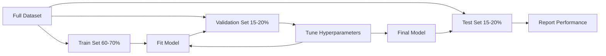

# تقييم النموذج
# 模型评估


> النموذج جيد فقط بالطريقة التي تقيسها بها

> الخير والخير من النموذج يعتمد على كيفية قياسه

**Type:** Build | **类型：** 构建
**Languages:** Python
**Prerequisites:** Phase 1 (Probability & Distributions, Statistics for ML), Phase 2 Lessons 1-8 | **前置知识：** Phase 1（概率与分布、统计学），Phase 2 第 1-8 课
**Time:** ~90 minutes | **时间：** 约 90 分钟

## أهداف التعلم

- تنفيذ التحقق من الصلاحية المتقاطعة من K-fold و K-fold stratified من الصفر وتوضيح لماذا التطبيق من المهم بالنسبة للبيانات غير المتوازنة
  من التحقق من الصفر K 折和分层 K 折交叉验证، شرح لماذا الارتباط على عدم توازن البيانات مهمة
- حساب دقة، استدعاء، F1، AUC-ROC، ومقاييس التراجع (MSE، RMSE، MAE، R- مربع) من الصفر
  من صفر حساب معدل تحديد التدخلات، ف1، AUC-ROC و معدل التعودات (MSE، RMSE، MAE، R-squared)
- تفسير منحنى التعلم للتشخيص ما إذا كان نموذج يعاني من التحيز العالي أو التباين العالي
  تفسير منحنى التعلم لتشخيص ما إذا كان هناك اختلاف كبير أو اختلاف كبير
- تحديد الأخطاء الشائعة في التقييم بما في ذلك تسرب البيانات، واختيار المقاييس الخطأ، وتلوث مجموعة الاختبارات
  识别常见评估错误, بما في ذلك إفشال البيانات, خطأ في اختيار المعايير والتلوث في المجموعة


> **【中文解读】**
> 模型评估回答模型到底好不好──准确率、精确率、召回率、F1、AUC-ROC 是分类指标;MSE、MAE、R^2 是归归指标──交叉验证防止过拟评估──sklearn 中的 cross_val_score/classification_report──

> **【拓展：模型评估失误导致的生产事故】**
> أدوات الأمازون لتوظيف الذكاء الاصطناعي (AI) بسبب عدم كفاية التقييم ((القيام بتقييم على بيانات التدريب وليس مجموعة اختبار مستقلة) يؤدي إلى التمييز النظامي ضد المرشحات المرشحة ، في النهاية يتم إلغاءها.

## المشكلة المشكلة المشكلة

لقد تدربت نموذجاً، يحصل على دقة 95% من بياناتك، هل هو جيد؟

> لقد تدربت على نموذج. لقد حصلت على 95% من الادقة على بياناتك.

ربما. ربما لا إذا كان 95٪ من بياناتك تنتمي إلى فئة واحدة، نموذج يتوقع دائما أن هذه الفئة تحصل على دقة 95٪ بينما تكون غير مفيدة تماما. إذا قمت بتقييم نفس البيانات التي تدربت عليها، فإن رقم 95٪ لا معنى له لأن النموذج حفظ الإجابات فقط. إذا كان مجموعتك البيانية لديها عنصر الوقت و قمت بتدمير عشوائي قبل تقسيمها، قد تستخدم نموذجك بيانات المستقبل للتنبؤ بالماضي.

> ربما جيد، ربما ليس جيدا. إذا كان 95% من البيانات تنتمي إلى فئة واحدة، دائما التنبؤ أن نموذج الفئة الحصول على 95% ٪ دقة ولكن لا فائدة منها تماما. إذا كنت تقييم على البيانات التي تم تدريبها، 95٪ هذا الرقم لا يعني شيئا، لأن النموذج فقط يتذكر الإجابة.

تقييم النموذج هو المكان الذي تسير فيه معظم مشاريع ML خطأ. المقياس الخاطئ يجعل النموذج السيئ يبدو جيدا. التقسيم الخاطئ يسمح لنموذج الغش. المقارنة الخاطئة تجعلك تختار النموذج الأسوأ. الحصول على تقييم صحيح ليس اختياريًا. إنه الفرق بين نموذج يعمل في الإنتاج والذي يفشل في اللحظة التي يرى فيها البيانات الحقيقية.

>  تقييم النموذج هو المكان الذي خرج فيه معظم مشروعات ML خطأ  مؤشر الخطأ يجعل النموذج سيء يبدو جيدا ً تقييم الخطأ يجعل النموذج يخدع  مقارنة الخطأ يجعلك تختار نموذج أسوأ ً تقييم صحيح ليس خيارًا قابلاً للخيار  هو الفرق بين نموذج فعال في الإنتاج ونموذج يفشل في مواجهة البيانات الحقيقية 

> **【中文解读】**
> 模型评估最容易犯三错误: 1) تقييم على البيانات التدريبية 模型 فقط تذكر الإجابة ؛ 2) استخدام مؤشر خطأ  مثل عدم توازن مع معدل التأكد من البيانات ؛ 3) تسريب البيانات  اختراق المعلومات إلى عملية التدريب 

## المفهوم الأساسي

### التدريب، التحقق من التحقق، الاختبار



ثلاثة تقسيمات، ثلاثة أغراض:

> ثلاث أشكال:

- **Training set**: يتعلم النموذج من هذه البيانات. يرى هذه الأمثلة أثناء التدريب.
  **训练集**النموذج من المتوسط للدراسة.
- **Validation set**يستخدم هذا النموذج لم يتدرب على هذه البيانات، ولكن قراراتك تتأثر بها.
  **验证集**: لتنظيم العناصر الفائقة والانتخابات بين النماذج. النماذج لا تتدرب على هذه البيانات، ولكن قراراتك تتأثر بها.
- **Test set**: لمست بالضبط مرة واحدة، في النهاية، لتقرير الأداء النهائي. إذا نظرت إلى أداء الاختبار ثم عدت لتغيير نموذجك، فإنه لم يعد مجموعة اختبار. لقد أصبح مجموعة تأكيد ثانية.
  **测试集**: في آخر لمسة مرة واحدة فقط، تقرير الأداء النهائي. إذا نظرت إلى أداء الاختبار بعد ذلك، ثم عدت إلى تعديل النموذج، فإنه لم يعد مجموعة الاختبار.

مجموعة الاختبار هي ضمانك الاحتفاظ بأن الأداء المبلغ عن ذلك يعكس كيفية عمل النموذج على البيانات غير المرئية حقا.

> 测试集是你的保留保证, 确保报告的性能反映模型在真正未见的数据上的表现.

### التحقق المتقاطع K-fold

مع مجموعات بيانات صغيرة، تقسيم قطار واحد/تحقق التحقق من التحقق من التحقق من التحقق من التحقق من التحقق من التحقق من التحقق من التحقق من التحقق من التحقق من التحقق من التحقق من التحقق من التحقق من التحقق من التحقق من التحقق من التحقق من التحقق من التحقق من التحقق من التحقق من التحقق من التحقق من التحقق من التحقق من التحقق من التحقق من التحقق من التحقق من التحقق من التحقق من التحقق من التحقق من التحقق من التحقق من التحقق من التحقق من التحقق من التحقق من التحقق من التحقق من التحقق من التحقق من التحقق من التحقق من التحقق من التحقق من التحقق من التحقق من التحقق من التحقق من التحقق من التحقق من التحقق من التحقق من التحقق من التحقق من التحقق من التحقق من التحقق من التحقق من التحقق من التحقق من التحققق من التحقق من التحقق من التحقق من التحققق من التحقق من التحقق من التحققق من التحقق من التحقق.

> بالنسبة لمجموعة صغيرة من البيانات، يتم استخدام كل البيانات في التدريب والتجربة في وقت واحد:

```mermaid
flowchart TB
    subgraph Fold1["Fold 1"]
        direction LR
        V1["Val"] --- T1a["Train"] --- T1b["Train"] --- T1c["Train"] --- T1d["Train"]
    end
    subgraph Fold2["Fold 2"]
        direction LR
        T2a["Train"] --- V2["Val"] --- T2b["Train"] --- T2c["Train"] --- T2d["Train"]
    end
    subgraph Fold3["Fold 3"]
        direction LR
        T3a["Train"] --- T3b["Train"] --- V3["Val"] --- T3c["Train"] --- T3d["Train"]
    end
    subgraph Fold4["Fold 4"]
        direction LR
        T4a["Train"] --- T4b["Train"] --- T4c["Train"] --- V4["Val"] --- T4d["Train"]
    end
    subgraph Fold5["Fold 5"]
        direction LR
        T5a["Train"] --- T5b["Train"] --- T5c["Train"] --- T5d["Train"] --- V5["Val"]
    end
    Fold1 --> R["Average scores"]
    Fold2 --> R
    Fold3 --> R
    Fold4 --> R
    Fold5 --> R
```



1. تقسيم البيانات إلى طوابق ذات حجم K متساو
   تقسيم البيانات إلى ك 个大相等折
2. لكل طائرة، قم بتدريبها على طائرات K-1 وتؤكد على الطائرة المتبقية
   على كل مرة، في K-1 折上訓練، في المتبقية 折上验证
3. متوسط درجات التحقق من التحقق من الاختبار K
   لـ K 个验证分数取平均

K=5 أو K=10 هي خيارات قياسية. يتم استخدام كل نقطة بيانات للتحقق من التحقق من التحقق من التحقق من التحقق من التحقق من التحقق من التحقق من التحقق من التحقق من التحقق من التحقق من التحقق من التحقق من التحقق من التحقق من التحقق من التحقق من التحقق من التحقق من التحقق من التحقق من التحقق من التحقق من التحقق من التحقق من التحقق من التحقق من التحقق من التحقق من التحقق من التحقق من التحقق من التحقق من التحقق من التحقق من التحقق من التحقق من التحقق من التحقق من التحقق من التحقق من التحقق من التحقق من التحقق من التحقق من التحقق من التحقق من التحقق من التحقق من التحقق من التحقق من التحقق من التحقق من التحقق من التحققق من التحقققق من التحقققق من التحقققق من التحقققق.

> K=5 أو K=10 هي معيار الاختيار. كل نقطة بيانية تستخدم بشكل صحيح للتحقق مرة واحدة.

> K=5 أو K=10 هي معيار الاختيار. كل نقطة بيانية تستخدم بشكل صحيح للتحقق مرة واحدة.

**Stratified K-fold**: يحافظ على توزيع الفئات في كل طائفة. إذا كان مجموعة البيانات الخاصة بك 70٪ من الفئة A و 30٪ من الفئة B، كل طائفة سيكون لديها نفس النسبة تقريبًا. هذا مهم بالنسبة لمجموعات البيانات غير المتوازنة حيث يمكن أن يضع التقسيم العشوائي جميع عينات الأقلية في طائفة واحدة.

> **分层 K 折**: الحفاظ على توزيع الفئات في كل فئة. إذا كان مجموعات البيانات الخاصة بك هي 70٪ فئة A و 30٪ فئة B، ففي كل فئة سيكون هناك نسبة مماثلة تقريبا.

> **分层 K 折**: الحفاظ على توزيع الفئات في كل فترة. إذا كان مجموعات البيانات 70٪ من الفئة A و 30٪ من الفئة B، فستكون لكل فترة نسبة متساوية تقريبا.

### مقاييس التصنيف

**Confusion matrix**: الأساس. للتصنيف الثنائي:

> **混淆矩阵**: أساس:

> **混淆矩阵**: أساس:

|  | Predicted Positive | Predicted Negative |
|--|---|---|
| Actually Positive | True Positive (TP) | False Negative (FN) |
| Actually Negative | False Positive (FP) | True Negative (TN) |

من هذه المصفوفة، جميع المقاييس الأخرى هي:

> من هذا المقياس يُنقل جميع المؤشرات الأخرى:

> من هذا المقياس، جميع المؤشرات الأخرى من هذا النوع:

- **Accuracy**= (TP + TN) / (TP + TN + FP + FN). جزء من التنبؤات الصحيحة. إضلال عندما تكون الفئات غير متوازنة.
  **准确率**= (TP + TN) / (TP + TN + FP + FN)。正确预测的比例──类别不平衡时具有误导性──
- **Precision**= TP / (TP + FP). من كل الأشياء المتوقعة إيجابية، كم كانت في الواقع؟ استخدم عندما تكون الإيجابيات الكاذبة مكلفة (على سبيل المثال، مرشحات البريد الإلكتروني الحقيقي على أنها البريد الإلكتروني).
  **精确率**= TP / (TP + FP) ―― من بين جميع التوقعات للنموذج الصحي، كم عدد المواد الصالحة؟
- **Recall**(الحساسية) = TP / (TP + FN). من بين جميع الإيجابيات الفعلية، كم من هذه التي أمسكناها؟ استخدمها عندما تكون الإيجابيات الزائفة مكلفة (على سبيل المثال، فحص السرطان غائب الورم).
  **召回率**(الحساسية) = TP / (TP + FN) ◊ من بين جميع العينات الحقيقية، كم قد قبضنا عليها؟
- **F1 score**= 2 * دقة * استدعاء / (دقة + استدعاء). المتوسط المتناسب بين دقة واستدعاء. توازن بينهما عندما لا يهيمن أحد منهما بوضوح.
  **F1 分数**= 2 * 精确率 * 召回率 / (精确率 + 召回率) ◊ 精确率和召回率调和平均── 在两者中都不明显占优时平衡两者中──
- **AUC-ROC**: المنطقة تحت منحنى خصائص التشغيل المستقبل. يظهر معدل الإيجابي الحقيقي مقابل معدل الإيجابي الكاذب عند مختلف أعلى مستويات التصنيف. AUC = 0.5 يعني التخمين العشوائي، AUC = 1.0 يعني الفصل المثالي. مستقل عن العد: يقيس مدى قيام النموذج بالإيجابيات فوق السلبيات، بغض النظر عن القص الذي تختاره.
  **AUC-ROC**:ROC 曲线下面积──在不同分类值下绘制真率和假正率──AUC = 0.5 表示随机猜测,AUC = 1.0 表示完美区分──与值无关:它衡量模型将正样本排在负样本前面的能力,无论你选择什么截值──

### قياسات الرجوع

- **MSE**(متوسط خطأ مربع) = المتوسط (((y_true - y_pred) ^ 2). يعاقب الأخطاء الكبيرة مربعيا. حساسة للخروج.
  **均方误差 (MSE)**= متوسط (((y_true - y_pred) ^2)。
- **RMSE**(أصل متوسط خطأ مربع) = sqrt(MSE). نفس الوحدات مثل المتغير الهدف. أسهل للتفسير من MSE.
  **均方根误差 (RMSE)**= مربع ((MSE) ◊ مع واحد متغير الهدف نفسه ◊比 MSE 更易解释‬
- **MAE**(متوسط خطأ مطلق) = المتوسط ((y_true - y_pred_the) يعامل جميع الأخطاء بشكل خطي. أكثر قوة إلى مستويات خارجية من MSE.
  **平均绝对误差 (MAE)**= متوسط المعدل - y_pred_the)  التداول الإجمالي
- **R-squared**= 1 - SS_res / SS_tot، حيث SS_res = مجموع (((y_true - y_pred) ^2) و SS_tot = مجموع ((((y_true - y_mean) ^2). جزء من التباين الذي شرحه النموذج. R^2 = 1.0 مثالية. R^2 = 0.0 يعني أن النموذج ليس أفضل من التنبؤ بالمتوسط دائمًا. R^2 يمكن أن يكون سلبيًا إذا كان النموذج أسوأ من المتوسط.
  **决定系数 (R-squared)**= 1 - SS_res / SS_tot، من بينها SS_res = المجموعة(((y_true - y_pred) ^ 2 ،SS_tot = المجموعة(((y_true - y_mean) ^ 2)。模型解释方差比例──R^2 = 1.0 完美──R^2 = 0.0 表示模型不比始终预测均值好──R^2 可以为负,如果模型比预测均值还差──

### منحنى التعلم

درجات التدريب والتحقق من التحقق من المعلومات حسب حجم مجموعة التدريب:

> رسم عدد التدريبات والتحقق من عدد التدريبات مع حركة التغيرات الكبيرة في المجموعة التدريبية:

> رسم عدد النقاط التدريبية والحصة التدريبية كرسومة وظيفة صغيرة من مجموعات التدريب:

- **High bias (underfitting)**: تتقارب كلتا المنحنىين إلى نقطة منخفضة. إضافة المزيد من البيانات لن تساعد. تحتاج إلى نموذج أكثر تعقيدا.
  **高偏差（欠拟合）**: دو条曲线收到低分―― زيادة المزيد من البيانات لن تساعد. تحتاج إلى نماذج أكثر تعقيدا.
- **High variance (overfitting)**: درجة التدريب مرتفعة ولكن درجة التحقق من التحقق من التحقق من التحقق من التحقق من التحقق من التحقق من التحقق من التحقق من التحقق من التحقق من التحقق من التحقق من التحقق من التحقق من التحقق من التحقق من التحقق من التحقق من التحقق من التحقق من التحقق من التحقق من التحقق من التحقق من التحقق من التحقق من التحقق من التحقق من التحقق من التحقق من التحقق من التحقق من التحقق من التحقق من التحقق من التحقق من التحقق من التحقق من التحقق من التحقق من التحقق من التحقق من التحقق من التحقق من التحقق من التحقق من التحقق من التحقق من التحقق من التحقق من التحقق من التحقق من التحقق من التحقق من إضافة إلى إضافة إلى إضافة إلى إضافة إلى إضافة إلى إضافة إلى إضافة إلى البياناتات.
  **高方差（过拟合）**: أعلى عدد من النقاط التدريبية ولكن أقل بكثير.

### منحنى التحقق من الصحة

درجات التدريب والتحقق من المخططات كعمل من المعيار المفرط:

> رسم التدريبات والتحقق من عدد المكونات مع حركة التغيرات العالية:

> رسم وظيفة من العناصر الفائقة:

- مع انخفاض التعقيد: كلا النتيجة منخفضة (غير مناسبة)
  复杂度低时: 两个分数都低(欠拟合)
- معقدة مناسبة: كلا النتيجة عالية و قريبة من بعضها البعض
  المشكلة: اثنين من النقاط مرتفعة و تقترب
- عند التعقيد العالي: نسبة التدريب تبقى عالية ولكن نسبة التحقق من التحقق من التحقق من التحقق من التحقق من التحقق من التحقق من التحقق من التحقق من التحقق من التحقق من التحقق من التحقق من التحقق من التحقق من التحقق من التحقق من التحقق من التحقق من التحقق من التحقق من التحقق من التحقق من التحقق من التحقق من التحقق من التحقق من التحقق من التحقق من التحقق من التحقق من التحقق من التحقق من التحقق من التحقق من التحقق من التحقق من التحقق من التحقق من التحقق من التحقق من التحقق من التحقق من التحقق من التحقق من التحقق من التحقق من التحقق من التحقق من التحقق من التحقق من التحقق من التحقق من التحقق من التحقق من التحقق من التحقق من التحقق من التحقق من التحقق من التحقق من التحقق من التحقق من التحقق من التحقق من التحقق من التحقق من التحقق من التحقق من التحقق من التحقق من التحقق من التحقق من التحقق من التحقق من التحقق من التحقق من التحقق من التحقق من التحقق من التحقق من التحقق من التحقق من التحقق من التحقق من التحقق من التحقق من التحقق من التحقق من التحقق من التحقق من التحقق من التحقق من التحقق من التحقق من التحقق من التحقق من التحقق من التحقق من التحقق من التحقق من التحقق من التحقق من التحقق من التحقق من التحقق من التحقق من التحقق من التحقق من التحقق من التحقق من التحقق من التحقق من التحقق من التحقق من.
  复杂度高时: عدد التدريبات الحفاظ على ارتفاع ولكن عدد التحقق من التدريبات انخفض

القيمة المثلى للمعيارات العالية هي حيث تصل درجة التحقق من التحقق من التحقق من التحقق من التحقق من التحقق من التحقق من التحقق من التحقق من التحقق من التحقق من التحقق من التحقق من التحقق من التحقق من التحقق من التحقق من التحقق من التحقق من التحقق من التحقق من التحقق من التحقق من التحقق من التحقق من التحقق من التحقق من التحقق من التحقق من التحقق من التحقق من التحقق من التحقق من التحقق من التحقق من التحقق من التحقق من التحقق من التحقق من التحقق من التحقق من التحقق من التحقق من التحقق من التحقق من التحقق من التحقق من التحقق من التحقق من التحقق من التحقق من التحقق من التحقق من التحقق من التحقق من التحقق من التحقق من التحقق من التحقق من التحقق من التحقق من التحقق من التحقق من التحقق من التحقق من التحقق من التحقق من التحقق من التحقق من التحقق من التحقق من التحقق من التحقق من التحقق من التحقق من التحقق من التحقق من التحقق من التحقق من التحقق من التحقق من التحقق من التحقق من التحقق من التحقق من التحقق من التحقق من التحقق من.

> أقصى فائق المعايير هو مكان تصل عدد الاختبارات إلى القيمة القصوى.

> أقصى فائق المعايير هو مكان تصل عدد الاختبارات إلى القيمة القصوى.

### أخطاء تقييم شائعة

**Data leakage**: معلومات من مجموعة الاختبار تسرب في التدريب. أمثلة: تثبيت مقياس على مجموعة البيانات الكاملة قبل التقسيم، بما في ذلك البيانات المستقبلية في التنبؤ سلسلة زمنية، باستخدام ميزة مشتقة من الهدف. دائما تقسيم أولا، ثم عملية قبل العملية.

> **数据泄漏**: اختبار مجموعة معلومات تفشيل إلى التدريبات. مثال: في التقسيم قبل التقسيم على الكمية الكاملة من البيانات الملائمة للتكثيف.

**Class imbalance**99٪ من المعاملات مشروعة، 1٪ هي احتيال. النموذج الذي يتوقع دائما "شريعة" يحصل على دقة 99٪. استخدم الدقة، استدعاء، F1 أو AUC-ROC بدلا من ذلك.

> **类别不平衡**:99% من التداولات مشروعة، 1% هي الاحتيال.

**Wrong metric**: تحسين دقة عندما يجب تحسين استدعاء (تشخيص طبي) ، أو تحسين RMSE عندما تكون بياناتك معفاة من التفاوتات الثقيلة (استخدم MAE بدلاً من ذلك).

> **错误指标**: تحسين معدل الدعوة والعودة عند تحسين معدل التأكد عند التشخيص الطبي) ، أو البيانات ذات قيمة غير عادية عند تحسين RMSE ((يجب استخدام MAE)

**Not using stratified splits**: مع البيانات غير المتوازنة، قد تضع الانقسام العشوائية عدد قليل جدا من عينات الأقلية في طوابق التحقق، مما يعطي تقديرات غير مستقرة.

> **不使用分层划分**: على عدم توازن البيانات، كما يُمكن التقسيم، سيكون عدد قليل جدا من النماذج مدفوعة في التحقق، إعطاء تقديرات غير مستقرة.

**Testing too often**كلما نظرت إلى أداء الاختبار وتعديلتها، فإنك تتكيف مع مجموعة الاختبار.

> **测试过于频繁**كل مرة تشاهد فيها أداء الاختبار تم تعديلها، أنت على استعداد لامتحانات الاختبار تم تكييفها.

## بناء ذلك تحرك لتحقيق

> **【中文解读】**
> من صفر تحقيق التحقق من التداول: ((K-fold 和分层 K-fold) 分类指标 ((精确率、召回率、F1、AUC-ROC) و العلامة للعودة ((MSE、RMSE、MAE、R2)  التحقق من التداول هو طريقة قياسية لتقييم نوعية النموذج،

> **【拓展：学习曲线——诊断模型问题的利器】**
> تعليمي منحنى (Learning Curve) رسم خطأ التدريب والتحقق من خطأ مع اتجاه تغير حجم البيانات التدريبية، هي أداة مباشرة لتشخيص مشكلة التمييز العالي/التمييز العالي.
```figure
precision-recall-threshold
```

## بناءها

### الخطوة الأولى: تقسيم القطار/التحقق من التحقق/التجربة

```python
import random
import math


def train_val_test_split(X, y, train_ratio=0.6, val_ratio=0.2, seed=42):
    random.seed(seed)
    n = len(X)
    indices = list(range(n))
    random.shuffle(indices)

    train_end = int(n * train_ratio)
    val_end = int(n * (train_ratio + val_ratio))

    train_idx = indices[:train_end]
    val_idx = indices[train_end:val_end]
    test_idx = indices[val_end:]

    X_train = [X[i] for i in train_idx]
    y_train = [y[i] for i in train_idx]
    X_val = [X[i] for i in val_idx]
    y_val = [y[i] for i in val_idx]
    X_test = [X[i] for i in test_idx]
    y_test = [y[i] for i in test_idx]

    return X_train, y_train, X_val, y_val, X_test, y_test
```

### الخطوة الثانية: التحقق من الصلاحية المتقاطعة من طراز K و طراز K

```python
def kfold_split(n, k=5, seed=42):
    random.seed(seed)
    indices = list(range(n))
    random.shuffle(indices)

    fold_size = n // k
    folds = []

    for i in range(k):
        start = i * fold_size
        end = start + fold_size if i < k - 1 else n
        val_idx = indices[start:end]
        train_idx = indices[:start] + indices[end:]
        folds.append((train_idx, val_idx))

    return folds


def stratified_kfold_split(y, k=5, seed=42):
    random.seed(seed)

    class_indices = {}
    for i, label in enumerate(y):
        class_indices.setdefault(label, []).append(i)

    for label in class_indices:
        random.shuffle(class_indices[label])

    folds = [{"train": [], "val": []} for _ in range(k)]

    for label, indices in class_indices.items():
        fold_size = len(indices) // k
        for i in range(k):
            start = i * fold_size
            end = start + fold_size if i < k - 1 else len(indices)
            val_part = indices[start:end]
            train_part = indices[:start] + indices[end:]
            folds[i]["val"].extend(val_part)
            folds[i]["train"].extend(train_part)

    return [(f["train"], f["val"]) for f in folds]


def cross_validate(X, y, model_fn, k=5, metric_fn=None, stratified=False):
    n = len(X)

    if stratified:
        folds = stratified_kfold_split(y, k)
    else:
        folds = kfold_split(n, k)

    scores = []
    for train_idx, val_idx in folds:
        X_train = [X[i] for i in train_idx]
        y_train = [y[i] for i in train_idx]
        X_val = [X[i] for i in val_idx]
        y_val = [y[i] for i in val_idx]

        model = model_fn()
        model.fit(X_train, y_train)
        predictions = [model.predict(x) for x in X_val]

        if metric_fn:
            score = metric_fn(y_val, predictions)
        else:
            score = sum(1 for yt, yp in zip(y_val, predictions) if yt == yp) / len(y_val)
        scores.append(score)

    return scores
```

### الخطوة الثالثة: المصفوفات المربطة للخلط ومقاييس التصنيف

> الثالثة:混矩阵和分类指标── من صفر تحقيق TP/TN/FP/FN 计数,再推导出准确率、精确率、召回率、F1──ROC 曲线扫描所有可能值,记录每点的 (FPR, TPR),AUC 是曲线下面积(استعمل 梯形法计算)

```python
def confusion_matrix(y_true, y_pred):
    tp = sum(1 for yt, yp in zip(y_true, y_pred) if yt == 1 and yp == 1)
    tn = sum(1 for yt, yp in zip(y_true, y_pred) if yt == 0 and yp == 0)
    fp = sum(1 for yt, yp in zip(y_true, y_pred) if yt == 0 and yp == 1)
    fn = sum(1 for yt, yp in zip(y_true, y_pred) if yt == 1 and yp == 0)
    return tp, tn, fp, fn


def accuracy(y_true, y_pred):
    tp, tn, fp, fn = confusion_matrix(y_true, y_pred)
    total = tp + tn + fp + fn
    return (tp + tn) / total if total > 0 else 0.0


def precision(y_true, y_pred):
    tp, tn, fp, fn = confusion_matrix(y_true, y_pred)
    return tp / (tp + fp) if (tp + fp) > 0 else 0.0


def recall(y_true, y_pred):
    tp, tn, fp, fn = confusion_matrix(y_true, y_pred)
    return tp / (tp + fn) if (tp + fn) > 0 else 0.0


def f1_score(y_true, y_pred):
    p = precision(y_true, y_pred)
    r = recall(y_true, y_pred)
    return 2 * p * r / (p + r) if (p + r) > 0 else 0.0


def roc_curve(y_true, y_scores):
    thresholds = sorted(set(y_scores), reverse=True)
    tpr_list = []
    fpr_list = []

    total_positives = sum(y_true)
    total_negatives = len(y_true) - total_positives

    for threshold in thresholds:
        y_pred = [1 if s >= threshold else 0 for s in y_scores]
        tp = sum(1 for yt, yp in zip(y_true, y_pred) if yt == 1 and yp == 1)
        fp = sum(1 for yt, yp in zip(y_true, y_pred) if yt == 0 and yp == 1)

        tpr = tp / total_positives if total_positives > 0 else 0.0
        fpr = fp / total_negatives if total_negatives > 0 else 0.0

        tpr_list.append(tpr)
        fpr_list.append(fpr)

    return fpr_list, tpr_list, thresholds


def auc_roc(y_true, y_scores):
    fpr_list, tpr_list, _ = roc_curve(y_true, y_scores)

    pairs = sorted(zip(fpr_list, tpr_list))
    fpr_sorted = [p[0] for p in pairs]
    tpr_sorted = [p[1] for p in pairs]

    area = 0.0
    for i in range(1, len(fpr_sorted)):
        width = fpr_sorted[i] - fpr_sorted[i - 1]
        height = (tpr_sorted[i] + tpr_sorted[i - 1]) / 2
        area += width * height

    return area
```

### الخطوة الرابعة: مقاييس الرجوع

> 第四步: العودة إلى العلامة التجارية.

```python
def mse(y_true, y_pred):
    n = len(y_true)
    return sum((yt - yp) ** 2 for yt, yp in zip(y_true, y_pred)) / n


def rmse(y_true, y_pred):
    return math.sqrt(mse(y_true, y_pred))


def mae(y_true, y_pred):
    n = len(y_true)
    return sum(abs(yt - yp) for yt, yp in zip(y_true, y_pred)) / n


def r_squared(y_true, y_pred):
    mean_y = sum(y_true) / len(y_true)
    ss_res = sum((yt - yp) ** 2 for yt, yp in zip(y_true, y_pred))
    ss_tot = sum((yt - mean_y) ** 2 for yt in y_true)
    if ss_tot == 0:
        return 0.0
    return 1.0 - ss_res / ss_tot
```

### الخطوة 5: منحنى التعلم

> 第五步: تعلم منحنى. تدريجيا زيادة كمية بيانات التدريب، وتسجيل عدد الممارسات والتحقق من الممارسات.

```python
def learning_curve(X, y, model_fn, metric_fn, train_sizes=None, val_ratio=0.2, seed=42):
    random.seed(seed)
    n = len(X)
    indices = list(range(n))
    random.shuffle(indices)

    val_size = int(n * val_ratio)
    val_idx = indices[:val_size]
    pool_idx = indices[val_size:]

    X_val = [X[i] for i in val_idx]
    y_val = [y[i] for i in val_idx]

    if train_sizes is None:
        train_sizes = [int(len(pool_idx) * r) for r in [0.1, 0.2, 0.4, 0.6, 0.8, 1.0]]

    train_scores = []
    val_scores = []

    for size in train_sizes:
        subset = pool_idx[:size]
        X_train = [X[i] for i in subset]
        y_train = [y[i] for i in subset]

        model = model_fn()
        model.fit(X_train, y_train)

        train_pred = [model.predict(x) for x in X_train]
        val_pred = [model.predict(x) for x in X_val]

        train_scores.append(metric_fn(y_train, train_pred))
        val_scores.append(metric_fn(y_val, val_pred))

    return train_sizes, train_scores, val_scores
```

### الخطوة 6: تصنيف بسيط للتجربة، بالإضافة إلى التجربة الكاملة

> 第六步: واحد بسيط المنطقية للعودة إلى التقسيم، للاستخدام في اختبار تقييم كودها.

```python
class SimpleLogistic:
    def __init__(self, lr=0.1, epochs=100):
        self.lr = lr
        self.epochs = epochs
        self.weights = None
        self.bias = 0.0

    def sigmoid(self, z):
        z = max(-500, min(500, z))
        return 1.0 / (1.0 + math.exp(-z))

    def fit(self, X, y):
        n_features = len(X[0])
        self.weights = [0.0] * n_features
        self.bias = 0.0

        for _ in range(self.epochs):
            for xi, yi in zip(X, y):
                z = sum(w * x for w, x in zip(self.weights, xi)) + self.bias
                pred = self.sigmoid(z)
                error = yi - pred
                for j in range(n_features):
                    self.weights[j] += self.lr * error * xi[j]
                self.bias += self.lr * error

    def predict_proba(self, x):
        z = sum(w * xi for w, xi in zip(self.weights, x)) + self.bias
        return self.sigmoid(z)

    def predict(self, x):
        return 1 if self.predict_proba(x) >= 0.5 else 0


class SimpleLinearRegression:
    def __init__(self, lr=0.001, epochs=200):
        self.lr = lr
        self.epochs = epochs
        self.weights = None
        self.bias = 0.0

    def fit(self, X, y):
        n_features = len(X[0])
        self.weights = [0.0] * n_features
        self.bias = 0.0
        n = len(X)

        for _ in range(self.epochs):
            for xi, yi in zip(X, y):
                pred = sum(w * x for w, x in zip(self.weights, xi)) + self.bias
                error = yi - pred
                for j in range(n_features):
                    self.weights[j] += self.lr * error * xi[j] / n
                self.bias += self.lr * error / n

    def predict(self, x):
        return sum(w * xi for w, xi in zip(self.weights, x)) + self.bias


def standardize(values):
    n = len(values)
    mean = sum(values) / n
    var = sum((v - mean) ** 2 for v in values) / n
    std = math.sqrt(var) if var > 0 else 1.0
    return [(v - mean) / std for v in values], mean, std


def make_classification_data(n=300, seed=42):
    random.seed(seed)
    X = []
    y = []
    for _ in range(n):
        x1 = random.gauss(0, 1)
        x2 = random.gauss(0, 1)
        label = 1 if (x1 + x2 + random.gauss(0, 0.5)) > 0 else 0
        X.append([x1, x2])
        y.append(label)
    return X, y


def make_regression_data(n=200, seed=42):
    random.seed(seed)
    X = []
    y = []
    for _ in range(n):
        x1 = random.uniform(0, 10)
        x2 = random.uniform(0, 5)
        target = 3 * x1 + 2 * x2 + random.gauss(0, 2)
        X.append([x1, x2])
        y.append(target)
    return X, y


def make_imbalanced_data(n=300, minority_ratio=0.05, seed=42):
    random.seed(seed)
    X = []
    y = []
    for _ in range(n):
        if random.random() < minority_ratio:
            x1 = random.gauss(3, 0.5)
            x2 = random.gauss(3, 0.5)
            label = 1
        else:
            x1 = random.gauss(0, 1)
            x2 = random.gauss(0, 1)
            label = 0
        X.append([x1, x2])
        y.append(label)
    return X, y


if __name__ == "__main__":
    X_clf, y_clf = make_classification_data(300)

    print("=== Train/Validation/Test Split ===")
    X_train, y_train, X_val, y_val, X_test, y_test = train_val_test_split(X_clf, y_clf)
    print(f"  Train: {len(X_train)}, Val: {len(X_val)}, Test: {len(X_test)}")
    print(f"  Train class distribution: {sum(y_train)}/{len(y_train)} positive")
    print(f"  Val class distribution: {sum(y_val)}/{len(y_val)} positive")

    # 主程序：完整演示训练/验证/测试划分、分类指标（含混淆矩阵、F1、AUC-ROC）、K 折交叉验证、回归指标（MSE/RMSE/MAE/R²）、学习曲线、不平衡数据评估。每个环节都展示具体数值，让评估方法变得具体。

    model = SimpleLogistic(lr=0.1, epochs=200)
    model.fit(X_train, y_train)

    print("\n=== Classification Metrics ===")
    y_pred = [model.predict(x) for x in X_test]
    tp, tn, fp, fn = confusion_matrix(y_test, y_pred)
    print(f"  Confusion matrix: TP={tp}, TN={tn}, FP={fp}, FN={fn}")
    print(f"  Accuracy:  {accuracy(y_test, y_pred):.4f}")
    print(f"  Precision: {precision(y_test, y_pred):.4f}")
    print(f"  Recall:    {recall(y_test, y_pred):.4f}")
    print(f"  F1 Score:  {f1_score(y_test, y_pred):.4f}")

    y_scores = [model.predict_proba(x) for x in X_test]
    auc = auc_roc(y_test, y_scores)
    print(f"  AUC-ROC:   {auc:.4f}")

    print("\n=== K-Fold Cross-Validation (K=5) ===")
    cv_scores = cross_validate(
        X_clf, y_clf,
        model_fn=lambda: SimpleLogistic(lr=0.1, epochs=200),
        k=5,
        metric_fn=accuracy,
    )
    mean_cv = sum(cv_scores) / len(cv_scores)
    std_cv = math.sqrt(sum((s - mean_cv) ** 2 for s in cv_scores) / len(cv_scores))
    print(f"  Fold scores: {[round(s, 4) for s in cv_scores]}")
    print(f"  Mean: {mean_cv:.4f} (+/- {std_cv:.4f})")

    print("\n=== Stratified K-Fold Cross-Validation (K=5) ===")
    strat_scores = cross_validate(
        X_clf, y_clf,
        model_fn=lambda: SimpleLogistic(lr=0.1, epochs=200),
        k=5,
        metric_fn=accuracy,
        stratified=True,
    )
    strat_mean = sum(strat_scores) / len(strat_scores)
    strat_std = math.sqrt(sum((s - strat_mean) ** 2 for s in strat_scores) / len(strat_scores))
    print(f"  Fold scores: {[round(s, 4) for s in strat_scores]}")
    print(f"  Mean: {strat_mean:.4f} (+/- {strat_std:.4f})")

    print("\n=== Imbalanced Data: Why Accuracy Lies ===")
    X_imb, y_imb = make_imbalanced_data(300, minority_ratio=0.05)
    positives = sum(y_imb)
    print(f"  Class distribution: {positives} positive, {len(y_imb) - positives} negative ({positives/len(y_imb)*100:.1f}% positive)")

    always_negative = [0] * len(y_imb)
    print(f"  Always-negative baseline:")
    print(f"    Accuracy:  {accuracy(y_imb, always_negative):.4f}")
    print(f"    Precision: {precision(y_imb, always_negative):.4f}")
    print(f"    Recall:    {recall(y_imb, always_negative):.4f}")
    print(f"    F1 Score:  {f1_score(y_imb, always_negative):.4f}")

    X_tr_i, y_tr_i, X_v_i, y_v_i, X_te_i, y_te_i = train_val_test_split(X_imb, y_imb)
    model_imb = SimpleLogistic(lr=0.5, epochs=500)
    model_imb.fit(X_tr_i, y_tr_i)
    y_pred_imb = [model_imb.predict(x) for x in X_te_i]
    print(f"\n  Trained model on imbalanced data:")
    print(f"    Accuracy:  {accuracy(y_te_i, y_pred_imb):.4f}")
    print(f"    Precision: {precision(y_te_i, y_pred_imb):.4f}")
    print(f"    Recall:    {recall(y_te_i, y_pred_imb):.4f}")
    print(f"    F1 Score:  {f1_score(y_te_i, y_pred_imb):.4f}")

    print("\n=== Regression Metrics ===")
    X_reg, y_reg = make_regression_data(200)

    col0 = [x[0] for x in X_reg]
    col1 = [x[1] for x in X_reg]
    col0_s, m0, s0 = standardize(col0)
    col1_s, m1, s1 = standardize(col1)
    X_reg_scaled = [[col0_s[i], col1_s[i]] for i in range(len(X_reg))]

    X_tr_r, y_tr_r, X_v_r, y_v_r, X_te_r, y_te_r = train_val_test_split(X_reg_scaled, y_reg)
    reg_model = SimpleLinearRegression(lr=0.01, epochs=500)
    reg_model.fit(X_tr_r, y_tr_r)
    y_pred_r = [reg_model.predict(x) for x in X_te_r]

    print(f"  MSE:       {mse(y_te_r, y_pred_r):.4f}")
    print(f"  RMSE:      {rmse(y_te_r, y_pred_r):.4f}")
    print(f"  MAE:       {mae(y_te_r, y_pred_r):.4f}")
    print(f"  R-squared: {r_squared(y_te_r, y_pred_r):.4f}")

    mean_baseline = [sum(y_tr_r) / len(y_tr_r)] * len(y_te_r)
    print(f"\n  Mean baseline:")
    print(f"    MSE:       {mse(y_te_r, mean_baseline):.4f}")
    print(f"    R-squared: {r_squared(y_te_r, mean_baseline):.4f}")

    print("\n=== Learning Curve ===")
    sizes, train_sc, val_sc = learning_curve(
        X_clf, y_clf,
        model_fn=lambda: SimpleLogistic(lr=0.1, epochs=200),
        metric_fn=accuracy,
    )
    print(f"  {'Size':>6} {'Train':>8} {'Val':>8}")
    for s, tr, va in zip(sizes, train_sc, val_sc):
        print(f"  {s:>6} {tr:>8.4f} {va:>8.4f}")

    print("\n=== Statistical Model Comparison ===")
    model_a_scores = cross_validate(
        X_clf, y_clf,
        model_fn=lambda: SimpleLogistic(lr=0.1, epochs=100),
        k=5, metric_fn=accuracy,
    )
    model_b_scores = cross_validate(
        X_clf, y_clf,
        model_fn=lambda: SimpleLogistic(lr=0.1, epochs=500),
        k=5, metric_fn=accuracy,
    )
    diffs = [a - b for a, b in zip(model_a_scores, model_b_scores)]
    mean_diff = sum(diffs) / len(diffs)
    std_diff = math.sqrt(sum((d - mean_diff) ** 2 for d in diffs) / len(diffs))
    t_stat = mean_diff / (std_diff / math.sqrt(len(diffs))) if std_diff > 0 else 0.0
    print(f"  Model A (100 epochs) mean: {sum(model_a_scores)/len(model_a_scores):.4f}")
    print(f"  Model B (500 epochs) mean: {sum(model_b_scores)/len(model_b_scores):.4f}")
    print(f"  Mean difference: {mean_diff:.4f}")
    print(f"  Paired t-statistic: {t_stat:.4f}")
    print(f"  (|t| > 2.78 for significance at p<0.05 with df=4)")
```

## استخدمها في إطار التنفيذ

مع scikit-learn، يتم دمج التقييم في سير العمل:

> استخدام القليل من التعلم، تقييم في العمل:

```python
from sklearn.model_selection import cross_val_score, StratifiedKFold, learning_curve
from sklearn.metrics import (
    accuracy_score, precision_score, recall_score, f1_score,
    roc_auc_score, confusion_matrix, mean_squared_error, r2_score,
)
from sklearn.linear_model import LogisticRegression

model = LogisticRegression()
scores = cross_val_score(model, X, y, cv=StratifiedKFold(5), scoring="f1")
```

تظهر الإصدارات من الصفر بالضبط ما تفعله التحقق عبر (لا سحر ، فقط حلقات سابقة وتتبع المؤشر) ، وكيف يتم حساب كل مقياس (حسب TP /FP /TN / FN فقط) ، ولماذا يهم التصنيف (حفاظ على نسبة الفئة في كل طائرة). إصدارات المكتبة تضيف التوازي ، المزيد من خيارات الدراسة ، والتكامل مع الأنابيب.

> من الصيغة الصفحة الصفحة الصفحة الصفحة الصفحة الصفحة الصفحة الصفحة الصفحة الصفحة الصفحة الصفحة الصفحة الصفحة الصفحة الصفحة الصفحة الصفحة الصفحة الصفحة الصفحة الصفحة الصفحة الصفحة الصفحة الصفحة الصفحة الصفحة الصفحة الصفحة الصفحة الصفحة الصفحة الصفحة الصفحة الصفحة الصفحة الصفحة الصفحة الصفحة الصفحة الصفحة الصفحة الصفحة الصفحة الصفحة الصفحة الصفحة الصفحة الصفحة الصفحة الصفحة الصفحة الصفحة الصفحة الصفحة الصفحة الصفحة الصفحة الصفحة الصفحة الصفحة الصفحة الصفحة الصفحة الصفحة الصفحة الصفحة الصفحة الصفحة الصفحة الصفحة الصفحة الصفحة الصفحة الصفحة الصفحة الصفحة الصفحة الصفحة الصفحة الصفحة الصفحة الصفحة الصفحة الصفحة الصفحة الصفحة الصفحة الصفحة الصفحة الصفحة الصفحة الصفحة الصفحة الصفحة الصفحة الصفحة الصفحة الصفحة الصفحة الصفحة الصفحة الصفحة الصفحة الصفحة الصفحة الصفحة الصفحة الصفحة الصفحة الصفحة الصفحة الصفحة الصفحة الصفحة الصفحة الصفحة الصفحة الصفحة الصفحة الصفحة الصفحة الصفحة الصفحة المقدم الصفحة المقدم الصفحة المقدم الصفحة المقدم الصفحة المقدم الصفحة المقدم

## أرسلها .

هذا الدرس ينتج عن:
- `outputs/skill-evaluation.md`- مهارة تغطي استراتيجية التقييم لنماذج التصنيف والتكسير

> 本课产出:
> - `outputs/skill-evaluation.md`- تتضمن مهارات تقييم استراتيجيات النموذج المختلف والعودة

> **【拓展：A/B 测试——模型评估的终极标准】**
> في الصناعة، فإن مؤشر تقييم الإنترنت (معدل الادقة، AUC وغيرها) مجرد مرجع، والقيام بالقيام بالقيام بتجارب A/B على الإنترنت. تقوم جوجل بتشغيل أكثر من 10،000 مرة في كل عام بتجارب A/B لتقييم تحسينات في خوارزمية البحث. تستخدم Netflix A/B للتقييم لتحديد ما إذا كان الاختبار قد تم اقتراح الاختبار على الإنترنت. تستخدم A/B لتقييم حركة تحديد الأسعار.

> **【中文解读】**
> ROC 曲线绘画不同值下 TPR(真率) مقابل FPR(假正率),AUC هو منحنى أسفل面积(0.5=随机,1.0=完美)。AUPRC(精确率-召回率曲线下面积) على بيانات غير متوازنة مقارنة AUC-ROC 更有信息量──MCC(马修斯相关系数) هو مؤشر شامل على بيانات غير متوازنة، بالنظر إلى جميع أربعة من المصفوفات المتكاملة──

## تمارين التدريب

1. تنفيذ منحنى الاستدعاء الدقيق: دقة المسار مقابل استدعاء عند عدة أعلى مستويات. حساب متوسط دقة (المنطقة تحت منحنى العلاقات العامة). مقارنة منحنى العلاقات العامة مع منحنى العلاقات العامة على مجموعة بيانات غير متوازنة وشرح متى كل منها أكثر إدراكاً.
   1. 实现精确率-召回率曲线: رسم 值下精确率 vs 召回率──计算平均精确率(PR 曲线下面积)──在不平衡数据集上将PR 曲线与ROC 曲线比较,解释各自何时有更多信息──
2. قم ببناء حلقة تأكيد متقاطعة مستوى: الحلقة الخارجية تقييم أداء النموذج، وتقوم الحلقة الداخلية بتحديد المعلمات العالية. استخدمها لمقارنة النماذج بشكل عادل دون تسريب بيانات التحقق من التحقق من التحقق من التحقق من التحقق من التحقق من التحقق من التحقق من التحقق من التحقق من التحقق من التحقق من التحقق من التحقق من التحقق من التحقق من التحقق من التحقق من التحقق من التحقق من التحقق من التحقق من التحقق من التحقق من التحقق من التحقق من التحقق من التحقق من التحقق من التحقق من التحقق من التحقق من التحقق من التحقق من التحقق من التحقق من التحقق من التحقق من التحقق من التحقق من التحقق من التحقق من التحقق من التحقق من التحقق من التحقق من التحقق من التحقق من التحقق من التحقق من التحقق من التحقق من التحقق من التحقق من التحقق من التحقق من التحقق من التحقق من التحقق من التحقق من التحقق من التحقق.
   2. 构建嵌套交叉验证循环:外循环评估模型性能,内循环调优超参数―― باستخدامها مقارنة عادلة بين النماذج، لن يسمح باختبار إفراز البيانات إلى التقييم‬‬‬‬‬‬‬‬‬‬‬‬‬‬‬‬‬‬‬‬‬‬‬‬‬‬‬‬‬‬‬‬‬‬‬‬‬‬‬‬‬‬‬‬‬‬‬‬‬‬‬‬‬‬‬‬‬‬‬‬‬‬‬‬‬‬‬‬‬‬‬‬‬‬‬‬‬‬‬‬‬‬‬‬‬‬‬‬‬‬‬‬‬‬‬‬‬‬‬‬‬‬‬‬‬‬‬‬‬‬‬‬‬‬‬‬‬‬‬‬‬‬‬‬‬‬‬‬‬‬‬‬‬‬‬‬‬‬‬‬‬‬‬‬‬‬‬‬‬‬‬‬‬‬‬‬‬‬‬‬‬‬‬‬‬‬‬‬‬‬‬‬‬‬‬‬‬‬‬‬‬‬‬‬‬‬‬‬‬‬‬‬‬‬‬‬‬‬‬‬‬‬‬‬‬‬‬‬‬‬‬‬‬‬‬‬‬‬‬‬‬‬‬‬‬‬‬‬‬‬‬‬‬‬‬‬‬‬‬‬‬‬‬‬‬‬‬‬‬‬‬‬‬‬‬‬‬‬‬‬‬‬‬‬‬‬‬‬‬‬‬‬‬‬‬‬‬‬‬‬‬‬‬‬‬‬‬‬‬‬‬‬‬‬‬‬‬‬‬‬‬‬‬‬‬‬‬‬‬‬‬‬‬‬‬‬‬‬‬‬‬‬‬‬‬‬‬‬‬‬‬‬‬‬‬‬‬‬‬‬‬‬‬‬‬‬‬‬‬‬‬‬‬‬‬‬‬‬‬‬‬‬‬‬‬‬‬‬‬‬‬‬‬‬‬‬‬‬‬‬‬‬‬‬‬‬‬‬‬‬‬‬‬‬‬‬‬‬‬‬‬‬‬‬‬‬‬‬‬‬‬‬‬‬‬‬‬‬‬‬‬‬‬‬‬‬‬‬‬‬‬‬‬‬‬‬‬‬‬‬‬‬‬‬‬‬‬‬‬‬‬‬
3. قم بتنفيذ اختبار تحويل للمقارنة بين النماذج: مزج العلامات، وإعادة تدريب، وقياس الأداء. كرر 100 مرة لبناء توزيع صفر. احسب قيمة p للأداء النموذج الملاحظ مقابل هذا التوزيع.
   3. 实现模型比较的置换检查:打乱标签,重新训练,测量性能──重复 100次建立零分布──计算观测模型性能对这个分布的p 值──

## شروط الرئيسية

| Term | What people say | What it actually means |
|------|----------------|----------------------|
| Overfitting | "Memorizing the training data" | The model captures noise in the training data, performing well on training but poorly on unseen data |
| Cross-validation | "Testing on different subsets" | Systematically rotating which portion of data is used for validation, averaging results across all rotations |
| Precision | "How many predicted positives are correct" | TP / (TP + FP): the fraction of positive predictions that are actually positive |
| Recall | "How many actual positives we found" | TP / (TP + FN): the fraction of actual positives that were correctly identified |
| AUC-ROC | "How well the model separates classes" | The area under the curve of true positive rate vs false positive rate across all thresholds, from 0.5 (random) to 1.0 (perfect) |
| R-squared | "How much variance is explained" | 1 - (sum of squared residuals / total sum of squares): the fraction of target variance captured by the model |
| Data leakage | "The model cheated" | Using information during training that would not be available at prediction time, leading to optimistic evaluation |
| Learning curve | "How performance changes with more data" | A plot of training and validation scores vs training set size, revealing underfitting or overfitting |
| Stratified split | "Keeping class ratios balanced" | Splitting data so each subset has the same proportion of each class as the full dataset |

## المزيد من القراءة

- [scikit-learn Model Selection Guide](https://scikit-learn.org/stable/model_selection.html)- إشارة شاملة حول التحقق من التحقق من التحقق من التحقق من التحقق من التحقق من التحقق من التحقق من التحقق من التحقق من التحقق من التحقق من التحقق من التحقق من التحقق من التحقق من التحقق من التحقق من التحقق من التحقق من التحقق من التحقق من التحقق من التحقق من التحقق من التحقق من التحقق من التحقق من التحقق من التحقق من التحقق من المقاييسات والتحديد من المعلمات المعدلة.
  [scikit-learn 模型选择指南](https://scikit-learn.org/stable/model_selection.html)- الوصول إلى المعلومات التالية:
- [Beyond Accuracy: Precision and Recall (Google ML Crash Course)](https://developers.google.com/machine-learning/crash-course/classification/precision-and-recall)- شرح واضح مع أمثلة تفاعلية
  [Beyond Accuracy: Precision and Recall (Google ML Crash Course)](https://developers.google.com/machine-learning/crash-course/classification/precision-and-recall)- 带交互示例的清晰解释
- [A Survey of Cross-Validation Procedures (Arlot & Celisse, 2010)](https://projecteuclid.org/journals/statistics-surveys/volume-4/issue-none/A-survey-of-cross-validation-procedures-for-model-selection/10.1214/09-SS054.full)- التعامل الصارم مع متى ولماذا تنفيذ استراتيجيات السيرة الذاتية المختلفة
  [A Survey of Cross-Validation Procedures (Arlot & Celisse, 2010)](https://projecteuclid.org/journals/statistics-surveys/volume-4/issue-none/A-survey-of-cross-validation-procedures-for-model-selection/10.1214/09-SS054.full)- استراتيجية التحقق المختلفة
