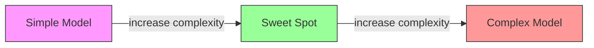
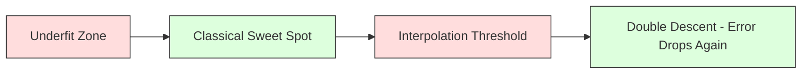
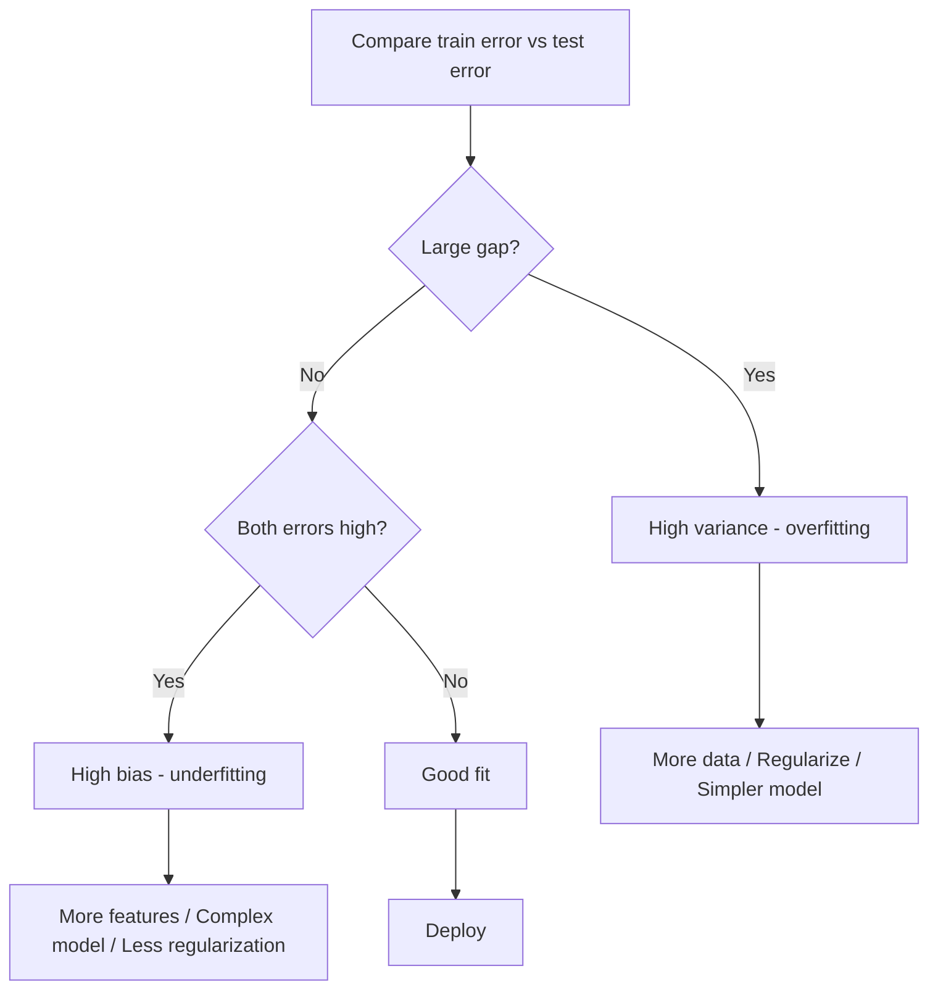
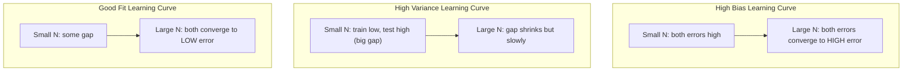
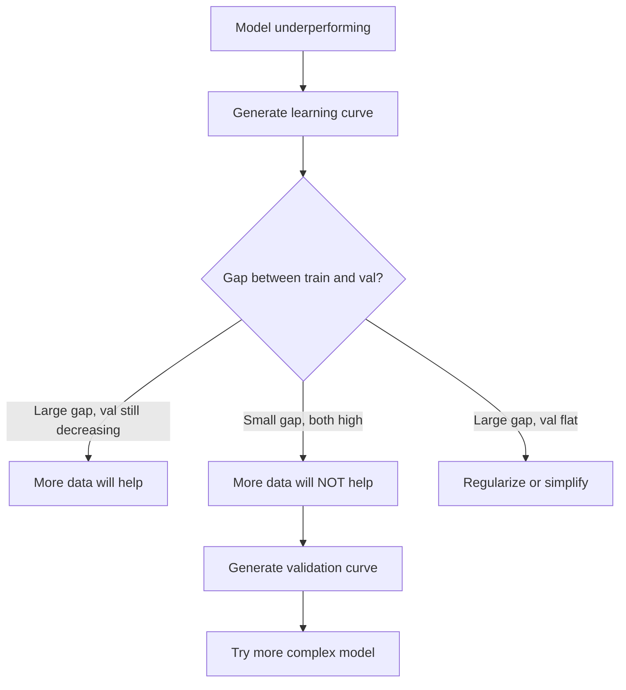

# التجارة المتعددة التغيرات
# 偏差-方差权衡


> كل خطأ نموذجي يأتي من أحد المصادر الثلاثة: التحيز، التباين، أو الضجيج. يمكنك التحكم فقط في أول اثنين.

> كل خطأ نموذجي يأتي من ثلاثة مصادر: الاختلافات، الاختلافات أو الضجيج.

**Type:** Learn | **类型：** 学习
**Language:**" بايثون "**语言：**بايثون
**Prerequisites:** Phase 2, Lessons 01-09 (ML basics, regression, classification, evaluation) | **前置知识：** Phase 2 第 1-9 课（ML 基础、回归、分类、评估）
**Time:** ~75 minutes | **时间：** 约 75 分钟

## أهداف التعلم

- استنباط تحلل التباين المتوقع لخطأ التنبؤ وتفسير دور الضوضاء غير القابلة للتقليل
  推导期望预测 خطأ الاختلاف الاختلاف الاختلاف الاختلاف الاختلاف الاختلاف الاختلاف الاختلاف الاختلاف الاختلاف الاختلاف الاختلاف الاختلاف الاختلاف الاختلاف الاختلاف الاختلاف الاختلاف الاختلاف الاختلاف الاختلاف الاختلاف الاختلاف الاختلاف الاختلاف الاختلاف الاختلاف الاختلاف الاختلاف الاختلاف الاختلاف الاختلاف الاختلاف الاختلاف الاختلاف الاختلاف الاختلاف الاختلاف الاختلاف الاختلاف الاختلاف الاختلاف الاختلاف الاختلاف الاختلاف الاختلاف الاختلاف الاختلاف الاختلاف الاختلاف الاختلاف الاختلاف الاختلاف الاختلاف الاختلاف الاختلاف الاختلاف الاختلاف
- التشخيص ما إذا كان النموذج يعاني من التحيز العالي أو التباين العالي باستخدام أنماط خطأ التدريب والاختبار
  استخدام التدريب خطأ و اختبار خطأ نموذج تشخيص ما إذا كان هناك اختلاف كبير أو اختلاف كبير
- شرح كيفية تقنيات التنظيم (L1، L2، الإقلاع، التوقف المبكر) التجارة التحيز للتباين
  解释正则化技术(L1、L2、Dropout、早停) كيفية الوزن بين الاختلاف والتباين
- تنفيذ التجارب التي تظهر التداول بين التفاوتات بين النماذج المتزايدة التعقيد
  تحقيق تجربة تقييم الاختلافات والفوارق عند زيادة تعقيدات النموذج المرئي


> **【中文解读】**
> 偏差(模型太简单欠拟合) مقابل 方差(模型太复杂过拟合) 的平衡──正则化(L1/L2)、增加数据、降低模型复杂性是常用手段──理解偏差-方差权衡是调调的理论基础──

> **【拓展：偏差-方差在深度学习中的新理解】**
> النظرية الكلاسيكية تعتقد أن الزيادة في النموذج سوف تزيد من الاختلافات، ولكن في التعلم العميق هناك "مضاعفة الارتفاع" (double descent) الظاهرة: النموذج يتجاوز "إدخال قيمة

## المشكلة المشكلة المشكلة

لقد تدربت نموذجاً، لديه خطأ في بيانات التجارب، من أين يأتي هذا الخطأ؟

> أنت تدرب على نموذج. هناك بعض الأخطاء في بيانات الاختبار.

إذا كان نموذجك بسيطًا جدًا (التراجع الخطي على مجموعة بيانات متجاوزة) ، فسوف يفوت بشكل ثابت النمط الحقيقي. وهذا التحيز. إذا كان نموذجك معقدًا جدًا (عدد العدد من درجات 20 على 15 نقطة بيانات) ، فسوف يتناسب مع بيانات التدريب بشكل مثالي ولكن يعطي توقعاتًا مختلفة للغاية على البيانات الجديدة. وهذا هو التباين.

> إذا كان نموذجك بسيطًا جدًا (((في المجموعة البيانية المتحركة باستخدام العودة الخطية)) ، فسوف يستمر في الانحراف عن النموذج الحقيقي. هذا هو الاختلاف.

لا يمكنك تقليل كلا في نفس الوقت لمقدمة نموذج ثابتة. دفع التحيز إلى أسفل وتزايد التباين. دفع التباين إلى أسفل وتزايد التباين. فهم هذا التنازل هو المهارة التشخيصية الوحيدة الأكثر فائدة في التعلم الآلي. يخبرك ما إذا كان يجب أن تجعل نموذجك أكثر تعقيدا أو أقل تعقيدا، سواء للحصول على المزيد من البيانات أو هندسة ميزات أفضل، سواء للتنظيم أكثر أو أقل.

> بالنسبة لمقدمة نموذج محددة، لا يمكنك تقليل الاثنين في نفس الوقت. الضغط على الاختلافات، والبوارق على الصعود. الضغط على الاختلافات، والبوارق على الصعود. فهم هذا الاختلاف هو مهارة تشخيص الأكثر فائدة في تعلم الآلة.

> **【中文解读】**
> 误差 = 偏差2 + 方差 + 不可约噪声──偏差来自模型的错误假设(如用直线拟合曲线), 偏差来自对训练数据波动的过度敏感──诊断方法:训练误差高+测试误差高→高偏差(不适合);训练误差低+测试误差高→高方差(过适合)──对应的解决方案完全不同──

## المفهوم الأساسي

### التحيزات: خطأ منهجي

يقيّم التحيز مدى عودة متوسط التنبؤات من القيمة الحقيقية. إذا قمت بتدريب نفس النموذج على مجموعة مختلفة من التدريبات المستمدة من نفس التوزيع ومتوسط التنبؤات، فإن التحيز هو الفجوة بين تلك المتوسط والحقيقة.

> الاختلاف يقيس الفرق بين متوسط التنبؤات والقيمة الحقيقية لموديلك. إذا كنت تقوم بتدريب نفس النموذج على مجموعة من التدريبات المختلفة التي يتم استخراجها من نفس التوزيع، وتحقيق النتيجة المتوسطة، فإن الاختلاف هو الفرق بين هذا القيمة المتوسطة والقيمة الحقيقية.

التحيز العالي يعني أن النموذج صلب جداً لا يمكن التقاط النمط الحقيقي. خط مستقيم يناسب المظلة سوف يفوت دائماً المنحنى، بغض النظر عن كمية البيانات التي تعطيها. هذا غير مناسب.

> التفاوت العالي يعني أن النموذج هو أكثر من اللازم، لا يمكن أن يلتقط النموذج الحقيقي.

```
High bias (underfitting):
  Model always predicts roughly the same wrong thing.
  Training error: HIGH
  Test error: HIGH
  Gap between them: SMALL
```

### التباين: حساسية لبيانات التدريب

يُقيّم التباين مدى تغيير توقعاتك عند التدريب على مجموعات فرعية مختلفة من البيانات. إذا كانت التغييرات الصغيرة في مجموعة التدريب تسبب تغييرات كبيرة في النموذج، فإن التباين مرتفع.

> 方差 قياس درجة التغيرات التي تحدث عند التدريب على مجموعة مختلفة من البيانات  إذا كان التغيرات الصغيرة في مجموعة التدريبات تؤدي إلى تغيرات ضخمة في النموذج، فإن الاختلافات مرتفعة جدا

التباين العالي يعني أن النموذج يتناسب مع الضجيج في بيانات التدريب، وليس الإشارة الأساسية. سيتدفق تعدد الدرجات 20 عبر كل نقطة التدريب ولكن يتذبذب بشكل وحشي بينها. هذا يزيد من التناسب.

> الاختلاف العالي يعني أن النموذج يستخدم ضجيج في بيانات التدريب الملائمة، وليس إشارة محتملة.

```
High variance (overfitting):
  Model fits training data perfectly but fails on new data.
  Training error: LOW
  Test error: HIGH
  Gap between them: LARGE
```

### التفكك

بالنسبة لأي نقطة x، فإن الخطأ المتوقع للتنبؤ تحت الخسارة المربعة يتحلل بالضبط:

> بالنسبة لقطة x، في خسارة مربعة، توقعات التنبؤ خطأ تحديد تحليل:

```
Expected Error = Bias^2 + Variance + Irreducible Noise

where:
  Bias^2   = (E[f_hat(x)] - f(x))^2
  Variance = E[(f_hat(x) - E[f_hat(x)])^2]
  Noise    = E[(y - f(x))^2]             (sigma^2)
```

- `f(x)`هو الوظيفة الحقيقية
  `f(x)`هو فعل حقيقي
- `f_hat(x)`هو توقعات نموذجك
  `f_hat(x)`هو نموذجك
- `E[...]`هو التوقعات على مجموعات تدريب مختلفة
  `E[...]`هو توقعات مختلفة
- `y`هو العلامة الملاحظة (العمل الحقيقي بالإضافة إلى الضوضاء)
  `y`نعم مشاهدة العلامات

مصطلح الضوضاء لا يمكن تقليصه. لا يوجد نموذج يمكن أن تفعل أفضل من sigma^2 على البيانات الضوضاء. مهمتك هي إيجاد التوازن الصحيح بين التحيز^2 والتشابه.

> 噪音项是不可约束的. لا يوجد أي نموذج يمكن أن تفعل أفضل من sigma^2 على بيانات ضجيج تحتوي على الضجيج. مهمتك هي العثور على التوازن الصحيح بين التباين^2 والتباين^2.

### تعقيد النموذج مقابل خطأ



المنحنى الكلاسيكى على شكل U:

> 经典的U 形曲线:

| Complexity | Bias | Variance | Total Error |
|-----------|------|----------|-------------|
| Too low | HIGH | LOW | HIGH (underfitting) |
| Just right | MODERATE | MODERATE | LOWEST |
| Too high | LOW | HIGH | HIGH (overfitting) |

| 复杂度 | 偏差 | 方差 | 总误差 |
|--------|------|------|--------|
| 太低 | 高 | 低 | 高（欠拟合） |
| 刚好 | 中等 | 中等 | 最低 |
| 太高 | 低 | 高 | 高（过拟合） |

### التنظيم كسيطرة على التغيرات المتحيزة

التنظيم يزيد عمداً من التحيز لتقليل التباين. إنه يقيّد النموذج حتى لا يستطيع مطاردة الضوضاء.

> إضافة الاختلافات إلى الاختلافات.

- **L2 (Ridge):**يقلل من كل الوزن نحو الصفر يحتفظ بكل الخصائص لكنه يقلل من تأثيرها
  **L2 (Ridge)**: سوف يعيد الملكية إلى الصفر
- **L1 (Lasso):**يدفع بعض الأوزان بالضبط إلى الصفر يقوم بإجراء اختيار الميزات
  **L1 (Lasso)**:将某些权重精确推至零;;执行特征选择;;
- **Dropout:**يُعيق العصبية بشكل عشوائي أثناء التدريب، ويُجبر على التمثيلات الزائدة.
  **Dropout**: تدريب 隨机禁用神经元──迫使冗余表示──
- **Early stopping:**يتوقف التدريب قبل أن يتناسب النموذج بالكامل مع بيانات التدريب.
  **早停**: توقف التدريب قبل أن يتأقلم

قوة التنظيم (lambda، معدل الانقطاع، عدد الفترات) تحكم مباشرة أين تجلس على منحنى التأثير والتبديل.

> 正则化强度 ((lambda、 dropup rate、epoch 数) تحكم مباشرة في موقعك على منحنى الاختلاف الاختلاف الاختلاف الاختلاف الاختلاف الاختلاف الاختلاف الاختلاف الاختلاف الاختلاف الاختلاف الاختلاف الاختلاف الاختلاف الاختلاف الاختلاف الاختلاف الاختلاف الاختلاف الاختلاف الاختلاف الاختلاف الاختلاف الاختلاف الاختلاف الاختلاف الاختلاف الاختلاف الاختلاف الاختلاف الاختلاف الاختلاف الاختلاف الاختلاف الاختلاف الاختلاف الاختلاف الاختلاف الاختلاف الاختلاف الاختلاف الاختلاف الاختلاف الاختلاف الاختلاف الاختلاف الاختلاف الاختلاف الاختلاف الاختلاف الاختلاف الاختلاف الاختلاف الاختلاف الاختلاف الاختلاف الاختلاف الاختلاف الاختلاف الاختلاف الاختلاف الاختلاف الاختلاف الاختلاف الاختلاف الاختلاف الاختلاف الاختلاف الاختلاف الاختلاف الاختلاف الاختلاف الاختلاف الاختلاف الاختلاف الاختلاف الاختلاف الاختلاف الاختلاف الاختلاف الاختلاف الاختلاف الاختلاف الاختلاف الاختلاف الاختلاف الاختلاف الاختلاف الاختلاف الاختلاف الاختلاف الاختلاف الاختلاف الاختلاف الاختلاف الاختلاف الاختلاف الاختلاف الاختلاف الاختلاف الاختلاف الاختلاف الاختلاف الاختلاف الاختلاف الاختلاف الاختلاف الاختلاف الاختلاف الاختلاف الاختلاف الاطاطاطاطاطاطاطاطاطاطاطاطاطاطاط

### النزول المزدوج: وجهة النظر الحديثة

تقول النظرية الكلاسيكية: بعد نقطة الحلوة، فإن التعقيد أكثر يؤلم دائماً. ولكن الأبحاث منذ عام 2019 أظهرت شيئاً غير متوقع. إذا استمررت في زيادة قدرة النموذج بعيدًا عن عتبة التقاطع (حيث يكون لدى النموذج ما يكفي من المعلمات لتتناسب مع بيانات التدريب بشكل مثالي) ، يمكن أن ينخفض خطأ التحقق مرة أخرى.

> النظرية الكلاسيكية تقول: بعد أفضل نقاط، فإن المزيد من التعقيدات دائمًا مؤذية. ولكن الأبحاث التي أجريت منذ عام 2019 أظهرت بعض الظواهر غير المفاجئة. إذا استمرت في زيادة قدرة النموذج، والتي تزيد عن القيمة المضافة، فإن النموذج لديه ما يكفي من العناصر المثالية للبيانات التدريبية المثالية، فيمكن أن ينخفض خطأ اختبار مرة أخرى.



هذه الظاهرة "النزول المزدوج" تفسر لماذا الشبكات العصبية المفرطة بشكل كبير (مع أكثر بكثير من المعلمات من أمثلة التدريب) لا تزال تعميمًا جيدًا. التنازل الكلاسيكي عن التبعيض والتبديل ليس خطأً ، لكنه غير كامل للنظام الحديث.

> هذا النوع من "القلق المزدوج" يفسر لماذا تتحول الحجم الكبير إلى الجوانب العصبية (الوجوانب أكثر من نموذج التدريب) لا تزال يمكن أن تتحول بشكل جيد إلى عامة.

الملاحظات الرئيسية حول الانخفاض المزدوج:

> حول النزول الثقيل

- يحدث في النماذج الخطية، شجرة القرار، وشبكات العصبية
  إنه يحدث في النموذج الإلكتروني، الأشجار القرارية والشبكات العصبية
- يمكن أن تؤذي المزيد من البيانات في منطقة التقاط النقاط (النزول المزدوج على نحو نموذجي)
  في منطقة إضافة قيمة أكثر البيانات قد تكون مضرة في الواقع
- يمكن أن تسبب المزيد من فترات التدريب أيضا (النزول المزدوج في معنى العصر)
  更多 تدريب عصر أيضا قد يؤدي إليها 
- التنظيم يُسطح ذروته لكن لا يُزيلها
  لقد تم تسهيل القيمة القصوى ولكن لا يمكن إزالتها

لماذا يحدث هذا؟ عند عتبة التقاطع، يكون لدى النموذج قدرة كافية لتلائم جميع نقاط التدريب. يتم إضطلاعه إلى حل محدد جداً يمر عبر كل نقطة، وتسبب اضطرابات صغيرة في البيانات تغييرات كبيرة في التكيف. هنا حيث تصل النقاشات إلى ذروتها بعد هذا الحد، يحتوي النموذج على العديد من الحلول المحتملة التي تناسب البيانات بشكل مثالي. خوارزمية التعلم (على سبيل المثال، انخفاض التدفق مع التنظيم الضمني) تميل إلى اختيار أبسط واحد منهم. هذا التحيز الضمني نحو الحلول البسيطة هو السبب في أن النماذج المفروضة على المعايير تتعميم.

> لماذا يحدث ذلك؟ في وضع القيمة المضافة، يكون لدى النموذج قدر كافٍ لتلائم جميع نقاط التدريب. يضطر إلى إيجاد حل محدد لكل نقطة، حيث يؤدي التشويشات الصغيرة في البيانات إلى تغيرات ضخمة في المضافة. هذا هو المكان الذي يقع فيه القيمة المرتفعة. بعد تجاوز القيمة، هناك العديد من حلول المعلومات المثالية المثالية.

| Regime | Parameters vs Samples | Behavior |
|--------|----------------------|----------|
| Underparameterized | p << n | Classical tradeoff applies |
| Interpolation threshold | p ~ n | Variance peaks, test error spikes |
| Overparameterized | p >> n | Implicit regularization kicks in, test error drops |

| 状态 | 参数 vs 样本 | 行为 |
|------|-------------|------|
| 欠参数化 | p << n | 经典权衡适用 |
| 插值阈值 | p ~ n | 方差峰值，测试误差飙升 |
| 过参数化 | p >> n | 隐式正则化起效，测试误差下降 |

لأغراض عملية: إذا كنت تستخدم شبكات عصبية أو مجموعات شجرة كبيرة، لا تتوقف عند عتبة التقاطع. إما البقاء أقل بكثير من ذلك (مع تنظيم صريح) أو تجاوزها. أسوأ مكان لتكون هو مباشرة عند العتبة.

> عمليات عملي: إذا كنت تستخدم شبكة عصبية أو تجميع شجرة كبيرة، لا تقف في وضع قيمة值处──要么远低于它──带显式正则化),要么远超过它──أسوأ موقع هو恰好在值处──

### تشخيص نموذجك



| Symptom | Diagnosis | Fix |
|---------|-----------|-----|
| High train error, high test error | Bias | More features, complex model, less regularization |
| Low train error, high test error | Variance | More data, regularization, simpler model, dropout |
| Low train error, low test error | Good fit | Ship it |
| Train error decreasing, test error increasing | Overfitting in progress | Early stopping |

| 症状 | 诊断 | 修复 |
|------|------|------|
| 训练误差高，测试误差高 | 偏差 | 更多特征、更复杂的模型、更少的正则化 |
| 训练误差低，测试误差高 | 方差 | 更多数据、正则化、更简单的模型、dropout |
| 训练误差低，测试误差低 | 好的拟合 | 发布它 |
| 训练误差下降，测试误差上升 | 正在过拟合 | 早停 |

### استراتيجيات عملية

**When bias is the problem:**
- إضافة ميزات متعددة النظرية أو التفاعل
  إضافة العديد من العلامات أو الخصائص التفاعلية
- استخدم نموذج أكثر مرونة (مجموعة الأشجار بدلاً من خطية)
  استخدام أكثر نموذج لونية
- تقليل قوة التنظيم
  减小正则化强度
- القطار أطول (إذا لم يتحرك بعد)
  訓練更长时间 ((إذا كنت قد حصلت على)

**When variance is the problem:**

> **当方差是问题时：**
- الحصول على المزيد من البيانات التدريبية
   الحصول على المزيد من التدريبات
- استخدام التسريب (الغابات العشوائية)
  استخدام التسريبات
- زيادة التنظيم (اللامبدا العالي، والمزيد من التوقف)
  增加正则化(更高的 lambda、更多 dropup)
- اختيار الميزات (إزالة الميزات الضوضاء)
  خصائص اختيار (تحويل الصوت)
- استخدم التحقق المتقاطع للكشف عنه في وقت مبكر
  استخدام交叉验证及早检测

### تجميع الطرق وتقليل التباين

أساليب الجمع هي الأداة الأكثر عملية لمحاربة التباين.

> طريقة التجميع هي أسهل أدوات عملية لمكافحة التباين

**Bagging (Bootstrap Aggregating)**يقوم بتدريب نماذج متعددة على عينات مختلفة من البث التدريبي من بيانات التدريب ، ثم يُمتوسط توقعاتهم. لكل نموذج فردي اختلاف كبير ، ولكن متوسط لديه اختلاف أقل بكثير. الغابات العشوائية تطبق على أشجار القرار.

> **Bagging（Bootstrap 聚合）**في نموذج التدريب المختلف من البيانات التشغيل التدريب العديد من النماذج، ثم متوسط توقعاتها. كل نموذج منفصل لديه اختلافات عالية، ولكن متوسط القيمة لديه اختلافات أقل بكثير.

لماذا يعمل بشكل رياضي: إذا كنت تقارن N التنبؤات المستقلة، كل مع التباين sigma^2, فإن التباين من المتوسط هو sigma^2 / N. النماذج ليست مستقلة حقا (كل منهم يرى بيانات مماثلة) ، لذلك الارتفاع أقل من 1/N، ولكنه لا يزال كبيرا.

> المبدأ الرياضي: إذا كنت تقترح متوسط N 个独立预测، فإن كل مربع يقل عن sigma^2, متوسط قيمة الاختلاف المكاني يقل عن sigma^2 / N ⋅ النموذج ليس مستقلًا حقيقيًا، لذلك فإن الحد من الكميات هو أقل من 1/N، ولكن لا يزال قابلًا للنظر.

**Boosting**يقلل من التحيز من خلال بناء النماذج بشكل متسلسل ، حيث يركز كل نموذج جديد على أخطاء الجمع حتى الآن. تعزيز التدريجية و AdaBoost هي الأمثلة الرئيسية. يمكن أن يزداد تعزيز إذا أضفت العديد من النماذج ، لذلك تحتاج إلى وقف مبكر أو تنظيم.

> **Boosting**من خلال ترتيب بناء النموذج لتقليل الفجوة، كل نموذج جديد يركز على أخطاء التجميع حتى الآن.

| Method | Primary Effect | Bias Change | Variance Change |
|--------|---------------|-------------|-----------------|
| Bagging | Reduces variance | No change | Decreases |
| Boosting | Reduces bias | Decreases | Can increase |
| Stacking | Reduces both | Depends on meta-learner | Depends on base models |
| Dropout | Implicit bagging | Slight increase | Decreases |

| 方法 | 主要效果 | 偏差变化 | 方差变化 |
|------|---------|---------|---------|
| Bagging | 减少方差 | 不变 | 下降 |
| Boosting | 减少偏差 | 下降 | 可能增加 |
| Stacking | 减少两者 | 取决于元学习器 | 取决于基模型 |
| Dropout | 隐式 Bagging | 略微增加 | 下降 |

**Practical rule:**إذا كان نموذج الأساس الخاص بك لديه اختلاف كبير (شجرة عميقة، متعددة النقاط عالية الدرجة) ، استخدم التعبئة. إذا كان نموذج الأساس الخاص بك لديه تحيز كبير (أحذية ضئيلة، نماذج خطية بسيطة) ، استخدم تعزيز.

> **实践规则：**إذا كان لديك نموذج أساسي لديه ارتفاع الاختلافات (深树、高次多项式), باستخدام Bagging。 إذا كان لديك نموذج أساسي لديه ارتفاع الاختلافات ((浅树、简单线性模型), باستخدام Boosting。

### منحنى التعلم

تعبر منحنى التعلم عن خطأ التدريب والتحقق من التحقق من التحقق من التحقق من التحقق من التحقق من التحقق من التحقق من التحقق من التحقق من التحقق من التحقق من التحقق من التحقق من التحقق من التحقق من التحقق من التحقق من التحقق من التحقق من التحقق من التحقق من التحقق من التحقق من التحقق من التحقق من التحقق من التحقق من التحقق من التحقق من التحقق من التحقق من التحقق من التحقق من التحقق من التحقق من التحقق من التحقق من التحقق من التحقق من التحقق من التحقق من التحقق من التحقق من التحقق من التحقق من التحقق من التحقق من التحقق من التحقق من التحقق من التحقق من التحقق من التحقق من التحقق من التحقق من التحقق من التحقق من التحقق من التحقق من التحقق من التحقق من التحقق من التحقق من التحقق من التحقق من التحقق من التحقق من التحقق من التحقق من التحقق من التحقق من التحقق من التحقق من التحقق من التحقق من التحقق من التحقق من التحقق.

> سيتم رسم الخطأ التدريبي والخطأ التدريبي كخطأ التدريبي كخطأ وظيفي كبير في مجموعة التدريبات.



كيف تقرأها:

> كيف لي أن أقرأ:

| Scenario | Training Error | Validation Error | Gap | What It Means | What to Do |
|----------|---------------|-----------------|-----|---------------|------------|
| High bias | High | High | Small | Model cannot capture the pattern | More features, complex model, less regularization |
| High variance | Low | High | Large | Model memorizes training data | More data, regularization, simpler model |
| Good fit | Moderate | Moderate | Small | Model generalizes well | Ship it |
| High variance, improving | Low | Decreasing with more data | Shrinking | Variance problem that data can fix | Collect more data |
| High bias, flat | High | High and flat | Small and flat | More data will NOT help | Change model architecture |

| 场景 | 训练误差 | 验证误差 | 间隙 | 含义 | 应对 |
|------|---------|---------|------|------|------|
| 高偏差 | 高 | 高 | 小 | 模型无法捕捉模式 | 更多特征、更复杂模型、减少正则化 |
| 高方差 | 低 | 高 | 大 | 模型记住训练数据 | 更多数据、正则化、更简单模型 |
| 好的拟合 | 中等 | 中等 | 小 | 模型泛化良好 | 发布它 |
| 高方差，正在改善 | 低 | 随数据增加而下降 | 缩小 | 数据可以解决的方差问题 | 收集更多数据 |
| 高偏差，平坦 | 高 | 高且平坦 | 小且平坦 | 更多数据不会有帮助 | 更改模型架构 |

المفهوم الحاسم: إذا كانت كل من المنحنيات قد استقر والفجوة صغيرة ولكن كل من الأخطاء كبيرة، فإن المزيد من البيانات لا فائدة منها. تحتاج إلى نموذج أفضل. إذا كانت الفجوة كبيرة وما زالت تقلص، فإن المزيد من البيانات ستساعد.

> النظرية الرئيسية: إذا كانت المياه المزدوجة في المياه المتسقة والفجوة الصغيرة، ولكن الثنائيات الثانية مرتفعة، فإن المزيد من البيانات لا تحتاج إلى نموذج أفضل.

### كيفية خلق منحنى التعلم

هناك طريقتان:

> هناك طريقتان:

**Approach 1: Vary training set size, fixed model.**حافظ على نموذج وفرامترات المعدات العالية ثابتة. تدريب على مجموعات فرعية كبيرة متزايدة من بيانات التدريب. قياس خطأ التدريب وأخطاء التحقق من التحقق من التحقق من التحقق من التحقق من التحقق من التحقق من التحقق من التحقق من التحقق من التحقق من التحقق من التحقق من التحقق من التحقق من التحقق من التحقق من التحقق من التحقق من التحقق من التحقق من التحقق من التحقق من التحقق من التحقق من التحقق من التحقق من التحقق من التحقق من التحقق من التحقق من التحقق من التحقق من التحقق من التحقق من التحقق من التحقق من التحقق من التحقق من التحقق من التحقق من التحقق من التحقق من التحقق من التحقق من التحقق من التحقق من التحقق من التحقق من التحقق من التحقق من التحقق.

> **方法 1：变化训练集大小，固定模型。**保持模型和超参数不变──在越来越大的训练数据集上训练──在每大小下测量训练错误和验证错误──这是标准的学习曲线──

**Approach 2: Vary model complexity, fixed data.**حافظ على ثابتة البيانات. مسح معايير التعقيد (درجة الكتلة، عمق الشجرة، عدد الطبقات). قياس خطأ التدريب وأخطاء التحقق من التحقق من التحقق من التحقق من التحقق من التحقق من التحقق من التحقق من التحقق من التحقق من التحقق من التحقق من التحقق من التحقق من التحقق من التحقق من التحقق من التحقق من التحقق من التحقق من التحقق من التحقق من التحقق من التحقق من التحقق من التحقق من التحقق من التحقق من التحقق من التحقق من التحقق من التحقق من التحقق من التحقق من التحقق من التحقق من التحقق من التحقق من التحقق من التحقق من التحقق من التحقق من التحقق من التحقق من التحقق من التحقق من التحقق من التحقق من التحقق من التحقق من التحقق من التحقق من التحقق من التحقق من التحقق من التحقق من التحققق من التحقق من التحقق.

> **方法 2：变化模型复杂度，固定数据。**保持数据不变──扫描复杂度参数(多项式次数、树深度、层数)──在每个复杂度下测量训练误差和验证误差──这是验证曲线,直接展示偏差-方差权衡──

كل منهج يكمّل الآخر. الأول يخبرك ما إذا كانت المزيد من البيانات ستساعدك. الثاني يخبرك ما إذا كان نموذج مختلف سيساعدك. اجري كلا منهما قبل اتخاذ قرارات حول خطوتك التالية.

> 两种方法互补――第一种告诉你更多数据是否有帮助――第二种告诉你不同模型是否有帮助―― قبل اتخاذ قرار الخطوة التالية، يجب أن تعمل الاثنين――



## بناء ذلك تحرك لتحقيق

> **【中文解读】**
> 通過 تجربة يمكن رؤية التمييز-تمييز الوزن: مع عدة تعويضات من مختلف التعقيدات ((درجة 1→20) ، تكييف نفس مجموعة البيانات ، مشاهدة التدريب الأخطاء والاختبار الأخطاء مع تغيرات التعقيدات。
```figure
bias-variance
```

## بناءها

الرمز في`code/bias_variance.py`يقوم بتجربة التفكيك الكامل للتحيز.

> `code/bias_variance.py`وسط كود تشغيل كاملة تجربة تقسيم الاختلافات الاختلافات الاختلافات الاختلافات الاختلافات الاختلافات الاختلافات الاختلافات الاختلافية:

### الخطوة الأولى: توليد بيانات اصطناعية من وظيفة معروفة

نحن نستخدم`f(x) = sin(1.5x) + 0.5x`مع ضجيج غوسيان. معرفة الوظيفة الحقيقية يسمح لنا بحساب التحيز الدقيق والتشابه.

> نحن نستخدم`f(x) = sin(1.5x) + 0.5x`زيادة الضجيج. تعرف وظيفة حقيقية.

```python
def true_function(x):
    return np.sin(1.5 * x) + 0.5 * x

def generate_data(n_samples=30, noise_std=0.5, x_range=(-3, 3), seed=None):
    rng = np.random.RandomState(seed)
    x = rng.uniform(x_range[0], x_range[1], n_samples)
    y = true_function(x) + rng.normal(0, noise_std, n_samples)
    return x, y
```

### الخطوة الثانية: أخذ عينات من القفص والتناسب بالعدد المتعدد

لكل درجة متعددة النقاط، نقوم بسحب العديد من مجموعات تدريب البث، والتناسب مع متعددة النقاط، وتسجيل التنبؤات على شبكة اختبار ثابتة. وهذا يعطينا توزيع التنبؤات في كل نقطة اختبار.

> لكل عدد من المرحلات المتعددة، نستخرج العديد من مجموعات التدريبات التدريبية، ونقوم بتجهيز المرحلات المتعددة، ونسجل التوقعات على شبكة التجربة الثابتة.

```python
def fit_polynomial(x_train, y_train, degree, lam=0.0):
    X = np.column_stack([x_train ** d for d in range(degree + 1)])
    if lam > 0:
        penalty = lam * np.eye(X.shape[1])
        penalty[0, 0] = 0
        w = np.linalg.solve(X.T @ X + penalty, X.T @ y_train)
    else:
        w = np.linalg.lstsq(X, y_train, rcond=None)[0]
    return w
```

نحن نتناسب على 200 عينة مختلفة من الشرائح الناشئة. كل عينة من الشرائح الناشئة يتم استخدامه من نفس التوزيع الأساسي ولكن يحتوي على نقاط مختلفة.

> نحن نُصمم على 200 نموذج مختلف من الشريط الناشئ. كل نموذج من الشريط الناشئ يتم استخدامه من نفس التوزيع الأساسي ولكن يحتوي على نقاط مختلفة.

### الخطوة الثالثة: حساب التحيز^2، تدهور التباين

مع 200 مجموعة من التنبؤات في كل نقطة اختبار، يمكننا حساب التفكك مباشرة من التعريف:

> مع كل اختبار على 200 مجموعة من التوقعات، يمكننا أن نقوم مباشرة من تعريف الحساب إلى تحليل:

```python
mean_pred = predictions.mean(axis=0)
bias_sq = np.mean((mean_pred - y_true) ** 2)
variance = np.mean(predictions.var(axis=0))
total_error = np.mean(np.mean((predictions - y_true) ** 2, axis=1))
```

- `mean_pred`هل E[f_hat(x)] تم تقديرها من عينات البث
  `mean_pred`هو من إطلاق 样本估计的 E[f_hat(x) ]
- `bias_sq`هو الفجوة المربعة بين المتوسط التنبؤ والحقيقة
  `bias_sq`هو الفجوة المربعة بين متوسط التوقعات والقيمة الحقيقية
- `variance`هو متوسط انتشار التنبؤات عبر عينات البوتستراب
  `variance`هو bootstrap 样本间预测 متوسط الاختراق
- `total_error`يجب أن يكون التوجه تقريباً متساوياً^2 + التباين + الضجيج
  `total_error`应约等于 تحيز^2 + تغير + ضجيج

### الخطوة الرابعة: منحنى التعلم

منحنى التعلم تُحذف حجم مجموعة التدريب مع الحفاظ على تعقيد النموذج ثابتًا. فإنها تُظهر ما إذا كان نموذجك محدودًا بالبيانات أو محدودًا بالقدرة.

> تعتبر هذه المجموعات من المواد التي تُظهر أن نموذجك محظور على البيانات أو محظور على القدرة على تحملها.

```python
def demo_learning_curves():
    sizes = [10, 15, 20, 30, 50, 75, 100, 150, 200, 300]
    degree = 5

    for n in sizes:
        train_errors = []
        test_errors = []
        for seed in range(50):
            x_train, y_train = generate_data(n_samples=n, seed=seed * 100)
            w = fit_polynomial(x_train, y_train, degree)
            train_pred = predict_polynomial(x_train, w)
            train_mse = np.mean((train_pred - y_train) ** 2)
            test_pred = predict_polynomial(x_test, w)
            test_mse = np.mean((test_pred - y_test) ** 2)
            train_errors.append(train_mse)
            test_errors.append(test_mse)
        # Average over runs gives the learning curve point
```

بالنسبة لنموذج عالي التباين (درجة 5 مع بيانات صغيرة) ، ترى:

> بالنسبة للموديلات المتعددة في 5 مرات على البيانات الصغيرة ، سترى:
- خطأ التدريب يبدأ منخفضًا ويزداد مع زيادة البيانات يجعل الذاكرة أصعب
  التدريبات الخاطئة من البداية منخفضة، مع المزيد من البيانات يجعل من الصعب التذكر
- خطأ الاختبار يبدأ عاليا و ينخفض مع نموذج الحصول على المزيد من الإشارة
  اختبار خطأ من البداية العالية، مع نموذج الحصول على المزيد من الإشارات وتراجع
- الفجوة تقلص مع المزيد من البيانات
  间隙 مع المزيد من البيانات وتقليل

بالنسبة لنموذج ذو التحيز العالي (درجة 1) ، تتقارب الأخطاء بسرعة إلى نفس القيمة العالية ، ولا يساعد المزيد من البيانات.

> بالنسبة لنموذج التفاوت العالي (١ مرات أكثر) ، فإن التفاوتين بسرعة تصل إلى نفس القيمة العالية، لا يوجد المزيد من البيانات.

### الخطوة 5: مسح التأقلم

القانون يتضمن أيضاً`demo_regularization_sweep()`، الذي يصلح تعدد درجة عالية (درجة 15) ويقوم بتصفية قوة التنظيم من 0.001 إلى 100. هذا يظهر التداول بين التباعد والتبديل من زاوية مختلفة: بدلا من تغيير تعقيد النموذج، نقوم بتغيير قوة القيود.

> 代码 أيضاً `demo_regularization_sweep()`، ثابتة عالية الارتفاع المتعدد الحجم ((15 مرات) 并 من 0.001 إلى 100 扫描 Ridge 正则化强度── هذا يظهر من مختلف الزوايا الاختلاف-الاختلاف الوزن: ليس تغيير تعقيد النموذج، ولكن تغيير قوة الحزمة──

```python
def demo_regularization_sweep():
    alphas = [0.001, 0.005, 0.01, 0.05, 0.1, 0.5, 1.0, 5.0, 10.0, 50.0, 100.0]
    for alpha in alphas:
        results = bias_variance_decomposition([15], lam=alpha)
        r = results[15]
        print(f"alpha={alpha:.3f}  bias={r['bias_sq']:.4f}  var={r['variance']:.4f}")
```

في النموذج الألفي المنخفض، يكون تعدد الدرجة 15 غير مقيد تقريبا. يهيمن التباين لأن النموذج يطارد الضوضاء في كل عينة من أشكال التشغيل. في النموذج الألفي العالي، تكون العقوبة قوية جدًا بحيث يصبح النموذج فعلياً وظيفة ثابتة تقريبًا. يهيمن التحيز. يقع النموذج الأمثل بين هذه التطرفات.

> في النظام الأساسي المنخفض، فإن 15 مرات متعددة النقاط لا تقتصر تقريبا على الحكم.

هذا هو نفس منحنى U من درجة متعددة الكلمات المتغيرة ، ولكن يتم التحكم فيه بواسطة زر متواصل بدلاً من واحد منفصل. في الممارسة العملية ، تعد التنظيم الطريقة المفضلة لتحكم التداول لأنه يسمح بالتحكم في الحبوب الدقيقة دون تغيير مجموعة الميزات.

> هذا هو نفس الموجة U التي تتغير في عدد مرات متعددة، ولكن من خلال الدوران المتواصل وليس من خلال الدوران المتفرد. في الممارسة العملية، فإن القانون هو الطريقة المفضلة لقياس الوزن، لأنه يسمح بإجراء التحكم الدقيق في حالة عدم تغيير مجموعة من الخصائص.

## استخدمها في إطار التنفيذ

يقدم sklearn `learning_curve`و`validation_curve`لتلقيح هذه التشخيصات دون كتابة حلقات التشغيل.

> التعلم  المقدمة `learning_curve`和 `validation_curve`لتلقية هذه التشخيصات، لا حاجة إلى كتابة دورة التنفيذ

### منحنى التحقق من الصحة: تعقيد نموذج التنظيف

```python
from sklearn.model_selection import validation_curve
from sklearn.pipeline import make_pipeline
from sklearn.preprocessing import PolynomialFeatures
from sklearn.linear_model import Ridge

degrees = list(range(1, 16))
train_scores_all = []
val_scores_all = []

for d in degrees:
    pipe = make_pipeline(PolynomialFeatures(d), Ridge(alpha=0.01))
    train_scores, val_scores = validation_curve(
        pipe, X, y, param_name="polynomialfeatures__degree",
        param_range=[d], cv=5, scoring="neg_mean_squared_error"
    )
    train_scores_all.append(-train_scores.mean())
    val_scores_all.append(-val_scores.mean())
```

هذا يعطي لك منحنى التداول بين التباين والتحيز مباشرة حيث تكون النتيجة الموثقة أسوأ نسبياً إلى النتيجة المتدربة، يتهيمن التباين. حيث يكون كلاهما سيئاً، يتهيمن التباين.

> هذا يعطي مباشرة الاختلاف-الاختلاف الوزن منحنى.

### منحنى التعلم: حجم مجموعة التدريب

```python
from sklearn.model_selection import learning_curve

pipe = make_pipeline(PolynomialFeatures(5), Ridge(alpha=0.01))
train_sizes, train_scores, val_scores = learning_curve(
    pipe, X, y, train_sizes=np.linspace(0.1, 1.0, 10),
    cv=5, scoring="neg_mean_squared_error"
)
train_mse = -train_scores.mean(axis=1)
val_mse = -val_scores.mean(axis=1)
```

قصة`train_mse`و`val_mse`ضد`train_sizes`الشكل يخبرك بكل شيء عن نموذجك

> ستعمل`train_mse`和 `val_mse`على`train_sizes`رسمها. الصورة تخبرك عن كل شيء

### التحقق المتقاطع مع مسح التنظيم

```python
from sklearn.model_selection import cross_val_score

alphas = [0.001, 0.01, 0.1, 1.0, 10.0, 100.0]
for alpha in alphas:
    pipe = make_pipeline(PolynomialFeatures(10), Ridge(alpha=alpha))
    scores = cross_val_score(pipe, X, y, cv=5, scoring="neg_mean_squared_error")
    print(f"alpha={alpha:>7.3f}  MSE={-scores.mean():.4f} +/- {scores.std():.4f}")
```

هذا يصفح قوة التنظيم لمعقدة النموذج الثابت. سترى نفس التداول بين التباعد والبديل: الفا المنخفضة تعني التباعد العالي، الفا العالي يعني التباعد العالي.

> هذا في تعقيد النموذج الثابت مسح قوة تقليدية. سترى نفس الاختلاف الاختلاف الاختلاف الوزن: الفا المنخفضة يعني الاختلاف الارتفاع الاختلاف الارتفاع الفا المنخفضة يعني الاختلاف الارتفاع الاختلاف الارتفاع الاختلاف الارتفاع الاختلاف الاختلاف الارتفاع الاختلاف الاختلاف الاختلاف الاختلاف الاختلاف الاختلاف الاختلاف الاختلاف الاختلاف الاختلاف الاختلاف الاختلاف الاختلاف الاختلاف الاختلاف الاختلاف الاختلاف الاختلاف الاختلاف الاختلاف الاختلاف الاختلاف الاختلاف الاختلاف الاختلاف الاختلاف الاختلاف الاختلاف الاختلاف الاختلاف الاختلاف الاختلاف الاختلاف الاختلاف الاختلاف الاختلاف الاختلاف الاختلاف الاختلاف الاختلاف الاختلاف الاختلاف الاختلاف الاختلاف الاختلاف الاختلاف الاختلاف الاختلاف الاختلاف الاختلاف الاختلاف الاختلاف الاختلاف الاختلاف الاختلاف الاختلاف الاختلاف الاختلاف الاختلاف الاختلاف الاختلاف الاختلاف الاختلاف الاختلاف الاختلاف الاختلاف الاختلاف الاختلاف الاختلاف الاختلاف الاختلاف الاختلاف الاختلاف الاختلاف الاختلاف الاختلاف الاختلاف الاختلاف الاختلاف الاختلاف الاختلاف الاختلاف الاختلاف الاختلاف الاختلاف الاختلاف الاختلاف الاخير

### جمع كل شيء معاً: عملية تشخيص كاملة

في الممارسة العملية، تقوم بتشخيص هذه التشخيصات بالتسلسل:

> في الممارسة، تقومين بتنظيم هذه التشخيصات:

1. قم بتدريب نموذجك، احسب خطأ التدريب واختبارك
   訓練你的模型──计算訓練和测试误差──
2. إذا كانت كلاهما مرتفعة، لديك مشكلة التحيز. قفز إلى الخطوة 4.
   إذا كان كلتا مرتفعتين: لديك مشكلة في الاختلافات.
3. إذا كان القطار منخفضًا ولكن الاختبار مرتفعًا: لديك مشكلة التباين. قم بتوليد منحنى تعلم لمعرفة ما إذا كانت المزيد من البيانات ستساعد. إذا لم يكن كذلك، قم بتعيين التطبيق.
   إذا كان التدريب منخفض ولكن الاختبار مرتفع: لديك مشكلة في التعلم.
4. إنشأ منحنى التحقق من المكثفة الرئيسية، و ابحث عن نقطة الحلوة
   成验证曲线扫描主要复杂度参数――找到最优点――
5. في نقطة اللطيفة، قم بتوليد منحنى التعلم. إذا كانت الفجوة لا تزال كبيرة، تحتاج إلى المزيد من البيانات أو التنظيم.
   في أفضل نقاط إنتاج منحنى التعلم. إذا كان الفجوة لا تزال كبيرة، تحتاج إلى المزيد من البيانات أو التأهيل.
6. حاول Ridge/ Lasso مع قيم ألفا مختلفة باستخدام `cross_val_score`اختر ألفا حيث يكون خطأ التحقق من الصلاحية المتقاطعة أقل
   استخدام`cross_val_score`尝试不同 ألفا 值的Ridge/Lasso──选择交叉验证误差最低的 ألفا──

هذا يستغرق 10-15 دقيقة من الحساب لمعظم مجموعات البيانات الجدولية ويوفر ساعات من التخمين.

> بالنسبة لمعظم مجموعات البيانات، هذا يتطلب 10-15 دقيقة من الحساب، ولكن توفر عدد الساعات من التخمينات.

## أرسلها .

هذا الدرس ينتج عن:`outputs/prompt-model-diagnostics.md`

> 本课产出:`outputs/prompt-model-diagnostics.md`

## تمارين التدريب

1. إشغلي عملية التفكك مع `noise_std=0`ما الذي يحدث مع مصطلح الخطأ غير المقلل؟ هل تتغير التعقيد المثالي؟
   1. استخدام`noise_std=0`(دون ضوضاء) عمل التفريق. ما الذي حدث؟

2. زيادة حجم مجموعة التدريب من 30 إلى 300. كيف يؤثر هذا على مكون التباين؟ هل يتحول المستوى الكلي المثالي؟
   2. هل سيزيد حجم مجموعات التدريب من 30 إلى 300... كيف يؤثر هذا على حجم التفريق؟ هل تحرك عدد المرات المفضل؟

3. إضافة L2 التنظيم (رجج رجعة) إلى التجربة. بالنسبة لعدد متعدد درجة عالية ثابتة (درجة 15) ، مسح lambda من 0 إلى 100.
   3. في تجربة إضافة L2 正则化 (Ridge 回归) ∼ إلى ثابتة高次多项式 (درجة 15) ، من 0 إلى 100 扫描 lambda── رسم الاختلاف^2 和方差作为 lambda 的函数──

4. تعديل الوظيفة الحقيقية من تعدد إلى `sin(x)`كيف يتغير تدهور التضارب المتغير؟ هل لا يزال هناك درجة مثالية واضحة؟
   4.  将真实函数从多项式改为 `sin(x)`◊ كيف تتغير التفاوتات؟ هل هناك عدد واضح من أفضل الحالات؟

5. تنفيذ لفئة جمعية (التخلف) بسيطة لشرطة التشغيل: تدريب 10 نماذج على عينات الشرائط التشغيل والتنبؤات المتوسطة. أظهر أن هذا يقلل من التباين دون زيادة التحيز كثيرا.
   5. 实现简单的bootstrap 聚聚聚(Bagging) 包装器: 培训10模型并平均预测在bootstrap 样本上.

> **【中文解读】**
> 偏差-方差分解的数学表达:E[((y - f_hat) ^2] = Bias^2 + Variance + sigma^2──其中 Bias^2 هو نموذج خطأ نظامي مربع,Variance is model to train data波动的敏感性,sigma^2 هو نموذج لمعالجة ضجيج البيانات نفسها,‬ ‬ ‬ ‬ ‬ ‬ ‬ ‬ ‬ ‬ ‬ ‬ ‬ ‬ ‬ ‬ ‬ ‬ ‬ ‬ ‬ ‬ ‬ ‬ ‬ ‬ ‬ ‬ ‬ ‬ ‬ ‬ ‬ ‬ ‬ ‬ ‬ ‬ ‬ ‬ ‬ ‬ ‬ ‬ ‬ ‬ ‬ ‬ ‬ ‬ ‬ ‬ ‬ ‬ ‬ ‬ ‬ ‬ ‬ ‬ ‬ ‬ ‬ ‬ ‬ ‬ ‬ ‬ ‬ ‬ ‬ ‬ ‬ ‬ ‬ ‬ ‬ ‬ ‬ ‬ ‬ ‬ ‬ ‬ ‬ ‬ ‬ ‬ ‬ ‬ ‬ ‬ ‬ ‬ ‬ ‬ ‬ ‬ ‬ ‬ ‬ ‬ ‬ ‬ ‬ ‬ ‬ ‬ ‬ ‬ ‬ ‬ ‬ ‬ ‬ ‬ ‬ ‬ ‬ ‬ ‬ ‬ ‬ ‬ ‬ ‬ ‬ ‬ ‬ ‬ ‬ ‬ ‬ ‬ ‬ ‬ ‬ ‬ ‬ ‬ ‬ ‬ ‬ ‬ ‬ ‬ ‬ ‬ ‬ ‬ ‬ ‬ ‬ ‬ ‬ ‬ ‬ ‬ ‬ ‬ ‬ ‬ ‬ ‬ ‬ ‬ ‬ ‬ ‬ ‬ ‬ ‬ ‬ ‬ ‬ ‬ ‬ ‬ ‬ ‬ ‬ ‬ ‬ ‬ ‬ ‬ ‬ ‬ ‬ ‬ ‬ ‬ ‬ ‬ ‬ ‬ ‬ ‬ ‬ ‬ ‬ ‬ ‬ ‬ ‬ ‬ ‬ ‬ ‬ ‬ ‬ 

> **【拓展：正则化如何在偏差和方差之间取得平衡】**
> L2 إصلاحية (Ridge) من خلال العقاب على الوزن الكبير لتقليل تعقيد النموذج، في الأساس هو إدخال بعض التحيزات لخفض الاختلافات بشكل كبير.

## شروط الرئيسية

| Term | What people say | What it actually means |
|------|----------------|----------------------|
| Bias | "The model is too simple" | Systematic error from wrong assumptions. The gap between the average model prediction and truth. |
| Variance | "The model is overfitting" | Error from sensitivity to training data. How much predictions change across different training sets. |
| Irreducible error | "Noise in the data" | Error from randomness in the true data-generating process. No model can eliminate it. |
| Underfitting | "Not learning enough" | Model has high bias. It misses the real pattern even on training data. |
| Overfitting | "Memorizing the data" | Model has high variance. It fits noise in training data that does not generalize. |
| Regularization | "Constraining the model" | Adding a penalty to reduce model complexity, trading bias for lower variance. |
| Double descent | "More parameters can help" | Test error decreases again when model capacity far exceeds the interpolation threshold. |
| Model complexity | "How flexible the model is" | The capacity of a model to fit arbitrary patterns. Controlled by architecture, features, or regularization. |

## المزيد من القراءة

- [Hastie, Tibshirani, Friedman: Elements of Statistical Learning, Ch. 7](https://hastie.su.domains/ElemStatLearn/)-- المعالجة النهائية لتحلل التفاوت التفاوتية
  [Hastie, Tibshirani, Friedman: Elements of Statistical Learning, Ch. 7](https://hastie.su.domains/ElemStatLearn/)- 偏差-方差分解的权威论述
- [Belkin et al., Reconciling modern machine learning practice and the bias-variance trade-off (2019)](https://arxiv.org/abs/1812.11118)- ورقة التنزل المزدوجة
  [Belkin et al., Reconciling modern machine learning practice and the bias-variance trade-off (2019)](https://arxiv.org/abs/1812.11118)- 双重下降论文
- [Nakkiran et al., Deep Double Descent (2019)](https://arxiv.org/abs/1912.02292)-- التراجع المزدوج حسب العصر والعينة
  [Nakkiran et al., Deep Double Descent (2019)](https://arxiv.org/abs/1912.02292)- المعاصرة و العينة معينة
- [Scott Fortmann-Roe: Understanding the Bias-Variance Tradeoff](http://scott.fortmann-roe.com/docs/BiasVariance.html)-- تفسير بصري واضح
  [Scott Fortmann-Roe: Understanding the Bias-Variance Tradeoff](http://scott.fortmann-roe.com/docs/BiasVariance.html)- 清晰的可视化解释
