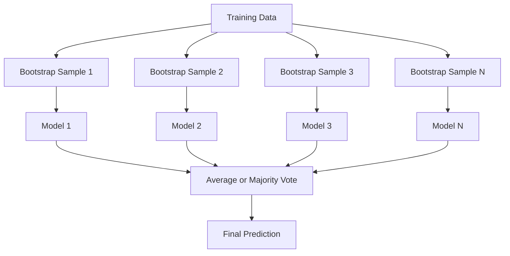
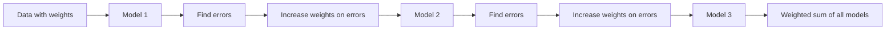
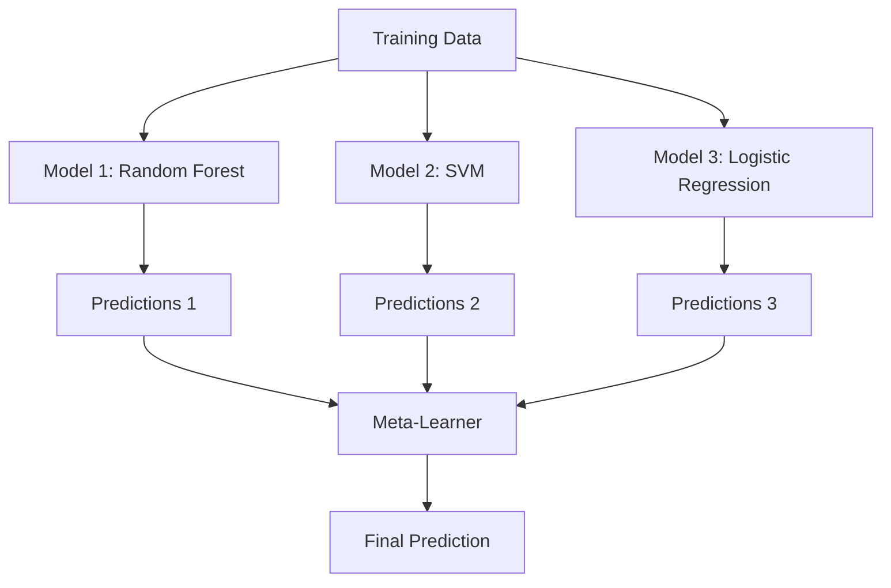

# تجميع الطرق
# 集成方法


> مجموعة من المتعلمين الضعفاء، إذا تم دمجها بشكل صحيح، يصبح متعلم قوي. هذه ليست استعارية. إنها نظرية.

> فـيـنـتـفـرـقـة الـمـتـعلمين، فـيـنـتـفـرـقـة الـمـتعلمين، فـيـنـتـفـرـقـة الـمـتعلمين.

**Type:** Build | **类型：** 构建
**Language:**" بايثون "**语言：**بايثون
**Prerequisites:** Phase 2, Lesson 10 (Bias-Variance Tradeoff) | **前置知识：** Phase 2 第 10 课（偏差-方差权衡）
**Time:** ~120 minutes | **时间：** 约 120 分钟

## أهداف التعلم

- تنفيذ AdaBoost وتعزيز التدفق من الصفر وتشرح كيفية تعزيز التسلسل يقلل من التحيز
  من التحقق من الصفر تعزيز وتحسين التدفقات، شرح تعزيز كيفية تقليل التفاوت
- بناء مجموعة التعبئة وتوضيح كيفية تقليل المتوسطات المتحولة للنموذج دون زيادة التحيز
  构建 集成 集成 展示 平均不相关模型 如何在不增加偏差的情况下减少方差
- مقارنة التعبئة والتحفيز والترتيب من حيث أي مكونات الخطأ تهدف كل طريقة
  مقارنة التعبئة والتعزيز والتعبئة
- تقييم تنوع المجموعة وتفسير لماذا تحسن دقة التصويت الأغلبية مع متعلمين ضعفاء أكثر استقلالية
  قيام التنوع المتكامل، شرح لماذا ارتفاع معدل تحديد الأصوات مع المزيد من آلات التعلم المستنفعة


> **【中文解读】**
> 集成方法组合多个弱模型成一个强模型──包包️随机森林) 降低方差,Boosting(XGBoost) 降低偏差──XGBoost/LightGBM 在 Kaggle 比赛中占据统治地位──金融风控、推系统广泛使用──

> **【拓展：集成方法在 Kaggle 和工业界的主导地位】**
> في مسابقة كاجل هيكلية البيانات، تمكن المجموعة من استخدام 10 أشكال تقريباً 100% من استخدام أسلوب التكامل. تمكن الجائزة النتفليكس من الحصول على 107 نموذج من إضافة الهيكلة. في الصناعة، تمكن نظام التحكم في الرياح من دفع ثمن من استخدام XGBoost + LightGBM للتكامل.

## المشكلة المشكلة المشكلة

شجرة قرار واحدة سريعة التدريب وسهلة التفسير، ولكنها تتجاوز. النموذج الخطي واحد لا يناسب حدود معقدة. يمكنك قضاء أيام في تصميم بنية النموذج المثالية. أو يمكنك دمج مجموعة من النماذج غير الكاملة والحصول على شيء أفضل من أي منهم بشكل فردي.

> 单棵决策树训练快、易解释,但会过拟合――单个线性模型在复杂边界上不合适―― يمكنك قضاء أيام قليلة في تصميم بنية نموذج كاملة، أو جمع مجموعة من الموديلات غير الكاملة، والحصول على نتائج أفضل من أي واحد منها――

تقارير الجمع تفعل هذا بالضبط. إنها التقنية الأكثر موثوقية للفوز في مسابقات كاغل على بيانات الجدول ، وهي تعمل على تشغيل معظم أنظمة ML الإنتاجية ، وتوضح التداول بين التباين والفرق في العمل. يقلل التباين. يقلل التزايد من التباين. يتعلم التجميع أي نماذج يجب الوثوق بها في أي مدخلات.

> طريقة التكامل هي بالضبط ما تفعله. فازت بتقنية أكثر موثوقية في منافسة الكاغل لعلامات البيانات، وهي التي تدفع معظم أنظمة ML الإنتاجية، وتظهر بشكل مباشر عمليات توازن الاختلافات الاختلافات الاختلافات الاختلافات الاختلافات الاختلافات الاختلافات الاختلافات الاختلافات الاختلافات الاختلافات الاختلافات الاختلافات الاختلافات الاختلافات الاختلافات الاختلافات الاختلافات الاختلافات الاختلافات الاختلافات الاختلافات الاختلافات الاختلافات الاختلافات الاختلافات الاختلافات الاختلافات الاختلافات الاختلافات الاختلافات الاختلافات الاختلافات الاختلافات الاختلافات الاختلافات الاختلافات الاختلافات الاختلافات الاختلافات الاختلافات الاختلافات الاختلافات الاختلافات الاختلافات الاختلافات الاختلافات الاختلافات الاختلافات الاختلافات الاختلافات الاختلافات الاختلافات الاختلافات الاختلافات الاختلافات الاختلافات الاختلافات الاختلافات الاختلافات الاختلافات الاختلافات الاختلافات الاختلافات الاختلافات الاختلافات الاختلافات الاختلافات الاختلافات الاختلافات الاختلافات الاختلافات الاختلافات الاخير.

> **【中文解读】**
> المبدأ الأساسي لطرق التكامل: إذا ارتكب العديد من النماذج غير الكاملة أخطاء مختلفة، فإن متوسط التنبؤات الخاصة بهم سيكون أكثر دقة. التخزين (مثل الغابة随机森林) من خلال تدريب النماذج المستقلة تأخذ متوسطًا لحد من الفجوة. التعزيز (مثل AdaBoost、GBDT) من خلال تدريبات تسلسلية جعل كل نموذج جديد يصحح الخطأ السابق لتقليل الفجوة. التجميع باستخدام أجهزة التعلم المجموعة من مختلف أنواع النماذج الأساسية.

## المفهوم الأساسي

### لماذا تعمل المجموعات

لنفترض أن لديك N مصنفين مستقلين، كل منهم دقة p > 0.5.

> 假设你有N 个独立分类器,每个准确率为p > 0.5──多数投票的准确率为:

```
P(majority correct) = sum over k > N/2 of C(N,k) * p^k * (1-p)^(N-k)
```

بالنسبة لـ 21 تصنيفًا يبلغ دقة 60٪ لكل منهما ، فإن دقة الأصوات الأغلبية حوالي 74٪. مع 101 تصنيفًا ، يرتفع إلى 84٪. يتم إلغاء الأخطاء عندما تقوم النماذج بخطاء مختلفة.

> 21 ٪ من التصويت المحدد هو 60 ٪ من التصويت المحدد، معدل التصويت المحدد هو 74 ٪.

الاحتياج الرئيسي هو**diversity**إذا كانت جميع النماذج تتعرض لنفس الأخطاء، فإن الجمع بينها لا يساعد على شيء.

> 关键要求是**多样性**إذا كانت جميع النماذج ترتكب نفس الأخطاء، فإن الجمع بينها لا يساعد.

- مجموعة فرعية مختلفة من التدريب (التخلف)
  مختلفة عن التدريبات
- مجموعة فرعية مختلفة من الميزات (غابات عشوائية)
  مختلفة عن خصائص الجو
- تصحيح الخطأ التالي (تعزيز)
  顺序错误纠正(تعزيز)
- عائلات النماذج المختلفة (الترتيب)
  مختلفة عن النموذج

### التجميع (التجميع من الشريط)

يخلق التعبئة التنوع عن طريق تدريب كل نموذج على عينة مختلفة من بيانات التدريب.

> التعبئة من خلال كل نموذج مختلف للتدريب على كل نموذج لخلق التنوع.



يتم رسم عينة منقطعة التشغيل مع استبدال من البيانات الأصلية ، نفس الحجم من الأصلي. حوالي 63.2% من العينات الفريدة تظهر في كل قطعة التشغيل. يقدم الباقي 36.8% (عينات خارج الحقيبة) مجموعة التحقق المجانية.

> تم استخراج نموذج بوتستراب من البيانات الأصلية، والتي هي نفسها، والتي هي نفسها. تمثل 63.2% من النموذج الوحيد في كل بوتستراب.

يقلل التعبئة من التباين دون زيادة التحيزات كثيرا. كل شجرة فردية تتجاوز عينتها من الشريط الناشئ، ولكن التجاوز مختلف لكل شجرة، لذلك يُلغي متوسط الضوضاء.

> التعبئة في حالة عدم زيادة التمييزات الكثيرة تقليل التمييزات. كل شجرة منفصلة تناسب نموذجها، ولكن كل شجرة تتناسب بشكل مختلف، وبالتالي فإن متوسطها يعكس الضجيج.

**Random Forests**يتم تعديل هذه الميزات مع تدوير إضافي: في كل انقسام، يتم النظر في مجموعة فرعية عشوائية فقط من الخصائص. وهذا يؤدي إلى زيادة التنوع بين الأشجار.`sqrt(n_features)`للتصنيف و`n_features / 3`للعودة

> **随机森林**إضافة إلى مهارة إضافية: في كل فصل، فقط النظر في مجموعة من الصفات العضوية.`sqrt(n_features)`, عاد إلى`n_features / 3`.

### تعزيز (تصحيح الخطأ التسلسلي)

تعزيز نماذج القطارات تسلسلياً. كل نموذج جديد يركز على الأمثلة التي أخطأت فيها النماذج السابقة.

> تعزيز 顺序训练模型──每个新模型关注之前模型弄错的样本──



يقلل تعزيز التوتر. كل نموذج جديد يصحح الأخطاء المنهجية للمجموعة حتى الآن. التنبؤ النهائي هو جمع موازنة لجميع النماذج، حيث تحصل النماذج الأفضل على وزنهما أعلى.

> تعزيز  تقليل التمييز  كل نموذج جديد تصحيح حتى الآن من الجمع الخطأ النظامي والتنبؤ النهائي هو زيادة الوزن من جميع النماذج، والنموذج الأفضل الحصول على الوزن الأعلى

المكافأة: يمكن أن يزداد التكيف إذا قمت بتشغيل الكثير من الجولات، لأنه يواصل تكييف الأمثلة الأصعب، بعضها قد يكون ضجيجا.

> الوزن: إذا كان هناك الكثير من الجولات، قد يكون التزايد أكثر من اللازم، لأنه يستمر في التزايد في نموذج أصعب، بعضها قد يكون ضجيج.

### إدارة

كان AdaBoost (التعزيز التكيفي) أول خوارزمية تعزيز عملية. يعمل مع أي متعلم أساسي ، عادةً أساس القرارات (شجرة عمق-1).

> AdaBoost ((自适应提升) هو أول خوارزمية تحسين عملية.

الخوارزمية:

> 算法流程:

```
1. Initialize sample weights: w_i = 1/N for all i

2. For t = 1 to T:
   a. Train weak learner h_t on weighted data
   b. Compute weighted error:
      err_t = sum(w_i * I(h_t(x_i) != y_i)) / sum(w_i)
   c. Compute model weight:
      alpha_t = 0.5 * ln((1 - err_t) / err_t)
   d. Update sample weights:
      w_i = w_i * exp(-alpha_t * y_i * h_t(x_i))
   e. Normalize weights to sum to 1

3. Final prediction: H(x) = sign(sum(alpha_t * h_t(x)))
```

النماذج التي لديها أخطاء أقل تحصل على ألفا أعلى. العينات التي يتم تصنيفها بشكل خاطئ تحصل على وزنها أعلى حتى النموذج التالي يركز على ذلك.

> النموذج الذي يقل معدل خطأ يحصل على ألفا أعلى. يتم تصنيف النموذج بشكل خاطئ للحصول على وزنه أعلى.

### زيادة تدريجية

تعزيز التدريج يجميع التدريج إلى وظائف الخسارة التعسفية. بدلاً من إعادة وزن العينات، فإنه يتناسب مع كل نموذج جديد إلى بقايا (التدريج السلبي للخسارة) من الجمع الحالي.

> 梯度提升 سوف ترفع وتروج إلى وظيفة الخسارة المتاحة.

```
1. Initialize: F_0(x) = argmin_c sum(L(y_i, c))

2. For t = 1 to T:
   a. Compute pseudo-residuals:
      r_i = -dL(y_i, F_{t-1}(x_i)) / dF_{t-1}(x_i)
   b. Fit a tree h_t to the residuals r_i
   c. Find optimal step size:
      gamma_t = argmin_gamma sum(L(y_i, F_{t-1}(x_i) + gamma * h_t(x_i)))
   d. Update:
      F_t(x) = F_{t-1}(x) + learning_rate * gamma_t * h_t(x)

3. Final prediction: F_T(x)
```

بالنسبة لخسارة الخطأ المربع ، فإن البقايا الزائفة هي البقايا الفعلية فقط: `r_i = y_i - F_{t-1}(x_i)`كل شجرة تطابق حرفياً أخطاء الجمعية السابقة

> بالنسبة للخسائر في الفئة المربعة، فإن الفقرات الفنية هي الفقرات الفعلية:`r_i = y_i - F_{t-1}(x_i)` كل شجرة في الواقع في التجميع قبل التكييف

معدل التعلم (التقلص) يتحكم في مقدار المساهمة لكل شجرة. تتطلب معدلات التعلم الأصغر المزيد من الأشجار ولكن تتعمق بشكل أفضل. القيم النموذجية: 0.01 إلى 0.3.

> معدل التعلم (تقلص) التحكم في كمية مساهمة كل شجرة.

### XGBoost: لماذا يهيمن على بيانات الجدول

XGBoost (eXtreme Gradient Boosting) هو تعزيز التدفق مع تحسينات هندسية تجعله سريع ودقيق ومقاوم للضغط الزائد:

> XGBoost ((极端梯度提升) هو ارتفاع درجة تحسين المنهج، مما يجعل سريعاً

- **Regularized objective:**عقوبات L1 و L2 على أوزان الأوراق تمنع الأشجار الفردية من أن تكون واثقة جدا
  **正则化目标**: حكم الوزن L1 و L2  العقاب لمنع شجرة واحدة من الاعتقاد المفرط
- **Second-order approximation:**يستخدم المشتقات الأولى والثانية للخسارة، مما يمنح أفضل قرارات تقسيم
  **二阶近似**: باستخدام معدل الخسارة من المرحلة الأولى والمرحلة الثانية، إعطاء قرار تقسيم أفضل
- **Sparsity-aware splits:**يتعامل مع القيم المفقودة بشكل طبيعي من خلال تعلم أفضل اتجاه للبيانات المفقودة في كل تقسيم
  **稀疏感知分裂**: التعامل مع غياب البيانات في كل نقطة الانقسام
- **Column subsampling:**مثل الغابات العشوائية، تميز العينات في كل فصلا للتنوع
  **列子采样**مثل الغابات العشوائية، في كل فصل، يتم اختيار خصائص لزيادة التنوع
- **Weighted quantile sketch:**يجد بشكل فعال نقاط الانقسام لميزات مستمرة على البيانات الموزعة
  **加权分位数草图**:高效地 في البيانات الموزعة العثور على نقاط الانقسام من صفات تسلسل
- **Cache-aware block structure:**ترتيب الذاكرة المحسن لخطوط التخزين المتخزين لـ CPU
  **缓存感知块结构**: إعداد الذاكرة المتجهة إلى CPU 缓存行优化

بالنسبة للبيانات الجدولية، فإن XGBoost (ومتحليها LightGBM) يتفوق باستمرار على الشبكات العصبية. هذا لن يتغير في أي وقت قريب. إذا تناسب بياناتك جدولًا يحتوي على صفوف وعمدات، فابدأ بتعزيز التدفق.

> بالنسبة لـ 表格数据،XGBoost (XGBoost) ومركزها LightGBM) دائماً أفضل من شبكة العصبية. في الأجل القصير لن يتغير ذلك.

### التجميع (التعلم المتوسط)

يستخدم التجميع التنبؤات من نماذج أساسية متعددة كميزات للمتعلّم المتحول.

> التجميع سوف يستخدم توقعات العديد من النماذج الأساسية كخصائص للجهاز التعلمي.



يتعلم المتعلم الأساسي ما النموذج الأساسي الذي يجب الوثوق به من أجل أي مدخلات. إذا كانت الغابة العشوائية أفضل في مناطق معينة والسي.إف.م في مناطق أخرى، سيتعلم المتعلم التعلمي التوجيه وفقا لذلك.

> إذا كان الحد الأساسي من الغابات أفضل في بعض المناطق، فإن السويم أفضل في المناطق الأخرى، فإن الحد الأساسي من الحد الأساسي من الحد الأساسي من الحد الأساسي من الحد الأساسي من الحد الأساسي من الحد الأساسي من الحد الأساسي من الحد الأساسي من الحد الأساسي من الحد الأساسي من الحد الأساسي من الحد الأساسي من الحد الأساسي من الحد الأساسي من الحد الأساسي من الحد الأساسي من الحد الأساسي من الحد الأساسي من الحد الأساسي من الحد الأساسي من الحد الأساسي من الحد الأساسي من الحد الأساسي من الحد الأساسي من الحد الأساسي من الحد الأساسي من الحد الأساسي من الحد الأساسي من الحد الأساسي.

لتجنب تسرب البيانات، يجب إنشاء التنبؤات النموذج الأساسي عن طريق التحقق من التحقق من التحقق من التحقق من التحقق من التحقق من التحقق من التحقق من التحقق من التحقق من التحقق من التحقق من التحقق من التحقق من التحقق من التحقق من التحقق من التحقق من التحقق من التحقق من التحقق من التحقق من التحقق من التحقق من التحقق من التحقق من التحقق من التحقق من التحقق من التحقق من التحقق من التحقق من التحقق من التحقق من التحقق من التحقق من التحقق من التحقق من التحقق من التحقق من التحقق من التحقق من التحقق من التحقق من التحقق من التحقق من التحقق من التحقق من التحقق من التحقق من التحقق من التحققق من التحققق من التحققق من التحقققق من التحقققق من التحققققق من التحقققق من التحققققق من التحقققققق من التحقققققق.

> لتجنب تسريب البيانات، يجب أن يكون التنبؤ على النموذج الأساسي من خلال عملية التدريب على مجموعة التدريبات.

### التصويت

أسهل مجموعة، فقط مزج التنبؤات مباشرة

> أسهل مجموعات

- **Hard voting:**التصويت الأغلبية على علامات الفصل
  **硬投票**: للتصويت على الصفحة
- **Soft voting:**متوسط الاحتمالات المتوقعة، اختر الفئة ذات أعلى احتمالات متوسط عادة أفضل لأنه يستخدم معلومات الثقة.
  **软投票**: متوسط احتمال التنبؤ، اختيار متوسط احتمال أعلى الفئة. عادة أفضل لأنه يستخدم المعلومات الثقة.

## بناء ذلك تحرك لتحقيق

> **【中文解读】**
> من التنفيذ ثلاث طرق تجميع: التعبئة(并行训练独立模型取平均)、AdaBoost(串行训练加权投票)、Gradient Boosting(串行训练纠正残差)。
```figure
f3-ensemble-average
```

## بناءها

### الخطوة الأولى: القرار (المعلم الأساسي)

الرمز في`code/ensembles.py`يطبق كل شيء من الصفر. نبدأ مع جذع قرار: شجرة مع شق واحد.

> `code/ensembles.py`نحن نبدأ من شجرة القرار: شجرة واحدة فقط تفرق.

```python
class DecisionStump:
    def __init__(self):
        self.feature_idx = None
        self.threshold = None
        self.polarity = 1
        self.alpha = None

    def fit(self, X, y, weights):
        n_samples, n_features = X.shape
        best_error = float("inf")

        for f in range(n_features):
            thresholds = np.unique(X[:, f])
            for thresh in thresholds:
                for polarity in [1, -1]:
                    pred = np.ones(n_samples)
                    pred[polarity * X[:, f] < polarity * thresh] = -1
                    error = np.sum(weights[pred != y])
                    if error < best_error:
                        best_error = error
                        self.feature_idx = f
                        self.threshold = thresh
                        self.polarity = polarity

    def predict(self, X):
        n = X.shape[0]
        pred = np.ones(n)
        idx = self.polarity * X[:, self.feature_idx] < self.polarity * self.threshold
        pred[idx] = -1
        return pred
```

### الخطوة الثانية: إضافة AdaBoost من الصفر

```python
class AdaBoostScratch:
    def __init__(self, n_estimators=50):
        self.n_estimators = n_estimators
        self.stumps = []
        self.alphas = []

    def fit(self, X, y):
        n = X.shape[0]
        weights = np.full(n, 1 / n)

        for _ in range(self.n_estimators):
            stump = DecisionStump()
            stump.fit(X, y, weights)
            pred = stump.predict(X)

            err = np.sum(weights[pred != y])
            err = np.clip(err, 1e-10, 1 - 1e-10)

            alpha = 0.5 * np.log((1 - err) / err)
            weights *= np.exp(-alpha * y * pred)
            weights /= weights.sum()

            stump.alpha = alpha
            self.stumps.append(stump)
            self.alphas.append(alpha)

    def predict(self, X):
        total = sum(a * s.predict(X) for a, s in zip(self.alphas, self.stumps))
        return np.sign(total)
```

### الخطوة الثالثة: تعزيز التدريجية من الصفر

```python
class GradientBoostingScratch:
    def __init__(self, n_estimators=100, learning_rate=0.1, max_depth=3):
        self.n_estimators = n_estimators
        self.lr = learning_rate
        self.max_depth = max_depth
        self.trees = []
        self.initial_pred = None

    def fit(self, X, y):
        self.initial_pred = np.mean(y)
        current_pred = np.full(len(y), self.initial_pred)

        for _ in range(self.n_estimators):
            residuals = y - current_pred
            tree = SimpleRegressionTree(max_depth=self.max_depth)
            tree.fit(X, residuals)
            update = tree.predict(X)
            current_pred += self.lr * update
            self.trees.append(tree)

    def predict(self, X):
        pred = np.full(X.shape[0], self.initial_pred)
        for tree in self.trees:
            pred += self.lr * tree.predict(X)
        return pred
```

### الخطوة الرابعة: مقارنة مع السكلارن

يُحقق الرمز أن عملياتنا التنفيذية من الصفر تنتج دقة مماثلة لتدقيقات شركة Skelarn `AdaBoostClassifier`و`GradientBoostingClassifier`، ويقارن جميع الطرق جنبا إلى جنب

> كود إثبات أننا ننجز من الصفر`AdaBoostClassifier`和 `GradientBoostingClassifier`معدل التأكد المماثل، وموازنة جميع الطرق.

## استخدمها في إطار التنفيذ

### متى تستخدم كل طريقة

> كيف تستخدم كل طريقة

| Method | Reduces | Best for | Watch out for |
|--------|---------|----------|---------------|
| Bagging / Random Forest | Variance | Noisy data, many features | Does not help with bias |
| AdaBoost | Bias | Clean data, simple base learners | Sensitive to outliers and noise |
| Gradient Boosting | Bias | Tabular data, competitions | Slow to train, easy to overfit without tuning |
| XGBoost / LightGBM | Both | Production tabular ML | Many hyperparameters |
| Stacking | Both | Getting last 1-2% accuracy | Complex, risk of overfitting meta-learner |
| Voting | Variance | Quick combination of diverse models | Only helps if models are diverse |

| 方法 | 减少 | 最适合 | 注意事项 |
|------|------|--------|---------|
| Bagging / 随机森林 | 方差 | 噪声数据、多特征 | 不能帮助偏差 |
| AdaBoost | 偏差 | 干净数据、简单基学习器 | 对异常值和噪声敏感 |
| 梯度提升 | 偏差 | 表格数据、竞赛 | 训练慢、不调参容易过拟合 |
| XGBoost / LightGBM | 两者 | 生产表格 ML | 超参数多 |
| Stacking | 两者 | 获取最后 1-2% 准确率 | 复杂、元学习器有过拟合风险 |
| Voting | 方差 | 快速组合多样模型 | 模型不多样时无帮助 |

### كومة الإنتاج للبيانات الجدولية

بالنسبة لمعظم مشاكل التنبؤ الجدولي، هذا هو الترتيب لمحاولة:

> بالنسبة لمعظم مشاكل التوقعات، هذا هو التسلسل التجريبي:

1. **LightGBM or XGBoost**مع المعايير الافتراضية
   **LightGBM 或 XGBoost**استخدام الاختيارات
2. تحديد المقياسات، معدل التعلم، أعمق الحد الأقصى، وزن الطفل
   调优 n_estimators、تعلم_متعدد、أقصى_عمق、أقصر_وزن الطفل
3. إذا كنت بحاجة إلى 0.5% الأخيرة، بناء مجموعة التراكم مع 3-5 نماذج متنوعة
   إذا كنت بحاجة إلى 0.5% الأخيرة، بناء 3-5 多样模型 من التجميع
4. استخدم التحقق المتقاطع في جميع أنحاء
   全程使用交叉验证

الشبكات العصبية على البيانات الجدولية هي تقريبا دائما أسوأ من تعزيز التراجع، على الرغم من محاولات البحث المستمرة. تتطابق TabNet، NODE، وأثناءها بعض الأحيان، ولكن نادرا ما تضرب XGBoost المنسقة جيدا.

> على الرغم من محاولات البحث المستمرة، فإن شبكات العصبية لا تتحسن بشكل كبير على البيانات الموضحة.

## أرسلها .

هذا الدرس يُنتج`outputs/prompt-ensemble-selector.md`-- طلب لمساعدتك على اختيار طريقة الجمع الصحيح لمجموعة بيانات معينة. وصف بياناتك (القياس، أنواع الميزات، مستوى الضوضاء، توازن الفصول) والمشكلة التي تحلها. يستمر طلب المرور عبر قائمة التحقق من القرارات، ويوصي بطريقة، ويقترح بدء المعايير المفرطة، ويحذر من الأخطاء الشائعة لهذا الطرق. كما ينتج `outputs/skill-ensemble-builder.md`مع دليل اختيار كامل

> 本课产出 `outputs/prompt-ensemble-selector.md` كلمة تُساعدك في اختيار طريقة التكامل الصحيحة لمجموعة بيانات معينة.  توصيف بياناتك ((الجزء الكبير من نوع الصوت، مستوى الضوضاء، توازن الصوت) والمسألة التي تحل بها.`outputs/skill-ensemble-builder.md`,包含完整选择指南──

## تمارين التدريب

1. تعديل تنفيذ AdaBoost لتتبع دقة التدريب بعد كل جولة. دقة الخطة مقابل عدد من المقدرات. متى يتقارب؟
   1. 修改 AdaBoost 实现在每轮后追踪训练准确率──绘制准确率 vs 估计器数量──何时收?

2. تنفيذ غابة عشوائية من الصفر عن طريق إضافة ميزة عشوائية مناقشة إلى شجرة التراجعة. تدريب 100 شجرة مع `max_features=sqrt(n_features)`و متوسط التنبؤات. مقارنة تخفيض التباين مع شجرة واحدة.
   2. من التحقق من الغابات: إضافة خصائص في الأشجار في العودة`max_features=sqrt(n_features)`, متوسط التوقعات.

3. في تنفيذ تعزيز التراجع، أضف التوقف المبكر: تتبع فقدان التحقق من التحقق بعد كل جولة وتوقف عندما لا تتحسن لمدة 10 جولات متتالية. كم عدد الأشجار التي تحتاج إليها في الواقع؟
   3. في التطور التدريجي في تحقيق إضافة التوقف المبكر: في كل جولة بعد التتبع التحقق من الخسارة، وترتيب 10 جولات لا تحسن في التوقف.

4. بناء مجموعة التجميع مع ثلاثة نماذج أساسية (التراجع اللوجستي ، شجرة القرار ، k أقرب جيران) و متاهل التراجع اللوجستي. استخدم التحقق من التحقق من التحقق من التمييز الخمس مرات لتوليد الميزات الأساسية. مقارنة كل نموذج أساسي وحده.
   4. 构建三个基础模型(逻辑归归、决策树、KNN) وحدة منطقية归归元学习器的堆积集成──使用5折交叉验证生成元特征──与每个基础模型单独比较──

5. إضافة إلى ذلك، قم بتشغيل XGBoost على نفس مجموعة البيانات مع معايير افتراضية. مقارنة دقةها بزيادة تراجيعك من الصفر. وقت كلتا. ما هو اختلاف السرعة؟
   5. في نفس المجموعة البيانية، يتم تشغيل XGBoost باستخدام العناصر الافتراضية.

> **【中文解读】**
> تدريبات: تدريبات: تدريبات: تدريبات: تدريبات: تدريبات: تدريبات: تدريبات: تدريبات: تدريبات: تدريبات: تدريبات: تدريبات: تدريبات: تدريبات: تدريبات: تدريبات: تدريبات: تدريبات: تدريبات: تدريبات: تدريبات: تدريبات: تدريبات: تدريبات: تدريبات: تدريبات: تدريبات: تدريبات: تدريبات: تدريبات: تدريبات: تدريبات: تدريبات: تدريبات: تدريبات: تدريبات: تدريبات: تدريبات: تدريبات: تدريبات: تدريبات: تدريبات: تدريبات: تدريبات: تدريبات: تدريبات: تدريبات: تدريبات: تدريبات: تدريبات: تدريبات: تدريبات: تدريبات: تدريبات: تدريبات: تدريبات: تدريبات: تدريبات: تدريبات: تدريبات: تدريبات: تدريبات: تدريبات: تدريبات: تدريبات: تدريبات: تدريبات: تدريبات: تدريبات: تدريبات: تدريبات: تدريبات: تدريبات: تدريبات: تدريبات: تدريبات: تدريبات: تدريبات: تدريبات: تدريبات: تدريبات: تدريبات: تدريبات: تدريبات: تدريبات: تدريبات: تدريبات: تدريبات: تدريبات: تدريبات: تدريبات: تدريبات: تدريبات: تدريبات: تدريبات: تدريبات: تدريبات: تدريبات: تدريبات: تدريبات: تدريبات: تدريبات: تدريبات: تد تد تد تد تدريبات: تد تد تد تد تد تد تد تد تد تد تد تدريبات: تد تدير: تد تد تد تد تد تد تد تد تد تد تد تد تد تد تد تد تد تد تد تد تد تد تد تد تد تد تد تد تد تد تد تدريبات: تد تد تد تد تد تد تد تد تد تد تد تد تد تد تد تد تد تد تد تد تد تد تد تد تد تد تد تد تد تد تد تد

> **【拓展：XGBoost、LightGBM、CatBoost——梯度提升树三巨头】**
> XGBoost(eXtreme Gradient Boosting) تم تطويره في عام 2014 من قبل Chen天奇، وقدم تقليديات 稀疏数据处理和并行计算، أصبح كاغل 竞赛标配工具. LightGBM(Microsoft,2017) باستخدام استراتيجية التقسيم والنمو في الأوراق المباشرة على أساس الورق.

## شروط الرئيسية

| Term | What people say | What it actually means |
|------|----------------|----------------------|
| Bagging | "Train on random subsets" | Bootstrap aggregating: train models on bootstrap samples, average predictions to reduce variance |
| Boosting | "Focus on hard examples" | Train models sequentially, each correcting errors of the ensemble so far, to reduce bias |
| AdaBoost | "Reweight the data" | Boosting via sample weight updates; misclassified points get higher weight for the next learner |
| Gradient boosting | "Fit the residuals" | Boosting via fitting each new model to the negative gradient of the loss function |
| XGBoost | "The Kaggle weapon" | Gradient boosting with regularization, second-order optimization, and systems-level speed tricks |
| Stacking | "Models on top of models" | Use predictions of base models as input features for a meta-learner |
| Random forest | "Many randomized trees" | Bagging with decision trees, adding random feature subsampling at each split for diversity |
| Ensemble diversity | "Make different mistakes" | Models must be uncorrelated in their errors for the ensemble to improve over individuals |
| Out-of-bag error | "Free validation" | Samples not in a bootstrap draw (~36.8%) serve as a validation set without needing a holdout |

## المزيد من القراءة

- [Schapire & Freund: Boosting: Foundations and Algorithms](https://mitpress.mit.edu/9780262526036/)-- الكتاب من قبل مؤلفي AdaBoost
  [Schapire & Freund: Boosting: Foundations and Algorithms](https://mitpress.mit.edu/9780262526036/)- إدارة المبدعين
- [Friedman: Greedy Function Approximation: A Gradient Boosting Machine (2001)](https://statweb.stanford.edu/~jhf/ftp/trebst.pdf)-- ورقة تعزيز التراجع الأصلية
  [Friedman: Greedy Function Approximation: A Gradient Boosting Machine (2001)](https://statweb.stanford.edu/~jhf/ftp/trebst.pdf)- 梯度提升 مقال أساسي
- [Chen & Guestrin: XGBoost (2016)](https://arxiv.org/abs/1603.02754)-- ورقة XGBoost
  [Chen & Guestrin: XGBoost (2016)](https://arxiv.org/abs/1603.02754)- XGBoost 论文
- [Wolpert: Stacked Generalization (1992)](https://www.sciencedirect.com/science/article/abs/pii/S0893608005800231)- الورق الأصلي للدقة
  [Wolpert: Stacked Generalization (1992)](https://www.sciencedirect.com/science/article/abs/pii/S0893608005800231)- التجميع
- [scikit-learn Ensemble Methods](https://scikit-learn.org/stable/modules/ensemble.html)-- المرجع العملي
  [scikit-learn 集成方法](https://scikit-learn.org/stable/modules/ensemble.html)- 实用参考
