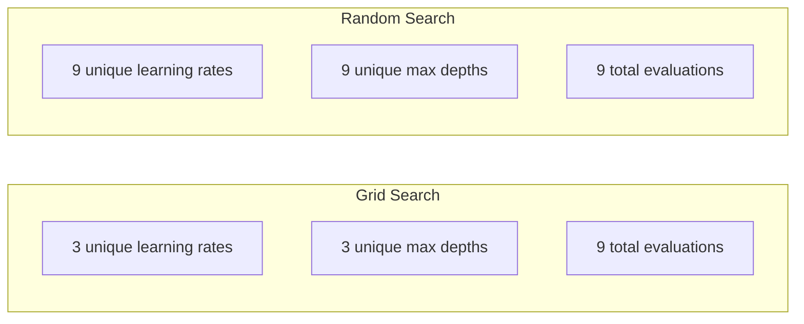
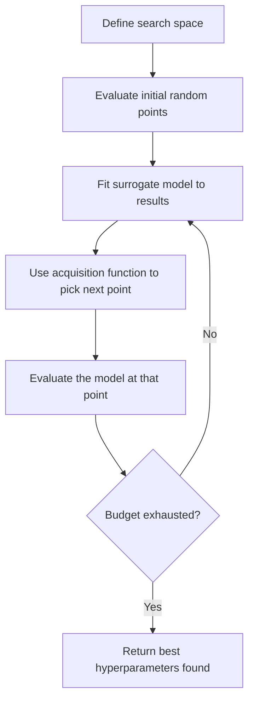
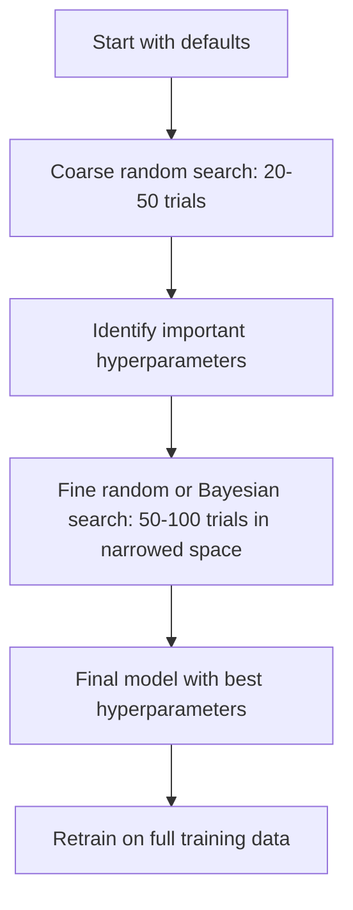
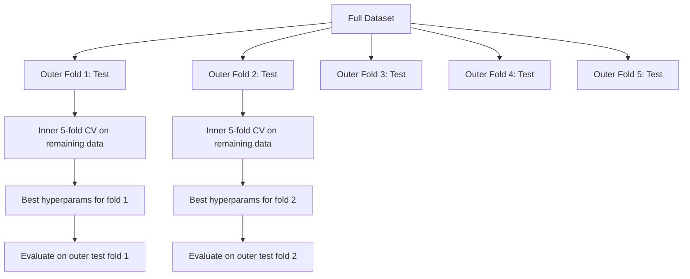

# التنسيق بين المعلمين
# 超参数调优


> المعلمات المعدنية هي المفاتيح التي تقوم بتحويلها قبل بدء التدريب، وتحويلها بشكل جيد هو الفرق بين نموذج متوسط ومثالي.

> الـ 超参数 هو التدريب البداية قبل أن تتمكن من تحريكها.

**Type:** Build | **类型：** 构建
**Language:**" بايثون "**语言：**بايثون
**Prerequisites:** Phase 2, Lesson 11 (Ensemble Methods) | **前置知识：** Phase 2 第 11 课（集成方法）
**Time:** ~90 minutes | **时间：** 约 90 分钟

## أهداف التعلم

- تنفيذ بحث الشبكة والبحث العشوائي وتحسين البايسية من الصفر ومقارنة كفاءة العينات
  من التطبيقات التنفيذية للبحث على شبكة الإنترنت، والبحث المتسع وتحسين البيليس، مقارنة كفاءة العينات
- شرح لماذا البحث العشوائي يفوق البحث عن الشبكة عندما يكون لدى معظم المعلمات المضادة أبعاد فعالة منخفضة
   شرح لماذا البحث المتزايد في معظم العناصر الفائقة فعالة درجة منخفضة وقت أفضل من البحث الشبكي
- بناء حلقة تحسين بايزية باستخدام نموذج بديل و وظيفة الاستحواذ لتوجيه البحث
  استخدام النموذج وكيل و وظيفة الاستخدام بناء حلقة تحسين البحث
- تصميم استراتيجية ضبط المعلمات المفرطة التي تتجنب التكيف المفرط مع مجموعة التحقق من التحقق من التحقق من التحقق من التحقق من التحقق من التحقق من التحقق من التحقق من التحقق من التحقق من التحقق من التحقق من التحقق من التحقق من التحقق من التحقق من التحقق من التحقق من التحقق من التحقق من التحقق من التحقق من التحقق من التحقق من التحقق من التحقق من التحقق من التحقق من التحقق من التحقق من التحقق من التحقق من التحقق من التحقق من التحقق من التحقق من التحقق من التحقق من التحقق من التحقق من التحقق من التحقق من التحقق من التحقق من التحقق من التحقق من التحقق من التحقق من التحقق من التحقق.
  تصميم من خلال التقييمات المختلفة لتجنب التقييمات المتناسبة


> **【中文解读】**
> العوامل الفائقة هي العوامل المحددة قبل تدريب النموذج مثل معدل التعلم  عمق الشجر) ، لا يمكن أن تتعلم من البيانات                                                                                                                                                                                                                                          

> **【拓展：超参数调优在大模型训练中的重要性】**
> يتضمن تدريب GPT-4 عشرات العناصر الفائقة (تعديل معدل التعلم ٬ حجم المجموعة ٬ انخفاض الوزن ٬ معدل الانخفاض ٬ وما إلى ذلك) ، وتكلفة التدريب الكامل حوالي 1 مليار دولار ، مستحيل باستخدام البحث على شبكة الإنترنت ٬ استخدام OpenAI باستخدام تحسين البيليس وتعديل تجربة على أساس تجربة صغيرة سابقة لتحديد العناصر الفائقة ٬ بالنسبة إلى نموذج GPT 类 ، تعديل معدل التعلم ٬ حرارة + تدهور الكويسين) يُعتبر أحد أهم اختيار العناصر الفائقة.

## المشكلة المشكلة المشكلة

نموذج تعزيز التدفق لديك لديه معدل التعلم وعدد الأشجار ، أعمق أقصى ، أقل عينات لكل ورقة ، نسبة النموذج الفرعي ، ونسبة عينات العمود. وهذا هو ستة مفاصيل. إذا كان لكل منها 5 قيم معقولة ، فإن الشبكة لديها 5^6 = 15,625 مزيج. يستغرق التدريب لكل منها 10 ثوان. وهذا هو 43 ساعة من الحساب لمحاولة كل منهم.

> نموذج التطوير التدريجي لديك معدل التعلم ̇ عدد الأشجار ̇ أعمق أعمق أعماق ̇ الحد الأدنى من النماذج ̇ معدل الاختبار والامتثال ̇ معدل الاختبار ̇ معدل الاختبار ̇ معظم الاختبارات ̇ معظم الاختبارات ̇ معظم الاختبارات ̇ معظم الاختبارات ̇ معدل الاختبار ̇ معدل الاختبار ̇ معدل الاختبار ̇ معدل الاختبار ̇ معدل الاختبار ̇ معدل الاختبار ̇ معدل الاختبار ̇ معدل الاختبار ̇ معدل الاختبار ̇ معدل الاختبار ̇ معدل الاختبار ̇ معدل الاختبار ̇ معدل الاختبار ̇ معدل الاختبار ̇ معدل الاختبار ̇ معدل الاختبار ̇ معظم الاختبار ̇ معدل الاختبار ̇ معظم الاختبار ̇ معظم الاختبار ̇ معظم الاختبار ̇ معظم الاختبار ̇ معظم الاختبار ̇ معظم ̇ معظم ̇ معظم ̇ معظم ̇ معظم ̇ معظم ̇ معظم ̇ معظم ̇ معظم ̇ معظم ̇ معظم ̇ معظم ̇ معظم ̇ معظم ̇ معظم ̇ معظم ̇ معظم ̇ معظم ̇ ̇ معظم ̇ ̇ ̇ مع ̇ ̇ ̇ ̇ ̇ ̇ ̇ ̇ ̇ ̇ ̇ ̇ ̇ ̇ ̇ ̇ ̇ ̇ ̇ ̇ ̇ ̇ ̇ ̇ ̇ ̇ ̇ ̇ ̇ ̇ ̇ ̇ ̇ ̇ ̇ ̇ ̇ ̇ ̇ ̇ ̇ ̇ ̇ ̇ ̇ ̇ ̇ ̇ ̇ ̇ ̇ ̇ ̇ ̇ ̇ ̇ ̇ ̇ ̇ ̇ ̇ ̇ ̇ ̇ ̇ ̇ ̇ ̇ ̇ ̇ ̇ ̇ ̇ ̇ ̇ ̇ ̇ ̇ ̇ ̇ ̇ ̇ ̇ ̇ ̇ ̇

البحث عن الشبكة هو النهج الواضح وأسوأ منهج على نطاق واسع. البحث العشوائي يعمل بشكل أفضل مع أقل حسابات. تحسين البايزيون يعمل بشكل أفضل حتى من خلال التعلم من التقييمات السابقة. معرفة أي استراتيجية لاستخدامها، وأي مفاتيح فائقة أهمية في الواقع، يوفر أيام من وقت GPU مضيعة.

>  البحث على شبكة الإنترنت هو الطريقة الواضحة ، وهي أسوأ طريقة تحت الحجم الكبير..‬‬‬‬‬‬‬‬‬‬‬‬‬‬‬‬‬‬‬‬‬‬‬‬‬‬‬‬‬‬‬‬‬‬‬‬‬‬‬‬‬‬‬‬‬‬‬‬‬‬‬‬‬‬‬‬‬‬‬‬‬‬‬‬‬‬‬‬‬‬‬‬‬‬‬‬‬‬‬‬‬‬‬‬‬‬‬‬‬‬‬‬‬‬‬‬‬‬‬‬‬‬‬‬‬‬‬‬‬‬‬‬‬‬‬‬‬‬‬‬‬‬‬‬‬‬‬‬‬‬‬‬‬‬‬‬‬‬‬‬‬‬‬‬‬‬‬‬‬‬‬‬‬‬‬‬‬‬‬‬‬‬‬‬‬‬‬‬‬‬‬‬‬‬‬‬‬‬‬‬‬‬‬‬‬‬‬‬‬‬‬‬‬‬‬‬‬‬‬‬‬‬‬‬‬‬‬‬‬‬‬‬‬‬‬‬‬‬‬‬‬‬‬‬‬‬‬‬‬‬‬‬‬‬‬‬‬‬‬‬‬‬‬‬‬‬‬‬‬‬‬‬‬‬‬‬‬‬‬‬‬‬‬‬‬‬‬‬‬‬‬‬‬‬‬‬‬‬‬‬‬‬‬‬‬‬‬‬‬‬‬‬‬‬‬‬‬‬‬‬‬‬‬‬‬‬‬‬‬‬‬‬‬‬‬‬‬‬‬‬‬‬‬‬‬‬‬‬‬‬‬‬‬‬‬‬‬‬‬‬‬‬‬‬‬‬‬‬‬‬‬‬‬‬‬‬‬‬‬‬‬‬‬‬‬‬‬‬‬‬‬‬‬‬‬‬‬‬‬‬‬‬‬‬‬‬‬‬‬‬‬‬‬‬‬‬‬‬‬‬‬‬‬‬‬‬‬‬‬‬‬‬‬‬‬‬‬‬‬‬‬‬‬‬‬‬‬‬‬‬‬‬‬‬‬‬‬‬‬‬‬‬‬‬‬‬‬‬‬‬‬‬‬‬‬‬‬‬‬‬‬‬‬‬‬‬‬‬‬‬‬‬‬‬‬‬‬‬‬‬‬‬

> **【中文解读】**
> التناقضات الأساسية للتحسينات الفائقة: البحث الفضاء كبير ولكن كل مرة تقييم تكلفة عالية.

## المفهوم الأساسي

### المعلمات مقابل المعلمات المعدنية

يتم تعلم المعايير أثناء التدريب (الوزن والتحيزات والعدوان المقسومة). يتم تعيين المعايير المفرطة قبل بدء التدريب وتحكم في كيفية تطور التعلم.

> 参数在训练中学习(权重、偏置、分裂值)。超参数在训练开始前设定,控制学习如何发生──

| Hyperparameter | What it controls | Typical range |
|---------------|-----------------|---------------|
| Learning rate | Step size per update | 0.001 to 1.0 |
| Number of trees/epochs | How long to train | 10 to 10,000 |
| Max depth | Model complexity | 1 to 30 |
| Regularization (lambda) | Overfitting prevention | 0.0001 to 100 |
| Batch size | Gradient estimation noise | 16 to 512 |
| Dropout rate | Fraction of neurons dropped | 0.0 to 0.5 |

| 超参数 | 控制什么 | 典型范围 |
|--------|---------|---------|
| 学习率 | 每次更新的步长 | 0.001 到 1.0 |
| 树的数量/epoch 数 | 训练多久 | 10 到 10,000 |
| 最大深度 | 模型复杂度 | 1 到 30 |
| 正则化 (lambda) | 防止过拟合 | 0.0001 到 100 |
| 批量大小 | 梯度估计噪声 | 16 到 512 |
| Dropout 率 | 丢弃的神经元比例 | 0.0 到 0.5 |

### البحث عن الشبكة

يُقيّم بحث الشبكة كل مزيج من القيم المحددة. إنه شامل وسهل الفهم، لكنه يتكامل بشكل متكامل مع عدد المعايير العالية.

> 网格搜索评估指定值的每个组合──它尽尽而易于理解,但随着超参数数指数的数级增长──

```
Grid for 2 hyperparameters:

  learning_rate: [0.01, 0.1, 1.0]
  max_depth:     [3, 5, 7]

  Evaluations: 3 x 3 = 9 combinations

  (0.01, 3)  (0.01, 5)  (0.01, 7)
  (0.1,  3)  (0.1,  5)  (0.1,  7)
  (1.0,  3)  (1.0,  5)  (1.0,  7)
```

البحث عن الشبكة له عيوب أساسية: إذا كان أحد المعايير المفرطة مهمة والآخر لا، فإن معظم التقييمات ضائعة. تحصل على 3 قيم فريدة فقط من المعايير المهمة من 9 تقييمات.

> هناك نقص أساسي في البحث: إذا كان أحد العناصر الفائقة مهمة والآخر غير مهم، فإن معظم التقييمات ضاعت.

### البحث العشوائي

البحث العشوائي عن عينات المياه المفرطة من التوزيعات بدلا من الشبكة. مع نفس الميزانية من 9 تقييمات، تحصل على 9 قيم فريدة من كل ميزانية المفرطة.

> في نفس الميزانية التي تم تقييمها 9 مرات، تحصل على 9 قيمة فريدة لكل عنصر فائق.



لماذا ضرب الاختيار عشوائي الشبكة (برغسترا و بينجيو ، 2012):

> لماذا随机优于网格 ((برغسترا و بينجيو ، 2012):

- معظم المعلمات العالية لديها نطاق فعال منخفض. فقط 1-2 من 6 المعلمات العالية عادة ما تكون مهمة لمشكلة معينة.
  معظم العناصر الفائقة من الدرجة الفعالة منخفضة.
- تقييمات النفايات في الشبكة على أبعاد غير مهمة.
  网格搜索在不重要维度上浪费评估──
- البحث العشوائي يغطي الأبعاد المهمة بشكل كثيف لميزانية واحدة.
  随机搜索在同样的预算下更密集地覆盖重要维度──
- في 60 تجربة عشوائية، لديك فرصة 95% للعثور على نقطة ضمن 5% من الإيجابية (إذا كان هناك واحد في مساحة البحث).
  في 60 مرة في تجربة عشوائية، لديك احتمال 95% لتحديد أفضل النقاط من 5% إلى قيمة أخرى إذا كان هناك أفضل النقاط في مساحة البحث)

### تحسين البايزية

البحث العشوائي يتجاهل النتائج. لا يتعلم أن معدلات التعلم العالية تسبب الانحراف أو أن العمق 3 يتجاوز العمق 10 بشكل متسق. تستخدم تحسين البايزية التقييمات السابقة لتحديد أين تبحث بعد ذلك.

> 随机搜索忽略结果──它不会学到高学习率导致发散或深度 3 总是优于深度 10──贝叶斯优化利用过去的评估来决定下一步搜索哪里──



المكونين الأساسيين:

**Surrogate model:**نموذج رخيص للتقييم (عادة عملية غوسية) يقترب من الوظيفة الموضوعية الثمينة. فإنه يعطي كل من التنبؤ وتقدير عدم اليقين في أي نقطة في مساحة البحث.

> **代理模型：**نموذج تقييم رخيص (بالمعروفة كعملية كوس) ، وهو وظيفة هدف باهظة الثمن تقريبًا.

**Acquisition function:**يقرر أين يجب تقييمه بعد ذلك من خلال توازن الاستغلال (البحث بالقرب من نقاط الجيد المعروفة) والبحث (البحث حيث يكون هناك عدم اليقين مرتفعًا).

> **采集函数：**通过平衡开发 (搜已知好点附近) و探索 (搜不确定性高的区域) لتحديد الخطوة التالية لتقييم أين:

- **Expected Improvement (EI):**كم من التحسن على أفضل ما لدينا الآن؟
  **期望改进 (EI)：**في هذه النقطة ما هي أفضل النتائج التي نتوقّع تحسينها من الحال؟
- **Upper Confidence Bound (UCB):**التنبؤ بالإضافة إلى مضاعف عدم اليقين، أعلى UCB يعني إما أنّه واعدة أو غير مستكشفة.
  **上置信界 (UCB)：**预测加上不确定性的倍数──更高的UCB يعني أن هناك توقعات أو لم يتم اكتشافها──
- **Probability of Improvement (PI):**ما هي الاحتمالات التي تفوق هذه النقطة أفضل من الحالي؟
  **改进概率 (PI)：**ما هو احتمالية أفضل النتائج الحالية؟

عادة ما يجد التحسين البايسي مفاتيح فائقة أفضل من البحث العشوائي مع 2-5 مرات أقل من التقييمات. التكلفة العامة لتصميم النموذج البديل لا تُعتبر مهملة مقارنة بتدريب النموذج الفعلي.

> عادة ما تستخدم تحسين بيليس عدد أقل من 2-5 مرات من حالات التقييم للعثور على أفضل العوامل فوق العوامل من البحث العادي. يمكن تجاهل تكلفة النموذج الملائم مع النموذج الواقعي المتدرب.

> **【中文解读】**
> تعزيز "بحث منطقة غير معروفة" و"استخدام منطقة جيدة معروفة") ، بعد كل تقييم تحديث النموذج الوكيل، وتحديد وظيفة التقاط الحكم في نقطة التقييم التالية. بالمقارنة مع البحث السريع، تعزيز "بايس" باستخدام 2-5 مرات أقل من عدد المرات التي يتم فيها تقييمها في العثور على أفضل العوامل الفائقة، بالنسبة للنموذج الذي يتكلف من ارتفاع تكلفة التدريب، ثمناً خاصاً.

> **【拓展：Optuna——自动化超参数调优的工业标准】**
> أوبتونا هو إطار تحسين الخيارات العالية في شبكات المفضلة اليابانية ، يستخدم على نطاق واسع في مجال التسويق والتنمية والتنمية والتنمية والتنمية والتنمية والتنمية والتنمية والتنمية والتنمية والتنمية والتنمية والتنمية والتنمية والتنمية والتنمية والتنمية والتنمية والتنمية والتنمية والتنمية والتنمية والتنمية والتنمية والتنمية والتنمية والتنمية والتنمية والتنمية والتنمية والتنمية والتنمية والتنمية والتنمية والتنمية والتنمية والتنمية والتنمية والتنمية والتنمية والتنمية والتنمية والتنمية والتنمية والتنمية والتنمية والتنمية والتنمية والتنمية والتنمية والتنمية والتنامية والتنامية والتنامية والتنامية والتنامية والتنامية والتنامية والتنامية والتنامية والتنامية.

### التوقف المبكر

ليس كل دورة تدريبية تحتاج إلى الانتهاء. إذا كان التكوين سيئاً بوضوح بعد 10 حقائق، توقفها والتحرك على. هذا هو التوقف المبكر في سياق البحث عن المعلمات العالية.

> ليس كل تدريب يحتاج إلى أن ينجح. إذا كان التنفيذ في 10 أوقات غير جيد بشكل واضح، فلتوقف عن ذلك، وترسل إلى المرحلة التالية.

الاستراتيجيات:
- **Patience-based:**توقف إذا لم تتحسن خسارة التحقق من التحقق من التحقق من التحقق من التحقق من التحقق من التحقق من التحقق من التحقق من التحقق من التحقق من التحقق من التحقق من التحقق من التحقق من التحقق من التحقق من التحقق من التحقق من التحقق من التحقق من التحقق من التحقق من التحقق من التحقق من التحقق من التحقق من التحقق من التحقق من التحقق من التحقق من التحقق من التحقق من التحقق من التحقق من التحقق من التحقق من التحقق من التحقق من التحقق من التحقق من التحقق من التحقق من التحقق من التحقق من التحقق من التحقق من التحقق من التحقق من التحقق من التحقق من التحقق من التحقق من التحقق من التحقق من التحقق من التحققق من التحقق من التحقق من التحقق من التحققق من التحقق من التحقق من التحقق من التحقق من التحقق من التحقق من التحقق من التحقق من التحقق من التحقق من التحقق من التحقق من التحقق من التحقق من التحقق من التحقق.
  **基于耐心：**إذا كان التحقق من الخسارة مستمرة في أي دور لا يتحسن فستوقف
- **Median pruning:**توقف إذا كانت النتيجة المتوسطة للجربة أسوأ من المتوسط من التجارب المكتملة في نفس الخطوة
  **中位数剪枝：**إذا كان متوسط النتيجة من التجربة مقارنة مع الخطوة التي تم إتمام التجربة، فإن الاختلاف في الوسط توقف.
- **Hyperband:**تخصيص ميزانيات صغيرة إلى العديد من التكوينات، ثم زيادة التوازن تدريجيا لأفضل
  **Hyperband：**تخصيص ميزانية صغيرة لعدد كبير من التخصيصات ثم زيادة ميزانية أفضل التخصيصات تدريجيا

إنّ الشبكة العابرة فعالة بشكل خاص. إنها تبدأ 81 تكوينًا مع دورة واحدة لكل منها، وتحتفظ بالثلث الأول، وتعطيهم 3 دورات، وتحتفظ بالثلث الأول، وهكذا. وهذا يجد تكوينات جيدة 10-50 مرة أسرع من تقييم جميع التكوينات للوقت المالي الكامل.

> الـ "هايبر باند" فعال بشكل خاص. يبدأ من 81 إعداد في كل عصر، يحتفظ بالـ "ثلاثة ثمانية، يمنحها ثلاثة ثمانية، يحتفظ بالـ "ثلاثة ثمانية، يقتضي ذلك بتقييم الميزانية الكاملة.

### المخططات المعدلة للتعلم

معدل التعلم هو دائماً تقريباً أهم المعيار المفرط. بدلاً من الحفاظ عليه ثابتًا، يقوم المخططون بتعديله أثناء التدريب.

> معدل التعلم هو دائماً أهم العوامل العالية.

| Scheduler | Formula | When to use |
|-----------|---------|-------------|
| Step decay | Multiply by 0.1 every N epochs | Classic CNN training |
| Cosine annealing | lr * 0.5 * (1 + cos(pi * t / T)) | Modern default |
| Warmup + decay | Linear increase then cosine decay | Transformers |
| One-cycle | Increase then decrease over one cycle | Fast convergence |
| Reduce on plateau | Reduce by factor when metric stalls | Safe default |

| 调度器 | 公式 | 何时使用 |
|--------|------|---------|
| 阶梯衰减 | 每 N 个 epoch 乘以 0.1 | 经典 CNN 训练 |
| 余弦退火 | lr * 0.5 * (1 + cos(pi * t / T)) | 现代默认 |
| 预热+衰减 | 线性增加后余弦衰减 | Transformer |
| 单周期 | 一个周期内先增后减 | 快速收敛 |
| 平台期衰减 | 指标停滞时按因子减小 | 安全默认 |

### أهمية المعلمات العالية

لا تُعتبر جميع المعايير المضادة ذات أهمية متساوية. أبحاث الغابات العشوائية (Probst et al., 2019) وتعزيز التدفقات تظهر أنماط متسقة:

> ليس كل العناصر الفائقة هي ذات الأهمية.

**High importance:**
- معدل التعلم (أول مرة دائماً)
  學习率 ((始终首先调优)
- عدد المقدرات / الفترات (استخدم التوقف المبكر بدلاً من ضبط)
  قدر عدد الجهاز / عصر 数(用早停代替调优)
- قوة التنظيم
  قوة العادة

**Medium importance:**
- أعمق أقصى / عدد الطبقات
  أعلى أعمق / 层数
- أرقام صغيرة لكل ورقة / تفكك الوزن
  叶节点最小样本数 / 权重衰减
- نسبة النموذج الفرعي
  نسبة الاختيار

**Low importance:**
- ميزات أقصى (للاغابات العشوائية)
  أعظم خصائص (صورة)
- اختيار وظيفة التفعيل المحددة
  具体激活函数选择
- حجم اللحظة (في نطاق معقول)
  批量大小(在合理范围内)

أجهز الأهم أولاً، وترك البقية في الاختيارات الافتراضية.

> أولاً، والأهمية، والباقي أن يبقى متأثر.

### استراتيجية عملية



سير العمل الملموس:

> 具体工作流:

1. **Start with library defaults.**يتم اختيارها من قبل ممارسين ذوي الخبرة وغالبا ما تكون 80٪ من الطريق إلى هناك.
   **从库默认值开始。**يتم اختيارها من قبل ممارسي الخبرة، وعادة ما يصل إلى 80% من النتائج.
2. **Coarse random search.**مجموعة واسعة، 20-50 تجربة، استخدم التوقف المبكر لقتل السوء سريعا.
   **粗粒度随机搜索。**宽范围,20-50 次试试――用早停快速终止差的运行――
3. **Analyze results.**أي معايير فائقة تتصل بالأداء؟ ضيق مساحة البحث.
   **分析结果。**ما هي العوامل العالية المتعلقة بالقدرة على البحث؟
4. **Fine search.**تحسين (بايز) أو البحث العشوائي المركز في الفضاء الضيق 50-100 تجربة
   **精细搜索。**في المجال المختصر يستخدم البيليس تحسين أو تركيز مع البحث. 50-100 مرة تجربة.
5. **Retrain on all training data**مع أفضل المعايير المفرطة وجدت.
   باستخدام أفضل العوامل فوق العوامل**所有训练数据上重新训练**.

### التكامل بين التحققات المتقاطعة

تكييف المعايير العابرة على شق واحد للتحقق من التحقق من التحقق من التحقق من التحقق من التحقق من التحقق من التحقق من التحقق من التحقق من التحقق من التحقق من التحقق من التحقق من التحقق من التحقق من التحقق من التحقق من التحقق من التحقق من التحقق من التحقق من التحقق من التحقق من التحقق من التحقق من التحقق من التحقق من التحقق من التحقق من التحقق من التحقق من التحقق من التحقق من التحقق من التحقق من التحقق من التحقق من التحقق من التحقق من التحقق من التحقق من التحقق من التحقق من التحقق من التحقق من التحقق من التحقق من التحقق من التحقق من التحقق من التحقق من التحقق من التحقق من التحقق من التحقق من التحقق من التحقق من التحققق من التحققق من التحققق من التحققق من التحقققق من التحققق من التحقققق من التحقققق من التحققققق من التحقققق من التحققققق من التحققققق من التحقققققق من الت:

> في التقسيم التجاري الوحيد هناك خطر. أفضل العوامل المحتملة للتجربة المحددة.

- **Outer loop**(التقييم): تقسم البيانات إلى القطار+المتدرب والاختبار.
  **外循环**(قيامة): سيتم تقسيم البيانات إلى تدريب + اختبار وتجربة.
- **Inner loop**(التنسيق): تقسم القطار+ال إلى القطار والقيمة.
  **内循环**(调优):将训练+验证分为训练和验证――找到最佳超参数――



كل طوابق خارجية تجد أفضل المعايير المضادة الخاصة بها بشكل مستقل. النتائج الخارجية هي تقدير غير متحيز لأداء التعميم.

> كل فجوة مستقلة تجد أفضل الفجوة لها.

مع sklearn:

```python
from sklearn.model_selection import cross_val_score, GridSearchCV
from sklearn.ensemble import GradientBoostingRegressor

inner_cv = GridSearchCV(
    GradientBoostingRegressor(),
    param_grid={
        "learning_rate": [0.01, 0.05, 0.1],
        "max_depth": [2, 3, 5],
        "n_estimators": [50, 100, 200],
    },
    cv=5,
    scoring="neg_mean_squared_error",
)

outer_scores = cross_val_score(
    inner_cv, X, y, cv=5, scoring="neg_mean_squared_error"
)

print(f"Nested CV MSE: {-outer_scores.mean():.4f} +/- {outer_scores.std():.4f}")
```

هذا مكلف (5 طوابق خارجية × 5 طوابق داخلية × 27 نقطة شبكة = 675 نموذج يناسب) ، ولكنه يوفر لك تقديرًا موثوقًا للأداء. استخدمه عند تقرير النتائج النهائية في الورق أو عندما تكون المخاطر في القرار مرتفعة.

> هذا مكلف جداً ((5 فجوة خارجية × 5 فجوة داخلية × 27 فجوة = 675 مرة نموذج مناسب) ، لكنه يمنحك تقديرات موثوقة للأداء.

### نصائح مفيدة

**Start with the learning rate.**إنها دائماً أهم مُعايير للمنهج القائم على التراجع. يجعلها معدل التعلم السيئ كل شيء غير ذي صلة. قم بتصميم المُعايير الأخرى في حالات افتراضية وتسحيب معدل التعلم أولاً.

> **从学习率开始。**بالنسبة إلى الطريقة القائمة على التسلسل، فإنه دائماً هو العنصر الفائق الأهم.

**Use log-uniform distributions for learning rate and regularization.**الفرق بين 0.001 و 0.01 مهم بقدر ما الفرق بين 0.1 و 1.0. البحث خطيا نفايات الميزانية على نهاية كبيرة.

> **对学习率和正则化使用对数均匀分布。**الفرق بين 0.001 و 0.01 و الفرق بين 0.1 و 1.0 مهم جدا.

**Use early stopping instead of tuning n_estimators.**لتحسين الشبكات العصبية، حدد n_estimators أو epochs عالية ودع التوقف المبكر يقرر متى يتوقف. هذا يزيل حدة خارقة واحدة من البحث.

> **用早停代替调优 n_estimators。**بالنسبة للتطوير والشبكات العصبية، سوف n_estimators أو العصر 数设高،让早停止决定何时停止── هذا يزيل من البحث عنصر خارق──

**Budget allocation.**إنفق 60% من ميزانية ضبطك على أكبر 2 أهم المعايير المضطربة. إنفق 40% المتبقية على كل شيء آخر. إنّ المجموعة الأولى 2 هي التي تمثل معظم التغيرات في الأداء.

> **预算分配。**ستقوم بتحسين ميزانية 60% على أول 2 عناصر مهمة جدا. أما الباقي 40% فيتم تحديدها على جميع العناصر الأخرى.

**Scale matters.**لا تبحث أبدا عن حجم الحزمة على مقياس السجلات (16, 32, 64 لا بأس به). تبحث دائما عن معدل التعلم على مقياس السجلات. مقارنة توزيع البحث مع كيفية تأثير المعلم المفرط على النموذج.

> **尺度很重要。**永遠不要在數量尺度上搜索批量大小 ((16、32、64 就行) ∼始终在數量尺度上搜索学习率──将搜索分布与超参数影响模型的方式匹配──

| Model Type | Top Hyperparameters | Recommended Search | Budget |
|-----------|--------------------|--------------------|--------|
| Random Forest | n_estimators, max_depth, min_samples_leaf | Random search, 50 trials | Low (fast training) |
| Gradient Boosting | learning_rate, n_estimators, max_depth | Bayesian, 100 trials + early stopping | Medium |
| Neural Network | learning_rate, weight_decay, batch_size | Bayesian or random, 100+ trials | High (slow training) |
| SVM | C, gamma (RBF kernel) | Grid on log scale, 25-50 trials | Low (2 params) |
| Lasso/Ridge | alpha | 1D search on log scale, 20 trials | Very low |
| XGBoost | learning_rate, max_depth, subsample, colsample | Bayesian, 100-200 trials + early stopping | Medium |

**When in doubt:**البحث العشوائي مع 2x عدد المعايير العضوية كالتجارب (على سبيل المثال، 6 المعايير العضوية = 12 + التجارب الحد الأدنى). سوف تتفاجأ كم عدد المرات التي يضرب البحث العشوائي مع 50 تجربة البحث الصفح المصمم بعناية.

> **拿不准时：**随机搜索, 试验数为超参数数的2倍(如 6 超参数 = على الأقل 12 试验) ―― سوف تتفاجأ من 50 试验随机搜索多经常击败精心设计的网格搜索──

## بناء ذلك تحرك لتحقيق

> **【中文解读】**
> من تحقيق التنفيذ في البحث على شبكة التنفيذية، والبحث على شبكة التنفيذية، واستخدام نفس مجموعة البيانات على كفاءة وتأثيرات الثلاثة.

> **【拓展：Hyperband 和 ASHA——大规模超参数搜索的加速器】**
> الفكرة الأساسية لخطوط الهاتف المضاد: أولاً إعطاء الكثير من المخصصات القليل من الموارد (مثل 1 عصر) ، والعمل المختلف، وإعطاء الناجين المزيد من الموارد.
```figure
k-fold-cv
```

## بناءها

### الخطوة الأولى: البحث عن الشبكة من البداية

الرمز في`code/tuning.py`يطبق بحث الشبكة، بحث عشوائي، ومحافظ بييزي بسيط من الصفر.

> `code/tuning.py`البرمجيات المتوسطة من الصفر تنفيذ البحث على شبكة الإنترنت والبحث المزدوج والتحسينات البيهيس البسيطة.

```python
def grid_search(model_fn, param_grid, X_train, y_train, X_val, y_val):
    keys = list(param_grid.keys())
    values = list(param_grid.values())
    best_score = -float("inf")
    best_params = None
    n_evals = 0

    for combo in itertools.product(*values):
        params = dict(zip(keys, combo))
        model = model_fn(**params)
        model.fit(X_train, y_train)
        score = evaluate(model, X_val, y_val)
        n_evals += 1

        if score > best_score:
            best_score = score
            best_params = params

    return best_params, best_score, n_evals
```

### الخطوة الثانية: البحث العشوائي من الصفر

```python
def random_search(model_fn, param_distributions, X_train, y_train,
                  X_val, y_val, n_iter=50, seed=42):
    rng = np.random.RandomState(seed)
    best_score = -float("inf")
    best_params = None

    for _ in range(n_iter):
        params = {k: sample(v, rng) for k, v in param_distributions.items()}
        model = model_fn(**params)
        model.fit(X_train, y_train)
        score = evaluate(model, X_val, y_val)

        if score > best_score:
            best_score = score
            best_params = params

    return best_params, best_score, n_iter
```

### الخطوة الثالثة: تحسين البايزية (بإسهال)

الفكرة الأساسية: تكييف عملية غوسية إلى أزواج مراقبة (متعدد فائق، درجة) ، ثم استخدام وظيفة اكتساب لتحديد أين تبحث بعد ذلك.

> 核心思想:将高斯过程拟合到观察到的(超参数,分数) 对, ثم باستخدام وظيفة الاستخدام لتحديد الخطوة التالية انظر إلى أين.

```python
class SimpleBayesianOptimizer:
    def __init__(self, search_space, n_initial=5):
        self.search_space = search_space
        self.n_initial = n_initial
        self.X_observed = []
        self.y_observed = []

    def _kernel(self, x1, x2, length_scale=1.0):
        dists = np.sum((x1[:, None, :] - x2[None, :, :]) ** 2, axis=2)
        return np.exp(-0.5 * dists / length_scale ** 2)

    def _fit_gp(self, X_new):
        X_obs = np.array(self.X_observed)
        y_obs = np.array(self.y_observed)
        y_mean = y_obs.mean()
        y_centered = y_obs - y_mean

        K = self._kernel(X_obs, X_obs) + 1e-4 * np.eye(len(X_obs))
        K_star = self._kernel(X_new, X_obs)

        L = np.linalg.cholesky(K)
        alpha = np.linalg.solve(L.T, np.linalg.solve(L, y_centered))
        mu = K_star @ alpha + y_mean

        v = np.linalg.solve(L, K_star.T)
        var = 1.0 - np.sum(v ** 2, axis=0)
        var = np.maximum(var, 1e-6)

        return mu, var

    def _expected_improvement(self, mu, var, best_y):
        sigma = np.sqrt(var)
        z = (mu - best_y) / (sigma + 1e-10)
        ei = sigma * (z * norm_cdf(z) + norm_pdf(z))
        return ei

    def suggest(self):
        if len(self.X_observed) < self.n_initial:
            return sample_random(self.search_space)

        candidates = [sample_random(self.search_space) for _ in range(500)]
        X_cand = np.array([to_vector(c) for c in candidates])
        mu, var = self._fit_gp(X_cand)
        ei = self._expected_improvement(mu, var, max(self.y_observed))
        return candidates[np.argmax(ei)]

    def observe(self, params, score):
        self.X_observed.append(to_vector(params))
        self.y_observed.append(score)
```

يقدم GP بديل شيئين في كل نقطة مرشحة: درجة متوقعة (mu) وعدم يقين (var). يوازن التحسين المتوقع هذه: فإنه يفضل النقاط التي يتوقع فيها النموذج درجات عالية أو حيث تكون عدم اليقين مرتفعة. في البداية، معظم النقاط لديها عدم اليقين مرتفع لذلك يستكشف المحسن. في وقت لاحق، يركز على المنطقة الأكثر وعداً.

> ويقوم الممثيل العام في كل نقطة مرشحة بإعطاء شيءين: توقعات النسبة المحددة واللامتأكد.

### الخطوة الرابعة: مقارنة جميع الطرق

قم بتشغيل جميع الطرق الثلاثة على نفس الهدف الاصطناعي ومقارنة. هذا المقارنة يستخدم غلافًا مبسطًا يدعو كل محفز مع وظيفة موضوعية مباشرة (لا تدريب نموذج) ، لذلك تختلف API عن التنفيذات القائمة على النموذج أعلاه:

> في نفس الهدف الإجمالي للعمل على جميع الطرق الثلاثة ومقارنة. هذا المقارنة يستخدم محفظة مبسطة، مباشرة باستخدام وظيفة الهدف لتنظيم كل محفزات ((لا نموذج تدريب) ، لذلك فإن API تختلف عن التنفيذ القائم على النموذج أعلاه:

```python
def synthetic_objective(params):
    lr = params["learning_rate"]
    depth = params["max_depth"]
    return -(np.log10(lr) + 2) ** 2 - (depth - 4) ** 2 + 10

param_grid = {
    "learning_rate": [0.001, 0.01, 0.1, 1.0],
    "max_depth": [2, 3, 4, 5, 6, 7, 8],
}

grid_best = None
grid_score = -float("inf")
grid_history = []
for combo in itertools.product(*param_grid.values()):
    params = dict(zip(param_grid.keys(), combo))
    score = synthetic_objective(params)
    grid_history.append((params, score))
    if score > grid_score:
        grid_score = score
        grid_best = params

param_dist = {
    "learning_rate": ("log_float", 0.001, 1.0),
    "max_depth": ("int", 2, 8),
}

rand_best = None
rand_score = -float("inf")
rand_history = []
rng = np.random.RandomState(42)
for _ in range(28):
    params = {k: sample(v, rng) for k, v in param_dist.items()}
    score = synthetic_objective(params)
    rand_history.append((params, score))
    if score > rand_score:
        rand_score = score
        rand_best = params

optimizer = SimpleBayesianOptimizer(param_dist, n_initial=5)
bayes_history = []
for _ in range(28):
    params = optimizer.suggest()
    score = synthetic_objective(params)
    optimizer.observe(params, score)
    bayes_history.append((params, score))
bayes_score = max(s for _, s in bayes_history)

print(f"{'Method':<20} {'Best Score':>12} {'Evaluations':>12}")
print("-" * 50)
print(f"{'Grid Search':<20} {grid_score:>12.4f} {len(grid_history):>12}")
print(f"{'Random Search':<20} {rand_score:>12.4f} {len(rand_history):>12}")
print(f"{'Bayesian Opt':<20} {bayes_score:>12.4f} {len(bayes_history):>12}")
```

مع نفس الميزانية، يجد تحسين البايزية عادة أفضل نتيجة أسرع لأنه لا يضيع التقييمات في المناطق السيئة بشكل واضح. يغطى البحث العشوائي أكثر من البحث عن الشبكة. يربح البحث عن الشبكة فقط عندما يكون لديك قليل جدا من المعايير العالية ويمكنك تحمل أن تكون متنفذة.

> في نفس الميزانية، تحسين البايس عادة ما يجد أفضل النتيجة، لأنه لا يختلف بشكل واضح عن تقييم ضائع المنطقة.

## استخدمها في إطار التنفيذ

### أوبتونا في الممارسة

أوبتونا هي المكتبة الموصى بها للتنسيق الجاد للمعيارات العالية. يدعم القص ، والبحث الموزع ، والتصوير الخارجي من الصندوق.

> اختيارنا هي مجموعة من التوصيات التي تحسن القوى.

```python
import optuna

def objective(trial):
    lr = trial.suggest_float("learning_rate", 1e-4, 1e-1, log=True)
    n_est = trial.suggest_int("n_estimators", 50, 500)
    max_depth = trial.suggest_int("max_depth", 2, 10)

    model = GradientBoostingRegressor(
        learning_rate=lr,
        n_estimators=n_est,
        max_depth=max_depth,
    )
    model.fit(X_train, y_train)
    return mean_squared_error(y_val, model.predict(X_val))

study = optuna.create_study(direction="minimize")
study.optimize(objective, n_trials=100)

print(f"Best params: {study.best_params}")
print(f"Best MSE: {study.best_value:.4f}")
```

الميزات الرئيسية لـ Optuna:
- `suggest_float(..., log=True)`للوصول إلى المعايير التي يتم البحث عنها بشكل أفضل على مقياس السجل (معدل التعلم، التنظيم)
- `suggest_int`لبرامج الأعداد الكاملة
- `suggest_categorical`لخيارات متفرقة
- مدمج في MedianPruner لإيقاف مبكر من المحاكمات السيئة
- `study.trials_dataframe()`للتحليل

### أوبتونة مع القص

يمنع التقطير من تجارب غير واعدة مبكراً، مما يوفر حوسبة ضخمة.

> 剪枝及早停止无前景的试验,省大量计算──以下是模式:

```python
import optuna
from sklearn.model_selection import cross_val_score

def objective(trial):
    params = {
        "learning_rate": trial.suggest_float("lr", 1e-4, 0.5, log=True),
        "max_depth": trial.suggest_int("max_depth", 2, 10),
        "n_estimators": trial.suggest_int("n_estimators", 50, 500),
        "subsample": trial.suggest_float("subsample", 0.5, 1.0),
    }

    model = GradientBoostingRegressor(**params)
    scores = cross_val_score(model, X_train, y_train, cv=3,
                             scoring="neg_mean_squared_error")
    mean_score = -scores.mean()

    trial.report(mean_score, step=0)
    if trial.should_prune():
        raise optuna.TrialPruned()

    return mean_score

pruner = optuna.pruners.MedianPruner(n_startup_trials=10, n_warmup_steps=5)
study = optuna.create_study(direction="minimize", pruner=pruner)
study.optimize(objective, n_trials=200)
```

- نعم`MedianPruner`يوقف التجربة إذا كانت قيمتها الوسطى أسوأ من متوسط جميع التجارب المكتملة في نفس الخطوة.`trial.report()`تقديم تقرير عن المقاييس المتوسطة`trial.should_prune()`للتحقق من ضرورة وقف المحاكمة.`n_startup_trials=10`يضمن أن 10 تجارب على الأقل قد تمت قبل بدء عملية القص. وهذا عادة ما يوفر 40-60% من إجمالي الحساب.

> `MedianPruner`في تجربة القيمة الوسطى من نفس الخطوة التي تم الانتهاء من تجربة الوسطى الفرق عند وقف تجربة.`trial.report()`报告中间指标،`trial.should_prune()`هل يجب أن يتوقف التحقق؟`n_startup_trials=10`تأكد من أن 10 تجربات على الأقل تم الانتهاء منها قبل أن تكون منتشرة تماما، وهذا عادة ما يوفر 40 إلى 60٪ من إجمالي الحسابات.

### المنسقات المدمجة في sklearn

للتجارب السريعة، تقدم sklearn `GridSearchCV`،`RandomizedSearchCV`و`HalvingRandomSearchCV`:

> 对于快速实验,علم 提供 `GridSearchCV`.`RandomizedSearchCV`和 `HalvingRandomSearchCV`:

```python
from sklearn.model_selection import RandomizedSearchCV
from scipy.stats import loguniform, randint

param_dist = {
    "learning_rate": loguniform(1e-4, 0.5),
    "max_depth": randint(2, 10),
    "n_estimators": randint(50, 500),
}

search = RandomizedSearchCV(
    GradientBoostingRegressor(),
    param_dist,
    n_iter=100,
    cv=5,
    scoring="neg_mean_squared_error",
    random_state=42,
    n_jobs=-1,
)
search.fit(X_train, y_train)
print(f"Best params: {search.best_params_}")
print(f"Best CV MSE: {-search.best_score_:.4f}")
```

استخدام`loguniform`من التعلم لتسعير وتعديل. استخدام `randint`لـ (الـ) المُعادلات العديدة للأعداد الكاملة`n_jobs=-1`العلم يتوازى عبر جميع نواة المعالجة المركزية

> لعدد التعلم والتصميم على استخدام التعلم`loguniform`◊ استخدام العدد الكامل`randint`.`n_jobs=-1`标志跨所有CPU 核心并行。

### الأخطاء الشائعة في ضبط المعلمات

**Data leakage through preprocessing.**إذا قمت بتثبيت مقياس على مجموعة البيانات الكاملة قبل التحقق من التحقق من التحقق من التحقق من التحقق من التحقق من التحقق من التحقق من التحقق من التحقق من التحقق من التحقق من التحقق من التحقق من التحقق من التحقق من التحقق من التحقق من التحقق من التحقق من التحقق من التحقق من التحقق من التحقق من التحقق من التحقق من التحقق من التحقق من التحقق من التحقق من التحقق من التحقق من التحقق من التحقق من التحقق من التحقق من التحقق من التحقق من التحقق من التحقق من التحقق من التحقق من التحقق من التحقق من التحقق من التحقق من التحقق من التحقق من التحقق من التحقق من التحقق من التحقق من التحقق من التحقق من التحقق من التحقق من التحقق من التحقق من التحققق من التحقق من التحققق من التحقق من التحققق من التحقق من التحققق.`Pipeline`لذا فهي تناسب فقط على طاولة التدريب

> **通过预处理的数据泄漏。**إذا كنت في عملية التسجيل قبل التسجيل في جهاز التكبير المُصمم للمعلومات الكاملة، فإن معلومات التسجيل في التسجيل تتفشى إلى مرحلة التدريب.`Pipeline`إجعلها مناسبة للتدريب فقط

**Overfitting to the validation set.**إدارة الآلاف من التجارب تدرب بشكل فعال على مجموعة التحقق. استخدم التحقق المتقاطع المتداخل لتقديرات الأداء النهائية، أو قم بإعداد مجموعة اختبار منفصلة لا تلمسها أثناء التلاعب.

> **对验证集过拟合。**运行数千次试验实际上是在验证集上训练――使用嵌套交叉验证进行最终性能估算,或保留一个调优时永远不碰的独立试验集――

**Searching too narrow a range.**إذا كانت أفضل قيمتك في حدود مساحة البحث الخاصة بك، فإنك لم تبحث على نطاق كاف. قد تكون القيمة المثلى خارج نطاقك. تحقق دائمًا ما إذا كانت أفضل المعايير في الحافة.

> **搜索范围太窄。**إذا كانت أفضل القيمة على الحدود من المجال البحثي، فإنك تبحث عن غير واسع.

**Ignoring interaction effects.**معدل التعلم وعدد المقدرات يتفاعل بشكل قوي في تعزيز معدل التعلم المنخفض يحتاج إلى المزيد من المقدرات. تحسينها بشكل مستقل يمنح نتائج أسوأ من تحسينها معا.

> **忽略交互效应。**ارتفاع معدل التعلم والقياسات في عدد المتطورين التفاعل القوي.

**Not using early stopping for iterative models.**لتحسين التدرج والشبكات العصبية، حدد n_estimators أو epochs إلى قيمة عالية واستخدم التوقف المبكر. هذا أفضل من ضبط عدد التكرار كمتغير.

> **不对迭代模型使用早停。**بالنسبة لتحسين التدرج والشبكات العصبية، سوف ن_تقديرات أو العصر 数设高并用早停──

## تمارين التدريب

1. قم بتشغيل البحث عن الشبكة والبحث عن طريق التعسفي مع نفس الميزانية الإجمالية (مثل 50 تقييم). مقارنة أفضل النتائج الموجبة. قم بتشغيل التجربة 10 مرات مع بذور مختلفة. كم عدد المرات التي يفوز بها البحث عن طريق التعسفي؟
   1. في نفس الميزانية الإجمالية (مثل 50 مرة تقييم) ، تم تشغيل البحث في شبكة الإنترنت والبحث في وقت متأخر.

2. تنفيذ Hyperband من الصفر. ابدأ مع 81 تكوينًا ، كل منهما مدربًا لمدة 1 دورة. احتفظ بالثلاثين الأولين في كل جولة وتضاعف ميزانيتها. مقارن إجمالي الحساب (جمع جميع الأوقات عبر جميع التكوينات) مع تشغيل 81 تكوينًا للوقت الكامل.
   2. من التنفيذ من الصفر إلى التنفيذ من الحزام المضاد.

3. إضافة جدول معدل التعلم (تضخم التعلم) إلى التدفقات التي تعزز التنفيذ من الدروس 11. هل يساعد في مقارنة مع معدل التعلم الثابت؟
   3. هل يساعد على تحسين درجة التعلم في الصف الـ11 في التحقق من معدل التعلم المتزايد

4. استخدم Optuna لتنسيق RandomForestClassifier على مجموعة بيانات حقيقية (مثل مجموعة بيانات سرطان الثدي في sklearn). استخدم `optuna.visualization.plot_param_importances(study)`لمعرفة أي معايير فائقة هي الأكثر أهمية. هل تتطابق مع ترتيب الأهمية من هذه الدروس؟
   4. استخدام أوتونا في المجموعة البيانية الحقيقية (مثلاً مخزن سرطان الثدي)`optuna.visualization.plot_param_importances(study)`انظر ما هي العوامل الأكثر أهمية

5. تنفيذ وظيفة استحواذ بسيطة (تحسين متوقع) وتثبت الاستكشاف مقابل الاستغلال. رسم متوسط ونوع عدم اليقين النموذج بديل، وتظهر أين يختار EI لتقييم التالي.
   5. 实现 a simple of采集函数(期望改进), عرض探索 مقابل 开发;; رسم متوسط قيمة ونعدد اليقين للنموذج الوكيل, عرض EI 选择在哪里评估;;

> **【中文解读】**
> معدل التعلم هو تقريبا دائماً أهم العوامل العالية. استراتيجية التنظيم أكثر فعالية من معدل التعلم الثابت. التدريب:Warmup ((من 0 线性 زيادة إلى قيمة الهدف) + التدهور الكوسيني ((余弦退火下降) هو المعيار التدريب  التدريب التدريب.

## شروط الرئيسية

| Term | What people say | What it actually means |
|------|----------------|----------------------|
| Hyperparameter | "A setting you choose" | A value set before training that controls the learning process, not learned from data |
| Grid search | "Try every combination" | Exhaustive search over a specified parameter grid. Exponential cost. |
| Random search | "Just sample randomly" | Sample hyperparameters from distributions. Covers important dimensions better than grid search. |
| Bayesian optimization | "Smart search" | Uses a surrogate model of the objective to decide where to evaluate next, balancing exploration and exploitation |
| Surrogate model | "A cheap approximation" | A model (usually Gaussian process) that approximates the expensive objective function from observed evaluations |
| Acquisition function | "Where to look next" | Scores candidate points by balancing expected improvement with uncertainty. EI and UCB are common choices. |
| Early stopping | "Stop wasting time" | Terminate training early when validation performance stops improving |
| Hyperband | "Tournament bracket for configs" | Adaptive resource allocation: start many configs with small budgets, keep the best and increase their budgets |
| Learning rate scheduler | "Change lr during training" | A function that adjusts the learning rate over the course of training for better convergence |

## المزيد من القراءة

- [Bergstra & Bengio: Random Search for Hyper-Parameter Optimization (2012)](https://jmlr.org/papers/v13/bergstra12a.html)-- الورقة التي أظهرت ضربات عشوائية شبكة
  [Bergstra & Bengio: Random Search for Hyper-Parameter Optimization (2012)](https://jmlr.org/papers/v13/bergstra12a.html)- 证明随机优于网格的论文
- [Snoek et al., Practical Bayesian Optimization of Machine Learning Algorithms (2012)](https://arxiv.org/abs/1206.2944)-- تحسين بايزي لـ ML
  [Snoek et al., Practical Bayesian Optimization of Machine Learning Algorithms (2012)](https://arxiv.org/abs/1206.2944)- تحسين المعلومات
- [Li et al., Hyperband: A Novel Bandit-Based Approach (2018)](https://jmlr.org/papers/v18/16-558.html)- ورقة "هيبر باند"
  [Li et al., Hyperband (2018)](https://jmlr.org/papers/v18/16-558.html)- فرقة النطاقات
- [Optuna: A Next-generation Hyperparameter Optimization Framework](https://arxiv.org/abs/1907.10902)- ورقة أوبتونا
  [Optuna](https://arxiv.org/abs/1907.10902)- أوبتونا 论文
- [Probst et al., Tunability: Importance of Hyperparameters (2019)](https://jmlr.org/papers/v20/18-444.html)-- أي ملامح فرعية مهمة
  [Probst et al., Tunability (2019)](https://jmlr.org/papers/v20/18-444.html)- أيّة أهمية
