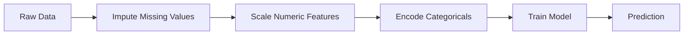
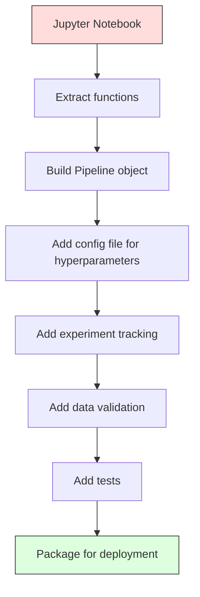

# خطوط أنابيب ML
# ML 管线


> النموذج ليس منتج. خط أنابيب هو. خط أنابيب هو كل شيء من البيانات الخام إلى التنبؤ المنشأة، وكل خطوة يجب أن تكون قابلة للتكرار.

> النموذج ليس منتجًا ، والخط هو فقط. الخط هو كل شيء من البيانات الأصلية إلى التوقعات التنفيذية ، كل خطوة يجب أن تكون قابلة للتطبيق.

**Type:** Build | **类型：** 构建
**Language:**" بايثون "**语言：**بايثون
**Prerequisites:** Phase 2, Lesson 12 (Hyperparameter Tuning) | **前置知识：** Phase 2 第 12 课（超参数调优）
**Time:** ~120 minutes | **时间：** 约 120 分钟

## أهداف التعلم

- بناء خط أنابيب ML من الصفر الذي يسلسل السلسلة الإسبابية، وتوسيع النطاق، وتشفير، وتدريب النموذج في كائن واحد قابل للتنويع
  من الصفر بناء ML 管 line، سوف تملأ وتكثيف وتعديل وتعليم النموذج لتوصيل إلى كائن واحد قابل للتكرار
- تحديد سيناريوهات تسرب البيانات وتوضيح كيفية منع خطوط الأنابيب منها عن طريق تركيب المحولات فقط على بيانات التدريب
  识别数据泄漏场景,解释管线如何通过只适用于训练数据的变换器来防止泄漏
- بناء ColumnTransformer الذي يطبق مختلف المعالجة المسبقة للميزات العددية والفئوية
  إنشاء العمودTransformer، للتطبيقات المختلفة للتصميمات والمعايير
- تنفيذ تسلسل خطوط الأنابيب وإثبات أن نفس خطوط الأنابيب المثبتة تنتج نتائج متطابقة في التدريب والإنتاج
  تحقيق تسلسل الأنابيب، وتوضيح نفس الأنابيب المتكاملة في التدريب والإنتاج لتحقيق نفس النتائج


> **【中文解读】**
> ML 管线把数据预处理、特征工程、模型训练串成一条流水线──sklearn pipeline 确保训练和推理的数据处理一致──生产环境中管线化是模型部署的基础──

> **【拓展：从 sklearn Pipeline 到 MLOps 工业级管线】**
> التدريب على الموديل التسجيل الموديل التسجيل الموديل التسجيل الموديل التسجيل الموديل التسجيل الموديل التسجيل الموديل التسجيل الموديل التسجيل الموديل التسجيل الموديل التسجيل الموديل التسجيل الموديل التسجيل الموديل التسجيل الموديل الموديل الموديل الموديل الموديل الموديل الموديل الموديل الموديل الموديل الموديل الموديل الموديل الموديل الموديل الموديل الموديل الموديل الموديل الموديل الموديل الموديل الموديل الموديل الموديل الموديل الموديل الموديل الموديل الموديل الموديل الموديل الموديل الموديل الموديل الموديل الموديل الموديل الموديل الموديل الموديل الموديل الموديل الموديل الموديل الموديل الموديل الموديل الموديل الموديل الموديل الموديل الموديل الموديل الموديل الموديل الموديل الموديل الموديل الموديل الموديل الموديل الموديل الموديل الموديل الموديل الموديل الموديل الموديل الموديل الموديل الموديل الموديل الموديل الموديل الموديل الموديل الموديل الموديل الموديل الموديل الموديل الموديل الموديل الموديل الموديل الموديل الموديل الموديل الموديل الموديل الموديل الموديل الموديل الموديل الموديل الموديل الموديل الموديل الموديل الموديل الموديل الموديل الموديل الموديل الموديل الموديل الموديل الموديل الموديل الموديل الموديل الموديل الموديل الموديل

## المشكلة المشكلة المشكلة

لديك دفتر ملاحظات يقوم بتحميل البيانات، وملء القيم المفقودة بالوسط، ويزيد من الميزات، ويدرب النموذج، ويقوم بطبع دقة.

> لديك دفتر مذكرات، تحميل البيانات، استخدام متوسط عدد ملء القيمة المفقودة، التكبير خصائص، نموذج التدريب، طباعة معدل التأكد.

بعد شهر، شخص ما يعيد تدريب النموذج ويحصل على نتائج مختلفة. تم حساب المتوسط على مجموعة البيانات الكاملة بما في ذلك بيانات التجارب (تسريب البيانات). لم يتم حفظ معايير التوسع، لذلك تستخدم الاستنتاج إحصاءات مختلفة. تم نسخة ورقية في الرمز الهندسي بين التدريب والخدمة، والنسخة تختلف. اكتسب العمود الفئوي قيمة جديدة في الإنتاج لم يسبق للمرسلين.

> بعد شهر، قام أحد بإعادة تدريب النموذج وتحصل على نتائج مختلفة. تم تحليل الوسط في مجموعة بيانات كاملة من البيانات التي تحتوي على بيانات الاختبار. تم تخفيض العناصر دون حفظ، واستخدام بيانات مختلفة في التفكير.

هذه ليست فرضية. إنها أهم أسباب فشل أنظمة ML في الإنتاج. خطوط الأنابيب تحل كل منها عن طريق حزم كل خطوة تحول إلى كائن واحد، منظمة، قابلة للتكرار.

> هذه ليست فرضيات. إنها السبب الأكثر شيوعا لفشل نظام ML في الإنتاج.

> **【中文解读】**
> المشكلة الأساسية لحل ML: يجب أن تكون المعالجة البيانية التدريبية والفائقة متوافقة تماما. النموذج الأكثر شيوعاً هو أن يتم قياس متوسط المعدل البياني الكامل عند التدريب.

## المفهوم الأساسي

### ما هو خط الأنابيب

خط الأنابيب هو سلسلة مرتبة من تحويلات البيانات تليها نموذج. كل خطوة تأخذ خروج الخطوة السابقة كمدخول. يتم تثبيت خط الأنابيب بأكمله مرة واحدة على بيانات التدريب. في وقت الاستنتاج، يقوم نفس خط الأنابيب المثبت بتحويل البيانات الجديدة وتنتج التنبؤات.

> الخطوط المضخة هي سلسلة من البيانات المتسلسلة، تتبع نموذج واحد. كل خطوة ستقوم بإخراج الخطوة السابقة كدخل.



خط الأنابيب يضمن:
- يتم تركيب التحويلات فقط على بيانات التدريب (لا تسرب)
  变换 فقط في التدريبات المعدلة على بيانات
- نفس التحويلات تطبق في وقت الاستنتاج
  推理时应用相同变化
- يمكن أن يتم تصنيف الكائن بأكمله ونشره كصنع واحد
  يمكن أن يتم ترتيب كل الكائن ووضع كمنشأة
- يتم تطبيق التحقق المتقاطع من أنابيب النفط لكل طائرة، مما يمنع تسربات دقيقة
  التسجيل في كل ثقب من خلال تطبيق الأنابيب، لمنع التسريبات الصغيرة

### تسرب بيانات: القاتل الصامت

يحدث تسرب البيانات عندما تتلوث المعلومات من مجموعة الاختبارات أو البيانات المستقبلية التدريب.

> يحدث تسرب البيانات في تدريبات التلوث المعلوماتية في مجموعات الاختبار أو البيانات المستقبلية.

**Leaky (wrong):**
```python
X = df.drop("target", axis=1)
y = df["target"]

scaler = StandardScaler()
X_scaled = scaler.fit_transform(X)

X_train, X_test = X_scaled[:800], X_scaled[800:]
y_train, y_test = y[:800], y[800:]
```

لقد رأى المقياس بيانات الاختبار. يتضمن المتوسط والانحراف القياسي عينات الاختبار. وهذا يضخ تقديرات الدقة.

> 缩放器看到了测试数据──平均值和标准差包含测试样本──这会夸大准确率估算──

**Correct:**
```python
X_train, X_test = X[:800], X[800:]

scaler = StandardScaler()
X_train_scaled = scaler.fit_transform(X_train)
X_test_scaled = scaler.transform(X_test)
```

مع خط أنابيب، لا تحتاج إلى التفكير في هذا.

> استخدام القنابل، أنت لا تحتاج إلى النظر في هذه.

### خط أنابيب السكلارن

(سكلارن) `Pipeline`محولات السلاسل ومتقدّر`.fit()`،`.predict()`و`.score()`التي تطبق جميع الخطوات على نحوٍ مناسب.

> التسجيلات`Pipeline`سوف تغير و تقييم المتصلة على الصورة`.fit()`.`.predict()`和 `.score()`، حسب الترتيب تطبيق كل الخطوات

```python
from sklearn.pipeline import Pipeline
from sklearn.preprocessing import StandardScaler
from sklearn.linear_model import LogisticRegression

pipe = Pipeline([
    ("scaler", StandardScaler()),
    ("model", LogisticRegression()),
])

pipe.fit(X_train, y_train)
predictions = pipe.predict(X_test)
```

عندما تتصلين`pipe.fit(X_train, y_train)`:
1. مكالمات من مستوى`fit_transform`على قطار X
2. النموذج المكالمات`fit`على قطار X_مقياس

عندما تتصلين`pipe.predict(X_test)`:
1. مكالمات من مستوى`transform`(ليس fit_transform) على X_test
2. النموذج المكالمات`predict`على اختبار X_test المقياس

المقياس لا يرى أبداً بيانات الاختبار أثناء التثبيت هذا هو النقطة

> عندما ت调用`pipe.fit(X_train, y_train)`:
> 1. 缩放器对 X_train 调用 `fit_transform`
> 2. 模型对缩放后的X_train 调用 `fit`
>
> عندما ت调用`pipe.predict(X_test)`:
> 1. 缩放器对 X_test 调用 `transform`(不是 fit_transform)
> 2. 模型对缩放后的X_test 调用 `predict`
>
> 缩放器在拟合期间永远看不到测试数据──这是全部意义──

### العمودالمتحول: خطوط أنابيب مختلفة لعمدة مختلفة

مجموعات البيانات الحقيقية لديها أعداد وعمدات فصلية تحتاج إلى مختلف المعالجة المسبقة. `ColumnTransformer`-تتعامل مع هذا

> المجموعة الحقيقية من البيانات لديها صفوف قيمة وفرق، تحتاج إلى معالجة مختلفة.`ColumnTransformer`إصلاح هذا

```python
from sklearn.compose import ColumnTransformer
from sklearn.preprocessing import StandardScaler, OneHotEncoder
from sklearn.impute import SimpleImputer

numeric_pipe = Pipeline([
    ("impute", SimpleImputer(strategy="median")),
    ("scale", StandardScaler()),
])

categorical_pipe = Pipeline([
    ("impute", SimpleImputer(strategy="most_frequent")),
    ("encode", OneHotEncoder(handle_unknown="ignore")),
])

preprocessor = ColumnTransformer([
    ("num", numeric_pipe, ["age", "income", "score"]),
    ("cat", categorical_pipe, ["city", "gender", "plan"]),
])

full_pipeline = Pipeline([
    ("preprocess", preprocessor),
    ("model", GradientBoostingClassifier()),
])
```

- نعم`handle_unknown="ignore"`في OneHotEncoder أمر حاسم للإنتاج. عندما تظهر فئة جديدة (مدينة لم يسبق للمثال رؤيتها) ، فإنه ينتج متجهًا صفرًا بدلاً من الانهيار.

> OneHotEncoder 中的 `handle_unknown="ignore"`عندما تظهر فئات جديدة من المدن التي لم يسبق لها أن أُبدا، فإنها تنتج نطاقًا صفرًا بدلاً من الانهيار.

### تتبع التجربة

إن خط الأنابيب يجعل التدريب قابلاً للتكرار، ولكن عليك أيضاً تتبع ما حدث عبر التجارب: أي ملامح فائقة تم استخدامها، أي نسخة مجموعة بيانات، ما هي المعايير، أي رمز كان يعمل.

> 管线让训练可复现, ولكنك تحتاج أيضاً إلى متابعة ما حدث بين التجارب: باستخدام أي عناصر فائقة ‬‬‬‬‬‬‬‬‬‬‬‬‬‬‬‬‬‬‬‬‬‬‬‬‬‬‬‬‬‬‬‬‬‬‬‬‬‬‬‬‬‬‬‬‬‬‬‬‬‬‬‬‬‬‬‬‬‬‬‬‬‬‬‬‬‬‬‬‬‬‬‬‬‬‬‬‬‬‬‬‬‬‬‬‬‬‬‬‬‬‬‬‬‬‬‬‬‬‬‬‬‬‬‬‬‬‬‬‬‬‬‬‬‬‬‬‬‬‬‬‬‬‬‬‬‬‬‬‬‬‬‬‬‬‬‬‬‬‬‬‬‬‬‬‬‬‬‬‬‬‬‬‬‬‬‬‬‬‬‬‬‬‬‬‬‬‬‬‬‬‬‬‬‬‬‬‬‬‬‬‬‬‬‬‬‬‬‬‬‬‬‬‬‬‬‬‬‬‬‬‬‬‬‬‬‬‬‬‬‬‬‬‬‬‬‬‬‬‬‬‬‬‬‬‬‬‬‬‬‬‬‬‬‬‬‬‬‬‬‬‬‬‬‬‬‬‬‬‬‬‬‬‬‬‬‬‬‬‬‬‬‬‬‬‬‬‬‬‬‬‬‬‬‬‬‬‬‬‬‬‬‬‬‬‬‬‬‬‬‬‬‬‬‬‬‬‬‬‬‬‬‬‬‬‬‬‬‬‬‬‬‬‬‬‬‬‬‬‬‬‬‬‬‬‬‬‬‬‬‬‬‬‬‬‬‬‬‬‬‬‬‬‬‬‬‬‬‬‬‬‬‬‬‬‬‬‬‬‬‬‬‬‬‬‬‬‬‬‬‬‬‬‬‬‬‬‬‬‬‬‬‬‬‬‬‬‬‬‬‬‬‬‬‬‬‬‬‬‬‬‬‬‬‬‬‬‬‬‬‬‬‬‬‬‬‬‬‬‬‬‬‬‬‬‬‬‬‬‬‬‬‬‬‬‬‬‬‬‬‬‬‬‬‬‬‬‬‬‬‬‬‬‬‬‬‬‬‬‬‬‬‬‬‬‬‬‬‬‬‬‬‬‬‬‬‬‬

**MLflow**هو الحل المفتوح الأكثر شيوعا:

> **MLflow**هو أكثر الخيارات المفتوحة شيوعاً:

```python
import mlflow

with mlflow.start_run():
    mlflow.log_param("max_depth", 5)
    mlflow.log_param("n_estimators", 100)
    mlflow.log_param("learning_rate", 0.1)

    pipe.fit(X_train, y_train)
    accuracy = pipe.score(X_test, y_test)

    mlflow.log_metric("accuracy", accuracy)
    mlflow.sklearn.log_model(pipe, "model")
```

يتم تسجيل كل جولة مع المعايير والمقاييس والقطع الأثرية والنموذج الكامل. يمكنك مقارنة الجولات، وإعادة إنتاج أي تجربة، ونشر أي نسخة نموذج.

> كل عملية تسجل العناصر والمعايير والكونات والنموذج الكامل. يمكنك مقارنة أي تجربة، وتطبيق أي نسخة من النماذج.

**Weights & Biases (wandb)**يقدم نفس الوظيفة مع لوحة التحكم المضيفة:

> **Weights & Biases (wandb)**提供相同功能,带托管仪表盘:

```python
import wandb

wandb.init(project="my-pipeline")
wandb.config.update({"max_depth": 5, "n_estimators": 100})

pipe.fit(X_train, y_train)
accuracy = pipe.score(X_test, y_test)

wandb.log({"accuracy": accuracy})
```

### النموذج الإصدار

بعد التتبع التجريبي، تحتاج إلى إدارة نسخة النموذج. أي نموذج في الإنتاج؟

> بعد التجربة، تحتاج إلى إدارة النموذج الإصدار. أي نموذج في الإنتاج؟ أي هو المرحلة؟

سجل النموذج من MLflow يقدم:
- **Version tracking:**كل نموذج مدفوع يحصل على رقم نسخة
  **版本追踪：**كل نموذج محفوظ حصل على نسخة رقم
- **Stage transitions:**"مقام" "إنتاج" "مؤلف"
  **阶段转换：**"مُقامة" ‧"إنتاج"‧"مُخزنة"
- **Approval workflow:**يجب أن يتم تعزيز النماذج صراحة للإنتاج
  **审批工作流：**يجب أن يرتفع نموذجها إلى الإنتاج
- **Rollback:**إعادة إلى النسخة السابقة على الفور
  **回滚：**立即切回之前版本

### إصدار البيانات مع DVC

يتم إصدار الكود مع git. يجب إصدار البيانات أيضًا، ولكن git لا يمكن التعامل مع الملفات الكبيرة. DVC (Data Version Control) يحل هذا.

> 代码用 git 版本化──数据也应该版本化,但 git 不能处理大文件──DVC(Data Version Control) لحل هذه المشكلة──

```
dvc init
dvc add data/training.csv
git add data/training.csv.dvc data/.gitignore
git commit -m "Track training data"
dvc push
```

تخزين DVC البيانات الفعلية في التخزين عن بعد (S3 ، GCS ، Azure) وتحتفظ بـ `.dvc`ملف في Git يسجل الـ hash عندما تقوم بتحقق من التزامات Git`dvc checkout`يعيد البيانات الدقيقة التي استخدمت.

> DVC وضع مخزن البيانات الحقيقي على الطرف البعيد ((S3、GCS、Azure) ، في الوصول الحفاظ على واحد صغير `.dvc`عندما تخرج من مكتب التسجيلات`dvc checkout`استعادة البيانات المستخدمة في ذلك الوقت

هذا يعني أن كل خطة إرسال تقوم بتوصيل كل من الرمز والبيانات قابلة للتكرار الكاملة

> هذا يعني أن كل متسجل يضع كودًا والبيانات في نفس الوقت.

### التجارب المتكاملة

تجربة قابلة للتكرار تتطلب أربعة أشياء:

> تجربة قابلة للتطبيق تتطلب أربعة أشياء:

1. **Fixed random seeds:**وضع البذور للفطريات، والإطار، والإطار (المصباح، والسكولارن)
   **固定随机种子：**لـ numpy、random 和 framework(torch、sklearn) إعداد النباتات
2. **Pinned dependencies:**requirements.txt أو poetry.lock مع نسخة دقيقة
   **固定依赖：**requirements.txt أو poetry.lock 锁定精确版本
3. **Versioned data:**DVC أو ما شابه
   **版本化数据：**DVC أو أدوات مشابهة
4. **Config files:**جميع المعايير العالية في إعداد، غير مدمجة بقوة
   **配置文件：**جميع العناصر المضطربة في التكوين، لا ترقيم صعبة

```python
import numpy as np
import random

def set_seed(seed=42):
    random.seed(seed)
    np.random.seed(seed)
    try:
        import torch
        torch.manual_seed(seed)
        torch.cuda.manual_seed_all(seed)
        torch.backends.cudnn.deterministic = True
    except ImportError:
        pass
```

### من المذكرة إلى خط الإنتاج



التقدم النموذجي:

> 典型演进:

1. **Notebook exploration:**التجارب السريعة، التصورات، أفكار الميزات
   **notebook 探索：**التجربة السريعة
2. **Extract functions:**نقل المعالجة المسبقة، هندسة الميزات، التقييم إلى وحدات
   **抽取函数：**تحويل التجهيز التجهيز التقييم إلى الموديل
3. **Build Pipeline:**تحويل السلسلة إلى خط أنابيب أو فئة مخصصة
   **构建 Pipeline：**أن تغير الصفحة إلى خط أنابيب أو تعريف ذاتي
4. **Config management:**نقل جميع المعايير العابرة إلى تشكيل YAML / JSON
   **配置管理：**نقل كل المعايير فوق إلى YAML / JSON
5. **Experiment tracking:**إضافة التسجيلات MLflow أو wandb
   **实验追踪：**添加 MLflow أو الندب 日志
6. **Data validation:**تحقق من النظام، والتوزيعات، وأنماط القيمة المفقودة قبل التدريب
   **数据验证：**訓練前检查 schema、分布、缺失模式
7. **Tests:**اختبارات الوحدة للمتحولات، اختبارات التكامل لخط الأنابيب الكامل
   **测试：**اختبار وحدات المتغيرات
8. **Deployment:**التسلسل للخط الأنبوب، لف في API (FastAPI، Flask) ، تحويلها
   **部署：**序列化管线、包成 API(FastAPI、Flask)

### أخطاء عامة في خط الأنابيب

| Mistake | Why it is bad | Fix |
|---------|-------------|-----|
| Fitting on full data before splitting | Data leakage | Use Pipeline with cross_val_score |
| Feature engineering outside pipeline | Different transforms at train vs serve | Put all transforms in the Pipeline |
| Not handling unknown categories | Production crash on new values | OneHotEncoder(handle_unknown="ignore") |
| Hardcoded column names | Breaks when schema changes | Use column name lists from config |
| No data validation | Silently wrong predictions on bad data | Add schema checks before prediction |
| Training/serving skew | Model sees different features in prod | One Pipeline object for both |

| 错误 | 为什么坏 | 修复 |
|------|---------|------|
| 划分前在全量数据上 fit | 数据泄漏 | 用 Pipeline 配合 cross_val_score |
| 管线外做特征工程 | 训练和服务变换不同 | 把所有变换放进 Pipeline |
| 不处理未知类别 | 生产中新值导致崩溃 | OneHotEncoder(handle_unknown="ignore") |
| 硬编码列名 | schema 改变时失效 | 用配置中的列名列表 |
| 没有数据验证 | 坏数据上预测错误无提示 | 预测前加 schema 检查 |
| 训练/服务偏差 | 生产中模型看到不同特征 | 训练和服务用同一个 Pipeline 对象 |

## بناء ذلك تحرك لتحقيق

> **【中文解读】**
> من صفر لتحقيق ML 管线:自定义 Transformer(实现 fit/transform 接口)、Pipeline 类(链式调用多个变换器)、ColumnTransformer(按列分组处理不同类型特征)。

> **【拓展：sklearn Pipeline 在 Kaggle 和工业界的标准模式】**
> كاجل غراندمستر's standard code module almost always contains a sklearn pipeline: عدد خصائص باستخدام SimpleImputer + StandardScaler،类别 خصائص باستخدام SimpleImputer + OneHotEncoder، من خلال ColumnTransformer 组合后输入模型── هذا يضمن:交叉验证中每折独立适应、新数据推理时变化一致、代码简洁可维护── في الإنتاج، يمكن استخدام خط البيريد 序列化保存,部署直接加载使用──
```figure
f3-pipeline-flow
```

## بناءها

الرمز في`code/pipeline.py`يُبني خط أنابيب ML كامل من الصفر:

### الخطوة الأولى: المحول المخصص

```python
class CustomTransformer:
    def __init__(self):
        self.means = None
        self.stds = None

    def fit(self, X):
        self.means = np.mean(X, axis=0)
        self.stds = np.std(X, axis=0)
        self.stds[self.stds == 0] = 1.0
        return self

    def transform(self, X):
        return (X - self.means) / self.stds

    def fit_transform(self, X):
        return self.fit(X).transform(X)
```

### الخطوة الثانية: خط أنابيب من الصفر

```python
class PipelineFromScratch:
    def __init__(self, steps):
        self.steps = steps

    def fit(self, X, y=None):
        X_current = X.copy()
        for name, step in self.steps[:-1]:
            X_current = step.fit_transform(X_current)
        name, model = self.steps[-1]
        model.fit(X_current, y)
        return self

    def predict(self, X):
        X_current = X.copy()
        for name, step in self.steps[:-1]:
            X_current = step.transform(X_current)
        name, model = self.steps[-1]
        return model.predict(X_current)
```

### الخطوة الثالثة: التحقق المتقاطع مع خط الأنابيب

يوضح الرمز كيفية منع التحقق من التحقق من التحقق من التحقق من التحقق من التحقق من التحقق من التحقق من التحقق من التحقق من التحقق من التحقق من التحقق من التحقق من التحقق من التحقق من التحقق من التحقق من التحقق من التحقق من التحقق من التحقق من التحقق من التحقق من التحقق من التحقق من التحقق من التحقق من التحقق من التحقق من التحقق من التحقق من التحقق من التحقق من التحقق من التحقق من التحقق من التحقق من التحقق من التحقق من التحقق من التحقق من التحقق من التحقق من التحقق من التحقق من التحقق من التحقق من التحقق من التحقق من التحقق من التحقق من التحقق من التحقق من التحقق من التحقق من التحقق من التحقق من التحقق من التحقق من التحقق من التحقق من التحقق من التدقق من التدقققق من التدققققق من التدققققق من التدقققققق من التدقققققق.

### الخطوة الرابعة: خط أنابيب الإنتاج الكامل مع sklearn

خط أنابيب كامل مع`ColumnTransformer`، العديد من مسارات المعالجة المسبقة، ونموذج، مدربة مع التحقق المناسب من التحقق من التحقق من التحقق من التحقق من التحقق من التحقق من التحقق من التحقق من التحقق من التحقق من التحقق من التحقق من التحقق من التحقق من التحقق من التحقق من التحقق من التحقق من التحقق من التحقق من التحقق من التحقق من التحقق من التحقق من التحقق من التحقق من التحقق من التحقق من التحقق من التحقق من التحقق من التحقق من التحقق من التحقق من التحقق من التحقق من التحقق من التحقق من التحقق من التحقق من التحقق من التحقق من التحقق من التحقق من التحقق من التحقق من التحقق من التحقق.

## أرسلها .

هذا الدرس ينتج عن:
- `outputs/prompt-ml-pipeline.md`-- مهارة لبناء وتحليل خط الأنابيب المعدنية
- `code/pipeline.py`-- خط أنابيب كامل من الصفر عبر sklearn

## تمارين التدريب

1. بناء خط أنابيب يتعامل مع مجموعة بيانات مع 3 أعمدة رقمية وعمدتين فصلية. استخدام `ColumnTransformer`لتطبيق الوصف المتوسط + التوسع على العدد والوصف الأكثر تكرارا + تشفير واحد حار على الفئات. تدريب مع التحقق المتقاطع 5 مرات.
   1.  بناء معالجة 3 صفوف قيمة عددية و 2 صفوف صفوف صفوف بيانات `ColumnTransformer`لملء + التكبير لعدد التطبيقات المختلفة لملء + التطبيقات المختلفة لملء + التطبيقات المختلفة لعدد التطبيقات المختلفة لملء + التطبيقات المختلفة لعدد التطبيقات المختلفة لملء + التطبيقات المختلفة لعدد التطبيقات المختلفة لملء + التطبيقات المختلفة لعدد التطبيقات المختلفة لعدد التطبيقات المختلفة لعدد التطبيقات المختلفة لعدد التطبيقات المختلفة لعدد التطبيقات المختلفة لعدد التطبيقات المختلفة لعدد التطبيقات المختلفة لعدد التطبيقات المختلفة لعدد التطبيقات المختلفة لعدد التطبيقات المختلفة.

2. إدخال تسرب البيانات عمداً: قم بتضمين المقياس على مجموعة البيانات الكاملة قبل التقسيم. مقارنة درجة التحقق من التحقق من التحقق من التحقق من التحقق من التحقق من التحقق من التحقق من التحقق من التحقق من التحقق من التحقق من التحقق من التحقق من التحقق من التحقق من التحقق من التحقق من التحقق من التحقق من التحقق من التحقق من التحقق من التحقق من التحقق من التحقق من التحقق من التحقق من التحقق من التحقق من التحقق من التحقق من التحقق من التحقق من التحقق من التحقق من التحقق من التحقق من التحقق من التحقق من التحقق من التحقق من التحقق من التحقق من التحقق من التحقق من التحقق من التحقق من التحقق من التحقق من التحقق من التحقق من التحقق من التحقق من التحقق من التحقق من التحقق من التحقق من التحقق من التحقق من التحقق من التحقق؟
   2. لذلك، إدخال تسريب البيانات: في المقام الأول للتقسيم على حجم البيانات المتناسبة مقياس.

3. قم بتسلسل خط الأنابيب الخاص بك مع`joblib.dump`قم بتحميلها في نص منفصل و قم بتشغيل التنبؤات
   3. استخدام`joblib.dump`序列化你的管线──在另一个脚本中加载并运行预测──验证预测完全相同──

4. إضافة محول مخصص إلى خط الأنابيب الذي يخلق ميزات متعددة النقاط (درجة 2) لعدد الأعمدة الأهمين. أين يجب أن تذهب في خط الأنابيب؟
   4. في خط الأنابيب إضافة متغيرات ذاتية التعريف، لعدد من أهم القيم الثنائية لإنشاء خصائص متعددة الحجم ((درجة 2) ・・・ ما هو المكان الذي ينبغي وضعه على خط الأنابيب؟

5. قم بتعيين تدفق ML لخط الأنابيب. قم بتشغيل 5 تجارب مع مختلف المعايير. استخدم واجهة المستخدم MLflow (`mlflow ui`(تقارن السباقات واختيار أفضل النموذج.
   5. لإنشاء نظام التدفق المتحرك المتحرك المتحرك المتحرك المتحرك المتحرك المتحرك المتحرك المتحرك المتحرك المتحرك المتحرك المتحرك المتحرك المتحرك المتحرك المتحرك المتحرك المتحرك المتحرك المتحرك المتحرك المتحرك المتحرك المتحرك المتحرك المتحرك المتحرك المتحرك المتحرك المتحرك المتحرك المتحرك المتحرك المتحرك المتحرك المتحرك المتحرك المتحرك المتحرك المتحرك المتحرك المتحرك المتحرك المتحرك المتحرك المتحرك المتحرك المتحرك المتحرك المتحرك المتحرك المتحرك المتحرك المتحرك المتحرك المتحرك المتحرك المتحرك المتحرك المتحرك المتحرك المتحرك المتحرك المتحرك المتحرك المتحرك المتحرك المتحرك المتحرك المتحرك`mlflow ui`) مقارنة النشاطات ومحاولة اختيار أفضل النموذج

> **【中文解读】**
> مبدأ التصميم الرئيسي للخطوط المعدنية: 1) جميع التغييرات يجب أن تكون قابل للتسلسل باستخدام دفتر العمل/البصارة  الحفاظ على خط الأنابيب المثبت بالكامل، عند نشرها مباشرة؛ 2) العمودالمعدني  معالجة الاختلاطات خصائص القيمة والفئات التألفية التألفة للتغيير بعد التضمين ؛ 3) لا يمكن أن يكون للخطوط المعدنية أي حالة شاملة كل محول فقط يعتمد على إدخال البيانات التدريبية.

> **【拓展：数据泄漏的六种常见形式】**
> (1) في جميع البيانات المتناسبة مقياسة إعادة التقسيم ؛(2)  الهدف编码 استخدام جميع البيانات الحسابي متوسط القيمة ؛(3) 序列 الوقت随机划分 ؛(4) خصائص اختيار في جميع البيانات المتناسبة ؛(5) 交叉验证中重复样本出现多折;(6) 预测时使用未来才能获取的特征──通过严格的适应/转换 分离防止前四种泄漏──对于时间序列和重复样本,需要特殊的交叉验证策略──

## شروط الرئيسية

| Term | What people say | What it actually means |
|------|----------------|----------------------|
| Pipeline | "Chain of transforms + model" | An ordered sequence of fitted transformers and a model, applied as one unit to prevent leakage |
| Data leakage | "Test info leaked into training" | Using information from outside the training set to build the model, inflating performance estimates |
| ColumnTransformer | "Different preprocessing per column" | Applies different pipelines to different subsets of columns, combining results |
| Experiment tracking | "Logging your runs" | Recording parameters, metrics, artifacts, and code versions for every training run |
| MLflow | "Track and deploy models" | Open-source platform for experiment tracking, model registry, and deployment |
| DVC | "Git for data" | Version control system for large data files, storing hashes in git and data in remote storage |
| Model registry | "Model version catalog" | A system that tracks model versions with stage labels (staging, production, archived) |
| Training/serving skew | "It worked in the notebook" | Differences between how data is processed during training versus inference, causing silent errors |
| Reproducibility | "Same code, same result" | The ability to get identical results from the same code, data, and configuration |

## المزيد من القراءة

- [scikit-learn Pipeline docs](https://scikit-learn.org/stable/modules/compose.html)-- المرجع الرسمي لخط الأنابيب
  [scikit-learn Pipeline 文档](https://scikit-learn.org/stable/modules/compose.html)- 官方管线参考
- [MLflow documentation](https://mlflow.org/docs/latest/index.html)-- تتبع التجارب و سجل النماذج
  [MLflow 文档](https://mlflow.org/docs/latest/index.html)-  تجربة تتبع و نموذج التسجيل
- [DVC documentation](https://dvc.org/doc)-- إصدار البيانات
  [DVC 文档](https://dvc.org/doc)- إدارة إصدارات البيانات
- [Sculley et al., Hidden Technical Debt in Machine Learning Systems (2015)](https://papers.nips.cc/paper/2015/hash/86df7dcfd896fcaf2674f757a2463eba-Abstract.html)-- ورقة أساسية حول تعقيد أنظمة ML
  [Sculley et al., Hidden Technical Debt in ML Systems (2015)](https://papers.nips.cc/paper/2015/hash/86df7dcfd896fcaf2674f757a2463eba-Abstract.html)- ML 系统复杂性的 أسس
- [Google ML Best Practices: Rules of ML](https://developers.google.com/machine-learning/guides/rules-of-ml)-- نصيحة عملية للإنتاج
  [Google ML Best Practices](https://developers.google.com/machine-learning/guides/rules-of-ml)- 实用生产 ML 建议
