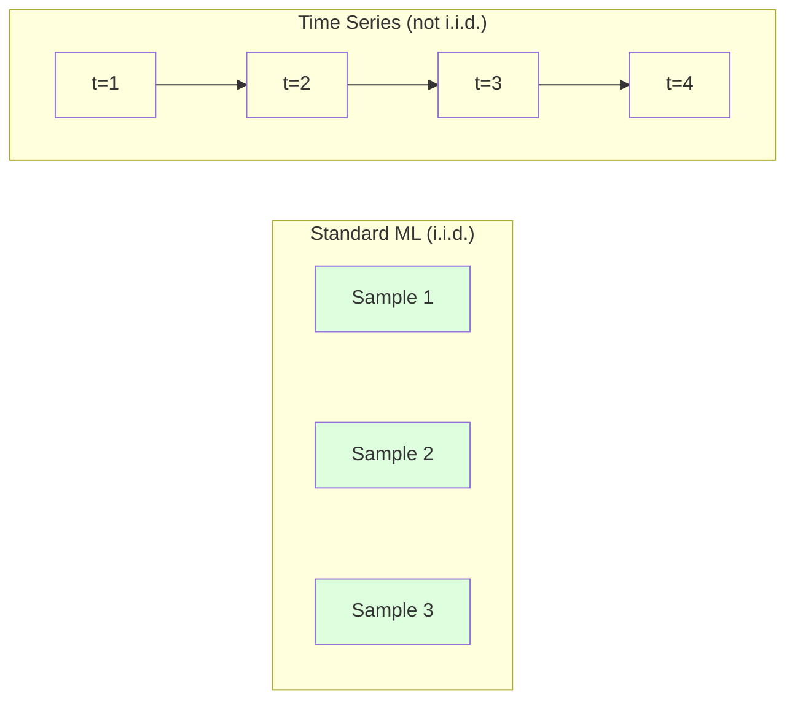
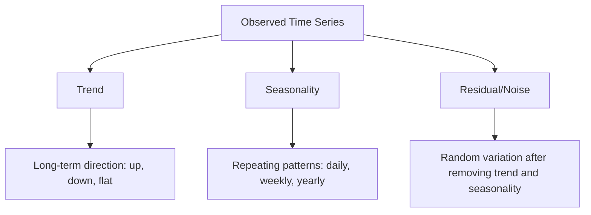
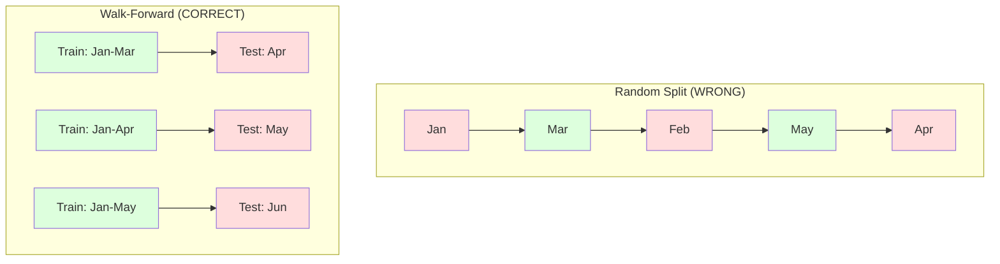

# أساسيات سلسلة الزمن
# 时间序列基础


> الأداء السابق يتوقع النتائج المستقبلية إذا تحققت من الثبات أولاً

> أداء الماضي يمكن أن يتوقع المستقبل الافتراض هو أنك أولاً تحقق من الاستقرار‬

**Type:** Build | **类型：** 构建
**Language:**" بايثون "**语言：**بايثون
**Prerequisites:** Phase 2, Lessons 01-09 | **前置知识：** Phase 2 第 1-9 课
**Time:** ~90 minutes | **时间：** 约 90 分钟

## أهداف التعلم

- تحلل سلسلة زمنية إلى اتجاهات ومواسمية ومكونات بقايا واختبار الثبات
  تقسيم تسلسل الوقت إلى اتجاهات، مواسم، وفرص الفجوة، ومراقبة الاستقرار
- تنفيذ ميزات تأخير وإحصاءات التداول لتحويل سلسلة زمنية إلى مشكلة تعلم تحت الإشراف
  实现滞后特征和滚动统计将时间序列转换为监督学习问题
- بناء إطار للتحقق من التحقق من التحقق من التحقق من البيانات في المستقبل من التسريب إلى التدريب
  بناء إطار للتحقق من التداول، لمنع التسريب في المستقبل
- شرح لماذا تقسيمات القطار العشوائية/التجارب غير صالحة لسلسلة الزمن وإظهار الفجوة في الأداء مقابل تقسيمات الزمن المناسبة
   شرح لماذا تقسيم التدريب / اختبار التدريب على تسلسل الوقت غير فعال ، و لا تستخدم تقسيم الوقت الصحيح لتوضيح الفجوة في الأداء


> **【中文解读】**
> 时间序列是按时间序列排列的数据──ARIMA、指数平滑是经典方法,LSTM/Transformer是深度学习方法──股票预测、销量预测、天气预报是典型应用──

> **【拓展：时间序列预测在金融和供应链中的关键角色】**
> أمازون استخدام تسلسل الوقت التنبؤ لإدارة مخزونات المليارات SKU في جميع أنحاء العالم، والتنبؤ اليومي يتجاوز 400 مليار مرة؛ أوبر استخدام تسلسل الوقت النموذج التنبؤات الطلبات لتحقيق التغيرات الحركية؛ ارتفاع الأسعار؛ مؤسسات مالية استخدام ARIMA / GARCH  نموذج التنبؤات وتحركات معدل لإدارة المخاطر.

## المشكلة المشكلة المشكلة

لديك بيانات مرتبة حسب الوقت، المبيعات اليومية، درجة الحرارة بالساعة، استخدام المعالجة المركزية لكل دقيقة، أسعار الأسهم الأسبوعية، تريد التنبؤ بالقيمة القادمة، الأسبوع المقبل، الربع القادم.

> لديك بيانات حسب التسلسل الزمني. اليومي المبيعات. ساعات الحرارة.

يمكنك الوصول إلى مجموعة أدوات ML القياسية: التقسيم العشوائي للقطار/التدريب، التحقق المتقاطع، المصفوفة المصفوفة، التنبؤ الخروج. كل خطوة خاطئة.

> أنت تستخدم معيار ML 工具:随机训练/测试划分、交叉验证、特征矩阵输入、预测输出── كل خطوة هي خطأ‬

سلسلة الزمن تكسر الافتراضات التي يعتمد عليها ML القياسية. العينات ليست مستقلة - درجة حرارة اليوم تعتمد على البارحة. التقسيمات العشوائية تسرب المعلومات المستقبلية إلى الماضي. الميزات التي تبدو رائعة في اختبار الخلفية تفشل في الإنتاج لأنها تعتمد على أنماط تتغير مع مرور الوقت.

> 序列 الوقت يفسد فرضية ML القياسية التي تعتمد عليها. النموذج ليس مستقلًا.  درجة حرارة اليوم تعتمد على البارحة.  تقسيمات مستقبلية من المعلومات إلى الماضي.  في التقييمات تبدو جيدة في التخفيض في الإنتاج، لأنها تعتمد على نمط تغير الوقت.

نموذج يحصل على دقة 95% مع التحقق العشوائي من التحقق من التحقق من التحقق من التحقق من التحقق من التحقق من التحقق من التحقق من التحقق من التحقق من التحقق من التحقق من التحقق من التحقق من التحقق من التحقق من التحقق من التحقق من التحقق من التحقق من التحقق من التحقق من التحقق من التحقق من التحقق من التحقق من التحقق من التحقق من التحقق من التحقق من التحقق من التحقق من التحقق من التحقق من التحقق من التحقق من التحقق من التحقق من التحقق من التحقق من التحقق من التحقق من التحقق من التحقق من التحقق من التحقق من التحقق من التحقق من التحقق من التحقق من التحقق من التحقق من التحقق من التحقق من التحققق من التحققق من التحققق من التحقققق من التحقققق من التحقققق من التحققققق من التحققققق من التحقققق في التحققققق في التحقققققق من التحققققق في التحقققققق في التحققققق في الت التققققققققق في الت الت الت الت التققققققققققققققق في الت الت الت الت الت.

> نموذج يحصل على 95% من الادقة في التحقق في التداول الاختيارية يمكن الحصول عليه فقط 55% في الوقت الصحيح التقييم.

هذا الدروس يغطي الأساسيات: ما يجعل بيانات الوقت مختلفة، وكيفية تقييم النماذج بصدق، وكيفية تحويل سلسلة الوقت إلى ميزات يمكن أن تستخدمها النماذج القياسية من خلال ML.

> هذا الدراسة تشمل المعرفة الأساسية: ما الذي يجعل بيانات الوقت مختلفة، وكيفية تقييم النموذج بشكل صادق، وكيفية تحويل تسلسل الوقت إلى خصائص يمكن استخدامها في نموذج ML القياسي.

> **【中文解读】**
> الاختلاف في تحليل تسلسل الوقت هو وجود وقت بين نقاط البيانات تعتمد على القيمة اليوم تعتمد على القيمة البارحة. هذا يفسد افتراضات الاستقلال والتوزيع القياسي لل ML.

## المفهوم الأساسي

### ما الذي يجعل سلسلة الزمن مختلفة

يفترض ML القياسي i.i.d. -- مستقلة وموزعة بشكل متطابق. يتم استخراج كل عينة من نفس التوزيع ، مستقلة عن عينات أخرى. تنتهك سلسلة الزمن كل من:

> 标准 ML 假设 i.i.d.独立同分布── كل نموذج يتم استخراجه من نفس التوزيع، مع نموذج آخر لا علاقة لها── تسلسل الوقت يتعارض مع هذه الفرضتان:

- **Not independent.**سعر الأسهم اليوم يعتمد على سعر الأسهم الأمس، مبيعات هذا الأسبوع تتوافق مع سعر الأسهم الأسبوع الماضي.
  不独立── اليوم أسعار الأسهم تعتمد على البارحة── هذا الأسبوع مبيعات ترتبط بالأسبوع السابق──
- **Not identically distributed.**التوزيع يتغير مع مرور الوقت، مبيعات ديسمبر تبدو مختلفة عن المبيعات في مارس.
  غير الموزع. التوزيع يتغير مع الزمن.

هذه الانتهاكات ليست بسيطة. إنها تغير كيفية بناء الميزات، كيفية تقييم النماذج، والخوارزميات التي تعمل.

> هذه الانتهاكات ليست مشكلة صغيرة. إنها تغير كيفية بناء الخصائص، كيفية تقييم النموذج وما هي الخوارزميات المفعمة.



في نظام التشغيل المعتاد، العينات قابلة للتبادل. التشويش بها لا يغير أي شيء. في سلسلة الزمن، النظام هو كل شيء. التشويش يدمير الإشارة.

> في المعلم المعتاد، النموذج قابل للتبادل.

### مكونات سلسلة زمنية

كل سلسلة زمنية هي مزيج من:

> كل سلسلة زمنية هي مجموعة من المكونات التالية:



- **Trend**التوجه الطويل الأجل، نمو الإيرادات بنسبة 10% سنوياً، ارتفاع درجة الحرارة العالمية.
  趋势:长期方向―收入每年增长10%―全球温度上升―
- **Seasonality**: تكرار الأنماط في فترات ثابتة. ارتفاع مبيعات التجزئة في ديسمبر. ارتفاع استخدام مكيف الهواء في يوليو.
  季节性:固定间隔的重复模式── ارتفاع حجم المبيعات بالتجزئة في 12 أشهر── استخدام الطقس في 7 أشهر
- **Residual**: أي شيء يبقى بعد إزالة الاتجاه والفصول. إذا كان البقايا تبدو مثل الضوضاء البيضاء، التفكك قبض على الإشارة.
  بقية الفجوة: إزالة التوجه والجزء المتبقي بعد الموسم. إذا كان البقية تبدو مثل الضجيج البيضاء، فإن البيانات المفروضة قد استولت على الإشارة.

### الثبات

سلسلة زمنية ثابتة إذا لم تتغير خصائصها الإحصائية (متوسط، المتغيرات، التواصل الذاتي) مع مرور الوقت. معظم طرق التنبؤ تتخذ ثابتة.

> إذا كانت الخصائص الإحصائية لسلسلة الوقت ((المعدل                                                                                                                                                                                                                                                      

**Why it matters:**سلسلة غير ثابتة لديها معدل يتحرك. نموذج تدرب على بيانات من يناير تعلمت معدل مختلف عن ما سوف يظهر فبراير. سيكون خطأ منهجيا.

> **为什么重要：**يزحف متوسط الأسلوب غير المستقر. يختلف متوسط المتعلم من متوسط الأسلوب الذي تم تدريبه على بيانات شهر واحد عن متوسط أسلوب أسلوب أسلوب أسلوب أسلوب أسلوب أسلوب أسلوب أسلوب أسلوب أسلوب أسلوب أسلوب أسلوب أسلوب أسلوب أسلوب أسلوب أسلوب أسلوب أسلوب أسلوب أسلوب أسلوب أسلوب أسلوب أسلوب أسلوب أسلوب أسلوب أسلوب أسلوب أسلوب أسلوب أسلوب أسلوب أسلوب أسلوب أسلوب أسلوب أسلوب أسلوب أسلوب أسلوب أسلوب أسلوب أسلوب أسلوب أسلوب أسلوب أسلوب أسلوب أسلوب أسلوب أسلوب أسلوب أسلوب أسلوب أسلوب أسلوب أسلوب أسلوب أسلوب أسلوب أسلوب أسلوب أسلوب أسلوب أسلوب أسلوب أسلوب أسلوب أسلوب أسلوب أسلوب أسلوب أسلوب أسلوب أسلوب أسلوب أسلوب أسلوب أسلوب أسلوب أسلوب أسلوب أسلوب أسلوب أسلوب أسلوب أسلوب أسلوب أسلوب أسلوب أسلوب أسلوب أسلوب أسلوب أسلوب أسلوب أسلوب أسلوب أسلوب

**How to check:**احسب متوسط التدفق والانحراف القياسي للتدفق على النافذة إذا كانت تتحرك، فإن السلسلة غير ثابتة.

> **如何检查：**計算窗口內滚动平均值和滚动标准差──如果它们漂移,序列是不平稳的──

**How to fix:**التفريق: بدلاً من نمذجة القيم الخامة، نمذجة التغيير بين القيم المتتالية:

> **如何修复：**差分──不对原始值建模,而是对连续值之间的变化建模:

```
diff[t] = value[t] - value[t-1]
```

إذا لم تجعل جولة واحدة من التفريق السلطة ثابتة، فاستخدمها مرة أخرى (التفريق من النظام الثاني). تحتاج معظم سلسلة العالم الحقيقي إلى جولتين على الأكثر.

> إذا لم يتمكن الجدول من جعل الجدول ثابتًا ، فستقوم بتطبيقه مرة أخرى.

**Example:**

> **示例：**

المسلسل الأصلي: [100، 102, 106, 112, 120]
الفرق الأول: [2, 4, 6, 8] (ما زال يتجه نحو الأعلى)
الفرق الثاني: [2, 2, 2] (مستمر -- ثابت)

كان التسلسل الأصلي يمثل اتجاه مربع. التفريق الأول حولته إلى اتجاه خطي. التفريق الثاني جعل منه مسطحا. في الممارسة العملية، نادرا ما تحتاج إلى أكثر من جولتين.

> المسلسل الأول لديه اتجاهات ثانوية. التوجهات الأولى تغير إلى اتجاهات خطية.

**Formal test:**اختبار إضافية الكيس-ملء (ADF) هو اختبار إحصائي قياسي للتوقف. فرضية الصفر هي "السلسلة غير ثابتة". قيمة p أقل من 0.05 تعني أنه يمكنك رفض الصفر واستنتاج التوقف. نحن لا نطبق ADF من الصفر (تتطلب جدولات التوزيع غير المفصلية) ، ولكن نهج الإحصاءات المتحركة في رمزنا يعطي اختبارًا بصريًا عمليًا.

> **正式检验：**اختبار ديكي-فولر المرتفع (ADF) هو اختبار إحصائي قياسي من السطح. افتراض صفر هو "السلسلة غير متسقة".

### التواصل الذاتي

تقيس التواصل الذاتي مدى ارتباط قيمة في الوقت t مع قيمة في الوقت t-k (خطوات k في الماضي). تقوم وظيفة التواصل الذاتي (ACF) بتخطيط هذه التواصل لكل فترة k.

> تعارض بين قيمة قياس الوقت t والوقت t-k(المضي k 步)

**ACF tells you:**
- كم يذكر السلسلة بعد ذلك إذا انخفضت ACF إلى الصفر بعد التأخير 5، فإن القيم قبل أكثر من 5 خطوات غير ذات صلة.
  ذاكرة المسلسلات بعيدة جدا. إذا كان ACF في 5 مراحل متأخرة يقل إلى صفر، فالمعدل السابق يتجاوز 5 مراحل، فهي غير مهمة.
- ما إذا كان هناك موسمية. إذا ارتفع ACF عند 12 (بيانات شهرية) ، فهناك موسمية سنوية.
  إذا كان هناك قمة في ACF في 12 نقطة متأخرة ، فهناك قمة في السنة.
- كم عدد الميزات المتأخرة التي يجب إنشاؤها. استخدم التأخيرات حتى يصبح ACF ضئيل.
  创建多少滞后特征──使用直到 ACF 变得忽略的滞后──

**PACF (Partial Autocorrelation Function)**إذا كان اليوم يتوافق مع 3 أيام مضت فقط لأن كليهما يتوافق مع أمس، فإن PACF عند lag 3 سيكون صفر بينما ACF عند lag 3 لن يكون.

> **PACF（偏自相关函数）**وإذا كان اليوم مرتبطاً بالثلاثة أيام السابقة فقط لأن كل منهما مرتبط بالأمس، فإن PACF في حالة تأخر 3 في حالة صفرية، بينما ACF في حالة تأخر 3 في حالة صفرية.

### خصائص التأخر: تحويل سلسلة الوقت إلى تعلم مشرف

تحتاج نماذج ML القياسية إلى صفة المصفوفة X وخطة الهدف y. سلسلة الزمن تعطيك عمود واحد من القيم. الجسر هو صفات التأخير.

> 标准 ML 模型需要特征矩阵 X 和目标 y。 سلسلة الوقت تعطيك قيمة一列。 برج梁是滞后特征。

خذ سلسلة [10, 12, 14, 13, 15] وخلق ميزات lag-1 و lag-2:

> 取序列 [10, 12, 14, 13, 15] 并创建滞后 1 和滞后 2 خصائص:

| lag_2 | lag_1 | target |
|-------|-------|--------|
| 10    | 12    | 14     |
| 12    | 14    | 13     |
| 14    | 13    | 15     |

الآن لديك مشكلة رجعة قياسية. أي نموذج ML (التراجع الخطي، الغابة العشوائية، زيادة التراجع) يمكن أن تتوقع الهدف من التأخيرات.

> الآن لديك مشكلة معايير للعودة. أي نموذج من المعلمين (ML) يمكن أن يكون من التخلف في الالتزام.

ميزات إضافية يمكنك تصميمها:
- **Rolling statistics:**المتوسط، std، min، أقصى على القيم الأخيرة k
  滚动统计: المتوسط والمعيار والانقسام القصوى والقيمة القصوى
- **Calendar features:**يوم الأسبوع، الشهر، هو عطلة، هو عطلة نهاية الأسبوع
  日历特征:星期几月份是否假期是否周末
- **Differenced values:**التغيير عن الخطوة السابقة
  差分值: مع التغيرات في الخطوة السابقة
- **Expanding statistics:**المتوسط التراكمي، المبلغ التراكمي
  扩展统计: متوسط التراكم
- **Ratio features:**القيمة الحالية / المتوسط المتدفق (بعد ما عن المتوسط الأخير)
  خصائص النسبة: القيمة الحالية / متوسط التداول
- **Interaction features:**التأخير1 * يوم_الأسبوع (أثار أيام الأسبوع على الزخم)
  交互特征:lag_1 * يوم_أسبوع

**How many lags?**استخدم وظيفة التواصل الذاتي. إذا كان ACF مهمًا حتى 10 تأخيرات، استخدم 10 تأخيرات على الأقل. إذا كان هناك تأخير موسمي أسبوعي، فاضافة 7 تأخيرات (وربما 14). المزيد من التأخيرات تعطى النموذج المزيد من التاريخ ولكن أيضا المزيد من الميزات للاستيعاب، مما يزيد من خطر الإفراط في التكيف.

> **用多少个滞后？**استخدام وظيفة ذات صلة. إذا كان ACF في تأخر 10 ومنذ أدناه كان ملحوظا، استخدم 10 تأخر على الأقل. إذا كان هناك أسبوع من الموسم، بما في ذلك تأخر 7، قد يكون هناك 14، المزيد من تأخر ما يقدم نموذج تاريخ أكثر، ولكن أيضا تحتاج إلى تكييف المزيد من الخصائص، زيادة المعدل المعدل.

**The target alignment trap.**عند إنشاء ميزات التأخير، يجب أن يكون الهدف قيمة في الوقت t، و يجب أن تستخدم جميع الميزات قيم في الوقت t-1 أو سابقة. إذا قمت بإدراج قيمة في الوقت t ك ميزة، لديك متنبؤ مثالي - ونموذج غير مفيد تماما. هذا هو الأخطاء الأكثر شيوعا في هندسة الميزات سلسلة الزمن.

> **目标对齐陷阱。**عند إنشاء خصائص متأخرة ، يجب أن يكون الهدف قيمة الوقت t ، يجب أن تستخدم جميع الخصائص قيمة الوقت t-1 أو أقدم. إذا كنت لا تفكر في استخدام قيمة الوقت t كخصائص ، فأنت لديك جهاز توقع كامل ولكن أيضًا نموذج غير مفيد تمامًا.

### التحقق من التحقق

هذا هو المفهوم الأكثر أهمية في هذا الدروس. التحقق المتقاطع القياسي k-fold يخصص العينات بشكل عشوائي للتدريب والاختبار. بالنسبة لسلسلة الزمن، يسرق هذا المعلومات المستقبلية.

> هذا هو المفهوم الأهم في هذا الدراسة. المعايير تُعطي نموذجًا إلى مجموعة تدريبات ومجموعات اختبار.



التحقق من التحقق من التحقق من التحقق من التحقق من التحقق من التحقق من التحقق من التحقق من التحقق من التحقق من التحقق من التحقق من التحقق من التحقق من التحقق من التحقق من التحقق من التحقق من التحقق من التحقق من التحقق من التحقق من التحقق من التحقق من التحقق من التحقق من التحقق من التحقق من التحقق من التحقق من التحقق من التحقق من التحقق من التحقق من التحقق من التحقق من التحقق من التحقق من التحقق من التحقق من التحقق من التحقق من التحقق من التحقق من التحقق من التحقق من التحقق من التحقق من التحقق من التحقق من التحقق من التحقق من التحقق من التحقق من التحقق من التحقق من التحقق من التحقق من التحقق من التحقق من التحقق من التحقق من التحقق من التحقق من التحقق من التحقق من التحقق من التحقق من التحقق من التحقق من التحقق من التحقق.
1. التدريب على البيانات حتى الوقت t
   في الوقت t  قبل التدريب على البيانات
2. التنبؤ في الوقت t+1 (أو t+1 إلى t+k لخطوات متعددة)
   في الوقت t+1 预测(或多步预测 t+1 إلى t+k)
3. انزلز النافذة للأمام
   إلى النافذة المتحركة
4. تكرار
   重复

كل طائرة اختبارية تحتوي فقط على بيانات تأتي بعد كل بيانات التدريب. لا تسرب في المستقبل. هذا يعطيك تقديرًا صادقًا لكيفية أداء النموذج عند نشرها.

> كل اختبار يحتوي فقط على جميع البيانات التدريبية بعد ذلك. لا توجد أي تفشيل في المستقبل. وهذا يقدم لك تقديرًا صادقًا للقدرة على تنفيذ النموذج.

**Expanding window**يستخدم جميع البيانات التاريخية للتدريب (تزايد النافذة). **Sliding window**يستخدم نافذة تدريبية ذات حجم ثابت (فانوس سلايت). استخدم توسيع عندما تعتقد أن البيانات القديمة لا تزال ذات صلة. استخدم سلايت عندما يتغير العالم وتؤلم البيانات القديمة.

> **扩展窗口**استخدام جميع البيانات التاريخية للتدريب**滑动窗口**استخدام نافذة تدريب ثابتة كبيرة ((فانذة سذاجة) ◊ عندما تعتقد أن البيانات القديمة لا تزال ذات صلة استخدام نافذة توسيع ◊ عندما يتغير العالم ومعلومات قديمة مضرة استخدام نافذة سذاجة ◊

### " إيرما " الإدراك

ARIMA هو نموذج سلسلة الزمن الكلاسيكية.

> أريما هي نموذج تسلسل الوقت الكلاسيكي.

- **AR (Autoregressive):**التنبؤ من القيم السابقة. AR ((p) يستخدم القيم الأخيرة p.
  AR(自归归): من الماضي 值预测。AR(p) 使用最近 p 个值。
- **I (Integrated):**التفريق لتحقيق الثبات.
  I 积分: من خلال الاختلافات لتحقيق الاستقرارات المُستقرة.
- **MA (Moving Average):**التنبؤ من أخطاء التنبؤات السابقة. MA(q) يستخدم الأخطاء الق الأخيرة.
  MA(移动平均): من الماضي التوقعات خطأ التوقعات.

ARIMA ((p, d, q) يجمع بين الثلاثة. تختار p, d, q بناء على تحليل ACF/PACF أو البحث الآلي (ARIMA)

> ARIMA ((p, d, q) 组合了所有三个成分──你基于ACF/PACF 分析或自动搜索(auto-ARIMA)选择 p、d、q──

لن نطبق ARIMA من الصفر - يتطلب ذلك تحسينًا عدديًا يتجاوز نطاق هذا الدروس. المفهوم الرئيسي هو فهم ما يفعله كل مكون حتى تتمكن من تفسير نتائج ARIMA وتعرف متى تستخدمه.

> لن ننجز من الصفر ARIMA، حيث يتطلب ذلك تحسين الأرقام التي تتجاوز نطاق الدراسة.

### متى تستخدم ماذا

| Approach | Best For | Handles Seasonality | Handles External Features |
|----------|---------|-------------------|------------------------|
| Lag features + ML | Tabular with many external features | With calendar features | Yes |
| ARIMA | Single univariate series, short-term | SARIMA variant | No (ARIMAX for limited) |
| Exponential smoothing | Simple trend + seasonality | Yes (Holt-Winters) | No |
| Prophet | Business forecasting, holidays | Yes (Fourier terms) | Limited |
| Neural networks (LSTM, Transformer) | Long sequences, many series | Learned | Yes |

بالنسبة لمعظم المشاكل العملية ، تعد ميزات التأخير + تعزيز التدفق نقطة البداية القوية. فإنه يتعامل مع الميزات الخارجية بشكل طبيعي ، ولا يتطلب الثبات ، وسهل التحكم في التحليل.

> بالنسبة لمعظم المشاكل العملية ، فإن الخصائص الخلفية + التسلسل التدريجي هو نقطة البدء القوية.

### توقعات الأفق والاستراتيجيات

التنبؤات المتعددة الخطوات تتوقع خطوة واحدة في وقت واحد. التنبؤات المتعددة الخطوات تتوقع خطوات متعددة. هناك ثلاث استراتيجيات:

> 单步预测预测 下一个时间步多步预测预测多个时间步有三种策略:

**Recursive (iterated):**التنبؤ بخطوة واحدة في الأمام، واستخدام التنبؤ كمدخول للخطوة التالية. بسيطة ولكن الأخطاء تتراكم -- كل التنبؤ يستخدم التنبؤ السابق، لذلك الأخطاء مزيد.

> **递归（迭代）：**预测一步،将预测结果作为下一步的输入──简单但错误会积累每个预测使用前一个预测,因此错误会叠加──

**Direct:**قم بتدريب نموذج منفصل لكل آفاق. يتوقع النموذج 1 t + 1 ، يتوقع النموذج 5 t + 5. لا يوجد تراكم خطأ ، ولكن كل نموذج لديه عينات تدريبية أقل ولا يتبادل المعلومات.

> **直接：**للجميع التنبؤات مجموعة التدريبات نموذج منفصلة.

**Multi-output:**قم بتدريب نموذج واحد يخرج جميع الأفقات في وقت واحد. يشارك المعلومات عبر الأفقات ولكن يتطلب نموذج يدعم العديد من الخروجات (أو وظيفة خسارة مخصصة).

> **多输出：**訓練一模型同時输出所有预测范围──跨范围共享信息,但需要支持多输出模型(或自定义损失函数)──

بالنسبة لمعظم المشاكل العملية، ابدأ بالتمثيل للأفقات القصيرة (1-5 خطوات) والمباشرة للأفقات الطويلة.

> بالنسبة لمعظم المشاكل العملية، فإن المدى القصير ((1-5 خطوات) يستخدم المادة المرجعية، والمدة المدى يستخدم الطريقة المباشرة。

### الأخطاء الشائعة في سلسلة الزمن

| Mistake | Why it happens | How to fix |
|---------|---------------|-----------|
| Random train/test split | Habit from standard ML | Use walk-forward or temporal split |
| Using future features | Feature at time t included by mistake | Audit every feature for temporal alignment |
| Overfitting to seasonality | Model memorizes calendar patterns | Hold out a full seasonal cycle in the test set |
| Ignoring scale changes | Revenue doubles but patterns stay | Model percentage change instead of absolute |
| Too many lag features | "More history is better" | Use ACF to determine relevant lags |
| Not differencing | "The model will figure it out" | Tree models handle trends; linear models need stationarity |

## بناء ذلك تحرك لتحقيق

> **【中文解读】**
> من 0 لتحقيق تسلسل الوقت الأداة الأساسية: لاجغاس تخصيصات مولد (((将序列转转为监督学习格式) 滚动统计)) 移动平均、移动标准差) 平稳性检查(ADF 检查) 时间序列分解(趋势+季节性+残差) 步行前进 验证框架──关键教训:绝不能随机划分时间序列数据──

> **【拓展：从 ARIMA 到 Transformer——时间序列预测的进化】**
> 经典时间序列方法(ARIMA、Holt-Winters) لا تزال سارية على المتغيرات الوحيدة、序列 قصيرة. ولكن الطريقة الحديثة تجاوزت بشكل كبير: فيسبوك النبي ذاتي التعامل مع الاحتفالات والفصول الموسمية؛ أمازون ديبار استخدام الذاتية للعودة RNN القيام بتنبؤ الاحتمالات؛ جوجل تايمز إف إم و أمازون الكرونوس استخدام ترانسفورمات التكوين، في صفر نموذج ((صفر-طلق) التنبؤات التسلسلات الزمنية تحقيق الانفجار.
```figure
f3-series-decompose
```

## بناءها

الرمز في`code/time_series.py`يطبق أساسيات البناء من الصفر.

> `code/time_series.py`من الصفر تم تحقيق البرمجيات المركزية.

### خليق الميزات

```python
def make_lag_features(series, n_lags):
    n = len(series)
    X = np.full((n, n_lags), np.nan)
    for lag in range(1, n_lags + 1):
        X[lag:, lag - 1] = series[:-lag]
    valid = ~np.isnan(X).any(axis=1)
    return X[valid], series[valid]
```

هذا يحول سلسلة 1D إلى صفوف المصفوفة حيث كل سطر لديه آخر `n_lags`القيم كخصائص، والقيمة الحالية كهدف.

> هذا سوف يتحول إلى صفة المصفوفة، كل صف سيكون أقرب`n_lags`个值作为特征,当前值作为目标──

### التحقق المتبادل

```python
def walk_forward_split(n_samples, n_splits=5, min_train=50):
    assert min_train < n_samples, "min_train must be less than n_samples"
    step = max(1, (n_samples - min_train) // n_splits)
    for i in range(n_splits):
        train_end = min_train + i * step
        test_end = min(train_end + step, n_samples)
        if train_end >= n_samples:
            break
        yield slice(0, train_end), slice(train_end, test_end)
```

كل قسم يضمن أن بيانات التدريب تأتي قبل بيانات الاختبار.

> كل مرة تقسيم ضمان بيانات التدريب صارمة في بيانات الاختبار قبل.

### نموذج بسيط للسيطرة التنازلية

نموذج AR نقي هو مجرد رجعة خطية على ميزات التأخير:

> النموذج هو العودة اللاسلكية إلى الوضع الخلفي:

```python
class SimpleAR:
    def __init__(self, n_lags=5):
        self.n_lags = n_lags
        self.weights = None
        self.bias = None

    def fit(self, series):
        X, y = make_lag_features(series, self.n_lags)
        # Solve via normal equations
        X_b = np.column_stack([np.ones(len(X)), X])
        theta = np.linalg.lstsq(X_b, y, rcond=None)[0]
        self.bias = theta[0]
        self.weights = theta[1:]
        return self
```

هذا هو نفس المفهوم للعودة الخطية من الدروس 02, ولكن تطبق على نسخة متأخرة في الوقت من نفس المتغير.

> هذا هو نفس العودة اللاسلكية في المفهوم مع الثاني، ولكن يتم تطبيقها في النسخة المتأخرة من الوقت من نفس المتغيرات.

### التحقق من الثبات

يقوم الرمز بحساب إحصاءات التدفق لتقييم ثابتة بصرياً وأرقاماً:

> 代码计算滚动统计量, باستخدام طريقة التصور والقيمة العددية لتقييم الاستقرار:

```python
def check_stationarity(series, window=50):
    rolling_mean = np.array([
        series[max(0, i - window):i].mean()
        for i in range(1, len(series) + 1)
    ])
    rolling_std = np.array([
        series[max(0, i - window):i].std()
        for i in range(1, len(series) + 1)
    ])
    return rolling_mean, rolling_std
```

إذا تغير متوسط التدفقات أو التد المحركات، فإن السلسلة غير ثابتة.

> إذا كان متوسط التدفقات يتغير أو يتغير معايير التدفقات، فإن الترتيب غير متساوٍ.

يختبر الرمز أيضاً الثبات عن طريق مقارنة النصف الأول والنصف الثاني من السلسلة. إذا كان الوسائل تختلف بأكثر من نصف انحراف قياسي أو يتجاوز نسبة التباين 2x، يتم إشارة السلسلة بأنها غير ثابتة.

> يمر الكود أيضاً بالجزء الأول والجزء الثاني من سلسلة المقارنة للتحقق من الاستقرار. إذا كان الفارق في القيمة المتوسطة أكثر من نصف الفارق المعياري، أو الفارق في الجانب أكثر من 2 أضعاف، يتم وضع علامة على أن هذه الجدول غير متساوية.

### التواصل الذاتي

```python
def autocorrelation(series, max_lag=20):
    n = len(series)
    mean = series.mean()
    var = series.var()
    acf = np.zeros(max_lag + 1)
    for k in range(max_lag + 1):
        cov = np.mean((series[:n-k] - mean) * (series[k:] - mean))
        acf[k] = cov / var if var > 0 else 0
    return acf
```

## استخدمها في إطار التنفيذ

مع sklearn، تستخدم ميزات التأخير مباشرة مع أي رجسير:

> باستخدام sklearn، يمكنك مباشرة سوف تتأخر خصائص لأي جهاز إعادة:

```python
from sklearn.linear_model import Ridge
from sklearn.ensemble import GradientBoostingRegressor

X, y = make_lag_features(series, n_lags=10)

for train_idx, test_idx in walk_forward_split(len(X)):
    model = Ridge(alpha=1.0)
    model.fit(X[train_idx], y[train_idx])
    predictions = model.predict(X[test_idx])
```

بالنسبة لـ ARIMA، استخدم نماذج الإحصاءات:

> 对于ARIMA,使用统计模型:

```python
from statsmodels.tsa.arima.model import ARIMA

model = ARIMA(train_series, order=(5, 1, 2))
fitted = model.fit()
forecast = fitted.forecast(steps=30)
```

الرمز في`time_series.py`يظهر كلا النهجين ويقارن بينهما باستخدام التحقق من التحقق من المضي قدما.

> `time_series.py`عرضت الكود الوسطى طريقتين، واستخدمت التقييمات المتحركة إلى الأمام.

### التسجيلات التاريخية

يقدم sklearn `TimeSeriesSplit`التي تنفذ التحقق من التحقق من التحقق من التحقق من التحقق من التحقق من التحقق من التحقق من التحقق من التحقق من التحقق من التحقق من التحقق من التحقق من التحقق من التحقق من التحقق من التحقق من التحقق من التحقق من التحقق من التحقق من التحقق من التحقق من التحقق من التحقق من التحقق من التحقق من التحقق من التحقق من التحقق من التحقق من التحقق من التحقق من التحقق من التحقق من التحقق من التحقق من التحقق من التحقق من التحقق من التحقق من التحقق من التحقق من التحقق من التحقق من التحقق من التحقق من التحقق من التحقق من التحقق من التحقق من التحقق من التحقق من التحقق من التحقق من التحقق من التحقق من التحقق من التحقق من التحقق من التحقق من التحقق من التحقق من التحقق من التحقق من التحقق من التحقق من التحقق من التحقق من التحقق من التحقق من التحقق من التحقق من التحقق من التحقق من التحقق من التحقق من التحقق من التحقق من التحقق من التحقق من التحقق من التحقق من التحقق من التحقق من التحقق من التحقق من التحقق من التحقق من التحقق من التحقق.

> التجارة  المقدمة `TimeSeriesSplit`, تحقق التحقق من التداول:

```python
from sklearn.model_selection import TimeSeriesSplit

tscv = TimeSeriesSplit(n_splits=5)
for train_index, test_index in tscv.split(X):
    X_train, X_test = X[train_index], X[test_index]
    y_train, y_test = y[train_index], y[test_index]
    model.fit(X_train, y_train)
    score = model.score(X_test, y_test)
```

هذا يعادل ما لدينا من الصفر`walk_forward_split`ولكن مدمج في إطار التحقق المتقاطع في sklearn. يمكنك استخدامه مع `cross_val_score`:

> هذا يساوي ما نفعله من الصفر`walk_forward_split`ولكن يمكنك أن تتعامل مع ذلك`cross_val_score`إستخدام:

```python
from sklearn.model_selection import cross_val_score

scores = cross_val_score(model, X, y, cv=TimeSeriesSplit(n_splits=5))
print(f"Mean score: {scores.mean():.4f} +/- {scores.std():.4f}")
```

### مقاييس التقييم

تُستخدم التنبؤات المتسلسلة الزمنية مقاييس التراجعة، ولكن مع السياق الذي يدرك الوقت:

> 时间序列预测 استخدام مؤشر العودة، ولكن مع شعور الوقت على النحو التالي:

- **MAE (Mean Absolute Error):**متوسط y_true - y_pred = = = = = = = = = = = = = = = = = = = = = = = = = = = = = = = = = = = = = = = = = = = = = = = = = = = = = = = = = = = = = = = = = = = = = = = = = = = = = = = = = = = = = = = = = = = = = = = = = = = = = = = = = = = = = = = = = = = = = = = = = = = = = = = = = = = = = = = = = = = = = = = = = = = = = = = = = = = = = = = = = = = = = = = = = = = = = = = = = = = = = = = = = = = = = = = = = = = = = = = = = = = = = = = = = = = = = = = = = = = = = = = = = = = = = = = = = = = = = = = = = = = = = = = = = = = = = = = = = = = = = = = = = = = = = = = = = = = = = = = = = = = = = = = = = = = = = = = = = = = = = = = = = = = = = = = = = = = = = = = = = = = = = = = = = = = = = = = = = = = = = = = = = = = = = = = = = = = = = = = = = = = = = = = = = = = = = = = = = = = = = = = = = = = = = = = = = = = = = = = = = = = = = = = = = = = = = = = = = = = = = = = = = = = = = = = = = = = = = = = = = = = = = = = = = = = = = = = = = = = = = = = = = = = = = = = = = = = = = = = = = = = = = = = = = = = = = = = = = = = = =
  MAE( متوسط مطلق الفارق -: في الوقت الحالي، يُمكن استخدام الفارق الأساسي في التوقعات.
- **RMSE (Root Mean Squared Error):**الجذر التربيعي لخطأ التربيعي المتوسط يعاقب الأخطاء الكبيرة أكثر من MAE. استخدم عندما الأخطاء الكبيرة أسوأ من العديد من الأخطاء الصغيرة.
  RMSE(均方根誤差): متوسط方差的平方根──比 MAE 更严重地惩罚大错误──当大错误比许多小错误更糟糕时使用──
- **MAPE (Mean Absolute Percentage Error):**متوسط خطأ / true_value = 100 . مستقل من المقياس ، مفيد للمقارنة بين سلسلة مختلفة. ولكن غير محددة عندما تكون القيم الحقيقية صفر.
  MAPE( متوسط مطلق %% % % % % % % % % % % % % % % % % % % % % % % % % % % % % % % % % % % % % % % % % % % % % % % % % % % % % % % % % % % % % % % % % % % % % % % % % % % % % % % % % % % % % % % % % % % % % % % % % % % % % % % % % % % % % % % % % % % % % % % % % % % % % % % % % % % % % % % % % % % % % % % % % % % % % % % % % % % % % % % % % % % % % % % % % % % % % % % % % % % % % % % % % % % % % % % % % % % % % % % % % % % % % % % % % % % % % % % % % % % % % % % % % % % % % % % % % % % % % % % % % % % % % % % % % % % % % % % % % % % % % % % % % % % % % % % % % % % % % % % % % % % % % % % % % % % % % % % % % % % % % % % % % % % % % % % % % % % % % % % % % % % % % % % % % % % % % % % % % % % % % % % % % % % % % % % % % % % % % % % % % % % % % % % % % % % % % % % % % % % % % % % % % % % % % % % % % % % % % % % % % % % % % % % % % % % % % % % % % % % % % % % % % % % % % % % % % % % % % % % % % % % % % % % % % % % % % % % % % % % % % % % % % % % % % % % % % % % % % % % % % % % % % % % % % % % % % % % % % % % % % % %
- **Naive baseline comparison:**دائماً مقارنة مع خطوط أساس بسيطة. خط أساسية ساذجة موسمية تنبأ بالقيمة من فترة واحدة من قبل (الأمس، الأسبوع الماضي). إذا لم يتمكن نموذجك من هزيمة ساذجة، فشيئاً خاطئ.
  朴素基线比较:始终与简单基线比较──季节性朴素基线预测一个周期前的值(昨天、上周)── إذا كان نموذجك لا يستطيع تجاوز 朴素基线,说明出问题──

### الميزات المتحركة

يظهر الرمز إضافة إحصاءات متداولة (متوسط، std، min، أقصى على نوافذ 7 و 14 يومًا) لميزات التأخير. هذه توفر للموديل معلومات عن الاتجاهات الأخيرة والتقلبات التي لا تتقاطها ميزات التأخير وحدها.

> تمثّل الرمز الإحصاءات المتدفقة المميزة والمتوسط والمعيار والفرق والأقل القيمة والقيمة القصوى للفترة 7 天 و 14 天) إضافة إلى الخصائص المتأخرة.

على سبيل المثال، إذا كان متوسط التدفق يرتفع، فهذا يشير إلى اتجاه صعودي. إذا كان التدفق يزداد، فهذا يشير إلى تقلبات متزايدة. هذه هي أنواع الأنماط التي يمكن أن تتعلم منها النماذج القائمة على الأشجار ولكن النماذج الخطية لا تستطيع.

> على سبيل المثال، إذا كان متوسط التدفق يرتفع، فهذا يعني أن هناك اتجاهات صعودية. إذا كان الاختلاف في المعايير يزداد، فهذا يعني أن التدفق يزداد.

## أرسلها .

هذا الدرس ينتج عن:
- `outputs/prompt-time-series-advisor.md`-- تحذير لإعداد مشاكل سلسلة زمنية
  `outputs/prompt-time-series-advisor.md` 构建时间序列问题的提示词
- `code/time_series.py`-- ميزات التأخير، التحقق من التحقق من التحقق من التحقق من التحقق من التحقق من التحقق من التحقق من التحقق من التحقق من التحقق من التحقق من التحقق من التحقق من التحقق من التحقق من التحقق من التحقق من التحقق من التحقق من التحقق من التحقق من التحقق من التحقق من التحقق من التحقق من التحقق من التحقق من التحقق من التحقق من التحقق من التحقق من التحقق من التحقق من التحقق من التحقق من التحقق من التحقق من التحقق من التحقق من التحقق من التحقق من التحقق من التحقق من التحقق من التحقق من التحقق من التحقق من التحقق من التحقق من التحقق من التحقق من التحقق من التحقق من التحقق من التحقق من التحقق من التحقق من التحقق من التحقق من التحقق من التحقق من التحقق من التحقق من التحقق من التحقق من التحقق من التحقق من التحقق من التحقق من التحقق
  `code/time_series.py` 滞后特征、前向滚动验证、AR 模型、平稳性检查

### القواعد التي يجب أن تتغلب عليها

قبل بناء أي نموذج، حدد خطوط أساسية:

> قبل بناء أي نموذج، قم بإنشاء القاعدة:

1. **Last value (persistence).**توقع أن الغد سيكون نفس اليوم بالنسبة للعديد من المسلسلات، هذا من الصعب جداً أن نتغلب عليه
   في نهاية المطاف، فإنّه من الصعب جداً أن يتجاوز ذلك.
2. **Seasonal naive.**التنبؤ بأن اليوم سيكون نفس اليوم من الأسبوع الماضي (أو العام الماضي). إذا لم يتمكن نموذجك من هزيمة هذا، فإنه لم يتعلم أي نمط مفيد خارج الموسمية.
   季节性朴素──预测 اليوم مع الاسبوع الماضي (或去年) نفس اليوم── إذا كان نموذجك لا يمكن أن يتجاوز هذا القيادة، فإنه لم يتعلم أي نموذج مفيد من خلال فترة فوق الموسم──
3. **Moving average.**توقع متوسط القيم الأخيرة من k. يضيء الضوضاء ولكن لا يمكنه التقاط التغيرات المفاجئة.
   移动平均──预测近期 k 个值的平均值──平滑噪音但无法捕捉突变──

إذا فقدت نموذج ML المبدع الخاص بك إلى خط الأساس الموسمي البغيض، لديك خطأ. الأكثر شيوعا: تسرب في المستقبل في الميزات، طريقة التقييم الخطأ، أو السلسلة هو عشوائية حقا وغير متوقعة.

> إذا كان نموذج ML صمم بعناية مع خط الأساس البسيط الموسمي، فإنك تعاني من حدوث حدوث خطأ.

### نصائح مفيدة

1. **Start with plotting.**قبل أي نموذج، قم بتخطيط سلسلة الخام. ابحث عن الاتجاهات، والموسمية، والمعايير، والانقطاع الهيكلي (التغييرات المفاجئة في السلوك).
   قبل رسم الرسم. قبل أي بناء، رسم التسلسل الأصلي. بحث عن الاتجاهات والحداثيات والمعايير والتحولات الهيكلية.

2. **Difference first, model second.**إذا كان لدى السلسلة اتجاه واضح، فلتفرق عليه قبل إنشاء ميزات تأخير. يمكن أن تتعامل النماذج القائمة على الأشجار مع الاتجاهات، ولكن النماذج الخطية لا تستطيع، ولا يؤذي التفرق أبدا.
   النموذج يمكن أن يعالج الاتجاهات، ولكن النموذج الحراري لا يمكن، والنموذج الحراري لن يكون له تأثير سلبي.

3. **Hold out at least one full seasonal cycle.**إذا كان لديك موسمية أسبوعية، فإن مجموعة الاختبار تحتاج إلى أسبوع كامل على الأقل. إذا كان شهريًا، على الأقل شهر كامل. وإلا لا يمكنك تقييم ما إذا كان النموذج قد استنادا إلى النمط الموسمي.
   ترك دورة موسمية كاملة على الأقل. إذا كان لديك دورة موسمية، فإن مجموعات الاختبار تحتاج إلى أسبوع كامل على الأقل. إذا كانت دورة شهرية، على الأقل شهر كامل. وإلا لا يمكنك تقييم ما إذا كان النموذج قد تم القبض على النموذج الموسمية.

4. **Monitor in production.**تتدهور نماذج سلسلة الزمن مع تغير العالم. تتبع أخطاء التنبؤ على أساس متدري. عندما تبدأ الأخطاء في الازدياد، قم بتدريب النموذج على البيانات الأخيرة.
   في الإنتاج مراقبة. نموذج تسلسل الوقت يتغير ويتدهور مع تغير العالم. تتبع بشكل متدفق أخطاء التنبؤ. عندما يبدأ الخطاء في الزيادة، تستخدم النموذج إعادة التدريب على البيانات القريبة.

5. **Beware of regime changes.**لن يتوقع نموذج مدرب على بيانات ما قبل الوباء سلوك ما بعد الوباء. تضم مؤشرات للتغيرات المعروفة في النظام كميزات ، أو استخدم نافذة زلقة تنسى البيانات القديمة.
   تغير الحالة الحيوية. لا يمكن استخدام نموذج التدريب على البيانات قبل الوباء للتنبؤ بالسلوك بعد الوباء.

6. **Log-transform skewed series.**غالبًا ما يتم تحويل الإيرادات والأسعار والحسابات إلى اليمين. أخذ السجل يثبت التباين ويجعل الأنماط المتعددة مضافة ، والتي يمكن أن تتعامل معها النماذج السطحية. التنبؤ في مساحة السجل ، ثم التكبير العريض للعودة إلى الوحدات الأصلية.
   على عدد التغيرات المتسلسلة المرتفعة. عادة ما تكون الدخل والسعر والحسابات على اليمين.

## تمارين التدريب

1. **Stationarity experiment.**إنشاء سلسلة مع اتجاه خطي. تحقق الثبات مع إحصاءات التدفق. تطبيق التفريق الأول. تحقق مرة أخرى. كم جولة من التفريق يستغرقها الاتجاه التربيعي؟
   1. تكوين تسلسل وقت تجميعي مع اتجاهات وموسمية.

2. **Lag selection.**قم بحساب ACF على سلسلة موسمية (فترة = 7). أي التأخيرات لديها أعلى ارتباط ذاتي؟ قم بإنشاء ميزات التأخير باستخدام تلك التأخيرات فقط (وليس التأخيرات المتتالية). هل تتحسن الدقة مقارنة باستخدام التأخيرات 1 إلى 7؟
   2. 构建滞后特征(lag 1-7) و滚动统计(窗口 3、7、14)  باستخدام درجة التقدم التوقعات── تقارن مع معدل تحديد مجموعة من الخصائص

3. **Walk-forward vs random split.**تدريب رجعة الرصيف على ميزات التأخير. تقييم مع تقسيم عشوائي 80/20 مع التحقق من المضي قدما. كم تقييم عشوائي يزيد من تقدير الأداء؟
   3. في نفس المجموعة من البيانات مقارنة مع التقييمات المتعددة والتحقيقات المتقدمة.

4. **Feature engineering.**إضافة متوسط التدفق (window=7), std التدفق (window=7), وخصائص يوم الأسبوع إلى ميزات التأخير. مقارنة الدقة مع ودون هذه الإضافات باستخدام التحقق من المضي قدما.
   4. 实现 ARIMA(p, d, q) 从零──网格搜索最优参数, باستخدام AIC 选择最佳模型──

5. **Multi-step forecasting.**قم بتعديل نموذج AR للتنبؤ بخمس خطوات في المقدمة بدلاً من 1. مقارنة استراتيجيات: (أ) التنبؤ بخطوة واحدة، واستخدام التنبؤ كمدخول للخطوة التالية (تكرارية) ، و (ب) تدريب نماذج منفصلة لكل آفاق (مباشرة). أي منها أكثر دقة؟

> **【中文解读】**
>  الوقت تسلسل الصندوق الأساسي:ADF  اختبار الحكم على التوازن ((p-value < 0.05  reject non-平稳假设);差分消除趋势 ((一阶差分 = اليوم - البارحة);滞后特征将序列转转为监督学习格式(使用t-1, t-2,... 的值预测 t);滚动统计捕获局部趋势(7 天移动平均) ――التحقيق المباشر هو الطريقة الوحيدة الصحيحة للتقييم: كل مرة باستخدام البيانات الماضية للتنبؤ بالمستقبل ، ثم السحب النافذة.

## شروط الرئيسية

| Term | What people say | What it actually means |
|------|----------------|----------------------|
| Stationarity | "The stats don't change over time" | A series whose mean, variance, and autocorrelation structure are constant over time |
| Differencing | "Subtract consecutive values" | Computing y[t] - y[t-1] to remove trends and achieve stationarity |
| Autocorrelation (ACF) | "How a series correlates with itself" | The correlation between a time series and a lagged copy of itself, as a function of the lag |
| Partial autocorrelation (PACF) | "Direct correlation only" | Autocorrelation at lag k after removing the effect of all shorter lags |
| Lag features | "Past values as inputs" | Using y[t-1], y[t-2], ..., y[t-k] as features to predict y[t] |
| Walk-forward validation | "Time-respecting cross-validation" | Evaluation where training data always precedes test data chronologically |
| ARIMA | "The classic time series model" | AutoRegressive Integrated Moving Average: combines past values (AR), differencing (I), and past errors (MA) |
| Seasonality | "Repeating calendar patterns" | Regular, predictable cycles in a time series tied to calendar periods (daily, weekly, yearly) |
| Trend | "The long-term direction" | A persistent increase or decrease in the series level over time |
| Expanding window | "Use all history" | Walk-forward validation where the training set grows with each fold |
| Sliding window | "Fixed-size history" | Walk-forward validation where the training set is a fixed-length window that slides forward |

## المزيد من القراءة

- [Hyndman and Athanasopoulos, Forecasting: Principles and Practice (3rd ed.)](https://otexts.com/fpp3/)- أفضل كتاب دراسي مجاني للتنبؤات
  [Hyndman & Athanasopoulos: Forecasting: Principles and Practice](https://otexts.com/fpp3/)- 免费在线教材
- [scikit-learn Time Series Split](https://scikit-learn.org/stable/modules/generated/sklearn.model_selection.TimeSeriesSplit.html)-- المفتاح المتحرك للأمام من sklearn
  [statsmodels 时间序列文档](https://www.statsmodels.org/stable/tsa.html)- Python  التوقيت  التوقيت
- [statsmodels ARIMA docs](https://www.statsmodels.org/stable/generated/statsmodels.tsa.arima.model.ARIMA.html)-- تنفيذ ARIMA مع التشخيص
  [sklearn TimeSeriesSplit](https://scikit-learn.org/stable/modules/cross_validation.html#time-series-cross-validation)
- [Makridakis et al., The M5 Competition (2022)](https://www.sciencedirect.com/science/article/pii/S0169207021001874)-- منافسة توقعات واسعة النطاق تظهر أساليب ML مقابل أساليب إحصائية
