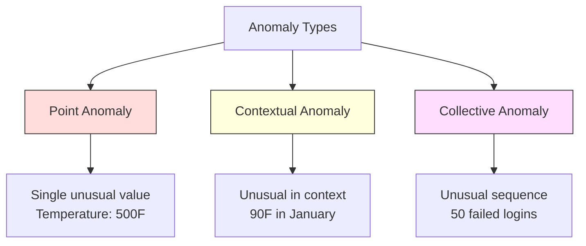
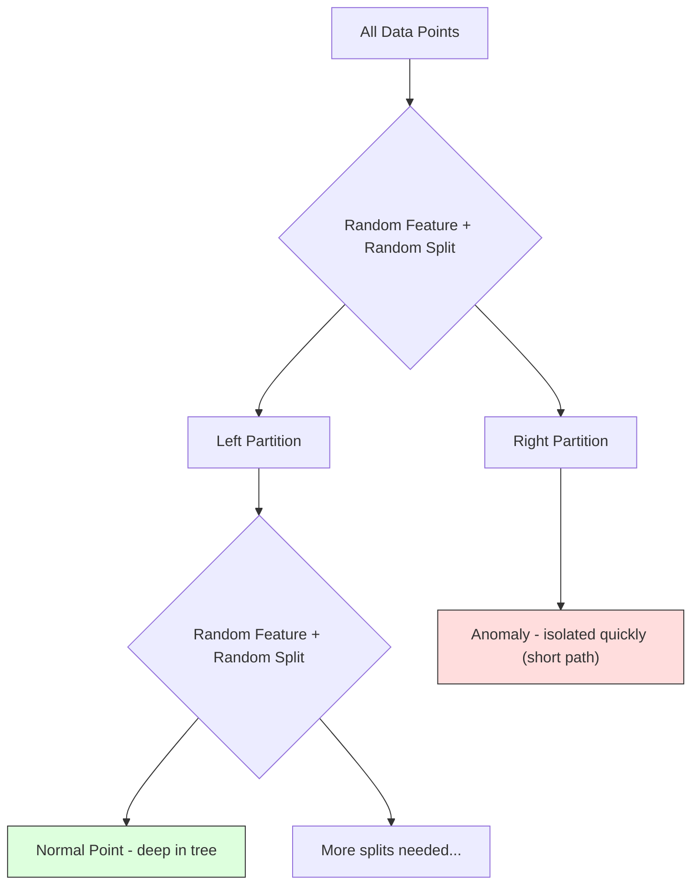
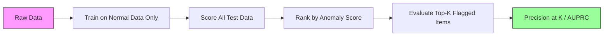

# اكتشاف التشوهات
# 异常检测


> الطبيعي سهل التعريف غير الطبيعي هو أي شيء لا يناسب

> عادة ما يكون من السهل تحديدها.

**Type:** Build | **类型：** 构建
**Language:**" بايثون "**语言：**بايثون
**Prerequisites:** Phase 2, Lessons 01-09 | **前置知识：** Phase 2 第 1-9 课
**Time:** ~75 minutes | **时间：** 约 75 分钟

## أهداف التعلم

- تنفيذ أساليب اكتشاف الاختلافات الغابية من الصفر
  من صفر تحقيق Z-نقطة IQR و العزل الغابة  طريقة الاختبار غير المعتاد
- تمييز بين الانحرافات النقطية والسياقية والجماعية واختيار طريقة الكشف المناسبة لكل
  区分点异常、上下文异常和集合异常, لكل نوع من الاختيارات المناسبة لطرق الاختبار
- شرح لماذا يتم إطار الكشف عن الاختلافات على أنها نموذج بيانات طبيعية بدلاً من تصنيف الاختلافات
  شرح لماذا يتم إطار الاختبار الغير طبيعي لبناء البيانات الطبيعية وليس التقسيم الغير طبيعي
- مقارنة الكشف عن الفجوة غير المشرف عليها مع التصنيف المشرف عليها وتقييم التنازل بين تغطية الفجوة الجديدة والدقة
  مقارنة بين فئة الاختبارات غير المراقبة والفئة المراقبة، وتقييم معدل التغطية والتحديد بين الفئة الجديدة


> **【中文解读】**
> 异常检测找出不同数据点──信用卡欺诈检测、设备故障预警、网络入侵检测都依赖于──隔离森林 和 一级SVM是常用方法──sklearn 中的隔离森林──

> **【拓展：异常检测在金融和网络安全中的核心应用】**
> نظام فيزا للتحقق من الاحتيال في الوقت الحقيقي يعالج حوالي 76,000 عملية معاملة في الثانية ، باستخدام طريقة مختلطة للتحقق من الاحتيال + مراقبة التعلم ، في حوالي 150 ملث ثانية لتحكم ما إذا كان الاحتيال. نظام أمن شبكة جوجل باستخدام الاحتيال الاختراعي للكشف عن هجمات DDoS واعتداءات الدخول غير عادية. نظام إدارة البطارية في Tesla باستخدام الاحتيال الاختراعي الاختراعي الاختراعي الاختراعي الاختراعي الاختراعي. التحدي الأساسي للتحقق من الاحتيال هو عدم توازن الحد الأقصى.

## المشكلة المشكلة المشكلة

تستخدم بطاقة ائتمان في نيويورك في الساعة الثانية مساءً، ثم في طوكيو في الساعة الثانية والخامسة مساءً. يقرأ جهاز استشعار مصنع 150 درجة عندما يكون المدى الطبيعي 80-120.

> 1张信用卡下午 2 点在纽约使用,然后 2:05 在东京使用.

هذه هي شذوذات، إيجادها مهمة، الفساد يكلف مليارات، فشل المعدات يكلف وقت الإيقاف، وتسلل شبكة البيانات تكلفة.

> هذه هي غير عادية. اكتشافها مهم. الغش يسبب مليارات الخسائر. تعطيلات الأجهزة يؤدي إلى توقف.

التحدي: نادرا ما تكون قد وصفت أمثلة عن تشوهات. الاحتيال يمثل 0.1% من المعاملات تحدث فشلات في المعدات عدة مرات في السنة لا يمكنك تدريب مصنف قياسي لأن هناك تقريبا شيء في فئة "الغير طبيعي" للتعلم من. حتى لو كان لديك بعض العلامات، فإن الفوارق التي رأيتها ليست النوع الوحيد الذي ستواجهه. مخططات الغد تختلف عن اليوم

> التحدي يكمن في: لديك قليل من نماذج العلامات غير عادية. الغش يشكل 0.1% فقط من التداول. تعطيلات الأجهزة تحدث فقط عدة مرات في السنة. لا يمكنك تدريب المعدات القياسية، لأن هناك ما لا يمكن تعلمه تقريبا في فئة "غريبة". حتى مع وجود بعض العلامات غير عادية، فإن الغش الذي رأيته ليس النوع الوحيد الذي ستواجهه.

اكتشاف التشوهات يغير المشكلة. بدلاً من تعلم ما هو غير طبيعي، تعلم ما هو طبيعي. أي شيء يفترق عن الطبيعي مشبوه. هذا يعمل دون علامات، يتكيف مع أنواع جديدة من التشوهات، وتقليد إلى مجموعات بيانات ضخمة.

>  غير عادية الاختبار حولت المشكلة‬‬‬‬‬‬‬‬‬‬‬‬‬‬‬‬‬‬‬‬‬‬‬‬‬‬‬‬‬‬‬‬‬‬‬‬‬‬‬‬‬‬‬‬‬‬‬‬‬‬‬‬‬‬‬‬‬‬‬‬‬‬‬‬‬‬‬‬‬‬‬‬‬‬‬‬‬‬‬‬‬‬‬‬‬‬‬‬‬‬‬‬‬‬‬‬‬‬‬‬‬‬‬‬‬‬‬‬‬‬‬‬‬‬‬‬‬‬‬‬‬‬‬‬‬‬‬‬‬‬‬‬‬‬‬‬‬‬‬‬‬‬‬‬‬‬‬‬‬‬‬‬‬‬‬‬‬‬‬‬‬‬‬‬‬‬‬‬‬‬‬‬‬‬‬‬‬‬‬‬‬‬‬‬‬‬‬‬‬‬‬‬‬‬‬‬‬‬‬‬‬‬‬‬‬‬‬‬‬‬‬‬‬‬‬‬‬‬‬‬‬‬‬‬‬‬‬‬‬‬‬‬‬‬‬‬‬‬‬‬‬‬‬‬‬‬‬‬‬‬‬‬‬‬‬‬‬‬‬‬‬‬‬‬‬‬‬‬‬‬‬‬‬‬‬‬‬‬‬‬‬‬‬‬‬‬‬‬‬‬‬‬‬‬‬‬‬‬‬‬‬‬‬‬‬‬‬‬‬‬‬‬‬‬‬‬‬‬‬‬‬‬‬‬‬‬‬‬‬‬‬‬‬‬‬‬‬‬‬‬‬‬‬‬‬‬‬‬‬‬‬‬‬‬‬‬‬‬‬‬‬‬‬‬‬‬‬‬‬‬‬‬‬‬‬‬‬‬‬‬‬‬‬‬‬‬‬‬‬‬‬‬‬‬‬‬‬‬‬‬‬‬‬‬‬‬‬‬‬‬‬‬‬‬‬‬‬‬‬‬‬‬‬‬‬‬‬‬‬‬‬‬‬‬‬‬‬‬‬‬‬‬‬‬‬‬‬‬‬‬‬‬‬‬‬‬‬‬‬‬‬‬‬‬‬‬‬‬‬‬‬‬‬‬‬‬‬‬‬‬‬‬‬‬‬‬‬‬‬‬‬‬‬‬‬‬‬‬

> **【中文解读】**
>                                                                                                                                                                                                                                                               

## المفهوم الأساسي

### أنواع التشوهات

ليس كل التشوهات هي نفسها

> ليس كلّ الاختلافات نفسها:

- **Point anomalies.**نقطة بيانات واحدة غير عادية بغض النظر عن السياق قراءة درجة حرارة من 500 درجة.$50,000 from an account that normally spends $خمسين
  نقطة عادة: أيّا كان ما يليّا، كلّ ما يليّا، كلّ ما يليّا، كلّ ما يليّا، كلّ ما يليّا، كلّ ما يليّا، كلّ ما يليّا، كلّ ما يليّا، كلّ ما يليّا، كلّ ما يليّا، كلّ ما يليّا، كلّ ما يليّا، كلّ ما يليّا، كلّ ما يليّا، كلّ ما يليّا، كلّ ما يليّا، كلّ ما يليّا، كلّ ما يليّا، كلّ ما يليّا، كلّ ما يليّا، كلّ ما يليّا، كلّ ما يليّا، كلّ ما يليّا، كلّ ما يليّا، كلّا، كلّ ما يليّا، كلّا، كلّا، كلّا، كلّا، كلّا، كلّا، كلّا، كلّا، كلّا، كلّا، كلّا، كلّا، كلّا، كلّا، كلّا، كلّا، كلّا، كلّا، كلّا، كلّا، كلّا، كلّا، كلّا، كلّا، كلّا، كلّا، كلّا، كلّا، كلّا، كلّا، كلّا، كلّا، كلّا، كلّا، كلّا.
- **Contextual anomalies.**نقطة بيانات غير عادية نظراً لسياقها، درجة حرارة 90 درجة طبيعية في الصيف، غير طبيعية في الشتاء، نفس القيمة، سياق مختلف.
                                                                                                                                                                                                                                                                
- **Collective anomalies.**تسلسل من نقاط البيانات غير عادية كمجموعة، على الرغم من أن كل نقطة فردية قد تكون طبيعية. خمسة فشل تسجيل الدخول هو طبيعي. خمسين على التوالي هو هجوم بقوة قاسية.
  مجموعة عاديات. مجموعة من نقاط البيانات ككل غير طبيعية، حتى لو كانت كل نقطة منفصلة ممكنة أن تكون طبيعية.

معظم الطرق تكتشف تشوهات النقاط. تشوهات السياق تحتاج إلى خصائص الوقت أو الموقع. تشوهات جماعية تحتاج إلى طرق واعية بالترتيب.

> معظم الأساليب تُحقق النقاط غير عادية.



### الإطارات التي لا يتم الإشراف عليها

في التصنيف القياسي، لديك علامات لكل من الفئات. في اكتشاف الانحرافات، عادة ما يكون لديك واحدة من ثلاثة حالات:

> في الطبقات المعيارية، لديك فئتين من العلامات. في الاختبارات الغير عادية، عادة ما تواجه أحد الحالات الثلاثة التالية:

1. **Fully unsupervised.**لا تسمّيات على الإطلاق، تُصنع الكاشف على جميع البيانات، وتأمل أن تكون الخلل نادرة بما فيه الكفاية لعدم إفساد النموذج "العادي".
   完全 بدون مراقبة 完全 بدون علامة ٬ أنت على جميع البيانات الملائمة مع اختبار ، آمل أن غير عادية بما فيه الكفاية قليلا حتى لا يفسد "طبيعية" النموذج ٬
2. **Semi-supervised.**لديك مجموعة بيانات نظيفة من البيانات العادية فقط. تتناسب مع هذه مجموعة نظيفة وتسجل كل شيء آخر. هذا أقوى إعداد عندما يكون ذلك ممكنا.
   半监督──你只有 واحد فقط من المجموعات الصحيحة العادية.
3. **Weakly supervised.**لديك بعض الخلل المسموح بها. استخدمها لتقييم وليس للتدريب. تدريب دون إشراف، ثم قياس الدقة / التذكر على مجموعة الفرعية المسموحة.
   弱监督──你有一些标注的异常──将它们用于评估而不是训练──无监督训练,然后在标注子集上测量精确率/召回率──

المعلومات الرئيسية: اكتشاف الانحرافات مختلف بشكل أساسي عن التصنيف. أنت تقوم بتصميم نموذج لتوزيع البيانات الطبيعية، وليس الحدود القرارية بين فئتين.

> الاختبار غير المألوف يختلف بشكل أساسي عن الفئات.

### المراقبة ضد غير المراقبة: التداول

إذا كان لديك علامة على الانحرافات، هل يجب عليك استخدامها للتدريب (التصنيف المشرف عليه) أو للتقييم فقط (الاكتشاف غير المشرف عليه) ؟

> إذا كان لديك بالفعل معايير معينة، هل ينبغي استخدامها للتدريب أو فقط لتقييم؟

**Supervised (treat as classification):**
- يلتقط نفس أنواع الانحرافات التي رأيتها من قبل
  "أصطحب نوعاً ما من الاختلافات التي رأيتها من قبل"
- دقة أعلى على أنواع الانحراف المعروفة
  معدل تحديد أعلى للأنواع المعروفة
- يفتقد نوعاً من النوع المختلفة الجديدة تماماً
  تماماً خطأ نوع جديد من الغرابة
- يتطلب إعادة التدريب عند ظهور أنواع جديدة من الاختلافات
  عندما يظهر النوع الجديد من الغير عادية تحتاج إلى إعادة التدريب
- يحتاج إلى أمثلة كافية من الاختلافات (غالبا ما تكون قليلة جدا)
   بحاجة إلى نموذج غير عادي كافٍ (عادةً يكون قليلًا)

**Unsupervised (model normal, flag deviations):**
- يلتقط أي انحراف عن الطبيعي، بما في ذلك الأنواع الجديدة
  التقاط أي حالات خارج عن الطبيعي، بما في ذلك النوع الجديد
- لا يتطلب وجود تشوهات معينة
  لا تحتاج إلى علامة
- معدل الإيجابية الكاذبة الأعلى (ليس كل شيء غير عادي سيء)
  أعلى نسبة الإيجابية المزيفة ((ليس كل غير العادي هو كل شيء سيء))
- أكثر قوة لتغيير التوزيع
  لتنفيذ التوزيع

في الممارسة العملية، فإن أفضل الأنظمة تجمع بين كل من: الكشف غير المشرف على التغطية الواسعة، والنماذج المشرفة للأنواع المعروفة من الانحرافات ذات الأولوية العالية، والتحقق البشري للوقائع المزدوجة.

> في الممارسة، أفضل النظام يجمع بينهما: لا وجود إشراف الاختبار للاستفادة الواسعة، و نموذج الإشراف للكيفية المختلفة ذات الأولوية العالية المعروفة، والإشراف الاصطناعي للوضع المحتمل.

### طريقة Z-Score

أسهل نهج: حساب متوسط و الانحراف القياسي لكل ميزة. علامة أي نقطة أكثر من k الانحراف القياسي من المتوسط.

> أسهل طريقة: حساب متوسط وفرق المعايير لكل سمة: علامة على أي انحراف يتجاوز نقطة الاختلاف المعايير

```text
z_score = (x - mean) / std
anomaly if |z_score| > threshold
```

الحد الأساسي هو 3.0 (99.7% من البيانات الطبيعية تقع ضمن 3 انحرافات قياسية لتوزيع غوس).

> 默认值为3.0 ((%99.7٪ من التوزيع العالي البيانات الطبيعية تقع في 3 标准差内)

**Strengths:**بسيط. سريع. قابل للتفسير ("هذه القيمة هي 4.5 انحرافات قياسية من الطبيعي").

> **优势：**简单――快速――可解释("هذا القيمة تتفاوت عن النظام الطبيعي 4.5 个标准差")

**Weaknesses:**يفترض أن البيانات موزعة بشكل طبيعي. حساسة للخلفيات في بيانات التدريب (تغير الخلفيات المتوسط وتضخم المعدل، مما يجعل من الصعب اكتشافها).

> **劣势：**假设数据服从正态分布――对训练数据中的异常值敏感(异常值会偏移平均值并膨胀标准差,使它们更难被检测)―在多峰分布上失败――

**When it works well:**مراقبة ذات ميزة واحدة حيث تكون البيانات على شكل صاروخ تقريبًا، وقتاً استجابة الخادم، ومسامح التصنيع، وقراءات المستشعر مع خطوط أساس مستقرة.

> **适用场景：**البيانات الكبيرة حول عرض الساعة.

**When it fails:**بيانات متعددة المجموعات (مواقع مكتبين مع درجات حرارة أساسية مختلفة) ، بيانات منحرفة (مبالغ المعاملات حيث 1000 دولار نادرة ولكن ليست غير شائعة) ، بيانات مع مستويات خارجية في مجموعة التدريب.

> **失效场景：**                                                                                                                                                                                                                                                              

### طريقة IQR

أكثر قوة من النتائج Z يستخدم النطاق بين الأربعاء بدلا من المتوسط والانحراف القياسي

> بي بي زي-سكور بي بي رُبَاس. استخدام أربعة نقاط عن طريق البدل في متوسط القيمة والمعيار.

```
Q1 = 25th percentile
Q3 = 75th percentile
IQR = Q3 - Q1
lower_bound = Q1 - factor * IQR
upper_bound = Q3 + factor * IQR
anomaly if x < lower_bound or x > upper_bound
```

عامل الافتراض هو 1.5

> 默认因子为 1.5。

**Strengths:**قوية إلى مستويات خارجية (الرسومات غير متأثرة بالقيم المتطرفة). يعمل على توزيعات متساهلة. لا افتراض للطبيعية.

> **优势：**للقيمة غير العادية للخيارات المعدنية

**Weaknesses:**متغير فقط (يطبق لكل ميزة بشكل مستقل). لا يمكن اكتشاف الانحرافات التي غير عادية فقط عندما يتم النظر في الميزات معا (يمكن أن تكون نقطة طبيعية في كل ميزة بشكل فردي ولكن غير عادية في الفضاء المشترك).

> **劣势：**                                                                                                                                                                                                                                                              

**Practical note:**يطابق عامل 1.5 في IQR مع الحلاقات في مسار مربع. نقاط خارج الحلاقات هي مستويات خارجية محتملة. استخدام 3.0 بدلاً من 1.5 يجعل الكاشف أكثر تحافظاً (أقل علامات، أقل إيجابيات كاذبة). يعتمد العامل الصحيح على تسامحك للاجهزة الإنذار الكاذبة.

> **实践提示：**1.5 عنصر في IQR يتعلق بالضرورة في الصندوق. يجب أن يكون نقطة خارجية من غير المعتاد المحتمل. استخدام 3.0 بدلا من 1.5 جعل الاختبار أكثر حراسة.

### غابة عزل

المفهوم الرئيسي: ان الانقسامات قليلة و مختلفة. في قسم عشوائي للبيانات، ان الانقسامات غير عشوائية أسهل في العزل --

> 关键洞察: الاختلافات قليلة جداً ومختلفة جداً. في التقسيم الاختياري للبيانات، ففي الوقت الذي يتم فيه فصل الاختلافات، يكون من السهل جداً.



**How it works:**
1. بناء العديد من الأشجار العشوائية (غابة عزلة)
   构建许多随机树 (بناء العديد من الأشجار)
2. في كل عقدة، اختر ميزة عشوائية وقيمة تقسيم عشوائية بين ميزة من و أقصى
   في كل نقطة، اختيار خصائص وخصائص تقسيمات بين القيمة الحد الأدنى والقيمة الأكبر
3. استمر في الانقسام حتى يتم عزل كل نقطة (في ورقتها الخاصة)
   استمرار الانفصال حتى يتم فصل كل نقطة
4. التشوهات لديها أطوال مسار قصيرة في جميع الأشجار
   异常在所有树中平均路径长度更短

**Why it works:**النقاط الطبيعية تعيش في مناطق كثيفة. تحتاج العديد من الانقسامات العشوائية لعزل واحد من جيرانها. التشوهات تعيش في المناطق النادرة. واحد أو اثنين من الانقسامات العشوائية يكفي لعزلهم.

> **为什么有效：**يُحتاج الكثير من الانقسامات السرية لتمييز النقطة عن جارتها.

يتم تعيين درجة الانحراف على متوسط طول المسار عبر جميع الأشجار، معتاد على طول المسار المتوقع لشجرة البحث الثنائية العشوائية:

>  العدد غير المعتاد على أساس متوسط طول الطريق بين جميع الأشجار، من خلال إعادة توحيد طول الطريق المتوقع من شجرة البحث الثنائية:

```
score(x) = 2^(-average_path_length(x) / c(n))
```

أين`c(n)`هو طول المسار المتوقع لـ n عينات. النتيجة بالقرب من 1 تعني انعدام. النتيجة بالقرب من 0.5 تعني طبيعية. النتيجة بالقرب من 0 تعني طبيعية للغاية (عمقًا في مجموعات كثيفة).

> من بينهم`c(n)`هو طول الطريق المتوقع للنموذج. √ √ √ √ √ √ √ √ √ √ √ √ √ √ √ √ √ √ √ √ √ √ √ √ √ √ √ √ √ √ √ √ √ √ √ √ √ √ √ √ √ √ √ √ √ √ √ √ √ √ √ √ √ √ √ √ √ √ √ √ √ √ √ √ √ √ √ √ √ √ √ √ √ √ √ √ √ √ √ √ √ √ √ √ √ √ √ √ √ √ √ √ √ √ √ √ √ √ √ √ √ √ √ √ √ √ √ √ √ √ √ √ √ √ √ √ √ √ √ √ √ √ √ √ √ √ √ √ √ √ √ √ √ √ √ √ √ √ √ √ √ √ √ √ √ √ √ √ √ √ √ √ √ √ √ √ √ √ √ √ √ √ √ √ √ √ √ √ √ √ √ √ √ √ √ √ √ √ √ √ √ √ √ √ √ √ √ √ √ √ √ √ √ √ √ √ √ √ √ √ √ √ √ √ √ √ √ √ √ √ √ √ √ √ √ √ √ √ √ √ √ √ √ √ √ √ √ √ √ √ √ √ √ √ √ √ √ √ √ √ √ √ √ √ √ √ √ √ √ √

**Strengths:**لا يوجد افتراضات التوزيع. يعمل في أبعاد عالية. القياس جيدًا (سلبلينير في حجم العينة لأن كل شجرة تستخدم عينة فرعية). يتعامل مع أنواع ميزات مختلطة.

> **优势：**无分布假设──适用高维度──扩展性好样本量亚线性,因为每棵树使用子采样)──处理混合特征类型──

**Weaknesses:**الصراعات مع الانحرافات في المناطق الكثيفة (تأثير التخفيض). الانقسام العشوائي أقل فعالية عندما تكون العديد من الميزات غير ذات صلة.

> **劣势：**صعوبة في التعامل مع الغير عادية في المناطق المكثفة.

**Key hyperparameters:**
- `n_estimators`عدد الأشجار. 100 عادة ما يكون كافياً. المزيد من الأشجار تعطى درجات أكثر استقرارًا ولكن الحسابات بطيئة.
  `n_estimators`عدد الأشجار: 100. عادة ما يكون كافيا. المزيد من الأشجار تعطى نسبة أكثر استقرارًا ولكن الحساب أسرع.
- `max_samples`عدد العينات لكل شجرة. 256 هو الافتراض في الورقة الأصلية. القيم الأصغر تجعل الأشجار الفردية أقل دقة ولكن تزيد من التنوع.
  `max_samples`: عدد عينات كل شجرة. مقال أساسي يعتقد أن 256.
- `contamination`: جزء متوقع من الانحرافات. يستخدم فقط لتحديد العد. لا يؤثر على النتائج نفسها.
  `contamination`: توقعات النسبة غير العادية.

### عامل الفائدة المحلية (LOF)

مقارنة LOF كثافة المحلية حول نقطة مع كثافة حول جيرانها. نقطة في منطقة نادرة محاطة بمناطق كثيفة هي غير طبيعية.

> يُقارن LOF كثافة المكان المحيط بالنقطة مع كثافة الجوار المحيط بها.

**How it works:**
1. لكل نقطة، العثور على أقرب جيرانها k
   للكل نقطة، العثور على قريبا
2. احسب كثافة الوصول المحلي (كم كثافة الحي)
   计算局部可达密度 (الجهة المجاورة لديها كثافة متعددة)
3. مقارنة كثافة كل نقطة مع كثافة جيرانها
   مقارنة كثافة كل نقطة مع كثافة الجوار
4. إذا كانت النقطة لديها كثافة أقل بكثير من جيرانها، فإنها خارجية
   إذا كانت كثافة نقطة أقل بكثير من الجوار، فهو نقطة غير عادية.

**LOF score:**
- LOF قريب من 1.0 يعني كثافة مماثلة للجيران (طبيعية)
  LOF  تقارب 1.0 يعني مشابهة مع كثافة الجوار
- LOF أكبر من 1.0 يعني كثافة أقل من الجيران (شكل غير طبيعي محتمل)
  LOF أكبر من 1.0 يعني كثافة أقل من الجار))
- LOF أكبر بكثير من 1.0 (مثل، 2.0+) يعني كثافة أقل بكثير (شكل غير طبيعي محتمل)
  LOF 远大于1.0(如2.0+) يعني كثافة أقل بكثير(ربما يكون غير طبيعي)

الجزء "المحلي" أمر حاسم. فكر في مجموعة بيانات مع مجموعة مليتين: مجموعة كثيفة من 1000 نقطة ومجموعة نادرة من 50 نقطة. نقطة على حافة المجموعة النادرة ليست غير عادية عالميا - لديها 50 جيران. ولكن من غير العادي محليا إذا كان جيرانها المباشرين أكثر كثافة من هو. LOF يلتقط هذه اللونات التي تفتقر إلى الأساليب العالمية.

> "المنطقة" هي المفتاح. النظر في مجموعة بيانات لديها مجموعتين: مجموعة كثيفة من 1000 نقطة و 50 نقطة من النقطة نادرة التركيبة. نقطة الحافة من النقطة نادرة التركيبة ليست في جميع أنحاء الغير عادي.

**Strengths:**يكتشف الانحرافات المحلية (النقاط التي غير عادية في مجال حيّتهم، حتى لو لم تكن غير عادية عالمياً). يعمل على مجموعات ذات كثافة مختلفة.

> **优势：**检测局部异常 (检测局部异常)  检测局部异常 (检测局部异常)  检测局部异常 (检测局部异常)  检测局部异常 (检测局部异常)  检测局部异常 (检测局部异常)  检测局部异常 (检测局部异常)  检测局域中不寻常的点,即使它们不是全局异常)  检测局部异常 (检测局部异常)  检测局域中不寻常的点,即使它们不是全局异常)  检测局部异常 (检测局部异常)  适用于不同密度的聚聚类

**Weaknesses:**بطيئة على مجموعات بيانات كبيرة (O(n^2) للتنفيذ ساذج. حساسة لخيار k. لا تعمل بشكل جيد في الأبعاد العالية جدا (لعنة الأبعاد تؤثر على حسابات المسافة).

> **劣势：**في الكتلة البيانية الكبيرة السرعة بطيئة (بسيطة التنفيذ ل O (n^2))  حساسة لخيار k‬ في درجة عالية جداً

### المقارنة

| Method | Assumptions | Speed | Handles High Dims | Detects Local Anomalies |
|--------|------------|-------|-------------------|------------------------|
| Z-score | Normal distribution | Very fast | Yes (per feature) | No |
| IQR | None (per feature) | Very fast | Yes (per feature) | No |
| Isolation Forest | None | Fast | Yes | Partially |
| LOF | Distance is meaningful | Slow | Poorly | Yes |

### تحديات التقييم

تقييم كاشفات الاختلافات أصعب من تقييم المصنفات:

> 评估异常检测器比评估分类器更困难:

- **Extreme class imbalance.**مع وجود انشطة منخفضة بنسبة 0.1٪، التنبؤ "طبيعي" لكل شيء يعطي دقة بنسبة 99.9٪.
  تحت معدل غير متوازن 0.1% من الدرجات المتعددة، يمكن أن يكون التنبؤ "طبيعي" بنسبة 99.9% من معدل التأكد.
- **AUROC is misleading.**مع عدم التوازن الكبير، يمكن أن تبدو AUROC جيدة حتى عندما يفوت النموذج معظم الخلل في العدوان العملية.
  في حالة عدم توازن خطير، حتى لو كانت النموذج قد تجاوزت معظم الاختلافات في القيمة العملية، تبدو AUROC غير خاطئة.
- **Better metrics:**Precision@k (من العناصر التي تم وضع علامة k في الأعلى، كم عدد الخلل الحقيقي) ، AUPRC (المنطقة تحت منحنى استدعاء الدقة) ، والإستدعاء بمعدل ثابت إيجابي كاذب.
  أفضل مؤشر:دقة@k(排名前 k 个标记项中有多少是真正的异常)



### خط أنابيب الكشف عن التشوهات

في الممارسة العملية، يلاحظ الكشف عن الاختلافات هذا التدفق العملي:

> في الممارسة العملية، تتبع الاختبارات غير عادية التيارات التالية:

1. **Collect baseline data.**في المثالية، فترة تعرف فيها أنه لا توجد (أو قليل جداً) من الانشطة.
   收集基线数据── في حالة مثالية، فترة تعرفون فيها لا وجود لها (((أو هناك قليل جدا) فترة غير عادية──
2. **Feature engineering.**الميزات الخام بالإضافة إلى الميزات المشتقة (إحصاءات التدفق، الميزات الزمنية، النسب).
   خصائص المهنية. الصفات الأساسية بالإضافة إلى المنتجات.
3. **Train the detector.**يتناسب مع البيانات الأساسية، ويتعلم النموذج كيف يبدو "طبيعي"
   訓練检测器──在基线数据上拟合──模型学习"正常"的样式──
4. **Score new data.**كل ملاحظة جديدة تحصل على درجة من الاختلافات
   على كل مشاهدة جديدة حصل على عدد غير عادي
5. **Threshold selection.**اختر قطع النتيجة هذا قرار تجاري: أعلى عتبة يعني أقل إنذارات كاذبة ولكن أكثر تشوهات مفقودة.
   选择值──选择分数截断值── هذا قرار عمل: قيمة أعلى يعني أقل إخطاءات ولكن أكثر إخطاءات‬‬‬‬‬‬‬‬‬‬‬‬‬‬‬‬‬‬‬‬‬‬‬‬‬‬‬‬‬‬‬‬‬‬‬‬‬‬‬‬‬‬‬‬‬‬‬‬‬‬‬‬‬‬‬‬‬‬‬‬‬‬‬‬‬‬‬‬‬‬‬‬‬‬‬‬‬‬‬‬‬‬‬‬‬‬‬‬‬‬‬‬‬‬‬‬‬‬‬‬‬‬‬‬‬‬‬‬‬‬‬‬‬‬‬‬‬‬‬‬‬‬‬‬‬‬‬‬‬‬‬‬‬‬‬‬‬‬‬‬‬‬‬‬‬‬‬‬‬‬‬‬‬‬‬‬‬‬‬‬‬‬‬‬‬‬‬‬‬‬‬‬‬‬‬‬‬‬‬‬‬‬‬‬‬‬‬‬‬‬‬‬‬‬‬‬‬‬‬‬‬‬‬‬‬‬‬‬‬‬‬‬‬‬‬‬‬‬‬‬‬‬‬‬‬‬‬‬‬‬‬‬‬‬‬‬‬‬‬‬‬‬‬‬‬‬‬‬‬‬‬‬‬‬‬‬‬‬‬‬‬‬‬‬‬‬‬‬‬‬‬‬‬‬‬‬‬‬‬‬‬‬‬‬‬‬‬‬‬‬‬‬‬‬‬‬‬‬‬‬‬‬‬‬‬‬‬‬‬‬‬‬‬‬‬‬‬‬‬‬‬‬‬‬‬‬‬‬‬‬‬‬‬‬‬‬‬‬‬‬‬‬‬‬‬‬‬‬‬‬‬‬‬‬‬‬‬‬‬‬‬‬‬‬‬‬‬‬‬‬‬‬‬‬‬‬‬‬‬‬‬‬‬‬‬‬‬‬‬‬‬‬‬‬‬‬‬‬‬‬‬‬‬‬‬‬‬‬‬‬‬‬‬‬‬‬‬‬‬‬‬‬‬‬‬‬‬‬‬‬‬‬‬‬‬‬‬‬‬‬‬‬‬‬‬‬‬‬‬‬‬‬‬‬‬‬‬‬‬‬‬‬‬‬‬‬‬‬‬‬‬‬‬‬‬‬‬‬
6. **Alert and investigate.**النقاط المعلقة تذهب إلى مراجعة البشر أو الاستجابة الآلية.
   告警和调查── نقطة إشارة دخول المراجعة الاصطناعية أو الاستجابة الذاتية──
7. **Feedback collection.**سجل ما إذا كانت العناصر المشار إليها هي حالات غير طبيعية حقيقية أو إنذارات كاذبة. استخدم هذه البيانات لتقييم الكاشف وتحديد العد الأدنى مع مرور الوقت.
   收集反──记录标记项是真的异常还是错误报道──使用这些数据评估检测器并随时间调优值──

لا يتم "إنهاء" خط الأنابيب أبداً. تتحول توزيعات البيانات، ويتم ظهور أنواع جديدة من الانحرافات، ويجب تعديل العدوان. تعامل كشف الانحرافات كنظام حي، وليس نموذج لمرة واحدة.

> 管线永远不会"完成"―― الانتقالات المتوفرة للبيانات، ظهور أنواع جديدة من الاختبارات غير عادية،القدر بحاجة إلى ضبطها――将异常检测视为一个活系统,而不是模型一次性――

## بناء ذلك تحرك لتحقيق

> **【中文解读】**
> من التنفيذ من صفر ثلاثة طرق لتحقيق الاختيارات الغريبة: Z-score ((بناء على القيمة المتوسطة والفرق المعيارية، تكيّف مع بيانات التوزيع الصارم المباشر) √IQR ((بناء على أربعة نقاط، على الاختيارات الغابية) √Isolation Forest ((随机选择特征和分离数据点,异常点平均需要更少的分离次数))

> **【拓展：异常检测在 AIOps 和制造业中的应用】**
> تُستخدم مايكروسوفت أزور المراقبة باستخدام الاختبار غير المعتاد للاكتشاف الذاتي للاداء غير المعتاد للخدمات السحابية. تستخدم نيتفليكس باستخدام الاختبار غير المعتاد لرصد المعايير المختلفة للخدمات التدريبية (التأخير والخطأ، وما إلى ذلك) ، وتتحقق كل يوم من مليارات نقاط البيانات. تستخدم فوسكان في خط الإنتاج باستخدام الاختبار غير المعتاد لتعرض لأي خطأ في الأجهزة، وسوف تقلل وقت التوقف عن التشغيل بنسبة 30%. التحدي الرئيسي في الاختبار غير المعتاد هو السيطرة على معدل الإبلاغ الخطأ.
```figure
f3-anomaly-fence
```

## بناءها

الرمز في`code/anomaly_detection.py`يطبق النتائج Z-Score، IQR، و الغابة العزلة من الصفر.

> `code/anomaly_detection.py`من الصفر تم تحقيق الدرجة الزيد، والقيمة العليا والغابة العزلة.

### كاشف الدرجة الزيد

```python
def zscore_detect(X, threshold=3.0):
    mean = X.mean(axis=0)
    std = X.std(axis=0)
    std[std == 0] = 1.0
    z = np.abs((X - mean) / std)
    return z.max(axis=1) > threshold
```

بسيط ومجهري، يُعَلِّم نقطة إذا تجاوزت أيّة صفة العدّ.

> 简单且向量化──如果 أي خصائص تتجاوز 值则标记该点──

### جهاز تحديد IQR

```python
def iqr_detect(X, factor=1.5):
    q1 = np.percentile(X, 25, axis=0)
    q3 = np.percentile(X, 75, axis=0)
    iqr = q3 - q1
    iqr[iqr == 0] = 1.0
    lower = q1 - factor * iqr
    upper = q3 + factor * iqr
    outside = (X < lower) | (X > upper)
    return outside.any(axis=1)
```

### الغابة العزلة من الصفر

تنفيذ من الصفر يبنى أشجار العزل التي تقسم عشوائيا مساحة الميزات:

> من التنفيذ التكوينية إلى التقسيم المميز للمرافق:

```python
class IsolationTree:
    def __init__(self, max_depth):
        self.max_depth = max_depth

    def fit(self, X, depth=0):
        n, p = X.shape
        if depth >= self.max_depth or n <= 1:
            self.is_leaf = True
            self.size = n
            return self
        self.is_leaf = False
        self.feature = np.random.randint(p)
        x_min = X[:, self.feature].min()
        x_max = X[:, self.feature].max()
        if x_min == x_max:
            self.is_leaf = True
            self.size = n
            return self
        self.threshold = np.random.uniform(x_min, x_max)
        left_mask = X[:, self.feature] < self.threshold
        self.left = IsolationTree(self.max_depth).fit(X[left_mask], depth + 1)
        self.right = IsolationTree(self.max_depth).fit(X[~left_mask], depth + 1)
        return self
```

طول المسار لتحديد نقطة يحدد نتيجة تشابهاته. المسارات القصيرة تعني أكثر تشابهًا.

> طول الطريق من نقطة منفصلة يحدد عدد العناصر غير العادية.

- نعم`IsolationForest`الطبقة تغلف العديد من الأشجار:

> `IsolationForest`类包装了多棵树:

```python
class IsolationForest:
    def __init__(self, n_estimators=100, max_samples=256, seed=42):
        self.n_estimators = n_estimators
        self.max_samples = max_samples

    def fit(self, X):
        sample_size = min(self.max_samples, X.shape[0])
        max_depth = int(np.ceil(np.log2(sample_size)))
        for _ in range(self.n_estimators):
            idx = rng.choice(X.shape[0], size=sample_size, replace=False)
            tree = IsolationTree(max_depth=max_depth)
            tree.fit(X[idx])
            self.trees.append(tree)

    def anomaly_score(self, X):
        avg_path = average path length across all trees
        scores = 2.0 ** (-avg_path / c(max_samples))
        return scores
```

عامل التطبيع`c(n)`هو طول المسار المتوقع لبحث غير ناجح في شجرة البحث الثنائية مع n عناصر. يساوي `2 * H(n-1) - 2*(n-1)/n`أين`H`هذا التطبيع يضمن أن النتائج مقارنة عبر مجموعات بيانات من أبعاد مختلفة.

> 归一化因子 `c(n)`هو طول الطريق المتوقع لعدد n 个元素.`2 * H(n-1) - 2*(n-1)/n`، من بينهم`H`هو تعديل العدد. هذا التوحيد يضمن أن النقاط يمكن مقارنة بين مجموعات بيانات مختلفة.

### سيناريوهات الاكتشاف

يخلق الرمز سيناريوهات اختبار متعددة:

> 代码生成多个测试场景:

1. **Single cluster with outliers.**مجموعة غوسية ثنائية الأبعاد مع تشوهات حقن بعيدا عن المركز جميع الأساليب يجب أن تعمل هنا
   单聚类加异常值――一 2D 高聚类,在远离中心处注入异常――所有方法在此场景下应该都能工作――
2. **Multimodal data.**ثلاث مجموعات من أبعاد مختلفة و كثافة مختلفة النقاط بين مجموعات غير طبيعية النتيجة Z تكافح لأن نطاقات الميزات واسعة
   عدد أعلى البيانات. ثلاثة نقاط مختلفة في الحجم والكثافة. النقاط بين هذه المجموعات هي غير عادية.
3. **High-dimensional data.**50 ميزة، ولكن الاختلافات تختلف في 5 منها فقط. اختبار ما إذا كانت الطرق يمكن أن تجد الاختلافات في مجموعة فرعية من الخصائص.
   50 صفة، ولكن الاختلافات تختلف فقط على 5 صفات.

كل عرض يمثل مقارنة جميع الطرق باستخدام الدقة، والذكرى، F1، و Precision@k.

> كل عرض يستخدم معدل تحديدات، معدل استدعاء، F1 و Precision@k تقارن جميع الطرق.

## استخدمها في إطار التنفيذ

مع sklearn (باستخدام تنفيذات المكتبة ، وليس من الصفر):

> استخدام استخدام لغاية التنفيذ، غير من التنفيذ):

```python
from sklearn.ensemble import IsolationForest
from sklearn.neighbors import LocalOutlierFactor

iso = IsolationForest(n_estimators=100, contamination=0.05, random_state=42)
iso.fit(X_train)
predictions = iso.predict(X_test)

lof = LocalOutlierFactor(n_neighbors=20, contamination=0.05, novelty=True)
lof.fit(X_train)
predictions = lof.predict(X_test)
```

ملاحظة`contamination`يحدد الجزء المتوقع من الانحرافات. إعدادها بشكل صحيح مهم -- منخفض جدا يفتقد الانحرافات، عالية جدا يخلق إنذارات كاذبة.

> انتباه`contamination`设置预期异常比例──正确设置很重要太低会漏检查异常,太高会产生错报──

الرمز في`anomaly_detection.py`يُقارن التنفيذات من الصفر مع التنفيذ على نفس البيانات.

> `anomaly_detection.py`في نفس البيانات مقارنة الكود المتوسط من الصفر لتحقيق مع الكورين.

### خيار التلوث

- نعم`contamination`يحدد المعلم في sklearn العدوان لتحويل نقاط الانحراف المستمرة إلى توقعات ثنائية.

> التسجيلات`contamination`参数决定将连续异常分数转换为二值预测的值──它不改变底层分数──

```python
iso_5 = IsolationForest(contamination=0.05)
iso_10 = IsolationForest(contamination=0.10)
```

كلاهما ينتج نفس النتيجة من الاختلافات`iso_5`يُعَلِّمُ أعلى 5% بينما `iso_10`إذا كنت لا تعرف معدل الانحراف الحقيقي (عادة ما لا تعرف) ، حدد التلوث إلى "أوتوماتيكي" والعمل مع النتائج الخام مباشرة. حدد عتبة الخاصة بك بناء على التنازل التكلفة بين الإيجابيات الخاطئة والسلبيات الخاطئة.

> كلتا الحالتين تظهر نفس العدد المختلف`iso_5`标记前 5%,而`iso_10`标记前 10%── إذا كنت لا تعرف معدل الفوركس الحقيقي(عادة لا تعرف) ، سوف التلوث 设为"自动"并直接使用原始分数── بناء على التكلفة والوزن بين الصلبات والصلبات 设定自己的值──

### الـ "SVM" ذات الفئة الواحدة

كاشف آخر غير مرصد للشذوذ يستحق المعرفة. يتناسب SVM من فئة واحدة مع حدود حول البيانات العادية في مساحة ميزات عالية الأبعاد (باستخدام خدعة النواة).

> الآخر الذي يستحق المعرفة هو جهاز فحص غير عادي غير مرصد.‬‬‬‬‬‬‬‬‬‬‬‬‬‬‬‬‬‬‬‬‬‬‬‬‬‬‬‬‬‬‬‬‬‬‬‬‬‬‬‬‬‬‬‬‬‬‬‬‬‬‬‬‬‬‬‬‬‬‬‬‬‬‬‬‬‬‬‬‬‬‬‬‬‬‬‬‬‬‬‬‬‬‬‬‬‬‬‬‬‬‬‬‬‬‬‬‬‬‬‬‬‬‬‬‬‬‬‬‬‬‬‬‬‬‬‬‬‬‬‬‬‬‬‬‬‬‬‬‬‬‬‬‬‬‬‬‬‬‬‬‬‬‬‬‬‬‬‬‬‬‬‬‬‬‬‬‬‬‬‬‬‬‬‬‬‬‬‬‬‬‬‬‬‬‬‬‬‬‬‬‬‬‬‬‬‬‬‬‬‬‬‬‬‬‬‬‬‬‬‬‬‬‬‬‬‬‬‬‬‬‬‬‬‬‬‬‬‬‬‬‬‬‬‬‬‬‬‬‬‬‬‬‬‬‬‬‬‬‬‬‬‬‬‬‬‬‬‬‬‬‬‬‬‬‬‬‬‬‬‬‬‬‬‬‬‬‬‬‬‬‬‬‬‬‬‬‬‬‬‬‬‬‬‬‬‬‬‬‬‬‬‬‬‬‬‬‬‬‬‬‬‬‬‬‬‬‬‬‬‬‬‬‬‬‬‬‬‬‬‬‬‬‬‬‬‬‬‬‬‬‬‬‬‬‬‬‬‬‬‬‬‬‬‬‬‬‬‬‬‬‬‬‬‬‬‬‬‬‬‬‬‬‬‬‬‬‬‬‬‬‬‬‬‬‬‬‬‬‬‬‬‬‬‬‬‬‬‬‬‬‬‬‬‬‬‬‬‬‬‬‬‬‬‬‬‬‬‬‬‬‬‬‬‬‬‬‬‬‬‬‬‬‬‬‬‬‬‬‬‬‬‬‬‬‬‬‬‬‬‬‬‬‬‬‬‬‬‬‬‬‬‬‬‬‬‬‬‬‬‬‬‬‬‬‬‬‬‬‬‬‬‬‬‬‬‬‬‬‬‬‬‬‬‬‬‬‬‬‬‬

```python
from sklearn.svm import OneClassSVM

oc_svm = OneClassSVM(kernel="rbf", gamma="auto", nu=0.05)
oc_svm.fit(X_train)
predictions = oc_svm.predict(X_test)
```

- نعم`nu`يقدر المعلمات القياسية على نسبة الانحرافات. يعمل SVM من فئة واحدة بشكل جيد على مجموعات بيانات صغيرة إلى متوسطة ولكن لا يتحسن حجمها إلى بيانات كبيرة جدا (تزداد ماتريكية النواة مربعاً).

> `nu`参数近似异常比例──One-Class SVM يعمل بشكل جيد على مجموعات بيانات صغيرة ومتوسطة، ولكن لا يمكن توسيعها إلى بيانات كبيرة جدا(المنطقة النووية تظهر نمواً ثانيًا)──

### طريقة التشفير الذاتي (مشاهدة مسبقة)

إن المرسومات الذاتية هي شبكات عصبية تتعلم ضغط البيانات وإعادة بناءها. تدرب على البيانات الطبيعية. في وقت الاختبار، يكون لدى الخللات خطأ إعادة بناء مرتفع لأن الشبكة تعلمت إعادة بناء الأنماط الطبيعية فقط.

> يُعتبر جهاز تحرير هو تعلم الضغط والإعادة بناء البيانات على شبكة عصبية. في التدريب على البيانات الطبيعية، يكون هناك خطأ في بناء العناصر الغير عادية في الاختبار، لأن الشبكة تعلم فقط أن تستعيد النموذج الطبيعي.

هذا ما تم تغطيته في المرحلة 3 (التعلم العميق) ، ولكن المبدأ هو نفسه: نموذج ما هو طبيعي، علامة ما يختلف.

> هذا في المرحلة 3 (التعلم العميق) المناقشة، ولكن المبدأ هو نفسه:

### تجميع الكشف عن التشوهات

تماماً كما تعمل أساليب الجمع على تحسين التصنيف (الدرس 11) ، فإن الجمع بين كشافات عدة من حالات الطفرات يحسن الكشف.

> مثلما هو التجمع في طريقة تحسين分类(第 11 课), يمكن أن تحسين الاختبار بواسطة مجموعة من الاختبارات غير عادية.

1. تشغيل أجهزة كشف متعددة (معدل Z، IQR، غابة العزل، LOF)
   运行多个检测器(معدل Z-Score、IQR、العزل الغابة、LOF)
2. عادي درجات كل جهاز كشف إلى [0, 1]
   و سوف يتم تحويل عدد كل متجر إلى [0, 1]
3. متوسط النتائج المعادية
   平均归归归归归归归归归归归归归归归归归归归归归归归归归归归归归归归归归归归归归归归归归归归归归归归归归归归归归归归归归归归归归归归归归归归归归归归归归归归归归归归归归归归归归归归归归归归归归归归归归归归归归归归归归归归归归归归归归归归归归归归归归归归归归归归归归归归归归归归归归归归归归归归归归归归归归归归归归归归归归归归归归归归归归归归归归归归归归归归归归归归归归归归归归归归归归归归归归归归归归归归归归归归归归归归归归归归归归归归归归归归归归归归归归归归归归归归归归归归归归归归归归归归归归归归归归归归归归归归归归归归归归归归归归归归归归归归归归归归归归归归归归归归归归归归归归归归归归归归归归归归归归归归归归归归归归归归归归归归归归归归归归归归归归归归归归归归归归归归归归归归归归归归归归归归归归归归归归归归归归归归归归归归归归归归归归归归归归归归归归归归归归归归归归归归归归归归归归归归归归归归归归归归归归归归归归归归归归归归归归归归归归归归归归归归归归归归归归归归归归归归归归归归归归归归归归归归归归归归归归归归归归归归归归归归归归归归归归归归归归归归归归归归归归归归归归归归归归归归归归归归归归归归归归归归归
4. نقاط العلم فوق العد الأدنى على متوسط النتيجة
   标记平均分数超过值的点

هذا يقلل من الإيجابيات الكاذبة لأن الطرق المختلفة لديها أوضاع الفشل المختلفة. نقطة تمت علامتها من قبل كل من الطرق الأربعة هي بالتأكيد غير طبيعية تقريبا. نقطة تمت علامتها من قبل واحد فقط قد تكون غريبة من تلك الطريقة.

> هذا يقلل من الإيجابية الخاطئة، لأن الطرق المختلفة لها أنماط الفشل المختلفة.

مجموعة أكثر تعقيدًا تعزز كل جهاز كشف حسب موثوقيته المقدرة (المقياسة على مجموعة التحقق من التحقق من المعروفة مع وجود خلافات، إذا كانت موجودة).

> أكثر تعقيدا من التكامل على أساس تقديرات الوقوف على الوقوف على كل متجر، إذا كان ممكنا، في مجموعة من الاختبارات المعروفة غير عادية.

### اعتبارات الإنتاج

1. **Threshold drift.**مع تحول توزيع البيانات، يصبح العد الأدنى القديم. قم بمراقبة توزيع نقاط الفجوة وتعديلها بشكل دوري.
   القيام بتحركات القيام بتحركات التوزيع البيانات، والقيمة الثابتة أصبحت متوقعة القيام بتوزيعات القيام بتحديثات منتظمة القيام بتحركات القيام بتحركات القيام بتحركات القيام بتحركات القيام بتحركات القيام بتحركات القيام بتحركات القيام بتحركات القيام بتحركات القيام بتحركات القيام بتحركات القيام بتحركات القيام بتحديثات القيام بتحركات القيام بشكل منتظم 
2. **Alert fatigue.**الكثير من الإنذارات الكاذبة والعملاء يتوقفون عن الإنتباه. ابدأ مع عتبة عالية (أقل من الإنباءات الأكثر موثوقية) وتخفيضها مع بناء الثقة.
   告警疲劳──太多误报会让操作员不再关注──从高值开始(更少、更可靠的告警),随着信任建立再降低──
3. **Ensemble approach.**في الإنتاج، قم بتجميع العديد من الكشفيات. قم بتشخيص نقطة فقط إذا اتفقت العديد من الطرق أنها غير طبيعية. وهذا يقلل من الإيجابيات الخاطئة بشكل كبير.
   集成方法──在生产中,组合多个检测器──只有当多种方法一致认为异常时才标记──这显著减少假阳性──
4. **Feature engineering.**الميزات الخام نادرًا ما تكون كافية. أضف إحصاءات التدفق والنسب والوقت منذ آخر حدث وميزات محددة للمنطقة. ميزة جيدة تعتبر مهمة أكثر من اختيار الكاشف.
   خصائص المهنية. الصفات الأساسية قليلة بما فيه الكفاية. إضافة الاحصائيات التدريبية. النسبة. وقت الحدث السابق.
5. **Feedback loop.**عندما يقوم المشغلون بفحص العناصر المشاركة في العلامة وتأكيدها أو رفضها، يرسلونها إلى النظام.
   عندما يتم تأكيد أو إزالة علامات التحقيقات من قبل المدير، سيتم تجميع بيانات المراقبة للتقييم وتحسين المراقبة مع مرور الوقت.

## أرسلها .

هذا الدرس ينتج عن:
- `outputs/skill-anomaly-detector.md`-- مهارة القرار لانتخاب الكاشف المناسب
  `outputs/skill-anomaly-detector.md` 选择合适检测器的决策技能
- `code/anomaly_detection.py`-- نقطة Z، IQR، و الغابة العزلة من الصفر، مع مقارنة sklearn
  `code/anomaly_detection.py` من التحقق من نقطة Z ✓ IQR و الغابة العزل، بالإضافة إلى التفاصيل

### اختيار العدوان

نسبة الاختلافات مستمرة، تحتاج إلى عتبة لاتخاذ قرارات ثنائية، هذا قرار تجاري، وليس تقني.

>                                                                                                                                                                                                                                                               

فكر في سيناريوهات:
- **Fraud detection.**الغياب عن الاحتيال مكلف (إعادة الشحن، ثقة العملاء). إن تحذيرات كاذبة تكلف محلل بشري 5 دقائق للتحقيق. حدد العد أدنى للكشف عن المزيد من الاحتيال، تقبل المزيد من الاحتيال الكاذب.
  检查欺诈. 漏检查欺诈代价高昂. 退款. 客户信任.  تقرير خاطئ يحتاج محلل 5 分钟调查.
- **Equipment maintenance.**إن إنذار كاذب يعني إغلاق غير ضروري$50,000. A missed failure means a $500 ألف إصلاح، حدد العد لتحقيق التوازن بين هذه التكاليف
  设备维护──误报意味着不必要的停机,成本 50,000 美元──漏检故障意味着 500,000 美元的维修──设置值以平衡这些成本──

في كلتا الحالتين، يعتمد العد الأفضل على نسبة التكلفة بين الإيجابيات الخاطئة والسلبيات الخاطئة.

> في الحالتين، يعتمد أفضل قيمة على نسبة التكلفة بين الإيجابية الخاطئة والخاطئة.

### التوسع إلى الإنتاج

للكشف عن الاختلافات في الوقت الحقيقي في الإنتاج:

> لتحقيقات غير عادية في الإنتاج:

1. **Batch training, online scoring.**قم بتدريب النموذج بشكل دوري (اليوم، أسبوعي) على البيانات الطبيعية الأخيرة.
   批量训练,在线打分──定期(每天、每周) على النحو الأخير من البيانات الطبيعية على نموذج التدريب.
2. **Feature computation must match.**إذا كنت تدربت مع إحصاءات متداولة على مدى 30 يوماً، تحتاج إلى 30 يوماً من التاريخ لحساب الميزات للملاحظة الجديدة.
   يجب أن تتطابق الميزات الحسابية. إذا كنت تستخدم 30 أيام من التدريبات التاريخية، فأنت بحاجة إلى 30 أيام من التاريخ لتطبيق الميزات الحسابية الجديدة.
3. **Score distribution monitoring.**تتبع توزيع نقاط الفجوة عبر الزمن إذا كانت النتيجة المتوسطة تتحرك إلى الأعلى، إما أن البيانات تتغير أو أن النموذج قديم.
   تناظر التوزيع المتوسط. إذا كان المتوسط يتحرك إلى الأعلى، أو البيانات تتغير، أو النموذج قد انتهى من الزمن.
4. **Explainability.**عندما تُشير إلى وجود شذوذ، قل السبب. علامة Z: "الميزة X هي 4.2 انحرافات قياسية فوق الطبيعية".
   可解释性──当你标记异常时,说明原因──Z-score:"特征 X 高于正常 4.2 个标准差──"الانسداد الغابة:"该点平均被 3.1 次分隔(正常点需要 8.5 次) 』

## تمارين التدريب

1. **Threshold tuning.**قم بتشغيل جهاز كشف النتيجة Z مع حدود من 1.0 إلى 5.0 في خطوات من 0.5، قم بتحديد الدقة واستدعاء كل حد. أين هو نقطة الراحة للبيانات الخاصة بك؟
   1. في البيانات الصالحة، أدخل نسبة مختلفة من الاختلافات ((1% 、5% 、10%)  مقارنة مع نسبة Z 、IQR و معدل التحدد والدعوة في الغابة

2. **Multivariate anomalies.**إنشاء بيانات 2D حيث تبدو كل ميزة بشكل فردي طبيعية ، ولكن الجمعية غير طبيعية (على سبيل المثال ، نقاط بعيدة عن خط المجموعة الرئيسية).
   2. 生成一个上下文异常数据集(القدر الطبيعي في الشتاء والصيف مختلف)  عرض بسيط من Z-score في الشتاء وصف القيمة الطبيعية في الصيف إلى غير الطبيعي‬‬‬‬‬‬‬‬‬‬‬‬‬‬‬‬‬‬‬‬‬‬‬‬‬‬‬‬‬‬‬‬‬‬‬‬‬‬‬‬‬‬‬‬‬‬‬‬‬‬‬‬‬‬‬‬‬‬‬‬‬‬‬‬‬‬‬‬‬‬‬‬‬‬‬‬‬‬‬‬‬‬‬‬‬‬‬‬‬‬‬‬‬‬‬‬‬‬‬‬‬‬‬‬‬‬‬‬‬‬‬‬‬‬‬‬‬‬‬‬‬‬‬‬‬‬‬‬‬‬‬‬‬‬‬‬‬‬‬‬‬‬‬‬‬‬‬‬‬‬‬‬‬‬‬‬‬‬‬‬‬‬‬‬‬‬‬‬‬‬‬‬‬‬‬‬‬‬‬‬‬‬‬‬‬‬‬‬‬‬‬‬‬‬‬‬‬‬‬‬‬‬‬‬‬‬‬‬‬‬‬‬‬‬‬‬‬‬‬‬‬‬‬‬‬‬‬‬‬‬‬‬‬‬‬‬‬‬‬‬‬‬‬‬‬‬‬‬‬‬‬‬‬‬‬‬‬‬‬‬‬‬‬‬‬‬‬‬‬‬‬‬‬‬‬‬‬‬‬‬‬‬‬‬‬‬‬‬‬‬‬‬‬‬‬‬‬‬‬‬‬‬‬‬‬‬‬‬‬‬‬‬‬‬‬‬‬‬‬‬‬‬‬‬‬‬‬‬‬‬‬‬‬‬‬‬‬‬‬‬‬‬‬‬‬‬‬‬‬‬‬‬‬‬‬‬‬‬‬‬‬‬‬‬‬‬‬‬‬‬‬‬‬‬‬‬‬‬‬‬‬‬‬‬‬‬‬‬‬‬‬‬‬‬‬‬‬‬‬‬‬‬‬‬‬‬‬‬‬‬‬‬‬‬‬‬‬‬‬‬‬‬‬‬‬‬‬‬‬‬‬‬‬‬‬‬‬‬‬‬‬‬‬‬‬‬‬‬‬‬‬‬‬‬‬‬

3. **LOF from scratch.**تنفيذ عامل خارجية محلية باستخدام قريبا من k الجيران. مقارنة مع LocalOutlierFactor sklearn على نفس البيانات. استخدام k=10 و k=50 - كيف يؤثر اختيار k على النتائج؟
   3. 构建孤立森林的集成:训练 10 树的孤立树,取平均路径长度──比较单树与集成的稳定性──

4. **Streaming anomaly detection.**تعديل كاشف الدرجة ز لتعمل في إعداد التدفق: تحديث المتوسط والتشابهات الجارية مع وصول نقاط جديدة (الخوارزمية على الانترنت ويلفورد). مقارنة مع مجموعة من الدرجة ز على نفس البيانات.
   4. باستخدام جهاز تحديد النقاط، فهي تُستخدم في عملية تحليل النقاط المختلفة.

5. **Real-world evaluation.**خذ مجموعة بيانات مع وجود تشوهات معروفة (مثل احتيال بطاقة الائتمان من كاجل) وقم بتقييم كل الأساليب الأربعة باستخدام precision@100، precision@500، و AUPRC. أي طريقة تعمل بشكل أفضل؟ لماذا؟

> **【中文解读】**
>                                                                                                                                                                                                                                                               

## شروط الرئيسية

| Term | What people say | What it actually means |
|------|----------------|----------------------|
| Anomaly | "Outlier, unusual point" | A data point that deviates significantly from the expected pattern of normal data |
| Point anomaly | "A single weird value" | An individual observation that is unusual regardless of context |
| Contextual anomaly | "Normal value, wrong context" | An observation that is unusual given its context (time, location, etc.) but might be normal in another context |
| Isolation Forest | "Random splits to find outliers" | An ensemble of random trees that isolates anomalies with fewer splits than normal points |
| Local Outlier Factor | "Compare density to neighbors" | A method that flags points whose local density is much lower than their neighbors' density |
| Z-score | "Standard deviations from mean" | (x - mean) / std, measuring how far a point is from the center in units of standard deviation |
| IQR | "Interquartile range" | Q3 - Q1, measuring the spread of the middle 50% of data, used for robust outlier detection |
| Contamination | "Expected fraction of anomalies" | A hyperparameter telling the detector what proportion of the data it should flag as anomalous |
| Precision@k | "Of the top k flags, how many are real" | Precision computed on only the k most suspicious points, useful for imbalanced anomaly detection |
| AUPRC | "Area under precision-recall curve" | A metric that summarizes precision-recall performance across all thresholds, better than AUROC for imbalanced data |

## المزيد من القراءة

- [Liu et al., Isolation Forest (2008)](https://cs.nju.edu.cn/zhouzh/zhouzh.files/publication/icdm08b.pdf)-- ورقة الغابة العزلة الأصلية
  [Liu et al.: Isolation Forest (2008)](https://ieeexplore.ieee.org/document/4781136)- الغابة العزل
- [Breunig et al., LOF: Identifying Density-Based Local Outliers (2000)](https://dl.acm.org/doi/10.1145/342009.335388)-- ورقة LOF الأصلية
  [Chandola et al.: Anomaly Detection: A Survey (2009)](https://dl.acm.org/doi/10.1145/1541880.1541882)- 异常检测综述
- [scikit-learn Outlier Detection docs](https://scikit-learn.org/stable/modules/outlier_detection.html)-- نظرة عامة على جميع كاشفات تشوهات الكلورن
  [scikit-learn 异常检测](https://scikit-learn.org/stable/modules/outlier_detection.html)
- [Chandola et al., Anomaly Detection: A Survey (2009)](https://dl.acm.org/doi/10.1145/1541880.1541882)-- مسح شامل لأساليب اكتشاف الاختلافات
- [Goldstein and Uchida, A Comparative Evaluation of Unsupervised Anomaly Detection Algorithms (2016)](https://journals.plos.org/plosone/article?id=10.1371/journal.pone.0152173)-- مقارنة تجربية لـ 10 طرق على مجموعات بيانات حقيقية
