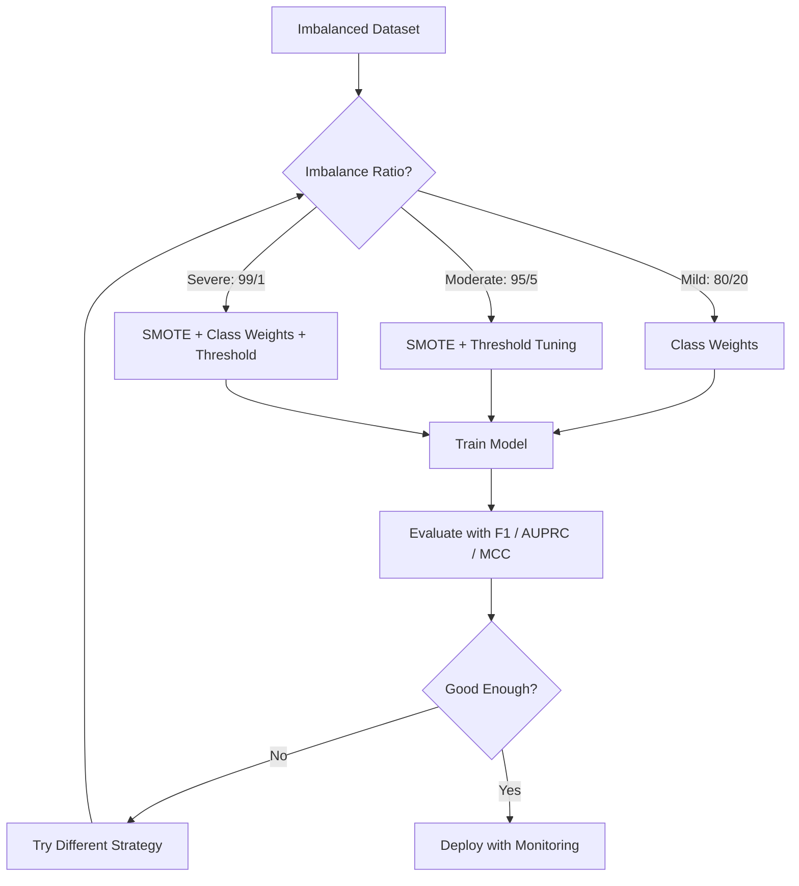
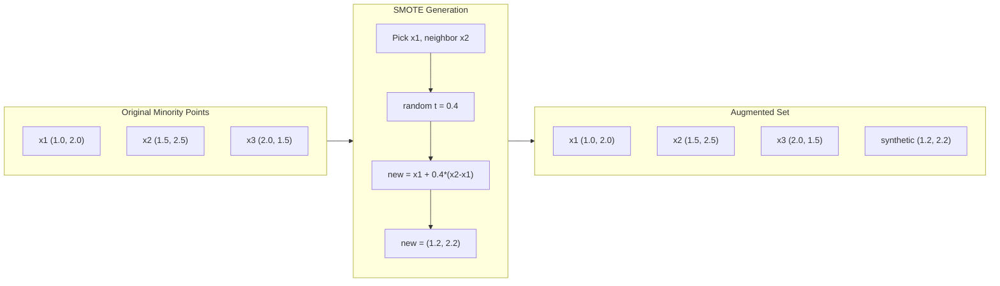
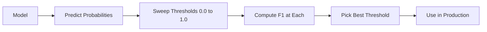
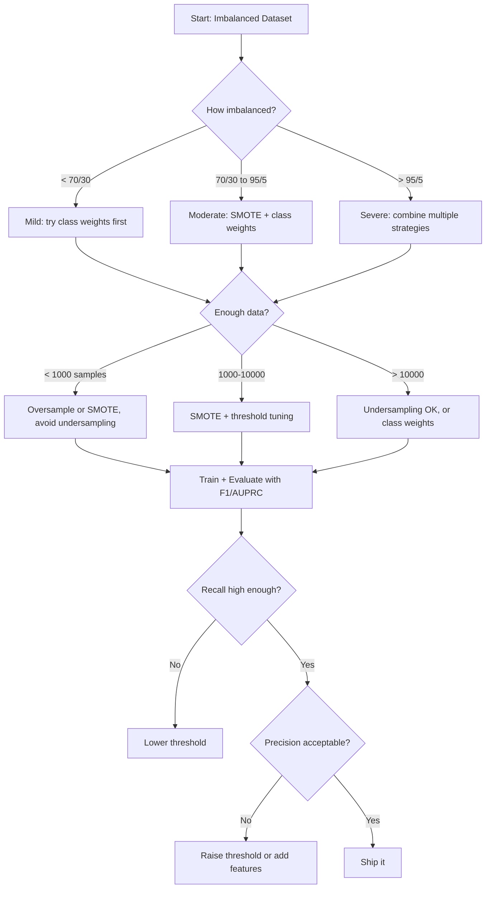

# التعامل مع البيانات غير المتوازنة
# 处理不平衡数据


> عندما تكون 99٪ من بياناتك "طبيعية"، الدقة هي كذبة.

> عندما تكون 99٪ من البيانات "طبيعية"، فإن معدل التأكد هو كذبة.

**Type:** Build | **类型：** 构建
**Language:**" بايثون "**语言：**بايثون
**Prerequisites:** Phase 2, Lessons 01-09 (especially evaluation metrics) | **前置知识：** Phase 2 第 1-9 课（尤其是评估指标）
**Time:** ~90 minutes | **时间：** 约 90 分钟

## أهداف التعلم

- تنفيذ SMOTE من الصفر وتوضيح كيف تختلف الإجراءات الإجمالية عن التكرار العشوائي
  من التحقق من الصفر SMOTE، تفسير الفرق بين التكوين من النموذج والنسخة المعتادة
- تقييم المصنفين غير المتوازنين باستخدام معدل F1 ، AUPRC ، و Matthews Correlation Coefficient بدلاً من الدقة
  استخدام F1、AUPRC 和马修斯相关系数 (MCC) 评估不平衡分类器而非准确率
- مقارنة معوزة الفئة، وتحديد العد الأدنى، واستراتيجيات إعادة العينة واختيار النهج المناسب لنسبة عدم التوازن المحددة
  تقارن الوزن والقيمة التأثير والتشخيص الزمني، لتحديد النسبة غير المتوازنة اختيار الطريقة الصحيحة
- بناء خط أنابيب بيانات غير متوازنة كاملة تجمع بين SMOTE ووزن الفئة وتحسين العد
  إنشاء مجموعة من SMOTE صنف الوزن والقيمة المثلى


> **【中文解读】**
> عدم توازن بين البيانات القليلة القليلة ((مثل الاحتيال يبلغ 0.1٪)  التنظيمات (SMOTE)  عدم الاختبار  الاختيارات هي استراتيجية منتظمة  التحقق من الاحتيال المالي والتشخيص الطبي عدم توازن البيانات هي حالة منتظمة 

> **【拓展：不平衡数据在真实系统中的挑战】**
> معدل الاختراق لا يعني شيئاً. يمكن أن يكون معدل الاختراق بأكمله "غير الاختراق" ، يجب أن يستخدم F1 أو AUPRC وغيرها من المعايير.

## المشكلة المشكلة المشكلة

تقوم ببناء نموذج للكشف عن الاحتيال، يحصل على دقة 99.9٪، تحتفل، ثم تدرك أنه يتوقع "لا احتيال" لكل معاملة واحدة.

> أنت بنيت نموذج اختبار الاحتيال. حصلت على معدل دقة 99.9%.

هذا ليس خطأ. إنه الشيء المنطقي الذي يجب القيام به عندما يكون 0.1% فقط من المعاملات خدعة. يتعلم النموذج أن تخمين الطبقة الأغلبية دائمًا يقلل من الأخطاء الإجمالية. إنه صحيح تقنيًا وغير مجدي.

> هذا ليس خطأا ً عندما يكون 0.1% فقط من الصفقات عملية احتيال ، فهذا تصرف معقول.

يحدث هذا في كل مكان حيثما كان الأمر من المهمة. تشخيص المرض: 1٪ معدل إيجابي. تدخل الشبكة: 0.01٪ هجمات. عيوب التصنيع: 0.5% عيب. تصفية الرسائل غير المرغوب فيها: 20٪ الرسائل غير المرغوب فيها. توقعات التشغيل: 5٪ التشغيل. كلما زادت النتائج من فئة الأقلية، كلما زاد النادرة.

> هذا يحدث في كل مكان يحتاج إلى قسم من المواد. تشخيص الأمراض: 1٪ نسبة إيجابية.

إن الدقة تفشل لأنه يعامل جميع التنبؤات الصحيحة على قدم المساواة. تسمى المعاملة المشروعة بشكل صحيح والقبض على الاحتيال بشكل صحيح يعتبر كلا نقطة دقة واحدة. ولكن القبض على الاحتيال هو السبب الكامل للوجود في النموذج. نحتاج إلى قياسات وتقنيات واستراتيجيات تدريب تجبر النموذج على إيلاء اهتمام لهذه الفئة النادرة ولكن المهمة.

> 准确率失败因为它同等待所有正确预测──正确标记合法交易和正确捕获欺诈都算准确率──但捕获欺诈是模型存在的全部原因──我们需要迫使模型关注稀有但重要类别的指标、技术和训练策略──

> **【中文解读】**
> المشكلة الأساسية في عدم توازن البيانات: معدل الادراك هو "الأكاذيب"‬‬‬‬‬‬‬‬‬‬‬‬‬‬‬‬‬‬‬‬‬‬‬‬‬‬‬‬‬‬‬‬‬‬‬‬‬‬‬‬‬‬‬‬‬‬‬‬‬‬‬‬‬‬‬‬‬‬‬‬‬‬‬‬‬‬‬‬‬‬‬‬‬‬‬‬‬‬‬‬‬‬‬‬‬‬‬‬‬‬‬‬‬‬‬‬‬‬‬‬‬‬‬‬‬‬‬‬‬‬‬‬‬‬‬‬‬‬‬‬‬‬‬‬‬‬‬‬‬‬‬‬‬‬‬‬‬‬‬‬‬‬‬‬‬‬‬‬‬‬‬‬‬‬‬‬‬‬‬‬‬‬‬‬‬‬‬‬‬‬‬‬‬‬‬‬‬‬‬‬‬‬‬‬‬‬‬‬‬‬‬‬‬‬‬‬‬‬‬‬‬‬‬‬‬‬‬‬‬‬‬‬‬‬‬‬‬‬‬‬‬‬‬‬‬‬‬‬‬‬‬‬‬‬‬‬‬‬‬‬‬‬‬‬‬‬‬‬‬‬‬‬‬‬‬‬‬‬‬‬‬‬‬‬‬‬‬‬‬‬‬‬‬‬‬‬‬‬‬‬‬‬‬‬‬‬‬‬‬‬‬‬‬‬‬‬‬‬‬‬‬‬‬‬‬‬‬‬‬‬‬‬‬‬‬‬‬‬‬‬‬‬‬‬‬‬‬‬‬‬‬‬‬‬‬‬‬‬‬‬‬‬‬‬‬‬‬‬‬‬‬‬‬‬‬‬‬‬‬‬‬‬‬‬‬‬‬‬‬‬‬‬‬‬‬‬‬‬‬‬‬‬‬‬‬‬‬‬‬‬‬‬‬‬‬‬‬‬‬‬‬‬‬‬‬‬‬‬‬‬‬‬‬‬‬‬‬‬‬‬‬‬‬‬‬‬‬‬‬‬‬‬‬‬‬‬‬‬‬‬‬‬‬‬‬‬‬‬‬‬‬‬‬‬‬‬‬‬‬‬‬‬‬‬‬‬‬‬‬‬‬‬‬‬‬‬‬‬‬‬‬‬‬‬‬

## المفهوم الأساسي

### لماذا تفشل الدقة

فكر في مجموعة بيانات مع 1000 عينات: 990 سلبية، 10 إيجابية. نموذج الذي يتوقع دائما سلبية:

> 考虑一个1000个样本的数据集:990个负样本,10个正样本――一个始终预测负类型模型:

|  | Predicted Positive | Predicted Negative |
|--|---|---|
| Actually Positive | 0 (TP) | 10 (FN) |
| Actually Negative | 0 (FP) | 990 (TN) |

الدقة = (0 + 990) / 1000 = 99.0%

النموذج يكتشف صفر احتيال، صفر مرض، صفر عيوب، لكن الدقة تقول 99٪، لهذا السبب الدقة خطيرة للمشاكل غير المتوازنة.

> تم القبض على نموذج صفر خدعة، صفر أمراض، صفر عيوب، ولكن معدل التكامل يظهر 99٪، وهذا هو السبب في أن معدل التكامل في مشاكل عدم التوازن هو خطير.

### أرقام أفضل

**Precision**= TP / (TP + FP). من كل شيء يتم وضع علامة إيجابية، كم عدد في الواقع؟ الدقة العالية يعني القليل من الإنذارات الكاذبة.

> **精确率**= TP / (TP + FP) ◊ بين جميع العلامات الصالحة النموذج، هناك كم هو صحيح؟

**Recall**= TP / (TP + FN). من كل شيء إيجابي في الواقع، كم من قبضنا عليه؟ التذكير العالي يعني القليل من الإيجابيات المفقودة.

> **召回率**= TP / (TP + FN) ◊ بين جميع النماذج الحقيقية، كم استولى عليه؟

**F1 Score**= 2 * دقة * استدعاء / (دقة + استدعاء). المتوسط الهارموني. يعاقب عدم التوازن الشديد بين الدقة والإستدعاء أكثر من المتوسط الحسابي.

> **F1 分数**= 2 * 精确率 * 召回率 / (精确率 + 召回率) 调和平均值──比算术平均值更严厉地惩罚精确率和召回率之间的极端不平衡──

**F-beta Score**= (1 + بيتا^2) * دقة * تذكر / (بيتا^2 * دقة + تذكر). عندما تكون بيتا > 1 ، فإن التذكر أكثر أهمية. عندما تكون بيتا < 1 ، فإن الدقة أكثر أهمية. F2 شائعة في الكشف عن الاحتيال (إن غياب الاحتيال أسوأ من الإنذار الكاذب).

> **F-beta 分数**= (1 + بيتا^2) * 精确率 * 召回率 / (بيتا^2 * 精确率 + 召回率) ・・・ عندما بيتا > 1 时,召回率更重要。 عندما بيتا < 1 时,精确率更重要。

**AUPRC**(منطقة تحت منحنى الاستدعاء الدقيق). مثل AUC-ROC ولكن أكثر معلوماتًا للبيانات غير المتوازنة. مصنف عشوائي لديه AUPRC يساوي معدل الفئة الإيجابية (ليس 0.5 مثل ROC). وهذا يجعل التحسينات أسهل في رؤية.

> **AUPRC**(مثل AUC-ROC ولكن على عدم توازن البيانات أكثر كمية من المعلومات.

**Matthews Correlation Coefficient**= (TP * TN - FP * FN) / sqrt((TP+FP)(TP+FN)(TN+FP)(TN+FN)). يتراوح من -1 إلى +1. يعطي درجة عالية فقط عندما يعمل النموذج بشكل جيد على كلا الصفين. متوازن حتى عندما تكون الصفين مختلفة جداً.

> **马修斯相关系数 (MCC)**= (TP * TN - FP * FN) / sqrt((TP+FP)(TP+FN)(TN+FP)(TN+FN))。 المدى من -1 إلى +1── فقط في كلا الفئتين على كل حال تبديل بشكل جيد عندما يعطي الارتفاعات.

بالنسبة لنموذج "تنبؤ دائمًا بالسلب" أعلاه: الدقة = 0/0 (غير محددة ، غالبًا ما يتم تعيينها إلى 0) ، والذكرى = 0/10 = 0 ، F1 = 0 ، MCC = 0. هذه المقاييس تحدد بشكل صحيح النموذج بأنه غير قيم.

> 对于上述"始终预测负类"模型:精确率 = 0/0(未定义,通常设为 0),召回率 = 0/10 = 0,F1 = 0,MCC = 0──这些指标正确地将模型识别为无用──

### خط الأنابيب المزمنة للبيانات



### المعلومات: تقنية اختبار الأقليات الاصطناعية

يكرر العينة المُتَعَدّدَة العشوائية العينات القليلة الحالية. هذا يعمل ولكن هناك خطر من المُتَعَدّدَة لأن النموذج يرى النقاط المتطابقة مراراً وتكراراً.

> 随机过采样复制现有少数类型样本──这有效但有过适合风险,因为模型会重复看到相同点──

تقوم SMOTE بإنشاء عينات جديدة من الأقليات الاصطناعية التي يمكن اعتبارها ولكن ليست نسخ.

> SMOTE إنشاء نماذج جديدة من الاصطناع، وهي معقولة ولكن ليست مضاعفة.

1. لكل عينة من الأقليات x، العثور على أقرب جيرانها k بين عينة من الأقليات الأخرى
    بالنسبة لكل مجموعة صغيرة من النماذج x، في مجموعة صغيرة من النماذج الأخرى، تجد قريباً لها
2. اختر جيرانه عشوائيا
   随机选择一个邻居
3. إعداد عينة جديدة على قطاع الخط بين x و ذلك الجار
   في خط بين x و الجيران إخلق نموذج جديد

الصيغة:`new_sample = x + random(0, 1) * (neighbor - x)`

> 公式:`new_sample = x + random(0, 1) * (neighbor - x)`

هذا يتداخل بين نقاط الأقلية الحقيقية، وخلق عينات في نفس المنطقة من مساحة الميزات دون مجرد نسخ البيانات القائمة.

> هذا هو إضافة القيمة بين عدد قليل من النقاط الفعلية، في نفس المنطقة من الفضاء المميزة، لا مجرد نسخ البيانات الحالية.



### استراتيجيات أخذ العينات مقارنة

**Random Oversampling**: نموذج الأقلية المكررة لتطابق عدد الأغلبية.
- المزايا: بسيطة، لا فقدان للمعلومات
  优点:简单, بدون فقدان المعلومات
- السلبيات: النسخ المزدوجة تسبب الإصلاح المفرط، ويزيد من وقت التدريب
  缺点: نفس النوع تماما مما يؤدي إلى التكيف، زيادة وقت التدريب

**Random Undersampling**: إزالة عينات الأغلبية لتطابق عدد الأقليات.
- المزايا: تدريب سريع، بسيط
  优点: تدريب سريع,简单
- السلبيات: يرمي البيانات الأغلبية المفيدة المحتملة، والفرقة العالية
  خلوة: إزالة معظم المعلومات المفيدة، والتي تصل إلى أعلى

**SMOTE**: إنشاء عينات الأقلية الاصطناعية عن طريق التقاط.
- المزايا: تولد نقاط بيانات جديدة، وتقلل من الإفراط في التكيف مقارنة مع الإفراط في أخذ العينات العشوائية
  优点: توليد نقاط بيانات جديدة، مقارنة مع الوقت الذي تم فيه استئجارات أقل من المعدل
- السلبيات: يمكن أن تخلق عينات ضوضاء بالقرب من حدود القرار، لا تأخذ في الاعتبار توزيع الفئة الأغلبية
  خلوة: ممكن خلق ضجيج بالقرب من الحدود القرارية، لا تأخذ في الاعتبار التوزيع

| Strategy | Data Changed | Risk | When to Use |
|----------|-------------|------|-------------|
| Oversample | Minority duplicated | Overfitting | Small datasets, moderate imbalance |
| Undersample | Majority removed | Information loss | Large datasets, want fast training |
| SMOTE | Synthetic minority added | Boundary noise | Moderate imbalance, enough minority samples for k-NN |

### الوزن الفريقي

بدلاً من تغيير البيانات، قم بتغيير طريقة التعامل مع الأخطاء في النموذج. قم بتخصيص وزن أكبر لتصنيف الفئة الأقلية بشكل خاطئ.

> لا تغير البيانات، بل تغير الطريقة التي يتعامل بها النموذج مع الأخطاء.

بالنسبة لمشكلة ثنائية مع 950 عينة سلبية و 50 عينة إيجابية:
- الوزن للطبقة السلبية = n_samples / (2 * n_negative) = 1000 / (2 * 950) = 0.526
  负类权重 = n_samples / (2 * n_negative) = 1000 / (2 * 950) = 0.526
- الوزن للطبقة الإيجابية = n_samples / (2 * n_positive) = 1000 / (2 * 50) = 10.0
  正类权重 = n_samples / (2 * n_positive) = 1000 / (2 * 50) = 10.0

الفئة الإيجابية تحصل على 19x الوزن. تكلّف سوء تصنيف عينة إيجابية واحدة بقدر ما تكلف خطأ تصنيف 19 عينة سلبية. يتم إجبار النموذج على الإنتباه إلى فئة الأقلية.

> تم الحصول على 19 ضعف الوزن. تم إضطرار النموذج إلى التركيز على النوع الأصلي.

في التراجع اللوجستي، هذا يغير وظيفة الخسارة:

```
weighted_loss = -sum(w_i * [y_i * log(p_i) + (1-y_i) * log(1-p_i)])
```

حيث w_i يعتمد على فئة العينة i.

ويعادل وزن الفئة رياضياً إلى زيادة العينات في التوقعات، ولكن دون إنشاء نقاط بيانات جديدة. وهذا يجعلها أسرع ويجنب خطر الإفراط في تجميع العينات المكررة.

> الوزن في الطبقة على الأرجح مع الأسعار الرياضية المعتادة، ولكن لا تخلق نقاط بيانات جديدة. وهذا يجعلها أسرع، وتجنب المخاطر المتناسبة المفرطة من نسخة النموذج.

### تغيير العدوان

معظم المصنفين يخرجون احتمال. عند P ((إيجابي) >= 0.5 ، فإن التنبؤ بالإيجابي. ولكن 0.5 هو تعسفي. عندما تكون الفئات غير متوازنة ، فإن العد الأفضل هو عادة أقل بكثير.

>                                                                                                                                                                                                                                                                                                                          

العملية:
1. تدريب النموذج
   訓練一個模型
2. الحصول على الاحتمالات المتوقعة على مجموعة التحقق
   في تجربة جمعية الحصول على احتمالات التوقعات
3. حدود التصفية من 0.0 إلى 1.0
   من 0.0 إلى 1.0  مسح قيمة
4. احسب F1 (أو المقياس الذي اخترته) في كل عتبة
   في كل قيمة تحت الحساب F1 ((أو اختيارك المؤشر)
5. اختر العد الذي يزيد من مقياسك
   选择最大化你的指标的值



قد يخرج نموذج P ((احتيال) = 0.15 لعملات احتيالية. عند العدالة 0.5 ، يتم تصنيف هذا بأنه ليس احتيالًا. عند العدالة 0.10 ، يتم القبض عليه بشكل صحيح. تحديد الاحتمالات لا يهم أكثر من التصنيف - طالما أن الاحتيال يحصل على احتمالات أعلى من غير الاحتيال ، فهناك عدالة تفصل بينهما.

> 模型可能对一笔欺诈交易输出P(欺诈) = 0.15──在值 0.5 下, this was classified as non-fraud──在值 0.10 下, it was correctly caught──概率校准不如排名重要只要欺诈获得高于非欺诈的概率,就存在一个能分离它们的值──

### التعلم الذي لا يتكلف

التعميم في الوزن الطبقي بدلاً من تكاليف موحدة، تعيين تكاليف خطأ محددة:

> 类权重的推广──不使用统一代价,而是分配特定的误分类代价:

| | Predict Positive | Predict Negative |
|--|---|---|
| Actually Positive | 0 (correct) | C_FN = 100 |
| Actually Negative | C_FP = 1 | 0 (correct) |

تكلّف إغفال معاملة احتيالية (FN) 100 مرة أكثر من إنذار مزيف (FP). يُحسن النموذج للتكلفة الإجمالية، وليس عدد الأخطاء الإجمالية.

> 漏检一笔欺诈交易(FN) 的代价是错报(FP) 的100倍――模型优化总代价,而不是总错误数――

هذا هو النهج الأكثر مبدأًا عندما يمكنك تقدير التكاليف في العالم الحقيقي. التشخيص المفقود للسرطان له تكلفة مختلفة جداً عن الإنذار الكاذب الذي يؤدي إلى عملية تجزئة زائدة. جعل هذه التكاليف صريحة يضطر للتنازل الصحيح.

> هذا هو الطريقة الأكثر مبدأاً عندما يمكنك تقدير التكلفة في العالم الحقيقي. تكلفة التشخيص السرطانية تختلف تماماً عن التقارير الخاطئة التي تؤدي إلى إجراءات إضافية للفحص.

### مخطط تدفق القرار



## بناء ذلك تحرك لتحقيق

> **【中文解读】**
> من صفر تحقيق SMOTE: (مختلفة النماذج المصنوعة) ؛ للكل النموذج الأصغر، العثور على K 个近邻، على الإنترنت إدخال أي وقت مضى لتوليد نموذج جديد من التركيب.

> **【拓展：工业级不平衡数据处理的高级技术】**
> في مجال التحكم في المالي الواقعي، فإن استراتيجية معالجة البيانات غير المتوازنة أكثر تعقيداً من SMOTE: استخدام الخسارة المركزية ((الخسارة المركزية، جعل النموذج أكثر اهتماماً بعملية النموذج)  تدريب مرحليين (((استخدام التدريب الأول، إعادة استخدام البيانات الأصلية)  تعلم حساس للأسعار (((ستعدّة حالات الاحتيال من خلال التداول المعتاد 100 مرة)  استخدام نظام تحليل قيمة الاحتيال في Square ((Square ) ‬
```figure
class-imbalance
```

## بناءها

### الخطوة 1: إنشاء مجموعة بيانات غير متوازنة

```python
import numpy as np


def make_imbalanced_data(n_majority=950, n_minority=50, seed=42):
    rng = np.random.RandomState(seed)

    X_maj = rng.randn(n_majority, 2) * 1.0 + np.array([0.0, 0.0])
    X_min = rng.randn(n_minority, 2) * 0.8 + np.array([2.5, 2.5])

    X = np.vstack([X_maj, X_min])
    y = np.concatenate([np.zeros(n_majority), np.ones(n_minority)])

    shuffle_idx = rng.permutation(len(y))
    return X[shuffle_idx], y[shuffle_idx]
```

### الخطوة الثانية: إعادة التشغيل من الصفر

```python
def euclidean_distance(a, b):
    return np.sqrt(np.sum((a - b) ** 2))


def find_k_neighbors(X, idx, k):
    distances = []
    for i in range(len(X)):
        if i == idx:
            continue
        d = euclidean_distance(X[idx], X[i])
        distances.append((i, d))
    distances.sort(key=lambda x: x[1])
    return [d[0] for d in distances[:k]]


def smote(X_minority, k=5, n_synthetic=100, seed=42):
    rng = np.random.RandomState(seed)
    n_samples = len(X_minority)
    k = min(k, n_samples - 1)
    synthetic = []

    for _ in range(n_synthetic):
        idx = rng.randint(0, n_samples)
        neighbors = find_k_neighbors(X_minority, idx, k)
        neighbor_idx = neighbors[rng.randint(0, len(neighbors))]
        t = rng.random()
        new_point = X_minority[idx] + t * (X_minority[neighbor_idx] - X_minority[idx])
        synthetic.append(new_point)

    return np.array(synthetic)
```

### الخطوة الثالثة: الإجراءات العشوائية المفرطة والإجراءات المقللة

```python
def random_oversample(X, y, seed=42):
    rng = np.random.RandomState(seed)
    classes, counts = np.unique(y, return_counts=True)
    max_count = counts.max()

    X_resampled = list(X)
    y_resampled = list(y)

    for cls, count in zip(classes, counts):
        if count < max_count:
            cls_indices = np.where(y == cls)[0]
            n_needed = max_count - count
            chosen = rng.choice(cls_indices, size=n_needed, replace=True)
            X_resampled.extend(X[chosen])
            y_resampled.extend(y[chosen])

    X_out = np.array(X_resampled)
    y_out = np.array(y_resampled)
    shuffle = rng.permutation(len(y_out))
    return X_out[shuffle], y_out[shuffle]


def random_undersample(X, y, seed=42):
    rng = np.random.RandomState(seed)
    classes, counts = np.unique(y, return_counts=True)
    min_count = counts.min()

    X_resampled = []
    y_resampled = []

    for cls in classes:
        cls_indices = np.where(y == cls)[0]
        chosen = rng.choice(cls_indices, size=min_count, replace=False)
        X_resampled.extend(X[chosen])
        y_resampled.extend(y[chosen])

    X_out = np.array(X_resampled)
    y_out = np.array(y_resampled)
    shuffle = rng.permutation(len(y_out))
    return X_out[shuffle], y_out[shuffle]
```

### الخطوة الرابعة: تراجع اللوجستية مع أوزان الفئة

```python
def sigmoid(z):
    return 1.0 / (1.0 + np.exp(-np.clip(z, -500, 500)))


def logistic_regression_weighted(X, y, weights, lr=0.01, epochs=200):
    n_samples, n_features = X.shape
    w = np.zeros(n_features)
    b = 0.0

    for _ in range(epochs):
        z = X @ w + b
        pred = sigmoid(z)
        error = pred - y
        weighted_error = error * weights

        gradient_w = (X.T @ weighted_error) / n_samples
        gradient_b = np.mean(weighted_error)

        w -= lr * gradient_w
        b -= lr * gradient_b

    return w, b


def compute_class_weights(y):
    classes, counts = np.unique(y, return_counts=True)
    n_samples = len(y)
    n_classes = len(classes)
    weight_map = {}
    for cls, count in zip(classes, counts):
        weight_map[cls] = n_samples / (n_classes * count)
    return np.array([weight_map[yi] for yi in y])
```

### الخطوة 5: ضبط العدوان

```python
def find_optimal_threshold(y_true, y_probs, metric="f1"):
    best_threshold = 0.5
    best_score = -1.0

    for threshold in np.arange(0.05, 0.96, 0.01):
        y_pred = (y_probs >= threshold).astype(int)
        tp = np.sum((y_pred == 1) & (y_true == 1))
        fp = np.sum((y_pred == 1) & (y_true == 0))
        fn = np.sum((y_pred == 0) & (y_true == 1))

        if metric == "f1":
            precision = tp / (tp + fp) if (tp + fp) > 0 else 0.0
            recall = tp / (tp + fn) if (tp + fn) > 0 else 0.0
            score = 2 * precision * recall / (precision + recall) if (precision + recall) > 0 else 0.0
        elif metric == "recall":
            score = tp / (tp + fn) if (tp + fn) > 0 else 0.0
        elif metric == "precision":
            score = tp / (tp + fp) if (tp + fp) > 0 else 0.0

        if score > best_score:
            best_score = score
            best_threshold = threshold

    return best_threshold, best_score
```

### الخطوة 6: وظائف التقييم

```python
def confusion_matrix_values(y_true, y_pred):
    tp = np.sum((y_pred == 1) & (y_true == 1))
    tn = np.sum((y_pred == 0) & (y_true == 0))
    fp = np.sum((y_pred == 1) & (y_true == 0))
    fn = np.sum((y_pred == 0) & (y_true == 1))
    return tp, tn, fp, fn


def compute_metrics(y_true, y_pred):
    tp, tn, fp, fn = confusion_matrix_values(y_true, y_pred)
    accuracy = (tp + tn) / (tp + tn + fp + fn)
    precision = tp / (tp + fp) if (tp + fp) > 0 else 0.0
    recall = tp / (tp + fn) if (tp + fn) > 0 else 0.0
    f1 = 2 * precision * recall / (precision + recall) if (precision + recall) > 0 else 0.0

    denom = np.sqrt(float((tp + fp) * (tp + fn) * (tn + fp) * (tn + fn)))
    mcc = (tp * tn - fp * fn) / denom if denom > 0 else 0.0

    return {
        "accuracy": accuracy,
        "precision": precision,
        "recall": recall,
        "f1": f1,
        "mcc": mcc,
    }
```

### الخطوة السابعة: مقارنة جميع الطرق

```python
X, y = make_imbalanced_data(950, 50, seed=42)
split = int(0.8 * len(y))
X_train, X_test = X[:split], X[split:]
y_train, y_test = y[:split], y[split:]

# Baseline: no treatment
w_base, b_base = logistic_regression_weighted(
    X_train, y_train, np.ones(len(y_train)), lr=0.1, epochs=300
)
probs_base = sigmoid(X_test @ w_base + b_base)
preds_base = (probs_base >= 0.5).astype(int)

# Oversampled
X_over, y_over = random_oversample(X_train, y_train)
w_over, b_over = logistic_regression_weighted(
    X_over, y_over, np.ones(len(y_over)), lr=0.1, epochs=300
)
preds_over = (sigmoid(X_test @ w_over + b_over) >= 0.5).astype(int)

# SMOTE
minority_mask = y_train == 1
X_minority = X_train[minority_mask]
synthetic = smote(X_minority, k=5, n_synthetic=len(y_train) - 2 * int(minority_mask.sum()))
X_smote = np.vstack([X_train, synthetic])
y_smote = np.concatenate([y_train, np.ones(len(synthetic))])
w_sm, b_sm = logistic_regression_weighted(
    X_smote, y_smote, np.ones(len(y_smote)), lr=0.1, epochs=300
)
preds_smote = (sigmoid(X_test @ w_sm + b_sm) >= 0.5).astype(int)

# Class weights
sample_weights = compute_class_weights(y_train)
w_cw, b_cw = logistic_regression_weighted(
    X_train, y_train, sample_weights, lr=0.1, epochs=300
)
probs_cw = sigmoid(X_test @ w_cw + b_cw)
preds_cw = (probs_cw >= 0.5).astype(int)

# Threshold tuning (tune on held-out validation set, not test set)
probs_val = sigmoid(X_val @ w_cw + b_cw)
best_thresh, best_f1 = find_optimal_threshold(y_val, probs_val, metric="f1")
preds_thresh = (probs_cw >= best_thresh).astype(int)
```

الملف الرمزي يدير كل هذا في نص واحد ويطبع النتائج.

> الملفات الكودية تعمل في كتاب واحد كل هذه المواد والنشر النتائج.

## استخدمها في إطار التنفيذ

مع التعلم المزمن والتعلم غير المتوازن، هذه التقنيات هي خط واحد:

> استخدام التعلم القليل والتعلم غير الموازن، هذه التقنيات تحتاج فقط إلى صف واحد

```python
from sklearn.linear_model import LogisticRegression
from sklearn.metrics import classification_report, f1_score
from sklearn.model_selection import train_test_split
from imblearn.over_sampling import SMOTE
from imblearn.under_sampling import RandomUnderSampler
from imblearn.pipeline import Pipeline

X_train, X_test, y_train, y_test = train_test_split(X, y, stratify=y)

model_weighted = LogisticRegression(class_weight="balanced")
model_weighted.fit(X_train, y_train)
print(classification_report(y_test, model_weighted.predict(X_test)))

smote = SMOTE(random_state=42)
X_resampled, y_resampled = smote.fit_resample(X_train, y_train)
model_smote = LogisticRegression()
model_smote.fit(X_resampled, y_resampled)
print(classification_report(y_test, model_smote.predict(X_test)))

pipeline = Pipeline([
    ("smote", SMOTE()),
    ("model", LogisticRegression(class_weight="balanced")),
])
pipeline.fit(X_train, y_train)
print(classification_report(y_test, pipeline.predict(X_test)))
```

تظهر التطبيقات من الصفر بالضبط ما تفعله كل تقنية. SMOTE هو مجرد التقاطع k-NN على فئة الأقلية. وزن الفئة مضاعفة الخسارة. ضبط العدالة هو حلقة للخروج فوق الحطام. لا سحر.

> من التحقق من الصفر يظهر دور كل نوع من التقنيات. SMOTE هو القيمة المضافة k-NN على القسم الأقليص.

## أرسلها .

هذا الدرس ينتج عن:
- `outputs/skill-imbalanced-data.md`-- قائمة تفحص للقرارات لمعالجة مشاكل التصنيف غير المتوازنة

## تمارين التدريب

1. **Borderline-SMOTE**: تعديل تنفيذ SMOTE لتوليد عينات اصطناعية فقط للنقاط الأقلية التي تقترب من حدود القرار (التي تشمل الجيران الأقرب من k عينات فئة الأغلبية). مقارنة النتائج مع SMOTE القياسية على مجموعة بيانات حيث تتداخل الفئات.
   1. 生成不平衡数据集(1% 正例) │比较始终预测多数类、随机森林(默认) 、随机森林(class_weight='balanced') و SMOTE+随机森林的 F1 和 MCC。

2. **Cost matrix optimization**: تنفيذ التعلم الحساس للتكلفة حيث تكون المصفوفة التكلفة مبرمجة. إنشاء وظيفة تأخذ مصفوفة التكلفة وتعطي التنبؤات الأمثل التي تقلل من التكلفة المتوقعة. اختبر مع نسب التكلفة المختلفة (1:10, 1:100, 1:1000) وتخطيط كيف تتغير التكافؤات بين التذكر الدقيق.
   2. في نفس المجموعة من البيانات مقارنة مع التجارب والتنمية.

3. **Threshold calibration**: تنفيذ مقياسات اللوحة (تناسب رجعة لوجستية على المخرجات الخام للنموذج لإنتاج احتمالات مقياسة). مقارنة منحنى الاستعادة الدقيقة قبل وبعد التصوير. أظهر أن التصوير لا يغير التصنيف (AUC يبقى نفسه) ولكن يجعل الاحتمالات أكثر معنى.
   3.                                                                                                                                                                                                                                                               

4. **Ensemble with balanced bagging**: تدريب نماذج متعددة، كل منها على عينة توازن من التشغيل (كل الأقلية + مجموعة فرعية عشوائية من الأغلبية). متوسط توقعاتهم. مقارنة هذا النهج مع نموذج واحد مع SMOTE. قياس كل من الأداء والتشابه عبر الجوائز.
   4. 构建完整管线:SMOTE -> 标准化 -> 逻辑归归(class_weight=' متوازن')-> 值优化──比较管线中移除任一步步的性能下降──

5. **Imbalance ratio experiment**: تأخذ مجموعة بيانات متوازنة وزيادة نسبة عدم التوازن تدريجيا (50/50, 70/30, 90/10, 95/5, 99/1). لكل نسبة، تدريب مع ودون SMOTE.

> **【中文解读】**
> مجموعة استراتيجيات كاملة لمعالجة البيانات غير متوازنة: 1) مؤشر تقييم  باستخدام F1/AUPRC/MCC  معدلات التأكد البديلة ؛ 2) ثقل الاختبار SMOTE 过采样少数类或随机欠采样多数类; 3) حساسة للأسعار  إعطاء القليل من الاختيارات في وظيفة الخسارة ️ واضحة في الدرجة الوسطى_وزن= 'متوازنة' ؛ 4)                                                                                                                                                                                                   

> **【拓展：Focal Loss——深度学习中的不平衡数据解决方案】**
> فقدان المركزية(Lin et al., 2017) في البداية لتحلّل هدف الاختبار中正负样本极度不平衡而提出(背景像素远于目标像素)。核心思想:降低"容易分类"的样本的损失权重,让模型聚焦于"难分类"样本──公式:(p) = -(1-p) ^gamma * log(p),gamma=2 时效果最好──RetinaNet استخدام فقدان المركزية في COCO 检测任务超越了当时的SOTA 方法──

## شروط الرئيسية

| Term | What people say | What it actually means |
|------|----------------|----------------------|
| Class imbalance | "One class has way more samples" | The distribution of classes in the dataset is significantly skewed, causing models to favor the majority class |
| SMOTE | "Synthetic oversampling" | Creates new minority samples by interpolating between existing minority samples and their k-nearest minority neighbors |
| Class weights | "Making errors on rare classes more expensive" | Multiplying the loss function by class-specific weights so the model penalizes minority misclassification more heavily |
| Threshold tuning | "Moving the decision boundary" | Changing the probability cutoff for classification from the default 0.5 to a value that optimizes the desired metric |
| Precision-recall tradeoff | "You cannot have both" | Lowering the threshold catches more positives (higher recall) but also flags more false positives (lower precision), and vice versa |
| AUPRC | "Area under the PR curve" | Summarizes the precision-recall curve into a single number; more informative than AUC-ROC when classes are heavily imbalanced |
| Matthews Correlation Coefficient | "The balanced metric" | A correlation between predicted and actual labels that produces a high score only when the model performs well on both classes |
| Cost-sensitive learning | "Different mistakes cost different amounts" | Incorporating real-world misclassification costs into the training objective so the model optimizes for total cost, not error count |
| Random oversampling | "Duplicate the minority" | Repeating minority class samples to balance class counts; simple but risks overfitting to duplicated points |

## المزيد من القراءة

- [SMOTE: Synthetic Minority Over-sampling Technique (Chawla et al., 2002)](https://arxiv.org/abs/1106.1813)-- ورقة SMOTE الأصلية، ما زالت العمل الأكثر إشارة إلى التعلم غير المتوازن
  [Chawla et al.: SMOTE (2002)](https://arxiv.org/abs/1106.1813)- SMOTE 原始论文
- [Learning from Imbalanced Data (He & Garcia, 2009)](https://ieeexplore.ieee.org/document/5128907)-- مسح شامل يغطي أخذ العينات، والنهج الحساسة للتكلفة، والخوارزمية
  [He & Garcia: Learning from Imbalanced Data (2009)](https://link.springer.com/article/10.1007/s10115-008-0164-4)- عدم توازن تعلم المجموع
- [imbalanced-learn documentation](https://imbalanced-learn.org/stable/)-- مكتبة Python مع فوارق SMOTE، استراتيجيات تقليل العينات، وتكامل خط الأنابيب
  [imbalanced-learn 文档](https://imbalanced-learn.org/)- بايثون غير متوازن
- [The Precision-Recall Plot Is More Informative than the ROC Plot (Saito & Rehmsmeier, 2015)](https://journals.plos.org/plosone/article?id=10.1371/journal.pone.0118432)-- متى ولماذا تفضل منحنى العلاقات العامة على منحنى ROC لمشاكل عدم التوازن
