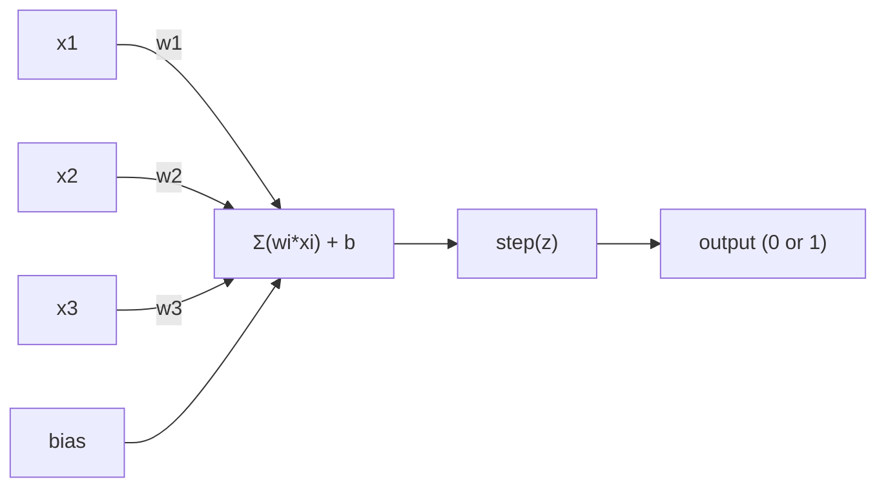
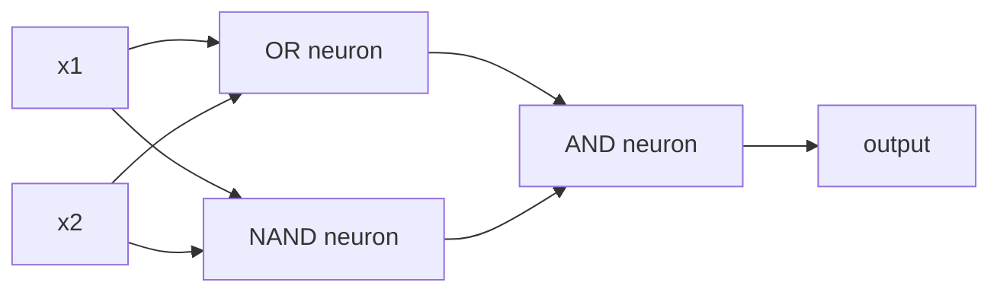

# آلة الإدراك

> إنّ الـ (بيرسبترون) هو ذرة الشبكات العصبية، فلتفتحه وتجد الوزن، والتحيز، والقرار.

> الجهاز هو "ذرة" شبكة العصبية تم تفكيكها لكي ترى، بداخلها الوزن، التوجه، والقرار

> **【中文解读】**感知机是神经网络的"原子"最小的学习单元──它所做的非常简单:把输入乘权重,加上偏置,然后做第二选择的决策──理解感知机,就是理解"学习"在代码中到底意味着什么:不断调整数字,直到输出和现实相符──

**Type:** Build
**Languages:** Python
**Prerequisites:** Phase 1 (Linear Algebra Intuition)
**Time:** ~60 minutes

## أهداف التعلم

- تنفيذ Perception من الصفر في Python، بما في ذلك قاعدة تحديث الوزن و وظيفة تفعيل الخطوة
  من الصفر بايثون 实现感知机، بما في ذلك الوصول إلى قواعد تحديث الوزن ومرحلة تنشيط
- شرح لماذا يمكن لمعرفة واحدة فقط حل المشاكل القابلة للفصل بشكل خطي وتوضيح حالة فشل XOR
   شرح لماذا جهاز الشعور الوحيد يمكن أن يحل فقط مشكلة التشابه، ويعرض حالة الفشل XOR 
- بناء عقار متعدد الطبقات من خلال تركيب بوابات OR، NAND، و AND لحل XOR
  من خلال الجمع OR、NAND 和 AND 门来构建多层感知机以解决 XOR
- تدريب شبكة طبقتين مع تنشيط sigmoid والانتشار الخلفي لتعلم XOR تلقائيًا
  استخدام sigmoid  تنشيط و ضد الاتجاه التنشر تدريب مرتين شبكة التعلم الذاتي XOR

> **【中文解读】**هدف هذا الفصل: من الصفر لتحقيق الآلة الشعورية، فهم لماذا يمكن أن يحل الآلة الشعورية الواحدة فقط مشكلة حيوية قابلة للحل ((XOR هو مثال ضد) ، ثم من خلال جمع العديد من الآلات الشعورية لتحطم هذه الحد، في النهاية مع الالتزام المضاد للتعلم الذاتي الوزن.

## المشكلة المشكلة المشكلة

تعرف المتجهات والمنتجات النقطية. تعرف أن المصفوفة تحول المدخلات إلى الخروج. ولكن كيف تدرس الآلة أي تحويل تستخدم؟

> أنت تعرف بالفعل حجم النقاط والقطعات. أنت تعرف أن الميكران يمكن أن يتم إدخالها إلى المخرج. ولكن كيف الآلة تستخدم أي نوع من التغيرات؟

الإدراك الإجابة على هذا. إنها أبسط آلة تعلم ممكنة: تأخذ بعض المدخلات، وتضاعفها بالوزن، تضيف تحيزًا، وتخذ قرار ثنائي. ثم تعديل. هذا كل شبكة عصبية تم إنشاؤها هي طبقات من هذه الفكرة مكبأة معًا.

> 感知机回答了这个问题──它是最简单的学习机器:接收输入,乘重量,加偏置,做二分类决策,然后调整──就是这样──每一个神经网络都是构建的思想的层层堆叠──

فهم الفهم يعني فهم ما يعني "التعلم" في الواقع في الرمز: ضبط الأرقام حتى تتطابق الخروج مع الواقع.

> فهم الشعور يعني فهم المعنى الحقيقي للعلم في الكود: مسلسل ضبط الأرقام حتى يناسب الخروج مع الواقع.

> **【中文解读】**أنت تعرف أن الميكانوم يمكن أن يُضيف الإدخال إلى الإخراج. ولكن كيف "تعلم" الآلة ما هي التغييرات التي يجب أن تستخدمها؟ أعطت الآلة الإدراكية الإجابة: إدخال ضرب الوزن، زيادة التحيز، اتخاذ القرارات الثنائية، ثم بناء على الخطأ في ضبط العناصر.

## المفهوم الأساسي

### عصب واحد، قرار واحد، عصب واحد، قرار واحد

يأخذ الفهم n مدخلات، ويعد كل منها وزنا، ويعددهم، ويعد تحيز، ويمر النتيجة من خلال وظيفة تنشيط.

> 感知机接收 n 个输入, 将每一个输入乘重,求和,加偏置,然后通过激活函数输出结果――



وظيفة الخطوة وحشية: إذا كان المجموع الموزن زائد التحيز >= 0، الخروج 1. خلاف ذلك، الخروج 0.

> 阶跃函数很简单粗暴: إذا كان الاضافة والاضافة المخصصة أكبر من يساوي 0،输出 1; وإلا فإن输出 0。

```
step(z) = 1  if z >= 0
           0  if z < 0
```

هذا تصنيف خطي. يحدد الوزن والتحيز خطًا (أو طائرة فائقة في الأبعاد العالية) يقسّم مساحة المدخل إلى منطقتين.

> هذا هو جهاز تقسيم خطي. يحدد الوزن والانحراف خطاً.

> **【中文解读】**感知机的计算流程:输入 x 乘权重 w,求和后加偏置 b,最后通过阶跃函数输出 0 或 1──本质上就是一个线性分类器权重和偏置在空间中画一条线(或超平面),把输入空间分成两个区域──

### الحدود القرارية الحدود القرارية

بالنسبة إلى مدخلين، يرسم الفحص خطاً عبر الفضاء الثنائي الأبعاد:

> للانتقالين،感知机在二维空间中画一条直线:

```
  x2
  ┤
  │  Class 1        /
  │    (0)          /
  │                /
  │               / w1·x1 + w2·x2 + b = 0
  │              /
  │             /     Class 2
  │            /        (1)
  ┼───────────/──────────── x1
```

كل شيء على جانب واحد من الخط ينتج 0. كل شيء على الجانب الآخر ينتج 1. التدريب يتنقل هذا الخط حتى يفصل الصف بشكل صحيح.

>                                                                                                                                                                                                                                                               

> **【中文解读】**الحدود القرارية هي w·x + b = 0 هذه الخطة. عملية التدريب هي التنقل المستمر لهذا الخط حتى يتم تقسيم المعلومات المختلفة بشكل صحيح. في التعلم العميق، كل طبقة تخلق مساحة جديدة من الصفات و الحدود القرارية الجديدة.

### قاعدة التعلم

قاعدة تعلم "الجهاز" بسيطة:

> قواعد تعلم 感知机的学习非常简单:

```
For each training example (x, y_true):     # 对每个训练样本
    y_pred = predict(x)                    # 预测输出
    error = y_true - y_pred                # 计算误差

    For each weight:                       # 对每个权重
        w_i = w_i + learning_rate * error * x_i   # 更新权重
    bias = bias + learning_rate * error    # 更新偏置
```

إذا كان التنبؤ صحيحاً، فإن الخطأ = 0، لا يتغير أي شيء. إذا كان يتنبأ 0 ولكن يجب أن يكون 1, تزيد الوزن. إذا كان يتنبأ 1 ولكن يجب أن يكون 0, تقل الوزن. معدل التعلم يسيطر على مدى حجم كل تعديل.

> إذا كان التنبؤ صحيحاً، فإن الفجوة 0، لا تقوم بأي تعديل. إذا كان التنبؤ 0، ولكن يجب أن يكون 1, فإن الوزن يزداد. إذا كان التنبؤ 1، ولكن يجب أن يكون 0, الوزن يقلص.

> **【中文解读】**قواعد تعلم الآلة التعرفية بسيطة مباشرة: التنبؤ على عدم تحرك، التنبؤ على خطأ حسب التضليلات التوجيهية تعديل الوزن.`optimizer.step()`كل شيء هو نفس الشيء، مجرد الحساب أكثر تعقيدا.

> **【拓展：梯度下降的起源】**感知机学习规则是最简单的梯度下降. 感知机学习规则是最简单的梯度下降. 感知机学习规则是最简单的梯度下降. 感知机学习规则是最简单的梯度下降. 感知机学习规则是最简单的梯度下降. 感知机学习规则是最简单的梯度下降. 感知机学习规则是最简单的梯度下降. 感知机学习规则是最简单的梯度下降. 感知机学习规则是最简单的梯度下降. 感知机学习规则是最简单的梯度下降. 感知机学习规则是最简单的梯度下降. 感知机学习规则是最简单的梯度下降. 感知机学习率是最简单的梯度下降.

### مشكلة XOR مشكلة XOR

ها هو المكان الذي ينهار فيه انظروا إلى هذه البوابات المنطقية

> هذا هو المكان الذي يفشل فيه الإدراك.

```
AND gate:           OR gate:            XOR gate:
x1  x2  out         x1  x2  out         x1  x2  out
0   0   0           0   0   0           0   0   0
0   1   0           0   1   1           0   1   1
1   0   0           1   0   1           1   0   1
1   1   1           1   1   1           1   1   0
```

AND و OR قابلان للفصل بشكل خطي: يمكنك رسم خط واحد لفرق 0s من 1s. لا يعد XOR. لا يمكن لأي خط واحد فصل [0,1] و [1,0] من [0,0] و [1,1].

> و 和 OR هو خطة يمكن أن تصل إليها: يمكنك رسم خطة مستقيمة ستصبح 0 和 1 分开。XOR 不是。 بدون خطة مستقيمة ستصبح [0,1] 和 [1,0] مع [0,0] 和 [1,1] 分开。

```
AND (separable):        XOR (not separable):

  x2                      x2
  1 ┤  0     1            1 ┤  1     0
    │     /                 │
  0 ┤  0 / 0              0 ┤  0     1
    ┼──/──────── x1         ┼──────────── x1
       line works!          no single line works!
```

هذا هو الحد الأساسي. يمكن أن يحل جهاز تصور واحد فقط المشاكل المنفصلة خطيا. أثبت هذا مينسكي و بابرط في عام 1969 و تقريبا قتل بحث الشبكات العصبية لمدة عقد.

> هذا هو الحد الأساسي. يمكن أن يحل جهاز واحد الإدراك فقط مشكلة التعرف على الارض.

الحل: قم بتجميع الأشرار إلى طبقات. يمكن لأشرار متعددة الطبقات حل XOR عن طريق دمج قرارين خطيين إلى واحد غير خطي.

> الحل: سوف تتمثل الآلات الشعورية في طبقات متعددة. يمكن أن يتم من خلال جمع قرارين خطيتين وتجميع قرارين غير خطيتين لحل XOR.

> **【中文解读】**مشكلة XOR هي "أشكال" الجهاز التشعريفي: مهما كنت ترسم خطا مستقيما، لا يمكن توزيع نوعين من المخرجات من XOR.

> **【拓展：为什么深度学习需要"深"】**يمكن للجهاز الحسيني ذو طبقة واحدة أن يرسم خطاً مستقيماً فقط، يمكن للجهاز ذو طبقة اثنين أن يرسم طرق مكسورة، ويمكن للجهاز ذو طبقة ثلاثية أن يرسم أي شكل أو شكل.

## بناءه
```figure
perceptron-boundary
```

## بناءها

### الخطوة الأولى: فئة Perceptron

```python
class Perceptron:
    def __init__(self, n_inputs, learning_rate=0.1):
        self.weights = [0.0] * n_inputs   # 权重初始化为 0
        self.bias = 0.0                    # 偏置初始化为 0
        self.lr = learning_rate            # 学习率控制每次调整的幅度

    def predict(self, inputs):
        total = sum(w * x for w, x in zip(self.weights, inputs))  # 加权求和：w·x
        total += self.bias                                         # 加偏置：w·x + b
        return 1 if total >= 0 else 0       # 阶跃函数：>=0 输出 1，否则输出 0

    def train(self, training_data, epochs=100):
        for epoch in range(epochs):
            errors = 0
            for inputs, target in training_data:
                prediction = self.predict(inputs)   # 前向预测
                error = target - prediction          # 计算误差
                if error != 0:
                    errors += 1
                    for i in range(len(self.weights)):
                        self.weights[i] += self.lr * error * inputs[i]  # 权重更新
                    self.bias += self.lr * error      # 偏置更新
            if errors == 0:
                print(f"Converged at epoch {epoch + 1}")  # 全部正确，收敛
                return
        print(f"Did not converge after {epochs} epochs")
```

### الخطوة الثانية: تدريب على بوابات المنطق

```python
and_data = [          # AND 逻辑门数据：两个输入都为 1 时输出 1
    ([0, 0], 0),
    ([0, 1], 0),
    ([1, 0], 0),
    ([1, 1], 1),
]

or_data = [           # OR 逻辑门数据：任一输入为 1 时输出 1
    ([0, 0], 0),
    ([0, 1], 1),
    ([1, 0], 1),
    ([1, 1], 1),
]

not_data = [          # NOT 逻辑门数据：取反
    ([0], 1),
    ([1], 0),
]

print("=== AND Gate ===")
p_and = Perceptron(2)
p_and.train(and_data)
for inputs, _ in and_data:
    print(f"  {inputs} -> {p_and.predict(inputs)}")

print("\n=== OR Gate ===")
p_or = Perceptron(2)
p_or.train(or_data)
for inputs, _ in or_data:
    print(f"  {inputs} -> {p_or.predict(inputs)}")

print("\n=== NOT Gate ===")
p_not = Perceptron(1)
p_not.train(not_data)
for inputs, _ in not_data:
    print(f"  {inputs} -> {p_not.predict(inputs)}")
```

### الخطوة الثالثة: شاهد فشل XOR

```python
xor_data = [         # XOR 逻辑门数据：两个输入不同时输出 1
    ([0, 0], 0),
    ([0, 1], 1),
    ([1, 0], 1),
    ([1, 1], 0),
]

print("\n=== XOR Gate (single perceptron) ===")
p_xor = Perceptron(2)
p_xor.train(xor_data, epochs=1000)   # 即使训练 1000 轮也无法收敛
for inputs, expected in xor_data:
    result = p_xor.predict(inputs)
    status = "OK" if result == expected else "WRONG"
    print(f"  {inputs} -> {result} (expected {expected}) {status}")
```

هذا دليل قوي على أن جهاز إدراك واحد لا يستطيع تعلم XOR

> انها لا تحصل أبدا. هذا هو واحد الشعور الآلة لا يمكن أن تتعلم XOR.

> **【中文解读】**单个感知机训练 XOR 永远不会收不管训练多少轮──这是一个数学的硬限制:一条直线无法正确分出XOR的四点 into two categories──

### الخطوة الرابعة: حل XOR مع طبقتين

الخدعة: XOR = (x1 OR x2) و لا (x1 و x2). مزج ثلاثة مفاتيح:

> 技巧:XOR = (x1 OR x2) و لا (x1 و x2)



```python
def xor_network(x1, x2):
    or_neuron = Perceptron(2)
    or_neuron.weights = [1.0, 1.0]     # OR 门的权重
    or_neuron.bias = -0.5              # OR 门的偏置

    nand_neuron = Perceptron(2)
    nand_neuron.weights = [-1.0, -1.0]  # NAND 门（AND 的取反）的权重
    nand_neuron.bias = 1.5              # NAND 门的偏置

    and_neuron = Perceptron(2)
    and_neuron.weights = [1.0, 1.0]     # AND 门的权重
    and_neuron.bias = -1.5              # AND 门的偏置

    hidden1 = or_neuron.predict([x1, x2])    # 隐藏层第 1 个神经元：OR
    hidden2 = nand_neuron.predict([x1, x2])  # 隐藏层第 2 个神经元：NAND
    output = and_neuron.predict([hidden1, hidden2])  # 输出层：AND
    return output


print("\n=== XOR Gate (multi-layer network) ===")
for inputs, expected in xor_data:
    result = xor_network(inputs[0], inputs[1])
    print(f"  {inputs} -> {result} (expected {expected})")
```

كل الحالات الأربعة صحيحة، إنّ تجميع الأشرار إلى طبقات يخلق حدود قرار لا يمكن لأيّ أشرار واحد أن يُنتجها.

> أربعة حالات صحيحة تماما. يمكن أن تخلق آلة الإدراك تتجمع على شكل طبقة واحدة.

> **【中文解读】**关键洞察:XOR = (x1 OR x2) و NOT(x1 AND x2)。 الطبقة الأولى باستخدام جهازيّة إدراكية منفصلة للقيام ب OR 和 NAND((两条直线), الطبقة الثانية باستخدام AND وضع النتائج اثنين معاً。 هذا يستخدم اثنين من خطوط مستقيم مصطلحات خارج حدود القرار غير السطحية。 هذا هو أيضاً المبدأ الأساسي للشبكات العصبية الحديثة كل طبقة في جعل المكونات تتغير──

### الخطوة 5: تدريب شبكة طبقتين

الخطوة 4 تسلك الوزن يدويا. هذا يعمل ل XOR، ولكن ليس للمشاكل الحقيقية حيث لا تعرف الوزن الصحيح مسبقا. الحل: استبدال وظيفة الخطوة مع sigmoid وتعلم الوزن تلقائيا من خلال الانتشار الخلفي.

> الخطوة 4 手动设置权重── هذا فعال على XOR، ولكن لا يمكن استخدامها لمعرفة المشكلة الفعلية الصحيحة للوزن── الحل: باستخدام sigmoid 替换阶跃函数،通过反向传播自动学习权重──

```python
class TwoLayerNetwork:
    def __init__(self, learning_rate=0.5):
        import random
        random.seed(0)
        self.w_hidden = [[random.uniform(-1, 1), random.uniform(-1, 1)] for _ in range(2)]  # 隐藏层权重（2个神经元，各2个输入）
        self.b_hidden = [random.uniform(-1, 1), random.uniform(-1, 1)]   # 隐藏层偏置
        self.w_output = [random.uniform(-1, 1), random.uniform(-1, 1)]   # 输出层权重
        self.b_output = random.uniform(-1, 1)   # 输出层偏置
        self.lr = learning_rate

    def sigmoid(self, x):
        import math
        x = max(-500, min(500, x))   # 裁剪防止溢出
        return 1.0 / (1.0 + math.exp(-x))  # sigmoid 函数：σ(x) = 1/(1+e^(-x))

    def forward(self, inputs):
        self.inputs = inputs
        self.hidden_outputs = []
        for i in range(2):
            z = sum(w * x for w, x in zip(self.w_hidden[i], inputs)) + self.b_hidden[i]  # 隐藏层线性变换
            self.hidden_outputs.append(self.sigmoid(z))  # 隐藏层激活
        z_out = sum(w * h for w, h in zip(self.w_output, self.hidden_outputs)) + self.b_output  # 输出层线性变换
        self.output = self.sigmoid(z_out)   # 输出层激活
        return self.output

    def train(self, training_data, epochs=10000):
        for epoch in range(epochs):
            total_error = 0
            for inputs, target in training_data:
                output = self.forward(inputs)       # 前向传播
                error = target - output              # 误差 = 目标 - 预测
                total_error += error ** 2            # 累计平方误差

                d_output = error * output * (1 - output)   # 输出层梯度（链式法则）

                saved_w_output = self.w_output[:]
                hidden_deltas = []
                for i in range(2):
                    h = self.hidden_outputs[i]
                    hd = d_output * saved_w_output[i] * h * (1 - h)  # 隐藏层梯度（反向传播）
                    hidden_deltas.append(hd)

                # 更新输出层权重
                for i in range(2):
                    self.w_output[i] += self.lr * d_output * self.hidden_outputs[i]
                self.b_output += self.lr * d_output

                # 更新隐藏层权重
                for i in range(2):
                    for j in range(len(inputs)):
                        self.w_hidden[i][j] += self.lr * hidden_deltas[i] * inputs[j]
                    self.b_hidden[i] += self.lr * hidden_deltas[i]
```

```python
net = TwoLayerNetwork(learning_rate=2.0)
net.train(xor_data, epochs=10000)
for inputs, expected in xor_data:
    result = net.forward(inputs)
    predicted = 1 if result >= 0.5 else 0   # 以 0.5 为阈值做二分类
    print(f"  {inputs} -> {result:.4f} (rounded: {predicted}, expected {expected})")
```

فرق رئيسيان من الخطوة 4، أولا، sigmoid يحل محل وظيفة الخطوة -- انها سلسة، لذلك وجود تراجع. ثانيا، `train`طريقة نشر الخطأ إلى الوراء من الخروج إلى الطبقة المخفية، وتعديل كل وزن متناسبة مساهمته في الخطأ. وهذا هو الانتشار إلى الوراء في 20 خط.

> مع الخطوة 4 هناك فرقين رئيسيان. أولاً، تم تغيير المخططات إلى المخططات، فهي مسطحة، لذلك هناك درجة.`train`方法将错误从输出层到隐藏层反向传播,根据每个权重对错误的贡献比例进行调整――这就是20行代码实现的反向传播――

هذه هي جسر الدروس الثالثة والرياضيات وراءها`d_output`و`hidden_deltas`هي قاعدة سلسلة تطبق على الرسم البياني للشبكة. سنستدله بشكل صحيح هناك.

> هذا هو الجسر الموصول إلى الصف الثالث`d_output`和 `hidden_deltas`والرياضيات الخلفية هي قواعد سلسلة التطبيق على شبكة التخطيط.

> **【中文解读】**الخطوة 4 هي المخطط لتحديد الوزن ، ولكن في المشكلة الحقيقية نحن لا نعرف الوزن الصحيح.`d_output`和 `hidden_deltas`هذا هو تطبيق قانون السلسلة من الصادرة إلى العداد إلى التعدد، التعدد من الصف إلى الصف.`loss.backward()`في شيء يجب القيام به

> **【拓展：PyTorch autograd 的原理】**بطورش الذاتية التفاصيل ((أوتوجراد) في الوصول إلى النظام التلقائي هو عملية التنفيذ الآلي في هذا الاتجاه.`backward()`时沿图反向传播梯度──手动写反向传播(像这里一样) هو أفضل طريقة لفهم الوضع الذاتي──

## استخدمها في التطبيق العملي

كل ما بنيته من الصفر موجود في إحدى الواردات:

> يمكنك فقط من الصفر تكوين جميع المهام يمكن أن يتم من خلال إدخال واحد لتحقيق:

```python
from sklearn.linear_model import Perceptron as SkPerceptron   # sklearn 内置的感知机
import numpy as np

X = np.array([[0,0],[0,1],[1,0],[1,1]])  # 输入数据
y = np.array([0, 0, 0, 1])               # AND 门的标签

clf = SkPerceptron(max_iter=100, tol=1e-3)  # 最多迭代 100 次，容差 0.001
clf.fit(X, y)                                # 训练
print([clf.predict([x])[0] for x in X])     # 预测所有样本
```

خمسة خطات، خطك الـ30`Perceptron`الطبقة تفعل نفس الشيء. إصدار sklearn يضيف التحقق من التقارب، وظائف الخسارة المتعددة، ودعم المدخل النادر -- ولكن الحلقة الأساسية هي نفسها: المبلغ الموزن، وظيفة الخطوة، تحديث الوزن على الخطأ.

> 五行代码──你30 行的 `Perceptron`类做同样的事情──sklearn 版本增加收检查、多种损失函数和稀疏输入支持但核心循环完全相同:加权和、阶跃函数、按错误更新权重──

الفجوة الحقيقية تظهر على نطاق واسع. ما هي التغييرات في شبكات الإنتاج:

> الفجوة الحقيقية في الحد الأوّل على نطاق الإنتاج تغيرت على النطاق التالي:

- تصبح وظيفة الخطوة sigmoid، ReLU، أو غيرها من التفعيلات السلسة
  阶跃函数 تحول إلى sigmoid、ReLU أو غيرها من المفردات المثبتة المُسطحة
- يتم تعلم الأوزان تلقائياً عن طريق التنشر الخلفي (المدرسة 03)
  权重通过反向传播自动学习 (التيار إلى التعلم الذاتي)
- الطبقات تصبح أعمق: 3، 10، 100+ طبقة
  層数变更深:3 層、10 層、100+ 層
- نفس المبدأ ينطبق: كل طبقة تخلق ميزات جديدة من نتائج الطبقة السابقة
  المبدأ الأساسي لا يتغير: كل طبقة من الطبقة السابقة من المخرجات خلق خصائص جديدة

يمكن لـ (البصرية) الواحدة رسم خطوط مستقيمة فقط، قم بتجميعها، ويمكنك رسم أي شكل

> ويمكن للجهاز الفكري أن يرسم خطاً مستقيماً فقط.

> **【中文解读】**في sklearn 五行代码已经搞定了我们30行做的事情──核心逻辑完全相同:加权求和、阶跃函数、按差更新权重──真正差距在规模:现代网络使用可导的激活函数(如 ReLU) 、用反向传播自动学习、有几十到上百层──但基本原理永远是: خلق خصائص جديدة في كل طبقة من خروجيات الطبقة العليا──

## أرسلها

هذا الدرس ينتج عن:
- `outputs/skill-perceptron.md`- مهارة تغطي عندما تكون هناك حاجة إلى معمارات ذات طبقة واحدة مقابل متعددة الطبقات

> 本课产出:`outputs/skill-perceptron.md`- وثيقة مهارات حول متى استخدام بنية ذات طبقة واحدة ومتعددة

## تمارين التدريب

1. تدريب جهاز الرؤية على بوابة NAND (البوابة العالمية - يمكن بناء أي دائرة منطقية من NAND). التحقق من وزنها والتحيز تشكل حدود القرارات المفعول.
   > **练习 1：**استخدام التعرف على الآلة تدريب NAND 门(通用逻辑门 أي كهرباء منطقية يمكن أن تكون NAND 搭建) ――验证学到的权重和偏置是否形成有效的决策边界──

2. تعديل فئة Perceptron لتتبع حدود القرار (w1\*x1 + w2\*x2 + b = 0) في كل عصر. طبع كيفية تحول الخط أثناء التدريب على بوابة AND.
   > **练习 2：**修改 Perceptron 类,在每时代 记录决策边界 (w1\*x1 + w2\*x2 + b = 0) ――打印在训练 AND 门时这条线是如何移动的──

3. بناء 3 مدخلات perceptron التي تنطلق 1 فقط عندما 2 على الأقل من المدخلات 3 هي 1 (عمل تصويت الأغلبية). هل هذا يمكن فصل خطيا؟ لماذا؟
   > **练习 3：**بناء 3 دخولات إشعارية، عندما على الأقل 2 دخولات ل 1 时输出 1(غالبية وظيفة التصويت) ・・・ هذا العامل هو خطية قابلة للتعرف؟ لماذا؟

## شروط رئيسية

| Term | What people say | What it actually means |
|------|----------------|----------------------|
| Perceptron | "A fake neuron" | A linear classifier: dot product of inputs and weights, plus bias, through a step function |
| Weight | "How important an input is" | A multiplier that scales each input's contribution to the decision |
| Bias | "The threshold" | A constant that shifts the decision boundary, letting the perceptron fire even with zero inputs |
| Activation function | "The thing that squishes values" | A function applied after the weighted sum - step function for perceptrons, sigmoid/ReLU for modern networks |
| Linearly separable | "You can draw a line between them" | A dataset where a single hyperplane can perfectly separate the classes |
| XOR problem | "The thing perceptrons can't do" | Proof that single-layer networks cannot learn non-linearly-separable functions |
| Decision boundary | "Where the classifier switches" | The hyperplane w\*x + b = 0 that divides input space into two classes |
| Multi-layer perceptron | "A real neural network" | Perceptrons stacked in layers, where each layer's output feeds the next layer's input |

| 术语 | 通俗说法 | 实际含义 |
|------|---------|---------|
| 感知机 (Perceptron) | "假神经元" | 线性分类器：输入与权重的点积加偏置，过阶跃函数 |
| 权重 (Weight) | "输入的重要性" | 缩放每个输入对决策贡献的乘数 |
| 偏置 (Bias) | "阈值" | 偏移决策边界的常数，让感知机在全零输入时也能激活 |
| 激活函数 (Activation function) | "压扁数值的东西" | 加权求和后施加的函数——感知机用阶跃函数，现代网络用 sigmoid/ReLU |
| 线性可分 (Linearly separable) | "能画线分开" | 数据集可以用一个超平面完美分成两类 |
| XOR 问题 | "感知机做不到的事" | 证明单层网络无法学习非线性可分函数 |
| 决策边界 (Decision boundary) | "分类器切换的地方" | w\*x + b = 0 这个超平面，把输入空间分成两类区域 |
| 多层感知机 (MLP) | "真正的神经网络" | 感知机按层堆叠，每层的输出是下一层的输入 |

## المزيد من القراءة

- فرانك روزنبلات، "الصور: نموذج محتمل لتخزين المعلومات والتنظيم في الدماغ" (1958) -- الورقة الأصلية التي بدأت كل شيء
  فرانك روزنبلات، 感知机: مخزن المعلومات والتنظيم نموذج احتمالية
- مينسكي و بابرت، "المتصورين" (1969) -- الكتاب الذي أثبت أن XOR لا يمكن حلها من قبل شبكات طبقة واحدة وأدمرت البحث عن المعتبرات لمدة عقد
  مينسكي و ورق،感知机(1969)  دليل على أن شبكة واحدة لا يمكن حل XOR و غير جعلت دراسة الجهازات البصرية تتوقف على مدى عشر سنوات
- مايكل نيلسن، "الشبكات العصبية والتعلم العميق"، الفصل 1 (http://neuralnetworksanddeeplearning.com/) -- مجانا على الإنترنت، أفضل تفسير بصري لكيفية تكوين الشبكات
  مايكل نيلسن،  شبكة العصبية والتعلم العميق  الفصل 1  مجانا على الإنترنت، حول كيفية تشكيل الآلات الشعرية أفضل تفسير مرئي للشبكة
