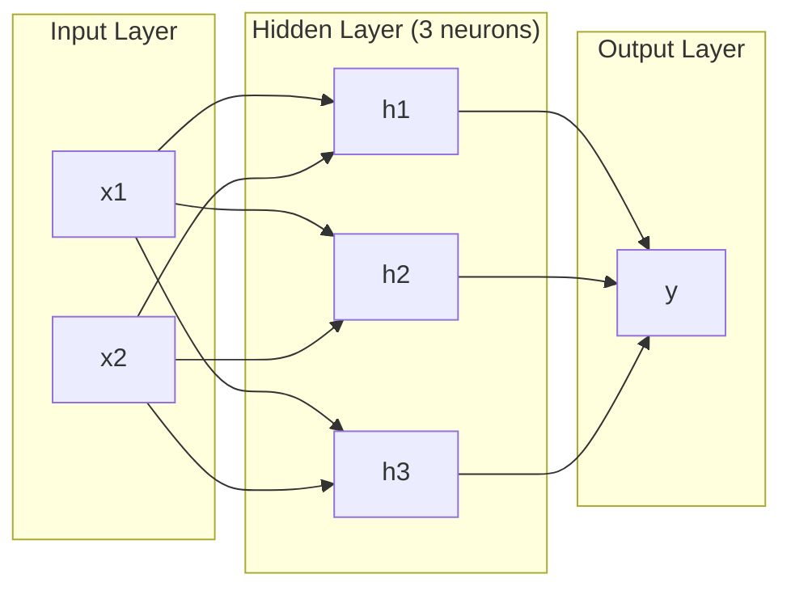
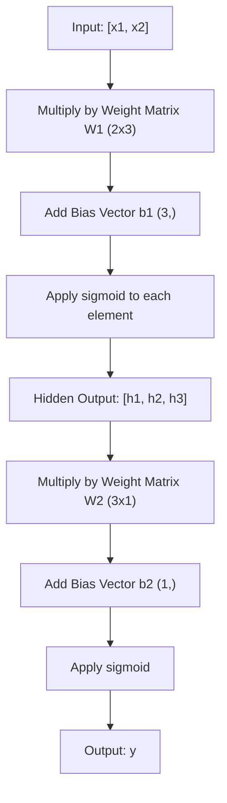
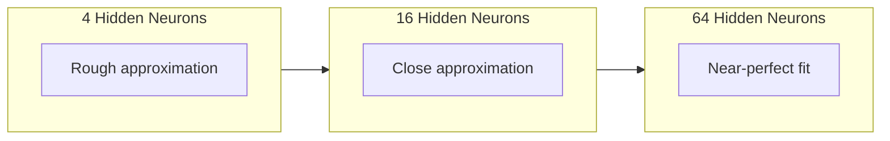

# شبكات متعددة الطبقات والمرورات المقبلة

> إحدى الخلايا العصبية ترسم خطاً، قم بتجميعها، ويمكنك رسم أي شيء.

> أن يضع العصب على خط مستقيم، يمكنك رسم أي شكل

> **【中文解读】**يمكن لنفسي أن يضع العصب واحد خط مستقيم فقط، ولكن لو وضع العديد من العصب على كتلة متعددة، فإنه يمكن أن يتناسب مع أي منحنى شكل. هذا هو القيمة الأساسية للشبكة متعددة المستويات.

**Type:** Build
**Languages:** Python
**Prerequisites:** Phase 01 (Math Foundations), Lesson 03.01 (The Perceptron)
**Time:** ~90 minutes

## أهداف التعلم

- بناء شبكة متعددة الطبقات من الصفر مع طبقات الطبقة والشبكة التي تقوم بإجراء مرور كامل إلى الأمام
  من الصفر بناء مع طبقة و شبكة 类 متعدد المستويات شبكة، تنفيذ كاملة التوزيع الأمامي
- قم بتعقب أبعاد المصفوفة عبر كل طبقة من الشبكة وتحديد عدم مطابقة الشكل
   تتابع شبكة كل طبقة من المصفوفة طول، تحديد شكل عدم التناغم
- شرح كيفية تخزين التفعيلات غير الخطية تمكن الشبكة من تعلم حدود القرار الملتوية
  解释堆叠非线性激活 كيفية جعل الشبكة قادرة على تعلم曲
- حل مشكلة XOR باستخدام بنية 2-2-1 مع أوزان sigmoid المنسقة يدويا
  استخدام المخططات المتحركة لتحديد الوزن

> **【中文解读】**هدف هذا الفصل: من الصفر بناء الطبقة و شبكة 类، فهم التغيرات في درجة الموجة في التوزيع، معرفة لماذا غير السلكية وظيفة التشغيل جعل الشبكة قادرة على تعلم 曲

## المشكلة المشكلة المشكلة

العصبية الوحيدة هي سحب خط. هذا هو. خط مستقيم واحد عبر بياناتك. كل مشكلة حقيقية في الذكاء الاصطناعي -- التعرف على الصور، فهم اللغة، اللعب على الجو -- تتطلب منحنى.

> العصب الواحد هو مجرد أداة للخط الرسمي. فقط هذا هو. رسم خط مستقيم في بياناتك. كل مشكلة حقيقية في الذكاء الاصطناعي.

في عام 1969، أثبت مينسكي وبابر هذا القيود أنه كان قاتلا: لا يمكن لشبكة ذات طبقة واحدة تعلم XOR. لا "تتصارعات لتعلم" - رياضيا لا يمكن. جدول الحقيقة XOR يضع [0,1] و [1,0] على جانب واحد، [0,0] و [1,1] على الآخر. لا خط واحد يفصل بينهما.

> 1969، منسكي و Papert  أثبت هذا الحد هو مميت: واحد المستوى من شبكة لا يمكن تعلم XOR. ليس "من الصعب أن تعلم"  هو الرياضيات لا يمكن. XOR قيمة حقيقية سوف [0,1] و [1,0] وضع على جانب واحد،

هذا أدى إلى إيقاف تمويل الشبكات العصبية لأكثر من عقد. كان التحدي واضحاً في الآونة الأخيرة: توقف عن استخدام طبقة واحدة. قم بتجميع الخلايا العصبية إلى طبقات. دع الطبقة الأولى تخطي مساحة المدخل إلى ميزات جديدة، ودع الطبقة الثانية تجمع هذه الميزات إلى قرارات لا يمكن لأي سطر واحد اتخاذها.

> هذا جعل التمويل في شبكة العصبية يتوقف منذ أكثر من عشر سنوات. في نهاية المطاف، فإن الحل واضح: لم يعد هناك طبقة واحدة فقط.

هذه الدرجة هي الشبكة متعددة الطبقات. إنها أساس كل نموذج للتعلم العميق في الإنتاج اليوم. المضي قدما -- البيانات التي تتدفق من المدخل عبر الطبقات الخفية إلى الخروج -- هو أول شيء تحتاج إلى بناء قبل أن يعمل أي شيء آخر.

> ذلك المجمع هو شبكة متعددة المستويات. إنه أساس كل نموذج دراسة عميقة في بيئة الإنتاج الحالية.

> **【中文解读】** العصبية الوحيدة يمكن أن ترسم خطوط مستقيمة فقط ، ولكن تصويري التعرف على اللغة والتفهم                                                                                                                                                                                                                                                  

## المفهوم الأساسي

### الطبقات: المدخل، الخفي، الخروج.

شبكة متعددة الطبقات لديها ثلاثة أنواع من الطبقات:

> شبكة متعددة المستويات لها ثلاثة أنواع من المستويات:

**Input layer**-- ليس طبقة حقيقية. انها تحتوي على بياناتك الخام. اثنين من الميزات تعني عقدين دخول. لا حساب يحدث هنا.

> **输入层**其实不算真正层――它存储原始数据――两个特征意味着两个输入节点――这里没有任何计算――

**Hidden layers**حيث يحدث العمل. كل خلية عصبية تأخذ كل خروج من الطبقة السابقة، وتطبق الوزن والتحيز، ثم تمرنت النتيجة من خلال وظيفة تنشيط. "خفية" لأنك لا ترى هذه القيم مباشرة في بيانات التدريب.

> **隐藏层** حيث يعمل حقا.  كل عصب يتلقى الطبقة الأولى من جميع المخرجات، وتطبيق الوزن والوضع، ثم سوف النتيجة من خلال وظيفة تنشيط.

**Output layer**الجواب النهائي. للتصنيف الثنائي، عصب واحد مع sigmoid. للطبقة متعددة، عصب واحد لكل طبقة.

> **输出层** الإجابة النهائية.



هذه شبكة 2-3-1 . اثنين من المدخلات ، ثلاثة الخلايا العصبية الخفية ، واحد الخروج. كل اتصال يحمل وزن. كل خلايا العصبية (باستثناء المدخل) يحمل تحيز.

> هذا هو شبكة 2-3-1  اثنين من الدخل، ثلاثة أعصاب مخفية، واحد من الخروج‬ كل اتصال لديه وزن‬ كل أعصاب‬

كل طبقة تنتج متجه للأرقام يسمى حالة مخفية. بالنسبة للنص، تزيد الحالات الخفية من الامتعداد -- تشفير كلمة كمعدد 768 لالتقاط المعنى التمويلي. بالنسبة للصور، تقلل من الامتعداد -- تضغط على ملايين البيكسل في تمثيل قابلة للتحكم. الحالة الخفية هي حيث يعيش التعلم.

> كل طبقة تنتج قطرة رقمية، تسمى الحالة المخفية. بالنسبة للنص، تتزايد الحالة المخفية الحجم.

> **【中文解读】**ثلاث طبقات:输入层(只是数据入口,不计算) 藏层(做特征变换,"隐藏"是因为训练数据里看不到这些值) ]]]]输出层(最终答案) ]] प्रत्येक طبقة تنتج وحدة تدعى "隐藏状态"文本任务中它增加维度(把词变成768维度来捕捉语义),图像任务中它降低维度(缩百万像素为紧表示) ]]]]]]]]]]]]]]]]]]]]]]]]]]]]]]]]]]]]]]]]]]]]]]]]]]]]]]]]]]]]]]]]]]]]]]]]]]]]]]]]]]]]]]]]]]]]]]]]]]]]]]]]]]]]]]]]]]]]]]]]]]]]]]]]]]]]]]]]]]]]]]]]]]]]]]]]]]]]]]]]]]]]]]]]]]]]]]]]]]]]]]]]]]]]]]]]]]]]]]]]]]]]]]]]]]]]]]]]]]]]]]]]]]]]]]]]]]]]]]]]]]]]]]]]]]]]]]]]]]]]]]]]]]]]]]]]]]]]]]]]]]]]]]]]]]]]]]]]]]]]]]]]]]]]]]]]]]]]]]]]]]]]]]]]]]]]]]]]]]]]]]]]]]]]]]]]]]]]]]]]]]]]]]]]]]]]]]]]]]]]]]]]]]]]]]]]]]]]]]]]]]]]]]]]]]]]]]]]]]]]]]]]]]]]]]]]]]]]]]]]]]]]]]]]]]]]]]]]]]]]]]]]]]]]]]]]]]]]]]]]]]]]]]]]]]]]]]]]]]]]]]]]]]]]]]]]]]]]]]]]]]]]]]]]]]]]]]]]]]]]]]]]]]]]]]]]]]]]]]]]]]]]]]]]]]]]]]]]]]]]]]]]]]]]]]]]]]]]]]]]]]]]]]]]]]]]]]]]]]]]]]]]]]]]]]]]]]]]]]]]]]]]]]]]]]]]]]]]]]]]]]]]]]]]]]]]]]]]]]]]]]]]]]]]]]]]]]]]]]]]]]]]]]]]]]]]]]]]]]]]]]]]]]]]]]]]]]]]]]]]]]]]]]]]]]]]]]]]]]]]]]]]]]]]]]]]]]]]]]]]]]]]]]]]]]]]]]]]

> **【拓展：Transformer 中的隐藏状态】**في GPT/BERT، كل مستوى من Transformer's output هو أيضا حالة خفية ((شكل: [بش، seq_len، d_model])。 هذه الحالات الخفية على مستوى "فهم"输入的语义低层捕捉语法,高层捕捉语义。 وهذا هو السبب في تمكن من الموافقة`model(x).hidden_states[-1]`提取特征用于下游任务──

### العصبية والتنشيطات

كل خلية عصبية تفعل ثلاثة أشياء:

> كل عصب يفعله ثلاثة أشياء:

1. ضرب كل مدخل بمساويه
   كل إدخال يُضاعف مع الوزن المتوافق
2. جمع جميع المنتجات و إضافة التحيز
   سوف كل ضربة و ضريبة
3. إرسال المبلغ من خلال وظيفة التفعيل
   سوف و من خلال فعالية

في الوقت الحالي، التفعيل هو sigmoid:

> حاليًا استخدام فعالية هي sigmoid:

```
sigmoid(z) = 1 / (1 + e^(-z))
```

سيغمايد يضرب أي عدد في النطاق (0,1) ، مدخلات إيجابية كبيرة تدفع نحو 1. مدخلات سلبية كبيرة تدفع نحو 0. خرائط صفر إلى 0.5. هذا المنحنى السلس هو ما يجعل التعلم ممكن - على عكس خطوة صعبة من perceptron، سيغمايد لديها تراجع في كل مكان.

> سيغمايد سوف تضغط أي رقم إلى (0, 1)                                                                                                                                                                                                                                                         

> **【中文解读】**كل عصب يقوم بثلاث أشياء:输入乘权重、求和加偏置、过激活函数。Sigmoid وضع أي رقم مضغوطة إلى (0, 1) 区间。

### التسلل الأمامي: كيف تتدفق البيانات

يضغط الممر المسبق بيانات المدخل عبر الشبكة، طبقة بعد طبقة، حتى تصل إلى الخروج. لا يحدث أي تعلم أثناء الممر المسبق. إنه حساب خالص: مضاعفة، إضافة، تفعيل، تكرار.

> قبل الالتواصل سوف يدخل البيانات من طبقة إلى أخرى عبر الشبكة حتى تصل إلى الخروج.



في كل طبقة، تحدث ثلاث عمليات متتالية:

> في كل طبقة، حسب الترتيب تنفيذ ثلاثة عمليات:

```
z = W * input + b       (linear transformation)    # 线性变换
a = sigmoid(z)           (activation)                # 激活
```

إنخراج طبقة واحدة يصبح مدخل للطبقة التالية. هذا هو المخطط الأمامي بأكمله.

> إنخراج الطبقة الأولى يصبح إدخال الطبقة السفلى.

> **【中文解读】**قبل الاتصال هو البيانات من تدفق الدخول إلى عملية الخروج لا تعلم، مجرد الحساب‬ كل طبقة تفعل شيئين: التغيرات السلكية‬ Wx + b) + غير السلكية التنشيط‬ sigmoid‬‬‬‬‬‬‬‬‬‬‬‬‬‬‬‬‬‬‬‬‬‬‬‬‬‬‬‬‬‬‬‬‬‬‬‬‬‬‬‬‬‬‬‬‬‬‬‬‬‬‬‬‬‬‬‬‬‬‬‬‬‬‬‬‬‬‬‬‬‬‬‬‬‬‬‬‬‬‬‬‬‬‬‬‬‬‬‬‬‬‬‬‬‬‬‬‬‬‬‬‬‬‬‬‬‬‬‬‬‬‬‬‬‬‬‬‬‬‬‬‬‬‬‬‬‬‬‬‬‬‬‬‬‬‬‬‬‬‬‬‬‬‬‬‬‬‬‬‬‬‬‬‬‬‬‬‬‬‬‬‬‬‬‬‬‬‬‬‬‬‬‬‬‬‬‬‬‬‬‬‬‬‬‬‬‬‬‬‬‬‬‬‬‬‬‬‬‬‬‬‬‬‬‬‬‬‬‬‬‬‬‬‬‬‬‬‬‬‬‬‬‬‬‬‬‬‬‬‬‬‬‬‬‬‬‬‬‬‬‬‬‬‬‬‬‬‬‬‬‬‬‬‬‬‬‬‬‬‬‬‬‬‬‬‬‬‬‬‬‬‬‬‬‬‬‬‬‬‬‬‬‬‬‬‬‬‬‬‬‬‬‬‬‬‬‬‬‬‬‬‬‬‬‬‬‬‬‬‬‬‬‬‬‬‬‬‬‬‬‬‬‬‬‬‬‬‬‬‬‬‬‬‬‬‬‬‬‬‬‬‬‬‬‬‬‬‬‬‬‬‬‬‬‬‬‬‬‬‬‬‬‬‬‬‬‬‬‬‬‬‬‬‬‬‬‬‬‬‬‬‬‬‬‬‬‬‬‬‬‬‬‬‬‬‬‬‬‬‬‬‬‬‬‬‬‬‬‬‬‬‬‬‬‬‬‬‬‬‬‬‬‬‬‬‬‬‬‬‬‬‬‬‬‬‬‬‬‬‬‬‬‬‬‬‬‬‬‬‬‬‬‬‬`model(x)`في شيء يجب القيام به

### أبعاد المصفوفة

أبعاد التتبع هي أهم مهارة إصلاح الأجهزة في التعلم العميق.

> 追踪维度是深度学习中最重要的调试技能──以下是 2-3-1 网络:

| Step | Operation | Dimensions | Result Shape |
|------|-----------|------------|-------------|
| Input | x | -- | (2,) |
| Hidden linear | W1 * x + b1 | W1: (3, 2), b1: (3,) | (3,) |
| Hidden activation | sigmoid(z1) | -- | (3,) |
| Output linear | W2 * h + b2 | W2: (1, 3), b2: (1,) | (1,) |
| Output activation | sigmoid(z2) | -- | (1,) |

| 步骤 | 操作 | 维度 | 结果形状 |
|------|------|------|---------|
| 输入 | x | -- | (2,) |
| 隐藏层线性变换 | W1 * x + b1 | W1: (3, 2), b1: (3,) | (3,) |
| 隐藏层激活 | sigmoid(z1) | -- | (3,) |
| 输出层线性变换 | W2 * h + b2 | W2: (1, 3), b2: (1,) | (1,) |
| 输出层激活 | sigmoid(z2) | -- | (1,) |

القاعدة: المصفوفة الوزن W في الطبقة k لها شكل (الأنبياطية_in_layer_k، والأنبياطية_in_layer_k_minus_1). الصفوف تتطابق مع الطبقة الحالية. الأعمدة تتطابق مع الطبقة السابقة. إذا كانت الأشكال لا تتطابق، لديك خطأ.

> قاعدة: هيئة الوزن المرتبطة بالطبقة الأولى W.

> **【中文解读】**                                                                                                                                                                                                                                                                                                                                                                                                                                                                                                                             

> **【拓展：维度不匹配是深度学习最常见的 bug】**في "بيتورش" ، تَرى كثيراً`RuntimeError: mat1 and mat2 shapes cannot be multiplied` هذا هو الدرجة غير متطابقة                                                                                                                                                                                                                                                         `torchsummary`أو`torchinfo`يمكنني مساعدتك في التحقق الذاتي

### نظرية التقريب العالمي

في عام 1989، أثبت جورج سيبينكو شيئاً ملحوظاً: شبكة عصبية ذات طبقة واحدة مخفية وموجودة عدد كافٍ من الخلايا العصبية يمكنها تقريب أي وظيفة مستمرة إلى أي دقة مرغوب فيها.

> في عام 1989، جورج سيبينكو أثبت أمرًا غير معقول: شبكة عصبية ذات طبقة واحدة مخفية ومتسعة العصب يمكن أن تقترب من أي وظيفة متواصلة بدقة.

هذا لا يعني أن طبقة واحدة مخفية هي الأفضل دائماً. هذا يعني أن الهندسة المعمارية قادرة نظرياً. في الممارسة العملية، تتعلم الشبكات العميقة (أكثر طبقات، عدد أقل من الخلايا العصبية لكل طبقة) نفس الوظائف مع معايير إجمالية أقل بكثير من الشبكات السطحية. هذا هو السبب في أن التعلم العميق يعمل.

> هذا لا يعني أن الطبقة الخفية هي الأفضل دائما. هذا يعني أن البنية النظرية ممكنة. في الممارسة العملية، فإن شبكة أعمق (أكثر طبقة، كل طبقة أقل عصبية) تستخدم أقل من حجم شبكة واسعة واسعة لتعلم نفس الوظائف. هذا هو السبب في أن التعلم العميق فعال.

الاندماج: كل عصبية في الطبقة الخفية تتعلم "تضخم" أو ميزة واحدة. الضخم الكافي الموضح في المواقع الصحيحة يمكن تقرب أي منحنى سلس. المزيد من الخلايا العصبية، المزيد من الضخم، تقرب أفضل.

> 直觉: كل عصب في الطبقة المخفية يتعلم "كومبيز" أو خصائصها.



> **【中文解读】**تميزات التواصل العصبي: طبقة مخفية + 足足多神经元可以接近任何连续函数. ولكن هذا لا يمثل طبقة واحدة كافية في الممارسة العملية، شبكة "عميقة وشيقة" أكثر كفاءة من "浅而宽".

> **【拓展：为什么"深"比"宽"好】**في النظرية، تكون الطبقة الأولى 2^n 个神经元 مساوية للطبقة الثانية 2 个神经元, ولكن الأول من العوامل هو من الدرجة المؤشرة, والآخر هو الخطى.

### قابلية التجميع

شبكات العصبية قابلة للتكوين. يمكنك تجميعها، وتسلسلها، وتشغيلها بالتوازي. تستخدم نموذج Whisper شبكة مُشفّر لمعالجة الصوت وشبكة مُشفّر منفصلة لتوليد النص. هي الشبكات العصرية الحديثة مُشفّرة فقط. BERT مُشفّر فقط. T5 مُشفّر مُشفّر. اختيار الهندسة المعمارية يحدد ما يمكن أن يفعله النموذج.

> شبكات العصبية قابلة للتجميع. يمكنك أن تقوم بتجميعها. يمكنك أن تتواصل معها. يمكنك أن تقوم بتشغيلها.

> **【中文解读】**شبكة النور هي قابلة للتجميع:سوسر باستخدام المعدل المعالجة الصوتية + المعدل لتوليد النصوص ؛GPT هو المعدل المعدل المعدل المعدل المعدل المعدل المعدل المعدل المعدل المعدل المعدل المعدل المعدل المعدل المعدل المعدل المعدل المعدل المعدل المعدل المعدل المعدل المعدل المعدل المعدل المعدل المعدل المعدل المعدل المعدل المعدل المعدل المعدل المعدل المعدل المعدل المعدل المعدل المعدل المعدل المعدل المعدل المعدل المعدل المعدل المعدل المعدل المعدل المعدل المعدل المعدل المعدل المعدل المعدل المعدل المعدل المعدل المعدل المعدل المعدل المعدل المعدل المعدل المعدل المعدل المعدل المعدل المعدل المعدل المعدل المعدل المعدل المعدل المعدل المعدل المعدل المعدل المعدل المعدل المعدل المعدل المعدل المعدل المعدل المعدل المعدل المعدل المعدل المعدل المعدل المعدل المعدل المعدل المعدل المعدل المعدل المعدل المعدل المعدل المعدل المعدل المعدل المعدل المعدل المعدل المعدل المعدل المعدل المعدل المعدل المعدل المعدل المعدل المعدل المم

## بناءه
```figure
mlp-forward
```

## بناءها

بيثون خالص، لا توجد عمالة، كل عملية ماتريكس مكتوبة من الصفر

> بيثون خالص، لا حاجة إلى تعبيرات. كل محور يعمل من الصفحة إلى الصفحة.

### الخطوة الأولى: تنشيط سيغمويد

```python
import math

def sigmoid(x):
    x = max(-500.0, min(500.0, x))  # 裁剪到 [-500, 500] 防止指数溢出
    return 1.0 / (1.0 + math.exp(-x))  # σ(x) = 1/(1+e^(-x))
```

القيادة إلى [500، 500] تمنع الإفراط. `math.exp(500)`ضخمة ولكن محدودة`math.exp(1000)`هو اللانهاية.

> قطع إلى [500، 500] 可防止溢出──`math.exp(500)`كبيرة جداً ولكن محدودة`math.exp(1000)`هو لا يزال كبير

### الخطوة الثانية: طبقة الطبقة

أهم عملية في كل التعلم العميق هو مضاعفة المصفوفة. كل طبقة، كل رأس الاهتمام، كل مرور إلى الأمام -- إنها متمولات في كل الطريق إلى أسفل. طبقة خطية تأخذ متجه إدخال، تضاعفها بمصفوفة الوزن، وتضيف متجه تحيز: y = Wx + b. هذه المعادلة الوحيدة هي 90٪ من الحساب في شبكة عصبية.

> أهم عمليات في التعلم العميق هي محور ضرب الفعل. كل طبقة، كل رأس الاهتمام، كل مرة يذهب إليها.

تحتوي الطبقة على ماتريكس وزن و متجه تحيز. طريقة التقدم لها تأخذ متجه مدخل وتعيد الخروج المفعول.

> تحتوي الطبقة على محور الوزن وقطر محول.

```python
class Layer:
    def __init__(self, n_inputs, n_neurons, weights=None, biases=None):
        if weights is not None:
            self.weights = weights                       # 使用指定的权重（如手动设置 XOR 的权重）
        else:
            import random
            self.weights = [
                [random.uniform(-1, 1) for _ in range(n_inputs)]  # 随机初始化权重
                for _ in range(n_neurons)
            ]                                           # 形状：(n_neurons, n_inputs)
        if biases is not None:
            self.biases = biases                         # 使用指定的偏置
        else:
            self.biases = [0.0] * n_neurons              # 偏置初始化为 0

    def forward(self, inputs):
        self.last_input = inputs                         # 保存输入（反向传播时需要）
        self.last_output = []
        for neuron_idx in range(len(self.weights)):
            z = sum(
                w * x for w, x in zip(self.weights[neuron_idx], inputs)  # 加权求和
            )
            z += self.biases[neuron_idx]                 # 加偏置
            self.last_output.append(sigmoid(z))          # sigmoid 激活
        return self.last_output
```

المصفوفة الوزن لها شكل (n_neurons, n_inputs). كل سطر هو وزن عصب واحد عبر جميع المدخلات. يدور طريقة الأمام عبر الخلايا العصبية، يحسب المبلغ الموزن بالإضافة إلى التحيز، ويطبق sigmoid، ويجمع النتائج.

> 权重矩阵的形状为 (n_neurons, n_inputs) ⋅ كل صف هو عصب على جميع المدخلات من الوزن──القدمة 方法遍历神经元,计算加权和加偏置,应用 sigmoid,并收集结果──

> **【拓展：PyTorch 的 nn.Linear】**هذه الطبقة هي بيتورش`nn.Linear`الإصدار المُبسط`nn.Linear(in_features, out_features)`内部也是维护一个 `(out_features, in_features)`من الوزن والحد`(out_features,)`فهمت هذا، فهمت 90% من الحسابات

### الخطوة الثالثة: فئة الشبكة

شبكة هي قائمة من الطبقات. يسلسل السفر الأمامي لهم: إنتاج الطبقة k يغذى إلى الطبقة k + 1.

> 网络是一个层的列表──前向传播将它们串联:输出第 k 层作为输入第 k+1层──

```python
class Network:
    def __init__(self, layers):
        self.layers = layers   # 按顺序存储所有层

    def forward(self, inputs):
        current = inputs               # 当前层的输入
        for layer in self.layers:
            current = layer.forward(current)  # 逐层前向传播
        return current
```

هذه هي المخطط الأمامي بأكمله أربعة خطوط من المنطق البيانات تدخل وتدفق عبر كل طبقة وتخرج من الجانب الآخر

> هذا هو كل التوزيع الأمامي.

> **【中文解读】**شبكة 类就是 PyTorch `nn.Sequential`الإصدار المُبسط: البيانات تدخل، تدفق، تخرج.

### الخطوة الرابعة: XOR مع الوزن المنسق يدوياً باستخدام الوزن المحدد يدوياً لحل XOR

في الدروس 01, حلنا XOR عن طريق دمج OR, NAND, و AND perceptrons. الآن نفعل الشيء نفسه مع طبقات الطبقة والشبكة لدينا. بنية 2-2-1: مدخلين، وعملية تخفيض مختبئين، وناتج واحد.

> في الدورة الأولى، نجري من خلال مجموعة OR、NAND 和 AND 感知机 حل XOR。 الآن مع طبقتنا و شبكة 类 القيام بنفس الشيء──2-2-1 架构: إثنين من الدخل، اثنين من العصب الخفية، واحد الخروج──

```python
hidden = Layer(
    n_inputs=2,
    n_neurons=2,
    weights=[[20.0, 20.0], [-20.0, -20.0]],  # 大权重让 sigmoid 接近阶跃函数
    biases=[-10.0, 30.0],                      # 第一个神经元 ≈ OR，第二个 ≈ NAND
)

output = Layer(
    n_inputs=2,
    n_neurons=1,
    weights=[[20.0, 20.0]],                    # 输出层 ≈ AND
    biases=[-30.0],
)

xor_net = Network([hidden, output])

xor_data = [
    ([0, 0], 0),
    ([0, 1], 1),
    ([1, 0], 1),
    ([1, 1], 0),
]

for inputs, expected in xor_data:
    result = xor_net.forward(inputs)
    predicted = 1 if result[0] >= 0.5 else 0
    print(f"  {inputs} -> {result[0]:.6f} (rounded: {predicted}, expected: {expected})")
```

الوزن الكبير (20، -20) يجعل السيغميد يعمل كعمل خطوة. الخلايا العصبية الأولى مخفية تقترب من OR. الثانية تقترب من NAND. الخروج الخلايا العصبية يجمع بينهم في AND، وهو XOR.

> الكثافة (20، -20) استخدم السيغميد يظهر مثل وظيفة الصفوف.

### الخطوة 5: تصنيف الدائرة

مشكلة أصعب: تصنيف النقاط الثنائية الأبعاد داخل أو خارج دائرة ذات نصف قطر 0.5 مركزية على المنشأ. وهذا يتطلب حدود قرار منحنية - مستحيلة لمستشعر واحد.

> مشكلة أصعب: أن تكون التركيز على النقاط الثنائية مركزًا على النقطة الأصلية، في الداخل أو خارج الدائرة ذات نصف قطر 0.5 .

```python
import random
import math

random.seed(42)

data = []
for _ in range(200):
    x = random.uniform(-1, 1)
    y = random.uniform(-1, 1)
    label = 1 if (x * x + y * y) < 0.25 else 0   # 距原点距离 < 0.5 则为"内部"
    data.append(([x, y], label))

circle_net = Network([
    Layer(n_inputs=2, n_neurons=8),   # 隐藏层：8 个神经元
    Layer(n_inputs=8, n_neurons=1),   # 输出层：1 个神经元
])
```

مع الوزن العشوائية، لن تصنف الشبكة بشكل جيد. ولكن الممر الأمامي لا يزال يعمل. هذه هي النقطة - الممر الأمامي هو مجرد الحساب. تعلم الوزن الصحيح هو الانتشار الخلفي، يأتي في الدروس 03.

> استخدام الوزن随机,网络分类效果会很差. ولكن الوزن الاولى لا يزال يمكن أن ينفذ. هذا هو المفتاح.

```python
correct = 0
for inputs, expected in data:
    result = circle_net.forward(inputs)
    predicted = 1 if result[0] >= 0.5 else 0
    if predicted == expected:
        correct += 1

print(f"Accuracy with random weights: {correct}/{len(data)} ({100*correct/len(data):.1f}%)")
```

الوزن العشوائي يعطي دقة سيئة -- غالبا ما أسوأ من تخمين الطبقة الأغلبية. بعد التدريب (المدرسة 03) ، هذه الهندسة المعمارية ذات 8 خلية عصبية مخفية سوف ترسم حدودًا مُلتوية تفصل بين الداخل والخارج.

> 随机权重给出很差的准确率通常比猜测多数类还差──经过训练第 03 课) 后,同样拥有8架构隐藏神经元将绘出曲的边界,将圆内和圆外分开──

> **【中文解读】**随机权重的网络分类效果很差这是正常的,因为还没有训练――前向传播只是计算,不涉及学习――训练(下一课的反向传播) 才会调整权重――8神经元隐藏足以绘制圆形的决策边界――

## استخدمها في التطبيق العملي

(بيتورش) يقوم بكل شيء أعلاه في أربع خطوط:

> بايتورش باستخدام أربعة صفوف من الكود يمكنه إنجاز كل المهام المذكورة أعلاه:

```python
import torch
import torch.nn as nn

model = nn.Sequential(       # 对应我们的 Network 类
    nn.Linear(2, 8),         # 对应 Layer(2, 8)：权重形状 (8, 2)
    nn.Sigmoid(),             # 对应 sigmoid 激活
    nn.Linear(8, 1),         # 对应 Layer(8, 1)：权重形状 (1, 8)
    nn.Sigmoid(),             # 输出层 sigmoid
)

x = torch.tensor([[0.0, 0.0], [0.0, 1.0], [1.0, 0.0], [1.0, 1.0]])  # XOR 输入
output = model(x)             # 前向传播
print(output)
```

`nn.Linear(2, 8)`هو طبقة الطبقة الخاصة بك: المصفوفة الوزن من الشكل (8, 2) ، متجه التوجه من الشكل (8,). `nn.Sigmoid()`هو وظيفة سيغمويد الخاصة بك تطبيق العنصر الحكيم. `nn.Sequential`هو فئة شبكتك: طبقات السلسلة في ترتيب.

> `nn.Linear(2, 8)`هو طبقتك 类: شكلها = (8, 2)`nn.Sigmoid()`هو تطبيق كل عنصر في وظيفة sigmoid`nn.Sequential`هذا هو شبكةك

الفرق هو السرعة والحجم. بيتورش تعمل على أجهزة المعالجة المعالجة، وتتعامل مع مجموعات من الملايين من العينات، وتحسب تلقائياً تراجع للتنشر للخلف. ولكن منطق المضي قدما هو نفسه لما قمت ببناءه من الصفر.

> الفرق يتوقف على السرعة والحجم. يعمل PyTorch على GPU ، ويعالج كتلة من ملايين العينات ، ويحسب تلقائيا درجة التنشر المضاد. ولكن منطق التنشر المضاد هو نفس ما تقوم به من الصفر.

> **【中文解读】**لقد تمكننا من تحقيق كل منطق بناءنا`nn.Linear`= طبقة لدينا،`nn.Sequential`= شبكةنا،`nn.Sigmoid()`= لدينا sigmoid. الفرق في PyTorch  دعم GPU تسريع  عمليات التنظيم الكلي والتحرك الذاتي، ولكن المنطق الأساسي من قبل الاتصال هو تماما.

## أرسلها

هذا الدروس ينتج طلب قابلا للاستعمال مرة أخرى لتصميم معالم شبكة:

> هذا الدرس يخرج من نصيحة تصميم بنية شبكة قابلة للاستعادة:

- `outputs/prompt-network-architect.md`

استخدمها عندما تحتاج إلى تحديد عدد الطبقات، عدد الخلايا العصبية لكل طبقة، وأي وظائف التفعيل تستخدم لمشكلة معينة.

> عندما تحتاج إلى تحديد عدد المستويات والمعاصي لكل مستوى و استخدام وظائف التفعيل، يمكنك استخدامها

## تمارين التدريب

1. قم ببناء شبكة 2-4-2-1 (قوائم مخفية) وتشغيل الإرسال الأمامي على بيانات XOR مع أوزان عشوائية. طبع نتائج الطبقة المخفية المتوسطة لمعرفة كيف يتحول التمثيل في كل طبقة.
   > **练习 1：**构建 2-4-2-1 网络(两个隐藏层), باستخدام随机权重跑 XOR 数据的前向传播──印印中间隐藏层输出,观察每层如何变变数据的表示──

2. تغيير حجم الطبقة الخفية في تصنيف الدورة من 8 إلى 2 ثم إلى 32. قم بتشغيل الممر المباشر مع الوزن العشوائي في كل مرة. هل عدد الخلايا العصبية الخفية يغير نطاق الخروج أو التوزيع؟ لماذا؟
   > **练习 2：**وضع الطبقة الخفية من 8 إلى 2، ومرة أخرى إلى 32، ومرة أخرى باستخدام الوزن المنتقل إلى التنقل.

3. تنفيذ`count_parameters`طريقة على فئة الشبكة التي تعيد العدد الإجمالي من الوزن والتحيزات التي يمكن تدريبها. اختبره على شبكة 784-256-128-10 (المعماريات MNIST الكلاسيكية). كم عدد المعلمات التي لديها؟
   > **练习 3：**في شبكة 类中实现 `count_parameters`方法, return all trainable weight and biased total numbers.  باستخدام 784-256-128-10 网络(منهجية من المعلمين الهيكل) اختبار، كم عدد العناصر؟

4. قم ببناء مرسلة إلى الأمام لشبكة 3-4-4-2. قم بإعطائها قيم ألوان RGB (معادلة إلى 0-1) ومراقبة المخرجين. هذه هي الهندسة المعمارية لتصنيف اللون البسيط مع فئتين.
   > **练习 4：**3-4-4-2  شبكة بناء 前向传播──输入 RGB 颜色值(归结到0-1),观察两个输出──这是一个简单的双色分类器的架构──

5. استبدل sigmoid بـ"خطوة تسرب": أعيد 0.01 * z إذا z < 0, وإلا 1.0. قم بتشغيل الممر المباشر على XOR بنفس الوزن المنسق يدوياً من الخطوة 4. هل لا يزال يعمل؟ لماذا يفضل sigmoid السلس على قطع الصلب؟
   > **练习 5：**تستخدم وظيفة "漏斗阶跃" بديلة sigmoid:z < 0 时返回 0.01\*z، وإلا تعود إلى 1.0。 تستخدم الخطوة 4 من اليد القلق للعمل XOR。 هل يمكن أن تعمل بشكل طبيعي؟ لماذا سيقمود سليم أفضل من قطع صلب؟

## شروط رئيسية

| Term | What people say | What it actually means |
|------|----------------|----------------------|
| Forward pass | "Running the model" | Pushing input through every layer -- multiply by weights, add bias, activate -- to produce an output |
| Hidden layer | "The middle part" | Any layer between input and output whose values are not directly observed in the data |
| Multi-layer network | "A deep neural network" | Layers of neurons stacked sequentially, where each layer's output feeds the next layer's input |
| Activation function | "The nonlinearity" | A function applied after the linear transformation that introduces curves into the decision boundary |
| Sigmoid | "The S-curve" | sigma(z) = 1/(1+e^(-z)), squashes any real number to (0,1), smooth and differentiable everywhere |
| Weight matrix | "The parameters" | A matrix W of shape (current_layer_neurons, previous_layer_neurons) containing learnable connection strengths |
| Bias vector | "The offset" | A vector added after the matrix multiply that lets neurons activate even when all inputs are zero |
| Universal approximation | "Neural nets can learn anything" | A single hidden layer with enough neurons can approximate any continuous function -- but "enough" can mean billions |
| Linear transformation | "The matrix multiply step" | z = W * x + b, the computation before activation, which maps inputs to a new space |
| Decision boundary | "Where the classifier switches" | The surface in input space where the network output crosses the classification threshold |

| 术语 | 通俗说法 | 实际含义 |
|------|---------|---------|
| 前向传播 (Forward pass) | "跑模型" | 把输入推过每一层——乘权重、加偏置、激活——得到输出 |
| 隐藏层 (Hidden layer) | "中间那部分" | 输入层和输出层之间的层，其值在训练数据中不可直接观测 |
| 多层网络 (Multi-layer network) | "深度神经网络" | 神经元按层堆叠，每层的输出是下一层的输入 |
| 激活函数 (Activation function) | "非线性" | 线性变换后施加的函数，让决策边界变成曲线 |
| Sigmoid | "S 曲线" | σ(z) = 1/(1+e^(-z))，把任意实数压缩到 (0,1)，处处平滑可导 |
| 权重矩阵 (Weight matrix) | "参数" | 形状为 (当前层神经元, 上一层神经元) 的矩阵，包含可学习的连接强度 |
| 偏置向量 (Bias vector) | "偏移" | 矩阵乘法后加上的向量，让神经元在全零输入时也能激活 |
| 万能逼近 (Universal approximation) | "神经网络什么都能学" | 一个隐藏层 + 足够多神经元可逼近任何连续函数——但"足够"可能意味着数十亿 |
| 线性变换 (Linear transformation) | "矩阵乘法那步" | z = Wx + b，激活前的计算，把输入映射到新空间 |
| 决策边界 (Decision boundary) | "分类器切换的地方" | 输入空间中网络输出跨过分类阈值的曲面 |

## المزيد من القراءة

- مايكل نيلسن، "الشبكات العصبية والتعلم العميق"، الفصل 1-2 (http://neuralnetworksanddeeplearning.com/) -- أوضح شرح مجاني للمخطوطات الأمامية وهيكل الشبكة ، مع التصورات التفاعلية
  مايكل نيلسن،  شبكات العصبية والتعلم العميق  1-2 الفصول  حول التوزيع الأمامي والهيكل الشبكي
- سيبينكو، "الاقتراب عن طريق التنفيذ من وظيفة سيغمايدال" (1989) -- ورقة نظرية التقريب العالمية الأصلية، يمكن قراءتها بشكل مفاجئ
  سيبينكو, باستخدام سيغماود  وظيفة على تركيب逼近(1989)原始的万能逼近定定理论文,出人意料地易读
- 3Blue1Brown، "ولكن ما هي الشبكة العصبية؟"https://www.youtube.com/watch?v=aircAruvnKk) -- 20 دقيقة من المشي البصري من خلال الطبقات والوزن والمرورات إلى الأمام التي تبني النموذج العقلي المناسب
  3Blue1Brown,What is the Neural Network?20 دقيقة من الفيديو
- (مُحَبَّبٌ، (بنجيو) ، (كورفيل) ، "التعلم العميق"، الفصل 6 (https://www.deeplearningbook.org/) -- المرجع القياسي لشبكات متعددة الطبقات، مجاناً عبر الإنترنت
  رفيق جيد بنجيو كورفيل,  دراسة عميقة  6 章 多层网络的标准参考,免费在线
