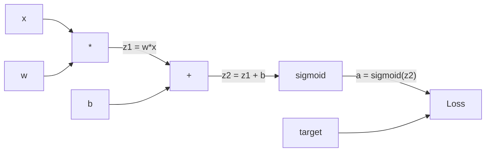
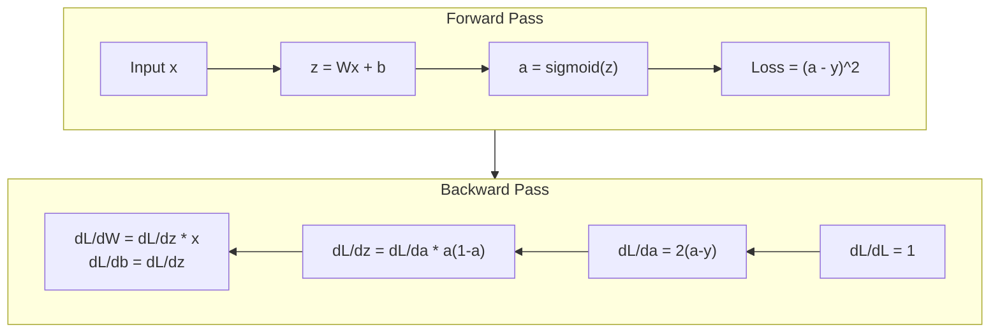
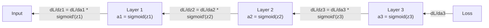

# التنشر الخلفي من الصفر من الصفر لتحقيق التنشر المضاد

> التنشر الخلفي هو الخوارزمية التي تجعل التعلم ممكنًا. بدونها، الشبكات العصبية هي مجرد مولدات أرقام عشوائية مكلفة.

> التوزيع المقابل هو جعل التعلم يكون من الممكن الجهاز التدريبي. بدونه، شبكة العصبية مجرد مولد عدد عشوائي مكلف.

> **【中文解读】**التنشر العكسي هو الجهاز الأساسي لجعلها قادرة على "التعلم" في شبكة العصبية. بدونها، شبكة العصبية مجرد مجموعة من الأعداد المتعددة.

**Type:** Build
**Languages:** Python
**Prerequisites:** Lesson 03.02 (Multi-Layer Networks)
**Time:** ~120 minutes

## أهداف التعلم

- تنفيذ محرك أوتوجراد القائم على القيمة الذي يبنو رسومًا محاسبية ويحسب التراجع عبر التنظيم التوبولوجي
  实现 المحركات التلقائية القائمة على القيمة، بناء الخريطة الحسابية ومع ذلك عبر التخطيط الترتيبية الحسابية
- استنتاج الممر الخلفي للضخمة والضاعفة والسيمويد باستخدام قاعدة السلسلة
  استخدام قانون السلاسل التشريع إضافة الفقرة والعدد والإشارة
- تدريب شبكة متعددة الطبقات على XOR وتصنيف الدوائر باستخدام محرك التنشر الخلفي الخاص بك فقط من الصفر
  فقط باستخدامك من الصفر بناء محركات التنقل المضادة في XOR ودورة التقسيم التدريب على شبكة متعددة المستويات
- تحديد مشكلة التهاب المرافق في شبكات sigmoid العميقة وتفسير لماذا تتقلص المرافق بشكل متسارع
  识别深度 sigmoid 网络中的梯度消失问题,解释为什么梯度会指数级缩小

> **【中文解读】**هدف هذا الفصل: بناء محرك التجزئة الذاتية مثل PyTorch autograd، باستخدام قواعد القيود التوجيهية إضافة ̊乘法、sigmoid من المعكس التنشر، تدريب XOR 和圆形分类任务، فهم مشكلة تختفي الدرجة.

## المشكلة المشكلة المشكلة

شبكتك لديها طبقة واحدة مخفية مع 768 مدخل و 3072 خروجا. هذا هو 2,359,296 وزنه. لقد قام بتنبؤ خاطئ. أي وزنه أدت إلى الخطأ؟ اختبار كل وزنه بشكل فردي يعني 2.3 مليون مرور إلى الأمام. التنشر الخلفي يحسب جميع 2.3 مليون تراجع في مرور واحد إلى الوراء. هذا ليس تحسينا. هذا هو الفرق بين المدرب والمعجز.

> شبكةك لديها 768 輸入、3072 輸出 隱藏層──那是 2,359,296 权重──它做了错误预测──它做了错误预测──它做了错误预测──它做了错误预测──它做了错误预测──它做了错误预测──它做了错误预测──它做了错误预测──它做了错误预测.

النهج البغيض: أخذ وزن واحد، دفعها بكمية صغيرة، تشغيل الممر إلى الأمام مرة أخرى، قياس ما إذا كان الخسارة ارتفعت أو انخفضت. وهذا يعطي لك تراجع لهذا الوزن. الآن افعله لكل وزن في الشبكة. ضربها بألاف خطوات التدريب وملايين نقاط البيانات. كنت بحاجة إلى وقت جيولوجي لتدريب أي شيء مفيد.

> طريقة بسيطة: خذ وزن، قم بتحويله، قم بتنقله مرة أخرى، فقدان القياس هو صعود أو انخفاض. هكذا تحصل على هذا الوزن. الآن كل وزن في الشبكة يفعل ذلك.

التنشر الخلفي يحل هذا. واحد تقدم، واحد تراجع، جميع التراجع الحوسبة. الحيلة هي قاعدة سلسلة من الحساب، تطبق بشكل منهجي على الرسم البياني الحوسبي. هذا هو الخوارزمية التي جعلت التعلم العميق عملية. بدونها، كنا لا يزال عالقا على مشاكل اللعبة.

> التوزيع المضاد يحل هذا المشكلة. مرة واحدة إلى الأمام، مرة أخرى إلى الأمام، كل التعدد على حسابها قد تم الانتهاء.

> **【中文解读】**شبكة ذات 2350،000 وزن، إذا حاولت تحسب التسلسل، تحتاج إلى 2350،000 مرة إلى الأمام للتنشر.

## المفهوم الأساسي

### قاعدة السلسلة، تطبق على الشبكات

لقد رأيت قاعدة السلسلة في المرحلة 01, الدروس 05. إعادة التعبير السريع: إذا y = f(g(x) ، ثم dy/dx = f'(g(x)) * g'(x. أنت ضرب المشتقات على طول السلسلة.

> 你在第一阶段第 05 课见过链式法则──快速回顾: إذا y = f(g(x) ،则 dy/dx = f'(g(x)) * g'(x)──你沿着链条将导数相乘──

في شبكة عصبية، "السلسلة" هي تسلسل العمليات من المدخل إلى الخسارة. تطبق كل طبقة أوزانًا، تضيف تحيزات، تمر عبر تنشيط. تقوم وظيفة الخسارة بمقارنة الخروج النهائي مع الهدف. تتبع التنشر الخلفي هذه السلسلة إلى الوراء، وتحسب كيفية مساهمة كل عملية في الخطأ.

> في شبكة العصبية، "السلسلة" هي سلسلة العمليات من الإدخال إلى الخسارة. في كل مستوى من أجهزة التطبيق، يتم تقييم وزنها، وزيادة تعويضها، وذلك من خلال وظيفة التشغيل.

> **【中文解读】**链式法则: إذا y = f(g(x) ،则 dy/dx = f'(g(x)) * g'(x) ・・・ في شبكة العصبية، "链" هو سلسلة من عمليات الدخول إلى الخسارة。

> **【拓展：PyTorch autograd 的核心】**بيتورش `loss.backward()`هو قانون تنفيذ سلسلة التسلسل الذاتي. انه في التسجيل الحسابات عندما يتوجه إلى الأمام، ثم في وقت متأخر على طول التسجيل في التسجيل. فهمت التطبيقات اليدوية لهذا المرحلة، فهمت جميع المبادئ من PyTorch autograd.

### الرسوم البيانية الحسابية

كل مرور إلى الأمام يبني رسمياً. كل عقدة هي عملية (مضاعفة، مضافة، sigmoid). كل حافة تحمل قيمة إلى الأمام وتحرك إلى الوراء.

> كل مرة من الأمام إلى الأمام تمثل رسمًا. كل نقطة عملية. كل جانب من الأمام إلى الأمام يُنقل قيمة، وكل جانب من الأمام إلى الأمام يُنقل درجة.



المضي قدما: تدفق القيم من اليسار إلى اليمين. x و w ينتج z1 = w * x. إضافة b للحصول على z2. سيغمايد يعطي تفعيل a. مقارنة a إلى الهدف y باستخدام وظيفة الخسارة.

> قبل الاتصال: قيمة من اليسار إلى اليمين التدفق. x 和 w 产生 z1 = w*x。加 b 得到 z2。Sigmoid 给出激活 a。用损失函数将 a 与目标 y 进行比较。

الممر الخلفي: تدفق التدرج يمينا إلى اليسار. تبدأ بـ dL/da (كيف تتغير الخسارة مع التفعيل). مضاعفة بـ da/dz2 (مشتق سيغمايد). هذا يعطي dL/dz2. تقسيم إلى dL/db (الذي يساوي dL/dz2 ، حيث z2 = z1 + b) و dL/dz1. ثم dL/dw = dL/dz1 * x و dL/dx = dL/dz1 * w.

> في المقابل، يتم تحويل المعلومات إلى: dL/dz2، dL/dz2، dL/dz2، dL/dz1، dL/dz1، dL/dz1، dL/dz1، dL/dz1، dL/dz1، dL/dz1، dL/dz1، dL/dz1، dL/dz1، dL/dz1، dL/dz1، dL/dz1، dL/dz1، dL/dz1، dL/dz1، dL/dz1، dL/dz1، dL/dz1، dL/dz1، dL/dz1، dL/dz1، dL/dz1، dL/dz1، dL/dz1، dL/dz1، dL/dz1، dL/dz1، dL/dz1، dL/dz1، dL/dz1، dL/dz1، dL/dz1، dL/dz1، dL/dz1، dL/dz1، dL/dz1، d6، dL/dz1، dL/dz1، dL/dz1، d6، dL/dz1، dL/dz1، d6، dL/dz1، d6، dL/dz1، d6، d/dz1، d/dz1، d/dz1، d6، d/dz1، d/dz1، d/dz1، d/dz1، d/dz1، d/dz1، d/dz1، d/dz1، d/dz1، d/dz1، d/dz1، d/dz1، d/dz1، d/dz1، d/dz1، d، d، d/dz1، d/dz1، d/dz1، d، d، d، d/dz1، d/dz1، d، d/dz1، d، d، d/dz2، d، d، d/dz2، d، d، d، d، d، d، d، d، d، d، d، d، d، d، d، d، d، d، d، d، d، d، d، d، d

كل عقدة في الرسم البياني لديها وظيفة واحدة خلال المرور إلى الوراء: تأخذ التراجع قادم من الأعلى، و مضاعفة بمشتقها المحلي، و تمررها إلى أسفل.

> في كل نقطة في التنقل المضاد هناك مهمة واحدة فقط: استلام التسلسل المترتبة على التسلسل، مضاعفة على عدد محلي الخاص بها، والإرسال إلى أسفل.

> **【中文解读】**كل عقد في الخريطة الحسابية ((乘法、加法、 sigmoid) في القيمة المرسومة عند الانتشار إلى الأمام، في التسليم إلى التسليم إلى التسليم إلى التسليم إلى التسليم إلى التسليم إلى التسليم إلى التسليم إلى التسليم إلى التسليم إلى التسليم إلى التسليم إلى التسليم إلى التسليم إلى التسليم إلى التسليم إلى التسليم إلى التسليم إلى التسليم إلى التسليم إلى التسليم إلى التسليم إلى التسليم إلى التسليم إلى التسليم إلى التسليم إلى التسليم إلى التسليم إلى التسليم إلى التسليم إلى التسليم إلى التسليم إلى التسليم إلى التسليم إلى التسليم إلى التسليم إلى التسليم إلى التسليم إلى التسليم إلى التسليم إلى التسليم إلى التسليم إلى التسليم إلى التسليم إلى التسليم إلى التسليم إلى التسليم إلى التسليم إلى التسليم إلى التسليم إلى التسليم إلى التسليم إلى التسليم إلى التسليم إلى التسليم إلى التسليم إلى التسليم إلى التسليم إلى التسليم إلى التسليم إلى التسليم إلى التسليم إلى التسليم إلى التسليم إلى التسليم إلى التسليم إلى التسليم إلى التسليم إلى التسليم إلى التسليم إلى التسليم إلى التسليم إلى التسليم إلى التسليم إلى التسليم إلى التسليم إلى التسليم إلى التسليم إلى التسليم إلى التسليم إلى التسليم إلى التسليم إلى التسليم إلى التسليم إلى التسليم إلى التسليم إلى التسليم إلى التسليم إلى التسليم إلى التسليم إلى التسليم إلى التسليم إلى التسليم إلى التسليم إلى التسليم إلى التسليم إلى التسليم إلى التسليم إلى التسليم إلى التسليم إلى التسليم إلى التسليم إلى التسليم إلى التسليم إلى التسليم إلى التسليم إلى التسليم إلى التسليم إلى التسليم إلى التسليم إلى التسليم إلى التسليم إلى التسليم إلى التسليم إلى التسليم إلى التسليم إلى التسليم إلى التسليم إلى الت

### للأمام مقابل الخلف



يحتفظ المرور الأمامي بكل قيمة متوسطة: z، a، المدخلات لكل طبقة. يحتاج المرور الخلفي إلى هذه القيم المخزنة لحساب التراجعيات. هذا هو التنازل بين الذاكرة والحوسبة في قلب الوصول الخلفي. تقوم بتبادل الذاكرة (تنشيط التخزين) بالسرعة (مرور واحد بدلاً من ملايين).

> قبل الالتزام في التنقل الاحتياطي كل القيمة الوسطى:z、a、 كل مستوى من المدخلات.

> **【中文解读】**هذا هو الوزن الأساسي للاتصال بالاتصال بالاتصال بالاتصال بالاتصال بالاتصال بالاتصال بالاتصال بالاتصال بالاتصال بالاتصال بالاتصال بالاتصال بالاتصال بالاتصال بالاتصال بالاتصال بالاتصال بالاتصال بالاتصال بالاتصال بالاتصال بالاتصال بالاتصال بالاتصال بالاتصال بالاتصال بالاتصال بالاتصال بالاتصال بالاتصال بالاتصال بالاتصال بالاتصال بالاتصال بالاتصال بالاتصال بالاتصال بالاتصال بالاتصال بالاتصال بالاتصال بالاتصال بالاتصال بالاتصال بالاتصال بالاتصال بالاتصال بالاتصال بالاتصال بالاتصال بالاتصال بالاتصال بالاتصال بالاتصال بالاتصال بالاتصال بالاتصال بالاتصال بالاتصال بالاتصال بالاتصال بالاتصال بالاتصال بالاتصال بالاتصال بالاتصال بالاتصال بالاتصال بالاتصال بالاتصال بالاتصال والاتصال بالاتصال بالاتصال بالاتصال والاتصال بالاتصال بالاتصال والاتصال بالاتصال بالاتصال والاتصال بالاتصال والاتصال بالاتصال والاتصال والاتصال والاتصال والاتصال والاتصال والاتصال والاتصال والاتصال والاتصال والاتصال والاتصال والاتصال والاتصال والاتصال والاتصال والاتصال والاتصال والاتصال والاتصال والاتصال والاتصال والاتصال والاتصال والاتصال والاتصال والاتصال والاتصال والاتصال والاتصال والاتصال والاتصال والاتصال والاتصال والاتصال والاتصال والاتصال والاتصال والاتصال والاتصال والاتصال والاتصال والاتصال والاتصال والاتصال والاتصال والاتصال والاتصال والاتصال والاتصال والاتصال والاتصال والاتصال والاتصال والاتصال والاتصال والاتصال والاتصال والاتصال والاتصال والاتصال والاتصال والاتصال والاتصال والاتصال والاتصال والاتصال والاتصال والاتصال والاتصال والاتصال والاتصال والاتصال والاتصال والاتصال والاتصال والاتاتاتاتاتصال والاتاتاتاتاتاتاتاتاتاتات

### تدريجية التدفق عبر الشبكة تدريجية التدفق في الشبكة

لشبكة ثلاث طبقات، سلسلة التدفقات عبر كل طبقة:

>  بالنسبة للشبكة الثلاثة مستويات، 梯度 通过每一层链接传递:



في كل طبقة، يتم ضرب التراجع بالمت مشتقة sigmoid. المشتقة sigmoid هي * (1 - a) ، والتي تصل إلى 0.25 (عندما a = 0.5). ثلاثة طبقات عميقة، تم ضرب التراجع بأكثر من 0.25^3 = 0.0156. عشرة طبقات عميقة: 0.25^10 = 0.000001.

> في كل طبقة، تدرجاتها تكرر بـ 导数 sigmoid.

### المرحلة المختفية تختفي

هذه هي مشكلة التراجع المتلاشى. سيقمويد يضرب انتاجها بين 0 و 1. مشتقها دائما أقل من 0.25. قم بتجميع طبقات سيقمويد كافية وتقلص التراجع إلى لا شيء. بالكاد تتعلم الطبقات الأولى لأنها تتلقى تراجعات قريبة من الصفر.

> هذا هو مشكلة اختفاء التدرج. سيتم تخفيض الصادرات من التدرج إلى 0 و1 بينها.

```
sigmoid(z):     Output range [0, 1]              # 输出范围 [0, 1]
sigmoid'(z):    Max value 0.25 (at z = 0)        # 导数最大值 0.25（在 z = 0 时）

After 5 layers:   gradient * 0.25^5 = 0.001x original       # 5 层后梯度缩到 0.001 倍
After 10 layers:  gradient * 0.25^10 = 0.000001x original    # 10 层后梯度几乎为零
```

هذا هو السبب في أن شبكات sigmoid العميقة مستحيلة تقريبا لتدريب. الإصلاح -- ريلو ومتغيراتها -- هو موضوع الدروس 04.

> هذا هو السبب في أن التنقل العميق للشبكة هو أمر مستحيل تقريبا للتدريب. الحل.

> **【中文解读】**梯度消失:حد أقصى عدد من التسريعات في السيغمويد هو 0.25, كل مرة تمر فيها على مستوى واحد يزيد على 0.25♦ 5 طبقات بعد ذلك يبقى 0.001.10 طبقات بعد ذلك يبقى فقط مليون من واحد♦

> **【拓展：Transformer 中的梯度流】**محول مع تركيبات اتصال (الارتباطات المتبقية) حل مشكلة اختفاء التعدد:`output = x + sublayer(x)` يمكن أن يرتفع هذا التسلسل عبر الطبقة التالية مباشرة، مما يجعل 96 طبقة من GPT-3 يمكن أيضا التدريب.

### استنتاج المراحل لشبكة طبقة 2

الرياضيات الملموسة لشبكة مع المدخل x، الطبقة الخفية مع sigmoid، الطبقة الخروج مع sigmoid، وفقدان MSE.

> 具体推导一个具有输入 x、sigmoid 隐藏层、sigmoid 输出层和MSE 损失的网络──

التسلل الأمامي:
```
z1 = W1 * x + b1          # 隐藏层线性变换
a1 = sigmoid(z1)           # 隐藏层激活
z2 = W2 * a1 + b2          # 输出层线性变换
a2 = sigmoid(z2)           # 输出层激活
L = (a2 - y)^2             # MSE 损失
```

التخطيط للخلف (تطبيق قاعدة السلسلة خطوة بخطوة):
```
dL/da2 = 2(a2 - y)                              # 损失对输出的梯度
da2/dz2 = a2 * (1 - a2)                         # sigmoid 导数
dL/dz2 = dL/da2 * da2/dz2 = 2(a2 - y) * a2 * (1 - a2)  # 链式法则

dL/dW2 = dL/dz2 * a1                            # 输出层权重梯度
dL/db2 = dL/dz2                                  # 输出层偏置梯度

dL/da1 = dL/dz2 * W2                             # 梯度传播到隐藏层
da1/dz1 = a1 * (1 - a1)                          # sigmoid 导数
dL/dz1 = dL/da1 * da1/dz1                        # 链式法则

dL/dW1 = dL/dz1 * x                              # 隐藏层权重梯度
dL/db1 = dL/dz1                                   # 隐藏层偏置梯度
```

كل تراجع هو نتاج من المشتقات المحلية تتبع من الخسارة هذا كل ما هو الانتشار الخلفي.

> كل درجة هي ضربة من ضياع الوصول المحلي إلى الوراء. وهذا هو كل ما هو ضد التنشر.

> **【中文解读】**التوصيل إلى التسلسلات في شبكة طبقتين: من وظيفة الخسارة، باستخدام قانون الشبكة خطوة خطوة إلى الوراء الحساب. كل تسلسلة هي سلسلة من عدد المحلي التسلسلات. هذا هو التطبيق المنهجي لجميع قواعد الشبكة المترددة في التنقل.

## بناءه
```figure
backprop-vanishing
```

## بناءها

### الخطوة الأولى: عقد القيمة نقطة القيمة

كل رقم في الحساب يصبح قيمة. فإنه يحتفظ ببياناته، ومحافضتها، وكيفية إنشاؤها (لذا هو يعرف كيفية حساب المحافضات إلى الوراء).

> كل رقم في الحسابات التي نقوم بها تصبح قيمة واحدة. إنها تخزن البيانات، والدرجة، وكيف يتم إنشاؤها.

```python
class Value:
    def __init__(self, data, children=(), op=''):
        self.data = data                          # 这个节点的数值
        self.grad = 0.0                           # 损失对这个值的梯度（初始为 0）
        self._backward = lambda: None             # 反向传播函数（初始为空操作）
        self._children = set(children)            # 产生这个值的子节点（用于拓扑排序）
        self._op = op                             # 产生这个值的操作（用于调试可视化）
```

لا يوجد تراجع بعد (0. 0) لا يوجد وظيفة تراجع بعد (لا تشغيل)`_children`تتبع أي قيمة أنتجت هذه، حتى يمكننا ترتيب الجرافة من الناحية التوضيحية في وقت لاحق.

> لا يوجد درجة ((0.0)。 لا يوجد فعل مضاد للجهة ((空操作)。`_children`و بعد ذلك، أصل هذه القيمة، حتى نتمكن من التنظيم لاحقاً.

### الخطوة الثانية: عمليات مع وظائف خلفية

كل عملية تخلق قيمة جديدة وتحدد كيفية تدفق التدرج إلى الوراء من خلالها.

> كل عملية تخلق قيمة جديدة وتحدد درجة كيفية مرورها في التدفق العكسي.

```python
def __add__(self, other):
    other = other if isinstance(other, Value) else Value(other)
    out = Value(self.data + other.data, (self, other), '+')

    def _backward():
        self.grad += out.grad        # 加法的梯度：d(a+b)/da = 1，直接传递
        other.grad += out.grad       # d(a+b)/db = 1，直接传递

    out._backward = _backward
    return out

def __mul__(self, other):
    other = other if isinstance(other, Value) else Value(other)
    out = Value(self.data * other.data, (self, other), '*')

    def _backward():
        self.grad += other.data * out.grad   # 乘法的梯度：d(a*b)/da = b
        other.grad += self.data * out.grad   # d(a*b)/db = a

    out._backward = _backward
    return out
```

لضافة: d(a+b) /da = 1، d(a+b) /db = 1. لذلك كل من المدخلات تحصل على تراجع الخروج مباشرة.

> 加法:d(a+b)/da = 1,d(a+b)/db = 1。 لذلك اثنين من الدخل و الحصول على مباشرة من المخرج درجة。

للضرب: d(a*b)/da = b، d(a*b)/db = a. كل مدخل يحصل على قيمة الآخر مضربة على تراجع الخروج.

> 乘法:d(a*b)/da = b,d(a*b)/db = a。 كل دخول يحصل على آخر من قيمة ضرب لإنتاج درجة。

- نعم`+=`القيمة يمكن استخدامها في عمليات متعددة. تراجعتها هي مجموع تراجعات من جميع المسارات.

> `+=`هو المفتاح. القيمة واحدة يمكن استخدامها في العديد من العمليات.

> **【中文解读】**                                                                                                                                                                                                                                                              `+=`بدلاً من ذلك`=`، لأن قيمة واحدة يمكن استخدامها في عدة عمليات ، تحتاج التعدد إلى جمع من جميع الطرق.

### الخطوة الثالثة: سيغمايد والخسارة

```python
import math

def sigmoid(self):
    x = self.data
    x = max(-500, min(500, x))    # 裁剪防止溢出
    s = 1.0 / (1.0 + math.exp(-x))  # 前向：计算 sigmoid
    out = Value(s, (self,), 'sigmoid')

    def _backward():
        self.grad += (s * (1 - s)) * out.grad  # 反向：sigmoid 导数 = σ(x) * (1 - σ(x))

    out._backward = _backward
    return out
```

مشتق سيغمويد: sigmoid(x) * (1 - sigmoid(x)). قمنا بحساب sigmoid(x) = s خلال المضي قدما. استعمله مرة أخرى. لا عمل إضافي.

> sigmoid 导数:sigmoid(x) * (1 - sigmoid(x))。 نحن في الالتزام الاولى في الانتشار قد حكم sigmoid(x) = s。

```python
def mse_loss(predicted, target):
    diff = predicted + Value(-target)  # predicted - target
    return diff * diff                  # (predicted - target)^2
```

MSE لإنتاج واحد: (توقعات - هدف) ^ 2 . نعبر عن الحد كجمع مع قيمة سلبية.

> 单输出 MSE:(توقعات - هدف)^2。 我们将减法表示为加上取反的价值──

### الخطوة الرابعة: التراجع

التنظيم التوبولوجي يضمن أننا نعمل على العقد في الترتيب الصحيح -- تراجع العقد يتم تراكمها بالكامل قبل أن نتكاثر من خلالها.

> التخطيط التالي لضمان أننا في النظام الصحيح معالجة العقدة  تدرج العقدة واحدة قد تمت إضافة كاملة قبل أن تنتشر من خلالها 

```python
def backward(self):
    topo = []                         # 拓扑排序结果
    visited = set()

    def build_topo(v):
        if v not in visited:
            visited.add(v)
            for child in v._children:    # 先访问所有子节点
                build_topo(child)
            topo.append(v)               # 子节点都访问完后，再把自己加入列表

    build_topo(self)
    self.grad = 1.0                     # 损失对自己的梯度 = 1（dL/dL = 1）
    for v in reversed(topo):            # 逆序遍历（从输出到输入）
        v._backward()                   # 每个节点执行自己的反向传播函数
```

ابدأ في الخسارة (المرح = 1.0 ، منذ dL / dL = 1).`_backward`يضغط على التدفقات إلى أطفالها

> من الخسارة البداية (درجة = 1.0) ، لأن dL/dL = 1)`_backward`سوف يُرسل الدرجة إلى نقطة الوصول

> **【中文解读】**التخطيط التالي: بعد أن تتراكم نطاق العقدة بشكل كامل، تبدأ الانتشار إلى نطاقها التابع.`loss.backward()`منطقها الأساسي

### الخطوة 5: الطبقة والشبكة

```python
import random

class Neuron:
    def __init__(self, n_inputs):
        scale = (2.0 / n_inputs) ** 0.5   # He 初始化缩放因子，防止 sigmoid 饱和
        self.weights = [Value(random.uniform(-scale, scale)) for _ in range(n_inputs)]
        self.bias = Value(0.0)

    def __call__(self, x):
        act = sum((wi * xi for wi, xi in zip(self.weights, x)), self.bias)  # 加权求和 + 偏置
        return act.sigmoid()  # sigmoid 激活

    def parameters(self):
        return self.weights + [self.bias]   # 返回所有可训练参数


class Layer:
    def __init__(self, n_inputs, n_outputs):
        self.neurons = [Neuron(n_inputs) for _ in range(n_outputs)]

    def __call__(self, x):
        out = [n(x) for n in self.neurons]
        return out[0] if len(out) == 1 else out  # 单神经元时直接返回值

    def parameters(self):
        params = []
        for n in self.neurons:
            params.extend(n.parameters())
        return params


class Network:
    def __init__(self, sizes):
        self.layers = []
        for i in range(len(sizes) - 1):
            self.layers.append(Layer(sizes[i], sizes[i + 1]))  # 按尺寸列表构建层

    def __call__(self, x):
        for layer in self.layers:
            x = layer(x)                    # 逐层前向传播
            if not isinstance(x, list):
                x = [x]
        return x[0] if len(x) == 1 else x

    def parameters(self):
        params = []
        for layer in self.layers:
            params.extend(layer.parameters())
        return params

    def zero_grad(self):
        for p in self.parameters():
            p.grad = 0.0    # 清零所有梯度（每次反向传播前必须调用）
```

يأخذ العصبية المدخلات ، ويحسب المجموع الموزن + التحيز ، ويتطبق sigmoid. يُقيم مقياس البدء في الوزن بواسطة sqrt(2/n_inputs) لمنع شبع sigmoid في الشبكات العميقة. الطبقة هي قائمة بالعصبية. شبكة هي قائمة بالطبقات.`parameters()`طريقة جمع جميع القيم التي يمكن تعلمها حتى نتمكن من تحديثها.

> العصبية قبل إدخال، حساب加权和加偏置، ثم تطبيق sigmoid──权重初始化按平方(2/n_inputs) 缩放以防止更深层网络中的 sigmoid 和──层是 Neuron 的列表──网络是层 的列表──`parameters()`طريقة جمع كل القيمة التي يمكن تعلمها لتحديثها

> **【中文解读】**العصبية = واحد النوايا ((الوزن + الوضع التركيز + السجماوي) ، الطبقة = مجموعة من النوايا، الشبكة = مجموعة من الطبقات.`parameters()`جمع جميع العناصر التدريبية`zero_grad()`清零梯度(每轮训练前必须调用)`model.parameters()`和 `optimizer.zero_grad()`النوع الأصلي

### الخطوة 6: تدريب على XOR تدريب XOR

```python
random.seed(42)
net = Network([2, 4, 1])  # 2 输入 → 4 隐藏神经元 → 1 输出

xor_data = [
    ([0.0, 0.0], 0.0),
    ([0.0, 1.0], 1.0),
    ([1.0, 0.0], 1.0),
    ([1.0, 1.0], 0.0),
]

learning_rate = 1.0

for epoch in range(1000):
    total_loss = Value(0.0)
    for inputs, target in xor_data:
        x = [Value(i) for i in inputs]
        pred = net(x)                          # 前向传播
        loss = mse_loss(pred, target)          # 计算损失
        total_loss = total_loss + loss         # 累积损失

    net.zero_grad()           # 清零梯度
    total_loss.backward()     # 反向传播：计算所有参数的梯度

    for p in net.parameters():
        p.data -= learning_rate * p.grad      # 梯度下降更新权重

    if epoch % 100 == 0:
        print(f"Epoch {epoch:4d} | Loss: {total_loss.data:.6f}")

print("\nXOR Results:")
for inputs, target in xor_data:
    x = [Value(i) for i in inputs]
    pred = net(x)
    print(f"  {inputs} -> {pred.data:.4f} (expected {target})")
```

شاهد انخفاض الخسارة من التنبؤات العشوائية إلى تصحيح خروجيات XOR، مدفوعة بالكامل من قبل تراجع التنشر الحوسبة التدريجية والدفع الوزن في الاتجاه الصحيح.

> 观察损失下降── من التنبؤ المزمن إلى الصورة الصحيحة XOR 输出، تماما من قبل التسريب المقابل التسريع الحسابي 并将重量推向正确方向来驱动──

> **【中文解读】**دورة التدريب: قبل الاتجاه للنشر →  الخسارة الحسابية → الارتجاه للنشر → الارتفاع في الوزن.

### الخطوة السابعة: تصنيف الدائرة

في الدروس 02, قمت بتنسيق الأوزان يدوياً لتصنيف الدوائر. الآن دع الشبكة تتعلمها.

> في الدروس الثانية، قمت بتعديل الوزن من الدرجة الحجمية. الآن دع الشبكة تتعلمها بنفسك.

```python
random.seed(7)

def generate_circle_data(n=100):
    data = []
    for _ in range(n):
        x1 = random.uniform(-1.5, 1.5)
        x2 = random.uniform(-1.5, 1.5)
        label = 1.0 if x1 * x1 + x2 * x2 < 1.0 else 0.0   # 距原点 < 1 则为"内部"
        data.append(([x1, x2], label))
    return data

circle_data = generate_circle_data(80)

circle_net = Network([2, 8, 1])  # 2-8-1 网络
learning_rate = 0.5

for epoch in range(2000):
    random.shuffle(circle_data)       # 打乱数据顺序
    total_loss_val = 0.0
    for inputs, target in circle_data:
        x = [Value(i) for i in inputs]
        pred = circle_net(x)
        loss = mse_loss(pred, target)
        circle_net.zero_grad()         # 清零梯度
        loss.backward()                # 反向传播
        for p in circle_net.parameters():
            p.data -= learning_rate * p.grad  # 更新权重
        total_loss_val += loss.data

    if epoch % 200 == 0:
        correct = 0
        for inputs, target in circle_data:
            x = [Value(i) for i in inputs]
            pred = circle_net(x)
            predicted_class = 1.0 if pred.data > 0.5 else 0.0
            if predicted_class == target:
                correct += 1
        accuracy = correct / len(circle_data) * 100
        print(f"Epoch {epoch:4d} | Loss: {total_loss_val:.4f} | Accuracy: {accuracy:.1f}%")
```

نحن نستخدم SGD على الانترنت هنا -- تحديث الوزن بعد كل عينة بدلا من تراكم المجموعة الكاملة. هذا يكسر التماثل بشكل أسرع وتجنب الاكتفاء sigmoid على المشهد الخسارة الكاملة. خلط البيانات في كل عصر يمنع الشبكة من حفظ النظام.

> يستخدم SGD على الإنترنت لتحديث الوزن بعد كل عينة، بدلاً من جمع الكمية بأكملها.

لا توجد ضبط يدوي. الشبكة تكتشف حدود القرار الدائري بمفردها. هذه هي قوة الانتشار الخلفي: تحدد الهندسة المعمارية، وظيفة الخسارة، والبيانات. الخوارزمية تحدد الوزن.

> 无需手动调权重――网络自学画圆形决策边界―― هذا هو القوة المعاكسة للنشر: تحدد البنية、 فقدان الوظائف والبيانات، والهزم نفسه يجد الوزن الصحيح──

> **【中文解读】**هنا باستخدام SGD على الانترنت ((نموذج تحديث) وليس تحديث الجملة.

## استخدمها في التطبيق العملي

يقوم PyTorch بكل شيء أعلاه في عدد قليل من الخطوط. الفكرة الأساسية هي نفسها -- Autograd يبنى رسم حسابي خلال المضي قدما ويتتبعها إلى الوراء لحساب التراجع.

> استخدم بيتورش عدة صفوف من الكود بالفعل أنجزت جميع الوظائف المذكورة أعلاه.

```python
import torch
import torch.nn as nn

model = nn.Sequential(
    nn.Linear(2, 4),       # 对应我们的 Layer(2, 4)
    nn.Sigmoid(),           # 对应 sigmoid 激活
    nn.Linear(4, 1),       # 对应我们的 Layer(4, 1)
    nn.Sigmoid(),
)
optimizer = torch.optim.SGD(model.parameters(), lr=1.0)  # 对应我们的手动梯度下降
criterion = nn.MSELoss()  # 对应我们的 mse_loss

X = torch.tensor([[0,0],[0,1],[1,0],[1,1]], dtype=torch.float32)
y = torch.tensor([[0],[1],[1],[0]], dtype=torch.float32)

for epoch in range(1000):
    pred = model(X)                  # 前向传播
    loss = criterion(pred, y)        # 计算损失
    optimizer.zero_grad()            # 清零梯度（对应 net.zero_grad()）
    loss.backward()                  # 反向传播（对应 total_loss.backward()）
    optimizer.step()                 # 更新权重（对应 p.data -= lr * p.grad）

print("PyTorch XOR Results:")
with torch.no_grad():                # 推理模式，不计算梯度
    for i in range(4):
        pred = model(X[i])
        print(f"  {X[i].tolist()} -> {pred.item():.4f} (expected {y[i].item()})")
```

`loss.backward()`هل هو لك`total_loss.backward()`. .`optimizer.step()`هل هو دليلك`p.data -= lr * p.grad`. .`optimizer.zero_grad()`هل هو لك`net.zero_grad()`نفس الخوارزمية، تنفيذ القوة الصناعية. PyTorch يدير تسريع GPU، الدقة المختلطة، التفتيش التدريجي، ومئات من أنواع الطبقة. ولكن المرور الخلفي هو نفس قاعدة سلسلة تطبق على نفس الرسم البياني الحوسبي.

> `loss.backward()`هذا لك`total_loss.backward()`.`optimizer.step()`هذا هو يدك`p.data -= lr * p.grad`.`optimizer.zero_grad()`هذا لك`net.zero_grad()` نفس الخوارزمية، التطبيقات الصناعية.  معالجة بيتورش لـ GPU 加速、混合精度、梯度检查点和数百种层类.

التدريب يدير المرحلة الأمامية ثم المرحلة الخلفية ثم تحديث الأوزان الإحتمالية تُجري فقط المُسلّم الأمامي. لا توجد تراجعات، لا تحديثات. هذا التمييز مهم لأن الاستنتاج هو ما يحدث في الإنتاج. عندما تدعون API مثل كلود أو GPT، تقومون بإستستنتاج -- تتوجه طلبك إلى الأمام عبر الشبكة، وتخرج الرموز من الطرف الآخر. لا تغيير في الوزن فهم الرفع الخلفي مهم لأنه شكّل كل وزن في تلك الشبكة.

> 訓練运行前向传播, ثم反向传播, ثم更新权重──推理只运行前向传播──没有梯度,没有更新── هذا الفرق مهم، لأن التفكير هو ما يحدث في بيئة الإنتاج── عندما تستخدم كلود أو GPT وغيرها API، فإنك تعمل على التفكير  your tip word                                                                                                                                                                                                                          

> **【中文解读】**بيتورش `loss.backward()`= نحن نسجلها`backward()`،`optimizer.step()`= نحن نسجلها`p.data -= lr * p.grad` التدريب عندما تفعل قبل الالتزام + الالتزام + الاصلاح ، التفكير عندما تفعل فقط قبل الالتزام.

## أرسلها

هذا الدرس ينتج عن:
- `outputs/prompt-gradient-debugger.md`-- محاولة إعادة استخدام لتشخيص مشاكل التراجع (الاختفاء، الانفجار، NaN) في أي شبكة عصبية

> 本课产出:`outputs/prompt-gradient-debugger.md`- إختبار مراري لأي مشكلة في الدرجة الوسطى للشبكة العصبية

## تمارين التدريب

1. إضافة`__sub__`طريقة إلى فئة القيمة (a - b = a + (-1 * b)). ثم تنفيذ a `__neg__`التحقق من صحة التدرج عن طريق مقارنة مع الحساب اليدوي لمعبرة بسيطة مثل (a - b) ^ 2.
   > **练习 1：**给值 类加减法和取负操作──用手动计算验证 (a - b) ^ 2 梯度是否正确──

2. إضافة`relu`طريقة إلى القيمة (خروج أقصى ((0، x) ، المشتق هي 1 إذا x > 0 ، ثم 0). استبدل sigmoid مع relu في الطبقات الخفية وتدرب على XOR مرة أخرى. مقارنة سرعة التقارب. يجب أن ترى تدريب أسرع -- هذا يقدم الدروس 04.
   > **练习 2：**给 Value 添加 ReLU 方法──用 ReLU 替换隐藏层的sigmoid,训练 XOR 并对比收速度──ReLU 应该更快这是下一课的预览──

3. تنفيذ`__pow__`طريقة على القيمة لأقوى الأعداد الكاملة. استخدمها لتحل محل `mse_loss`مع مناسبة`(predicted - target) ** 2`التحقق من أن التدرج يطابق التنفيذ الأصلي.
   > **练习 3：**给值 添加运算方法, باستخدامها إعادة كتابة MSE 损失──验证梯度与原始实现一致──

4. إضافة التقطيع التدريبي إلى حلقة التدريب: بعد الدعوة `backward()`، قم بتقطيع جميع التدرجات إلى [-1, 1]. قم بتدريب شبكة أعمق (أربعة طبقات مع sigmoid) وقارن منحنى الخسارة مع ودون التدريب. هذا هو دفاعك الأول ضد التدرجات المتفجرة.
   > **练习 4：**في دورة التدريب إضافة تراجعة القص [-1, 1])。 التدريب 4+ طبقة من شبكة sigmoid 网络, مقابل وجود/ عدم قطع الخسارة منحنى。

5. بناء تصميم: بعد التدريب على XOR، طبع تراجع كل معايير في الشبكة. حدد أي طبقة لديها أصغر تراجات. هذا يظهر مشكلة تراجع تختفي التي قرأت عنها في قسم المفهوم.
   > **练习 5：**訓練 XOR 后, طبع كل عنصر من درجاتها.

## شروط رئيسية

| Term | What people say | What it actually means |
|------|----------------|----------------------|
| Backpropagation | "The network learns" | An algorithm that computes dL/dw for every weight by applying the chain rule backward through the computational graph |
| Computational graph | "The network structure" | A directed acyclic graph where nodes are operations and edges carry values (forward) and gradients (backward) |
| Chain rule | "Multiply the derivatives" | If y = f(g(x)), then dy/dx = f'(g(x)) * g'(x) -- the mathematical foundation of backpropagation |
| Gradient | "The direction of steepest ascent" | The partial derivative of the loss with respect to a parameter -- tells you how to change that parameter to reduce the loss |
| Vanishing gradient | "Deep networks don't learn" | Gradients shrink exponentially as they propagate through layers with saturating activations like sigmoid |
| Forward pass | "Running the network" | Computing the output from inputs by sequentially applying each layer's operations and storing intermediate values |
| Backward pass | "Computing gradients" | Traversing the computational graph in reverse, accumulating gradients at each node using the chain rule |
| Learning rate | "How fast it learns" | A scalar that controls the step size when updating weights: w_new = w_old - lr * gradient |
| Topological sort | "The right order" | An ordering of graph nodes where each node appears after all nodes it depends on -- ensures gradients are fully accumulated before propagation |
| Autograd | "Automatic differentiation" | A system that builds computational graphs during forward computation and automatically computes gradients -- what PyTorch's engine does |

| 术语 | 通俗说法 | 实际含义 |
|------|---------|---------|
| 反向传播 (Backpropagation) | "网络在学习" | 用链式法则沿计算图反向计算每个权重的 dL/dw 的算法 |
| 计算图 (Computational graph) | "网络结构" | 有向无环图，节点是操作，边传递值（前向）和梯度（反向） |
| 链式法则 (Chain rule) | "把导数乘起来" | y = f(g(x)) → dy/dx = f'(g(x)) * g'(x)——反向传播的数学基础 |
| 梯度 (Gradient) | "最陡上升方向" | 损失对参数的偏导数——告诉你怎么改参数能降低损失 |
| 梯度消失 (Vanishing gradient) | "深层网络学不动" | 梯度经过饱和激活函数（如 sigmoid）逐层指数级缩小 |
| 前向传播 (Forward pass) | "跑网络" | 从输入逐层计算输出，存储中间值 |
| 反向传播过程 (Backward pass) | "算梯度" | 逆序遍历计算图，用链式法则逐节点累加梯度 |
| 学习率 (Learning rate) | "学多快" | 控制权重更新步长的标量：w_new = w_old - lr * gradient |
| 拓扑排序 (Topological sort) | "正确的顺序" | 保证每个节点的梯度完全累加后再往下传播的节点排列 |
| 自动微分 (Autograd) | "自动求导" | 前向时构建计算图，自动计算梯度的系统——PyTorch 引擎的核心 |

## المزيد من القراءة

- روميل هارت، هينتون وويليامز، "تعلم التمثيلات عن طريق أخطاء التنشر الخلفي" (1986) -- الورقة التي جعلت التنشر الخلفي منتشراً رئيسياً وتدريب شبكة متعددة الطبقات غير مقفل
  روميل هارت، هينتون و وليامز،                                                                                                                                                                                                                                                         
- 3Blue1Brown، سلسلة "شبكات العصبية" (https://www.youtube.com/playlist?list=PLZHQObOWTQDNU6R1_67000Dx_ZCJB-3pi) -- أفضل تفسير بصري للتنشر الخلفي وتدفق التدفق عبر الشبكات
  3Blue1Brown،  شبكة العصب  سلسلة  حول أفضل تفسير مرئي للانتشار المضاد والمتسار في التدفق في الشبكة
