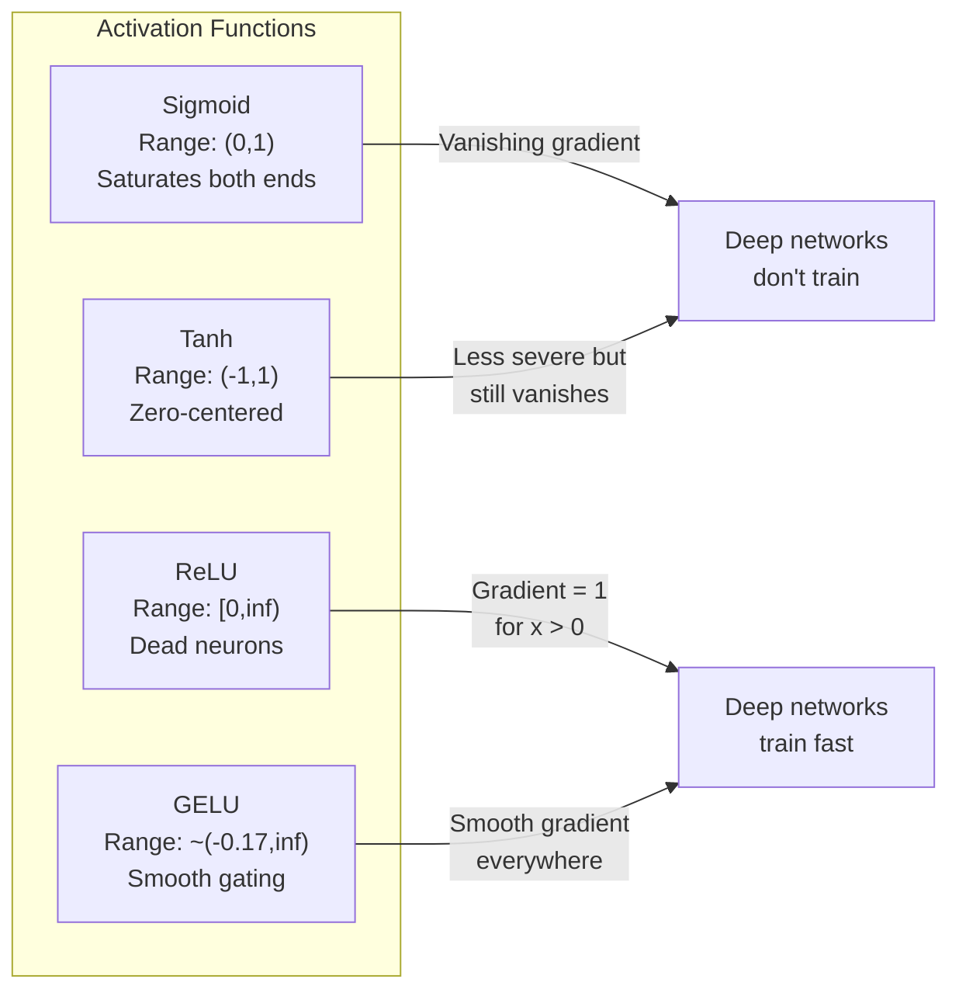
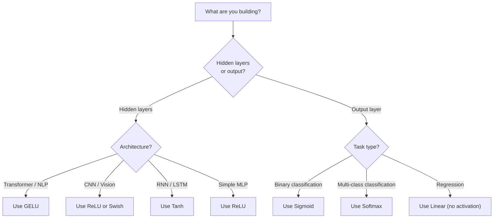

# وظائف التفعيل

> بدون عدم الخيارات الخارجيّة، شبكتك المكونة من 100 طبقة هي مضاعفة ماريخة رائعة. التفعيلات هي البوابات التي تسمح للشبكات العصبية بالتفكير في منحنى.

> **【中文解读】**没有非线性激活函数,100 层网络等于矩阵乘法──因为复合两个线性变换还是线性:W2(W1x+b1) +b2 = (W2W1)x + (W2b1+b2)──激活函数打破这种线性叠加,让每个层都能为网络增加真正的表达能力──

**Type:** Build
**Languages:** Python
**Prerequisites:** Lesson 03.03 (Backpropagation)
**Time:** ~75 minutes

## أهداف التعلم

- تنفيذ sigmoid، tanh، ReLU، Leaky ReLU، GELU، Swish، و softmax مع مشتقاتها من الصفر
- تشخيص مشكلة التهاب المراحل عن طريق قياس حجم التفعيل عبر 10+ طبقة مع تنشيطات مختلفة
- اكتشاف الخلايا العصبية الميتة في شبكة ReLU وشرح لماذا GELU يتجنب هذا وضع الفشل
- حدد وظيفة التفعيل الصحيحة لهيكل معين (المتحول، CNN، RNN، طبقة الخروج)

> **【中文解读】**هدف هذا الفصل: تحقيق 7 أنواع من وظائف التفعيل ومعها عدد الإرشادات، من خلال تجربة التشخيص المختلفة مشكلة، فحص العصب الميتة في ReLU، وتحديد وظائف التفعيل الملائمة لهياكل مختلفة.

## المشكلة المشكلة المشكلة

قم بتجميع اثنين من التحوّلات الخطية: y = W2(W1x + b1) + b2. قم بتوسيعها: y = W2W1x + W2b1 + b2. هذا فقط y = Ax + c -- تحوّل خطي واحد. مهما كانت عدد الطبقات الخطية التي تقوم بتجميعها، فإن النتيجة تنهار إلى مصفوفة واحدة مضاعفة. شبكة 100 طبقة لديك نفس القدرة التمثيلية مثل طبقة واحدة.

> 堆叠两层线性变换:y = W2(W1x + b1) + b2。展开后:y = W2W1x + W2b1 + b2。 هذا غير من y = Ax + c 个单独的线性变换──无论你堆叠多少线性层,结果都会缩短为一次矩阵乘法──你的100层网络与单层网络具有相同的表示能力──

هذا ليس فضول نظري. هذا يعني أن شبكة خطية عميقة لا تستطيع حرفياً تعلم XOR، لا تستطيع تصنيف مجموعة بيانات مستديرة، لا تستطيع التعرف على وجه. بدون وظائف التفعيل، العمق وهم.

> هذا ليس فضول نظري. هذا يعني أن شبكة عميقة لا تستطيع في الواقع تعلم XOR، لا تستطيع تقسيم مجموعة بيانات محورية، لا تستطيع التعرف على وجوه الإنسان.

وظائف التفعيل تقطع الخطية يختلفون خروج كل طبقة من خلال وظيفة غير خطية، مما يعطي الشبكة القدرة على منحنى حدود القرار، وتقريب وظائف تعسفية، وتعلم فعليا. ولكن اختر التفعيل الخطأ وتختفي تراجعاتك إلى الصفر (السيغمود في الشبكات العميقة) ، وتنفجر إلى اللانهاية (التفعيلات غير المحدودية دون بدء بعناية) ، أو تموت الخلايا العصبية بشكل دائم (ReLU مع تحيزات سلبية كبيرة). اختيار وظيفة التفعيل يحدد مباشرة ما إذا كانت شبكتك تتعلم على الإطلاق.

>  فعل الإنشاء يكسّر الهيكلية‬‬ ‫ويتمّ اختيارهم من خلال عمل غير خطيّ يلتوي كلّ مستوى من المخرجات، ويمنح شبكة曲 القرار الحدود‬‬‬‬‬‬‬‬‬‬‬‬‬‬‬‬‬‬‬‬‬‬‬‬‬‬‬‬‬‬‬‬‬‬‬‬‬‬‬‬‬‬‬‬‬‬‬‬‬‬‬‬‬‬‬‬‬‬‬‬‬‬‬‬‬‬‬‬‬‬‬‬‬‬‬‬‬‬‬‬‬‬‬‬‬‬‬‬‬‬‬‬‬‬‬‬‬‬‬‬‬‬‬‬‬‬‬‬‬‬‬‬‬‬‬‬‬‬‬‬‬‬‬‬‬‬‬‬‬‬‬‬‬‬‬‬‬‬‬‬‬‬‬‬‬‬‬‬‬‬‬‬‬‬‬‬‬‬‬‬‬‬‬‬‬‬‬‬‬‬‬‬‬‬‬‬‬‬‬‬‬‬‬‬‬‬‬‬‬‬‬‬‬‬‬‬‬‬‬‬‬‬‬‬‬‬‬‬‬‬‬‬‬‬‬‬‬‬‬‬‬‬‬‬‬‬‬‬‬‬‬‬‬‬‬‬‬‬‬‬‬‬‬‬‬‬‬‬‬‬‬‬‬‬‬‬‬‬‬‬‬‬‬‬‬‬‬‬‬‬‬‬‬‬‬‬‬‬‬‬‬‬‬‬‬‬‬‬‬‬‬‬‬‬‬‬‬‬‬‬‬‬‬‬‬‬‬‬‬‬‬‬‬‬‬‬‬‬‬‬‬‬‬‬‬‬‬‬‬‬‬‬‬‬‬‬‬‬‬‬‬‬‬‬‬‬‬‬‬‬‬‬‬‬‬‬‬‬‬‬‬‬‬‬‬‬‬‬‬‬‬‬‬‬‬‬‬‬‬‬‬‬‬‬‬‬‬‬‬‬‬‬‬‬‬‬‬‬‬‬‬‬‬‬‬‬‬‬‬‬‬‬‬‬‬‬‬‬‬‬‬‬‬‬‬‬‬‬‬‬‬‬‬‬‬‬‬‬‬‬‬‬‬‬‬‬‬‬‬‬‬‬‬‬

> **【中文解读】**堆叠两层线性变换 y = W2(W1x+b1) +b2 展开后就是一个线性变换 y = Ax+c。不管叠加多少层,结果都等于矩阵乘法深度是假的。

## المفهوم الأساسي

### لماذا لا يكون الخطية ضرورياً لماذا يجب أن يكون غير خطي

مضاعفة المصفوفة قابلة للتكوين. مضاعفة متجهة بمصفوفة A ثم المصفوفة B هو نفس مضاعفة ب AB. وهذا يعني أن تجميع عشرة طبقات خطية يعادل رياضياً طبقة خطية واحدة مع مصفوفة كبيرة واحدة. كل تلك المعايير، كل هذا العمق -- مضيعة. تحتاج إلى شيء لتحطيم السلسلة. هذا ما تفعله وظائف التفعيل.

> 矩阵乘法是可组合的──先用矩阵A 乘向量,再用矩阵B 乘,等于使用 AB 乘──这意味着堆叠十个线性层在数学上等于一个具有一个大矩阵的线性层──所有这些参数,所有那些深度都浪费了──你需要一些东西来打破这个链条──那就是作用的激活函数──

هنا هو دليل. طبقة خطية يحسب f ((x) = Wx + b. كومة اثنين:

```
Layer 1: h = W1 * x + b1         # 第一层线性变换
Layer 2: y = W2 * h + b2         # 第二层线性变换
```

البديل:

```
y = W2 * (W1 * x + b1) + b2      # 代入 h
y = (W2 * W1) * x + (W2 * b1 + b2)  # 展开
y = A * x + c                     # 合并为单一矩阵——深度消失了！
```

طبقة واحدة. أدخل تنشيط غير خطي g() بين الطبقات:

```
h = g(W1 * x + b1)               # 加入非线性激活
y = W2 * h + b2
```

الآن يتم كسر الاستبدال. W2 * g(W1 * x + b1) + b2 لا يمكن تقليصها إلى تحول خطي واحد. الشبكة يمكن أن تمثل وظائف غير خطية. كل طبقة إضافية مع تنشيط يضيف القدرة التمثيلية.

> 现在代入被打破了──W2 * g(W1 * x + b1) + b2 无法简化为单一线性变化──网络可以表示非线性函数──每个带激活函数的附加层都增加表示能力──

> **【中文解读】**دليل رياضي: اثنين من التغيرات الهادوية المشتركة هي الهادوية. ولكن إدخال غير الهادوية النشطة g (() 后,W2 * g ((W1x + b1) + b2 无法合并为单一矩阵每多层带活的层,网络的表达能力就真正增加了──

### السجمايد

وظيفة التفعيل الأصلية لشبكات العصبية

> النظام العصبي الأولي للعمل

```
sigmoid(x) = 1 / (1 + e^(-x))
```

نطاق الخروج: (0, 1). سلاسة، قابلة للتفريق، تقوم بتخطيط أي رقم حقيقي إلى قيمة تشبه الاحتمالات.

> 输出范围:(0, 1)──平滑、可微، سوف يتم تصوير أي عدد حقيقي على قيمة مماثلة للإحتمالات

المشتق:

> أرقامها:

```
sigmoid'(x) = sigmoid(x) * (1 - sigmoid(x))
```

القيمة القصوى لهذا المشتق هو 0.25 ، والتي تحدث عند x = 0. في الانتشار الخلفي ، تتضاعف التدرجات عبر الطبقات. عشرة طبقات من sigmoid يعني أن التدرجة تتضاعف بأكثر من 0.25 عشرة مرات:

> الحد الأقصى للقيادة هو 0.25، في الوقت الحالي x = 0 时.

```
0.25^10 = 0.000000953674     # 不到原始信号的百万分之一
```

أقل من مليون جزء من الإشارة الأصلية. هذه مشكلة التهاب المراحل. تصبح المراحل في الطبقات الأولى صغيرة جداً بحيث لا تتحديث الأوزان بالكاد. ويبدو أن الشبكة تتعلم - الخسارة تقل في الطبقات اللاحقة - ولكن الطبقات الأولى تتجمد. شبكات sigmoid العميقة ببساطة لا تتدرب.

> ليس من مليون من الإشارات الأصلية. هذا هو مشكلة اختفاء التدرج. أصبحت التدرج في المستوى الأول صغيراً جداً، والوزن لا يتجدد تقريباً. ويبدو أنّ شبكة التعلم تُخسر.

مشكلة إضافية: إنتاجات السيغميد تكون دائما إيجابية (0 إلى 1), مما يعني أن تراجعيات على الوزن هي دائما نفس العلامة. وهذا يسبب زيك زاجغ أثناء انخفاض تراجع.

> 额外问题:sigmoid 输出总是正数(0 إلى 1), وهذا يعني أن تراجعة الوزن总是同号── مما يؤدي إلى انخفاض الدرجة إلى طريق 形──

> **【中文解读】**أكبر عدد من التوجيهات في سيغمويد هو 0.25,10 層后梯度 فقط بقيت مليون分之一──前面几层几乎不收到梯度,无法学习──另外,

> **【拓展：Sigmoid 在现代 AI 中的位置】**سيغمايد 虽然不再用于隐藏层,但在二分类输出层仍然常用.

### (تان)

النسخة المركزية من sigmoid.

> إصدار مركزي من Sigmoid

```
tanh(x) = (e^x - e^(-x)) / (e^x + e^(-x))
```

نطاق الخروج: (-1, 1). مركز على الصفر، مما يزيل مشكلة الزيغ زاج.

> 输出范围:(-1, 1)──零中心化, eliminated形问题──

المشتق:

> أرقامها:

```
tanh'(x) = 1 - tanh(x)^2
```

المشتق الأقصى هو 1.0 عند x = 0 -- أربع مرات أفضل من sigmoid. ولكن مشكلة التراجع تختفي لا تزال موجودة. بالنسبة للمدخلات الإيجابية أو السلبية الكبيرة، المشتق يقترب من الصفر. عشرة طبقات لا تزال تحطم التراجع، فقط أقل عدوانية.

> الحد الأقصى للدليل هو 1.0 ((( في x = 0 时)  مقارنة بـ sigmoid 好 4 倍── ولكن مشكلة اختفاء التدرج لا تزال موجودة── بالنسبة للمدخول الصحي أو السلبي الكبير، فإن الحد الأقصى للتدرج يتوجه إلى صفر──10 مستوى لا يزال سيضغط  التدرج، ولكن ليس بذلك الحد.

> **【中文解读】**تان هو إصدار صفر مركز من sigmoid، النطاق المخرج (-1, 1), النطاق الأكبر من 1.0(من sigmoid 好 4 倍) ・・・ ولكن النطاق الكبير من النطاقات المنزلية لا يزال يتوجه إلى الصفر، ومشكلة التناقض الحد الأقصى لا تزال موجودة، ليس فقط ذلك خطير。

> **【拓展：LSTM 中的 Tanh】**الحالة المخفية والذكرى المرشحة في LSTM 网络 باستخدام tanh(把值压缩到 -1 إلى 1)。 على الرغم من أن المحول 已基本取代 LSTM، ولكن فهم tanh لفهم RNN 系列模型 مهم للغاية。

### الاختراقات الاكثر دراسية

وحدة خطية تصحيحة. تم تسليطها للدقة من قبل ناير وهينتون في عام 2010 (المهام نفسها تعود إلى عمل فوكوشيما عام 1969) ، غيرت كل شيء.

> 修正线性单元── بواسطة ناير 和 هينتون في عام 2010 تمت إعلانها للاستعمال المتعمق.

```
relu(x) = max(0, x)
```

نطاق الخروج: [0، لا نهاية لها). المشتق هي بسيطة بشكل بسيط:

```
relu'(x) = 1  if x > 0
           0  if x <= 0
```

لا يوجد تراجع يختفي للمدخلات الإيجابية. تراجع هو بالضبط 1، تمر مباشرة. هذا هو السبب في أن الشبكات العميقة أصبحت قابلة للتدريب -- ريلو يحافظ على حجم تراجع عبر الطبقات.

> لا يوجد مشكلة في إدخال الدرجة المفقودة. الدرجة الصحيحة هي 1، والتي يتم نقلها مباشرة.

ولكن هناك وضع فشل: مشكلة الخلايا العصبية الميتة. إذا كانت مدخلات الخلايا العصبية الموزعة سلبية دائمًا (بسبب تحيز سلبي كبير أو بدء وزن مؤسف) ، فإن خروجه دائمًا صفر ، وتحديدها دائمًا صفر ، ولا يحتديث أبدًا. إنها ميتة بشكل دائم. في الممارسة العملية ، يمكن أن يموت 10-40٪ من الخلايا العصبية في شبكة ReLU أثناء التدريب.

> ولكن هناك نمط فشل: مشكلة العصب الميتة. إذا كان إدخال مزيد من الوزن في العصب دائمًا سلبيًا (بسبب تعديل كبير أو بدء بدء الوزن في الحظ) ، فإن إدخالها دائمًا صفر ، والدرجة دائمًا صفر ، لا يتم تحديثها إلى الأبد.

> **【中文解读】**إنّ RLU على مستوى الدخول الصحي هو 1، لا ينخفض تمامًا هذا هو السبب في أنّ شبكة العميقة أصبحت قابلة للتدريب‬‬‬‬‬‬‬‬‬‬‬‬‬‬‬‬‬‬‬‬‬‬‬‬‬‬‬‬‬‬‬‬‬‬‬‬‬‬‬‬‬‬‬‬‬‬‬‬‬‬‬‬‬‬‬‬‬‬‬‬‬‬‬‬‬‬‬‬‬‬‬‬‬‬‬‬‬‬‬‬‬‬‬‬‬‬‬‬‬‬‬‬‬‬‬‬‬‬‬‬‬‬‬‬‬‬‬‬‬‬‬‬‬‬‬‬‬‬‬‬‬‬‬‬‬‬‬‬‬‬‬‬‬‬‬‬‬‬‬‬‬‬‬‬‬‬‬‬‬‬‬‬‬‬‬‬‬‬‬‬‬‬‬‬‬‬‬‬‬‬‬‬‬‬‬‬‬‬‬‬‬‬‬‬‬‬‬‬‬‬‬‬‬‬‬‬‬‬‬‬‬‬‬‬‬‬‬‬‬‬‬‬‬‬‬‬‬‬‬‬‬‬‬‬‬‬‬‬‬‬‬‬‬‬‬‬‬‬‬‬‬‬‬‬‬‬‬‬‬‬‬‬‬‬‬‬‬‬‬‬‬‬‬‬‬‬‬‬‬‬‬‬‬‬‬‬‬‬‬‬‬‬‬‬‬‬‬‬‬‬‬‬‬‬‬‬‬‬‬‬‬‬‬‬‬‬‬‬‬‬‬‬‬‬‬‬‬‬‬‬‬‬‬‬‬‬‬‬‬‬‬‬‬‬‬‬‬‬‬‬‬‬‬‬‬‬‬‬‬‬‬‬‬‬‬‬‬‬‬‬‬‬‬‬‬‬‬‬‬‬‬‬‬‬‬‬‬‬‬‬‬‬‬‬‬‬‬‬‬‬‬‬‬‬‬‬‬‬‬‬‬‬‬‬‬‬‬‬‬‬‬‬‬‬‬‬‬‬‬‬‬‬‬‬‬‬‬‬‬‬‬‬‬‬‬‬‬‬‬‬‬‬‬‬‬‬‬‬‬‬‬‬‬‬‬‬‬‬‬‬‬‬‬‬‬‬‬‬‬‬

> **【拓展：ReLU 在 CNN 中的统治地位】**إنترنت ResNet、VGG、EfficientNet 等 CNN 架构都使用 ReLU(或其变体) المركبات المكونة من CNN + ReLU هي مجموعة معايير لخصائص الرؤية 

### " ريلو " متسرب

أسهل علاج للخلايا العصبية الميتة

> أسهل طريقة لإعادة أعصاب الموت

```
leaky_relu(x) = x        if x > 0
                alpha * x if x <= 0
```

حيث أن ألفا ثابت صغير، عادةً 0.01، الجانب السلبي لديه ميل صغير بدلاً من الصفر، لذا لا يزال الخلايا العصبية الميتة تحصل على إشارة تراجع ويمكن أن تعافى.

> من بينها الفا هو عدد ثابت صغير، عادةً 0.01. الجانب السلبي لديه منحدر صغير بدلاً من الصفر، لذلك لا يزال العصب الميت قادرًا على الحصول على إشارة التدريجية ويمكن أن يتحسن.

> **【中文解读】**ريلو في منطقة سلبية تحتفظ بمعدل منحدر صغير (0.01) ، فيمكن أن يستقبل العصب الميت إشارة التدريجية، ويمكن أن يتعافى

### غيلو: الاختيار الاصطناعي الحديث

وحدة الخطوطية للخطأ الغاسية. قدمتها هندريكس وجيمبل في عام 2016. تنشيط الافتراضي في BERT وGPT ومعظم المحولات الحديثة.

> 高斯差差线性单元──由 هيندريكس 和 جيمبل 提出于2016年──BERT、GPT 和大多数现代 Transformer 的默认激活函数──

```
gelu(x) = x * Phi(x)
```

حيث Phi ((x) هو وظيفة التوزيع التراكمية لتوزيع الطبيعي القياسي. التقريب المستخدم في الممارسة العملية:

```
gelu(x) ~= 0.5 * x * (1 + tanh(sqrt(2/pi) * (x + 0.044715 * x^3)))
```

GELU مسلس في كل مكان ، ويحتوي على قيم سلبية صغيرة (على عكس ReLU التي تصفح صلبًا إلى الصفر) ، ولها تفسير محتمل: يوزن كل مدخل من خلال احتمال أن يكون إيجابيًا تحت توزيع غوسسي. هذا التغليف السلس يفوق ReLU في معماري المحولات لأنه يوفر تدفق تراجعي أفضل ويجنب مشكلة العصبية الميتة بالكامل.

> في GELU 处平滑,允许小的负值(不像 ReLU 硬截断为零), مع تفسير احتمالية: فإنه يحتوي على إدخال في حالة جيدة التوزيع تحت احتمالية صحيحة لكل إدخال زيادة الهيئة.

> **【中文解读】**GELU هو وظيفة تنشيط افتراضية لBERT、GPT 和 معظم Transformer الحديثة. انها في وضعية مسطحة、 تسمح بقيمة ضئيلة صغيرة (((غير مثل ReLU 硬截断为 0), تفسير الاحتمال هو: حسب الإدخال لتحسين الاحتمالات زيادة الاحتمالات٬

> **【拓展：GPT/BERT 中的 GELU】**في FFN (من قبل) النظام المعيار هو`Linear → GELU → Linear`✿ بيتورش ✿`nn.GELU()`和 `F.gelu()`هذا هو هذا المعدل. GPT-2/3/4 BERT 罗伯塔 等模型都使用GELU.

### سويش / سيلو

اكتشاف التفعيل الذاتي الذي اكتشفته راماشندران وآخرون في عام 2017 من خلال البحث الآلي.

```
swish(x) = x * sigmoid(x)
```

سويش رسمياً هو x * sigmoid ((x) ، اكتشفتها جوجل من خلال البحث الآلي على مساحة وظيفة التفعيل -- شبكة عصبية تصميم أجزاء من الشبكات العصبية.

مثل GELU ، هو سلس وغير متناغم ، ويسمح بقيمات سلبية صغيرة. الفرق خفيف: Swish يستخدم sigmoid للقبض بينما GELU يستخدم CDF غوسية. في الممارسة العملية ، الأداء هو متطابق تقريبًا. يستخدم Swish في EfficientNet وبعض نماذج الرؤية. يهيمن GELU في نماذج اللغة.

> **【中文解读】**سويش = x * sigmoid(x) ، من خلال البحث الذاتي وجدت ((((((((((((((((((((((((((((((((((((((((((((((((((((((((((((((((((((((((((((((((((((((((((((((((((((((((((((((((((((((((((((((((((((((((((((((((((((((((((((((((((((((((((((((((((((((((((((((((((((((((((((((((((((((((((((((((((((((((((((((((((((((((((((((((((((((((((((((((((((((((((((((((((((((((((((((((((((((((((((((((((((((((((((((((((((((((((((((((((((((((((((((((((((((((((((((((((((((((((((((((((((((((((((((((((((((((((((((((((((((((((((((((((((((((((((((((((((((((((((((((((((((((((((

### Softmax: التفعيل الإخراج

لا تستخدم في الطبقات الخفية. Softmax تحويل متجه من النتائج الخام (اللوجيتس) إلى توزيع الاحتمالات.

```
softmax(x_i) = e^(x_i) / sum(e^(x_j) for all j)
```

كل خروج تتراوح بين 0 و 1. كل الخروج جمع إلى 1. وهذا يجعلها التفعيل النهائي القياسي للتصنيف متعدد الفئات. يحصل أكبر منطقة على أعلى احتمال ، ولكن على عكس argmax ، softmax يمكن التمييز ويحفظ المعلومات حول الثقة النسبية.

> **【中文解读】**Softmax لا يستخدم في الطبقة الخفية، ولكن المخرجات الطبقة把原始分数(لوجات) إلى توزيع احتمالية‬‬‬‬‬‬‬‬‬‬‬‬‬‬‬‬‬‬‬‬‬‬‬‬‬‬‬‬‬‬‬‬‬‬‬‬‬‬‬‬‬‬‬‬‬‬‬‬‬‬‬‬‬‬‬‬‬‬‬‬‬‬‬‬‬‬‬‬‬‬‬‬‬‬‬‬‬‬‬‬‬‬‬‬‬‬‬‬‬‬‬‬‬‬‬‬‬‬‬‬‬‬‬‬‬‬‬‬‬‬‬‬‬‬‬‬‬‬‬‬‬‬‬‬‬‬‬‬‬‬‬‬‬‬‬‬‬‬‬‬‬‬‬‬‬‬‬‬‬‬‬‬‬‬‬‬‬‬‬‬‬‬‬‬‬‬‬‬‬‬‬‬‬‬‬‬‬‬‬‬‬‬‬‬‬‬‬‬‬‬‬‬‬‬‬‬‬‬‬‬‬‬‬‬‬‬‬‬‬‬‬‬‬‬‬‬‬‬‬‬‬‬‬‬‬‬‬‬‬‬‬‬‬‬‬‬‬‬‬‬‬‬‬‬‬‬‬‬‬‬‬‬‬‬‬‬‬‬‬‬‬‬‬‬‬‬‬‬‬‬‬‬‬‬‬‬‬‬‬‬‬‬‬‬‬‬‬‬‬‬‬‬‬‬‬‬‬‬‬‬‬‬‬‬‬‬‬‬‬‬‬‬‬‬‬‬‬‬‬‬‬‬‬‬‬‬‬‬‬‬‬‬‬‬‬‬‬‬‬‬‬‬‬‬‬‬‬‬‬‬‬‬‬‬‬‬‬‬‬‬‬‬‬‬‬‬‬‬‬‬‬‬‬‬‬‬‬‬‬‬‬‬‬‬‬‬‬‬‬‬‬‬‬‬‬‬‬‬‬‬‬‬‬‬‬‬‬‬‬‬‬‬‬‬‬‬‬‬‬‬‬‬‬‬‬‬‬‬‬‬‬‬‬‬‬‬‬‬‬‬‬‬‬‬‬‬‬‬‬‬‬‬‬‬‬‬‬‬‬‬‬‬‬‬‬‬‬‬‬‬‬‬‬‬‬

> **【拓展：Softmax 在 Transformer 中无处不在】**آلة الاهتمام الذاتي للمتحول باستخدام softmax  حساب الاهتمام الوزن:`attention = softmax(Q·K^T / sqrt(d_k))`كل طبقة من الاهتمام في كل مكان

### مقارنة الأشكال مقابل الشكل



### أي تنشيط متى متى متى استخدام أي تنشيط وظيفة



> **【中文解读】** تجربة قانون:تحول / نلم استخدام جيلو,CNN / رؤية استخدام ريلو,RNN / LSTM استخدام tanh;;输出层:二分类用 sigmoid, ربما类用软max,归归不用激活;;

## بناءه
```figure
softmax-temperature
```

## بناءها

### الخطوة الأولى: تنفيذ جميع وظائف التفعيل مع المشتقات

كل وظيفة تأخذ عجلة واحدة وتعطي عجلة. كل وظيفة مشتقة تأخذ نفس المدخل وتعطي تراجع.

```python
import math

def sigmoid(x):
    x = max(-500, min(500, x))  # 裁剪防止溢出
    return 1.0 / (1.0 + math.exp(-x))  # σ(x) = 1/(1+e^(-x))

def sigmoid_derivative(x):
    s = sigmoid(x)
    return s * (1 - s)  # sigmoid 导数 = σ(x)(1 - σ(x))，最大值 0.25

def tanh_act(x):
    return math.tanh(x)  # 双曲正切

def tanh_derivative(x):
    t = math.tanh(x)
    return 1 - t * t  # tanh 导数 = 1 - tanh²(x)，最大值 1.0

def relu(x):
    return max(0.0, x)  # 正区间透传，负区间归零

def relu_derivative(x):
    return 1.0 if x > 0 else 0.0  # 正区间梯度=1，负区间梯度=0

def leaky_relu(x, alpha=0.01):
    return x if x > 0 else alpha * x  # 负区间保留小斜率

def leaky_relu_derivative(x, alpha=0.01):
    return 1.0 if x > 0 else alpha  # 负区间梯度=alpha

def gelu(x):
    # GELU 近似公式，用于 GPT/BERT 等 Transformer
    return 0.5 * x * (1 + math.tanh(math.sqrt(2 / math.pi) * (x + 0.044715 * x ** 3)))

def gelu_derivative(x):
    phi = 0.5 * (1 + math.erf(x / math.sqrt(2)))  # 标准正态 CDF
    pdf = math.exp(-0.5 * x * x) / math.sqrt(2 * math.pi)  # 标准正态 PDF
    return phi + x * pdf

def swish(x):
    return x * sigmoid(x)  # Swish = x * σ(x)，用于 EfficientNet

def swish_derivative(x):
    s = sigmoid(x)
    return s + x * s * (1 - s)  # Swish 导数 = σ(x) + x·σ(x)(1-σ(x))

def softmax(xs):
    max_x = max(xs)  # 数值稳定性：减去最大值
    exps = [math.exp(x - max_x) for x in xs]
    total = sum(exps)
    return [e / total for e in exps]  # 所有输出和为 1
```

### الخطوة الثانية: تخيل مكان يموت فيه المتدرجين

قم بحساب التراجع في 100 نقطة متساوية من -5 إلى 5. طبع نظام تاريخي نصي يظهر حيث يكون تراجع كل تنشيط قريب من الصفر.

```python
def gradient_scan(name, derivative_fn, start=-5, end=5, n=100):
    step = (end - start) / n
    near_zero = 0
    healthy = 0
    for i in range(n):
        x = start + i * step
        g = derivative_fn(x)
        if abs(g) < 0.01:       # 梯度接近零的区域
            near_zero += 1
        else:
            healthy += 1
    pct_dead = near_zero / n * 100
    print(f"{name:15s}: {healthy:3d} healthy, {near_zero:3d} near-zero ({pct_dead:.0f}% dead zone)")

gradient_scan("Sigmoid", sigmoid_derivative)
gradient_scan("Tanh", tanh_derivative)
gradient_scan("ReLU", relu_derivative)
gradient_scan("Leaky ReLU", leaky_relu_derivative)
gradient_scan("GELU", gelu_derivative)
gradient_scan("Swish", swish_derivative)
```

### الخطوة الثالثة: تجربة اختفاء التدريجي

إرسال إشارة إلى الأمام عبر طبقات N باستخدام sigmoid vs ReLU. قياس كيفية تغير حجم التفعيل.

```python
import random

def vanishing_gradient_experiment(activation_fn, name, n_layers=10, n_inputs=5):
    random.seed(42)
    values = [random.gauss(0, 1) for _ in range(n_inputs)]

    print(f"\n{name} through {n_layers} layers:")
    for layer in range(n_layers):
        weights = [random.gauss(0, 1) for _ in range(n_inputs)]
        z = sum(w * v for w, v in zip(weights, values))  # 加权求和
        activated = activation_fn(z)  # 激活
        magnitude = abs(activated)
        bar = "#" * int(magnitude * 20)
        print(f"  Layer {layer+1:2d}: magnitude = {magnitude:.6f} {bar}")  # 观察 magnitude 是否逐层缩小
        values = [activated] * n_inputs

vanishing_gradient_experiment(sigmoid, "Sigmoid")  # sigmoid 的 magnitude 会快速缩小
vanishing_gradient_experiment(relu, "ReLU")        # ReLU 的 magnitude 不会缩小
vanishing_gradient_experiment(gelu, "GELU")        # GELU 介于两者之间
```

### الخطوة الرابعة: كاشف العصب الميت

إنشاء شبكة ريلو، إرسال المدخلات العشوائية من خلالها، حساب عدد الخلايا العصبية التي لا تنطلق أبدا.

```python
def dead_neuron_detector(n_inputs=5, hidden_size=20, n_samples=1000):
    random.seed(0)
    weights = [[random.gauss(0, 1) for _ in range(n_inputs)] for _ in range(hidden_size)]
    biases = [random.gauss(0, 1) for _ in range(hidden_size)]

    fire_counts = [0] * hidden_size  # 记录每个神经元的激活次数

    for _ in range(n_samples):
        inputs = [random.gauss(0, 1) for _ in range(n_inputs)]
        for neuron_idx in range(hidden_size):
            z = sum(w * x for w, x in zip(weights[neuron_idx], inputs)) + biases[neuron_idx]
            if relu(z) > 0:           # ReLU 激活 > 0 算"激活"
                fire_counts[neuron_idx] += 1

    dead = sum(1 for c in fire_counts if c == 0)          # 从未激活 = 死亡
    rarely_fire = sum(1 for c in fire_counts if 0 < c < n_samples * 0.05)  # 极少激活
    healthy = hidden_size - dead - rarely_fire

    print(f"\nDead Neuron Report ({hidden_size} neurons, {n_samples} samples):")
    print(f"  Dead (never fired):     {dead}")
    print(f"  Barely alive (<5%):     {rarely_fire}")
    print(f"  Healthy:                {healthy}")
    print(f"  Dead neuron rate:       {dead/hidden_size*100:.1f}%")

    for i, c in enumerate(fire_counts):
        status = "DEAD" if c == 0 else "WEAK" if c < n_samples * 0.05 else "OK"
        bar = "#" * (c * 40 // n_samples)
        print(f"  Neuron {i:2d}: {c:4d}/{n_samples} fires [{status:4s}] {bar}")

dead_neuron_detector()
```

### الخطوة 5: مقارنة التدريب -- Sigmoid vs ReLU vs GELU  التدريب مقابل

قم بتدريب نفس الشبكة ذات الطبقتين على مجموعة بيانات الدور (النقاط داخل دائرة = فئة 1 ، خارج = فئة 0) مع ثلاثة تنشيطات مختلفة. مقارنة سرعة التقارب.

```python
def make_circle_data(n=200, seed=42):
    random.seed(seed)
    data = []
    for _ in range(n):
        x = random.uniform(-2, 2)
        y = random.uniform(-2, 2)
        label = 1.0 if x * x + y * y < 1.5 else 0.0  # 距原点 < sqrt(1.5) 为"内部"
        data.append(([x, y], label))
    return data


class ActivationNetwork:
    """使用指定激活函数的两层网络，用于对比不同激活函数的训练效果"""
    def __init__(self, activation_fn, activation_deriv, hidden_size=8, lr=0.1):
        random.seed(0)
        self.act = activation_fn       # 激活函数
        self.act_d = activation_deriv  # 激活函数导数
        self.lr = lr
        self.hidden_size = hidden_size

        self.w1 = [[random.gauss(0, 0.5) for _ in range(2)] for _ in range(hidden_size)]  # 隐藏层权重
        self.b1 = [0.0] * hidden_size   # 隐藏层偏置
        self.w2 = [random.gauss(0, 0.5) for _ in range(hidden_size)]  # 输出层权重
        self.b2 = 0.0                    # 输出层偏置

    def forward(self, x):
        self.x = x
        self.z1 = []
        self.h = []
        for i in range(self.hidden_size):
            z = self.w1[i][0] * x[0] + self.w1[i][1] * x[1] + self.b1[i]  # 线性变换
            self.z1.append(z)
            self.h.append(self.act(z))  # 激活（这里对比不同激活函数的效果）

        self.z2 = sum(self.w2[i] * self.h[i] for i in range(self.hidden_size)) + self.b2
        self.out = sigmoid(self.z2)  # 输出层用 sigmoid（二分类标准）
        return self.out

    def backward(self, target):
        error = self.out - target
        d_out = error * self.out * (1 - self.out)  # 输出层梯度

        for i in range(self.hidden_size):
            d_h = d_out * self.w2[i] * self.act_d(self.z1[i])  # 隐藏层梯度
            self.w2[i] -= self.lr * d_out * self.h[i]           # 更新输出层权重
            for j in range(2):
                self.w1[i][j] -= self.lr * d_h * self.x[j]     # 更新隐藏层权重
            self.b1[i] -= self.lr * d_h                          # 更新隐藏层偏置
        self.b2 -= self.lr * d_out                               # 更新输出层偏置

    def train(self, data, epochs=200):
        losses = []
        for epoch in range(epochs):
            total_loss = 0
            correct = 0
            for x, y in data:
                pred = self.forward(x)
                self.backward(y)
                total_loss += (pred - y) ** 2
                if (pred >= 0.5) == (y >= 0.5):
                    correct += 1
            avg_loss = total_loss / len(data)
            accuracy = correct / len(data) * 100
            losses.append(avg_loss)
            if epoch % 50 == 0 or epoch == epochs - 1:
                print(f"    Epoch {epoch:3d}: loss={avg_loss:.4f}, accuracy={accuracy:.1f}%")
        return losses


data = make_circle_data()

configs = [
    ("Sigmoid", sigmoid, sigmoid_derivative),    # 预期：收敛慢，梯度消失
    ("ReLU", relu, relu_derivative),              # 预期：收敛快
    ("GELU", gelu, gelu_derivative),              # 预期：收敛快且平滑
]

results = {}
for name, act_fn, act_d_fn in configs:
    print(f"\n=== Training with {name} ===")
    net = ActivationNetwork(act_fn, act_d_fn, hidden_size=8, lr=0.1)
    losses = net.train(data, epochs=200)
    results[name] = losses

print("\n=== Final Loss Comparison ===")
for name, losses in results.items():
    print(f"  {name:10s}: start={losses[0]:.4f} -> end={losses[-1]:.4f} (improvement: {(1 - losses[-1]/losses[0])*100:.1f}%)")
```

## استخدمها في التطبيق العملي

توفر PyTorch كل هذه كشكلي وظيفي وكمودول:

```python
import torch
import torch.nn as nn
import torch.nn.functional as F

x = torch.randn(4, 10)  # 4 个样本，每个 10 维

relu_out = F.relu(x)           # ReLU：对应我们的 relu()
gelu_out = F.gelu(x)           # GELU：对应我们的 gelu()
sigmoid_out = torch.sigmoid(x)  # Sigmoid：对应我们的 sigmoid()
swish_out = F.silu(x)          # Swish/SiLU：对应我们的 swish()

logits = torch.randn(4, 5)     # 4 个样本，5 个类别
probs = F.softmax(logits, dim=1)  # Softmax：对应我们的 softmax()

model = nn.Sequential(
    nn.Linear(10, 64),
    nn.GELU(),          # Transformer 标配：GELU
    nn.Linear(64, 32),
    nn.GELU(),
    nn.Linear(32, 5),   # 输出层：不加激活（logits）
)
```

طبقات مخفية في محول: GELU. طبقات مخفية في CNN: ReLU. طبقة خروج للتصنيف: softmax. طبقة خروج للتراجع: لا (خطية). طبقة خروج للمحتملات: sigmoid. هذا هو. ابدأ بهذه التشغيلات. غيرها فقط عندما يكون لديك دليل.

إنما تستخدم الـ RNN والـ LSTM tanh للحالة الخفية و sigmoid للبوابات، ولكن إذا كنت تبني من الصفر اليوم، فمن المحتمل أنك لا تستخدم الـ RNN. إذا كانت الخلايا العصبية تموت في شبكة ReLU، فانتقل إلى GELU. لا تصل إلى Leaky ReLU إلا إذا كان لديك سبب محدد - GELU يحل مشكلة الخلايا العصبية الميتة ويعطي تدفق تراجيع أفضل.

> **【中文解读】**قام PyTorch بتزويد جميع وظائف التشغيل بأشكال وظائف وحدة API.

## أرسلها

هذا الدرس ينتج عن:
- `outputs/prompt-activation-selector.md`-- طلب قابلة للاستعمال مراراً يساعدك على اختيار وظيفة التفعيل المناسبة لأي بنية

## تمارين التدريب

1. تنفيذ ReLU المعلم (PReLU) حيث يكون الميل السلبي ألفا هو ملامح قابل للتعلم. قم بتدريبها على مجموعة بيانات الدائرة ومقارنة مع ReLU الثابتة.
   > **练习 1：**实现 PRELU(负斜率 alfa 可学习), تمارس تدريب على البيانات المكسرة ومقارنة مع Leaky ReLU

2. قم بتجربة التهاب التهابية مع 50 طبقة بدلا من 10. رسم الحجم في كل طبقة للسيغمويد، تان، ريلو، و GELU. في أي طبقة يصل إشارة كل تنشيط فعالية إلى الصفر؟
   > **练习 2：**تمتد تجربة اختفاء التدرج إلى 50 مستوى. أي من إشارات المهام التنشيطية هي الأولى إلى الصفر؟

3. تنفيذ ELU (وحدة خطية تعريضية): elu(x) = x إذا x > 0, ألفا * (e^x - 1) إذا x <= 0. مقارنة معدل الخلايا العصبية الميتة ل ReLU على نفس الشبكة.
   > **练习 3：**实现 ELU، على نفس الشبكة مقارنة مع ELU و RLU

4. قم ببناء "مراقب صحة التدريج" الذي يعمل أثناء التدريب: في كل مرحلة، احسب متوسط حجم التدريج في كل طبقة. طبع تحذير عندما ينخفض التدريج في أي طبقة إلى أقل من 0.001 أو يتجاوز 100.
   > **练习 4：**بناء "مراقبة صحة التعدد" في كل دورة حساب متوسط التعدد في كل مستوى من التعدد الكبير، أقل من 0.001 أو أكثر من 100 时报警

5. تعديل مقارنة التدريب لاستخدام مجموعة بيانات XOR من الدروس 01 بدلاً من الدوائر. أي تنشيط يتقارب أسرع على XOR؟ لماذا يختلف هذا عن نتائج الدورة؟
   > **练习 5：**باستخدام XOR المجموعة البيانية البديلة للبيانات المُسطحة للقياس.

## شروط رئيسية

| Term | What people say | What it actually means |
|------|----------------|----------------------|
| Activation function | "The nonlinear part" | A function applied to each neuron's output that breaks linearity, enabling the network to learn nonlinear mappings |
| Vanishing gradient | "Gradients disappear in deep networks" | Gradients shrink exponentially through layers when the activation's derivative is less than 1, making early layers untrainable |
| Exploding gradient | "Gradients blow up" | Gradients grow exponentially through layers when the effective multiplier exceeds 1, causing unstable training |
| Dead neuron | "A neuron that stopped learning" | A ReLU neuron whose input is permanently negative, producing zero output and zero gradient |
| Sigmoid | "Squishes values to 0-1" | The logistic function 1/(1+e^-x), historically important but causes vanishing gradients in deep networks |
| ReLU | "Clips negatives to zero" | max(0, x) -- the activation that made deep learning practical by preserving gradient magnitude |
| GELU | "The transformer activation" | Gaussian Error Linear Unit, a smooth activation that weights inputs by their probability of being positive |
| Swish/SiLU | "Self-gated ReLU" | x * sigmoid(x), discovered through automated search, used in EfficientNet |
| Softmax | "Turns scores into probabilities" | Normalizes a vector of logits into a probability distribution where all values are in (0,1) and sum to 1 |
| Leaky ReLU | "ReLU that doesn't die" | max(alpha*x, x) where alpha is small (0.01), preventing dead neurons by allowing small negative gradients |
| Saturation | "The flat part of sigmoid" | Regions where an activation's derivative approaches zero, blocking gradient flow |
| Logit | "The raw score before softmax" | The unnormalized output of the final layer before applying softmax or sigmoid |

| 术语 | 通俗说法 | 实际含义 |
|------|---------|---------|
| 激活函数 (Activation function) | "非线性那部分" | 施加在每个神经元输出上的函数，打破线性，使网络能学习非线性映射 |
| 梯度消失 (Vanishing gradient) | "深层梯度消失" | 导数小于 1 的激活函数导致梯度逐层指数缩小，前面的层无法训练 |
| 梯度爆炸 (Exploding gradient) | "梯度爆炸" | 有效乘数超过 1 时梯度逐层指数增长，训练不稳定 |
| 死亡神经元 (Dead neuron) | "停止学习的神经元" | ReLU 神经元输入永远为负，输出和梯度永远为零 |
| Sigmoid | "压到 0-1" | 逻辑函数 1/(1+e^-x)，历史重要但深层网络中梯度消失 |
| ReLU | "负数变零" | max(0, x)——通过保持梯度幅度让深度学习变得可行的激活函数 |
| GELU | "Transformer 激活" | 高斯误差线性单元，按输入为正的概率加权的平滑激活 |
| Swish/SiLU | "自门控 ReLU" | x * sigmoid(x)，通过自动搜索发现，用于 EfficientNet |
| Softmax | "分数变概率" | 把 logits 归一化为概率分布，所有值在 (0,1) 且和为 1 |
| Leaky ReLU | "不会死的 ReLU" | max(alpha*x, x)，负区间保留小梯度防止神经元死亡 |
| 饱和 (Saturation) | "sigmoid 的平坦区" | 激活函数导数趋近于零的区域，阻断梯度流 |
| Logit | "softmax 前的原始分" | 最终层未归一化的输出 |

## المزيد من القراءة

- ناير وهينتون، "وحدات خطية مصحوبة تحسين آلات بولتزمان المقيدة" (2010) -- الورقة التي قدمت ريلو وتمكين تدريب الشبكات العميقة
- هندريكس و جيمبل، "وحدات الخطوط الخطية غوسيانية الخطأ (GELUs) " (2016) -- قدم وظيفة التفعيل التي أصبحت الافتراضية للمتحولات
- راماشندران وآخرون، "البحث عن وظائف التفعيل" (2017) -- استخدم البحث الآلي لاكتشاف سويش، مما يظهر أن تصميم التفعيل يمكن تلقائيًا
- غلوروت و بينجيو، "فهم صعوبة تدريب شبكات عصبية متقدمة بعمق" (2010) -- الورقة التي تشخيصت التدهور / انفجار التدرج وتقترح تشغيل خافيير
- (جودفيل، بينجيو، كورفيل، "التعلم العميق" الفصل 6.3 (https://www.deeplearningbook.org/) -- معالجة صارمة للوحدات الخفية و وظائف التفعيل
