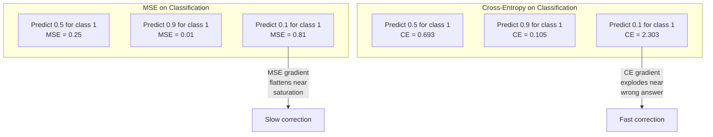
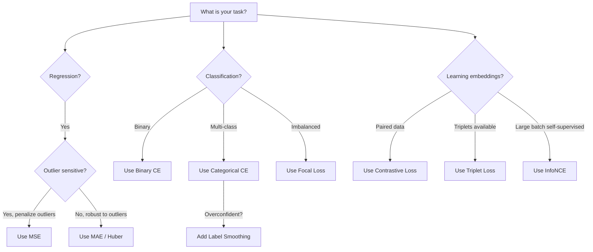

# فقدان الوظائف

> شبكتك تقوم بالتنبؤ. الحقيقة الأرضية تقول خلاف ذلك. كم هو خطأ؟ هذا الرقم هو الخسارة. اختر وظيفة الخسارة الخطأ ونموذجك يُحسن للشيء الخطأ تماما.

> **【中文解读】**損失函数 هو الهدف الوحيد لتحسين النموذج  ليس معدل التأكد  ليس F1 分数, هو فقدان القيمة  خيار خطأ فقدان وظيفة، النموذج سوف تجد طريقة "أفضل شيء في الرياضيات" لتلبية ذلك، وليس النتيجة التي تريد حقا  مثل قسم المهام مع MSE، النموذج سوف تتوقع كل النموذج 0.5  الحد الأدنى للخسارة ولكن لا فائدة) 

**Type:** Build
**Languages:** Python
**Prerequisites:** Lesson 03.04 (Activation Functions)
**Time:** ~75 minutes

## أهداف التعلم

- تنفيذ MSE، الدخول المتقاطع الثنائي، الدخول المتقاطع الفئري، والخسارة المقابلة (InfoNCE) من الصفر مع تراجعهم
- شرح سبب فشل MSE في التصنيف عن طريق إظهار وضع فشل "التنبؤ 0.5 لكل شيء"
- تطبيق تسهيل اللقب على الانتروبيا المتقاطعة ووصف كيفية منع التنبؤات المفرطة الثقة
- اختيار وظيفة الخسارة الصحيحة للعودة، التصنيف الثنائي، التصنيف متعدد الفئات، وتضمين مهام التعلم

> **【中文解读】**هدف هذا الفصل: تحقيق 5 أنواع من وظائف الخسارة وتعدد، فهم لماذا لا يمكن استخدام MSE، تعلم علامات التسوية ومقارنة الخسارة، تعلم تحديد وظائف الخسارة الصحيحة حسب المهمة.

## المشكلة المشكلة المشكلة

نموذج يقلل من MSE في مشكلة التصنيف سوف يتوقع بثقة 0.5 لكل شيء. هو يقلل من الخسارة. وهو أيضا غير مفيد.

> نموذج من الميزانية المحددة في المشكلة في التقسيم سوف يثق بكل تأكيد من جميع التوقعات المدخول 0.5 .

وظيفة الخسارة هي الشيء الوحيد الذي يتحسن نموذجك ليس دقة لا نسبة في فورمولا 1 ليس أيّها المقياس الذي تقرّر به إلى مديرك يُخذ المحفّظ تراجع وظيفة الخسارة ويُعدّل الوزن لجعله أصغر. إذا لم يتمكن وظيفة الخسارة من التقاط ما يهمك، فإن النموذج سوف يجد الطريقة الأكثر رخيصة رياضياً لرضائها، وهذه الطريقة هي تقريباً أبداً ما كنت تريده.

>  فقدان الوظيفة هو الهدف الوحيد من تحسين نموذجك فعليًا  ليس معدل التأكد  ليس F1 分数  ليس أي مؤشر تقرر به إلى المدير  ليس جهاز التحسين يحصل على درجة وظيفة الخسارة ويقوم بتعديل الوزن حتى يقلل الرقم  إذا لم يتمكن وظيفة الخسارة من التقاط ما يهمك ، فسوف يجد النموذج طريقة رياضية أرخص لتلبيته ، بينما هذا هو الطريقة التي لا تريد تقريبًا أبداً 

ها هو مثال ملموس لديك مهمة تصنيف ثنائي فصولين، 50/50 تقسيم. تستخدمين الإصابة بالتهابات الكهربائية كخسارة النموذج يتوقع 0.5 لكل مدخل واحد. متوسط مستوى الجهاز المعدني هو 0.25، وهو الحد الأدنى الممكن دون تعلم أي شيء. النموذج ليس لديه قدرة تمييزية لكن تقنياً فقد قلل من وظيفة الخسارة الانتقال إلى التشابه المتقاطع و نفس النموذج يضطر إلى دفع التنبؤات نحو 0 أو 1 ، لأن -log(0.5) = 0.693 هو خسارة رهيبة ، في حين -log(0.99) = 0.01 مكافأة الثقة التنبؤات الصحيحة. اختيار وظيفة الخسارة هو الفرق بين نموذج يتعلم ونموذج يلعب الميتريك.

> 具体例:二元分类任务,两类各占50%──你用MSE 作为损失──模型对每个输入都预测0.5──平均MSE为0.25,这是实际上没有学到任何东西的情况下可能的最小值──模型没有任何区分能力,但在技术上已经最小化了你的损失函数──换成交叉后,同样的模型被迫推向预测到0或1,因为 -log(0.5) =0.693 是一个很差的损失,而 -log(0.99) =0.01 会奖励自信的正确预测──选择损失函数决定模型学习还在系统的空子中.

الأمر يزداد سوءاً. في التعلم الذاتي، لا يوجد لديك حتى علامات. الخسارة المقابلة تعريف إشارة التعلم بالكامل: ما الذي يعتبر مماثلاً، وما الذي يعتبر مختلفاً، ومدى صعوبة النموذج يجب أن يدفعهم إلى جانب. الحصول على الخسارة المقابلة خطأ وتنهار التوابع الخاصة بك إلى نقطة واحدة - كل خريطة مدخلة إلى نفس المتجه. صفر الخسارة تقنياً. بلا قيمة تماماً.

> وضع الأسوأ هو أنه في تعلم الذاتي، لا يوجد لديك حتى علامة ‬‬‬‬‬‬‬‬‬‬‬‬‬‬‬‬‬‬‬‬‬‬‬‬‬‬‬‬‬‬‬‬‬‬‬‬‬‬‬‬‬‬‬‬‬‬‬‬‬‬‬‬‬‬‬‬‬‬‬‬‬‬‬‬‬‬‬‬‬‬‬‬‬‬‬‬‬‬‬‬‬‬‬‬‬‬‬‬‬‬‬‬‬‬‬‬‬‬‬‬‬‬‬‬‬‬‬‬‬‬‬‬‬‬‬‬‬‬‬‬‬‬‬‬‬‬‬‬‬‬‬‬‬‬‬‬‬‬‬‬‬‬‬‬‬‬‬‬‬‬‬‬‬‬‬‬‬‬‬‬‬‬‬‬‬‬‬‬‬‬‬‬‬‬‬‬‬‬‬‬‬‬‬‬‬‬‬‬‬‬‬‬‬‬‬‬‬‬‬‬‬‬‬‬‬‬‬‬‬‬‬‬‬‬‬‬‬‬‬‬‬‬‬‬‬‬‬‬‬‬‬‬‬‬‬‬‬‬‬‬‬‬‬‬‬‬‬‬‬‬‬‬‬‬‬‬‬‬‬‬‬‬‬‬‬‬‬‬‬‬‬‬‬‬‬‬‬‬‬‬‬‬‬‬‬‬‬‬‬‬‬‬‬‬‬‬‬‬‬‬‬‬‬‬‬‬‬‬‬‬‬‬‬‬‬‬‬‬‬‬‬‬‬‬‬‬‬‬‬‬‬‬‬‬‬‬‬‬‬‬‬‬‬‬‬‬‬‬‬‬‬‬‬‬‬‬‬‬‬‬‬‬‬‬‬‬‬‬‬‬‬‬‬‬‬‬‬‬‬‬‬‬‬‬‬‬‬‬‬‬‬‬‬‬‬‬‬‬‬‬‬‬‬‬‬‬‬‬‬‬‬‬‬‬‬‬‬‬‬‬‬‬‬‬‬‬‬‬‬‬‬‬‬‬‬‬‬‬‬‬‬‬‬‬‬‬‬‬‬‬‬‬‬‬‬‬‬‬‬‬‬‬‬‬‬‬‬‬‬‬‬‬‬‬‬‬‬‬‬‬‬‬‬‬‬‬‬‬‬‬‬

> **【中文解读】**في MSE القيام بالفصلات، فإن النموذج يجد التنبؤ 0.5 هو الأكثر أمانا استراتيجية الخسارة أدنى ولكن لا تمييز القدرة──交叉则通过 -log (س) 惩罚不自信的预测:-log (0.5) = 0.693 (0.99) = 0.01 (س) 很差) مقابل -log (0.99) = 0.01 (س) 很好) ، إجبار النموذج على اتخاذ قرار واضح── في تعلم الذاتية الإشراف، في حالة خسارة النسبة تعريف جميع إشارات التعلم

## المفهوم الأساسي

### متوسط خطأ مربع (MSE)  متوسط خطأ

الاختيار الافتراضي للعودة. احسب الفرق المربع بين التنبؤ والهدف، متوسط على جميع العينات.

> عودة المهام الاختيار المتبني.

```
MSE = (1/n) * sum((y_pred - y_true)^2)
```

لماذا التربيع مهم: فإنه يعاقب الأخطاء الكبيرة رباعيا. خطأ من 2 تكلف 4x أكثر من خطأ من 1. خطأ من 10 تكلف 100x. وهذا يجعل MSE حساسة للخسائر - تنبؤ واحد خاطئ للغاية يهيمن على الخسارة.

> لماذا مربع مهم: فإنه يقوم بتعليم الأخطاء الكبيرة مرتين. تكلفة الأخطاء الثانية هي 4 مرات من 1؛ تكلفة الأخطاء العاشرة هي 100 مرة. وهذا يجعل MSE حساسة للخسائر غير الطبيعية

الأرقام الحقيقية: إذا كان نموذجك يتوقع أسعار السكن و هو خارج عن $10,000 on most houses but off by $200 ألف في قصر واحد، سوف يحاول MSE بشكل عنيف إصلاح ذلك القصر واحد، وربما يؤذي الأداء على 99 منزل آخرين.

> 具体数字: إذا كان نموذجك يتوقع أسعار المنازل، فإن معظم المنازل تتباين $10,000，但一栋豪宅偏差 $200 ألف، ستشجع شركة "إم إس إي" على محاولة إصلاح تلك المنازل العالية، وربما تضرّب في أداء 99 من المنازل الأخرى

إن تراجع MSE فيما يتعلق بالتنبؤ هو:

> المعدل المتعدد للوقوف على النظام التنفيذي:

```
dMSE/dy_pred = (2/n) * (y_pred - y_true)      # 梯度与误差成线性关系
```

خطية في الخطأ. الأخطاء الأكبر تحصل على تراجع أكبر. هذه ميزة للعودة (خطأ كبير يحتاج تصحيحات كبيرة) والخطأ للتصنيف (تريد أن تعاقب الردود الخاطئة الثقة بشكل متسارع ، وليس خطيا).

> مع الخطأ إلى العلاقة الخطية. الحصول على درجة أكبر من الخطأ. هذا هو المرجع.

> **【中文解读】**MSE هو الخسارة المعتمدة لمهمة العودة: خطأ في المعدل التربيعي.

> **【拓展：MSE 在 AI 中的应用】**في نموذج إنتاج الصور مثل Diffusion Stable) ، يستخدم MSE أيضًا لقياس إنتاج الصور والتصور المستهدفة.`F.mse_loss(pred, target)`.

### خسارة التقاطع الانتروبية

وظيفة الخسارة للتصنيف. متجذرة في نظرية المعلومات -- إنها تقيس الاختلاف بين توزيع الاحتمال المتوقع والتوزيع الحقيقي.

> فاعل خسارة المهام. يعتمد على نظرية المعلومات. يقيّم الفرق بين توزيع احتمال التنبؤ والتوزيع الحقيقي.

**Binary Cross-Entropy (BCE) | 二元交叉熵：**

```
BCE = -(y * log(p) + (1 - y) * log(1 - p))
```

حيث y هو العلامة الحقيقية (0 أو 1) و p هو الاحتمال المتوقع.

> من بينها y هو العلامات الحقيقية ((0 أو 1),p هو احتمال التوقعات

لماذا -log(p) يعمل: عندما يكون العلامة الحقيقية 1 وتتوقع p = 0.99, الخسارة هي -log(0.99) = 0.01. عندما تتوقع p = 0.01, الخسارة هي -log(0.01) = 4.6. هذا الفرق 460x هو السبب في أن الانتروبيا المتقاطعة تعمل.

> لماذا -log(p) 有效: عندما يكون العلامة الحقيقية 1 且你预测 p = 0.99 时, فقدان -log(0.99) = 0.01── عندما تكون قد توقع p = 0.01 时, فقدان -log(0.01) = 4.6──ذلك 460 倍 الفرق هو سبب交叉有效── انها بقسوة يعاقب الاعتقاد الخطأ التنبؤ, بينما على الاعتقاد التنبؤ الصواب تقريبا لا يعاقب──

التراجع يروي نفس القصة:

```
dBCE/dp = -(y/p) + (1-y)/(1-p)     # 梯度在预测错误时极大
```

عندما ي = 1 و p قريب من الصفر، فإن التراجع هو -1/p الذي يقترب من اللانهاية السلبية. يحصل النموذج على إشارة هائلة لتصحيح خطأه. عندما p قريب من 1، التراجع صغير. بالفعل صحيحة، لا شيء لتصحيح.

> **【中文解读】**交叉是分类任务的标配──核心是 -log(p): التنبؤ صحيح ومثابرة(p=0.99) عند الخسارة 0.01 فقط، التنبؤ خطأ ومثابرة(p=0.01) عند الخسارة يصل إلى 4.6460 倍 من الفجوة!

> **【拓展：交叉熵在 Transformer 中】**تعليمي خسارة GPT هو交叉预测 下一个代币的交叉──每个位置预测词表中的哪个词,用交叉衡量预测和真实的差距──PyTorch: `F.cross_entropy(logits, labels)`.

**Categorical Cross-Entropy | 多类交叉熵：**

للتصنيف متعدد الفئات مع أهداف مشفرة واحدة.

```
CCE = -sum(y_i * log(p_i))          # 只有真实类别贡献损失
```

يساهم الطبقة الحقيقية فقط في الخسارة (لأن جميع y_i الأخرى صفر). إذا كان هناك 10 فئات وتحصل الطبقة الصحيحة على احتمال 0.1 (التخمين العشوائي) ، فإن الخسارة هي -log(0.1) = 2.3. إذا حصلت الطبقة الصحيحة على احتمال 0.9, فإن الخسارة هي -log(0.9) = 0.105. يتعلم النموذج تركيز كتلة الاحتمال على الجواب الصحيح.

### لماذا لا يتم تصنيف MSE لماذا MSE لا يناسب الفئة



تراجع MSE عندما تكون التنبؤات قريبة من 0 أو 1 (بسبب تثبيت sigmoid). تراجع التنقل التقاطعي تعوض لهذا - -الملحوي يلغي مناطق sigmoid مسطحة، مما يعطي تراجع قوية بالضبط حيث هم أكثر حاجة.

> **【中文解读】**تغير درجة MSE في التنبؤات تقترب من 0 أو 1 时变平(لأن sigmoid 和) ، مما يؤدي إلى إصلاح بطيء――交叉的 -log 正好抵消 sigmoid 的平坦区域,在最需要修改的地方提供最强梯度──

### علامة " سلم "

"تلك هي 100% من الفئة الثالثة و 0% من كل شيء آخر" هذا دعوى قوية

> 标准的一个热标签说"这是100% 类别3,其他都是0%"......这是个强声明――标签平滑软化它:

```
smooth_label = (1 - alpha) * one_hot + alpha / num_classes
```

مع الف = 0.1 و 10 فئات: بدلا من [0, 0, 1, 0, ... ] ، يصبح الهدف [0.01 ، 0.01 ، 0.91 ، 0.01 ، ...].

> الف = 0.1、10 个类别时: هدف من [0, 0, 1, 0, ...] 变成 [0.01, 0.01, 0.91, 0.01, ...]。模型目标 from 1.0 变成 0.91。

لماذا يعمل هذا: يجب على نموذج يحاول إخراج 1.0 بالضبط من خلال softmax دفع اللوجيت إلى اللانهاية. هذا يسبب ثقة مفرطة ، يؤذي التعميم ، ويجعلها النموذج هشة للتحول في التوزيع. يضع تسهيل اللوحة حدًا لـ 0.9 (مع ألفا = 0.1) ، ويحافظ على السلطة في نطاق معقول. تستخدم GPT ومعظم النماذج الحديثة تسهيل اللوحة أو ما يعادلها.

> لماذا فعال: لجعله softmax 输出恰好 1.0, تحتاج إلى وضع اللوجيت 推到无穷大―― مما يؤدي إلى ثقة مفرطة 损害泛化、使模型对分布漂移脆弱──标签平滑把目标上限设为0.9(alpha=0.1),让logit 保持在合理范围内──GPT 和大多数现代模型都使用标签平滑或等价机制──

> **【中文解读】**标签平滑把硬标签 [0, 0, 1, 0, ...] 变成软标签 [0.01, 0.01, 0.91, 0.01, ...] 由于要让软max 输出 1.0 需要 Logit 趋近无穷大,这会导致过拟和过度自信──标签平滑把目标上限降至0.9,保持 Logit 在合理范围内──GPT 和大多数现代模型都使用标签平滑──

### خسارة مقارنة بخسارة

لا تسميات، لا فصول، مجرد زوجين من المدخلات والسؤال: هل هي متشابهة أم مختلفة؟

> لا يوجد علامة. لا يوجد فئة. فقط إدخال على هذا السؤال: هل تشبهون أم تختلفون؟

**SimCLR-style contrastive loss (NT-Xent / InfoNCE):**

خذ صورة واحدة. إنشأ نظرتين متزايدة لها (قطع، تدور، حركة اللون). هذه هي "الزوج الإيجابي" - يجب أن يكون لها إضافة مماثلة. كل صورة أخرى في المجموعة تشكل "زوج سلبي" - يجب أن يكون لها إضافة مختلفة.

> 取一张图像──创建两个增强视图(剪剪,旋转,颜色动)──这是"正对"它们应该有相似的嵌入式──每个其他图像在批量中形成"负对"它们应该有不同的嵌入式──

```
L = -log(exp(sim(z_i, z_j) / tau) / sum(exp(sim(z_i, z_k) / tau)))
```

حيث sim() هو تشابه الكوسين، z_i و z_j هي الزوج الإيجابي، والجمع هو فوق جميع السلبيات، وتتحكم تاو (الدرجة الحرارة) كيف الحادة التوزيع هو. درجة الحرارة المنخفضة = السلبيات الأصعب = الفصل الأكثر عدوانية.

> **【中文解读】**مقابل الخسارة لا تحتاج إلى علامة! خذ نسخة مضاعفة من صورة واحدة ك"صالحة" ((يجب أن تكون مشابهة) ، والصورة الأخرى ك"سلبية" ((يجب أن تكون مختلفة)

> **【拓展：对比学习在 RAG 和嵌入模型中】**تعتمد على الجودة المضافة على التصميم المضاوي. في RAG ، يعتمد حسنات المفتش على الجودة المضافة ، بينما يعتمد الجودة المضافة على التصميم المضاد على الخسارة.

### فقدان التركيز

لمجموعات بيانات غير متوازنة. التعامل مع جميع الأمثلة المرتبطة بشكل صحيح على قدم المساواة. الخسارة المركزية إلى أسفل الوزن أمثلة سهلة:

> لموازنة تصميم المجموعة البيانية. المعايير المتساوية.

```
FL = -alpha * (1 - p_t)^gamma * log(p_t)
```

حيث p_t هو احتمال المتوقع للدرجة الحقيقية و غاما تحكم التركيز. مع غاما = 0 ، هذا هو الإنتروبي المتقاطع القياسي. مع غاما = 2 (المتخلف):

> ومن بينها p_t هو true类别的预测概率,غاما 控制聚焦程度──غاما = 0 时退化为标准交叉──غاما = 2 时(默认值):

- مثال سهل (p_t = 0.9): الوزن = (0.1)^2 = 0.01. تم تجاهله بشكل فعال.
  简单样本(p_t = 0.9):权重 = (0.1)^2 = 0.01──实际被忽略──
- مثال صلب (p_t = 0.1): الوزن = (0.9) ^ 2 = 0.81. إشارة تراجع كاملة.
  困难样本(p_t = 0.1):权重 = (0.9)^2 = 0.81。完整梯度信号。

> **【中文解读】**فقدان مركزي 为类别不平衡设计──简单样本(p_t=0.9) وزنها 0.01 فقط، تم تجاهلها تقريبا؛ وزن نموذج困难(p_t=0.1) 0.81, الحصول على كامل التعدد الإشارة──这让模型专注于困难案例──用于目标检测(RetinaNet),99% 是背景、1% 是目标──

### شجرة القرارات لخسارة الوظيفة



> **【中文解读】**选择经验:归归用MSE/Huber,二分类用 BCE, ربما类用CCE,不平衡用焦损失,学嵌入用对比损失──

## بناءه
```figure
cross-entropy-loss
```

## بناءها

### الخطوة الأولى: MSE ودرجةها

```python
def mse(predictions, targets):
    n = len(predictions)
    total = 0.0
    for p, t in zip(predictions, targets):
        total += (p - t) ** 2            # 平方误差
    return total / n                      # 取平均

def mse_gradient(predictions, targets):
    n = len(predictions)
    grads = []
    for p, t in zip(predictions, targets):
        grads.append(2.0 * (p - t) / n)  # 梯度 = 2*(pred - true) / n
    return grads
```

### الخطوة الثانية: التقاطع الثنائي

مشكلة log(0) حقيقية. إذا كان النموذج يتوقع بالضبط 0 لمثال إيجابي، log(0) = لا نهاية سلبية. الحذف يمنع هذا.

```python
import math

def binary_cross_entropy(predictions, targets, eps=1e-15):
    n = len(predictions)
    total = 0.0
    for p, t in zip(predictions, targets):
        p_clipped = max(eps, min(1 - eps, p))  # 裁剪防止 log(0)
        total += -(t * math.log(p_clipped) + (1 - t) * math.log(1 - p_clipped))  # -[y*log(p) + (1-y)*log(1-p)]
    return total / n

def bce_gradient(predictions, targets, eps=1e-15):
    grads = []
    for p, t in zip(predictions, targets):
        p_clipped = max(eps, min(1 - eps, p))
        grads.append(-(t / p_clipped) + (1 - t) / (1 - p_clipped))  # 梯度 = -y/p + (1-y)/(1-p)
    return grads
```

### الخطوة الثالثة: التقاطع المرتبط مع Softmax

```python
def softmax(logits):
    max_val = max(logits)  # 数值稳定性
    exps = [math.exp(x - max_val) for x in logits]
    total = sum(exps)
    return [e / total for e in exps]

def categorical_cross_entropy(logits, target_index, eps=1e-15):
    probs = softmax(logits)
    p = max(eps, probs[target_index])
    return -math.log(p)  # -log(真实类别的概率)

def cce_gradient(logits, target_index):
    probs = softmax(logits)
    grads = list(probs)              # 复制 softmax 输出
    grads[target_index] -= 1.0      # 真实类别减 1：softmax 输出 - one-hot
    return grads
```

إن تراجع softmax + cross-entropy يسهل بشكل جميل: هو فقط (احتمال متوقع - 1) للصف الحقيقي، و (احتمال متوقع) لجميع الفئات الأخرى. هذا التبسيط المبتكر ليس صدفة - هذا هو السبب softmax و cross-entropy يتم إزواجها.

> **【中文解读】**Softmax + 交叉的梯度简化为:预测概率减去 one-hot 目标──真实类别是p-1,其他类别是p──这优雅的简化就是为什么 softmax 和交叉总是配对使用──

### الخطوة الرابعة: التسمم المُسطح

```python
def label_smoothed_cce(logits, target_index, num_classes, alpha=0.1, eps=1e-15):
    probs = softmax(logits)
    loss = 0.0
    for i in range(num_classes):
        if i == target_index:
            smooth_target = 1.0 - alpha + alpha / num_classes  # 目标类别：0.9（alpha=0.1, 10 类）
        else:
            smooth_target = alpha / num_classes                 # 非目标类别：0.01
        p = max(eps, probs[i])
        loss += -smooth_target * math.log(p)
    return loss
```

### الخطوة 5: خسارة مُقارنة مع الخسارة

```python
def cosine_similarity(a, b):
    dot = sum(x * y for x, y in zip(a, b))        # 点积
    norm_a = math.sqrt(sum(x * x for x in a))      # 向量 a 的模
    norm_b = math.sqrt(sum(x * x for x in b))      # 向量 b 的模
    if norm_a < 1e-10 or norm_b < 1e-10:
        return 0.0
    return dot / (norm_a * norm_b)                  # 余弦相似度

def contrastive_loss(anchor, positive, negatives, temperature=0.07):
    sim_pos = cosine_similarity(anchor, positive) / temperature     # 正对相似度 / 温度
    sim_negs = [cosine_similarity(anchor, neg) / temperature for neg in negatives]  # 负对相似度

    max_sim = max(sim_pos, max(sim_negs)) if sim_negs else sim_pos  # 数值稳定性
    exp_pos = math.exp(sim_pos - max_sim)
    exp_negs = [math.exp(s - max_sim) for s in sim_negs]
    total_exp = exp_pos + sum(exp_negs)

    return -math.log(max(1e-15, exp_pos / total_exp))  # -log(正对概率)
```

### الخطوة 6: MSE مقابل التشريح المتقاطع على التصنيف

تدريب نفس الشبكة من الدروس 04 (مجموعة بيانات دائرة) مع كل من وظائف الخسارة. مشاهدة التنازل المتقاطع التقارب أسرع.

```python
import random

def sigmoid(x):
    x = max(-500, min(500, x))
    return 1.0 / (1.0 + math.exp(-x))

def make_circle_data(n=200, seed=42):
    random.seed(seed)
    data = []
    for _ in range(n):
        x = random.uniform(-2, 2)
        y = random.uniform(-2, 2)
        label = 1.0 if x * x + y * y < 1.5 else 0.0
        data.append(([x, y], label))
    return data


class LossComparisonNetwork:
    """用不同损失函数训练的网络，对比 MSE 和 BCE 的收敛速度"""
    def __init__(self, loss_type="bce", hidden_size=8, lr=0.1):
        random.seed(0)
        self.loss_type = loss_type  # "mse" 或 "bce"
        self.lr = lr
        self.hidden_size = hidden_size

        self.w1 = [[random.gauss(0, 0.5) for _ in range(2)] for _ in range(hidden_size)]
        self.b1 = [0.0] * hidden_size
        self.w2 = [random.gauss(0, 0.5) for _ in range(hidden_size)]
        self.b2 = 0.0

    def forward(self, x):
        self.x = x
        self.z1 = []
        self.h = []
        for i in range(self.hidden_size):
            z = self.w1[i][0] * x[0] + self.w1[i][1] * x[1] + self.b1[i]
            self.z1.append(z)
            self.h.append(max(0.0, z))  # ReLU 激活

        self.z2 = sum(self.w2[i] * self.h[i] for i in range(self.hidden_size)) + self.b2
        self.out = sigmoid(self.z2)  # 输出层 sigmoid
        return self.out

    def backward(self, target):
        # 根据损失类型选择不同的梯度
        if self.loss_type == "mse":
            d_loss = 2.0 * (self.out - target)  # MSE 梯度：线性
        else:
            eps = 1e-15
            p = max(eps, min(1 - eps, self.out))
            d_loss = -(target / p) + (1 - target) / (1 - p)  # BCE 梯度：在错误预测时极大

        d_sigmoid = self.out * (1 - self.out)
        d_out = d_loss * d_sigmoid

        for i in range(self.hidden_size):
            d_relu = 1.0 if self.z1[i] > 0 else 0.0
            d_h = d_out * self.w2[i] * d_relu
            self.w2[i] -= self.lr * d_out * self.h[i]
            for j in range(2):
                self.w1[i][j] -= self.lr * d_h * self.x[j]
            self.b1[i] -= self.lr * d_h
        self.b2 -= self.lr * d_out

    def compute_loss(self, pred, target):
        if self.loss_type == "mse":
            return (pred - target) ** 2
        else:
            eps = 1e-15
            p = max(eps, min(1 - eps, pred))
            return -(target * math.log(p) + (1 - target) * math.log(1 - p))

    def train(self, data, epochs=200):
        losses = []
        for epoch in range(epochs):
            total_loss = 0.0
            correct = 0
            for x, y in data:
                pred = self.forward(x)
                self.backward(y)
                total_loss += self.compute_loss(pred, y)
                if (pred >= 0.5) == (y >= 0.5):
                    correct += 1
            avg_loss = total_loss / len(data)
            accuracy = correct / len(data) * 100
            losses.append((avg_loss, accuracy))
            if epoch % 50 == 0 or epoch == epochs - 1:
                print(f"    Epoch {epoch:3d}: loss={avg_loss:.4f}, accuracy={accuracy:.1f}%")
        return losses
```

## استخدمها في التطبيق العملي

يقدم PyTorch جميع وظائف الخسارة القياسية مع الاستقرار الرقمي مدمج في:

```python
import torch
import torch.nn as nn
import torch.nn.functional as F

predictions = torch.tensor([0.9, 0.1, 0.7], requires_grad=True)
targets = torch.tensor([1.0, 0.0, 1.0])

mse_loss = F.mse_loss(predictions, targets)              # MSE：回归
bce_loss = F.binary_cross_entropy(predictions, targets)   # BCE：二分类

logits = torch.randn(4, 10)                              # 4 个样本，10 类
labels = torch.tensor([3, 7, 1, 9])
ce_loss = F.cross_entropy(logits, labels)                # CCE：多分类（推荐用法）
ce_smooth = F.cross_entropy(logits, labels, label_smoothing=0.1)  # 带标签平滑
```

استخدام`F.cross_entropy`(لا)`F.nll_loss`مزيد من اللونغ المرن المرن المرن المرن المرن المرن المرن المرن المرن المرن المرن المرن المرن المرن المرن المرن المرن المرن المرن المرن المرن المرن المرن المرن المرن المرن المرن المرن المرن المرن المرن المرن المرن المرن المرن المرن المرن المرن المرن المرن المرن المرن المرن المرن المرن المرن المرن المرن المرن المرن المرن المرن المرن المرن المرن المرن المرن المرن المرن المرن المرن المرن المرن المرن المرن المرن المرن المرن المرن المرن المرن المرن المرن المرن المرن المرن المرن المرن المرن المرن المرن المرن المرن المرن المرن المرن المرن المرن المرن المرن المرن المرن المرن المرن المرن المرن المرن المرن المرن المرن المرن المرن المرن المرن المرن

للتعلم المقابل، تستخدم معظم الفرق تنفيذات مخصصة أو مكتبات مثل `lightly`أو`pytorch-metric-learning`الحلقة الأساسية هي دائما نفسها: حساب التشابهات بالتزاوج، خلق الـ softmax على الإيجابيات والسلبيات، الترويج الخلفي.

> **【中文解读】**PyTorch 中直接用 `F.cross_entropy(logits, labels)`إنه داخلياً يجمع بين log-softmax و NLL، والعدد الأكثر استقراراً.`lightly`أو`pytorch-metric-learning`كوكا

## أرسلها

هذا الدرس ينتج عن:
- `outputs/prompt-loss-function-selector.md`-- تحذير قابلة لإعادة الاستخدام لتحديد وظيفة الخسارة الصحيحة
- `outputs/prompt-loss-debugger.md`-- تحذير تشخيصي عندما تعوير الخسارة الخاص بك يبدو خاطئا

## تمارين التدريب

1. تنفيذ خسارة هوبر (خسارة L1 الناعمة) ، وهي MSE للخطأ الصغير و MAE للخطأ الكبير. قم بتدريب شبكة تراجع تتوقع y = sin(x) مع MSE مقابل هوبر عندما تضاف 5% من أهداف التدريب ضوضاء عشوائية (معدلات خارجية). مقارنة خطأ الاختبار النهائي.
   > **练习 1：**实现 هوبر 损失(صغر خطأ مع MSE، كبير خطأ مع MAE) 

2. إضافة فقدان التركيز إلى حلقة تدريب التصنيف الثنائي. إنشاء مجموعة بيانات غير متوازنة (90% فئة 0, 10% فئة 1). مقارنة القياسية BCE مقابل فقدان التركيز (غاما = 2) على استدعاء فئة الأقلية بعد 200 عصر.
   > **练习 2：**في مجموعة بيانات عدم توازن 90:10 مقارنة ب BCE وفقدان التركيز ((غاما = 2) من معدلات الدعوة إلى العودة

3. تنفيذ خسارة الثلاثة مع التعدين السلبي شبه الصعب. توليد بيانات تضمين 2D ل 5 فئات. لكل مرسوم، العثور على السلبي الأكثر صعوبة التي هي أبعد من الإيجابية (الثلاثة الصعب). مقارن التقارب مع اختيار الثلاثة عشوائية.
   > **练习 3：**实现带半困难负样本挖掘的三元组损失,对比随机选择负样本收速度.

4. قم بتقارنة MSE مقابل الانتروبيا المتقاطعة ولكن تتبع حجم التدفق في كل طبقة أثناء التدريب. رسم معدل التدفق في كل عصر. تحقق من أن الانتروبيا المتقاطعة تنتج تراجعات أكبر في الأوقات المبكرة عندما يكون النموذج غير مؤكد.
   > **练习 4：** تتبع MSE و交叉  تدريبات في كل مستوى التسلسلات 

5. تنفيذ خسارة الانحراف KL وتحقق من أن تقليل KL ((صديق التنبؤ) يمنح نفس التراجعات مثل الانتروبيا المتقاطعة عندما يكون التوزيع الحقيقي واحد حار. ثم تجرب أهداف ناعمة (مثل نزيف المعرفة) حيث يأتي التوزيع "الصديق" من النتائج النموذج المعلمية الناعمة.
   > **练习 5：**实现 KL 散度损失,验证在一个热的真实分布时与交叉梯度相同――然后尝试知识蒸中的软目标――

## شروط رئيسية

| Term | What people say | What it actually means |
|------|----------------|----------------------|
| Loss function | "How wrong the model is" | A differentiable function mapping predictions and targets to a scalar that the optimizer minimizes |
| MSE | "Average squared error" | Mean of squared differences between predictions and targets; penalizes large errors quadratically |
| Cross-entropy | "The classification loss" | Measures divergence between predicted probability distribution and true distribution using -log(p) |
| Binary cross-entropy | "BCE" | Cross-entropy for two classes: -(y*log(p) + (1-y)*log(1-p)) |
| Label smoothing | "Softening the targets" | Replacing hard 0/1 targets with soft values (e.g., 0.1/0.9) to prevent overconfidence and improve generalization |
| Contrastive loss | "Pull together, push apart" | A loss that learns representations by making similar pairs close and dissimilar pairs far in embedding space |
| InfoNCE | "The CLIP/SimCLR loss" | Normalized temperature-scaled cross-entropy over similarity scores; treats contrastive learning as classification |
| Focal loss | "The imbalanced data fix" | Cross-entropy weighted by (1-p_t)^gamma to down-weight easy examples and focus on hard ones |
| Triplet loss | "Anchor-positive-negative" | Pushes anchor closer to positive than negative by at least a margin in embedding space |
| Temperature | "Sharpness knob" | A scalar divisor on logits/similarities that controls how peaked the resulting distribution is; lower = sharper |

| 术语 | 通俗说法 | 实际含义 |
|------|---------|---------|
| 损失函数 (Loss function) | "模型错多少" | 把预测和目标映射为标量的可导函数，优化器最小化这个值 |
| MSE | "平方误差平均" | 预测与目标的平方差的均值；对大误差二次惩罚 |
| 交叉熵 (Cross-entropy) | "分类损失" | 用 -log(p) 衡量预测分布和真实分布的差异 |
| 二元交叉熵 (BCE) | "二分类损失" | 两类的交叉熵：-(y*log(p) + (1-y)*log(1-p)) |
| 标签平滑 (Label smoothing) | "软化目标" | 把硬标签 0/1 换成软值（如 0.1/0.9），防止过度自信 |
| 对比损失 (Contrastive loss) | "拉近推远" | 让相似样本嵌入接近、不同样本嵌入远离的损失 |
| InfoNCE | "CLIP/SimCLR 损失" | 温度缩放的相似度交叉熵；把对比学习变成分类问题 |
| Focal Loss | "不平衡数据修复" | 交叉熵乘以 (1-p_t)^gamma，降低简单样本权重，聚焦困难样本 |
| 三元组损失 (Triplet loss) | "锚-正-负" | 让锚点离正样本比离负样本近至少一个边距 |
| 温度 (Temperature) | "尖锐度旋钮" | logits/相似度的除数，控制分布尖锐程度；越低越尖锐 |

## المزيد من القراءة

- لين وزملاءه، "الخسارة المركزية لاكتشاف الكائنات الكثيفة" (2017) -- أدخل فقدان المركزية للتعامل مع عدم التوازن القصير في الفئة في الكشف عن الكائنات (RetinaNet)
- تشين وغيرهم، "إطار بسيط للتعلم المضاد للتمثيلات المرئية" (SimCLR، 2020) -- حدد خط الأنابيب الحديث للتعلم المضاد مع فقدان NT-Xent
- سيزيدي وآخرون، "إعادة التفكير في معمارة البداية" (2016) -- قدم تسطيح العلامات كطريقة للتنظيم، والتي أصبحت الآن قياسية في معظم النماذج الكبيرة
- هينتون وغيره، "مقطوعة المعرفة في شبكة عصبية" (2015) -- تمقطيع المعرفة باستخدام أهداف ناعمة واختلاف KL، أساسي للضغط النموذجي
