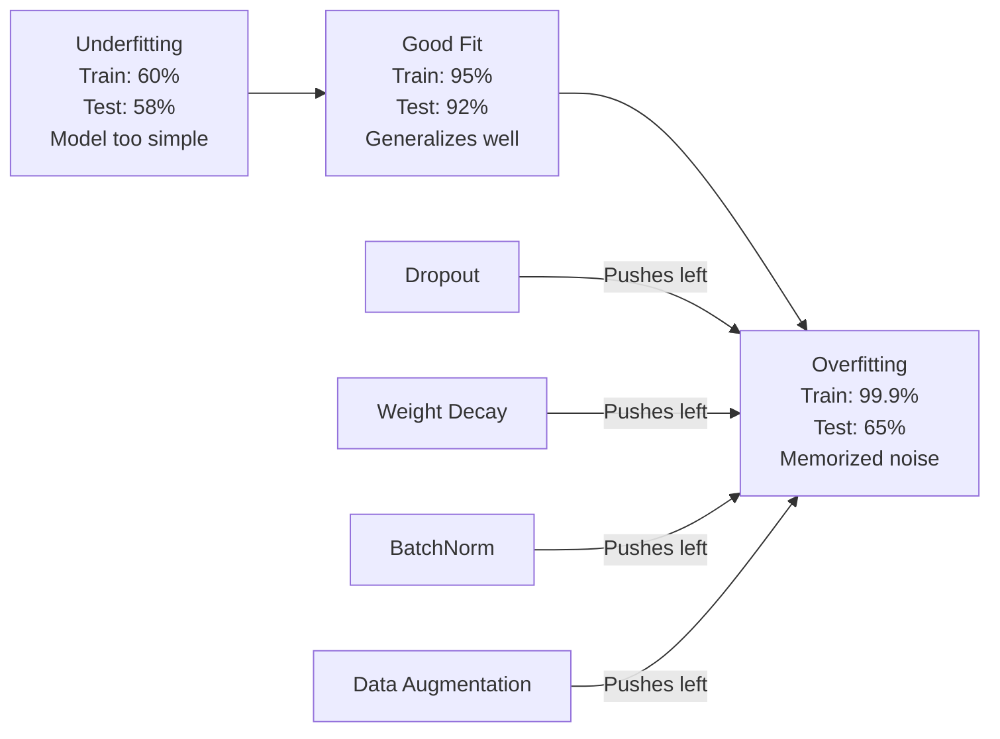
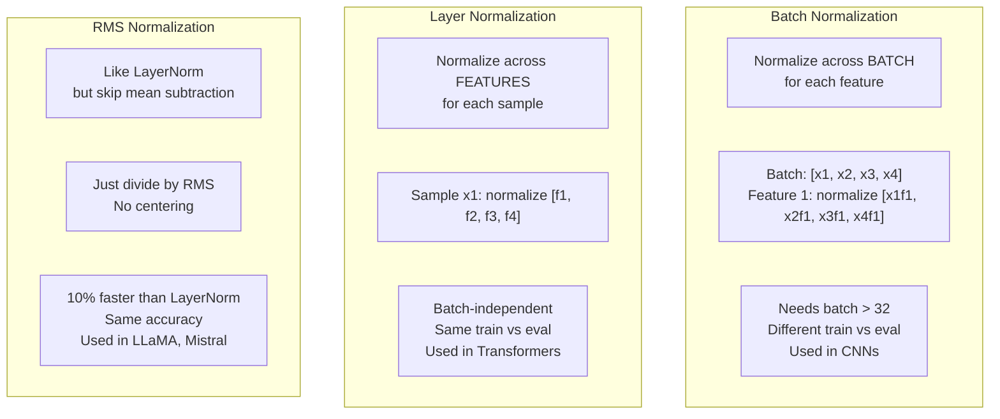
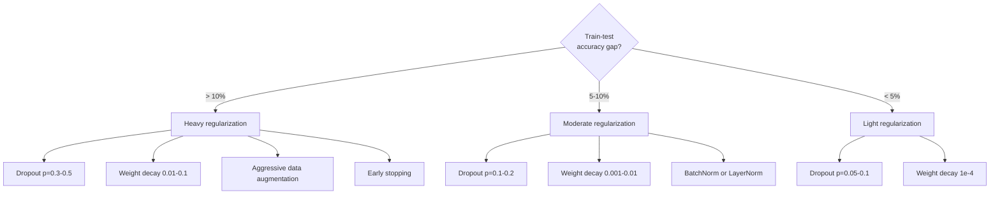

# التنظيم

> نموذجك يحصل على 99٪ من بيانات التدريب و 60٪ من بيانات الاختبار. هو حفظ بدلا من التعلم. التنظيم هو الضريبة التي تفرض عليها على التعقيد لإجبار التعميم.

> **【中文解读】**模型训练集 99% ولكن 测试集只有 60% إنها "تذكر" بدلاً من "تعلم"。正则化 هي عبارة عن ضريبة على التعقيدات المفروضة، 强迫模型泛化。本章覆盖 Droput、L2 正则化、BatchNorm、LayerNorm、RMSNorm

**Type:** Build
**Languages:** Python
**Prerequisites:** Lesson 03.06 (Optimizers)
**Time:** ~75 minutes

## أهداف التعلم

- تنفيذ التوقف مع التوسع المعاكس ، وتحلل الوزن L2 ، وتطبيع اللحظة ، وتطبيع الطبقة ، و RMSNorm من الصفر
- قياس الفجوة الدقيقة في اختبار القطار وتشخيص الإصلاح المفرط باستخدام تجارب التنظيم
- شرح لماذا يستخدم المحولون LayerNorm بدلا من BatchNorm ولماذا يفضل الجامعات العليا الحديثة RMSNorm
- تطبيق مجموعة صحيحة من تقنيات التنظيم على أساس شدة الإصلاح المفرط

> **【中文解读】**هذا الفصل من صفر لتحقيق القانونية الوسائل الخمسة الكبرى:Dropout ((随机丢弃神经元)、L2 权重衰减、BatchNorm(批归一化)、LayerNorm(层归一化)、RMSNorm(均方根归一化)。重点理解为什么Transformer باستخدام LayerNorm وليس BatchNorm،以及为什么Llama/Mistral باستخدام RMSNorm。

## المشكلة المشكلة المشكلة

شبكة عصبية ذات ملامح كافية يمكن أن تتذكر أي مجموعة بيانات. هذه ليست فرضية - Zhang et al. (2017) أثبت ذلك بتدريب الشبكات القياسية على ImageNet مع علامات عشوائية. وصلت الشبكات إلى خسارة تدريبية قريبة من الصفر على تفويضات اللقب عشوائية بالكامل. حفظوا مليون زوج من المدخلات والمخرجات عشوائية دون نمط للتعلم. فقدان التدريب كان مثاليا. دقة الاختبار كانت صفر.

> شبكة عصبية ذات العناصر الكافية يمكن أن تتذكر أي مجموعة بيانات. هذا ليس افتراضًا  Zhang 等人 (2017) 通过 on ImageNet باستخدام تدريب التعلامات العشوائية المعيارية الشبكة أثبت ذلك. شبكة في توزيع التعلامات العشوائية بالكامل وصلت إلى خسائر تدريبية قريبة من الصفر.

هذه هي المشكلة المفرطة، وتزداد سوءاً مع تزايد نماذجها. GPT-3 لديها 175 مليار مبرمير. مجموعة التدريب لديها حوالي 500 مليار رمز. مع هذه العناصر العديدة، فإن النموذج لديه قدرة كافية لتذكر قطع كبيرة من بيانات التدريب حرفياً. دون تنظيمها، فإنه سيستمر في إعادة تشغيل أمثلة التدريب بدلاً من تعلم أنماط قابلة للتعميم.

> هذه هي مشكلة التكيف ، مع تغير النموذج وتصبح أسوأ. GPT-3 لديها 1750 مليار عنصر. التدريب يجمع حوالي 5000 مليار رمز.

الفجوة بين أداء التدريب وأداء الاختبار هي الفجوة المفرطة. كل تقنية في هذا الدروس تهاجم تلك الفجوة من زاوية مختلفة. التخلي عن التشغيل يفرض على الشبكة عدم الاعتماد على أي خلية عصبية واحدة إن تدهور الوزن يمنع أي وزن واحد من النمو الكبير تُسطح تطبيع المجموعة المشهد الخساري بحيث يجد المحسن أدنى الحد الأدنى الأكثر شحًا. يقوم تطبيع الطبقة بنفس الشيء ولكن يعمل حيث تفشل تطبيع اللحوم (لحوم صغيرة، تسلسلات طول متغير). يقوم RMSNorm بذلك بسرعة 10% عن طريق إسقاط متوسط الحساب. كل تقنية بسيطة معاً، هم الفرق بين نموذج يتذكر و الذي يعمّل.

> الفجوة بين أداء التدريب وأداء الاختبار هي الفجوة المعدلة. كل تقنية في هذا الدراسة تعرض هذه الفجوة من مختلف الزوايا. الدروبوت: شبكة الضغط لا تعتمد على أي عصب واحد. فقدان الوزن يمنع أي وزن واحد من النمو المفرط.

> **【中文解读】**模型参数越多,越容易过拟合――GPT-3 لديها 1750 مليار参数,5000 مليار رمز لا تمثيل، فإنه فقط يتذكر بيانات التدريب‬ كل وسيلة تمثيل من مختلف الزوايا مهاجمة过拟合:Dropout 强制冗余表示、权重衰减限制参数幅度、归化平滑损曲面‬

> **【拓展：大模型的正则化策略】**إن إدارة GPT-4 و Llama 3 هي بسيطة جدا: AdamW  وزن القلص (wd=0.01) + التراجع (p=0.1) + RMSNorm。 لا تحتاج إلى مهارات إدارة معقدة。

## المفهوم الأساسي

### الطيف المُتطابق

كل نموذج يجلس في مكان ما على الطيف من عدم التكيف (بسيط جداً لالتقاط النمط) إلى التكيف الزائد (عقد جداً ليتمكن من التقاط الضوضاء).

> كل نموذج يقع في مكان ما على سلسلة الأنظمة من غير الملائمة (من النموذج البسيط جدا وغير المتميز) إلى الملائمة (من المعقد جدا للاستكشاف من الضجيج) .



### التخلي عن التخلي عن التخلي عن التخلي عن التخلي عن التخلي عن التخلي عن التخلي عن التخلي عن التخلي عن التخلي عن التخلي عن التخلي عن التخلي عن التخلي عن التخلي عن التخلي عن التخلي عن التخلي عن التخلي عن التخلي عن التخلي عن التخلي عن التخلي عن التخلي عن التخلي عن التخلي عن التخلي عن التخلي عن التخلي عن التخلي عن التخلي عن التخلي عن التخلي عن التخلي عن التخلي عن التخلي عن التخلي عن التخلي عن التخلي عن التخلي عن التخلي عن التخلي عن التخلي عن التخلي عن التخلي عن التخلي عن التخلي عن التخلي عن التخلي عن التخلي عن التخلي عن التخلي عن التخلي عن التخلي عن التجارة

أسهل تقنية تنظيم مع أروع تفسير أثناء التدريب، قم بتعيين خروج كل عصبية عشوائية إلى الصفر مع احتمال p.

> أسهل وتفسير أفضل تقنية التأليف العصبي.

```
output = activation(z) * mask    where mask[i] ~ Bernoulli(1 - p)
```

مع p = 0.5 ، نصف الخلايا العصبية يتم تسريحها في كل مرور إلى الأمام. يجب على الشبكة تعلم التمثيلات الزائدة لأنه لا يستطيع التنبؤ بالخلايا العصبية التي ستكون متاحة. هذا يمنع التكيف - الخلايا العصبية تتعلم الاعتماد على الخلايا العصبية الأخرى المحددة موجودة.

> عندما p = 0.5 ، يتم وضع نصف العصب في كل مرة من الانتشار الأمامي إلى الصفر. يجب أن تتعلم الشبكة الإعلانات الزائدة، لأنه لا يمكن التنبؤ بأي العصب المتاحة.

تفسير الجمع: شبكة مع N الخلايا العصبية والإقلاع يخلق 2^N شبكات فرعية ممكنة (كل مزيج من الخلايا العصبية تعمل أو غير تعمل). تدريب مع التخلي عن التدريب تقريبا تدرب جميع شبكات 2^N الفرعية في وقت واحد، كل على مجموعات صغيرة مختلفة. في وقت الاختبار، تستخدم جميع الخلايا العصبية (لا تخطئ) وتقييم النتائج بنسبة (1 - ص) لتتطابق مع القيمة المتوقعة أثناء التدريب. هذا يعادل متوسط التنبؤات لشبكات فرعية 2^N -- مجموعة ضخمة من نموذج واحد.

> التفسير المتكامل: إنشاء شبكة مع N 个神经和断的网络 2^N 个可能的子网络(كل مجموعة من العصب المفتوحة أو المغلقة)  استخدام断的训练 训练大约同时训练所有2^N 个子网络,每个在不同的迷你批量上――测试时,你使用所有神经元(无断)并按 (1 - p) 缩放输出与匹配值训练期间的期望――这等于对2^N 个子网络的预测平均采用单个模型实现大规模集成――

في الممارسة العملية، يتم تطبيق التوسع خلال التدريب بدلاً من الاختبار (التوقف المُعكس):

```
During training:  output = activation(z) * mask / (1 - p)
During testing:   output = activation(z)   (no change needed)
```

هذا أكثر نظافة لأن رمز الاختبار لا يحتاج إلى معرفة عن التخلي على الإطلاق.

> هذا أفضل، لأن كود اختبار تماما لا حاجة إلى معرفة وجود التخلي عن الكود.

معدلات الافتراض: p = 0.1 بالنسبة للمتحولات، p = 0.5 بالنسبة لشركات المعدات المعدنية، p = 0.2-0.3 بالنسبة لشركات التلفزيون.

> 默认比率:تحول استخدام p = 0.1,MLP 用 p = 0.5,CNN 用 p = 0.2-0.3── dropup 越高 = 正则化越强 = 欠拟合风险越大──

> **【拓展：Dropout 在 BERT 和 GPT 中的不同用法】**يستخدم BERT استخدام الانسحاب p=0.1 應用于注意 和隱藏层──GPT-2 أيضاً يستخدم p=0.1, ولكن فقط في التدريب يستخدمها── من المثير للاهتمام، أن التفكير يمكن استخدامه في MC Dropout(حفاظ على الانسحاب فتح) لتقييم نموذج عدم اليقين

### انخفاض الوزن (L2 التنظيم) 权重减减 (L2 正则化)

أضف الكبيرة المربعة لجميع الوزن إلى الخسارة:

> إضافة المساحة المربعة للصلاحية إلى الخسارة:

```
total_loss = task_loss + (lambda / 2) * sum(w_i^2)
```

إن تراجع مصطلح التنظيم هو lambda * w. وهذا يعني في كل خطوة، يتم تقليص كل وزن نحو الصفر بنسبة متناسبة مع حجمها. يتم تعاقب الوزن الكبير أكثر. يتم دفع النموذج نحو حلول لا يهيمن فيها وزن واحد.

> درجة التأهيل هي lambda * w. وهذا يعني في كل خطوة، كل وزن يختصر إلى الصفر حسب النسبة المباشرة لجمعه.

لماذا يساعد هذا على التعميم: تميل نماذج أكثر تكييفا إلى أن يكون لها أوزان كبيرة تضخم الضوضاء في بيانات التدريب. يحتفظ التدهور الوزن بالأوزان الصغيرة ، مما يحد من القدرة الفعالة للنموذج ويجبره على الاعتماد على ميزات قوية ويمكن التعميم بدلاً من الطرق الغريبة المتذكرة.

> لماذا يساعد هذا على التوسيع: أن النموذج المُعدّل غالباً ما يكون له وزن كبير، ويزيد من الضجيج في بيانات التدريب.

المعلم المضاد للامبدا يحدد القوة القياسية:

> lambda 超参数控制强度──النموذجية:

- 0.01 لـ AdamW على المحولات
  中文翻译:0.01 用于 تحويل الصورة 上的 AdamW
- 1e-4 للـ SGD على قنوات CNN
  ترجمة: 1e-4
- 0.1 للطرازات المبالغ فيها
  0: 01: 01: 01: 01: 01: 01: 01: 01: 01: 01: 01: 01: 01: 01: 01: 01: 01: 01: 01: 01: 01: 01: 01: 01: 01: 01: 01: 01: 01: 01: 01: 01: 01: 01: 01: 01: 01: 01: 01: 01: 01: 01: 01: 01: 01: 01: 01: 01: 01: 01: 01: 01: 01: 01: 01: 01: 01: 01: 01: 01: 01: 01: 01: 01: 01: 01: 01: 01: 01: 01: 01: 01: 01: 01: 01: 01: 01: 01: 01: 01: 01: 01: 01: 01: 01: 01: 01: 01: 01: 01: 01: 01: 01: 01: 01: 01: 01: 01: 01: 01: 01: 01: 01: 01: 01: 01: 01: 01: 01: 01: 01: 01: 01: 01: 01: 01: 01: 01: 01: 01: 01: 01: 01: 01: 01: 01: 01: 01: 01: 01: 01: 01: 01: 01: 01: 01: 01: 01: 01: 01: 01: 01: 01: 01: 01: 01: 01: 01: 01: 01: 01: 01: 01: 01: 01: 0 01: 01: 01: 01: 0 0 0 0 0 0 0 0 0 0 0 0 0 0 0 0 0 0 0 0 0 0 0 0 0 0 0 0 0 0 0 0 0 0 0 0 0 0 0 0 0 0 0 0 0 0 0 0 0 0 0 0 0 0 0 0 0 0 0 0 0 0 0 0 0 0 0 0 0 0 0 0 0 0 0 0 0 0 0 0 0 0 0 0 0 0 0 0 0 0 0 0 0 0 0 0 0 0 0 0 0 0 0 0 0 0 0 0 0 0 0 0 0 0 0 0 0 0 0 0 0 0 0 0 0 0 0 0 0 0 0 0 0 0 0 0 0 0 0 0 0 0 0 0 0 0 0 0 0 0 0 0 0 0 0 0 0 0 0 0 0 0 0 0 0 0 0 0 0 0 0 0 0 0 0 0 0 0 0 0 0 0 0 0 0 0 0 0 0

كما تم مناقشة في الدروس 06: تدهور الوزن وتعديل L2 متساوية في SGD ولكن ليس في آدم. استخدم دائما AdamW (تدهور الوزن منفصل) عند التدريب مع آدم.

> كما يناقش في الدورة الـ 06: انخفاض الوزن و L2 تمتثل في أسعار معادلة في الدول الأعضاء، ولكن في آدم ليس معادلة في الأسعار.

### التطبيع الجماعي

عادي انتاج كل طبقة عبر المجموعة الصغيرة قبل أن تمررها إلى الطبقة التالية.

> في حين أن كل طبقة من المخرجات تم نقلها إلى الطبقة التالية، يتم تخصيصها إلى المجموعة الصغيرة.

لـ (ميني) مجموعة من التفعيلات في بعض الطبقات:

> 对于某一层的一个迷你批量 激活值:

```
mu = (1/B) * sum(x_i)           (batch mean)
sigma^2 = (1/B) * sum((x_i - mu)^2)   (batch variance)
x_hat = (x_i - mu) / sqrt(sigma^2 + eps)   (normalize)
y = gamma * x_hat + beta        (scale and shift)
```

غاما وبيتا هي معايير قابلة للتعلم التي تسمح للشبكة بإلغاء التطبيع إذا كان ذلك مثالياً. بدونها، كنت ستضطر إلى أن تكون خروج كل طبقة صفر المتوسط

> غاما و بيتا هي العناصر التي يمكن تعلمها، إذا كانت أفضل، يمكن أن تجعل الارتباطات القائمة على الارتباطات. بدونها، سوف تضطر إلى كل مستوى من المخرجات هي كل واحد من الارتباطات، وهذا قد لا يكون ما تريد الارتباط.

**Training vs inference split:**أثناء التدريب، تأتي mu و sigma من المجموعة الصغيرة الحالية. أثناء الاستنتاج، تستخدم المتوسطات الجارية المتراكمة أثناء التدريب (متوسط متحرك تعريفي مع الزخم = 0.1, مما يعني 90% قديم + 10% جديد).

> **训练与推理的区别：**訓練時,mu 和 sigma 来自当前迷你批次──推理时,使用訓練期间累积的运行平均值(指数移动平均,动量 = 0.1,即90% 旧值 + 10% 新值)──

لماذا يعمل "باتش نورم" لا يزال مناقشة ادعى الورقة الأصلية أنها تقلل من "التحولات المتغيرة الداخلية" (توزيع مدخلات الطبقة تتغير مع تحديث الطبقات السابقة). سانتوركار وغيره (2018) أظهرت أن هذا التفسير خاطئ. السبب الحقيقي: "باتش نورم" يجعل المشهد الخسري أكثر سلاسة التراجعيات أكثر تنبؤا، ومستمرات ليبسكيتز أصغر، ويمكن للمحسن أن يتخذ خطوات أكبر بأمان. هذا هو السبب في أن BatchNorm يسمح لك باستخدام معدلات تعلم أعلى وتقارب أسرع.

> لماذا لا يزال هناك جدل في BatchNorm. الدراسة الأصلية تدعي أنها تقلل من "التحركات المتغيرة الداخلية" ((توزيع الدخولات الطبقة مع تحديثات وتغيرات الطبقة السابقة) ،Santurkar 等人 (2018)  دليل على أن هذا التفسير خاطئ. السبب الحقيقي: باتشنورم جعل خسارة الموجة أكثر سلاسة.

لدى BatchNorm قيود أساسية: يعتمد على إحصاءات اللحوم. مع حجم اللحوم 1 ، فإن المتوسط والفرق لا معنى لهم. مع اللحوم الصغيرة (< 32) ، تكون الإحصاءات ضجة وأداء ضار. هذا مهم لمهام مثل الكشف عن الأشياء (حيث تحدد الذاكرة حجم اللحوم) ونمذجة اللغة (حيث تختلف طول التسلسل).

> باتش نت لديه حد أساسي: يعتمد على حجم الجملة الإحصائية. حجم الجملة 为 1 时, متوسط القيمة والفرق غير منطقي.

> **【中文解读】**الحدود الأساسية لـ BatchNorm: يعتمد على حجم الحصصات البشرية.

### الطبقة التطبيعية

عادةً، يجب أن تكون المعدلات المعدنية على جميع الميزات بدلاً من على جميع المجموعات.

> 跨特征维度归化, وليس عبر الكتلة.

```
mu = (1/D) * sum(x_j)           (feature mean)
sigma^2 = (1/D) * sum((x_j - mu)^2)   (feature variance)
x_hat = (x_j - mu) / sqrt(sigma^2 + eps)
y = gamma * x_hat + beta
```

D هو بعد الميزات. يتم تطبيع كل عينة بشكل مستقل - لا تعتمد على حجم الحزمة. لهذا السبب يستخدم المحولون LayerNorm بدلاً من BatchNorm. التسلسلات لها أطول متغيرة، وغالباً ما تكون أحجام الحزمة صغيرة (أو 1 خلال التوليد) ، والحسابات متشابهة بين التدريب والإستنتاج.

> د هو الخصائص الامتعداد. لا يعتمد كل نموذج على الكمية الكبيرة. هذا هو السبب في استخدام المحولات الطبقة القياسية وليس البطارية. طول الجدول يمكن تغييره. حجم الجدول عادةً ما يكون صغيرًا.

يتم تطبيق LayerNorm في المحولات بعد كل كتلة الانتباه الذاتي وكل كتلة إرسال إلى الأمام (Post-LN) ، أو قبلها (Pre-LN ، وهو أكثر استقرارًا للتدريب).

> معدل الطبقة المتوسط للمتحول يُستخدم في كل كتلة الانتباه وكل كتلة سابقة بعد (Post-LN) أو قبل (Pre-LN, training更稳定)

### (المعتاد)

الطبقة غير المتوسط. اقترحها Zhang & Sennrich (2019).

> LayerNorm 去掉平均值减法── بواسطة Zhang & Sennrich (2019) 提出──

```
rms = sqrt((1/D) * sum(x_j^2))
y = gamma * x / rms
```

هذا هو الأمر. لا متوسط الحسابات، لا وجود لبرامج بيتا. الملاحظة: إعادة المركز (الخصم المتوسط) في LayerNorm يساهم قليلا جدا في أداء النموذج، ولكن تكلفة الحساب. إزالتها تعطى نفس الدقة مع حوالي 10% أقل التكلفة العامة.

> هذا هو الحال. لا يوجد متوسط القيمة في الحساب، لا يوجد خيارات بيتا. لاحظ: (تغيير القيمة في الطبقة الطبيعية)

LLaMA، LLaMA 2، LLaMA 3، Mistral، ومعظم LLM الحديثة تستخدم RMSNorm بدلا من LayerNorm. على نطاق مليارات المعلمات وتريليونات الرموز، أن 10% التوفير كبير.

> LLaMA、LLaMA 2、LLaMA 3、Mistral 和 معظم الماجستيرات العليا الحديثة استخدام RMSNorm وليس LayerNorm،، في حجم المليارات والمعاملات العلامات التجارية التي تبلغ عشرات الملايين، 10٪ من الإمداد هو ملحوظ.

> **【拓展：RMSNorm 为什么能省 10%】**LayerNorm  حساب متوسط القيمة والفرق في المرحلة ،RMSNorm  قفز متوسط القيمة فقط حساب RMS。 في Llama 3 405B(126 مستوى) ، كل خطوة تدريب تدعو 252 مرة RMSNorm( كل مستوى الاهتمام + FFN في كل مرة)。省 10% يعني في كل مرة إلى الأمام 节省 25 مرة LayerNorm  متوسط القيمة الحساب。 في التدريب على نطاق واسع هذا يعادل الوفاء بمئات من GPU 小时──

### التطبيع مقارنة

### التطبيع مقارنة



### زيادة البيانات كالتنظيم

ليس تعديل النموذج ولكن تعديل البيانات. تحويل مدخلات التدريب مع الحفاظ على العلامات:

> ليس تغيير النموذج، بل تغيير البيانات.

- الصور: حصول عشوائي، التحول، الدوران، الاضطرابات اللونية، القطع
  中文翻译:图像:随机剪剪转转转转转转色 动遮
- النص: استبدال المختلفات، الترجمة الخلفية، الحذف العشوائي
  中文翻译:文本:同义词替换、回译、随机删除
- الصوت: التمدد الزمني، تغيير الصوت، إضافة الضوضاء
  中文翻译:音频:时间拉伸、音调偏移、添加噪声

التأثير هو نفسه من التنظيم: يزيد من الحجم الفعلي لمجموعة التدريب ، مما يجعل من الصعب على النموذج حفظ أمثلة محددة. يمكن أن يتذكر نموذج يرى كل صورة مرة واحدة فقط في شكلها الأصلي. يمكن أن يتذكر نموذج يرى 50 نسخة مضاعفة من كل صورة أن يتعلم الهيكل غير المتغير.

> 效果 مع التطبيق نفسه: فإنه يزيد من حجم المجموعة التدريبية، مما يجعل النموذج أكثر صعوبة في تذكر نموذج محدد.

### توقف مبكر

أسهل طريقة للتنظيم: توقف التدريب عندما يبدأ فقدان التحقق من الصبر في زيادة. النموذج لم يصلح بعد في تلك النقطة. في الممارسة العملية، تتبع فقدان التحقق من الصبر في كل عصر، وترتب على أفضل النموذج، وتواصل التدريب من أجل نافذة "الصبر" (عادة 5-20 فترة). إذا لم يتحسن فقدان التحقق من الصبر في نافذة الصبر، فإنك تتوقف وتحمل أفضل النموذج المحفوظ.

> أسهل طريقة لتقليد: عندما يبدأ فقدان التأمين في زيادة توقف التدريب.

> **【拓展：Early Stopping 在大模型中的实践】**GPT 和 Llama 等大模型通常 لا تستخدم التوقف المبكر التدريب في رمز ثابت 数后结束── ولكن في مرحلة التوقف المحددة مثل LoRA التأقلم ، التوقف المبكر 非常 مهم ، لأن 小数据集上容易过拟合──HuggingFace 的教练默认使用早期停止(耐心=3),监控 eval_loss──

### متى تطبيق ما



## بناء ذلك تحرك لتحقيق
```figure
l2-regularization
```

## بناءها

> **【中文解读】**أساسية هي التوسيع المعاكس للخفض (التدريب على التفصيل)

### الخطوة الأولى: التوقف (أوضاع القطار والإيفال)

> الخطوة الأولى: التنفيذ  المفتاح هو الانعكاس  التدريب  التدريب  التدريب  التدريب  التدريب  التدريب  التدريب  التدريب  التدريب  التدريب  التدريب  التدريب  التدريب  التدريب  التدريب  التدريب  التدريب  التدريب  التدريب  التدريب  التدريب  التدريب  التدريب  التدريب  التدريب  التدريب  التدريب  التدريب  التدريب  التدريب  التدريب  التدريب  التدريب  التدريب  التدريب  التدريب  التدريب  التدريب  التدريب  التدريب  التدريب  التدريب  التدريب  التدريب  التدريب  التدريب  التدريب  التدريب  التدريب  التدريب  التدريب  التدريب  التدريب  التدريب  التدريب  التدريب  التدريب  التدريب  التدريب  التدريب  التدريب  التدريب  التدريب  التدريب  التدريب  التدريب  التدريب  التدريب 

```python
import random
import math


class Dropout:
    def __init__(self, p=0.5):
        self.p = p
        self.training = True
        self.mask = None

    def forward(self, x):
        if not self.training:
            return list(x)
        self.mask = []
        output = []
        for val in x:
            if random.random() < self.p:
                self.mask.append(0)
                output.append(0.0)
            else:
                self.mask.append(1)
                output.append(val / (1 - self.p))
        return output

    def backward(self, grad_output):
        grads = []
        for g, m in zip(grad_output, self.mask):
            if m == 0:
                grads.append(0.0)
            else:
                grads.append(g / (1 - self.p))
        return grads
```

### الخطوة الثانية: L2 فقدان الوزن

> ثانيا: L2 خسارة و تراجعة التأهيل. خسارة = (lambda/2) × 平方和; تراجعة = lambda × 权重. كل وزن في كل خطوة يتم اتجاهها إلى صفر.

```python
def l2_regularization(weights, lambda_reg):
    penalty = 0.0
    for w in weights:
        penalty += w * w
    return lambda_reg * 0.5 * penalty

def l2_gradient(weights, lambda_reg):
    return [lambda_reg * w for w in weights]
```

### الخطوة الثالثة: تطبيع اللحظة الثالثة: تخصيص المجموعة

> الثالثة:بارتش نورم 实现── تدريب: استخدام الحالي البارتش متوسط قيمة المجموعة، مع التوازن في التوازن، مع جمع النشاط متوسط ️ مؤشر التنقل)──推理时: استخدام النشاط المتوسط التوازن ️ غاما/بيتا 是可学习参数让网络"撤销" ️ القدرة على التوازن ️ انتباه eps 防止除以零──

```python
class BatchNorm:
    def __init__(self, num_features, momentum=0.1, eps=1e-5):
        self.gamma = [1.0] * num_features
        self.beta = [0.0] * num_features
        self.eps = eps
        self.momentum = momentum
        self.running_mean = [0.0] * num_features
        self.running_var = [1.0] * num_features
        self.training = True
        self.num_features = num_features

    def forward(self, batch):
        batch_size = len(batch)
        if self.training:
            mean = [0.0] * self.num_features
            for sample in batch:
                for j in range(self.num_features):
                    mean[j] += sample[j]
            mean = [m / batch_size for m in mean]

            var = [0.0] * self.num_features
            for sample in batch:
                for j in range(self.num_features):
                    var[j] += (sample[j] - mean[j]) ** 2
            var = [v / batch_size for v in var]

            for j in range(self.num_features):
                self.running_mean[j] = (1 - self.momentum) * self.running_mean[j] + self.momentum * mean[j]
                self.running_var[j] = (1 - self.momentum) * self.running_var[j] + self.momentum * var[j]
        else:
            mean = list(self.running_mean)
            var = list(self.running_var)

        self.x_hat = []
        output = []
        for sample in batch:
            normalized = []
            out_sample = []
            for j in range(self.num_features):
                x_h = (sample[j] - mean[j]) / math.sqrt(var[j] + self.eps)
                normalized.append(x_h)
                out_sample.append(self.gamma[j] * x_h + self.beta[j])
            self.x_hat.append(normalized)
            output.append(out_sample)
        return output
```

### الخطوة الرابعة: تعاديل الطبقة

```python
class LayerNorm:
    def __init__(self, num_features, eps=1e-5):
        self.gamma = [1.0] * num_features
        self.beta = [0.0] * num_features
        self.eps = eps
        self.num_features = num_features

    def forward(self, x):
        mean = sum(x) / len(x)
        var = sum((xi - mean) ** 2 for xi in x) / len(x)

        self.x_hat = []
        output = []
        for j in range(self.num_features):
            x_h = (x[j] - mean) / math.sqrt(var + self.eps)
            self.x_hat.append(x_h)
            output.append(self.gamma[j] * x_h + self.beta[j])
        return output
```

### الخطوة 5: RMSNorm الخطوة 5: التأثير المتوسط

> 第五步:RMSNorm هو نسخة مُبسطة من LayerNorm  حساب RMS فقط  متوسط الجذر) ، لا يقلل من متوسط القيمة، لا يوجد بيتا.

```python
class RMSNorm:
    def __init__(self, num_features, eps=1e-6):
        self.gamma = [1.0] * num_features
        self.eps = eps
        self.num_features = num_features

    def forward(self, x):
        rms = math.sqrt(sum(xi * xi for xi in x) / len(x) + self.eps)
        output = []
        for j in range(self.num_features):
            output.append(self.gamma[j] * x[j] / rms)
        return output
```

### الخطوة السادسة: التدريب مع و بدون تنظيم

> 第六步: في مجموعات البيانات العكسيات على التدريب مقارنة مع المعدل / عدم القانونية.

```python
def sigmoid(x):
    x = max(-500, min(500, x))
    return 1.0 / (1.0 + math.exp(-x))


def make_circle_data(n=200, seed=42):
    random.seed(seed)
    data = []
    for _ in range(n):
        x = random.uniform(-2, 2)
        y = random.uniform(-2, 2)
        label = 1.0 if x * x + y * y < 1.5 else 0.0
        data.append(([x, y], label))
    return data


class RegularizedNetwork:
    def __init__(self, hidden_size=16, lr=0.05, dropout_p=0.0, weight_decay=0.0):
        random.seed(0)
        self.hidden_size = hidden_size
        self.lr = lr
        self.dropout_p = dropout_p
        self.weight_decay = weight_decay
        self.dropout = Dropout(p=dropout_p) if dropout_p > 0 else None

        self.w1 = [[random.gauss(0, 0.5) for _ in range(2)] for _ in range(hidden_size)]
        self.b1 = [0.0] * hidden_size
        self.w2 = [random.gauss(0, 0.5) for _ in range(hidden_size)]
        self.b2 = 0.0

    def forward(self, x, training=True):
        self.x = x
        self.z1 = []
        self.h = []
        for i in range(self.hidden_size):
            z = self.w1[i][0] * x[0] + self.w1[i][1] * x[1] + self.b1[i]
            self.z1.append(z)
            self.h.append(max(0.0, z))

        if self.dropout and training:
            self.dropout.training = True
            self.h = self.dropout.forward(self.h)
        elif self.dropout:
            self.dropout.training = False
            self.h = self.dropout.forward(self.h)

        self.z2 = sum(self.w2[i] * self.h[i] for i in range(self.hidden_size)) + self.b2
        self.out = sigmoid(self.z2)
        return self.out

    def backward(self, target):
        eps = 1e-15
        p = max(eps, min(1 - eps, self.out))
        d_loss = -(target / p) + (1 - target) / (1 - p)
        d_sigmoid = self.out * (1 - self.out)
        d_out = d_loss * d_sigmoid

        for i in range(self.hidden_size):
            d_relu = 1.0 if self.z1[i] > 0 else 0.0
            d_h = d_out * self.w2[i] * d_relu
            self.w2[i] -= self.lr * (d_out * self.h[i] + self.weight_decay * self.w2[i])
            for j in range(2):
                self.w1[i][j] -= self.lr * (d_h * self.x[j] + self.weight_decay * self.w1[i][j])
            self.b1[i] -= self.lr * d_h
        self.b2 -= self.lr * d_out

    def evaluate(self, data):
        correct = 0
        total_loss = 0.0
        for x, y in data:
            pred = self.forward(x, training=False)
            eps = 1e-15
            p = max(eps, min(1 - eps, pred))
            total_loss += -(y * math.log(p) + (1 - y) * math.log(1 - p))
            if (pred >= 0.5) == (y >= 0.5):
                correct += 1
        return total_loss / len(data), correct / len(data) * 100

    def train_model(self, train_data, test_data, epochs=300):
        history = []
        for epoch in range(epochs):
            total_loss = 0.0
            correct = 0
            for x, y in train_data:
                pred = self.forward(x, training=True)
                self.backward(y)
                eps = 1e-15
                p = max(eps, min(1 - eps, pred))
                total_loss += -(y * math.log(p) + (1 - y) * math.log(1 - p))
                if (pred >= 0.5) == (y >= 0.5):
                    correct += 1
            train_loss = total_loss / len(train_data)
            train_acc = correct / len(train_data) * 100
            test_loss, test_acc = self.evaluate(test_data)
            history.append((train_loss, train_acc, test_loss, test_acc))
            if epoch % 75 == 0 or epoch == epochs - 1:
                gap = train_acc - test_acc
                print(f"    Epoch {epoch:3d}: train_acc={train_acc:.1f}%, test_acc={test_acc:.1f}%, gap={gap:.1f}%")
        return history
```

## استخدمها في إطار التنفيذ

> **【中文解读】**في PyTorch 中使用正则化的关键:模型.train() /模型.eval() 切换 Dropout 和 BatchNorm 的行为──在变压器中,LayerNorm + Dropout p=0.1 是标配──忘记模型.eval() 是最常见的深度学习 bug 之一──

توفر PyTorch كل التطبيع والتنظيم كمتطلبات:

> سيتم توفير PyTorch جميع وظائف التوحيد والتنظيم كجزء من:

```python
import torch
import torch.nn as nn

model = nn.Sequential(
    nn.Linear(784, 256),
    nn.BatchNorm1d(256),
    nn.ReLU(),
    nn.Dropout(0.3),
    nn.Linear(256, 128),
    nn.BatchNorm1d(128),
    nn.ReLU(),
    nn.Dropout(0.3),
    nn.Linear(128, 10),
)

model.train()
out_train = model(torch.randn(32, 784))

model.eval()
out_test = model(torch.randn(1, 784))
```

- نعم`model.train()`- لا ، لا`model.eval()`التبديل أمر حاسم. إنه يطفئ الإيقاف / التوقف ويقول لـ BatchNorm استخدام إحصاءات اللحوم مقابل إحصاءات التشغيل. نسيان `model.eval()`قبل الاستنتاج هو أحد أخطاء الأكثر شيوعا في التعلم العميق. تحرك دقة الاختبار الخاص بك تقلب عشوائيا لأن الإقلاع لا يزال نشطا و BatchNorm يستخدم إحصاءات المجموعات الصغيرة.

> `model.train()`- لا ، لا`model.eval()`切换至关重要──它开关 dropout 并告诉BatchNorm استخدام احصاءات الكتلة أو运行统计量──推理前忘记 `model.eval()`يعد أحد أكثر الأخطاء شيوعاً في دراسة التعلم المتعمقة.

بالنسبة للمتحولات، النمط مختلف:

> بالنسبة لـ Transformer، موډ مختلف:

```python
class TransformerBlock(nn.Module):
    def __init__(self, d_model=512, nhead=8, dropout=0.1):
        super().__init__()
        self.attention = nn.MultiheadAttention(d_model, nhead, dropout=dropout)
        self.norm1 = nn.LayerNorm(d_model)
        self.ff = nn.Sequential(
            nn.Linear(d_model, d_model * 4),
            nn.GELU(),
            nn.Linear(d_model * 4, d_model),
            nn.Dropout(dropout),
        )
        self.norm2 = nn.LayerNorm(d_model)
        self.dropout = nn.Dropout(dropout)

    def forward(self, x):
        attended, _ = self.attention(x, x, x)
        x = self.norm1(x + self.dropout(attended))
        x = self.norm2(x + self.ff(x))
        return x
```

(ليير نورم) ، ليس (باتش نورم) ، إنقطاع (ب) = 0.1، وليس (ب) = 0.5. هذه هي التحويلات القابلة للتشغيل

> استخدام LayerNorm، ليس BatchNorm.

## أرسلها .

هذا الدرس ينتج عن:
- `outputs/prompt-regularization-advisor.md`-- إشارة تُشخيص الإفراط في التكيف وتوصي بإستراتيجية التنظيم الصحيحة

> 本课产出:`outputs/prompt-regularization-advisor.md`- إختبار معالجة وتقديم نصيحة استراتيجية صحيحة

## تمارين التدريب

1. تنفيذ التوقف الفضائي للبيانات الثنائية الأبعاد: بدلاً من إسقاط الخلايا العصبية الفردية، إسقاط قنوات الميزات بأكملها. محاكاة هذا عن طريق علاج مجموعات من الميزات المتتالية كقنوات وإسقاط مجموعات بأكملها. مقارنة الفجوة في اختبار القطار إلى التوقف القياسي على مجموعة بيانات الدائرة مع hidden_size=32.

2. قم بتنفيذ تسهيل اللوحة من الدروس 05 جنبا إلى جنب مع التخلي عن هذه الدروس. قم بتدريب مع أربع تكوينات: لا، التخلي فقط، تسهيل اللوحة فقط، كلاهما. قم بتقييم الفجوة النهائية في دقة اختبار القطار لكل منها. أي مزيج يعطي أدنى فجوة؟

3. إضافة طبقة BatchNorm بين الطبقة الخفية والتنشيط في شبكة مجموعة البيانات الدائرة الخاصة بك. تدريب مع ودون BatchNorm عند معدلات التعلم 0.01, 0.05 و 0.1. يجب أن يسمح BatchNorm بتدريب مستقر عند معدلات التعلم العالية حيث تختلف شبكة الفانيليا.

4. تنفيذ وقف مبكر: تتبع خسارة الاختبار في كل عصر، و حفظ أفضل الأوزان، و توقف إذا لم يتحسن خسارة الاختبار لمدة 20 عصر. تشغيل الشبكة المنظمة لمدة 1000 عصر. تقرير أي عصر كان أفضل دقة الاختبار وكيف عدد العصور من الحسابات التي حفظتها.

5. مقارنة LayerNorm بمقارنة RMSNorm على شبكة 4 طبقات (ليس فقط 2). قم بتشغيل كل من الوزن نفسه. قم بتدريب 200 دورة وقارن الدقة النهائية وسرعة التدريب (الوقت لكل دورة) ومحجمات التراجع في الطبقة الأولى. تحقق من أن RMSNorm أسرع بنفس الدقة.

## شروط الرئيسية

| Term | What people say | What it actually means |
|------|----------------|----------------------|
| Overfitting | "Model memorized the data" | When a model's training performance significantly exceeds its test performance, indicating it learned noise rather than signal |
| Regularization | "Preventing overfitting" | Any technique that constrains model complexity to improve generalization: dropout, weight decay, normalization, augmentation |
| Dropout | "Random neuron deletion" | Zeroing random neurons during training with probability p, forcing redundant representations; equivalent to training an ensemble |
| Weight decay | "L2 penalty" | Shrinking all weights toward zero by subtracting lambda * w at each step; penalizes complexity through weight magnitude |
| Batch normalization | "Normalize per batch" | Normalizing layer outputs across the batch dimension using batch statistics during training and running averages during inference |
| Layer normalization | "Normalize per sample" | Normalizing across features within each sample; batch-independent, used in transformers where batch size varies |
| RMSNorm | "LayerNorm without the mean" | Root mean square normalization; drops the mean subtraction from LayerNorm for 10% speedup with equal accuracy |
| Early stopping | "Stop before overfit" | Halting training when validation loss stops improving; the simplest regularizer, often used alongside others |
| Data augmentation | "More data from less" | Transforming training inputs (flip, crop, noise) to increase effective dataset size and force invariance learning |
| Generalization gap | "Train-test split" | The difference between training and test performance; regularization aims to minimize this gap |

## المزيد من القراءة

- سريڤاستافا وغيرها، "الإنقطاع: طريقة بسيطة لمنع شبكات الأعصاب من الإفراط" (2014) -- ورقة الإفراج الأصلية مع تفسير الجمعية والتجارب الواسعة
  سريواستافا 等人,دروبوت: طريقة لمنع شبكات العصبية من تجاوز التكيف(2014) أصل الانسحاب 论文,包含集成解释和大量实验
- أوفي و سيجادي، "طبيعية المجموعة: تسريع تدريب الشبكات العميقة عن طريق تقليل التحولات الداخلية المتغيرة" (2015) -- قدم BatchNorm و إجراءات التدريب الخاصة بها، واحدة من أكثر أوراق التعلم العميق المشار إليها
  Ioffe & Szegedy, 批归一化:通过减少内部协变量偏移加速深度网络训练(2015) 引入BatchNorm 及其训练过程,深度学习中最引用的论文之一
- تشانغ و سنريش، "تطبيع الطبقة المربعة المتوسطة الجذري" (2019) -- أظهرت أن RMSNorm يطابق دقة LayerNorm مع الحسابات المنخفضة؛ تم تبنيه من قبل LLaMA و Mistral
  تشانغ و سنريخ، متوسط الفوارق الجذرية إلى حد كبير(2019) دليل RMSNorm 以更少计算达到LayerNet 相同精度; تم اعتماد LLaMA 和 Mistral 
- تشانغ وغيره، "فهم التعلم العميق يتطلب إعادة التفكير في التعميم" (2017) -- ورقة تاريخية تظهر أن الشبكات العصبية يمكن أن تتذكر اللبكات العشوائية، تحدياً وجهات النظر التقليدية للتعميم
  تشانغ 等人, فهم دراسة العميقة تحتاج إلى إعادة التفكير في التعميم(2017) 里程碑论文,证明神经网络可以记忆随机标签,挑战传统泛化观点
