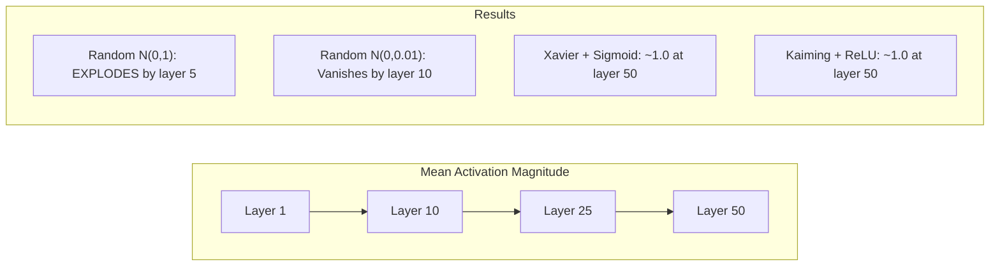
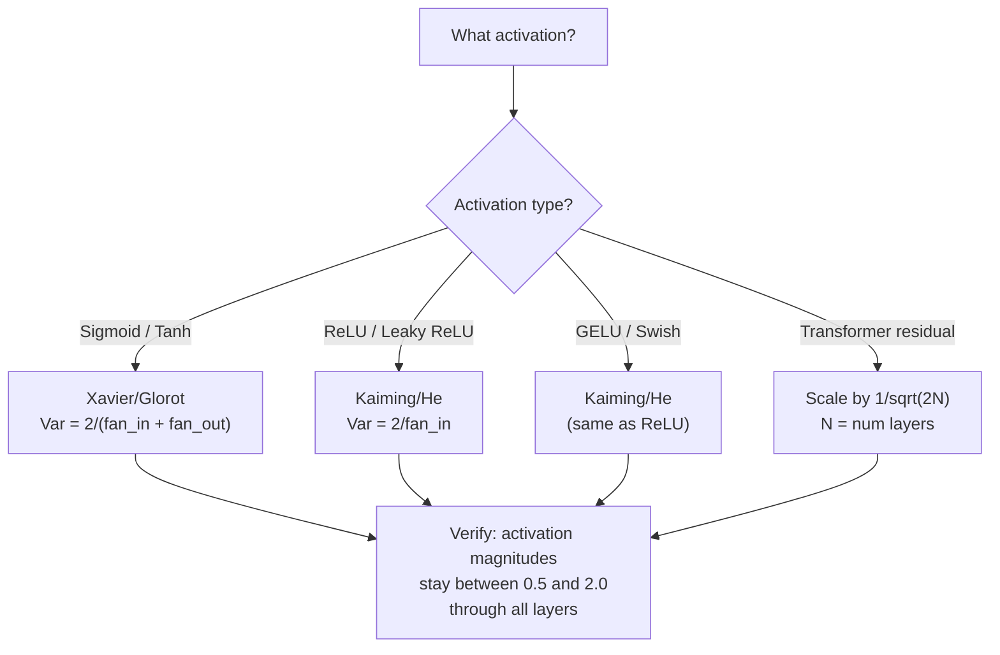

# الوزن التشغيل والتمارين استقرار

> إبدأ خطأ وتدريب لا يبدأ أبدا إبدأ صحيحا و 50 طبقة تدريب بسلاسة مثل 3.

> **【中文解读】**ابتداء الخطأ، التدريب لن يبدأ أبداً  50 طبقة شبكة الإشارات                                                                                                                                                                                                                                                    

**Type:** Build
**Languages:** Python
**Prerequisites:** Lesson 03.04 (Activation Functions), Lesson 03.07 (Regularization)
**Time:** ~90 minutes

## أهداف التعلم

- تنفيذ استراتيجيات التبديل الصفرية والربطية والزافير/جلوروت وكايمينغ/ه وقياس تأثيرها على حجم التفعيل عبر 50 طبقة
- استنتاج لماذا يستخدم Xavier init Var(w) = 2/(fan_in + fan_out) و Kaiming يستخدم Var(w) = 2/fan_in
- إظهار مشكلة التناظر مع صفر التبني وتفسير لماذا مقياس عشوائي وحده غير كافية
- مطابقة استراتيجية البدء الصحيحة لـ وظيفة التفعيل: خافير لـ sigmoid/tanh، كايمينغ لـ ReLU/GELU

> **【中文解读】**本章核心问题: كيف تختار الوزن الاولى,让信号在50层网络中既不消失也不爆炸──答案是Xavier 初始化(sigmoid/tanh 配套) 和 Kaiming 初始化(ReLU/GELU 配套)──PyTorch's nn.Linear默认使用Kaiming 初始化

## المشكلة المشكلة المشكلة

إبتدائية كل الوزن إلى الصفر. لا شيء يتعلم. كل خلية عصبية تقوم بحساب نفس الوظيفة، وتتلقى نفس التراجع، وتحديثات بشكل متطابق. بعد 10،000 عصر، طبقة الخلية من 512 خلية عصبية ما زالت 512 نسخة من نفس الخلية. دفعت ل 512 مبرميرات وحصلت على 1.

> سوف يتم إعادة تشكيل الملكية إلى صفر. ماذا أيضا تعلمت؟ كل عصب يحسب نفس الوظيفة، ويستقبل نفس التسلسلة، بطريقة نفسية. بعد 10،000 عصر، 512 عصبك الخفية المستوى لا يزال 512 نسخة من نفس العصب.

إبدأوا أكبر من اللازم. تنفجر التفعيلات عبر الشبكة. عند الطبقة 10 ، تصل قيمها إلى 1e15. عند الطبقة 20 ، تتجاوز إلى اللانهاية. تتبع المعدلات نفس المسار العكسي.

> ابتداءًا كبيرًا للغاية. القيمة النشطة في الشبكة تفجر. إلى المستوى 10، والقيمة تصل إلى 1e15. إلى المستوى 20، وتفجر إلى لا نهاية لها.

قم بتشغيلها عشوائيًا من توزيع طبيعي قياسي. يعمل لمدة 3 طبقات. عند 50 طبقة ، تتراجع الإشارة إلى الصفر أو تفجر إلى اللانهاية اعتمادا على ما إذا كان النطاق العشوائي صغيرًا جدًا أو كبيرًا جدًا. الحدود بين "العمل" و "الكسور" رقيقة مثل الحلاقة.

> من المعيار الصحيح التوزيع مع بداية التشغيل. 3 طبقات يمكن العمل. 50 طبقة، الإشارة تضييق إلى صفر أو انفجار إلى لا نهاية لها، يعتمد على الحدود بين "فعالة" و"الخراب".

إن إطلاق الوزن هو أكثر القرارات إقلالًا في التعلم العميق. الهندسة المعمارية تحصل على ورق. المتحسينات تحصل على مشاركات مدونة. الإطلاق يحصل على ملاحظة أقدامية. ولكن إخطأ الأمر ولا يهم شيء آخر - شبكتك ميتة قبل بدء التدريب.

> الاختيار الوزن هو أكثر القرارات التي يتم تقييمها في التعلم المتعمق. الاختيار الوزن الوزن الوزن الوزن الوزن الوزن الوزن الوزن الوزن الوزن الوزن الوزن الوزن الوزن الوزن الوزن الوزن الوزن الوزن الوزن الوزن الوزن الوزن الوزن الوزن الوزن الوزن الوزن الوزن الوزن الوزن الوزن الوزن الوزن الوزن الوزن الوزن الوزن الوزن الوزن الوزن الوزن الوزن الوزن الوزن الوزن الوزن الوزن الوزن الوزن الوزن الوزن الوزن الوزن الوزن الوزن الوزن الوزن الوزن الوزن الوزن الوزن الوزن الوزن الوزن الوزن الوزن الوزن الوزن الوزن الوزن الوزن الوزن الوزن الوزن الوزن الوزن الوزن الوزن الوزن الوزن الوزن الوزن الوزن الوزن الوزن الوزن الوزن الوزن الوزن الوزن الوزن الوزن الوزن الوزن الوزن الوزن الوزن الوزن الوزن الوزن الوزن الوزن الوزن الوزن الوزن الوزن الوزن الوزن الوزن الوزن الوزن الوزن الوزن الوزن الوزن الوزن الوزن الوزن الوزن الوزن الوزن الوزن الوزن الوزن الوزن الوزن الوزن الوزن الوزن الوزن الوزن الوزن الوزن الوزن الوزن الوزن الوزن الوزن الوزن الوزن الوزن الوزن الوزن الوزن الوزن الوزن الوزن الوزن الوزن الوزن الوزن الوزن الوزن الوزن الوزن الوزن الوزن الوزن الوزن الوزن

> **【中文解读】**التبديل هو أكثر القرارات التي يتم تقييمها في التعلم العميق. التبديل الصحي يؤدي إلى التكافؤة.

> **【拓展：GPT-2 的残差缩放技巧】**أدرج GPT-2  إدخال 1/sqrt(2N) عن فاقد التكفيضات ((N هو عدد المستويات)。 كل فاقد التكفيضات المتصلة x = x + طبقة الفرعية(x) مدينة تزيد من فاقد التكفيضات,126 طبقة من Llama 3 会让方差增长 126 倍── تكميل العوامل جعل فاقد التكفيضات يبقى ثابتها── هذه المهارة الآن تمتلك المحول 采用──

## المفهوم الأساسي

### مشكلة التناظرة مع الموازنة

كل عصبية في طبقة لها نفس الهيكل: مضاعفة المدخلات بالوزن، أضف التحيز، وتطبيق التفعيل. إذا بدأت جميع الوزن في نفس القيمة (الصفر هو الحالة القصوى) ، فإن كل عصبية تقوم بحساب نفس الخروج. أثناء الانتشار الخلفي، يتلقى كل عصبية نفس التراجع. خلال خطوة التحديث، تتغير كل عصبية بنفس الكمية.

> كل عصب من الطبقة لها نفس الهيكل: الدخول ضرب الوزن ̊ زيادة الوقوف ̊ تطبيق وظيفة تنشيطها‬‬‬‬‬‬‬‬‬‬‬‬‬‬‬‬‬‬‬‬‬‬‬‬‬‬‬‬‬‬‬‬‬‬‬‬‬‬‬‬‬‬‬‬‬‬‬‬‬‬‬‬‬‬‬‬‬‬‬‬‬‬‬‬‬‬‬‬‬‬‬‬‬‬‬‬‬‬‬‬‬‬‬‬‬‬‬‬‬‬‬‬‬‬‬‬‬‬‬‬‬‬‬‬‬‬‬‬‬‬‬‬‬‬‬‬‬‬‬‬‬‬‬‬‬‬‬‬‬‬‬‬‬‬‬‬‬‬‬‬‬‬‬‬‬‬‬‬‬‬‬‬‬‬‬‬‬‬‬‬‬‬‬‬‬‬‬‬‬‬‬‬‬‬‬‬‬‬‬‬‬‬‬‬‬‬‬‬‬‬‬‬‬‬‬‬‬‬‬‬‬‬‬‬‬‬‬‬‬‬‬‬‬‬‬‬‬‬‬‬‬‬‬‬‬‬‬‬‬‬‬‬‬‬‬‬‬‬‬‬‬‬‬‬‬‬‬‬‬‬‬‬‬‬‬‬‬‬‬‬‬‬‬‬‬‬‬‬‬‬‬‬‬‬‬‬‬‬‬‬‬‬‬‬‬‬‬‬‬‬‬‬‬‬‬‬‬‬‬‬‬‬‬‬‬‬‬‬‬‬‬‬‬‬‬‬‬‬‬‬‬‬‬‬‬‬‬‬‬‬‬‬‬‬‬‬‬‬‬‬‬‬‬‬‬‬‬‬‬‬‬‬‬‬‬‬‬‬‬‬‬‬‬‬‬‬‬‬‬‬‬‬‬‬‬‬‬‬‬‬‬‬‬‬‬‬‬‬‬‬‬‬‬‬‬‬‬‬‬‬‬‬‬‬‬‬‬‬‬‬‬‬‬‬‬‬‬‬‬‬‬‬‬‬‬‬‬‬‬‬‬‬‬‬‬‬‬‬‬‬‬‬‬‬‬‬‬‬‬‬‬‬‬‬‬‬‬‬‬‬‬‬‬‬‬‬‬‬‬‬‬‬‬

أنت عالق. الشبكة لديها مئات المعلمات، ولكنها تتحرك كلها في حلقة. وهذا يسمى التناظر، والبدء عشوائي هو الطريقة القوة الخامة للكسر. كل عصبية تبدأ في نقطة مختلفة في الفضاء الوزن، لذلك كل تعلم ميزة مختلفة.

> تعيش في شبكة. يوجد مئات العناصر، ولكنها تتحرك في نفس الوقت. هذا ما يسمى بالتناظر، والابتدائية في الوقت نفسه هي طريقة عنيفة لتحطيمها.

لكن "الصدفة" ليست كافية * مقياس * من الصدفة يحدد ما إذا كانت الشبكة تتجه.

> لكن "المرحلة" ليست كافية.

### التباين من خلال الطبقات التوزيع

اعتبر طبقة واحدة مع مدخلات fan_in:

> فكر في أن يكون هناك من المعاناة في المنتج

```
z = w1*x1 + w2*x2 + ... + w_n*x_n
```

إذا تم استخراج كل وزن wi من توزيع مع اختلاف Var(w) وكل مدخل xi لديه اختلاف Var(x) ، فإن المتغير الخارجي هو:

> إذا كان كل وزن من المخرجين مختلفاً عن الموقع، فإن كل دخول من الموقع هو مختلفاً عن الموقع، فان المخرج هو:

```
Var(z) = fan_in * Var(w) * Var(x)
```

إذا كان Var(w) = 1 و fan_in = 512, فإن المتغيرات الخارجة 512x المتغيرات المدخلة. بعد 10 طبقات: 512^10 = 1.2e27. لقد انفجرت إشارتك.

> إذا Var(w) = 1 و fan_in = 512,输出差是输入差的 512 倍──10 层后:512^10 = 1.2e27──你的信号已经爆炸──

إذا كان Var ((w) = 0.001، فإن التباين الخارجي ينخفض بنسبة 0.001 * 512 = 0.512 لكل طبقة. بعد 10 طبقات: 0.512^10 = 0.00013. اختفى إشارتك.

> إذا Var(w) = 0.001,输出方差每层缩小 0.001 * 512 = 0.512──10 层后:0.512^10 = 0.00013──你的信号已经消失──

الهدف: اختيار Var(w) بحيث Var(z) = Var(x). يبقى حجم الإشارة ثابتًا عبر الطبقات.

> 目標:选择 Var(w) 使 Var(z) = Var(x) ―― إشارة ارتفاعه في المستوى للحفاظ على恒定。

> **【中文解读】**方差传播的数学:Var(z) = fan_in * Var(w) * Var(x)。 إذا كان fan_in=512 且 Var(w) = 1,输出方差是输入的 512 倍──10 层后:512^10 = 1.2e27,信号爆炸──Xavier 和 Kaiming 的目标都是让 Var(z) = Var(x),使信号幅度逐层保持恒定──

### خافيير/جلوروت ابتكار

استخرج غلوروت و بينجيو (2010) الحل لتنشيط sigmoid و tanh. للحفاظ على التباين ثابت في كل من الممر الأمامي والخلفي:

> Glorot 和 Bengio (2010) 推导 sigmoid 和 tanh 激活函数的解──为了保持方差恒定在前向和反向传播中:

```
Var(w) = 2 / (fan_in + fan_out)
```

في الممارسة العملية، يتم استخلاص الوزن من:

> في الممارسة، والوزن من التوزيع التالي

```
w ~ Uniform(-limit, limit)  where limit = sqrt(6 / (fan_in + fan_out))
```

أو:

```
w ~ Normal(0, sqrt(2 / (fan_in + fan_out)))
```

هذا يعمل لأن sigmoid و tanh خطية تقريبًا بالقرب من الصفر ، حيث يعيش التفعيلات المبكرة بشكل صحيح. يبقى التباين مستقراً عبر عشرات الطبقات.

> هذا هو السبب في أنه فعال، لأن السيغمويد و تانش في مكان قريب من صفر تقريبا هو خطي، بينما قيمة تنشيط التشغيل الصحيحة في البداية هو أن يعيش في مكان قريب من صفر.

### كايمينغ / هو التبني

ReLU يقتل نصف المخرجات (كل شيء سلبي يصبح صفر). يتم تقليل fan_in الفعال إلى النصف لأن نصف المدخلات في المتوسط صفر. لا يحسب Xavier init هذا - فإنه يقلل من التباين المطلوب.

> سوف تقوم ريلو بتقليل نصف المخرجات إلى صفر، حيث أن نصف المخرجات في المطار قد تم وضعها إلى صفر.

He et al. (2015) قام بتعديل الصيغة:

> He 等人 (2015) 调整了公式:

```
Var(w) = 2 / fan_in
```

يتم استخراج الوزن من:

> 权重从以下分布抽取:

```
w ~ Normal(0, sqrt(2 / fan_in))
```

عامل 2 يعوض عن ReLU صفر نصف التفعيلات. دون ذلك، تقلص الإشارة بنسبة ~ 0.5x لكل طبقة. مع 50 طبقة: 0.5^50 = 8.8e-16.

> في الواقع، فإن الـ 2  معويات ReLU ستضع نصف قيمة التشغيل إلى صفر ⋅ بدونها، الإشارة كل طبقة تقلص حوالي 0.5 ⋅ 50 ⋅ 50 بعد: 0.5 ⋅ 50 = 8.8e-16 ⋅ كايمينغ ابتداء منع هذه الحالة ⋅

> **【拓展：PyTorch 的默认初始化】**PyTorch 的 nn.Linear 默认使用 كايمينغ يونيفورم 初始化(`nn.init.kaiming_uniform_`,mode='fan_in'),配合 LeakyReLU's negative_slope=sqrt(5)`nn.Linear(784, 256)`时,PyTorch 已帮助你选择好初始化──但自定义架构(Transformer、混合专家模型) تحتاج إلى تحديث يدوي──

### إطلاق المحولات

أدى GPT-2 إلى وضع نمط مختلف. تضيف الاتصالات المتبقية إنتاج كل طبقة فرعية إلى مدخلها:

> يُدخّل GPT-2 طريقة مختلفة.

```
x = x + sublayer(x)
```

يزيد كل إضافة التباين. مع N طبقات بقايا، يتزايد التباين بالتناظير مع N. يسلّط GPT-2 وزن الطبقات المتبقيّة بمقدار 1/sqrt(2N) ، حيث أن N هو عدد الطبقات. وهذا يبقي حجم الإشارة المتراكم مستقراً.

> كل مرة يزيد فيها الاختلافات، هناك N 个 个 差差层. عندما يكون هناك N 个 差层، فان الاختلافات تتناسب مع N 成比例增长.

يستخدم Llama 3 (405B المعلمات، 126 طبقة) مخططًا مماثلًا. بدون هذا التوسع، فإن التدفق المتبقي سيصبح غير محدود عبر 126 طبقة من الاهتمام والبلوكات المسبقة.

> لا يوجد مثل هذا التكفيض، فان الاختلافات ستمر من خلال 126 مستوى من الاهتمام والكليات السابقة

> **【拓展：混合专家模型（MoE）的初始化挑战】**المختلطة 8x7B 和 GPT-4 等 النموذج يستخدم MoE 架构، كل رمز فقط تفعيل جزء من المتخصصين. عند البدء في التشغيل يحتاج إلى ضمان: الوزن الأولي للجهاز لا يمكن أن يجعل جميع الوهم يتم اختيارها مع أحد المتخصصين. الممارسة الشائعة هي باستخدام اختلافات الأولي الصغيرة في البدء + ضجيج الضوضاء، لضمان تبعث الأولي من الطريق.

```mermaid
flowchart TD
    subgraph "Zero Init"
        Z1["Layer 1<br/>All weights = 0"] --> Z2["Layer 2<br/>All neurons identical"]
        Z2 --> Z3["Layer 3<br/>Still identical"]
        Z3 --> ZR["Result: 1 effective neuron<br/>regardless of width"]
    end

    subgraph "Xavier Init"
        X1["Layer 1<br/>Var = 2/(fan_in+fan_out)"] --> X2["Layer 2<br/>Signal stable"]
        X2 --> X3["Layer 50<br/>Signal stable"]
        X3 --> XR["Result: Trains with<br/>sigmoid/tanh"]
    end

    subgraph "Kaiming Init"
        K1["Layer 1<br/>Var = 2/fan_in"] --> K2["Layer 2<br/>Signal stable"]
        K2 --> K3["Layer 50<br/>Signal stable"]
        K3 --> KR["Result: Trains with<br/>ReLU/GELU"]
    end
```



### حجم التفعيل عبر 50 طبقة



### اختيار البداية الصحيحة



## بناء ذلك تحرك لتحقيق
```figure
weight-init-variance
```

## بناءها

> **【中文解读】**实验设计:让信号通过 50 层网络,测量每层的激活幅度──零初始化 → 所有神经元相同;随机 N(0,1) → 爆炸;随机 N(0,0.01) → 消失;Xavier+tanh / Kaiming+ReLU → 稳定── هذه التجربة مباشرة أظهر أهمية البدء.

### الخطوة الأولى: استراتيجيات البدء

أربعة طرق لتبني المصفوفة الوزن. كل واحد يعود قائمة من القوائم (مصفوفة 2D) مع عمودات fan_in وطرق fan_out.

> أربع طرق لبدء الوزن المُعدل.

```python
import math
import random


def zero_init(fan_in, fan_out):
    return [[0.0 for _ in range(fan_in)] for _ in range(fan_out)]


def random_init(fan_in, fan_out, scale=1.0):
    return [[random.gauss(0, scale) for _ in range(fan_in)] for _ in range(fan_out)]


def xavier_init(fan_in, fan_out):
    std = math.sqrt(2.0 / (fan_in + fan_out))
    return [[random.gauss(0, std) for _ in range(fan_in)] for _ in range(fan_out)]


def kaiming_init(fan_in, fan_out):
    std = math.sqrt(2.0 / fan_in)
    return [[random.gauss(0, std) for _ in range(fan_in)] for _ in range(fan_out)]
```

### الخطوة الثانية: وظائف التفعيل الخطوة الثانية: وظائف التفعيل

نحتاج إلى sigmoid, tanh, و ReLU لاختبار كل استراتيجية init مع تنشيطها المقصود.

> نحتاج إلى sigmoid  tanh 和 ReLU لاختبار كل استراتيجية البدء مع مجموعة من وظائف التشغيل

```python
def sigmoid(x):
    x = max(-500, min(500, x))
    return 1.0 / (1.0 + math.exp(-x))


def tanh_act(x):
    return math.tanh(x)


def relu(x):
    return max(0.0, x)
```

### الخطوة الثالثة: المضي قدماً عبر 50 طبقة

إرسال البيانات العشوائية عبر شبكة عميقة وقياس متوسط حجم التفعيل في كل طبقة.

> وسوف تقوم بتقديم البيانات عبر شبكة عميقة، لقياس متوسط ارتفاع النشاط لكل مستوى.

```python
def forward_deep(init_fn, activation_fn, n_layers=50, width=64, n_samples=100):
    random.seed(42)
    layer_magnitudes = []

    inputs = [[random.gauss(0, 1) for _ in range(width)] for _ in range(n_samples)]

    for layer_idx in range(n_layers):
        weights = init_fn(width, width)
        biases = [0.0] * width

        new_inputs = []
        for sample in inputs:
            output = []
            for neuron_idx in range(width):
                z = sum(weights[neuron_idx][j] * sample[j] for j in range(width)) + biases[neuron_idx]
                output.append(activation_fn(z))
            new_inputs.append(output)
        inputs = new_inputs

        magnitudes = []
        for sample in inputs:
            magnitudes.append(sum(abs(v) for v in sample) / width)
        mean_mag = sum(magnitudes) / len(magnitudes)
        layer_magnitudes.append(mean_mag)

    return layer_magnitudes
```

### الخطوة الرابعة: التجربة

قم بتشغيل جميع الجمعيات: صفر init، عشوائي N(0,1), عشوائي N(0,0.01), Xavier مع sigmoid، Xavier مع tanh، Kaiming مع ReLU. طبع الحجم في طبقات رئيسية.

> 运行所有组合:零初始化、随机 N(0,1)、随机 N(0,0.01)、Xavier + sigmoid、Xavier + tanh、Kaiming + ReLU。打印关键层的幅度──

```python
def run_experiment():
    configs = [
        ("Zero init + Sigmoid", lambda fi, fo: zero_init(fi, fo), sigmoid),
        ("Random N(0,1) + ReLU", lambda fi, fo: random_init(fi, fo, 1.0), relu),
        ("Random N(0,0.01) + ReLU", lambda fi, fo: random_init(fi, fo, 0.01), relu),
        ("Xavier + Sigmoid", xavier_init, sigmoid),
        ("Xavier + Tanh", xavier_init, tanh_act),
        ("Kaiming + ReLU", kaiming_init, relu),
    ]

    print(f"{'Strategy':<30} {'L1':>10} {'L5':>10} {'L10':>10} {'L25':>10} {'L50':>10}")
    print("-" * 80)

    for name, init_fn, act_fn in configs:
        mags = forward_deep(init_fn, act_fn)
        row = f"{name:<30}"
        for idx in [0, 4, 9, 24, 49]:
            val = mags[idx]
            if val > 1e6:
                row += f" {'EXPLODED':>10}"
            elif val < 1e-6:
                row += f" {'VANISHED':>10}"
            else:
                row += f" {val:>10.4f}"
        print(row)
```

### الخطوة 5: إظهار التناظر

أظهر أن الصفر يُنتج الخلايا العصبية المتطابقة.

> تظهر صفر ابتداء تظهر نفس العصب تماما.

```python
def symmetry_demo():
    random.seed(42)
    weights = zero_init(2, 4)
    biases = [0.0] * 4

    inputs = [0.5, -0.3]
    outputs = []
    for neuron_idx in range(4):
        z = sum(weights[neuron_idx][j] * inputs[j] for j in range(2)) + biases[neuron_idx]
        outputs.append(sigmoid(z))

    print("\nSymmetry Demo (4 neurons, zero init):")
    for i, out in enumerate(outputs):
        print(f"  Neuron {i}: output = {out:.6f}")
    all_same = all(abs(outputs[i] - outputs[0]) < 1e-10 for i in range(len(outputs)))
    print(f"  All identical: {all_same}")
    print(f"  Effective parameters: 1 (not {len(weights) * len(weights[0])})")
```

### الخطوة السادسة: تقرير الكبيرة الطبقة بطبقة

طبع مخطط بصري من حجم التفعيل عبر 50 طبقة

> طباعة 50 طبقة من حجم التشغيل

```python
def magnitude_report(name, magnitudes):
    print(f"\n{name}:")
    for i, mag in enumerate(magnitudes):
        if i % 5 == 0 or i == len(magnitudes) - 1:
            if mag > 1e6:
                bar = "X" * 50 + " EXPLODED"
            elif mag < 1e-6:
                bar = "." + " VANISHED"
            else:
                bar_len = min(50, max(1, int(mag * 10)))
                bar = "#" * bar_len
            print(f"  Layer {i+1:3d}: {bar} ({mag:.6f})")
```

## استخدمها في إطار التنفيذ

> **【中文解读】**بيوتورش داخل`nn.init.xavier_uniform_`.`nn.init.kaiming_normal_`等函数──nn.Linear 默认使用Kaiming Uniform,所以简单网络"开箱即用"──但自定义架构需要手动调用这些函数──

يقدم PyTorch هذه الوظائف المدمجة:

> سوف PyTorch هذه كعملة داخلية:

```python
import torch
import torch.nn as nn

layer = nn.Linear(512, 256)

nn.init.xavier_uniform_(layer.weight)
nn.init.xavier_normal_(layer.weight)

nn.init.kaiming_uniform_(layer.weight, nonlinearity='relu')
nn.init.kaiming_normal_(layer.weight, nonlinearity='relu')

nn.init.zeros_(layer.bias)
```

عندما تتصلين`nn.Linear(512, 256)`وذلك هو السبب في أن معظم الشبكات البسيطة "تعمل فقط" - PyTorch قد اتخذت بالفعل الخيار الصحيح. ولكن عندما تقوم ببناء بنيات مخصصة أو تذهب أعمق من 20 طبقة، تحتاج إلى فهم ما يحدث وربما تفضيض الافتراض.

> عندما ت调用`nn.Linear(512, 256)`عندما، تايتورش 默认使用凯明 均初始化──这就是为什么大多数简单网络"开箱即用"PyTorch 已经帮助你做出正确选择──但是当你构建自定义架构或超过20层时,你需要了解正在发生什么并可能覆盖默认值──

بالنسبة للمتحولات، عادة ما تتعامل نماذج HuggingFace مع التبديل في أجهزة التشغيل الخاصة بهم.`_init_weights`طريقة. تنفيذ GPT-2 يقيّم التوقعات المتبقية بمقدار 1/sqrt ((N). إذا كنت تبني محول من الصفر، تحتاج إلى إضافة هذا بنفسك.

> بالنسبة لـ Transformer، HuggingFace`_init_weights`方法中处理初始化── GPT-2实现将残差投影缩缩放到1/sqrt(N)── إذا كنت من الصفر تكوين محول، تحتاج إلى نفسك إضافة هذا──

## أرسلها .

هذا الدرس ينتج عن:
- `outputs/prompt-init-strategy.md`-- إرسال استقال يُشخيص مشاكل إطلاق الوزن ويوصي بالستراتيجية الصحيحة

> 本课产出:`outputs/prompt-init-strategy.md`- إختبار السلطة المبدئية مشاكل وتقديم نصيحة استراتيجية صحيحة

## تمارين التدريب

1. إضافة تشغيل LeCun (Var = 1/fan_in ، مصممة لتنشيط SELU). قم بتشغيل تجربة 50 طبقة مع LeCun init + tanh ومقارنة مع Xavier + tanh.

   1. 添加 LeCun 初始化(Var = 1/fan_in,为SELU 激活设计) ・・・用 LeCun 初始化 + tanh 跑 50 层实验,和Xavier + tanh 对比──

2. تنفيذ مقياس بقايا GPT-2: مضاعفة خروج كل طبقة بمقدار 1/sqrt ((2 * N) قبل إضافةها إلى تيار البقايا. تشغيل 50 طبقة مع ودون مقياس، قياس سرعة نمو حجم البقايا.

   2. 实现 GPT-2 残差缩放:把每层输出乘以1/sqrt(2*N) 再加到残差流──跑 50层有缩放和无缩放,测量残差幅度增速──

3. قم بإنشاء وظيفة "تحقق صحة التشغيل" التي تأخذ أبعاد طبقة الشبكة ونوع تفعيلها، ثم توصي بالبدء الصحيح وتحذير إذا كان التشغيل الحالي سيسبب مشاكل.

   3. إنشاء وظيفة "إعداد المراقبة الصحية": استلام شبكة مستوى الامتداد وتشغيل النوع، اقتراح إعداد صحيح، تحذير من إذا كان الإعداد الحالي سيسبب مشكلة.

4. قم بتشغيل التجربة مع fan_in = 16 مقابل fan_in = 1024. يتكيف Xavier و Kaiming مع fan_in ، ولكن الابتكار العشوائي لا يفعل ذلك. أظهر كيف يتوسع الفجوة بين "العمل" و "الفراغات" مع طبقات أكبر.

   4. استخدام المُعجبين = 16 和 المُعجبين = 1024 跑实验──Xavier 和 Kaiming 自适应 fan_in,但随机初始化不会──展示"能用"和"崩"之间的差异如何随层增大而扩大──

5. تنفيذ التبني المُستقيم (إنشاء مصفوفة عشوائية، حساب SVD، استخدام المصفوفة المُستقيمة U). مقارنة مع كايمينغ لشبكات ReLU في 50 طبقة.

   5. 实现正交初始化(生成随机矩阵,计算 SVD,用正交矩阵 U) ⋅在 50 层 ReLU 网络上和 Kaiming 对比──

## شروط الرئيسية

| Term | What people say | What it actually means |
|------|----------------|----------------------|
| Weight initialization | "Set starting weights randomly" | The strategy for choosing initial weight values that determines whether a network can train at all |
| Symmetry breaking | "Make neurons different" | Using random initialization to ensure neurons learn distinct features instead of computing identical functions |
| Fan-in | "Number of inputs to a neuron" | The number of incoming connections, which determines how input variance accumulates in the weighted sum |
| Fan-out | "Number of outputs from a neuron" | The number of outgoing connections, relevant for maintaining gradient variance during backpropagation |
| Xavier/Glorot init | "The sigmoid initialization" | Var(w) = 2/(fan_in + fan_out), designed to preserve variance through sigmoid and tanh activations |
| Kaiming/He init | "The ReLU initialization" | Var(w) = 2/fan_in, accounts for ReLU zeroing half the activations |
| Variance propagation | "How signals grow or shrink through layers" | The mathematical analysis of how activation variance changes layer by layer based on weight scale |
| Residual scaling | "GPT-2's init trick" | Scaling residual connection weights by 1/sqrt(2N) to prevent variance growth through N transformer layers |
| Dead network | "Nothing trains" | A network where poor initialization causes all gradients to be zero or all activations to saturate |
| Exploding activations | "Values go to infinity" | When weight variance is too high, causing activation magnitudes to grow exponentially through layers |

| 术语 | 俗称 | 实际含义 |
|------|------|---------|
| Weight initialization / 权重初始化 | "随机设置初始权重" | 选择初始权重值的策略，决定网络能否训练 |
| Symmetry breaking / 对称性破除 | "让神经元不同" | 用随机初始化确保神经元学到不同特征，而不是计算相同函数 |
| Fan-in / 输入连接数 | "神经元的输入数" | 入连接数，决定加权和里输入方差如何累积 |
| Fan-out / 输出连接数 | "神经元的输出数" | 出连接数，与反向传播时保持梯度方差相关 |
| Xavier/Glorot init / Xavier 初始化 | "sigmoid 初始化" | Var(w) = 2/(fan_in + fan_out)，旨在通过 sigmoid/tanh 保持方差 |
| Kaiming/He init / Kaiming 初始化 | "ReLU 初始化" | Var(w) = 2/fan_in，补偿 ReLU 把一半激活置零 |
| Variance propagation / 方差传播 | "信号在层间如何放大或缩小" | 关于激活方差如何基于权重尺度逐层变化的数学分析 |
| Residual scaling / 残差缩放 | "GPT-2 的初始化技巧" | 把残差连接权重缩放 1/sqrt(2N)，防止 N 个 Transformer 层后方差增长 |
| Dead network / 死亡网络 | "什么都不训练" | 初始化不当导致所有梯度为零或所有激活饱和的网络 |
| Exploding activations / 激活爆炸 | "值到无穷" | 权重方差太高，激活幅度在层间指数增长 |

## المزيد من القراءة

- غلوروت و بينجيو، "فهم صعوبة تدريب شبكات عصبية متقدمة بعمق" (2010) -- ورقة تشغيل كاسبير الأصلية مع تحليل التباين
  غلوروت و بينجيو، فهم تدريب عميقة  صعوبة شبكة العصبية (2010)  أصلي خافيير ابتداءية مقال،
- هو وآخرون، "التعمق بعمق في المصلحات" (2015) -- قدم إطلاق كايمينغ للشبكات ReLU
  He 等人,深入研究修正器(2015) 为 ReLU 网络引入 凯明初始化
- رادفورد وغيرهم، "نموذجات اللغة هي متعلمين متعددين المهام غير المشرفين" (2019) -- ورقة GPT-2 مع بدء التوسع المتبقي
  رادفورد 等人,语言模型是无监督多任务学习器(2019) GPT-2 论文,包含残差缩放初始化
- مشكين وماتاس، "كل ما تحتاجه هو بداية جيدة" (2016) -- تعريف التسلسلات الوحيدة-المتغيرات الطبقة، بديل تجربي للصيغ التحليلية
  مشكين وماتاس،أنت تحتاج فقط إلى بداية جيدة(2016)层序单位差初始化,解析公式的经验替代方案
