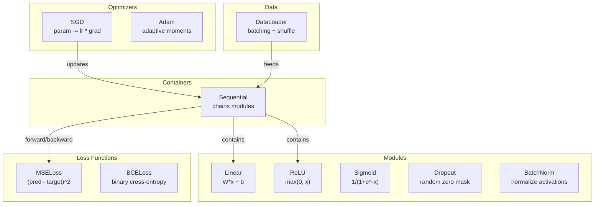
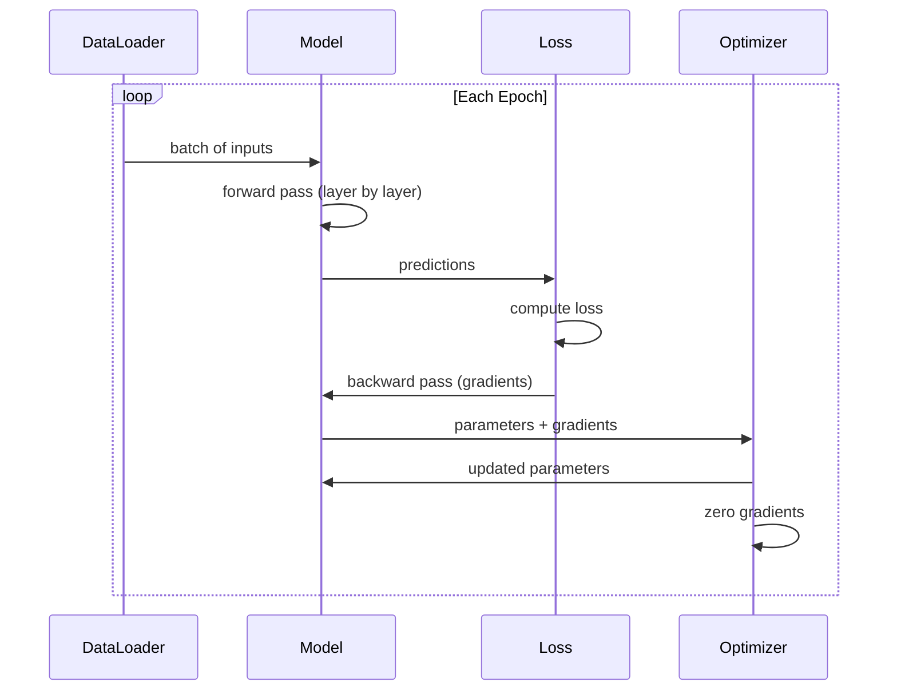
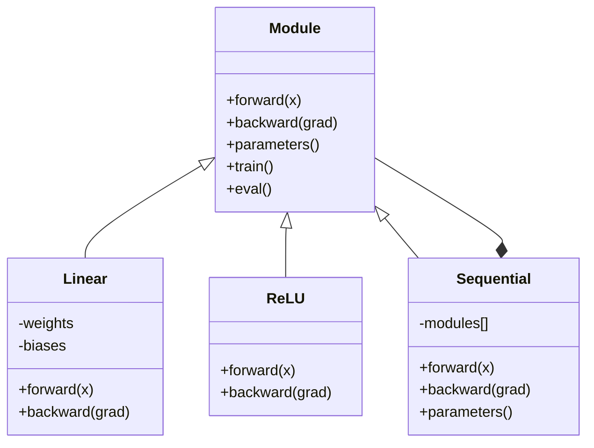

# بناء إطار صغير الخاص بك بناء إطار صغير الخاص بك

> لقد بنيت الخلايا العصبية، الطبقات، الشبكات، الرفع الخلفي، التفعيلات، وظائف الخسارة، المحفزات، التنظيم، التبديل، وخطوط الجدول. كل ذلك كقطع منفصلة. الآن سدّهم معاً في إطار. ليس بيتورش. ليس تنسور فلو.

> **【中文解读】**وضع مفهوم جميع الدورات السابقة على الإطار الكامل: محركات التنقل الذاتية، أنواع متعددة المستويات، محفزات، تقييمات، دورة التدريب.

**Type:** Build
**Languages:** Python
**Prerequisites:** All of Phase 03 (Lessons 01-09)
**Time:** ~120 minutes

## أهداف التعلم

- بناء إطار كامل للتعلم العميق (~ 500 سطر) مع الوحدة، الخطية، ReLU، Sigmoid، Dropout، BatchNorm، التسلسل، وظائف الخسارة، المحفزات، و DataLoader
- شرح تجريئة الوحدة (إلى الأمام والخلف والعلامات) ولماذا هناك حاجة إلى تغيير وضع القطار/الطريق
- سلك جميع المكونات في حلقة تدريب عمل تدريب شبكة 4 طبقات على تصنيف الدائرة
- خريطة كل مكون من إطار العمل الخاص بك إلى ما يعادله PyTorch (nn.Module، nn.Sequential، optim.Adam، DataLoader)

> **【中文解读】**هذا الفصل هو الفصل التجمع في المرحلة 03把前面 9 课的所有概念串成一个完整的 ~500 行框架──核心抽象是模块(前/后/参数),对应 PyTorch的 nn.Module──完成后你会真正理解 PyTorch 每一行代码背后发生的事情──

## المشكلة المشكلة المشكلة

لديك عشرة دروس من قطع البناء متناثرة على ملفات منفصلة.`Value`درجة هنا، حلقة تدريب هناك، تعريف الوزن في ملف آخر، جداول معدل التعلم في آخر. لتدريب شبكة، تقوم بنسخ-بصق من خمس دروس مختلفة وتحويلها معا يدويا.

> لديك عشرة دروس من المكونات المختلفة في الملفات المختلفة`Value`هناك دورة تدريبية، وثمة وثيقة أخرى هي التشغيل الوزني، وثمة أخرى هي تعديل معدل التعلم.

هذا ما تحل الإطارات.`nn.Module`،`nn.Sequential`،`optim.Adam`،`DataLoader`و نمط حلقة تدريبية يربطهم معاً`keras.Layer`،`keras.Sequential`،`keras.optimizers.Adam`هذه ليست سحر، إنها أنماط تنظيمية تسمح بتعريف وتدريب وتقييم الشبكات دون إعادة اختراع الأنابيب في كل مرة.

> هذا هو الإطار الحل للمشكلة.`nn.Module`.`nn.Sequential`.`optim.Adam`.`DataLoader`و سوف تربطها معاً في دورة التدريب.`keras.Layer`.`keras.Sequential`.`keras.optimizers.Adam` هذه ليست سحر إنها أنماط تنظيمية، فيمكنك تعريف تدريب وتقييم شبكة، دون الحاجة إلى إعادة تصميم الأنابيب

سوف تقوم ببناء نفس الشيء في حوالي 500 سطر من Python. لا نومبي. لا تعتمدات خارجية. إطار يمكنه تحديد أي شبكة إرسال، تدريبها مع SGD أو آدم، مجموعة البيانات، تطبيق التخلي عن التطبيق والطائفة التطبيقية، استخدام أي تفعيل، وتخطيط معدل التعلم.

> ستستخدم حوالي 500 صف Python لتكوين نفس الشيء. لا حاجة إلى النمبي. لا حاجة إلى الاعتماد الخارجي. يمكنك تعريف أي شبكة سابقة. باستخدام SGD أو آدم التدريب.

عندما تنتهي من الكتابة ستفهم بالضبط ما يحدث عندما تكتب`model = nn.Sequential(...)`في (بيتورش) ، ستفهمون لماذا`model.train()`و`model.eval()`ستفهمون لماذا`optimizer.zero_grad()`سوف تفهم كل شيء لأنك بنيت كل شيء

> بعد أن تتم، سوف تفهم تماما في PyTorch كتابة`model = nn.Sequential(...)`عندما حدث ما حدث ستفهم لماذا`model.train()`和 `model.eval()`هناك. سوف تفهم لماذا.`optimizer.zero_grad()`هو تطبيق واحد فقط. ستفهم كل هذا لأنك بنيت كل هذا بنفسك.

> **【中文解读】**框架的核心价值:把散落的组件统一到一个接口下――模块是一切的基础线性、ReLU、Dropout、BatchNorm 都是模块──序列是组合模式一堆模块 串起还是一个模块──这与PyTorch的设计完全一致──

> **【拓展：PyTorch 框架的设计哲学】**تصميم بيتورش الأساسي هو فقط 5 مفاهيم: Tensor (DATA) 、nn.Module (模型) 、autograd (自动微分) 、优化器 (优化器) 、DataLoader (数据加载) ٬ ولكن هذا هو 5 مفاهيم تدعم GPT-4、Stable Diffusion、AlphaFold وغيرها جميع التدريبات على طول النموذج ٬简洁是最大力量──

## المفهوم الأساسي

### الوحدة الامتصاصة الوحدة الامتصاص

كل طبقة في (بيتورش) تتراث من`nn.Module`. الوحدة لها ثلاثة مسؤوليات:

> في كل طبقة من " بيتورش "`nn.Module`◊ واحد من الوحدات لديه ثلاثة مهام:

1. **forward()**-- حساب الخروج المدخلات المقدمة
   **forward()**-- 给定输入计算输出
2. **parameters()**-- أعد كل الأوزان التي يمكن تدريبها
   **parameters()**-- عودة إلى جميع التدريبات
3. **backward()**-- تراجع الحساب (مُتعاملة بواسطة autograd في PyTorch، صريحة في لدينا)
   **backward()**-- 计算梯度(PyTorch 中由自动化 处理, our framework needs apparent realization)

طبقة خطية هي وحدة. تنشيط ReLU هو وحدة. طبقة التخلي عن هي وحدة. طبقة التطبيع اللحقي هو وحدة. جميعها لها نفس الواجهة.

> الخطية 层是一个模块――ReLU 激活是一个模块――Dropout 层是一个模块――BatchNorm 层是一个模块――它们都具有相同的接口――

### حاوية تسلسلية حاوية تسلسلية

`nn.Sequential`السلاسل الوحدات. المضي قدما: إرسال البيانات من خلال الوحدة 1، ثم الوحدة 2, ثم الوحدة 3. المضي قدما: عكس السلسلة. الحاوية نفسها هي الوحدة -- لديها المضي قدما ((() ، والمعايير ((() ، والعودة (((). هذا هو النمط المركب: تسلسل من الوحدات هو نفسه الوحدة.

> `nn.Sequential`将模块 串联起来──前向传播:数据流过模块 1、然后模块 2、然后模块 3──反向传播:反向遍历链──容器本身也是一个模块它有前 (),参数() 和后 (() ;;这是组合模式:模块序列本身也是一个模块──

> **【拓展：真实框架的额外功能】**يحتوي الإطار الصغير على مفهوم PyTorch الأساسي ، ولكن الإطار الحقيقي هو: 1) التطوير الذاتي الذاتي التفاصيل (((لا حاجة إلى كتابة يد إلى الوراء) ؛ 2) دعم GPU ؛ ؛ ؛ ؛ ؛ ؛ ؛ ؛ ؛ ؛ ؛ ؛ ؛ ؛ ؛ ؛ ؛ ؛ ؛ ؛ ؛ ؛ ؛ ؛ ؛ ؛ ؛ ؛ ؛ ؛ ؛ ؛ ؛ ؛ ؛ ؛ ؛ ؛ ؛ ؛ ؛ ؛ ؛ ؛ ؛ ؛ ؛ ؛ ؛ ؛ ؛ ؛ ؛ ؛ ؛ ؛ ؛ ؛ ؛ ؛ ؛ ؛ ؛ ؛ ؛ ؛ ؛ ؛ ؛ ؛ ؛ ؛ ؛ ؛ ؛ ؛ ؛ ؛ ؛ ؛ ؛ ؛ ؛ ؛ ؛ ؛ ؛ ؛ ؛ ؛ ؛ ؛ ؛ ؛ ؛ ؛ ؛ ؛ ؛ ؛ ؛ ؛ ؛ ؛ ؛ ؛ ؛ ؛ ؛ ؛ ؛ ؛ ؛ ؛ ؛ ؛ ؛ ؛ ؛ ؛ ؛ ؛ ؛ ؛ ؛ ؛ ؛ ؛ ؛ ؛ ؛ ؛ ؛ ؛ ؛ ؛ ؛ ؛ ؛ ؛ ؛ ؛ ؛ ؛ ؛ ؛ ؛ ؛ ؛ ؛ ؛ ؛ ؛ ؛ ؛ ؛ ؛ ؛ ؛ ؛ ؛ ؛ ؛ ؛ ؛ ؛ ؛ ؛ ؛ ؛ ؛ ؛ ؛ ؛ ؛ ؛ ؛ ؛ ؛ ؛ ؛ ؛ ؛ ؛ ؛ ؛ ؛ ؛ ؛ ؛ ؛ ؛ ؛ ؛ ؛ ؛ ؛ ؛ ؛ ؛ ؛ ؛ ؛ ؛ ؛ ؛ ؛ ؛ ؛ ؛ ؛ ؛ ؛ ؛ ؛ ؛ ؛ ؛ ؛ ؛ ؛ ؛ ؛ ؛ ؛ ؛ ؛ ؛ ؛ ؛ ؛ ؛ ؛ ؛ ؛ ؛ ؛ ؛ ؛ ؛ ؛ ؛ ؛ ؛ ؛ ؛ ؛ ؛ ؛ ؛ ؛ ؛ ؛ ؛ ؛ ؛ ؛ ؛ ؛ ؛ ؛ ؛ ؛ ؛ ؛ ؛ ؛ ؛ ؛ ؛ ؛ ؛ ؛ ؛ ؛ ؛ ؛ ؛ ؛ ؛ ؛ ؛ ؛ ؛ ؛ ؛ ؛ ؛ ؛ ؛ ؛ ؛ ؛ ؛ ؛ ؛ ؛ ؛ ؛ ؛ ؛ ؛ ؛ ؛ ؛ ؛ ؛ ؛ ؛ ؛ ؛ ؛ ؛ ؛ ؛ ؛ ؛ ؛ ؛ ؛ ؛ ؛ ؛ ؛ ؛ ؛ ؛ ؛ ؛ ؛ ؛ ؛ ؛ ؛ ؛ ؛ ؛ ؛ ؛ ؛ ؛ ؛ ؛ ؛ ؛ ؛ ؛ ؛ ؛ ؛ ؛ ؛ ؛ ؛ ؛ ؛ ؛ ؛ ؛ ؛ ؛ ؛ ؛ ؛ ؛ ؛ ؛ ؛ ؛ ؛ ؛ ؛ ؛ ؛ ؛ ؛ ؛ ؛ ؛ ؛ ؛ ؛ ؛ ؛ ؛ ؛ ؛ ؛ ؛ ؛ ؛ ؛ ؛ ؛ ؛ ؛ ؛ ؛ ؛ ؛ ؛ ؛ ؛ ؛ ؛ ؛ ؛ ؛ ؛ ؛ ؛ ؛ ؛ ؛ ؛ ؛ ؛ ؛ ؛ ؛ ؛ ؛ ؛ ؛ ؛ ؛ ؛ ؛ ؛ ؛ ؛ ؛ ؛ ؛ ؛ ؛ ؛ ؛ ؛ ؛ ؛ ؛ ؛ ؛ ؛ ؛ ؛ ؛ ؛ ؛ ؛ ؛ ؛ ؛ ؛ ؛ ؛ ؛

### التدريب مقابل وضع التقييم

يُسقط العصبون بشكل عشوائي أثناء التدريب لكنه يمر بكل شيء أثناء التقييم. يستخدم التطبيع المفرد إحصاءات المفردة أثناء التدريب ولكن متوسطات التشغيل أثناء التقييم.`train()`و`eval()`كل وحدات لديها`training`العلم

> التراجع في التدريب يضع العصب في أي وقت ، ولكن في التقييم كله يمر.`train()`和 `eval()`方法切换这个行为── كل وحدة لديها واحدة `training`العلامة

### محفز

يقوم المحافظ بتحديث المعلمات باستخدام تراجعها. SGD: `param -= lr * grad`آدم: يحافظ على تقديرات الزخم والتشويق، ثم يقوم بتحديثها. المحسن لا يعرف عن بنية الشبكة -- إنه يرى فقط قائمة مسطحة من المعلمات وتحديدها.

> 优化器用梯度更新参数──SGD:`param -= lr * grad` آدم:维护动量和方差估算后再更新──优化器不知道网络架构它只看到一个平的参数列表和它们的梯度──

### محمول بيانات

يعتبر الحزمة مهمة لسببين. أولاً، لا يمكنك إدخال مجموعة البيانات بأكملها في الذاكرة لمشاكل كبيرة. ثانياً، توفر انخفاض تراجع الحزمة الصغيرة الضوضاء التي تساعد على التخلص من الحد الأدنى المحلي. يقوم DataLoader بتقسيم البيانات إلى حزم ويتم خلطها بين الفترات.

> هناك أسباب مهمة للجزء: أولا، فإن مجموعات البيانات بأكملها لا تُدخَل إلى الـمخزن.

> **【拓展：DataLoader 在大模型训练中的演进】**يُستخدم (١) WebDataset باستخدام (٢) SPDL (Streaming Parallel Data Loader)  دعم من S3/GCS 直接流式加载؛٣) HuggingFace المجموعات البيانية 库使用存储存映射文件处理超大数据集──Llama 3 训练数据数据约15T令牌,不可能全部加载到内存──

### الإطار المعماري الإطار المعماري



### حلقة التدريب



### درجة الهيئرية الوحدات



## بناء ذلك تحرك لتحقيق

> **【中文解读】**下面按顺序构建框架的每个组件:Module 基类 → خطية 层 → 激活函数 → Dropout → BatchNorm → تسلسل 容器 → 损失函数 → 优化器 → DataLoader → 完整训练循环──每一步对应 PyTorch 的一个核心类──
```figure
gradient-clipping
```

## بناءها

### الخطوة الأولى: الوحدة الطبقة الأساسية الخطوة الأولى: الوحدة الأساسية

واجهة تجريدية التي تنفذ كل طبقة.

> كل مستوى من التطبيقات المجهرية

```python
class Module:
    def __init__(self):
        self.training = True

    def forward(self, x):
        raise NotImplementedError

    def backward(self, grad):
        raise NotImplementedError

    def parameters(self):
        return []

    def train(self):
        self.training = True

    def eval(self):
        self.training = False
```

### الخطوة الثانية: الطبقة الخطية الخطية الخطوة الثانية: الطبقة الخطية

حجر بناء أساسي: يحتفظ بالأوزان والتحيزات، ويحسب Wx + b للأمام، و تراجع الوزن / المدخلات إلى الوراء.

> 基本构建块──存储权重和偏置,前向计算 Wx + b,反向计算权重/输入梯度──

> الخطية هي بيتورش`nn.Linear`                                                                                                                                                                                                                                                              `sum(W[i][j] * x[j]) + b[i]` قانون الوصول إلى العالم:`grad[i] * input[j]`, درجة الدخول هي`grad[i] * W[i][j]`۞ انتبه إلى المروحة 维度初始化用 Kaiming(`std = sqrt(2/fan_in)`),适配 ReLU。

```python
import math
import random


class Linear(Module):
    def __init__(self, fan_in, fan_out):
        super().__init__()
        std = math.sqrt(2.0 / fan_in)
        self.weights = [[random.gauss(0, std) for _ in range(fan_in)] for _ in range(fan_out)]
        self.biases = [0.0] * fan_out
        self.weight_grads = [[0.0] * fan_in for _ in range(fan_out)]
        self.bias_grads = [0.0] * fan_out
        self.fan_in = fan_in
        self.fan_out = fan_out
        self.input = None

    def forward(self, x):
        self.input = x
        output = []
        for i in range(self.fan_out):
            val = self.biases[i]
            for j in range(self.fan_in):
                val += self.weights[i][j] * x[j]
            output.append(val)
        return output

    def backward(self, grad):
        input_grad = [0.0] * self.fan_in
        for i in range(self.fan_out):
            self.bias_grads[i] += grad[i]
            for j in range(self.fan_in):
                self.weight_grads[i][j] += grad[i] * self.input[j]
                input_grad[j] += grad[i] * self.weights[i][j]
        return input_grad

    def parameters(self):
        params = []
        for i in range(self.fan_out):
            for j in range(self.fan_in):
                params.append((self.weights, i, j, self.weight_grads))
            params.append((self.biases, i, None, self.bias_grads))
        return params
```

### الخطوة الثالثة: وحدات التفعيل الخطوة الثالثة: وحدات التفعيل

ريلو، سيغمايد، وتان كـ"مودولات" كلّ منها يحفظ ما يحتاجه للمركبة الخلفية

> ReLU、Sigmoid 和 Tanh 作为模块──每个缓存反向传播所需信息──

```python
class ReLU(Module):
    def __init__(self):
        super().__init__()
        self.mask = None

    def forward(self, x):
        self.mask = [1.0 if v > 0 else 0.0 for v in x]
        return [max(0.0, v) for v in x]

    def backward(self, grad):
        return [g * m for g, m in zip(grad, self.mask)]


class Sigmoid(Module):
    def __init__(self):
        super().__init__()
        self.output = None

    def forward(self, x):
        self.output = []
        for v in x:
            v = max(-500, min(500, v))
            self.output.append(1.0 / (1.0 + math.exp(-v)))
        return self.output

    def backward(self, grad):
        return [g * o * (1 - o) for g, o in zip(grad, self.output)]


class Tanh(Module):
    def __init__(self):
        super().__init__()
        self.output = None

    def forward(self, x):
        self.output = [math.tanh(v) for v in x]
        return self.output

    def backward(self, grad):
        return [g * (1 - o * o) for g, o in zip(grad, self.output)]
```

### الخطوة الرابعة: الوحدة التخلي عن التشغيل

يُصفر العناصر عشوائياً أثناء التدريب. يُقيس العناصر المتبقية بنسبة 1/(1-ب) لذلك تظل القيم المتوقعة نفسها. لا يُصنع أي شيء أثناء التقييم.

> 訓練時隨機將元素置零──按 1/(1-p) 縮小剩余元素,使期望值不變──評估時不做任何操作──

```python
class Dropout(Module):
    def __init__(self, p=0.5):
        super().__init__()
        self.p = p
        self.mask = None

    def forward(self, x):
        if not self.training:
            return x
        self.mask = [0.0 if random.random() < self.p else 1.0 / (1 - self.p) for _ in x]
        return [v * m for v, m in zip(x, self.mask)]

    def backward(self, grad):
        if self.mask is None:
            return grad
        return [g * m for g, m in zip(grad, self.mask)]
```

### الخطوة 5: وحدات البطاقة النظرية

يُعادِل التفعيل إلى الصفر المتوسط والفرق الوحيد لكل ميزة عبر اللحظة. يحافظ على إحصاءات تشغيل لنظام التقييم.

> سيتم توحيد قيمة التفعيل إلى صفر متوسط والفرق في الوحدات عبر الجملة.

```python
class BatchNorm(Module):
    def __init__(self, size, momentum=0.1, eps=1e-5):
        super().__init__()
        self.size = size
        self.gamma = [1.0] * size
        self.beta = [0.0] * size
        self.gamma_grads = [0.0] * size
        self.beta_grads = [0.0] * size
        self.running_mean = [0.0] * size
        self.running_var = [1.0] * size
        self.momentum = momentum
        self.eps = eps
        self.x_norm = None
        self.std_inv = None
        self.batch_input = None

    def forward_batch(self, batch):
        batch_size = len(batch)
        output_batch = []

        if self.training:
            mean = [0.0] * self.size
            for sample in batch:
                for j in range(self.size):
                    mean[j] += sample[j]
            mean = [m / batch_size for m in mean]

            var = [0.0] * self.size
            for sample in batch:
                for j in range(self.size):
                    var[j] += (sample[j] - mean[j]) ** 2
            var = [v / batch_size for v in var]

            self.std_inv = [1.0 / math.sqrt(v + self.eps) for v in var]

            self.x_norm = []
            self.batch_input = batch
            for sample in batch:
                normed = [(sample[j] - mean[j]) * self.std_inv[j] for j in range(self.size)]
                self.x_norm.append(normed)
                output = [self.gamma[j] * normed[j] + self.beta[j] for j in range(self.size)]
                output_batch.append(output)

            for j in range(self.size):
                self.running_mean[j] = (1 - self.momentum) * self.running_mean[j] + self.momentum * mean[j]
                self.running_var[j] = (1 - self.momentum) * self.running_var[j] + self.momentum * var[j]
        else:
            std_inv = [1.0 / math.sqrt(v + self.eps) for v in self.running_var]
            for sample in batch:
                normed = [(sample[j] - self.running_mean[j]) * std_inv[j] for j in range(self.size)]
                output = [self.gamma[j] * normed[j] + self.beta[j] for j in range(self.size)]
                output_batch.append(output)

        return output_batch

    def forward(self, x):
        result = self.forward_batch([x])
        return result[0]

    def backward(self, grad):
        if self.x_norm is None:
            return grad
        for j in range(self.size):
            self.gamma_grads[j] += self.x_norm[0][j] * grad[j]
            self.beta_grads[j] += grad[j]
        return [grad[j] * self.gamma[j] * self.std_inv[j] for j in range(self.size)]

    def parameters(self):
        params = []
        for j in range(self.size):
            params.append((self.gamma, j, None, self.gamma_grads))
            params.append((self.beta, j, None, self.beta_grads))
        return params
```

### الخطوة 6: الحاوية التسلسلية

وحدة السلاسل، للأمام يمضي من اليسار إلى اليمين، والخلف يمضي من اليمين إلى اليسار.

> 串联模块──前向从左到右,反向从右到左──

> 容器实现组合模式它本身是一个模块,但内部维护一个模块列表`train()`和 `eval()`递归调用每个子模块──`parameters()`المكونات المكونة من المكونات المكونة`nn.Sequential`أساس تحقيقها

```python
class Sequential(Module):
    def __init__(self, *modules):
        super().__init__()
        self.modules = list(modules)

    def forward(self, x):
        for module in self.modules:
            x = module.forward(x)
        return x

    def backward(self, grad):
        for module in reversed(self.modules):
            grad = module.backward(grad)
        return grad

    def parameters(self):
        params = []
        for module in self.modules:
            params.extend(module.parameters())
        return params

    def train(self):
        self.training = True
        for module in self.modules:
            module.train()

    def eval(self):
        self.training = False
        for module in self.modules:
            module.eval()
```

### الخطوة السابعة: فقدان الوظائف

MSE و Binary Cross-Entropy. كل منهما يعيد قيمة الخسارة ويقدم تراجعًا (() يعيد التراجع.

> MSE 和二元交叉── كل مرة أخرى خسارة قيمة،并 يوفر مرة أخرى تراجعة للخلف() 方法──

> وظيفة الخسارة هي نقطة بداية دورة التدريب  التنقل المقابل من درجة بداية وظيفة الخسارة  درجة MSE هي `2 * (pred - target) / n`،تعدد قبل الميلاد هو`(-target/p + (1-target)/(1-p)) / n`注意 BCE 中要使用eps 剪剪防止 log(0)。

```python
class MSELoss:
    def __call__(self, predicted, target):
        self.predicted = predicted
        self.target = target
        n = len(predicted)
        self.loss = sum((p - t) ** 2 for p, t in zip(predicted, target)) / n
        return self.loss

    def backward(self):
        n = len(self.predicted)
        return [2 * (p - t) / n for p, t in zip(self.predicted, self.target)]


class BCELoss:
    def __call__(self, predicted, target):
        self.predicted = predicted
        self.target = target
        eps = 1e-7
        n = len(predicted)
        self.loss = 0
        for p, t in zip(predicted, target):
            p = max(eps, min(1 - eps, p))
            self.loss += -(t * math.log(p) + (1 - t) * math.log(1 - p))
        self.loss /= n
        return self.loss

    def backward(self):
        eps = 1e-7
        n = len(self.predicted)
        grads = []
        for p, t in zip(self.predicted, self.target):
            p = max(eps, min(1 - eps, p))
            grads.append((-t / p + (1 - t) / (1 - p)) / n)
        return grads
```

### الخطوة الثامنة: SGD و آدم محفزات

كل منهما يأخذ قائمة معايير ويحديث الوزن باستخدام التراجع.

> 两者都收录参数列表,使用梯度更新权重──

> SGD 简单:参数 -= 学习率 × 梯度。Adam 维护一阶矩 m 和二阶矩 v,加上偏差修正(前几步梯度估计有偏差),效果在大多数任务上优于 SGD。AdamW 在 Adam 基础上加解权重衰减──参数列表中的每个元素是 (容器, i, j, 梯度容器) 四组,j=None元表示偏置(一维)。

```python
class SGD:
    def __init__(self, parameters, lr=0.01):
        self.params = parameters
        self.lr = lr

    def step(self):
        for container, i, j, grad_container in self.params:
            if j is not None:
                container[i][j] -= self.lr * grad_container[i][j]
            else:
                container[i] -= self.lr * grad_container[i]

    def zero_grad(self):
        for container, i, j, grad_container in self.params:
            if j is not None:
                grad_container[i][j] = 0.0
            else:
                grad_container[i] = 0.0


class Adam:
    def __init__(self, parameters, lr=0.001, beta1=0.9, beta2=0.999, eps=1e-8):
        self.params = parameters
        self.lr = lr
        self.beta1 = beta1
        self.beta2 = beta2
        self.eps = eps
        self.t = 0
        self.m = [0.0] * len(parameters)
        self.v = [0.0] * len(parameters)

    def step(self):
        self.t += 1
        for idx, (container, i, j, grad_container) in enumerate(self.params):
            if j is not None:
                g = grad_container[i][j]
            else:
                g = grad_container[i]

            self.m[idx] = self.beta1 * self.m[idx] + (1 - self.beta1) * g
            self.v[idx] = self.beta2 * self.v[idx] + (1 - self.beta2) * g * g

            m_hat = self.m[idx] / (1 - self.beta1 ** self.t)
            v_hat = self.v[idx] / (1 - self.beta2 ** self.t)

            update = self.lr * m_hat / (math.sqrt(v_hat) + self.eps)

            if j is not None:
                container[i][j] -= update
            else:
                container[i] -= update

    def zero_grad(self):
        for container, i, j, grad_container in self.params:
            if j is not None:
                grad_container[i][j] = 0.0
            else:
                grad_container[i] = 0.0
```

### الخطوة التاسعة: DataLoader

تقسم البيانات إلى دفعات، وترتيباً يخلط كل عصر.

> سوف تفرق البيانات إلى مجموعات، يمكن اختيارهم في كل عصر

```python
class DataLoader:
    def __init__(self, data, batch_size=32, shuffle=True):
        self.data = data
        self.batch_size = batch_size
        self.shuffle = shuffle

    def __iter__(self):
        indices = list(range(len(self.data)))
        if self.shuffle:
            random.shuffle(indices)
        for start in range(0, len(indices), self.batch_size):
            batch_indices = indices[start:start + self.batch_size]
            batch = [self.data[i] for i in batch_indices]
            inputs = [item[0] for item in batch]
            targets = [item[1] for item in batch]
            yield inputs, targets

    def __len__(self):
        return (len(self.data) + self.batch_size - 1) // self.batch_size
```

### الخطوة 10: تدريب شبكة 4 طبقات على تصنيف الدوائر

قم بتجميع كل شيء، حدد نموذجًا، اختر خسرة، اختر محفز، و إدارة حلقة التدريب.

> لتجميع كل شيء معا. تعريف النموذج, اختيار الخسارة وظيفة, اختيار المعدل, عمل تدريب دورة.

> 訓練循环的標準模式: كل دورة 遍历所有批量, كل批量 中:(1) صفر_درجة 清零梯度;(2) إلى الأمام 前向计算预测;(3) 计算损失;(4) إلى الخلف 反向传播梯度;(5) تحسين.خطوة() 更新参数。圆形分类任务:点是 (x, y),标签是 x2+y2<1.5 → 1,否则 0。

```python
def make_circle_data(n=500, seed=42):
    random.seed(seed)
    data = []
    for _ in range(n):
        x = random.uniform(-2, 2)
        y = random.uniform(-2, 2)
        label = 1.0 if x * x + y * y < 1.5 else 0.0
        data.append(([x, y], [label]))
    return data


def train():
    random.seed(42)

    model = Sequential(
        Linear(2, 16),
        ReLU(),
        Linear(16, 16),
        ReLU(),
        Linear(16, 8),
        ReLU(),
        Linear(8, 1),
        Sigmoid(),
    )

    criterion = BCELoss()
    optimizer = Adam(model.parameters(), lr=0.01)

    data = make_circle_data(500)
    split = int(len(data) * 0.8)
    train_data = data[:split]
    test_data = data[split:]

    loader = DataLoader(train_data, batch_size=16, shuffle=True)

    model.train()

    for epoch in range(100):
        total_loss = 0
        total_correct = 0
        total_samples = 0

        for batch_inputs, batch_targets in loader:
            batch_loss = 0
            for x, t in zip(batch_inputs, batch_targets):
                pred = model.forward(x)
                loss = criterion(pred, t)
                batch_loss += loss

                optimizer.zero_grad()
                grad = criterion.backward()
                model.backward(grad)
                optimizer.step()

                predicted_class = 1.0 if pred[0] >= 0.5 else 0.0
                if predicted_class == t[0]:
                    total_correct += 1
                total_samples += 1

            total_loss += batch_loss

        avg_loss = total_loss / total_samples
        accuracy = total_correct / total_samples * 100

        if epoch % 10 == 0 or epoch == 99:
            print(f"Epoch {epoch:3d} | Loss: {avg_loss:.6f} | Train Accuracy: {accuracy:.1f}%")

    model.eval()
    correct = 0
    for x, t in test_data:
        pred = model.forward(x)
        predicted_class = 1.0 if pred[0] >= 0.5 else 0.0
        if predicted_class == t[0]:
            correct += 1
    test_accuracy = correct / len(test_data) * 100
    print(f"\nTest Accuracy: {test_accuracy:.1f}% ({correct}/{len(test_data)})")

    return model, test_accuracy
```

## استخدمها في إطار التنفيذ

> **【中文解读】**يوافق نظام PyTorch التالي مع إطار التشغيل الخاص بك تماما: التسلسل ✓ الخط ✓ RELU ✓ Sigmoid ✓ BCELoss ✓ آدم ✓ صفر ✓ تراجع ✓ خطوة ✓ قطار ✓ خطوة ✓ خطوة ✓ خطوة ✓ خطوة ✓ خطوة ✓ خطوة ✓ خطوة ✓ خطوة ✓ خطوة ✓ خطوة ✓ خطوة ✓ خطوة ✓ خطوة ✓ خطوة ✓ خطوة ✓ خطوة ✓ خطوة ✓ خطوة ✓ خطوة ✓ خطوة ✓ خطوة ✓ خطوة ✓ خطوة ✓ خطوة ✓ خطوة ✓ خطوة ✓ خطوة ✓ خطوة ✓ خطوة ✓ خطوة ✓ خطوة ✓ خطوة ✓ خطوة ✓ خطوة ✓ خطوة ✓ خطوة ✓ خطوة ✓ خطوة ✓ خطوة ✓ خطوة ✓ خطوة ✓ خطوة ✓ خطوة ✓ خطوة ✓ خطوة ✓ خطوة ✓ خطوة ✓ خطوة ✓ خطوة ✓ خطوة ✓ خطوة ✓ خطوة ✓ خطوة ✓ خطوة ✓ خطوة ✓ ✓ ✓ ✓ ✓ ✓ ✓ ✓ ✓ ✓ ✓ ✓ ✓ ✓ ✓ ✓ ✓ ✓ ✓ ✓ ✓ ✓ ✓ ✓ ✓ ✓ ✓ ✓ ✓ ✓ ✓ ✓ ✓ ✓ ✓ ✓ ✓ ✓ ✓ ✓ ✓ ✓ ✓ ✓ ✓ ✓ ✓ ✓ ✓ ✓ ✓ ✓ ✓ ✓ ✓ ✓ ✓ ✓ ✓ ✓ ✓ ✓ ✓ ✓ ✓ ✓ ✓ ✓ ✓ ✓ ✓ ✓ ✓ ✓ ✓ ✓ ✓ ✓ ✓ ✓ ✓ ✓ ✓ ✓ ✓ ✓ ✓ ✓ ✓ ✓ ✓  ✓ ✓ ✓ ✓ ✓ ✓   ✓ ✓ ✓   ✓ ✓ ✓      ✓             

هنا هو ما يعادل PyTorch من ما قمت ببناءه للتو:

> فيما يلي تم تنفيذ PyTorch والإطار الذي قمت ببناءه للتو:

> بيتورش `nn.Sequential`.`nn.Linear`.`nn.ReLU`.`nn.Sigmoid`.`nn.BCELoss`.`torch.optim.Adam`أكبر فرق مع فترات التشغيل الخاصة بك هي PyTorch باستخدام التراجع الذاتي الحساب التدريجي (((أنت لا تحتاج إلى كتابة يد إلى الوراء) ، ومع دعم GPU و الاختلط دقة.

```python
import torch
import torch.nn as nn
from torch.utils.data import DataLoader, TensorDataset

model = nn.Sequential(
    nn.Linear(2, 16),
    nn.ReLU(),
    nn.Linear(16, 16),
    nn.ReLU(),
    nn.Linear(16, 8),
    nn.ReLU(),
    nn.Linear(8, 1),
    nn.Sigmoid(),
)

criterion = nn.BCELoss()
optimizer = torch.optim.Adam(model.parameters(), lr=0.01)

for epoch in range(100):
    model.train()
    for inputs, targets in dataloader:
        optimizer.zero_grad()
        predictions = model(inputs)
        loss = criterion(predictions, targets)
        loss.backward()
        optimizer.step()

    model.eval()
    with torch.no_grad():
        test_predictions = model(test_inputs)
```

الهيكل هو نفسه`Sequential`،`Linear`،`ReLU`،`Sigmoid`،`BCELoss`،`Adam`،`zero_grad`،`backward`،`step`،`train`،`eval`كل مفهوم يقوم بتخريط واحد إلى واحد. الفرق هو أن PyTorch يتعامل مع autograd تلقائيًا (لا حاجة إلى تنفيذ للخلف) في كل وحدات) ، ويعمل على GPU ، وقد تم تحسينها لسنوات. ولكن العظام هي نفسها.

> الهيكل تماما نفسها`Sequential`.`Linear`.`ReLU`.`Sigmoid`.`BCELoss`.`Adam`.`zero_grad`.`backward`.`step`.`train`.`eval` كل مفهوم واحد واحد على واحد.  التفاوت في PyTorch خودية معالجة التحكم الذاتي.

الآن عندما ترى رمز PyTorch، أنت تعرف بالضبط ما يحدث في كل سطر. هذا الفهم هو النقطة الكاملة.

> الآن عندما ترى كود بيتورش، أنت تعرف بالضبط ما حدث في كل سطر.

## أرسلها .

هذا الدرس ينتج عن:
- `outputs/prompt-framework-architect.md`-- طلب لتصميم بنيات شبكة عصبية باستخدام تجريعات الإطار

> 本课产出:`outputs/prompt-framework-architect.md`- استخدام إطار استخراج تصميم النظام التنفيذي

> هذا النص الكلمة سوف تقود LLM  بناء على خصائص المهمة 输入维度、输出类型、数据量) 推合适的网络架构多少层、每层多少神经元、用什么激活、是否增加Dropout/BatchNorm、用什么损失和优化器──

## تمارين التدريب

1. إضافة`SoftmaxCrossEntropyLoss`فئة للتصنيف متعدد الفئات. Softmax التنبؤات، حساب الخسارة المتقاطعة الانتروبية، ومعالجة المجموعة الخلفية المشتركة. اختبر على مجموعة بيانات مستديرة 3 فئة.

   1. إضافة`SoftmaxCrossEntropyLoss`类用于多类――对预测做软max,计算交叉损失,处理组合反向传播――在 3类螺旋数据集上测试――

2. تنفيذ جدول معدل التعلم في المحافظ: إضافة `set_lr()`طريقة و أسلاك في جدول الكوسين من الدروس 9. تدريب تصنيف الدائرة مع التدفئة + الكوسين ومقارنة مع ثابت LR.

   2. في تحسينات الجهاز تحقيق معدل التعلم: إضافة`set_lr()`方法,接入第9 课的余弦调调度──用热点+ 余弦训练圆形分类器,与恒定 LR对比──

3. إضافة`save()`و`load()`طريقة إلى التسلسل التي تقوم بتسلسل جميع الأوزان إلى ملف JSON وتحملها مرة أخرى. التحقق من أن النموذج المحمل ينتج نفس التنبؤات التي تنتجها الأصلية.

   3. إعطاء التسلسل`save()`和 `load()`方法,把所有权重序列化到JSON 文件并加载回来──验证加载模型产生和原模型相同预测──

4. تنفيذ انخفاض الوزن (تعديل L2) في المُحافظ على أدم.`weight_decay`المعلم الذي يقلل من الوزن نحو الصفر في كل خطوة. مقارنة التدريب مع التدهور = 0 مقابل التدهور = 0.01.

   4. في آدم 优化器实现权重衰减 (L2) 正则化 (※添加)`weight_decay`参数,每步把权重往零收缩──对比衰变=0 和衰变=0.01

5. استبدل حلقة التدريب لكل عينة بتراكم تراكمية صغيرة مناسبة: تراكم تراكمات عبر جميع العينات في مجموعة، ثم تقسيمها بحجم المجموعة واتخاذ خطوة تحسينية واحدة. قياس ما إذا كان هذا يغير سرعة التقارب.

   5. باستخدام الحزمة الصغيرة الصحيحة 梯度累积替换每样本训练循环: في حزمة واحدة جمع جميع الدرجات من الاختبار، ثم فصلها إلى الحزمة الكبيرة، القيام بمراحل تحسين واحدة.

## شروط الرئيسية

| Term | What people say | What it actually means |
|------|----------------|----------------------|
| Module | "A layer" | The base abstraction in a framework -- anything with forward(), backward(), and parameters() |
| Sequential | "Stack layers in order" | A container that chains modules, applying them in sequence for forward and reverse for backward |
| Forward pass | "Run the network" | Computing the output by passing input through each module in order |
| Backward pass | "Compute gradients" | Propagating the loss gradient through each module in reverse to compute parameter gradients |
| Parameters | "The trainable weights" | All values in the network that the optimizer can update -- weights and biases |
| Optimizer | "The thing that updates weights" | An algorithm that uses gradients to update parameters, implementing SGD, Adam, or other rules |
| DataLoader | "The thing that feeds data" | An iterator that splits a dataset into batches, optionally shuffling between epochs |
| Training mode | "model.train()" | A flag that enables stochastic behavior like dropout and batch normalization with batch stats |
| Evaluation mode | "model.eval()" | A flag that disables dropout and uses running statistics for batch normalization |
| Zero grad | "Clear the gradients" | Resetting all parameter gradients to zero before computing the next batch's gradients |

| 术语 | 俗称 | 实际含义 |
|------|------|---------|
| Module / 模块 | "一层" | 框架中的基础抽象——任何有 forward()、backward()、parameters() 的对象 |
| Sequential / 顺序容器 | "按顺序叠层" | 一个把模块串联起来的容器，前向按顺序、反向按逆序 |
| Forward pass / 前向传播 | "跑网络" | 把输入依次通过每个模块计算输出 |
| Backward pass / 反向传播 | "算梯度" | 把损失梯度反向通过每个模块计算参数梯度 |
| Parameters / 参数 | "可训练权重" | 网络中优化器能更新的所有值——权重和偏置 |
| Optimizer / 优化器 | "更新权重的东西" | 用梯度更新参数的算法，实现 SGD、Adam 或其他规则 |
| DataLoader / 数据加载器 | "喂数据的东西" | 把数据集切成批次的迭代器，可选地在 epoch 间打乱 |
| Training mode / 训练模式 | "model.train()" | 启用 Dropout、BN 用 batch 统计等随机行为的标志 |
| Evaluation mode / 评估模式 | "model.eval()" | 关闭 Dropout、BN 用运行统计量的标志 |
| Zero grad / 清零梯度 | "清掉梯度" | 在计算下一批梯度前把所有参数梯度重置为零 |

## المزيد من القراءة

- پاسكيه وآخرون، "بيتورش: أسلوب إمبراطي، مكتبة التعلم العميق عالي الأداء" (2019) -- الورقة التي تصف قرارات تصميم بيتورش
  Paszke 等人,PyTorch: a way of orderly style of high performance deep learning库(2019)  وصف PyTorch  تصميم قرارات مقال
- تشوليت، "التعلم العميق مع بايثون، الطبعة الثانية" (2021) -- الفصل 3 يغطي داخليات كيرا مع نفس الامتصاصات الوحدات / الطبقة
  تشوليت،بايتون دراسة عميقة 2nd Edition (2021)  3rd فصل باستخدام نفس المودول/الطابق خلاصة الكيروس  الآلية الداخلية
- جونسون، "تيني-دي إن" (https://github.com/tiny-dnn/tiny-dnn) -- إطار تدريس عميق في C++ يستخدم فقط الرؤوس لفهم إطار داخلي
  جونسون، Tiny-DNN a pure head file C++ deep learning framework، للفهم الهيكل الداخلي للبرنامج
