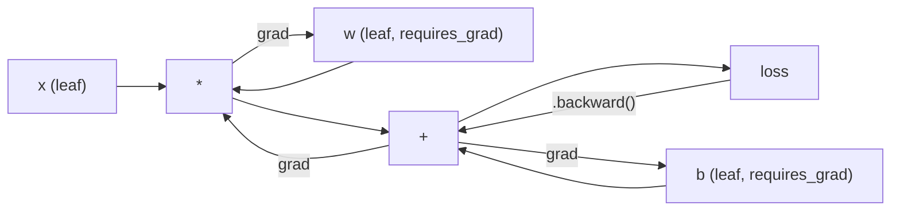
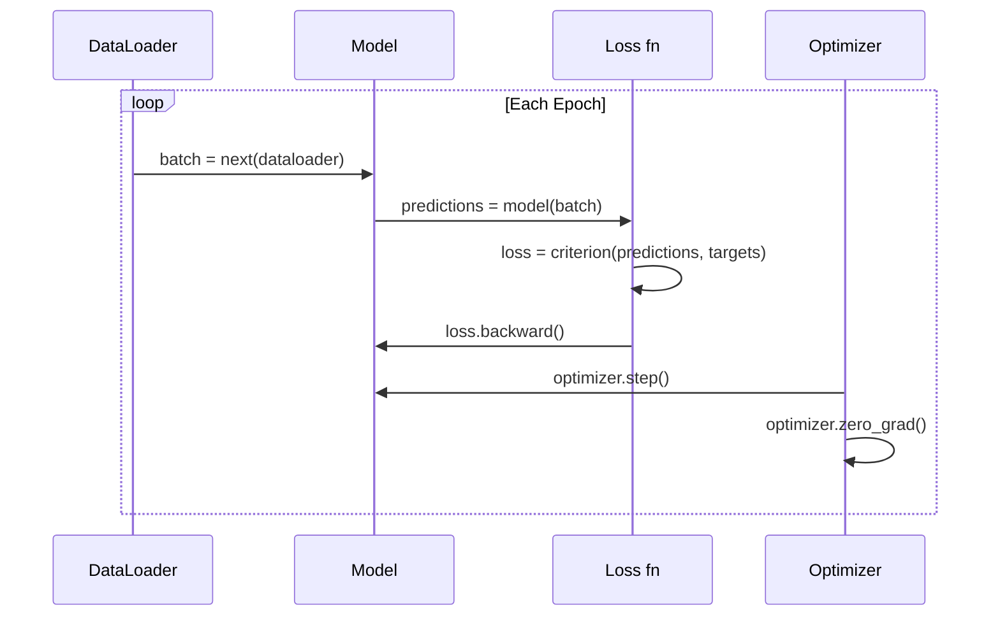

# مقدمة لـ (بيتورش)

> لقد صنعت المحرك من محركات الحامل والحركات الآن تعلم ما يقوده الجميع

> **【中文解读】**أنت من الصفر بنيت جميع المكونات في شبكة العصبية.

**Type:** Build
**Languages:** Python
**Prerequisites:** Lesson 03.10 (Build Your Own Mini Framework)
**Time:** ~75 minutes

## أهداف التعلم

- بناء وتدريب شبكات عصبية باستخدام PyTorch nn.Module، nn.Sequential، و autograd
- استخدموا مؤشرات PyTorch، وتسارع GPU، ودورة التدريب القياسية (zero_grad، للأمام، الخسارة، الخلف، الخطوة)
- حول مكونات الإطار الصغرى من الصفر إلى ما يعادلها بـ PyTorch
- الملف الشخصي ومقارنة سرعة التدريب بين إطار Python Pure- و PyTorch على نفس المهمة

> **【中文解读】**本章从迷你框架过渡到 PyTorch──核心对应关系:Module → nn.Module、手写倒退() → autograd、Python 循环 → GPU 并行──你已经在第十课 已理解底层原理,现在学习工业级实现──

## المشكلة المشكلة المشكلة

لديك إطار عمل صغير. طبقات خطية، ريلو، التخلي عن، معيار المجموعة، آدم، جهاز تحميل بيانات، حلقة تدريب. إنه تدرب شبكة 4 طبقات على مشكلة تصنيف الدائرة في بيثون النقي.

> لديك إطار صغير متاح. خطي الطبقة. ريلو.دروبوت.قطعة التجميع. آدم.داتا لودر.دورة التدريب.

كما أنه بطيء 500x من PyTorch في نفس المشكلة.

> لكنّه يتباطأ 500 مرة على نفس المشكلة

يقوم PyTorch بإرسال نفس العمليات إلى أجزاء C ++ / CUDA المثلى التي تعمل على GPU. على NVIDIA A100 واحدة، يقوم PyTorch بتدريب ResNet-50 (25.6M ملامي الحدود) على ImageNet (1.28M الصور) في حوالي 6 ساعات. سيستغرق إطارك حوالي 3000 ساعة على نفس المهمة - إذا لم ينفذ من الذاكرة أولاً.

> ستقوم PyTorch بتوزيع نفس العملية إلى تحسين تشغيل GPU على أجهزة NVIDIA A100، وPyTorch على ImageNet(128 مليون صورة) على تدريب ResNet-50(2560 مليون عنصر) يحتاج حوالي 6 ساعات.

السرعة ليست الفجوة الوحيدة. لا يوجد دعم لـ GPU في إطار العمل الخاص بك. لا يوجد تمييز تلقائي -- كتبت يدوياً للخلف) لكل وحدات. لا توجد سلسلة. لا تدريب منتشر. لا توجد دقة مختلطة. لا توجد طريقة لإلغاء التدفق التدريجي دون بيانات الطباعة.

> 速度 ليس الفرق الوحيد. 您的框架没有GPU 支持. 没有自动微分你为每块块手写回后面. 没有序列化. 没有分布式训练. 没有混合精度. 没有不用打印 语句就能调试梯度流的方法.

تقوم PyTorch بملء كل هذه الفجوات. وهي تفعل ذلك مع الحفاظ على نفس النموذج العقلي بالضبط الذي قمت بإنشائه بالفعل: الوحدة ، للأمام ((() ، المعلمات ((() ، والعودة ((() ، والتحسين. الخطوة ((().

> تمتد بيتورش جميع هذه الفجوات. كما أنها تحتفظ بنفس النموذج الذكري تماماً الذي قمت ببناءه: الوحدة، والقدوم، والمعايير، والعودة، والتحسين، والخطوة، والحرف، والفكرة، والحرف، والفكرة، والفكرة، والفكرة، والفكرة، والفكرة، والفكرة، والفكرة، والفكرة، والفكرة، والفكرة، والفكرة، والفكرة، والفكرة، والفكرة، والفكرة، والفكرة، والفكرة، والفكرة، والفكرة، والفكرة، والفكرة، والفكرة، والفكرة، والفكرة، والفكرة، والفكرة، والفكرة، والفكرة، والفكرة، والفكرة، والفكرة، والفكرة، والفكرة، والفكرة، والفكرة، والفكرة، والفكرة، والفكرة، والفكرة، والفكرة، والفكرة، والفكرة، والفكرة، والفكرة، والفكرة، والفكرة، والفكرة، والفكرة، والفكرة، والفكرة، والفكرة، والفكرة، والفكرة، والفكرة، والفكرة.

> **【中文解读】**تعالج قاعدة البيانات الخاصة بك أكثر من Python 500 مرة 慢  لأن Python 循环逐个处理样本,而 PyTorch باستخدام C ++ / CUDA 内核并行处理──A100 上训练ResNet-50只需6小时,你的框架需要3000小时──但两者的心智模型完全一致:模块、前进、后退、优化器.步骤()──

> **【拓展：PyTorch 为什么赢了 TensorFlow】**في عام 2017 ، تم إصدار PyTorch ، تمثل TensorFlow  80% من حصة السوق. ولكن تنفيذ PyTorch بحماسة (((في الحال) جعل التجربة والنموذج الأصلي تطوير أبعد من TF 1.x 简单图.

## المفهوم الأساسي

## المفهوم الأساسي

### لماذا فاز (بيتورش) لماذا فاز (بيتورش)

في عام 2015، طلب من TensorFlow تعريف الرسم البياني للحوسبة الدولية قبل تشغيل أي شيء. قمت ببناء الرسم البياني، ووضعها، ثم إرسال البيانات من خلالها. إعادة التشغيل يعني النظر في تصاميم الرسم البياني. تغيير الهندسة المعمارية يعني إعادة بناء الرسم البياني من الصفر.

> في عام 2015، تطلب TensorFlow  أن تحدد أي شيء قبل أن تعمل رسمًا محليًا.

بدأت PyTorch في عام 2017 مع فلسفة مختلفة: تنفيذ حريص. يمكنك كتابة Python.`y = model(x)`في الواقع يحسب y الآن، وليس "إضافة عقدة إلى الرسم البياني الذي سوف يحسب y في وقت لاحق". هذا يعني أدوات التحليل القياسية Python عملت. طباعة() عملت. pdb عملت. إذا /else في مرورك المقدمة عملت.

> في عام 2017 ، اعتمد PyTorch فلسفة مختلفة:即时执行──你写 Python──它立即运行──`y = model(x)`现在就计算 y,而不是"اضافة a稍后计算 y 的节点到图中"──这意味着标准的Python调试工具可用──打印() 可用──pdb可用──前进通过 中的如果/else可用──

بحلول عام 2020 ، كان السوق قد تحدثت. ارتفع حصة PyTorch في ورق بحث ML من 7% (2017) إلى أكثر من 75% (2022). تستخدم Meta ، Google DeepMind ، OpenAI ، Anthropic ، و Hugging Face جميعًا PyTorch كإطار أساسي. تبنت TensorFlow 2.x تنفيذًا حريصًا رداً على ذلك - الاعتراف الصامت بأن تصميم PyTorch كان صحيحًا.

> بحلول عام 2020، أعطى السوق الإجابة. • ارتفع حصة بيتورش في مقالات دراسة ML من 7% 2017 إلى أكثر من 75% 2022) • ميتا  جوجل ديبميند OpenAI  الأنثروبات و  Hugging Face  سوف بيتورش  كإطار رئيسي‬  تينسر فلو 2.x  كإجابة تمت تطبيق فورية  إدراك افتراضي أن تصميم بيتورش صحيح‬

الدرس: تجربة المطورين المركبات إطار عمل بطيء بنسبة 10% ولكن أسرع بنسبة 50% لإزالة التشويق يفوز كل مرة

> التعليم: المطورين تجربة سوف تجمع. 10% بطيئة ولكن إطار التجربة 50% بطيئة في كل مرة سوف تفوز.

### ضغطات 张量

الجهاز هو مجموعة متعددة الأبعاد مع ثلاثة خصائص حاسمة: الشكل، dtype، والجهاز.

> 张量是具有三个关键属性多维数组:形状、数据类型和设备──

```python
import torch

x = torch.zeros(3, 4)           # shape: (3, 4), dtype: float32, device: cpu
x = torch.randn(2, 3, 224, 224) # batch of 2 RGB images, 224x224
x = torch.tensor([1, 2, 3])     # from a Python list
```

**Shape**هو الامتعداد. وهو شكل (), وكتور هو (n,), ماتريكس هو (m, n), مجموعة من الصور هي (مجموعة, قنوات, ارتفاع, عرض).

> **Shape**هو حجم المعلومات. شكلها هو (), يمثل (n,),矩阵 هو (m, n),一批图像是 (بارتش, قنوات, ارتفاع, عرض)

**Dtype**يسيطر على الدقة والذاكرة

> **Dtype**التحكم في الوقائع والذاكرة

| dtype | Bits | Range | Use case |
|-------|------|-------|----------|
| float32 | 32 | ~7 decimal digits | Default training |
| float16 | 16 | ~3.3 decimal digits | Mixed precision |
| bfloat16 | 16 | Same range as float32, less precision | LLM training |
| int8 | 8 | -128 to 127 | Quantized inference |

**Device**يحدد أين يحدث الحساب.

> **Device**قرر حساب ما يحدث

```python
device = torch.device("cuda" if torch.cuda.is_available() else "cpu")
x = torch.randn(3, 4, device=device)
x = x.to("cuda")
x = x.cpu()
```

كل عملية تتطلب جميع الجهاز التنسورية نفسها. هذا هو الخطأ رقم 1 PyTorch المبتدئين ضرب: `RuntimeError: Expected all tensors to be on the same device`إصلاحها عن طريق نقل كل شيء إلى نفس الجهاز قبل الحساب.

> كل عملية تتطلب كل الكمية على نفس الجهاز. هذا أول خطأ كبير يواجهه المبتدئين.`RuntimeError: Expected all tensors to be on the same device` في الحسابات السابقة سيتم نقل كل المحتوى إلى نفس الجهاز

**Reshaping**هو الوقت المستمر -- يغير البيانات المعدنية، وليس البيانات.

> **重塑**هو عملية الوقت المعتاد  تغير البيانات، لا تغير البيانات‬

```python
x = torch.randn(2, 3, 4)
x.view(2, 12)      # reshape to (2, 12) -- must be contiguous
x.reshape(6, 4)    # reshape to (6, 4) -- works always
x.permute(2, 0, 1) # reorder dimensions
x.unsqueeze(0)     # add dimension: (1, 2, 3, 4)
x.squeeze()        # remove size-1 dimensions
```

### (أوتوغراد)

يتطلب منك إطار العمل الصغير تنفيذها للخلف (() لكل وحدات. لا يفعل PyTorch. يسجل كل عملية على العجلات في رسومة محمولة موجهة (الرسمة الحاسبية) ثم يمر عبر هذا الرسمة العكسي لحساب تراجعات تلقائيا.

> يطلب منك إطار迷你 لتحقيق كل وحدة للخلف. (((PyTorch لا تحتاج.



الفرق الرئيسي من إطارك: PyTorch يستخدم التشغيل الذاتي القائم على الشريط. كل عملية ترتبط بـ "الشريط" خلال المرور الأمامي. الاتصال `.backward()`يُعيد التسجيل في العكس

> مع الإطار الخاص بك الفرق الرئيسي:PyTorch استخدام مقناطيس على أساس التفاصيل الذاتية.`.backward()`عكس إعادة إرسال المغناطيس

```python
x = torch.randn(3, requires_grad=True)
y = x ** 2 + 3 * x
z = y.sum()
z.backward()
print(x.grad)  # dz/dx = 2x + 3
```

ثلاثة قواعد للدراسة الذاتية:

> أوتوجراد 的三条规则:

1. فقط الـ " الـ " الـ " الـ " الـ " الـ " الـ " الـ " الـ " الـ " الـ " الـ " الـ " الـ " الـ " الـ " الـ " الـ " الـ " الـ " الـ " الـ " الـ " الـ " الـ " الـ " الـ " الـ " الـ " الـ " الـ " الـ " الـ " الـ " الـ " الـ " الـ " الـ " الـ " الـ " الـ " الـ " الـ " الـ " الـ " الـ " الـ " الـ " الـ " الـ " الـ " الـ " الـ " الـ " الـ " الـ " الـ " الـ " الـ " الـ " الـ " الـ " الـ " الـ " الـ " الـ " الـ " الـ " الـ " الـ " الـ " " الـ " " " " الـ " " " " " " " " " " " " " " " " " " " " " " " " " " " " " " " " " " " " " " " " " " " " " " " " " " " " " " " " " " " " " " " " " " " " " " " " " " " " " " " " " " " " " " " " " " " " " " " " " " " " " " " " " " " " " " " " " " " " " " " " " " " " " " " " " " " " " " " " " " " " " " " " " " " " " " " " " " " " " " " " " " " " " " " " " " " " " " " " " " " " " " " " " " " " " " " " " " " " " " " " " " " " " " " " " " " " " " " " " " " " " " " " " " " " " " " " " " " " " " " " " " " " " " " " " " " " " " " " " " " " " " " " " " " " " " " " " " " " " " " " " " " " " " "`requires_grad=True`تراكم التدرج
   中文翻译: فقط تم إعدادها`requires_grad=True`يُمكن أن يُكتسبُ التعدّد
2. الدرجات تتراكم بطبيعة الحال -- دعوة `optimizer.zero_grad()`قبل كل مرور خلفي
   中文翻译:梯度默认累积每次反向传播前调用 `optimizer.zero_grad()`
3. `torch.no_grad()`تعطيل تتبع التراجع (استخدام أثناء التقييم)
   中文翻译:`torch.no_grad()`禁用梯度追踪 (تتبع درجة التقييم)

> **【拓展：混合精度训练如何加速】**A100/H100 吞吐量是 float32  2-4 倍──PyTorch `torch.amp.autocast`تلقائيًا تحويل الموجة إلى المياه العائمة 16 ، في حين الحفاظ على التنقل اللطيف والخسارة في المياه العائمة 32。 معالجة GradScaler  منع المياه العائمة 16 梯度下溢。 تدريب كامل للاما 3 باستخدام المياه العائمة 16 混合精度، ووفق حوالي 50% من الحفاظ على الاحتفاظ والحساب。

### .مودول العصبية

`nn.Module`هي الصف الأساسي لكل مكون للشبكة العصبية في PyTorch. لقد بنيت هذا التجريد بالفعل في الدروس 10. إصدار PyTorch يضيف تسجيل المعلمات تلقائي، اكتشاف الوحدة التجاعدية، إدارة الجهاز، وتسلسل الحالة.

> `nn.Module`هو فئة أساسية لكل جزء من شبكة العصب في PyTorch. لقد بنيت هذا الاختبار في الصف العاشر. إصدار PyTorch زاد تسجيل العناصر الذاتية وتسجيل الوصول إلى الاختبار، وإدارة الأجهزة، وتسلسل الدولة.

```python
import torch.nn as nn

class MLP(nn.Module):
    def __init__(self, input_dim, hidden_dim, output_dim):
        super().__init__()
        self.layer1 = nn.Linear(input_dim, hidden_dim)
        self.relu = nn.ReLU()
        self.layer2 = nn.Linear(hidden_dim, output_dim)

    def forward(self, x):
        x = self.layer1(x)
        x = self.relu(x)
        x = self.layer2(x)
        return x
```

عندما تعين`nn.Module`أو`nn.Parameter`كصفت في `__init__`"بيتورش" تسجلها تلقائياً`model.parameters()`هذا هو السبب في أنك لا تحتاج أبدا إلى جمع الوزن يدويا كما فعلت في الإطار الصغير.

> عندما كنت`__init__`中将 `nn.Module`أو`nn.Parameter`عندما تم إعطائها قيمة خاصية، "بيتورش" تقوم بتسجيلها`model.parameters()`‬ ‫إعادة جمع كل إشارة‬ ‫هذا هو السبب في أنك لن تحتاج إلى جمع الوزن باليد مثلما هو في الإطار الصغير‬‬‬‬‬‬‬‬‬‬‬‬‬‬‬‬‬‬‬‬‬‬‬‬‬‬‬‬‬‬‬‬‬‬‬‬‬‬‬‬‬‬‬‬‬‬‬‬‬‬‬‬‬‬‬‬‬‬‬‬‬‬‬‬‬‬‬‬‬‬‬‬‬‬‬‬‬‬‬‬‬‬‬‬‬‬‬‬‬‬‬‬‬‬‬‬‬‬‬‬‬‬‬‬‬‬‬‬‬‬‬‬‬‬‬‬‬‬‬‬‬‬‬‬‬‬‬‬‬‬‬‬‬‬‬‬‬‬‬‬‬‬‬‬‬‬‬‬‬‬‬‬‬‬‬‬‬‬‬‬‬‬‬‬‬‬‬‬‬‬‬‬‬‬‬‬‬‬‬‬‬‬‬‬‬‬‬‬‬‬‬‬‬‬‬‬‬‬‬‬‬‬‬‬‬‬‬‬‬‬‬‬‬‬‬‬‬‬‬‬‬‬‬‬‬‬‬‬‬‬‬‬‬‬‬‬‬‬‬‬‬‬‬‬‬‬‬‬‬‬‬‬‬‬‬‬‬‬‬‬‬‬‬‬‬‬‬‬‬‬‬‬‬‬‬‬‬‬‬‬‬‬‬‬‬‬‬‬‬‬‬‬‬‬‬‬‬‬‬‬‬‬‬‬‬‬‬‬‬‬‬‬‬‬‬‬‬‬‬‬‬‬‬‬‬‬‬‬‬‬‬‬‬‬‬‬‬‬‬‬‬‬‬‬‬‬‬‬‬‬‬‬‬‬‬‬‬‬‬‬‬‬‬‬‬‬‬‬‬‬‬‬‬‬‬‬‬‬‬‬‬‬‬‬‬‬‬‬‬‬‬‬‬‬‬‬‬‬‬‬‬‬‬‬‬‬‬‬‬‬‬‬‬‬‬‬‬‬‬‬‬‬‬‬‬‬‬‬‬‬‬‬‬‬‬‬‬‬‬‬‬‬‬‬‬‬‬‬‬‬‬‬‬‬‬‬‬‬‬‬‬‬‬‬‬‬‬‬‬‬‬‬‬‬‬‬‬

أساسيات البناء:

> 关键构建块:

| Module | What it does | Parameters |
|--------|-------------|------------|
| nn.Linear(in, out) | Wx + b | in*out + out |
| nn.Conv2d(in_ch, out_ch, k) | 2D convolution | in_ch*out_ch*k*k + out_ch |
| nn.BatchNorm1d(features) | Normalize activations | 2 * features |
| nn.Dropout(p) | Random zeroing | 0 |
| nn.ReLU() | max(0, x) | 0 |
| nn.GELU() | Gaussian error linear | 0 |
| nn.Embedding(vocab, dim) | Lookup table | vocab * dim |
| nn.LayerNorm(dim) | Per-sample normalization | 2 * dim |

### فقدان الوظائف والمحفزات

(بايتورش) تسلم نسخ جاهزة للإنتاج من كل ما بنيته

> بيتورش تقدم نسخة إنتاجية من كل المهام التي تقوم ببناءها

**Loss functions**(من`torch.nn`):

> **损失函数**(من`torch.nn`):

| Loss | Task | Input |
|------|------|-------|
| nn.MSELoss() | Regression | Any shape |
| nn.CrossEntropyLoss() | Multi-class classification | Logits (not softmax) |
| nn.BCEWithLogitsLoss() | Binary classification | Logits (not sigmoid) |
| nn.L1Loss() | Regression (robust) | Any shape |
| nn.CTCLoss() | Sequence alignment | Log probabilities |

ملاحظة:`CrossEntropyLoss`يجمع`LogSoftmax`+ `NLLLoss`إضافة المواد الخام، وليس المخرجات المضمونة. هذا خطأ شائع ينتج التراجع الخاطئ بصمت.

> انتباه:`CrossEntropyLoss`内部组合了 `LogSoftmax`+ `NLLLoss` إدخال اللوجات الأصلية، لا تنقل softmax 输出── هذا خطأ شائع، سوف يصبح صامتًا في تدرج الخطأ

**Optimizers**(من`torch.optim`):

> **优化器**(من`torch.optim`):

| Optimizer | When to use | Typical LR |
|-----------|-------------|-----------|
| SGD(params, lr, momentum) | CNNs, well-tuned pipelines | 0.01--0.1 |
| Adam(params, lr) | Default starting point | 1e-3 |
| AdamW(params, lr, weight_decay) | Transformers, fine-tuning | 1e-4--1e-3 |
| LBFGS(params) | Small-scale, second-order | 1.0 |

### دورة التدريب

كل حلقة تدريبية من PyTorch تتبع نفس النمط الخمس خطوات.

> كل دورة تدريب بيتورش تتبع نفس النمط الخمس خطوات.



النمط القنوني:

> 标准模式:

```python
for epoch in range(num_epochs):
    model.train()
    for inputs, targets in train_loader:
        inputs, targets = inputs.to(device), targets.to(device)
        optimizer.zero_grad()
        outputs = model(inputs)
        loss = criterion(outputs, targets)
        loss.backward()
        optimizer.step()
```

خمسة خطوط داخل حلقة اللحظة، خمسة خطوط تدرب GPT-4، Diffusion مستقر، و LLaMA. الهندسة المعمارية تتغير. البيانات تتغير. هذه الخطوط الخمسة لا.

> 批量循环内五行代码──训练了GPT-4、稳定扩散和LLaMA的五行代码──架构会变化──数据会变化──这五行不变──

### مجموعة بيانات و DataLoader و محرك تحميل البيانات

(بيتورش)`Dataset`هو فئة تجريدية مع طريقتين: `__len__`و`__getitem__`. .`DataLoader`يلفها مع إعادة التجميع، التدفق، وتحميل البيانات متعددة العمليات.

> بيتورش `Dataset`إنه نوع من الاختبارات، هناك طريقتان:`__len__`和 `__getitem__`.`DataLoader`مع معالجة الجملة والتعبئة والعمليات المتعددة

```python
from torch.utils.data import Dataset, DataLoader

class MNISTDataset(Dataset):
    def __init__(self, images, labels):
        self.images = images
        self.labels = labels

    def __len__(self):
        return len(self.labels)

    def __getitem__(self, idx):
        return self.images[idx], self.labels[idx]

loader = DataLoader(dataset, batch_size=64, shuffle=True, num_workers=4)
```

`num_workers=4`يخلق 4 عمليات لحمل البيانات بالتوازي بينما تتدرب GPU على الحزمة الحالية. على أحمال عمل مرتبطة بالقرص (الصور الكبيرة، الصوت) ، وهذا وحده يمكن أن تضاعف سرعة التدريب.

> `num_workers=4`تُنتج 4 عمليات ومسيرات تحميل البيانات، في حين أن GPU في الحزمة الحالية على التدريب.

### تدريبات الجيبو

نقل النموذج إلى GPU:

> سوف نقلها إلى GPU:

```python
device = torch.device("cuda" if torch.cuda.is_available() else "cpu")
model = model.to(device)
```

هذا يتحرك بشكل متكرر كل معايير ومضخة إلى جهاز التلفزيون. ثم يحرك كل دفعة أثناء التدريب:

> هذه المرحلة ستقوم بتحويل كل عنصر ومحيط التخفيف إلى GPU. ثم تتحرك كل مجموعة خلال التدريب:

```python
inputs, targets = inputs.to(device), targets.to(device)
```

**Mixed precision**يقلل من نصف استخدام الذاكرة ويضاعف من خلالها النمو على أجهزة المعالجة المعالجة المعالجة المعالجة الحديثة (A100، H100، RTX 4090) عن طريق التشغيل للأمام/الظهر في float16 مع الحفاظ على الأوزان الرئيسية في float32:

> **混合精度**通過在 float16 中运行前向/反向传播,同时保持主权重在 float32,在现代 GPU(A100、H100、RTX 4090) 上将内存使用减半,吞吐量翻倍:

```python
from torch.amp import autocast, GradScaler

scaler = GradScaler()
for inputs, targets in loader:
    with autocast(device_type="cuda"):
        outputs = model(inputs)
        loss = criterion(outputs, targets)
    scaler.scale(loss).backward()
    scaler.step(optimizer)
    scaler.update()
    optimizer.zero_grad()
```

### مقارنة: Mini Framework vs PyTorch vs JAX

| Feature | Mini Framework (L10) | PyTorch | JAX |
|---------|---------------------|---------|-----|
| Autodiff | Manual backward() | Tape-based autograd | Functional transforms |
| Execution | Eager (Python loops) | Eager (C++ kernels) | Traced + JIT compiled |
| GPU support | No | Yes (CUDA, ROCm, MPS) | Yes (CUDA, TPU) |
| Speed (MNIST MLP) | ~300s/epoch | ~0.5s/epoch | ~0.3s/epoch |
| Module system | Custom Module class | nn.Module | Stateless functions (Flax/Equinox) |
| Debugging | print() | print(), pdb, breakpoint() | Harder (JIT tracing breaks print) |
| Ecosystem | None | Hugging Face, Lightning, timm | Flax, Optax, Orbax |
| Learning curve | You built it | Moderate | Steep (functional paradigm) |
| Production use | Toy problems | Meta, OpenAI, Anthropic, HF | Google DeepMind, Midjourney |

## بناء ذلك تحرك لتحقيق

> **【中文解读】**下面用纯 PyTorch 训练一个3层 MLP做MNIST 手写数字分类(784→256→128→10) ――参数只有 235K,但训练模式和大模型完全一致:DataLoader → model.train() → zero_grad → forward → loss → backward → step → model.eval()。10 个时代 达到 ~97.8% 测试准确率──
```figure
dropout-mask
```

## بناءها

(ميلف) ثلاث طبقات تدرب على (منست) باستخدام (بيتورش) البدائية فقط، لا يوجد غلفات عالية المستوى`torchvision.datasets`نحن ننزل ونحلل البيانات الخام بأنفسنا

> استخدام خالص PyTorch ابتدائية لغة تدريب 3 مستويات MLP القيام MNIST 分类── بدون تغطية عالية── بدون `torchvision.datasets`نحن ننزل و نحلل البيانات الأصلية

### الخطوة الأولى: تحميل MNIST من الملفات الخام

تم إرسال MNIST إلى البيانات بأربعة ملفات: صور التدريب (60,000 × 28 × 28) ، وملفات التدريب، وملفات الاختبار (10,000 × 28 × 28) ، وملفات الاختبار. ننزلها ونحلل النموذج الثنائي.

> MNIST 以 4 个 gzip 文件提供: تدريب图像(60,000 x 28 x 28) ✓ تدريب标签、测试图像(10,000 x 28 x 28) ✓测试标签──我们下载它们并解析二进制格式──

```python
import torch
import torch.nn as nn
import struct
import gzip
import urllib.request
import os

def download_mnist(path="./mnist_data"):
    base_url = "https://storage.googleapis.com/cvdf-datasets/mnist/"
    files = [
        "train-images-idx3-ubyte.gz",
        "train-labels-idx1-ubyte.gz",
        "t10k-images-idx3-ubyte.gz",
        "t10k-labels-idx1-ubyte.gz",
    ]
    os.makedirs(path, exist_ok=True)
    for f in files:
        filepath = os.path.join(path, f)
        if not os.path.exists(filepath):
            urllib.request.urlretrieve(base_url + f, filepath)

def load_images(filepath):
    with gzip.open(filepath, "rb") as f:
        magic, num, rows, cols = struct.unpack(">IIII", f.read(16))
        data = f.read()
        images = torch.frombuffer(bytearray(data), dtype=torch.uint8)
        images = images.reshape(num, rows * cols).float() / 255.0
    return images

def load_labels(filepath):
    with gzip.open(filepath, "rb") as f:
        magic, num = struct.unpack(">II", f.read(8))
        data = f.read()
        labels = torch.frombuffer(bytearray(data), dtype=torch.uint8).long()
    return labels
```

### الخطوة الثانية: تعريف النموذج الخطوة الثانية: تعريف النموذج

3-طبقة MLP: 784 -> 256 -> 128 -> 10. تنشيط ReLU. التخلي عن التنظيم. لا يوجد معيار لتحقيق البطولة.

> واحد 3 طبقات MLP:784 -> 256 -> 128 -> 10。ReLU 激活──Dropout 正则化──为简单起见不用BatchNorm──

```python
class MNISTModel(nn.Module):
    def __init__(self):
        super().__init__()
        self.net = nn.Sequential(
            nn.Linear(784, 256),
            nn.ReLU(),
            nn.Dropout(0.2),
            nn.Linear(256, 128),
            nn.ReLU(),
            nn.Dropout(0.2),
            nn.Linear(128, 10),
        )

    def forward(self, x):
        return self.net(x)
```

الطبقة الخارجة تنتج 10 logits خام (واحد لكل رقم). لا softmax -- `CrossEntropyLoss`يتعامل مع ذلك داخلياً

> 输出层产生 10 个原始logits(每个数字一个) ――不需要软max`CrossEntropyLoss`المعالجة الداخلية

عدد المعايير: 784*256 + 256 + 256*128 + 128 + 128*10 + 10 = 235,146. صغير بمعايير حديثة. GPT-2 صغير لديه 124M. هذا القطار في ثوان.

> 参数:784*256 + 256 + 256*128 + 128 + 128*10 + 10 = 235,146。 طبقا للمعايير الحديثة جداً صغيرة。 GPT-2 صغيرة هناك 124M。 هذا في بضع ثوانٍ على قدرت التدريب على الانتهاء。

### الخطوة الثالثة: دورة التدريب

النمط القنوني للأمام-الخسارة-الخطوات الخلفية.

> 標準的前-损失-后步模式

```python
def train_one_epoch(model, loader, criterion, optimizer, device):
    model.train()
    total_loss = 0
    correct = 0
    total = 0
    for images, labels in loader:
        images, labels = images.to(device), labels.to(device)
        optimizer.zero_grad()
        outputs = model(images)
        loss = criterion(outputs, labels)
        loss.backward()
        optimizer.step()
        total_loss += loss.item() * images.size(0)
        _, predicted = outputs.max(1)
        correct += predicted.eq(labels).sum().item()
        total += labels.size(0)
    return total_loss / total, correct / total


def evaluate(model, loader, criterion, device):
    model.eval()
    total_loss = 0
    correct = 0
    total = 0
    with torch.no_grad():
        for images, labels in loader:
            images, labels = images.to(device), labels.to(device)
            outputs = model(images)
            loss = criterion(outputs, labels)
            total_loss += loss.item() * images.size(0)
            _, predicted = outputs.max(1)
            correct += predicted.eq(labels).sum().item()
            total += labels.size(0)
    return total_loss / total, correct / total
```

ملاحظة`torch.no_grad()`هذا يعطى التحرر الذاتي، مما يقلل من استهلاك الذاكرة ويتسارع استنتاج. بدون ذلك، يقوم PyTorch ببناء الرسم البياني الحاسوبي الذي لا تستخدمه.

> انتباه للتقييم`torch.no_grad()`إنه يمنع التطوير الذاتي، يقلل من استخدام الـ"内存" و يسرع التفكير.إنه لا يوجد، سوف يقوم بـ"PyTorch"بناء مخططات الحساب التي لن تستخدمها أبدا.

### الخطوة الرابعة: قم بتجميع كل شيء معاً

```python
def main():
    device = torch.device("cuda" if torch.cuda.is_available() else "cpu")

    download_mnist()
    train_images = load_images("./mnist_data/train-images-idx3-ubyte.gz")
    train_labels = load_labels("./mnist_data/train-labels-idx1-ubyte.gz")
    test_images = load_images("./mnist_data/t10k-images-idx3-ubyte.gz")
    test_labels = load_labels("./mnist_data/t10k-labels-idx1-ubyte.gz")

    train_dataset = torch.utils.data.TensorDataset(train_images, train_labels)
    test_dataset = torch.utils.data.TensorDataset(test_images, test_labels)
    train_loader = torch.utils.data.DataLoader(
        train_dataset, batch_size=64, shuffle=True
    )
    test_loader = torch.utils.data.DataLoader(
        test_dataset, batch_size=256, shuffle=False
    )

    model = MNISTModel().to(device)
    criterion = nn.CrossEntropyLoss()
    optimizer = torch.optim.Adam(model.parameters(), lr=1e-3)

    num_params = sum(p.numel() for p in model.parameters())
    print(f"Device: {device}")
    print(f"Parameters: {num_params:,}")
    print(f"Train samples: {len(train_dataset):,}")
    print(f"Test samples: {len(test_dataset):,}")
    print()

    for epoch in range(10):
        train_loss, train_acc = train_one_epoch(
            model, train_loader, criterion, optimizer, device
        )
        test_loss, test_acc = evaluate(
            model, test_loader, criterion, device
        )
        print(
            f"Epoch {epoch+1:2d} | "
            f"Train Loss: {train_loss:.4f} | Train Acc: {train_acc:.4f} | "
            f"Test Loss: {test_loss:.4f} | Test Acc: {test_acc:.4f}"
        )

    torch.save(model.state_dict(), "mnist_mlp.pt")
    print(f"\nModel saved to mnist_mlp.pt")
    print(f"Final test accuracy: {test_acc:.4f}")
```

الناتج المتوقع بعد 10 فترات: ~ 97.8٪ دقة الاختبار. وقت التدريب على المعالجة المركزية: ~ 30 ثانية. على GPU: ~ 5 ثانية. على الإطار الصغير مع نفس الهندسة المعمارية: ~ 45 دقيقة.

> 10 个时代 后预期输出:~97.8% 测试准确率──CPU 训练时间:~30 秒──GPU:~5 秒──用迷你框架相同架构:~45 分钟──

> **【拓展：从 MNIST 到大模型】**إنّه يُمكن أن يُمكن أن يُمكن أن يُمكن أن يُمكن أن يُمكن أن يُمكن أن يُمكن أن يُمكن أن يُمكن أن يُمكن أن يُمكن أن يُمكن أن يُمكن أن يُمكن أن يُمكن أن يُمكن أن يُمكن أن يُمكن أن يُمكن أن يُمكن أن يُمكن أن يُمكن أن يُمكن أن يُمكن أن يُمكن أن يُمكن أن يُمكن أن يُمكن أن يُمكن أن يُمكن أن يُمكن أن يُمكن أن يُمكن أن يُمكن أن يُمكن أن يُمكن أن يُمكن أن يُمكن أن يُمكن أن يُمكن أن يُمكن أن يُمكن أن يُمكن أن يُمكن أن يُمكن أن يُمكن أن يُمكن أن يُمكن أن يُمكن أن يُمكن أن يُمكن أن يُمكن أن يُمكن أن يُمكن أن يُمكن أن يُمكن أن يُمكن أن يُمكن أن يُمكن أن يُمكن أن يُمكن أن يُمكن أن يُحَقَقَلَّلَ النظام.

## استخدمها في إطار التنفيذ

> **【中文解读】**迷你框架和 PyTorch 的接口几乎一致──关键区别:PyTorch 用自动微分(不需要手写倒退((、支持GPU(model.to("cuda")) 、支持混合精度训练──保存模型用 state_dict((可移植的参数典),不要直接化 模型对象──

### مقارنة سريعة: Mini Framework مقابل PyTorch  快速对比:迷你框架 مقابل PyTorch

| Mini Framework (Lesson 10) | PyTorch |
|---------------------------|---------|
| `model = Sequential(Linear(784, 256), ReLU(), ...)` | `model = nn.Sequential(nn.Linear(784, 256), nn.ReLU(), ...)` |
| `pred = model.forward(x)` | `pred = model(x)` |
| `optimizer.zero_grad()` | `optimizer.zero_grad()` |
| `grad = criterion.backward()` then `model.backward(grad)` | `loss.backward()` |
| `optimizer.step()` | `optimizer.step()` |
| No GPU | `model.to("cuda")` |
| Manual backward for every module | Autograd handles everything |

المقابلة متطابقة تقريباً، الفرق هو كل شيء تحت الغطاء

> المواصلات متشابهة تقريباً.

### حفظ وتحميل النماذج

```python
torch.save(model.state_dict(), "model.pt")

model = MNISTModel()
model.load_state_dict(torch.load("model.pt", weights_only=True))
model.eval()
```

دائماً أنقذ`state_dict()`(قامة المعلمات) ، وليس كائن النموذج. حفظ كائن النموذج يستخدم البرتقال، الذي يكسر عندما تقوم بتعديل الرمز.

> 始终保存 `state_dict()`(参数字典), بدلا من模型对象──保存模型对象使用,重构代码时会破坏──国家命令是可移植的──

### تعدد معدلات التعلم

```python
scheduler = torch.optim.lr_scheduler.CosineAnnealingLR(
    optimizer, T_max=10
)
for epoch in range(10):
    train_one_epoch(model, train_loader, criterion, optimizer, device)
    scheduler.step()
```

تقوم بيتورش بنقل 15 خطة: StepLR، ExponentialLR، CosineAnnealingLR، OneCycleLR، ReduceLROnPlateau. جميعها متصلة بنفس واجهة التحسين.

> بيتورش قدم 15+ نوع من المعدات:StepLR、ExponentialLR、CosineAnnealingLR、OneCycleLR、ReduceLROnPlateau── كل شيء يضمن نفس المقاطع المعدة٬

## أرسلها .

هذا الدروس يُنتج اثنين من الأثاث:

> 本课产出两文件:

- `outputs/prompt-pytorch-debugger.md`-- تحذير لتشخيص فشل في تدريب PyTorch الشائع
  中文翻译:`outputs/prompt-pytorch-debugger.md`- 诊断常见 PyTorch 训练故障的提示词
- `outputs/skill-pytorch-patterns.md`-- مرجع مهارات لنمطات تدريب PyTorch
  中文翻译:`outputs/skill-pytorch-patterns.md`- PyTorch  تدريب موثرات مهارات

## تمارين التدريب

1. **Add batch normalization.**إدراج`nn.BatchNorm1d`بعد كل طبقة خطية (قبل التشغيل). مقارنة دقة الاختبار وسرعة التدريب مقابل النسخة التي يتم إطلاقها فقط. يجب أن يصل معايير الحزمة إلى 98% + في فترات أقل.

2. **Implement a learning rate finder.**تدريب لمدة فترة مع زيادة معدلية للتعلم بشكل متسارع (من 1e-7 إلى 1.0). خسارة المساحة مقابل LR. يكون LR الأمثل قبل أن تبدأ الخسارة في التسلق. استخدم هذا لتحديد LR أفضل لنموذج MNIST.

3. **Port to GPU with mixed precision.**إضافة`torch.amp.autocast`و`GradScaler`على حلقة التدريب. قياس التدفق (عينات/ثانية) مع ودون دقة مختلطة على GPU. على A100، توقع ~ 2x سرعة.

4. **Build a custom Dataset.**قم بتنزيل Fashion-MNIST (المثل في النموذج مثل MNIST ولكن مع أدوات الملابس). تنفيذ `FashionMNISTDataset(Dataset)`الفصل مع`__getitem__`و`__len__`. تدريب نفس MLP ومقارنة الدقة. الموضة-MNIST هو أصعب -- توقع ~ 88٪ مقابل ~ 98٪.

5. **Replace Adam with SGD + momentum.**القطار مع`SGD(params, lr=0.01, momentum=0.9)`. مقارنة منحنى التقارب. ثم أضف`CosineAnnealingLR`و نرى ما إذا كانت (إس جي دي) ستقبض على (آدم) بحلول العصر العاشر

## شروط الرئيسية

| Term | What people say | What it actually means |
|------|----------------|----------------------|
| Tensor | "A multi-dimensional array" | A typed, device-aware array with automatic differentiation support baked into every operation |
| Autograd | "Automatic backprop" | A tape-based system that records operations during forward pass, then replays them in reverse to compute exact gradients |
| nn.Module | "A layer" | The base class for any differentiable computation block -- registers parameters, supports nesting, handles train/eval modes |
| state_dict | "The model weights" | An OrderedDict mapping parameter names to tensors -- the portable, serializable representation of a trained model |
| .backward() | "Compute gradients" | Traverse the computational graph in reverse, computing and accumulating gradients for every leaf tensor with requires_grad=True |
| .to(device) | "Move to GPU" | Recursively transfer all parameters and buffers to the specified device (CPU, CUDA, MPS) |
| DataLoader | "The data pipeline" | An iterator that batches, shuffles, and optionally parallelizes data loading from a Dataset |
| Mixed precision | "Use float16" | Train with float16 forward/backward for speed while keeping float32 master weights for numerical stability |
| Eager execution | "Run it now" | Operations execute immediately when called, not deferred to a later compilation step -- the core design choice that differentiates PyTorch from TF 1.x |
| zero_grad | "Reset gradients" | Set all parameter gradients to zero before the next backward pass, since PyTorch accumulates gradients by default |

## المزيد من القراءة

- پاسكيه وآخرون، "بيتورش: أسلوب إمبراطي، مكتبة التعلم العميق عالي الأداء" (2019) -- الورقة الأصلية التي تشرح تعادلات تصميم بيتورش
  Paszke 等人,PyTorch:一种命令式风格的高性能深度学习库(2019)解释 PyTorch 设计权衡的原始论文
- دروس بيتورش: "تعلم بيتورش مع الأمثلة" (https://pytorch.org/tutorials/beginner/pytorch_with_examples.html) -- المسار الرسمي من الجهاز التنسوري إلى
  تعليم PyTorch: باستخدام المثال تعلم PyTorch من张量 إلى nn.Module
- دليل تحديد أداء PyTorch (https://pytorch.org/tutorials/recipes/recipes/tuning_guide.html) -- الدقة المختلطة، وموظفي DataLoader، والذاكرة المثبتة، وغيرها من التحسينات الإنتاجية
  بيتورش  أداء تحسينات التشغيل  خليط دقة  DataLoader  عمل عمل  قائمة الذاكرة والإصدارات الأخرى تحسينات
- (هوراس هيه) ، "جعل التعلم العميق يذهب إلى (برر) "https://horace.io/brrr_intro.html) -- لماذا تدريب GPU سريع، مع استراتيجيات التحسين الخاصة بـ PyTorch
  هورس هو، 让深度学习飞速运行为什么 GPU 训练快,以及 PyTorch 特定优化策略
